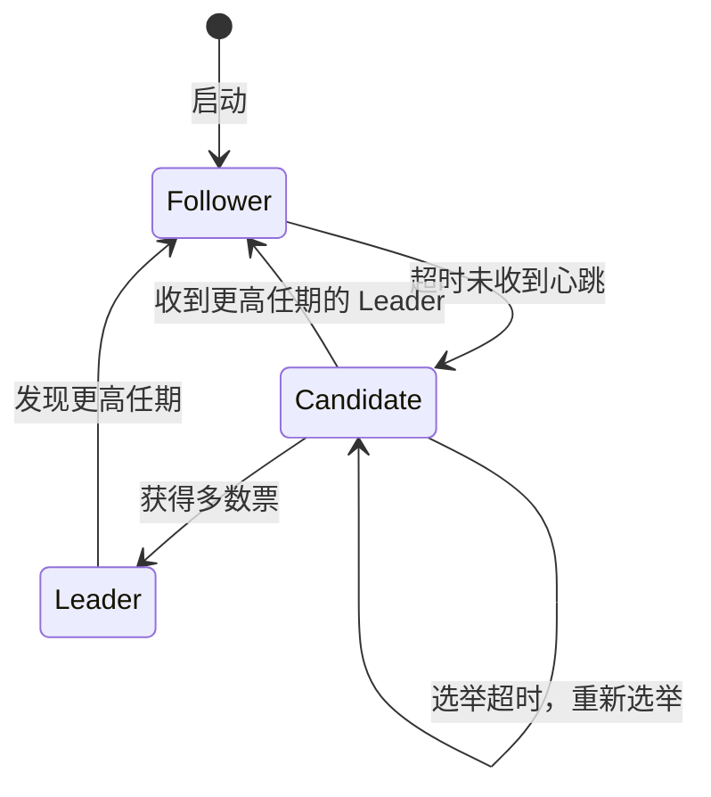
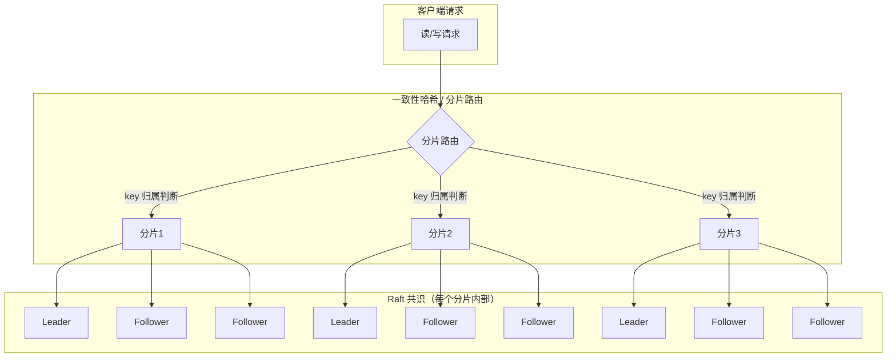

# 核心技巧：数据分片、一致性哈希与Raft共识

分布式数据库的灵魂在于三件事：**数据怎么拆、扩缩容怎么迁移、多副本怎么达成一致**。数据分片解决拆分问题，一致性哈希解决迁移问题，Raft共识解决一致性问题。三者环环相扣，缺一不可。掌握这三个核心技巧，就掌握了分布式数据库设计的主脉络。

本节从原理、实现、权衡三个层面深入剖析这三大技巧，每个技巧都配备完整的算法伪代码、真实系统实现分析、性能基准数据和工程最佳实践，帮助读者从"知道是什么"跃升到"知道怎么选、怎么用、怎么调"。

---

## 一、数据分片（Data Sharding）

### 1.1 为什么需要分片

当单机数据库遇到以下瓶颈时，分片成为必选项：

| 瓶颈维度 | 单机极限（典型值） | 分片后预期 |
|----------|-------------------|-----------|
| 存储容量 | 10-20TB（SSD） | 线性扩展至 PB 级 |
| 写入吞吐 | 5-10 万 TPS | 随分片数近线性增长 |
| 查询并发 | 1-3 万 QPS | 随分片数近线性增长 |
| 内存 | 单机 256-512GB | 多节点分布式缓存 |

分片的本质是 **水平拆分（Horizontal Partitioning）**：将一张表的行数据分散到多个独立的存储节点上，每个节点只保存一部分数据。对外呈现统一视图，应用层（或中间件）负责路由。

### 1.2 三种主流分片策略

#### 1.2.1 Range 分片（范围分片）

**原理**：按分片键的值域划分，连续的值域映射到同一个分片。

分片1: user_id ∈ [1, 1_000_000)       → 节点A
分片2: user_id ∈ [1_000_000, 2_000_000) → 节点B
分片3: user_id ∈ [2_000_000, 3_000_000) → 节点C
分片4: user_id ∈ [3_000_000, +∞)        → 节点D

**核心数据结构**：分片映射表（Shard Map），维护有序的 `(上界, 节点)` 对：

```python
import bisect

class RangeShardRouter:
    """Range分片路由：O(log N)查找复杂度"""
    
    def __init__(self):
        self.upper_bounds = []   # 有序的上界列表
        self.node_map = {}       # upper_bound → node_id
    
    def add_shard(self, upper_bound, node_id):
        self.upper_bounds.append(upper_bound)
        self.upper_bounds.sort()
        self.node_map[upper_bound] = node_id
    
    def route(self, key):
        """二分查找目标分片"""
        idx = bisect.bisect_right(self.upper_bounds, key)
        if idx >= len(self.upper_bounds):
            idx = len(self.upper_bounds) - 1
        return self.node_map[self.upper_bounds[idx]]
    
    def route_range(self, start, end):
        """范围查询：返回涉及的所有分片"""
        lo = bisect.bisect_left(self.upper_bounds, start)
        hi = bisect.bisect_right(self.upper_bounds, end)
        return list(set(
            self.node_map[self.upper_bounds[i]] 
            for i in range(lo, min(hi + 1, len(self.upper_bounds)))
        ))
```

**Range 分片的优势与适用场景**：

- **范围查询天然高效**：`WHERE created_at BETWEEN '2025-01' AND '2025-06'` 只需扫描相关分片，不需要广播。这使得 Range 分片在时序数据、日志系统、财务报表等场景中表现优异。
- **顺序扫描友好**：数据的物理排列与逻辑排列一致，支持高效的 `ORDER BY` 和 `LIMIT`。
- **分裂操作自然**：当某个分片过大时，从中间值处切分即可，不需要大规模数据迁移。TiDB 的 Region 分裂就是典型应用——单个 Region 超过 96MB 阈值时自动一分为二。

**Range 分片的风险与应对**：

写热点是 Range 分片最大的隐患。当分片键是自增 ID 或时间戳时，所有新写入都集中在最后一个分片（称为"末尾分片热点"），导致该分片成为系统瓶颈。

应对策略包括：
- **预分片（Pre-splitting）**：建表时预先创建多个空 Region，避免初始热点。TiDB 支持 `PRE_SPLIT_REGIONS` 语法。
- **打散写入**：在应用层对分片键做随机化处理，如 `user_id = actual_id XOR salt`。
- **热点 Region 调度**：PD（Placement Driver）组件实时监控 Region 热度，自动迁移热点 Region 到空闲节点。TiDB 的 PD 就采用这种策略，能在秒级完成热点 Region 的调度。

#### 1.2.2 Hash 分片（哈希分片）

**原理**：对分片键做哈希运算后取模，确定目标分片。

shard_id = hash(sharding_key) % num_shards

**核心实现**：

```python
import hashlib

class HashShardRouter:
    """Hash分片路由：O(1)查找，但扩展困难"""
    
    def __init__(self, num_shards, hash_fn=None):
        self.num_shards = num_shards
        self.hash_fn = hash_fn or self._default_hash
    
    def _default_hash(self, key):
        """使用MurmurHash3风格的哈希，分布均匀"""
        h = hashlib.md5(str(key).encode()).hexdigest()
        return int(h, 16)
    
    def route(self, key):
        return self.hash_fn(key) % self.num_shards
    
    def compute_migration(self, old_shards, new_shards):
        """计算扩缩容时需要迁移的数据量"""
        # 理论迁移量比例 = 1 - 1/gcd(old, new)
        from math import gcd
        g = gcd(old_shards, new_shards)
        ratio = 1 - g / max(old_shards, new_shards)
        return ratio
```

**Hash 分片的优势**：

- **数据均匀分布**：好的哈希函数（MurmurHash3、CityHash、XXHash）能确保数据均匀分散，彻底避免热点问题。
- **点查询 O(1)**：路由计算只需一次哈希 + 一次取模，速度极快。

**Hash 分片的劣势**：

- **范围查询必须广播**：`WHERE id BETWEEN 100 AND 200` 这样的查询需要发送到所有分片，因为哈希后这些键分散在各处。
- **扩容代价高**：分片数从 N 变为 N+1 时，约 `N/(N+1)`（约 99.9% 当 N=1024）的数据需要重新映射和迁移。

#### 1.2.3 一致性哈希（Consistent Hashing）

一致性哈希的核心目标是：**扩缩容时只迁移 1/N 的数据，而不是几乎全部**。详细原理与实现见下文「一致性哈希专题」。

#### 1.2.4 分片策略决策矩阵

| 维度 | Range 分片 | Hash 分片 | 一致性哈希 |
|------|-----------|----------|-----------|
| 数据均匀性 | 低（需预分片） | 高 | 高（虚拟节点保证） |
| 范围查询 | O(log N)，高效 | 广播所有分片 | 广播所有分片 |
| 点查询 | O(log N) | O(1) | O(log N) |
| 扩容迁移量 | 分裂场景极少 | 约 100% | 1/N |
| 写热点风险 | 高（顺序键） | 低 | 低 |
| 实现复杂度 | 低 | 低 | 中 |
| 典型系统 | TiDB、CockroachDB、HBase | MySQL Proxy、Vitess | DynamoDB、Cassandra、Redis Cluster |

**选型建议**：

- **OLTP 在线事务**（点查询为主）：优先 Hash 分片或一致性哈希，确保均匀分布。
- **OLAP 分析查询**（范围扫描为主）：优先 Range 分片，保证扫描效率。
- **混合负载**：TiDB 的方案值得借鉴——Range 分片 + 动态 Region 调度，在均匀性和查询效率之间取得平衡。
- **缓存层**：一致性哈希是最佳选择（如 Redis Cluster 的 16384 Hash Slot）。

### 1.3 分片键的选择：被低估的关键决策

分片键（Sharding Key）的选择直接决定了分片效果的好坏，是分布式数据库设计中最关键的决策之一。

**好的分片键应该满足**：

1. **高基数（High Cardinality）**：键值种类多，确保数据均匀分布。用 `gender` 做分片键是灾难——只有两个值，最多两个分片有数据。
2. **写入分布均匀**：避免热点。自增 ID 看似基数高，但写入集中在最新值附近。
3. **与主要查询模式匹配**：80% 以上的查询都带分片键作为条件，这样可以避免跨分片查询。
4. **不可变或低频变更**：分片键一旦确定，变更代价极大（需要迁移全部数据）。

**常见分片键选择案例**：

| 业务场景 | 推荐分片键 | 理由 |
|---------|-----------|------|
| 电商订单表 | 用户ID（user_id） | 订单按用户查询最频繁，且用户数量大、分布均匀 |
| 社交平台消息表 | 会话ID（conversation_id） | 同一会话的消息总是在一起查询 |
| IoT 设备数据 | 设备ID（device_id） | 每个设备独立上报，天然均匀 |
| 日志系统 | 时间戳（timestamp） | 按时间范围查询为主，Range 分片最佳 |
| 多租户 SaaS | 租户ID（tenant_id） | 租户间数据天然隔离 |

**反模式**：很多新手选择 `order_id`（随机UUID）作为分片键。虽然数据分布均匀，但同一个用户的所有订单散布在所有分片上，每次按用户查询都要广播——这是典型的"均匀但低效"。

### 1.4 分片数据的跨分片关联

分片后，涉及多个分片的查询需要特殊处理。这在上一节的 MPP 引擎中有详细论述，这里补充工程实践中的关键要点：

**跨分片 JOIN 的代价**：

```sql
-- 假设 orders 按 user_id 分片，products 按 product_id 分片
-- 这个 JOIN 需要 Shuffle Join，代价极高
SELECT o.order_id, p.name, o.amount
FROM orders o JOIN products p ON o.product_id = p.product_id;
```

这种跨分片键的 JOIN 在分布式系统中代价很高。工程上的应对策略：

1. **冗余存储**：将 products 表广播到每个分片（适合维度表），避免运行时 Shuffle。
2. **应用层 Join**：先查 orders 拿到 product_id 列表，再按 product_id 批量查 products。
3. **双分片键（Co-location）**：如果 orders 和 products 都按 product_id 分片，则同一 product_id 的数据在同一个节点，JOIN 退化为本地操作。

---

## 二、一致性哈希（Consistent Hashing）

### 2.1 问题背景：传统哈希的扩缩容灾难

传统哈希分片 `shard = hash(key) % N` 在分片数 N 变化时，几乎所有数据的映射都会改变：

N=3 时:  hash("user:100") % 3 = 2  → 节点C
N=4 时:  hash("user:100") % 4 = 1  → 节点B  ← 必须迁移！

N=3 → N=4: 约 75% 的数据需要迁移
N=100 → N=101: 约 99% 的数据需要迁移

这个迁移量在生产环境中是灾难性的——100 节点的集群扩容一个节点，需要迁移 99% 的数据，网络带宽和 I/O 都会被打满。

1997 年，MIT 的 Karger 等人提出了一致性哈希算法，将扩缩容迁移量降低到 1/N。

### 2.2 哈希环原理

一致性哈希将哈希空间组织成一个环（0 到 2^32-1），节点和数据都映射到环上。数据存储在**顺时针方向遇到的第一个节点**。

```python
import hashlib
import bisect
from typing import Optional, List

class ConsistentHashRing:
    """一致性哈希环的完整实现"""
    
    def __init__(self, virtual_nodes: int = 150):
        self.virtual_nodes = virtual_nodes
        self.ring = {}              # hash_position → physical_node
        self.sorted_positions = []  # 有序的环位置列表
        self.nodes = set()          # 物理节点集合
    
    def _hash(self, key: str) -> int:
        """SHA-256 哈希，取前 32 位作为环位置"""
        digest = hashlib.sha256(key.encode()).hexdigest()
        return int(digest[:8], 16)
    
    def add_node(self, node: str):
        """添加物理节点，为其生成 virtual_nodes 个虚拟节点"""
        if node in self.nodes:
            return
        self.nodes.add(node)
        for i in range(self.virtual_nodes):
            vkey = f"vn:{node}:{i}"
            position = self._hash(vkey)
            self.ring[position] = node
            self.sorted_positions.append(position)
        self.sorted_positions.sort()
    
    def remove_node(self, node: str):
        """移除物理节点及其所有虚拟节点"""
        if node not in self.nodes:
            return
        self.nodes.discard(node)
        for i in range(self.virtual_nodes):
            vkey = f"vn:{node}:{i}"
            position = self._hash(vkey)
            self.ring.pop(position, None)
            # 使用过滤重建列表，避免 remove 的 O(N) 开销
        self.sorted_positions = sorted(self.ring.keys())
    
    def get_node(self, key: str) -> Optional[str]:
        """查找键值对应的物理节点，O(log N) 时间复杂度"""
        if not self.ring:
            return None
        position = self._hash(key)
        # 二分查找顺时针方向第一个 >= position 的节点
        idx = bisect.bisect_left(self.sorted_positions, position)
        if idx == len(self.sorted_positions):
            idx = 0  # 环回：回到起点
        return self.ring[self.sorted_positions[idx]]
    
    def get_distribution(self, sample_keys: List[str]) -> dict:
        """统计数据分布，用于验证均匀性"""
        dist = {node: 0 for node in self.nodes}
        for key in sample_keys:
            node = self.get_node(key)
            if node:
                dist[node] += 1
        return dist
```

**哈希环的工作流程**：

哈希环示意图（简化，6个位置）：

        position: 0
            │
   ┌────────┴────────┐
   │                  │
   B(2)              A(1)
   │                  │
   │                  │
   D(4)              C(3)
   │                  │
   └────────┬────────┘
            │
        position: 5

数据 "user:100" → hash → position: 2.3
顺时针查找 → 遇到 C(3) → 数据存储在节点 C

### 2.3 虚拟节点：解决数据倾斜

**没有虚拟节点的问题**：

在只有 3 个物理节点的哈希环上，由于哈希分布的随机性，各节点负责的数据范围可能严重不均：

极端情况（无虚拟节点）：
节点A: 0 - 1200  →  负责 33% 的环空间
节点B: 1200 - 4000  →  负责 77% 的环空间  ← 严重倾斜！
节点C: 4000 - 0  →  负责 22% 的环空间

**虚拟节点的解决方案**：

每个物理节点生成多个虚拟节点（通常 100-200 个），分散在环的不同位置。当虚拟节点数足够多时，根据大数定律，各物理节点的数据量趋近均匀。

```python
def benchmark_distribution(vnode_counts, num_nodes=5, num_keys=1_000_000):
    """测试不同虚拟节点数下的数据分布均匀性"""
    import random
    
    results = {}
    for vn in vnode_counts:
        ring = ConsistentHashRing(virtual_nodes=vn)
        for i in range(num_nodes):
            ring.add_node(f"node-{i}")
        
        # 生成随机键测试分布
        keys = [f"key:{random.randint(0, 10**8)}" for _ in range(num_keys)]
        dist = ring.get_distribution(keys)
        
        # 计算标准差（越小越均匀）
        values = list(dist.values())
        mean = sum(values) / len(values)
        std = (sum((v - mean)**2 for v in values) / len(values)) ** 0.5
        cv = std / mean  # 变异系数
        
        results[vn] = {
            "distribution": dist,
            "cv": cv,
            "max_min_ratio": max(values) / max(min(values), 1)
        }
    
    return results

# 典型结果：
# 虚拟节点=10:  CV ≈ 0.30, max/min ≈ 2.5x  → 不够均匀
# 虚拟节点=50:  CV ≈ 0.12, max/min ≈ 1.6x  → 可接受
# 虚拟节点=150: CV ≈ 0.05, max/min ≈ 1.2x  → 推荐值
# 虚拟节点=500: CV ≈ 0.02, max/min ≈ 1.05x → 接近完美均匀
```

**虚拟节点数的选择权衡**：

| 虚拟节点数 | 均匀性（CV） | 内存开销（每节点） | 路由表大小 | 适用场景 |
|-----------|-------------|-------------------|-----------|---------|
| 10-50 | 差（CV > 0.15） | 低 | 小 | 节点数 > 1000，对均匀性要求不高 |
| 100-200 | 好（CV < 0.08） | 中 | 中 | 通用推荐值，绝大多数场景 |
| 300-500 | 优秀（CV < 0.03） | 高 | 大 | 对均匀性要求极高的场景 |
| > 1000 | 近完美 | 很高 | 很大 | 一般不必要 |

### 2.4 一致性哈希的数学性质

一致性哈希需要满足三个关键性质：

**1. 单调性（Monotonicity）**：添加或移除节点时，已有的键映射不会从一个未变化的节点跳到其他节点。这意味着扩容/缩容只影响新旧节点之间的数据，其他节点完全不受影响。

**2. 平衡性（Balance）**：各节点负载大致均衡。纯一致性哈希不保证平衡性（依赖哈希函数的均匀性），虚拟节点是保证平衡性的关键手段。

**3. 分散性（Spread）**：不同客户端看到的映射应该一致。在分布式缓存场景中，如果不同客户端使用不同的哈希环副本，可能导致缓存命中率下降。

### 2.5 工业级一致性哈希实现

真实系统中的一致性哈希远比教科书版本复杂：

**Amazon Dynamo**：使用一致性哈希 + 可调副本数（N=3）。每个数据键存储在环上顺时针的 N 个不同物理节点上。故障检测基于 Gossip 协议。

**Apache Cassandra**：使用 Token Ring（一致性哈希环），默认 256 个虚拟节点（vnode）。支持 NetworkTopologyStrategy，可以感知机架/数据中心拓扑，在同一个数据中心内做一致性哈希分布。

**Redis Cluster**：使用 16384 个固定 Hash Slot（不是传统一致性哈希，但效果类似）。每个节点负责一部分 Slot。扩容时手动/自动迁移 Slot。`hash_slot = CRC16(key) % 16384`。

```python
class RedisClusterSimulator:
    """Redis Cluster Hash Slot 的简化模拟"""
    
    NUM_SLOTS = 16384
    
    def __init__(self):
        self.slot_to_node = {}  # slot → node
    
    def assign_slots(self, node, slot_range):
        """为节点分配 Slot 范围"""
        for slot in range(slot_range[0], slot_range[1] + 1):
            self.slot_to_node[slot] = node
    
    def route(self, key):
        """计算 key 所在的 slot 并路由"""
        slot = self._crc16(key) % self.NUM_SLOTS
        return self.slot_to_node.get(slot)
    
    def migrate_slot(self, slot, from_node, to_node):
        """在线迁移单个 Slot（Redis Cluster 的核心操作）"""
        # 阶段1: 目标节点导入数据
        # 阶段2: 源节点标记 slot 为 MIGRATING
        # 阶段3: 源节点将剩余 key 逐个迁移到目标节点
        # 阶段4: 目标节点标记 slot 为 IMPORTING
        # 阶段5: 更新集群配置，slot 归属变为目标节点
        self.slot_to_node[slot] = to_node
    
    def _crc16(self, key):
        """CRC16 哈希（Redis 使用的算法）"""
        crc = 0
        for byte in key.encode():
            crc ^= byte << 8
            for _ in range(8):
                if crc &amp; 0x8000:
                    crc = (crc << 1) ^ 0x1021
                else:
                    crc <<= 1
                crc &amp;= 0xFFFF
        return crc
```

### 2.6 一致性哈希的局限性

一致性哈希并非银弹，它有一些固有的局限：

1. **只解决路由问题**：一致性哈希只负责"数据放在哪"，不解决副本一致性、故障转移、数据持久化等问题。这些需要配合 Raft/Paxos 等共识协议。
2. **不能精确控制负载**：虽然虚拟节点保证了统计意义上的均匀，但在小规模集群中（< 10 节点），局部不均匀仍可能出现。
3. **跨数据中心支持有限**：原生一致性哈希不感知物理拓扑，需要额外的拓扑感知层（如 Cassandra 的 NetworkTopologyStrategy）。
4. **范围查询无帮助**：一致性哈希本质上是 Hash 分片的增强版，范围查询仍然需要广播。

---

## 三、Raft 共识协议

### 3.1 为什么需要共识协议

分布式数据库的数据存在多个副本上（通常 3 或 5 个）。当客户端写入数据时，所有副本必须达成一致：是都写入还是都不写入。这就是共识问题（Consensus Problem）。

在 Raft 之前，Paxos 是事实上的标准共识算法。但 Paxos 以"难以理解和实现"著称。2014 年，斯坦福的 Diego Ongaro 和 John Ousterhout 在论文《In Search of an Understandable Consensus Algorithm》中提出了 Raft，目标就是在保持与 Paxos 相同正确性的前提下，大幅降低理解难度。

**Raft 的核心设计哲学**：将共识问题分解为三个相对独立的子问题：

1. **领导者选举（Leader Election）**：选出一个 Leader 来管理复制
2. **日志复制（Log Replication）**：Leader 将日志复制到所有 Follower
3. **安全性保证（Safety）**：确保已提交的日志不会丢失

### 3.2 节点状态机

Raft 集群中的每个节点处于三种状态之一：



| 状态 | 职责 | 关键行为 |
|------|------|---------|
| **Leader** | 处理所有客户端请求，管理日志复制 | 定期向 Follower 发送心跳；接收客户端写请求，追加日志并广播 |
| **Follower** | 被动接收 Leader 的日志和心跳 | 响应 Candidate 的投票请求；超时未收到心跳则变为 Candidate |
| **Candidate** | 发起选举，争取成为 Leader | 向其他节点发送 RequestVote RPC；获得多数票后成为 Leader |

### 3.3 任期机制（Term）

Raft 将时间划分为一个个**任期（Term）**，每个任期最多有一个 Leader。Term 是 Raft 的逻辑时钟，用于检测过期信息。

Term:  1         2         3         4         5
       │─────────│─────────│─────────│─────────│─────────→
       Leader A   选举失败   Leader B   Leader B  Leader C
                  (term 3无Leader)

```python
class RaftNode:
    """Raft 节点的核心状态"""
    
    def __init__(self, node_id, peers):
        self.node_id = node_id
        self.peers = peers
        
        # 持久化状态（必须写入磁盘后才能响应）
        self.current_term = 0       # 当前任期，初始化为0
        self.voted_for = None       # 当前任期投票给了谁
        self.log = []               # 日志条目列表 [{term, command}]
        
        # 易失性状态
        self.state = "follower"     # follower / candidate / leader
        self.commit_index = 0       # 最高已提交日志索引
        self.last_applied = 0       # 最高已应用日志索引
        
        # Leader 独有的易失性状态
        self.next_index = {}        # 每个 follower 的下一个发送索引
        self.match_index = {}       # 每个 follower 的最高匹配索引
```

### 3.4 领导者选举

当 Follower 在**选举超时时间**（通常 150-300ms，随机化以避免同时选举）内没有收到 Leader 的心跳，它就发起选举：

```python
def start_election(self):
    """Follower 转为 Candidate 并发起选举"""
    self.state = "candidate"
    self.current_term += 1
    self.voted_for = self.node_id  # 先投给自己
    votes_received = 1  # 自己的一票
    
    # 向所有 Follower 发送 RequestVote RPC
    request = {
        "term": self.current_term,
        "candidate_id": self.node_id,
        "last_log_index": len(self.log),
        "last_log_term": self.log[-1]["term"] if self.log else 0
    }
    
    for peer in self.peers:
        response = send_request_vote(peer, request)
        
        if response["term"] > self.current_term:
            # 发现更高任期，退回 Follower
            self.become_follower(response["term"])
            return
        
        if response["vote_granted"]:
            votes_received += 1
        
        # 获得多数票 → 成为 Leader
        if votes_received > (len(self.peers) + 1) // 2:
            self.become_leader()
            return
```

**投票限制**（保证安全性）：

Candidate 在 RequestVote RPC 中携带自己最后一条日志的 `(term, index)`。Follower 只有在 Candidate 的日志**至少和自己一样新**时才投票。这保证了：拥有已提交日志的 Candidate 一定能赢得选举。

```python
def handle_request_vote(self, request):
    """处理投票请求"""
    # 规则1：任期更大才重置
    if request["term"] < self.current_term:
        return {"term": self.current_term, "vote_granted": False}
    
    if request["term"] > self.current_term:
        self.become_follower(request["term"])
    
    # 规则2：每个任期只投一票
    if self.voted_for is not None and self.voted_for != request["candidate_id"]:
        return {"term": self.current_term, "vote_granted": False}
    
    # 规则3：Candidate 日志必须至少和自己一样新
    my_last_term = self.log[-1]["term"] if self.log else 0
    my_last_index = len(self.log)
    
    candidate_newer = (
        request["last_log_term"] > my_last_term or
        (request["last_log_term"] == my_last_term and 
         request["last_log_index"] >= my_last_index)
    )
    
    if candidate_newer:
        self.voted_for = request["candidate_id"]
        return {"term": self.current_term, "vote_granted": True}
    
    return {"term": self.current_term, "vote_granted": False}
```

### 3.5 日志复制

Leader 接收客户端请求后，将命令追加到自己的日志中，然后通过 AppendEntries RPC 复制给所有 Follower：

```python
def handle_client_request(self, command):
    """Leader 处理客户端写请求"""
    if self.state != "leader":
        return {"error": "not leader", "leader": self.leader_id}
    
    # 1. 追加到本地日志
    entry = {"term": self.current_term, "command": command}
    self.log.append(entry)
    log_index = len(self.log)
    
    # 2. 并行发送给所有 Follower
    success_count = 1  # 自己的一票
    for peer in self.peers:
        response = send_append_entries(peer, {
            "term": self.current_term,
            "leader_id": self.node_id,
            "prev_log_index": log_index - 2,
            "prev_log_term": self.log[-2]["term"] if len(self.log) > 1 else 0,
            "entries": [entry],
            "leader_commit": self.commit_index
        })
        
        if response["success"]:
            success_count += 1
        elif response["term"] > self.current_term:
            self.become_follower(response["term"])
            return {"error": "step down"}
    
    # 3. 多数确认 → 提交
    if success_count > (len(self.peers) + 1) // 2:
        self.commit_index = log_index
        self.apply_committed_entries()
        return {"success": True, "index": log_index}
    
    return {"error": "not enough replicas"}
```

**日志冲突的处理**：

当 Leader 切换时，新 Leader 的日志可能与部分 Follower 的日志不一致（旧 Leader 的部分日志可能未复制完成）。Raft 通过 **Leader 强制覆盖** 来解决：

```python
def send_append_entries_with_backtrack(self, peer):
    """如果 Follower 的日志与 Leader 不匹配，回退重试"""
    next_idx = self.next_index[peer]
    
    while True:
        prev_idx = next_idx - 1
        prev_term = self.log[prev_idx]["term"] if prev_idx > 0 else 0
        
        response = send_append_entries(peer, {
            "term": self.current_term,
            "prev_log_index": prev_idx,
            "prev_log_term": prev_term,
            "entries": self.log[next_idx - 1:],
            "leader_commit": self.commit_index
        })
        
        if response["success"]:
            self.next_index[peer] = next_idx + len(self.log[next_idx - 1:])
            self.match_index[peer] = self.next_index[peer] - 1
            break
        else:
            # 回退一个位置重试
            next_idx = max(1, next_idx - 1)
```

### 3.6 安全性保证

Raft 通过以下机制保证安全性（Safety）：

**选举限制**：拥有最新已提交日志的 Candidate 才能赢得选举。这是通过投票时比较日志新旧实现的。

**Leader 完整性**：如果一个日志条目在某个任期被提交，那么该条目一定存在于所有更高任期 Leader 的日志中。因为赢得选举的 Candidate 一定拥有最新的已提交日志。

**日志匹配原则**：如果两个日志在某个索引处的 term 相同，那么该索引之前的所有条目都相同。Leader 通过 AppendEntries 的一致性检查维持这个不变量。

**提交规则**：Leader 只能提交当前任期的日志条目（通过计数副本）；之前的日志条目通过间接方式提交（如果当前任期的日志被提交，之前的日志也一定被提交）。

### 3.7 Raft 在真实系统中的应用

| 系统 | 共识协议 | 副本数 | 选举超时 | 日志存储 | 特殊优化 |
|------|---------|--------|---------|---------|---------|
| **TiKV** | Raft | 3 或 5 | 10s（可配） | RocksDB (Raft Engine) | Joint Consensus 支持在线变更成员 |
| **CockroachDB** | Raft | 3 或 5 | 3s（可配） | Pebble | Parallel Commit：两阶段提交优化 |
| **etcd** | Raft | 3 或 5 | 1-2s | boltdb | Pre-Vote：避免网络分区后的无效选举 |
| **Consul** | Raft | 3 或 5 | 可配 | bolt | Learner 节点：不参与投票的只读副本 |
| **OceanBase** | Paxos（类 Raft） | 3（通常） | 可配 | 自研存储 | 多副本强一致 + 异地多活 |

**TiKV 的 Raft 实现亮点**：

TiKV 是 TiDB 的分布式存储引擎，其 Raft 实现有几个工程亮点值得学习：

1. **Raft Engine**：专用的 Raft 日志存储引擎，使用 append-only + 定期 compaction 的方式管理日志，写入性能优于通用 KV 引擎。
2. **Leader Lease**：Leader 在租约有效期内可以直接处理读请求，无需走 Raft 日志复制，将读延迟从 2 RTT 降低到 0 RTT（本地读）。
3. **Flow Control**：当 Raft 日志堆积过快（如写入速度超过复制速度）时，主动对写入限流，避免 OOM。
4. **Joint Consensus**：支持在不中断服务的情况下变更集群成员（如从 3 节点扩容到 5 节点），通过 Joint 配置过渡期保证安全性。

### 3.8 Raft 的工程陷阱

**1. 日志膨胀（Log Bloat）**

Raft 日志只会追加不会删除，长时间运行后日志会无限增长。必须实现 **日志压缩（Log Compaction）**——通过定期对状态机做快照（Snapshot），丢弃快照之前的日志。

日志压缩示意：
[日志1][日志2][日志3][日志4][日志5][日志6][日志7][日志8]
                    ↓ 快照（包含1-5的结果）
         [已丢弃]           [日志6][日志7][日志8]

快照过程中的注意事项：
- 快照必须包含状态机当前状态 + 快照末尾的 `last_included_term` 和 `last_included_index`
- Follower 可能落后太多，此时 Leader 直接发送快照（而不是补发所有日志）——称为 **Snapshot Install**
- 快照太大时使用 **Streaming Snapshot** 分块传输

**2. 选举超时配置**

选举超时太短 → 网络抖动导致频繁选举，吞吐骤降。选举超时太长 → 故障恢复时间过长。经验值：

心跳间隔 = 100-200ms
选举超时 = 心跳间隔 × (5~10)，即 500ms-2s
批量追加间隔 = 50-100ms（合并多条日志减少 RPC 次数）

**3. 线性一致性读（Linearizable Read）**

直接从 Follower 读取可能读到过期数据。三种读策略：

| 策略 | 一致性 | 读延迟 | 吞吐量 | 适用系统 |
|------|--------|-------|--------|---------|
| **Read from Leader + Raft Log** | 线性一致 | 2 RTT | 低 | 早期 Raft 实现 |
| **ReadIndex** | 线性一致 | 1 RTT | 中 | etcd, TiKV |
| **Lease Read** | 近似线性一致 | 0 RTT | 高 | TiKV, CockroachDB |
| **Follower Read** | 最终一致 | 0 RTT | 最高 | 对一致性要求低的场景 |

ReadIndex 流程：
1. Leader 确认自己仍是 Leader（向多数节点发心跳）
2. Leader 等待 `commit_index` 被应用到状态机
3. 返回当前状态机的结果

Lease Read 利用时钟租约：Leader 在租约有效期内无需心跳确认，直接读本地状态机。但依赖时钟准确性——如果节点时钟漂移，可能读到过期数据。

---

## 四、三大技巧的协同与选型

### 4.1 三者的协作关系

这三个技巧不是独立存在的，它们在真实系统中紧密协作：



**数据流**：
1. 客户端发送写请求 `PUT(user:100, data)`
2. 一致性哈希路由判断 `user:100` 属于分片 2
3. 请求被转发到分片 2 的 Leader 节点
4. Leader 通过 Raft 将日志复制到分片 2 的 Follower
5. 多数确认后提交，返回成功

### 4.2 综合选型决策树

你需要分布式数据库吗？
├─ 数据量 < 单机容量 且 QPS < 单机极限
│   └─ 不需要，用单机数据库
├─ 需要水平扩展
│   ├─ 读多写少
│   │   ├─ 全局一致性读？ → TiDB / CockroachDB (Raft)
│   │   └─ 最终一致可接受？ → Cassandra (Gossip + 一致性哈希)
│   ├─ 写多读少
│   │   ├─ 需要事务？ → TiKV (Raft)
│   │   └─ KV 存储即可？ → DynamoDB (一致性哈希)
│   └─ 读写均衡
│       ├─ 需要 SQL 接口？ → TiDB / CockroachDB
│       └─ NoSQL 即可？ → Redis Cluster (Hash Slot)

### 4.3 常见误区与纠正

**误区 1："一致性哈希可以完全均匀分布数据"**
→ 事实：即使有虚拟节点，在小规模集群中仍可能存在 20-30% 的分布偏差。需要通过监控和手动调整来优化。

**误区 2："Raft 能保证 100% 不丢数据"**
→ 事实：Raft 保证已提交（replicated to majority）的数据不丢。但如果 Leader 在复制前崩溃，未复制的客户端请求可能丢失。客户端需要自己做重试。此外，配置不当（如 `min_insync_replicas` 设为 1）会削弱保护。

**误区 3："分片数越多越好"**
→ 事实：每个分片有固定开销（元数据、Raft 日志、心跳）。过度分片（如 100GB 数据分 1000 个分片）会导致大量空分片，元数据膨胀，管理开销超过收益。一般建议单个分片 100MB-1GB。

**误区 4："选了 Range 分片就不用担心热点"**
→ 事实：Range 分片在自增键场景下热点更严重。必须配合预分片、热点调度等手段。TiDB 的 PD 必须开启热点调度策略。

**误区 5："Raft 5 副本一定比 3 副本安全"**
→ 事实：5 副本的容错能力确实更强（容忍 2 个节点同时故障 vs 3 副本容忍 1 个），但写延迟也更高（需要 3 个确认 vs 2 个确认），吞吐量更低。3 副本在绝大多数场景下已经足够安全。

---

## 五、实操指南：从理论到部署

### 5.1 用 Python 实现一个简化版分布式存储

以下代码展示了一个整合分片、一致性哈希和简化的共识机制的微型分布式存储：

```python
import hashlib
import bisect
import threading
import time
from dataclasses import dataclass, field
from typing import Dict, List, Optional, Any

@dataclass
class LogEntry:
    term: int
    index: int
    command: str
    key: str
    value: Any = None

class MiniRaftNode:
    """简化的 Raft 节点（单分片内的共识）"""
    
    def __init__(self, node_id: str, peers: List[str]):
        self.node_id = node_id
        self.peers = peers
        self.term = 0
        self.voted_for = None
        self.log: List[LogEntry] = []
        self.state = "follower"
        self.commit_index = 0
        self.state_machine: Dict[str, Any] = {}
        self.lock = threading.Lock()
    
    def append(self, key: str, value: Any) -> bool:
        """追加写操作到日志（简化版：本地立即提交）"""
        with self.lock:
            entry = LogEntry(
                term=self.term,
                index=len(self.log) + 1,
                command="PUT",
                key=key,
                value=value
            )
            self.log.append(entry)
            self.state_machine[key] = value
            self.commit_index = len(self.log)
            return True

class MiniDistributedStore:
    """整合一致性哈希 + 简化共识的分布式存储"""
    
    def __init__(self, node_ids: List[str], virtual_nodes: int = 150):
        self.virtual_nodes = virtual_nodes
        self.ring = {}                # position → node_id
        self.sorted_positions = []
        self.nodes = set()
        
        # 每个节点上运行一个 Raft 节点组（简化：每个节点独立）
        self.raft_nodes: Dict[str, MiniRaftNode] = {}
        
        for node_id in node_ids:
            self.add_node(node_id)
    
    def _hash(self, key: str) -> int:
        return int(hashlib.sha256(key.encode()).hexdigest()[:8], 16)
    
    def add_node(self, node_id: str):
        """添加节点到哈希环"""
        self.nodes.add(node_id)
        self.raft_nodes[node_id] = MiniRaftNode(node_id, list(self.nodes - {node_id}))
        for i in range(self.virtual_nodes):
            pos = self._hash(f"vn:{node_id}:{i}")
            self.ring[pos] = node_id
            self.sorted_positions.append(pos)
        self.sorted_positions.sort()
    
    def get_node(self, key: str) -> str:
        """路由：找到 key 所在的节点"""
        pos = self._hash(key)
        idx = bisect.bisect_left(self.sorted_positions, pos)
        if idx == len(self.sorted_positions):
            idx = 0
        return self.ring[self.sorted_positions[idx]]
    
    def put(self, key: str, value: Any) -> dict:
        """写入：路由 + 共识"""
        target_node = self.get_node(key)
        raft = self.raft_nodes[target_node]
        success = raft.append(key, value)
        return {
            "node": target_node,
            "success": success,
            "key": key,
            "log_index": len(raft.log)
        }
    
    def get(self, key: str) -> Optional[Any]:
        """读取：路由到对应节点"""
        target_node = self.get_node(key)
        raft = self.raft_nodes[target_node]
        return raft.state_machine.get(key)
    
    def get_distribution(self, keys: List[str]) -> Dict[str, int]:
        """统计数据分布"""
        dist = {node: 0 for node in self.nodes}
        for key in keys:
            node = self.get_node(key)
            dist[node] += 1
        return dist


# ===== 使用示例 =====
store = MiniDistributedStore(["node-1", "node-2", "node-3"])

# 写入数据
for i in range(1000):
    store.put(f"user:{i:06d}", {"name": f"User_{i}", "balance": i * 10})

# 查看分布
dist = store.get_distribution([f"user:{i:06d}" for i in range(1000)])
print("数据分布：")
for node, count in sorted(dist.items()):
    bar = "█" * (count // 10)
    print(f"  {node}: {count:4d} keys {bar}")

# 读取验证
print(f"\n读取 user:000042 = {store.get('user:000042')}")
```

### 5.2 生产环境部署检查清单

部署分布式数据库前，务必逐项检查：

| 检查项 | 具体内容 | 忽略后果 |
|--------|---------|---------|
| 时钟同步 | 所有节点 NTP 同步，偏差 < 100ms | Raft 选举混乱，Lease Read 不安全 |
| 磁盘 IOPS | SSD，IOPS > 10K，写延迟 < 1ms | 日志写入慢导致 Raft 复制超时 |
| 网络 | 节点间 RTT < 1ms（同机房），带宽 > 10Gbps | 复制延迟大，大事务超时 |
| 副本数 | 至少 3 副本，跨机架部署 | 单机架故障丢失数据 |
| 分片数 | 单分片 100MB-1GB，总分片数 < 节点数 × 100 | 过度分片导致管理开销大 |
| 预分片 | 建表时指定 Region 数量 | 初始写入集中在单 Region |
| 监控 | Prometheus + Grafana 监控 QPS/延迟/Region 分布 | 无法及时发现热点和故障 |
| 备份 | 定期全量 + 增量备份，异地存储 | 误删数据无法恢复 |

---

## 六、进阶专题

### 6.1 Multi-Raft 与 Region 分裂

单个 Raft 组只能利用单分片内的节点资源。现代 NewSQL 数据库采用 **Multi-Raft** 架构——将数据拆分为多个 Region（分片），每个 Region 独立运行一个 Raft 组。

TiDB 的 Multi-Raft 架构：

全局视图：
┌─────────────────────────────────────┐
│           TiDB Server（SQL层）        │
└──────────────┬──────────────────────┘
               │
┌──────────────▼──────────────────────┐
│        PD（Placement Driver）         │
│  - Region 元信息管理                  │
│  - 热点调度                          │
│  - 负载均衡                          │
└──────────────┬──────────────────────┘
               │
┌──────────────▼──────────────────────┐
│          TiKV 集群                   │
│  ┌─────────┐  ┌─────────┐  ┌─────────┐
│  │ Region 1 │  │ Region 2 │  │ Region 3 │
│  │ Raft组1  │  │ Raft组2  │  │ Raft组3  │
│  │ [L,F,F]  │  │ [F,L,F]  │  │ [F,F,L]  │
│  └─────────┘  └─────────┘  └─────────┘
│     Node A       Node B       Node C
└──────────────────────────────────────┘

Region 生命周期：
1. **创建**：建表或分裂时产生
2. **增长**：数据持续写入
3. **分裂**：超过 96MB 阈值，PD 调度自动分裂
4. **迁移**：PD 发现负载不均，将 Region 从高负载节点迁移到低负载节点
5. **合并**：相邻的空 Region 可能被合并

### 6.2 成员变更（Membership Change）

运行中的 Raft 集群可能需要增减节点。Raft 的成员变更需要保证安全性——不能出现两个独立的多数派。

**Joint Consensus（联合共识）**：

TiKV 和 etcd 采用的方式。分为两步：
1. 添加新配置 `C_new`，进入 Joint 配置 `C_joint = C_old ∪ C_new`
2. 在 Joint 配置下达成共识后，移除旧配置，只保留 `C_new`

C_old:    {A, B, C}          多数 = 2
C_joint:  {A, B, C, D, E}    多数 = 3（需要旧多数 + 新多数）
C_new:    {D, E, F}          多数 = 2

---

本节详细剖析了分布式数据库的三大核心技巧。分片解决数据拆分，一致性哈希解决扩缩容迁移，Raft 解决多副本一致性。三者协同工作，构成了现代分布式数据库的技术基石。掌握这些原理和工程实践，才能在面对真实业务场景时做出合理的技术选型和架构设计。
