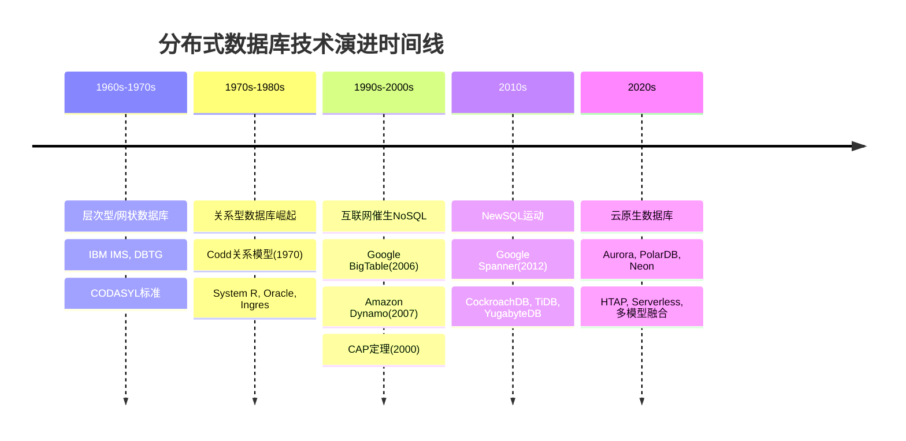
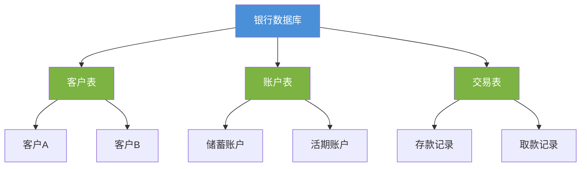
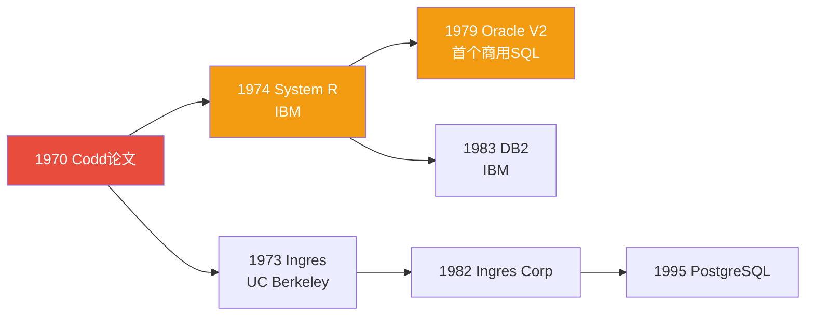
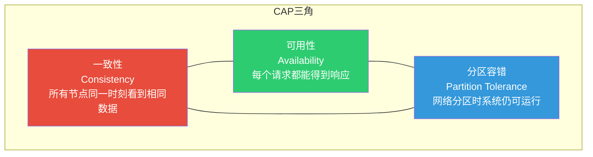
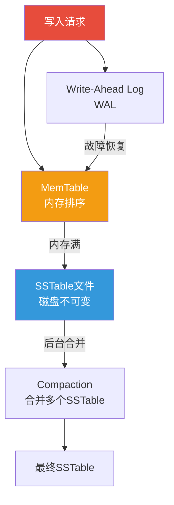
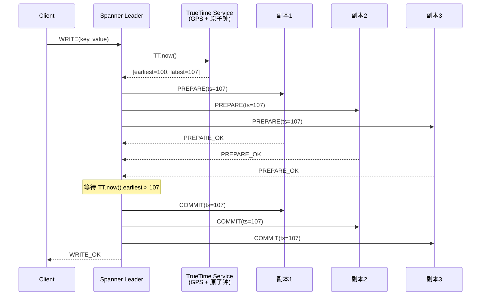
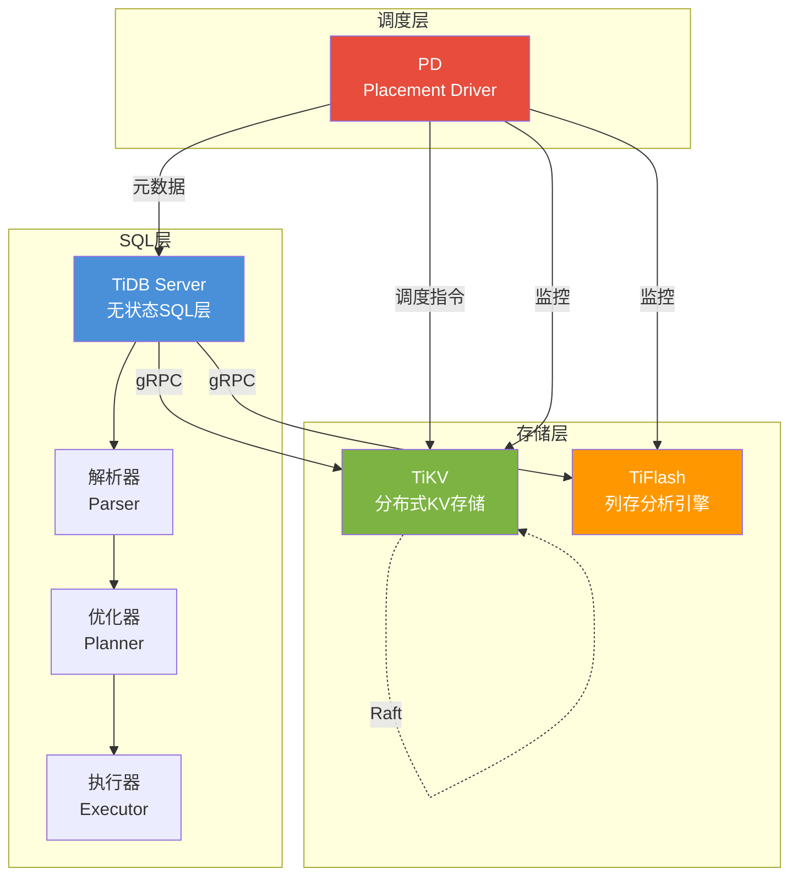
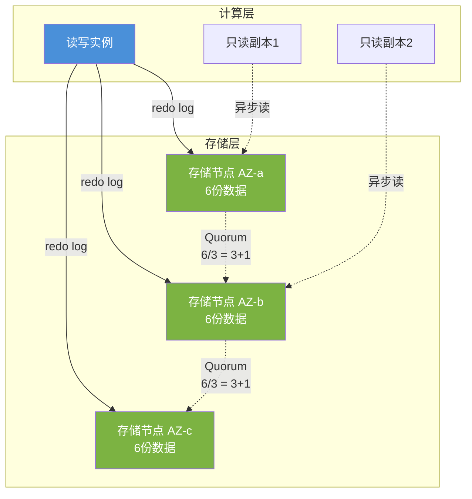
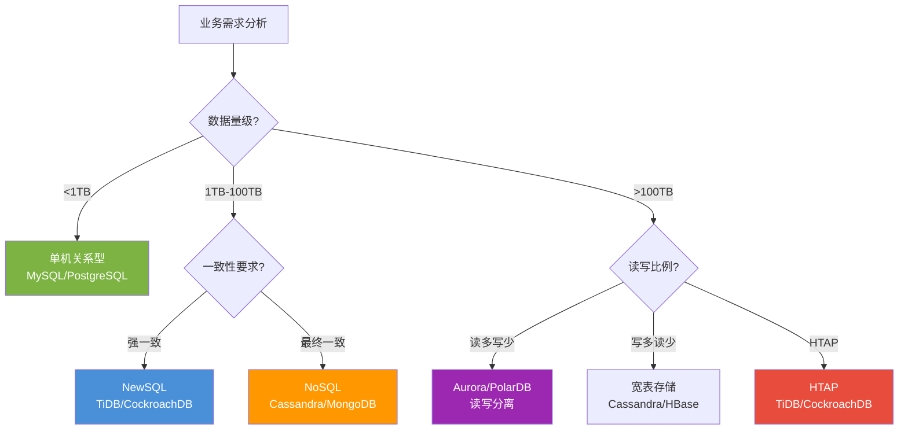

## 分布式数据库技术演进

从1960年代的层次型数据库到2020年代的云原生Serverless数据库，分布式数据库经历了近六十年的技术演进。每一次范式转换都源于硬件能力的跃迁与业务需求的倒逼——从单机时代的磁盘瓶颈，到互联网时代的海量并发，再到云时代的弹性供给。理解这条演进脉络，不仅帮助我们看清当前技术选型的底层逻辑，更能预判未来的发展方向。

### 1. 演进全景：五大时代



| 时代 | 时间跨度 | 核心驱动力 | 代表系统 | 关键突破 |
|------|----------|------------|----------|----------|
| 层次/网状 | 1960s-1970s | 硬件极其昂贵，数据量小 | IBM IMS, IDMS | 树形/图状导航式访问 |
| 关系型 | 1970s-1990s | 数据独立性需求 | Oracle, DB2, PostgreSQL | 关系代数、SQL、ACID事务 |
| 分布式/NoSQL | 2000s-2010s | 互联网海量数据 | BigTable, Dynamo, Cassandra | CAP权衡、最终一致性 |
| NewSQL | 2010s-2020s | 需要兼顾扩展性与一致性 | Spanner, CockroachDB, TiDB | 分布式事务、全局时钟 |
| 云原生 | 2020s至今 | 弹性供给、按需付费 | Aurora, PolarDB, Neon | 存算分离、Serverless |

### 2. 第一阶段：层次型与网状数据库（1960s-1970s）

#### 2.1 层次型数据库

1966年IBM推出的**IMS（Information Management System）**是层次型数据库的典型代表。其数据模型是一棵严格的**有根树**——每个子节点有且仅有一个父节点。

**核心特征：**

- **数据组织**：树形层次结构，父→子单向关联
- **访问方式**：从根节点自顶向下导航（hierarchical path）
- **存储格式**：指针链串联物理记录，顺序访问效率高
- **事务支持**：支持ACID，主要用于银行批处理等OLTP场景



**致命缺陷**：无法自然表达多对多关系。例如"学生选课"场景中，一个学生可选多门课，一门课有多个学生——在层次模型中必须引入冗余副本或复杂的虚拟记录，导致数据不一致和维护成本剧增。

#### 2.2 网状数据库

为解决多对多关系问题，CODASYL（Conference on Data Systems Languages）在1969年提出了**网状数据模型**，并在1971年发布了标准规范。代表系统包括**IDMS**（Integrated Database Management System）和**TOTAL**。

**与层次型的关键区别**：

- 允许子节点有**多个父节点**，形成有向图而非树
- 通过**set occurrence**（集合实例）表达1:N关系
- 访问需要程序员手动维护**导航路径**（pointer traversal）

```python
# 网状数据库的典型访问模式（伪代码）
# 程序员必须手动沿指针导航
def find_orders_for_customer(customer_id):
    # 步骤1：定位客户记录
    customer = navigate_to("CUSTOMER", customer_id)
    # 步骤2：沿"客户→订单"集合导航
    order_set = traverse(customer, "PLACES_ORDER")
    orders = []
    for order in order_set:
        # 步骤3：进一步沿"订单→明细"集合导航
        detail_set = traverse(order, "CONTAINS_ITEM")
        orders.append({
            "order": order,
            "details": list(detail_set)
        })
    return orders
```

**问题**：应用程序与数据库物理结构**强耦合**。一旦数据结构变更（如增加新关系），所有导航代码都必须重写。这直接催生了关系型数据库的诞生。

### 3. 第二阶段：关系型数据库的黄金时代（1970s-1990s）

#### 3.1 关系模型的革命

1970年，IBM研究员**Edgar F. Codd**发表了划时代论文"A Relational Model of Data for Large Shared Data Banks"，提出用**数学关系（集合论）**来描述数据，彻底分离了逻辑模型与物理存储。

**关系模型的三大支柱**：

| 支柱 | 内容 | 解决的问题 |
|------|------|------------|
| 关系代数 | 选择、投影、连接、并、差等运算 | 声明式数据操作，取代命令式导航 |
| 完整性约束 | 实体完整性、参照完整性、域约束 | 数据正确性的数学保证 |
| 三级模式 | 外模式/概念模式/内模式 | 物理独立性、逻辑独立性 |

**ACID事务**成为关系型数据库的标配：

- **Atomicity（原子性）**：事务要么全部成功，要么全部回滚
- **Consistency（一致性）**：事务前后数据库满足所有约束
- **Isolation（隔离性）**：并发事务互不干扰（Serializable/Read Committed等）
- **Durability（持久性）**：提交后数据写入非易失存储，不丢失

#### 3.2 里程碑系统



**System R**（1974-1979，IBM San Jose实验室）是第一个实现关系模型的原型系统，其核心贡献包括：

- **SQL的原型设计**：最初叫SEQUEL（Structured English Query Language）
- **基于成本的查询优化器**：通过统计信息选择最优执行计划
- **两阶段提交协议（2PC）**：实现分布式事务的关键协议
- **锁机制与并发控制**：多粒度锁、死锁检测

**PostgreSQL**（1986年至今）从UC Berkeley的Ingres项目演化而来，其"Post"代表"Post-Ingres"。它是开源关系型数据库中功能最完整的系统，支持：

- 复杂类型（数组、JSON、范围类型）
- 继承和分区
- 可扩展的类型系统和索引方法
- MVCC多版本并发控制

#### 3.3 分布式关系型数据库的探索

1980-1990年代，关系型数据库厂商开始尝试分布式扩展：

**Oracle Parallel Server（1990s）**：共享磁盘架构，多实例访问同一数据库，通过PCM锁协调一致性。

**Sybase Replication Server（1991）**：首个商业化的数据复制系统，支持异步复制和订阅-发布模型。

**分布式事务的2PC困境**：

协调者(Coordinator)
    ├── 参与者A: 准备阶段 → 投票YES/NO
    ├── 参与者B: 准备阶段 → 投票YES/NO
    └── 参与者C: 准备阶段 → 投票YES/NO
    
    所有YES → 协调者发送GLOBAL_COMMIT → 参与者提交
    任一NO  → 协调者发送GLOBAL_ABORT → 参与者回滚
    
    问题：协调者在等待参与者响应期间持有锁
         → 参与者故障 → 阻塞等待
         → 网络分区 → 不确定状态

2PC的根本缺陷在于**阻塞问题**：当协调者在发出PREPARE后崩溃，参与者既不能提交也不能回滚，只能持锁等待恢复。这在广域网环境中几乎不可接受，直接推动了后续NoSQL和NewSQL对共识协议的探索。

### 4. 第三阶段：NoSQL运动与CAP定理（2000s-2010s）

#### 4.1 CAP定理的提出与影响

2000年，**Eric Brewer**在ACM PODC会议上提出了CAP定理（后由**Gilbert & Lynch**在2002年正式证明），成为分布式系统设计的基石性约束：



**核心结论**：在网络分区（P）必然发生的分布式系统中，必须在**一致性（C）**和**可用性（A）**之间做出权衡。由此产生了两大流派：

| 流派 | 权衡选择 | 设计哲学 | 代表系统 |
|------|----------|----------|----------|
| CP系统 | 一致性优先，牺牲可用性 | 宁可拒绝服务，也不返回不一致数据 | HBase, MongoDB(早期), ZooKeeper |
| AP系统 | 可用性优先，牺牲一致性 | 所有请求都响应，但可能读到旧数据 | Cassandra, DynamoDB, CouchDB |

> **重要澄清**：CAP定理的适用范围是网络分区期间。在正常运行时（无分区），系统可以同时保证C和A。实际工程中，大部分系统采用的是**BASE模型**——Basically Available, Soft state, Eventually consistent，即"基本可用、软状态、最终一致性"。

#### 4.2 四大NoSQL数据模型

**2.1 键值存储（Key-Value Store）**

以**Amazon Dynamo**（2007年论文）为代表。数据模型极其简单：一个键对应一个不透明的值。

┌─────────────┬──────────────────────┐
│     Key     │       Value          │
├─────────────┼──────────────────────┤
│ user:1001   │ {name:"张三",...}     │
│ session:xyz │ {login:true,...}      │
│ cart:user1  │ [{sku:"A",qty:2},...] │
└─────────────┴──────────────────────┘

核心技术：
- **一致性哈希**：将数据均匀分布到节点环上
- **向量时钟**：检测并发写冲突
- **Gossip协议**：节点间状态传播
- **反熵修复**：Merkle Tree检测并修复副本差异

代表系统：**Redis**（内存型，微秒级延迟）、**DynamoDB**（AWS托管，亿级QPS）、**etcd**（配置中心，基于Raft）。

**2.2 文档数据库（Document Store）**

以**MongoDB**（2009年发布）为代表，存储半结构化的BSON/JSON文档。

```javascript
// MongoDB文档示例：电商订单
{
  "_id": ObjectId("5f8d..."),
  "order_no": "ORD-2026-001",
  "customer": {
    "name": "张三",
    "phone": "138****1234",
    "address": {
      "city": "北京",
      "district": "朝阳区",
      "detail": "xxx路xxx号"
    }
  },
  "items": [
    {"sku": "SKU001", "name": "机械键盘", "price": 599, "qty": 1},
    {"sku": "SKU002", "name": "鼠标垫", "price": 49, "qty": 2}
  ],
  "total": 697,
  "status": "paid",
  "created_at": ISODate("2026-10-25T10:30:00Z")
}
```

与关系型数据库的对比：

| 维度 | 关系型数据库 | 文档数据库 |
|------|-------------|-----------|
| Schema | 预定义，严格 | 灵活，每个文档可不同 |
| 关联查询 | JOIN操作，成熟 | 嵌入文档或$lookup，性能差 |
| 事务 | 完整ACID | 4.0+支持多文档事务 |
| 适用场景 | 结构化数据，复杂查询 | 内容管理、用户画像、日志 |
| 扩展方式 | 垂直扩展为主 | 天然支持水平分片 |

**2.3 列族存储（Column-Family Store）**

以Google**BigTable**（2006年论文）和Apache**Cassandra**为代表。数据模型是"行键→列族→列限定符→值"的多级结构。

Row Key     | Column Family: cf_info        | Column Family: cf_metrics
            | name    | email      | age    | cpu_usage | memory
------------|---------|------------|--------|-----------|--------
row_key_001 | "张三"  | "a@b.com"  | "28"   | "72%"     | "4.2GB"
row_key_002 | "李四"  | "c@d.com"  | "35"   | "45%"     | "2.8GB"

BigTable的核心设计：
- **LSM-Tree（Log-Structured Merge Tree）**：写入先到内存（MemTable），满了刷盘为SSTable，后台合并压缩
- **Column Family物理分组**：同一列族的数据物理相邻，查询时只读取相关列族
- **压缩与布隆过滤器**：高压缩比 + 快速判断数据是否存在



**2.4 图数据库（Graph Store）**

以**Neo4j**（2007年）、**Apache Giraph**为代表，直接用**节点（Node）**和**边（Edge）**建模实体间关系。

```cypher
// Neo4j Cypher查询：找出"张三"的朋友的朋友中购买过"数据库"书籍的人
MATCH (me:Person {name: "张三"})-[:FRIEND]->(friend)-[:FRIEND]->(fof)
      -[:PURCHASED]->(book:Book {category: "数据库"})
RETURN fof.name, book.title
```

在社交网络、知识图谱、欺诈检测等场景中，图数据库的查询性能比关系型数据库的多表JOIN快1-2个数量级。原因是图遍历的时间复杂度为O(V+E)（邻接表示），而等效的递归JOIN在关系型数据库中需要反复索引查找。

#### 4.3 NoSQL的核心共识：从Paxos到Gossip

NoSQL系统在分布式一致性上的两大流派：

**强一致性阵营：Paxos协议族**

Paxos由**Leslie Lamport**于1989年提出（1998年正式发表），解决的是"在异步网络中如何就某个值达成一致"的问题。

Paxos角色：
├── Proposer（提案者）: 提出提案值
├── Acceptor（接受者）: 决定接受哪个提案
└── Learner（学习者）: 学习最终决定的值

两阶段流程：
Phase 1a: Proposer → Acceptors: "我提议值v，请承诺不再接受编号<n的提案"
Phase 1b: Acceptors → Proposer: "承诺接受编号≥n的提案（含已接受的值）"
Phase 2a: Proposer → Acceptors: "正式提案值v，请接受"
Phase 2b: Acceptors → Proposer: "已接受提案值v"
达成共识: 当多数Acceptor接受同一值时，共识达成

**最终一致性阵营：Gossip协议**

Gossip（流言协议）采用"闲聊"模式传播信息：

1. 每个节点随机选择若干邻居
2. 交换各自的状态摘要（Merkle Tree或向量时钟）
3. 如果发现差异则传输完整数据
4. 信息以指数级速度在整个集群传播

优势：去中心化、容错性强、通信开销可控。劣势：收敛时间不确定、存在窗口期不一致。Cassandra和DynamoDB都采用Gossip协议维护集群成员状态。

### 5. 第四阶段：NewSQL运动（2010s-2020s）

#### 5.1 NewSQL的诞生背景

NoSQL虽然解决了扩展性问题，但牺牲了ACID事务和SQL支持，导致：

- 业务代码需要处理分布式事务的复杂逻辑
- 无法使用成熟的ORM框架和BI工具
- 最终一致性带来"读到旧数据"的业务风险

**NewSQL的核心目标**：在保持水平扩展能力的同时，提供完整的SQL接口和ACID事务。

#### 5.2 Google Spanner：NewSQL的里程碑

2012年Google发表Spanner论文，提出了**TrueTime**（全局时钟服务）来实现外部一致性（External Consistency）：

TrueTime API:
  TT.now() → [earliest, latest]
  表示当前真实时间在 [earliest, latest] 区间内

Spanner写入流程:
  1. 获取TrueTime时间戳 s = TT.now().latest
  2. 写入数据（附带时间戳s）
  3. 等待：直到 TT.now().earliest > s（确保后续读取能看到）
  4. 确认提交

代价：每次写入需要等待一个"时间不确定性"（uncertainty interval）
      典型值：4-7ms（基于GPS + 原子钟同步）



#### 5.3 NewSQL技术栈全景

| 系统 | 发布年份 | 分布式事务 | 共识协议 | 全局时钟 | 存储引擎 | 特色 |
|------|---------|-----------|---------|---------|---------|------|
| Spanner | 2012 | 2PC + Paxos | Paxos | TrueTime(GPS+原子钟) | 列存(BigTable) | Google内部，全球级 |
| CockroachDB | 2015 | 2PC + Raft | Raft | HLC(混合逻辑时钟) | LSM-Tree | 开源Spanner替代 |
| TiDB | 2017 | 2PC + Raft | Raft | TSO(中心化授时) | TiKV(RaftGroup) | MySQL兼容，HTAP |
| YugabyteDB | 2017 | 2PC + Raft | Raft | HLC | DocDB(LSM) | PostgreSQL兼容 |
| OceanBase | 2011(开源2021) | 2PC + Paxos | Paxos | 集群级时钟 | LSM-Tree | 蚂蚁金服，金融级 |
| GaussDB | 2019 | 2PC + Paxos | Paxos | 全局时钟 | 多引擎 | 华为云，PostgreSQL兼容 |

**三种全局时钟方案对比**：

| 方案 | 机制 | 精度 | 成本 | 代表系统 |
|------|------|------|------|---------|
| 物理时钟同步 | GPS/原子钟 + NTP | 1-10ms不确定性 | 高（专用硬件） | Spanner |
| 中心化授时 | 单点时间戳分配器 | 微秒级 | 低（单点瓶颈） | TiDB TSO |
| 混合逻辑时钟 | 物理时钟 + 逻辑计数器 | 事件因果序 | 零额外硬件 | CockroachDB |

#### 5.4 TiDB架构深度剖析

TiDB是开源NewSQL的典型代表，其分层架构具有极高的参考价值：



**各层职责**：

- **TiDB Server（SQL层）**：无状态，负责SQL解析、优化、执行。可水平扩展，前端由负载均衡器分发请求。
- **TiKV（存储层）**：每个Region（默认96MB）是一个Raft Group，通过Raft保证副本间一致性。PD自动调度Region迁移和分裂。
- **TiFlash（分析引擎）**：TiKV的列存副本，支持异步复制，实现HTAP（OLTP + OLAP同时在线）。
- **PD（Placement Driver）**：集群大脑，管理元数据、分配全局时间戳（TSO）、调度Region负载均衡。

**TiDB的2PC改进——异步提交**：

传统2PC在TiDB中有额外开销（两次网络往返）。TiDB 6.0引入**异步提交**（Async Commit），将提交延迟从2 RTT降低到1 RTT：

传统2PC：
  Client → TiDB: SQL
  TiDB → TiKV: Prewrite (第一次RTT)
  TiKV → TiDB: Prewrite OK
  TiDB → TiKV: Commit (第二次RTT)
  TiKV → TiDB: Commit OK
  TiDB → Client: Result
  总延迟: 2 RTT + 存储耗时

异步提交：
  Client → TiDB: SQL
  TiDB → TiKV: Prewrite (一次RTT)
  TiKV → TiDB: Prewrite OK + commit_ts
  TiDB → Client: Result（返回时后台异步Commit）
  总延迟: 1 RTT + 存储耗时
  注意: 某些读操作可能需要等待async commit完成

### 6. 第五阶段：云原生数据库（2020s至今）

#### 6.1 存算分离：Aurora的革命

2014年AWS发布的**Aurora**提出了存算分离架构，重新定义了关系型数据库的部署范式：



**Aurora的核心创新**：

- **日志即数据库**：只向存储层发送redo log（而非完整数据页），存储引擎基于日志重建数据页。网络I/O降低到传统架构的1/10。
- **Quorum协议**：6个副本跨3个AZ（可用区），写入需要4/6确认（W=4），读取需要3/6确认（R=3），满足W+R>N=6的一致性条件。
- **秒级故障转移**：计算层无状态，故障时可快速启动新实例，存储层自动恢复。
- **MySQL/PostgreSQL兼容**：协议层兼容，应用无需修改。

```python
# Aurora的Quorum写入逻辑（概念性伪代码）
class AuroraStorage:
    REPLICAS = 6
    AZ_COUNT = 3
    
    def write(self, redo_log_entry):
        """写入redo log到存储层"""
        # 每个AZ写入2个副本（共6个）
        futures = []
        for replica_id in range(self.REPLICAS):
            futures.append(
                self.replicas[replica_id].write(redo_log_entry)
            )
        
        # 等待W=4个副本确认（满足Quorum）
        confirmed = wait_for_quorum(futures, w=4)
        if confirmed >= 4:
            return WriteResult(success=True)
        else:
            return WriteResult(success=False)
    
    def read(self, lsn):
        """读取数据，需要R=3个副本确认"""
        # 选择3个副本读取
        quorum_read = select_replicas(self.replicas, r=3)
        pages = []
        for replica in quorum_read:
            pages.append(replica.read_page(lsn))
        
        # 返回最新版本（基于LSN比较）
        return max(pages, key=lambda p: p.lsn)
```

#### 6.2 Serverless数据库：按需付费的终极形态

2023-2025年，Serverless数据库成为新趋势。代表系统：

**Neon（PostgreSQL Serverless）**：
- 存算完全分离，使用Pageserver + Safekeeper架构
- 计算节点可秒级启停，不使用时不计费
- Copy-on-Write分支：从主库瞬间创建数据库分支用于测试
- 底层使用WAL（Write-Ahead Log）存储在对象存储（S3）

**PlanetScale（MySQL兼容）**：
- 基于Vitess（YouTube开源的MySQL分片方案）
- 分支工作流（Branching）：像Git一样对数据库schema做版本管理
- 自动水平分片（Sharding），应用透明

**Turso（SQLite Edge）**：
- 基于libSQL（SQLite的开源分支）
- 边缘部署：数据库副本可以部署到全球边缘节点
- 嵌入式：数据库可以作为库直接嵌入应用进程

#### 6.3 HTAP：OLTP与OLAP的融合

传统架构中，OLTP（事务处理）和OLAP（分析处理）需要两套系统：

传统数据管道:
  OLTP数据库(MySQL/PG) 
      → ETL/数据同步 
          → 数据仓库(ClickHouse/Snowflake)
              → BI报表
  延迟: 小时级到天级

HTAP架构:
  HTAP数据库(如TiDB)
      → 同一份数据同时支持OLTP和OLAP
  延迟: 秒级到分钟级

**TiDB的HTAP实现**：
- TiKV（行存）处理OLTP请求，高吞吐低延迟
- TiFlash（列存）处理OLAP请求，列式存储加速聚合
- 优化器自动选择：根据查询特征决定用TiKV还是TiFlash
- 智能采样：TiFlash维护实时统计信息，用于查询计划优化

### 7. 存储引擎的演进：从B-Tree到LSM-Tree

存储引擎是数据库性能的底层基石。两大主流方案各有优劣：

#### 7.1 B-Tree家族

B-Tree自1970年提出以来，一直是关系型数据库的标配存储引擎。

B-Tree特性:
├── 查询: O(log n)，范围查询友好
├── 写入: 原地更新(In-place Update)
├── 空间: 存储利用率高(~70%)
├── 写放大: 低（直接修改目标页）
└── 适用: 读多写少，需要范围查询

InnoDB（MySQL默认引擎）的B+Tree改进：
- 叶子节点形成双向链表，范围扫描高效
- 聚簇索引：数据按主键物理排序
- Buffer Pool缓存热数据页，减少磁盘I/O

#### 7.2 LSM-Tree家族

Log-Structured Merge Tree通过"追加写入+后台合并"的策略，将随机写转化为顺序写。

LSM-Tree特性:
├── 查询: O(log n)，但可能需要查多层
├── 写入: 顺序追加(Sequential Append)
├── 空间: 需要Compaction释放空间
├── 写放大: 高（多次Compaction）
├── 读放大: 高（多层SSTable查找）
├── 空间放大: Compaction期间临时占用额外空间
└── 适用: 写多读少，高吞吐写入场景

**LSM-Tree的三种Compaction策略**：

| 策略 | 机制 | 优势 | 劣势 | 代表系统 |
|------|------|------|------|---------|
| Size-Tiered | 大小相近的SSTable合并 | 写放大低 | 读放大高，空间放大高 | Cassandra, HBase |
| Leveled | 每层一个排序Run，按层合并 | 读放大低，空间放大低 | 写放大高（可达10-30x） | LevelDB, RocksDB |
| FIFO | 按时间窗口丢弃旧数据 | 零写放大 | 只适用于时序数据 | InfluxDB |

#### 7.3 两种引擎的量化对比

基准测试环境: 单节点, NVMe SSD, 16核32GB
工作负载: 50%读50%写, 键值大小1KB, 数据集100GB

┌──────────────┬──────────────┬──────────────┐
│    指标      │   B-Tree     │  LSM-Tree    │
├──────────────┼──────────────┼──────────────┤
│ 随机写吞吐   │  10K QPS     │  80K QPS     │
│ 随机读延迟   │  0.1ms       │  0.5ms       │
│ 范围查询     │  快（连续页） │  慢（多层合并）│
│ 写放大       │  2-3x        │  10-30x      │
│ 空间利用率   │  ~70%        │  ~50-80%     │
│ 点查延迟     │  稳定        │  偶发高延迟   │
│ 压缩率       │  低          │  高           │
└──────────────┴──────────────┴──────────────┘

### 8. 分布式事务协议的演进

#### 8.1 从2PC到Paxos/Raft

协议演进路线:
  2PC (1978)
    └── 问题: 协调者单点故障导致阻塞
  3PC (1978)
    └── 改进: 超时自动提交，但网络分区仍可能不一致
  Paxos (1989/1998)
    └── 突破: 多数派容错，无单点
  Raft (2014)
    └── 简化: 等价Paxos，更易理解和实现
  Flexible Paxos (2016)
    └── 优化: 读写Quorum可不同大小
  EPaxos (2013)
    └── 无Leader: 任何节点可提议，减少延迟

#### 8.2 Raft协议详解

Raft由Diego Ongaro和John Ousterhout于2014年提出，目标是提供比Paxos更容易理解的等价共识算法。

Raft角色:
├── Leader: 接收所有客户端请求，复制日志
├── Follower: 被动接收Leader日志，投票
└── Candidate: 选举期间的临时角色

Raft保证:
├── Leader Election: Leader故障后自动选举新Leader
├── Log Replication: Leader将日志复制到多数Follower
├── Safety: 已提交的日志不会被覆盖
└── Leader Completeness: 新Leader必须包含所有已提交日志

选举流程:
  Follower超时(150-300ms) 
    → 转为Candidate, term+1
    → 向所有节点发送RequestVote RPC
    → 获得多数票(≥N/2+1) 
    → 成为新Leader
    → 开始接收写请求并复制日志

### 9. 技术选型决策框架

面对如此多的技术选项，工程师需要一个清晰的决策框架：



**各场景推荐方案速查表**：

| 业务场景 | 推荐方案 | 关键理由 |
|---------|---------|---------|
| 电商交易（订单/支付） | TiDB / CockroachDB | 需要ACID事务，数据量增长快 |
| 用户画像/内容管理 | MongoDB | Schema灵活，嵌套文档天然匹配 |
| 社交关系图谱 | Neo4j / JanusGraph | 图遍历性能远超关系型JOIN |
| IoT时序数据 | InfluxDB / TimescaleDB | 按时间分区，高效聚合查询 |
| 全球化应用（跨区域） | CockroachDB / Spanner | HLC/TrueTime保证全局一致性 |
| 电商商品搜索 | Elasticsearch | 倒排索引，全文检索+向量搜索 |
| 高速缓存/会话存储 | Redis Cluster | 内存级延迟，微秒级响应 |
| 金融核心系统（国内） | OceanBase / GaussDB | 国产化要求，金融级可用性 |

### 10. 未来趋势与前沿方向

#### 10.1 Serverless化

数据库正在从"固定配置部署"向"按需弹性供给"演进。计算层可以做到秒级启停（如Aurora Serverless v2、Neon），存储层完全托管在对象存储上。这将彻底改变数据库的成本模型——从"按峰值配置付费"变为"按实际使用量付费"。

#### 10.2 AI驱动的自治数据库

Oracle Autonomous Database、TiDB的AI诊断、CockroachDB的自动调优——AI正在渗透到数据库的每个运维环节：

- **自动索引推荐**：基于查询负载自动创建/删除索引
- **自适应查询优化**：运行时反馈调整执行计划
- **异常检测与自愈**：自动识别慢查询、预测故障
- **智能负载预测**：预判流量峰谷，自动扩缩容

#### 10.3 多模融合

未来的数据库将不再局限于单一数据模型。越来越多的系统同时支持关系型、文档、图、时序等多种数据模型：

- **PostgreSQL + 扩展**：通过扩展（如Apache AGE图扩展、TimescaleDB时序扩展）实现多模
- **ArangoDB**：同时支持文档、图、KV三种模型
- **FoundationDB**：层次化设计，上层可以实现不同数据模型

#### 10.4 边缘数据库

随着边缘计算和IoT的发展，数据库需要下沉到边缘节点：

- **Turso/libSQL**：SQLite分支，可嵌入边缘设备
- **Cloudflare D1**：部署在全球200+城市的边缘SQLite
- **分布式边缘缓存 + 中心数据库**：数据就近读取，异步回写中心

### 11. 常见误区

| 误区 | 事实 | 建议 |
|------|------|------|
| "NoSQL比关系型快" | 速度取决于具体场景。写多读少时LSM确实快，但读密集场景B-Tree更优 | 先分析工作负载特征，再选型 |
| "分布式事务不可能" | Spanner/TiDB已证明可以高效实现，代价是延迟和硬件成本 | 评估业务是否真正需要跨分片事务 |
| "CAP三选二" | 实际是分区期间在C和A之间权衡；正常运行时可以同时保证C和A | 不要用简单的"三选二"思维做设计 |
| "NewSQL可以替代所有" | NewSQL的运维复杂度和成本更高，单机MySQL能搞定的场景不需要引入分布式 | 从简单开始，按需扩展 |
| "云原生数据库最贵" | Serverless模式下，低流量场景成本远低于自建。高流量时可能更贵 | 精确估算吞吐量，对比TCO |

### 12. 本节小结

分布式数据库的技术演进是一条"扩展性 ↔ 一致性 ↔ 易用性"不断平衡的曲线：

演进主线:
  层次型 → 关系型 → NoSQL → NewSQL → 云原生
  (紧耦合) (逻辑独立) (放弃事务) (重获事务) (弹性供给)
  
每一代的技术突破:
  关系型: 三级模式实现数据独立性
  NoSQL:  CAP理论指导下的分布式设计
  NewSQL: 全局时钟 + 共识协议重获ACID
  云原生: 存算分离 + Serverless重构成本模型

理解这条脉络的实践意义在于：当你面对一个新的数据库选型需求时，你能够清晰地知道——这个系统在演进曲线上的什么位置，它解决了什么问题，又放弃了什么权衡，是否匹配你当前的业务需求。

下一节我们将深入分布式数据库的核心概念——数据分片、副本策略和一致性模型，这些是理解所有分布式数据库系统的理论基石。
