# 第18章 TCP/IP协议栈——章节概览

## 本章定位与学习目标

TCP/IP协议栈是现代互联网的通信基础。从你打开浏览器输入URL的那一刻起，数据便沿着协议栈逐层封装——应用层报文被分割成段、加上TCP头部、再套上IP头部、最后封装成以太网帧——穿越路由器、交换机、防火墙，最终抵达目标服务器。这一切的背后，是四十余年演进形成的分层协议体系。

**在本书知识体系中的位置**：前序章节（第1-8章）建立了操作系统与硬件基础，第9-17章深入存储与数据库系统。网络是连接分布式系统各节点的"血管"，而TCP/IP协议栈则是理解一切网络行为的根基。无论是微服务架构中的RPC调用、分布式数据库的节点间同步，还是云原生环境中的服务网格，都离不开对协议栈的深刻理解。

**学完本章你将能够**：

- 从物理层到应用层，逐层解析一个数据包的完整生命周期
- 用 tcpdump/Wireshark 抓包分析真实网络流量，定位性能瓶颈
- 根据业务场景选择合适的TCP调优参数（`tcp_nodelay`、`tcp_tw_reuse`、`somaxconn` 等）
- 理解拥塞控制算法（Reno、CUBIC、BBR）的设计哲学与适用场景
- 排查常见的网络问题：TIME_WAIT堆积、连接泄漏、DNS解析慢、TCP重传
- 对比 HTTP/1.1、HTTP/2、HTTP/3 在高并发场景下的性能差异

---

## 本章知识地图

本章围绕TCP/IP协议栈的四层模型展开，从底层到上层、从理论到实践，构建完整的知识体系：

```mermaid
graph TD
    A["第18章 TCP/IP协议栈"] --> B["理论基础"]
    A --> C["核心技巧"]
    A --> D["实战案例"]
    A --> E["常见误区"]
    A --> F["练习与小结"]

    B --> B1["1.1 网络分层模型<br/>OSI七层 vs TCP/IP四层 vs 五层教学模型"]
    B --> B2["1.2 链路层<br/>以太网帧、ARP、VLAN"]
    B --> B3["1.3 网络层<br/>IPv4报文、分片、路由算法、CIDR、NAT、IPv6"]
    B --> B4["1.4 传输层——TCP<br/>报文格式、连接管理、可靠传输、流量控制、拥塞控制"]
    B --> B5["1.5 UDP与QUIC<br/>UDP特点、QUIC协议、HTTP/3"]

    C --> C1["2.1 TCP调优<br/>内核参数、TIME_WAIT、Keepalive"]
    C --> C2["2.2 I/O多路复用<br/>epoll模型、SO_REUSEPORT"]
    C --> C3["2.3 HTTP/2与HTTP/3<br/>多路复用、头部压缩、QUIC配置"]

    D --> D1["3.1 高并发服务器调优"]
    D --> D2["3.2 网络延迟排查"]
    D --> D3["3.3 TCP连接泄漏排查"]
    D --> D4["3.4 DNS优化"]

    E --> E1["4.1 四个常见认知误区<br/>深度辨析"]

    F --> F1["5.1 思考题与实验项目"]
    F --> F2["5.2 推荐阅读"]
    F --> F3["5.3 本章小结"]
```

---

## 各节内容导引

### 第一部分：理论基础（~14000字）

这是本章的核心，从底层到上层系统性剖析TCP/IP协议栈的每一个关键层次。

#### 1.1 网络分层模型

| 模型 | 层数 | 设计哲学 | 实际地位 |
|------|------|----------|----------|
| OSI七层模型 | 7层 | 先有标准再有实现 | 理论参考框架 |
| TCP/IP四层模型 | 4层 | 先有实现再有标准（RFC） | 互联网实际运行的协议体系 |
| 五层教学模型 | 5层 | 兼顾理论清晰与工程实用 | 教学与理解的最佳起点 |

**核心设计决策**：TCP/IP在网络层只提供无连接服务（IP提供"尽力而为"的传输），将可靠性保证推到传输层（TCP）。这就是著名的"端到端原则"（End-to-End Argument）——核心网络保持简单（"哑网络"），复杂功能在端系统实现，使互联网能以极低的中间设备成本实现大规模扩展。

#### 1.2 链路层——以太网与ARP

- **以太网帧格式**：6字节目的MAC + 6字节源MAC + 2字节类型 + 46-1500字节数据 + 4字节FCS
- **ARP协议**：IP地址到MAC地址的解析机制，包括ARP缓存、ARP欺骗安全问题、免费ARP
- **VLAN**：IEEE 802.1Q标准，通过4字节VLAN标签实现广播域隔离，支持最多4096个VLAN

#### 1.3 网络层——IP协议全貌

- **IPv4报文**：逐字段详解20字节报头（Version、IHL、DSCP、ECN、TTL、Protocol等）
- **IP分片与重组**：分片过程、Path MTU Discovery、分片攻击（teardrop）
- **路由算法三大流派**：
  - RIP（距离向量，Bellman-Ford算法，最大跳数15）
  - OSPF（链路状态，Dijkstra算法，支持区域分层）
  - BGP（路径向量，AS间路由，互联网的"骨关节"协议）
- **CIDR与子网划分**：打破A/B/C类固定边界，支持任意前缀长度
- **NAT原理**：SNAT、DNAT、NAPT的转换机制，以及STUN/TURN/ICE三种NAT穿越技术
- **IPv6**：128位地址空间、固定40字节头部、扩展头部链式结构、过渡技术（双栈/隧道/转换）

#### 1.4 传输层——TCP深度剖析

- **TCP报文格式**：20字节固定头部 + 可变选项
- **三次握手与四次挥手**：状态机完整转换（CLOSED→SYN_SENT→ESTABLISHED→FIN_WAIT_1→...→CLOSED）
- **可靠传输机制**：序列号、确认号、超时重传、快速重传、SACK
- **流量控制**：滑动窗口机制，rwnd（接收窗口）的通告与调整
- **拥塞控制四阶段**：慢启动→拥塞避免→快重传→快恢复
  - Reno：经典算法，基于丢包的拥塞检测
  - CUBIC：Linux默认算法，基于窗口增长函数
  - BBR：Google提出的基于带宽-延迟模型的算法，更适合高带宽长延迟链路

#### 1.5 UDP与QUIC

- **UDP特点**：无连接、不可靠、低开销、支持广播/组播
- **QUIC协议**：基于UDP的可靠传输协议，0-RTT建连、多路复用无队头阻塞、连接迁移
- **HTTP/3**：基于QUIC取代TCP+TLS，解决HTTP/2在丢包场景下的性能退化问题

---

### 第二部分：核心技巧（~7000字）

#### 2.1 TCP调优

| 参数 | 默认值 | 生产建议 | 作用 |
|------|--------|----------|------|
| `tcp_max_syn_backlog` | 1024 | 8192-65535 | SYN半连接队列大小 |
| `somaxconn` | 4096 | 32768 | 全连接队列大小 |
| `tcp_tw_reuse` | 0 | 1 | TIME_WAIT连接复用 |
| `tcp_fin_timeout` | 60 | 15-30 | FIN_WAIT_2超时时间 |
| `tcp_keepalive_time` | 7200 | 600 | 空闲检测间隔 |
| `tcp_slow_start_after_idle` | 1 | 0 | 空闲后是否重置慢启动窗口 |

- **TIME_WAIT处理**：为什么需要TIME_WAIT（防止旧报文干扰新连接、确保最后一个ACK到达），以及`SO_REUSEADDR`、`SO_REUSEPORT`的正确使用场景
- **Keepalive调优**：避免"僵尸连接"占用资源，但要注意Keepalive探测间隔不能太短（否则增加网络负载）

#### 2.2 I/O多路复用

- **epoll模型**：`epoll_create` → `epoll_ctl` → `epoll_wait`，O(1)事件通知，支持ET/LT两种触发模式
- **SO_REUSEPORT**：允许多个进程/线程监听同一端口，内核自动负载均衡，避免accept惊群
- **大页内存与网络缓冲区**：`net.core.rmem_max`、`net.core.wmem_max`、`net.ipv4.tcp_rmem`的调优策略

#### 2.3 HTTP/2与HTTP/3配置

- HTTP/2的多路复用、头部HPACK压缩、服务端推送
- HTTP/3基于QUIC的配置方法与性能对比
- Nginx/H2O等服务器的协议版本配置示例

---

### 第三部分：实战案例（~5000字）

四个完整的排查与优化案例，每个案例遵循"问题→分析→解决→验证"的闭环：

| 案例 | 问题描述 | 分析方法 | 解决方案 |
|------|----------|----------|----------|
| 高并发服务器调优 | 秒杀场景下连接队列溢出 | `ss -s` 查看连接状态分布 | 调整backlog + 启用SO_REUSEPORT |
| 网络延迟排查 | 用户反馈接口响应慢 | `ping`/`traceroute`/`mtr` 定位瓶颈 | 排除MTU问题、优化路由路径 |
| TCP连接泄漏排查 | 服务器FD耗尽 | `ss -tnp` 查看连接归属 | 修复连接未关闭的代码缺陷 |
| DNS优化 | 首次访问延迟高 | `dig`/`nslookup` 分析解析耗时 | 配置DNS缓存、预解析、选择就近DNS |

---

### 第四部分：常见误区（~3000字）

深度辨析四个最常见的TCP/IP认知误区，每个误区包含"错误认知→正确理解→为什么重要→验证方法"的完整论证：

| 误区 | 正确认知 |
|------|----------|
| "TCP三次握手浪费了一次往返" | 三次握手是防止旧连接报文干扰新连接的必要机制，两次握手在高延迟网络中会导致资源浪费 |
| "TIME_WAIT是系统bug应该禁用" | TIME_WAIT是TCP可靠性的必要保障，盲目禁用会导致新连接收到旧数据 |
| "UDP比TCP快所以实时应用都应该用UDP" | UDP的"快"是因为不可靠，实时应用需要在UDP之上自己实现可靠性（如QUIC） |
| "MTU越大越好" | 过大的MTU增加单帧传输时间，增大碰撞概率，且任一比特错误导致整帧重传 |

---

### 第五部分：练习方法与本章小结

**思考题**（从基础到进阶）：

1. 基础：画出TCP三次握手和四次挥手的完整状态机图
2. 进阶：解释为什么TCP的TIME_WAIT状态持续2MSL（Maximum Segment Lifetime）而非1MSL
3. 深入：在Linux上用`sysctl`调整TCP参数，观察高并发场景下连接建立速率的变化
4. 综合：设计一个方案，在不修改客户端代码的前提下，将现有HTTP/1.1服务迁移到HTTP/3

**实验项目**：

- 用 `tcpdump` 抓取完整的TCP三次握手过程，逐字节分析SYN/SYN-ACK/ACK报文
- 搭建一个简易的NAT环境，观察NAPT转换表的变化
- 用 `iperf3` 测试不同TCP拥塞控制算法在不同网络条件下的吞吐量差异

**推荐阅读**：

- W. Richard Stevens《TCP/IP Illustrated, Volume 1: The Protocols》——本章的主要参考来源
- W. Richard Stevens《Unix Network Programming》——网络编程的圣经
- Van Jacobson论文《Congestion Avoidance and Control》——拥塞控制的奠基之作
- Linux内核文档 `Documentation/networking/ip-sysctl.txt`——TCP调优参数的权威参考

---

## 学习路径建议

**前置知识要求**：读者应具备基本的操作系统概念（进程、内存管理、系统调用），了解进制转换和位运算基础。

**参考书目**：本章以W. Richard Stevens《TCP/IP Illustrated, Volume 1》为主要参考，辅以《Unix Network Programming》和Linux内核源码文档。

---

> 互联网不是一个单一的网络，而是成千上万个网络的互联。TCP/IP协议栈的伟大之处在于：它用简洁的分层设计，将"如何让异构网络互相通信"这一极其复杂的问题，分解为每层可独立演进的子问题。掌握这个分层思维，不仅是理解网络的基础，也是理解一切复杂系统设计的通用方法论。
