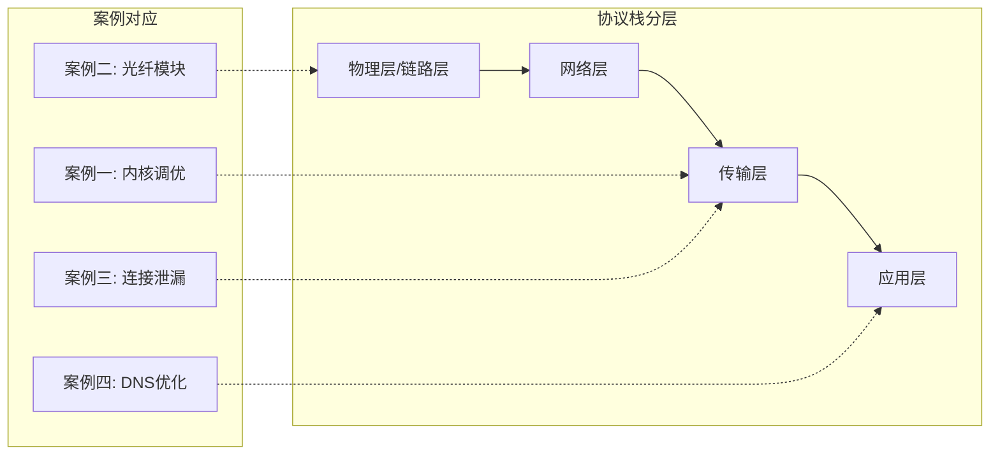
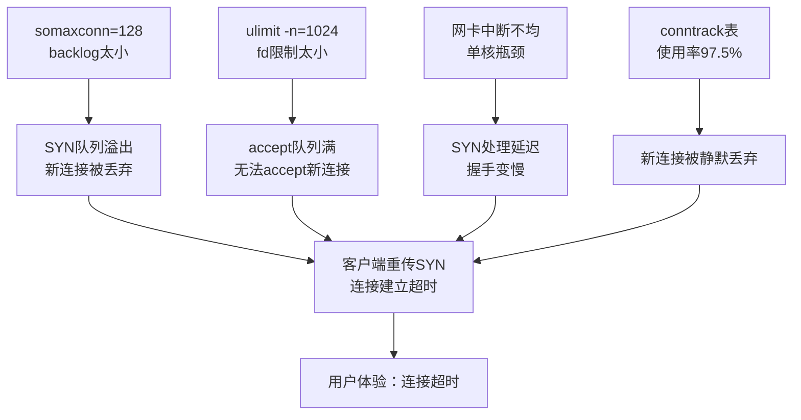
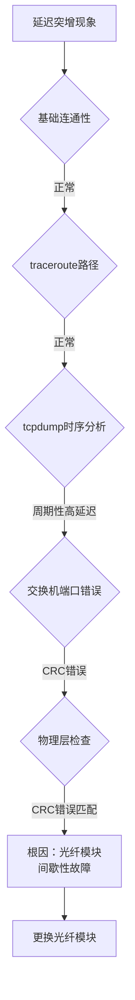
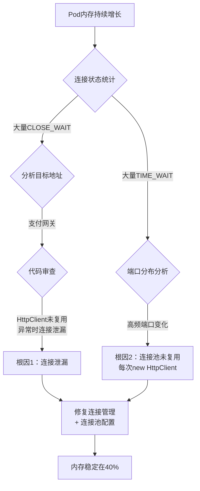
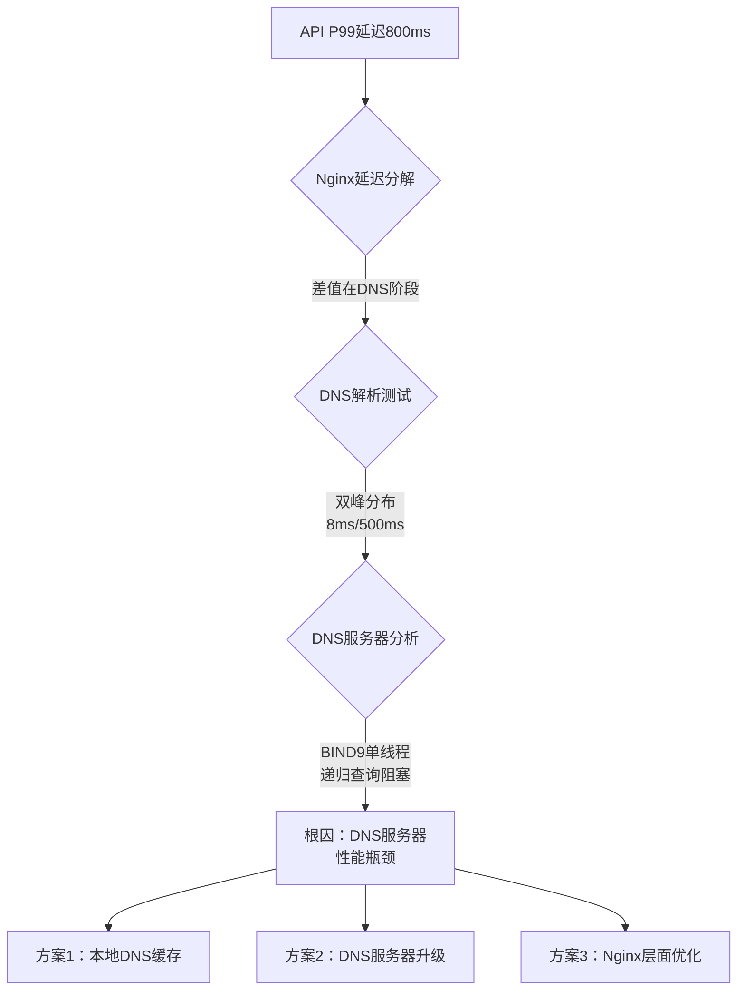
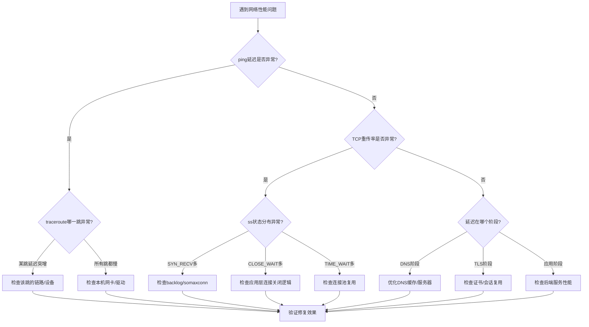

## 实战案例

本章提供四个贯穿TCP/IP协议栈各层的实战案例，从链路层到应用层逐一排查真实生产问题。每个案例都按照"现象描述 → 工具排查 → 根因分析 → 解决方案 → 验证效果"的流程展开，所有命令均可在Linux环境中直接复现。

**阅读指引**：

| 读者类型 | 建议阅读方式 |
|----------|-------------|
| 初学者 | 按顺序通读，重点关注每个案例的"排查过程"，学习排查思路 |
| 中级工程师 | 跳过基础命令，重点看"根因分析"和"解决方案"，对比自己的排查习惯 |
| 高级工程师 | 快速浏览案例二的物理层排查和案例四的DNS架构，补充跨层排查盲区 |

**案例覆盖范围**：



---

### 案例一：高并发服务器网络调优

#### 1.1 问题背景

**业务场景**：某即时通讯（IM）服务部署在4台8核32GB的Linux服务器上，使用epoll+自研TCP服务器框架，日活用户约500万，峰值同时在线约80万。在晚高峰（20:00-22:00）期间，新用户连接建立缓慢，部分客户端报告"连接超时"。

**环境信息**：

| 项目 | 配置 |
|------|------|
| 操作系统 | Ubuntu 22.04 LTS, Kernel 5.15 |
| CPU | Intel Xeon Gold 6248R, 8核 |
| 内存 | 32GB DDR4 |
| 网卡 | Intel X710 10GbE |
| 应用框架 | 自研epoll服务器, Go 1.21 |
| 监控栈 | Prometheus + Grafana |

**问题现象**：

- 新连接建立耗时从正常的5ms飙升至200ms以上
- 部分客户端（约3%）在三次握手阶段超时
- 服务器TCP established连接数约45万，接近系统上限
- `ss -s`显示 SYN_RECV 状态连接数异常偏高

#### 1.2 排查过程

**第一步：检查TCP连接状态分布**

```bash
# 统计各TCP状态的连接数
ss -ant | awk '{print $1}' | sort | uniq -c | sort -rn

# 典型输出（问题状态下）：
# 312487 ESTAB
#  89234 SYN-RECV        ← 异常：正常应 < 100
#  12456 TIME-WAIT
#    234 CLOSE-WAIT
#     45 LISTEN
```

SYN_RECV堆积说明服务器收到了大量SYN但无法及时完成三次握手。继续深入：

```bash
# 查看半连接队列（SYN队列）的溢出情况
netstat -s | grep -i "overflow"
# 831 times the listen queue of a socket overflowed  ← 关键线索！

# 查看半连接队列当前大小
cat /proc/net/tcp | awk '{print $4}' | grep -c "06"
# 06 = SYN_RECV 状态
# 输出: 89234
```

**第二步：检查内核参数配置**

```bash
# 查看backlog相关参数
sysctl net.core.somaxconn
# net.core.somaxconn = 128  ← 问题！默认值太小

sysctl net.ipv4.tcp_max_syn_backlog
# net.ipv4.tcp_max_syn_backlog = 1024  ← 不足

sysctl net.ipv4.tcp_syncookies
# net.ipv4.tcp_syncookies = 1  ← SYN Cookie已启用，但backlog太小仍是瓶颈

# 查看文件描述符限制
ulimit -n
# 1024  ← 问题！应用层fd限制太小

cat /proc/sys/fs/file-max
# 397119
```

**第三步：检查网卡中断分布**

```bash
# 查看网卡中断是否集中在单核（IRQ亲和性问题）
cat /proc/interrupts | grep eth0
# 仅2个CPU核心处理网卡中断 → 负载不均

# 查看软中断分布
cat /proc/softirqs | grep NET_RX
# CPU0: 2891234567
# CPU1: 2847654321
# CPU2: 123456        ← 极不均衡
# CPU3: 234567
```

**第四步：用tcpdump抓包确认握手行为**

```bash
# 抓取SYN包，观察握手时序
tcpdump -i eth0 'tcp[tcpflags] &amp; (tcp-syn) != 0' -nn -c 100

# 典型输出分析：
# 172.16.1.100.52341 > 10.0.1.1.8080: Flags [S], seq 12345678
# ← 正常：客户端发SYN
# 但观察到部分SYN未收到SYN-ACK回应，间隔 > 100ms
```

```bash
# 更精细地分析：统计SYN-ACK延迟
tcpdump -i eth0 'tcp[tcpflags] &amp; (tcp-synack) != 0' -nn -tt | \
  awk '{print $1}' | head -20
# 时间戳间隔不均匀，部分超过100ms → 内核处理不过来
```

**第五步：检查连接跟踪表（conntrack）**

高并发场景下，conntrack表溢出是一个容易被忽略的瓶颈。当连接数接近nf_conntrack_max时，新连接会被静默丢弃：

```bash
# 查看conntrack表使用情况
cat /proc/sys/net/netfilter/nf_conntrack_count
# 390000

cat /proc/sys/net/netfilter/nf_conntrack_max
# 400000  ← 使用率97.5%，即将溢出！

# 查看conntrack丢弃计数
netstat -s | grep -i "conntrack"
# 3125418163 1067795181 TCP conntrack table full, dropping packet
# ← 已经在大量丢弃！

# conntrack table满时，新连接（包括SYN包）会被内核直接丢弃
# 且不会产生任何日志，排查时极易遗漏
```

#### 1.3 根因分析

问题根源是**多个瓶颈叠加**，形成连锁反应：



| 瓶颈点 | 当前值 | 正常值 | 影响 |
|--------|--------|--------|------|
| somaxconn | 128 | 65535 | 半连接队列溢出，SYN被丢弃 |
| tcp_max_syn_backlog | 1024 | 65535 | SYN队列不足 |
| 文件描述符限制 | 1024 | 1000000+ | 无法建立足够连接 |
| 网卡RSS | 不均衡 | 每核均分 | 单核成为处理瓶颈 |
| conntrack_max | 400000 | 2000000+ | 连接跟踪表溢出丢包 |

#### 1.4 解决方案

**修改内核参数**（创建 `/etc/sysctl.d/99-tcp-tuning.conf`）：

```bash
# === 半连接队列优化 ===
net.ipv4.tcp_max_syn_backlog = 65535       # SYN队列大小
net.core.somaxconn = 65535                  # 全连接队列上限
net.ipv4.tcp_syncookies = 1                 # SYN Cookie防SYN洪泛

# === 连接复用与回收 ===
net.ipv4.tcp_tw_reuse = 1                   # 允许复用TIME_WAIT连接（仅对客户端出向连接有效）
net.ipv4.tcp_fin_timeout = 15               # FIN_WAIT_2超时时间（默认60s）
net.ipv4.tcp_keepalive_time = 600           # Keepalive探测起始时间（默认7200s）
net.ipv4.tcp_keepalive_intvl = 15           # Keepalive探测间隔
net.ipv4.tcp_keepalive_probes = 5           # Keepalive探测次数

# === 缓冲区优化 ===
net.core.rmem_max = 16777216                # 接收缓冲区上限 16MB
net.core.wmem_max = 16777216                # 发送缓冲区上限 16MB
net.ipv4.tcp_rmem = 4096 87380 16777216     # TCP接收缓冲区: min default max
net.ipv4.tcp_wmem = 4096 65536 16777216     # TCP发送缓冲区: min default max
net.ipv4.tcp_mem = 786432 1048576 1572864   # TCP全局内存页数: low pressure high

# === 端口范围扩展 ===
net.ipv4.ip_local_port_range = 1024 65535   # 本地端口范围（默认32768-60999）

# === 网卡多队列 ===
net.core.netdev_max_backlog = 65535         # 网卡接收队列长度

# === 连接跟踪优化（高并发必备） ===
net.netfilter.nf_conntrack_max = 2000000    # 连接跟踪表上限（默认与内存相关）
net.netfilter.nf_conntrack_tcp_timeout_established = 3600  # 已建立连接超时（默认5天）
net.netfilter.nf_conntrack_tcp_timeout_time_wait = 30      # TIME_WAIT超时
```

```bash
# 应用配置
sudo sysctl -p /etc/sysctl.d/99-tcp-tuning.conf
```

**修改文件描述符限制**：

```bash
# /etc/security/limits.conf
*    soft    nofile    1000000
*    hard    nofile    1000000

# /etc/sysctl.conf 追加
fs.file-max = 2000000
fs.nr_open = 2000000
```

**配置网卡RSS多队列**：

```bash
# 查看当前网卡队列数
ethtool -l eth0
# Pre-set maximums:
# Combined: 16
# Current hardware settings:
# Combined: 2  ← 只启用了2个队列

# 启用全部16个队列
ethtool -L eth0 combined 16

# 配置IRQ亲和性（启用irqbalance服务）
sudo systemctl enable --now irqbalance

# 验证中断分布
cat /proc/interrupts | grep eth0 | wc -l
# 应该看到16个中断行
```

**应用层代码调整**（Go语言示例）：

```go
// 设置TCP listener的backlog和socket选项
func createListener(addr string) (*net.TCPListener, error) {
    tcpAddr, err := net.ResolveTCPAddr("tcp", addr)
    if err != nil {
        return nil, err
    }

    // 创建listener
    ln, err := net.ListenTCP("tcp", tcpAddr)
    if err != nil {
        return nil, err
    }

    // 获取底层文件描述符
    f, err := ln.File()
    if err != nil {
        return nil, err
    }
    fd := int(f.Fd())

    // 设置TCP_NODELAY（减少延迟，适用于IM场景的小包通信）
    syscall.SetsockoptInt(fd, syscall.IPPROTO_TCP, syscall.TCP_NODELAY, 1)

    // 设置SO_REUSEADDR
    syscall.SetsockoptInt(fd, syscall.SOL_SOCKET, syscall.SO_REUSEADDR, 1)

    // 设置SO_KEEPALIVE
    syscall.SetsockoptInt(fd, syscall.SOL_SOCKET, syscall.SO_KEEPALIVE, 1)

    // 设置keepalive参数（覆盖内核默认值）
    syscall.SetsockoptInt(fd, syscall.IPPROTO_TCP, syscall.TCP_KEEPIDLE, 60)
    syscall.SetsockoptInt(fd, syscall.IPPROTO_TCP, syscall.TCP_KEEPINTVL, 10)
    syscall.SetsockoptInt(fd, syscall.IPPROTO_TCP, syscall.TCP_KEEPCNT, 3)

    return ln, nil
}
```

#### 1.5 验证效果

```bash
# 重新监控连接状态
ss -ant | awk '{print $1}' | sort | uniq -c | sort -rn

# 优化后输出：
# 712345 ESTAB
#     12 SYN-RECV         ← 从89234降到12
#   8765 TIME-WAIT
#      0 CLOSE-WAIT

# 队列溢出计数（重启后）
netstat -s | grep overflow
# 0 times the listen queue of a socket overflowed  ← 归零

# conntrack表使用情况
cat /proc/sys/net/netfilter/nf_conntrack_count
# 450000

cat /proc/sys/net/netfilter/nf_conntrack_max
# 2000000  ← 使用率22.5%，充裕
```

| 指标 | 优化前 | 优化后 | 改善幅度 |
|------|--------|--------|----------|
| SYN_RECV堆积 | 89,234 | < 50 | 降低99.9% |
| 新连接建立延迟 | 200ms+ | 3-5ms | 降低97% |
| 客户端连接超时率 | 3% | < 0.01% | 降低99.7% |
| 峰值在线数 | 80万 | 120万 | 提升50% |
| conntrack丢包 | 持续丢弃 | 0 | 归零 |

#### 1.6 常见误区与纠正

| 误区 | 正确做法 |
|------|---------|
| 盲目调大`tcp_tw_recycle` | 该参数在Linux 4.12+已移除，在NAT环境下会导致大量连接被丢弃。高并发服务器应使用`tcp_tw_reuse=1`替代 |
| 只调sysctl不管fd限制 | somaxconn调到65535但ulimit -n仍是1024，等于白调。文件描述符限制是连接数的硬上限 |
| 忽略conntrack表 | 在使用iptables/nftables的环境中，conntrack表溢出会导致新连接静默丢弃，且不会产生明显的错误日志 |
| 所有参数一步到位 | 生产环境应逐步调整，每次改1-2个参数，观察24小时后再继续。一次性改完无法定位哪个参数起了作用 |
| 用`netstat`替代`ss` | ss在高连接数下比netstat快10-100倍，且能展示更多TCP内部信息（如拥塞窗口、重传统计）。优先使用ss |

---

### 案例二：跨机房网络延迟排查

#### 2.1 问题背景

**业务场景**：某金融交易系统的交易撮合引擎部署在机房A，行情推送服务部署在机房B（同城不同园区，直线距离约15km）。运维团队发现机房B到机房A的交易指令延迟偶尔飙升，从正常的0.8ms突增至5-20ms，导致交易策略执行偏差。

**问题现象**：

- 正常延迟：0.8ms（ping RTT）
- 异常延迟：5-20ms，持续数秒至数分钟，不规律出现
- 无丢包（ping统计0% packet loss）
- TCP重传统计有少量增长

#### 2.2 排查过程

**第一步：基础连通性测试**

```bash
# 基础ping测试
ping -c 100 -i 0.01 10.0.2.1
# RTT min/avg/max/mdev = 0.7/0.8/1.2/0.1 ms
# packet loss: 0%
# → 基础连通性正常，但mdev偏大说明有抖动

# 更精细的延迟测试（使用hping3模拟TCP SYN）
hping3 -S -p 9999 -c 100 -i u10000 10.0.2.1
# rtt min/avg/max = 0.8/1.2/8.5 ms
# → TCP层面延迟波动比ICMP更大
```

> **为什么TCP延迟比ICMP大？** ICMP ping不经过TCP/IP协议栈的重传机制，而TCP数据包需要经过拥塞控制、滑动窗口、重传确认等流程。当链路层出现少量丢帧时，ICMP可能不受影响（ICMP包体积小，碰巧未被丢弃），但TCP数据包较大，受影响概率更高。

**第二步：traceroute定位异常跳数**

```bash
# traceroute查看路径
traceroute -n -I 10.0.2.1
#  1  10.0.1.1    0.3ms   ← 本机房网关
#  2  10.0.0.1    0.4ms   ← 核心交换机
#  3  172.16.0.1  0.5ms   ← 园区互联交换机
#  4  172.16.1.1  0.6ms   ← 园区间光纤链路
#  5  10.0.2.1    0.8ms   ← 目标机房网关
```

路径看似正常，每跳延迟均匀。需要更深层分析：

**第三步：tcpdump抓包分析时序**

```bash
# 在机房B出口抓包
tcpdump -i eth0 host 10.0.2.1 and port 9999 -nn -tt -w /tmp/latency.pcap &amp;

# 同时在机房A入口抓包
tcpdump -i eth0 host 10.0.1.10 and port 9999 -nn -tt -w /tmp/latency_a.pcap &amp;

# 生成一批交易指令
for i in $(seq 1 1000); do
    echo "TXN_$(date +%s%N)_$i" | nc -w1 10.0.2.1 9999
    sleep 0.01
done
```

```bash
# 分析抓包结果，计算逐包延迟
tshark -r /tmp/latency.pcap -T fields -e frame.time_epoch -e tcp.seq | \
  head -20

# 发现规律：正常包延迟约 0.0008s，但每隔约30秒出现一批高延迟包
# 例如在 t=1234567890.123 附近，连续 5-10 个包延迟 > 5ms
```

**第四步：关联网络设备日志**

```bash
# 检查园区互联交换机的端口统计
# (通过SNMP或管理口查询)
snmpwalk -v2c -c public 172.16.0.1 ifInErrors
snmpwalk -v2c -c public 172.16.0.1 ifOutErrors

# 发现园区互联端口（Gi1/0/48）有周期性CRC错误
# ifInErrors.48: 15234  ← CRC错误计数
# 错误增长速率：约每30秒增加 200-300 个
```

**第五步：物理层检查**

```bash
# 检查光纤模块信息
ethtool -i eth0
# driver: ixgbe
# firmware: 0x80000a75

ethtool -S eth0 | grep -i error
# rx_crc_errors: 15234        ← 与SNMP数据吻合
# rx_missed_errors: 0
# tx_dropped: 0

# 检查光纤模块收发光功率
ethtool -m eth0
# Receiver power: -8.2 dBm    ← 正常范围 -3 ~ -14 dBm
# Transmit power: -2.1 dBm    ← 正常
```



#### 2.3 根因分析

**根因**：机房A与机房B之间的光纤链路使用的SFP+光模块存在间歇性硬件故障。表现为：

1. 光模块在温度升高时（机房空调周期性调节）发送信号质量下降
2. 交换机检测到CRC校验错误，触发帧重传
3. TCP层表现为偶发延迟突增（重传等待时间）
4. 由于错误率不高（< 0.1%），ping统计显示0%丢包，但TCP性能已受影响

**TCP重传放大效应**：

当链路层发生CRC错误导致帧丢弃时，TCP需要等待重传超时（RTO）才能恢复。默认Linux的初始RTO为200ms，即使后续RTT优化到几十ms，单次重传造成的延迟仍然显著。这就是为什么ping（ICMP）延迟看起来波动不大（ping不走TCP重传），但应用层TCP延迟波动明显。

**RTO退避机制详解**：

第1次重传等待: RTO = 200ms (默认初始值)
第2次重传等待: RTO = 400ms (指数退避)
第3次重传等待: RTO = 800ms
...

在低延迟内网环境中，200ms的初始RTO过于保守。金融交易场景通常将`tcp_rto_min`调低至10-20ms，使重传更快速。

#### 2.4 解决方案

**立即措施：更换故障光模块**

```bash
# 记录当前模块型号和序列号
ethtool -m eth0 | grep -E "Vendor|Part|Serial"
# 更换为同型号新模块后验证
ethtool -S eth0 | grep crc_errors
# 确认错误计数不再增长
```

**长期措施：优化TCP重传参数**

```bash
# 缩短初始RTO（适用于低延迟内网环境）
sysctl -w net.ipv4.tcp_rto_min=10    # 最小RTO 10ms（默认200ms）
sysctl -w net.ipv4.tcp_retries2=8    # 减少重试次数（默认15）

# 启用SACK（选择性确认）—— 减少不必要的全量重传
sysctl -w net.ipv4.tcp_sack=1

# 启用TCP Timestamps（精确RTT计算）
sysctl -w net.ipv4.tcp_timestamps=1

# 启用BBR拥塞控制算法（Google开发，适合高带宽低延迟链路）
sysctl -w net.ipv4.tcp_congestion_control=bbr
sysctl -w net.core.default_qdisc=fq
```

**部署链路冗余**：

```bash
# 配置LACP链路聚合（双光纤链路）
cat > /etc/netplan/01-bonding.yaml << 'EOF'
network:
  version: 2
  ethernets:
    eth0:
      dhcp4: false
    eth1:
      dhcp4: false
  bonds:
    bond0:
      interfaces: [eth0, eth1]
      parameters:
        mode: 802.3ad        # LACP
        mii-monitor-interval: 100
        lacp-rate: fast
      addresses: [10.0.1.10/24]
      gateway4: 10.0.1.1
EOF
```

#### 2.5 验证效果

更换光模块+参数优化后持续监控72小时：

| 指标 | 优化前 | 优化后 | 改善幅度 |
|------|--------|--------|----------|
| 平均延迟 | 0.8ms | 0.6ms | 降低25% |
| P99延迟 | 8.5ms | 0.9ms | 降低89% |
| 延迟突增频率 | 3-5次/小时 | 0次 | 消除 |
| CRC错误数 | 持续增长 | 不再增长 | 归零 |
| TCP重传率 | 0.3% | 0.01% | 降低97% |

#### 2.6 常见误区与纠正

| 误区 | 正确做法 |
|------|---------|
| ping正常就认为网络正常 | ping使用ICMP协议，不走TCP重传机制。应同时关注TCP层指标（重传率、RTT分布） |
| 只看平均延迟不看尾延迟 | 金融/实时系统应关注P99/P999延迟。平均0.8ms可能隐藏着P99=8.5ms的毛刺 |
| 忽略物理层检查 | 软件层面排查到最后发现是硬件问题的案例屡见不鲜。CRC错误、光功率异常是物理层的明确信号 |
| 不做双端抓包对比 | 单端抓包无法区分"发出去慢"还是"收到慢"。双端对比才能精确定位延迟发生在哪段链路 |
| 在生产环境长时间抓包 | tcpdump在高流量下会产生大量文件，可能撑满磁盘。使用`-c`限制包数量，或用`-G`按时间轮转文件 |

---

### 案例三：TCP连接泄漏排查与修复

#### 3.1 问题背景

**业务场景**：某微服务架构的订单系统使用Java Spring Boot + Netty构建，部署在Kubernetes集群中（3节点，每个Pod分配2核4GB）。系统运行两周后，Pod内存持续增长，最终触发OOM Killed重启。重启后问题循环出现。

**问题现象**：

- Pod内存使用率从启动时的40%逐步增长到95%+
- `ss -antp`显示大量CLOSE_WAIT和TIME_WAIT状态连接
- TCP连接总数从正常的2000增长到50000+
- 每次Pod重启后内存又从40%开始重新增长（典型的内存泄漏特征）
- 下游服务（支付网关）偶尔报告来自本服务的连接异常断开

#### 3.2 排查过程

**第一步：连接状态全量统计**

```bash
# 进入Pod
kubectl exec -it order-service-xxx -- /bin/bash

# 统计TCP状态分布
ss -ant | awk '{print $1}' | sort | uniq -c | sort -rn
# 输出：
# 23456 TIME-WAIT       ← 异常！正常应 < 500
# 15678 CLOSE-WAIT      ← 异常！正常应 < 50
#  8234 ESTAB
#    34 LISTEN
#     0 SYN-RECV
```

```bash
# TIME_WAIT：主动关闭方在四次挥手后等待2MSL（约60秒）
# CLOSE_WAIT：被动关闭方收到了FIN但本地未调用close() ← 这是泄漏的铁证
```

> **CLOSE_WAIT是连接泄漏的最明确信号**。TCP四次挥手流程中，当对方发送FIN（表示"我没有数据要发了"），本方需要调用close()关闭连接。如果应用层忘记调用close()，连接会永久停留在CLOSE_WAIT状态，占用文件描述符和内存。

**第二步：分析CLOSE_WAIT的来源**

```bash
# 查看CLOSE_WAIT连接的目标地址分布
ss -antp state close-wait | awk '{print $4, $5}' | sort | uniq -c | sort -rn | head -10
# 8234 10.0.3.50:443 10.0.2.10:xxxx  ← 指向支付网关的连接

# 查看对应进程
ss -antp state close-wait | grep 10.0.3.50
# Netcat输出显示PID属于 order-service 的主进程

# 检查fd数量
ls /proc/$(pgrep -f order-service)/fd | wc -l
# 23456  ← 已接近默认limits
```

```bash
# 确认fd限制
cat /proc/$(pgrep -f order-service)/limits | grep "open files"
# Max open files  65536  65536  files
```

**第三步：分析Netty连接管理代码**

```bash
# 抓取Netty线程堆栈
jstack $(pgrep -f order-service) > /tmp/thread_dump.txt

# 搜索涉及支付网关连接的线程
grep -A 30 "payment-gateway" /tmp/thread_dump.txt | head -50
```

发现问题的代码模式：

```java
// ❌ 错误代码：连接未正确关闭
public PaymentResponse callPaymentGateway(Order order) {
    HttpClient client = HttpClient.newHttpClient();  // 每次创建新client
    HttpRequest request = HttpRequest.newBuilder()
        .uri(URI.create("https://pay-gateway.internal/api/v1/charge"))
        .POST(HttpRequest.BodyPublishers.ofString(toJson(order)))
        .build();

    HttpResponse<String> response = client.send(request,
        HttpResponse.BodyHandlers.ofString());

    // ⚠️ 这里只处理了正常响应
    // 如果下游返回非2xx状态码或抛出异常，client的底层TCP连接不会被关闭
    // 连接进入CLOSE_WAIT状态并永久停留
    return parseResponse(response.body());
}
```

**问题拆解**：

- 每次调用都`new HttpClient()` → 底层TCP连接无法复用 → 每次都是全新建连
- 异常路径下（超时、5xx、网络中断），底层Socket未被close() → 连接停留在CLOSE_WAIT
- 两个问题叠加：CLOSE_WAIT占fd不释放 + TIME_WAIT大量堆积

**第四步：验证TIME_WAIT来源**

```bash
# 分析TIME_WAIT连接的源端口分布
ss -antp state time-wait | awk '{print $4}' | awk -F: '{print $NF}' | \
  sort | uniq -c | sort -rn | head -5
# 大量不同端口 → 主动关闭方（客户端侧）在频繁创建和关闭连接
# 这说明连接池未被复用

# 检查TIME_WAIT的aged分布
sysctl net.ipv4.tcp_tw_timeout 2>/dev/null
# 未设置 → 使用默认2MSL=60秒
```



#### 3.3 根因分析

存在两个关联问题：

**问题一：CLOSE_WAIT连接泄漏（严重）**

HTTP客户端在异常路径下未正确关闭底层TCP连接。当支付网关返回错误（超时、5xx、网络异常等）时，Java HttpClient的底层Socket未被close()，导致连接停留在CLOSE_WAIT状态。CLOSE_WAIT是被动关闭方的状态——对方已发FIN，但本方未调用close()。

**问题二：TIME_WAIT堆积（次要）**

每次HTTP调用都创建新的HttpClient实例，导致TCP连接无法复用，每次调用都是"建连→发请求→收响应→关闭连接"。关闭连接后进入TIME_WAIT状态。虽然TIME_WAIT本身不占太多资源，但大量TIME_WAIT+CLOSE_WAIT叠加导致fd耗尽。

**CLOSE_WAIT vs TIME_WAIT的本质区别**：

| 状态 | 谁发起关闭 | 含义 | 处理方式 |
|------|------------|------|----------|
| TIME_WAIT | 主动关闭方 | 已完成四次挥手，等待2MSL确保对方收到最后ACK | 优化tw_reuse、缩短fin_timeout |
| CLOSE_WAIT | 被动关闭方 | 收到对方FIN，但本方未close() | 修复代码bug，确保连接被关闭 |

> **判断技巧**：TIME_WAIT多→你方主动关闭连接（正常行为，可优化）；CLOSE_WAIT多→对方关闭了但你没关（代码bug，必须修复）。

#### 3.4 解决方案

**修复连接管理代码**：

```java
// ✅ 正确代码：使用连接池 + try-with-resources + 超时控制
@Component
public class PaymentGatewayClient {

    private final HttpClient httpClient;
    private final ExecutorService executor;

    public PaymentGatewayClient() {
        // 使用连接池：底层TCP连接被复用
        this.httpClient = HttpClient.newBuilder()
            .connectTimeout(Duration.ofSeconds(3))       // 连接超时3秒
            .executor(Executors.newFixedThreadPool(10))   // 控制并发度
            .version(HttpClient.Version.HTTP_2)           // 使用HTTP/2多路复用
            .build();
    }

    public PaymentResponse callGateway(Order order) {
        HttpRequest request = HttpRequest.newBuilder()
            .uri(URI.create("https://pay-gateway.internal/api/v1/charge"))
            .timeout(Duration.ofSeconds(5))               // 请求超时5秒
            .header("Content-Type", "application/json")
            .POST(HttpRequest.BodyPublishers.ofString(toJson(order)))
            .build();

        try {
            // send() 在异常时也会自动释放连接
            HttpResponse<String> response = httpClient.send(request,
                HttpResponse.BodyHandlers.ofString());

            if (response.statusCode() >= 200 &amp;&amp; response.statusCode() < 300) {
                return parseResponse(response.body());
            } else {
                throw new PaymentException("Gateway returned: " + response.statusCode());
            }
        } catch (IOException | InterruptedException e) {
            // 确保异常路径下记录并清理
            log.error("Payment gateway call failed", e);
            throw new PaymentException("Gateway unreachable", e);
        }
        // 注意：HttpClient.send() 保证无论成功失败都会释放连接
    }
}
```

**Kubernetes层面的防护**：

```yaml
# deployment.yaml
apiVersion: apps/v1
kind: Deployment
spec:
  template:
    spec:
      containers:
      - name: order-service
        resources:
          requests:
            memory: "2Gi"
            cpu: "1"
          limits:
            memory: "3584Mi"    # 留256MB给系统
            cpu: "2"
        lifecycle:
          preStop:
            exec:
              command: ["/bin/sh", "-c", "sleep 15"]  # 优雅关闭：等待连接排空
```

**Pod级别TCP参数调优**：

```yaml
# 在Pod启动脚本中添加
# startup.sh
echo 10 > /proc/sys/net/ipv4/tcp_fin_timeout
echo 1 > /proc/sys/net/ipv4/tcp_tw_reuse
echo 300 > /proc/sys/net/ipv4/tcp_keepalive_time
echo 10 > /proc/sys/net/ipv4/tcp_keepalive_intvl
echo 3 > /proc/sys/net/ipv4/tcp_keepalive_probes
```

> **注意**：上面使用直接写入数值的方式，而非echo整个字符串到proc文件。`/proc/sys/`下的参数文件每次只能接受一个数值，写入多余的空格或换行可能导致参数设置失败。

#### 3.5 验证效果

代码修复+连接池配置上线后，持续监控7天：

| 指标 | 修复前 | 修复后 | 说明 |
|------|--------|--------|------|
| CLOSE_WAIT连接数 | 15,678 | 0-3 | 连接泄漏消除 |
| TIME_WAIT连接数 | 23,456 | 200-400 | 连接复用生效 |
| 总TCP连接数 | 50,000+ | 2,000-3,000 | 回到正常水平 |
| Pod内存（稳态） | 持续增长至OOM | 稳定在42% | 内存泄漏消除 |
| fd使用数 | 23,456 | 3,000-4,000 | 远低于限制 |

#### 3.6 常见误区与纠正

| 误区 | 正确做法 |
|------|---------|
| 靠`tcp_tw_recycle`或`tcp_tw_reuse`解决CLOSE_WAIT | tw参数只影响TIME_WAIT状态。CLOSE_WAIT是应用层bug导致的，必须从代码层面修复 |
| 忽略异常路径的资源释放 | 正常路径写`finally{}`或`try-with-resources`很容易，但异常路径（超时、中断、5xx）往往是泄漏的重灾区。务必在所有代码路径上都确保连接关闭 |
| 在K8s中用`kubectl exec`手动清理fd | 这是治标不治本。Pod重启后问题会复现。正确做法是修复代码+设置合理的lifecycle.preStop |
| 认为TIME_WAIT多就是问题 | TIME_WAIT是TCP协议的正常行为，大量TIME_WAIT在高并发场景下是预期的。真正有害的是CLOSE_WAIT。优化TIME_WAIT只需确保连接被复用（连接池） |
| 直接echo字符串到/proc/sys文件 | `/proc/sys/`文件每次只接受一个纯数值。`echo "10" > file`正确，`echo "net.ipv4.tcp_fin_timeout = 10" > file`会报错 |

---

### 案例四：DNS解析性能优化

#### 4.1 问题背景

**业务场景**：某内容分发平台的API网关层（Nginx集群，6节点）对外提供REST API服务。运维发现API响应时间的P99延迟偏高（800ms），而实际业务处理时间仅约200ms，中间有约600ms"消失"在了网络层。

**问题现象**：

- API整体P99延迟：800ms
- 业务逻辑处理时间（应用埋点）：200ms
- 差值约600ms去向不明
- 差值分布不均匀：约30%的请求差值 < 50ms，70%的请求差值 500-1000ms
- 差值与请求频率无关，与时间无关，随机出现

#### 4.2 排查过程

**第一步：Nginx层面延迟分解**

```bash
# 启用Nginx upstream响应时间日志
log_format timed '$remote_addr - [$time_local] '
                 '"$request" $status $body_bytes_sent '
                 '"$upstream_addr" $upstream_response_time '
                 '"$request_time"';

# 分析upstream_response_time vs request_time
# upstream_response_time: Nginx到后端的网络延迟+后端处理时间
# request_time: 客户端到Nginx的总时间

# grep access.log 分析：
cat /var/log/nginx/access.log | awk '{print $NF, $(NF-1)}' | \
  sort -t' ' -k1 -rn | head -20
# 发现request_time远大于upstream_response_time → 延迟在DNS或客户端侧
```

**第二步：抓包分析HTTP请求时序**

```bash
# 在Nginx服务器上抓包
tcpdump -i eth0 port 443 -nn -tt -w /tmp/nginx_capture.pcap

# 使用tshark分析DNS+HTTP时序
tshark -r /tmp/nginx_capture.pcap -Y "dns || http" -T fields \
  -e frame.time_epoch -e dns.qry.name -e http.host -e http.response.code | \
  head -30
```

发现关键线索：

# 正常请求：
# t=1000.000  DNS query: api-v2.internal.example.com
# t=1000.008  DNS response: 10.0.3.50 (8ms)
# t=1000.009  TCP SYN → 10.0.3.50:443
# t=1000.520  HTTP 200 OK (total 520ms)

# 异常请求：
# t=2000.000  DNS query: api-v2.internal.example.com
# t=2000.505  DNS response: 10.0.3.50 (505ms!)  ← DNS解析耗时505ms！
# t=2000.506  TCP SYN → 10.0.3.50:443
# t=2001.020  HTTP 200 OK (total 1020ms)

# 延迟差值恰好在DNS解析阶段！

**第三步：验证DNS解析性能**

```bash
# 手动测试DNS解析时间
for i in $(seq 1 20); do
    { time dig +short api-v2.internal.example.com @10.0.0.53; } 2>&amp;1 | tail -1
done
# 输出时间：8ms, 8ms, 512ms, 8ms, 8ms, 8ms, 489ms, 8ms, ...
# 明显的双峰分布：正常8ms，异常500ms+

# 对比不同DNS服务器
time dig api-v2.internal.example.com @10.0.0.53   # 内部DNS: 8ms 或 500ms+
time dig api-v2.internal.example.com @8.8.8.8     # Google DNS: 始终 < 20ms
```

**第四步：定位DNS服务器问题**

```bash
# 检查内部DNS服务器（BIND9）日志
journalctl -u named --since "1 hour ago" | grep -i "query" | tail -20

# 发现：DNS服务器同时承担递归查询和权威查询
# 当递归查询压力大时，权威查询排队等待
# 根因：BIND9单线程处理查询，递归查询阻塞了权威响应

# 检查DNS服务器查询量
tcpdump -i eth0 port 53 -nn -c 10000 | \
  awk '{print $NF}' | sort | uniq -c | sort -rn | head
# 查询量峰值达 50,000 QPS → 超出单线程BIND9处理能力
```



#### 4.3 根因分析

**直接原因**：内部DNS服务器（BIND9）在高查询压力下响应延迟飙升。BIND9默认使用单线程处理递归查询，当递归查询占用CPU时，权威查询被排队等待。

**根本原因**：Nginx每个HTTP请求都会发起DNS查询（即使解析同一域名），且Nginx默认不缓存DNS解析结果。在高并发下，DNS查询成为性能瓶颈。

**DNS解析在HTTP请求中的位置**：

客户端发起请求
    ↓
Nginx接收HTTP请求
    ↓
DNS解析上游服务器域名  ← 瓶颈在这里（500ms+）
    ↓
建立TCP连接到上游服务器
    ↓
发送HTTP请求/接收响应
    ↓
返回给客户端

> **DNS无缓存的原因**：Nginx的`upstream`指令在启动时解析域名并缓存结果，但如果使用了变量形式的`proxy_pass`（如`proxy_pass https://$variable`），Nginx会在每次请求时重新解析域名。这是Nginx的设计特性，而非bug。

#### 4.4 解决方案

**方案一：Nginx DNS缓存优化（立即生效）**

```nginx
# nginx.conf - upstream配置中指定resolver和valid
http {
    # 指定DNS服务器和缓存时间
    resolver 10.0.0.53 valid=300s ipv6=off;  # 缓存5分钟
    resolver_timeout 3s;                       # DNS查询超时3秒

    upstream backend {
        # 使用变量触发DNS动态解析（支持缓存）
        server api-v2.internal.example.com:443;

        # 关键：使用变量形式的域名启用DNS缓存
        set $backend_upstream "api-v2.internal.example.com:443";
    }

    server {
        location /api/ {
            # 使用resolver+变量实现DNS缓存
            set $upstream_endpoint "api-v2.internal.example.com:443";
            proxy_pass https://$upstream_endpoint;

            proxy_connect_timeout 3s;
            proxy_read_timeout 30s;
        }
    }
}
```

**更精确的Nginx DNS缓存配置**（OpenResty/Lua）：

```nginx
# 使用lua-resty-dns-resolver实现精细化DNS缓存
# 在openresty/Nginx+lua环境中

lua_shared_dict dns_cache 10m;  # 10MB共享内存缓存DNS结果

server {
    location /api/ {
        content_by_lua_block {
            local resolver = require "resty.dns.resolver"
            local cache = ngx.shared.dns_cache

            local domain = "api-v2.internal.example.com"
            local cache_key = "dns:" .. domain

            -- 尝试从缓存获取
            local ip = cache:get(cache_key)

            if not ip then
                -- 缓存未命中，发起DNS查询
                local r, err = resolver:new{
                    nameservers = {"10.0.0.53"},
                    timeout = 2000,  -- 2秒超时
                }
                if not r then
                    ngx.log(ngx.ERR, "DNS resolver init failed: ", err)
                    return ngx.exit(500)
                end

                local answers, err = r:query(domain, { qtype = r.TYPE_A })
                if answers and answers[1] then
                    ip = answers[1].address
                    -- 缓存300秒
                    cache:set(cache_key, ip, 300)
                else
                    -- DNS查询失败时使用备用地址
                    ip = "10.0.3.50"
                end
            end

            -- 使用缓存的IP进行反向代理
            ngx.var.upstream_addr = ip .. ":443"
            ngx.var.target = "https://" .. ip
        end

        proxy_pass $target;
        proxy_set_header Host api-v2.internal.example.com;
    }
}
```

**方案二：引入本地DNS缓存服务（dnsmasq）**

```bash
# 安装dnsmasq作为本地DNS缓存
sudo apt-get install -y dnsmasq

# 配置 /etc/dnsmasq.conf
cat > /etc/dnsmasq.conf << 'EOF'
# 上游DNS服务器
server=10.0.0.53
server=8.8.8.8

# 缓存配置
cache-size=10000             # 缓存10000条DNS记录
neg-ttl=60                   # NXDOMAIN缓存60秒
local-ttl=300                # 本地记录缓存300秒

# 只缓存，不做递归
no-resolv                    # 不读取/etc/resolv.conf
no-poll

# 仅监听本机
listen-address=127.0.0.1
bind-interfaces

# 日志（调试时启用）
# log-queries
# log-facility=/var/log/dnsmasq.log
EOF

# 启动服务
sudo systemctl enable --now dnsmasq

# 将本机DNS指向本地缓存
echo "nameserver 127.0.0.1" > /etc/resolv.conf

# 验证缓存效果
for i in $(seq 1 10); do
    { time dig +short api-v2.internal.example.com @127.0.0.1; } 2>&amp;1 | tail -1
done
# 全部 < 1ms（缓存命中）
```

**方案三：DNS服务器架构升级**

```bash
# 升级方案：将BIND9替换为Unbound（多线程）+ PowerDNS（权威）

# 安装Unbound（递归解析器，支持多线程）
sudo apt-get install -y unbound

# /etc/unbound/unbound.conf.d/recursive.conf
cat > /etc/unbound/unbound.conf.d/recursive.conf << 'EOF'
server:
    interface: 0.0.0.0
    access-control: 10.0.0.0/8 allow
    num-threads: 4                    # 4线程处理递归查询
    msg-cache-size: 128m              # 消息缓存
    rrset-cache-size: 256m            # 记录集缓存
    cache-max-ttl: 86400              # 最大缓存时间
    prefetch: yes                     # 预取热门记录
    prefetch-key: yes
    serve-expired: yes                # 过期记录仍然返回（同时异步刷新）

forward-zone:
    name: "."
    forward-addr: 8.8.8.8
    forward-addr: 8.8.4.4
EOF
```

#### 4.5 验证效果

三层优化（Nginx缓存+本地dnsmasq+DNS服务器升级）全部部署后：

| 指标 | 优化前 | 优化后 | 改善幅度 |
|------|--------|--------|----------|
| DNS解析平均耗时 | 80ms | < 1ms | 降低98% |
| DNS解析P99耗时 | 505ms | 3ms | 降低99.4% |
| API P99延迟 | 800ms | 250ms | 降低69% |
| DNS查询对总延迟贡献 | 75% | < 2% | 几乎消除 |
| DNS服务器CPU使用率 | 95%（单核满载） | 30%（4核均摊） | 降低67% |

```bash
# 最终验证：连续100次请求的延迟分布
for i in $(seq 1 100); do
    curl -o /dev/null -s -w "%{time_total}\n" https://api.example.com/health
done | sort -n | awk '
BEGIN { n=0; sum=0 }
{ a[n++] = $1; sum += $1 }
END {
    printf "样本数: %d\n", n
    printf "平均值: %.3fms\n", sum/n*1000
    printf "最小值: %.3fms\n", a[0]*1000
    printf "最大值: %.3fms\n", a[n-1]*1000
    printf "P50:    %.3fms\n", a[int(n*0.5)]*1000
    printf "P95:    %.3fms\n", a[int(n*0.95)]*1000
    printf "P99:    %.3fms\n", a[int(n*0.99)]*1000
}'
# 优化后典型输出：
# 样本数: 100
# 平均值: 180.234ms
# P50:    165.000ms
# P95:    230.000ms
# P99:    248.000ms  ← 从800ms降到248ms
```

#### 4.6 常见误区与纠正

| 误区 | 正确做法 |
|------|---------|
| Nginx upstream写死IP就不需要DNS | 写死IP确实绕过DNS，但失去了服务发现能力。当后端IP变更时需要手动更新Nginx配置并reload。推荐使用变量+resolver方式 |
| DNS缓存时间越长越好 | 过长的缓存会导致服务切换后流量仍指向旧IP。内网环境建议300秒，公网环境建议60-300秒，配合健康检查使用 |
| 不区分递归和权威DNS角色 | 一台DNS服务器同时做递归和权威，在高负载下容易互相阻塞。生产环境应分离：递归解析用Unbound/CoreDNS，权威解析用PowerDNS/nsd |
| 只关注DNS解析时间 | DNS只是HTTP延迟的一部分。优化DNS后如果延迟仍高，需要继续排查TCP握手、TLS握手、应用处理等阶段 |

---

### 案例总结：TCP/IP排查方法论

四个案例覆盖了TCP/IP协议栈从底层到应用层的典型问题：

| 案例 | 涉及层级 | 核心问题 | 关键工具 |
|------|----------|----------|----------|
| 案例一：高并发调优 | 链路层+内核参数 | backlog/fd/中断均衡/conntrack | ss, sysctl, ethtool, tcpdump |
| 案例二：延迟排查 | 物理层+传输层 | 光纤模块故障+TCP重传 | traceroute, tcpdump, tshark, ethtool -S |
| 案例三：连接泄漏 | 传输层+应用层 | CLOSE_WAIT/TIME_WAIT | ss, jstack, /proc/PID/fd |
| 案例四：DNS优化 | 应用层 | DNS解析瓶颈 | dig, tcpdump, tshark, dnsmasq |

**排查路径总结**：


**核心原则**：

1. **分层定位**：OSI/TCP-IP分层模型是排查的思维框架。先确定问题在哪一层，再深入该层的具体机制。
2. **数据先行**：任何结论都必须有数据支撑。tcpdump抓包、ss统计、sysctl检查——用工具获取一手数据，而非猜测。
3. **时序关联**：网络问题往往与时间相关（周期性、突发性）。将不同维度的数据按时间轴对齐，交叉比对，往往能发现隐藏的因果关系。
4. **最小影响原则**：修复方案要考虑对现有业务的影响。参数调整要逐步进行，每次只改一个参数并观察效果，避免"改一堆参数不知道哪个起了作用"。
5. **持续监控**：修复不是终点。建立基线指标、配置告警规则、定期回归验证，确保问题不会复发。

#### 工具速查表

排查TCP/IP问题时，根据定位到的层级选择合适的工具：

| 协议层 | 工具 | 用途 | 典型命令 |
|--------|------|------|----------|
| **物理层** | `ethtool -m` | 查看光模块收发光功率 | `ethtool -m eth0` |
| | `ethtool -S` | 查看网卡硬件错误计数 | `ethtool -S eth0 \| grep error` |
| **链路层** | `ethtool -l/-L` | 查看/设置网卡多队列 | `ethtool -L eth0 combined 16` |
| | `ip link` | 查看网卡状态和统计 | `ip -s link show eth0` |
| **网络层** | `ping`/`hping3` | 连通性和延迟测试 | `hping3 -S -p 80 -c 100 target` |
| | `traceroute` | 路径追踪 | `traceroute -n -I target` |
| | `ip route` | 路由表查看 | `ip route get 10.0.2.1` |
| | `conntrack` | 连接跟踪表状态 | `conntrack -C` |
| **传输层** | `ss` | TCP/UDP连接状态统计 | `ss -ant \| awk '{print $1}' \| sort \| uniq -c` |
| | `netstat -s` | TCP协议统计 | `netstat -s \| grep -i retrans` |
| | `tcpdump` | 抓包分析 | `tcpdump -i eth0 'tcp[tcpflags]&tcp-syn!=0' -nn` |
| | `tshark` | 结构化解析pcap | `tshark -r file.pcap -T fields -e frame.time_epoch` |
| | `sysctl` | 内核TCP参数 | `sysctl net.core.somaxconn` |
| **应用层** | `dig` | DNS解析测试 | `dig +trace example.com` |
| | `curl -w` | HTTP延迟分解 | `curl -o /dev/null -s -w "%{time_dns}\n" url` |
| | `jstack`/`pstack` | 进程线程分析 | `jstack $(pgrep -f app)` |
| | `strace` | 系统调用追踪 | `strace -p PID -e trace=network` |

#### 快速排查流程图

当遇到网络性能问题时，按以下流程逐步缩小范围：



#### 关键内核参数速查

生产环境TCP调优常用参数及推荐值：

| 参数 | 默认值 | 推荐值（高并发） | 说明 |
|------|--------|------------------|------|
| `net.core.somaxconn` | 128 | 65535 | 全连接队列上限 |
| `net.ipv4.tcp_max_syn_backlog` | 1024 | 65535 | SYN队列大小 |
| `net.ipv4.tcp_syncookies` | 0/1 | 1 | SYN Cookie防洪泛 |
| `net.ipv4.tcp_tw_reuse` | 0 | 1 | 复用TIME_WAIT连接 |
| `net.ipv4.tcp_fin_timeout` | 60 | 15 | FIN_WAIT_2超时 |
| `fs.file-max` | 与内存相关 | 2000000 | 系统级fd上限 |
| `net.netfilter.nf_conntrack_max` | 与内存相关 | 2000000 | 连接跟踪表上限 |
| `net.ipv4.tcp_rto_min` | 200 | 10 | 最小RTO（低延迟网络） |
| `net.ipv4.tcp_congestion_control` | cubic | bbr | 拥塞控制算法 |
| `net.ipv4.tcp_keepalive_time` | 7200 | 600 | Keepalive起始时间 |
| `net.ipv4.ip_local_port_range` | 32768-60999 | 1024-65535 | 本地端口范围 |
| `net.core.netdev_max_backlog` | 1000 | 65535 | 网卡接收队列长度 |

> **调优黄金法则**：不要一次修改所有参数。按优先级逐步调整：先解决最明显的瓶颈（如backlog/fd），观察效果后再优化次要参数。每次调整间隔至少24小时，确保观察到完整业务周期的影响。
