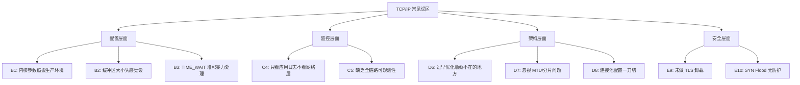
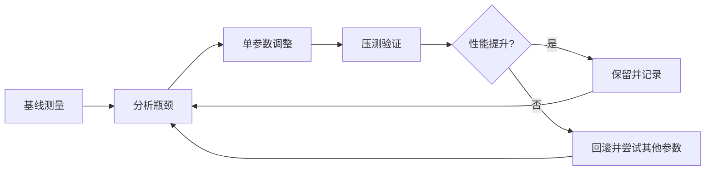
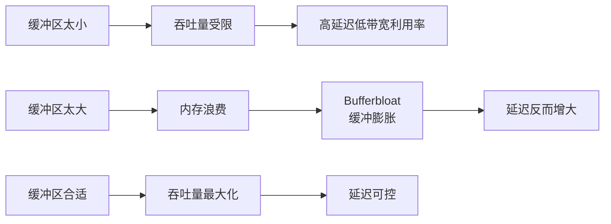
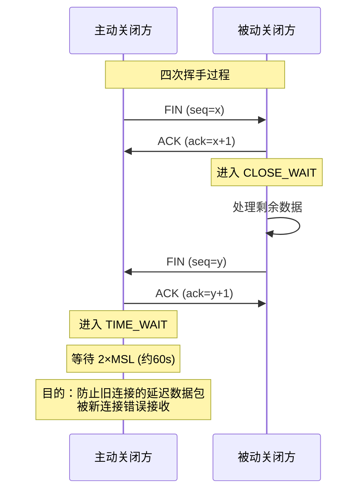
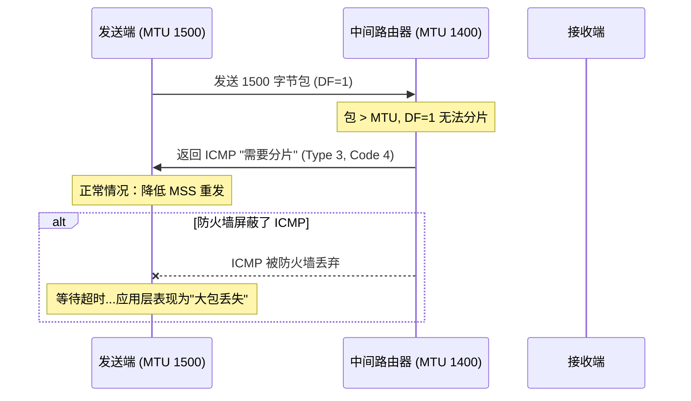
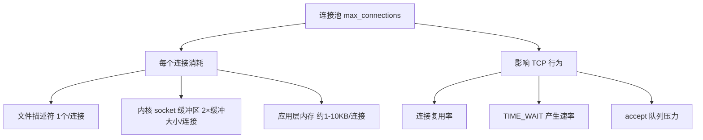
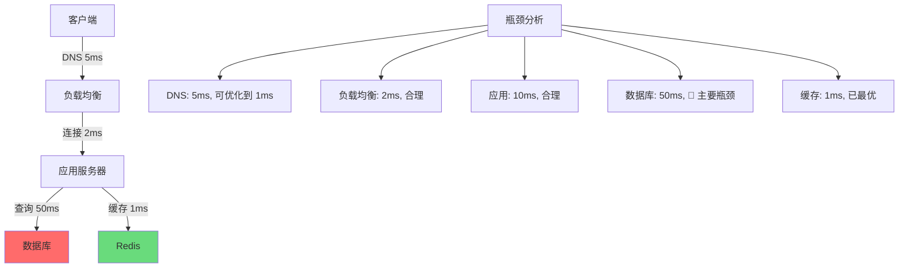
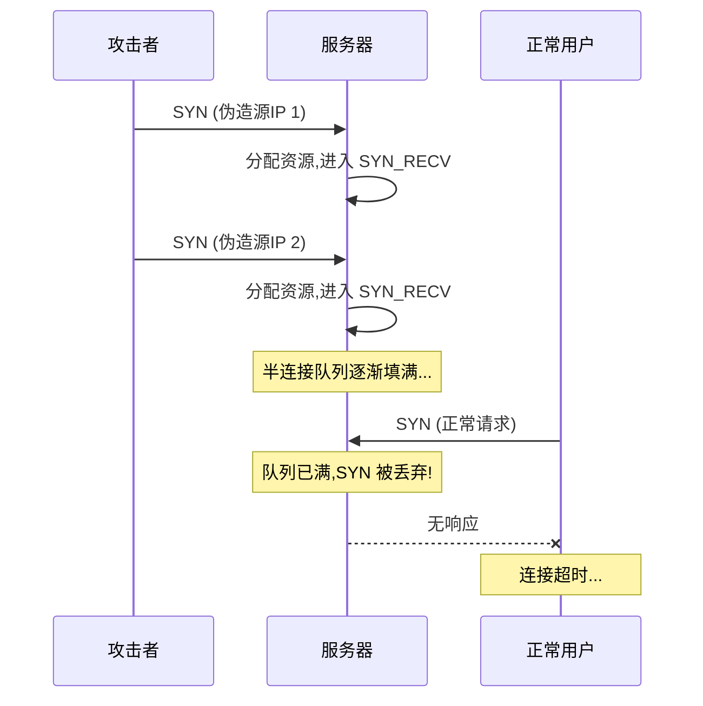
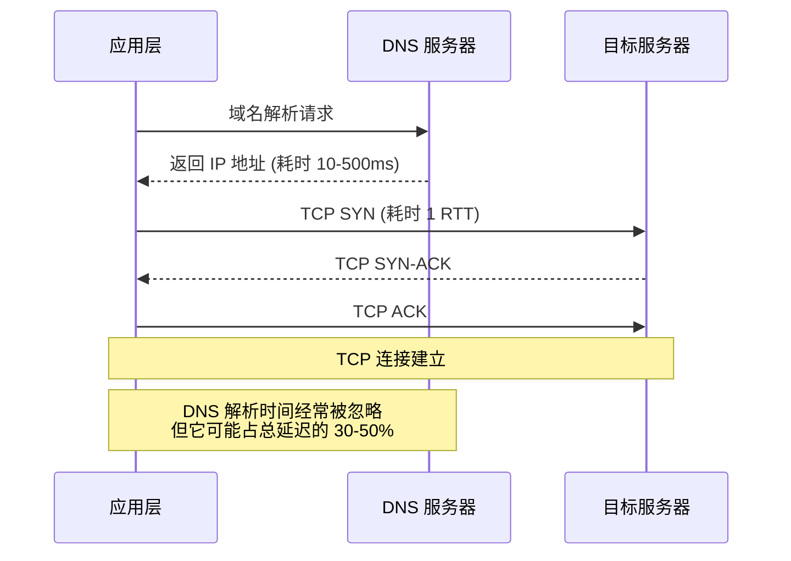
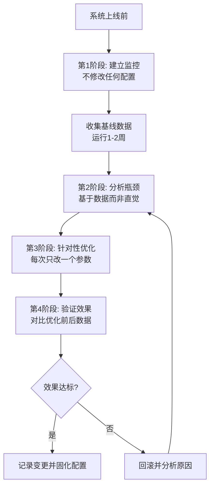

## 常见误区

TCP/IP 协议栈涉及从物理链路到应用层的多个环节，任何一个环节的疏忽都可能成为系统瓶颈甚至故障根因。本节梳理工程师在实际工作中最高频犯的十大误区，每个误区都按照"错误表现 → 根因分析 → 正确做法 → 验证手段"的结构展开，帮助读者建立系统性的避坑意识。



---

### 误区一：内核参数照搬网上模板，不做基准测试

#### 错误表现

工程师在进行 TCP 调优时，最常见的做法是直接从博客或 Stack Overflow 复制一套 `sysctl.conf` 参数，粘贴到 `/etc/sysctl.conf` 后执行 `sysctl -p`，认为"别人调过的参数一定是好的"。典型示例：

```bash
# 网上常见的"万能调优"模板（盲目照搬=埋坑）
net.core.somaxconn = 65535
net.ipv4.tcp_max_syn_backlog = 65535
net.core.netdev_max_backlog = 65535
net.ipv4.tcp_tw_reuse = 1
net.ipv4.tcp_fin_timeout = 30
net.ipv4.tcp_keepalive_time = 600
```

#### 根因分析

每个系统的硬件配置、网络环境、业务特征各不相同，参数的最优值也随之变化：

| 参数 | 直接照搬的后果 | 原因 |
|------|----------------|------|
| `somaxconn` 设为 65535 | 2GB 内存机器上大量连接排队消耗内存 | 连接队列深度 × 每连接 socket 结构体 ≈ 内存开销 |
| `tcp_max_syn_backlog` 设为 65535 | SYN Flood 时反向放大内存消耗 | 半连接队列过大，攻击面反而增大 |
| `tcp_fin_timeout` 设为 10 | 高并发短连接场景出现连接复用失败 | FIN_WAIT_2 提前清理，对端尚未收到 ACK |
| `tcp_keepalive_time` 设为 600 | 空闲连接占用文件描述符，实际服务已死 | 检测周期太长，无法及时释放僵死连接 |

正确的调优流程应该遵循"测量 → 建立基线 → 小步调整 → 再测量"的闭环：



#### 正确做法

**第一步：建立性能基线**

```bash
# 1. 记录当前网络状态
ss -s
cat /proc/net/sockstat

# 2. 记录内核默认值
sysctl net.core.somaxconn
sysctl net.ipv4.tcp_max_syn_backlog
sysctl net.core.rmem_max
sysctl net.core.wmem_max

# 3. 用 iperf3 建立带宽/延迟基线
# 服务端
iperf3 -s
# 客户端（并发4线程，持续30秒）
iperf3 -c <server_ip> -P 4 -t 30 -i 1
```

**第二步：针对性调整**

```bash
# 场景A：高并发 Web 服务（每秒新建连接 > 1万）
# 需要更大的 SYN 队列和 accept 队列
echo "net.core.somaxconn = 16384" >> /etc/sysctl.conf
echo "net.ipv4.tcp_max_syn_backlog = 16384" >> /etc/sysctl.conf
echo "net.core.netdev_max_backlog = 16384" >> /etc/sysctl.conf

# 场景B：长连接服务（IM、WebSocket）
# 需要缩短 TIME_WAIT，启用 keepalive
echo "net.ipv4.tcp_tw_reuse = 1" >> /etc/sysctl.conf
echo "net.ipv4.tcp_keepalive_time = 300" >> /etc/sysctl.conf
echo "net.ipv4.tcp_keepalive_intvl = 15" >> /etc/sysctl.conf
echo "net.ipv4.tcp_keepalive_probes = 5" >> /etc/sysctl.conf

# 场景C：大量数据传输（文件同步、视频流）
# 需要增大缓冲区
echo "net.core.rmem_max = 16777216" >> /etc/sysctl.conf
echo "net.core.wmem_max = 16777216" >> /etc/sysctl.conf
echo "net.ipv4.tcp_rmem = 4096 87380 16777216" >> /etc/sysctl.conf
echo "net.ipv4.tcp_wmem = 4096 65536 16777216" >> /etc/sysctl.conf
```

**第三步：验证效果**

```bash
# 修改后重新测量，对比基线
ss -s
iperf3 -c <server_ip> -P 4 -t 30 -i 1

# 用对比工具记录前后差异
# 推荐使用 wrk 进行 HTTP 压测对比
wrk -t4 -c100 -d30s http://localhost:8080/api/health
```

#### 验证手段

```bash
# 检查参数是否生效
sysctl -a | grep -E "somaxconn|syn_backlog|tw_reuse|keepalive"

# 持续监控调整后的连接状态变化
watch -n 2 'ss -ant | awk "{print \$1}" | sort | uniq -c | sort -rn'
```

---

### 误区二：缓冲区大小凭感觉设置

#### 错误表现

工程师在设置 TCP 缓冲区时常见的两种极端：一是全部用默认值，认为"操作系统比我会调"；二是盲目设大，"给 128MB 总不会错"。这两种做法在生产环境中都会引发问题。

#### 根因分析

TCP 缓冲区分为发送缓冲区（`wmem`）和接收缓冲区（`rmem`），每个缓冲区有三个值：最小值（min）、默认值（pressure）、最大值（max）。它们直接影响吞吐量和延迟的平衡：



**缓冲区大小与实际效果的关系：**

| 场景 | 推荐 rmem/wmem | 理由 |
|------|----------------|------|
| HTTP 短连接 API | 64KB/64KB | 小请求不需要大缓冲，减少排队延迟 |
| WebSocket 长连接 | 256KB/256KB | 消息大小中等，需要一定缓冲余量 |
| 大文件传输 | 4MB/4MB | 需要足够窗口填满带宽延迟积 |
| 视频流媒体 | 2MB/1MB | 下行数据量大，上行控制消息小 |

**带宽延迟积（BDP）计算公式：**

BDP = Bandwidth × RTT
    = 100Mbps × 50ms
    = 5Mbps × 50ms
    = 312.5KB

这意味着在 100Mbps 带宽、50ms 延迟的链路上，至少需要 312.5KB 的缓冲区才能充分利用带宽。

#### 正确做法

**第一步：测量链路特征**

```bash
# 测量到目标的延迟
ping -c 100 <target_ip> | tail -1

# 测量链路带宽
iperf3 -c <target_ip> -t 10

# 根据 BDP 计算缓冲区下限
# 例：1Gbps × 10ms = 1.25MB
```

**第二步：分级配置**

```bash
# 场景 A：数据中心内部通信（低延迟高带宽）
# RTT < 1ms，10Gbps，BDP ≈ 1.25KB → 缓冲区可较小
sysctl -w net.ipv4.tcp_rmem="4096 87380 16777216"
sysctl -w net.ipv4.tcp_wmem="4096 65536 16777216"

# 场景 B：跨地域通信（中等延迟）
# RTT ≈ 50ms，100Mbps，BDP ≈ 625KB → 缓冲区需中等
sysctl -w net.ipv4.tcp_rmem="4096 131072 4194304"
sysctl -w net.ipv4.tcp_wmem="4096 131072 4194304"

# 场景 C：跨洋通信（高延迟）
# RTT ≈ 200ms，1Gbps，BDP ≈ 25MB → 缓冲区要足够大
sysctl -w net.ipv4.tcp_rmem="4096 1048576 33554432"
sysctl -w net.ipv4.tcp_wmem="4096 1048576 33554432"
```

**第三步：为单个 Socket 动态调整**

```c
// 应用层代码中，根据业务场景动态设置 socket 缓冲区
int buf_size = 256 * 1024;  // 256KB
setsockopt(sockfd, SOL_SOCKET, SO_RCVBUF, &amp;buf_size, sizeof(buf_size));
setsockopt(sockfd, SOL_SOCKET, SO_SNDBUF, &amp;buf_size, sizeof(buf_size));

// 注意：Linux 内核会将 setsockopt 设置的值翻倍
// 因为内核会在 socket 结构体中额外维护元数据空间
```

#### 验证手段

```bash
# 查看当前生效的缓冲区值（系统级）
sysctl net.ipv4.tcp_rmem
sysctl net.ipv4.tcp_wmem

# 查看单个连接的实际缓冲区大小
ss -tm | grep -A5 "ESTAB"
# 输出中的 rcv_space 和 snd_space 表示实际使用的缓冲区

# 监控缓冲区利用率（是否有丢包或阻塞）
cat /proc/net/softnet_stat | awk '{print $2}'
# 第二列数字持续增长说明软中断处理不及时
```

---

### 误区三：暴力处理 TIME_WAIT 状态

#### 错误表现

遇到大量 `TIME_WAIT` 连接时，工程师的第一反应往往是"赶紧干掉它"。常见的暴力处理方式包括：

```bash
# ❌ 错误做法一：设置 tcp_tw_recycle（Linux 4.12 已移除）
sysctl -w net.ipv4.tcp_tw_recycle=1

# ❌ 错误做法二：设置过小的 tcp_fin_timeout
sysctl -w net.ipv4.tcp_fin_timeout=2

# ❌ 错误做法三：直接用 iptables 强制 RST
iptables -A INPUT -p tcp --dport 80 --tcp-flags FIN,RST FIN,RST -j DROP
```

#### 根因分析

`TIME_WAIT` 是 TCP 四次挥手协议的正常状态，其存在有明确的工程意义：



**TIME_WAIT 存在的三大必要性：**

1. **防止旧连接的延迟数据包干扰新连接**：如果上一个连接的迟到数据包在新连接建立后到达，会导致数据错乱。2×MSL（Maximum Segment Lifetime，通常 60 秒）确保网络中所有属于旧连接的数据包都已消亡。

2. **确保最后一个 ACK 能到达对端**：如果最后一个 ACK 丢失，对端会重发 FIN，主动关闭方需要处于能够响应的状态。

3. **允许网络中残余数据包自然消亡**：防止路由器缓存的旧数据包被新连接复用的五元组错误接收。

**暴力清除 TIME_WAIT 的危害：**

| 做法 | 危害 | 后果 |
|------|------|------|
| `tcp_tw_recycle=1` | 在 NAT 环境下不同客户端被误判为同一源 | 大量连接被静默丢弃，客户端表现为连接超时 |
| `tcp_fin_timeout=2` | FIN_WAIT_2 连接过早回收，对端尚未收到 ACK | 对端反复重传，触发 RST，连接异常中断 |
| iptables 强制 RST | 违反 TCP 协议规范，对端收到异常包 | 对端应用层收到 Connection Reset 错误 |

#### 正确做法

**步骤一：区分正常和异常的 TIME_WAIT**

```bash
# 正常范围估算：TIME_WAIT 数量 ≈ 并发连接数 × (2 × MSL / 平均连接存活时间)
# 例：1万并发，连接存活30秒，TIME_WAIT ≈ 1万 × 60/30 = 2万
# 这是正常的

# 异常判断：TIME_WAIT 数量 >> 你的预期并发连接数的 2 倍
ss -ant | awk '$1 == "TIME-WAIT" {count++} END {print "TIME_WAIT:", count}'
```

**步骤二：使用 tcp_tw_reuse 代替暴力清除**

```bash
# 启用 TIME_WAIT 复用（仅对主动发起连接的客户端有效）
sysctl -w net.ipv4.tcp_tw_reuse=1
```

`tcp_tw_reuse` 的工作原理：内核在分配新的出站端口时，会检查该端口是否处于 `TIME_WAIT` 状态。如果处于 `TIME_WAIT` 且已超过 1 秒（确保旧数据包已消亡），则可以复用该端口。这比 `tcp_tw_recycle` 安全得多，因为它只影响出站连接，且有时间窗口保护。

**步骤三：从应用层减少不必要的短连接**

```bash
# 方案A：启用 HTTP Keep-Alive（最重要）
# Nginx 配置示例
keepalive_timeout 65;
keepalive_requests 1000;

# 方案B：使用连接池（适用于数据库、Redis 等）
# 以 Go 为例
db.SetMaxOpenConns(100)
db.SetMaxIdleConns(10)
db.SetConnMaxLifetime(5 * time.Minute)

# 方案C：长连接 + 心跳替代频繁握手
# WebSocket 心跳间隔建议 30-60 秒
```

#### 验证手段

```bash
# 持续监控 TIME_WAIT 数量变化趋势
while true; do
    echo "$(date): $(ss -ant | awk '$1 == "TIME-WAIT"' | wc -l) TIME_WAIT"
    sleep 5
done

# 对比调整前后的 TIME_WAIT 数量
ss -s
```

---

### 误区四：只看应用日志，不看网络层指标

#### 错误表现

当服务出现性能问题时，工程师往往只检查应用日志（Nginx access log、应用 stdout），却忽略了网络层的关键信息。这种"应用层盲区"导致排查方向偏移，浪费大量时间。

```bash
# ❌ 常见的片面排查方式
tail -f /var/log/nginx/access.log | grep 502
grep "timeout" /var/log/app/error.log

# 看到 502/504 就认为是"后端问题"，开始调后端配置
# 实际根因可能是网络层丢包、连接队列满等
```

#### 根因分析

TCP/IP 协议栈的每一层都有自己的故障信号，只看应用层等于"隔着一层雾看问题"：

```mermaid
graph TD
    A[应用报 502/504] --> B{排查方向}
    B -->|片面| C[只看应用日志]
    C --> D[误判为"后端慢"]
    D --> E[反复调后端参数]
    E --> F[问题未解决]
    
    B -->|全面| G[同时看网络层]
    G --> H[检查 TCP 状态分布]
    H --> I{真正原因}
    I -->|SYN_RECV 高| J[SYN Flood 或 backlog 满]
    I -->|ESTAB 但 retrans 高| K[网络丢包或拥塞]
    I -->|CLOSE_WAIT 多| L[应用未正确关闭连接]
    I -->|TIME_WAIT 正常| M[排除网络层,看应用]
```

**各层关键指标对照表：**

| 层级 | 指标 | 命令 | 异常阈值 |
|------|------|------|----------|
| 传输层 | TCP 状态分布 | `ss -ant \| awk '{print \$1}' \| sort \| uniq -c` | SYN_RECV > 100 异常 |
| 传输层 | 重传率 | `ss -ti dst <ip> \| grep retrans` | retrans > 1% 需关注 |
| 网络层 | 丢包率 | `ping -c 1000 <ip>` 或 `mtr <ip>` | loss > 0.1% 有风险 |
| 网络层 | MTU 路径 | `ping -M do -s 1472 <ip>` | 分片异常需排查 |
| 链路层 | 网卡丢包 | `ethtool -S eth0 \| grep error` | 任何 error 增长都需关注 |
| 链路层 | 队列溢出 | `cat /proc/net/softnet_stat` | 第二列 > 0 说明处理不及时 |

#### 正确做法

**建立完整的网络诊断流程：**

```bash
#!/bin/bash
# network-diagnostic.sh —— 网络层一键诊断脚本
TARGET=${1:-"127.0.0.1"}

echo "===== 1. TCP 连接状态分布 ====="
ss -ant | awk '{print $1}' | sort | uniq -c | sort -rn

echo ""
echo "===== 2. 到目标的延迟和丢包 ====="
ping -c 10 -W 1 "$TARGET" 2>/dev/null | tail -3

echo ""
echo "===== 3. 到目标的路由追踪 ====="
mtr --report -c 5 "$TARGET" 2>/dev/null || traceroute -m 10 "$TARGET" 2>/dev/null

echo ""
echo "===== 4. 网卡状态和错误统计 ====="
ip -s link show | head -20

echo ""
echo "===== 5. TCP 重传统计 ====="
ss -ti dst "$TARGET" | head -20

echo ""
echo "===== 6. 软中断处理统计 ====="
cat /proc/net/softnet_stat | head -4

echo ""
echo "===== 7. 当前连接队列情况 ====="
ss -lnt | awk 'NR>1 {printf "%-30s Recv-Q: %s Send-Q: %s\n", $4, $2, $3}'
# Recv-Q 不为 0 说明 accept 队列有积压
# Send-Q 不为 0 在 LISTEN 状态说明 backlog 接近满
```

#### 验证手段

```bash
# 在生产环境中定期执行诊断
# 每 5 分钟采集一次网络层快照
crontab -e
*/5 * * * * /opt/scripts/network-diagnostic.sh 10.0.1.50 >> /var/log/network-diag.log 2>&amp;1
```

---

### 误区五：MTU 与分片问题视而不见

#### 错误表现

工程师在配置 VPN、隧道或跨网段通信时，常常忽略 MTU（Maximum Transmission Unit，最大传输单元）的约束，导致数据包被静默分片或直接丢弃，表现为"能 ping 通但应用超时"或"小包正常大包失败"的诡异现象。

```bash
# 典型症状
curl -v https://example.com
# 小文件下载正常，大文件（>1400字节）下载卡住或超时

# 或者 VPN 连接后，SSH 能登录但 scp 传输大文件失败
```

#### 根因分析

以太网标准 MTU 为 1500 字节，但 VPN、GRE、IPsec 等隧道协议会增加额外头部，导致有效 MTU 缩小：

| 隧道类型 | 额外头部开销 | 有效 MTU |
|----------|-------------|----------|
| 无隧道（纯以太网） | 0 | 1500 |
| GRE 隧道 | 24 字节 | 1476 |
| IPsec (ESP) | 50-70 字节 | 1430-1450 |
| OpenVPN | 约 60 字节 | 约 1440 |
| WireGuard | 60 字节 | 1440 |
| PPPoE | 8 字节 | 1492 |

当数据包大小超过路径 MTU 时，如果中间路由器设置了 `DF`（Don't Fragment）标志位，包会被直接丢弃并返回 ICMP "Fragmentation Needed" 消息。如果防火墙屏蔽了 ICMP 消息，发送端完全不知道问题出在哪里——这就是经典的 **PMTUD Black Hole**（路径 MTU 发现黑洞）。



#### 正确做法

**步骤一：探测路径 MTU**

```bash
# 方法一：ping 探测（最直接）
# -M do: 设置 DF 标志位
# -s: 数据包大小（不含 IP/ICMP 头 28 字节）
# 从大到小逐步降低直到 ping 通

ping -M do -s 1472 -c 3 <target_ip>   # 1472+28=1500 → 如果不通,路径MTU<1500
ping -M do -s 1442 -c 3 <target_ip>   # 1442+28=1470 → 逐步缩小
ping -M do -s 1402 -c 3 <target_ip>   # 1402+28=1430 → 常见IPsec MTU

# 方法二：tracepath 自动探测
tracepath <target_ip>
```

**步骤二：正确配置 MSS Clamping**

```bash
# iptables MSS 钳制（推荐方式）
# 将出站 TCP SYN 包的 MSS 值强制设为 1360（适用于大多数 VPN 场景）
iptables -t mangle -A FORWARD -p tcp --tcp-flags SYN,RST SYN \
    -j TCPMSS --clamp-mss-to-pmtu

# 或者手动指定 MSS 值
iptables -t mangle -A FORWARD -p tcp --tcp-flags SYN,RST SYN \
    -j TCPMSS --set-mss 1360

# Nginx 侧也建议设置
# 确保 Nginx 的 proxy_buffering 不因 MTU 问题导致大响应卡住
```

**步骤三：调整应用层策略**

```bash
# Nginx: 调整 proxy_buffer_size 和 proxy_buffering
proxy_buffering on;
proxy_buffer_size 16k;
proxy_buffers 4 32k;

# 或者在应用层使用分块传输，避免大包问题
# Node.js 示例
res.writeHead(200, {
    'Transfer-Encoding': 'chunked',
    'Content-Type': 'application/octet-stream'
});
```

#### 验证手段

```bash
# 验证 MSS Clamping 是否生效
# 观察三次握手时的 MSS 协商值
tcpdump -i eth0 -n "tcp[tcpflags] &amp; tcp-syn != 0" -c 5
# 输出中应该能看到 mss 值被钳制到设置的值

# 验证大文件传输是否正常
curl -o /dev/null -w "Speed: %{speed_download} bytes/sec\n" \
    https://example.com/large-file.zip
```

---

### 误区六：忽视连接池配置的全局影响

#### 错误表现

应用连接池（数据库、Redis、HTTP 客户端）配置不当，会直接影响 TCP 层的行为。最常见的错误是"一个配置打天下"——不管业务是高并发短查询还是低频长事务，都用同一套连接池参数。

```python
# ❌ 错误：不区分场景的"万能"连接池配置
db_pool = ConnectionPool(
    max_connections=100,      # 对短连接场景太小，对长事务场景太大
    max_idle_time=3600,       # 1小时空闲，大量僵死连接占资源
    connection_timeout=5,     # 超时设置不合理
)
```

#### 根因分析

连接池配置直接影响 TCP 连接的生命周期和资源利用率：

| 参数 | 设太小的后果 | 设太大的后果 |
|------|-------------|-------------|
| `max_connections` | 请求排队，延迟升高，触发超时 | 文件描述符耗尽，内核连接跟踪表溢出 |
| `max_idle_time` | 频繁新建连接，TIME_WAIT 堆积 | 僵死连接占用内存和文件描述符 |
| `connection_timeout` | 短超时导致频繁重连，性能波动 | 长超时导致故障恢复慢，级联雪崩 |
| `validation_query` | 无验证导致拿到已断开的连接 | 验证过于频繁增加额外开销 |

**连接池大小与 TCP 资源的关系：**



#### 正确做法

**根据业务场景分级配置：**

```python
# 场景 A：高并发读（电商商品查询）
# 特点：短事务，高 QPS，需要大量并发连接
read_pool = ConnectionPool(
    max_connections=200,
    min_connections=50,          # 保持最低空闲连接
    max_idle_time=300,           # 5分钟回收空闲连接
    connection_timeout=3,        # 快速失败
    validation_interval=30,      # 每30秒验证一次
)

# 场景 B：低频写（订单提交）
# 特点：长事务，低 QPS，连接复用率高
write_pool = ConnectionPool(
    max_connections=20,
    min_connections=5,
    max_idle_time=600,           # 10分钟
    connection_timeout=10,       # 写操作允许更长等待
    validation_interval=60,
)

# 场景 C：后台批处理
# 特点：突发高流量，处理完后空闲
batch_pool = ConnectionPool(
    max_connections=50,
    min_connections=0,           # 空闲时完全释放
    max_idle_time=60,            # 1分钟快速回收
    connection_timeout=15,
    validation_interval=30,
)
```

**配合内核层调整：**

```bash
# 确保文件描述符上限足够支撑连接池
# /etc/security/limits.conf
* soft nofile 1048576
* hard nofile 1048576

# /etc/sysctl.conf
fs.file-max = 2097152
net.core.somaxconn = 65535
```

#### 验证手段

```bash
# 监控连接池实际使用情况
ss -ant | awk '{print $1}' | sort | uniq -c | sort -rn

# 监控文件描述符使用率
cat /proc/$(pgrep -f "your_app")/fd | wc -l
# 与 ulimit 对比，使用率超过 80% 需要警惕

# 监控 TCP 连接建立/销毁速率
nstat -az TcpActiveOpens TcpPassiveOpens TcpCurrEstab | awk '{print $1, $2}'
# 每隔几秒采样一次，观察趋势
```

---

### 误区七：只做纵向优化，忽视全链路瓶颈

#### 错误表现

工程师在排查性能问题时，往往只在某一层反复优化，而忽略了瓶颈可能在其他层。典型的"灯下找钥匙"场景：

- 应用响应慢 → 反复调数据库 SQL → 忽略了网络 RTT 本身很高
- 吞吐量上不去 → 疯狂加 CPU/内存 → 忽略了网卡已经是瓶颈
- 连接超时 → 无限增大 timeout → 忽略了中间件健康检查在消耗资源

#### 根因分析

**阿姆达尔定律在网络优化中的体现：**

系统的整体性能提升受限于最慢的那个环节。假设你的系统链路是：

客户端 → DNS (5ms) → 负载均衡 (2ms) → 应用服务器 (10ms) → 数据库 (50ms) → 应用服务器 (10ms) → 负载均衡 (2ms) → 客户端
总延迟: 84ms

如果把数据库从 50ms 优化到 10ms，总延迟变为 44ms，提升 47%——这已经很好了。但如果花同样的精力把应用服务器从 10ms 优化到 1ms，总延迟只变为 66ms，提升仅 21%。

**正确的全链路分析框架：**



#### 正确做法

**步骤一：全链路延迟分解**

```bash
# 使用 curl 的时间分解功能
curl -o /dev/null -s -w "
DNS解析:       %{time_namelookup}s
TCP连接:       %{time_connect}s
TLS握手:       %{time_appconnect}s
首字节时间:    %{time_starttransfer}s
总时间:        %{time_total}s
" https://api.example.com/data

# 示例输出：
# DNS解析:       0.012s      ← DNS 缓慢
# TCP连接:       0.034s      ← TCP 三次握手
# TLS握手:       0.156s      ← TLS 握手
# 首字节时间:    0.250s      ← 服务端处理时间
# 总时间:        0.280s
```

**步骤二：分层定位瓶颈**

```bash
# 1. DNS 层诊断
dig api.example.com +stats
# 关注 Query time 和 SERVER 响应时间

# 2. TCP 层诊断
ss -ti dst api.example.com
# 关注 rtt（往返时间）、retrans（重传）、cwnd（拥塞窗口）

# 3. TLS 层诊断
openssl s_client -connect api.example.com:443 -tls1_2
# 观察握手耗时

# 4. 应用层诊断
# 对比同一台机器直连和通过 LB 连接的延迟差异
curl -w "%{time_total}\n" -o /dev/null -s http://localhost:8080/api
curl -w "%{time_total}\n" -o /dev/null -s http://api.example.com/api
```

**步骤三：优先修复最大瓶颈**

```bash
# 按影响排序的修复清单：
# 1. DNS 慢 → 启用本地 DNS 缓存 / 使用 HTTPDNS
# 2. TCP RTT 高 → 检查路由、启用 TCP Fast Open
# 3. TLS 握手慢 → 启用 TLS 1.3 + session resumption
# 4. 服务端处理慢 → profile + 优化热点代码
# 5. 数据库慢 → 慢查询日志 + 索引优化
```

#### 验证手段

```bash
# 每次优化后重新运行全链路诊断，对比优化效果
# 建立一个持续的性能基线监控
curl -w "%{time_namelookup},%{time_connect},%{time_appconnect},%{time_starttransfer},%{time_total}\n" \
    -o /dev/null -s https://api.example.com/data >> /var/log/baseline.csv
```

---

### 误区八：SYN Flood 防护形同虚设

#### 错误表现

很多生产服务器虽然配置了 `SYN Cookie`，但实际防护并不完整，或者根本没启用。部分工程师认为"有云厂商的 DDoS 防护就够了"，忽视了内核层面的基础防护。

#### 根因分析

SYN Flood 是最常见的 DDoS 攻击方式之一，攻击者发送大量伪造源 IP 的 SYN 包，使服务器的半连接队列（SYN backlog）被耗尽，导致正常连接无法建立。



**SYN Cookie 的工作原理：**

SYN Cookie 是一种无状态的 SYN Flood 防护机制。它不在半连接队列中为每个 SYN 分配内存，而是将连接信息编码在 SYN-ACK 的序列号中：

1. 收到 SYN 时，不分配资源，只计算一个特殊的 ISN（初始序列号）
2. SYN-ACK 中携带这个 ISN 作为确认号
3. 收到 ACK 时，从确认号中解码验证，通过则建立连接
4. 这样即使队列满了，也能处理正常的三次握手

#### 正确做法

**完整的 SYN Flood 防护配置：**

```bash
# 1. 启用 SYN Cookie（最重要的防护）
sysctl -w net.ipv4.tcp_syncookies=1

# 2. 限制半连接队列大小（不要设太大，反而增加攻击面）
sysctl -w net.ipv4.tcp_max_syn_backlog=4096

# 3. 限制 SYN_RECV 重试次数
sysctl -w net.ipv4.tcp_synack_retries=2

# 4. 启用连接跟踪限制（防止 conntrack 表被撑满）
sysctl -w net.netfilter.nf_conntrack_max=262144

# 5. 启用 TCP SYN + SYN Cookie 混合模式
sysctl -w net.ipv4.tcp_syncookies=2  # 仅在队列满时启用 cookie
```

**配合 iptables 规则进行速率限制：**

```bash
# 限制每秒新连接速率（防止单个 IP 大量新建）
iptables -A INPUT -p tcp --syn -m connlimit --connlimit-above 50 -j REJECT

# 限制每秒 SYN 包速率
iptables -A INPUT -p tcp --syn -m limit --limit 100/s --limit-burst 200 -j ACCEPT
iptables -A INPUT -p tcp --syn -j DROP

# 丢弃无效状态的包
iptables -A INPUT -m conntrack --ctstate INVALID -j DROP

# 对特定端口加强保护
iptables -A INPUT -p tcp --dport 80 --syn -m connlimit \
    --connlimit-above 20 --connlimit-mask 32 -j REJECT
```

#### 验证手段

```bash
# 确认 SYN Cookie 已启用
sysctl net.ipv4.tcp_syncookies
# 输出应为 1 或 2

# 监控 SYN_RECV 状态连接数
watch -n 1 'ss -ant | awk "$1 == \"SYN-RECV\"" | wc -l'
# 正常情况下应该接近 0

# 使用 hping3 模拟 SYN Flood 测试防护效果
# ⚠️ 仅在测试环境中使用！
# hping3 -S --flood -p 80 <test_server_ip>

# 监控半连接队列使用情况
nstat -az TcpExtListenOverflows TcpExtListenDrops | awk '{print $1, $2}'
# ListenOverflows: accept 队列溢出次数
# ListenDrops: 连接被丢弃次数
```

---

### 误区九：忽视 DNS 对 TCP 连接的影响

#### 错误表现

工程师在优化 TCP 性能时，往往从三次握手开始分析，却完全跳过了 DNS 解析环节。DNS 解析的延迟和可靠性直接影响 TCP 连接的建立效率，尤其在微服务架构中，服务发现依赖 DNS，问题更加突出。

```bash
# 常见症状：
# 1. 服务响应时间偶尔飙升（DNS 超时导致）
# 2. 大量 TCP 重连（DNS TTL 过期后重新解析，IP 变化）
# 3. 连接到错误的后端实例（DNS 缓存过期，返回旧 IP）
```

#### 根因分析

DNS 解析是 TCP 连接的前置步骤，其耗时直接影响总延迟：

| DNS 问题 | 影响 | 表现 |
|----------|------|------|
| DNS 服务器响应慢 | 首次连接延迟增加 50-500ms | 周期性响应慢 |
| DNS TTL 过短 | 频繁重新解析，增加延迟 | 周期性性能波动 |
| DNS TTL 过长 | DNS 缓存过期后 IP 已变更 | 连接到已下线的服务 |
| DNS 缓存未启用 | 每次请求都解析 DNS | 连接延迟不稳定 |
| DNS 负载不均衡 | 某个后端实例流量过大 | 部分实例过载 |

**DNS 解析在 TCP 连接流程中的位置：**



#### 正确做法

**步骤一：启用并优化 DNS 缓存**

```bash
# 方案 A：systemd-resolved（推荐，Ubuntu/Debian 默认）
# 启用 DNS 缓存
cat >> /etc/systemd/resolved.conf << 'EOF'
[Resolve]
Cache=yes
CacheFromLocalhost=yes
DNSStubListener=yes
DNSStubListenerExtra=tcp
EOF
systemctl restart systemd-resolved

# 验证缓存状态
resolvectl statistics

# 方案 B：nscd（适用于 CentOS/RHEL）
yum install nscd
systemctl enable --now nscd
# 默认缓存 TTL 为 3600 秒

# 方案 C：应用层缓存（最灵活）
# Go: net.Resolver + dnsCache
# Java: DnsCache 或自定义 DNS 解析器
```

**步骤二：配置合理的本地 DNS**

```bash
# /etc/resolv.conf 优化
# 使用多个 DNS 服务器实现冗余
cat > /etc/resolv.conf << 'EOF'
# 主 DNS：本地递归解析器（延迟最低）
nameserver 127.0.0.1
# 备用 DNS：公共 DNS
nameserver 8.8.8.8
nameserver 114.114.114.114
# 搜索域（微服务场景下减少短名查询次数）
search svc.cluster.local cluster.local
# 超时和重试配置
options timeout:2 attempts:3 rotate
EOF

# DNS 超时配置说明：
# timeout: 单次查询超时时间（秒），默认 5
# attempts: 重试次数，默认 2
# rotate: 在多个 nameserver 间轮询，分散压力
```

**步骤三：在应用层集成 DNS 健康检查**

```python
import socket
import time
import threading

class DNSHealthChecker:
    def __init__(self, domain, expected_ips, check_interval=30):
        self.domain = domain
        self.expected_ips = set(expected_ips)
        self.check_interval = check_interval
        self.current_ips = set(expected_ips)
        self.lock = threading.Lock()
    
    def check(self):
        """定期检查 DNS 解析结果是否与预期一致"""
        try:
            ips = set(socket.getaddrinfo(self.domain, None, socket.AF_INET))
            resolved_ips = {addr[4][0] for addr in ips}
            
            with self.lock:
                self.current_ips = resolved_ips
            
            if resolved_ips != self.expected_ips:
                print(f"WARNING: DNS resolution changed for {self.domain}")
                print(f"  Expected: {self.expected_ips}")
                print(f"  Got: {resolved_ips}")
                # 触发告警或自动更新服务发现
        except socket.gaierror as e:
            print(f"ERROR: DNS resolution failed for {self.domain}: {e}")
    
    def start(self):
        def _loop():
            while True:
                self.check()
                time.sleep(self.check_interval)
        t = threading.Thread(target=_loop, daemon=True)
        t.start()
```

#### 验证手段

```bash
# 测量 DNS 解析耗时
dig api.example.com | grep "Query time"
# 正常：< 10ms（本地缓存命中），< 50ms（递归查询）

# 监控 DNS 解析成功率和延迟
# 使用 dnsstat 或自定义脚本
while true; do
    start=$(date +%s%3N)
    result=$(dig +short api.example.com)
    end=$(date +%s%3N)
    echo "$(date): ${result} (${end}-start}ms)"
    sleep 10
done

# 检查系统级 DNS 缓存状态
resolvectl query api.example.com
```

---

### 误区十：过早优化，忽视监控和度量

#### 错误表现

工程师在系统还没有上线或刚上线时，就开始进行各种 TCP 调优、参数修改、架构重构。更糟糕的是，很多"优化"在没有监控数据支撑的情况下进行，导致：

- 优化方向错误，浪费开发时间
- 引入新的 bug，系统稳定性下降
- 无法量化优化效果，不知道是否真的有改善
- 回滚困难，因为没有记录原始状态

```bash
# ❌ 典型的"过早优化"行为
# 系统还没上线，就开始调整内核参数
sysctl -w net.core.somaxconn=65535
sysctl -w net.ipv4.tcp_tw_reuse=1
sysctl -w net.ipv4.tcp_max_syn_backlog=65535

# ❌ 没有监控就开始"优化"
# 删掉某个"看起来慢"的 SQL 查询
# 引入 Redis 缓存层
# 更换数据库连接池实现
```

#### 根因分析

Donald Knuth 的名言："过早优化是万恶之源"在网络优化中同样适用。原因有三：

1. **你不知道瓶颈在哪里**：没有监控数据，你可能花 80% 的精力优化了一个只贡献 5% 延迟的环节。

2. **你不知道优化是否有效**：没有基线数据，你无法判断性能是变好了还是变差了，甚至可能引入了新问题。

3. **你无法回滚**：没有记录原始状态，出了问题都不知道怎么回到"之前能用"的状态。

**正确的优化时机和步骤：**



#### 正确做法

**步骤一：建立完整的监控体系（上线前完成）**

```bash
# 1. 系统级监控：node_exporter + Prometheus
# 安装 node_exporter
wget https://github.com/prometheus/node_exporter/releases/download/v1.7.0/node_exporter-1.7.0.linux-amd64.tar.gz
tar xzf node_exporter-*.tar.gz
./node_exporter --web.listen-address=":9100" &amp;

# 2. 网络层监控关键指标（Grafana Dashboard 需要的）
# TCP 重传率
rate(tcp_retransmissions_total[5m])
# TCP 连接数
tcp_established_connections
# 网卡吞吐量
rate(node_network_receive_bytes_total{device="eth0"}[5m]) * 8
# 连接队列溢出率
rate(node_netstat_TcpExt_ListenOverflows[5m])

# 3. 应用层监控：在代码中埋点
# 记录每次 TCP 连接建立的耗时
import time

def connect_with_timing(host, port):
    start = time.monotonic()
    sock = socket.create_connection((host, port), timeout=5)
    elapsed = time.monotonic() - start
    
    # 记录到 Prometheus/StatsD
    histogram.observe(elapsed, tags={"host": host, "port": port})
    return sock
```

**步骤二：定义清晰的性能基线**

```yaml
# performance-baseline.yaml — 性能基线文档模板
system:
  environment: production
  baseline_date: 2026-01-15
  load_level: normal  # normal / peak / extreme

tcp_metrics:
  connection_setup_time:
    p50: 5ms
    p95: 15ms
    p99: 50ms
  connection_reuse_rate: 85%
  time_wait_count: 500-1500
  retransmission_rate: 0.01%
  syn_recv_count: <50

network_metrics:
  dns_resolution_time:
    p50: 3ms
    p99: 20ms
  round_trip_time:
    intra_dc: <1ms
    cross_dc: 50ms
    cross_region: 150ms
  packet_loss_rate: <0.01%

application_metrics:
  response_time:
    p50: 10ms
    p95: 50ms
    p99: 200ms
  throughput: 10000 qps
  error_rate: <0.1%
```

**步骤三：使用渐进式优化策略**

```bash
# 优化决策矩阵
# 
# | 瓶颈类型 | 优先级 | 预期收益 | 风险 | 实施复杂度 |
# |----------|--------|----------|------|-----------|
# | DNS 慢 | 高 | 30-50% 延迟降低 | 低 | 低 |
# | TCP 连接复用低 | 高 | 50-70% 延迟降低 | 中 | 中 |
# | 内核参数不合理 | 中 | 10-30% 吞吐提升 | 中 | 低 |
# | 应用层逻辑慢 | 中 | 取决于实现 | 低 | 高 |
# | 硬件瓶颈 | 低 | 线性提升 | 低 | 低（但成本高） |

# 每次只修改一个参数，观察一周
# 示例：启用 TCP Fast Open
sysctl -w net.ipv4.tcp_fastopen=3

# 观察一周后评估：
# - TCP 连接建立延迟是否降低？
# - 是否有兼容性问题？
# - 客户端是否支持 TFO？
```

#### 验证手段

```bash
# 优化前后对比脚本
echo "=== 优化前基线 $(date) ===" | tee -a optimization-log.txt
echo "TCP状态:" >> optimization-log.txt
ss -ant | awk '{print $1}' | sort | uniq -c | sort -rn >> optimization-log.txt
echo "重传统计:" >> optimization-log.txt
nstat -az TcpRetransSegs | head -5 >> optimization-log.txt

# 执行优化操作...

echo "=== 优化后 $(date) ===" | tee -a optimization-log.txt
echo "TCP状态:" >> optimization-log.txt
ss -ant | awk '{print $1}' | sort | uniq -c | sort -rn >> optimization-log.txt
echo "重传统计:" >> optimization-log.txt
nstat -az TcpRetransSegs | head -5 >> optimization-log.txt
```

---

### 总结

| 误区 | 核心教训 | 关键验证手段 |
|------|----------|-------------|
| 内核参数照搬模板 | 没有万能参数，只有适合当前场景的参数 | `sysctl -a` + 压测对比 |
| 缓冲区凭感觉设 | BDP 公式决定缓冲区下限 | `ss -tm` + iperf3 |
| 暴力清除 TIME_WAIT | TIME_WAIT 有存在的意义，`tw_reuse` 是安全替代 | `ss -ant` + 趋势监控 |
| 只看应用日志 | 每层都有自己的故障信号 | `network-diagnostic.sh` |
| 忽视 MTU 分片 | 隧道场景必须检查路径 MTU | `ping -M do -s` + tracepath |
| 连接池一刀切 | 不同业务场景需要不同的池配置 | 文件描述符 + 连接数监控 |
| 只做纵向优化 | 阿姆达尔定律：瓶颈在最慢的环节 | `curl -w` 全链路分解 |
| SYN Flood 防护不完整 | SYN Cookie + 速率限制 + conntrack 三重防护 | `nstat` + `ss -ant` |
| 忽视 DNS 影响 | DNS 是 TCP 连接的前置步骤 | `dig` + resolvectl |
| 过早优化无监控 | 先有数据再优化，不要凭直觉 | Prometheus + Grafana |

**核心原则：先度量，再优化；先修复最大瓶颈，再处理细节；每次只改一个变量，确保可回滚。**
