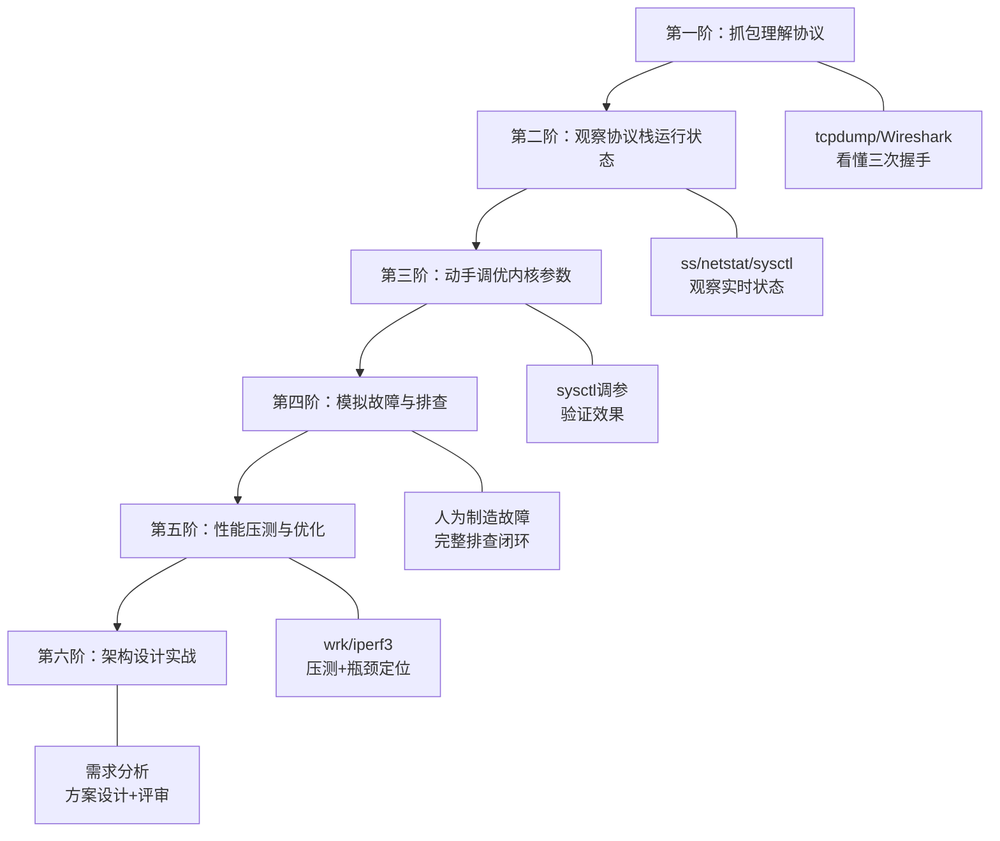

## 练习方法

本章覆盖TCP/IP协议栈从链路层到应用层的完整知识体系。以下练习按照"理解 → 观察 → 动手 → 排查 → 优化 → 设计"六阶递进设计，每个练习都给出真实可执行的命令和场景，读者可在Linux环境下直接复现。建议按顺序完成，每完成一个练习后对照检查标准自测，确保扎实掌握再进入下一阶。



---

### 第一阶：抓包理解协议（预计45分钟）

**目标**：通过抓包工具亲眼"看到"TCP三次握手、四次挥手、数据传输和重传过程，将理论知识转化为直觉认知。

#### 练习 1.1：用 tcpdump 捕获 TCP 三次握手

**步骤**：

```bash
# 终端1：启动一个简单的 TCP 服务器（使用 nc 或 Python）
python3 -c "
import socket, threading, time
s = socket.socket(socket.AF_INET, socket.SOCK_STREAM)
s.setsockopt(socket.SOL_SOCKET, socket.SO_REUSEADDR, 1)
s.bind(('127.0.0.1', 9999))
s.listen(1)
print('Server listening on port 9999...')
conn, addr = s.accept()
print(f'Connection from {addr}')
time.sleep(2)
conn.sendall(b'Hello from server')
time.sleep(5)
conn.close()
s.close()
"
```

```bash
# 终端2：启动 tcpdump 抓包（只抓 TCP 握手相关包）
sudo tcpdump -i lo -nn -vv 'tcp port 9999' -c 20
# -i lo      监听 loopback 接口
# -nn        不解析主机名和端口名
# -vv        详细输出（显示序列号、确认号、窗口大小）
# -c 20      只抓20个包即停止
```

```bash
# 终端3：发起连接
python3 -c "
import socket, time
s = socket.socket(socket.AF_INET, socket.SOCK_STREAM)
s.connect(('127.0.0.1', 9999))
data = s.recv(1024)
print(f'Received: {data}')
time.sleep(3)
s.close()
"
```

**观察要点**：

在 tcpdump 输出中找到以下关键包：

# 1. SYN —— 客户端发起连接（SYN标志位=1）
#    Flags [S], seq <x>, win 65535, options [mss 65495,sackOK,TS...]
#
# 2. SYN+ACK —— 服务器确认并同步（SYN+ACK标志位=1）  
#    Flags [S.], seq <y>, ack <x+1>, win 65535
#
# 3. ACK —— 客户端确认（ACK标志位=1）
#    Flags [.], seq <x+1>, ack <y+1>, win 65535

对照教材中的三次握手图，标注每个包的序列号和确认号变化。特别注意：
- SYN 包中的 MSS（Maximum Segment Size）选项：双方通告各自能接受的最大段长度
- 初始窗口大小（win 65535）：Linux 默认接收窗口
- TCP 选项字段：SACK、Timestamp、Window Scale 等

#### 练习 1.2：用 Wireshark 观察 TCP 四次挥手

**步骤**：

```bash
# 启动 Wireshark（需 GUI 环境），选择 loopback 接口
# 或使用 tshark（命令行版本）：
tshark -i lo -f 'tcp port 9999' -w /tmp/tcp_capture.pcap &amp;
TSHARK_PID=$!

# 执行一次完整的连接和关闭
python3 -c "
import socket, time
s = socket.socket(socket.AF_INET, socket.SOCK_STREAM)
s.connect(('127.0.0.1', 9999))
time.sleep(1)
s.close()
"

# 停止抓包
kill $TSHARK_PID

# 分析抓包文件
tshark -r /tmp/tcp_capture.pcap -T fields \
    -e frame.number -e ip.src -e ip.dst \
    -e tcp.flags.str -e tcp.seq -e tcp.ack \
    -e tcp.len 2>/dev/null | head -30
```

**观察要点**：

1. **FIN 包**：主动关闭方发送 FIN（Flags [F.]），seq = 最后一个数据字节序号 + 1
2. **ACK 包**：被动关闭方确认 FIN，ack = FIN 的 seq + 1
3. **被动方的 FIN**：如果服务器没有数据要发，可能将 ACK 和 FIN 合并（FIN+ACK）
4. **TIME_WAIT**：最后一个 ACK 发出后，主动关闭方进入 TIME_WAIT 状态，等待 2×MSL

**检查标准**：
- [ ] 能在 tcpdump 输出中准确识别 SYN、SYN+ACK、ACK 三个包
- [ ] 能解释每个 TCP 包中的序列号和确认号的含义
- [ ] 能区分正常握手和异常（如 RST、重传）的区别
- [ ] 能在抓包文件中找到四次挥手的四个包并说明每一步的作用

---

### 第二阶：观察协议栈运行状态（预计40分钟）

**目标**：熟练使用 ss、netstat、sysctl 等工具实时观察 TCP/IP 协议栈的运行状态，建立对"系统默认值"的直觉。

#### 练习 2.1：全面查看当前 TCP 连接状态

**步骤**：

```bash
# 1. 一键查看 TCP 状态分布
echo "===== TCP 状态分布 ====="
ss -ant | awk 'NR>1 {print $1}' | sort | uniq -c | sort -rn

echo ""
echo "===== TCP 连接摘要 ====="
ss -s

# 2. 查看当前所有 LISTEN 端口及其队列
echo ""
echo "===== LISTEN 端口及队列 ====="
ss -lnt
# Recv-Q: 当前 accept 队列中等待 accept() 的连接数
# Send-Q: accept 队列最大长度（= min(backlog, somaxconn)）

# 3. 查看所有 ESTABLISHED 连接的详细信息
echo ""
echo "===== ESTABLISHED 连接前10条 ====="
ss -tnp state established | head -10
# -t  只显示 TCP
# -n  不解析
# -p  显示进程信息
```

#### 练习 2.2：记录并对比系统默认内核参数

**步骤**：

```bash
# 1. 创建参数快照文件
cat > /tmp/tcp_baseline.txt << 'EOF'
# TCP/IP 协议栈基线参数记录
# 记录时间: $(date)

# === 连接队列 ===
somaxconn:           $(sysctl -n net.core.somaxconn)
syn_backlog:         $(sysctl -n net.ipv4.tcp_max_syn_backlog)
netdev_max_backlog:  $(sysctl -n net.core.netdev_max_backlog)

# === TIME_WAIT 与连接管理 ===
tw_reuse:            $(sysctl -n net.ipv4.tcp_tw_reuse)
fin_timeout:         $(sysctl -n net.ipv4.tcp_fin_timeout)
keepalive_time:      $(sysctl -n net.ipv4.tcp_keepalive_time)
keepalive_intvl:     $(sysctl -n net.ipv4.tcp_keepalive_intvl)
keepalive_probes:    $(sysctl -n net.ipv4.tcp_keepalive_probes)

# === 缓冲区 ===
rmem_default:        $(sysctl -n net.core.rmem_default)
rmem_max:            $(sysctl -n net.core.rmem_max)
wmem_default:        $(sysctl -n net.core.wmem_default)
wmem_max:            $(sysctl -n net.core.wmem_max)
tcp_rmem:            $(sysctl -n net.ipv4.tcp_rmem)
tcp_wmem:            $(sysctl -n net.ipv4.tcp_wmem)

# === 端口范围 ===
ip_local_port_range: $(sysctl -n net.ipv4.ip_local_port_range)

# === SYN 防护 ===
tcp_syncookies:      $(sysctl -n net.ipv4.tcp_syncookies)

# === 文件描述符 ===
file-nr:             $(cat /proc/sys/fs/file-nr)
EOF

# 实际执行（用 bash 替换变量）
bash /tmp/tcp_baseline.txt | tee /tmp/tcp_baseline_output.txt
cat /tmp/tcp_baseline_output.txt
```

#### 练习 2.3：理解 sysctl 参数的层级关系

**步骤**：

```bash
# 1. 查看所有 net.core.* 参数（全局级）
echo "===== net.core 参数 ====="
sysctl -a 2>/dev/null | grep "^net\." | grep -v tcp | head -20

# 2. 查看所有 net.ipv4.tcp_* 参数（TCP级）
echo ""
echo "===== net.ipv4.tcp.* 参数 ====="
sysctl -a 2>/dev/null | grep "^net\.ipv4\.tcp\." | head -30

# 3. 参数的作用域对比
echo ""
echo "===== 参数作用域说明 ====="
cat << 'TABLE'
层级              前缀                 作用范围              示例
全局级            net.core.*           协议栈通用行为        somaxconn, rmem_max
IPv4级            net.ipv4.*           TCP/UDP协议行为       fin_timeout, ip_forward
TCP级             net.ipv4.tcp_*       TCP特有行为           tcp_rmem, tcp_syncookies
设备级            /sys/class/net/eth0/ 网卡驱动级别          多队列, 中断亲和性
TABLE
```

**检查标准**：
- [ ] 能解释 ss -s 输出中每行数字的含义（TCP estab、timewait 等）
- [ ] 能解释 ss -lnt 中 Recv-Q 和 Send-Q 的实际意义
- [ ] 能说出 somaxconn、tcp_max_syn_backlog、tcp_tw_reuse 三个参数的默认值
- [ ] 能区分 net.core、net.ipv4、net.ipv4.tcp 三个层级参数的适用范围

---

### 第三阶：动手调优内核参数（预计60分钟）

**目标**：按照"建立基线 → 单参数调整 → 压测验证 → 记录对比"的闭环流程，完成一次完整的 TCP 调优实践。

#### 练习 3.1：建立性能基线

**步骤**：

```bash
# 1. 用 iperf3 建立带宽/延迟基线
# 终端1：启动 iperf3 服务端
iperf3 -s -p 5201

# 终端2：运行基线测试
# 带宽测试（4并发流，持续30秒）
iperf3 -c 127.0.0.1 -P 4 -t 30 -i 1 | tee /tmp/iperf_baseline.txt

# 延迟测试（1000次 ping，间隔 10ms）
ping -c 1000 -i 0.01 127.0.0.1 | tee /tmp/ping_baseline.txt

# 2. 用 wrk 建立 HTTP 启动 HTTP 服务用于对比
python3 -c "
from http.server import HTTPServer, BaseHTTPRequestHandler
class H(BaseHTTPRequestHandler):
    def do_GET(self):
        self.send_response(200)
        self.send_header('Content-Type','text/plain')
        self.end_headers()
        self.wfile.write(b'OK')
    def log_message(self, *args): pass
HTTPServer(('127.0.0.1', 8080), H).serve_forever"
&amp;

# 用 wrk 压测基线
wrk -t4 -c100 -d30s http://127.0.0.1:8080/ | tee /tmp/wrk_baseline.txt
```

#### 练习 3.2：调整高并发 Web 服务参数并验证

**步骤**：

```bash
# ===== 场景：模拟高并发短连接 Web 服务 =====

# 第一步：记录当前 sysctl 值
echo "--- 调整前 ---"
sysctl net.core.somaxconn net.ipv4.tcp_max_syn_backlog \
       net.core.netdev_max_backlog net.ipv4.ip_local_port_range

# 第二步：应用调整（仅限测试环境！生产环境需评估影响）
sudo sysctl -w net.core.somaxconn=16384
sudo sysctl -w net.ipv4.tcp_max_syn_backlog=16384
sudo sysctl -w net.core.netdev_max_backlog=16384
sudo sysctl -w net.ipv4.ip_local_port_range="1024 65535"

# 第三步：验证调整生效
echo "--- 调整后 ---"
sysctl net.core.somaxconn net.ipv4.tcp_max_syn_backlog \
       net.core.netdev_max_backlog net.ipv4.ip_local_port_range

# 第四步：重新压测对比
wrk -t4 -c100 -d30s http://127.0.0.1:8080/ | tee /tmp/wrk_after_tuning.txt

# 第五步：对比前后结果
echo "===== 对比摘要 ====="
echo "基线 QPS: $(grep 'Requests/sec' /tmp/wrk_baseline.txt | awk '{print $2}')"
echo "调优后 QPS: $(grep 'Requests/sec' /tmp/wrk_after_tuning.txt | awk '{print $2}')"
```

#### 练习 3.3：调整 TCP 缓冲区（基于 BDP 计算）

**步骤**：

```bash
# 1. 测量链路特征
# 延迟
RTT=$(ping -c 100 127.0.0.1 2>/dev/null | tail -1 | awk -F'/' '{print $5}')
echo "平均 RTT: ${RTT}ms"

# 2. 计算 BDP（带宽延迟积）
# 公式：BDP = Bandwidth × RTT
# 例：100Mbps × 50ms = 100×10^6 × 0.05 / 8 = 625KB
echo "BDP = 带宽(Mbps) × RTT(ms) / 8 = 需要的缓冲区大小(KB)"

# 3. 调整缓冲区（以数据中心低延迟场景为例）
sudo sysctl -w net.core.rmem_max=16777216
sudo sysctl -w net.core.wmem_max=16777216
sudo sysctl -w net.ipv4.tcp_rmem="4096 87380 16777216"
sudo sysctl -w net.ipv4.tcp_wmem="4096 65536 16777216"

# 4. 验证：查看单个连接的实际缓冲区使用情况
# 先建立一个连接
python3 -c "
import socket, time
s = socket.socket()
s.connect(('127.0.0.1', 9999))
time.sleep(10)
s.close() &amp;

# 查看缓冲区使用
ss -tm | grep -A5 "ESTAB"
# 输出中的 rcv_space 和 snd_space 表示实际使用的缓冲区
```

**检查标准**：
- [ ] 建立了 iperf3 + wrk 的性能基线（含 QPS、延迟、带宽）
- [ ] 成功调整 somaxconn/backlog 等参数并验证生效
- [ ] 能根据 BDP 公式计算合理缓冲区大小
- [ ] 能用 ss -tm 观察单个连接的缓冲区实际使用量

---

### 第四阶：模拟故障与排查（预计60分钟）

**目标**：通过人为制造常见网络故障，练习完整的排查流程："现象量化 → 分层排查 → 根因定位 → 修复验证"。

#### 练习 4.1：模拟 SYN Flood 并验证 SYN Cookie 防护

**步骤**：

```bash
# 1. 启动一个简单服务
python3 -c "
import socket
s = socket.socket()
s.setsockopt(socket.SOL_SOCKET, socket.SO_REUSEADDR, 1)
s.bind(('127.0.0.1', 9998))
s.listen(128)
print('Listening on 9998')
s.accept()
" &amp;

# 2. 查看 SYN Cookie 状态
sysctl net.ipv4.tcp_syncookies
# 应该返回 1（默认开启）

# 3. 用 hping3 模拟 SYN Flood（测试环境！）
# 注意：hping3 可能需要安装 sudo apt-get install hping3
sudo hping3 -S -p 9998 --flood 127.0.0.1 &amp;
HPING_PID=$!
sleep 5
sudo kill $HPING_PID

# 4. 排查：观察连接状态变化
ss -ant | awk 'NR>1 {print $1}' | sort | uniq -c | sort -rn
# 观察 SYN_RECV 是否堆积

netstat -s | grep -i "syncookie"
# 查看 SYN Cookie 触发次数

# 5. 对比：禁用 SYN Cookie 后的效果（危险！仅测试环境）
# sudo sysctl -w net.ipv4.tcp_syncookies=0
# 重复步骤 3-4，观察 SYN_RECV 堆积和 accept 队列溢出
# 恢复：sudo sysctl -w net.ipv4.tcp_syncookies=1
```

#### 练习 4.2：模拟 CLOSE_WAIT 堆积（连接泄漏）

**步骤**：

```bash
# 1. 编写一个有连接泄漏的服务器
cat > /tmp/leaky_server.py << 'PYEOF'
import socket, time, threading

def handle_client(conn, addr):
    """模拟未正确关闭连接的 handler"""
    try:
        data = conn.recv(1024)
        conn.sendall(b"OK")
        # 故意不调用 conn.close() —— 模拟连接泄漏
        print(f"[LEAK] Connection from {addr} - NOT CLOSED")
    except Exception as e:
        print(f"Error: {e}")

s = socket.socket()
s.setsockopt(socket.SOL_SOCKET, socket.SO_REUSEADDR, 1)
s.bind(('127.0.0.1', 9997))
s.listen(100)
print("Leaky server on port 9997")

# 模拟客户端断开服务器后，连接留在 CLOSE_WAIT
while True:
    conn, addr = s.accept()
    threading.Thread(target=handle_client, args=(conn, addr), daemon=True).start()
PYEOF

python3 /tmp/leaky_server.py &amp;
SERVER_PID=$!

# 2. 发送一批连接然后断开
python3 -c "
import socket, time
for i in range(10):
    s = socket.socket()
    s.connect(('127.0.0.1', 9997))
    s.sendall(b'hello')
    s.recv(1024)
    s.close()
    time.sleep(0.1)
print('All clients disconnected')
"

# 3. 排查：查看 CLOSE_WAIT 状态
sleep 1
echo "===== TCP 状态 ====="
ss -ant | awk 'NR>1 {print $1}' | sort | uniq -c | sort -rn

echo ""
echo "===== CLOSE_WAIT 连接详情 ====="
ss -tnp state close-wait | head -10
# 显示持有这些连接的进程

# 4. 定位根因：进程未调用 close()
# 解决方案：在代码中确保 finally 块中关闭连接
kill $SERVER_PID
```

#### 练习 4.3：排查网卡丢包

**步骤**：

```bash
# 1. 查看网卡错误统计
echo "===== 网卡统计 ====="
ip -s link show lo
# 重点看 RX errors、TX errors、dropped

echo ""
echo "===== ethtool 详细统计 ====="
ethtool -S lo 2>/dev/null | grep -iE "error|drop|miss|crc" | head -20
# 注意：loopback 接口可能没有 ethtool 输出，真实环境用 eth0

# 2. 查看软中断处理统计
echo ""
echo "===== 软中断统计 ====="
cat /proc/net/softnet_stat
# 第1列：已处理包数
# 第2列：dropped（处理不及时导致丢弃）—— 应为 0
# 第3列：time_squeeze（处理时间不足）—— 越小越好

# 3. 查看中断分布（网卡多队列是否均衡）
echo ""
echo "===== 网卡中断分布 ====="
cat /proc/interrupts | grep eth0 2>/dev/null || echo "eth0 not found, using lo"
cat /proc/interrupts | grep lo 2>/dev/null | head -4

# 4. 诊断脚本模板
cat << 'SCRIPT'
#!/bin/bash
# network-health-check.sh - 网络健康检查
echo "=== TCP 状态 ==="
ss -s

echo ""
echo "=== 队列溢出 ==="
netstat -s | grep -i overflow

echo ""
echo "=== 重传统计 ==="
netstat -s | grep -i retransmit

echo ""
echo "=== fd 使用 ==="
cat /proc/sys/fs/file-nr

echo ""
echo "=== 最近的内核网络错误 ==="
dmesg | grep -i "net\|tcp\|eth\|drop" | tail -10
SCRIPT
```

**检查标准**：
- [ ] 能用 hping3 模拟 SYN Flood 并观察 SYN Cookie 触发
- [ ] 能定位 CLOSE_WAIT 堆积的根因（进程未调用 close()）
- [ ] 能解读 ip -s link、/proc/net/softnet_stat 的含义
- [ ] 能编写并执行网络健康检查脚本

---

### 第五阶：性能压测与优化（预计90分钟）

**目标**：使用专业压测工具建立量化基线，识别系统瓶颈并实施针对性优化，用数据证明优化效果。

#### 练习 5.1：HTTP 服务全链路压测

**步骤**：

```bash
# 1. 准备：启动一个有真实处理逻辑的 HTTP 服务
cat > /tmp/http_server.py << 'PYEOF'
from http.server import HTTPServer, BaseHTTPRequestHandler
import json, time

class APIHandler(BaseHTTPRequestHandler):
    def do_GET(self):
        if self.path == '/api/health':
            self.send_response(200)
            self.send_header('Content-Type', 'application/json')
            self.end_headers()
            self.wfile.write(json.dumps({"status": "ok"}).encode())
        elif self.path == '/api/data':
            # 模拟数据库查询延迟
            time.sleep(0.001)
            self.send_response(200)
            self.send_header('Content-Type', 'application/json')
            self.end_headers()
            data = {"items": list(range(100))}
            self.wfile.write(json.dumps(data).encode())
        else:
            self.send_response(404)
            self.end_headers()
    def log_message(self, *args): pass

print("API server on :8080")
HTTPServer(('127.0.0.1', 8080), APIHandler).serve_forever()
PYEOF

python3 /tmp/http_server.py &amp;
sleep 1

# 2. 基线压测
echo "===== 基线压测 ====="
wrk -t4 -c100 -d30s http://127.0.0.1:8080/api/health | tee /tmp/baseline_health.txt
wrk -t4 -c100 -d30s http://127.0.0.1:8080/api/data | tee /tmp/baseline_data.txt

# 3. 分析基线结果
echo ""
echo "===== 基线摘要 ====="
echo "Health API:"
grep -E "Requests/sec|Latency|Transfer/sec" /tmp/baseline_health.txt
echo ""
echo "Data API:"
grep -E "Requests/sec|Latency|Transfer/sec" /tmp/baseline_data.txt
```

#### 练习 5.2：使用 iperf3 进行 TCP 吞吐量测试

**步骤**：

```bash
# 1. 绑定 CPU 亲和性以减少调度抖动（可选）
# taskset -c 0 iperf3 -s &amp;

# 2. 基线测试
# 单流
iperf3 -c 127.0.0.1 -t 30 -i 1 | tee /tmp/iperf3_single.txt
# 多流（8并发）
iperf3 -c 127.0.0.1 -P 8 -t 30 -i 1 | tee /tmp/iperf3_multi.txt
# 反向测试（服务端→客户端）
iperf3 -c 127.0.0.1 -R -t 30 | tee /tmp/iperf3_reverse.txt

# 3. 查看 TCP 窗口大小变化
# 在测试期间另开终端
watch -n 1 'ss -tm | grep -A3 "ESTAB" | head -8'
# 观察 snd_wnd 和 rcv_wnd 的变化趋势
```

#### 练习 5.3：优化前后对比实验

**步骤**：

```bash
# ===== 实验设计 =====
# 假设场景：短连接 HTTP 服务，QPS 受限于连接建立速度
# 优化点：扩大端口范围 + 启用 tw_reuse + 增大 backlog

# 1. 记录优化前状态
echo "--- 优化前 ---"
wrk -t4 -c200 -d30s http://127.0.0.1:8080/api/health | tee /tmp/pre_optimize.txt
ss -s > /tmp/ss_pre.txt

# 2. 应用优化参数
sudo sysctl -w net.ipv4.ip_local_port_range="1024 65535"
sudo sysctl -w net.ipv4.tcp_tw_reuse=1
sudo sysctl -w net.core.somaxconn=65535
sudo sysctl -w net.ipv4.tcp_max_syn_backlog=65535

# 3. 重新压测
echo "--- 优化后 ---"
wrk -t4 -c200 -d30s http://127.0.0.1:8080/api/health | tee /tmp/post_optimize.txt
ss -s > /tmp/ss_post.txt

# 4. 生成对比报告
echo ""
echo "===== 优化对比 ====="
echo "指标            优化前          优化后          变化"
echo "---------------------------------------------------"
echo "QPS:          $(grep 'Requests/sec' /tmp/pre_optimize.txt | awk '{printf "%-15s", $2}')$(grep 'Requests/sec' /tmp/post_optimize.txt | awk '{printf "%-15s", $2}')"
echo "Avg Latency:  $(grep 'Latency' /tmp/pre_optimize.txt | head -1 | awk '{printf "%-15s", $2}')$(grep 'Latency' /tmp/post_optimize.txt | head -1 | awk '{printf "%-15s", $2}')"

# 5. 回滚参数（恢复默认）
sudo sysctl -w net.ipv4.ip_local_port_range="32768 60999"
sudo sysctl -w net.ipv4.tcp_tw_reuse=0
sudo sysctl -w net.core.somaxconn=128
sudo sysctl -w net.ipv4.tcp_max_syn_backlog=1024
```

**检查标准**：
- [ ] 能使用 wrk 完成 HTTP 压测并解读 QPS、延迟、错误率
- [ ] 能使用 iperf3 测量 TCP 吞吐量并区分单流/多流/反向测试
- [ ] 能设计对比实验：优化前 → 调参 → 优化后 → 数据对比
- [ ] 压测结束后回滚参数到默认值，保持系统干净

---

### 第六阶：架构设计实战（预计90分钟）

**目标**：将前五阶的知识融会贯通，面对真实业务场景设计 TCP/IP 层面的完整技术方案。

#### 练习 6.1：设计一个支持 10 万并发连接的聊天服务器

**步骤**：

```bash
# 1. 需求分析（20分钟）
# 填写以下设计模板：

cat << 'DESIGN_TEMPLATE'
# 设计题目：10万并发连接聊天服务器

## 业务需求
- 同时在线用户: 100,000
- 消息频率: 每用户每分钟 2-5 条
- 消息延迟要求: P99 < 100ms
- 可用性: 99.9%

## 设计要点（需逐一回答）

### 1. 内核参数设计
- somaxconn 应设为多少？为什么？
- 文件描述符限制需要提升到多少？如何设置？
  - ulimit -n ?
  - fs.file-max ?
  - fs.nr_open ?
- ip_local_port_range 需要调整吗？调为多少？
- tcp_keepalive_time 设为多少合适？为什么？

### 2. I/O 模型选择
- 连接数 10 万，应该用 select、poll 还是 epoll？
- 选择 ET（边缘触发）还是 LT（水平触发）？为什么？
- 是否需要 SO_REUSEPORT？多核场景下如何分配？

### 3. 连接管理
- 是否需要连接池？服务端还是客户端？
- TCP Keepalive 和应用层心跳如何配合？
- 如何处理异常断开的连接（半开连接检测）？

### 4. 网卡与中断
- RSS 多队列是否需要启用？如何配置 IRQ 亲和性？
- 软中断负载如何监控？不均衡怎么处理？

### 5. 监控设计
- 需要监控哪些 TCP 层指标？
- 告警阈值如何设定？
DESIGN_TEMPLATE

# 2. 方案设计（40分钟）
# 参考答案要点（完成设计后对照）：

cat << 'REFERENCE_ANSWER'
# 参考答案要点

## 1. 内核参数
somaxconn = 65535          # 全连接队列 ≥ 并发数
fs.file-max = 200000       # 每连接约 2 个 fd（读+写），留余量
fs.nr_open = 200000        # 进程级 fd 上限
ulimit -n 200000           # shell 级
ip_local_port_range = 1024 65535  # 客户端出站端口范围
tcp_keepalive_time = 300    # 5 分钟检测空闲连接
tcp_keepalive_intvl = 15    # 探测间隔 15 秒
tcp_keepalive_probes = 5    # 连续 5 次失败才断开

## 2. I/O 模型
epoll + 边缘触发（ET）
- 10万连接 >> select/poll 的 FD_SETSIZE 限制（默认1024）
- ET 通知次数少，性能最高
- 必须配合非阻塞 fd + 循环读到 EAGAIN

SO_REUSEPORT：多进程架构下必须启用
- 每个 worker 绑定同一个端口
- 内核按哈希分配连接，消除 accept 锁竞争

## 3. 连接管理
- 服务端无连接池（每个连接对应一个用户）
- TCP Keepalive 300s + 应用层心跳 30s（双保险）
- 应用层心跳：WebSocket ping/pong 或自定义协议

## 4. 网卡
- 启用 RSS 多队列（Intel X710 支持 16 队列）
- 设置 IRQ 亲和性：irqbalance 或手动绑定
  echo 1 > /proc/irq/<irq_num>/smp_affinity

## 5. 监控
- TCP 状态分布：ss -ant 统计，SYN_RECV > 500 告警
- 队列溢出：netstat -s | grep overflow，> 0 告警
- 重传率：netstat -s | grep retransmit，> 1% 告警
- fd 使用：cat /proc/sys/fs/file-nr，使用率 > 80% 告警
REFERENCE_ANSWER
```

#### 练习 6.2：HTTP/1.1 → HTTP/2 升级方案评估

**步骤**：

```bash
# 1. 评估清单（30分钟）
cat << 'EVAL'
# HTTP/2 升级评估清单

## 前置条件
- [ ] Nginx 版本 >= 1.9.5（支持 HTTP/2）
- [ ] OpenSSL 版本 >= 1.0.2（支持 ALPN）
- [ ] 客户端支持 HTTP/2（浏览器默认支持，需确认移动端 SDK）

## Nginx 配置变更
server {
    listen 443 ssl http2;          # 添加 http2 参数
    # 注意：HTTP/2 必须基于 TLS（h2c 仅用于内网）
    
    http2_max_concurrent_streams 128;  # 每个连接最大流数
    http2_recv_buffer_size 256k;       # 接收缓冲区
}

## 可能遇到的兼容性问题
1. 服务端推送可能导致旧客户端异常
2. 某些 CDN 对 HTTP/2 支持不完善
3. gRPC 强依赖 HTTP/2，升级后才能使用

## 灰度发布策略
1. 先在内部测试环境验证
2. 按流量比例灰度：5% → 20% → 50% → 100%
3. 监控指标：QPS、P99延迟、错误率、连接数
EVAL

# 2. 实际验证（30分钟）
# 用 curl 验证 HTTP/2 是否生效
curl -v --http2 https://example.com 2>&amp;1 | grep "HTTP/2"
# 应显示 < HTTP/2 200

# 用 nghttp2 工具深入分析
# nghttp -v https://example.com
# 查看 SETTINGS 帧、WINDOW_UPDATE、HEADERS 帧等
```

**检查标准**：
- [ ] 能完整回答 10 万并发聊天服务器的内核参数设计
- [ ] 能说明 epoll ET + SO_REUSEPORT 在多核场景的应用
- [ ] 能列出 HTTP/2 升级的关键配置和兼容性风险
- [ ] 方案设计有数据支撑（如 fd 数量、缓冲区大小的计算过程）

---

### 综合自测清单

完成全部六阶后，用以下清单自测掌握程度：

| 阶段 | 能力项 | 自测问题 | 掌握 |
|------|--------|----------|------|
| 第一阶 | 抓包分析 | 能否在 tcpdump 输出中识别三次握手的三个包？ | [ ] |
| 第一阶 | 协议理解 | 能否解释 TCP 序列号和确认号的含义？ | [ ] |
| 第二阶 | 工具使用 | 能否用 ss -s 诊断系统 TCP 状态是否健康？ | [ ] |
| 第二阶 | 参数认知 | 能否说出 somaxconn 的默认值和调优场景？ | [ ] |
| 第三阶 | 调优实践 | 能否完成"基线 → 调参 → 对比"的闭环？ | [ ] |
| 第三阶 | BDP 计算 | 能否根据带宽和延迟计算合理的缓冲区大小？ | [ ] |
| 第四阶 | 故障排查 | 能否定位 CLOSE_WAIT 堆积的根因？ | [ ] |
| 第四阶 | SYN 防护 | 能否解释 SYN Cookie 的工作原理和局限？ | [ ] |
| 第五阶 | 压测能力 | 能否用 wrk/iperf3 建立可量化的性能基线？ | [ ] |
| 第五阶 | 优化闭环 | 能否用数据证明优化前后的性能差异？ | [ ] |
| 第六阶 | 架构设计 | 能否为 10 万并发场景设计完整的网络层方案？ | [ ] |
| 第六阶 | 协议演进 | 能否评估 HTTP/1.1 → HTTP/2 的升级风险？ | [ ] |

---

### 常见问题与排错指南

**Q1：tcpdump 抓不到包怎么办？**
- 检查是否以 root 权限运行：`sudo tcpdump ...`
- 确认接口名称正确：`ip link show` 查看可用接口
- 过滤表达式是否正确：先用不带过滤器的命令确认有流量

**Q2：iperf3 测试带宽远低于预期？**
- 检查是否有 CPU 瓶颈：`top -c` 观察 iperf3 进程 CPU 使用率
- 检查 TCP 窗口大小：`ss -tm` 看 snd_wnd 是否受限
- 检查网卡是否有多队列：`ethtool -l eth0`

**Q3：wrk 压测出现大量连接超时？**
- 端口耗尽：检查 `ss -s` 中 TIME_WAIT 数量，考虑启用 `tcp_tw_reuse`
- accept 队列满：检查 `ss -lnt` 中 Recv-Q 是否接近 Send-Q
- fd 不足：检查 `cat /proc/sys/fs/file-nr` 和进程 ulimit

**Q4：调整 sysctl 参数后没有生效？**
- 使用 `sysctl -p` 重新加载配置文件
- 检查是否有其他配置文件覆盖：`grep -r "参数名" /etc/sysctl.d/`
- 某些参数需要重启服务才能生效（如 somaxconn 对已有 LISTEN socket 不生效）

**Q5：CLOSE_WAIT 连接持续增长怎么办？**
- CLOSE_WAIT 是被动关闭方的问题（对端已发 FIN，本端未调 close()）
- 用 `ss -tnp state close-wait` 定位持有连接的进程
- 检查应用代码中的连接关闭逻辑，确保 finally 块中关闭
- 临时方案：重启服务释放泄漏的连接
