## 本章小结

### 全章知识图谱

本章从OSI七层模型与TCP/IP四层模型的对比出发，逐层深入链路层、网络层、传输层的核心协议与机制，再过渡到Linux内核网络栈的实战调优，最后通过四个真实生产案例将理论落地。以下是全章的核心知识脉络：

```mermaid
graph TD
    A[网络分层模型] --> B[链路层]
    A --> C[网络层]
    A --> D[传输层]
    A --> E[应用层]
    
    B --> B1[以太网帧格式<br>MTU与Jumbo Frame]
    B --> B2[ARP协议<br>地址解析与安全]
    B --> B3[VLAN<br>802.1Q标记与Trunk]
    
    C --> C1[IPv4报文<br>分片与重组]
    C --> C2[路由协议<br>RIP/OSPF/BGP]
    C --> C3[CIDR与子网划分]
    C --> C4[NAT与NAT穿越]
    C --> C5[IPv6<br>地址与过渡技术]
    
    D --> D1[TCP三次握手与四次挥手]
    D --> D2[可靠传输机制<br>序列号/ACK/超时重传]
    D --> D3[流量控制<br>滑动窗口]
    D --> D4[拥塞控制<br>慢启动/快恢复]
    D --> D5[UDP与QUIC]
    
    E --> E1[套接字编程<br>Socket API]
    E --> E2[零拷贝技术<br>sendfile/mmap]
    
    F[Linux网络栈调优] --> F1[内核参数体系<br>sysctl四层级]
    F --> F2[TIME_WAIT处理<br>连接池化]
    F --> F3[TCP Keepalive<br>内核vs应用层]
    F --> F4[epoll事件驱动<br>LT vs ET]
    F --> F5[SO_REUSEPORT<br>多核无锁]
    F --> F6[大页与网络缓冲区]
    
    G[HTTP/2与HTTP/3] --> G1[多路复用<br>帧与流]
    G --> G2[QUIC协议<br>0-RTT建连]
    G --> G3[QoS与拥塞控制<br>BBR/Cubic]
    
    H[实战案例] --> H1[高并发服务器调优]
    H --> H2[跨机房延迟排查]
    H --> H3[TCP连接泄漏修复]
    H --> H4[DNS优化]
```

---

### 核心知识点回顾

#### 一、网络分层——理解互联网的基础框架

| 模型 | 层数 | 核心设计思想 |
|------|------|-------------|
| OSI七层模型 | 7层 | 理论参考框架，先有标准再有实现 |
| TCP/IP四层模型 | 4层 | 工业标准，先有实现再有RFC |
| 五层教学模型 | 5层 | 结合两者优势，教学常用 |

**关键设计决策——端到端原则**：TCP/IP在网络层只提供无连接的"尽力而为"服务（IP），将可靠性推到传输层（TCP）。这意味着核心网络保持"哑网络"的简单性，复杂功能在端系统实现。这一决策使得互联网能以极低的中间设备成本实现全球规模扩展。

**数据封装的五层视角**：
第5层  应用层      → 报文 (Message)
第4层  传输层      → 段 (Segment)       ← TCP头部20字节+
第3层  网络层      → 数据报 (Datagram)  ← IP头部20字节+
第2层  数据链路层  → 帧 (Frame)         ← 以太网头部14字节+尾部4字节
第1层  物理层      → 比特 (Bit)

每层为上层数据添加自己的头部（有时含尾部），像俄罗斯套娃逐层嵌套。理解封装过程是理解抓包分析（tcpdump/Wireshark）的前提。

---

#### 二、链路层——同一网络段内的通信

**以太网帧**是局域网通信的基本单位。核心参数：

- **MTU 1500字节**：这是影响IP分片的关键阈值。超过MTU的IP数据报必须分片传输，而分片意味着任何一片丢失整个数据报都要重传。
- **Jumbo Frame（MTU 9000）**：数据中心内部可启用，减少分片开销，但要求路径上所有设备支持。
- **FCS（CRC-32）**：帧校验序列保证数据完整性，硬件自动处理。

**ARP协议**解决"已知IP求MAC"的问题，但缺乏认证机制——ARP欺骗是二层网络的核心安全威胁。防御手段包括DAI（动态ARP检测）和802.1X。

**VLAN（IEEE 802.1Q）**通过4字节标签（含12位VLAN ID，最多4096个VLAN）将物理交换机划分为多个逻辑广播域，实现广播隔离和安全分段。

---

#### 三、网络层——跨网络的数据包投递

**IPv4报头20字节**，每个字段都有实际意义：

| 字段 | 位数 | 核心作用 |
|------|------|---------|
| TTL | 8位 | 每经过一个路由器减1，防环路 |
| Protocol | 8位 | 标识上层协议（6=TCP, 17=UDP） |
| Identification + Flags + Fragment Offset | 16+3+13位 | 分片标识与重组 |
| DSCP + ECN | 6+2位 | QoS分类与拥塞通知 |
| Header Checksum | 16位 | 仅校验头部，每跳需重算 |

**路由协议三巨头**：

| 协议 | 算法 | 适用范围 | 收敛速度 |
|------|------|---------|---------|
| RIP | Bellman-Ford（距离向量） | 小型网络，最大15跳 | 慢（30秒周期更新） |
| OSPF | Dijkstra（链路状态） | 企业网/ISP内部 | 快（触发更新+泛洪LSA） |
| BGP | 路径向量+策略 | 自治系统之间（互联网骨干） | 中等（增量更新） |

**NAT的三种模式**：
- **SNAT**：内网→外网，源IP替换为公网IP
- **DNAT**：外网→内网，目的IP替换为内网IP（端口映射）
- **NAPT**：多台内网主机共享一个公网IP，通过端口号区分会话（最常用）

**NAT穿越三件套**：STUN（发现公网映射）→ TURN（P2P失败时中继转发）→ ICE（综合候选地址选择最优路径）。

**IPv6**使用128位地址（约3.4×10^38个），头部固定40字节更简洁。过渡技术包括双栈、隧道（6to4/Teredo/GRE）和转换（NAT64/DNS64）。

---

#### 四、传输层——TCP的可靠传输体系

TCP是本章的核心重点。一个TCP连接的完整生命周期：

客户端                              服务器
  |  ---- SYN (seq=x) ---------->  |   三次握手
  |  <--- SYN+ACK (seq=y,ack=x+1) |   
  |  ---- ACK (ack=y+1) -------->  |   连接建立
  |                                  |
  |  ====== 数据传输 ============   |   序列号+确认+重传+流控+拥塞控制
  |                                  |
  |  ---- FIN (seq=u) ---------->  |   四次挥手
  |  <--- ACK (ack=u+1) ---------  |   
  |  <--- FIN (seq=w) ------------  |   
  |  ---- ACK (ack=w+1) -------->  |   进入TIME_WAIT (2MSL)

**可靠传输五大机制**：

1. **序列号与确认号**：每个字节都有唯一序列号，接收方通过ACK确认已收到的连续数据。选择性确认（SACK）允许接收方报告非连续的已收数据块，避免不必要的全量重传。

2. **超时重传（RTO）**：基于RTT的指数退避。初始RTO通常200ms，Linux可通过`tcp_rto_min`调低（低延迟内网可设为10ms）。Karn算法确保重传包不参与RTT采样。

3. **滑动窗口（流量控制）**：接收方通过Window字段告知发送方自己的缓冲区剩余空间。零窗口时发送方暂停传输，定期发送零窗口探测包。糊涂窗口综合症（Silly Window Syndrome）的解决方案：接收方不通告小窗口，发送方积累到MSS再发送。

4. **拥塞控制（四阶段）**：
   - **慢启动**：cwnd从1 MSS开始，每RTT翻倍（指数增长）
   - **拥塞避免**：cwnd达到ssthresh后每RTT加1（线性增长）
   - **快速重传**：收到3个重复ACK立即重传，不等超时
   - **快速恢复**：ssthresh减半，cwnd设为ssthresh+3，进入拥塞避免

5. **Nagle算法与延迟ACK的交互**：Nagle算法合并小包减少网络开销，但与延迟ACK（最多等200ms才ACK）组合会导致额外延迟。IM等低延迟场景应设置`TCP_NODELAY`禁用Nagle。

**UDP与QUIC**：UDP提供无连接、无可靠保证的传输，适用于DNS查询、视频流、游戏等对延迟敏感的场景。QUIC基于UDP构建，实现了0-RTT建连、多路复用无队头阻塞、连接迁移（基于Connection ID而非IP:端口），是HTTP/3的传输层基础。

---

#### 五、Linux内核网络栈调优

**sysctl参数四层级**：

| 层级 | 前缀 | 作用范围 | 典型参数 |
|------|------|---------|---------|
| 全局级 | `net.core.*` | 协议栈通用行为 | somaxconn, netdev_max_backlog |
| IPv4级 | `net.ipv4.*` | TCP/UDP协议行为 | tcp_fin_timeout, ip_local_port_range |
| TCP级 | `net.ipv4.tcp_*` | TCP特有行为 | tcp_rmem, tcp_wmem, tcp_syncookies |
| 设备级 | `/sys/class/net/eth0/` | 网卡驱动级别 | 多队列、中断亲和性 |

**高并发服务器核心参数速查**：

| 参数 | 默认值 | 推荐值 | 作用 |
|------|-------|--------|------|
| `somaxconn` | 128 | 65535 | 全连接队列上限，太小导致SYN被丢弃 |
| `tcp_max_syn_backlog` | 1024 | 65535 | 半连接队列上限 |
| `tcp_tw_reuse` | 0 | 1 | 客户端出站连接复用TIME_WAIT |
| `tcp_fin_timeout` | 60 | 15 | FIN_WAIT_2超时 |
| `tcp_keepalive_time` | 7200 | 600 | Keepalive空闲等待时间 |
| `ip_local_port_range` | 32768-60999 | 1024-65535 | 临时端口范围 |
| `tcp_syncookies` | 1 | 1 | SYN Flood防护（必须开启） |

**TIME_WAIT治理策略**：调优内核参数（tw_reuse + 扩端口 + 缩FIN超时）只是治标；连接池化、HTTP Keep-Alive、gRPC长连接才是治本。`tcp_tw_recycle`已废弃（Linux 4.12+移除），NAT环境下会导致连接随机丢弃。

**epoll事件驱动**——Linux高性能网络编程的基石：
- **select/poll**：每次调用拷贝fd集合+O(n)遍历，万级连接下性能骤降
- **epoll**：内核维护红黑树管理fd，就绪链表O(1)通知，mmap共享内存避免拷贝
- **边缘触发（ET）**：仅在状态变化时通知一次，必须配合非阻塞fd+循环读到EAGAIN，性能最高但编程复杂度也最高

**SO_REUSEPORT**（Linux 3.9+）：多个进程绑定同一IP:端口，内核自动分配连接到不同socket，消除accept锁竞争。支持哈希分配（长连接友好）和CPU亲和分配（短连接友好）两种策略。

**零拷贝技术**：`sendfile()`（2.1+）在内核态完成磁盘→网卡的数据传输，避免用户态拷贝；`mmap()`将文件映射到用户空间地址，配合`write()`减少一次拷贝。高性能Web服务器（Nginx、Node.js）的核心优化手段。

---

#### 六、应用层演进——HTTP/2与HTTP/3

**HTTP/1.1的瓶颈**：队头阻塞（同一连接上的请求必须串行）、头部冗余（每次请求携带完整的Cookie/UA等头部）、无服务器推送。

**HTTP/2的解决方案**：
- **多路复用**：一个TCP连接上并行传输多个请求/响应流，每个流由帧（Frame）组成，帧头携带Stream ID
- **头部压缩**：HPACK算法用静态表+动态表+哈夫曼编码压缩重复头部
- **服务器推送**：Server Push主动推送客户端可能需要的资源

**HTTP/3（QUIC）的突破**：
- 基于UDP而非TCP，彻底解决TCP层的队头阻塞
- 0-RTT建连（首次连接1-RTT，恢复连接0-RTT）
- 连接迁移：基于Connection ID而非IP:端口，Wi-Fi↔4G切换不中断
- 内置TLS 1.3，加密所有QUIC头部（包括Connection ID）

**拥塞控制算法对比**：

| 算法 | 核心思想 | 适用场景 |
|------|---------|---------|
| Cubic | 3次函数增长，对长肥管道友好 | 默认算法，通用场景 |
| BBR | 基于带宽和延迟的模型驱动 | 高带宽高延迟链路（跨洋传输） |
| BBRv2 | 在BBR基础上加入丢包信号 | 需要与Cubic公平共存时 |

---

#### 七、实战案例——四个真实生产场景

| 案例 | 场景 | 根因 | 解决方案 | 效果 |
|------|------|------|---------|------|
| 高并发服务器调优 | IM服务晚高峰连接超时 | somaxconn=128+fd限制1024+RSS不均 | 内核参数调优+fd提升+网卡多队列 | 连接延迟降低97% |
| 跨机房延迟排查 | 金融交易延迟突增 | SFP+光模块间歇性CRC错误 | 更换光模块+tcp_rto_min调优+LACP冗余 | P99延迟降低89% |
| TCP连接泄漏 | 微服务Pod内存持续增长OOM | Netty未正确关闭连接+Keepalive未配置 | 连接池+GC调优+内核参数+代码修复 | 连接数归零稳定 |
| DNS优化 | 服务发现延迟高 | /etc/resolv.conf配置不当+未用本地缓存 | dnsmasq本地缓存+ndots调整+预解析 | DNS解析延迟降低80% |

**排查方法论（四个案例的共同模式）**：
1. **现象量化**：用`ss -ant`统计TCP状态分布，用`netstat -s`查看溢出/重传计数
2. **分层排查**：物理层（ethtool）→ 链路层（tcpdump）→ 传输层（ss/netstat）→ 应用层（日志/监控）
3. **根因定位**：不要停在表面现象，深挖内核参数、硬件状态、代码逻辑
4. **验证闭环**：修改后持续监控，用数据证明改善幅度

---

### 关键公式与模型

| 概念 | 公式/模型 | 实际应用 |
|------|-----------|---------|
| 吞吐量 | QPS = 并发数 / 平均延迟 (Little定律) | 容量规划：1000并发 / 10ms延迟 = 10万QPS |
| 可用性 | SLA = 正常时间 / 总时间 | 99.9% = 年停机8.76h，99.99% = 年停机52.6min |
| 尾延迟 | P99 = 排序后第99百分位值 | P99远大于均值时说明存在长尾请求 |
| 拥塞窗口 | cwnd: 慢启动指数增长 → 拥塞避免线性增长 | 决定TCP实际发送速率的上限 |
| TCP最大吞吐 | Throughput = Window_Size / RTT | 长肥管道（高RTT）需要大窗口才能跑满带宽 |
| BDP（带宽延迟积） | BDP = Bandwidth × RTT | 决定TCP缓冲区的最小合理大小 |

**BDP计算实例**：100Mbps带宽 × 50ms RTT = 100×10^6 × 0.05 / 8 = 625KB。这意味着TCP窗口至少需要625KB才能跑满这条链路——默认的64KB窗口在高带宽长延迟网络上会严重浪费带宽。

---

### 常见误区深度辨析

| 误区 | 错误认知 | 正确理解 |
|------|---------|---------|
| "TIME_WAIT太多要立刻清理" | `tcp_tw_recycle`或暴力清除 | tw_recycle已废弃；应连接池化+tw_reuse+扩端口 |
| "TCP比UDP一定更可靠" | 可靠性=TCP优势 | UDP+QUIC在应用层实现可靠传输，同时避免TCP队头阻塞 |
| "调参数就是调优" | 改sysctl值=性能提升 | 测量优先、最小变更、回滚准备、版本记录 |
| "epoll万能" | 所有场景都用epoll | 连接数少时select足够；UDP多播场景用不到epoll |
| "开SYN Cookie就安全了" | 开启=防住SYN Flood | SYN Cookie只是最后防线，真正需要的是合理的backlog+限流 |
| "监控等于告警" | 部署Prometheus=Grafana=完事 | 监控需覆盖四个黄金信号（延迟/流量/错误/饱和度），告警需分级 |

---

### 最佳实践清单

**设计阶段**：
- [ ] 明确性能指标：QPS目标、P99延迟上限、最大并发连接数
- [ ] 评估BDP：根据网络带宽和RTT确定TCP缓冲区大小
- [ ] 选择I/O模型：连接数<1000用select，>1000用epoll，多核场景用SO_REUSEPORT
- [ ] 设计连接策略：短连接场景必须有连接池，长连接场景必须有Keepalive
- [ ] 规划监控体系：四个黄金信号 + TCP状态分布 + 队列溢出计数

**实现阶段**：
- [ ] 应用层设置TCP_NODELAY（IM/交易场景）或启用Nagle（批量传输场景）
- [ ] 配置SO_KEEPALIVE + 应用层心跳（两者配合使用）
- [ ] 使用epoll边缘触发（ET）+ 非阻塞fd实现高并发服务器
- [ ] 实现连接池（HTTP客户端、Redis/MySQL连接池、RPC连接池）
- [ ] 关键路径使用零拷贝（sendfile/mmap）

**部署阶段**：
- [ ] 调整sysctl内核参数（somaxconn/backlog/缓冲区/端口范围）
- [ ] 提升文件描述符限制（ulimit + fs.file-max + fs.nr_open）
- [ ] 配置网卡RSS多队列 + IRQ亲和性
- [ ] 启用SYN Cookie防护
- [ ] 压力测试验证：wrk/wrk2（HTTP）、iperf3（TCP吞吐）、ab（并发连接）

**运维阶段**：
- [ ] 持续监控TCP状态分布（ss -ant统计）
- [ ] 跟踪队列溢出计数（netstat -s | grep overflow）
- [ ] 分析TCP重传率（netstat -s | grep retransmit）
- [ ] 定期检查网卡错误计数（ethtool -S eth0 | grep error）
- [ ] 用tcpdump定期抓包分析异常流量模式

---

### 关键命令速查

| 场景 | 命令 | 说明 |
|------|------|------|
| 查看TCP状态分布 | `ss -ant \| awk '{print $1}' \| sort \| uniq -c \| sort -rn` | 快速定位异常状态堆积 |
| 查看连接详情 | `ss -antp` | 含进程信息，定位问题连接属于哪个进程 |
| 查看内核参数 | `sysctl -a \| grep net` | 查看所有网络相关内核参数 |
| 查看队列溢出 | `netstat -s \| grep overflow` | SYN队列或accept队列溢出计数 |
| 查看TCP重传 | `netstat -s \| grep retransmit` | 重传次数，过高说明网络质量差 |
| 抓包分析 | `tcpdump -i eth0 'tcp[tcpflags] & (tcp-syn) != 0' -nn` | 抓取SYN包分析握手行为 |
| 网卡状态 | `ethtool -S eth0` | 网卡统计信息，含错误计数 |
| 网卡队列 | `ethtool -l eth0` | 查看RSS队列配置 |
| 中断分布 | `cat /proc/interrupts \| grep eth0` | 网卡中断是否集中在单核 |
| 软中断分布 | `cat /proc/softirqs \| grep NET_RX` | 软中断负载是否均衡 |
| fd使用情况 | `cat /proc/sys/fs/file-nr` | 已分配/未使用/最大值 |
| 进程fd限制 | `cat /proc/<pid>/limits \| grep "open files"` | 查看特定进程的fd上限 |
| 持续延迟测试 | `ping -i 0.01 -c 1000 <target>` | 毫秒级间隔ping检测抖动 |
| TCP吞吐测试 | `iperf3 -c <server> -t 30 -P 4` | 4并发流持续30秒测吞吐 |

---

### 思考题

**基础题**：
1. TCP三次握手中，为什么不是两次握手？如果只用两次会出什么问题？（提示：思考旧连接的延迟SYN包）
2. TCP四次挥手中，为什么主动关闭方要等待2MSL？如果直接关闭会怎样？
3. 为什么IPv6的中间路由器不做分片，而IPv4允许中间路由器分片？各有什么利弊？
4. ARP缓存的存在有哪些好处？ARP欺骗的原理是什么？如何防御？

**进阶题**：
5. 在一个RTT=100ms、带宽=1Gbps的链路上，TCP窗口至少要多大才能跑满带宽？如果窗口只有64KB，实际吞吐是多少？
6. 为什么Linux默认的`tcp_keepalive_time`是7200秒（2小时）？在什么场景下需要调短？调短会带来什么副作用？
7. epoll的边缘触发（ET）为什么必须配合非阻塞fd使用？如果用阻塞fd会怎样？
8. SO_REUSEPORT的哈希分配和CPU亲和分配分别适用于什么场景？选择不当会有什么后果？

**设计题**：
9. 设计一个支持10万并发连接的IM服务器，需要考虑哪些内核参数调优？如何选择I/O模型？如何管理连接生命周期？
10. 一个微服务系统从HTTP/1.1升级到HTTP/2，需要修改哪些组件的配置？可能遇到哪些兼容性问题？如何做灰度发布？

---

### 下一步学习建议

**深入方向**：

1. **内核源码阅读**：Linux内核`net/ipv4/tcp.c`是TCP实现的核心文件，`net/ipv4/tcp_input.c`包含拥塞控制的完整实现。配合《Linux内核源码情景阅读》效果更佳。

2. **协议演进跟踪**：QUIC协议（RFC 9000）和HTTP/3（RFC 9114）仍在快速演进，关注IETF工作组的最新RFC草案。

3. **生产环境实战**：用`tcpdump`+`tshark`对真实流量做协议分析，理解生产环境中的各种边界情况（NAT穿越、防火墙策略、CDN行为）。

4. **性能工程**：学习Brendan Gregg的USE方法论（Utilization/Saturation/Errors），系统性地进行网络性能分析。

**推荐资源**：

| 类型 | 资源 | 说明 |
|------|------|------|
| 经典著作 | Stevens《TCP/IP Illustrated Vol.1》 | TCP/IP协议的圣经级参考 |
| 经典著作 | Stevens《Unix Network Programming》 | Socket编程的权威指南 |
| 内核源码 | Linux内核 net/ 目录 | 理解协议栈的实际实现 |
| 工具手册 | `man ss`, `man ip`, `man tcpdump` | Linux网络工具的官方文档 |
| 性能分析 | Brendan Gregg《Systems Performance》 | 系统性能分析方法论 |
| 性能工具 | bcc-tools / bpftrace | 基于eBPF的内核级网络观测 |
| 协议追踪 | Wireshark / tshark | 图形化/命令行抓包分析 |
| 基准测试 | wrk2 / iperf3 / netperf | 网络性能基准测试 |

**核心参考书目**：
- W. Richard Stevens《TCP/IP Illustrated, Volume 1: The Protocols》——本章主要参考来源
- W. Richard Stevens《Unix Network Programming, Volume 1》——Socket编程权威指南
- Eric Raymond《The Linux Programming Interface》——Linux系统编程全面参考
- Brendan Gregg《Systems Performance》——系统性能分析方法论

---

> **全章核心思想**：TCP/IP协议栈用简洁的分层设计，将"让异构网络互联"这一极其复杂的问题，分解为每层可独立演进的子问题。理解每一层的核心机制（链路层的帧封装、网络层的路由转发、传输层的可靠传输），结合Linux内核提供的调优旋钮和现代应用层协议的演进（HTTP/2、QUIC），才能在生产环境中真正驾驭网络性能。
