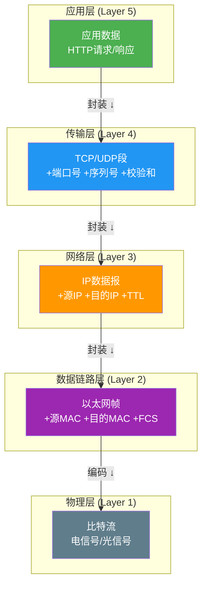
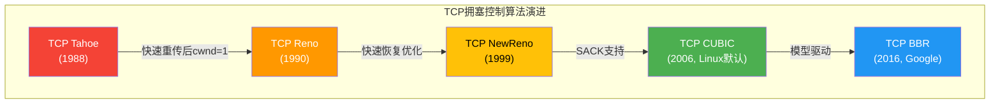

# 第18章 TCP/IP协议栈

TCP/IP协议栈是现代互联网的基石。从你打开浏览器输入URL的那一刻起，数据便沿着协议栈逐层封装，穿越路由器、交换机、防火墙，最终抵达目标服务器——这一切的背后，是四十余年演进形成的分层协议体系。本章将从底层链路到应用层，系统性地剖析TCP/IP协议栈的每一个关键层次。

**本章定位**：本书前序章节（第1-8章）建立了操作系统与硬件基础，第9-17章深入存储与数据库系统。网络是连接分布式系统各节点的血管，而TCP/IP协议栈则是理解一切网络行为的根基。无论是微服务架构中的RPC调用、分布式数据库的节点间同步，还是云原生环境中的服务网格，都离不开对协议栈的深刻理解。

**核心问题**：

- 数据是如何从一台主机的应用进程传递到另一台主机的应用进程的？
- TCP如何在不可靠的IP网络上提供可靠的、有序的、基于流的传输？
- 拥塞控制算法如何在公平性与吞吐量之间取得平衡？
- 现代高并发服务器如何利用内核特性压榨网络性能？

**数据封装的全过程**：



**前置知识**：读者应具备基本的操作系统概念（进程、内存管理、系统调用），了解进制转换和位运算基础。

**推荐参考书**：W. Richard Stevens《TCP/IP Illustrated, Volume 1: The Protocols》是本章的主要参考来源，辅以《Unix Network Programming》和Linux内核源码文档。

> 互联网不是一个单一的网络，而是成千上万个网络的互联。TCP/IP协议栈的伟大之处在于：它用简洁的分层设计，将"如何让异构网络互相通信"这一极其复杂的问题，分解为每层可独立演进的子问题。

***

# TCP/IP协议栈：理论基础

## 1. 网络分层模型

### 1.1 OSI七层模型

OSI（Open Systems Interconnection）模型由ISO于1984年发布，将网络通信划分为七个层次，每一层提供特定的服务并利用下层的服务：

| 层次 | 名称 | 功能 | 典型协议/设备 |
|------|------|------|---------------|
| 7 | 应用层 (Application) | 为应用程序提供网络服务接口 | HTTP, FTP, SMTP, DNS |
| 6 | 表示层 (Presentation) | 数据格式转换、加密、压缩 | SSL/TLS, JPEG, ASCII |
| 5 | 会话层 (Session) | 建立、管理、终止会话 | RPC, NetBIOS |
| 4 | 传输层 (Transport) | 端到端可靠传输、流量控制 | TCP, UDP |
| 3 | 网络层 (Network) | 路由选择、逻辑寻址 | IP, ICMP, OSPF, BGP |
| 2 | 数据链路层 (Data Link) | 帧封装、差错检测、介质访问控制 | Ethernet, PPP, VLAN |
| 1 | 物理层 (Physical) | 比特流传输、电气/光学信号规范 | RS-232, RJ45, 光纤 |

OSI模型是一个理论参考框架，它精确地定义了每层的职责边界，但在实际工程中，互联网并没有严格遵循七层划分。

### 1.2 TCP/IP四层模型

TCP/IP模型（又称Internet协议族）是实际运行互联网的协议体系，由DARPA在1970年代开发，分为四层：

+---------------------------+
|     应用层 (Application)   |  HTTP, DNS, FTP, SMTP, SSH
+---------------------------+
|     传输层 (Transport)     |  TCP, UDP, SCTP
+---------------------------+
|     网络层 (Internet)      |  IP, ICMP, IGMP, ARP
+---------------------------+
|   链路层 (Link/Network     |  Ethernet, Wi-Fi, PPP
|    Interface)              |
+---------------------------+

### 1.3 两种模型的对比

OSI模型与TCP/IP模型的核心差异：

| 维度 | OSI | TCP/IP |
|------|-----|--------|
| 层数 | 7层 | 4层（或5层） |
| 设计哲学 | 先有标准再有实现 | 先有实现再有标准（RFC） |
| 会话/表示层 | 独立分层 | 合并入应用层 |
| 网络层服务 | 既支持面向连接也支持无连接 | 仅无连接（IP提供尽力而为的服务） |
| 传输层 | 既支持面向连接也支持无连接 | TCP（面向连接）和UDP（无连接） |
| 协议依赖 | 三个独立概念：服务、接口、协议 | 不严格区分 |

**关键设计决策**：TCP/IP模型在网络层只提供无连接服务，将可靠性保证推到传输层（TCP），这一决策被称为"端到端原则"（End-to-End Argument）。它意味着核心网络保持简单（"哑网络"），复杂功能在端系统实现，这使得互联网能够以极低的中间设备成本实现大规模扩展。

**五层模型**：在教学中，经常使用五层模型（将TCP/IP的链路层拆分为物理层和数据链路层），它结合了OSI模型的清晰分层与TCP/IP模型的实用性：

第5层  应用层      → 报文 (Message)
第4层  传输层      → 段 (Segment)
第3层  网络层      → 数据报 (Datagram)
第2层  数据链路层  → 帧 (Frame)
第1层  物理层      → 比特 (Bit)

数据在每一层被封装（encapsulation）：上层的数据成为下层的载荷（payload），下层为其添加自己的头部（header），有时还包括尾部（trailer）。这个过程像俄罗斯套娃，逐层嵌套。

***

## 2. 链路层（Data Link Layer）

链路层负责在**同一网络段**（同一广播域）内的两个相邻节点之间传输数据。它处理物理寻址（MAC地址）、帧的组装与拆解、差错检测，以及介质访问控制。

### 2.1 以太网帧格式

以太网（Ethernet）是当今局域网的主流技术。以太网II帧（Ethernet II Frame，也称DIX帧）的格式如下：

+----------+----------+--------+-----------+---------+
| 目的MAC  | 源MAC    | 类型   | 数据      | FCS     |
| 6 字节   | 6 字节   | 2字节  | 46-1500B  | 4 字节  |
+----------+----------+--------+-----------+---------+

- **目的MAC地址**（6字节）：目标网卡的物理地址。全1（FF:FF:FF:FF:FF:FF）表示广播地址。
- **源MAC地址**（6字节）：发送方网卡的物理地址。
- **类型/长度**（2字节）：值大于0x0600时标识上层协议类型（0x0800=IPv4, 0x0806=ARP, 0x86DD=IPv6）；值小于等于0x05DC时表示数据长度（IEEE 802.3帧）。
- **数据**（46-1500字节）：上层协议数据。最小46字节（不足需填充），最大1500字节（以太网MTU）。
- **FCS**（4字节）：帧校验序列，使用CRC-32算法，接收方用于检测传输错误。

**以太网MTU**：Maximum Transmission Unit，默认为1500字节。这是一个关键参数——当IP数据报超过MTU时，IP层必须将其分片。jumbo frame（巨型帧）可将MTU提升至9000字节，减少分片开销，常用于数据中心内部。

**以太网速率演进**：

| 标准 | 速率 | 典型介质 | 常见场景 |
|------|------|---------|---------|
| 10BASE-T | 10 Mbps | 双绞线 | 早期局域网 |
| 100BASE-TX | 100 Mbps | 5类双绞线 | 桌面接入 |
| 1000BASE-T | 1 Gbps | 5e/6类双绞线 | 服务器接入 |
| 10GBASE-T | 10 Gbps | 6a/7类双绞线 | 数据中心Top-of-Rack |
| 25GBASE-T | 25 Gbps | 7类/8类双绞线 | 数据中心服务器 |
| 40GBASE-T | 40 Gbps | 8类双绞线 | 数据中心互联 |
| 100GBASE-SR4 | 100 Gbps | 多模光纤 | 数据中心骨干 |

现代数据中心普遍使用25G/100G以太网，通过链路聚合（LACP）将多条物理链路捆绑为一条逻辑链路，实现带宽叠加和冗余。

### 2.2 ARP协议

ARP（Address Resolution Protocol）解决的是"已知IP地址，如何获取对应的MAC地址"的问题。当主机A需要向同一子网内的主机B发送数据时：

1. A检查本地ARP缓存表，若已有B的MAC地址映射，直接使用。
2. 若未命中，A发送ARP请求广播帧：目的MAC为FF:FF:FF:FF:FF:FF，内容为"谁拥有IP地址192.168.1.5？请告诉192.168.1.1"。
3. 同一广播域内所有主机收到该请求，只有IP匹配的主机B发送ARP应答（单播）：内容为"192.168.1.5的MAC地址是aa:bb:cc:dd:ee:ff"。
4. A收到应答后更新ARP缓存表，后续通信直接使用单播。

**ARP缓存**：条目有生存时间（Linux默认为60秒到数分钟不等），过期后需重新解析。`arp -a`命令可查看ARP缓存表。

**ARP安全问题**：ARP协议缺乏认证机制，任何主机都可以发送伪造的ARP应答，将流量引向攻击者——这就是ARP欺骗（ARP Spoofing/Poisoning）。在现代网络中，可通过动态ARP检测（DAI）和802.1X认证来缓解。

**免费ARP**（Gratuitous ARP）：主机在自身IP地址变化或启动时主动发送ARP请求（请求自己的IP），用于检测地址冲突和通知其他主机更新缓存。

### 2.3 VLAN

VLAN（Virtual Local Area Network，虚拟局域网）在数据链路层将一个物理交换机划分为多个逻辑广播域。IEEE 802.1Q标准定义了VLAN标记帧格式：

+----------+----------+--------+-----+--------+-----------+---------+
| 目的MAC  | 源MAC    | TPID   | TCI | 类型   | 数据      | FCS     |
| 6 字节   | 6 字节   | 0x8100 | 2B  | 2字节  | 46-1500B  | 4 字节  |
+----------+----------+--------+-----+--------+-----------+---------+
                       ↑
                   VLAN标签（4字节）
                   - 3位优先级
                   - 1位CFI
                   - 12位VLAN ID（支持4096个VLAN）

VLAN的核心价值：
- **广播域隔离**：不同VLAN之间的广播帧不会相互传播，减少广播风暴。
- **安全性**：不同VLAN间的通信必须经过三层设备（路由器或三层交换机），便于实施访问控制。
- **灵活性**：用户可以按业务逻辑（而非物理位置）分组，IP地址规划更灵活。

**Trunk链路**：交换机之间的链路配置为Trunk模式，允许多个VLAN的帧通过，使用802.1Q标签区分不同VLAN的流量。

### 2.4 Wi-Fi基础（IEEE 802.11）

Wi-Fi是无线局域网的主流技术，与以太网共同构成了链路层的两大支柱：

| 标准 | 名称 | 频段 | 最大速率 | 关键特性 |
|------|------|------|---------|---------|
| 802.11a | Wi-Fi 1 | 5 GHz | 54 Mbps | OFDM调制 |
| 802.11b | Wi-Fi 2 | 2.4 GHz | 11 Mbps | DSSS调制 |
| 802.11g | Wi-Fi 3 | 2.4 GHz | 54 Mbps | OFDM调制 |
| 802.11n | Wi-Fi 4 | 2.4/5 GHz | 600 Mbps | MIMO多天线 |
| 802.11ac | Wi-Fi 5 | 5 GHz | 6.9 Gbps | MU-MIMO, 80/160MHz信道 |
| 802.11ax | Wi-Fi 6/6E | 2.4/5/6 GHz | 9.6 Gbps | OFDMA, BSS Coloring, TWT |
| 802.11be | Wi-Fi 7 | 2.4/5/6 GHz | 46 Gbps | MLO多链路操作, 320MHz信道 |

Wi-Fi与以太网的关键差异：Wi-Fi是共享介质（CSMA/CA冲突避免而非以太网的CSMA/CD冲突检测），帧格式不同（有额外的无线头部和安全字段），且信号衰减和干扰导致实际吞吐量远低于理论值。

***

## 3. 网络层（Internet Layer）

网络层的核心任务是将数据包从源主机送达目的主机，可能跨越多个不同类型的物理网络。这一层的关键协议是IP（Internet Protocol），配套协议包括ICMP、IGMP以及路由协议。

### 3.1 IPv4报文格式

IPv4报头最小20字节，最大60字节（含选项字段）：

 0                   1                   2                   3
 0 1 2 3 4 5 6 7 8 9 0 1 2 3 4 5 6 7 8 9 0 1 2 3 4 5 6 7 8 9 0 1
+-+-+-+-+-+-+-+-+-+-+-+-+-+-+-+-+-+-+-+-+-+-+-+-+-+-+-+-+-+-+-+-+
|Version|  IHL  |    DSCP   |ECN|         Total Length          |
+-+-+-+-+-+-+-+-+-+-+-+-+-+-+-+-+-+-+-+-+-+-+-+-+-+-+-+-+-+-+-+-+
|         Identification        |Flags|     Fragment Offset     |
+-+-+-+-+-+-+-+-+-+-+-+-+-+-+-+-+-+-+-+-+-+-+-+-+-+-+-+-+-+-+-+-+
|  Time to Live |    Protocol   |        Header Checksum        |
+-+-+-+-+-+-+-+-+-+-+-+-+-+-+-+-+-+-+-+-+-+-+-+-+-+-+-+-+-+-+-+-+
|                       Source Address                          |
+-+-+-+-+-+-+-+-+-+-+-+-+-+-+-+-+-+-+-+-+-+-+-+-+-+-+-+-+-+-+-+-+
|                    Destination Address                        |
+-+-+-+-+-+-+-+-+-+-+-+-+-+-+-+-+-+-+-+-+-+-+-+-+-+-+-+-+-+-+-+-+
|                    Options (if IHL > 5)                       |
+-+-+-+-+-+-+-+-+-+-+-+-+-+-+-+-+-+-+-+-+-+-+-+-+-+-+-+-+-+-+-+-+

逐字段详解：

- **Version**（4位）：IP协议版本号，IPv4为4。
- **IHL**（4位）：IP头部长度，以4字节为单位。最小值5（20字节），最大值15（60字节）。
- **DSCP**（6位）：Differentiated Services Code Point，用于QoS（服务质量）分类。常用标记：EF（加速转发，用于VoIP）、AF（确保转发，4类×3丢弃优先级）、BE（尽力而为，默认）。
- **ECN**（2位）：Explicit Congestion Notification，允许网络设备在不丢包的情况下通知端系统发生了拥塞。配合TCP的ECN-Echo和CWR标志位使用，是实现无丢包拥塞通知的基础。
- **Total Length**（16位）：整个IP数据报的长度（含头部），以字节为单位。最大65535字节。
- **Identification**（16位）：标识符，用于分片重组。同一数据报的所有分片共享相同的Identification值。
- **Flags**（3位）：第1位保留（必须为0）；第2位DF（Don't Fragment），置1表示禁止分片；第3位MF（More Fragments），置1表示后面还有分片。
- **Fragment Offset**（13位）：分片偏移量，以8字节为单位，指示该分片在原始数据报中的位置。
- **TTL**（8位）：生存时间，每经过一个路由器减1，减至0时丢弃并发送ICMP超时报文。防止数据报在网络中无限循环。
- **Protocol**（8位）：上层协议号。1=ICMP, 2=IGMP, 6=TCP, 17=UDP, 41=IPv6封装, 89=OSPF。
- **Header Checksum**（16位）：头部校验和，仅校验头部（不含数据部分），每经过一个路由器需重新计算（因为TTL变化）。
- **Source/Destination Address**（各32位）：源和目的IP地址。

### 3.2 IP分片与重组

当IP数据报的大小超过链路层MTU时，IP层必须将其分片（fragmentation）。分片由发送主机或路径上的路由器完成，但**重组只在目的主机进行**（中间路由器不重组，只可能继续分片）。

**分片过程**：

假设一个4000字节的IP数据报（20字节头部 + 3980字节数据）需要通过MTU为1500字节的链路：

原始数据报: ID=100, 总长=4000, 数据=3980字节

分片1: ID=100, MF=1, Offset=0,   数据=1480字节 (偏移0-1479)
分片2: ID=100, MF=1, Offset=185, 数据=1480字节 (偏移1480-2959)
分片3: ID=100, MF=0, Offset=370, 数据=1020字节 (偏移2960-3979)

注意Fragment Offset以8字节为单位：1480/8=185, 2960/8=370。

**分片的问题**：
- 任何一片丢失，整个数据报需要重传（IPv4不支持选择性重传分片）。
- 分片增加路由器和目的主机的处理开销。
- 分片攻击（teardrop attack）利用重组逻辑漏洞构造恶意分片。
- IPv6直接在源端进行路径MTU发现，中间路由器不做分片。

**Path MTU Discovery**：发送方设置DF=1，发送全尺寸数据报。若中间路由器因MTU限制无法转发，会返回ICMP "Fragmentation Needed"报文，其中包含下一跳的MTU。发送方据此减小数据报大小重试，直到找到路径上最小的MTU。

### 3.3 ICMP协议

ICMP（Internet Control Message Protocol，Internet控制消息协议）是IP层的伴随协议，用于在主机与路由器之间传递控制消息和错误报告。ICMP报文封装在IP数据报中（Protocol=1），虽然逻辑上属于网络层，但在协议栈中位于IP之上。

**ICMP报文格式**：

+-+-+-+-+-+-+-+-+-+-+-+-+-+-+-+-+-+-+-+-+-+-+-+-+-+-+-+-+-+-+-+-+
|     Type      |     Code      |         Checksum              |
+-+-+-+-+-+-+-+-+-+-+-+-+-+-+-+-+-+-+-+-+-+-+-+-+-+-+-+-+-+-+-+-+
|                         消息体（因类型而异）                    |
+-+-+-+-+-+-+-+-+-+-+-+-+-+-+-+-+-+-+-+-+-+-+-+-+-+-+-+-+-+-+-+-+

**常见ICMP类型**：

| Type | Code | 名称 | 用途 |
|------|------|------|------|
| 0 | 0 | Echo Reply | ping应答 |
| 3 | 0-15 | Destination Unreachable | 目的不可达（网络/主机/端口/协议等） |
| 4 | 0 | Source Quench | 源站抑制（已废弃，由拥塞控制替代） |
| 5 | 0-3 | Redirect | 路由重定向 |
| 8 | 0 | Echo Request | ping请求 |
| 11 | 0 | Time Exceeded (TTL) | TTL超时——traceroute的核心机制 |
| 11 | 1 | Time Exceeded (Fragment) | 分片重组超时 |
| 12 | 0 | Parameter Problem | IP头部参数错误 |
| 30 | 0 | Traceroute | traceroute请求（RFC 1393，较少使用） |

**ping的工作原理**：发送ICMP Echo Request（Type=8），接收方回复Echo Reply（Type=0）。测量从发送到接收的时间即为RTT。Linux的ping命令默认使用ICMP序列号标识每个请求，每秒发送一个包。

**traceroute的工作原理**：巧妙利用TTL机制探测路径上的每一跳路由器：
1. 发送TTL=1的数据包 → 第一个路由器将TTL减为0，返回ICMP Time Exceeded（Type=11）。
2. 发送TTL=2的数据包 → 第二个路由器返回ICMP Time Exceeded。
3. 重复此过程，直到数据包到达目的主机，返回Echo Reply（Type=0）或端口不可达（Type=3）。

**ICMP重定向**（Redirect, Type=5）：当路由器发现主机选择了一条非最优路径时（例如主机将数据包发给了默认网关，但该网关知道存在更短路径），会发送ICMP重定向消息，告诉主机"下次请直接发给10.0.0.2"。这是一种简单的路由优化机制。

**ICMP与安全**：ICMP本身可以被滥用进行攻击：
- **Ping Flood**：大量发送Echo Request消耗目标资源（可用iptables限速：`-m limit --limit 1/s`）。
- **Smurf Attack**：伪造源地址向广播地址发送Echo Request，大量回复涌向受害者。
- **ICMP隧道**：将数据封装在ICMP Echo的data部分，绕过防火墙的端口限制。
- 现代防火墙通常限制或丢弃不必要的ICMP类型，但ICMP Echo（ping）和Time Exceeded（traceroute）通常被保留。

### 3.4 IGMP协议

IGMP（Internet Group Management Protocol）是IPv4组播（Multicast）的管理协议，用于主机向本地路由器通告自己希望接收的组播组数据。IGMP报文封装在IP数据报中（Protocol=2），TTL固定为1（不跨越路由器）。

**IGMP的工作流程**：

1. **加入组播组**：主机发送IGMP Membership Report（Type=0x16）加入特定组播组（如239.1.1.1）。
2. **查询**：路由器定期（默认125秒）发送IGMP General Query（Type=0x11）询问本子网内是否有组播组成员。
3. **响应**：主机收到查询后，随机延迟（0-10秒）后发送 Membership Report。如果同一组播组的其他主机已报告，路由器在查询间隔内不会重复报告——这利用了IGMP的"隐式离开"机制。
4. **离开组**：主机发送IGMP Leave Group（Type=0x17）主动退出。路由器收到后发送特定组查询（Group-Specific Query）确认是否还有其他成员。

**IGMP版本演进**：
- **IGMPv1**（RFC 988）：基本查询/报告机制，无主动离开。
- **IGMPv2**（RFC 2236）：增加Leave Group消息和特定组查询。
- **IGMPv3**（RFC 3376）：支持源过滤（SSM, Source-Specific Multicast），主机可以指定只接收来自特定源的组播流量。

**组播地址范围**：224.0.0.0 - 239.255.255.255。其中224.0.0.x为链路本地（如224.0.0.5=OSPF, 224.0.0.6=OSPF指定路由器, 224.0.0.9=RIPv2），239.x.x.x为管理域内组播。

### 3.5 路由算法

路由算法决定数据包从源到目的的最优路径。根据算法原理，可分为以下几类：

#### 3.5.1 距离向量算法——RIP

RIP（Routing Information Protocol）基于Bellman-Ford算法，每个路由器维护到各目的网络的"距离"（跳数）和下一跳：

// Bellman-Ford方程
对于每个目的网络 d:
    D_x(d) = min over all neighbors v { c(x, v) + D_v(d) }
    其中 c(x,v) 是到邻居v的链路代价，D_v(d) 是邻居v到d的距离

// RIP实现伪码
function RIP_update(received_table, neighbor):
    for each (dest, cost) in received_table:
        new_cost = cost + link_cost(neighbor)
        if dest not in my_table or new_cost < my_table[dest].cost:
            my_table[dest] = {cost: new_cost, next_hop: neighbor}
    
    // 计数到无穷大问题的缓解：毒性反转
    for each (dest, _) in my_table where next_hop == neighbor:
        advertise(dest, INFINITY)  // 告诉邻居该路径不可用

RIP的特点：
- 最大跳数15（16表示不可达），限制了网络规模。
- 每30秒交换完整路由表，收敛慢。
- 使用UDP端口520通信。
- 适用于小型网络，已基本被OSPF取代。

**计数到无穷大问题**：当网络拓扑变化时，距离向量算法可能出现路由环路，距离值不断增大直到达到无穷大。解决方案包括：毒性反转（Poisoned Reverse）、触发更新、水平分割（Split Horizon）。

#### 3.5.2 链路状态算法——OSPF

OSPF（Open Shortest Path First）是一种链路状态路由协议，每个路由器拥有完整的网络拓扑视图，使用Dijkstra算法计算最短路径树：

// Dijkstra最短路径算法
function dijkstra(graph, source):
    dist[source] = 0
    prev[source] = null
    priority_queue = {source: 0}
    
    for each vertex v ≠ source:
        dist[v] = INFINITY
        prev[v] = null
        priority_queue[v] = INFINITY
    
    while priority_queue is not empty:
        u = extract_min(priority_queue)  // 取距离最小的节点
        for each neighbor v of u:
            if v in priority_queue:
                alt = dist[u] + cost(u, v)
                if alt < dist[v]:
                    dist[v] = alt
                    prev[v] = u
                    decrease_key(priority_queue, v, alt)
    
    return dist, prev

OSPF的工作流程：
1. **邻居发现**：路由器在每个接口周期性发送Hello报文（组播地址224.0.0.5），发现直连邻居。
2. **链路状态通告（LSA）**：每个路由器生成描述自身链路状态的LSA，包含邻居列表和链路代价。
3. **泛洪**：LSA在整个OSPF区域内泛洪，每个路由器收到后存入链路状态数据库（LSDB），并向除来源外的所有接口转发。
4. **SPF计算**：每个路由器以自身为根，使用Dijkstra算法计算到所有目的网络的最短路径树。
5. **路由表更新**：将最短路径写入路由表。

OSPF的优势：
- 支持VLSM（可变长子网掩码）和CIDR。
- 支持区域（Area）分层设计，减少LSDB规模和SPF计算频率。
- 触发更新+周期性刷新（默认30分钟），收敛快。
- 支持等价多路径（ECMP）负载均衡。
- 使用组播地址224.0.0.5（所有路由器）和224.0.0.6（指定路由器），减少对非OSPF设备的影响。

#### 3.5.3 路径向量算法——BGP

BGP（Border Gateway Protocol）是互联网的核心路由协议，用于在**自治系统（AS）**之间交换路由信息。互联网由数万个AS组成，每个AS由一个组织运营，拥有唯一的AS号（ASN）。

BGP与RIP/OSPF的根本区别：BGP不使用跳数或链路代价，而是基于**AS路径**（AS-PATH）和**策略**做出路由决策。BGP是路径向量协议——每条路由记录了从源到目的所经过的完整AS序列。

// BGP路由选择伪码（简化版）
function bgp_best_route(routes_to_dest):
    // 按优先级逐步筛选
    1. 选择LOCAL_PREF最高的路由（本地策略偏好）
    2. 选择AS_PATH最短的路由
    3. 选择ORIGIN类型最低的（IGP < EGP < Incomplete）
    4. 选择MED最低的路由（跨AS的metric）
    5. 选择eBGP路由优于iBGP路由
    6. 选择到下一跳IGP度量最小的路由
    7. 选择Router ID最小的路由（打破平局）

BGP的关键特性：
- **TCP连接**：BGP使用TCP端口179建立对等体连接，利用TCP的可靠传输。
- **增量更新**：建立连接后仅发送增量路由变化，不是完整路由表。
- **路由策略**：AS可以基于丰富的属性（AS_PATH, LOCAL_PREF, COMMUNITY等）实施复杂的路由策略，实现流量工程。
- **eBGP vs iBGP**：eBGP用于AS之间交换路由；iBGP用于AS内部同步从eBGP学到的路由（防止AS内部环路需要全网状iBGP连接或使用路由反射器）。

### 3.6 CIDR与子网划分

**CIDR**（Classless Inter-Domain Routing，无类别域间路由）打破了传统A/B/C类地址的固定边界，允许任意长度的网络前缀：

传统分类:
A类: 0.0.0.0   - 127.255.255.255  (前缀 /8)
B类: 128.0.0.0 - 191.255.255.255  (前缀 /16)
C类: 192.0.0.0 - 223.255.255.255  (前缀 /24)

CIDR:
192.168.1.0/24 → 前24位为网络地址，后8位为主机地址
10.0.0.0/8     → 前8位为网络地址，后24位为主机地址
172.16.0.0/12  → 前12位为网络地址，后20位为主机地址

**子网掩码**：用连续的1表示网络部分，0表示主机部分。CIDR记法中的"/24"等价于子网掩码255.255.255.0。

**子网划分实例**：

将192.168.1.0/24划分为4个等大的子网：
- 192.168.1.0/26   （可用主机：192.168.1.1 - 192.168.1.62，共62台）
- 192.168.1.64/26  （可用主机：192.168.1.65 - 192.168.1.126）
- 192.168.1.128/26 （可用主机：192.168.1.129 - 192.168.1.190）
- 192.168.1.192/26 （可用主机：192.168.1.193 - 192.168.1.254）

**路由聚合**（Supernetting）：CIDR允许将多个连续的子网聚合成一个更大的路由条目。例如，/24 + /24 可聚合成/23。这显著减小了全球路由表的规模。

**私有地址空间**（RFC 1918）：
- 10.0.0.0/8       （10.0.0.0 - 10.255.255.255）
- 172.16.0.0/12     （172.16.0.0 - 172.31.255.255）
- 192.168.0.0/16    （192.168.0.0 - 192.168.255.255）

### 3.7 NAT原理

NAT（Network Address Translation，网络地址转换）在私有网络与公网之间转换IP地址，解决IPv4地址不足的问题。

#### SNAT（源地址转换）

当内网主机向外发包时，NAT设备将源IP（私有地址）替换为公网IP：

内网主机 → NAT设备 → 外网服务器
192.168.1.5:12345 → 203.0.113.1:50001 → 8.8.8.8:80

#### DNAT（目的地址转换）

将外网发来的包的目的IP替换为内网主机IP，常用于端口映射/端口转发：

外网客户端 → NAT设备 → 内网服务器
1.1.1.1:54321 → 203.0.113.1:80 → 192.168.1.10:8080

#### NAPT（Network Address Port Translation）

NAPT是SNAT的扩展，多个内网主机可以共享一个公网IP，通过端口号区分不同会话：

内网主机A: 192.168.1.5:12345  → NAT → 203.0.113.1:50001
内网主机B: 192.168.1.6:12345  → NAT → 203.0.113.1:50002
内网主机C: 192.168.1.7:23456  → NAT → 203.0.113.1:50003

NAT表（转换表）记录了内网（IP:端口）与公网（IP:端口）的映射关系，条目有超时时间。

**NAT表容量问题**：一个NAT设备能同时维护的映射条目有限。以典型的家用路由器为例，单个公网IP的NAPT最多支持约65000个并发连接（端口总数65535减去保留端口）。在高并发场景下（如作为反向代理的Nginx服务器），NAT表可能成为瓶颈。

#### NAT穿越

NAT给P2P通信带来困难，因为外网主机无法主动向NAT后的主机发起连接。常见穿越技术：
- **STUN**（Session Traversal Utilities for NAT）：客户端通过STUN服务器发现自己的公网IP和端口映射。
- **TURN**（Traversal Using Relays around NAT）：当P2P直连失败时，通过TURN中继服务器转发数据。
- **ICE**（Interactive Connectivity Establishment）：综合使用STUN和TURN，尝试多种候选地址对，选择最优路径。

### 3.8 IPv6

IPv6使用128位地址，地址空间为2^128（约3.4×10^38），彻底解决地址耗尽问题。

#### IPv6报文格式

IPv6头部固定40字节，设计比IPv4更简洁高效：

+-+-+-+-+-+-+-+-+-+-+-+-+-+-+-+-+-+-+-+-+-+-+-+-+-+-+-+-+-+-+-+-+
|Version| Traffic Class |           Flow Label                  |
+-+-+-+-+-+-+-+-+-+-+-+-+-+-+-+-+-+-+-+-+-+-+-+-+-+-+-+-+-+-+-+-+
|         Payload Length        |  Next Header  |   Hop Limit   |
+-+-+-+-+-+-+-+-+-+-+-+-+-+-+-+-+-+-+-+-+-+-+-+-+-+-+-+-+-+-+-+-+
|                                                               |
+                                                               +
|                                                               |
+                         Source Address (128 bits)              +
|                                                               |
+                                                               +
|                                                               |
+-+-+-+-+-+-+-+-+-+-+-+-+-+-+-+-+-+-+-+-+-+-+-+-+-+-+-+-+-+-+-+-+
|                                                               |
+                                                               +
|                                                               |
+                      Destination Address (128 bits)            +
|                                                               |
+                                                               +
|                                                               |
+-+-+-+-+-+-+-+-+-+-+-+-+-+-+-+-+-+-+-+-+-+-+-+-+-+-+-+-+-+-+-+-+

与IPv4相比的改进：
- 去掉了IHL（头部固定为40字节）、Identification、Flags、Fragment Offset、Header Checksum。
- 分片信息通过扩展头部（Extension Header）携带。
- 使用Next Header链式结构，替代IPv4的Protocol字段，可链接多个扩展头部。
- Hop Limit替代TTL（功能相同）。

#### IPv6地址类型

- **单播地址（Unicast）**：全球单播地址（2000::/3）、链路本地地址（fe80::/10）、唯一本地地址（fc00::/7，类似IPv4私有地址）。
- **组播地址（Multicast）**：ff00::/8，替代IPv4的广播。
- **任播地址（Anycast）**：多个接口共享同一地址，发往该地址的包被路由到最近的一个。IPv6原生支持。

#### IPv6地址表示

完整形式: 2001:0db8:0000:0000:0000:0000:0000:0001
压缩规则:
  - 每组前导零可省略: 2001:db8:0:0:0:0:0:1
  - 连续全零组可用::替代（仅一次）: 2001:db8::1

#### IPv4到IPv6的过渡技术

- **双栈**（Dual Stack）：设备同时运行IPv4和IPv6协议栈。
- **隧道**（Tunneling）：将IPv6数据包封装在IPv4数据包中穿越IPv4网络（如6to4、Teredo、GRE隧道）。
- **转换**（Translation）：NAT64/DNS64，将IPv6和IPv4地址互相转换。

**IPv6部署现状**：截至2025年，全球IPv6流量占比已超过40%（Google统计）。中国三大运营商的IPv6覆盖率超过80%，主要互联网应用（微信、抖音、百度）均已支持IPv6。但企业内网的IPv6部署仍然滞后，主要原因包括：双栈运维复杂度增加、IPv6-only环境下的DNS64/NAT64配置、安全策略需要重新审计。

***

## 4. 传输层——TCP

TCP（Transmission Control Protocol）是互联网最重要的传输层协议，提供面向连接的、可靠的、基于字节流的传输服务。

### 4.1 TCP报文格式

 0                   1                   2                   3
 0 1 2 3 4 5 6 7 8 9 0 1 2 3 4 5 6 7 8 9 0 1 2 3 4 5 6 7 8 9 0 1
+-+-+-+-+-+-+-+-+-+-+-+-+-+-+-+-+-+-+-+-+-+-+-+-+-+-+-+-+-+-+-+-+
|          Source Port          |       Destination Port        |
+-+-+-+-+-+-+-+-+-+-+-+-+-+-+-+-+-+-+-+-+-+-+-+-+-+-+-+-+-+-+-+-+
|                        Sequence Number                        |
+-+-+-+-+-+-+-+-+-+-+-+-+-+-+-+-+-+-+-+-+-+-+-+-+-+-+-+-+-+-+-+-+
|                    Acknowledgment Number                      |
+-+-+-+-+-+-+-+-+-+-+-+-+-+-+-+-+-+-+-+-+-+-+-+-+-+-+-+-+-+-+-+-+
|  Data |       |C|E|U|A|P|R|S|F|                               |
| Offset| Rsrvd |W|C|R|C|S|S|Y|I|            Window             |
|  (4)  |  (3)  |R|E|G|K|H|T|N|N|                               |
+-+-+-+-+-+-+-+-+-+-+-+-+-+-+-+-+-+-+-+-+-+-+-+-+-+-+-+-+-+-+-+-+
|           Checksum            |         Urgent Pointer        |
+-+-+-+-+-+-+-+-+-+-+-+-+-+-+-+-+-+-+-+-+-+-+-+-+-+-+-+-+-+-+-+-+
|                    Options (variable)                         |
+-+-+-+-+-+-+-+-+-+-+-+-+-+-+-+-+-+-+-+-+-+-+-+-+-+-+-+-+-+-+-+-+
|                             Data                              |
+-+-+-+-+-+-+-+-+-+-+-+-+-+-+-+-+-+-+-+-+-+-+-+-+-+-+-+-+-+-+-+-+

关键字段详解：

- **Source/Destination Port**（各16位）：端口号范围0-65535。知名端口0-1023，注册端口1024-49151，动态/私有端口49152-65535。
- **Sequence Number**（32位）：本报文段数据的第一个字节在整个字节流中的编号。初始序列号（ISN）在三次握手时随机生成。
- **Acknowledgment Number**（32位）：期望收到的下一个字节的序列号。只有ACK标志位为1时有效。
- **Data Offset**（4位）：TCP头部长度，以4字节为单位。最小5（20字节），最大15（60字节）。
- **标志位**（各1位）：
  - **SYN**：同步序列号，用于建立连接。
  - **ACK**：确认号有效。
  - **FIN**：发送方没有更多数据要发送，请求关闭连接。
  - **RST**：重置连接，表示连接出现异常。
  - **PSH**：接收方应立即将数据交给应用层，不要等待缓冲区满。
  - **URG**：紧急指针有效。
- **Window**（16位）：接收窗口大小，以字节为单位，用于流量控制。
- **Checksum**（16位）：校验和，覆盖TCP头部、数据以及伪头部（源IP、目的IP、协议号、TCP长度）。
- **Urgent Pointer**（16位）：紧急指针，指示紧急数据的末尾位置。
- **选项**：最大段大小（MSS）、窗口缩放因子、时间戳、SACK等。

### 4.2 三次握手与四次挥手

#### 三次握手（Connection Establishment）

客户端                                 服务器
  |                                      |
  |  ① SYN, seq=x                       |
  |  (状态: SYN_SENT)                   |
  | ---------------------------------->  | (状态: SYN_RCVD)
  |                                      |
  |  ② SYN+ACK, seq=y, ack=x+1         |
  | <----------------------------------  |
  |  (状态: ESTABLISHED)                |
  |                                      |
  |  ③ ACK, seq=x+1, ack=y+1           |
  | ---------------------------------->  | (状态: ESTABLISHED)

**三次握手的状态机伪码**：

// 客户端状态机
State: CLOSED
    event: connect() called
        → 发送 SYN(seq=x)
        → 转入 SYN_SENT

State: SYN_SENT
    event: 收到 SYN+ACK(seq=y, ack=x+1)
        → 发送 ACK(seq=x+1, ack=y+1)
        → 转入 ESTABLISHED
    event: 超时
        → 重发 SYN
        → 保持 SYN_SENT

// 服务器状态机
State: CLOSED
    event: bind() + listen() called
        → 转入 LISTEN

State: LISTEN
    event: 收到 SYN(seq=x)
        → 分配资源
        → 发送 SYN+ACK(seq=y, ack=x+1)
        → 转入 SYN_RCVD

State: SYN_RCVD
    event: 收到 ACK(seq=x+1, ack=y+1)
        → 转入 ESTABLISHED
    event: 超时（未收到ACK）
        → 释放资源
        → 返回 LISTEN

**为什么是三次而不是两次？**

核心原因是TCP需要**双向同步序列号**。两次握手只能确认一个方向的序列号同步成功：

- 如果只有两次握手：客户端发送SYN，服务器回复SYN+ACK，连接建立。问题在于服务器不知道客户端是否收到了SYN+ACK——服务器单方面认为连接已建立，但客户端可能没收到应答。
- 三次握手的第三步ACK告诉服务器："我收到了你的SYN+ACK，连接正式建立"。同时，第三步也确认了客户端→服务器方向的初始序列号。

另一个实际原因：防止**旧的重复连接请求**。如果客户端发送了一个延迟的SYN（旧连接残留），服务器收到后以为是新连接请求，发送SYN+ACK。如果没有第三步的ACK，服务器会错误地建立一个客户端根本不知道的连接，浪费资源。有了第三步，客户端可以选择不发送ACK（如果它知道这是旧的请求），服务器超时后会释放资源。

#### 四次挥手（Connection Termination）

主动关闭方                              被动关闭方
  |                                      |
  |  ① FIN, seq=u                       |
  |  (状态: FIN_WAIT_1)                 |
  | ---------------------------------->  | (状态: CLOSE_WAIT)
  |                                      |
  |  ② ACK, seq=v, ack=u+1             |
  | <----------------------------------  |
  |  (状态: FIN_WAIT_2)                 |
  |                                      |
  |       [被动关闭方处理剩余数据]         |
  |                                      |
  |  ③ FIN, seq=w, ack=u+1             |
  | <----------------------------------  | (状态: LAST_ACK)
  |                                      |
  |  ④ ACK, seq=u+1, ack=w+1           |
  | ---------------------------------->  | (状态: CLOSED)
  |  (状态: TIME_WAIT)                  |
  |                                      |
  |  等待 2MSL                          |
  |  (状态: CLOSED)                     |

**为什么是四次而不是三次？**

TCP是全双工的，每个方向需要独立关闭。当主动关闭方发送FIN时，只表示"我没有数据要发了"，但被动关闭方可能还有数据要发送。因此被动关闭方的ACK和FIN不能合并——ACK是立即发送的（确认收到FIN），但FIN要等到被动关闭方也发完数据后才发送。

在实际中，如果被动关闭方没有待发数据，步骤②和③可能合并（延迟ACK机制下），变成类似三次挥手的效果。

**TCP连接状态机完整伪码**：

// TCP状态机核心伪码（简化）

States: CLOSED, LISTEN, SYN_SENT, SYN_RCVD, ESTABLISHED,
        FIN_WAIT_1, FIN_WAIT_2, CLOSE_WAIT, LAST_ACK,
        TIME_WAIT, CLOSING

// 主动打开（客户端）
CLOSED → connect() → SYN_SENT → 收到SYN+ACK → 发ACK → ESTABLISHED

// 被动打开（服务器）
CLOSED → listen() → LISTEN → 收到SYN → 发SYN+ACK → SYN_RCVD
    → 收到ACK → ESTABLISHED

// 主动关闭
ESTABLISHED → close() → 发FIN → FIN_WAIT_1
    → 收到ACK → FIN_WAIT_2
    → 收到FIN → 发ACK → TIME_WAIT
    → 等待2MSL → CLOSED

// 被动关闭
ESTABLISHED → 收到FIN → 发ACK → CLOSE_WAIT
    → close() → 发FIN → LAST_ACK
    → 收到ACK → CLOSED

// 同时关闭
ESTABLISHED → close() → 发FIN → FIN_WAIT_1
    → 收到FIN → 发ACK → CLOSING
    → 收到ACK → TIME_WAIT
    → 等待2MSL → CLOSED

### 4.3 可靠传输机制

TCP通过以下机制在不可靠的IP层上实现可靠传输：

**序列号与确认号**：每个字节都有唯一的序列号。接收方通过ACK告知发送方"我已正确收到序列号X之前的所有字节，请从X开始发送"。TCP使用**累积确认**——ACK=100表示序列号1-99的字节都已正确接收。

**超时重传**：发送方为每个发出的段启动重传定时器（RTO, Retransmission Timeout）。若在RTO内未收到对应ACK，则重传该段。

RTO的计算基于RTT（Round-Trip Time）测量，采用Jacobson/Karels算法：

// RTT测量与RTO计算（RFC 6298）
// 每次收到ACK，测量样本RTT（SampleRTT）

SRTT = (1 - alpha) * SRTT + alpha * SampleRTT      // 平滑RTT, alpha = 1/8
RTTVAR = (1 - beta) * RTTVAR + beta * |SRTT - SampleRTT|  // RTT偏差, beta = 1/4
RTO = SRTT + max(G, 4 * RTTVAR)                     // G为时钟粒度

// RTO下限1秒（首次），后续重传指数退避
// RTO上限60秒（RFC 6298推荐）

**快速重传**：当发送方连续收到3个重复ACK（即同一序列号的ACK收到4次）时，不必等待RTO超时，立即重传丢失的段。这显著减少了丢包恢复时间。

发送方发送: seq=1000, 2000, 3000, 4000, 5000
                    ↓ seq=2000丢失
接收方返回: ACK=1000(seq=1收到),
            ACK=1000(收到seq=3000, 但2000还没到),
            ACK=1000(收到seq=4000),
            ACK=1000(收到seq=5000)
                    ↓ 3个重复ACK
发送方: 立即重传seq=2000（快速重传）

### 4.4 流量控制：滑动窗口

流量控制防止发送方发送速度过快导致接收方缓冲区溢出。TCP使用**滑动窗口**机制：

发送方维护的窗口:

    已确认    可发送(在窗口内)   不可发送(窗口外)
  |=========|==================|============>
  0       base           next_to_send    base+window
            ↑                ↑
        窗口左边界        窗口右边界

接收方通告的窗口大小 (rwnd) 决定发送方窗口:

win_size = min(cwnd, rwnd)
// cwnd: 拥塞窗口（拥塞控制）
// rwnd: 接收窗口（流量控制）

**滑动窗口算法伪码**：

function send_data():
    while (next_to_send < base + window_size):
        if 有未发送的数据:
            segment = create_segment(next_to_send)
            send(segment)
            start_timer(segment)
            next_to_send += segment.length
        else:
            break

function on_ACK_received(ack_num):
    if ack_num > base:  // 新的确认
        base = ack_num
        stop_timers_for_acked_segments()
        // 窗口右移，可能可以发送更多数据
        send_data()
    
    // 窗口更新：接收方发来的Window字段
    window_size = min(cwnd, rwnd)

function on_timeout(segment):
    retransmit(segment)
    start_timer(segment)  // 重置RTO（通常加倍）

function on_duplicate_ACK():
    dup_ack_count++
    if dup_ack_count == 3:
        retransmit(最早的未确认段)  // 快速重传

接收方通过TCP头部的Window字段通告自己的可用缓冲区大小。Window Scale选项（RFC 7323）允许窗口大小超过65535字节（最大可达约1GB），通过协商缩放因子实现。

### 4.5 拥塞控制

拥塞控制防止过多数据注入网络导致路由器队列溢出。与流量控制（端到端，保护接收方）不同，拥塞控制保护的是网络本身。



#### TCP Reno拥塞控制（经典算法）

TCP维护一个拥塞窗口（cwnd），发送窗口为 min(cwnd, rwnd)。

**慢启动（Slow Start）**：

// 初始: cwnd = 1 MSS (或根据RFC 6928, 初始窗口为10 MSS)
// 每收到一个ACK, cwnd += 1 MSS (即每个RTT, cwnd翻倍)
// 指数增长直到 cwnd >= ssthresh (慢启动阈值)

function slow_start_on_ACK():
    cwnd += 1 MSS
    if cwnd >= ssthresh:
        state = CONGESTION_AVOIDANCE

**拥塞避免（Congestion Avoidance）**：

// cwnd超过ssthresh后进入拥塞避免
// 线性增长：每个RTT，cwnd增加1 MSS
// 即每收到一个ACK，cwnd += MSS * (MSS / cwnd)

function congestion_avoidance_on_ACK():
    cwnd += MSS * (MSS / cwnd)  // 约每RTT增加1 MSS

**丢包事件处理**：

// 传统TCP Reno的丢包处理
function on_packet_loss_detected():
    if 是超时检测到的:
        ssthresh = cwnd / 2
        cwnd = 1 MSS
        state = SLOW_START
    else if 是3个重复ACK（快速重传触发）:
        ssthresh = cwnd / 2
        cwnd = ssthresh + 3 MSS  // 快速恢复
        state = FAST_RECOVERY

// 快速恢复阶段
function fast_recovery_on_ACK(ack):
    if 是新数据的ACK:
        cwnd = ssthresh  // 退出快速恢复，进入拥塞避免
        state = CONGESTION_AVOIDANCE
    else if 是重复ACK:
        cwnd += 1 MSS  // 每收到一个重复ACK，窗口膨胀

**TCP Reno拥塞控制状态图**：

                  cwnd >= ssthresh
    SLOW_START  ────────────────→  CONGESTION_AVOIDANCE
        ↑                               │    ↑
        │ 超时                           │    │ 新ACK
        │ cwnd=1, ssthresh=cwnd/2       │    │ cwnd=ssthresh
        │                               ↓    │
        └──────────────────────── 丢包事件    │
                                     │        │
                                     │ 3个dupACK│
                                     ↓        │
                               FAST_RECOVERY ─┘
                               cwnd=ssthresh+3

#### 现代拥塞控制算法

##### CUBIC

CUBIC是Linux默认的拥塞控制算法（自2.6.19内核起）。与Reno的线性增长不同，CUBIC使用**三次函数**来控制窗口增长：

// CUBIC窗口增长函数
W(t) = C * (t - K)^3 + W_max

其中:
  W_max: 上一次丢包时的窗口大小
  C: 缩放常数 (默认0.4)
  K = (W_max * β / C)^(1/3)  // β = 0.7 (乘性减少因子)
  t: 距上次丢包的时间

// CUBIC的三个阶段:
// 1. 快速恢复阶段 (t < K): 窗口快速逼近W_max
// 2. 稳定平台阶段 (t ≈ K): 窗口增长放缓
// 3. 超越阶段 (t > K): 窗口超越W_max，探测更多带宽

function cubic_update(t):
    elapsed = t - last_loss_time
    target = C * (elapsed - K)^3 + W_max
    
    if target > cwnd:
        // 当前窗口低于目标，按三次函数增长
        cwnd += (target - cwnd) / cwnd
    else:
        // 当前窗口高于目标（另一种公平性窗口）
        // 线性增长以维持公平性
        cwnd += (W_max * 0.7 - cwnd) / cwnd

CUBIC的优势：
- 在高带宽延迟积（BDP）网络中表现更好。
- 更好的RTT公平性（相比Reno对低RTT连接的偏向）。
- 对丢包事件不那么敏感（因为使用三次函数而非线性增长）。

##### BBR（Bottleneck Bandwidth and Round-trip propagation time）

BBR由Google于2016年提出，与传统的基于丢包的拥塞控制不同，BBR是**基于模型**的拥塞控制。它主动测量两个关键参数：

- **BtlBw**（瓶颈带宽）：路径上最窄链路的带宽。
- **RTprop**（最小RTT）：路径上的传播延迟。

BBR的目标是将发送速率维持在 BtlBw，同时保持 inflight 数据量接近 BDP（Bandwidth-Delay Product = BtlBw × RTprop）。

// BBR的四个阶段
function bbr_update():
    if 状态 == STARTUP:
        // 快速增长以发现带宽
        pacing_gain = 2.89  // 高增益
        if 带宽停止增长:
            → 进入 DRAIN
    
    if 状态 == DRAIN:
        // 排空队列中积压的数据
        pacing_gain = 1/2.89
        if inflight <= BDP:
            → 进入 PROBE_BW
    
    if 状态 == PROBE_BW:
        // 稳态操作，周期性探测更多带宽
        pacing_gain = [1.25, 0.75, 1, 1, 1, 1, 1, 1]  // 8个周期循环
        // 增益>1探测更多带宽，增益<1排空可能的队列
    
    if 状态 == PROBE_RTT:
        // 周期性降低inflight以测量最小RTT
        cwnd = 4 MSS
        if 已持续200ms:
            → 恢复之前的状态

BBR的核心思想：传统算法（如CUBIC）在网络出现队列缓冲时就会减小窗口（因为检测到丢包或延迟增加），但BBR试图主动避免队列的形成——它将发送速率精确控制在瓶颈链路的带宽，既不慢（浪费带宽）也不快（制造队列）。

**BBR的局限**：BBR v1在共享瓶颈链路时存在带宽不公平性问题（BBR流可能饿死CUBIC流）。BBR v2（2019年发布）通过更精确的inflight估计改善了公平性，但截至2025年，BBR v2仍未成为Linux默认配置。

### 4.6 TCP选项

#### SACK（Selective Acknowledgment，选择性确认）

标准TCP使用累积确认，如果中间有段丢失，发送方不知道哪些段已被接收。SACK选项允许接收方告知发送方所有已收到的非连续数据块：

SACK选项格式:
Kind=5, Length, 块1左边界, 块1右边界, 块2左边界, 块2右边界...

示例: 接收方已收到 seq=1000-1990, 3000-4999（2000-2999丢失）
SACK确认: Left=1000, Right=2000, Left=3000, Right=5000
→ 发送方只需重传 seq=2000-2999

SACK减少了不必要的重传（没有SACK，发送方可能重传所有未确认的段）。

#### Timestamp选项

Timestamp选项用于精确测量RTT和防止序列号回绕（PAWS, Protection Against Wrapped Sequences）：

Kind=8, Length=10, TSval(4字节), TSecr(4字节)

// RTT测量:
发送方: 发送段时设置 TSval = 当前时间戳
接收方: 回复ACK时将 TSval 原样填入 TSecr
发送方: 收到ACK后，RTT = 当前时间 - TSecr

#### Window Scale选项

Window Scale选项（RFC 7323）将窗口字段从16位扩展到有效30位：

Kind=3, Length=3, Shift Count (1字节)

实际窗口 = Window字段值 × 2^ShiftCount
ShiftCount最大14，实际窗口最大 65535 × 2^14 ≈ 1GB

这对高带宽延迟积（BDP）网络至关重要。例如，1Gbps链路、100ms RTT时，BDP=12.5MB，远超65535字节的原始窗口限制。

### 4.7 TIME_WAIT状态

TIME_WAIT是TCP连接中最容易引发问题的状态之一。

**TIME_WAIT的作用**：

1. **确保最后的ACK能到达被动关闭方**：如果最后的ACK丢失，被动关闭方会重传FIN。TIME_WAIT状态（持续2MSL，MSL通常为30-120秒）确保主动关闭方有时间重发ACK。

2. **防止旧连接的延迟报文干扰新连接**：如果同一对（源IP:端口，目的IP:端口）立即建立新连接，旧连接延迟在网络中的报文可能被新连接误收。2MSL确保旧连接的所有报文在网络中消失。

**TIME_WAIT引发的问题**：

- 大量TIME_WAIT连接消耗内存（每个约300字节）。
- 端口耗尽：在高并发短连接场景下（如Web服务器向后端发起大量HTTP请求），本地端口可能被TIME_WAIT占满。

**TIME_WAIT状态的详细处理**：

State: TIME_WAIT
    持续时间: 2 * MSL (Linux默认MSL=30秒，总等待60秒)
    
    event: 收到FIN（旧连接的迟到重传）
        → 重发ACK
        → 重置2MSL定时器
    
    event: 收到RST
        → 根据tcp_rfc1337配置决定是否忽略
    
    event: 2MSL定时器到期
        → 转入CLOSED
        → 释放所有资源

***

## 5. 传输层——UDP

### 5.1 UDP的特点与应用场景

UDP（User Datagram Protocol）是最简单的传输层协议，仅在IP层之上添加了端口复用和校验和。

UDP报文格式（仅8字节头部）：

+-------------------+-------------------+
|    Source Port    | Destination Port  |
|     (16位)        |      (16位)        |
+-------------------+-------------------+
|     Length        |    Checksum       |
|     (16位)        |      (16位)        |
+-------------------+-------------------+
|              Data (变长)              |
+-------------------------------------+

UDP的核心特点：
- **无连接**：无需建立连接，直接发送。
- **不可靠**：不保证送达、不保证顺序、不保证不重复。
- **无拥塞控制**：发送速率不受网络拥塞影响（这既是优势也是风险）。
- **轻量**：头部仅8字节，远小于TCP的20字节。
- **支持多播和广播**：TCP仅支持单播。

**适用场景**：
- **实时音视频**：WebRTC、VoIP、视频会议。丢一两个包无大碍，延迟更重要。
- **DNS查询**：短请求-应答，无需连接。
- **在线游戏**：状态更新宁可丢弃也不等待重传。
- **IoT传感器**：低功耗、小数据量。
- **QUIC协议**：基于UDP构建的可靠传输协议（HTTP/3的底层），在UDP之上实现多路复用、0-RTT连接、加密和拥塞控制。

### 5.2 UDP校验和

UDP校验和覆盖UDP头部、数据以及**伪头部**（Pseudo Header）——包含源IP、目的IP、全零字节、协议号（17）和UDP长度。伪头部的存在使得校验和不仅验证UDP数据的完整性，还验证了IP地址是否正确，防止数据报被错误路由。

伪头部结构（12字节）:
+-----------+-----------+
| 源IP地址              |
+-----------+-----------+
| 目的IP地址            |
+-----------+-----------+
| 全零 |协议| UDP长度   |
+-----------+-----------+

校验和计算:
1. 将校验和字段设为0
2. 将伪头部 + UDP头部 + 数据 拼接
3. 若长度为奇数，补一个全零字节
4. 按16位进行二进制反码求和
5. 对结果取反码，即为校验和

IPv4中UDP校验和是可选的（设为0表示不计算），但强烈建议计算。IPv6中UDP校验和是强制的。

***

## 6. 应用层与TCP的关系

### 6.1 DNS

DNS（Domain Name System）将域名转换为IP地址。DNS查询既使用UDP（默认端口53，用于大多数查询），也使用TCP（用于区域传送和超过512字节的响应）。

DNS查询流程（以www.example.com为例）：
1. 客户端检查本地缓存和hosts文件。
2. 向递归解析器（通常是ISP的DNS服务器）发起查询。
3. 递归解析器查询根DNS服务器→获得.com顶级域服务器地址。
4. 查询.com顶级域服务器→获得example.com权威DNS服务器地址。
5. 查询权威DNS服务器→获得www.example.com的IP地址。
6. 递归解析器将结果缓存并返回给客户端。

**现代DNS协议扩展**：
- **DNS over HTTPS (DoH)**：将DNS查询封装在HTTPS请求中（RFC 8484），默认端口443。优势：加密查询内容、绕过中间DNS劫持、与HTTPS流量混在一起难以区分。Google、Cloudflare、阿里云等均提供DoH服务。
- **DNS over TLS (DoT)**：将DNS查询封装在TLS连接中（RFC 7858），默认端口853。与DoH类似但使用独立端口，便于网络管理识别和控制。
- **DNSSEC**：DNS安全扩展，通过对DNS应答进行数字签名来验证数据的真实性和完整性，防止DNS缓存投毒和DNS劫持。

### 6.2 HTTP与TCP

HTTP/1.1和HTTP/2基于TCP。HTTP请求和响应作为TCP字节流传输：
- **短连接**（HTTP/1.0默认）：每次请求建立新的TCP连接，开销大。
- **持久连接**（HTTP/1.1默认，Keep-Alive）：同一TCP连接上发送多个请求/响应。
- **HTTP/2多路复用**：同一TCP连接上并发多个请求/响应流，但仍受TCP队头阻塞影响。
- **HTTP/3**：基于QUIC（UDP之上），彻底解决TCP队头阻塞问题。

***

## 7. 套接字编程接口

### 7.1 核心系统调用

套接字（Socket）是Unix/Linux中网络通信的抽象，每个套接字对应内核中的一个`struct sock`（或`struct inet_sock`）对象。

// 服务器端典型流程
int server_fd = socket(AF_INET, SOCK_STREAM, 0);  // 创建套接字

struct sockaddr_in addr = {
    .sin_family = AF_INET,
    .sin_addr.s_addr = INADDR_ANY,  // 绑定所有接口
    .sin_port = htons(8080)
};
bind(server_fd, (struct sockaddr*)&addr, sizeof(addr));  // 绑定地址
listen(server_fd, SOMAXCONN);  // 开始监听

while (1) {
    int client_fd = accept(server_fd, ...);  // 接受连接
    handle_connection(client_fd);             // 处理请求
    close(client_fd);                        // 关闭连接
}

### 7.2 内核实现概述

**socket()**：分配一个文件描述符和对应的`struct socket`及`struct sock`对象。`struct socket`是VFS层的接口，`struct sock`是协议栈使用的传输控制块。

**bind()**：将套接字绑定到本地地址和端口。内核在inet_bind中检查端口是否被占用，将（IP, 端口）对插入哈希表。

**listen()**：将套接字状态从CLOSED转为LISTEN。内核分配接收队列（accept queue）和半连接队列（SYN queue），长度受`/proc/sys/net/core/somaxconn`和`backlog`参数控制。

// listen()内核行为
struct inet_connection_sock {
    struct request_sock_queue icsk_accept_queue;  // 全连接队列
    // 半连接队列由SYN cookie或哈希表实现
};

// 队列溢出处理:
// 半连接队列满 → SYN cookies (无需存储SYN_RCVD状态)
// 全连接队列满 → 丢弃新到达的ACK（或返回RST）

**accept()**：从全连接队列（accept queue）中取出一个已完成三次握手的连接，返回新的文件描述符。

**connect()**：客户端发起连接。内核分配临时端口（从ip_local_port_range中选择），发送SYN，等待SYN+ACK，发送ACK。

### 7.3 零拷贝技术

传统的网络数据发送涉及多次数据拷贝：

传统路径（4次拷贝）:
  磁盘 → 内核页缓存 (DMA拷贝)
  内核页缓存 → 用户缓冲区 (CPU拷贝，read()系统调用)
  用户缓冲区 → socket发送缓冲区 (CPU拷贝，write()系统调用)
  socket发送缓冲区 → 网卡 (DMA拷贝)

sendfile()零拷贝（2次DMA拷贝，0次CPU拷贝）:
  磁盘 → 内核页缓存 (DMA拷贝)
  内核页缓存 → 网卡 (DMA拷贝, 通过scatter-gather DMA)

**sendfile()**：将文件数据直接从内核页缓存发送到网卡，无需经过用户空间。适用于静态文件服务（Nginx的sendfile指令）。

// sendfile系统调用
ssize_t sendfile(int out_fd, int in_fd, off_t *offset, size_t count);
// in_fd: 文件描述符（需是mmapable的文件）
// out_fd: socket描述符
// 内核实现: 将文件的页缓存页面直接映射到socket的发送操作

**splice()**：在两个文件描述符之间移动数据，通过管道（pipe）作为中介，数据不需要拷贝到用户空间。

// splice系统调用
ssize_t splice(int fd_in, off_t *off_in,
               int fd_out, off_t *off_out,
               size_t len, unsigned int flags);
// 内核实现: 使用管道缓冲区在两个文件描述符之间"搬运"数据
// 实际上是移动页面引用，而非拷贝数据

**mmap() + write()**：将文件映射到用户空间地址，然后直接write到socket。减少一次CPU拷贝（从用户缓冲区到socket缓冲区），但仍有页表映射开销和可能的缺页中断。

### 7.4 io_uring异步网络IO

io_uring是Linux 5.1+引入的高性能异步IO框架，由 Jens Axboe 开发。相比epoll的回调模型，io_uring通过**共享内存环形缓冲区**（提交队列SQ和完成队列CQ）实现用户态与内核态之间的零系统调用通信：

// io_uring网络IO模型

用户空间                          内核空间
┌──────────┐                     ┌──────────┐
│ 提交队列  │ ── 写入SQE ──→    │          │
│   (SQ)   │                     │  io_uring │
│          │                     │  引擎     │
│ 完成队列  │ ←── 读取CQE ──    │          │
│   (CQ)   │                     │          │
└──────────┘                     └──────────┘
    ↑                                ↑
    └──── 通过 mmap 共享内存 ────────┘

// 优势: 提交和完成都不需要系统调用(在IO busy时)
// 减少用户态↔内核态切换开销

**io_uring在网络场景的优势**：
- **零系统调用提交**：SQ和CQ通过mmap共享内存，提交IO请求只需写入SQE，无需syscall。
- **批量处理**：一次提交多个请求，减少上下文切换。
- **轮询模式**（IORING_SETUP_SQPOLL）：内核线程轮询SQ，用户态完全无需syscall。
- **支持TCP零拷贝发送**（IORING_OP_SEND_ZC）：Linux 6.0+支持真正零拷贝的TCP发送。

**适用场景**：高性能代理（envoy、haproxy已集成io_uring）、存储引擎、数据库网络层。对于大多数Web应用，epoll已经足够；io_uring在超高QPS（>100万连接）场景下才有显著优势。

***

## 8. Linux网络协议栈实现概述

### 8.1 sk_buff结构

`struct sk_buff`（socket buffer）是Linux网络栈中最核心的数据结构，代表一个网络数据包：

struct sk_buff {
    // 链表指针
    struct sk_buff *next, *prev;
    
    // 关联的sock和网络设备
    struct sock *sk;
    struct net_device *dev;
    
    // 各层头部指针
    unsigned char *head;    // 缓冲区起始地址
    unsigned char *data;    // 当前层数据起始
    unsigned char *tail;    // 当前层数据结束
    unsigned char *end;     // 缓冲区结束地址
    
    // 各层头部指针快捷引用
    struct tcphdr *th;      // TCP头部
    struct iphdr *iph;      // IP头部
    struct ethhdr *eth;     // 以太网头部
    
    // 数据长度
    unsigned int len;       // 总数据长度
    unsigned int data_len;  // 分页数据长度
    
    // 时间戳、标记、校验和等
    ktime_t tstamp;
    __u16 protocol;         // 上层协议类型
    __u8 pkt_type;          // 包类型（单播/广播/组播）
};

sk_buff的设计精髓：
- **头部预留空间**：head到data之间预留了各层头部的空间，添加头部时只需移动data指针，无需拷贝。
- **线性区+分页区**：小数据存在线性缓冲区（head-end），大数据使用scatter-gather，页面引用存在分页区。
- **链表管理**：通过next/prev形成双向链表，方便在各队列间移动。
- **引用计数**：通过atomic_t users字段，允许sk_buff被多个消费者共享。

### 8.2 netfilter

Netfilter是Linux内核的网络数据包处理框架，通过在协议栈的关键位置设置**钩子（hook）点**，允许内核模块（如iptables/nftables）拦截和修改数据包。

五个钩子点：
          收包路径                          发包路径
          
    ┌─ NF_INET_PRE_ROUTING ─┐      ┌─ NF_INET_LOCAL_OUT ─┐
    │                        │      │                      │
    │    NF_INET_LOCAL_IN    │      │   NF_INET_POST_ROUTING
    │         ↓              │      │         ↑             │
    │     本机接收            │      │     本机发送           │
    │                        │      │                      │
    │    NF_INET_FORWARD     │      │                      │
    │         ↓              │      │                      │
    │     转发               │      │                      │
    └────────────────────────┘      └──────────────────────┘

Netfilter的钩子函数返回值：
- `NF_ACCEPT`：继续正常处理。
- `NF_DROP`：丢弃数据包。
- `NF_QUEUE`：将数据包传递给用户空间。
- `NF_STOLEN`：接管数据包，不再继续传递。

**iptables vs nftables**：iptables（基于Netfilter）是Linux传统的防火墙工具，但其规则匹配模型在大规模规则集下性能较差。nftables（Linux 3.13+）作为替代方案，提供了更简洁的语法和更好的性能，支持原子规则替换和内置集合。Red Hat Enterprise Linux 8+和Debian 10+已默认使用nftables作为后端。

### 8.3 XDP与eBPF：现代网络数据面

XDP（eXpress Data Path）是Linux内核的高性能网络数据面框架，允许eBPF程序在**网卡驱动层**（早于sk_buff分配）处理数据包，避免了完整的协议栈处理开销：

传统路径（完整协议栈）:
  网卡中断 → 驱动 → sk_buff分配 → netfilter → 路由 → 协议栈 → socket

XDP路径（eBPF快速路径）:
  网卡驱动 → XDP程序（直接处理原始帧）→ 返回动作

XDP动作:
  XDP_DROP   - 丢弃包（DDoS防护）
  XDP_PASS   - 传递给完整协议栈
  XDP_TX     - 原路返回（负载均衡器）
  XDP_REDIRECT - 重定向到其他网卡/AF_XDP socket

**XDP的性能优势**：由于跳过了sk_buff分配、协议栈解析、netfilter等步骤，XDP可以在单个CPU核心上处理数千万PPS（Packets Per Second）。Cloudflare使用XDP实现DDoS防护，在不增加服务器的情况下将清洗能力提升了10倍以上。

**eBPF在网络监控中的应用**：

eBPF（extended Berkeley Packet Filter）不仅用于XDP，还可以挂载到内核网络栈的各个位置，实现高性能的网络监控：

```bash
# 使用bpftrace监控TCP重传
bpftrace -e 'kprobe:tcp_retransmit_skb { 
    printf("retransmit: %s -> %s\n", 
        ntop(((struct sock *)arg0)->__sk_common.skc_daddr),
        ntop(((struct sock *)arg0)->__sk_common.skc_rcv_saddr))
}'

# 使用bcc工具监控DNS延迟
funccount.py -i 1 dns*
```

**AF_XDP**：XDP的用户空间接口，允许用户态程序直接从网卡接收数据包，绕过内核协议栈。适用于DPDK的替代方案，优势是不需要独占网卡驱动。

### 8.4 NAPI

NAPI（New API）是Linux的网络收包中断处理优化机制。传统方式中，每个收到的包都触发一次硬件中断，在高包速率下会导致**中断风暴**（interrupt storm）。

NAPI结合了中断和轮询：
1. 首包到达时触发硬件中断，中断处理程序屏蔽该设备的中断。
2. 调度软中断（NET_RX_SOFTIRQ），进入**轮询（poll）模式**。
3. 在轮询模式下，一次性从网卡的接收环（ring buffer）中取走多个包（budget，默认300个/次）。
4. 当接收环为空或达到budget上限，退出轮询，重新启用中断。

// NAPI处理伪码
function napi_poll(napi_struct, budget):
    packets_processed = 0
    while packets_processed < budget:
        skb = nic_rx_dequeue(ring_buffer)  // 从网卡环形缓冲区取包
        if skb == NULL:
            break  // 环空了
        netif_receive_skb(skb)  // 传递给协议栈
        packets_processed++
    
    if packets_processed < budget:
        napi_complete(napi_struct)  // 完成轮询
        enable_nic_interrupt()       // 重新启用中断
    
    return packets_processed

**RSS（Receive Side Scaling）**：多队列网卡将不同流（根据IP和端口哈希）的包分配到不同的接收队列，每个队列绑定到不同的CPU核心，实现接收端的并行处理。RSS通常与NAPI配合使用。

### 8.5 TCP BPF与内核可观测性

Linux 4.18+引入了TCP BPF（也称sock_ops），允许在TCP连接的生命周期中挂载eBPF程序，实现细粒度的TCP行为监控和动态调整：

```c
// TCP BPF回调示例
SEC("sockops")
int bpf_sock_ops(struct bpf_sock_ops *skops) {
    switch (skops->op) {
        case BPF_SOCK_OPS_ACTIVE_ESTABLISHED_CB:
        case BPF_SOCK_OPS_PASSIVE_ESTABLISHED_CB:
            // 连接建立时：设置内核参数
            bpf_setsockopt(skops, SOL_TCP, TCP_BPF_IW, &amp;val, sizeof(val));
            // 设置初始拥塞窗口
            break;
        case BPF_SOCK_OPS_RTO_CB:
            // 超时重传时：记录日志或触发告警
            trace_retransmit(skops);
            break;
    }
}
```

**实际应用**：
- Facebook的Katran负载均衡器使用XDP实现4层负载均衡。
- 内核的tcp_probe模块可以通过BPF挂载到TCP连接，实时输出拥塞窗口、RTT、重传等指标。
- Cilium网络插件使用eBPF替代iptables实现Kubernetes网络策略，性能提升5-10倍。

***

## 参考文献

1. W. Richard Stevens, *TCP/IP Illustrated, Volume 1: The Protocols*, Addison-Wesley, 1994
2. W. Richard Stevens, *Unix Network Programming, Volume 1: The Sockets Networking API*, 3rd Edition, 2003
3. Kevin R. Fall, W. Richard Stevens, *TCP/IP Illustrated, Volume 1: The Protocols*, 2nd Edition, Addison-Wesley, 2011
4. Van Jacobson, "Congestion Avoidance and Control", SIGCOMM 1988
5. Neal Cardwell et al., "BBR: Congestion-Based Congestion Control", ACM Queue, 2016
6. Sangtae Ha, Injong Rhee, Lisong Xu, "CUBIC: A New TCP-Friendly High-Speed TCP Variant", ACM SIGOPS Operating Systems Review, 2008
7. RFC 793 - Transmission Control Protocol
8. RFC 6298 - Computing TCP's Retransmission Timer
9. RFC 2018 - TCP Selective Acknowledgment Options
10. RFC 7323 - TCP Extensions for High Performance
11. RFC 6928 - Increasing TCP's Initial Window
12. RFC 8484 - DNS over HTTPS
13. RFC 9000 - QUIC: A UDP-Based Multiplexed and Secure Transport
14. Linux内核源码 Documentation/networking/netfilter-hooks.txt
15. Jonathan Corbet et al., *Linux Device Drivers*, 3rd Edition, O'Reilly, 2005
16. Jesper Dangaard Brouer, "eBPF and XDP How to 10x Packet Processing", Netdev 2.1, 2017
17. Jens Axboe, "Efficient IO with io_uring", Kernel Recipes, 2019


***

# 第18章 TCP/IP协议栈：核心技巧

## 1. TCP调优参数

Linux内核提供了大量可调参数来优化TCP性能。这些参数通过sysctl或/proc文件系统配置。

### 1.1 缓冲区大小

TCP收发缓冲区大小直接影响吞吐量。缓冲区太小会限制吞吐量，太大会浪费内存。

```bash
# 接收缓冲区（字节）：最小值 默认值 最大值
sysctl net.ipv4.tcp_rmem="4096 131072 16777216"

# 发送缓冲区（字节）：最小值 默认值 最大值
sysctl net.ipv4.tcp_wmem="4096 65536 16777216"

# 全局TCP内存（页为单位）：低压力 中压力 高压力
sysctl net.ipv4.tcp_mem="786432 1048576 1572864"
```

**缓冲区自动调整**：Linux内核会根据实际网络条件在min和max之间自动调整缓冲区大小。计算逻辑：

// 内核自动调整逻辑（简化）
optimal_rwnd = BDP = bandwidth * RTT

// 发送缓冲区自动调整
if 连接吞吐量持续增长:
    sndbuf = min(sndbuf * 2, tcp_wmem[2])
elif 连接吞吐量稳定:
    sndbuf = optimal_sndbuf  // 基于BDP和应用写入模式

// 接收缓冲区自动调整  
if 接收窗口经常被占满:
    rcvbuf = min(rcvbuf * 2, tcp_rmem[2])

**BDP计算实例**：

网络带宽: 1 Gbps = 125 MB/s
RTT: 50 ms = 0.05 s
BDP = 125 MB/s × 0.05 s = 6.25 MB

因此发送和接收缓冲区至少需要 6.25 MB 才能充分利用带宽。

### 1.2 连接队列

```bash
# 全连接队列（accept queue）的最大长度
# listen()的backlog参数和somaxconn中的较小值
sysctl net.core.somaxconn=65535

# 半连接队列（SYN queue）的最大长度
sysctl net.ipv4.tcp_max_syn_backlog=65535

# SYN队列满时是否启用SYN cookies
sysctl net.ipv4.tcp_syncookies=1

# 全连接队列满时的行为
# 0: 直接丢弃新到的ACK
# 1: 发送RST
# 2: （特殊处理）
sysctl net.ipv4.tcp_abort_on_overflow=0
```

**队列溢出监控**：

```bash
# 查看队列溢出统计
netstat -s | grep -i "listen"
# "SYNs to LISTEN sockets dropped" - 半连接队列溢出
# "listen queue of a socket overflowed" - 全连接队列溢出

# 查看当前连接队列状态
ss -lnt
# Recv-Q: 全连接队列中等待accept()的连接数
# Send-Q: 全连接队列的最大长度
```

### 1.3 端口范围与复用

```bash
# 本地临时端口范围
sysctl net.ipv4.ip_local_port_range="1024 65535"

# 允许复用TIME_WAIT状态的端口（用于连接到相同的目标IP:端口）
sysctl net.ipv4.tcp_tw_reuse=1

# 允许绑定处于TIME_WAIT状态的地址（服务器重启场景）
sysctl net.ipv4.tcp_tw_recycle=0  # 注意：已在4.12+内核中移除！
```

### 1.4 连接超时参数

```bash
# TCP keepalive参数
sysctl net.ipv4.tcp_keepalive_time=7200    # 空闲多久后发送探测（秒）
sysctl net.ipv4.tcp_keepalive_intvl=75     # 探测间隔（秒）
sysctl net.ipv4.tcp_keepalive_probes=9     # 探测次数

# SYN重传次数
sysctl net.ipv4.tcp_syn_retries=5          # 客户端SYN重传
sysctl net.ipv4.tcp_synack_retries=5       # 服务器SYN+ACK重传

# FIN_WAIT_2超时
sysctl net.ipv4.tcp_fin_timeout=60

# TIME_WAIT等待时间（2MSL）
# 通过tcp_fin_timeout间接控制，实际为 2*MSL
# Linux中TIME_WAIT持续60秒（MSL=30秒）
```

### 1.5 拥塞控制选择

```bash
# 查看可用的拥塞控制算法
sysctl net.ipv4.tcp_available_congestion_control
# cubic reno bbr ...

# 设置默认拥塞控制算法
sysctl net.ipv4.tcp_congestion_control=bbr

# 初始拥塞窗口（initcwnd）
# 对于每个路由目的地可以单独设置
ip route change 10.0.0.0/8 via 10.0.0.1 initcwnd 10
```

### 1.6 优化配置文件示例

```bash
# /etc/sysctl.d/99-tcp-tuning.conf

# --- 缓冲区 ---
net.core.rmem_max=16777216
net.core.wmem_max=16777216
net.core.rmem_default=262144
net.core.wmem_default=262144
net.ipv4.tcp_rmem=4096 131072 16777216
net.ipv4.tcp_wmem=4096 65536 16777216
net.ipv4.tcp_mem=786432 1048576 1572864

# --- 队列 ---
net.core.somaxconn=65535
net.ipv4.tcp_max_syn_backlog=65535
net.ipv4.tcp_syncookies=1

# --- 端口 ---
net.ipv4.ip_local_port_range=1024 65535
net.ipv4.tcp_tw_reuse=1

# --- Keepalive ---
net.ipv4.tcp_keepalive_time=600
net.ipv4.tcp_keepalive_intvl=30
net.ipv4.tcp_keepalive_probes=3

# --- 拥塞控制 ---
net.ipv4.tcp_congestion_control=bbr
net.core.default_qdisc=fq  # BBR推荐配合fq队列
```

***

## 2. TIME_WAIT的处理策略

TIME_WAIT是高并发服务器最常见的问题之一。

### 2.1 何时成为问题

TIME_WAIT在以下场景成为瓶颈：
- **短连接高并发客户端**：如Web服务器向后端API发起大量短连接。每个连接结束后进入TIME_WAIT（60秒），本地端口（约6万可用）可能耗尽。
- **大量短连接服务器**：每个（源IP, 源端口, 目的IP, 目的端口）四元组占用一个TIME_WAIT，虽然服务器侧通常目的端口固定，但源IP+源端口组合可能很多。

### 2.2 解决方案

**方案一：开启tcp_tw_reuse**

```bash
sysctl net.ipv4.tcp_tw_reuse=1
```

允许客户端（仅客户端connect()时）复用TIME_WAIT状态的端口连接到相同的目的地址。内核会检查时间戳（需要双方都启用timestamps），确保旧连接的延迟报文不会干扰新连接。

**方案二：使用长连接**

最根本的解决方案。HTTP/1.1默认使用Keep-Alive长连接，避免反复建立和关闭连接。对于gRPC、数据库连接池等场景，维护一个连接池，复用现有连接。

**方案三：连接池**

// 连接池伪码
class ConnectionPool:
    def __init__(self, target, pool_size=10):
        self.pool = Queue()
        for i in range(pool_size):
            conn = create_tcp_connection(target)
            self.pool.put(conn)
    
    def get_connection(self):
        if self.pool.empty():
            return create_tcp_connection(target)  // 池满时临时创建
        return self.pool.get()
    
    def return_connection(self, conn):
        if self.pool.qsize() < pool_size:
            self.pool.put(conn)  // 归还连接
        else:
            conn.close()  // 池满则关闭

**方案四：SO_LINGER设置**

```c
struct linger lg;
lg.l_onoff = 1;
lg.l_linger = 0;  // 立即关闭，发送RST而非FIN
setsockopt(fd, SOL_SOCKET, SO_LINGER, &amp;lg, sizeof(lg));
```

发送RST而非FIN，避免进入TIME_WAIT。但这会丢失接收缓冲区中未读取的数据，且对端会收到"Connection reset by peer"错误。只在可接受数据丢失的场景使用。

**方案五：修改MSL（不推荐）**

```bash
# Linux中无法直接修改MSL，TIME_WAIT固定为60秒
# 通过ipvs等工具可以间接调整，但可能违反协议语义
```

**警告**：tcp_tw_recycle在4.12+内核中已被移除。它在NAT环境下会导致严重问题——NAT后面的多个主机的时间戳可能不同步，导致合法连接被拒绝。

***

## 3. TCP Keepalive配置

TCP Keepalive用于检测死连接（peer已经崩溃或网络中断，但本端不知道）。

### 3.1 工作原理

连接空闲超过 tcp_keepalive_time (默认7200秒=2小时)
    ↓
发送探测报文（序列号=已确认序列号-1，无数据）
    ↓
等待 tcp_keepalive_intvl (默认75秒)
    ↓
未收到响应 → 发送下一个探测
    ↓
连续未响应超过 tcp_keepalive_probes (默认9次)
    ↓
连接被判定为死连接，返回ETIMEDOUT错误

### 3.2 应用层Keepalive vs TCP Keepalive

TCP Keepalive默认2小时才开始探测，对于大多数应用来说太慢了。实践中通常在应用层实现心跳机制：

// 应用层心跳设计
PROTOCOL:
    心跳间隔: 30秒
    心跳超时: 10秒
    三次未响应 → 关闭连接

CLIENT:
    every 30 seconds:
        send(HEARTBEAT_MSG)
        start timeout (10 seconds)
        if timeout:
            missed_count++
            if missed_count >= 3:
                close_connection()
                reconnect()
        else:
            missed_count = 0

SERVER:
    if no data received for 90 seconds (3 × 30):
        close_connection()  // 判定客户端已死

### 3.3 系统级Keepalive调优

```bash
# 对于长连接服务（如数据库），适当缩短keepalive参数
sysctl net.ipv4.tcp_keepalive_time=600     # 10分钟
sysctl net.ipv4.tcp_keepalive_intvl=15     # 15秒
sysctl net.ipv4.tcp_keepalive_probes=5     # 5次

# 应用层设置（每个连接级别）
int keepalive = 1;
setsockopt(fd, SOL_SOCKET, SO_KEEPALIVE, &amp;keepalive, sizeof(keepalive));

// Linux特有：更精细的控制
int idle = 600;
setsockopt(fd, IPPROTO_TCP, TCP_KEEPIDLE, &amp;idle, sizeof(idle));
int intvl = 15;
setsockopt(fd, IPPROTO_TCP, TCP_KEEPINTVL, &amp;intvl, sizeof(intvl));
int cnt = 5;
setsockopt(fd, IPPROTO_TCP, TCP_KEEPCNT, &amp;cnt, sizeof(cnt));
```

***

## 4. 大页内存与网络缓冲区

### 4.1 网络缓冲区的内存管理

网络数据在内核中通过sk_buff和页缓存管理。每个sk_buff约占200-300字节的元数据开销，加上数据本身需要页面分配。

在高并发网络服务器中，频繁的页面分配和释放可能成为性能瓶颈。

### 4.2 大页的优势

```bash
# 启用透明大页（THP）
echo always > /sys/kernel/mm/transparent_hugepage/enabled

# 预分配大页
echo 1024 > /proc/sys/vm/nr_hugepages  # 分配1024个2MB大页
```

大页减少了TLB miss，对于处理大量网络缓冲区的场景有帮助。但需要注意：
- 大页不适合所有场景——小对象分配仍然使用slab分配器。
- 内核的网络缓冲区通常使用kmalloc（走slab），不一定使用大页。
- 应用层的缓冲区（如用户态网络库的缓冲区）可以通过mmap大页来优化。

### 4.3 slab分配器与网络

Linux内核使用slab分配器管理频繁分配的小对象（如sk_buff、struct sock）。每个CPU有本地的slab缓存（per-CPU cache），减少锁竞争。

```bash
# 查看网络相关slab缓存
cat /proc/slabinfo | grep -E "skbuff|sock|tcp"
# skbuff_head_cache  - sk_buff头部
# TCP                - struct tcp_sock
# sock_inode_cache   - struct socket
```

***

## 5. epoll与网络IO模型

### 5.1 网络IO模型演进

Linux提供了多种网络IO模型：

| 模型 | 描述 | 并发能力 | 复杂度 |
|------|------|----------|--------|
| 阻塞IO | read()阻塞直到数据到达 | 低（1连接/线程） | 低 |
| 非阻塞IO | read()立即返回EAGAIN | 中（轮询） | 中 |
| IO多路复用 | select/poll/epoll | 高 | 中 |
| 信号驱动IO | SIGIO通知 | 中 | 高 |
| 异步IO (AIO) | 内核完成后通知 | 高 | 高 |

### 5.2 select/poll/epoll对比

**select**：
- 使用fd_set位图，最大FD_SETSIZE（通常1024）。
- 每次调用需要从用户空间拷贝fd_set到内核。
- 返回后需要遍历所有fd检查就绪状态。
- 时间复杂度：O(n)。

**poll**：
- 使用pollfd数组，无fd数量限制。
- 每次调用仍需拷贝整个数组。
- 返回后仍需遍历。
- 时间复杂度：O(n)。

**epoll**：
- `epoll_create()`：在内核中创建一个epoll实例（eventpoll对象）。
- `epoll_ctl(EPOLL_CTL_ADD/MOD/DEL)`：向epoll实例注册/修改/删除关注的fd。fd通过红黑树管理，O(log n)。
- `epoll_wait()`：阻塞等待事件，返回就绪事件列表。
- 使用回调机制：当fd就绪时，网卡中断或协议栈回调将fd加入就绪链表。
- 时间复杂度：O(1)（就绪事件）。

// epoll内部结构（简化）
struct eventpoll {
    struct rb_root rbr;         // 红黑树，存储所有注册的fd
    struct list_head rdllist;   // 就绪链表，存储有事件的fd
    wait_queue_head_t wq;       // epoll_wait的等待队列
};

// epoll回调过程
function ep_poll_callback(wait_queue_entry):
    epitem = wait_queue_entry对应的epitem
    if epitem not in rdllist:
        add epitem to rdllist    // 加入就绪链表
    wake_up(ep->wq)              // 唤醒epoll_wait

### 5.3 epoll的两种触发模式

**LT（Level Triggered，水平触发）**——默认模式：
- 只要fd的缓冲区有数据可读，每次epoll_wait都会返回该fd。
- 编程简单，不易遗漏事件。
- 如果不处理事件，epoll_wait会持续通知。

**ET（Edge Triggered，边沿触发）**：
- fd状态变化时（从无数据到有数据）才通知一次。
- 必须一次性读完所有数据（循环读取直到EAGAIN）。
- 减少了epoll_wait的调用次数，性能更好。
- 编程复杂，遗漏事件会导致永久阻塞。

```c
// ET模式的正确读取方式
void handle_read(int fd) {
    char buf[4096];
    while (1) {
        ssize_t n = read(fd, buf, sizeof(buf));
        if (n == -1) {
            if (errno == EAGAIN || errno == EWOULDBLOCK)
                break;  // 数据读完了
            perror("read");
            break;
        } else if (n == 0) {
            // 对端关闭连接
            close(fd);
            break;
        }
        process_data(buf, n);
    }
}
```

### 5.4 epoll使用示例

```c
int epfd = epoll_create1(0);

struct epoll_event ev;
ev.events = EPOLLIN | EPOLLET;  // ET模式
ev.data.fd = listen_fd;
epoll_ctl(epfd, EPOLL_CTL_ADD, listen_fd, &amp;ev);

struct epoll_event events[MAX_EVENTS];
while (1) {
    int nfds = epoll_wait(epfd, events, MAX_EVENTS, -1);
    for (int i = 0; i < nfds; i++) {
        if (events[i].data.fd == listen_fd) {
            // 新连接到达
            int client_fd = accept(listen_fd, ...);
            ev.events = EPOLLIN | EPOLLET;
            ev.data.fd = client_fd;
            epoll_ctl(epfd, EPOLL_CTL_ADD, client_fd, &amp;ev);
        } else {
            // 数据可读
            handle_read(events[i].data.fd);
        }
    }
}
```

### 5.5 epoll vs io_uring选型指南

| 维度 | epoll | io_uring |
|------|-------|----------|
| 最低Linux版本 | 2.6+ | 5.1+ |
| API成熟度 | 极高，生态完善 | 较新，逐步成熟 |
| 编程模型 | 回调式（reactor） | 提交-完成式（proactor） |
| 系统调用开销 | 每次wait一次syscall | 批量处理可零syscall |
| 适用场景 | 大多数网络服务 | 超高QPS、存储+网络 |
| 学习曲线 | 低 | 中等 |

**选型建议**：对于新项目且运行在Linux 5.10+上，可以考虑io_uring作为网络IO的基础框架。对于已有epoll代码的项目，无需迁移——epoll在未来很长一段时间内仍将是主流选择。

***

## 6. SO_REUSEPORT的使用

### 6.1 传统模型的局限

在传统模型中，多个线程/进程使用同一监听地址和端口时，只有一个socket绑定了该端口。其他线程通过`accept()`竞争获取新连接——这导致了**惊群效应**（thundering herd）：当新连接到达时，所有阻塞在accept上的线程都被唤醒，但只有一个能成功获取连接，其余白白唤醒。

Linux内核通过`WQ_FLAG_EXCLUSIVE`等机制缓解了accept的惊群，但在高并发下仍有锁竞争问题。

### 6.2 SO_REUSEPORT方案

SO_REUSEPORT（Linux 3.9+）允许多个socket绑定到完全相同的IP和端口：

```c
int opt = 1;
setsockopt(fd, SOL_SOCKET, SO_REUSEPORT, &amp;opt, sizeof(opt));
bind(fd, ...);  // 多个fd可以绑定相同地址:端口
listen(fd, ...);
```

内核为SO_REUSEPORT组维护一个**一致性哈希表**，将连接请求（基于源IP和端口的哈希）分发到不同的监听socket。每个线程有自己的accept队列，无锁竞争。

                    新连接到达
                        │
              ┌─────────┼─────────┐
              ↓         ↓         ↓
         listen_0  listen_1  listen_2   (每个线程自己的监听socket)
           ↓         ↓         ↓
         accept_0  accept_1  accept_2   (独立的accept队列)
           ↓         ↓         ↓
         thread_0  thread_1  thread_2   (独立的处理线程)

SO_REUSEPORT的优势：
- **消除惊群**：每个连接精确分发到一个socket。
- **减少锁竞争**：accept队列是per-socket的，无需全局锁。
- **负载均衡**：一致性哈希保证同一客户端的连接分发到同一socket（连接亲和性）。
- **支持多进程**：可以fork多个进程各自绑定相同端口（热重启/热升级）。

### 6.3 SO_REUSEPORT与SO_REUSEADDR的区别

| 特性 | SO_REUSEADDR | SO_REUSEPORT |
|------|-------------|--------------|
| 用途 | 允许绑定处于TIME_WAIT的地址 | 允许多个socket绑定相同IP+端口 |
| 适用场景 | 服务器快速重启 | 多线程/多进程accept并行化 |
| 内核版本 | 一直存在 | Linux 3.9+ |
| 连接分发 | 不涉及 | 一致性哈希 |

### 6.4 配合GRO和RPS

```bash
# 启用GRO（Generic Receive Offload），合并小包减少CPU开销
ethtool -K eth0 gro on

# RPS（Receive Packet Steering）：将收包软中断分散到多个CPU
echo "f" > /sys/class/net/eth0/queues/rx-0/rps_cpus  # CPU 0-3

# RFS（Receive Flow Steering）：将收包和处理调度到同一CPU
echo 32768 > /sys/class/net/eth0/queues/rx-0/rps_flow_cnt
echo 32768 > /proc/sys/net/core/rps_sock_flow_entries
```

***

## 7. 其他实用技巧

### 7.1 TCP_NODELAY

禁用Nagle算法，立即发送小数据包，减少延迟：

```c
int flag = 1;
setsockopt(fd, IPPROTO_TCP, TCP_NODELAY, &amp;flag, sizeof(flag));
```

Nagle算法的规则：如果已有未确认的数据在飞行中，则将后续小数据合并到同一个段中，等待ACK后再发送。这对延迟敏感的应用（如SSH、游戏、交易系统）是有害的。

### 7.2 TCP_CORK / TCP_NOPUSH

与TCP_NODELAY相反，TCP_CORK（Linux）/ TCP_NOPUSH（BSD）将小数据合并为大块后再发送：

```c
int cork = 1;
setsockopt(fd, IPPROTO_TCP, TCP_CORK, &amp;cork, sizeof(cork));
write(fd, header, header_len);
write(fd, body, body_len);
cork = 0;
setsockopt(fd, IPPROTO_TCP, TCP_CORK, &amp;cork, sizeof(cork)); // 刷新
```

适合先写头部再写body的场景（如HTTP响应），减少发送的TCP段数量。

### 7.3 TCP_DEFER_ACCEPT

服务器端设置延迟accept，直到收到客户端的数据后才唤醒accept()：

```c
int timeout = 5;  // 5秒
setsockopt(fd, IPPROTO_TCP, TCP_DEFER_ACCEPT, &amp;timeout, sizeof(timeout));
```

可以减少一次RTT（将三次握手的最后一个ACK与第一个数据请求合并），适用于HTTP等请求-应答模式。

### 7.4 TCP Fast Open (TFO)

TCP Fast Open允许在SYN阶段就携带数据，将HTTP请求与三次握手合并，节省一个RTT：

```bash
# 启用TFO
sysctl net.ipv4.tcp_fastopen=3  # 3 = 客户端+服务器都启用
```

工作流程：
1. 首次连接正常三次握手，服务器生成TFO cookie发给客户端。
2. 后续连接：客户端在SYN中携带TFO cookie和HTTP请求数据。
3. 服务器验证cookie后，立即发送SYN+ACK和HTTP响应，无需等待三次握手完成。

传统:  SYN → SYN+ACK → ACK → HTTP请求 → HTTP响应  (2个RTT)
TFO:   SYN+HTTP请求(TFO cookie) → SYN+ACK+HTTP响应 → ACK  (1个RTT)

### 7.5 实用网络诊断命令速查

| 命令 | 用途 | 典型场景 |
|------|------|---------|
| `ss -s` | 连接统计概览 | 快速查看各状态连接数 |
| `ss -lnt` | 监听socket列表 | 检查全连接队列是否溢出 |
| `ss -ti` | TCP连接详细信息 | 查看cwnd、rtt、retrans等 |
| `ss -tnp` | 带进程信息的TCP连接 | 定位哪个进程持有连接 |
| `netstat -s` | 协议统计 | 查看丢弃、溢出、重传计数 |
| `ethtool -S eth0` | 网卡统计 | 查看收发包数、错误、丢弃 |
| `ip -s link` | 网络接口统计 | 查看MTU、收发字节、错误 |
| `tcpdump -i eth0 port 80 -w file.pcap` | 抓包 | 抓取特定端口流量 |
| `tc qdisc show dev eth0` | 队列规则 | 查看/设置QoS策略 |
| `ip route get 8.8.8.8` | 路由查询 | 查看到达特定IP的路由 |

***

## 参考文献

1. W. Richard Stevens, *Unix Network Programming*, Volume 1, 3rd Edition, 2003
2. Linux内核源码 net/ipv4/tcp_input.c, net/ipv4/tcp_output.c
3. Dan Siemon, "The new SO_REUSEPORT option", 2013
4. RFC 7413 - TCP Fast Open
5. Jonathan Corbet, "A user's guide to SO_REUSEPORT", LWN.net, 2013
6. Brendan Gregg, *Systems Performance*, 2nd Edition, Addison-Wesley, 2020
7. Jens Axboe, "Efficient IO with io_uring", 2019
8. Jesper Brouer, "eBPF and XDP", Netdev 2.1, 2017


***

# 第18章 TCP/IP协议栈：实战案例

## 案例一：高并发服务器的TCP调优

### 场景描述

某电商平台的API服务器，配置为8核CPU、32GB内存，运行Nginx反向代理+Go后端服务。在大促期间，QPS从平时的5000飙升到50000，出现大量连接超时和"Connection reset by peer"错误。

### 排查过程

**第一步：检查连接队列溢出**

```bash
$ ss -lnt
State    Recv-Q    Send-Q    Local Address:Port    Peer Address:Port
LISTEN   129       128       0.0.0.0:80             0.0.0.0:*
```

Recv-Q（129）超过了Send-Q（128），说明全连接队列已满。溢出统计确认：

```bash
$ netstat -s | grep overflow
    12847 times the listen queue of a socket overflowed
```

**第二步：调整队列大小**

```bash
# Nginx的listen指令中指定backlog
# listen 80 backlog=65535;

# 同时调整系统级限制
sysctl -w net.core.somaxconn=65535
sysctl -w net.ipv4.tcp_max_syn_backlog=65535
```

**第三步：检查端口耗尽**

作为反向代理，Nginx向后端发起大量连接。同一对（源IP, 后端IP, 后端端口）下，可用端口约6万个：

```bash
$ ss -s
Total: 58932
TCP:   58745 (estab 45231, closed 8902, orphaned 12, timewait 8450)
```

大量TIME_WAIT占用了端口。解决方案：
1. 启用长连接（upstream keepalive）。
2. 启用tcp_tw_reuse。
3. 扩大端口范围。

```nginx
# Nginx upstream长连接配置
upstream backend {
    server 10.0.0.1:8080;
    server 10.0.0.2:8080;
    keepalive 256;  # 每个worker保持256个长连接
    keepalive_timeout 60s;
    keepalive_requests 10000;
}
```

**第四步：调整缓冲区和拥塞控制**

```bash
# 读写缓冲区
sysctl -w net.ipv4.tcp_rmem="4096 131072 16777216"
sysctl -w net.ipv4.tcp_wmem="4096 65536 16777216"

# 启用BBR拥塞控制
sysctl -w net.ipv4.tcp_congestion_control=bbr
sysctl -w net.core.default_qdisc=fq
```

**第五步：使用SO_REUSEPORT优化Nginx**

```nginx
# 每个worker进程独立的监听socket
server {
    listen 80 reuseport;
    # ...
}
```

### 调优效果

| 指标 | 调优前 | 调优后 |
|------|--------|--------|
| QPS | 5000（后开始出错） | 55000（稳定） |
| 连接超时率 | 15% | 0.1% |
| TIME_WAIT数量 | 8450 | 1200（长连接复用） |
| P99延迟 | 850ms | 120ms |

***

## 案例二：网络延迟排查

### 场景描述

用户反馈从北京访问部署在上海的Redis服务延迟异常，正常应<5ms，实际偶尔飙到100ms以上。

### 排查过程

**第一步：traceroute分析路径**

```bash
$ traceroute -n redis-sh.internal.com
 1  10.0.0.1      0.5 ms
 2  172.16.0.1    1.2 ms
 3  10.100.0.1    3.1 ms
 4  * * *
 5  10.200.0.1    45.8 ms  ← 突然跳增
 6  10.200.1.1    46.2 ms
 7  192.168.1.1   48.1 ms
```

第5跳延迟从3ms突增到45ms，说明此处存在链路拥塞或路由变更。

**第二步：tcpdump抓包分析**

在客户端侧抓包：

```bash
$ tcpdump -i eth0 -nn host redis-sh.internal.com and port 6379 -w /tmp/redis.pcap
```

用Wireshark分析，发现：

Time     Source         Dest           Protocol  Info
0.000    10.0.0.5       10.200.1.10    TCP       [SYN]
0.048    10.200.1.10    10.0.0.5       TCP       [SYN, ACK]  ← 48ms
0.048    10.0.0.5       10.200.1.10    TCP       [ACK]
0.049    10.0.0.5       10.200.1.10    Redis     PING
0.097    10.200.1.10    10.0.0.5       Redis     PONG        ← 48ms延迟

每个请求都经历约48ms的RTT，与traceroute第5跳一致。

**第三步：分析是否丢包重传**

```bash
# 使用tshark统计重传
$ tshark -r /tmp/redis.pcap -q -z io,stat,1,"tcp.analysis.retransmission"

# 使用ss查看连接统计
$ ss -ti dst 10.200.1.10
State    Recv-Q  Send-Q  Local Address:Port  Peer Address:Port
ESTAB    0       0       10.0.0.5:45678      10.200.1.10:6379
    cubic wscale:7,7 rto:408 rtt:48.5/0.5 ato:40 mss:1448
    rcvmss:1448 advmss:1448 cwnd:10 ssthresh:7
    bytes_sent:1456 bytes_received:12345
    segs_out:120 segs_in:98 data_segs_out:60
    send 2.39Mbps pacing_rate 4.78Mbps
    retrans:0/0 rcv_space:29200
```

RTT=48.5ms是网络路径本身的延迟，不是丢包导致的重传。

**第四步：解决方案**

- 确认是跨地域链路拥塞，联系网络运维团队。
- 短期方案：启用连接池，减少跨地域调用次数。
- 长期方案：部署Redis副本到北京机房。

***

## 案例三：TCP连接泄漏排查

### 场景描述

Go微服务运行两周后出现"too many open files"错误，新连接无法建立。

### 排查过程

**第一步：确认文件描述符使用情况**

```bash
# 查看进程的fd数量
$ ls /proc/$(pidof myservice)/fd | wc -l
65432

# 查看系统限制
$ cat /proc/$(pidof myservice)/limits | grep "open files"
Max open files            65535                65535                files
```

65432个fd已接近系统限制65535。

**第二步：分析fd类型**

```bash
$ ls -la /proc/$(pidof myservice)/fd | head -20
lrwx------ 1 root root 64 Jun 21 10:00 3 -> socket:[12345678]
lrwx------ 1 root root 64 Jun 21 10:00 4 -> socket:[12345679]
lrwx------ 1 root root 64 Jun 21 10:00 5 -> socket:[12345680]
...

# 统计fd类型
$ ls -la /proc/$(pidof myservice)/fd | awk '{print $NF}' | sort | uniq -c | sort -rn
  63000 socket:[xxx]
   1200 anon_inode:[eventpoll]
    200 /var/log/app.log
    ...
```

绝大多数fd是socket，说明TCP连接泄漏。

**第三步：分析socket状态**

```bash
$ ss -tnp | grep $(pidof myservice) | awk '{print $1}' | sort | uniq -c
  120 ESTAB
  62880 CLOSE_WAIT
```

CLOSE_WAIT状态高达62880个！CLOSE_WAIT意味着：**对方已发送FIN（关闭了连接），但我方没有调用close()**。这是典型的应用层连接泄漏——代码中读到EOF后没有关闭socket。

**第四步：定位泄漏代码**

```bash
# 查看CLOSE_WAIT连接的目标
$ ss -tnp | grep CLOSE_WAIT | grep $(pidof myservice) | awk '{print $4}' | sort | uniq -c | sort -rn
  35000 10.0.0.10:5432     ← PostgreSQL
  27000 10.0.0.20:6379     ← Redis
```

大部分是数据库和Redis连接。检查代码发现：

```go
// 问题代码
func queryDB() {
    conn, _ := dbPool.Get()
    // 忘记 defer conn.Close() 或 defer dbPool.Put(conn)
    result := conn.Query(...)
    // 如果这里panic或提前return，连接就泄漏了
    return result
}
```

**第五步：修复与预防**

```go
// 修复后的代码
func queryDB() {
    conn, err := dbPool.Get()
    if err != nil {
        return err
    }
    defer dbPool.Put(conn)  // 确保连接归还
    result := conn.Query(...)
    return result
}
```

预防措施：
- 使用连接池的MaxIdleConns和MaxLifetime限制。
- 启用HTTP client的Transport.MaxIdleConnsPerHost。
- 定期监控fd数量和CLOSE_WAIT状态的连接数。

***

## 案例四：DNS解析性能优化

### 场景描述

微服务架构中，服务间通过域名通信。在高并发场景下，DNS解析延迟占比过高，导致整体请求延迟上升。

### 排查过程

**第一步：分析DNS延迟**

```bash
# 测试DNS解析时间
$ time nslookup api.service.internal
real    0m0.023s  ← 23ms！对高频调用来说太慢

# 对比直接IP访问
$ time curl http://10.0.0.5:8080/health
real    0m0.003s
```

DNS解析消耗23ms，而实际请求只需3ms。DNS占总延迟的88%。

**第二步：分析DNS请求模式**

```bash
# 抓DNS流量
$ tcpdump -i eth0 -nn port 53 -c 100

# 发现：几乎每个请求都触发DNS查询（无缓存命中）
```

**第三步：优化方案**

**方案一：本地DNS缓存**

部署本地DNS缓存（如dnsmasq或systemd-resolved）：

```bash
# /etc/dnsmasq.conf
cache-size=10000
local-ttl=60
neg-ttl=10
```

**方案二：应用层DNS缓存**

Go的net.Resolver有内置缓存，但默认TTL较短。使用自定义的带缓存的resolver：

```go
// 使用dns缓存库
import "github.com/rs/dnscache"

resolver := &amp;dnscache.Resolver{
    RefreshInterval: 5 * time.Minute,
}
httpTransport := &amp;http.Transport{
    DialContext: func(ctx context.Context, network, addr string) (net.Conn, error) {
        host, port, _ := net.SplitHostPort(addr)
        ips, _ := resolver.LookupHost(ctx, host)
        return net.Dial(network, net.JoinHostPort(ips[0], port))
    },
}
```

**方案三：直接使用IP**

对于内部服务，在服务发现层面直接返回IP而非域名。使用Consul/etcd等服务发现系统。

**方案四：增大文件描述符限制和DNS超时**

```bash
# /etc/resolv.conf
options timeout:2 attempts:3 ndots:1
```

### 优化效果

| 指标 | 优化前 | 优化后 |
|------|--------|--------|
| DNS解析延迟 | 23ms | 0.1ms（本地缓存命中） |
| 请求总延迟 | 26ms | 3.1ms |
| DNS QPS | 50000 | 100（缓存未命中时） |

***

## 案例五：使用eBPF排查TCP重传

### 场景描述

某在线游戏服务的玩家频繁报告延迟波动和掉线。传统工具（netstat、ss）无法定位问题根因——重传率看起来不高（<0.1%），但玩家感知的延迟波动很大。

### 排查过程

**第一步：使用bpftrace监控TCP重传统计**

```bash
#!/usr/bin/env bpftrace
// tcp_retrans.bt - 监控实时TCP重传

kprobe:tcp_retransmit_skb
{
    $sk = (struct sock *)arg0;
    $daddr = ntop($sk->__sk_common.skc_daddr);
    $saddr = ntop($sk->__sk_common.skc_rcv_saddr);
    
    printf("RETRANS: %s -> %s\n", $saddr, $daddr);
    
    @retrans_count[laddr] = count();
}

interval:s:1
{
    print(@retrans_count);
    clear(@retrans_count);
}
```

**第二步：分析重传模式**

发现重传集中在特定时间段（晚上8-10点高峰），且重传的连接主要流向游戏服务器的特定端口。使用更精细的eBPF脚本追踪：

```bash
# 使用tcp_probe追踪cwnd和rtt变化
echo 1 > /proc/sys/kernel/sched_tunable_scaling
cat /proc/net/tcpprobe
```

**第三步：根因定位**

分析发现，高峰时段服务器的CPU利用率飙升到95%以上，GC暂停导致TCP发送延迟增加，触发了大量超时重传。虽然重传率不高，但每次重传增加了200ms的延迟，严重影响游戏体验。

**第四步：解决方案**

- 优化GC策略，减少长时间暂停。
- 启用TCP pacing（使用fq qdisc），平滑发送速率。
- 调整服务器的TCP重传超时参数。

***

## 参考文献

1. Brendan Gregg, *BPF Performance Tools*, Addison-Wesley, 2019
2. Julia Evans, "Linux Networking Troubleshooting", 2021
3. Netflix技术博客, "Linux Network Performance Tuning", 2015
4. Cloudflare技术博客, "SO_REUSEPORT", 2018
5. Liz Rice, *Learning eBPF*, O'Reilly, 2023


***

# 第18章 TCP/IP协议栈：常见误区

## 误区一："TCP保证数据按序到达，所以不需要应用层处理乱序"

### 流行说法

"TCP是可靠有序的传输协议，所以应用层不需要关心数据的顺序和完整性。"

### 实际情况

**这句话的前半句是正确的**——TCP确实通过序列号和确认机制保证数据按字节序交付给应用层。但这个保证有前提条件和代价：

1. **按序到达不是"免费"的**：TCP在接收端维护一个重组缓冲区，将乱序到达的段重新排序。这消耗内存和CPU。在高丢包率环境下，重组开销可能很大。

2. **按序交付的粒度是字节流，不是消息**：TCP是面向字节流的协议，不保留应用层消息边界。如果应用层发送了两次write("hello")和write("world")，接收方可能收到"helloworld"，也可能收到"hell"、"oworld"。应用层需要自己处理消息分帧（framing）——常见方案包括固定长度头部+变长body、分隔符、或长度前缀。

// 应用层需要自己处理消息边界

发送方:
  write("hello")   → TCP段1
  write("world")   → TCP段2

接收方可能的接收方式:
  read() → "helloworld"     (两个消息合并了)
  read() → "hell"           (只读到部分)
  read() → "oworld"         (跨消息边界)

3. **连接重置时数据可能丢失**：如果TCP连接因RST、超时等原因异常关闭，发送缓冲区中未发出的数据会丢失。可靠传输只在连接正常期间有效。

4. **TIME_WAIT中的数据不保证**：如果应用调用close()后，还有数据在网络中传输，这些数据的到达不被保证。

### 正确理解

TCP保证"在连接存续期间，通过该连接发送的字节流会被完整、有序地交付给对端应用"。但应用层仍需处理：消息分帧、连接异常、超时重试等逻辑。

***

## 误区二："UDP不可靠，所以不能用于重要数据传输"

### 流行说法

"UDP不保证可靠传输，所以重要的业务数据不能用UDP。"

### 实际情况

这个误区混淆了"协议本身不可靠"和"无法实现可靠传输"。

UDP本身不提供可靠性保证，但这并不意味着基于UDP无法实现可靠传输。事实上，可以在应用层或中间层实现可靠性，并且这种做法有明确的优势：

1. **HTTP/3和QUIC协议**：HTTP/3是当前HTTP协议的最新版本，底层使用QUIC协议。QUIC基于UDP构建，但在应用层实现了：
   - 可靠传输（序列号、确认、重传）
   - 流量控制和拥塞控制
   - 多路复用（无TCP队头阻塞）
   - 0-RTT连接建立
   - 内建加密（TLS 1.3）

   QUIC选择UDP的原因：TCP是内核实现的协议，修改困难，部署周期长。而UDP只是一个简单的传输层"底座"，可以在用户空间灵活实现所需的功能。

2. **应用层可靠性实现**：

// 简单的可靠UDP实现
// 序列号 + 确认 + 超时重传

发送方:
    send(data, seq_num)
    start_timer(seq_num, timeout=200ms)
    if timer expires:
        retransmit(data, seq_num)

接收方:
    if seq_num == expected_seq:
        deliver_to_app(data)
        expected_seq++
        send_ack(expected_seq)
    else if seq_num > expected_seq:
        // 乱序到达，缓存或丢弃（取决于策略）
        send_ack(expected_seq)  // 重复ACK

// 这本质上就是TCP做的事，但你可以:
// - 调整重传策略（选择性重传 vs 全部重传）
// - 自定义拥塞控制
// - 加入应用层前向纠错（FEC）
// - 区分重要和不重要的数据

3. **前向纠错（FEC）**：对于实时音视频场景，可以通过在发送端添加冗余数据（如Reed-Solomon编码），使得接收端在丢失部分包的情况下仍能恢复原始数据，无需等待重传。

4. **选择性可靠性**：基于UDP可以实现更细粒度的可靠性控制。例如，游戏中的位置更新数据可以丢弃旧的（直接使用最新的），但聊天消息需要可靠传输。

### 正确理解

UDP不是"不可靠"，而是"不内置可靠性"。选择UDP意味着选择灵活性——你可以在应用层精确控制需要什么样的可靠性保证，而不是接受TCP的"一刀切"方案。HTTP/3选择UDP正是这一理念的最佳体现。

***

## 误区三："TCP三次握手是为了保证可靠传输"

### 流行说法

"TCP之所以需要三次握手，是为了保证可靠传输。"

### 实际情况

这个说法过于笼统，容易引起误解。三次握手的主要目的**不是**保证数据的可靠传输——可靠传输是由后续的数据传输阶段（序列号+确认+重传+流量控制+拥塞控制）保证的。

三次握手的**核心目的**有三个：

1. **同步双方的初始序列号（ISN）**：TCP的可靠传输依赖序列号，通信双方需要在数据传输开始前就各自的初始序列号达成一致。三次握手是完成双向序列号同步的最少步骤：
   - 第一步：客户端告诉服务器"我的初始序列号是X"
   - 第二步：服务器确认"收到你的X"，同时告诉客户端"我的初始序列号是Y"
   - 第三步：客户端确认"收到你的Y"

   如果只有两次握手，服务器无法确认客户端是否知道服务器的初始序列号。

2. **防止历史重复连接**：网络中可能存在延迟的旧SYN报文。如果只有两次握手，服务器收到旧SYN后会直接建立连接，但客户端根本不知道这个连接的存在。三次握手时，客户端收到SYN+ACK后可以判断这不是自己发起的连接请求（序列号对不上），从而不发送ACK，连接不会建立。

3. **协商连接参数**：在握手过程中，双方通过TCP选项（MSS、窗口缩放因子、SACK支持、时间戳等）协商连接参数。

### 一个类比

打电话的过程：
- A拨号（SYN）→ B接听"喂"（SYN+ACK）→ A说"你好，我是A"（ACK）

如果只有前两步，B不知道A是否听到了自己的"喂"。第三步确认了双向通信链路是通的。

### 正确理解

三次握手是TCP连接建立阶段的机制，它的核心目标是**同步初始序列号**和**防止旧连接请求的干扰**。可靠传输是在连接建立之后的数据传输阶段，通过一系列复杂机制（确认、重传、流控、拥塞控制）实现的。

***

## 误区四："关闭TCP连接只需要两次交互（FIN + ACK）"

### 流行说法

"TCP断开连接是四次挥手，其实可以简化成两次——因为被动关闭方收到FIN后直接回复FIN+ACK合并就行。"

### 实际情况

理论上FIN和ACK确实可以合并发送（当被动关闭方恰好没有待发数据时），但这不能作为通用方案。四次挥手的根本原因是**TCP是全双工的**——每个方向的数据流独立关闭。

考虑以下场景：

客户端                         服务器
  |                              |
  |  → HTTP请求                  |
  | ─────────────────────────→  |
  |                              |
  |  ← HTTP响应(大文件, 分多个段) |
  | ←─────────────────────────  |
  |  ← HTTP响应(续)              |
  | ←─────────────────────────  |
  |                              |
  |  FIN (客户端请求关闭)        |
  | ─────────────────────────→  |
  |                              |
  |  ACK (确认客户端的FIN)       |
  | ←─────────────────────────  |
  |                              | [服务器还在发送剩余数据]
  |  ← 剩余数据                  |
  | ←─────────────────────────  |
  |                              |
  |  FIN (服务器也请求关闭)      |
  | ←─────────────────────────  |
  |                              |
  |  ACK                         |
  | ─────────────────────────→  |

在这个场景中，客户端发送FIN时，服务器可能还有大量数据要发送。服务器不能将ACK和FIN合并——必须先发ACK确认收到客户端的FIN，继续发送剩余数据，然后才能发FIN。

只有当被动关闭方恰好没有待发数据时，ACK和FIN才能合并。但在通用协议设计中，必须考虑最一般的情况。

**半关闭（Half-Close）状态**：TCP支持半关闭——主动关闭方发送FIN后进入FIN_WAIT_2状态，此时它仍然可以接收数据（但不能再发送）。这就是FIN_WAIT_2状态存在的意义：允许被动关闭方在自己的时间安排下完成数据发送和关闭。

### 同时关闭

TCP还支持同时关闭（simultaneous close）的情况——双方同时发送FIN。这种情况下：

A → FIN → B
B → FIN → A
A → ACK → B (进入CLOSING状态)
B → ACK → A (进入CLOSING状态)
双方都进入TIME_WAIT

### 正确理解

四次挥手不是"多余的"——它是全双工通信的必然要求。每个方向的关闭需要独立进行，中间可能还有数据在传输。FIN+ACK合并只是四次挥手的一种特殊情况（恰好双方都准备好关闭），而非通用方案。

***

## 误区五："SYN Flood攻击无解，只能加大SYN队列"

### 流行说法

"面对SYN Flood DDoS攻击，唯一的办法就是增大SYN队列长度。"

### 实际情况

SYN Flood攻击利用TCP三次握手的缺陷——服务器收到SYN后分配资源等待ACK，如果攻击者发送大量伪造源IP的SYN而不回复ACK，服务器的半连接队列就会被耗尽，无法接受正常连接。

**多层防御策略**：

1. **SYN Cookies**（最有效的内核级防御）：

```bash
sysctl net.ipv4.tcp_syncookies=1  # 通常默认已开启
```

SYN Cookies的工作原理：服务器收到SYN时**不分配任何资源**，而是将连接信息（MSS、窗口缩放等）编码到SYN+ACK的序列号中。只有收到合法的ACK（序列号解码后匹配），才正式建立连接。攻击者因为伪造源IP，永远收不到SYN+ACK，也就无法回复ACK，服务器完全不消耗资源。

2. **conntrack表限制**（Netfilter层）：

```bash
# 限制连接追踪表大小
sysctl net.netfilter.nf_conntrack_max=262144
# SYN包限速
iptables -A INPUT -p tcp --syn -m limit --limit 100/s --limit-burst 150 -j ACCEPT
iptables -A INPUT -p tcp --syn -j DROP
```

3. **硬件/云防护**：云厂商的DDoS防护（如阿里云DDoS高防、AWS Shield）在网络入口过滤攻击流量。

4. **缩短SYN+ACK重传次数**：

```bash
sysctl net.ipv4.tcp_synack_retries=2  # 默认5次，减少到2次
# 缩短超时时间: 首次1s, 第二次2s, 总计约3秒（默认约31秒）
```

### 正确理解

SYN Flood有成熟的防御机制，核心是SYN Cookies。正确的防御思路是多层防护：内核参数调优（SYN Cookies）+ 网络层限速（iptables/nftables）+ 云防护（DDoS清洗），而不是简单地增大队列。

***

## 误区六："DNS解析结果可以永久缓存"

### 流行说法

"DNS解析结果缓存后就不需要再查询了。"

### 实际情况

DNS缓存有明确的TTL（Time To Live）限制，由权威DNS服务器设定。常见的TTL值：

| TTL | 含义 |
|-----|------|
| 60秒 | 快速变化的CDN地址 |
| 300秒（5分钟） | 常规Web服务 |
| 3600秒（1小时） | 企业内部服务 |
| 86400秒（1天） | 稳定的基础设施 |

**DNS缓存可能导致的问题**：

1. **服务迁移延迟**：如果将服务从IP-A迁移到IP-B，但客户端DNS缓存未过期，流量仍指向旧地址。这就是为什么在迁移前通常需要**降低TTL**（提前1-2天将TTL降至60秒），让缓存快速过期。

2. **缓存投毒**：攻击者向DNS缓存注入错误的记录，导致用户被导向恶意服务器。DNSSEC（DNS安全扩展）通过数字签名验证DNS应答的真实性来防御此攻击。

3. **负缓存**：当DNS查询返回NXDOMAIN（域名不存在）时，解析器会缓存这个"不存在"的结果一段时间。如果域名刚刚被注册，由于负缓存，短时间内可能无法解析。

### 正确理解

DNS缓存是有时效的，TTL决定了缓存的生命周期。在服务迁移、故障切换等场景下，需要理解DNS缓存行为并主动管理TTL。不要假设DNS记录一旦解析就永远有效。

***

## 深入思考：为什么理解这些误区很重要

这些误区的背后，反映的是对TCP/IP协议栈设计哲学的理解不足：

- **端到端原则**：可靠性、顺序性等功能在端系统实现，网络核心保持简单。
- **分层设计**：每层有明确的职责边界，上层不应假设下层的实现细节。
- **权衡取舍**：TCP的可靠性是以性能（延迟、吞吐量）为代价的。在特定场景下，UDP+应用层可靠性可能比TCP更优。

理解这些设计哲学，比记忆协议细节更重要。它帮助你在面对新问题时做出正确的设计决策。

***

## 参考文献

1. W. Richard Stevens, *TCP/IP Illustrated, Volume 1*, Chapter 18: TCP Connection Management
2. RFC 793 - Transmission Control Protocol (Connection Establishment/Termination)
3. Adam Langley et al., "The QUIC Transport Protocol: Design and Internet-Scale Deployment", SIGCOMM 2017
4. Craig Partridge, "Implementing the Reliable Data Protocol (RDP)", 1990
5. Google, "QUIC: A UDP-Based Multiplexed and Secure Transport", RFC 9000, 2021
6. Steve Bellovin, "SYN Cookies", RFC 4987, 2007
7. RFC 4033, 4034, 4035 - DNS Security Extensions (DNSSEC)


***

# 第18章 TCP/IP协议栈：练习方法

## 思考题

### 基础理解

1. **分层模型对比**：OSI七层模型中，会话层和表示层在TCP/IP模型中是如何处理的？这种设计取舍有什么优缺点？

2. **ARP与代理ARP**：ARP协议工作在同一广播域内。如果主机A需要与不同子网的主机B通信，ARP是如何工作的？路由器在这个过程中扮演什么角色？查阅"代理ARP"（Proxy ARP）的原理。

3. **IP分片重组**：为什么IPv6禁止中间路由器进行分片？IPv6的路径MTU发现机制是如何工作的？如果路径上某路由器的MTU小于源端发送的数据包大小，会发生什么？

4. **TTL的双重作用**：TTL（Hop Limit）除了防止路由环路外，在traceroute工具中是如何被利用来探测路径的？写出traceroute的工作原理。

5. **BGP与OSPF的适用场景**：为什么互联网核心路由使用BGP而不是OSPF？如果全世界的路由器都运行OSPF会发生什么？

6. **ICMP的应用与安全**：ICMP既是诊断工具（ping、traceroute），也可以被用于攻击（Smurf、ICMP隧道）。设计一个网络监控系统时，你会如何平衡ICMP的有用性和安全性？

### TCP深入分析

7. **序列号初始值**：TCP初始序列号（ISN）为什么是随机生成的，而不是从0或1开始？查阅TCP序列号预测攻击的原理。

8. **TIME_WAIT安全**：如果服务器上有大量TIME_WAIT连接，一个攻击者能否利用这个状态发起攻击？查阅TIME_WAIT Assassination攻击。

9. **拥塞控制公平性**：假设两条TCP连接共享同一条瓶颈链路，一条使用CUBIC，另一条使用BBR。哪条连接会获得更多带宽？这对协议演进意味着什么？

10. **SACK的价值**：假设窗口大小为8个段，其中第3个段丢失，接收方已收到1, 2, 4, 5, 6, 7, 8。对比有SACK和无SACK时，发送方分别需要重传多少数据？

11. **Nagle与延迟ACK的交互**：Nagle算法和延迟ACK同时启用时会导致什么问题？为什么交互式应用（如SSH、游戏）必须禁用Nagle（TCP_NODELAY）？

### 应用与实践

12. **DNS解析流程**：当你在浏览器输入www.google.com并回车，到页面开始渲染，经历了哪些TCP/IP协议栈的交互？逐步分析每一层的行为。

13. **HTTP/3的取舍**：HTTP/3基于QUIC（UDP）而不是TCP。QUIC在UDP之上重新实现了可靠传输、流量控制和拥塞控制。这个设计选择的收益和代价分别是什么？

14. **NAT对应用的影响**：列举NAT对P2P应用、VoIP、IPsec VPN的具体影响。为什么说NAT破坏了互联网的端到端原则？

15. **eBPF与网络可观测性**：传统网络监控（如tcpdump、netstat）有什么局限？eBPF提供了哪些新能力？设计一个基于eBPF的TCP连接健康检查方案。

***

## 实验项目

### 实验一：用Wireshark分析TCP三次握手

**目标**：通过抓包观察TCP三次握手的每个步骤，理解TCP选项的协商过程。

**步骤**：
1. 启动Wireshark，开始抓包。
2. 访问一个HTTP网站（如http://httpbin.org）。
3. 过滤显示：`tcp.flags.syn==1 && tcp.flags.ack==0`（找到SYN包）。
4. 分析三次握手中的TCP选项：
   - SYN中携带了哪些选项？（MSS、Window Scale、SACK Permitted、Timestamp）
   - SYN+ACK中服务器如何回应这些选项？
   - 窗口缩放因子是多少？MSS是多少？
5. 计算实际RTT（SYN到SYN+ACK的时间差）。

**进阶**：同时抓HTTPS连接（TLS over TCP），观察TLS握手与TCP握手的关系。

### 实验二：观察TCP拥塞控制行为

**目标**：通过限速网络观察TCP慢启动和拥塞避免阶段。

**步骤**：
1. 使用tc（traffic control）在本地创建一个受限网络：
```bash
# 创建一个带宽1Mbps、延迟50ms的虚拟网络
sudo tc qdisc add dev lo root netem delay 25ms rate 1mbit
```
2. 使用iperf3进行带宽测试：
```bash
# 服务端
iperf3 -s
# 客户端
iperf3 -c 127.0.0.1 -t 30 --json > result.json
```
3. 使用ss观察cwnd变化：
```bash
# 每秒查看连接的cwnd
watch -n 1 "ss -ti dst 127.0.0.1 | grep cwnd"
```
4. 观察cwnd从1开始指数增长（慢启动），然后线性增长（拥塞避免）的过程。
5. 对比使用不同的拥塞控制算法（cubic vs bbr）：
```bash
sysctl net.ipv4.tcp_congestion_control=cubic
# 重新测试
sysctl net.ipv4.tcp_congestion_control=bbr
# 重新测试
```

### 实验三：实现简易TCP可靠传输

**目标**：在UDP之上实现可靠传输的核心机制（序列号、确认、超时重传）。

**设计要求**：
- 发送方：将数据分段，每段有序列号。发送后启动定时器，超时未收到ACK则重传。
- 接收方：收到数据后发送ACK（累积确认）。乱序到达的数据缓存或丢弃（自行选择策略）。
- 模拟丢包：随机丢弃一定比例的包（如10%）来测试可靠性。

```python
# 伪码框架
class ReliableSender:
    def __init__(self, dest_addr):
        self.sock = socket.socket(socket.AF_INET, socket.SOCK_DGRAM)
        self.dest = dest_addr
        self.seq = 0
        self.unacked = {}  # seq -> (data, timestamp)
    
    def send(self, data):
        segment = Segment(seq=self.seq, data=data)
        self.sock.sendto(segment.pack(), self.dest)
        self.unacked[self.seq] = (data, time.time())
        self.seq += 1
    
    def check_retransmit(self):
        now = time.time()
        for seq, (data, ts) in list(self.unacked.items()):
            if now - ts > TIMEOUT:
                segment = Segment(seq=seq, data=data)
                self.sock.sendto(segment.pack(), self.dest)
                self.unacked[seq] = (data, now)  # 重置时间戳
    
    def handle_ack(self, ack_seq):
        for seq in list(self.unacked.keys()):
            if seq < ack_seq:
                del self.unacked[seq]
```

### 实验四：tcpdump网络故障排查

**目标**：使用tcpdump和Wireshark诊断网络问题。

**练习场景**：
1. **TCP重传分析**：使用netem模拟丢包（`tc qdisc add dev lo root netem loss 5%`），抓包后在Wireshark中使用"TCP Analysis"功能，统计重传次数和重传延迟。
2. **连接重置分析**：在服务器端使用iptables丢弃特定连接的包（`iptables -A INPUT -s 10.0.0.5 -j DROP`），观察客户端的TCP超时和重传行为。
3. **DNS问题诊断**：配置一个错误的DNS服务器，观察应用的超时行为和重试逻辑。

### 实验五：零拷贝性能对比

**目标**：对比传统read+write与sendfile在大文件传输中的性能差异。

```go
// 传统方式
func traditionalCopy(w http.ResponseWriter, file *os.File) {
    buf := make([]byte, 32*1024)
    io.CopyBuffer(w, file, buf)
}

// sendfile方式（Go的net/http自动使用sendfile当w是*net.TCPConn时）
func sendfileCopy(w http.ResponseWriter, file *os.File) {
    http.ServeContent(w, r, "data.bin", time.Now(), file)
}
```

使用strace验证是否调用了sendfile系统调用：
```bash
strace -e trace=sendfile,read,write -p $(pidof myserver)
```

### 实验六：使用eBPF监控TCP连接

**目标**：使用bpftrace/bcc工具监控TCP连接的关键指标。

```bash
# 安装bcc-tools
apt install bpfcc-tools  # Debian/Ubuntu
yum install bcc-tools    # RHEL/CentOS

# 查看TCP重传统计
tcpconnlat    # 查看连接延迟分布
tcpretrans     # 查看TCP重传
tcpaccept      # 查看连接accept延迟
tcptop         # TCP流量top

# 使用bpftrace自定义脚本
bpftrace -e 'kprobe:tcp_connect { printf("connect: %s\n", comm); }'
```

***

## 推荐阅读

### 必读
- W. Richard Stevens, *TCP/IP Illustrated, Volume 1: The Protocols*, Chapters 1-24
- Van Jacobson, "Congestion Avoidance and Control", SIGCOMM 1988（拥塞控制的奠基论文）

### 进阶
- Kevin Fall, Steven Bellovin 等, *TCP/IP Illustrated, Volume 1*, 2nd Edition（更新了IPv6、现代协议内容）
- Neal Cardwell 等, "BBR: Congestion-Based Congestion Control", ACM Queue 2016
- Google QUIC团队, "QUIC: A UDP-Based Multiplexed and Secure Transport", RFC 9000
- Liz Rice, *Learning eBPF*, O'Reilly, 2023（eBPF网络编程入门）

### 内核实现
- Linux内核源码 net/ipv4/tcp.c, tcp_input.c, tcp_output.c, tcp_timer.c
- Jonathan Corbet 等, *Linux Device Drivers*, Chapter 17: Network Drivers

### 在线资源
- Julia Evans的网络调试漫画（wizardzines.com）
- Brendan Gregg的Linux网络性能分析（brendangregg.com/linuxperf.html）
- tcpdump的手册页和示例（tcpdump.org）
- Cloudflare博客的网络技术文章（blog.cloudflare.com）


***

# 第18章 TCP/IP协议栈：本章小结

## 核心知识回顾

本章从链路层到应用层，系统性地剖析了TCP/IP协议栈的完整体系。以下是需要牢记的关键要点。

### 分层设计的本质

TCP/IP四层模型（链路层→网络层→传输层→应用层）的核心设计哲学是**端到端原则**：将网络核心保持简单（IP只提供尽力而为的无连接服务），将可靠性、顺序性等复杂功能推到端系统（TCP）实现。这一决策使得互联网能够以极低的中间设备成本实现全球规模的扩展。

### 网络层的关键机制

- **IP报文**：20字节最小头部，通过TTL防止环路，通过DF/MF标志和Fragment Offset实现分片。
- **ICMP**：IP层的伴随协议，用于错误报告（目的不可达、超时）和网络诊断（ping、traceroute）。是理解网络行为的重要工具。
- **IGMP**：组播管理协议，主机通过IGMP加入/离开组播组，路由器通过IGMP查询组播成员。
- **路由算法**：RIP（距离向量，适用于小型网络）→ OSPF（链路状态，适用于AS内部）→ BGP（路径向量，适用于AS之间）。三种算法代表了从简单到复杂的路由信息交换方式。
- **CIDR**：打破传统地址分类，支持任意前缀长度的子网划分和路由聚合。
- **NAT**：解决IPv4地址不足，但破坏了端到端原则，给P2P通信带来穿越难题。
- **IPv6**：128位地址、简化头部、原生安全（IPsec）、过渡技术（双栈、隧道、转换）。

### TCP的核心机制

TCP是本章最重要的内容，其机制可以归纳为四个维度：

1. **可靠传输**：序列号+累积确认+超时重传+快速重传+SACK。核心思想是在不可靠的IP层上，通过端到端的确认和重传机制实现可靠字节流传输。

2. **连接管理**：三次握手（同步双方初始序列号）→ ESTABLISHED → 四次挥手（全双工独立关闭）→ TIME_WAIT（2MSL）。状态机有11个状态，每个状态有明确的转换条件。

3. **流量控制**：滑动窗口机制，接收方通过Window字段通告可用缓冲区大小。Window Scale选项支持高达约1GB的窗口。

4. **拥塞控制**：保护网络而非接收方。经典算法（慢启动→拥塞避免→快速重传→快速恢复）→ CUBIC（三次函数增长，Linux默认）→ BBR（基于模型的带宽-延迟探测）。

### UDP的价值

UDP不是"劣质版TCP"，而是提供不同权衡的传输层选择。在对延迟敏感、可容忍少量丢包的场景（实时音视频、DNS、游戏），UDP的轻量和灵活性优于TCP。HTTP/3（QUIC）选择在UDP之上构建，证明了"可控的不可靠"比"内置的可靠"更有价值。

### 套接字接口与内核实现

- socket/bind/listen/accept/connect的内核行为：连接队列管理、sk_buff分配、协议栈处理。
- 零拷贝技术：sendfile()通过避免用户空间拷贝显著提升大文件传输性能。
- sk_buff：Linux网络栈的核心数据结构，通过头部预留和页面引用实现高效的包处理。
- NAPI：中断+轮询混合模式，解决高包速率下的中断风暴问题。
- io_uring：新一代异步IO框架，通过共享内存环形缓冲区实现零系统调用的网络IO。

### 现代网络数据面

- XDP/eBPF：在网卡驱动层直接处理数据包，跳过完整协议栈，实现百万级PPS的处理能力。
- eBPF在网络监控中的应用：可在协议栈各位置挂载探针，实现高性能、低开销的网络可观测性。
- io_uring vs epoll：io_uring在超高QPS场景下有显著优势，但epoll仍是大多数网络服务的首选。

### 性能调优要点

- TCP缓冲区大小应根据BDP（带宽×延迟）配置。
- 全连接队列（somaxconn）和半连接队列需根据并发连接数调整。
- TIME_WAIT通过长连接和tcp_tw_reuse缓解。
- epoll的ET模式性能优于LT模式，但编程更复杂。
- SO_REUSEPORT消除多线程accept的惊群效应。
- 拥塞控制算法选择（CUBIC vs BBR）取决于网络特征。

***

## 知识体系定位

本章建立了分布式系统的**通信基础**。后续章节将在此基础上展开：

- **第19章（应用层协议）**：HTTP、gRPC等应用层协议直接构建在TCP/UDP之上。
- **第20章（网络架构）**：负载均衡、CDN、服务网格等网络架构设计。
- **第21-24章（分布式系统）**：分布式一致性、共识算法、分布式存储都依赖可靠的网络传输。
- **第33-34章（安全）**：TLS/SSL在传输层之上提供加密，IPsec在网络层提供安全。

理解TCP/IP协议栈不仅是网络工程师的必修课，更是每一位后端工程师、分布式系统工程师的核心能力。当你能够用tcpdump分析一次RPC超时的根因，用ss命令诊断连接队列溢出，用iperf3验证拥塞控制算法的效果时，你便真正掌握了这门基础技术。

***

> 互联网的成功不是因为TCP/IP是最优的协议，而是因为它足够简单、足够灵活、足够开放。理解这一点，比记住每一个协议细节更重要。

***

## 本章关键术语速查

| 术语 | 定义 |
|------|------|
| MSS | Maximum Segment Size，TCP段最大数据长度 |
| MTU | Maximum Transmission Unit，链路层帧最大数据长度 |
| BDP | Bandwidth-Delay Product，带宽延迟积 |
| ISN | Initial Sequence Number，TCP初始序列号 |
| RTO | Retransmission Timeout，重传超时时间 |
| RTT | Round-Trip Time，往返延迟 |
| cwnd | Congestion Window，拥塞窗口 |
| rwnd | Receive Window，接收窗口 |
| ssthresh | Slow Start Threshold，慢启动阈值 |
| SACK | Selective Acknowledgment，选择性确认 |
| TIME_WAIT | 主动关闭方等待2MSL的状态 |
| NAPI | New API，Linux中断+轮询收包机制 |
| sk_buff | Socket Buffer，Linux内核网络包数据结构 |
| CIDR | Classless Inter-Domain Routing，无类别域间路由 |
| BGP | Border Gateway Protocol，边界网关协议 |
| OSPF | Open Shortest Path First，开放式最短路径优先 |
| ECMP | Equal-Cost Multi-Path，等价多路径 |
| NAPT | Network Address Port Translation，网络地址端口转换 |
| QUIC | Quick UDP Internet Connections，基于UDP的可靠传输协议 |
| ICMP | Internet Control Message Protocol，Internet控制消息协议 |
| IGMP | Internet Group Management Protocol，Internet组管理协议 |
| XDP | eXpress Data Path，Linux高性能网络数据面 |
| eBPF | extended Berkeley Packet Filter，可编程内核探针 |
| io_uring | Linux异步IO框架，共享内存环形缓冲区 |
