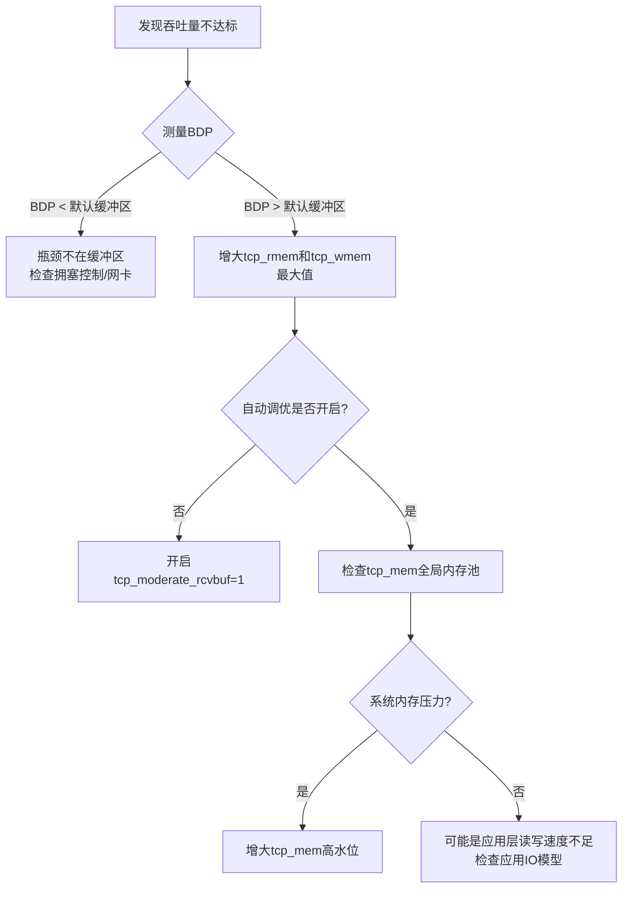

## 技巧二：TCP调优

TCP调优的本质是在**可靠性、延迟、吞吐量**三者之间找到当前业务的最优平衡点。Linux内核通过`sysctl`暴露了数百个TCP相关旋钮，盲目修改只会制造新问题。本节按照"缓冲区→拥塞控制→窗口优化→网卡卸载→生产实战"的递进逻辑，系统讲解TCP调优的原理与方法，每个参数都给出"为什么改、改多少、怎么验证"的完整闭环。

---

### 1. 调优前的度量基线

**调优的第一原则：没有度量就没有优化。** 在修改任何参数之前，必须建立完整的性能基线，否则无法判断调优是改善了还是恶化了。

#### 1.1 必须采集的四类指标

| 类别 | 工具 | 关键指标 | 采集频率 |
|------|------|----------|----------|
| 连接状态 | `ss -s`、`ss -tan` | 各状态连接数、队列溢出 | 实时 |
| TCP重传 | `nstat -az TcpExtRetransSegs` | 重传率（重传段/总段） | 每秒 |
| 吞吐与延迟 | `iperf3`、`wrk2` | 带宽利用率、P99延迟 | 压测期间 |
| 缓冲区使用 | `ss -tin` | snd_buf、rcv_buf、cwnd、rtt | 连接维度 |

```bash
# 一键建立基线快照（推荐在调优前执行）
#!/bin/bash
TIMESTAMP=$(date +%Y%m%d_%H%M%S)
REPORT="/tmp/tcp_baseline_${TIMESTAMP}.txt"

echo "=== TCP Baseline Report: $(date) ===" > $REPORT
echo "" >> $REPORT

# 1. 连接状态分布
echo "--- Connection States ---" >> $REPORT
ss -tan | awk 'NR>1 {print $1}' | sort | uniq -c | sort -rn >> $REPORT
echo "" >> $REPORT

# 2. 队列溢出统计
echo "--- Queue Overflows ---" >> $REPORT
nstat -az TcpExtListenOverflows TcpExtListenDrops TcpExtTCPReqQFullDrop >> $REPORT
echo "" >> $REPORT

# 3. 重传统计
echo "--- Retransmission Stats ---" >> $REPORT
nstat -az TcpExtRetransSegs TcpExtTCPLostRetransmit >> $REPORT
echo "" >> $REPORT

# 4. 当前sysctl网络参数
echo "--- sysctl Network Params ---" >> $REPORT
sysctl -a 2>/dev/null | grep -E '^net\.(core|ipv4\.tcp)' >> $REPORT
echo "" >> $REPORT

# 5. 网卡信息
echo "--- NIC Info ---" >> $REPORT
ip -s link show | grep -A 5 'state UP' >> $REPORT

echo "基线报告已保存到 $REPORT"
```

#### 1.2 压测工具选择

不同压测工具适用于不同场景，选错工具会得到误导性结论：

| 工具 | 适用场景 | 核心能力 | 局限 |
|------|----------|----------|------|
| `iperf3` | 纯网络吞吐测试 | 精确测量TCP带宽、RTT、抖动 | 不模拟HTTP请求 |
| `wrk`/`wrk2` | HTTP服务基准测试 | 多线程+Lua脚本，可模拟复杂请求 | wrk不保证恒定吞吐 |
| `ab` (Apache Bench) | 简单HTTP压测 | 零配置、快速上手 | 单线程，上限低 |
| `h2load` | HTTP/2服务测试 | 原生支持HTTP/2多路复用 | 仅HTTP/2 |
| `netperf` | 细粒度TCP测试 | 支持多种请求模式（RR、STREAM） | 安装较复杂 |
| `sockperf` | 超低延迟测试 | 微秒级延迟测量，InfiniBand支持 | 仅测延迟 |

```bash
# iperf3 吞吐测试（服务端+客户端）
# 服务端：
iperf3 -s -p 5201

# 客户端（测试TCP上行吞吐）：
iperf3 -c 10.0.0.1 -p 5201 -t 30 -P 8 -i 1
# -t 30: 测试30秒
# -P 8: 8个并行流
# -i 1: 每秒输出一次

# wrk2 延迟测试（保持恒定吞吐压力）
wrk2 -t12 -c400 -d30s -R20000 --latency http://10.0.0.1:8080/api/health
# -R 20000: 目标20000 RPS
# wrk2会在达到目标RPS后继续测量真实延迟
```

---

### 2. TCP缓冲区调优

TCP缓冲区是调优中影响最直接、效果最显著的部分。缓冲区过小会限制吞吐量（特别是高延迟链路），过大会浪费内存并增加延迟（缓冲区膨胀问题）。

#### 2.1 三层缓冲区体系

Linux内核为TCP维护三个层次的内存管理：

┌─────────────────────────────────────────────────┐
│              全局TCP内存池 (tcp_mem)              │
│  控制系统所有TCP连接的总内存使用                    │
│  /proc/sys/net/ipv4/tcp_mem (页为单位)            │
├─────────────────────────────────────────────────┤
│         每连接接收缓冲区 (tcp_rmem)               │
│  控制单个连接的接收窗口上限                        │
│  /proc/sys/net/ipv4/tcp_rmem (字节)              │
├─────────────────────────────────────────────────┤
│         每连接发送缓冲区 (tcp_wmem)               │
│  控制单个连接的发送队列上限                        │
│  /proc/sys/net/ipv4/tcp_wmem (字节)              │
└─────────────────────────────────────────────────┘

每个参数都是三元组：`最小值 默认值 最大值`。内核根据系统内存压力在最小值和最大值之间动态调整。

#### 2.2 接收缓冲区（tcp_rmem）

接收缓冲区直接决定TCP接收窗口的上限。根据带宽延迟积（BDP）理论，最优窗口大小为：

最优接收窗口 = 带宽 × RTT = BDP

示例计算：
  场景1：内网（1Gbps, 0.1ms RTT）
    BDP = 1Gbps × 0.1ms = 12.5KB → 默认缓冲区足够

  场景2：跨机房（100Mbps, 20ms RTT）
    BDP = 100Mbps × 20ms = 250KB → 需要调大

  场景3：跨国专线（1Gbps, 150ms RTT）
    BDP = 1Gbps × 150ms = 18.75MB → 必须调到16MB+

```bash
# 查看当前接收缓冲区配置
sysctl net.ipv4.tcp_rmem
# 输出: 4096 131072 6291456
#         最小   默认    最大 (字节)

# 推荐配置（高吞吐场景）
# 最小4KB保证基本通信，默认128KB覆盖常见场景，最大16MB支持高BDP链路
sudo sysctl -w net.ipv4.tcp_rmem="4096 131072 16777216"

# 启用自动调优（强烈推荐）
sudo sysctl -w net.ipv4.tcp_moderate_rcvbuf=1
# 内核会根据RTT和带宽动态调整每个连接的接收窗口
```

**tcp_moderate_rcvbuf（自动调优）的工作原理**：

内核每隔约200ms评估每个连接的吞吐表现。如果检测到接收窗口是吞吐瓶颈（应用读取速度快于网络到达速度），就逐步扩大窗口；反之缩小。大多数场景下，自动调优比手动设置效果更好，因为它能针对每个连接的实际情况做出最优决策。

#### 2.3 发送缓冲区（tcp_wmem）

发送缓冲区包含三个部分：已发送未确认的数据 + 已写入但未发送的数据 + 待发送的数据。发送缓冲区太小会直接限制发送窗口，导致发送方"发不动"。

```bash
# 查看当前发送缓冲区配置
sysctl net.ipv4.tcp_wmem
# 输出: 4096 16384 4194304
#         最小   默认    最大 (字节)

# 推荐配置
sudo sysctl -w net.ipv4.tcp_wmem="4096 65536 16777216"

# 对于万兆网络+大文件传输场景
sudo sysctl -w net.ipv4.tcp_wmem="4096 262144 33554432"
```

**如何判断发送缓冲区是否是瓶颈**：

```bash
# 方法一：ss命令查看发送缓冲区使用率
ss -tin dst 10.0.0.1 | grep -E 'snd_wnd|snd_buf'
# 如果 snd_wnd 持续接近 snd_buf，说明发送缓冲区是瓶颈

# 方法二：查看内核发送缓冲区满导致的阻塞
nstat -az TcpExtTCPDirectCopyFromBacklog
# 或监控 socket 的 wmem 使用
cat /proc/net/sockstat | grep TCP
# TCP: inuse X orphan Y tw Z alloc W mem M
# mem 单位为页(4KB)，如果偏大说明发送/接收缓冲区占用多
```

#### 2.4 全局TCP内存池（tcp_mem）

tcp_mem控制整个系统TCP协议栈的内存使用上限，以**页**（通常4KB）为单位。当总内存达到高水位线时，内核会开始丢弃数据包并收缩窗口。

```bash
# 查看当前配置
sysctl net.ipv4.tcp_mem
# 输出: 379944 506593 759888 (页)
#         低水位  高水位  压力上限

# 内存压力行为：
# < 低水位: 正常运行
# 低水位 ~ 高水位: 进入内存压力模式，开始收缩窗口
# > 压力上限: 丢弃新数据包，可能杀死连接

# 对于大内存服务器(128GB+)，建议放大
# 每页4KB，759888页 ≈ 3GB
sudo sysctl -w net.ipv4.tcp_mem="786432 1048576 1572864"
# 3GB低 / 4GB高 / 6GB上限
```

#### 2.5 缓冲区调优决策树



---

### 3. 拥塞控制算法调优

拥塞控制算法决定了TCP在面对网络拥塞时的行为策略。选对算法可能带来数倍的吞吐量提升。

#### 3.1 算法全景对比

Linux内核内置了多种拥塞控制算法，适用于截然不同的网络场景：

| 算法 | 内核版本 | 核心策略 | 最佳场景 | 不适合的场景 |
|------|----------|----------|----------|-------------|
| **Reno** | 所有版本 | 经典AIMD（加性增乘性减） | 教学理解 | 生产环境（过于保守） |
| **CUBIC** | 2.6.19+（默认） | 三次函数增长，恢复更快 | 高带宽长RTT链路 | 数据中心内短RTT |
| **BBR** | 4.9+ | 基于带宽和RTT建模，不依赖丢包 | 有损链路、跨公网 | 极低延迟内网 |
| **BBRv2** | 5.18+（实验性） | BBR改进，解决bufferbloat | 公网传输 | 未充分验证 |
| **Vegas** | 2.4+ | 基于RTT变化探测拥塞 | 低延迟内网 | 与CUBIC共享瓶颈时被压制 |
| **HTCP** | 2.6+ | 基于RTT和丢包的混合策略 | 高BDP卫星链路 | 通用场景 |

#### 3.2 CUBIC详解：Linux默认选择

CUBIC之所以成为默认算法，是因为它在大多数场景下表现均衡。其核心是一个三次函数：

W(t) = C × (t - K)³ + W_max

W_max: 上次丢包时的拥塞窗口（峰值）
K: 恢复到W_max所需的时间 = ∛(W_max × β / C)
C: 增长系数 = 0.4
β: 乘法减少因子 = 0.7

行为特征：
  丢包后: cwnd缩小到 70%
  恢复期: 快速增长（三次函数的凸起部分）
  超过峰值: 增长变缓（三次函数的平缓部分）

优势：在高BDP链路上恢复速度远快于Reno的线性增长
劣势：可能在浅缓冲区网络上造成过度丢包

```bash
# 查看当前拥塞控制算法
sysctl net.ipv4.tcp_congestion_control
# 输出: cubic

# 查看可用算法
sysctl net.ipv4.tcp_available_congestion_control
# 输出: reno cubic

# 加载BBR模块（如果需要）
sudo modprobe tcp_bbr

# 查看可用算法列表（加载BBR后）
sysctl net.ipv4.tcp_available_congestion_control
# 输出: reno cubic bbr

# 临时切换到BBR
sudo sysctl -w net.ipv4.tcp_congestion_control=bbr

# 永久生效（写入sysctl.conf）
echo "net.ipv4.tcp_congestion_control = bbr" | sudo tee -a /etc/sysctl.conf
echo "net.core.default_qdisc = fq" | sudo tee -a /etc/sysctl.conf
# 注意：BBR需要配合fq（Fair Queue）队列调度器才能发挥最佳效果
```

#### 3.3 BBR深度解析

BBR（Bottleneck Bandwidth and Round-trip propagation time）是Google在2016年提出的拥塞控制算法，其革命性在于**不再以丢包作为拥塞信号**，而是主动测量两个关键物理量：

- **BtlBw**（瓶颈带宽）：最近一段时间内观察到的最大发送速率
- **RTprop**（最小RTT）：最近一段时间内观察到的最小RTT

BBR的状态机：

  Startup → Drain → ProbeBW → ProbeRTT
     │        │         │           │
     ↓        ↓         ↓           ↓
  指数增长  排空缓冲  周期性探测   每10秒降低窗口
  直到带宽   区排队    带宽增长     测量真实RTT
  不增长           (8个RTT周期)

与CUBIC的本质区别：
  CUBIC: "网络没问题就加速，丢包了就减速"（被动响应）
  BBR:   "主动测量网络容量，精确控制发送速率"（主动探测）

**BBR适用场景判断**：

```bash
# 用iperf3测试链路特性
iperf3 -c 10.0.0.1 -t 30 -i 1 | tee /tmp/iperf3_cubic.txt

# 切换到BBR
sudo sysctl -w net.ipv4.tcp_congestion_control=bbr

# 重新测试
iperf3 -c 10.0.0.1 -t 30 -i 1 | tee /tmp/iperf3_bbr.txt

# 对比两个结果
echo "CUBIC 吞吐量:"; grep 'sender' /tmp/iperf3_cubic.txt | tail -1
echo "BBR 吞吐量:"; grep 'sender' /tmp/iperf3_bbr.txt | tail -1
```

**BBR在不同场景下的表现**：

| 场景 | BBR vs CUBIC | 原因 |
|------|-------------|------|
| 跨国公网（高丢包） | BBR显著优于CUBIC | BBR不以丢包为信号，高丢包时CUBIC频繁降速 |
| 数据中心内网（低延迟、零丢包） | 差异不大，CUBIC略优 | BBR的RTT探测可能引入额外延迟 |
| 有线电视/DSL网络（bufferbloat） | BBR优于CUBIC | BBR主动探测真实RTT，不受缓冲区膨胀影响 |
| 卫星链路（极高RTT） | BBR优于CUBIC | BBR的带宽探测更精确，CUBIC在高BDP下恢复慢 |
| 混合场景（BBR和CUBIC共存） | 可能劣于CUBIC | BBR可能不公平地占用带宽 |

#### 3.4 qdisc队列调度器

拥塞控制算法工作在端到端层面，而队列调度器（qdisc）工作在网卡出口层面。两者配合才能达到最佳效果。

```bash
# 查看当前队列调度器
tc qdisc show dev eth0
# qdisc fq 0: root refcnt 2 limit 10000p ...

# 常见队列调度器对比
# pfifo_fast (默认): 简单FIFO，3个优先级队列
# fq: Fair Queue，BBR的最佳搭档，per-flow排队
# fq_codel: Fair Queue + CoDel，反bufferbloat
# htb: 分层令牌桶，精细带宽控制
# netem: 网络模拟器，测试用

# BBR推荐配置fq
sudo tc qdisc replace dev eth0 root fq

# 如果有bufferbloat问题（延迟尖刺），用fq_codel
sudo tc qdisc replace dev eth0 root fq_codel
# fq_codel参数:
#   target: 目标延迟（默认5ms）
#   interval: 测量间隔（默认100ms）
#   limit: 最大队列深度（默认10240包）
```

---

### 4. 窗口缩放与延迟优化

#### 4.1 窗口缩放因子的调优

窗口缩放（Window Scale）选项在三次握手时协商，连接建立后无法更改。默认配置在高BDP链路上可能不够用。

```bash
# 查看当前窗口缩放因子
ss -tin | head -5
# State  Recv-Q  Send-Q  Local Address:Port  Peer Address:Port
# ESTAB  0  0  10.0.0.1:22  10.0.0.2:54321
#  cubic wscale:7,7 rto:204 rtt:0.5/0.25 ato:40
#  rcv_space:14600 rcv_ssthresh:64088 snd_wnd:65536

# wscale:7,7 表示发送和接收都使用7的缩放因子
# 实际窗口 = Window字段值 × 2^7 = Window × 128

# 最大可用窗口取决于tcp_rmem/tcp_wmem的最大值
# 如果tcp_rmem最大值=16MB:
#   需要的缩放因子 = log2(16MB) ≈ 24（但最大只能14）
#   实际最大窗口 = 65535 × 2^14 = 1GB（足够）
```

#### 4.2 TCP延迟相关参数

```bash
# TCP_NODELAY：禁用Nagle算法
# 对延迟敏感的应用（游戏、交易系统、SSH）必须开启
# 在C语言中：setsockopt(fd, IPPROTO_TCP, TCP_NODELAY, &amp;one, sizeof(one))
# 在Go中：conn.(*net.TCPConn).SetNoDelay(true)（默认已开启）
# 在Nginx中：
#   proxy_set_header Connection "";
#   tcp_nodelay on;  # 在location块内

# 延迟确认（Delayed ACK）
sysctl net.ipv4.tcp_delack_min
# 默认值（微秒），一般不需要调整

# TCP Thin Streams：对小流量连接优先调度
sysctl net.ipv4.tcp_early_retrans
# 3（默认）: 启用TLP（Tail Loss Probe），减少小流的重传延迟
# 4: 启用ER（Early Retransmit）+ TLP
```

#### 4.3 TCP Fast Open（TFO）

TCP Fast Open（RFC 7413）允许在三次握手的同时发送数据，省去一个RTT的延迟。这对于频繁建立短连接的场景（如CDN、API网关）效果显著。

```bash
# 查看TFO状态
sysctl net.ipv4.tcp_fastopen
# 0: 禁用
# 1: 仅客户端启用
# 2: 仅服务端启用
# 3: 客户端+服务端都启用（推荐）

# 启用TFO
sudo sysctl -w net.ipv4.tcp_fastopen=3

# TFO的工作流程：
# 正常三次握手:
#   Client → SYN → Server          (1 RTT)
#   Client ← SYN+ACK ← Server
#   Client → SYN+DATA → Server     (第2个RTT才开始传数据)
#
# TFO三次握手:
#   Client → SYN+TFO请求 → Server  (首次)
#   Client ← SYN+ACK+TFO Cookie ← Server
#   Client → SYN+TFO Cookie+DATA → Server  (首次仍需2 RTT，但拿到了Cookie)
#
#   后续连接:
#   Client → SYN+TFO Cookie+DATA → Server  (1 RTT直接传数据!)
#   Client ← SYN+ACK+DATA ← Server

# 验证TFO是否生效（抓包观察SYN是否携带数据）
tcpdump -i eth0 -nn 'tcp[tcpflags] &amp; (tcp-syn) != 0' -vv
# 看到 options [tfo] 或 SYN包有 length > 0 表示TFO工作
```

---

### 5. 网卡卸载与多队列优化

当CPU成为网络处理瓶颈时（通常在10Gbps+网络），需要从网卡硬件层面进行优化。

#### 5.1 TCP卸载特性

| 卸载特性 | 功能 | 内核参数 | 适用场景 |
|----------|------|----------|----------|
| **TSO** (TCP Segmentation Offload) | 大包分段卸载到网卡 | `ethtool -K eth0 tso on` | 大文件传输，减少CPU分段开销 |
| **GRO** (Generic Receive Offload) | 接收端包合并 | `ethtool -K eth0 gro on` | 减少协议栈处理的包数量 |
| **GSO** (Generic Segmentation Offload) | 通用分段卸载 | `ethtool -K eth0 gso on` | TSO的软件回退方案 |
| **LRO** (Large Receive Offload) | 大包接收卸载 | `ethtool -K eth0 lro on` | 已被GRO取代，不推荐 |
| **checksum offload** | 校验和计算卸载 | `ethtool -K eth0 tx-checksumming on` | 减少CPU校验和计算 |

```bash
# 查看网卡卸载状态
ethtool -k eth0 | grep -E 'tcp-segmentation|generic-receive|checksum'

# 全面优化（万兆网卡）
sudo ethtool -K eth0 tso on gro on gso on rx-checksumming on tx-checksumming on

# 验证卸载是否生效（查看网卡统计）
ethtool -S eth0 | grep -E 'tcp|gro|tso|lro'
```

#### 5.2 网卡多队列与RSS

RSS（Receive Side Scaling）将网络流量分散到多个CPU核心，避免单核成为瓶颈。

```bash
# 查看网卡队列数
ethtool -l eth0
# Pre-set maximums:
# Combined:     16       ← 硬件最大支持16个队列
# Current hardware settings:
# Combined:     4        ← 当前使用4个队列

# 设置队列数（等于CPU核心数）
sudo ethtool -L eth0 combined 8

# 查看每个队列的中断分布
cat /proc/interrupts | grep eth0
# 123: ... PCI-MSI-edge eth0-TxRx-0
# 124: ... PCI-MSI-edge eth0-TxRx-1
# ...

# 设置中断亲和性（将队列绑定到特定CPU）
# 方法一：手动设置
echo 1 > /proc/irq/123/smp_affinity   # 绑到CPU0
echo 2 > /proc/irq/124/smp_affinity   # 绑到CPU1

# 方法二：使用irqbalance自动均衡
sudo systemctl enable --now irqbalance

# 方法三：使用rps/rfs（软件级接收端扩展）
# 对于不支持硬件RSS的网卡
echo "ff" > /sys/class/net/eth0/queues/rx-0/rps_cpus  # 分散到所有CPU
echo 32768 > /sys/class/net/eth0/queues/rx-0/rps_flow_cnt
echo 32768 > /proc/sys/net/core/rps_sock_flow_entries
```

#### 5.3 NUMA亲和性

在多路服务器上，网卡的PCIe插槽连接到特定CPU的NUMA节点。如果处理网络流量的CPU和网卡不在同一NUMA节点，每次收发包都需要跨NUMA访问内存，延迟增加30-50%。

```bash
# 查看网卡所在NUMA节点
cat /sys/class/net/eth0/device/numa_node
# 0 或 1

# 查看当前进程的NUMA分布
numactl --hardware

# 将网络处理进程绑定到网卡所在NUMA节点
numactl --cpunodebind=0 --membind=0 ./network_server

# 验证NUMA命中率
numastat -p $(pidof network_server)
# 如果 local_node > other_node 说明亲和性正确
```

---

### 6. 连接建立试探调优

连接建立阶段的参数直接影响建连速度和抗攻击能力。

```bash
# SYN重试次数（客户端）
net.ipv4.tcp_syn_retries = 3
# 默认6次，总等待时间 = 2^(6+1) - 1 = 127秒（太长）
# 设置为3：等待 2^4 - 1 = 15秒（适合内网）
# 设置为5：等待 2^6 - 1 = 63秒（适合公网）

# SYN+ACK重试次数（服务端）
net.ipv4.tcp_synack_retries = 2
# 默认5次，设置为2减少无效等待

# SYN Cookie
net.ipv4.tcp_syncookies = 1
# 必须开启，防SYN Flood攻击

# 半连接队列
net.ipv4.tcp_max_syn_backlog = 65535

# 全连接队列（由somaxconn和listen backlog共同决定）
net.core.somaxconn = 65535
# 应用层也需要设置足够大的backlog，如：
# Nginx: listen 80 backlog=65535;
# Python: server.socket.listen(65535)
# Go: net.Listen("tcp", ":8080")（默认128，需调大）
```

---

### 7. 调优参数速查与场景配置

#### 7.1 场景一：Web API服务器（8核32GB，10Gbps，低延迟内网）

```bash
# /etc/sysctl.d/99-web-server.conf

# 连接管理
net.ipv4.tcp_syncookies = 1
net.ipv4.tcp_max_syn_backlog = 65535
net.core.somaxconn = 65535
net.ipv4.tcp_fin_timeout = 15
net.ipv4.tcp_tw_reuse = 1
net.ipv4.ip_local_port_range = 1024 65535

# 缓冲区（内网BDP小，不需要太大）
net.ipv4.tcp_rmem = 4096 87380 6291456
net.ipv4.tcp_wmem = 4096 65536 6291456
net.ipv4.tcp_moderate_rcvbuf = 1

# 拥塞控制
net.ipv4.tcp_congestion_control = cubic
net.core.default_qdisc = pfifo_fast

# Keepalive
net.ipv4.tcp_keepalive_time = 600
net.ipv4.tcp_keepalive_intvl = 15
net.ipv4.tcp_keepalive_probes = 5

# 文件描述符
fs.file-max = 1048576

# 全局内存
net.ipv4.tcp_mem = 786432 1048576 1572864
```

#### 7.2 场景二：跨公网文件传输服务器（高延迟高丢包）

```bash
# /etc/sysctl.d/99-file-transfer.conf

# 缓冲区（高BDP必须大）
net.ipv4.tcp_rmem = 4096 262144 67108864
net.ipv4.tcp_wmem = 4096 262144 67108864
net.ipv4.tcp_moderate_rcvbuf = 1

# BBR拥塞控制（公网高丢包场景最优）
net.ipv4.tcp_congestion_control = bbr
net.core.default_qdisc = fq

# 窗口缩放已默认启用，确认即可
net.ipv4.tcp_window_scaling = 1

# SACK必须启用（高丢包时精确重传）
net.ipv4.tcp_sack = 1

# TFO减少建连延迟
net.ipv4.tcp_fastopen = 3

# TLP减少小流尾部延迟
net.ipv4.tcp_early_retrans = 3

# 全局内存（大缓冲区需要更多内存）
net.ipv4.tcp_mem = 1572864 2097152 3145728
# 6GB / 8GB / 12GB
```

#### 7.3 场景三：数据库主从复制（MySQL/PostgreSQL）

```bash
# /etc/sysctl.d/99-database.conf

# 缓冲区（大事务需要大发送缓冲区）
net.ipv4.tcp_rmem = 4096 131072 16777216
net.ipv4.tcp_wmem = 4096 131072 16777216
net.ipv4.tcp_moderate_rcvbuf = 1

# Keepalive（数据库长连接必须开启）
net.ipv4.tcp_keepalive_time = 300
net.ipv4.tcp_keepalive_intvl = 10
net.ipv4.tcp_keepalive_probes = 3

# 复制流量通常在内网，用CUBIC
net.ipv4.tcp_congestion_control = cubic

# 禁用延迟确认对小包交互式场景不利
# 但MySQL复制通常是批量同步，影响不大
```

---

### 8. 常见调优误区与排错

#### 8.1 误区一：盲目调大所有缓冲区

**错误做法**：把tcp_rmem和tcp_wmem最大值都设到1GB。

**问题**：缓冲区膨胀（Bufferbloat）。当缓冲区远大于BDP时，多出的缓冲区会被无用数据填满，增加排队延迟而非提升吞吐量。

**正确做法**：根据实际BDP设置最大值，启用tcp_moderate_rcvbuf让内核自动调优。

```bash
# 测量实际BDP
# 方法一：iperf3 + ping
iperf3 -c 10.0.0.1 -t 10 &amp;
ping -c 100 10.0.0.1 | tail -1
# avg RTT × bandwidth = BDP

# 方法二：ss命令查看实际窗口使用
ss -tin dst 10.0.0.1 | grep -oP 'cwnd:\K[0-9]+'
# cwnd以MSS为单位，实际窗口 ≈ cwnd × MSS
```

#### 8.2 误区二：在所有场景都用BBR

**错误做法**：不分场景一律切换BBR。

**问题**：
- BBR和CUBIC共享瓶颈时，BBR可能不公平地占用带宽
- 在数据中心内部（零丢包、极低延迟），CUBIC的性能可能更好
- BBRv1存在已知的公平性和收敛问题

**正确做法**：公网传输用BBR，内网用CUBIC，混合环境要测试。

#### 8.3 误区三：关闭tcp_timestamps提速

**错误做法**：`net.ipv4.tcp_timestamps=0`，认为减少选项字段可以省几个字节。

**问题**：
- tcp_tw_reuse依赖时间戳，关闭后无法安全复用TIME_WAIT
- RTT测量精度下降，影响RTO计算
- PAWS（防止序列号回绕）失效，高速网络上可能出现数据混乱

**正确做法**：保持tcp_timestamps=1（默认），不要关闭。

#### 8.4 误区四：忽视应用层的影响

很多TCP性能问题根源在应用层：

```bash
# 问题一：应用读取不及时导致窗口满
# 诊断：ss -tin 查看 rcv_space
# 如果 rcv_space 持续小于 rcv_ssthresh，说明应用读取太慢

# 问题二：小包问题（每次只发几个字节）
# 诊断：tcpdump -i eth0 'tcp' -nn | head -20
# 如果看到大量 length 0 或 length 很小的包，启用TCP_NODELAY
# 或在应用层合并小包再发送

# 问题三：连接池配置不当
# 诊断：ss -tan | grep TIME-WAIT | wc -l
# 如果TIME_WAIT过多，检查连接池是否太小导致频繁建连
```

#### 8.5 诊断速查表

| 现象 | 可能原因 | 排查命令 | 调优方向 |
|------|----------|----------|----------|
| 吞吐量低、无丢包 | 窗口/缓冲区太小 | `ss -tin` 看 snd_wnd vs snd_buf | 增大tcp_rmem/tcp_wmem |
| 吞吐量低、大量丢包 | 拥塞控制过于保守 | `nstat -az TcpExtRetransSegs` | 换BBR、增大初始窗口 |
| 延迟毛刺 | 缓冲区膨胀 | `ping` 观察RTT波动 | 启用fq_codel |
| 连接建立慢 | SYN重试次数多 | `tcpdump 'tcp[tcpflags] & tcp-syn'` | 减少tcp_syn_retries |
| TIME_WAIT堆积 | 短连接过多 | `ss -ant \| grep TIME-WAIT \| wc -l` | 连接池+tcp_tw_reuse |
| CLOSE_WAIT堆积 | 应用未关闭连接 | `ss -ant \| grep CLOSE-WAIT` | 修复应用代码 |
| 全连接队列溢出 | backlog太小 | `nstat -az TcpExtListenOverflows` | 增大somaxconn |
| CPU 100%软中断 | 单队列网卡 | `mpstat -P ALL 1` | 启用RSS多队列 |

---

### 9. 完整调优流程与自动化脚本

#### 9.1 调优六步法

1. **度量基线**：用iperf3/wrk2建立性能指标基线
2. **识别瓶颈**：用ss/nstat/tcptrace定位是缓冲区、拥塞、队列还是应用层问题
3. **单变量修改**：每次只改一个参数，记录修改前后的指标变化
4. **验证效果**：重新压测，确认改善且无副作用
5. **持久化配置**：将有效参数写入sysctl.d配置文件
6. **持续监控**：部署监控系统跟踪长期趋势

#### 9.2 一键调优诊断脚本

```bash
#!/bin/bash
# tcp-tune-diagnose.sh — TCP调优诊断报告
# 用法: sudo bash tcp-tune-diagnose.sh

echo "=========================================="
echo "  TCP Tuning Diagnostic Report"
echo "  $(date)"
echo "=========================================="
echo ""

# 1. 系统信息
echo "[1] System Info"
echo "  Kernel: $(uname -r)"
echo "  CPUs: $(nproc)"
echo "  RAM: $(free -h | awk '/^Mem:/ {print $2}')"
echo "  NICs:"
ip -o link show | awk -F': ' '{print "    " $2}' | grep -v lo
echo ""

# 2. 当前拥塞控制
echo "[2] Congestion Control"
echo "  Algorithm: $(sysctl -n net.ipv4.tcp_congestion_control)"
echo "  Available: $(sysctl -n net.ipv4.tcp_available_congestion_control)"
echo "  qdisc: $(tc qdisc show 2>/dev/null | head -1)"
echo ""

# 3. 关键参数值
echo "[3] Key Parameters"
for param in \
    net.core.somaxconn \
    net.ipv4.tcp_max_syn_backlog \
    net.ipv4.tcp_fin_timeout \
    net.ipv4.tcp_tw_reuse \
    net.ipv4.ip_local_port_range \
    net.ipv4.tcp_keepalive_time \
    net.ipv4.tcp_rmem \
    net.ipv4.tcp_wmem \
    net.ipv4.tcp_fastopen \
    net.ipv4.tcp_window_scaling \
    net.ipv4.tcp_sack \
    net.ipv4.tcp_syncookies; do
    echo "  $param = $(sysctl -n $param 2>/dev/null)"
done
echo ""

# 4. 连接状态分布
echo "[4] Connection States"
ss -tan | awk 'NR>1 {print $1}' | sort | uniq -c | sort -rn | head -10
echo ""

# 5. 队列溢出检查
echo "[5] Queue Overflows"
nstat -az TcpExtListenOverflows TcpExtListenDrops 2>/dev/null | grep -v "^#"
echo ""

# 6. 重传统计
echo "[6] Retransmissions"
nstat -az TcpExtRetransSegs 2>/dev/null | grep -v "^#"
echo ""

# 7. 文件描述符
echo "[7] File Descriptors"
echo "  fs.file-max: $(sysctl -n fs.file-max)"
cat /proc/sys/fs/file-nr | awk '{print "  Allocated: " $1 " / Max: " $3}'
echo ""

# 8. 网卡卸载状态
echo "[8] NIC Offload"
for nic in $(ip -o link show | awk -F': ' '/state UP/ {print $2}'); do
    echo "  $nic:"
    ethtool -k $nic 2>/dev/null | grep -E 'tcp-segmentation|generic-receive' | sed 's/^/    /'
done
echo ""

# 9. 建议
echo "[9] Recommendations"
WARNINGS=0

SOMAXCONN=$(sysctl -n net.core.somaxconn)
[ "$SOMAXCONN" -lt 4096 ] &amp;&amp; echo "  ⚠ somaxconn=$SOMAXCONN 偏小，建议 ≥4096" &amp;&amp; WARNINGS=$((WARNINGS+1))

FIN_TIMEOUT=$(sysctl -n net.ipv4.tcp_fin_timeout)
[ "$FIN_TIMEOUT" -gt 30 ] &amp;&amp; echo "  ⚠ tcp_fin_timeout=$FIN_TIMEOUT 偏大，建议 ≤15" &amp;&amp; WARNINGS=$((WARNINGS+1))

TW_REUSE=$(sysctl -n net.ipv4.tcp_tw_reuse)
[ "$TW_REUSE" -eq 0 ] &amp;&amp; echo "  ⚠ tcp_tw_reuse=0，高并发场景建议=1" &amp;&amp; WARNINGS=$((WARNINGS+1))

SYNCOOKIES=$(sysctl -n net.ipv4.tcp_syncookies)
[ "$SYNCOOKIES" -eq 0 ] &amp;&amp; echo "  ⚠ tcp_syncookies=0，安全风险！建议=1" &amp;&amp; WARNINGS=$((WARNINGS+1))

TW=$(ss -tan | grep TIME-WAIT | wc -l)
[ "$TW" -gt 50000 ] &amp;&amp; echo "  ⚠ TIME_WAIT=$TW 偏高，考虑连接池+tcp_tw_reuse" &amp;&amp; WARNINGS=$((WARNINGS+1))

CLOSEW=$(ss -tan | grep CLOSE-WAIT | wc -l)
[ "$CLOSEW" -gt 100 ] &amp;&amp; echo "  ⚠ CLOSE_WAIT=$CLOSEW 偏高，检查应用层连接泄漏" &amp;&amp; WARNINGS=$((WARNINGS+1))

OVERFLOWS=$(nstat -az TcpExtListenOverflows 2>/dev/null | awk '/TcpExtListenOverflows/ {print $2}')
[ "${OVERFLOWS:-0}" -gt 0 ] &amp;&amp; echo "  ⚠ 全连接队列溢出=$OVERFLOWS，增大somaxconn" &amp;&amp; WARNINGS=$((WARNINGS+1))

[ "$WARNINGS" -eq 0 ] &amp;&amp; echo "  ✅ 未发现明显问题"

echo ""
echo "=========================================="
echo "  诊断完成。共 $WARNINGS 条警告。"
echo "=========================================="
```

---

### 10. 调优效果验证清单

完成调优后，使用以下清单逐项验证：

□ 吞吐量：iperf3测试达到预期带宽的80%以上
□ 延迟：wrk2 P99延迟无明显恶化
□ 重传率：nstat重传率 < 0.1%
□ 连接建立：ss -s显示SYN_RCVD < 10
□ 队列溢出：nstat ListenOverflows 保持0
□ TIME_WAIT：数量在可控范围内（< 端口范围的50%）
□ CLOSE_WAIT：为0（应用层正确关闭连接）
□ 内存使用：无OOM，TCP内存使用在合理范围
□ CPU使用：无单核软中断100%的情况
□ 持久性：重启后配置仍然生效

> **核心原则回顾**：TCP调优不是追求单个参数的"最优值"，而是让整条链路（网卡→内核→协议栈→应用）协调工作。先测量、再诊断、后调优、最后验证——这个闭环比任何单一参数都重要。
