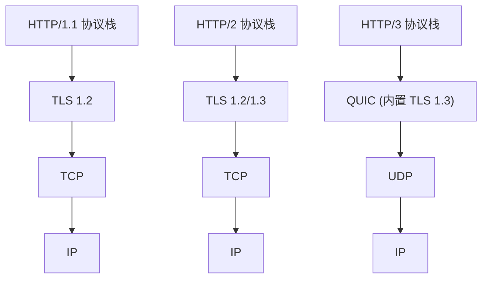

## 技巧三：HTTP/2 和 HTTP/3 配置

Web 性能优化的终极战场在协议层。HTTP/1.1 时代的队头阻塞、冗余头部和无法复用连接等问题，直接限制了页面加载速度的上限。HTTP/2 通过多路复用和头部压缩突破了这些瓶颈，而 HTTP/3 更进一步将传输层从 TCP 切换到基于 UDP 的 QUIC 协议，彻底消除了 TCP 层的队头阻塞。本节将从协议原理出发，覆盖 Nginx、Apache 等主流服务器的完整配置方案，并提供生产环境的调优策略和故障排查指南。

---

### 1. 协议演进：从 HTTP/1.1 到 HTTP/3

#### 1.1 HTTP/1.1 的核心瓶颈

HTTP/1.1 虽然引入了持久连接（Keep-Alive）和管道化（Pipelining），但仍有三个根本性限制：

| 瓶颈 | 表现 | 影响 |
|------|------|------|
| **队头阻塞** | 同一连接上请求必须串行处理，前一个响应未完成则后续请求被阻塞 | 多资源加载被迫串行化 |
| **冗余头部** | 每个请求都携带完整的 Cookie、User-Agent 等头部，重复传输 | 每个请求额外增加 800B-1KB |
| **连接数限制** | 浏览器对同一域名的并发连接数限制为 6 个 | 无法充分利用带宽 |

为了绕过连接数限制，前端工程中出现了域名分片（Domain Sharding）、资源合并（CSS Sprites）、雪碧图等 hack 手段，这些都是协议缺陷的补偿方案。

#### 1.2 HTTP/2 的核心改进

HTTP/2（RFC 7540，2015 年发布）在保持语义兼容的前提下，对传输层做了革命性改造：

- **二进制分帧层**：将请求/响应拆分为二进制帧（Frame），每个帧带有流标识符（Stream ID），支持交错传输
- **多路复用（Multiplexing）**：同一 TCP 连接上可以同时传输多个请求-响应对，彻底消除应用层队头阻塞
- **头部压缩（HPACK）**：使用静态表 + 动态表 + 哈夫曼编码，将重复头部压缩到最小
- **服务端推送（Server Push）**：服务器可以主动将客户端可能需要的资源推送到客户端缓存
- **流优先级控制**：客户端可以声明资源加载优先级，服务器据此调度帧发送顺序

#### 1.3 HTTP/3 的突破：QUIC 协议

HTTP/3（RFC 9114，2022 年发布）将传输层从 TCP 切换到 QUIC（RFC 9000），这是互联网协议栈近 30 年来最大的变革：



QUIC 的关键优势：

| 特性 | TCP + TLS 1.3 | QUIC (HTTP/3) | 收益 |
|------|--------------|---------------|------|
| **握手延迟** | TCP 1-RTT + TLS 1-RTT = 2-RTT；TLS 1.3 优化为 1-RTT | 首次 1-RTT，恢复 0-RTT | 首屏加载减少 100-300ms |
| **队头阻塞** | TCP 层丢包会阻塞该连接上所有流 | 单个流丢包不影响其他流 | 弱网环境性能提升 30%+ |
| **连接迁移** | TCP 四元组（源IP:端口 + 目标IP:端口）绑定，网络切换需重建连接 | 使用 Connection ID，网络切换无缝迁移 | 移动场景零中断 |
| **加密范围** | 仅加密 payload | 头部信息也加密 | 防中间人篡改和探测 |

#### 1.4 协议选择决策树

需要启用 HTTP/2 还是 HTTP/3？
│
├── 目标用户以现代浏览器为主（Chrome 87+, Firefox 97+, Safari 14.1+）
│   ├── 服务器支持 UDP 出站（无防火墙/中间件阻断）
│   │   └── 同时启用 HTTP/2（降级兼容）+ HTTP/3（QUIC）
│   └── UDP 被阻断
│       └── 仅启用 HTTP/2，配合 TLS 1.3 减少握手延迟
│
├── 目标用户包含大量老旧设备
│   └── 仅启用 HTTP/2，确保 HTTP/1.1 降级正常
│
└── 内网微服务间通信
    └── 根据服务网格支持情况决定，优先 HTTP/2（gRPC 原生支持）

---

### 2. Nginx 配置 HTTP/2

Nginx 是生产环境中最常用的 HTTP/2 服务器。从 Nginx 1.9.5 开始支持 HTTP/2 模块（替代旧的 spdy 模块），从 1.25.1 开始支持 HTTP/3（QUIC）。

#### 2.1 编译安装（启用 HTTP/2 和 HTTP/3）

```bash
# 安装依赖
sudo apt-get update
sudo apt-get install -y build-essential libpcre3-dev zlib1g-dev \
    libssl-dev libuv1-dev libgnutls28-dev

# 下载源码（选择最新稳定版）
NGINX_VERSION=1.27.4
wget https://nginx.org/download/nginx-${NGINX_VERSION}.tar.gz
tar xzf nginx-${NGINX_VERSION}.tar.gz
cd nginx-${NGINX_VERSION}

# 编译（关键参数：启用 HTTP/2 和 HTTP/3）
./configure \
    --prefix=/etc/nginx \
    --sbin-path=/usr/sbin/nginx \
    --modules-path=/usr/lib64/nginx/modules \
    --conf-path=/etc/nginx/nginx.conf \
    --error-log-path=/var/log/nginx/error.log \
    --http-log-path=/var/log/nginx/access.log \
    --pid-path=/var/run/nginx.pid \
    --lock-path=/var/run/nginx.lock \
    --with-http_ssl_module \
    --with-http_v2_module \
    --with-http_v3_module \
    --with-http_realip_module \
    --with-http_stub_status_module \
    --with-threads \
    --with-file-aio

make -j$(nproc)
sudo make install
```

> **验证编译结果**：`nginx -V 2>&1 | grep -o 'http_v[23]_module'` 应输出 `http_v2_module` 和 `http_v3_module`。

#### 2.2 HTTP/2 基础配置

```nginx
# /etc/nginx/conf.d/http2.conf

server {
    listen 443 ssl http2;
    listen [::]:443 ssl http2;
    server_name example.com;

    # --- TLS 配置（HTTP/2 必须启用 TLS） ---
    ssl_certificate     /etc/nginx/ssl/fullchain.pem;
    ssl_certificate_key /etc/nginx/ssl/privkey.pem;

    # TLS 版本：仅允许 1.2 和 1.3
    ssl_protocols TLSv1.2 TLSv1.3;

    # 密码套件：优先 AEAD 算法
    ssl_ciphers ECDHE-ECDSA-AES128-GCM-SHA256:ECDHE-RSA-AES128-GCM-SHA256:ECDHE-ECDSA-AES256-GCM-SHA384:ECDHE-RSA-AES256-GCM-SHA384:ECDHE-ECDSA-CHACHA20-POLY1305:ECDHE-RSA-CHACHA20-POLY1305:DHE-RSA-AES128-GCM-SHA256:DHE-RSA-AES256-GCM-SHA384;
    ssl_prefer_server_ciphers off;

    # OCSP Stapling
    ssl_stapling on;
    ssl_stapling_verify on;
    ssl_trusted_certificate /etc/nginx/ssl/chain.pem;
    resolver 8.8.8.8 1.1.1.1 valid=300s;
    resolver_timeout 5s;

    # --- SSL Session 复用 ---
    ssl_session_timeout 1d;
    ssl_session_cache shared:SSL:50m;
    ssl_session_tickets off;

    # --- HTTP/2 专用优化 ---
    # 最大并发流数（每个连接）
    http2_max_concurrent_streams 128;

    # 接收窗口大小（字节），影响吞吐量
    http2_recv_buffer_size 256k;

    # --- 通用优化 ---
    gzip on;
    gzip_vary on;
    gzip_proxied any;
    gzip_comp_level 4;
    gzip_min_length 256;
    gzip_types text/plain text/css application/json application/javascript
               text/xml application/xml application/xml+rss text/javascript
               image/svg+xml;

    # 启用代理协议（如果前面有 LB）
    # proxy_protocol on;

    location / {
        root /var/www/html;
        index index.html;
    }

    # 静态资源缓存
    location ~* \.(js|css|png|jpg|jpeg|gif|ico|svg|woff2?)$ {
        expires 30d;
        add_header Cache-Control "public, immutable";
    }
}

# HTTP -> HTTPS 重定向（同时启用 HSTS）
server {
    listen 80;
    listen [::]:80;
    server_name example.com;
    return 301 https://$host$request_uri;
}
```

#### 2.3 HTTP/3（QUIC）完整配置

```nginx
# /etc/nginx/conf.d/http3.conf

server {
    # HTTP/3 监听 UDP 端口（必须同时监听 TCP 443 用于降级）
    listen 443 ssl;               # TCP，用于 HTTP/2 和 HTTP/1.1 降级
    listen 443 quic reuseport;    # UDP，用于 HTTP/3 (QUIC)
    listen [::]:443 ssl;
    listen [::]:443 quic reuseport;

    server_name example.com;

    # --- QUIC 协议标识 ---
    # 告诉客户端支持 HTTP/3（通过 Alt-Svc 头部）
    add_header Alt-Svc 'h3=":443"; ma=86400' always;
    # 旧版客户端兼容
    add_header Alt-Svc 'h3-29=":443"; ma=86400' always;

    # --- TLS 配置 ---
    ssl_certificate     /etc/nginx/ssl/fullchain.pem;
    ssl_certificate_key /etc/nginx/ssl/privkey.pem;
    ssl_protocols TLSv1.3;  # QUIC 强制要求 TLS 1.3
    ssl_early_data on;       # 启用 0-RTT（注意重放攻击风险）

    # --- QUIC 专用优化 ---
    # QUIC 连接超时（毫秒）
    quic_retry on;           # 启用重放保护（类似 TCP SYN Cookie）

    # --- 其余配置同 HTTP/2 ---
    # ...
}
```

**防火墙配置（关键步骤）**：

```bash
# UDP 443 端口必须开放，否则 HTTP/3 完全不可用
sudo ufw allow 443/udp
# 或 iptables
sudo iptables -A INPUT -p udp --dport 443 -j ACCEPT

# 云服务器需在安全组中放行 UDP 443
# AWS: 安全组 → 入站规则 → UDP → 443
# 阿里云: 安全组 → 添加规则 → UDP → 443
```

#### 2.4 验证 HTTP/2 和 HTTP/3 是否生效

```bash
# 验证 HTTP/2
curl -I --http2 https://example.com 2>&amp;1 | head -5
# 预期输出包含: HTTP/2 200

# 验证 HTTP/3（需要 curl 7.88+ 且编译了 QUIC 支持）
curl -I --http3 https://example.com 2>&amp;1 | head -5
# 预期输出包含: HTTP/3 200

# 检查响应头中的 Alt-Svc
curl -sI https://example.com | grep -i alt-svc
# 预期: alt-svc: h3=":443"; ma=86400

# 使用 openssl 验证 TLS 1.3
openssl s_client -connect example.com:443 -tls1_3 2>/dev/null | grep "Protocol"
# 预期: Protocol  : TLSv1.3
```

浏览器验证：打开 Chrome DevTools → Network 标签 → 选中请求 → Protocol 列显示 `h3` 表示 HTTP/3，`h2` 表示 HTTP/2。

---

### 3. Apache 配置 HTTP/2

Apache 通过 mod_http2 模块提供 HTTP/2 支持，Apache 2.4.27+ 已内置该模块。

#### 3.1 启用模块

```bash
# 启用 HTTP/2 模块
sudo a2enmod http2
sudo systemctl restart apache2

# 验证
apache2ctl -M | grep http2
# 预期: http2_module (shared)
```

#### 3.2 配置 HTTP/2

```apache
# /etc/apache2/sites-available/example.conf

<VirtualHost *:443>
    ServerName example.com
    DocumentRoot /var/www/html

    SSLEngine on
    SSLCertificateFile    /etc/ssl/certs/example.pem
    SSLCertificateKeyFile /etc/ssl/private/example.key
    SSLProtocol           all -SSLv3 -TLSv1 -TLSv1.1
    SSLCipherSuite        HIGH:!aNULL:!MD5

    # 启用 HTTP/2
    Protocols h2 h2c http/1.1

    # h2: 带 TLS 的 HTTP/2
    # h2c: 不带 TLS 的 HTTP/2（明文，仅用于内网调试）
    # http/1.1: 降级兼容

    # HTTP/2 调优
    H2MaxSessionStreams  100
    H2StreamTimeout      120
    H2Push               on
    H2PushPriority       * after
    H2PushPriority       text/css before
    H2PushPriority       application/javascript before

    # 启用服务器推送（推送关键资源）
    <Location />
        Header always set Link "</style.css>; rel=preload; as=style"
        Header always set Link "</app.js>; rel=preload; as=script"
    </Location>
</VirtualHost>
```

#### 3.3 H2Push 的配置策略

服务器推送（Server Push）是 HTTP/2 的重要特性，但使用不当反而会浪费带宽。正确的推送策略：

```apache
# 仅推送首次加载必需的、体积适中的资源
# 不要推送 HTML 本身（客户端已经请求了）
# 不要推送大型文件（图片、视频等）
# 不要推送已有缓存的资源

# 推送 CSS 和 JS（首次加载必需）
H2Push on
H2PushPriority * after
H2PushPriority text/css before
H2PushPriority application/javascript before

# 在 .htaccess 或 vhost 中精确控制推送
<IfModule mod_headers.c>
    # 仅对首页推送
    <Location = "/index.html">
        Header set Link "</css/main.css>; rel=preload; as=style"
        Header set Link "</js/app.js>; rel=preload; as=script"
    </Location>

    # 对其他页面不推送（让客户端自行发现）
</IfModule>
```

> **注意**：Server Push 在实际生产中的收益争议较大。Chrome 从 106 版本开始默认禁用推送，建议优先使用 103 Early Hints（RFC 8297）作为替代方案。

---

### 4. 性能调优深度指南

#### 4.1 内核参数优化

```bash
# /etc/sysctl.d/99-http-performance.conf

# --- TCP/QUIC 相关 ---
# TCP 最大连接队列
net.core.somaxconn = 65535

# TCP 接收/发送缓冲区（字节）
net.core.rmem_max = 16777216
net.core.wmem_max = 16777216
net.ipv4.tcp_rmem = 4096 87380 16777216
net.ipv4.tcp_wmem = 4096 65536 16777216

# TCP 内存页大小优化
net.ipv4.tcp_moderate_rcvbuf = 1

# 启用 TCP BBR 拥塞控制算法（比 Cubic 更适合高带宽场景）
net.core.default_qdisc = fq
net.ipv4.tcp_congestion_control = bbr

# TCP Fast Open（减少握手延迟）
net.ipv4.tcp_fastopen = 3

# --- UDP 相关（HTTP/3 QUIC） ---
# UDP 接收缓冲区
net.core.rmem_default = 262144

# --- 文件描述符 ---
fs.file-max = 2097152
fs.nr_open = 2097152

# --- 连接跟踪 ---
net.netfilter.nf_conntrack_max = 1048576
```

```bash
# 应用配置
sudo sysctl -p /etc/sysctl.d/99-http-performance.conf

# 验证 BBR 是否生效
sysctl net.ipv4.tcp_congestion_control
# 预期: net.ipv4.tcp_congestion_control = bbr
```

#### 4.2 Nginx HTTP/2 进程模型调优

```nginx
# /etc/nginx/nginx.conf

worker_processes auto;             # 自动匹配 CPU 核心数
worker_cpu_affinity auto;          # 绑定 CPU 亲和性
worker_rlimit_nofile 65535;        # 文件描述符上限

events {
    worker_connections 16384;      # 每个 worker 的最大连接数
    use epoll;                     # Linux 下使用 epoll
    multi_accept on;               # 一次接受多个连接
    accept_mutex off;              # 高并发下关闭互斥锁
}

http {
    # --- 基本优化 ---
    sendfile on;
    tcp_nopush on;
    tcp_nodelay on;
    keepalive_timeout 65;
    keepalive_requests 1000;       # 单连接最大请求数

    # --- 缓冲区优化 ---
    client_body_buffer_size 16k;
    client_header_buffer_size 1k;
    large_client_header_buffers 4 8k;
    client_max_body_size 100m;

    # --- 代理优化（后端通信） ---
    proxy_http_version 1.1;        # 后端也用 HTTP/1.1（或 2.0 配合 gRPC）
    proxy_set_header Connection ""; # 清除 Connection 头，启用长连接
    proxy_buffering on;
    proxy_buffer_size 16k;
    proxy_buffers 8 32k;
    proxy_busy_buffers_size 64k;

    # --- 限流 ---
    limit_req_zone $binary_remote_addr zone=api:10m rate=100r/s;
    limit_conn_zone $binary_remote_addr zone=conn:10m;
}
```

#### 4.3 HPACK 头部压缩效果量化

HPACK 压缩是 HTTP/2 的重要性能特征。一个典型的 HTTP 请求在 HTTP/1.1 和 HTTP/2 下的头部大小对比：

```python
# 用 Python 演示 HPACK 压缩效果估算
# 实际由 HTTP/2 协议栈自动处理

# HTTP/1.1 请求头部（未压缩）
http1_headers = {
    "Host": "www.example.com",
    "User-Agent": "Mozilla/5.0 (Windows NT 10.0; Win64; x64) AppleWebKit/537.36",
    "Accept": "text/html,application/xhtml+xml,application/xml;q=0.9,*/*;q=0.8",
    "Accept-Language": "zh-CN,zh;q=0.9,en;q=0.8",
    "Accept-Encoding": "gzip, deflate, br",
    "Cookie": "session_id=abc123; user_pref=dark; lang=zh",
    "Connection": "keep-alive",
    "Cache-Control": "no-cache",
}
# 估算原始大小: ~500-600 字节

# HPACK 压缩后（第一个请求）
# 静态表匹配: :method: GET → 2字节
#             :scheme: https → 2字节
#             :path: / → 2字节
#             :authority: www.example.com → 索引 + 字面量
# 动态表: Host, User-Agent, Accept 等索引化
# 哈夫曼编码: Cookie 等长字符串压缩 30-40%
# 估算压缩后: ~100-200 字节（压缩率 60-75%）

# 第二个请求（同一连接）
# 大部分头部已在动态表中 → 仅需 1 字节索引引用
# 估算压缩后: ~30-80 字节（压缩率 85-95%）
```

#### 4.4 多路复用与流优先级

HTTP/2 的多路复用允许同一连接上传输多个流，但需要合理设置优先级以避免关键资源被阻塞：

```nginx
# Nginx 中通过 X-Content-Type-Pref 配置优先级（需要客户端设置）
# 或通过位置块间接控制

# 关键渲染路径资源优先级
location ~* \.(css|js)$ {
    # 这些资源浏览器默认标记为 HIGH 优先级
    # Nginx 会优先发送这些流的帧
    root /var/www/html;
    expires 7d;
}

location ~* \.(png|jpg|jpeg|gif|webp|svg|woff2)$ {
    # 图片等非关键资源可降低优先级
    root /var/www/html;
    expires 30d;
    # 图片可使用 lazy loading 配合，减少并发流数
}
```

---

### 5. 常见问题与故障排查

#### 5.1 HTTP/2 连接回退到 HTTP/1.1

**症状**：浏览器始终使用 HTTP/1.1 而非 HTTP/2。

**排查流程**：

```bash
# 1. 检查 TLS 证书是否正确（HTTP/2 强制要求 TLS）
openssl s_client -connect example.com:443 2>/dev/null | openssl x509 -noout -dates
# 检查证书是否过期

# 2. 检查 Nginx 配置是否正确
nginx -t
# 确认 listen 指令包含 http2 参数

# 3. 检查是否有中间件/代理不支持 HTTP/2
# Cloudflare CDN 默认支持 HTTP/2，但自建反向代理可能不支持
curl -v --http2 https://example.com 2>&amp;1 | grep "ALPN"
# 预期: ALPN, server accepted h2

# 4. 检查 TLS 版本
openssl s_client -connect example.com:443 -alpn h2 2>&amp;1 | grep "ALPN"

# 5. 常见原因
# - 代理层不支持 HTTP/2（如旧版 HAProxy、某些 CDN）
# - SSL 证书链不完整（中间证书缺失）
# - Nginx 未编译 --with-http_v2_module
```

#### 5.2 HTTP/3 无法连接

**症状**：Chrome DevTools 中 Protocol 列始终显示 `h2` 而非 `h3`。

**排查流程**：

```bash
# 1. 确认 UDP 443 端口开放
sudo ss -ulnp | grep 443
# 或使用 nmap 从外部测试
nmap -sU -p 443 example.com

# 2. 确认 Alt-Svc 头部正确发送
curl -sI https://example.com | grep -i alt-svc
# 预期: alt-svc: h3=":443"; ma=86400

# 3. 确认 Nginx QUIC 监听配置
nginx -T 2>/dev/null | grep quic
# 预期: listen 443 quic reuseport;

# 4. 检查 TLS 1.3 是否启用
openssl s_client -connect example.com:443 -tls1_3 2>&amp;1 | grep "Protocol"
# 预期: Protocol  : TLSv1.3

# 5. 云平台/CDN 限制
# 部分云平台的负载均衡器不支持 QUIC/UDP 转发
# 需确认 LB 是否支持 UDP 443
```

#### 5.3 HTTP/2 性能反而下降

**症状**：启用 HTTP/2 后页面加载变慢。

**可能原因和解决方案**：

| 原因 | 诊断方法 | 解决方案 |
|------|---------|---------|
| **单连接队头阻塞**（后端响应时间差异大） | 观察 Chrome NetLog 中 stream 阻塞情况 | 优化后端响应时间一致性；对慢接口使用独立连接 |
| **流优先级设置不当** | 检查关键资源是否被非关键资源阻塞 | 在客户端设置正确的优先级（Priority Header） |
| **HPACK 动态表溢出** | 高连接数下观察内存增长 | 增大 `http2_recv_buffer_size`；减少请求头大小 |
| **TLS 握手开销** | 首次连接延迟过高 | 启用 TLS Session Resumption；启用 0-RTT（注意安全风险） |
| **Server Push 浪费带宽** | 客户端缓存命中率低但仍有推送 | 关闭 Server Push，改用 103 Early Hints 或 Link Preload |

#### 5.4 gRPC 与 HTTP/2 的配合

gRPC 强制使用 HTTP/2 作为传输层。如果 Nginx 作为 gRPC 代理，需要额外配置：

```nginx
# gRPC 代理配置
server {
    listen 443 ssl http2;
    server_name grpc.example.com;

    ssl_certificate     /etc/nginx/ssl/fullchain.pem;
    ssl_certificate_key /etc/nginx/ssl/privkey.pem;

    location /mypackage.MyService/ {
        grpc_pass grpc://backend:50051;

        # gRPC 超时设置
        grpc_read_timeout 300s;
        grpc_send_timeout 300s;

        # 错误处理
        error_page 502 = /grpc_errors/502;
        error_page 504 = /grpc_errors/504;
    }

    location /grpc_errors/ {
        internal;
        default_type application/grpc;
        add_header grpc-status $arg_code;
        add_header grpc-message $arg_msg;
        return 204;
    }
}
```

---

### 6. 生产环境最佳实践

#### 6.1 渐进式部署策略

阶段 1: 基线建立
├── 在生产环境采集 HTTP/1.1 性能基准数据
├── 记录 TTFB、FCP、LCP、CLS 等核心指标
└── 建立监控告警基线

阶段 2: HTTP/2 灰度
├── 在测试环境验证 HTTP/2 配置
├── 灰度发布到 10% 流量
├── 对比 HTTP/1.1 基准数据
├── 验证无回退（回退到 HTTP/1.1 的比例 < 5%）
└── 全量发布

阶段 3: HTTP/3 灰度
├── 确认 UDP 443 在所有网络路径可达
├── 在测试环境验证 QUIC 连接
├── 灰度发布到 10% 流量
├── 监控 QUIC 连接成功率（目标 > 95%）
├── 验证移动端连接迁移效果
└── 全量发布

#### 6.2 监控指标体系

```bash
# 实时监控 HTTP/2 连接状态
watch -n 1 "curl -sI --http2 https://example.com | head -1"

# Nginx HTTP/2 连接数监控（需启用 stub_status）
curl http://localhost/nginx_status

# QUIC 连接监控（Nginx access log 中过滤 QUIC）
awk '$10 ~ /quic/' /var/log/nginx/access.log | tail -20

# Prometheus + Grafana 监控配置（示例）
# nginx-prometheus-exporter 暴露以下指标：
# - nginx_http_requests_total
# - nginx_connections_active
# - nginx_connections_waiting
# - nginx_upstream_response_time
```

#### 6.3 安全加固清单

| 检查项 | 要求 | 验证命令 |
|--------|------|---------|
| TLS 版本 | 仅允许 TLS 1.2+ | `openssl s_client -connect host:443 -tls1` 应被拒绝 |
| HSTS | 启用并设置合理 max-age | `curl -sI https://host \| grep -i strict-transport` |
| HPACK DoS | 限制动态表大小 | 检查 Nginx 默认值是否满足需求 |
| QUIC 暴力破解 | 启用 quic_retry | 配置中 `quic_retry on;` |
| 0-RTT 重放 | 评估风险后决定是否启用 | `ssl_early_data` 参数控制 |
| 证书链完整 | 包含所有中间证书 | `openssl s_client -showcerts -connect host:443` |

#### 6.4 不同场景的配置速查

| 场景 | 推荐协议 | 关键配置 |
|------|---------|---------|
| **静态网站** | HTTP/2 + Server Push | 推送 CSS/JS；长缓存策略 |
| **SPA 单页应用** | HTTP/2 | 不使用 Server Push（首屏后资源由 JS 动态加载） |
| **REST API** | HTTP/2 | 流优先级控制；连接池优化 |
| **gRPC 服务** | HTTP/2 | 必须 HTTP/2；超时设置；错误码映射 |
| **视频/大文件下载** | HTTP/2 + HTTP/3 | 流优先级低；大缓冲区；支持 Range 请求 |
| **移动端应用** | HTTP/3 优先 | QUIC 连接迁移；0-RTT 恢复；弱网优化 |
| **IoT 设备** | HTTP/2 | 轻量级头部；连接复用减少电量消耗 |

---

### 7. 延伸阅读与资源

- **RFC 9114** — HTTP/3 官方规范（https://www.rfc-editor.org/rfc/rfc9114）
- **RFC 7540** — HTTP/2 官方规范（https://www.rfc-editor.org/rfc/rfc7540）
- **RFC 9000** — QUIC 协议规范（https://www.rfc-editor.org/rfc/rfc9000）
- **Nginx HTTP/3 文档** — https://nginx.org/en/docs/quic.html
- **Cloudflare HTTP/3 介绍** — https://blog.cloudflare.com/http-3-the-past-present-and-future/
- **Mozilla HTTP/2 FAQ** — https://developer.mozilla.org/en-US/docs/Web/HTTP/Basics_of_HTTP/Messages
- **Google QUIC 项目** — https://github.com/quic-go/quic-go（Go 实现的 QUIC 库）
- **Chrome NetLog** — `chrome://net-export/` 导出网络日志分析 HTTP/2/3 连接行为
