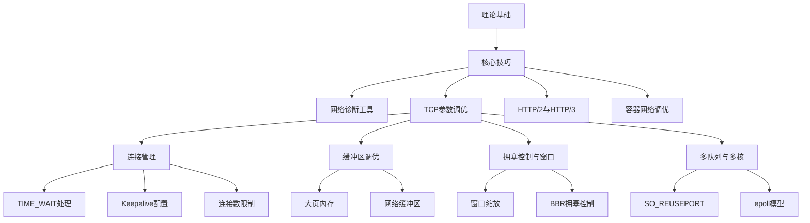
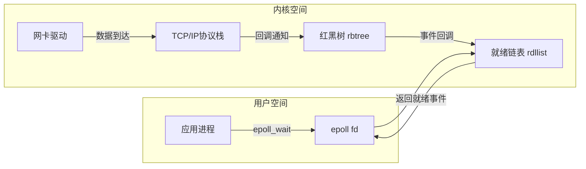
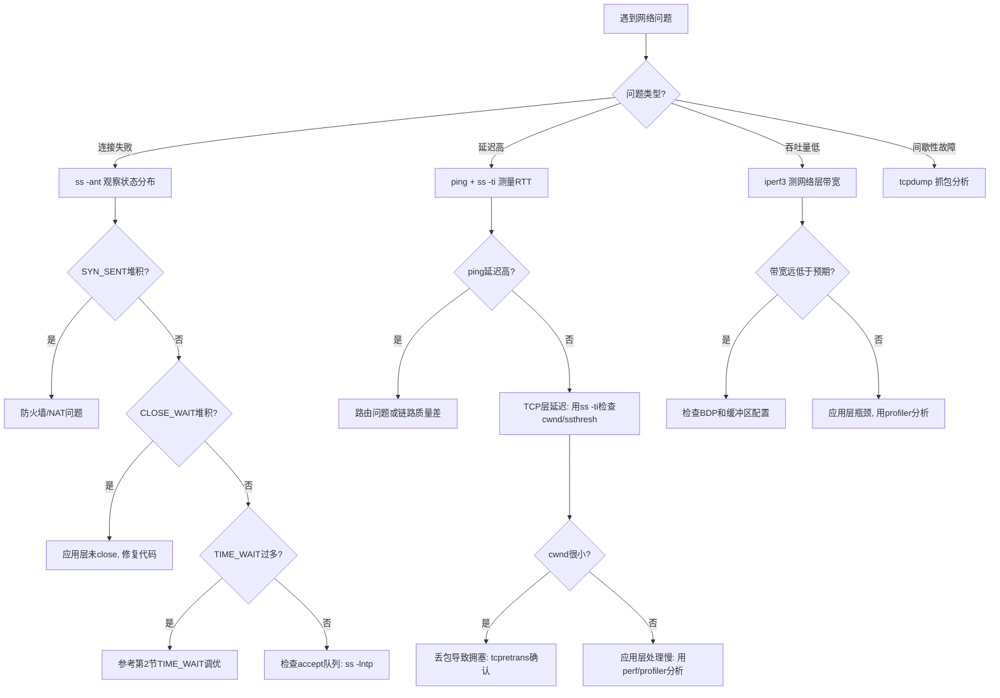

# 核心技巧

理论基础章节为你构建了TCP/IP协议栈的完整知识框架——从OSI七层模型到TCP拥塞控制算法。但理解协议是一回事，在生产环境中把协议栈的性能压榨到极致是另一回事。本章聚焦**实战调优**：用Linux内核提供的旋钮和用户态框架的编程模式，让TCP/IP协议栈在高并发、低延迟、大吞吐的场景下稳定高效地运行。

**本节定位**：本节是理论到实践的桥梁。理论基础讲"是什么"和"为什么"，本节讲"怎么做"。读者在阅读时应先通读理论基础，再带着实际问题来到这里。每个技巧都遵循"原理→参数→验证→调优"的四步结构。



---

## 1. 内核参数调优全景

Linux内核通过`sysctl`暴露了数百个网络相关参数，分布在四个主要层级。调优不是盲目修改数字，而是理解每个参数对应的内核行为后，根据业务特征做出针对性选择。

### 1.1 参数层级与作用范围

| 层级 | sysctl前缀 | 作用范围 | 典型参数数量 |
|------|-----------|---------|------------|
| 全局级 | `net.core.*` | 协议栈通用行为（连接队列、缓冲区默认值） | ~20 |
| IPv4级 | `net.ipv4.*` | TCP/UDP协议行为（超时、窗口、拥塞） | ~50 |
| TCP级 | `net.ipv4.tcp_*` | TCP协议特有行为（窗口、Keepalive、SYN） | ~40 |
| 设备级 | `net.core.dev_*` 或 `/sys/class/net/eth0/` | 网卡驱动级别（多队列、中断亲和性） | ~15 |

**调优基本原则**：

1. **测量优先**：修改任何参数前，先用`sysctl -a | grep net`了解当前值，用`ss`、`ip`、`perf`等工具建立基线
2. **最小变更**：每次只改一个参数，观察效果后再调下一个，避免多变量干扰
3. **回滚准备**：将原始值记录到文件，确保随时可以恢复
4. **版本记录**：记录内核版本、业务场景、修改前后的性能指标

```bash
# 记录当前所有网络参数快照
sysctl -a | grep -E '^net\.' > /tmp/sysctl_baseline_$(date +%Y%m%d).txt

# 调优后对比差异
diff /tmp/sysctl_baseline_20260101.txt /tmp/sysctl_baseline_20260601.txt
```

### 1.2 高并发服务器核心参数速查表

以下参数覆盖了80%的网络调优场景，按优先级排序：

| 参数 | 默认值 | 推荐值（高并发） | 说明 |
|------|-------|-----------------|------|
| `net.core.somaxconn` | 128 | 65535 | TCP全连接队列上限 |
| `net.core.netdev_max_backlog` | 1000 | 65535 | 网卡接收队列上限 |
| `net.ipv4.tcp_max_syn_backlog` | 1024 | 65535 | SYN半连接队列上限 |
| `net.ipv4.tcp_fin_timeout` | 60 | 15 | FIN_WAIT_2超时时间（秒） |
| `net.ipv4.tcp_tw_reuse` | 0 | 1 | 允许复用TIME_WAIT连接（仅客户端） |
| `net.ipv4.tcp_keepalive_time` | 7200 | 600 | Keepalive探测起始等待时间（秒） |
| `net.ipv4.tcp_keepalive_intvl` | 75 | 15 | Keepalive探测间隔（秒） |
| `net.ipv4.tcp_keepalive_probes` | 9 | 5 | Keepalive探测失败次数 |
| `net.ipv4.ip_local_port_range` | 32768-60999 | 1024-65535 | 临时端口范围 |
| `net.ipv4.tcp_max_tw_buckets` | 180000 | 按需调整 | TIME_WAIT最大数量 |
| `net.ipv4.tcp_syncookies` | 1 | 1 | SYN Flood防护（必须开启） |
| `net.ipv4.tcp_rmem` | 4096-131072 | 4096-87380-16777216 | TCP接收缓冲区（最小/默认/最大） |
| `net.ipv4.tcp_wmem` | 4096-16384 | 4096-65536-16777216 | TCP发送缓冲区（最小/默认/最大） |

> **注意**：推荐值基于典型Web服务器场景（8核32GB、万兆网卡）。你的实际最优值取决于RTT、带宽、并发连接数。务必用`iperf3`和`wrk`/`wrk2`基准测试验证。

### 1.3 参数持久化

修改sysctl参数有两种方式，适用场景不同：

```bash
# 方式一：临时生效（重启丢失，用于测试验证）
sysctl -w net.core.somaxconn=65535

# 方式二：永久生效（写入配置文件，重启后仍有效）
echo "net.core.somaxconn = 65535" >> /etc/sysctl.d/99-network-tuning.conf
sysctl -p /etc/sysctl.d/99-network-tuning.conf

# 验证已加载
sysctl net.core.somaxconn
```

**生产建议**：先用方式一测试，确认效果后用方式二持久化。将所有调优参数集中到一个文件（如`/etc/sysctl.d/99-network-tuning.conf`），便于版本管理和回滚。

---

## 2. TIME_WAIT状态调优

TIME_WAIT是TCP四次挥手后，主动关闭方进入的等待状态，持续时间为2MSL（Linux默认60秒）。它存在的两个原因：

1. **确保最后一个ACK被对方收到**：如果ACK丢失，服务器会重发FIN，客户端需要处于能响应的状态
2. **防止旧连接的延迟数据被新连接误收**：确保网络中属于该连接的所有数据包都已消亡

### 2.1 TIME_WAIT过多的危害

在高并发短连接场景下（如HTTP API、Redis连接池），大量的TIME_WAIT会：

- **耗尽临时端口**：每个TIME_WAIT连接占用一个本地端口，默认范围32768-60999（约2.8万个）。当端口耗尽，新连接无法建立。
- **占用内存**：每个TIME_WAIT约占用300字节内核内存，10万个就是30MB。
- **增加文件描述符压力**：虽然已关闭的连接不占fd，但内核为TIME_WAIT维护的socket结构仍然消耗系统资源。

```bash
# 观察TIME_WAIT数量
ss -ant | awk '{print $1}' | sort | uniq -c | sort -rn | head
#  152348 TIME-WAIT
#   89234 ESTAB
#     456 LISTEN

# 观察临时端口使用情况
cat /proc/net/tcp | wc -l
# 或更直观：
ss -ant | awk '$1 == "TIME-WAIT" {print $4}' | cut -d: -f2 | sort -n | tail -1
```

### 2.2 调优方案对比

| 方案 | sysctl参数 | 适用场景 | 风险等级 | 说明 |
|------|-----------|---------|---------|------|
| 开启端口复用 | `tcp_tw_reuse=1` | 客户端主动连接（如HTTP客户端、微服务RPC） | 低 | 仅对**出站**连接有效，内核通过时间戳确保安全复用 |
| 扩大端口范围 | `ip_local_port_range=1024 65535` | 所有场景 | 低 | 将可用端口从2.8万扩展到6.4万 |
| 减小FIN超时 | `tcp_fin_timeout=15` | 所有场景 | 低 | 将FIN_WAIT_2的超时从60秒缩短 |
| 限制TIME_WAIT数量 | `tcp_max_tw_buckets=10000` | 高并发服务器 | 中 | 超出限制的TIME_WAIT直接销毁，可能丢失迟到的ACK |
| 增加时间戳 | `tcp_timestamps=1` | `tcp_tw_reuse`的前提 | 低 | 默认开启，为每个连接添加时间戳选项 |

**tcp_tw_reuse vs tcp_tw_recycle**：

tcp_tw_reuse（推荐）:
  - 仅适用于出站连接（客户端/主动发起方）
  - 内核检查时间戳，确保新连接的时间戳 > 旧连接的最大时间戳
  - 安全可靠，RFC 6191支持

tcp_tw_recycle（已废弃）:
  - Linux 4.12+ 已移除此参数
  - 在NAT环境下会导致严重问题（多个客户端共享IP，时间戳混乱导致连接被随机丢弃）
  - 绝对不要使用

### 2.3 从架构层面解决TIME_WAIT

调优内核参数只是治标，从架构层面减少短连接才是治本：

**方案一：连接池化**

```python
# Python requests + urllib3 连接池示例
import requests
from urllib3.util.retry import Retry
from requests.adapters import HTTPAdapter

session = requests.Session()
adapter = HTTPAdapter(
    pool_connections=20,      # 连接池大小
    pool_maxsize=100,         # 最大连接数
    max_retries=Retry(total=3, backoff_factor=0.5)
)
session.mount('http://', adapter)
session.mount('https://', adapter)

# 后续请求复用同一连接池中的TCP连接，避免反复建立/关闭
resp = session.get('http://api.example.com/data')
```

**方案二：HTTP Keep-Alive**

Nginx配置示例：

```nginx
upstream backend {
    server 10.0.0.1:8080;
    keepalive 64;          # 每个worker保持64个空闲keepalive连接
    keepalive_requests 1000; # 每个连接最多服务1000个请求
    keepalive_timeout 60s;   # 空闲连接超时时间
}

server {
    location /api/ {
        proxy_pass http://backend;
        proxy_http_version 1.1;           # 必须1.1+才能用keepalive
        proxy_set_header Connection "";    # 清除Connection: close
    }
}
```

**方案三：长连接替代短连接**

对于RPC和微服务间通信，使用gRPC（基于HTTP/2）或自定义TCP长连接协议，从根本上消除频繁建连的问题。

---

## 3. TCP Keepalive机制

TCP Keepalive是操作系统层面的连接保活机制，用于检测对端是否存活（而非应用层心跳）。当一个TCP连接长时间空闲时，内核会定期发送探测包，如果连续多次无响应则关闭连接。

### 3.1 工作机制

时间线：
  t=0           t=7200s        t=7275s        t=7350s ...  t=7575s
   |               |              |              |            |
   数据发送        发送第1个       发送第2个       发送第3个    关闭连接
   停止            Keepalive探测   Keepalive探测   Keepalive探测
                   (无响应)       (无响应)       (无响应)
   
   tcp_keepalive_time=7200s（默认）
   tcp_keepalive_intvl=75s（探测间隔）
   tcp_keepalive_probes=9（最大探测次数）

### 3.2 Keepalive参数详解

```bash
# 三个核心参数
net.ipv4.tcp_keepalive_time = 7200    # 连接空闲多久后开始探测（秒）
net.ipv4.tcp_keepalive_intvl = 75     # 每次探测的间隔（秒）
net.ipv4.tcp_keepalive_probes = 9     # 连续失败多少次后认为对端死亡

# 最长检测周期 = keepalive_time + keepalive_intvl × keepalive_probes
# 默认：7200 + 75 × 9 = 7875秒（约2.2小时）
# 推荐：600 + 15 × 5 = 675秒（约11分钟）
```

### 3.3 应用层 vs 内核Keepalive

很多开发者混淆TCP Keepalive和应用层心跳（如WebSocket Ping/Pong、HTTP长轮询），两者有本质区别：

| 维度 | TCP Keepalive | 应用层心跳 |
|------|-------------|-----------|
| 控制粒度 | 内核级别，对应用透明 | 应用层自定义 |
| 默认行为 | 关闭（需显式开启） | 需自行实现 |
| 检测间隔 | 最快600秒（可调） | 可做到秒级 |
| 功能范围 | 仅检测TCP连接是否存活 | 可携带业务状态、延迟指标 |
| NAT穿透 | 可能被中间设备丢弃或重置 | 可配置符合中间设备超时策略 |
| 防火墙穿越 | 防火墙可能过滤Keepalive包 | 可使用应用层协议穿越 |
| 性能开销 | 极低（内核实现） | 较高（需序列化/反序列化） |
| 推荐场景 | 检测死连接、回收资源 | 实时性要求高、需要业务状态同步 |

**生产建议**：两者配合使用。TCP Keepalive作为保底检测（超长超时），应用层心跳作为主动检测（短间隔），同时维护连接的活跃状态以穿越NAT和防火墙。

### 3.4 编程实践

```c
// C语言：启用SO_KEEPALIVE并调优参数
#include <sys/socket.h>
#include <netinet/tcp.h>

int fd = socket(AF_INET, SOCK_STREAM, 0);

// 启用Keepalive
int enable = 1;
setsockopt(fd, SOL_SOCKET, SO_KEEPALIVE, &amp;enable, sizeof(enable));

// 设置Keepalive参数（需在连接建立后设置）
int idle = 600;      // 600秒空闲后开始探测
setsockopt(fd, IPPROTO_TCP, TCP_KEEPIDLE, &amp;idle, sizeof(idle));

int interval = 15;   // 每15秒探测一次
setsockopt(fd, IPPROTO_TCP, TCP_KEEPINTVL, &amp;interval, sizeof(interval));

int count = 5;       // 5次失败后关闭
setsockopt(fd, IPPROTO_TCP, TCP_KEEPCNT, &amp;count, sizeof(count));
```

```go
// Go语言：通过net.TCPConn设置Keepalive
ln, _ := net.Listen("tcp", ":8080")
for {
    conn, _ := ln.Accept()
    tcpConn := conn.(*net.TCPConn)
    tcpConn.SetKeepAlive(true)
    tcpConn.SetKeepAlivePeriod(15 * time.Second)
}
```

```python
# Python socket：设置Keepalive
import socket
sock = socket.socket(socket.AF_INET, socket.SOCK_STREAM)
sock.setsockopt(socket.SOL_SOCKET, socket.SO_KEEPALIVE, 1)
# Linux特有参数
sock.setsockopt(socket.IPPROTO_TCP, socket.TCP_KEEPIDLE, 600)
sock.setsockopt(socket.IPPROTO_TCP, socket.TCP_KEEPINTVL, 15)
sock.setsockopt(socket.IPPROTO_TCP, socket.TCP_KEEPCNT, 5)
```

---

## 4. TCP窗口调优与窗口缩放

TCP窗口（Window）决定了发送方在未收到ACK之前可以发送多少数据。窗口大小直接影响吞吐量——窗口太小，发送方频繁等待ACK，带宽利用率低；窗口太大，可能引发拥塞和丢包。

### 4.1 窗口缩放（Window Scaling）

TCP头部的窗口字段只有16位，最大表示64KB。在高带宽长延迟网络中（如100Mbps × 200ms RTT的跨国链路），BDP远超64KB，必须启用窗口缩放（RFC 1323）才能充分利用带宽。

```bash
# 查看当前窗口缩放因子
ss -ti dst 10.0.0.1:80 | grep wscale
# wscale:7,7  ← 发送方缩放因子7，接收方缩放因子7
# 实际窗口 = 窗口字段 × 2^缩放因子
# 例如：窗口字段=65535, 缩放因子=7 → 实际窗口 = 65535 × 128 = 8MB

# 窗口缩放参数（0-14，越大支持的窗口越大）
net.ipv4.tcp_window_scaling = 1    # 默认开启，不要关闭
```

**窗口缩放因子对照表**：

| 缩放因子 | 最大窗口 | 适用场景 |
|---------|---------|---------|
| 0 | 64KB | 低带宽短延迟（如串口、modem） |
| 7 | 8MB | 局域网、城域网（RTT < 5ms） |
| 9 | 32MB | 跨城网络（RTT 20-50ms） |
| 12 | 256MB | 跨国网络（RTT 100-200ms） |
| 14 | 1GB | 卫星链路、超长延迟（RTT > 500ms） |

### 4.2 窗口自动调节

Linux内核从2.4.25起支持TCP缓冲区自动调节（autotuning），根据BDP动态调整每个连接的窗口大小：

```bash
# 自动调节开关（默认开启）
net.ipv4.tcp_moderate_rcvbuf = 1    # 接收窗口自动调节（推荐开启）

# 自动调节的约束范围
net.ipv4.tcp_rmem = 4096 131072 6291456
#                最小值  默认值  最大值（自动调节在此范围内调整）

# 发送窗口也支持自动调节，但更依赖应用层的write行为
net.ipv4.tcp_wmem = 4096 16384 4194304
```

**自动调节的工作流程**：

1. 连接建立时，接收窗口 = tcp_rmem[1]（默认值，通常131072）
2. 内核监控接收速率和队列积压情况
3. 当应用层消费数据慢于网络到达速率时，内核缩小窗口（通告更小的接收窗口）
4. 当应用层消费数据快于到达速率时，内核增大窗口（直到tcp_rmem[2]）
5. 同时受全局TCP内存限制（net.ipv4.tcp_mem）约束

### 4.3 避免窗口调优的常见陷阱

```bash
# 陷阱1：应用层禁用了自动调节
# 某些框架（如早期的Java NIO）会手动设置SO_RCVBUF/SO_SNDBUF
# 这会覆盖内核的自动调节，导致窗口固定不变
# 检查方法：
ss -ti | grep rcvmss
# 如果 rcvmss = advmss，说明自动调节可能被禁用

# 陷阱2：tcp_mem全局内存不足
# 即使单个连接的tcp_rmem上限很高，全局tcp_mem不够也会限制窗口
cat /proc/net/sockstat | grep TCP
# TCP: inuse X orphan Y tw Z alloc W mem M
# mem M 的单位是页（通常4KB），如果M接近tcp_mem[2]，说明全局内存紧张

# 陷阱3：接收端应用层读取慢
# 窗口再大，如果应用层read()不及时，内核缓冲区满了也会缩小窗口
# 诊断：ss -ti 查看 rcv_space 和 rcv_ssthresh
```

### 4.4 针对高BDP网络的窗口调优

```bash
# 场景：跨国API服务，RTT=200ms，带宽=100Mbps
# BDP = 100Mbps × 200ms = 2.5MB

# 1. 增大tcp_rmem和tcp_wmem上限
sysctl -w net.ipv4.tcp_rmem="4096 262144 16777216"    # 最大16MB
sysctl -w net.ipv4.tcp_wmem="4096 262144 16777216"

# 2. 增大全局TCP内存上限（单位：页，16MB = 4096页）
sysctl -w net.ipv4.tcp_mem="786432 1048576 1572864"   # 最大6GB

# 3. 确保窗口缩放开启
sysctl -w net.ipv4.tcp_window_scaling=1

# 4. 验证效果
ss -ti dst <target-ip> | grep -E "wscale|cwnd|rcv_space"
```

---

## 5. epoll事件驱动模型

在Linux网络编程中，I/O多路复用是处理高并发连接的核心技术。从select/poll到epoll的演进，是Linux网络栈最重要的进步之一。

### 5.1 三种I/O多路复用模型对比

select (1983, POSIX标准):
  ┌────────────────────────────┐
  │ 用户调用select()           │
  │  ↓ 拷贝fd集合到内核        │  ← 每次调用都拷贝
  │  ↓ 内核遍历所有fd          │  ← O(n)遍历
  │  ↓ 返回就绪fd集合          │  ← 返回全部，用户再次遍历
  │ 用户遍历处理就绪fd          │  ← O(n)处理
  └────────────────────────────┘
  限制: fd上限1024 (FD_SETSIZE)

poll (1997):
  与select几乎相同，去掉了fd数量限制
  但仍需每次拷贝+全量遍历

epoll (2002, Linux 2.6+):
  ┌────────────────────────────┐
  │ epoll_create()             │  ← 创建一次，内核维护红黑树
  │ epoll_ctl(ADD, fd, events) │  ← 增删改fd，回调注册
  │ epoll_wait()               │  ← 仅返回就绪fd，O(1)事件通知
  └────────────────────────────┘
  基于事件回调，不需遍历所有fd

### 5.2 epoll的三个系统调用

```c
// 1. 创建epoll实例
int epfd = epoll_create1(0);  // 参数0表示默认行为
// 返回文件描述符，后续所有操作通过此fd

// 2. 注册/修改/删除关注的fd
struct epoll_event ev;
ev.events = EPOLLIN | EPOLLET;  // 关注可读事件 + 边缘触发
ev.data.fd = listen_fd;
epoll_ctl(epfd, EPOLL_CTL_ADD, listen_fd, &amp;ev);

// 3. 等待事件发生（阻塞或非阻塞）
struct epoll_event events[MAX_EVENTS];
int n = epoll_wait(epfd, events, MAX_EVENTS, timeout_ms);
for (int i = 0; i < n; i++) {
    if (events[i].data.fd == listen_fd) {
        // 新连接到来
        int client_fd = accept(listen_fd, ...);
        ev.data.fd = client_fd;
        epoll_ctl(epfd, EPOLL_CTL_ADD, client_fd, &amp;ev);
    } else {
        // 已有连接有数据可读
        handle_client(events[i].data.fd);
    }
}
```

### 5.3 水平触发 vs 边缘触发

epoll支持两种触发模式，选择哪种对程序的性能和正确性有重大影响：

| 维度 | 水平触发 (LT) | 边缘触发 (ET) |
|------|-------------|-------------|
| 触发条件 | fd就绪状态持续触发 | 仅在状态变化时触发一次 |
| 编程难度 | 低（简单但可能低效） | 高（必须一次读完所有数据） |
| 系统调用次数 | 多（每次epoll_wait都通知） | 少（仅在新数据到达时通知） |
| 性能 | 中等 | 高（减少epoll_wait唤醒次数） |
| 容错性 | 高（漏读不丢数据，下次还会触发） | 低（漏读可能导致数据滞留直到下次新数据到达） |
| 适用场景 | 简单服务器、学习用途 | 高性能生产服务器 |

**边缘触发编程关键点**：必须使用非阻塞fd + 循环读取直到EAGAIN：

```c
// ET模式下的标准读取模式
void handle_client(int fd) {
    char buf[4096];
    while (1) {
        ssize_t n = read(fd, buf, sizeof(buf));
        if (n > 0) {
            process_data(buf, n);
        } else if (n == 0) {
            // 对端关闭连接
            close(fd);
            return;
        } else {
            if (errno == EAGAIN || errno == EWOULDBLOCK) {
                // 所有数据已读完，等待下次epoll通知
                break;
            }
            // 真正的错误
            perror("read");
            close(fd);
            return;
        }
    }
}
```

### 5.4 epoll的内核实现原理

epoll的高性能源于三个关键设计：

1. **就绪链表**：内核为每个epoll实例维护一个就绪链表（rdllist）。当某个fd的状态变为就绪时，通过回调函数将其添加到就绪链表中。`epoll_wait`只需要检查就绪链表是否为空，时间复杂度O(1)。

2. **红黑树管理fd**：epoll实例内部用红黑树（rbtree）管理所有被监控的fd。`epoll_ctl`的ADD/MOD/DEL操作都是O(log n)，查找效率远优于select/poll的O(n)线性扫描。

3. **mmap共享内存**：就绪事件通过mmap映射到用户空间，避免了select/poll每次调用都需要将fd集合从用户空间拷贝到内核空间的开销。



### 5.5 epoll性能调优

```bash
# 增加文件描述符上限（高并发必须）
echo "* soft nofile 1048576" >> /etc/security/limits.conf
echo "* hard nofile 1048576" >> /etc/security/limits.conf

# 也需修改sysctl
echo "fs.file-max = 1048576" >> /etc/sysctl.conf
sysctl -p

# 查看当前fd使用情况
cat /proc/sys/fs/file-nr
# 输出: 12345  0  1048576
#        已分配  未使用  最大值

# 每个进程的fd限制
ls -l /proc/<pid>/limits | grep "open files"
```

### 5.6 epoll的性能边界与替代方案

epoll在Linux上是事实标准，但了解其边界有助于做出正确选择：

| 方案 | 适用场景 | 优势 | 劣势 |
|------|---------|------|------|
| epoll | 通用高并发（1K-1M连接） | 成熟稳定，生态丰富 | 仅Linux，C10K以上性能下降 |
| io_uring | 超高吞吐（磁盘+网络混合） | 真正的异步I/O，零系统调用 | 内核版本要求高（5.1+），API复杂 |
| kqueue | macOS/FreeBSD | 功能类似epoll，支持更多事件类型 | 仅BSD系 |
| DPDK/XDP | 千万级PPS | 绕过内核，极致性能 | 开发复杂，运维成本高 |

```bash
# 检查系统是否支持io_uring
uname -r  # 需要 5.1+
cat /proc/version

# io_uring网络性能对比（参考值，实际取决于硬件和场景）
# epoll:   ~100万 QPS（单核，小包HTTP）
# io_uring: ~150万 QPS（单核，小包HTTP，减少了系统调用次数）
```

---

## 6. SO_REUSEPORT多核优化

在多核服务器上，传统模型中所有CPU核心共享一个监听socket，导致accept()调用时产生锁竞争。SO_REUSEPORT（Linux 3.9+）允许多个进程/线程绑定同一IP:端口，内核在内核态自动分配连接到不同socket，消除了用户态的锁竞争。

### 6.1 传统模型 vs SO_REUSEPORT

传统模型（单监听socket + 多worker）：
  CPU0 ─┐
  CPU1 ─┤─→ [lock] ─→ [accept] ─→ [socket fd]
  CPU2 ─┤     ↑
  CPU3 ─┘   竞争！所有核心争抢同一个accept锁

SO_REUSEPORT模型：
  CPU0 ─→ [socket fd 0] ─→ accept ─→ client
  CPU1 ─→ [socket fd 1] ─→ accept ─→ client
  CPU2 ─→ [socket fd 2] ─→ accept ─→ client
  CPU3 ─→ [socket fd 3] ─→ accept ─→ client
  无锁！每个核心独立accept自己的socket

### 6.2 内核负载均衡策略

SO_REUSEPORT在内核中使用两种负载均衡策略（Linux 4.5+）：

| 策略 | 适用场景 | 分配方式 |
|------|---------|---------|
| **哈希分配**（默认） | 长连接、WebSocket | 基于源IP:端口的哈希，同一客户端总是分配到同一socket |
| **CPU亲和分配** | 短连接、HTTP | 连接分配到与当前CPU核对应的socket |

```bash
# 查看当前负载均衡策略
sysctl net.ipv4.tcp_migrate_req

# 切换到CPU亲和模式（适用于短连接场景）
sysctl -w net.core.so_reuseport_numa_aware=0
```

### 6.3 编程实现

```c
// C语言：SO_REUSEPORT服务器框架
#include <sys/socket.h>
#include <netinet/in.h>

#define NUM_WORKERS 4

int create_reuseport_socket(uint16_t port) {
    int fd = socket(AF_INET, SOCK_STREAM, 0);
    
    int enable = 1;
    setsockopt(fd, SOL_SOCKET, SO_REUSEADDR, &amp;enable, sizeof(enable));
    setsockopt(fd, SOL_SOCKET, SO_REUSEPORT, &amp;enable, sizeof(enable));
    
    struct sockaddr_in addr = {
        .sin_family = AF_INET,
        .sin_port = htons(port),
        .sin_addr.s_addr = INADDR_ANY
    };
    bind(fd, (struct sockaddr*)&amp;addr, sizeof(addr));
    listen(fd, 65535);
    return fd;
}

void worker(int worker_id, int listen_fd) {
    // 每个worker有自己的epoll实例
    int epfd = epoll_create1(0);
    struct epoll_event ev = { .events = EPOLLIN, .data.fd = listen_fd };
    epoll_ctl(epfd, EPOLL_CTL_ADD, listen_fd, &amp;ev);
    
    while (1) {
        struct epoll_event events[1024];
        int n = epoll_wait(epfd, events, 1024, -1);
        for (int i = 0; i < n; i++) {
            int client_fd = accept(events[i].data.fd, NULL, NULL);
            // 处理客户端请求...
        }
    }
}

int main() {
    int fds[NUM_WORKERS];
    for (int i = 0; i < NUM_WORKERS; i++) {
        fds[i] = create_reuseport_socket(8080);
    }
    
    for (int i = 0; i < NUM_WORKERS; i++) {
        if (fork() == 0) {
            worker(i, fds[i]);
        }
    }
    wait(NULL);
}
```

### 6.4 Nginx中的SO_REUSEPORT

```nginx
# Nginx 1.9.1+ 支持SO_REUSEPORT
events {
    use epoll;
    reuseport;        # 启用SO_REUSEPORT
    worker_connections 65535;
}
```

启用reuseport后，Nginx在`wrk`基准测试中，4核机器的QPS通常提升30%-100%，因为消除了accept锁竞争。在8核以上服务器上效果更为显著。

---

## 7. 网络缓冲区与BDP

TCP缓冲区是内核为每个TCP连接分配的收发缓冲区，其大小直接影响吞吐量和延迟。合理配置缓冲区是高带宽长距离（高BDP）网络调优的关键。

### 7.1 TCP缓冲区三元组

每个TCP连接有三组缓冲区参数（最小/默认/最大），控制内核为连接分配的缓冲区大小：

```bash
# 接收缓冲区
net.ipv4.tcp_rmem = 4096 131072 6291456
#                最小值  默认值  最大值

# 发送缓冲区
net.ipv4.tcp_wmem = 4096 16384 4194304
#                最小值  默认值  最大值

# 全局缓冲区（所有TCP连接的缓冲区内存总和上限）
net.core.rmem_max = 212992
net.core.wmem_max = 212992
net.core.rmem_default = 212992
net.core.wmem_default = 212992
```

**缓冲区分配逻辑**：

内核自动调节过程:
1. 连接建立时，分配 tcp_*mem[1]（默认值）作为缓冲区大小
2. 根据当前可用内存和连接数，内核在 [tcp_*mem[0], tcp_*mem[2]] 之间自动调整
3. 调整依据：带宽延迟积（BDP）= 带宽 × RTT
   - 例如：100Mbps × 50ms = 625KB → 缓冲区至少需要625KB
4. 高并发时，内核可能缩小单个连接的缓冲区以容纳更多连接

### 7.2 带宽延迟积（BDP）计算

BDP是TCP调优中最重要的公式，它决定了获得最大吞吐量所需的最小缓冲区大小：

BDP (字节) = 带宽 (字节/秒) × RTT (秒)

示例:
- 局域网:  1Gbps × 0.5ms  = 62.5KB
- 跨城:   100Mbps × 30ms  = 375KB
- 跨国:   100Mbps × 200ms = 2.5MB
- 卫星:   50Mbps × 600ms  = 3.75MB

如果缓冲区 < BDP，TCP窗口无法填满管道，吞吐量受限
如果缓冲区 >> BDP，浪费内存且增加延迟（bufferbloat）

```bash
# 实际测量RTT
ping -c 10 target-host
# 或更精确的TCP层RTT
ss -ti | grep rtt
# rtt: 0.5/0.2/1.2  ← min/avg/max

# 计算推荐缓冲区大小
# 例: 1Gbps × 20ms RTT = 2.5MB
sysctl -w net.ipv4.tcp_rmem="4096 262144 16777216"
sysctl -w net.ipv4.tcp_wmem="4096 262144 16777216"
```

### 7.3 Bufferbloat问题

**Bufferbloat**（缓冲膨胀）是指网络设备或协议栈配置了过大的缓冲区，导致数据包在缓冲区中排队过久，显著增加延迟。典型症状：下载大文件时，ping延迟从几毫秒飙升到几百毫秒。

正常网络：
  发送 → [网卡] → [网络] → [接收]
  排队延迟 < 1ms

Bufferbloat：
  发送 → [巨大缓冲区排满了] → [网络] → [接收]
  排队延迟 = 缓冲区大小 / 带宽
  例如：10MB缓冲区 / 100Mbps = 800ms 额外延迟！

**解决方案**：主动队列管理（AQM），Linux内置fq_codel和CAKE：

```bash
# 查看当前队列管理算法
sysctl net.core.default_qdisc
# 默认是pfifo_fast（无AQM，易bufferbloat）

# 切换到fq_codel（推荐，兼顾延迟和吞吐）
sysctl -w net.core.default_qdisc=fq_codel

# 配合BBR使用
sysctl -w net.ipv4.tcp_congestion_control=bbr
```

**fq_codel vs CAKE 对比**：

| 维度 | fq_codel | CAKE |
|------|----------|------|
| 定位 | 通用AQM队列管理 | 全功能流量整形+AQM |
| 功能 | 基于Flow Queue的公平排队+ECN标记 | 流量整形+优先级+公平排队+ECN |
| 配置复杂度 | 低（默认参数即可） | 中（需要根据链路速率配置） |
| 适用场景 | 服务器端、通用 | 路由器、家庭网关、边缘设备 |
| 带宽限制 | 需配合tc配置 | 内置带宽限制 |

```bash
# CAKE配置示例（家庭路由器场景）
tc qdisc replace dev eth0 root cake bandwidth 100mbit nat wash
```

### 7.4 大页内存与网络性能

大页（Huge Pages）通过减少TLB（Translation Lookaside Buffer）未命中率来提升内存密集型网络应用的性能。当TCP缓冲区分配在大页上时，内存管理开销显著降低。

```bash
# 配置透明大页（THP）—— Linux默认开启
cat /sys/kernel/mm/transparent_hugepage/enabled
# [always] madvise never

# 对于网络密集型应用，推荐设置为madvise（按需使用）
echo madvise > /sys/kernel/mm/transparent_hugepage/enabled

# 预分配大页（可选，适合内存确定的应用）
echo 1024 > /proc/sys/vm/nr_hugepages  # 预分配1024个2MB大页
```

**大页对网络性能的影响场景**：

| 场景 | 收益 | 原因 |
|------|------|------|
| 大连接数服务器（>10万） | 高 | 减少每个连接的页表开销 |
| 高吞吐量转发（如DPDK） | 高 | 大包处理路径上TLB miss减少 |
| 普通Web服务 | 低-中 | 效果取决于内存访问模式 |
| 小包短连接 | 可忽略 | 连接建立/拆除开销远大于TLB miss |

---

## 8. 网络诊断工具箱

在调优过程中，诊断工具是你的"眼睛"。本节汇总TCP/IP调优中最常用的工具集，每个工具都给出典型的使用场景和输出解读。

### 8.1 连接状态分析：ss

`ss`是`netstat`的现代替代品，直接读取内核的netlink接口，速度比netstat快10倍以上。

```bash
# 1. 连接状态分布概览
ss -ant | awk '{print $1}' | sort | uniq -c | sort -rn
#  152348 TIME-WAIT      ← 如果过多，考虑第2节的调优
#   89234 ESTAB
#     456 LISTEN
#      12 SYN-RECV        ← 如果>100，可能SYN Flood或连接风暴
#       3 CLOSE-WAIT      ← 对端已关闭，本端未close——应用层bug

# 2. 查看特定连接的详细信息
ss -ti dst 10.0.0.1:80
# 输出示例:
# cubic wscale:7,7 rto:204 rtt:0.5/0.2 ato:40 mss:1448 pmtu:1500
# rcvmss:1448 advmss:1448 cwnd:10 ssthresh:7 bytes_sent:12345
# bytes_acked:12345 bytes_received:6789 segs_out:100 segs_in:80

# 关键字段解读:
# rtt: 往返时间（当前/最小/最大）→ 诊断延迟
# cwnd: 拥塞窗口大小 → 判断吞吐量瓶颈
# ssthresh: 慢启动阈值 → 评估拥塞恢复状态
# retrans: 重传次数 → 判断丢包率

# 3. 查看监听socket的队列状态
ss -lntp
# State   Recv-Q  Send-Q  Local Address:Port
# LISTEN  0       128     0.0.0.0:80
# Recv-Q: 当前在accept队列中等待的连接数
# Send-Q: accept队列最大长度（= somaxconn）
# 如果 Recv-Q ≈ Send-Q，说明accept()处理不过来！
```

### 8.2 抓包分析：tcpdump

tcpdump是排查网络问题的终极工具，它能看到线上实际传输的数据包。

```bash
# 1. 抓取特定端口的TCP流量
tcpdump -i eth0 port 8080 -nn -c 100 -w /tmp/debug.pcap
# -i eth0: 指定网卡
# -nn: 不解析主机名和端口名（性能更好）
# -c 100: 只抓100个包
# -w: 写入文件，用Wireshark分析

# 2. 分析TCP三次握手和四次挥手
tcpdump -i eth0 'tcp[tcpflags] &amp; (tcp-syn|tcp-fin) != 0' -nn

# 3. 分析TCP重传
tcpdump -i eth0 'tcp[tcpflags] &amp; tcp-syn != 0' -nn -vv | grep "retrans"
# 或更精确：
tcpdump -i eth0 -nn 'tcp[tcpflags] &amp; tcp-syn != 0 and tcp[12:2] = tcp[14:2]'
# 前后两个ISN相同 = 重传

# 4. 分析DNS解析延迟
tcpdump -i eth0 port 53 -nn
# 输出中注意 Query 和 Response 的时间差

# 5. 分析TLS握手过程
tcpdump -i eth0 port 443 -nn -v | grep -E "ClientHello|ServerHello"

# 6. 高级过滤：只抓大包（可能有性能问题）
tcpdump -i eth0 'greater 1400' -nn -c 50

# 7. 抓取SYN Flood攻击流量
tcpdump -i eth0 'tcp[tcpflags] == tcp-syn' -nn -c 1000 | \
  awk '{print $3}' | cut -d. -f1-4 | sort | uniq -c | sort -rn | head
```

### 8.3 实时监控：iftop和nload

```bash
# iftop: 按连接显示实时带宽
sudo iftop -i eth0 -f "dst port 8080"
# 显示每个TCP连接的实时带宽，按流量排序

# nload: 显示网卡级别的实时流量
nload eth0
# 两个图表：Incoming（入站）和Outgoing（出站）
```

### 8.4 性能测试：iperf3和wrk

```bash
# iperf3: 网络带宽和延迟测试
# 服务器端:
iperf3 -s

# 客户端:
iperf3 -c server-ip -t 30 -P 4
# -t 30: 测试30秒
# -P 4: 4个并行流

# wrk: HTTP压测（评估应用层性能）
wrk -t12 -c400 -d30s http://localhost:8080/api
# -t12: 12个线程
# -c400: 400个并发连接
# -d30s: 持续30秒

# wrk2: 带恒定请求率的压测（更准确的延迟分布）
wrk2 -t12 -c400 -d30s -R10000 http://localhost:8080/api
# -R10000: 恒定每秒10000个请求
```

### 8.5 eBPF/bcc工具：现代网络可观测性

传统工具（ss、tcpdump、iftop）提供宏观视图，eBPF/bcc工具则能深入内核内部，精确追踪网络事件的根因。这些工具不需要修改应用代码，直接挂载到内核函数上采集数据。

```bash
# 安装bcc-tools（Ubuntu/Debian）
apt install bpfcc-tools linux-headers-$(uname -r)

# 1. tcplife: 追踪每个TCP连接的生命周期和吞吐量
sudo tcplife
# PID    COMM       LADDR          LPORT  RADDR          RPORT  TX_KB  RX_KB  MS
# 12345  nginx      10.0.0.1       80     10.0.0.2       45678  1234   5678   234.56
# 直观看到每个连接传输了多少数据、存活多久

# 2. tcpconnect: 追踪所有出站TCP连接（比netstat更精确）
sudo tcpconnect
# PID    COMM         IP    DADDR          DPORT
# 12345  curl         4     93.184.216.34  80

# 3. tcpretrans: 追踪TCP重传事件
sudo tcpretrans
# 可以看到哪个连接在重传、重传类型（RTO或快速重传）

# 4. tcpdrop: 追踪内核丢包的精确位置
sudo tcpdrop
# 显示丢包发生在内核的哪个函数、哪个socket

# 5. solisten: 追踪socket listen的延迟
sudo solisten
# 显示accept()的延迟分布
```

**bcc工具 vs 传统工具对比**：

| 维度 | 传统工具（ss/tcpdump） | eBPF/bcc工具 |
|------|----------------------|--------------|
| 数据来源 | netlink/pcap（用户态接口） | 内核函数挂载（直接探针） |
| 性能开销 | 中等（全量抓包时高） | 极低（仅在触发点采集） |
| 精度 | 包级别 | 函数级别（看到内核调用栈） |
| 适用场景 | 通用网络排查 | 定位内核层面的性能瓶颈 |
| 学习曲线 | 低 | 中高（需理解内核路径） |

### 8.6 诊断工具选择决策树



---

## 9. HTTP/2与HTTP/3配置

HTTP/1.1的队头阻塞和连接开销限制了Web性能。HTTP/2通过多路复用解决了HTTP层的队头阻塞，HTTP/3则进一步解决了TCP层的队头阻塞。

### 9.1 HTTP/2核心优势

HTTP/1.1:                     HTTP/2:
  请求1 → 响应1                请求1 ─┐
  请求2 → 响应2 (队头阻塞)     请求2 ─┼─→ [一个TCP连接, 多路复用]
  请求3 → 响应3                请求3 ─┘
  (需要多个TCP连接)             (一个TCP连接搞定)

| 特性 | HTTP/1.1 | HTTP/2 |
|------|---------|--------|
| 连接模型 | 一个请求一个连接（或pipeline） | 一个连接多路复用多个流 |
| 头部压缩 | 无（重复发送完整头部） | HPACK压缩（共享头部表） |
| 服务器推送 | 不支持 | 支持（Server Push） |
| 流量控制 | 无（依赖TCP） | 每个流独立的滑动窗口 |
| 二进制分帧 | 文本协议 | 二进制帧协议 |

### 9.2 Nginx配置HTTP/2

```nginx
server {
    listen 443 ssl http2;
    server_name example.com;
    
    ssl_certificate /etc/nginx/ssl/cert.pem;
    ssl_certificate_key /etc/nginx/ssl/key.pem;
    
    # TLS 1.3配置（HTTP/2最佳搭档）
    ssl_protocols TLSv1.2 TLSv1.3;
    ssl_prefer_server_ciphers on;
    ssl_ciphers ECDHE-ECDSA-AES128-GCM-SHA256:ECDHE-RSA-AES128-GCM-SHA256;
    
    # HTTP/2特定优化
    http2_max_concurrent_streams 128;  # 最大并发流数
    http2_recv_buffer_size 256k;        # 接收缓冲区
    http2_recv_timeout 30s;             # 接收超时
    
    # 启用Server Push（谨慎使用）
    location /main.css {
        http2_push /css/style.css;      # 推送关联资源
    }
    
    location / {
        proxy_pass http://backend;
    }
}
```

### 9.3 HTTP/3与QUIC

HTTP/3运行在QUIC协议之上（基于UDP），解决了HTTP/2仍存在的TCP层队头阻塞问题。当一个TCP流中某个包丢失时，所有流都被阻塞；QUIC则实现流级别的独立可靠传输。

HTTP/2 over TCP:
  TCP连接 → 丢失一个包 → 所有流都被阻塞 → 等待重传

HTTP/3 over QUIC/UDP:
  QUIC连接 → 丢失流A的一个包 → 仅流A被阻塞
                               → 流B、流C继续传输

**QUIC的关键特性**：

| 特性 | TCP | QUIC |
|------|-----|------|
| 传输层 | TCP（内核态） | QUIC（用户态） |
| 加密 | 可选（TLS是独立层） | 内置（强制加密） |
| 握手 | 1-RTT（TCP）+ 1-RTT（TLS） | 0-RTT（恢复）/ 1-RTT（新连接） |
| 连接迁移 | 基于四元组，IP变化需重连 | 基于Connection ID，支持IP切换 |
| 队头阻塞 | TCP层存在 | 不存在（流独立） |
| 拥塞控制 | 内核实现 | 用户态可选算法（可热更新） |

### 9.4 Nginx启用QUIC/HTTP/3

```nginx
# Nginx 1.25.0+ 原生支持HTTP/3
server {
    listen 443 quic reuseport;
    listen 443 ssl http2;
    server_name example.com;
    
    # QUIC/HTTP/3特定配置
    add_header Alt-Svc 'h3=":443"; ma=86400';
    # 告诉浏览器支持HTTP/3
    
    ssl_certificate /etc/nginx/ssl/cert.pem;
    ssl_certificate_key /etc/nginx/ssl/key.pem;
    
    # UDP相关配置
    quic_retry on;              # 防DDoS（类似TCP SYN cookie）
    quic_initial_rtt 20ms;      # 初始RTT估计
    quic_max_udp_packet_size 1500;
    
    location / {
        proxy_pass http://backend;
    }
}
```

```bash
# 验证HTTP/3是否工作
curl --http3 -I https://example.com

# 或用quic-go的工具
qapp -url https://example.com -method HEAD
```

### 9.5 QUIC调优要点

```bash
# Linux内核UDP缓冲区调优（QUIC依赖UDP）
sysctl -w net.core.rmem_max=7500000
sysctl -w net.core.rmem_default=1048576
sysctl -w net.core.wmem_max=7500000
sysctl -w net.core.wmem_default=1048576

# 增加UDP接收队列
sysctl -w net.core.netdev_max_backlog=65536
```

**QUIC的部署注意事项**：

1. **中间设备兼容性**：部分企业防火墙和ISP可能阻断UDP流量（端口443），导致QUIC降级为TCP。服务器应同时监听TCP和QUIC。
2. **NAT超时**：QUIC基于UDP，NAT映射的超时时间通常比TCP短（约30秒 vs 2小时），应用层需要实现连接保活。
3. **CPU开销**：QUIC的用户态实现意味着加密/解密在用户态完成，CPU开销比TCP+TLS约高20-30%，需评估是否在可接受范围内。
4. **调试难度**：QUIC流量默认加密，tcpdump无法直接看到明文。需要用Wireshark的QUIC解密插件（需要TLS密钥日志）或应用层日志排查。

---

## 10. 内核旁路与eBPF技术

当内核协议栈成为瓶颈时（通常在千万级PPS场景），可以考虑绕过内核，直接在用户态处理网络包。而eBPF则提供了在不修改内核源码的前提下，动态注入网络处理逻辑的能力。

### 10.1 DPDK（Data Plane Development Kit）

DPDK将网卡的数据面处理从内核态移到用户态，通过大页内存、轮询模式驱动（Poll Mode Driver）、无锁队列等技术实现极高的包处理速度。

传统路径:
  网卡 → 中断 → 内核协议栈 → 系统调用 → 用户应用
  延迟: ~10-50μs，中断开销大

DPDK路径:
  网卡 → 轮询 → 用户态PMD → 用户应用（直接访问大页内存）
  延迟: ~1-5μs，无中断、无上下文切换

**DPDK架构核心组件**：

┌─────────────────────────────────────────────────┐
│                  用户态应用                       │
├─────────────────────────────────────────────────┤
│  PMD（轮询模式驱动）    │  Mempool（大页内存池）   │
│  - 网卡收包轮询         │  - 预分配的MBUF池       │
│  - 零拷贝转发           │  - 无锁队列（Ring）     │
├─────────────────────────────────────────────────┤
│  EAL（环境抽象层）                                │
│  - CPU绑定、大页分配、PCI设备绑定                  │
├─────────────────────────────────────────────────┤
│  UIO/VFIO（用户态I/O框架）                        │
│  - 绕过内核驱动，直接操作网卡硬件                   │
└─────────────────────────────────────────────────┘

**DPDK部署前提**：

```bash
# 1. 绑定网卡到DPDK驱动（VFIO）
modprobe vfio-pci
# 获取网卡PCI地址
lspci | grep Ethernet
# 绑定到VFIO
dpdk-devbind.py -b vfio-pci 0000:01:00.0

# 2. 配置大页内存
echo 4096 > /proc/sys/vm/nr_hugepages  # 4096 × 2MB = 8GB大页
cat /proc/meminfo | grep HugePages  # 验证

# 3. 配置CPU隔离（避免内核调度干扰）
# 在GRUB中添加：isolcpus=2-7 nohz_full=2-7 rcu_nocbs=2-7
# 将CPU 2-7隔离给DPDK，内核只使用CPU 0-1
```

**DPDK适用场景评估**：

| 因素 | 适合DPDK | 不适合DPDK |
|------|---------|-----------|
| 吞吐量需求 | >10M PPS | <1M PPS |
| 延迟要求 | <5μs | >50μs |
| 功能需求 | 简单转发、包过滤 | 复杂协议处理 |
| 运维能力 | 有专职网络工程师 | 运维团队小 |
| 成本预算 | 充足 | 有限 |

### 10.2 XDP（eXpress Data Path）

XDP是在网卡驱动层插入eBPF程序，在包进入内核协议栈之前进行处理，适合DDoS防护、负载均衡等场景。相比DPDK，XDP保留了内核协议栈的兼容性，开发和运维成本更低。

```c
// XDP程序示例：丢弃来自特定IP的包
#include <linux/bpf.h>
#include <linux/if_ether.h>
#include <linux/ip.h>

SEC("xdp")
int xdp_drop(struct xdp_md *ctx) {
    void *data = (void *)(long)ctx->data;
    void *data_end = (void *)(long)ctx->data_end;
    
    struct ethhdr *eth = data;
    if (eth + 1 > data_end) return XDP_PASS;
    if (eth->h_proto != htons(ETH_P_IP)) return XDP_PASS;
    
    struct iphdr *ip = (void *)(eth + 1);
    if (ip + 1 > data_end) return XDP_PASS;
    
    // 丢弃来自特定IP的流量（DDoS防护）
    if (ip->saddr == 0x0100A8C0)  // 192.168.0.1
        return XDP_DROP;
    
    return XDP_PASS;
}
```

**XDP的三种运行模式**：

| 模式 | 性能 | 兼容性 | 说明 |
|------|------|--------|------|
| **XDP native**（驱动模式） | 最高 | 需要驱动支持 | 在网卡驱动中执行，包不进入协议栈 |
| **XDP generic**（通用模式） | 最低 | 全兼容 | 在软件模拟层执行，用于测试 |
| **XDP offloaded**（网卡卸载） | 极高 | 需智能网卡 | eBPF程序卸载到网卡硬件执行 |

```bash
# 编译和加载XDP程序
clang -O2 -target bpf -c xdp_drop.c -o xdp_drop.o
ip link set dev eth0 xdp obj xdp_drop.o sec xdp

# 查看加载的XDP程序
ip link show dev eth0
# 看到 xdp obj xdp_drop.o sec xdp 即成功

# 卸载XDP程序
ip link set dev eth0 xdp off
```

### 10.3 eBPF网络可观测性

eBPF不仅是性能工具，更是强大的网络可观测性平台。它可以在不修改应用代码的情况下，追踪内核网络栈的每一个环节：

```bash
# 使用bpftrace一行脚本追踪TCP重传根因
sudo bpftrace -e 'kprobe:tcp_retransmit_skb {
    printf("retransmit: pid=%d comm=%s saddr=%d\n",
        pid, comm, ((struct sock *)arg0)->__sk_common.skc_rcv_saddr);
}'

# 追踪TCP连接建立延迟
sudo bpftrace -e 'kprobe:tcp_v4_connect {
    @start[tid] = nsecs;
}
kretprobe:tcp_v4_connect /@start[tid]/ {
    printf("connect latency: %d us\n", (nsecs - @start[tid]) / 1000);
    delete(@start[tid]);
}'

# 统计每个cgroup的网络带宽（容器场景）
sudo bpftop  # 实时查看所有eBPF程序的性能开销
```

**eBPF生态工具链**：

| 工具 | 用途 | 复杂度 |
|------|------|--------|
| bcc | Python bindings + 预置脚本 | 低 |
| bpftrace | 一行脚本式追踪 | 中 |
| cilium | 容器网络+Cilium eBPF | 中 |
| parca/falco | 持续性能分析/安全监控 | 高 |

### 10.4 何时考虑内核旁路

| 场景 | 推荐方案 | 原因 |
|------|---------|------|
| 常规Web服务（<100万QPS） | 标准内核协议栈 + epoll | 足够用，运维简单 |
| 高频交易（延迟<10μs） | DPDK | 内核延迟不可接受 |
| CDN/负载均衡（千万PPS） | DPDK或XDP | 内核吞吐量不足 |
| DDoS防护（SYN Flood清洗） | XDP | 在驱动层丢包，不进入协议栈 |
| 云原生网络（CNI） | XDP + eBPF（Cilium） | 可编程性 + 性能兼顾 |
| 容器间微分段 | eBPF（Cilium Network Policy） | 内核级策略执行，无需iptables |

---

## 11. 容器与命名空间网络调优

现代云原生环境（Docker、Kubernetes）中，网络流量经过多层虚拟化：容器网络命名空间 → veth对 → 网桥/overlay → 宿主机协议栈。每一层都引入额外开销，理解并优化这些层次是容器化服务网络调优的基础。

### 11.1 容器网络栈层次

┌──────────────────────────────────────────┐
│              容器（Network Namespace）      │
│  eth0 (veth容器端) → 172.17.0.2           │
│  TCP/IP协议栈（独立的路由表、iptables）     │
└──────────────┬───────────────────────────┘
               │ veth pair（虚拟以太网对）
┌──────────────┴───────────────────────────┐
│              宿主机                        │
│  docker0/br0（网桥）或 calico/cilium       │
│  veth容器端 → iptables NAT → 转发         │
│  宿主机 eth0 → 物理网络                    │
└──────────────────────────────────────────┘

**每一层的开销**：

| 层次 | 额外延迟 | 主要开销来源 |
|------|---------|-------------|
| 容器veth对 | ~1-3μs | 内核协议栈两次遍历 |
| 网桥（bridge） | ~5-10μs | MAC学习、iptables规则匹配 |
| iptables/NAT | ~10-50μs | 规则链遍历（规则多时显著） |
| overlay（VXLAN） | ~20-100μs | 封装/解封装、UDP收发 |
| Calico BGP | ~5-20μs | 直接路由，无封装 |
| Cilium eBPF | ~1-5μs | 内核旁路，绕过iptables |

### 11.2 Docker网络模式调优

```bash
# 1. host模式（最简最高性能）
# 容器直接使用宿主机网络栈，无虚拟化开销
docker run --network host myapp
# 适用：对延迟极敏感的服务（如Redis、MySQL）

# 2. bridge模式调优（最常用）
# 增大网桥转发缓冲区
sysctl -w net.bridge.bridge-nf-call-iptables=0  # 禁用桥接iptables调用（如不需要）
sysctl -w net.bridge.bridge-nf-call-ip6tables=0
sysctl -w net.bridge.bridge-nf-call-arptables=0

# 3. macvlan模式（高性能 + 独立IP）
# 容器有独立MAC地址，直接连接物理网络
docker network create -d macvlan \
  --subnet=10.0.0.0/24 \
  --gateway=10.0.0.1 \
  -o parent=eth0 \
  macvlan_net
```

### 11.3 Kubernetes网络调优

```yaml
# 1. 调整Pod的sysctl参数（通过securityContext）
apiVersion: v1
kind: Pod
metadata:
  name: tuned-pod
spec:
  securityContext:
    sysctls:
    - name: net.core.somaxconn
      value: "65535"
    - name: net.ipv4.tcp_max_syn_backlog
      value: "65535"
    - name: net.ipv4.ip_local_port_range
      value: "1024 65535"
  containers:
  - name: app
    image: myapp:latest
```

```bash
# 2. 节点级别的网络调优（通过DaemonSet）
# 在每个节点上运行调优容器
kubectl apply -f - <<EOF
apiVersion: apps/v1
kind: DaemonSet
metadata:
  name: network-tuner
spec:
  selector:
    matchLabels:
      app: network-tuner
  template:
    metadata:
      labels:
        app: network-tuner
    spec:
      hostNetwork: true    # 使用宿主机网络
      containers:
      - name: tuner
        image: busybox
        command:
        - /bin/sh
        - -c
        - |
          sysctl -w net.core.somaxconn=65535
          sysctl -w net.ipv4.tcp_tw_reuse=1
          sysctl -w net.core.netdev_max_backlog=65535
          echo "Network tuning applied"
          sleep infinity
        securityContext:
          privileged: true  # 需要特权模式修改sysctl
EOF
```

### 11.4 CNI插件性能对比

| CNI插件 | 数据面 | 延迟 | 吞吐量 | 运维复杂度 | 适用场景 |
|---------|--------|------|--------|-----------|---------|
| Flannel | VXLAN/UDP | 高 | 低 | 低 | 小集群、学习环境 |
| Calico | BGP/IPIP/VXLAN | 中 | 中-高 | 中 | 生产环境通用 |
| Cilium | eBPF | 低 | 高 | 中-高 | 高性能、安全策略需求 |
| Weave | VXLAN/sleeve | 高 | 低-中 | 低 | 小集群、多云 |
| AWS VPC CNI | 原生VPC | 极低 | 极高 | 低 | AWS环境 |

```bash
# Cilium性能优势验证
# 1. 启用Cilium的eBPF替代kube-proxy（减少iptables开销）
cilium status  # 确认eBPF datapath启用
cilium encrypt status  # 检查是否启用了WireGuard加密

# 2. 对比iptables vs eBPF网络策略延迟
# 使用netperf测试Pod间延迟：
# iptables模式: ~50μs
# Cilium eBPF:  ~10μs
```

### 11.5 容器网络诊断

```bash
# 1. 进入容器网络命名空间排查
# 获取容器PID
PID=$(docker inspect -f '{{.State.Pid}}' container_name)
# 进入命名空间
nsenter -t $PID -n ip addr
nsenter -t $PID -n ss -ant
nsenter -t $PID -n ping 8.8.8.8

# 2. Kubernetes Pod网络诊断
# 获取Pod IP和节点
kubectl get pod -o wide
# 进入节点
ssh node1
# 查看Pod的网络命名空间
ls /var/run/netns/  # 或通过crictl获取容器ID
nsenter --net=/proc/<PID>/net nsenter -t <PID> -n ss -ant

# 3. 追踪容器网络路径
traceroute -n <pod-ip>  # 从节点到Pod
mtr <pod-ip>            # 持续追踪路径质量

# 4. 检查veth对和网桥状态
brctl show               # 查看网桥连接
ethtool -S vethXXXX     # 查看veth统计（丢包、错误）
```

---

## 12. 调优方法论与生产案例

调优不是随意修改参数，而是有系统的方法论。以下是一个经过验证的调优流程，加上真实生产案例帮助理解方法论的实际应用。

### 12.1 五步调优法


**第1步：建立基线**

在修改任何参数前，记录当前的性能指标：
- 连接建立延迟（三次握手耗时）
- 请求延迟（P50/P99/P999）
- 吞吐量（QPS/TPS）
- TCP重传率
- 各TCP状态连接数
- CPU/内存/网络使用率

```bash
# 一键采集基线数据
echo "=== $(date) ===" >> /tmp/baseline.log
echo "--- TCP State Distribution ---" >> /tmp/baseline.log
ss -ant | awk '{print $1}' | sort | uniq -c | sort -rn >> /tmp/baseline.log
echo "--- Socket Stats ---" >> /tmp/baseline.log
ss -s >> /tmp/baseline.log
echo "--- Network Interface ---" >> /tmp/baseline.log
cat /proc/net/dev >> /tmp/baseline.log
```

**第2步：识别瓶颈**

```bash
# CPU瓶颈?
top -c  # 观察软中断（ksoftirqd）和系统调用（system）占比

# 网络瓶颈?
sar -n DEV 1 10  # 网卡带宽是否接近上限
nstat -az | grep -i retrans  # TCP重传率

# 内存瓶颈?
free -h  # 可用内存是否充足
cat /proc/net/sockstat  # TCP内存使用情况

# 连接数瓶颈?
cat /proc/sys/fs/file-nr  # fd使用情况
ss -ant | wc -l  # 总连接数
```

**第3-5步**：根据瓶颈选择对应的调优方案，先在测试环境验证，确认无副作用后全量上线。

### 12.2 真实生产案例

**案例一：API网关TIME_WAIT风暴**

场景：微服务API网关，8核32GB，日均PV 2000万
症状：
  - 高峰期大量502错误
  - ss -ant显示 TIME-WAIT 15万+
  - 临时端口耗尽（ss输出最大端口号接近60999）
  - 错误日志：Cannot assign requested address

根因分析：
  1. 上游服务未使用连接池，每次HTTP调用都新建连接
  2. API网关作为代理，每个上游请求都产生一个短连接
  3. 高峰期每秒2000+新建连接 → 大量TIME_WAIT

调优措施：
  第一步（紧急）：扩大端口范围 + 开启复用
    sysctl -w net.ipv4.ip_local_port_range="1024 65535"
    sysctl -w net.ipv4.tcp_tw_reuse=1
    sysctl -w net.ipv4.tcp_fin_timeout=15

  第二步（根本解决）：上游连接池化
    Nginx upstream配置 keepalive 128
    + proxy_http_version 1.1
    + proxy_set_header Connection ""

效果：
  - TIME_WAIT从15万降至8000
  - 502错误率从2.3%降至0.01%
  - 端口使用率从98%降至35%

**案例二：跨机房TCP吞吐量异常**

场景：同城双活，两个机房间RTT=2ms，带宽10Gbps
症状：
  - iperf3测试吞吐量仅2Gbps（理论应接近10Gbps）
  - ss -ti显示 cwnd=10, ssthresh=14
  - 零丢包（ping无丢包）

根因分析：
  1. 检查tcp_rmem：默认值tcp_rmem[2]=6291456（6MB）
  2. BDP = 10Gbps × 2ms = 2.5MB → 缓冲区够用
  3. 发现tcp_congestion_control=cubic，cwnd增长慢
  4. 实际问题：接收端tcp_rmem自动调节被应用层SO_RCVBUF覆盖

调优措施：
  1. 移除应用层的setsockopt(SO_RCVBUF)，让内核自动调节
  2. 切换到BBR拥塞控制：
     sysctl -w net.ipv4.tcp_congestion_control=bbr
  3. 增大tcp_wmem上限：
     sysctl -w net.ipv4.tcp_wmem="4096 65536 16777216"

效果：
  - iperf3吞吐量从2Gbps提升至8.5Gbps
  - cwnd从10增长到数百
  - 应用层文件同步速度提升4倍

**案例三：容器集群网络延迟飙升**

场景：Kubernetes集群，Flannel VXLAN，200+ Pod
症状：
  - Pod间RPC延迟从P99 5ms飙升到P99 80ms
  - 节点CPU软中断（ksoftirqd）占用30%+
  - VXLAN封包导致MTU不足，分片严重

根因分析：
  1. Flannel VXLAN封装增加50字节头部 → MTU=1500-50=1450
  2. 但Pod内应用未调整MSS，导致TCP分片
  3. iptables规则链过长（kube-proxy生成），每包匹配耗时

调优措施：
  1. 迁移到Calico（BGP模式，无封装，MTU保持1500）
  2. 如不能迁移，调整Pod MTU：
     - flannel配置：{"Backend": {"Type": "vxlan", "MTU": 1450}}
     - Pod spec设置 dnsConfig: options: [{name: "mtu", value: "1450"}]
  3. 启用kube-proxy IPVS模式（O(1)查找替代O(n)链式匹配）

效果：
  - Pod间P99延迟从80ms降至3ms
  - 软中断CPU从30%降至5%
  - 网络吞吐量提升3倍

### 12.3 高并发服务器调优检查清单

| 检查项 | 配置 | 状态 |
|--------|------|------|
| 文件描述符上限 | `fs.file-max` 和 `limits.conf` | ☐ |
| 全连接队列 | `net.core.somaxconn` | ☐ |
| SYN半连接队列 | `net.ipv4.tcp_max_syn_backlog` | ☐ |
| 接收队列 | `net.core.netdev_max_backlog` | ☐ |
| TIME_WAIT复用 | `net.ipv4.tcp_tw_reuse=1` | ☐ |
| TIME_WAIT上限 | `net.ipv4.tcp_max_tw_buckets` | ☐ |
| 临时端口范围 | `net.ipv4.ip_local_port_range` | ☐ |
| Keepalive | `tcp_keepalive_time/intvl/probes` | ☐ |
| SYN Flood防护 | `net.ipv4.tcp_syncookies=1` | ☐ |
| TCP缓冲区 | `tcp_rmem/tcp_wmem` | ☐ |
| 窗口缩放 | `tcp_window_scaling=1` | ☐ |
| 拥塞控制 | `tcp_congestion_control=bbr` | ☐ |
| 队列管理 | `net.core.default_qdisc=fq_codel` | ☐ |
| SO_REUSEPORT | 应用层启用 | ☐ |
| epoll ET模式 | 应用层启用 | ☐ |
| 监控体系 | Prometheus + Grafana | ☐ |

### 12.4 常见调优反模式

| 反模式 | 问题 | 正确做法 |
|--------|------|---------|
| 照抄别人的参数 | 每台服务器的网络环境、负载特征不同 | 基于基准测试确定最优值 |
| `tcp_tw_tw_recycle=1` | Linux 4.12+已移除，NAT环境下丢连接 | 用 `tcp_tw_reuse=1` |
| 盲目关闭TCP缓冲区自动调节 | 手动固定值可能不匹配实际BDP | 信任内核的自动调节，手动设上下限 |
| 忽略网络层以外的瓶颈 | SQL慢查询、锁竞争、GC停顿 | 全链路profiling |
| 在生产环境直接调sysctl | 未持久化重启丢失，无回滚计划 | 写入sysctl.conf，灰度变更 |
| 手动设置SO_RCVBUF/SO_SNDBUF | 覆盖内核自动调节，窗口固定不变 | 除非有明确理由，否则不手动设置 |
| 在容器中照搬宿主机参数 | 容器资源限制不同，参数需要按比例调整 | 根据cgroup CPU/内存配额调整 |
| 只调网络不看应用 | 数据库慢查询、序列化开销可能才是瓶颈 | 网络+应用联合profiling |

---

## 小结

本节从内核参数、状态管理、窗口调优、I/O模型、缓冲区、协议升级、容器网络七个维度，系统性地覆盖了TCP/IP协议栈的核心调优技巧。关键要点：

1. **连接管理**：TIME_WAIT和Keepalive是最常调优的两个方面。TIME_WAIT优先用架构手段（连接池）解决，Keepalive配合应用层心跳使用。

2. **窗口与缓冲区**：BDP是确定缓冲区和窗口大小的理论基础。窗口缩放（RFC 1323）在高BDP网络中是必须的，但不要过度配置——过大导致bufferbloat，过小限制吞吐量。

3. **I/O模型**：epoll的边缘触发模式在高并发场景下性能最优，但编程复杂度也最高。SO_REUSEPORT是多核场景下的杀手级特性。io_uring是下一代异步I/O方案。

4. **协议演进**：HTTP/2通过多路复用消除了HTTP层队头阻塞，HTTP/3/QUIC则解决了TCP层队头阻塞。在高延迟网络中收益显著。

5. **容器网络**：理解veth→网桥→宿主机的网络路径，选择合适的CNI插件（Calico/Cilium），在节点和Pod层面分别调优sysctl参数。

6. **eBPF革命**：eBPF正在重塑Linux网络的可观测性和性能。从XDP高性能转发到Cilium容器网络策略，eBPF提供了内核级的可编程能力。

7. **方法论**：建立基线 → 识别瓶颈 → 定向调优 → 验证效果 → 持续监控，这个循环比任何单个参数都重要。三个真实案例（TIME_WAIT风暴、跨机房吞吐、容器延迟）展示了方法论的实际应用。

> 调优的本质不是让一个参数更快，而是让整个系统的瓶颈不落在网络上。当你发现调网络参数没有效果时，瓶颈往往在别处。先用pprof/perf定位瓶颈，再决定是调网络还是调应用。
