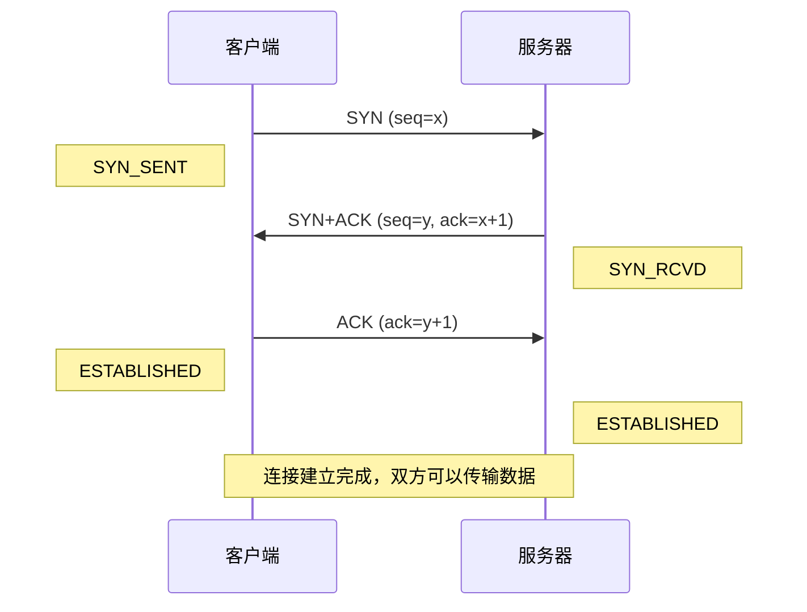
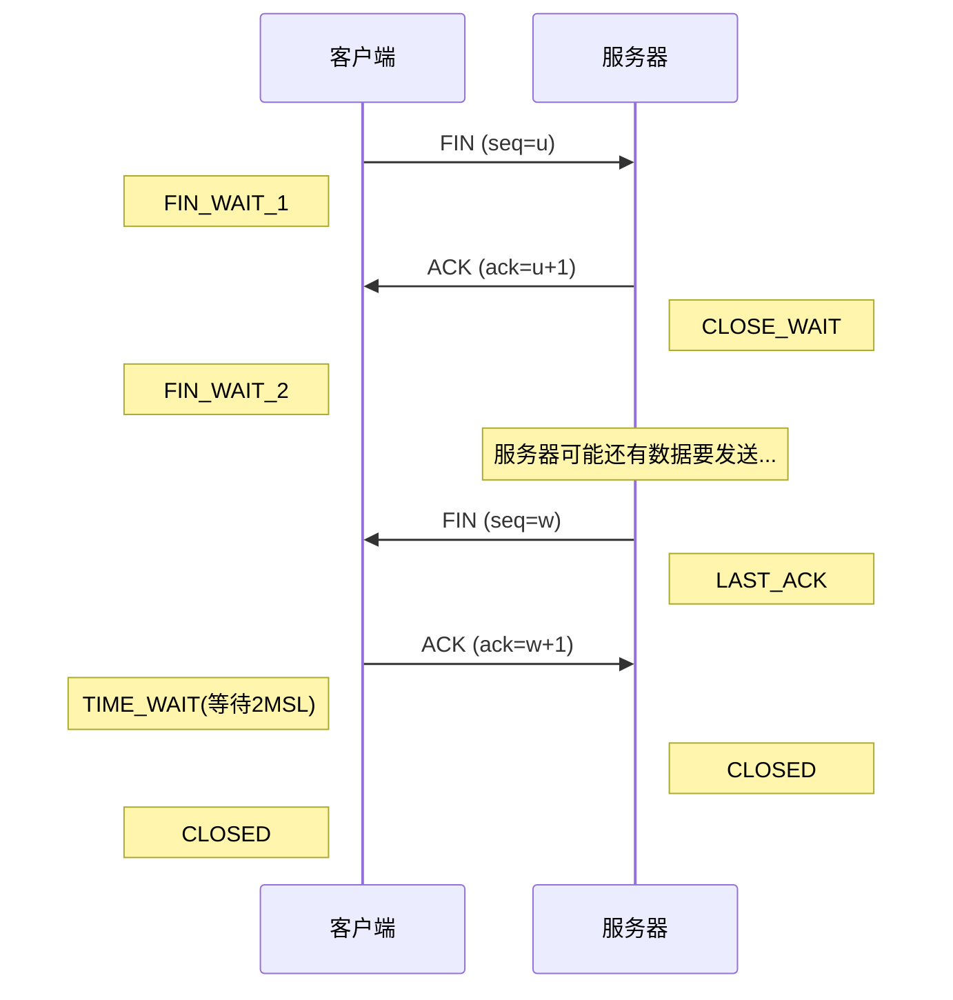
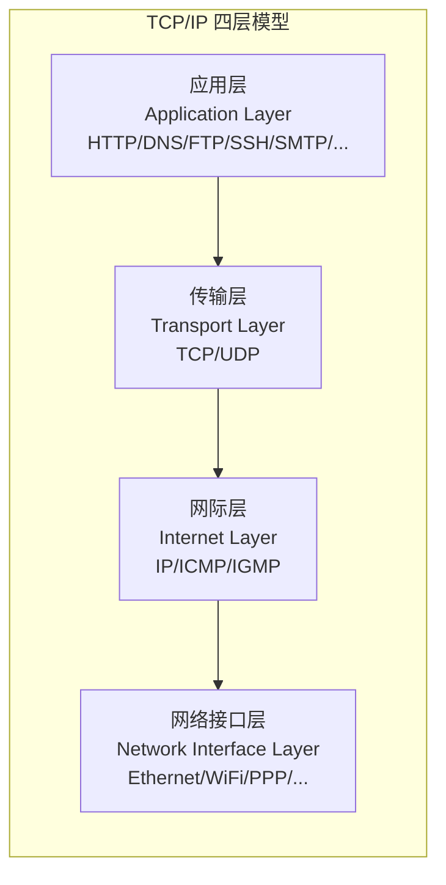
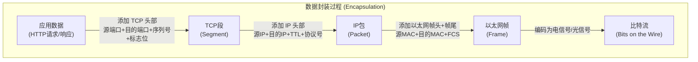
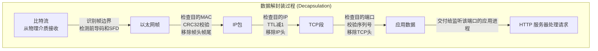

## 一、网络分层模型

### 1.1 为什么需要网络分层

#### 1.1.1 网络通信的本质复杂性

一次看似简单的网页访问，背后涉及数十个技术环节。浏览器构造一个 HTTP 请求，操作系统将其封装为 TCP 段，网卡将数据转为电信号或光信号，路由器根据 IP 地址转发数据包，交换机根据 MAC 地址在局域网内投递帧……如果没有清晰的分工机制，整个系统的复杂度将呈指数级增长，任何厂商都无法独立开发和维护。

分层的本质是**关注点分离（Separation of Concerns）**——这是软件工程中最核心的设计原则之一。每一层只需要理解本层的职责，通过定义好的接口与相邻层交互，无需了解其他层的实现细节。正如一个 Web 开发者可以专注于 HTTP 接口设计，完全不需要知道以太网帧的比特编码方式。

用一个生活化的类比来理解分层：寄一封国际信件。你（应用层）写好信的内容，装进信封写上地址；邮局（传输层）盖上邮戳、分拣归类；运输公司（网络层）选择航线和中转站；机场/港口（数据链路层）打包成集装箱；卡车/飞机（物理层）完成实际运输。每一层只关心自己的任务，不需要知道其他层如何运作——你不需要知道信件是走海运还是空运，邮局也不需要知道你信里写了什么。

#### 1.1.2 分层架构的四重价值

**降低系统复杂性。** 将庞大的网络通信问题分解为若干个更小的、可管理的子问题。每一层解决一个特定维度的问题，降低了单个模块的设计和实现难度。没有分层，一个网络工程师需要同时处理信号编码、帧校验、路由选择、拥塞控制和应用协议——这是任何个人或团队都无法承受的。

**促进标准化与互操作性。** 分层使得不同厂商可以独立开发某一层的实现。思科可以造路由器（网络层），华为可以造交换机（数据链路层），Apache 可以开发 Web 服务器（应用层），它们通过标准接口无缝协作。这种解耦是互联网能由全球数千家厂商共同构建的基础。以太网帧格式标准（IEEE 802.3）定义了数据链路层的接口，任何厂商只要遵守这个标准，其网卡就能与任何交换机互通——无论内部实现如何不同。

**便于故障定位与调试。** 当网络不通时，按层排查是最高效的诊断方法：物理层（网线插了吗？）→ 数据链路层（ARP 能通吗？）→ 网络层（ping 能通吗？）→ 传输层（端口开放吗？）→ 应用层（HTTP 返回正常吗？）。每一层的问题都有对应的症状特征，这正是软件工程中分层调试法的理论基础。一个经验丰富的工程师可以在 30 秒内通过 3 条命令定位问题出在哪一层，而一个没有分层思维的初学者可能花几个小时在错误的层面排查。

**支持独立演进与技术替换。** IPv4 到 IPv6 的迁移只需要修改网络层，上层应用无需重写。HTTP/1.1 到 HTTP/2 的升级只影响应用层，底层 TCP/IP 完全不变。这种可替换性是大型系统长期维护的关键。如果没有分层，每一次底层技术升级都可能引发全栈连锁改动，系统的维护成本将不可持续。

#### 1.1.3 软件工程师为什么必须理解分层

对软件工程师而言，网络分层不只是网络工程师的知识，而是日常开发的基础能力：

- **性能优化定位。** 当系统出现网络性能问题时，分层思维能帮助你快速定位瓶颈在哪一层——是物理带宽不足（物理层），ARP 表溢出（链路层），路由绕行（网络层），TCP 拥塞控制不当（传输层），还是应用层协议设计低效（应用层）。
- **架构设计决策。** 微服务间的通信选择 REST（应用层 HTTP）还是 gRPC（基于 HTTP/2），消息队列选择 TCP 还是 UDP，负载均衡器工作在哪一层（L4 vs L7）——这些架构决策都建立在对分层模型的理解之上。
- **协议设计能力。** 如果你需要设计自定义应用层协议或选择传输方式，必须理解各层提供的服务和约束条件。
- **安全防御纵深。** 不同层级对应不同的攻击面和防御手段。物理层有电磁泄漏和线缆窃听，链路层有 ARP 欺骗和 MAC 泛洪，网络层有 IP 欺骗和路由劫持，传输层有 SYN 洪泛和中间人攻击，应用层有 SQL 注入和 XSS。理解分层才能构建纵深防御体系。

---

### 1.2 OSI 七层参考模型

#### 1.2.1 OSI 模型的历史背景

1977 年，国际标准化组织（ISO）开始制定 OSI（Open Systems Interconnection，开放系统互连）参考模型，1984 年正式发布为 ISO 7498 标准。其目标是为网络通信提供一个通用的理论框架，使任何两个系统只要遵循这个框架就能实现互通。

OSI 模型的诞生背景是 1970-80 年代的"协议大战"。当时各大计算机厂商（IBM 的 SNA、DEC 的 DECnet、Apple 的 AppleTalk）各自为政，网络协议互不兼容。ISO 试图通过制定统一标准来打破这种割据局面。然而讽刺的是，OSI 标准虽然理论上更完备，但在市场竞争中输给了更早出现、更经实践检验的 TCP/IP。这段历史告诉我们：**好的标准不一定是赢家，先到先得的生态优势往往更决定性。**

需要强调的是：OSI 是一个**参考模型（Reference Model）**，用于描述和理解网络通信的逻辑层次，并非实际部署的协议栈。互联网实际使用的是 TCP/IP 协议栈。但 OSI 的七层划分因其清晰性和完备性，已成为网络教育和行业交流的事实标准语言。在实际工作中，当有人说"这是 L7 负载均衡"或"这个攻击发生在 L2"时，他们引用的就是 OSI 模型的层编号。

#### 1.2.2 七层全景总览

```mermaid
graph TD
    subgraph OSI["OSI 七层模型全景"]
        L7["Layer 7 · 应用层<br/>Application Layer<br/>HTTP · DNS · SMTP · FTP · SSH · DHCP"]
        L6["Layer 6 · 表示层<br/>Presentation Layer<br/>SSL/TLS · JPEG · ASCII/UTF-8 · GZIP"]
        L5["Layer 5 · 会话层<br/>Session Layer<br/>NetBIOS · RPC · SIP · WebSocket"]
        L4["Layer 4 · 传输层<br/>Transport Layer<br/>TCP · UDP · SCTP · QUIC"]
        L3["Layer 3 · 网络层<br/>Network Layer<br/>IP · ICMP · IGMP · OSPF · BGP"]
        L2["Layer 2 · 数据链路层<br/>Data Link Layer<br/>Ethernet · ARP · PPP · VLAN"]
        L1["Layer 1 · 物理层<br/>Physical Layer<br/>RJ45 · 光纤 · WiFi · 蓝牙"]
    end

    L7 --> L6 --> L5 --> L4 --> L3 --> L2 --> L1

    style L7 fill:#ffcdd2,stroke:#e53935,stroke-width:2px
    style L6 fill:#ffe0b2,stroke:#ff9800,stroke-width:2px
    style L5 fill:#fff9c4,stroke:#fdd835,stroke-width:2px
    style L4 fill:#dcedc8,stroke:#8bc34a,stroke-width:2px
    style L3 fill:#c8e6c9,stroke:#43a047,stroke-width:2px
    style L2 fill:#bbdefb,stroke:#1976d2,stroke-width:2px
    style L1 fill:#e1bee7,stroke:#8e24aa,stroke-width:2px
```



每层都有自己的**协议数据单元（PDU, Protocol Data Unit）**——这是理解分层模型的关键概念：

| 层级 | 名称 | PDU | 寻址方式 | 核心功能 |
|------|------|-----|----------|----------|
| 第7层 | 应用层 | 数据（Data） | 应用标识（URL/域名） | 为应用程序提供网络服务接口 |
| 第6层 | 表示层 | 数据（Data） | — | 数据格式转换、加密解密、压缩解压 |
| 第5层 | 会话层 | 数据（Data） | 会话ID | 会话建立、维护、同步与终止 |
| 第4层 | 传输层 | 段（Segment）/数据报（Datagram） | 端口号（0-65535） | 端到端可靠或高效的数据传输 |
| 第3层 | 网络层 | 包（Packet） | IP地址 | 路由选择、跨网络数据转发 |
| 第2层 | 数据链路层 | 帧（Frame） | MAC地址（48bit） | 相邻节点间的可靠帧传输 |
| 第1层 | 物理层 | 比特（Bit） | — | 比特流在物理介质上的传输 |

**PDU 命名规则的记忆技巧：** 从上往下——数据(Data) → 段(Segment) → 包(Packet) → 帧(Frame) → 比特(Bit)，可以记作"**D**ata **S**egments **P**assing **F**rames **B**y"。每一层的 PDU 名称直接反映了该层对数据的处理方式：传输层将数据"切割"成段，网络层将段"打包"成包，链路层将包"装框"成帧。

#### 1.2.3 各层详解

**第一层：物理层（Physical Layer）**

物理层是整个网络的"地基"，负责在物理介质上传输原始比特流——0 和 1 的电信号、光信号或无线电波。物理层定义的核心标准包括四个维度：

- **电气特性** —— 电压范围、阻抗、信号编码方式。例如 RS-232 标准规定逻辑 1 为 -3V 至 -15V，逻辑 0 为 +3V 至 +15V；以太网使用曼彻斯特编码，每个比特周期中间都有一次信号跳变，接收方通过跳变方向区分 0 和 1。
- **机械特性** —— 接口形状、引脚数量和排列。RJ-45 接口有 8 个引脚，USB Type-C 有 24 个引脚，光纤 LC 接口有两个纤芯。
- **功能特性** —— 每个引脚的功能定义。例如以太网 Cat5e 双绞线中，1/2 引脚用于发送（TX+/-），3/6 引脚用于接收（RX+/-），4/5 和 7/8 在百兆以太网中未使用。
- **规程特性** —— 信号的时序关系。例如 WiFi 的 CSMA/CA（载波侦听多路访问/冲突避免）机制规定了设备何时可以发送数据、何时必须等待。

常见的物理层设备和传输介质：

| 介质类型 | 传输速率（典型） | 传输距离 | 适用场景 |
|----------|----------------|----------|----------|
| Cat5e 双绞线 | 1 Gbps | 100m | 企业局域网、家庭网络 |
| Cat6a 双绞线 | 10 Gbps | 100m | 数据中心、高性能局域网 |
| 单模光纤 | 100 Gbps+ | 10-100km | 城域网、广域网骨干 |
| 多模光纤 | 10-40 Gbps | 2-500m | 数据中心内部互联 |
| WiFi 6 (802.11ax) | 9.6 Gbps（理论） | 30-50m | 无线局域网 |
| 5G NR | 20 Gbps（理论） | 数百米-数公里 | 移动通信、物联网 |

**第二层：数据链路层（Data Link Layer）**

数据链路层在两个直接相连的网络节点之间提供可靠的数据传输。如果说物理层负责"传输比特"，数据链路层则负责"将比特组织成有意义的帧"。它完成三个核心任务：

1. **成帧（Framing）** —— 将比特流划分为有明确边界的帧。以太网使用前导码（Preamble，7 字节的 10101010 模式）和帧起始定界符（SFD，1 字节的 10101011）标记帧的开始，接收方通过检测 SFD 的最后两位来确定帧的起始位置。

2. **差错检测** —— 通过 CRC32 校验检测传输中的比特错误。以太网帧尾部的帧校验序列（FCS，4 字节）是发送方对整个帧内容计算的循环冗余校验值。如果接收方计算的 CRC 与 FCS 不匹配，帧被直接丢弃且不通知发送方（数据链路层不负责重传）。这个设计体现了分层的核心思想——将重传职责交给更高层（传输层 TCP），避免在链路层引入不必要的复杂性。

3. **介质访问控制** —— 当多个设备共享同一物理介质时，决定谁有权发送。半双工以太网使用 CSMA/CD（载波侦听多路访问/冲突检测），WiFi 使用 CSMA/CA（冲突避免），全双工交换式以太网通过点对点链路消除了冲突问题。

数据链路层进一步分为两个子层：
- **LLC（逻辑链路控制，IEEE 802.2）** —— 负责多路复用（在同一物理链路上承载多种网络层协议）和差错通知。
- **MAC（媒体访问控制）** —— IEEE 802.3（以太网）/ 802.11（WiFi），负责物理寻址和介质访问控制。

**以太网帧结构详解：**

```text
┌──────────┬───────────┬──────────┬──────────┬─────────────────┬──────┐
│  前导码   │ 目的MAC    │ 源MAC    │ 类型/长度 │    数据+填充     │ FCS  │
│  8 字节   │  6 字节    │  6 字节   │  2 字节  │  46-1500 字节   │ 4 字节│
└──────────┴───────────┴──────────┴──────────┴─────────────────┴──────┘
     │           │          │         │              │            │
     │           │          │         │              │            └─ CRC32校验
     │           │          │         │              └─ 有效载荷(上层协议数据)
     │           │          │         └─ 0x0800=IP, 0x0806=ARP, 0x86DD=IPv6
     │           │          └─ 发送方的物理地址
     │           └─ 接收方的物理地址(广播帧为 ff:ff:ff:ff:ff:ff)
     └─ 前7字节0xAA + 1字节0xAB(SFD)
```

**MTU（最大传输单元）** 是一个关键参数：以太网的 MTU 通常为 1500 字节，这意味着一个以太网帧中数据+填充部分的最大长度为 1500 字节。当上层协议的数据超过这个限制时，需要在网络层进行分片（IP fragmentation）。巨型帧（Jumbo Frame）将 MTU 扩展到 9000 字节，常用于数据中心内部以减少帧处理开销。

MTU 1500 这个数字并非随意设定——它是在帧处理延迟、网络利用率和误码率之间权衡的结果。帧越大，有效载荷比例越高（头部开销被摊薄），但单帧传输时间越长，一旦出错需要重传的数据量也越大。在高可靠、低延迟的局域网环境中，9000 字节的巨型帧能显著提升吞吐量；但在广域网中，由于误码率较高，1500 字节仍是更安全的选择。

常见的数据链路层协议和设备：

| 协议 | 标准 | 典型速率 | 应用场景 |
|------|------|----------|----------|
| 以太网（IEEE 802.3） | 802.3ae (10GbE) | 10M-400Gbps | 有线局域网 |
| WiFi（IEEE 802.11） | 802.11ax (WiFi 6) | 最高9.6Gbps | 无线局域网 |
| PPP（点对点协议） | RFC 1661 | 取决于物理层 | 拨号、串行链路 |
| VLAN（IEEE 802.1Q） | 802.1Q | — | 逻辑网络隔离 |

**第三层：网络层（Network Layer）**

网络层的核心任务是将数据从源主机跨越**多个网络**送达目的主机，即"路由转发"。如果说数据链路层是"从一个房间走到隔壁房间"（同一局域网内的单跳传输），网络层就是"从一栋楼走到城市的另一栋楼"（跨越多个路由器的多跳传输）。

核心协议：

- **IP（Internet Protocol）** —— 互联网的基础协议。IPv4 使用 32 位地址（约 43 亿个地址，通过 NAT 技术缓解了地址枯竭问题），IPv6 使用 128 位地址（约 3.4×10³⁸ 个地址，从根本上解决了地址空间不足的问题）。IP 协议提供的是"尽力而为"（Best-Effort）的无连接传输，不保证可靠性、不保证顺序、不保证不重复——这些保障由上层协议（如 TCP）负责。这个设计选择是 TCP/IP 成功的关键之一：让网络层保持最大简单性，将复杂性推给端系统（end-to-end principle）。

- **ICMP（Internet Control Message Protocol）** —— 网络诊断和差错报告协议。`ping` 命令使用 ICMP Echo Request/Reply 测试连通性和往返时间，`traceroute`/`tracert` 利用 ICMP Time Exceeded（TTL 过期）或 UDP 端口不可达来发现路径上的每一跳路由器。

- **路由协议** —— 决定数据包从源到目的应该走哪条路径。分为两大类：
  - **IGP（内部网关协议）** —— 在同一自治系统（AS）内部使用。OSPF（开放最短路径优先）基于链路状态算法，收敛速度快，是目前最广泛使用的 IGP；EIGRP（增强内部网关路由协议）是思科的私有协议，使用弥散更新算法（DUAL）。
  - **EGP（外部网关协议）** —— 在不同自治系统之间使用。BGP（边界网关协议）是互联网骨干网的核心路由协议，它本质上是一个路径矢量协议，通过 AS_PATH 属性避免环路。2021 年 Facebook 大规模宕机事件就是一起 BGP 配置错误导致路由被撤销的经典案例——一个边界路由器的错误配置在 6 分钟内导致 Facebook 的所有域名从全球 BGP 路由表中消失。

**IP 地址与子网划分的关键概念：**

```text
IP 地址结构（以 IPv4 为例）:
┌────────────────────────────────────┬──────────────────┐
│         网络部分 (Network)          │   主机部分 (Host)  │
├────────────────────────────────────┼──────────────────┤
│ 192      . 168    . 1      . 0     │    . 0-255       │
│ 24位网络前缀                        │    8位主机号      │
└────────────────────────────────────┴──────────────────┘

子网掩码: 255.255.255.0 (/24)
含义: 前24位是网络号, 后8位是主机号
同一子网内的主机可以直接通信(通过数据链路层)
不同子网间的通信需要经过路由器(网络层转发)
```

**第四层：传输层（Transport Layer）**

传输层提供**进程到进程**的通信服务（而非主机到主机——那是网络层的职责）。通过端口号机制，同一台主机上可以同时运行多个网络应用而互不干扰。一个完整的网络连接由**五元组**唯一标识：（源 IP, 源端口, 目的 IP, 目的端口, 协议号）。

两种核心协议的对比：

| 特性 | TCP | UDP |
|------|-----|-----|
| 连接方式 | 面向连接（三次握手） | 无连接 |
| 可靠性 | 可靠（确认/重传/排序） | 不可靠（尽力交付） |
| 流量控制 | 滑动窗口机制 | 无 |
| 拥塞控制 | 慢启动/拥塞避免/快重传/快恢复 | 无（但应用层可自行实现） |
| 首部大小 | 20-60 字节 | 8 字节 |
| 传输效率 | 较低（头部开销大，确认机制消耗带宽） | 高（头部开销小，无确认等待） |
| 典型应用 | HTTP/HTTPS、SSH、FTP、SMTP、数据库 | DNS查询、DHCP、视频流、VoIP、游戏、IoT |

**TCP 三次握手过程：**



三次握手的核心意义在于**同步双方的初始序列号（ISN）**并确认双方的发送和接收能力。现代系统使用基于时间的随机化算法生成 ISN，防止序列号预测攻击。三次而非两次的原因：如果只有两次握手，服务器无法确认客户端已收到自己的 SYN+ACK，一旦旧的 SYN 包延迟到达服务器，会导致服务器错误地建立连接并分配资源（SYN 洪泛攻击的基础）。

**TCP 四次挥手过程：**



四次挥手需要四次而非三次，是因为 TCP 是全双工通信——每个方向的关闭需要独立确认。当客户端发送 FIN 时，只表示客户端不再发送数据，但服务器可能还有数据要发给客户端。服务器发完剩余数据后才发送自己的 FIN。最后客户端进入 **TIME_WAIT** 状态等待 2MSL（最大段生存时间的两倍），确保最后的 ACK 能到达服务器，同时防止旧连接的延迟数据包干扰新连接。Linux 系统中 TIME_WAIT 默认持续 60 秒，在高并发服务器上这可能导致端口耗尽，常见的调优手段包括启用 `tcp_tw_reuse` 和缩短 `tcp_fin_timeout`。

**端口号的分类与常见服务：**

| 端口范围 | 类别 | 说明 | 示例 |
|----------|------|------|------|
| 0-1023 | 知名端口（Well-Known） | 需要 root 权限绑定的标准服务 | HTTP(80), HTTPS(443), SSH(22), DNS(53), SMTP(25) |
| 1024-49151 | 注册端口（Registered） | 由 IANA 分配给特定应用 | MySQL(3306), PostgreSQL(5432), Redis(6379), MongoDB(27017) |
| 49152-65535 | 动态/私有端口（Ephemeral） | 操作系统自动分配给客户端临时连接 | `ss -tlnp` 可查看当前使用情况 |

**第五层：会话层（Session Layer）**

会话层管理通信会话的生命周期，包括会话建立、同步、检查点和终止。

核心概念：
- **对话控制** —— 决定通信是全双工（同时双向）、半双工（交替双向）还是单工（单向）。
- **会话恢复** —— 在通信中断后从最近的检查点恢复，而不是从头开始。这在大文件传输中尤其重要，可以避免因网络闪断导致大量已传输数据作废。

在实际的 TCP/IP 协议栈中，会话层的功能通常被合并到传输层或应用层中。例如 TCP 的连接管理实际上承担了部分会话层职责，而 HTTP 的 Cookie/Token 机制是应用层实现的会话管理。NetBIOS、RPC（远程过程调用）、SIP（会话初始协议）、WebSocket 是较为典型的会话层协议。

理解会话层在现代架构中的映射尤为重要：

- **gRPC 的 Stream 模式** 就是典型的会话层实现——它在 HTTP/2 之上维护一个长生命周期的双向流，支持服务端推送、客户端流和双向流三种模式。底层 TCP 连接可以被多路复用，但 gRPC 自身管理着逻辑上的会话状态。
- **WebSocket** 在 HTTP 升级握手后建立全双工通信会话，本质上是应用层实现的会话层功能——服务器和客户端共享一个有状态的通信通道，直到任一方显式关闭。
- **数据库连接池** 管理的也是会话层资源——每个连接携带认证状态、事务上下文和游标位置，连接断开意味着会话丢失。

**第六层：表示层（Presentation Layer）**

表示层解决"数据如何表示"的问题，确保发送方和接收方对数据的解读方式一致。三大核心功能：

1. **数据格式转换** —— 不同系统可能使用不同的字节序（大端/小端）、字符编码（ASCII/UTF-8/UTF-16/EBCDIC）。表示层负责在传输前统一转换为网络字节序（大端，Big-Endian）。例如 Java 的 `DataOutputStream` 就提供了 `writeInt()` 等方法来处理网络字节序转换。一个经典案例：1999 年 NASA 的火星气候探测器（Mars Climate Orbiter）坠毁，原因就是一个子系统使用英制单位（磅·秒），另一个使用公制单位（牛顿·秒），本质上就是数据表示层的转换失败——价值 1.25 亿美元的教训。

2. **数据加密/解密** —— SSL/TLS 协议工作在表示层（尽管在 TCP/IP 模型中通常归入应用层）。HTTPS 就是在 HTTP 和 TCP 之间插入了 TLS 层，为应用数据提供机密性、完整性和身份验证。TLS 1.3 简化了握手流程，将往返次数从 2-RTT 减少到 1-RTT（甚至支持 0-RTT 恢复），同时废弃了不安全的算法（如 RC4、3DES），只保留 AES-GCM 和 ChaCha20-Poly1305 等现代加密方案。

3. **数据压缩/解压缩** —— 减少传输数据量，节省带宽。HTTP 的 `Content-Encoding: gzip`（或 brotli）就是表示层功能的典型应用。Brotli 相比 gzip 在 HTML/CSS/JS 等文本内容上可额外节省 15-25% 的传输体积，但压缩和解压的 CPU 开销略高，需要在带宽节省和计算成本之间权衡。

**第七层：应用层（Application Layer）**

应用层是与用户最近的一层，直接为应用程序提供网络服务。这是协议种类最多、变化最快的一层。

核心协议分类：

| 协议 | 端口 | 用途 | 传输方式 | 备注 |
|------|------|------|----------|------|
| HTTP/HTTPS | 80/443 | Web 服务 | TCP | HTTP/3 基于 QUIC（UDP） |
| DNS | 53 | 域名解析 | UDP（查询）/ TCP（区域传输） | 支持 DNS over HTTPS (DoH) |
| SMTP/POP3/IMAP | 25/110/143 | 邮件收发 | TCP | SMTP 提交，POP3/IMAP 拉取 |
| FTP | 20/21 | 文件传输 | TCP（控制21+数据20） | 已逐渐被 SFTP/SCP 取代 |
| SSH | 22 | 安全远程管理 | TCP | 替代了明文的 Telnet(23) |
| DHCP | 67/68 | 动态IP分配 | UDP | 客户端68，服务器67 |
| SNMP | 161/162 | 网络管理 | UDP | v3 版本支持认证和加密 |
| gRPC | 自定义 | 高性能RPC | HTTP/2 (TCP) | 基于 Protocol Buffers 序列化 |
| WebSocket | 80/443 | 全双工实时通信 | TCP | 从 HTTP 协议升级而来 |

---

### 1.3 TCP/IP 四层模型

#### 1.3.1 从 OSI 到 TCP/IP 的演进

OSI 模型虽然理论完备，但在实际工程中显得过于复杂。两个关键原因导致了 TCP/IP 的胜出：

1. **时机** —— TCP/IP 在 1970 年代末随 ARPANET 发展就已成型并在实践中不断迭代，而 OSI 标准直到 1984 年才发布。等到 OSI 标准时，TCP/IP 已经拥有庞大的用户基础和成熟的实现。

2. **哲学差异** —— OSI 采用"先定义标准，再实现"的自上而下方式；TCP/IP 采用"先实现，再标准化"的自下而上方式。后者更符合工程实践的迭代规律。

TCP/IP 最初被称为**DoD 模型（Department of Defense Model）**，因为其核心协议由美国国防部高级研究计划局（DARPA）资助开发。1973 年，Vint Cerf 和 Bob Kahn 开始设计 TCP 协议（最初 TCP 同时处理传输和路由功能，后来才拆分为 TCP + IP），1974 年发表论文《A Protocol for Packet Network Intercommunication》，奠定了现代互联网的理论基础。DoD 模型最初的四层是：进程层（Process）、主机层（Host-to-Host）、互联网层（Internet）和网络访问层（Network Access），后来演变为我们今天看到的 TCP/IP 四层模型。

最终结果是：互联网从诞生起就使用 TCP/IP 协议栈，它的分层更简洁、更实用，直接成为了互联网的"操作系统"。

#### 1.3.2 TCP/IP 四层模型详解



**网络接口层（Network Interface Layer）** —— 对应 OSI 的数据链路层+物理层。TCP/IP 不严格区分这两层，只定义了一个网络接入接口，将具体的数据链路实现和物理传输交给底层的网络硬件驱动来处理。这种务实的设计反映了 TCP/IP 的工程导向——上层不需要关心底层是光纤还是铜缆。

**网际层（Internet Layer）** —— 对应 OSI 的网络层。TCP/IP 将 IP 协议置于绝对核心地位：所有上层协议的数据都封装在 IP 数据报中传输，这就是"网际"（Internet）的含义——将不同类型的网络互连在一起。IP 协议的"尽力而为"设计哲学将可靠性保证推给了上层，使得网络层本身保持了最大的简单性和效率。这正是互联网成功的核心设计决策之一：在网络核心保持简单（IP 只负责尽力转发），在端系统保持智能（TCP 负责可靠传输），避免了在网络中间节点引入复杂状态。

**传输层（Transport Layer）** —— 与 OSI 的传输层基本一致，提供端到端的通信服务。TCP/IP 在这一层有两个标志性的协议：TCP（可靠的、面向连接的、字节流传输）和 UDP（不可靠的、无连接的、数据报传输）。

**应用层（Application Layer）** —— 对应 OSI 的应用层+表示层+会话层。TCP/IP 将 OSI 上三层的职责全部合并到应用层中，由具体的应用层协议自行决定是否需要会话管理、数据格式转换或加密。

#### 1.3.3 OSI 与 TCP/IP 的对应关系

| TCP/IP 层 | 对应 OSI 层 | 关键差异 |
|-----------|------------|----------|
| 应用层 | 应用层 + 表示层 + 会话层 | TCP/IP 的应用层承担了 OSI 上三层的全部职责 |
| 传输层 | 传输层 | 基本一致 |
| 网际层 | 网络层 | 基本一致，TCP/IP 强调 IP 协议的中心地位 |
| 网络接口层 | 数据链路层 + 物理层 | TCP/IP 不严格区分这两层，只定义一个网络接入接口 |

为什么 TCP/IP 没有独立的表示层和会话层？因为在实际实现中，数据格式转换（SSL/TLS、gzip、JSON 序列化）和会话管理（Cookie、JWT Token、WebSocket）都被集成到了应用层协议中。HTTP 协议本身同时处理了会话状态（Cookie）、数据格式（Content-Type）和安全传输（HTTPS），这正是 TCP/IP 实用主义哲学的体现。

#### 1.3.4 实际分析为什么首选 TCP/IP 模型

三个原因使 TCP/IP 模型成为实际工程分析的首选：

1. **互联网就是用 TCP/IP 构建的** —— 所有实际部署的协议（HTTP、TCP、IP、Ethernet）都对应 TCP/IP 模型的层。用 OSI 模型分析实际网络时，会话层和表示层经常空缺，反而造成困惑。

2. **工具映射更自然** —— 抓包工具（Wireshark）的协议分层就是 TCP/IP 的方式。防火墙规则按 TCP/IP 层定义：网络层 ACL（IP 白名单）、传输层 ACL（端口限制）、应用层 WAF（HTTP 规则）。

3. **性能分析更直观** —— 当你在排查网络性能问题时，瓶颈定位直接映射到 TCP/IP 层：带宽问题（网络接口层）、路由延迟（网际层）、TCP 重传/拥塞（传输层）、应用协议效率（应用层）。

---

### 1.4 数据封装与解封装

#### 1.4.1 封装过程

数据从应用层到物理层的传输过程中，每一层都会添加自己的头部信息（有时还有尾部），这个过程称为**封装（Encapsulation）**。就像你写了一封信（应用数据），放进信封（TCP 头），信封装进邮包（IP 头），邮包放进集装箱（以太网帧头帧尾）——每一层包装都携带了该层的控制信息。



每一层添加的具体头部信息：

| 层级 | 添加的头部字段 | 关键信息 | 头部大小 |
|------|--------------|----------|----------|
| 应用层 | HTTP/DNS/SMTP 头部 | 请求方法、URL、Host、Content-Type 等 | 变长 |
| 传输层 | TCP 头部 / UDP 头部 | 源端口、目的端口、序列号、确认号、标志位 | TCP: 20-60字节；UDP: 8字节 |
| 网络层 | IP 头部 | 源IP、目的IP、TTL、协议号、头部校验和 | IPv4: 20-60字节；IPv6: 40字节固定 |
| 数据链路层 | 以太网帧头 + 帧尾 | 源MAC、目的MAC、类型字段、FCS | 14字节头 + 4字节尾 |

**一个实际的 HTTP GET 请求封装示例：**

```text
应用层数据:
  GET /index.html HTTP/1.1\r\n
  Host: example.com\r\n
  User-Agent: Mozilla/5.0\r\n
  Accept: text/html\r\n
  \r\n

         ↓ 添加 TCP 头部 (20字节)
传输层段:
  [源端口:49152][目的端口:80][序列号:12345678][确认号:0]
  [数据偏移:5][标志:SYN][窗口:65535][校验和:0xABCD]
  + 应用数据

         ↓ 添加 IP 头部 (20字节)
网络层包:
  [版本:4][头部长度:5][TTL:64][协议:6(TCP)]
  [源IP:192.168.1.100][目的IP:93.184.216.34]
  [头部校验和:0x1234]
  + TCP段

         ↓ 添加以太网帧头(14字节) + 帧尾(4字节)
数据链路层帧:
  [目的MAC:aa:bb:cc:dd:ee:ff][源MAC:11:22:33:44:55:66]
  [类型:0x0800(IPv4)]
  + IP包
  [FCS:0xABCD1234]
```

**一个关键数字：** 一个 HTTP GET 请求通常只有几百字节的应用数据，但加上 TCP 头（20 字节）+ IP 头（20 字节）+ 以太网头尾（18 字节），协议头部开销至少 58 字节。当传输大量小数据包时，这个头部开销比例会非常显著，这也是 HTTP/2 的头部压缩（HPACK）和 HTTP/3 的 QUIC 协议优化的重要原因之一。

**Wireshark 实际抓包验证：** 用 Wireshark 抓取一个真实的 HTTP 请求，可以直观看到每一层的封装结构。下面是一个通过 `tshark`（Wireshark 的命令行版本）获取的示例输出：

```bash
# 抓取 HTTP 请求并显示分层信息
tshark -i eth0 -f "tcp port 80" -V -c 1 2>/dev/null | head -40
```

实际输出中会清晰展示：
- **Frame 层**（物理层抽象）：捕获长度、到达时间、帧编号
- **Ethernet II 层**（数据链路层）：目的 MAC、源 MAC、类型 0x0800
- **Internet Protocol Version 4 层**（网络层）：源 IP、目的 IP、TTL、协议号 6
- **Transmission Control Protocol 层**（传输层）：源端口、目的端口、序列号、标志位
- **Hypertext Transfer Protocol 层**（应用层）：GET 请求、Host 头、User-Agent 等

这种分层展示方式正是 TCP/IP 模型的直观体现——每一层的协议头部被依次解析和展示，从物理帧到应用数据，层层剥离。

#### 1.4.2 解封装过程

接收端的处理恰好相反：每层读取并移除对应头部，将有效载荷向上传递。这个过程称为**解封装（Decapsulation）**。



解封装过程中的每一层都有关键的安全检查点：

| 层级 | 检查项 | 失败处理 |
|------|--------|----------|
| 数据链路层 | 目的 MAC 是否是本机？FCS 校验是否通过？ | MAC 不匹配则丢弃；CRC 失败则丢弃（静默，不通知发送方） |
| 网络层 | 目的 IP 是否是本机/广播/多播？TTL 是否 > 0？IP 头校验和是否正确？ | TTL 过期则发送 ICMP Time Exceeded；其他错误则丢弃 |
| 传输层 | 目的端口是否有进程在监听？TCP 序列号是否在接收窗口内？ | 无监听进程则发送 RST（TCP）或 ICMP Port Unreachable（UDP） |
| 应用层 | 请求格式是否正确？是否通过认证授权？ | 返回 HTTP 4xx/5xx 错误响应 |

**一个容易被忽略的细节：** 解封装过程中每一层的检查都是独立的，失败的处理方式也各不相同。物理层和链路层的错误通常是静默丢弃（不通知发送方），因为这些层没有"反馈通道"的概念。网络层开始才有 ICMP 作为反馈机制。传输层的 TCP 通过序列号和确认号实现了精细的错误检测和重传。这种"越往上越智能"的设计模式是分层架构的精髓——底层快速简单地过滤明显的错误，高层复杂精确地处理逻辑错误。

---

### 1.5 五层混合模型

#### 1.5.1 教学与工程实践的最佳折中

在实际教学和工程实践中，经常使用一个**五层混合模型**，它结合了 OSI 模型的精细度和 TCP/IP 模型的实用性：

```text
┌──────┬──────────────┬─────────────────┬─────────────────┬──────────┐
│ 层级 │     名称      │    对应 OSI     │   对应 TCP/IP   │   PDU    │
├──────┼──────────────┼─────────────────┼─────────────────┼──────────┤
│ 第5层 │ 应用层       │ 应用+表示+会话  │ 应用层          │ 数据     │
│ 第4层 │ 传输层       │ 传输层          │ 传输层          │ 段/数据报│
│ 第3层 │ 网络层       │ 网络层          │ 网际层          │ 包       │
│ 第2层 │ 数据链路层   │ 数据链路层      │ 网络接口层      │ 帧       │
│ 第1层 │ 物理层       │ 物理层          │ 网络接口层      │ 比特     │
└──────┴──────────────┴─────────────────┴─────────────────┴──────────┘
```

这个五层模型是本书后续分析中使用的参考框架。它保留了物理层和数据链路层的独立性——因为在网络诊断和性能分析中，区分"物理层故障"（线缆断了、信号衰减）和"数据链路层故障"（ARP 解析失败、MAC 地址冲突）是非常必要的。同时将 OSI 的上三层合并为一个应用层——因为实际协议中这三层的界限确实模糊，TCP/IP 模型的合并方式更贴近工程实际。

#### 1.5.2 三种模型的适用场景对比

| 模型 | 最佳适用场景 | 优势 | 局限 |
|------|------------|------|------|
| OSI 七层 | 教学、学术研究、协议标准化讨论 | 层次划分最精细，概念最完备 | 上三层在实际协议中界限模糊，增加认知负担 |
| TCP/IP 四层 | 实际工程分析、网络配置、性能调优 | 与实际部署完全对应，工具映射自然 | 合并物理层和链路层不利于故障定位 |
| 五层混合 | 教学与工程兼顾、网络诊断、架构设计 | 兼顾精细度和实用性 | 非标准模型，学术论文中不常用 |

在实际工作中，绝大多数工程师使用的是 TCP/IP 模型或五层混合模型。OSI 模型主要用于三个场景：（1）面试和考试中的理论问答；（2）行业交流中用层编号快速定位问题（"这个 bug 出在 L4"比"这个 bug 出在传输层"更简洁）；（3）安全领域中描述攻击面和防御层次。

---

### 1.6 分层模型的工程实战意义

#### 1.6.1 性能分析的分层框架

理解分层模型后，可以建立系统化的网络性能分析思维：

| 层级 | 常见性能瓶颈 | 诊断方法 | 优化方向 |
|------|-------------|----------|----------|
| 物理层 | 带宽不足、信号衰减、电磁干扰 | `ethtool eth0` 查看链路速率和错误计数 | 升级物理介质、改善布线环境 |
| 数据链路层 | MAC 表溢出、VLAN 配置不当、双工不匹配 | `tcpdump -i eth0 arp`、交换机日志 | 优化 VLAN 规划、启用流控 |
| 网络层 | 路由绕行、IP 分片、MTU 不匹配 | `traceroute`、`ping -M do -s 1472`（PMTUD） | 优化路由策略、调整 MTU |
| 传输层 | TCP 重传、拥塞窗口过小、连接复用不足 | `ss -ti`（查看 TCP 状态和重传统计）、`netstat -s` | 调整 TCP 参数、启用连接池、升级 HTTP/2 |
| 应用层 | 序列化效率低、请求过多、缺少缓存 | 抓包分析、应用性能监控（APM） | 减少请求次数、使用 CDN、协议优化 |

#### 1.6.2 故障排查的分层方法论

网络故障排查最高效的方法就是**自底向上，逐层验证**。每一层验证通过后，再进入上一层：

```bash
# ========== 第1-2层：物理连通性 ==========
ip link show                  # 网卡是否 UP 状态
ethtool eth0                  # 链路是否连接、速率是否正确
dmesg | grep eth0             # 内核日志中是否有网卡错误

# ========== 第2层：数据链路层 ==========
arp -n                        # ARP 表项是否正常
tcpdump -i eth0 arp -c 5     # 是否能收到 ARP 应答
cat /proc/net/dev             # 查看收发包计数和错误数

# ========== 第3层：网络层 ==========
ip addr show                  # IP 地址是否正确配置
ip route show                 # 路由表是否正确
ping 192.168.1.1              # 能否到达网关（网关不通，外网肯定不通）
ping 8.8.8.8                  # 能否到达公网（DNS 之前先验 IP 连通性）
traceroute 8.8.8.8            # 路径上哪一跳出了问题

# ========== 第4层：传输层 ==========
ss -tlnp                      # 查看本机监听端口和对应进程
nc -zv target 80              # 测试目标端口是否开放
curl -v --connect-timeout 5 http://target/  # TCP 连接是否能建立

# ========== 第5-7层：应用层 ==========
curl -v http://target/        # HTTP 状态码和响应头
nslookup example.com          # DNS 解析是否正常
dig example.com +trace        # DNS 解析的完整链路
```

**排查原则：** 每一步都是在验证特定层的功能。如果 `ping` 不通（网络层问题），去查 HTTP 状态码（应用层）就是浪费时间。如果 DNS 解析失败（应用层问题），去怀疑网线坏了（物理层）同样不合理。分层排查的核心就是：**确认底层正常后，再向上层排查**。

#### 1.6.3 网络设备的分层定位

不同类型的网络设备工作在不同层次，理解这一点对架构设计至关重要：

| 设备类型 | 工作层次 | 转发依据 | 典型延迟 | 应用场景 |
|----------|----------|----------|----------|----------|
| 集线器（Hub） | 物理层 | 无（广播所有端口） | 极低（<1μs） | 已淘汰，仅用于理解概念 |
| 交换机（Switch） | 数据链路层 | MAC 地址表 | 低（<10μs） | 局域网内部互联 |
| 三层交换机 | 网络层 | IP 路由表 + MAC 表 | 低（<50μs） | 大型局域网的 VLAN 间路由 |
| 路由器 | 网络层 | IP 路由表（最长前缀匹配） | 中（50-500μs） | 不同网络间的路由转发 |
| 负载均衡器（L4） | 传输层 | 五元组（IP+端口） | 低 | TCP/UDP 级别的流量分发 |
| 负载均衡器（L7） | 应用层 | HTTP 头/URL/Cookie | 中 | 基于内容的智能路由（Nginx、HAProxy） |
| 防火墙（无状态） | 网络层+传输层 | IP + 端口规则 | 极低 | 基础包过滤 |
| 防火墙（有状态） | 传输层 | TCP 连接状态跟踪 | 低 | 跟踪连接生命周期的智能过滤 |
| WAF | 应用层 | HTTP 内容/行为特征 | 中-高 | Web 应用攻击防护 |

**L4 vs L7 负载均衡**是软件工程师经常需要做的架构决策：
- **L4 负载均衡** —— 工作在传输层，只看 IP 和端口，转发速度快，但无法根据应用层内容（如 URL 路径、HTTP 头）做智能路由。适用于简单的 TCP 流量分发（如数据库读写分离）。L4 的典型代表是 Linux 的 LVS（Linux Virtual Server）和 AWS NLB。
- **L7 负载均衡** —— 工作在应用层，可以解析 HTTP 请求内容，根据 URL 路径、Cookie、Host 头等进行细粒度路由。例如将 `/api/*` 路由到后端 API 服务器，将 `/static/*` 路由到 CDN 源站。Nginx、HAProxy、Envoy 都是 L7 负载均衡器。L7 的代价是更高的延迟（需要解析应用层协议）和更大的内存开销（需要维护完整的 HTTP 会话状态）。

#### 1.6.4 跨层交互：分层不是隔层

分层模型强调层间独立性，但在实际工程中，**跨层交互（Cross-Layer Interaction）** 是优化性能的重要手段：

- **TCP 感知链路层** —— TCP 的拥塞控制算法可以感知底层网络类型。例如在 WiFi 环境下，丢包不一定代表拥塞（可能是无线干扰），因此 TCP-Westwood 等算法会区分拥塞丢包和链路丢包，避免不必要的拥塞窗口收缩。
- **应用层感知传输层** —— QUIC 协议在应用层实现了传输层的功能（可靠传输、拥塞控制），可以绕过操作系统内核的 TCP 实现，获得更灵活的控制权。
- **eBPF 跨层观测** —— eBPF 技术允许在内核的每一层插入观测点，实现跨层的性能分析和故障诊断，打破了传统分层模型中"每层只能看到自己"的限制。

理解跨层交互对于系统级性能优化至关重要——它提醒我们分层是逻辑上的抽象，而非物理上的隔绝。优秀的工程师知道何时遵守分层边界（保持系统可维护性），何时打破分层边界（追求极致性能）。

---

### 1.7 现代协议栈的演进趋势

#### 1.7.1 QUIC 与 HTTP/3：传输层的变革

传统的 HTTP/1.1 和 HTTP/2 都基于 TCP 传输。TCP 虽然可靠，但其"队头阻塞（Head-of-Line Blocking）"问题在多路复用场景下尤为严重——一个 TCP 连接上的一个丢包会阻塞该连接上所有数据的交付。

QUIC（Quick UDP Internet Connections）协议应运而生，它在 UDP 之上实现了可靠传输、流量控制和多路复用，同时将 TLS 1.3 握手集成到连接建立过程中。HTTP/3 直接运行在 QUIC（UDP）之上：

| 特性 | HTTP/1.1 over TCP | HTTP/2 over TCP | HTTP/3 over QUIC |
|------|-------------------|-----------------|-------------------|
| 传输协议 | TCP | TCP | UDP (QUIC) |
| 连接建立 | TCP 三次握手 + TLS 握手 | TCP 三次握手 + TLS 握手 | QUIC 1-RTT（0-RTT 恢复） |
| 多路复用 | 不支持（需要多个连接） | 支持（但存在队头阻塞） | 支持（无队头阻塞） |
| 连接迁移 | 不支持（IP 变化则断开） | 不支持 | 支持（基于 Connection ID） |
| 首次加载延迟 | 高（多轮 RTT） | 中 | 低（1-RTT 甚至 0-RTT） |

QUIC 对移动端用户体验的改善尤其显著：当手机从 WiFi 切换到 4G/5G 时，IP 地址发生变化，TCP 连接必须断开重建，而 QUIC 基于 Connection ID（而非四元组）标识连接，可以无缝迁移。

#### 1.7.2 eBPF：内核态的可编程网络栈

eBPF（extended Berkeley Packet Filter）技术允许在不修改内核源码的情况下，在内核空间运行自定义的网络处理程序。这使得软件工程师可以在不重新编译内核的情况下，对网络栈的每一层进行细粒度的观测和定制。

eBPF 的工作原理：用户态程序用受限的 C/Rust 语言编写网络处理逻辑，经过 eBPF 验证器（Verifier）安全检查后，加载到内核的 JIT（Just-In-Time）编译器中转换为本机代码，在网络数据包处理的关键路径上执行。验证器确保程序不会导致内核崩溃、不会无限循环、不会访问非法内存——这是 eBPF 能安全地在内核态运行用户代码的核心保障。

典型应用场景：
- **网络性能观测** —— Cilium 使用 eBPF 实现高性能的 Kubernetes 网络策略和负载均衡，取代了 iptables。在大规模 Kubernetes 集群中，iptables 的线性规则匹配导致 O(n) 的性能开销，而 eBPF 使用哈希表实现 O(1) 的规则查找，将网络策略的性能提升了一个数量级。
- **安全监控** —— 在内核层面直接监控网络流量，比用户态工具（如 tcpdump）开销更低。Falco 使用 eBPF 检测容器运行时的异常网络行为。
- **自定义协议处理** —— 在内核态实现特殊的网络协议处理逻辑，避免用户态-内核态的数据拷贝开销。Facebook 的 Katran L4 负载均衡器基于 eBPF 实现了百万级的每秒连接处理能力。

#### 1.7.3 用户态网络栈（DPDK/SPDK）

在高性能计算和高频交易等极端场景下，传统的内核网络栈成为了性能瓶颈。DPDK（Data Plane Development Kit）将网络数据包处理从内核态移到用户态，绕过了内核协议栈的多次内存拷贝和上下文切换：

- **传统路径：** 网卡 → DMA → 内核网卡驱动 → 内核协议栈 → Socket 缓冲区 → 用户应用（多次内存拷贝，多次上下文切换）
- **DPDK 路径：** 网卡 → DMA → 用户态轮询驱动 → 用户态协议处理（零拷贝，无上下文切换）

这种技术将网络吞吐量从百万级包/秒提升到千万级甚至亿级包/秒，但代价是失去了内核网络栈的通用性和易用性，属于特定场景的极致优化。DPDK 的典型用户包括电信运营商的 5G 核心网（需要处理海量的用户面数据包）、CDN 边缘节点和高频交易系统。

**io_uring 网络加速**是另一个值得关注的趋势。Linux 的 io_uring 机制通过共享内存环形缓冲区实现了用户态和内核态之间的零拷贝 I/O 操作，减少了系统调用次数。结合 `IORING_OP_SENDMSG` 和 `IORING_OP_RECVMSG`，io_uring 可以显著提升高并发网络应用的吞吐量。与 DPDK 不同，io_uring 仍然使用标准的内核网络栈，因此保留了通用性，适合不需要完全绕过内核但仍追求高性能的场景。

---

### 1.8 常见误区与纠正

**误区一："OSI 模型就是实际使用的协议栈"**

纠正：OSI 是理论参考框架，互联网实际使用 TCP/IP 协议栈。OSI 模型的价值在于提供了一个通用的分析语言和教学框架，而非指导实际协议实现。在实际工作中，你应该用 TCP/IP 模型来思考和分析问题。

**误区二："会话层和表示层没有存在感"**

纠正：这两个层的功能确实被合并到了 TCP/IP 的应用层中，但功能本身仍然存在且至关重要。SSL/TLS（表示层功能）、Cookie/Token/Session（会话层功能）是所有 Web 应用安全的基石。理解这些功能原本属于哪一层，有助于更清晰地分析安全问题。

**误区三："防火墙只工作在网络层"**

纠正：不同类型的防火墙工作在不同层次。无状态包过滤防火墙工作在网络层和传输层，有状态防火墙跟踪 TCP 连接状态（传输层），WAF 工作在应用层，NGFW（下一代防火墙）可以跨多层进行深度检测。选型时必须根据需要防护的层级来选择。

**误区四："物理层安全可以忽略"**

纠正：在云时代似乎物理层不重要，但所有云服务的底层仍然是物理服务器和网络设备。社会工程学攻击的核心就是获取物理访问权限——一个被插入 USB 设备的服务器可以在数秒内被完全控制。物理安全是所有其他安全层的前提。

**误区五："理解分层只是理论学习，对编码没用"**

纠正：分层思维直接影响编码质量。当你设计一个微服务间的 RPC 框架时，你需要选择在哪一层做负载均衡（L4 还是 L7）、在哪一层做服务发现（DNS 层还是应用层）、在哪一层做加密（mTLS 在传输层还是 JWT 在应用层）。不理解分层的开发者做出的架构决策往往会导致性能和安全问题。

**误区六："UDP 不可靠所以不适合重要应用"**

纠正：UDP 的"不可靠"是指它不提供内置的可靠性保证，而非说它不能用于重要应用。许多对延迟敏感的关键应用选择 UDP 作为传输层协议：DNS 是互联网基础设施的核心协议，DHCP 是设备接入网络的必要协议，QUIC 在 UDP 之上实现了完整的可靠性保证。此外，许多实时应用（如视频会议、在线游戏）主动选择 UDP，因为 TCP 的重传机制会引入不可接受的延迟——丢帧比等待重传后再播放更可取。

**误区七："抓包就能解决所有网络问题"**

纠正：抓包是强大的诊断工具，但它有明确的局限性。首先，现代 Web 流量大量使用 HTTPS 加密，未解密的抓包只能看到 TLS 握手信息而看不到实际的应用层数据。其次，抓包会引入额外的延迟和 CPU 开销，在高负载生产环境中可能加剧问题。第三，某些网络问题（如 DNS 缓存过期、路由抖动、间歇性丢包）在短时间抓包中可能无法复现。正确的做法是将抓包作为分层排查流程中的一环，而非万能工具。

---

### 1.9 本节小结

| 要点 | 内容 |
|------|------|
| 分层目的 | 降低复杂性、标准化、便于故障定位、支持独立演进 |
| OSI 七层 | 物理→数据链路→网络→传输→会话→表示→应用 |
| TCP/IP 四层 | 网络接口→网际→传输→应用 |
| 五层混合模型 | 保留 OSI 下两层独立性 + 合并上三层为应用层 |
| 核心差异 | OSI 是理论参考，TCP/IP 是实际使用；OSI 上三层被合并 |
| 封装过程 | 逐层添加头部：数据→段→包→帧→比特 |
| 工程意义 | 性能定位、架构决策、故障排查、协议设计 |
| 演进趋势 | QUIC/HTTP/3、eBPF、用户态网络栈 |

**本节核心思想回顾：** 网络分层是人类管理复杂系统的经典方法——通过关注点分离，将一个不可能由单人完成的复杂问题，分解为多个可以独立设计、实现和维护的子问题。OSI 模型提供了最精细的理论框架，TCP/IP 模型提供了最实用的工程框架，五层混合模型在两者之间找到了最佳平衡。理解分层模型不是为了应付面试，而是为了在面对真实的网络问题时，能够系统化地思考、定位和解决。

理解网络分层模型是软件工程师网络知识体系的第一步。接下来的章节将逐层深入，详细讲解每一层的核心协议、工作原理和工程实践中的关键细节。
