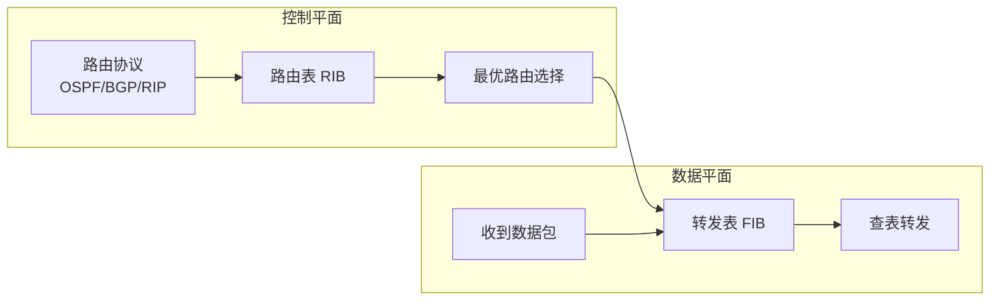
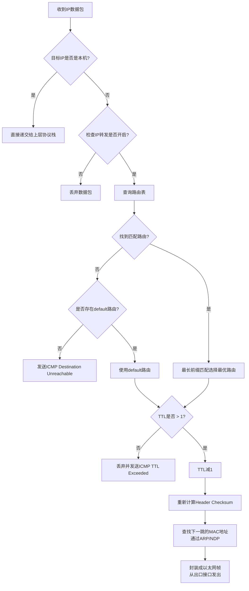
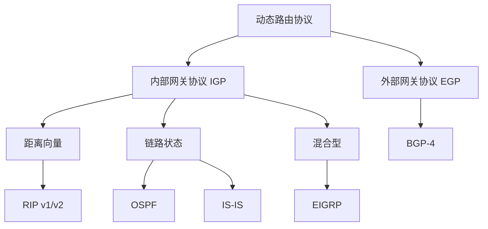
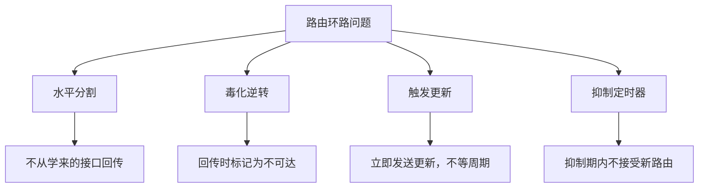
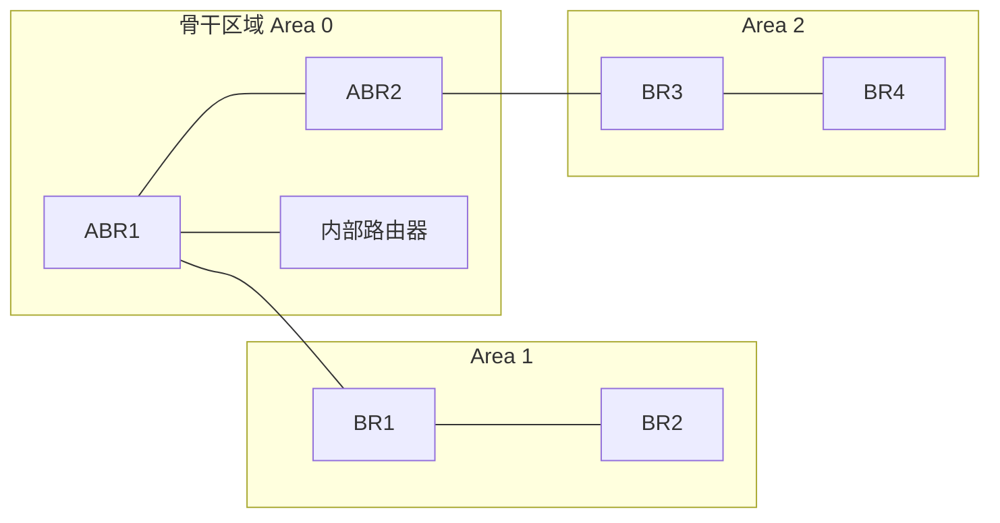
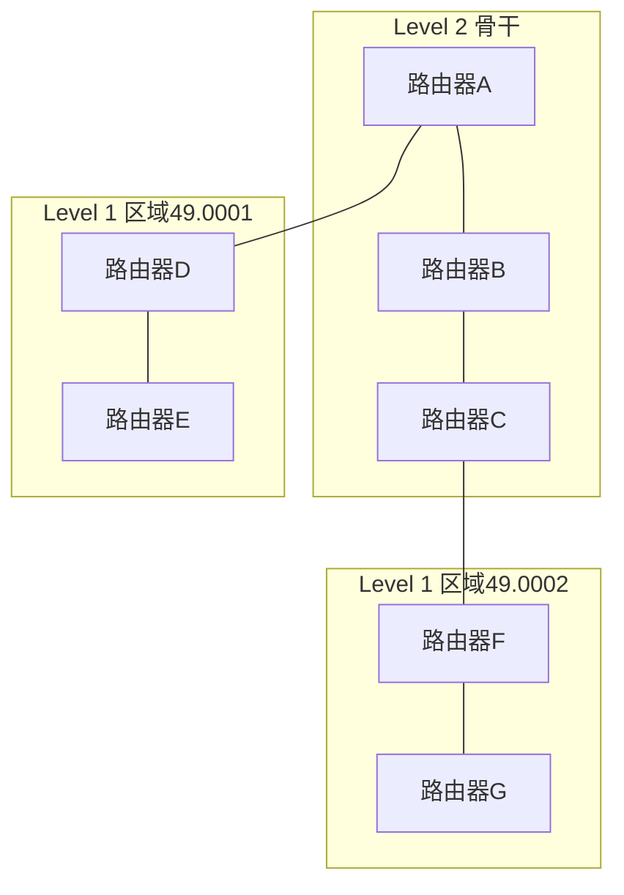
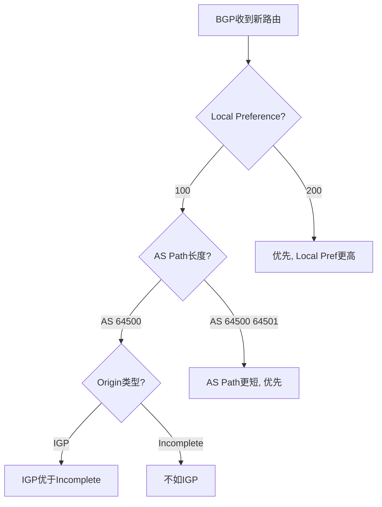
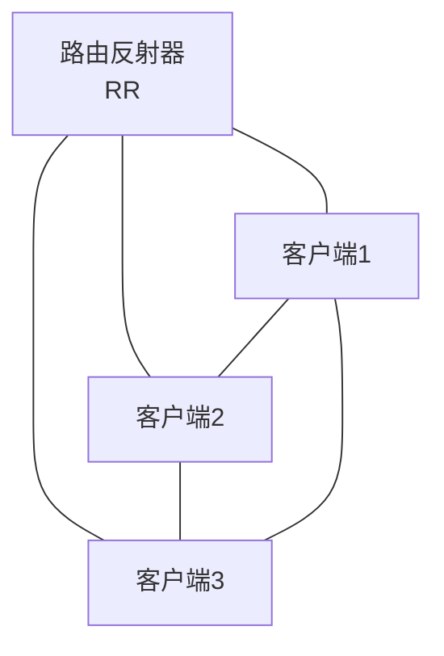
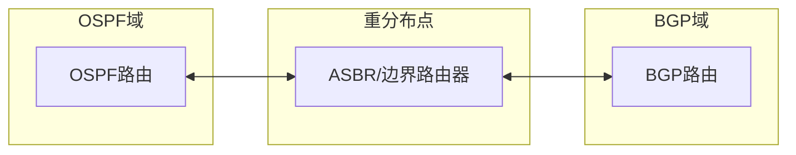
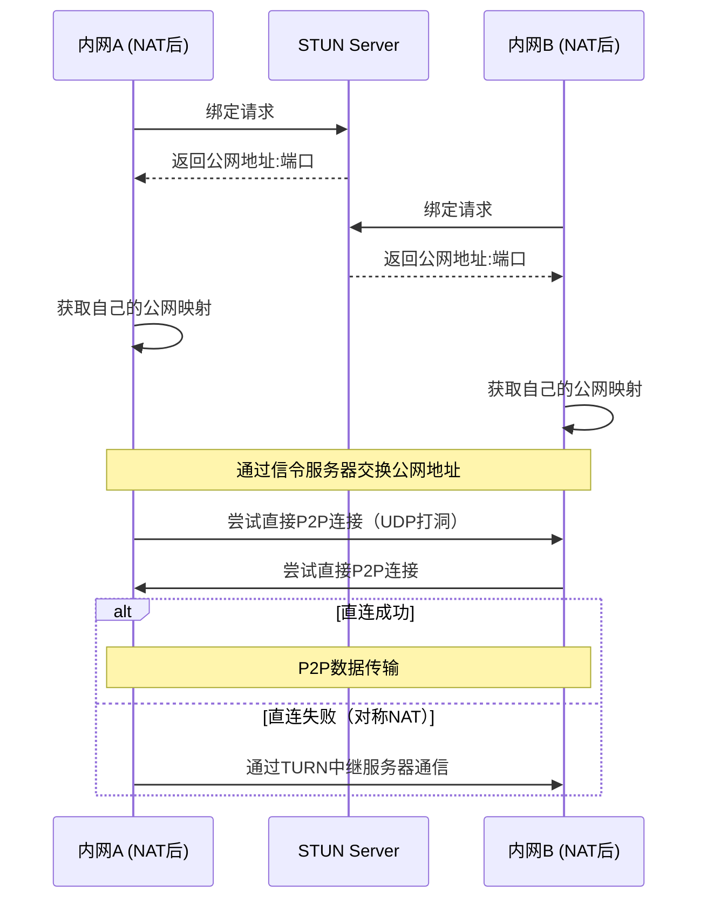

## 三、IP路由

### 3.1 概述与背景

IP路由是TCP/IP协议栈中网络层（第三层）的核心机制，负责将数据包从源主机经过一个或多个网络转发到目标主机。如果说以太网和ARP解决了"同一局域网内如何找到对方"的问题，那么IP路由解决的则是"跨越不同网络如何到达对方"的问题。

IP路由的本质是一个**逐跳决策过程**：数据包每经过一台路由器，路由器都会独立地查看包头中的目标IP地址，查阅自己的路由表，决定下一跳（next hop）发往何处。这种"每跳独立决策"的设计是互联网能够全球化扩展的基石——没有任何中央控制节点，每个路由器只需知道"往哪走一步"即可。

#### 路由器的转发平面

理解IP路由需要区分路由器的两个核心平面：

- **控制平面（Control Plane）**：运行路由协议（OSPF、BGP等），构建和维护路由表（RIB, Routing Information Base）。这是路由器的"大脑"，负责计算最优路径。
- **数据平面（Data Plane / Forwarding Plane）**：根据转发表（FIB, Forwarding Information Base）对每个数据包进行实际的查表和转发。这是路由器的"肌肉"，要求极高的吞吐量和极低的延迟。



在传统路由器中，FIB通常存储在**TCAM（Ternary Content Addressable Memory，三态内容寻址存储器）**中。TCAM能够在单个时钟周期内完成最长前缀匹配查找，这是普通DRAM无法做到的。一条典型的TCAM查找流程：输入目标IP → TCAM并行比较所有表项 → 返回匹配的最具体前缀 → 读取对应的转发信息（下一跳、出接口、VLAN标签等）。

现代Linux内核则使用**LC-trie（Level Compressed Trie，层级压缩前缀树）**数据结构来存储FIB。LC-trie通过路径压缩和层级压缩减少树的深度，在前缀数量较大时仍然保持O(W)的查找时间复杂度（W为地址位长，IPv4为32）。可以通过以下命令观察内核FIB结构：

```bash
# 查看内核FIB树结构（调试用，生产环境慎用）
cat /proc/net/fib_trie

# 查看FIB统计信息
cat /proc/net/fibstat
```

#### 路由技术的历史演进

| 阶段 | 时间 | 关键事件 | 意义 |
|------|------|---------|------|
| 静态路由 | 1980年代 | ARPANET管理员手动配置每条路径 | 网络规模受限于人工维护能力 |
| RIP | 1988年 | 第一个广泛部署的动态路由协议 | 实现了路由自动学习，但跳数限制15跳 |
| OSPF | 1989年 | 引入链路状态算法（RFC 1131） | 收敛速度大幅提升，支持大规模网络 |
| BGP-4 | 1995年 | 成为AS间路由的标准（RFC 1771） | 互联网骨干网的核心协议，至今未被替代 |
| MPLS/TE | 2000年代 | 标签交换与流量工程 | 突破传统IP查表的转发效率瓶颈 |
| SDN | 2010年代 | 控制平面与数据平面分离 | 网络可编程性大幅提升 |
| Segment Routing | 2020年代 | 源端编码完整路径 | 简化中间节点状态，推动网络向意图驱动演进 |

### 3.2 IP数据包结构

理解IP路由的前提是理解IP数据包的头部结构。IPv4包头固定20字节，可扩展至60字节：

 0                   1                   2                   3
 0 1 2 3 4 5 6 7 8 9 0 1 2 3 4 5 6 7 8 9 0 1 2 3 4 5 6 7 8 9 0 1
├─┼─┼─┼─┼─┼─┼─┼─┼─┼─┼─┼─┼─┼─┼─┼─┼─┼─┼─┼─┼─┼─┼─┼─┼─┼─┼─┼─┼─┼─┼─┼─┤
│Version│  IHL  │    DSCP     │ECN│         Total Length          │
├───────┴───────┼─────┴───────┼───┴───────────────────────────────┤
│     Flags     │     Fragment Offset                             │
├───────────────┼─────────────────────────────────────────────────┤
│      TTL      │    Protocol   │       Header Checksum           │
├───────────────┴───────────────┼─────────────────────────────────┤
│                       Source IP Address                         │
├─────────────────────────────────────────────────────────────────┤
│                     Destination IP Address                      │
├─────────────────────────────────────────────────────────────────┤
│                    Options (if IHL > 5)      │    Padding       │
└─────────────────────────────────────────────────────────────────┘

各字段与路由直接相关的含义：

| 字段 | 位数 | 路由相关意义 |
|------|------|-------------|
| Version | 4 bit | IP版本号，4=IPv4，6=IPv6 |
| IHL（Internet Header Length） | 4 bit | 包头长度（以4字节为单位），最小值5（20字节） |
| DSCP（Differentiated Services Code Point） | 6 bit | 差分服务标记，用于QoS分类和流量优先级，策略路由可据此匹配 |
| ECN（Explicit Congestion Notification） | 2 bit | 显式拥塞通知，允许路由器在不丢包的情况下通知端主机拥塞 |
| Total Length | 16 bit | 整个IP包长度（字节），最大65535 |
| Flags | 3 bit | DF（Don't Fragment）标志：DF=1时禁止分片；MF（More Fragments）标志：MF=1表示后面还有分片 |
| Fragment Offset | 13 bit | 分片在原始数据包中的偏移位置（以8字节为单位） |
| TTL（Time To Live） | 8 bit | 每经过一个路由器减1，减到0时丢弃并发送ICMP超时报文。防止路由环路导致数据包无限循环 |
| Protocol | 8 bit | 标识上层协议（6=TCP, 17=UDP, 1=ICMP, 89=OSPF），路由器通常不关心此字段，但防火墙和NAT依赖它做状态跟踪 |
| Header Checksum | 16 bit | 仅对包头进行校验。每跳TTL变化后需重新计算。注意：不包含数据部分，因为链路层（以太网FCS）和传输层（TCP/UDP校验和）各自负责 |
| Source IP | 32 bit | 源地址，用于回程路由决策、访问控制和反欺骗过滤 |
| Destination IP | 32 bit | **路由决策的唯一依据**——路由器只看这个字段来决定转发路径（标准路由情况下） |
| Options | 可变 | 较少使用。Record Route记录路径、Source Route源路由（因安全隐患已被多数路由器禁用）、Timestamp记录时间戳 |

IPv6包头固定40字节，结构更简洁：

| 对比项 | IPv4 | IPv6 |
|--------|------|------|
| 包头大小 | 20-60字节（可变） | 固定40字节 |
| 校验和 | 有（Header Checksum） | 无（由链路层FCS和TCP/UDP校验和替代） |
| 分片 | 路由器和源端均可分片 | **仅源端分片**（路由器发现MTU不足时发ICMPv6 Packet Too Big） |
| TTL字段 | TTL（8bit） | Hop Limit（8bit，含义相同但名称更准确） |
| 标记字段 | Flags + Fragment Offset | 仅Fragment Header（扩展头）包含 |
| 包头字段数 | 12个 | 8个（精简设计提升转发效率） |

### 3.3 路由表：转发决策的核心

路由表（Routing Table）是每台路由器和主机维护的核心数据结构，存储着"目标网络/前缀 → 下一跳/出口接口"的映射关系。

#### 3.3.1 Linux路由表示例

```bash
# 查看内核路由表
ip route show
# 输出示例：
# default via 192.168.1.1 dev eth0 proto dhcp metric 100
# 10.0.0.0/8 via 10.1.1.1 dev eth1 proto static
# 10.1.1.0/24 dev eth1 proto kernel scope link src 10.1.1.2
# 172.16.0.0/12 via 10.1.1.1 dev eth1 proto static metric 200
# 192.168.1.0/24 dev eth0 proto kernel scope link src 192.168.1.100

# 详细模式（包含路由协议、缓存等信息）
ip route show table all
```

每条路由条目包含的关键信息：

| 字段 | 含义 | 示例 |
|------|------|------|
| 目标网络 | 匹配的目标地址范围 | `10.0.0.0/8` |
| via | 下一跳路由器IP | `10.1.1.1` |
| dev | 出口网络接口 | `eth0` |
| proto | 路由来源协议 | `static`（手动配置）/ `dhcp`（DHCP获取）/ `kernel`（内核直连）/ `ospf` / `bgp` |
| scope | 路由作用域 | `link`（仅在链路内有效）/ `global`（全网有效） |
| metric | 路由度量值 | 数值越小优先级越高，用于多条路由选优 |
| src | 源地址 | 从此接口发出时使用的源IP |
| advmss | TCP最大报文段大小 | 考虑路径MTU后的MSS建议值 |
| window | TCP窗口大小 | 路由级别建议的TCP窗口 |

#### 3.3.2 最长前缀匹配原则

当路由表中存在多条可以匹配目标IP的路由条目时，路由器遵循**最长前缀匹配**（Longest Prefix Match, LPM）原则：选择子网掩码最长（即前缀最具体）的那条路由。

目标IP: 10.1.2.3

路由表：
  10.0.0.0/8      → 走接口A    （匹配8位前缀）
  10.1.0.0/16     → 走接口B    （匹配16位前缀）
  10.1.2.0/24     → 走接口C    （匹配24位前缀）✓ 最长匹配，选这条
  10.1.2.3/32     → 走接口D    （匹配32位前缀，主机路由）✓ 如果存在则更优

这是一个逐位比较的过程，理解它对于排查路由问题至关重要。例如，`10.1.2.3` 同时匹配 `/8`、`/16`、`/24` 三条路由，但 `/24` 的前缀最长，所以走接口C。如果同时存在一条 `/32` 的主机路由，则优先走接口D。

**为什么最长前缀匹配是互联网的基础设计？** 这种设计使得路由聚合（Route Aggregation）成为可能：ISP可以将自己的所有地址空间宣告为一条聚合路由（如 `203.0.112.0/20`），而客户的具体子网（如 `203.0.113.0/24`）在下游被更具体地宣告。互联网中的路由器只需匹配最具体的前缀，既减少了路由表规模，又保留了精确路由的能力。

#### 3.3.3 路由决策完整流程



用 `ip route get` 命令可以模拟路由器的查表过程，观察本机的路由决策结果：

```bash
# 查看到达8.8.8.8会走哪条路由
ip route get 8.8.8.8
# 输出示例：8.8.8.8 via 192.168.1.1 dev eth0 src 192.168.1.100 uid 0
#     cache

# 策略路由调试：查看从特定源IP出发的路由决策
ip route get 8.8.8.8 from 192.168.1.100
```

### 3.4 静态路由与动态路由

#### 3.4.1 静态路由

静态路由由管理员手动配置，适用于小型网络、末梢网络（stub network）或需要精确控制路由策略的场景。

```bash
# 添加到 10.2.0.0/16 的静态路由，下一跳为 192.168.1.254
ip route add 10.2.0.0/16 via 192.168.1.254

# 添加默认网关
ip route add default via 192.168.1.1

# 删除路由
ip route del 10.2.0.0/16

# 添加带度量值的路由（当存在多条路径时用于选优）
ip route add 10.3.0.0/16 via 192.168.1.253 metric 100

# 添加带出接口的路由（点对点链路可省略下一跳IP）
ip route add 10.4.0.0/16 dev eth2

# 添加黑洞路由（丢弃匹配的流量，常用于防止路由环路）
ip route add 10.5.0.0/16 blackhole

# 添加不可达路由（发送ICMP不可达，用于安全隔离）
ip route add 10.6.0.0/16 unreachable

# 持久化（重启后保留）
# Debian/Ubuntu: 写入 /etc/network/interfaces
#   post-up ip route add 10.2.0.0/16 via 192.168.1.254
# RHEL/CentOS: 写入 /etc/sysconfig/network-scripts/route-eth0
#   10.2.0.0/16 via 192.168.1.254
# 或使用 netplan (Ubuntu 18.04+):
#   routes:
#     - to: 10.2.0.0/16
#       via: 192.168.1.254
```

静态路由的优缺点：

| 优点 | 缺点 |
|------|------|
| 不消耗CPU和带宽（无协议开销） | 无法自动适应网络拓扑变化 |
| 完全由管理员控制，行为可预测 | 大型网络中配置和维护工作量巨大 |
| 安全性高（不会被恶意路由注入影响） | 链路故障时无法自动切换路径 |
| 不需要路由协议支持 | 无法实现负载均衡（除非手动配置等价路由） |

**黑洞路由与不可达路由的区别：**

| 类型 | 内核行为 | 返回ICMP？ | 适用场景 |
|------|---------|-----------|---------|
| `blackhole` | 静默丢弃，不发送任何ICMP | 否 | 防止路由环路、过滤恶意流量 |
| `unreachable` | 丢弃并返回ICMP不可达 | 是 | 通知发送方目标不可达 |
| `prohibit` | 丢弃并返回ICMP administratively prohibited | 是 | 访问控制，明确拒绝 |

#### 3.4.2 动态路由协议分类

动态路由协议按工作范围和算法可分类如下：



| 协议 | 算法类型 | 度量方式 | 适用范围 | 收敛速度 | 代表部署场景 |
|------|---------|---------|---------|---------|-------------|
| RIP | Bellman-Ford距离向量 | 跳数（最大15跳） | 小型网络（<15跳） | 慢（30秒更新周期） | 小型企业、教学实验 |
| OSPF | Dijkstra最短路径优先 | 带宽（Cost） | 企业网/ISP内部 | 快（SPF增量计算） | 企业园区网、数据中心 |
| IS-IS | Dijkstra最短路径优先 | 可定制（默认10） | 大型ISP骨干网 | 快（SPF增量计算） | 电信运营商骨干网 |
| BGP | 路径向量 | 多属性决策 | 自治系统之间 | 较慢（策略驱动） | 互联网骨干网、多归属接入 |
| EIGRP | DUAL算法 | 带宽+延迟等复合度量 | Cisco设备网络 | 快（可行后继） | Cisco企业网络 |

### 3.5 RIP：距离向量路由协议

RIP（Routing Information Protocol）是最简单的动态路由协议，基于Bellman-Ford算法。

#### 3.5.1 工作原理

每个运行RIP的路由器每30秒向所有邻居广播（v1）或组播（v2, 224.0.0.9）自己的完整路由表。收到邻居的路由信息后，路由器将跳数+1，如果新路径比已知路径更短（跳数更小），则更新路由表。

路由器A（跳数=0）         路由器B（跳数=1）         路由器C（跳数=2）
[10.0.0.0/8 → eth0]      [10.0.0.0/8 → A]         [10.0.0.0/8 → B]
[192.168.1.0/24 → eth1]  [192.168.1.0/24 → eth0]  [192.168.1.0/24 → A]
                          [172.16.0.0/12 → eth1]   [172.16.0.0/12 → eth1]

**RIP v1与v2的关键区别：**

| 特性 | RIP v1（RFC 1058） | RIP v2（RFC 2453） |
|------|-------------------|-------------------|
| 路由更新方式 | 广播（255.255.255.255） | 组播（224.0.0.9） |
| 子网掩码 | 不携带（有类路由） | 携带子网掩码（无类路由） |
| 认证 | 无 | 支持明文和MD5认证 |
| 路由标记 | 无 | 16位标记字段（用于重分布标记） |
| 下一跳 | 隐含为发送者 | 可指定下一跳（避免次优路径） |

#### 3.5.2 路由环路与防环机制

RIP最大的问题是**路由环路**（Routing Loop）。考虑以下场景：路由器C的10.0.0.0/8链路断开后，C删除该路由；但A的30秒更新还没到，C可能从A收到"10.0.0.0/8可达，跳数=2"的旧路由，于是C又加回去指向A；A收到后以为通过C可达，跳数=3；如此循环直到跳数增长到16（RIP定义为不可达）。

RIP使用四种机制来缓解此问题：

**1. 水平分割（Split Horizon）**：路由器不从某个接口发送从该接口学到的路由信息。简单说：从eth0学来的路由，不再从eth0广播出去。这是最基础的防环机制。

**2. 毒化逆转（Poison Reverse）**：是水平分割的加强版。当路由器从某接口学到一条路由后，它向该接口回传这条路由时，将跳数设为16（不可达），主动通告"这条路由不可达"，阻止对端使用这条路由反向回环。

**3. 触发更新（Triggered Update）**：当路由发生变化时，立即发送更新报文，不等待30秒周期，缩短环路存续时间。在快速变化的网络中，触发更新能显著减少环路持续时间。

**4. 抑制定时器（Hold-down Timer）**：收到某路由不可达的信息后，在180秒内不接受关于该路由的任何更新（除非来自同一邻居且跳数更小），防止坏路由信息扩散。代价是网络收敛变慢。



#### 3.5.3 RIP的局限性

| 局限性 | 具体表现 | 影响 |
|--------|---------|------|
| 跳数限制 | 最大15跳，16视为不可达 | 网络直径受限 |
| 收敛慢 | 30秒周期更新 + 抑制定时器 | 故障恢复可能需数分钟 |
| 仅以跳数为度量 | 不考虑带宽、延迟、负载 | 可能选择低带宽路径 |
| 完整路由表传递 | 每次更新发送全部路由 | 带宽浪费，不适合大型网络 |
| 缺乏路由聚合支持 | 每条路由独立传播 | 路由表膨胀 |

在现代网络中，RIP仅适用于小型、扁平的网络环境，已被OSPF和IS-IS广泛取代。

```bash
# Linux上配置RIP（使用FRR）
# 安装FRR (Free Range Routing)
apt install frr

# 编辑 /etc/frr/daemons，启用ripd
# ripd=yes

# 进入vtysh配置
vtysh
configure terminal
router rip
 network 192.168.1.0/24
 network 10.0.0.0/8
 version 2
 no auto-summary
 exit
write
```

### 3.6 OSPF：链路状态路由协议

OSPF（Open Shortest Path First）是企业网和ISP内部使用最广泛的IGP，基于Dijkstra最短路径优先算法。当前主要版本为OSPFv2（RFC 2328，IPv4）和OSPFv3（RFC 5340，IPv6）。

#### 3.6.1 核心概念

**区域（Area）**：OSPF将大型网络划分为多个区域，每个区域内部运行完整的SPF计算，区域间通过ABR（区域边界路由器）传递汇总路由。区域0为骨干区域（Backbone Area），所有其他区域必须与之直连。



OSPF路由器的角色定义：

| 角色 | 英文全称 | 职责 |
|------|---------|------|
| 内部路由器（IR） | Internal Router | 所有接口在同一区域，只维护本区域LSDB |
| 区域边界路由器（ABR） | Area Border Router | 连接骨干区域和其他区域，运行多个区域的SPF |
| 自治系统边界路由器（ASBR） | AS Boundary Router | 连接OSPF域与其他路由域（如BGP、RIP），引入外部路由 |
| 骨干路由器 | Backbone Router | 至少有一个接口在区域0 |
| 指定路由器（DR） | Designated Router | 广播网络上负责LSA泛洪的协调 |

**LSA（链路状态通告）**：每台OSPF路由器生成LSA，描述自身及其邻居的链路状态。LSA在整个区域泛洪，最终区域内每台路由器都拥有相同的链路状态数据库（LSDB），然后各自独立运行SPF算法计算最短路径树。

OSPF主要LSA类型：

| LSA类型 | 名称 | 生成者 | 描述 |
|---------|------|--------|------|
| Type 1 | Router LSA | 所有路由器 | 描述路由器的直连链路和邻居，只在本区域泛洪 |
| Type 2 | Network LSA | DR | 描述广播网络上连接的所有路由器 |
| Type 3 | Summary LSA | ABR | 区域间路由汇总，由ABR生成 |
| Type 4 | ASBR Summary LSA | ABR | 描述如何到达ASBR |
| Type 5 | AS External LSA | ASBR | 外部路由（如BGP引入的路由），在整个OSPF域泛洪 |
| Type 7 | NSSA External LSA | NSSA中的ASBR | NSSA区域内的外部路由，到达ABR后转换为Type 5 |

**DR/BDR选举**：在广播网络（如以太网）上，OSPF选举指定路由器（DR）和备份指定路由器（BDR）。所有非DR/BDR路由器（DROther）只与DR/BDR建立full邻接关系，DR负责向所有邻居同步LSA，减少邻接关系数量和泛洪流量。选举规则：优先级最高者当选（默认为1），优先级为0的不参选；优先级相同时Router ID最大者当选。

#### 3.6.2 OSPF网络类型

OSPF根据接口的网络特性自动确定网络类型，不同网络类型影响邻居发现、DR选举和LSA泛洪方式：

| 网络类型 | 典型接口 | DR选举？ | 邻居发现方式 | 说明 |
|---------|---------|---------|-------------|------|
| Broadcast | 以太网 | 是 | 组播224.0.0.5/224.0.0.6 | 最常见的类型 |
| Point-to-Point | 串口（HDLC/PPP） | 否 | 组播224.0.0.5 | 无需DR，邻居自动建立 |
| Point-to-Multipoint | 帧中继子接口（点到多点） | 否 | 组播224.0.0.5 | 将非广播网络模拟为多个点对点链路 |
| Non-Broadcast Multi-Access (NBMA) | 帧中继（全网状） | 是 | 手动指定neighbor | 需手动配置邻居，因为组播不可达 |
| Point-to-Multipoint Non-Broadcast | 帧中继（非全网状） | 否 | 手动指定neighbor | 点到多点的变体 |

```bash
# 手动修改OSPF网络类型（当自动检测不正确时）
interface eth0
 ip ospf network point-to-point    # 将以太网强制设为点对点（不选举DR）
```

#### 3.6.3 OSPF路由类型与开销

| 路由类型 | 描述 | 管理距离 | 优先级 |
|----------|------|---------|--------|
| O | 区域内路由（Intra-area） | 110 | 最高 |
| O IA | 区域间路由（Inter-area） | 110 | 次高 |
| O E1 | 外部路由（Type 1），开销=外部开销+内部开销 | 110 | 较低 |
| O E2 | 外部路由（Type 2），开销=仅外部开销（默认） | 110 | 最低 |

OSPF的开销（Cost）计算公式：

Cost = 参考带宽 / 接口带宽

默认参考带宽 = 100 Mbps
示例：
  FastEthernet (100Mbps): Cost = 100/100 = 1
  GigabitEthernet (1Gbps): Cost = 100/1000 = 0.1 → 实际取整为1
  10Gbps: Cost = 100/10000 = 0.01 → 实际取整为1

> **注意**：默认参考带宽为100Mbps，导致千兆和万兆接口的Cost都是1，无法区分。在高速网络中应手动调整参考带宽：
> ```
> router ospf 1
>   auto-cost reference-bandwidth 10000  # 单位Mbps
> ```

#### 3.6.4 OSPF认证

OSPF支持三种认证方式，用于防止未授权路由器注入虚假路由信息：

| 认证方式 | 安全性 | 说明 |
|---------|--------|------|
| 明文认证 | 低 | 密码以明文传输，可被嗅探获取 |
| MD5认证 | 中 | 密码通过MD5哈希传输，不暴露明文 |
| SHA认证 | 高 | 使用SHA系列哈希算法，更安全（OSPFv2扩展） |

```bash
# OSPF MD5认证配置（FRR）
interface eth0
 ip ospf authentication message
 ip ospf message-digest-key 1 md5 MySecretKey123

# 区域级认证（所有接口统一）
router ospf
 area 0 authentication message-digest
exit

interface eth0
 ip ospf message-digest-key 1 md5 MySecretKey123
```

#### 3.6.5 OSPF配置实例

```bash
# FRR (Free Range Routing) OSPF配置
vtysh
configure terminal

# 基本OSPF配置
router ospf
 ospf router-id 1.1.1.1
 network 192.168.1.0/24 area 0
 network 10.0.0.0/8 area 1
 passive-interface eth2        # 被动接口：不发送OSPF报文但仍宣告网段
 default-information originate  # 向OSPF域内注入默认路由
 exit

# 接口级别的OSPF参数调优
interface eth0
 ip ospf hello-interval 10     # Hello报文间隔（秒）
 ip ospf dead-interval 40      # 失效间隔（默认4倍hello）
 ip ospf cost 100              # 手动设置接口开销
 ip ospf priority 10           # DR选举优先级（0=不参与选举）
exit

interface eth1
 ip ospf network point-to-point  # 点对点网络类型（不选举DR）
exit

# 区域间路由汇总（在ABR上配置）
router ospf
 area 1 range 10.1.0.0/16     # 将区域1的路由汇总为10.1.0.0/16
 exit

# 外部路由引入（在ASBR上配置）
router ospf
 redistribute static           # 将静态路由引入OSPF
 redistribute connected        # 将直连路由引入OSPF
 redistribute bgp metric 100 metric-type 1  # 引入BGP路由，Type 1外部路由
 exit

write
```

#### 3.6.6 OSPF邻居状态机

OSPF邻居从建立到完全同步经历以下状态：

```mermaid
stateDiagram-v2
    [*] --> Down
    Down --> Init: 收到Hello包
    Init --> 2-Way: Hello中包含自己的Router ID
    2-Way --> ExStart: 选举DR/BDR后
    ExStart --> Exchange: 协商主从关系后
    Exchange --> Loading: 交换LSDB摘要后
    Loading --> Full: LSA同步完成

    note right of 2-Way
        DR/BDR选举在此阶段完成
        DROther之间只保持2-Way
    end note

    note right of Full
        邻接关系完全建立
        可以交换路由信息
    end note
```

#### 3.6.7 OSPF排错命令

```bash
# 查看OSPF邻居状态
vtysh -c "show ip ospf neighbor"
# 邻居状态机：Down → Init → 2-Way → ExStart → Exchange → Loading → Full
# "Full"表示邻接关系完全建立

# 查看OSPF链路状态数据库
vtysh -c "show ip ospf database"
# 可按LSA类型过滤
vtysh -c "show ip ospf database router"       # Type 1 LSA
vtysh -c "show ip ospf database network"      # Type 2 LSA
vtysh -c "show ip ospf database summary"      # Type 3 LSA
vtysh -c "show ip ospf database external"     # Type 5 LSA

# 查看OSPF路由
vtysh -c "show ip ospf route"

# 查看OSPF接口信息
vtysh -c "show ip ospf interface eth0"

# 查看OSPF SPF计算统计
vtysh -c "show ip ospf statistics"
```

**常见问题排查清单：**

| 问题现象 | 可能原因 | 排查命令 |
|---------|---------|---------|
| 邻居卡在"2-Way" | 区域ID不匹配、Hello/Dead间隔不一致、子网掩码不匹配 | `show ip ospf interface` 检查参数 |
| 邻居卡在"Init" | 对方没收到我的Hello包，ACL阻断、组播不可达 | `tcpdump -i eth0 proto ospf` 抓包验证 |
| 邻居卡在"ExStart/Exchange" | MTU不匹配（LSA大小超过接口MTU） | `show ip ospf interface` 查看MTU，或 `ping -M do -s 1500` 测试 |
| 邻居频繁震荡 | 链路质量差、CPU负载高、认证配置不一致 | `show log` 查看日志，`show cpu` 检查负载 |
| 路由不完整 | 区域划分错误、ABR汇总配置遗漏、被动接口误配置 | `show ip ospf database` 检查LSA完整性 |

### 3.7 IS-IS：ISP骨干网的链路状态路由协议

IS-IS（Intermediate System to Intermediate System, RFC 1058）最初为OSI协议栈的CLNP（Connectionless Network Protocol）设计，后经扩展支持IP（Integrated IS-IS, RFC 1195）。IS-IS是大型ISP骨干网的首选IGP，其简洁性和可扩展性使其在互联网运营商中广泛部署。

#### 3.7.1 IS-IS与OSPF的对比

| 对比项 | IS-IS | OSPF |
|--------|-------|------|
| 协议基础 | OSI CLNP + IP扩展（RFC 1195） | 纯IP协议 |
| 网络实体 | NET（Network Entity Title） | Router ID + Area ID |
| 区域划分 | 骨干区（Level 2）和非骨干区（Level 1）通过链路连接 | 骨干区（Area 0）通过ABR连接 |
| LSP/LSA | LSP（Link State PDU） | LSA（Link State Advertisement） |
| 传输层 | 直接封装在数据链路层（IP Protocol 89 / IS-IS 0x83） | 直接封装在IP协议89之上 |
| TLV扩展 | 原生TLV（Type-Length-Value），扩展性极好 | 需要定义新LSA类型 |
| 区域边界 | Level 1/2路由器（同一设备可同时属于两个级别） | ABR（同时连接多个Area） |
| 多协议支持 | 通过TLV扩展支持IPv4/IPv6/MPLS | IPv4用OSPFv2，IPv6用OSPFv3 |
| 部署规模 | 运营商骨干网（数千节点） | 企业网/运营商（数百到数千节点） |

#### 3.7.2 IS-IS核心概念

**IS-IS的层次结构：**



| 路由器类型 | 级别 | 职责 |
|-----------|------|------|
| Level 1 | L1 | 本区域内路由，通过默认路由指向最近的L1/2路由器访问外部 |
| Level 2 | L2 | 骨干路由，负责区域间路由传递 |
| Level 1/2 | L1/2 | 同时运行L1和L2，连接本区域与骨干，类似OSPF的ABR |

**IS-IS度量：**

| 度量类型 | 说明 |
|---------|------|
| Default（默认） | 所有接口默认metric=10，仅基于跳数 |
| Narrow（窄度量） | 6bit，最大63，传统方式 |
| Wide（宽度量） | 24bit，最大16777215，支持TE和IPv6 |

```bash
# FRR IS-IS配置示例
vtysh
configure terminal

router isisis NET 49.0001.1921.6800.1001.00
 is-type level-2-only          # 仅作为Level 2路由器
 metric-style wide             # 使用宽度量
 redistribute ipv4 connected   # 将直连路由引入IS-IS

interface eth0
 ip router isisis              # 在接口上启用IS-IS
 isis circuit-type level-2-only
 isis metric 100               # 接口度量
exit

interface eth1
 ip router isisis
 isis circuit-type level-2-only
 isis metric 50
exit

write
```

#### 3.7.3 为什么ISP偏爱IS-IS？

1. **TLV扩展性**：IS-IS原生使用TLV格式，新增功能只需定义新TLV类型，无需修改协议核心。这使得IS-IS能快速支持IPv6、Segment Routing、Flex-Algorithm等新特性。
2. **直接封装**：IS-IS直接运行在数据链路层之上（不依赖IP），避免了IP层故障影响路由协议的问题。
3. **简洁性**：OSPF有11种LSA类型，IS-IS只有3种LSP类型，实现和排错更简单。
4. **多拓扑支持**：IS-IS天然支持多拓扑模式（Multi-Topology），IPv4和IPv6可以使用不同的网络拓扑，而OSPF需要独立运行OSPFv2和OSPFv3两个进程。

### 3.8 BGP：自治系统间的路由协议

BGP（Border Gateway Protocol）是互联网的"粘合剂"，负责在不同自治系统（AS）之间交换路由信息。全球互联网本质上就是数千个BGP AS通过BGP协议互联而成的网络。

#### 3.8.1 BGP核心概念

**自治系统（AS）**：由单一管理机构控制的一组路由器和网络。每个AS有唯一的AS号（ASN）。全球约有7万多个活跃AS（截至2025年）。

- 私有AS号：64512-65534（RFC 6996），用于内部网络
- 2字节ASN范围：1-65534
- 4字节ASN范围：1-4294967295（用于ASN耗尽后的扩展）

**eBGP vs iBGP**：

| 特性 | eBGP（外部BGP） | iBGP（内部BGP） |
|------|-----------------|-----------------|
| AS间连接 | AS之间 | 同一AS内部 |
| 默认TTL | 1（直连） | 255（需要修改或使用loopback） |
| 下一跳处理 | 改为自身地址 | 保留原始下一跳（需额外处理） |
| 路由传播 | 直接传播 | 需要full mesh或路由反射器 |
| 适用场景 | ISP互联、客户/上游连接 | ISP骨干内部同步外部路由 |
| 会话建立 | 通常直连 | 通常通过loopback地址（更稳定） |

#### 3.8.2 BGP路由属性与选路

BGP的选路远比OSPF复杂，涉及十多个决策步骤，按优先级从高到低：

1. 最高Local Preference（默认100）    ← 本地策略，影响出站流量
2. 最短AS Path                         ← AS路径越短越优
3. 最低Origin类型（IGP < EGP < Incomplete）
4. 最低MED（Multi-Exit Discriminator）  ← 影响邻居AS的入站流量
5. eBGP优于iBGP
6. 最近IGP下一跳                       ← 选择IGP开销最小的出口
7. 最老的eBGP路由（老路由更稳定）
8. 最低Router ID
...（还有更多步骤，包括Weight、Community等厂商特有属性）



#### 3.8.3 BGP Community：路由策略的标签系统

BGP Community（RFC 1997）是一个32位的标签属性，用于对路由进行分类和标记，是实现精细化路由策略的核心工具。ISP通常定义自己的Community策略：

| Community值 | 含义 | 典型用途 |
|------------|------|---------|
| 64500:100 | 客户路由 | 向客户传播的路由 |
| 64500:200 | 对等路由 | 对等互联的路由 |
| 64500:300 | 上游路由 | ISP上游提供的路由 |
| 64500:666 | 黑洞路由 | 请求上游丢弃该前缀的流量（DDoS防护） |
| no-export | 标准Community | 不向eBGP邻居传播 |
| no-advertise | 标准Community | 不向任何BGP邻居传播 |
| local-as | 标准Community | 不向AS之外传播 |

```bash
# 利用Community实现DDoS黑洞路由
# 当检测到某IP被攻击时，向上游发送黑洞Community请求丢弃流量
ip prefix-list ATTACKED seq 10 permit 192.168.100.0/24
route-map BLACKHOLE permit 10
 match ip address prefix-list ATTACKED
 set community 64500:666
exit

neighbor 203.0.113.1 route-map BLACKHOLE out
```

#### 3.8.4 路由反射器与联邦

iBGP要求full mesh（每台BGP路由器与所有其他iBGP邻居建立会话），这在大规模网络中不可行。解决方案：

**路由反射器（Route Reflector, RR）**：一台BGP路由器被指定为RR，其他路由器（Client）只需与RR建立iBGP会话。RR将从Client学到的路由反射给其他Client和非Client邻居，打破了iBGP的full mesh限制。



**联邦（Confederation）**：将AS内部划分为多个子AS（Member-AS），子AS之间使用eBGP（但对外仍表现为同一个AS号）。适用于超大规模网络。

```bash
# 路由反射器配置
vtysh
configure terminal

router bgp 65001
 bgp router-id 10.0.0.1
 
 # 配置RR客户端
 neighbor 10.0.0.2 remote-as 65001
 neighbor 10.0.0.2 update-source loopback0
 neighbor 10.0.0.2 route-reflector-client  # 设为RR客户端
 
 neighbor 10.0.0.3 remote-as 65001
 neighbor 10.0.0.3 update-source loopback0
 neighbor 10.0.0.3 route-reflector-client
exit

write
```

#### 3.8.5 BGP配置示例

```bash
# FRR BGP基本配置
vtysh
configure terminal

# AS 65001 与上游 AS 65000 建立eBGP
router bgp 65001
 bgp router-id 10.0.0.1
 bgp log-neighbor-changes
 
 # eBGP邻居
 neighbor 203.0.113.1 remote-as 65000
 neighbor 203.0.113.1 description "Upstream ISP"
 neighbor 203.0.113.1 password MySecret123
 neighbor 203.0.113.1 timers 30 90
 
 # 宣告本地网络
 network 192.168.0.0/16
 network 10.0.0.0/8
 
 # 向上游宣告的前缀过滤（只宣告自己的地址段）
 ip prefix-list OUTBOUND seq 10 permit 192.168.0.0/16
 ip prefix-list OUTBOUND seq 20 permit 10.0.0.0/8
 ip prefix-list OUTBOUND seq 100 deny 0.0.0.0/0 le 32
 
 neighbor 203.0.113.1 prefix-list OUTBOUND out
 
 # Local Preference 策略（影响出站选路）
 ip prefix-list HIGH-PREF seq 10 permit 10.0.0.0/8
 route-map SET-HIGH-PREF permit 10
  match ip address prefix-list HIGH-PREF
  set local-preference 200
 
 neighbor 203.0.113.1 route-map SET-HIGH-PREF in
 
 # iBGP邻居（使用loopback地址+路由反射器）
 neighbor 10.0.0.2 remote-as 65001
 neighbor 10.0.0.2 update-source loopback0
 neighbor 10.0.0.2 next-hop-self
 exit
 
exit
write
```

#### 3.8.6 BGP安全：路由劫持防护

BGP本身缺乏认证机制，恶意或错误的路由宣告（BGP劫持/Hijack）可能导致流量被劫持。著名的案例包括2018年的MyEtherWallet劫持事件（通过BGP劫持将流量导向恶意服务器，窃取用户以太坊资产）。

防护措施：

| 措施 | 原理 | 部署难度 | 有效性 |
|------|------|---------|--------|
| RPKI + ROA | 通过RPKI验证IP前缀与ASN的授权关系 | 中（需注册RIPE/APNIC等） | 高 |
| BGP直连（TCP-MD5认证） | 防止邻居伪造 | 低 | 中（防伪造，不防劫持） |
| BGPsec | 对每条BGP更新进行签名验证 | 高（尚未广泛部署） | 高（理论上） |
| 前缀过滤（IRR） | 只接受已注册的前缀 | 低 | 中 |
| 监测服务（BGPStream等） | 实时检测异常路由变化 | 低（订阅即可） | 辅助性 |

```bash
# BGP TCP-MD5认证（防止邻居伪造）
router bgp 65001
 neighbor 203.0.113.1 password MySecret123
exit

# 查看BGP路由表
vtysh -c "show bgp"
vtysh -c "show bgp summary"

# 查看特定前缀的详细路径信息
vtysh -c "show bgp 8.8.8.8/32"

# 查看BGP邻居详情
vtysh -c "show bgp neighbors 203.0.113.1"

# 查看BGP Community信息
vtysh -c "show bgp ipv4 unicast 192.168.0.0/16 community"

# 清除BGP会话（排错时使用，会触发路由重新同步）
vtysh -c "clear ip bgp *"
```

### 3.9 路由重分布

路由重分布（Route Redistribution）是在不同路由协议之间交换路由信息的关键技术。当一个网络同时运行多种路由协议时（例如内部用OSPF、外部用BGP），需要通过重分布将一种协议学到的路由注入到另一种协议中。

#### 3.9.1 重分布的基本概念



| 重分布方向 | 含义 | 常见场景 |
|-----------|------|---------|
| OSPF → BGP | 将内部路由宣告到互联网 | ISP向客户宣告自己的网段 |
| BGP → OSPF | 将互联网路由引入内部网络 | 企业网获取默认路由或全表路由 |
| OSPF → 静态 | 将OSPF路由转为静态路由 | 临时迁移场景 |
| RIP ↔ OSPF | 两种IGP之间的互引入 | 网络从RIP迁移到OSPF的过渡期 |

#### 3.9.2 重分布配置与注意事项

```bash
# 在ASBR上配置OSPF到BGP的重分布
router bgp 65001
 redistribute ospf route-map OSPF-TO-BGP
exit

route-map OSPF-TO-BGP permit 10
 match tag 100                    # 只重分布标记为100的OSPF路由
 set community 64500:100
exit

# OSPF内部重分布（OSPF → OSPF重分布需要metric和metric-type）
router ospf
 redistribute bgp subnets metric 100 metric-type 1
 redistribute connected subnets   # 重分布直连路由
exit
```

**重分布的关键注意事项：**

| 注意事项 | 说明 | 应对措施 |
|---------|------|---------|
| 度量值转换 | OSPF用Cost，BGP用多属性，无法直接映射 | 在重分布时手动指定metric或使用route-map设置属性 |
| 路由环路 | 重分布点可能形成路由环路 | 使用route-map的tag标记已重分布的路由，防止再次引入 |
| 路由信息丢失 | 丢失原始协议的度量信息 | 使用route-map传递原始度量或标记 |
| 管理距离差异 | 不同协议的管理距离不同，可能导致次优路径 | 调整管理距离或使用route-map精确控制 |
| 收敛时间不一致 | 不同协议收敛速度不同 | 理解各协议收敛特性，避免引入不稳定路由 |

#### 3.9.3 管理距离与路由选择

当路由器从多种来源学到同一目的网络的路由时，使用**管理距离（Administrative Distance, AD）**来决定信任哪种来源。AD值越小越可信：

| 路由来源 | 默认AD值 | 说明 |
|---------|---------|------|
| 直连接口 | 0 | 最可信 |
| 静态路由 | 1 | 手动配置的路由 |
| eBGP | 20 | 外部BGP |
| OSPF | 110 | 内部OSPF |
| IS-IS | 115 | 内部IS-IS |
| RIP | 120 | 距离向量路由 |
| iBGP | 200 | 内部BGP（需要特别注意） |
| 未知 | 255 | 不可信 |

```bash
# 查看特定目的地址的所有路由来源
ip route show | grep "10.0.0.0"

# 使用ip route get观察完整决策
ip route get 10.0.0.1
```

### 3.10 子网划分与CIDR

#### 3.10.1 子网掩码与前缀长度

IP地址由网络部分和主机部分组成，子网掩码用于区分两者：

IP地址:     192.168.1.100
子网掩码:   255.255.255.0  (/24)
网络地址:   192.168.1.0     （主机位全0）
广播地址:   192.168.1.255   （主机位全1）
可用主机:   192.168.1.1 ~ 192.168.1.254 （254个）

#### 3.10.2 VLSM：可变长子网掩码

VLSM（Variable Length Subnet Mask）允许在同一个网络中使用不同长度的子网掩码，是CIDR在子网内部的延伸。其核心思想是：根据实际主机数量需求分配最合适的子网大小，避免地址浪费。

**VLSM划分实例：**

将 `192.168.1.0/24` 按需划分为多个子网：

需求分析：
  部门A：需要50个主机地址 → 需要/26（62个可用地址）
  部门B：需要25个主机地址 → 需要/27（30个可用地址）
  部门C：需要10个主机地址 → 需要/28（14个可用地址）
  点对点链路：需要2个主机地址 → 需要/30（2个可用地址）
  点对点链路：需要2个主机地址 → 需要/30（2个可用地址）

VLSM划分结果（从大到小分配）：
  192.168.1.0/26   = 192.168.1.0 ~ 192.168.1.63     → 部门A（62个地址）
  192.168.1.64/27  = 192.168.1.64 ~ 192.168.1.95     → 部门B（30个地址）
  192.168.1.96/28  = 192.168.1.96 ~ 192.168.1.111    → 部门C（14个地址）
  192.168.1.112/30 = 192.168.1.112 ~ 192.168.1.115   → 链路1（2个地址）
  192.168.1.116/30 = 192.168.1.116 ~ 192.168.1.119   → 链路2（2个地址）
  192.168.1.120/29 = 192.168.1.120 ~ 192.168.1.127   → 预留（6个地址）
  ... 剩余 128~255 作为未来扩展

**VLSM划分的关键原则：** 必须从大到小分配子网。如果先分配/30的小子网，再分配/26的大子网，可能会出现地址碎片化，导致地址无法连续使用。

#### 3.10.3 CIDR无类别域间路由

CIDR（Classless Inter-Domain Routing, RFC 4632）废除了传统的A/B/C类地址分类，允许任意长度的前缀。这极大地提高了IP地址的利用率：

传统分类：
  A类: 10.0.0.0/8       → 可容纳1677万主机（浪费严重）
  B类: 172.16.0.0/16    → 可容纳6.5万主机
  C类: 192.168.1.0/24   → 可容纳254主机

CIDR灵活划分：
  /20 = 4094个主机    （介于/16和/24之间）
  /22 = 1022个主机
  /26 = 62个主机      （将一个/24划分为4个子网）
  /30 = 2个主机       （用于点对点链路）
  /31 = 2个主机       （RFC 3021，点对点链路专用，不使用网络/广播地址）
  /32 = 单个主机      （主机路由，用于环回接口或精确路由策略）

常用私有地址段（RFC 1918）：

| 地址段 | CIDR | 可用IP数 | 典型用途 |
|--------|------|---------|---------|
| 10.0.0.0 ~ 10.255.255.255 | 10.0.0.0/8 | 16,777,214 | 大型企业内网 |
| 172.16.0.0 ~ 172.31.255.255 | 172.16.0.0/12 | 1,048,574 | 中型企业/Docker容器网 |
| 192.168.0.0 ~ 192.168.255.255 | 192.168.0.0/16 | 65,534 | 家庭/SOHO网络 |

### 3.11 NAT：网络地址转换

NAT（Network Address Translation）是解决IPv4地址枯竭的关键技术，允许多台内网设备共享一个公网IP地址访问互联网。

#### 3.11.1 NAT类型

| 类型 | 机制 | 说明 |
|------|------|------|
| 静态NAT | 一对一映射 | 一个私有IP永久映射一个公网IP，常用于服务器 |
| 动态NAT | 地址池映射 | 从公网地址池中动态分配，地址用完即阻塞 |
| PAT（端口地址转换） | 多对一+端口区分 | 最常见，一个公网IP通过不同端口号服务多台内网设备 |
| NAPT | PAT的另一种叫法 | Network Address Port Translation |

**PAT的工作原理：**

内网主机1: 192.168.1.10:50000 → 公网203.0.113.5:40001
内网主机2: 192.168.1.20:50001 → 公网203.0.113.5:40002
内网主机3: 192.168.1.30:50002 → 公网203.0.113.5:40003

三台内网主机共享同一个公网IP，通过不同的源端口区分。
NAT设备维护一张转换表（NAT Table）记录映射关系。
理论上一个公网IP最多支持约65000个并发连接（端口范围1-65535）。

#### 3.11.2 Linux NAT配置

```bash
# 开启IP转发（路由器/网关必须开启）
sysctl -w net.ipv4.ip_forward=1
# 持久化：echo "net.ipv4.ip_forward=1" >> /etc/sysctl.conf

# iptables PAT（MASQUERADE — 适用于动态公网IP）
iptables -t nat -A POSTROUTING -s 192.168.1.0/24 -o eth0 -j MASQUERADE
iptables -A FORWARD -i eth1 -o eth0 -j ACCEPT
iptables -A FORWARD -i eth0 -o eth1 -m state --state ESTABLISHED,RELATED -j ACCEPT

# 使用固定公网IP的SNAT（比MASQUERADE效率略高）
iptables -t nat -A POSTROUTING -s 192.168.1.0/24 -o eth0 -j SNAT --to-source 203.0.113.5

# 端口映射（DNAT）— 将外部访问转发到内部服务器
iptables -t nat -A PREROUTING -i eth0 -p tcp --dport 8080 -j DNAT --to-destination 192.168.1.100:80
iptables -A FORWARD -i eth0 -p tcp -d 192.168.1.100 --dport 80 -j ACCEPT

# 使用nftables（iptables的继任者，Linux 3.13+内核支持）
nft add table inet nat
nft add chain inet nat postrouting '{type nat hook postrouting priority 100;}'
nft add rule inet nat postrouting oifname "eth0" ip saddr 192.168.1.0/24 masquerade
```

**MASQUERADE vs SNAT的选择：**

| 特性 | MASQUERADE | SNAT |
|------|-----------|------|
| 公网IP | 动态（DHCP/PPPoE） | 固定 |
| 性能 | 较低（每次查询出接口IP） | 较高（直接使用指定IP） |
| 连接丢失 | IP变化时自动恢复 | IP变化时需要手动更新 |
| NAT表 | 动态建立映射 | 静态配置映射 |

#### 3.11.3 NAT的局限性与NAT穿透

NAT打破了端到端连接的原则，给P2P应用、VoIP、在线游戏等场景带来挑战。NAT穿透（NAT Traversal）技术应运而生：

| 技术 | RFC | 原理 | 适用场景 |
|------|-----|------|---------|
| STUN | 8489 | 客户端发现自己的公网映射地址和端口 | 非对称NAT（端口受限锥型、受限锥型） |
| TURN | 8656 | 通过中继服务器转发流量 | STUN失败时（对称NAT） |
| ICE | 8445 | 综合STUN/TURN，自动选择最优连接路径 | WebRTC等实时通信 |
| UPnP/NAT-PMP | — | 内网设备自动在NAT设备上创建端口映射 | 游戏、P2P下载（安全性较低） |
| IPv6 | — | 每台设备可拥有公网地址，不再需要NAT | 终极解决方案 |

NAT穿透的典型流程：



### 3.12 策略路由与多路径

#### 3.12.1 策略路由（Policy-Based Routing, PBR）

传统路由只根据目标IP进行转发决策。策略路由允许根据源IP、协议类型、端口号、DSCP标记等多种条件选择不同的转发路径。

```bash
# 场景：内网有两个出口——电信(100.1.1.1)和联通(200.2.2.2)
# 需求：192.168.1.0/24走电信，192.168.2.0/24走联通

# 步骤1：创建路由表
echo "100 telecom" >> /etc/iproute2/rt_tables
echo "200 unicom" >> /etc/iproute2/rt_tables

# 步骤2：在各自路由表中配置默认路由
ip route add default via 100.1.1.1 dev eth1 table telecom
ip route add default via 200.2.2.2 dev eth2 table unicom

# 步骤3：配置策略规则
ip rule add from 192.168.1.0/24 table telecom priority 100
ip rule add from 192.168.2.0/24 table unicom priority 200

# 查看策略规则
ip rule show
# 0:     from all lookup local
# 100:   from 192.168.1.0/24 lookup telecom
# 200:   from 192.168.2.0/24 lookup unicom
# 32766: from all lookup main
# 32767: from all lookup default
```

**策略路由的高级用法——基于DSCP标记分流：**

```bash
# 按DSCP标记选择路由（用于VoIP流量走低延迟链路）
# DSCP EF (Expedited Forwarding, 46) → 走电信低延迟链路
ip rule add ipproto udp dscp ef table telecom priority 50

# DSCP AF41 → 走联通高带宽链路
ip rule add ipproto tcp dscp af41 table unicom priority 60
```

#### 3.12.2 等价多路径（ECMP）

当存在多条等开销路径时，可以使用ECMP（Equal-Cost Multi-Path）实现负载均衡：

```bash
# 添加多条等价默认路由
ip route add default via 100.1.1.1 dev eth1
ip route add default via 200.2.2.2 dev eth2

# 内核会自动进行ECMP负载均衡（基于五元组哈希）
# 查看ECMP状态
ip route show
# default
#     nexthop via 100.1.1.1 dev eth1 weight 1
#     nexthop via 200.2.2.2 dev eth2 weight 1

# 调整负载均衡算法（4种可选）
sysctl net.ipv4.fib_multipath_hash_policy
# 0 = L3（源IP+目标IP）—— 同一源/目标的流量始终走同一条路径
# 1 = L4（源IP+目标IP+源端口+目标端口）—— 更细粒度的负载均衡
# 2 = L3+内层（适用于VXLAN/GRE隧道）—— 解决隧道封装导致的哈希不均
# 3 = L4+内层
sysctl -w net.ipv4.fib_multipath_hash_policy=1
```

**ECMP哈希策略选择指南：**

| 策略 | 哈希输入 | 适用场景 | 优缺点 |
|------|---------|---------|--------|
| L3 | 源IP + 目标IP | 通用场景 | 简单但粒度粗，同一流量不分散 |
| L4 | 源IP + 目标IP + 源端口 + 目标端口 | 需要更细粒度均衡 | 负载更均衡，但可能导致乱序 |
| L3+内层 | L3 + 封装内层L3 | VXLAN/GRE隧道 | 解决隧道哈希不均问题 |
| L4+内层 | L4 + 封装内层L4 | VXLAN/GRE + 细粒度 | 最均衡但计算开销最大 |

### 3.13 IPv6路由

IPv6路由与IPv4原理相同，但有一些关键差异：

```bash
# 查看IPv6路由
ip -6 route show

# 添加IPv6静态路由
ip -6 route add 2001:db8:1::/48 via 2001:db8:cafe::1

# IPv6没有广播，使用组播（ff02::1 = 所有节点，ff02::2 = 所有路由器）
# IPv6邻居发现（NDP, RFC 4861）替代了ARP
# 路由器宣告（RA）自动为主机配置IPv6地址和默认网关
```

IPv6路由的特点：

| 特性 | IPv4 | IPv6 |
|------|------|------|
| 地址长度 | 32位 | 128位 |
| 广播 | 有 | 无（纯组播） |
| 邻居发现 | ARP（广播） | NDP（组播+ICMPv6） |
| 分片 | 路由器和源端都可以分片 | 仅源端分片 |
| 校验和 | IP头校验和 | 无（依赖链路层和传输层校验） |
| 自动配置 | DHCP | SLAAC + RA（无状态）或DHCPv6 |
| IPsec | 可选（RFC 2460） | 强制支持（RFC 6434） |
| 流标签 | 无 | 20位Flow Label（用于QoS和ECMP） |
| ICMPv6 | ICMP（用于Ping、Traceroute） | ICMPv6（整合NDP、MLD、PMTU发现等） |

**IPv6对路由的影响：**

1. **NDP（Neighbor Discovery Protocol）**：ICMPv6的Type 133（Router Solicitation）、Type 134（Router Advertisement）、Type 135（Neighbor Solicitation）、Type 136（Neighbor Advertisement）取代了ARP的广播机制，使用组播（ff02::1:ff00:0/104）进行地址解析，效率更高。

2. **SLAAC（Stateless Address Autoconfiguration）**：主机通过接收路由器宣告（RA）自动配置IPv6地址和默认网关，无需DHCP服务器。这简化了网络管理但也引入了安全问题（如伪造RA攻击，RA Guard可以防护）。

3. **流标签（Flow Label）**：IPv6独有的20位字段，可以标记属于同一数据流的所有数据包。路由器可以利用Flow Label实现快速ECMP负载均衡，而不需要解析传输层头部。

```bash
# IPv6 NDP相关命令
ip -6 neigh show                    # 查看IPv6邻居表（替代ARP表）
ndisc6 -1 eth0                      # 发送路由器请求（RS）
ndisc6 fe80::1 eth0                 # 查看邻居信息

# OSPFv3配置（IPv6版OSPF）
vtysh
configure terminal
router ospf6
 ospf6 router-id 1.1.1.1
 area 0.0.0.0 range 2001:db8:1::/48
 interface eth0 area 0.0.0.0
exit
write
```

### 3.14 实用诊断工具

#### 3.14.1 路由追踪

```bash
# traceroute — 显示数据包到达目标的每一跳路径
traceroute -n 8.8.8.8
# 输出示例：
#  1  192.168.1.1    1.234 ms  1.123 ms  1.098 ms    ← 默认网关
#  2  10.0.0.1       5.678 ms  5.543 ms  5.432 ms    ← 运营商第一跳
#  3  172.16.0.1    10.123 ms 10.098 ms 10.067 ms
#  ...
#  8  8.8.8.8       25.456 ms 25.321 ms 25.234 ms    ← 目标

# mtr — traceroute + ping 的结合体，持续监测
mtr -n -c 100 8.8.8.8
# 显示每跳的丢包率和延迟统计

# Linux传统traceroute默认使用UDP，加-I改用ICMP
traceroute -I -n 8.8.8.8

# TCP traceroute（穿越防火墙，防火墙通常允许80/443端口）
traceroute -T -p 80 -n 8.8.8.8
```

#### 3.14.2 路由诊断命令速查

```bash
# 查看路由表
ip route show                    # 查看主路由表
ip route get 8.8.8.8            # 查看到达特定IP会走哪条路由
ip route get 8.8.8.8 from 192.168.1.100  # 查看特定源IP的路由（策略路由调试）

# 查看邻居表（ARP缓存）
ip neigh show

# 查看网络接口
ip addr show                     # 查看接口IP地址
ip link show                     # 查看接口状态（UP/DOWN）
ethtool eth0                     # 查看网卡详细信息（速率、双工模式等）

# 查看路由策略
ip rule show                     # 查看策略路由规则
cat /proc/net/fib_trie           # 查看FIB（转发信息库）树结构

# 查看防火墙对路由的影响
iptables -L -n -v                # 查看filter表规则
iptables -t nat -L -n -v         # 查看NAT表规则

# 实时网络流量监控
iftop -i eth0                    # 按连接显示带宽使用
nload eth0                       # 按接口显示流量
tcpdump -i eth0 'tcp port 80' -nn  # 抓取特定流量

# 路由协议调试（FRR）
vtysh -c "show ip route"         # 查看路由协议注入的路由
vtysh -c "show ip route summary" # 路由汇总统计
vtysh -c "show log"              # 查看协议日志
```

### 3.15 常见误区与排查

#### 误区一：默认网关就是一切

很多初学者认为只要配了默认网关就能上网，但在多网卡服务器上，默认网关可能只走一个出口。当需要精确控制流量走向时（如双线接入、VPN分流），必须使用策略路由或静态路由明确指定路径。

```bash
# 诊断：查看数据包实际走的路由
ip route get <目标IP>
# 如果结果不符合预期，检查策略规则
ip rule show
```

#### 误区二：路由表里有就能通

路由表存在不等于可达。排查思路遵循"逐层递进"原则：

1. **本地路由**：`ip route get <目标>` 确认本机路由决策
2. **ARP**：`ip neigh` 确认下一跳的MAC地址是否解析成功
3. **中间链路**：`traceroute` 确认每一跳是否可达
4. **对端路由**：回程路由是否正确配置（路由是双向的）
5. **防火墙**：`iptables` / `nftables` 是否阻断了特定流量
6. **MTU问题**：`ping -M do -s 1472 -c 3 <目标>` 测试路径MTU（1472+28=1500）

```bash
# 完整的路由排错流程示例
# 场景：从192.168.1.100无法ping通10.2.3.4

# 第1步：确认本机路由
ip route get 10.2.3.4
# 如果显示"network unreachable"，说明缺少路由

# 第2步：确认下一跳ARP
ip neigh show | grep <下一跳IP>
# 如果状态为FAILED，说明二层有问题

# 第3步：逐跳追踪
traceroute -n 10.2.3.4
# 观察在哪一跳开始超时

# 第4步：检查防火墙
iptables -L -n -v | grep -i drop
iptables -t nat -L -n -v

# 第5步：检查MTU
ping -M do -s 1472 10.2.3.4
# 如果不通但小包能通，说明MTU问题
```

#### 误区三：RIP和OSPF可以混合使用同一AS

在同一自治系统内混合使用多个IGP是可能的，但需要通过路由重分布（redistribution）在协议间交换路由信息。重分布配置不当是导致路由环路和路由黑洞的常见原因。常见问题包括：度量值映射错误导致次优路径、双向重分布形成环路、路由标记遗漏导致重复引入。

#### 误区四：BGP只看AS Path选路

BGP的选路是十多个步骤的决策过程，AS Path只是其中一个因素。Local Preference（本地策略）、MED（影响邻居选路）、Router ID等都可能影响最终选路结果。理解BGP选路的完整决策链对网络运维至关重要。

#### 误区五：ICMP重定向被忽略

当路由器发现数据包可以不经自己直接到达下一跳时，会向源主机发送ICMP Redirect消息。在Linux上可以观察到：

```bash
# 查看重定向消息
cat /proc/net/icmp
# 或使用tcpdump抓取
tcpdump -i eth0 'icmp[0] == 5' -nn

# 控制重定向行为
sysctl net.ipv4.conf.all.accept_redirects   # 是否接受重定向（建议0）
sysctl net.ipv4.conf.all.send_redirects     # 是否发送重定向（网关设为0）
```

### 3.16 路由技术演进与前沿


| 技术 | 核心思想 | 代表产品/标准 | 当前状态 |
|------|---------|-------------|---------|
| MPLS | 用标签替代IP查找，加速转发 | 各运营商骨干网 | 广泛部署 |
| SDN（软件定义网络） | 控制平面与数据平面分离 | OpenFlow、ONOS、OpenDaylight | 逐步成熟 |
| Segment Routing | 源端编码完整路径，中间节点按指令执行 | SR-MPLS、SRv6 | 快速增长 |
| Intent-Based Networking | 用自然语言描述意图，系统自动翻译为路由策略 | Cisco DNA Center、Apstra | 探索阶段 |
| P4可编程数据平面 | 自定义交换芯片的转发逻辑 | P4语言、Tofino芯片 | 研究/特殊场景 |
| AIOps路由 | 基于AI/ML实时优化路由决策 | 各厂商实验性功能 | 早期探索 |

**Segment Routing（SR）详解：**

Segment Routing是MPLS的下一代演进，核心思想是将转发路径编码为一系列"段标识符（SID）"的有序列表，由源节点插入包头，中间节点只需按序执行每个SID对应的转发动作。

传统MPLS路径：  R1 → [标签1] → R2 → [标签2] → R3 → [标签3] → R4
每跳都需要维护标签转发表，且需要LDP/RSVP-TE信令协议

SR路径：源端直接编码 [SID_A, SID_B, SID_C]
中间节点只需执行：弹出当前SID → 查找下一SID → 转发
无需信令协议，中间节点无状态

### 3.17 本节要点总结

| 概念 | 关键要点 |
|------|---------|
| 路由决策 | 基于目标IP，最长前缀匹配，逐跳独立决策 |
| RIB vs FIB | 控制平面用RIB（协议计算的路由表），数据平面用FIB（硬件快速查表） |
| TTL防环 | 每跳减1，防止数据包无限循环 |
| 静态路由 | 手动配置，适用于小型/末梢网络，行为可预测 |
| RIP | 跳数为度量，最大15跳，有环路风险，已逐渐淘汰 |
| OSPF | 链路状态算法，基于带宽Cost，区域划分，企业网主力 |
| IS-IS | 类似OSPF但扩展性更好，TLV原生支持，ISP骨干网首选 |
| BGP | 路径向量协议，AS间路由，十步选路决策，互联网的骨架 |
| 路由重分布 | 不同协议间交换路由信息，需注意度量转换和环路防护 |
| NAT | PAT最常见，解决IPv4枯竭，破坏端到端原则 |
| 策略路由 | 按源/协议/端口等条件灵活选路 |
| ECMP | 等价多路径负载均衡，基于五元组哈希 |
| IPv6 | 无广播/无NAT/无IP校验和，NDP替代ARP，SLAAC替代DHCP |
| 排错思路 | 本机路由→ARP→中间链路→回程路由→防火墙→MTU |
