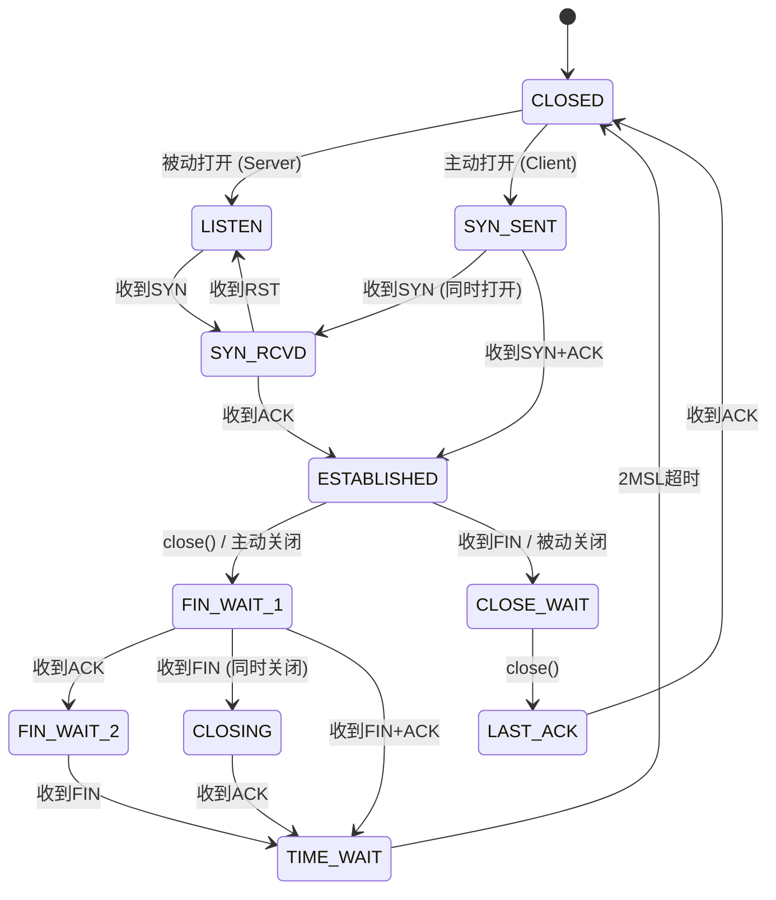

## 四、TCP协议详解

TCP（Transmission Control Protocol，传输控制协议）是整个互联网可靠通信的基石。HTTP、SSH、SMTP、FTP——几乎所有我们日常使用的应用层协议都运行在TCP之上。RFC 793（1981年）定义了TCP的核心规范，此后经过RFC 1122、RFC 2001（慢启动）、RFC 2581（拥塞控制）、RFC 6675（SACK）、RFC 7323（窗口缩放与时间戳）等一系列RFC的补充完善，TCP已经成为计算机网络中研究最深入、优化最极致的协议。

理解TCP不仅是为了通过面试，更是为了在实际系统中做出正确的架构决策：为什么你的服务在高并发下响应变慢？为什么跨机房传输大文件的速度上不去？为什么MySQL的主从复制延迟居高不下？这些问题的答案往往都指向TCP层的某个参数或行为。

本节将从比特级的段结构出发，逐步深入连接管理、可靠传输、流量控制、拥塞控制等核心机制，最终落地到生产环境的诊断与调优实践。

### 4.1 TCP段结构：比特级的精密设计

TCP将应用层数据封装为"段"（Segment），每个段由20字节的固定头部和可选的选项字段组成。理解这个头部结构是分析一切TCP行为的基础。

 0                   1                   2                   3
 0 1 2 3 4 5 6 7 8 9 0 1 2 3 4 5 6 7 8 9 0 1 2 3 4 5 6 7 8 9 0 1
├─┼─┼─┼─┼─┼─┼─┼─┼─┼─┼─┼─┼─┼─┼─┼─┼─┼─┼─┼─┼─┼─┼─┼─┼─┼─┼─┼─┼─┼─┼─┼─┤
│          Source Port          │       Destination Port         │
├───────────────────────────────┼────────────────────────────────┤
│                        Sequence Number                         │
├───────────────────────────────┼────────────────────────────────┤
│                     Acknowledgment Number                      │
├───────┼───────┼─┼─┼─┼─┼─┼─┼─┼────────────────────────────────┤
│ Data  │ Rsrvd │C│E│U│A│P|R│S│F│            Window              │
│ Offset│       │W│C│R│C│S│S│Y│I│                               │
│ (4b)  │ (4b)  │R│E│G│K│H│T│N│N│                               │
├───────┴───────┼─┼─┼─┼─┼─┼─┼─┼─┼────────────────────────────────┤
│           Checksum            │       Urgent Pointer           │
├───────────────────────────────┴────────────────────────────────┤
│                    Options (variable, 0-40 bytes)              │
├────────────────────────────────────────────────────────────────┤
│                         Data (payload)                         │
└────────────────────────────────────────────────────────────────┘

各字段的详细含义：

| 字段 | 位数 | 含义 | 实战意义 |
|------|------|------|----------|
| Source Port | 16 bit | 源端口号（0-65535） | 客户端通常使用临时端口（32768-60999），可通过`/proc/sys/net/ipv4/ip_local_port_range`调整 |
| Destination Port | 16 bit | 目标端口号 | 服务监听的端口，如80(HTTP)、443(HTTPS)、3306(MySQL) |
| Sequence Number | 32 bit | 本段数据的第一个字节在整个数据流中的偏移量 | TCP可靠传输的核心——接收方据此排序乱序到达的段 |
| Acknowledgment Number | 32 bit | 期望收到的下一个字节的序号（累积确认） | 表示该序号之前的所有数据已正确接收 |
| Data Offset | 4 bit | 头部长度，以4字节为单位 | 最小5（20字节），最大15（60字节），差值留给Options |
| Reserved | 3 bit | 保留位（含2 bit ECN） | ECN（显式拥塞通知）允许路由器标记拥塞而非直接丢包 |
| Flags | 9 bit | 控制标志位 | 见下表详述 |
| Window | 16 bit | 接收窗口大小（字节） | 流量控制的核心——通告对端"我还能接收多少数据" |
| Checksum | 16 bit | 首部+数据的校验和（伪首部参与计算） | 用于检测传输过程中的比特翻转错误 |
| Urgent Pointer | 16 bit | 紧急数据的偏移量 | 现代协议栈中几乎不再使用（URG标志位形同虚设） |
| Options | 可变 | 可选字段 | 最重要的选项：MSS、窗口缩放、SACK、时间戳 |

#### 控制标志位详解

9个标志位是TCP行为的"开关"，理解它们才能读懂抓包数据：

| 标志位 | 全称 | 含义 | 常见场景 |
|--------|------|------|----------|
| SYN | Synchronize | 请求建立连接，同步初始序列号 | 三次握手第1、2步 |
| ACK | Acknowledgment | 确认号字段有效 | 除第一个SYN外，几乎所有段都置位 |
| FIN | Finish | 请求释放连接（发送方数据已发完） | 四次挥手第1、3步 |
| RST | Reset | 强制重置连接（异常关闭） | 连接出错、端口未监听、防火墙拒绝 |
| PSH | Push | 接收方应立即将数据交给应用层（不等缓冲区满） | 交互式应用（SSH、Telnet） |
| URG | Urgent | 紧急指针有效 | 几乎不使用，历史遗留 |
| ECE | ECN Echo | 拥塞通知回应 | 配合CWR使用，支持显式拥塞通知 |
| CWR | Congestion Window Reduced | 拥塞窗口已缩小 | 发送方确认收到了ECE拥塞信号 |
| NS | Nonce Sum | 随机数和（实验性） | TCP Security选项的扩展，未广泛使用 |

```bash
# 抓包查看标志位（-v 显示详细信息）
tcpdump -i eth0 -nn -v port 80 | head -20
# 输出示例：
# 10.0.0.1.54321 > 10.0.0.2.80: Flags [S], seq 1234567, win 65535, options [mss 1460,sackOK,TS val 1234 ecr 0,nop,wscale 7], length 0
# 10.0.0.2.80 > 10.0.0.1.54321: Flags [S.], seq 7654321, ack 1234568, win 65535, options [mss 1460,sackOK,TS val 5678 ecr 1234,nop,wscale 7], length 0
# 10.0.0.1.54321 > 10.0.0.2.80: Flags [.], ack 7654322, win 512, length 0
```

#### 常见TCP选项

| 选项 | 类型值 | 说明 |
|------|--------|------|
| MSS（Maximum Segment Size） | 2 | 协商每段最大数据载荷（不含头部），以太网通常为1460字节 |
| Window Scale | 3 | 窗口缩放因子，将16位Window字段扩展到30位（最大1GB） |
| SACK Permitted | 4 | 允许选择性确认（Selective ACK） |
| SACK | 5 | 实际的SACK块，告知发送方哪些区间已收到 |
| Timestamp | 8 | 发送时间戳，用于RTT计算和防止序列号回绕（PAWS） |
| NOP | 1 | 填充对齐，无实际含义 |
| TCP Fast Open (TFO) | 34 | 允许在SYN段中携带数据，减少重复连接的延迟（详见4.2.5节） |

#### TCP段结构的边界条件

理解段结构时有几个容易被忽略的边界问题：

**伪首部（Pseudo Header）**：TCP校验和计算时会临时拼接一个12字节的伪首部，包含源IP、目的IP、协议号（6）和TCP长度。这意味着校验和不仅保护TCP头部和数据，还隐式保护了IP层的关键字段——即使IP层转发出错（将包送到错误的主机），TCP也能检测到。

**序列号回绕问题**：32位序列号空间约42亿（2³²），在1Gbps链路上全速传输时约34秒就会耗尽。TCP时间戳选项（RFC 7323）通过PAWS（Protection Against Wrapped Sequences）机制解决了这个问题：时间戳作为序列号的高位扩展，即使序列号数值回绕，仍可通过时间戳区分新旧数据。

**头部填充**：TCP头部长度必须是4字节的整数倍。当Options字段长度不是4的倍数时，用NOP（No Operation，类型1）填充。这就是为什么在抓包中经常看到连续的`nop`选项。

### 4.2 三次握手：连接建立的完整过程

三次握手（Three-Way Handshake）是TCP连接建立的标准流程。它不仅仅是"发三个包"那么简单，背后涉及半连接队列、全连接队列、SYN Cookie等重要的内核机制。

#### 4.2.1 握手过程

客户端                                          服务器
  │                                               │
  │    ① SYN (seq=x, MSS=1460, WS=7)            │
  │─────── ──────────────────────────────────────→│
  │    客户端进入 SYN_SENT 状态                    │
  │                                               │ 服务器收到SYN，进入SYN_RCVD
  │    ② SYN+ACK (seq=y, ack=x+1, MSS=1460)     │
  │←──────────────────────────────────────────────│
  │    客户端进入 ESTABLISHED 状态                 │
  │                                               │
  │    ③ ACK (ack=y+1)                            │
  │─────── ──────────────────────────────────────→│
  │                                               │ 服务器收到ACK，进入ESTABLISHED
  │              连接建立完成！                      │

#### 4.2.2 为什么是三次而不是两次或四次？

这是TCP面试中出现频率最高的问题之一，理解它需要从信息论的角度思考。

**两次握手为什么不够？** 考虑以下场景：客户端发出的第一个SYN在网络中长时间滞留（比如路由器拥塞缓存了数秒），客户端超时重传SYN并完成了连接、数据传输、正常关闭。之后那个滞留的SYN终于到达服务器，服务器以为是新连接，回复SYN+ACK并分配资源等待数据——但客户端根本没有发起新连接，服务器的资源白白浪费。三次握手让服务器在收到第三个ACK时才能确认客户端确实还在，避免了这种"历史连接"问题。

从信息论的角度看：TCP连接需要双方各至少确认一次对方"在线"。客户端通过第②步确认服务器在线，服务器通过第③步确认客户端在线。两次握手只能让一方确认，三次是保证双方都确认的最小次数。

**四次握手为什么没必要？** TCP的ACK是累积确认机制，第三个ACK包可以同时携带数据（即第三个包可以ACK+DATA），所以服务器收到ACK后可以直接进入数据传输状态，不需要额外的第四次交互。三次是保证双方都确认对方"在线"的最小次数。

**一个更深层的思考**：三次握手本质上是在不可靠的信道上建立一个可靠连接的最小交互次数。每次交互确认一个方向的通信能力：
1. 第①步：客户端→服务器 可达
2. 第②步：服务器→客户端 可达 + 服务器确认了①
3. 第③步：客户端确认了②，双方都确认了彼此的收发能力

#### 4.2.3 内核视角：连接建立的队列机制

当服务器收到SYN时，内核不是直接将连接交给应用层，而是经过两个队列的管理：

SYN到达 → 半连接队列(SYN Queue) → 三次握手完成 → 全连接队列(Accept Queue) → accept()系统调用

**半连接队列（SYN Queue）**：存储收到SYN但尚未完成三次握手的连接请求。大小由`/proc/sys/net/ipv4/tcp_max_syn_backlog`控制（默认通常为1024或更高）。当队列满时，新到的SYN会被丢弃（或触发SYN Cookie机制）。

**全连接队列（Accept Queue）**：存储已完成三次握手但尚未被应用层accept()的连接。大小由`listen(backlog)`和`/proc/sys/net/core/somaxconn`中较小的那个决定。当队列满时，新完成握手的ACK会被丢弃，服务器回复RST。

**队列溢出的连锁反应**：全连接队列满不仅仅导致新连接失败——当服务器回复RST时，客户端可能收到的是ACK丢失（因为RST也在网络中可能丢失），导致客户端重传ACK，服务器再次回复RST，反复数次后客户端才放弃。这个过程中客户端看到的是"连接被重置"错误，但在应用层可能表现为诡异的超时。

```bash
# 查看半连接队列和全连接队列的溢出统计
netstat -s | grep -i "listen"
# 输出示例：
# 1234 times the listen queue of a socket overflowed

# 查看当前监听socket的队列状态（State列：01=半连接，02=全连接）
ss -ltn
# State    Recv-Q  Send-Q  Local Address:Port  Peer Address:Port
# LISTEN   0       128     0.0.0.0:80          0.0.0.0:*
# Recv-Q=0 表示全连接队列为空，Send-Q=128 是队列最大长度

# 检查全连接队列溢出（0表示正常，持续增长说明队列满）
nstat -az TcpExtListenOverflows TcpExtListenDrops
```

#### 4.2.4 SYN Flood攻击与防御

SYN Flood是最经典的DDoS攻击方式：攻击者伪造大量源IP地址向目标发送SYN，目标服务器为每个SYN分配资源并回复SYN+ACK（发往伪造的源IP，永远不会收到ACK），半连接队列迅速被填满，导致正常用户无法建立连接。

**SYN Cookie防御机制**：Linux内核默认启用（`/proc/sys/net/ipv4/tcp_syncookies=1`）。启用后，服务器不再为SYN分配内存资源，而是将连接信息编码到SYN+ACK的序列号中（利用时间戳和IP/端口的哈希值）。当收到ACK时，服务器通过逆运算验证这个ACK是否对应一个合法的SYN请求。这样即使半连接队列满，正常连接仍然可以建立。

SYN Cookie的编码原理：SYN+ACK的序列号 = hash(源IP, 目的IP, 源端口, 目的端口, 时间窗口)。时间窗口按4分钟划分，所以编码后可以区分不同时间段的连接。代价是丢失了部分TCP选项协商（如窗口缩放因子），但这在DDoS防御场景下是可接受的权衡。

```bash
# 查看SYN Cookie状态
sysctl net.ipv4.tcp_syncookies
# 1 = 启用（默认），0 = 禁用

# 安全加固建议（sysctl.conf）
net.ipv4.tcp_syncookies = 1
net.ipv4.tcp_max_syn_backlog = 4096
net.core.somaxconn = 4096
net.ipv4.tcp_synack_retries = 2      # 减少SYN+ACK重试次数（默认5）
net.ipv4.tcp_syn_retries = 3         # 减少SYN重试次数（默认6）
```

#### 4.2.5 TCP Fast Open（TFO）：减少重复连接延迟

对于频繁与同一服务器通信的场景（如网页浏览），每次都要经历完整的三次握手会引入至少1个RTT的延迟。TCP Fast Open（RFC 7413，Linux 3.7+支持）允许在第一次连接时获取一个TFO Cookie，后续连接时在SYN段中直接携带数据——服务器在握手完成前就能处理请求，节省了1个RTT。

首次连接：
  客户端 SYN(TFO请求) → 服务器
  客户端 ← SYN+ACK + TFO Cookie 服务器

后续连接：
  客户端 SYN(TFO Cookie + HTTP请求) → 服务器
  服务器验证Cookie，立即处理请求
  客户端 ← SYN+ACK + HTTP响应 服务器

节省：1个RTT的延迟

```bash
# 启用TFO
sysctl -w net.ipv4.tcp_fastopen=3    # 3=客户端+服务端都启用
# 0=禁用, 1=仅客户端, 2=仅服务端, 3=都启用

# 持久化
echo "net.ipv4.tcp_fastopen=3" >> /etc/sysctl.conf

# 应用层使用（Python示例）
# TCP_FASTOPEN_CONNECT = 30
# sock.setsockopt(IPPROTO_TCP, TCP_FASTOPEN_CONNECT, 1)
```

TFO的限制：中间网络设备（防火墙、NAT）可能不理解SYN中携带的数据，将其丢弃或导致连接失败。在不确定的网络环境中，TFO需要设置回退机制。

### 4.3 四次挥手：连接释放的优雅过程

TCP连接的关闭需要四次挥手（Four-Way Handshake），因为TCP是全双工的——每个方向的数据传输需要独立关闭。

#### 4.3.1 挥手过程

客户端                                          服务器
  │                                               │
  │    ① FIN (seq=u)                              │
  │─────── ──────────────────────────────────────→│  客户端进入FIN_WAIT_1
  │    客户端不再发送数据                           │
  │                                               │ 服务器进入CLOSE_WAIT
  │    ② ACK (ack=u+1)                            │
  │←──────────────────────────────────────────────│
  │    客户端进入FIN_WAIT_2                        │  服务器可能还有数据要发
  │                                               │
  │    （服务器继续发送剩余数据...）                 │
  │                                               │
  │    ③ FIN (seq=w)                              │
  │←──────────────────────────────────────────────│  服务器进入LAST_ACK
  │                                               │
  │    ④ ACK (ack=w+1)                            │
  │─────── ──────────────────────────────────────→│  服务器收到ACK后立即关闭
  │    客户端进入TIME_WAIT                         │
  │                                               │
  │    等待 2MSL（通常60秒）...                    │
  │    TIME_WAIT结束，彻底关闭                      │

#### 4.3.2 为什么是四次而不是三次？

因为TCP是全双工协议。当客户端发送FIN时，仅表示"我不再发送数据了"，但服务器可能还有数据需要发送给客户端。服务器收到FIN后回复ACK确认，然后继续发送剩余数据，发完后再发送自己的FIN。因此FIN和ACK可能在不同的时间发送，无法合并为一步。

在特定情况下（服务器也没有数据要发），第②步的ACK和第③步的FIN可以合并（TCP延迟确认机制），表现为"三次挥手"。

**一个常见的误解**：很多人认为FIN段不能携带数据。实际上，RFC 793允许FIN段携带少量数据（虽然实践中很少这样做），但这些数据的可靠性不如正常数据传输——FIN的ACK只确认了FIN本身，不确认FIN中携带的数据。

#### 4.3.3 TIME_WAIT状态：被误解最多的TCP状态

TIME_WAIT状态持续2MSL（Maximum Segment Lifetime，报文最大生存时间，Linux默认为60秒，即2×30秒）。它的存在有两个关键原因：

**1. 确保最后一个ACK被可靠接收**：如果第④步的ACK丢失，服务器会重发FIN。处于TIME_WAIT的客户端可以重新发送ACK，而不是返回RST（RST会导致服务器异常关闭连接）。

**2. 防止旧连接的数据干扰新连接**：MSL是报文在网络中的最大存活时间。等待2MSL确保网络中属于旧连接的所有报文都已消亡，之后建立的新连接不会收到旧连接的迟到数据。

**3. 确保对端正确关闭**：如果最后一个ACK丢失，对端会重传FIN。TIME_WAIT状态让本端能够正确响应这个重传，而不是用RST粗暴终止——RST会让对端丢弃尚未读取的接收缓冲区数据。

**TIME_WAIT过多的问题与解决**：在高并发短连接场景（如Web服务器），大量TIME_WAIT会占用端口资源（临时端口范围有限）。

```bash
# 查看TIME_WAIT数量
ss -s
# TCP:   15234 (estab 8000, closed 5000, orphaned 123, timewait 4500)

# 查看内核参数
sysctl net.ipv4.tcp_tw_reuse        # 允许复用TIME_WAIT连接（安全，默认0/关闭）
sysctl net.ipv4.tcp_fin_timeout     # FIN_WAIT_2超时时间（默认60秒）
sysctl net.ipv4.ip_local_port_range # 临时端口范围（默认32768 60999）
```

**推荐的安全配置**：

```bash
# /etc/sysctl.conf 推荐配置
net.ipv4.tcp_tw_reuse = 1           # 允许复用TIME_WAIT（仅对主动连接方有效，使用时间戳验证安全性）
net.ipv4.tcp_fin_timeout = 30       # 缩短FIN_WAIT_2超时
net.ipv4.ip_local_port_range = 1024 65535  # 扩大临时端口范围
net.ipv4.tcp_max_tw_buckets = 10000 # TIME_WAIT最大数量（超过后直接销毁而非TIME_WAIT）
```

> **注意**：`tcp_tw_recycle`参数在Linux 4.12+已被移除。它在NAT环境下会导致严重问题——多个客户端共享同一个出口IP时，内核用时间戳判断"同一连接"，导致不同客户端的合法SYN被丢弃。在NAT环境下使用`tcp_tw_recycle`是一个经典的运维事故来源。

**CLOSE_WAIT堆积的排查**：如果`ss -tnp state close-wait`看到大量CLOSE_WAIT，这几乎100%是应用层Bug——某个函数在处理完请求后没有正确关闭连接。排查时可以用`ss -tnp state close-wait`找到对应的进程PID和文件描述符，然后检查该进程的连接池回收逻辑。常见原因包括：HTTP客户端连接池未回收、数据库连接泄漏、gRPC长连接未正确处理服务端关闭。

### 4.4 TCP状态机：完整的状态转换全景

TCP连接在其生命周期中会经历11种状态。理解状态机是诊断TCP连接问题的关键——通过`ss`命令看到的State字段就是这个状态机的当前状态。



各状态在诊断中的含义：

| 状态 | 所在方 | 含义 | 常见问题 |
|------|--------|------|----------|
| LISTEN | 服务器 | 等待连接请求 | 服务未启动、端口被占用 |
| SYN_SENT | 客户端 | 已发SYN，等待SYN+ACK | 目标端口未监听、防火墙丢包、网络不通 |
| SYN_RCVD | 服务器 | 已收SYN并回复SYN+ACK | 半连接队列满、SYN Flood攻击 |
| ESTABLISHED | 双方 | 连接已建立，可传输数据 | 正常状态 |
| FIN_WAIT_1 | 主动关闭方 | 已发FIN，等待ACK | 对端卡住（不读数据也不关闭） |
| FIN_WAIT_2 | 主动关闭方 | 已收到ACK，等待对端FIN | 对端应用层未调用close()（常见bug） |
| CLOSE_WAIT | 被动关闭方 | 已收到FIN并回复ACK，等待本端close() | **应用层Bug**：代码忘记调用close()释放连接 |
| LAST_ACK | 被动关闭方 | 已发FIN，等待最后的ACK | 极短暂，通常一闪而过 |
| TIME_WAIT | 主动关闭方 | 等待2MSL后关闭 | 大量短连接导致端口耗尽 |
| CLOSING | 双方 | 双方同时发送FIN | 极少见，只在同时关闭时出现 |

> **排查要点**：如果用`ss -ltn`看到大量CLOSE_WAIT状态，这几乎100%是应用层代码的Bug——某个函数在处理完请求后没有正确关闭连接。常见于HTTP客户端连接池未回收、数据库连接泄漏等场景。

```bash
# 按状态统计连接数
ss -tan | awk 'NR>1 {print $1}' | sort | uniq -c | sort -rn
# 输出示例：
#  12345 TIME-WAIT
#   8000 ESTAB
#    150 CLOSE-WAIT
#      5 SYN-SENT
```

### 4.5 可靠传输机制：TCP的灵魂

TCP之所以可靠，依赖的是一套精密的机制组合。这些机制协同工作，确保数据在不可靠的IP网络上实现无差错、不丢失、不重复、按序到达。

#### 4.5.1 序列号与确认应答

序列号（Sequence Number）是TCP可靠传输的基石。每个字节的数据都有唯一的序列号，接收方通过确认号（Acknowledgment Number）告知发送方"我已经收到了该序号之前的所有数据"——这就是**累积确认**（Cumulative ACK）。

发送方发送：
  段1: seq=1, data="Hello"   (5字节)
  段2: seq=6, data="World"   (5字节)

接收方确认：
  ACK: ack=11  (表示字节1-10全部收到，期望第11字节)

如果段1丢失，段2乱序到达：
  接收方仍然发送 ACK=1（只确认到第1字节），因为段1未到
  发送方重传段1后，接收方发送 ACK=11

**初始序列号（ISN）的安全性**：TCP连接的初始序列号不是从0开始，而是通过算法动态生成。RFC 6528要求ISN基于一个随时间递增的计数器（通常每4微秒加1），加上一个基于连接四元组的哈希值。这防止了序列号预测攻击——攻击者无法猜出ISN来伪造TCP段。

```bash
# 查看Linux的ISN生成方式（时间增量 + 随机偏移）
cat /proc/sys/net/ipv4/tcp_abort_on_overflow
# 0 = 正常行为（丢弃ACK），1 = 发送RST
```

#### 4.5.2 超时重传与RTO计算

当发送方在重传超时（RTO, Retransmission TimeOut）时间内未收到确认，就会重传丢失的段。RTO的计算需要精确测量网络往返时间（RTT）。

TCP使用**Jacobson/Karels算法**（RFC 6298）计算RTO：

SRTT = (1-α) × SRTT + α × RTT_sample      （指数加权移动平均，α=1/8）
RTTVAR = (1-β) × RTTVAR + β × |SRTT - RTT_sample|  （RTT偏差，β=1/4）
RTO = SRTT + 4 × RTTVAR

约束：1秒 ≤ RTO ≤ 60秒（Linux默认minRTO=200ms可通过sysctl调整）

**RTO计算的实际意义**：如果RTO设置过小，会导致不必要的重传（网络稍有波动就触发重传），浪费带宽；如果RTO设置过大，丢包后的恢复时间过长，吞吐量下降。4×RTTVAR这个系数意味着RTO对RTT波动非常敏感——在无线网络等RTT波动大的环境中，RTO会自动增大以适应。

**指数退避**：每次重传失败后，RTO翻倍（指数退避），直到达到上限。这避免了在网络严重拥塞时大量重传加剧拥塞。

```bash
# 查看当前RTO设置
sysctl net.ipv4.tcp_retries2
# 15（默认），表示最多重传15次后放弃连接（约13-30分钟）

# 查看内核统计的重传信息
netstat -s | grep -i retrans
# 123 segments retransmitted
# 45 bad segments received
```

#### 4.5.3 快速重传（Fast Retransmit）

超时重传的最小等待时间为RTO，即使在网络条件较好时也可能需要数百毫秒。快速重传机制通过**重复ACK**来加速重传：当接收方收到乱序的段时，会立即发送重复的ACK（确认最后一个按序到达的字节），一旦发送方收到**3个重复ACK**（共4个相同的ACK），就立即重传丢失的段，不等超时。

发送方发送：段1(正确), 段2(丢失), 段3(正确), 段4(正确), 段5(正确)

接收方响应：
  收到段1 → ACK=段2起始序号
  收到段3 → 重复ACK（因为段2未到）
  收到段4 → 重复ACK
  收到段5 → 重复ACK

发送方收到第3个重复ACK → 立即重传段2（不等超时）

**为什么是3个重复ACK？** 2个重复ACK可能是段重排（网络路径不同导致的延迟差异）而非丢包，只有3个重复ACK才高度可信地表明发生了丢包。这个阈值是在"快速响应"和"误判"之间的权衡。

#### 4.5.4 选择性确认（SACK）

标准的累积确认只告诉发送方"到这里都收到了"，但无法指出后面哪些段也已收到。SACK（Selective Acknowledgment，RFC 2018）允许接收方在ACK中携带多个已收到的区间信息，发送方只需重传真正丢失的段。

没有SACK：
  段1(✓) 段2(✗) 段3(✓) 段4(✓) 段5(✗) 段6(✓)
  → 发送方只知道段1确认了，需要从段2开始重传所有段

有SACK：
  ACK=段2起始序号, SACK=[段3-段4], [段6-段6]
  → 发送方精确知道只需要重传段2和段5

**DSACK（Duplicate SACK）**：RFC 2883扩展了SACK，允许接收方通知发送方"这个段我已经收到过了"（重复到达）。DSACK帮助发送方区分真正的丢包和网络重排，减少不必要的重传。Linux默认启用DSACK。

```bash
# 查看SACK是否启用
sysctl net.ipv4.tcp_sack
# 1 = 启用（默认）

# 查看DSACK是否启用
sysctl net.ipv4.tcp_dsack
# 1 = 启用（默认）

# 抓包观察SACK
tcpdump -i eth0 -nn -s 0 'tcp[tcpflags] &amp; (tcp-syn) != 0' -vv
# 看选项中的 "sackOK" 表示支持SACK
```

### 4.6 流量控制：接收方的自我保护

流量控制（Flow Control）确保发送方不会淹没接收方的接收缓冲区。接收方通过TCP头部的Window字段通告自己的可用缓冲区大小，发送方据此限制未确认数据的总量。

#### 4.6.1 滑动窗口机制

发送方的发送窗口（假设Window=1000字节）：

已确认      可以发送（已发未确认）    可以发送（未发）    不可发送
├──────────┼───────────────────────┼─────────────────┼──────────────┤
0          3000                    4000              5000          ∞
           ←──── 已用窗口 ────→    ←── 可用窗口 ──→

当收到 ACK=3500 时，窗口向右滑动：

已确认          可以发送（已发未确认）  可以发送（未发）    不可发送
├────────────────┼───────────────────┼─────────────────┼──────────────┤
0                3500                4500              5000          ∞

#### 4.6.2 零窗口与窗口探测

当接收方缓冲区满时，Window=0，发送方停止发送数据。但发送方需要定期发送**窗口探测**报文（Window Probe），查询接收方是否已释放缓冲区空间。

窗口探测间隔使用退避算法：首次探测间隔为RTO，之后翻倍，最大不超过60秒。如果接收方持续零窗口，发送方最终会放弃连接。

```bash
# 查看零窗口统计
netstat -s | grep -i "window"
# 45 times the window probe failed to open up the window
```

#### 4.6.3 Nagle算法与延迟确认的冲突

**Nagle算法**（RFC 896）：当发送方有未确认数据时，将小数据包合并发送（减少网络中的小包数量）。这对带宽利用率有利，但对交互式应用（SSH、游戏、MySQL）会引入不可接受的延迟。

**延迟确认（Delayed ACK）**：接收方不立即发送ACK，而是等待最多200ms（Linux默认），看是否有数据要回传，如果有就"捎带"ACK（Piggybacking）。

当Nagle和延迟确认同时生效时，可能产生40ms的额外延迟：

发送方：发送小数据包A → 等待ACK（Nagle阻止发送后续数据）
接收方：收到A → 等200ms再发ACK（延迟确认）
→ 最坏情况：200ms延迟

**真实案例**：SSH登录服务器时感觉"卡一下"再出现提示符，很可能就是Nagle+延迟确认的40-200ms延迟。MySQL的短查询场景也常受此影响。

```bash
# 关闭Nagle算法（应用层通过TCP_NODELAY socket选项）
# Python示例：
# sock.setsockopt(IPPROTO_TCP, TCP_NODELAY, 1)
# Go示例：
# conn.(*net.TCPConn).SetNoDelay(true)

# 查看延迟确认设置
sysctl net.ipv4.tcp_delack_min
# 最小延迟确认时间（微秒）
```

#### 4.6.4 窗口缩放（Window Scale）

TCP头部的Window字段只有16位，最大只能表示65535字节（约64KB）。在高带宽延迟积（BDP）网络中，64KB的窗口严重限制吞吐量。

**窗口缩放选项**（RFC 7323）在三次握手中协商一个缩放因子（0-14），将窗口值左移该位数：

实际窗口 = Window字段值 × 2^缩放因子

缩放因子=7（常见值）：
  实际窗口 = 65535 × 128 = 8MB

缩放因子=14（最大值）：
  实际窗口 = 65535 × 16384 = 1GB

**BDP与窗口的关系**：带宽延迟积（BDP = Bandwidth × RTT）决定了TCP传输所需的最小窗口大小。如果窗口小于BDP，发送方在等待ACK时空闲，带宽无法被充分利用。

```bash
# 计算最优TCP窗口大小（带宽延迟积）
# 公式：BDP = Bandwidth × RTT
# 示例：1Gbps带宽，10ms RTT
# BDP = 1Gbps × 10ms = 10Mbit = 1.25MB

# 更多例子：
# 100Mbps, 50ms RTT → BDP = 625KB（需要窗口缩放）
# 10Gbps, 1ms RTT  → BDP = 1.25MB（数据中心典型值）
# 10Mbps, 200ms RTT → BDP = 250KB（跨国链路典型值）

# 查看当前窗口大小（包含缩放因子）
ss -tin | grep -o 'snd_wnd:[0-9]*\|rcv_wnd:[0-9]*\|wscale:[0-9]*'
```

#### 4.6.5 软中断与GRO：内核层面的接收优化

当接收方收到大量小包时，逐个处理的开销会成为瓶颈。Linux内核通过**GRO（Generic Receive Offload）**将多个小包在内核网络栈中合并成一个大包再交给上层处理，减少了协议栈处理的次数。

原始包流：[64B][64B][64B][64B]... → 逐个处理，CPU开销大
GRO合并后：[~64KB大包]             → 一次处理，效率提升数十倍

GRO的合并条件：相邻包必须属于同一TCP流、序列号连续、没有特殊标志（如FIN/RST）。这意味着只有稳定的、顺序到达的数据流才能被有效合并。

```bash
# 查看GRO是否启用
ethtool -k eth0 | grep gro
# generic-receive-offload: on

# 启用/禁用GRO
ethtool -K eth0 gro on
ethtool -K eth0 gro off

# 查看GRO统计
ethtool -S eth0 | grep gro
```

### 4.7 拥塞控制：网络的全局协调

流量控制解决的是"发送方不超过接收方能力"的问题，拥塞控制解决的是"发送方不超过网络承载能力"的问题。如果没有拥塞控制，多个发送方同时以最高速率发送，网络中间的路由器缓冲区会溢出，导致大量丢包和全局同步——所有发送方同时超时重传，然后再次拥塞，形成恶性循环。

#### 4.7.1 经典四阶段

TCP拥塞控制由四个核心算法组成，它们通过两个关键变量协同工作：**cwnd**（拥塞窗口，发送方维护）和**ssthresh**（慢启动阈值）。

cwnd
 ↑
 │                              ┌── 丢包 → ssthresh = cwnd/2
 │                    ┌─────────┘     cwnd = ssthresh (Reno)
 │                   /               或 cwnd = ssthresh+3 (快恢复)
 │                  / 拥塞避免（线性增长）
 │                 /
 │                /
 │    ┌─────────/  ssthresh
 │   /
 │  /  慢启动（指数增长）
 │ /
 │/  cwnd=1 MSS
 └─────────────────────────────────→ 时间

**慢启动（Slow Start）**：cwnd从1 MSS开始，每收到一个ACK就增加1 MSS（每个RTT翻倍）。虽然叫"慢"启动，但实际是指数增长——从1到16只需4个RTT。当cwnd达到ssthresh时转入拥塞避免。

**拥塞避免（Congestion Avoidance）**：cwnd每RTT增加约1 MSS（线性增长）。这比指数增长温和得多，目的是小心翼翼地探测网络的剩余容量。

**快重传（Fast Retransmit）**：收到3个重复ACK时立即重传丢失段，不等RTO超时。这将恢复时间从RTO（数百毫秒到数秒）缩短到1 RTT（通常几十毫秒）。

**快恢复（Fast Recovery）**：快重传之后不回到慢启动，而是将ssthresh设为cwnd/2，cwnd设为ssthresh+3（Reno算法），直接进入拥塞避免。这是因为在收到3个重复ACK时，网络中至少还有3个段在传输，说明网络没有完全拥塞。

#### 4.7.2 Linux默认：CUBIC

CUBIC（RFC 9438）是Linux内核从2.6.19（2006年）起的默认拥塞控制算法。它使用三次函数来控制cwnd的增长：

W(t) = C × (t - K)³ + W_max

其中：
  C = 0.4（增长系数）
  W_max = 上次丢包时的cwnd
  K = 三次根(W_max × β / C)，β = 0.7（乘法减少因子）

CUBIC的优势在于：丢包后cwnd恢复的速度与带宽无关（在高带宽网络中恢复更快），这比Reno的线性恢复在高BDP网络中有显著的吞吐量优势。

```bash
# 查看当前拥塞控制算法
sysctl net.ipv4.tcp_congestion_control
# cubic（默认）

# 查看可用的拥塞控制算法
sysctl net.ipv4.tcp_available_congestion_control
# cubic reno

# 查看拥塞控制统计
netstat -s | grep -i "congestion"
```

#### 4.7.3 BBR：基于带宽测量的革命

BBR（Bottleneck Bandwidth and Round-trip propagation time）是Google在2016年提出的拥塞控制算法。它与CUBIC/Reno有本质区别：经典算法以丢包作为拥塞信号，BBR以带宽和延迟的实时测量作为决策依据。

**BBR的核心思想**：

- **BtlBw**（瓶颈带宽）：测量链路的最大吞吐量（取最近10个RTT中最大的发送速率）
- **RTprop**（最小RTT）：测量链路的传播延迟（取最近10秒中的最小RTT）
- **目标发送速率 = BtlBw × RTprop**（BDP）

BBR不断交替探测更高的带宽和更低的延迟，找到最佳操作点。它不会因为随机丢包（非拥塞导致的）而降低发送速率，这在高延迟、有随机丢包的网络（如跨国链路、无线网络）中优势明显。

**BBRv2的改进**：BBRv1存在与基于丢包的算法（如CUBIC）共存时的不公平性问题——BBR会抢占过多带宽。BBRv2引入了丢包信号作为辅助参考，改善了公平性和与传统算法的共存性。BBRv2还改进了对浅缓冲区设备的处理，减少了缓冲区膨胀（Bufferbloat）问题。

```bash
# 启用BBR（需要Linux 4.9+）

# 方法一：运行时切换
sysctl -w net.core.default_qdisc=fq
sysctl -w net.ipv4.tcp_congestion_control=bbr

# 方法二：持久化（/etc/sysctl.conf）
echo "net.core.default_qdisc=fq" >> /etc/sysctl.conf
echo "net.ipv4.tcp_congestion_control=bbr" >> /etc/sysctl.conf
sysctl -p

# 验证BBR是否生效
sysctl net.ipv4.tcp_congestion_control
# bbr

# 查看BBR统计信息
ss -tin | grep bbr
```

#### 4.7.4 拥塞控制算法对比

| 特性 | Reno | CUBIC | BBR |
|------|------|-------|-----|
| 拥塞信号 | 丢包 | 丢包 | 带宽+延迟测量 |
| 增长函数 | 线性 | 三次函数 | 探测式（交替升带宽/降延迟） |
| 丢包后恢复 | 慢（线性增长） | 快（三次函数增长更快） | 与丢包无关 |
| 高BDP网络表现 | 差 | 好 | 最好 |
| 有随机丢包时 | 极差 | 较差 | 好（不因随机丢包降速） |
| 公平性 | 好 | 好（收敛到相同带宽） | 需配合fq使用 |
| Linux默认 | 否（已弃用） | 是（4.19前） | 否（需手动启用） |
| 适用场景 | 教学/小型网络 | 通用 | 跨国链路、CDN、云环境 |

#### 4.7.5 ECN：显式拥塞通知

传统的拥塞检测依赖丢包（隐式信号），ECN（Explicit Congestion Notification，RFC 3168）允许路由器在拥塞时直接标记IP包（设置CE标志），而非丢弃。接收方在ACK中设置ECE标志通知发送方，发送方随后降低cwnd。

发送方 → [ECE+CWR] → 路由器(标记CE) → 接收方 [ECE] → 发送方 (降低cwnd)

ECN的优势：避免了丢包带来的重传开销，在数据中心等对延迟敏感的环境中尤其有效。

```bash
# 启用ECN
sysctl -w net.ipv4.tcp_ecn=1    # 0=禁用, 1=请求对端启用, 2=总是启用
```

### 4.8 TCP Keepalive：连接存活检测

TCP Keepalive不是TCP协议本身强制要求的（RFC 1122建议但不强制），但几乎所有操作系统都实现了它。Keepalive在空闲连接上定期发送探测段，检测对端是否仍然存活。

空闲连接 → Keepalive探测间隔(默认7200秒=2小时) → 发送探测段
  → 收到ACK → 连接存活，重置计时器
  → 无响应 → 重试（默认9次，间隔75秒）
  → 9次全部无响应 → 判定连接死亡，关闭

**Keepalive vs 应用层心跳**：TCP Keepalive由内核维护，对应用层透明，但默认参数太保守（2小时才探测一次）。应用层心跳可以自定义间隔（如30秒），还能携带业务数据（如负载信息），是更灵活的选择。生产环境通常两者结合使用：应用层心跳做快速检测（30秒内发现断连），TCP Keepalive做兜底保护（防止应用层心跳本身失效）。

```bash
# Linux TCP Keepalive参数
sysctl net.ipv4.tcp_keepalive_time     # 空闲多久后开始探测（秒，默认7200）
sysctl net.ipv4.tcp_keepalive_intvl    # 探测间隔（秒，默认75）
sysctl net.ipv4.tcp_keepalive_probes   # 最大探测次数（默认9）

# 应用层设置示例（Python）：
# sock.setsockopt(SOL_SOCKET, SO_KEEPALIVE, 1)
# sock.setsockopt(IPPROTO_TCP, TCP_KEEPIDLE, 60)    # 空闲60秒后探测
# sock.setsockopt(IPPROTO_TCP, TCP_KEEPINTVL, 10)   # 每10秒探测一次
# sock.setsockopt(IPPROTO_TCP, TCP_KEEPCNT, 3)      # 3次无响应判定死亡
```

> **实战建议**：生产环境中应缩短Keepalive参数，特别是对于负载均衡器后面的后端连接。默认的2小时太长——负载均衡器可能已经关闭了空闲连接，但后端还保持着"僵尸"连接。

### 4.9 TCP调优：从参数到实战

#### 4.9.1 缓冲区大小调优

TCP缓冲区直接影响吞吐量。Linux为每个TCP连接维护三个缓冲区：

```bash
# 发送缓冲区
net.ipv4.tcp_wmem = 4096 16384 4194304   # 最小 默认 最大（字节）

# 接收缓冲区
net.ipv4.tcp_rmem = 4096 87380 6291456    # 最小 默认 最大

# 全局缓冲区限制
net.core.rmem_max = 2097152
net.core.wmem_max = 2097152
net.core.rmem_default = 262144
net.core.wmem_default = 262144
```

> **高带宽延迟积网络的缓冲区计算**：对于1Gbps带宽、50ms RTT的链路，BDP = 1Gbps × 50ms = 50Mbit = 6.25MB。缓冲区至少应为BDP的2倍，即12.5MB，才能充分利用带宽。

**Linux的自动缓冲区调节**：Linux内核的`tcp_moderate_rcvbuf`默认启用，会根据连接的RTT和吞吐量自动调整接收缓冲区大小。在大多数场景下，默认的自动调节已经足够，不需要手动设置固定值。

#### 4.9.2 SO_REUSEPORT：高并发服务器的秘密武器

传统的TCP服务器使用单个监听socket接受连接，所有工作线程竞争同一个accept()队列，在多核CPU上造成严重的锁竞争。SO_REUSEPORT（Linux 3.9+）允许多个socket绑定到同一个端口，内核自动在它们之间分配新连接，消除了锁竞争。

传统模式（单socket）：
  工作线程1 ─┐
  工作线程2 ─┤─ 竞争同一个accept() → 锁瓶颈
  工作线程3 ─┘

SO_REUSEPORT模式：
  工作线程1 → socket1 (port 80)
  工作线程2 → socket2 (port 80)    ← 内核负载均衡分配
  工作线程3 → socket3 (port 80)

```bash
# SO_REUSEPORT的使用方式（Python示例）：
# import socket
# sock = socket.socket(socket.AF_INET, socket.SOCK_STREAM)
# sock.setsockopt(socket.SOL_SOCKET, socket.SO_REUSEPORT, 1)
# sock.bind(('0.0.0.0', 80))
# sock.listen(128)

# Nginx的reuseport配置（显著提升多核性能）：
# listen 80 reuseport;

# 查看SO_REUSEPORT的内核负载均衡统计
nstat -az TcpExtTCPAutoCog | head -5
```

**SO_REUSEPORT的限制**：它只对新建立的连接有效，不会迁移已有的连接。在Kubernetes等容器环境中，SO_REUSEPORT可以与IPVS配合实现无损的滚动更新——新进程启动并SO_REUSEPORT绑定后，新连接自动分配到新进程，旧进程逐渐排空。

#### 4.9.3 TCP Offload：硬件加速

现代网卡支持将TCP的部分计算卸载到硬件，减轻CPU负担：

| 技术 | 全称 | 功能 | 对性能的影响 |
|------|------|------|------------|
| TSO | TCP Segmentation Offload | 将大块数据的分段工作交给网卡 | 减少CPU 30-50%的网络开销 |
| GRO | Generic Receive Offload | 将多个小包合并成大包 | 减少协议栈处理次数 |
| GSO | Generic Segmentation Offload | 软件层面的TSO替代（网卡不支持时） | 兼容性好，性能略低于TSO |
| LRO | Large Receive Offload | 网卡硬件层面的GRO | 比GRO更快，但与某些驱动不兼容 |
| checksum offload | 校验和卸载 | 网卡计算TCP/UDP/IP校验和 | 减少CPU计算开销 |

```bash
# 查看网卡offload能力
ethtool -k eth0 | grep -E "tcp-segmentation|generic-receive|checksum"
# tcp-segmentation-offload: on
# generic-receive-offload: on
# tx-checksumming: on

# 启用/禁用TSO
ethtool -K eth0 tso on
```

#### 4.9.4 TCP内存管理：tcp_mem三元组

Linux内核通过`tcp_mem`三元组控制TCP整体的内存使用，防止TCP消耗过多系统内存：

```bash
# /proc/sys/net/ipv4/tcp_mem（单位：页，通常4KB/页）
# 格式：压力阈值 警告阈值 最大阈值
cat /proc/sys/net/ipv4/tcp_mem
# 382348  509798  764696

# 低于压力阈值：正常运行
# 达到警告阈值：内核开始丢弃新数据，收缩已有连接的窗口
# 达到最大阈值：新连接被拒绝
```

当TCP内存使用接近警告阈值时，内核会自动调整每个连接的缓冲区大小（`tcp_moderate_rcvbuf`），优先保证连接数量而非单个连接的吞吐量。这在内存有限的容器环境中尤为重要。

### 4.10 TCP性能诊断实战

#### 4.10.1 常用诊断工具

```bash
# ss：查看TCP连接状态（netstat的替代品，速度更快）
ss -tnp                          # 查看所有TCP连接及对应进程
ss -s                            # 汇总统计（各状态连接数）
ss -tin state established        # 已建立连接的详细信息（含RTT、拥塞窗口等）

# 输出中关键字段：
# cubic → 使用CUBIC拥塞控制
# wscale:7,7 → 发送/接收窗口缩放因子
# rto:204 → 重传超时（毫秒）
# rtt:1.2/0.5 → RTT/RTT偏差（毫秒）
# cwnd:10 → 当前拥塞窗口（MSS数）
# retrans:0/0 → 当前重传/总重传
# send 95.3Mbps → 当前发送速率

# nstat / netstat -s：查看内核TCP统计
nstat -az | grep -i tcp | sort -k2 -rn | head -20

# 关键统计指标：
# TcpRetransSegs → 重传段数（持续增长说明网络丢包或拥塞）
# TcpExtListenOverflows → 全连接队列溢出次数
# TcpExtTCPLostRetransmit → 重传但对方已收到的次数
# TcpExtTCPTimeouts → TCP超时次数
```

#### 4.10.2 用tcpdump分析TCP问题

```bash
# 抓取完整的TCP会话（含SYN/FIN/RST）
tcpdump -i eth0 -nn -s 0 'host 10.0.0.1 and port 80' -w /tmp/capture.pcap

# 实时查看TCP重传
tcpdump -i eth0 -nn 'tcp[tcpflags] &amp; (tcp-rst) != 0'    # RST报文
tcpdump -i eth0 -nn 'tcp[tcpflags] &amp; (tcp-syn) != 0'    # SYN报文

# 使用tshark（Wireshark命令行）分析重传率
tshark -r /tmp/capture.pcap -q -z io,stat,1,"COUNT(tcp.analysis.retransmission)tcp.analysis.retransmission"

# 分析特定连接的时序（显示每个包的时间差）
tcpdump -i eth0 -nn -tt 'host 10.0.0.1 and port 80' | awk '{
    if (NR==1) { first=$1; prev=$1; print }
    else { printf "%+.6f %s\n", $1-prev, substr($0, index($0,$2)); prev=$1 }
}'
```

#### 4.10.3 诊断流程：从症状到根因

面对TCP性能问题，推荐的诊断流程：

第一步：确认现象
  → 是连接建不上？还是建上了但慢？还是间歇性断开？

第二步：查看连接状态
  → ss -s / ss -tan | awk '{print $1}' | sort | uniq -c | sort -rn
  → 大量SYN_SENT？→ 目标不可达/防火墙
  → 大量CLOSE_WAIT？→ 应用层Bug
  → 大量TIME_WAIT？→ 短连接过多

第三步：检查拥塞和丢包
  → ss -tin 看 cwnd / snd_wnd / retrans / rtt
  → nstat 看 TcpRetransSegs / TcpExtTCPTimeouts
  → retrans 持续增长？→ 网络质量问题

第四步：检查队列
  → ss -ltn 看 Send-Q vs Recv-Q
  → Recv-Q > 0？→ accept() 太慢或队列太小
  → netstat -s | grep overflow 持续增长？→ 需要增大somaxconn

第五步：抓包深入分析
  → tcpdump 抓取问题时段的包
  → tshark 分析重传率、延迟分布、窗口变化

#### 4.10.4 常见问题速查

| 现象 | 可能原因 | 诊断方法 | 解决方案 |
|------|----------|----------|----------|
| 连接超时（SYN_SENT） | 防火墙丢包、端口未监听 | `tcpdump`看SYN是否有响应 | 检查iptables/firewalld、确认服务监听 |
| 大量TIME_WAIT | 短连接过多 | `ss -s` | 启用`tcp_tw_reuse`、扩大端口范围、改用连接池 |
| 大量CLOSE_WAIT | 应用层未关闭连接 | `ss -tnp state close-wait` | 修复代码中的连接泄漏 |
| 吞吐量低 | 窗口太小或拥塞控制保守 | `ss -tin`看cwnd和snd_wnd | 调整TCP缓冲区、启用BBR |
| 重传率高 | 网络拥塞或链路质量差 | `nstat`看TcpRetransSegs | 排查网络设备、启用SACK |
| 全连接队列溢出 | accept()太慢或队列太小 | `netstat -s \| grep overflow` | 增大somaxconn、优化应用accept速度 |
| RST导致连接断开 | 对端进程崩溃或防火墙 | 抓包看RST来源 | 排查对端进程、检查安全策略 |
| 连接延迟高 | Nagle+延迟确认冲突 | 检查是否使用了TCP_NODELAY | 应用层设置TCP_NODELAY |
| 连接建立慢 | 三次握手耗时长 | tcpdump看SYN到ESTABLISHED的时间 | 启用TCP Fast Open、减少SYN重试次数 |

### 4.11 生产环境推荐配置

```bash
# /etc/sysctl.conf — 高并发Web服务器推荐
# ======== 连接管理 ========
net.ipv4.tcp_syncookies = 1
net.ipv4.tcp_max_syn_backlog = 65536
net.core.somaxconn = 65536
net.ipv4.tcp_tw_reuse = 1
net.ipv4.tcp_fin_timeout = 15
net.ipv4.ip_local_port_range = 1024 65535
net.ipv4.tcp_max_tw_buckets = 200000

# ======== 缓冲区 ========
net.core.rmem_max = 16777216
net.core.wmem_max = 16777216
net.ipv4.tcp_rmem = 4096 87380 16777216
net.ipv4.tcp_wmem = 4096 65536 16777216

# ======== 拥塞控制 ========
net.core.default_qdisc = fq
net.ipv4.tcp_congestion_control = bbr

# ======== 保活 ========
net.ipv4.tcp_keepalive_time = 600
net.ipv4.tcp_keepalive_intvl = 30
net.ipv4.tcp_keepalive_probes = 3

# ======== 其他 ========
net.ipv4.tcp_sack = 1
net.ipv4.tcp_window_scaling = 1
net.ipv4.tcp_timestamps = 1
net.ipv4.tcp_ecn = 0
net.ipv4.tcp_slow_start_after_idle = 0    # 空闲后不重置cwnd（短连接场景优化）
```

**配置生效验证**：

```bash
# 应用配置
sysctl -p

# 逐项验证关键参数
for param in tcp_syncookies tcp_tw_reuse tcp_congestion_control tcp_sack tcp_timestamps; do
    echo "$param = $(sysctl -n net.ipv4.$param)"
done

# 验证BBR是否真正生效
ss -tin | head -5 | grep -o 'bbr\|cubic'
# 如果看到bbr，说明BBR已经在工作
```

### 4.12 TCP协议的历史演进

理解TCP的发展历史有助于理解每个设计决策背后的权衡：

| 年份 | 里程碑 | 意义 |
|------|--------|------|
| 1974 | Vint Cerf & Bob Kahn发表TCP初始论文 | 概念提出，当时TCP包含IP的功能 |
| 1978 | TCP/IP分层，TCP与IP分离 | 现代TCP/IP协议栈雏形 |
| 1981 | RFC 793发布 | TCP核心规范定稿 |
| 1988 | Van Jacobson发表"慢启动"论文 | 拥塞控制诞生，避免互联网"拥塞崩溃" |
| 1990 | RFC 1122（主机需求） | 明确TCP实现要求 |
| 1994 | RFC 1644（TCP扩展选项） | 窗口缩放、时间戳，支持高带宽网络 |
| 1996 | SACK（RFC 2018） | 选择性确认，提升丢包恢复效率 |
| 2004 | CUBIC论文发表 | 高带宽网络优化 |
| 2006 | Linux默认切换到CUBIC | Reno退出历史舞台 |
| 2016 | Google发布BBR | 基于测量的拥塞控制，颠覆了30年的设计范式 |
| 2017 | TCP Fast Open（RFC 7413）标准化 | 减少重复连接延迟 |
| 2020 | BBRv2开始标准化 | 改善公平性和与传统算法的共存 |
| 2024 | BBRv2持续推进 | 更好的公平性和丢包处理 |

### 4.13 TCP的局限与未来

TCP设计于1981年，虽然经过40多年的持续优化，但在现代网络环境中仍然存在一些结构性限制：

**队头阻塞（Head-of-Line Blocking）**：TCP保证字节流的有序交付，即使应用层可以处理乱序数据（如HTTP/2的多路复用），一个TCP段的丢失也会阻塞后续所有段的交付。这是QUIC（基于UDP）在HTTP/3中被采用的核心原因之一。

**连接迁移**：TCP连接由四元组（源IP、源端口、目的IP、目的端口）标识。当客户端从WiFi切换到4G时，IP地址变化导致所有TCP连接断开。QUIC通过连接ID实现了连接迁移，解决了移动场景的痛点。

**握手延迟**：TCP需要三次握手（1 RTT），加上TLS 1.3还需要额外的1 RTT（或0-RTT恢复）。QUIC将传输层握手和TLS握手合并，在首次连接时实现1 RTT，恢复时实现0 RTT。

**协议僵化（Ossification）**：中间设备（防火墙、NAT、负载均衡器）对TCP头部的特定字段有硬编码假设，使得TCP扩展变得极其困难。这也是为什么新的传输层创新（如QUIC）选择在UDP上实现，绕过了中间设备的限制。

尽管如此，TCP在未来很长一段时间内仍然是互联网的主力传输协议。理解TCP的原理和调优方法，对于构建高性能、高可用的网络服务至关重要。

### 4.14 本节要点回顾

| 主题 | 核心要点 |
|------|----------|
| 段结构 | 20字节固定头部 + 可选Options，9个标志位控制行为 |
| 三次握手 | SYN→SYN+ACK→ACK，确保双方收发能力，队列机制影响并发 |
| 四次挥手 | FIN→ACK→FIN→ACK，TIME_WAIT存在是为了可靠关闭和防止数据干扰 |
| 状态机 | 11种状态，CLOSE_WAIT堆积=应用层Bug，TIME_WAIT过多=短连接问题 |
| 可靠传输 | 序列号+累积确认+超时重传+快速重传+SACK，五道防线 |
| 流量控制 | 滑动窗口，Nagle+延迟确认冲突需TCP_NODELAY，窗口缩放解决64KB限制 |
| 拥塞控制 | CUBIC（丢包信号）→BBR（带宽测量），BBR在高延迟网络中优势明显 |
| 调优 | 缓冲区匹配BDP，启用BBR，SO_REUSEPORT消除锁竞争，TFO减少握手延迟 |
| 诊断 | ss看状态、nstat看统计、tcpdump看包、tshark分析重传 |
