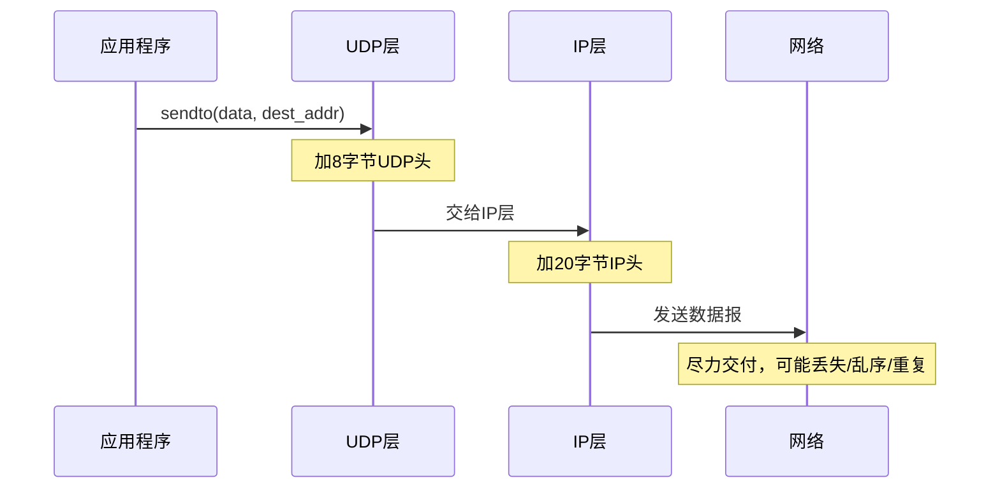
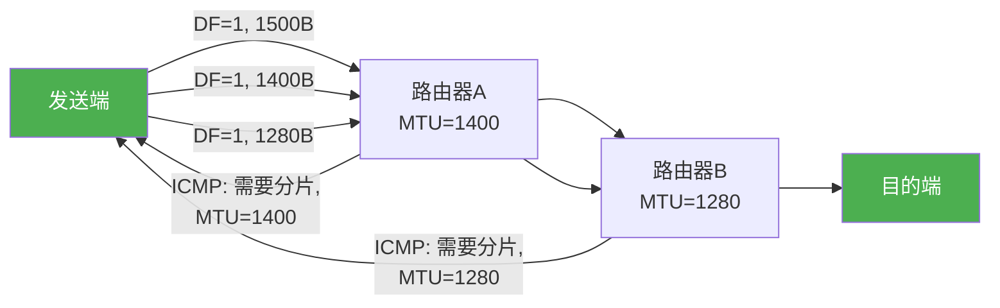
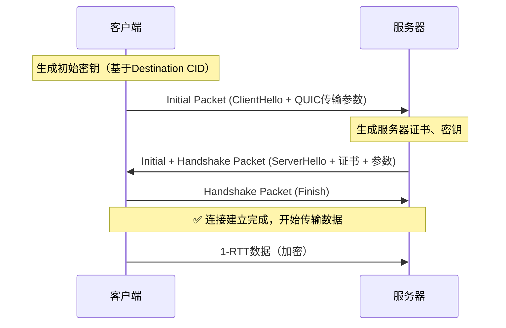
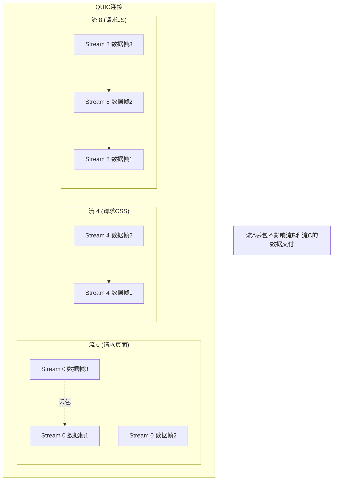
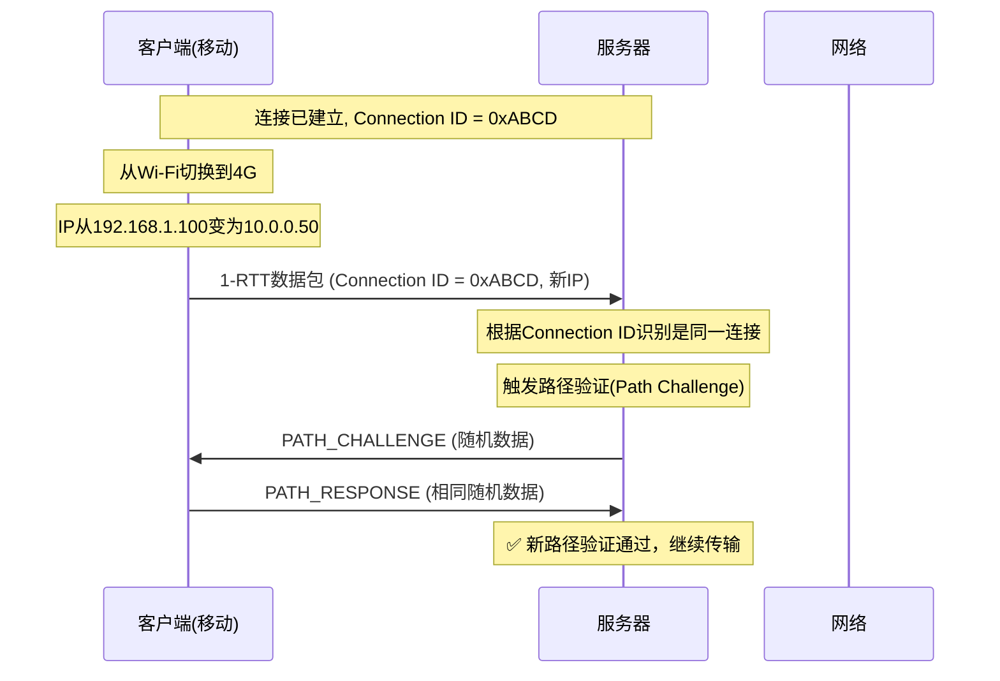
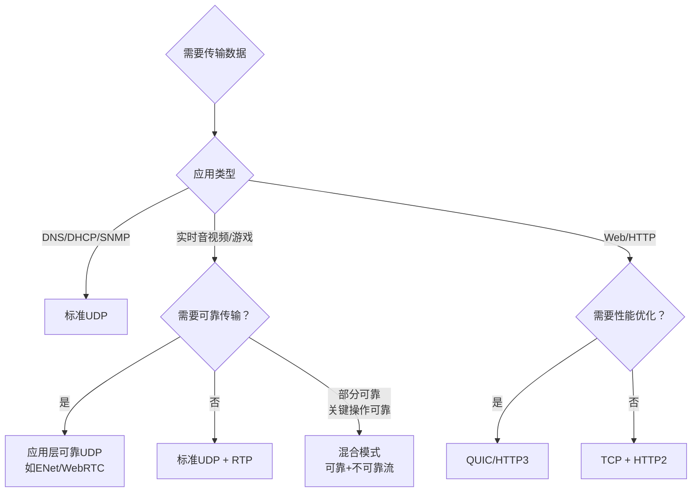

## 五、UDP与QUIC

### 5.1 UDP协议基础

#### 5.1.1 为什么需要UDP

在传输层协议的设计哲学中，存在两种截然不同的路线：一种是以TCP为代表的"可靠交付"路线——通过确认重传、拥塞控制、流量控制等机制，保证数据完整有序地到达对端；另一种是以UDP为代表的"快速交付"路线——尽可能快地把数据发出去，至于对方收没收到、顺序对不对，一概不管。

这两种路线并非简单的"好与坏"，而是针对不同场景的最优选择。TCP的可靠性是有代价的：三次握手至少消耗一个RTT，每个段都需要ACK确认，重传机制在丢包时会造成额外延迟，拥塞控制会在网络拥塞时主动降速。在某些场景下，这些代价是不可接受的：

- **实时音视频通信**：视频会议中，一帧画面延迟200ms到达，远比丢掉这帧画面更糟糕。过时的数据不仅没有价值，还会干扰后续画面的解码播放。
- **在线游戏**：玩家的操作指令需要在毫秒级内送达服务器，一个延迟的移动指令可能导致角色"瞬移"到错误位置。
- **DNS查询**：一个域名解析请求只有几十字节，为这点数据建立TCP连接（三次握手+四次挥手）完全是一种浪费。
- **物联网传感器数据**：温度传感器每秒上报一次读数，旧的读数自动被新读数覆盖，丢失一个数据点毫无影响。

UDP的核心设计哲学可以概括为八个字：**发送即忘（Fire and Forget）**。它不保证可靠性，不保证顺序，不保证不重复——但正因如此，它获得了TCP无法企及的速度和效率。

RFC 768（1980年）定义了UDP的核心规范，至今已超过45年未做实质性修改——这份"不朽"恰恰说明了其设计的简洁与正确：用最少的机制完成传输层的基本工作，把复杂性留给应用层按需实现。

#### 5.1.2 UDP报文结构

UDP的报文结构是整个TCP/IP协议栈中最简单的之一，整个UDP头仅有8个字节，相比TCP最少20字节的头开销，体现了极致的精简设计。

 0                   1                   2                   3
 0 1 2 3 4 5 6 7 8 9 0 1 2 3 4 5 6 7 8 9 0 1 2 3 4 5 6 7 8 9 0 1
├─┼─┼─┼─┼─┼─┼─┼─┼─┼─┼─┼─┼─┼─┼─┼─┼─┼─┼─┼─┼─┼─┼─┼─┼─┼─┼─┼─┼─┼─┼─┼─┤
│          Source Port          │       Destination Port         │
├───────────────────────────────┼────────────────────────────────┤
│            Length             │           Checksum             │
├───────────────────────────────┼────────────────────────────────┤
│                         Data (payload)                         │
│                          ... ... ...                           │
└────────────────────────────────────────────────────────────────┘

每个字段的含义如下：

| 字段 | 位数 | 说明 |
|------|------|------|
| Source Port | 16位 | 源端口号，标识发送方进程。0表示不需回复（匿名端口） |
| Destination Port | 16位 | 目的端口号，标识接收方进程 |
| Length | 16位 | UDP报文总长度（头+载荷），最小8字节（仅有头） |
| Checksum | 16位 | 校验和，用于检测传输中的比特错误。IPv4中可选，IPv6中强制 |

**Length字段的取值范围**：最小值为8（仅UDP头，无载荷数据），最大值为65535（16位全1），即UDP报文的最大理论长度为65535字节。扣除20字节IP头和8字节UDP头，单个UDP数据报的最大载荷为65507字节。但实际中由于以太网MTU限制（1500字节），超过这个大小的UDP数据报会在IP层被分片，而分片会带来严重的性能和可靠性问题，因此实践中应避免发送过大的UDP数据报。

#### 5.1.3 UDP校验和与伪头部

UDP校验和是IPv4中唯一可选的传输层校验机制（IPv6中强制要求），但理解其计算方式对于诊断网络问题至关重要。

校验和的计算范围覆盖三个部分：**伪头部（Pseudo Header）**、**UDP头部**和**载荷数据**。伪头部并不属于UDP报文本身，而是从IP层"借来"用于校验的信息：

IPv4 伪头部（12字节）:
┌───────────────────────────────┐
│        源IP地址 (32位)         │
├───────────────────────────────┤
│       目的IP地址 (32位)        │
├───────────────────┬─────┬─────┤
│   全零 (8位)      │协议号│UDP  │
│                   │(8位)│长度 │
│                   │ 17  │(16位)│
└───────────────────┴─────┴─────┘

IPv6 伪头部（40字节）:
┌───────────────────────────────┐
│        源IP地址 (128位)        │
├───────────────────────────────┤
│       目的IP地址 (128位)       │
├───────────────────┬─────┬─────┤
│   UDP长度(32位)   │全零 │协议号│
│                   │(24位)│(8位)│
│                   │      │ 17  │
└───────────────────┴─────┴─────┘

以下是用Python计算UDP校验和的完整示例：

```python
import socket
import struct

def udp_checksum(src_ip, dst_ip, src_port, dst_port, payload):
    """计算UDP校验和（含IPv4伪头部）"""
    # 1. 构造伪头部
    pseudo_header = socket.inet_aton(src_ip) + \
                    socket.inet_aton(dst_ip) + \
                    struct.pack('!BBH', 0, 17, 8 + len(payload))
                    # 0=保留, 17=UDP协议号, UDP长度

    # 2. 构造UDP头部（校验和字段先置0）
    udp_header = struct.pack('!HHH', src_port, dst_port, 8 + len(payload))
    #                                  源端口  目的端口  UDP长度   校验和=0

    # 3. 计算校验和
    data = pseudo_header + udp_header + payload
    if len(data) % 2:  # 奇数字节补零
        data += b'\x00'

    checksum = 0
    for i in range(0, len(data), 2):
        word = (data[i] << 8) + data[i + 1]
        checksum += word

    # 折叠32位为16位
    while checksum >> 16:
        checksum = (checksum &amp; 0xFFFF) + (checksum >> 16)

    checksum = ~checksum &amp; 0xFFFF  # 取反
    return checksum

# 使用示例
cksum = udp_checksum('192.168.1.100', '10.0.0.1', 12345, 53, b'\x00\x01\x01\x00')
print(f"UDP Checksum: 0x{cksum:04X}")
```

**为什么伪头部是跨层设计？** 伪头部让UDP校验和能够验证报文确实被送到了正确的目的地址和端口。如果IP层因为路由错误把UDP报文送到了错误的目的主机，校验和验证会失败，UDP会静默丢弃该报文。这种跨层校验虽然违反了严格的分层原则，但大大增强了端到端的数据完整性保障。在实际的Wireshark抓包中，你可以看到UDP的Checksum字段标注为"correct"或"incorrect"，这正是校验和验证的结果。

> **注意**：现代网卡通常支持UDP/TCP校验和卸载（Checksum Offload），由硬件计算校验和，CPU无需参与。因此在抓包时，发送方向的校验和可能显示为"incorrect"——这不是真的错误，而是网卡尚未填写校验和的中间状态。

#### 5.1.4 UDP的工作方式

UDP的工作方式可以用一句话概括：应用层说"发"，UDP就把数据加上8字节头，交给IP层，完事。



关键特征包括：

**无连接（Connectionless）**：发送数据前不需要建立连接，不需要协商参数（如窗口大小、MSS等）。每个UDP数据报都是独立的个体，与前后数据报没有任何关联。这意味着发送方可以在发送第一个数据报后立即发送第二个，不需要等待任何确认。

**不可靠（Unreliable）**：UDP不保证数据报能到达对端。网络拥塞、路由器缓冲区溢出、链路故障等原因都可能导致数据报丢失，而UDP不会重传。UDP也不保证数据报的到达顺序，后发的数据报可能先到。UDP不保证不重复，同一个数据报可能因为网络层的多路径路由或IP分片重组而被重复投递。

**面向报文（Message-Oriented）**：UDP保留了应用层消息的边界。每次`sendto`调用发送的数据，对端用一次`recvfrom`就能完整接收（只要缓冲区足够大）。这与TCP的面向字节流不同——TCP不保留消息边界，发送方写入100字节再写入200字节，接收方可能一次性收到300字节，也可能分多次收到，需要应用层自行界定消息边界。

#### 5.1.5 UDP与IP分片：被忽视的性能杀手

UDP与IP分片的关系是实际工程中最容易踩坑的点之一。当UDP数据报的总大小（IP头20字节 + UDP头8字节 + 载荷）超过链路MTU时，IP层会对数据报进行分片。分片带来的问题远比想象中严重：

**分片的代价**：

| 问题 | 影响 | 严重程度 |
|------|------|----------|
| 任一分片丢失，整个数据报重传 | 有效重传量远大于实际丢失量 | 极高 |
| 分片重组在接收端进行，中间设备无法参与 | 中间防火墙/NAT可能无法正确处理分片 | 高 |
| 攻击者可发送畸形分片触发重组超时 | Teardrop攻击、重叠分片攻击 | 高（安全） |
| 第一个分片包含UDP头（含端口号），后续分片不包含 | 部分防火墙只检查第一个分片，后续分片可绕过过滤 | 极高（安全） |
| 分片增加接收端CPU开销和内存占用 | 高并发下可能耗尽重组缓冲区 | 中 |

**路径MTU发现（PMTUD）**：为了避免分片，发送端需要知道路径上最小的MTU——这就是路径MTU发现（Path MTU Discovery）的核心思想。PMTUD的工作流程是：

1. 发送端将IP数据报设置DF（Don't Fragment）标志位
2. 如果路径上某个路由器的MTU小于数据报大小，路由器丢弃该数据报并返回ICMP "Fragmentation Needed"（类型3，代码4）消息
3. 发送端收到ICMP消息后，减小数据报大小，重复步骤1
4. 直到数据报成功通过，此时的数据报大小就是路径MTU



**实践建议**：永远不要依赖PMTUD来避免UDP分片——因为很多网络环境会丢弃ICMP消息（防火墙、云NAT等），导致PMTUD静默失败。正确的做法是在应用层控制发送大小：UDP载荷不超过**1280字节**（IPv6最小MTU）或**1472字节**（以太网MTU 1500 - IP头20 - UDP头8）。如果需要传输更大的数据，应在应用层实现分片和重组逻辑。

```python
# 应用层安全UDP发送：自动分片
MAX_UDP_PAYLOAD = 1280  # IPv6最小MTU，对IPv4同样安全

def safe_udp_send(sock, data, dest_addr):
    """将大数据分片为不超过MTU的UDP数据报"""
    total = len(data)
    fragments = []
    for offset in range(0, total, MAX_UDP_PAYLOAD):
        chunk = data[offset:offset + MAX_UDP_PAYLOAD]
        # 添加分片头：4字节序号 + 2字节偏移 + 2字节总长度
        header = struct.pack('!IHH', 0, offset, total)
        fragments.append(header + chunk)

    for i, frag in enumerate(fragments):
        sock.sendto(frag, dest_addr)
        # 可选：控制发送间隔，避免突发拥塞
        if i < len(fragments) - 1:
            time.sleep(0.001)  # 1ms间隔
```

#### 5.1.6 UDP的典型应用场景

**DNS（域名系统）**：DNS是UDP最经典的应用场景。一次DNS查询通常只有几十到几百字节的数据量，查询-响应模式天然适合无连接的UDP。虽然DNS也支持TCP（主要用于区域传送和超过512字节的响应），但绝大多数日常DNS查询都通过UDP完成。现代DNS实践中，当响应超过512字节（EDNS0允许最大4096字节）时会自动切换到TCP。

**DHCP（动态主机配置协议）**：客户端在获取IP地址之前还没有网络身份，无法建立TCP连接，因此DHCP必须基于UDP。整个DHCP交互（Discover→Offer→Request→ACK）都是通过广播方式的UDP数据报完成的。

**SNMP（简单网络管理协议）**：网络设备的监控和管理数据量小、实时性要求高，使用UDP可以避免因网络拥塞时TCP的拥塞控制反而加剧设备负担。

**实时音视频**：RTP（Real-time Transport Protocol）运行在UDP之上，用于VoIP、视频会议、在线直播等场景。这些场景对延迟极度敏感，宁可丢帧也不能等重传。

**在线游戏**：游戏的状态同步需要极低延迟，过时的状态信息毫无价值。大多数竞技游戏使用自定义的UDP协议或在UDP之上构建可靠层（如ENet、GameNetworkingSockets），只对关键操作（如射击、购买）做可靠传输，对位置更新等高频数据使用不可靠传输。

#### 5.1.7 UDP-Lite：容错传输的折中方案

标准UDP的校验和会检测整个载荷的每一位错误，丢弃任何校验失败的数据报。但在某些应用场景中，部分比特错误是可以容忍的——比如语音编码（一个比特的翻转只产生轻微杂音，而丢包会导致断续）、视频编码（错误宏块可以通过前一帧掩盖）。UDP-Lite（RFC 3828）正是为此设计的变体：

| 特性 | 标准UDP | UDP-Lite |
|------|---------|----------|
| 校验和覆盖范围 | 整个载荷 | 可配置（部分或全部） |
| 错误容忍 | 不容忍，校验失败即丢弃 | 未校验部分的比特错误可容忍 |
| 适用场景 | 通用 | 音视频、有损容错应用 |
| 端口号 | 支持 | 支持（与UDP相同） |
| 协议号 | 17 | 136 |

Linux内核通过`IPV6_CHECKSUM`套接字选项支持UDP-Lite，设置校验和覆盖的字节数：

```c
int coverage = 8;  // 只校验前8字节，其余允许比特错误
setsockopt(sock, IPPROTO_UDP, IPV6_CHECKSUM, &amp;coverage, sizeof(coverage));
```

#### 5.1.8 UDP的编程模型

**C语言示例——简单的UDP服务器和客户端：**

```c
/* ===== UDP Server (server.c) ===== */
#include <stdio.h>
#include <string.h>
#include <unistd.h>
#include <arpa/inet.h>

#define PORT 8080
#define BUF_SIZE 1024

int main() {
    int sockfd;
    char buffer[BUF_SIZE];
    struct sockaddr_in serv_addr, cli_addr;
    socklen_t cli_len = sizeof(cli_addr);

    // 1. 创建UDP套接字
    sockfd = socket(AF_INET, SOCK_DGRAM, 0);

    // 2. 绑定地址
    memset(&amp;serv_addr, 0, sizeof(serv_addr));
    serv_addr.sin_family = AF_INET;
    serv_addr.sin_addr.s_addr = INADDR_ANY;
    serv_addr.sin_port = htons(PORT);
    bind(sockfd, (struct sockaddr *)&amp;serv_addr, sizeof(serv_addr));

    printf("UDP Server listening on port %d...\n", PORT);

    while (1) {
        // 3. 接收数据（阻塞等待）
        int n = recvfrom(sockfd, buffer, BUF_SIZE, 0,
                         (struct sockaddr *)&amp;cli_addr, &amp;cli_len);
        buffer[n] = '\0';
        printf("Received from %s:%d: %s\n",
               inet_ntoa(cli_addr.sin_addr),
               ntohs(cli_addr.sin_port), buffer);

        // 4. 发送响应
        sendto(sockfd, "ACK", 3, 0,
               (struct sockaddr *)&amp;cli_addr, cli_len);
    }

    close(sockfd);
    return 0;
}
```

```c
/* ===== UDP Client (client.c) ===== */
#include <stdio.h>
#include <string.h>
#include <unistd.h>
#include <arpa/inet.h>

#define SERVER_IP "127.0.0.1"
#define SERVER_PORT 8080
#define BUF_SIZE 1024

int main() {
    int sockfd;
    char buffer[BUF_SIZE];
    struct sockaddr_in serv_addr;
    socklen_t serv_len = sizeof(serv_addr);

    // 1. 创建UDP套接字
    sockfd = socket(AF_INET, SOCK_DGRAM, 0);

    // 2. 设置服务器地址
    memset(&amp;serv_addr, 0, sizeof(serv_addr));
    serv_addr.sin_family = AF_INET;
    serv_addr.sin_port = htons(SERVER_PORT);
    inet_pton(AF_INET, SERVER_IP, &amp;serv_addr.sin_addr);

    // 3. 发送数据
    const char *msg = "Hello, UDP Server!";
    sendto(sockfd, msg, strlen(msg), 0,
           (struct sockaddr *)&amp;serv_addr, serv_len);

    // 4. 接收响应
    int n = recvfrom(sockfd, buffer, BUF_SIZE, 0, NULL, NULL);
    buffer[n] = '\0';
    printf("Server response: %s\n", buffer);

    close(sockfd);
    return 0;
}
```

编译和运行：

```bash
gcc server.c -o udp_server
gcc client.c -o udp_client
# 终端1：启动服务器
./udp_server
# 终端2：启动客户端
./udp_client
# 输出：Server response: ACK
```

**Python示例——更简洁的UDP通信：**

```python
# UDP Server
import socket

sock = socket.socket(socket.AF_INET, socket.SOCK_DGRAM)
sock.bind(('0.0.0.0', 8080))
print("UDP Server listening on port 8080...")

while True:
    data, addr = sock.recvfrom(1024)
    print(f"Received from {addr}: {data.decode()}")
    sock.sendto(b"ACK", addr)
```

```python
# UDP Client
import socket

sock = socket.socket(socket.AF_INET, socket.SOCK_DGRAM)
server_addr = ('127.0.0.1', 8080)

sock.sendto(b"Hello, UDP Server!", server_addr)
data, _ = sock.recvfrom(1024)
print(f"Server response: {data.decode()}")
```

### 5.2 UDP的局限与应用层可靠化

#### 5.2.1 UDP无法回避的问题

UDP的简单性是它的优势，但在很多场景下，应用层需要在UDP之上实现自己需要的可靠性保证。这意味着开发者需要解决一系列TCP已经解决了的问题：

**可靠性问题**：数据报可能在网络中丢失，UDP不会重传。如果业务需要确认对方收到了数据，必须在应用层实现确认-重传机制。

**有序性问题**：UDP数据报可能乱序到达。如果业务需要按序处理数据（如流媒体的帧顺序），需要在应用层实现排序和缓冲机制。

**拥塞控制**：UDP没有拥塞控制机制。在高流量场景下，发送方可能以任意速率发送数据，导致网络拥塞加剧、丢包率上升，最终所有通信质量都恶化。恶意程序甚至可以利用UDP的无拥塞控制特性发起带宽耗尽型DDoS攻击（UDP洪水攻击）。

**分片问题**：当UDP数据报超过路径MTU时，IP层会对其进行分片。任何一个分片丢失，整个数据报都需要重传。而且IP分片的重组发生在接收端，中间设备无法进行分片过滤，这使得大UDP数据报的传输效率远低于预期。

**连接管理**：UDP没有连接概念，无法自然地实现连接超时、连接迁移、连接复用等TCP内建的能力。应用层需要自行处理这些问题。

#### 5.2.2 应用层可靠化的典型方案

在实际工程中，许多系统选择在UDP之上构建自己的可靠传输层，以获得"UDP的速度 + TCP的可靠性"。以下是几种经典的实现模式：

**RUDP（Reliable UDP）模式**：在每个数据报中加入序列号，接收方通过ACK确认收到，发送方维护重传定时器。这是最基础的可靠UDP实现。

**选择性重传（Selective Repeat）**：不像TCP的累积确认，只重传实际丢失的段。接收方缓存乱序到达的数据，发送方根据NACK（否定确认）精确重传丢失的段。

**前向纠错（FEC, Forward Error Correction）**：发送方额外发送冗余数据（如Reed-Solomon编码），接收方即使丢失了部分数据报也能通过冗余信息恢复原始数据。FEC的优势是不需要重传，特别适合高延迟场景（如卫星通信），但代价是增加了带宽开销。

| 可靠化策略 | 延迟 | 带宽开销 | 实现复杂度 | 适用场景 |
|-----------|------|---------|-----------|---------|
| ACK + 重传 | 高（需等待RTT） | 低 | 低 | 文件传输、消息队列 |
| NACK + 选择性重传 | 中 | 低 | 中 | 视频流、日志传输 |
| FEC前向纠错 | 低（无需等待） | 高（冗余数据） | 高 | 实时音视频、卫星通信 |
| 混合模式（FEC + ARQ） | 低-中 | 中 | 高 | 专业音视频SDK |

#### 5.2.3 主流可靠UDP库对比

在应用层可靠化方案中，有几个成熟的开源库被广泛使用：

| 库 | 语言 | 核心特点 | 典型用户 |
|---|------|---------|---------|
| ENet | C | 轻量、专注游戏、可靠+不可靠通道 | 2D/3D独立游戏 |
| QUIC (quiche/quic-go) | C/Rust, Go | 完整传输层协议，标准化 | Web、CDN、移动应用 |
| KCP | C | 极低延迟、牺牲带宽换速度 | 实时游戏、远程桌面 |
| WebRTC DataChannel | C++ | NAT穿透、ICE、DTLS加密 | P2P通信、视频会议 |
| GameNetworkingSockets | C++ | Valve出品、可靠+不可靠、加密 | 在线游戏（Steam） |

其中KCP值得特别关注——它以"10%-30%的带宽代价换取30%-40%的延迟降低"为设计目标，通过更激进的重传策略（如快速重传、选择性重传、非延迟ACK）实现了极低的传输延迟。对于延迟敏感的实时应用（如FPS游戏、远程桌面），KCP往往比标准TCP甚至QUIC都能提供更低的端到端延迟。

### 5.3 QUIC协议

#### 5.3.1 为什么需要QUIC

在QUIC出现之前，互联网应用的标准协议栈是：

┌──────────────┐
│    HTTP/2    │   应用层：多路复用、头部压缩、服务器推送
├──────────────┤
│     TLS      │   安全层：加密、认证
├──────────────┤
│     TCP      │   传输层：可靠传输、拥塞控制
├──────────────┤
│     IP       │   网络层：路由寻址
└──────────────┘

这层协议栈虽然成熟稳定，但存在几个根本性的架构缺陷：

**队头阻塞（Head-of-Line Blocking）**：TCP是面向字节流的可靠传输协议，数据必须按序交付。如果第3个TCP段丢失了，即使第4、5个段已经到达，应用程序也无法读到第4、5个段的数据——TCP必须等第3个段重传成功后才能按序交付。在HTTP/2中，虽然多个请求/响应可以在一个TCP连接上多路复用，但所有流共享同一个TCP字节流，任何一个流的丢包都会阻塞所有流的数据交付。这使得HTTP/2在丢包环境下的性能反而可能不如HTTP/1.1的多连接方案。

**握手延迟高**：建立一个HTTPS连接需要TCP三次握手（1个RTT）+ TLS握手（TLS 1.2需要2个RTT，TLS 1.3需要1个RTT），总共至少需要2-3个RTT才能开始传输数据。对于移动网络（RTT通常50-200ms）或跨洲际通信（RTT可达300ms+），这个握手延迟严重影响首屏加载时间。

**连接迁移困难**：TCP连接由四元组（源IP、源端口、目的IP、目的端口）标识。当用户从Wi-Fi切换到4G网络时，源IP地址发生变化，所有现有的TCP连接都会断开，必须重新建立。这个切换过程可能耗时数秒，用户会明显感受到网络切换时的卡顿。

**协议僵化（Protocol Ossification）**：中间设备（路由器、防火墙、NAT）对TCP和TLS报文的结构有很强的假设，任何协议变更都可能被中间设备误解并丢弃。这导致TCP和TLS的演进极其困难——TCP头部的保留位被中间设备滥用（如ECN位被错误清零），TLS的Server Name Indication（SNI）以明文传输暴露了访问的域名。

Google从2012年开始研发QUIC（Quick UDP Internet Connections），目标是在UDP之上构建一个新的传输层协议，解决上述所有问题。QUIC的演进历程如下：

| 时间 | 事件 |
|------|------|
| 2012年 | Google开始内部开发QUIC |
| 2013年 | 在Google搜索和YouTube上部署 |
| 2016年 | 提交IETF草案，开始标准化进程 |
| 2018年 | IETF成立QUIC工作组，Google的QUIC被称为gQUIC |
| 2021年 | QUIC核心规范（RFC 9000）发布 |
| 2022年 | HTTP/3规范（RFC 9114）发布 |
| 2024年 | 全球约30%的网页流量通过QUIC传输（Google/Cloudflare统计） |
| 2025年 | DNS over QUIC（RFC 9250）成为推荐标准 |

#### 5.3.2 QUIC的核心设计

QUIC的设计目标是在一个协议中同时解决传输层和应用层的痛点。它不是对TCP的修补，而是从零开始重新设计的传输层协议，运行在UDP之上。

┌──────────────┐
│    HTTP/3    │   应用层协议
├──────────────┤
│     QUIC     │   传输层 + 安全层 + 连接管理
├──────────────┤
│     UDP      │   底层传输（QUIC的"地基"）
├──────────────┤
│     IP       │   网络层
└──────────────┘

QUIC选择UDP而非直接修改TCP，有三个务实的原因：第一，TCP在操作系统内核中实现，修改和部署需要升级全球数十亿台设备的内核，周期可能长达十年以上；第二，中间设备对TCP有大量假设，新TCP特性容易被中间设备破坏；第三，UDP在所有网络设备中都是"透明"的——设备只转发不解析，这给了QUIC自由设计的空间。

**QUIC的关键特性一览：**

| 特性 | TCP + TLS 1.3 | QUIC | 改进幅度 |
|------|--------------|------|---------|
| 首次连接延迟 | 2-3 RTT | 1 RTT（首次），0 RTT（恢复） | 节省1-3个RTT |
| 多路复用 | 受队头阻塞影响 | 无队头阻塞 | 丢包环境下延迟降低50%+ |
| 连接迁移 | 不支持 | 支持（Connection ID） | Wi-Fi↔4G无缝切换 |
| 加密范围 | 仅载荷加密 | 头部+载荷全加密 | 防协议僵化 |
| 拥塞控制 | 内核态，更新慢 | 用户态，可插拔 | 快速迭代新算法 |
| FEC支持 | 无 | 原生支持 | 可选前向纠错 |

#### 5.3.3 QUIC报文格式与类型

QUIC的报文格式设计体现了"最小暴露"原则——除了必要的路由信息外，尽可能多地加密，防止中间设备的协议僵化。所有QUIC报文都从一个固定的通用头部开始：

通用头部格式（Long Header，用于前3个包类型）:
 0                   1                   2                   3
 0 1 2 3 4 5 6 7 8 9 0 1 2 3 4 5 6 7 8 9 0 1 2 3 4 5 6 7 8 9 0 1
├─┼─┼─┼─┼─┼─┼─┼─┼─┼─┼─┼─┼─┼─┼─┼─┼─┼─┼─┼─┼─┼─┼─┼─┼─┼─┼─┼─┼─┼─┼─┼─┤
│ Header Form │ Fixed │Packet Type(2)│ Reserved  │Version (32位)   │
│   (1位)     │ (1位) │   (2位)      │  (2位)    │                 │
├─────────────┴───┴───┴─────────────┴───────────┴─────────────────┤
│               Destination Connection ID Length (变长)           │
├─────────────────────────────────────────────────────────────────┤
│               Destination Connection ID (变长)                  │
├─────────────────────────────────────────────────────────────────┤
│               Source Connection ID Length (变长)                │
├─────────────────────────────────────────────────────────────────┤
│               Source Connection ID (变长)                       │
├─────────────────────────────────────────────────────────────────┤
│               Packet-Specific Fields (变长)                     │
│               ... (类型不同内容不同) ...                         │
└─────────────────────────────────────────────────────────────────┘

Short Header格式（用于1-RTT包）:
 0                   1                   2                   3
 0 1 2 3 4 5 6 7 8 9 0 1 2 3 4 5 6 7 8 9 0 1 2 3 4 5 6 7 8 9 0 1
├─┼─┼─┼─┼─┼─┼─┼─┼─┼─┼─┼─┼─┼─┼─┼─┼─┼─┼─┼─┼─┼─┼─┼─┼─┼─┼─┼─┼─┼─┼─┼─┤
│ Header Form │Fixed│Spin|Reserv│   Key Phase  │ Packet Number  │
│   (1位)     │(1位)│(1位)│(2位) │    (1位)     │  (变长: 1-4B)  │
├─────────────┴───┴─┴──┴───────┴───────────────┴─────────────────┤
│               Destination Connection ID                        │
├─────────────────────────────────────────────────────────────────┤
│               Packet Payload (加密)                             │
└─────────────────────────────────────────────────────────────────┘

QUIC定义了以下报文类型，每种类型在连接的不同阶段使用：

| 包类型 | Header类型 | 用途 | 加密状态 |
|--------|-----------|------|---------|
| Initial | Long | 连接建立的第一个包，携带TLS ClientHello | 部分加密（头部） |
| 0-RTT | Long | 恢复连接时发送早期数据 | 完全加密（用缓存密钥） |
| Handshake | Long | 携带TLS ServerHello、证书等 | 完全加密（握手密钥） |
| Retry | Long | 服务器验证客户端地址（防DDoS） | 不加密 |
| 1-RTT | Short | 握手完成后传输应用数据 | 完全加密（应用密钥） |

#### 5.3.4 QUIC的连接建立

QUIC将传输层握手和TLS加密握手合并为一个过程，大幅减少了连接建立的延迟。

**首次连接（1-RTT）：**



对比TCP + TLS 1.3需要2个RTT（TCP握手1个 + TLS握手1个），QUIC只需要1个RTT就能同时完成连接建立和密钥协商。这是因为QUIC在第一个数据包中就携带了TLS ClientHello，不需要先建立TCP连接。

**连接恢复（0-RTT）：**

当客户端之前连接过某个服务器时，可以缓存服务器的TLS会话票据（Session Ticket）。下次连接时，客户端在第一个数据包中就携带加密的应用数据（使用之前缓存的密钥加密），服务器收到后可以立即解密处理，无需等待握手完成。这就是0-RTT——客户端发出第一个包就能携带有效数据。

首次连接：  [ClientHello] → [ServerHello+数据] → [Finish+数据]   = 1 RTT
恢复连接：  [ClientHello+数据] → [ServerHello+数据]              = 0 RTT

0-RTT的安全风险：0-RTT数据使用的是"前向不安全"的密钥（因为服务器还没有发送新鲜的随机数），存在重放攻击的风险。攻击者可以捕获并重放0-RTT数据包，重复执行某个操作（如下单、转账）。因此0-RTT数据仅适用于幂等操作（如HTTP GET），不适用于非幂等操作（如转账、下单）。QUIC规范建议服务器对0-RTT数据实施重放保护（如使用一次性令牌），但实际部署中许多服务器选择简单地拒绝0-RTT数据（通过`replay_error`参数控制）。

#### 5.3.5 QUIC的多路复用与流控

QUIC原生支持多路复用（Multiplexing），每个连接上可以有多个独立的流（Stream），每个流有独立的流ID、序号和流控窗口。

**流ID编码规则：**

Stream ID（62位）的最后2位编码了流的类型：

  客户端发起的双向流：  0b00 (0, 4, 8, 12, ...)
  服务器发起的双向流：  0b01 (1, 5, 9, 13, ...)
  客户端发起的单向流：  0b10 (2, 6, 10, 14, ...)
  服务器发起的单向流：  0b11 (3, 7, 11, 15, ...)

每个流的数据也是有序的（通过Stream-level序号保证），但不同流之间完全独立——流A的丢包不会阻塞流B的数据交付。这从根本上解决了HTTP/2在TCP上的队头阻塞问题。



**流控（Flow Control）**：QUIC在两个维度实施流控——连接级别和流级别。接收方通过`MAX_DATA`帧通告连接级的总接收窗口，通过`MAX_STREAM_DATA`帧通告每个流的接收窗口。发送方不能发送超出窗口的数据。与TCP不同的是，QUIC的流控是用户态实现的，可以更灵活地调整策略。

#### 5.3.6 QUIC的丢包检测与恢复

QUIC的丢包检测机制综合借鉴了TCP的经验，同时做了改进。

**基于ACK的检测**：QUIC使用ACK帧（类型0x02-0x03）确认收到的数据。当发送方在一个ACK延迟时间内没有收到某个包的确认，就认为该包可能丢失。

**ACK Range紧凑编码**：QUIC的ACK帧使用Range编码，可以高效地表示非连续的确认范围。例如确认了包1-5和包7-10（包6丢失），可以编码为`[7-10, 5-1, 0]`，比TCP的累积确认更精确。

**迁移性丢失检测（PTO, Probe Timeout）**：QUIC引入了PTO概念，替代TCP的RTO。PTO的计算基于RTT采样和RTT变化率（类似TCP的RTO），但更加保守——PTO超时后发送探测包（Probe），同时不影响拥塞窗口。这使得QUIC在路径切换（如Wi-Fi到4G）时比TCP恢复更快。

#### 5.3.7 QUIC的加密与安全

QUIC将加密作为协议的核心组成部分，而非附加组件。所有QUIC控制帧（除少数明文帧外）都经过加密保护，包括连接建立过程中的传输参数协商。

**加密层级：**

| 层级 | 加密内容 | 密钥来源 |
|------|---------|---------|
| Initial | 部分头部（目的CID等） | 基于Destination CID的确定性密钥 |
| Handshake | TLS握手消息 | 握手密钥（ECDHE交换） |
| 1-RTT | 所有应用数据和控制帧 | 应用密钥（HKDF从Handshake密钥派生） |
| 0-RTT | 0-RTT应用数据 | 缓存的PSK密钥 |

**防协议僵化**：由于QUIC的头部大部分被加密，中间设备无法像对待TCP那样检查和修改报文头部。这意味着未来的协议升级不会被中间设备阻碍——这是QUIC相比TCP的长远战略优势。唯一以明文传输的QUIC头部字段是版本号、连接ID和部分标志位，足够中间设备进行基本的转发和负载均衡。

#### 5.3.8 QUIC的连接迁移与路径验证

当用户的网络环境发生变化（如Wi-Fi切换到4G、从一个基站切换到另一个基站），IP地址会改变，TCP连接会因此断开。QUIC通过Connection ID机制解决了这个问题。

每个QUIC连接有两个Connection ID：客户端选择的`Source Connection ID`和服务器选择的`Destination Connection ID`。连接ID是一个随机生成的不透明标识符（通常6-8字节），与网络层的IP地址完全解耦。



**路径验证（Path Validation）**：QUIC不会盲目信任从新IP地址发来的数据包。当服务器在新路径上收到数据时，会发送PATH_CHALLENGE帧（携带随机数据），客户端必须回复PATH_RESPONSE帧。只有验证通过后，服务器才会在新路径上发送非探测数据。这个机制防止了 Connection ID 被盗用后的流量劫持攻击。

连接迁移的过程对应用层完全透明——应用代码不需要处理连接断开和重连的逻辑，网络切换后数据传输自动恢复。

### 5.4 QUIC的拥塞控制

#### 5.4.1 可插拔的拥塞控制

QUIC的拥塞控制在用户态实现，不像TCP那样固化在操作系统内核中。这意味着QUIC可以：
- 快速实验新的拥塞控制算法，不需要等待操作系统更新
- 不同的应用可以选择不同的拥塞控制策略
- 同一个应用可以在运行时动态切换算法

Google在Chrome和YouTube中部署了多种QUIC拥塞控制算法，不断迭代优化。

#### 5.4.2 主要拥塞控制算法对比

| 算法 | 策略 | 优势 | 局限 |
|------|------|------|------|
| NewReno | 基于丢包的AIMD | 简单稳定 | 对非拥塞丢包反应过激 |
| CUBIC | 三次函数调整窗口 | Linux默认，高带宽网络表现好 | 在无线网络中过于激进 |
| BBR | 基于带宽和RTT测量 | 不依赖丢包信号，高BDP网络表现优异 | 可能与其他流竞争不公平 |
| BBRv2 | BBR改进版 | 解决BBR的公平性问题 | 仍在演进中 |
| QUIC-aware CUBIC | CUBIC的QUIC适配 | 与TCP CUBIC竞争公平 | 未解决TCP的根本问题 |

BBR（Bottleneck Bandwidth and Round-trip propagation time）是Google提出的基于模型的拥塞控制算法，它不把丢包作为拥塞信号，而是持续测量网络的瓶颈带宽和最小RTT，据此计算最优发送速率。在高带宽-延迟积（High BDP）的网络中（如跨洲际光纤链路），BBR的吞吐量可以比CUBIC高出数倍。

#### 5.4.3 拥塞控制的QUIC实现示例

以下是一个简化的QUIC发送端拥塞控制逻辑（伪代码），展示了窗口管理的基本思路：

```python
class QuicCongestionController:
    """简化的QUIC拥塞控制器"""

    def __init__(self):
        self.cwnd = 10 * 1460        # 初始拥塞窗口（10个MSS）
        self.ssthresh = float('inf')  # 慢启动阈值
        self.state = "slow_start"
        self.bw_est = 0               # 带宽估计（bytes/sec）
        self.rtt_min = float('inf')   # 最小RTT
        self.bytes_in_flight = 0      # 已发送未确认的字节数

    def on_packet_sent(self, packet_size):
        """包发送时更新inflight"""
        self.bytes_in_flight += packet_size

    def on_ack_received(self, acked_bytes, rtt_sample):
        """收到ACK时调整拥塞窗口"""
        # 更新RTT估计
        self.rtt_min = min(self.rtt_min, rtt_sample)

        if self.state == "slow_start":
            # 慢启动：每收到一个ACK，cwnd增加一个MSS
            self.cwnd += 1460
            if self.cwnd >= self.ssthresh:
                self.state = "congestion_avoidance"

        elif self.state == "congestion_avoidance":
            # 拥塞避免：每RTT增加一个MSS
            self.cwnd += 1460 * (1460 / self.cwnd)

        self.bytes_in_flight -= acked_bytes

    def on_packet_lost(self, lost_bytes):
        """检测到丢包时降窗"""
        self.ssthresh = max(self.cwnd / 2, 2 * 1460)
        self.cwnd = self.ssthresh
        self.state = "congestion_avoidance"
        self.bytes_in_flight -= lost_bytes

    def get_send_window(self):
        """获取当前可发送字节数"""
        return max(0, self.cwnd - self.bytes_in_flight)
```

### 5.5 QUIC在实际系统中的部署

#### 5.5.1 主流QUIC实现

| 实现 | 语言 | 维护者 | 特点 |
|------|------|--------|------|
| quiche | C/Rust | Cloudflare | 轻量，支持HTTP/3，已集成到Nginx |
| MsQuic | C | Microsoft | Windows/Linux跨平台，集成到Windows内核 |
| Go实现 | Go | Google | 原生Go，集成到net包 |
| ngtcp2 | C | 百度/社区 | 通用QUIC库，支持HTTP/3 |
| picoquic | C | Michel Suenens | 轻量级参考实现，适合学习 |

**Linux内核QUIC支持**：值得特别关注的是，Linux内核社区从2023年开始合入了内核态QUIC实现（net/quic模块），由华为主导开发。内核态QUIC相比用户态实现的优势在于：减少系统调用开销、更好的与内核网络栈集成、支持eBPF过滤。但目前该实现主要面向内核子系统间的通信，HTTP/3服务端仍以用户态库为主。

#### 5.5.2 Nginx + QUIC配置

Cloudflare的quiche模块为Nginx提供了QUIC/HTTP3支持。以下是配置步骤：

```bash
# 1. 编译Nginx with quiche
git clone --recursive https://github.com/cloudflare/quiche
cd quiche
cargo build --release

# 2. 编译Nginx
cd ..
git clone https://github.com/nginx/nginx
cd nginx
./auto/configure \
    --with-http_v3_module \
    --with-cc-opt="-I ../quiche/quiche/include" \
    --with-ld-opt="-L ../quiche/target/release -lquiche -lpthread -ldl -lm"
make &amp;&amp; make install
```

```nginx
# nginx.conf - QUIC/HTTP3配置
server {
    listen 443 quic reuseport;
    listen 443 ssl;

    ssl_certificate     /etc/nginx/ssl/cert.pem;
    ssl_certificate_key /etc/nginx/ssl/key.pem;

    # HTTP/3协商：通过Alt-Svc头部告知客户端支持HTTP/3
    add_header Alt-Svc 'h3=":443"; ma=86400';

    # QUIC传输参数调优
    quic_retry on;                    # 启用重试令牌防DDoS
    quic_max_idle_timeout 30000;      # 最大空闲超时30秒
    quic_active_connection_id_limit 4; # 保留4个Connection ID

    location / {
        proxy_pass http://backend;
    }
}
```

**QUIC Retry机制详解**：`quic_retry on` 启用的Retry机制是QUIC防DDoS攻击的核心手段。其工作流程是：

1. 客户端发送Initial包（第一个包）
2. 服务器不直接处理，而是返回Retry包（内含客户端地址的验证令牌）
3. 客户端用令牌重新发送Initial包
4. 服务器验证令牌，确认客户端是真实的（非IP欺骗的DDoS攻击源），才正式建立连接

这个机制的精妙之处在于：只有能收到Retry包并正确响应的客户端才能建立连接，而IP欺骗的DDoS流量无法完成这个往返验证。同时，Retry令牌可以绑定客户端IP地址，防止令牌被盗用。

#### 5.5.3 客户端QUIC支持

主流浏览器对QUIC/HTTP3的支持情况：

| 浏览器 | QUIC支持 | 默认开启 | 备注 |
|--------|---------|---------|------|
| Chrome 91+ | ✅ | 是 | Google是QUIC的主要推动者 |
| Firefox 88+ | ✅ | 是 | 使用Neqo实现 |
| Safari 14+ | ✅ | 是 | iOS 14+ / macOS Big Sur+ |
| Edge 91+ | ✅ | 是 | 基于Chromium |
| curl 7.66+ | ✅ | 需编译 | 使用ngtcp2或quiche |

检测网站是否支持HTTP/3：

```bash
# 使用curl检测
curl -I --http3 https://example.com
# 成功返回显示：alt-svc: h3=":443"; ma=86400

# 使用浏览器开发者工具
# Network面板 → 选中请求 → 查看Protocol列是否显示"h3"
```

### 5.6 QUIC的性能优化与调优

#### 5.6.1 关键性能参数

| 参数 | 默认值 | 建议值 | 说明 |
|------|--------|--------|------|
| max_idle_timeout | 30s | 10-60s | 连接空闲超时，过短导致频繁重建，过长浪费资源 |
| max_data | 16MB | 64MB-256MB | 连接级流控窗口，影响大文件传输速度 |
| max_stream_data | 1MB | 4MB-16MB | 单流流控窗口，影响单个资源下载速度 |
| active_connection_id_limit | 2 | 4 | 保留的Connection ID数量，影响连接迁移成功率 |
| max_udp_payload_size | 1200 | 1200-1400 | UDP载荷大小，接近但不超过MTU |

#### 5.6.2 0-RTT的工程实践

```python
# 使用aioquic库实现QUIC客户端（含0-RTT支持）
from aioquic.asyncio import connect
from aioquic.quic.configuration import QuicConfiguration

async def quic_request():
    # 首次连接：保存会话票据
    config = QuicConfiguration(is_client=True)
    config.load_verify_locations("/etc/ssl/certs")

    async with connect("example.com", 443, configuration=config) as conn:
        stream_id = conn.get_next_available_stream_id()
        conn.send_stream_data(stream_id, b"GET / HTTP/3\r\nHost: example.com\r\n\r\n")
        # ... 保存session_ticket用于后续0-RTT连接

    # 恢复连接：使用0-RTT
    config = QuicConfiguration(is_client=True)
    config.load_verify_locations("/etc/ssl/certs")
    # 加载之前保存的session_ticket
    config.session_ticket = saved_session_ticket

    async with connect("example.com", 443, configuration=config) as conn:
        stream_id = conn.get_next_available_stream_id()
        # 第一个包就能携带应用数据（0-RTT）
        conn.send_stream_data(stream_id, b"GET / HTTP/3\r\nHost: example.com\r\n\r\n")
```

### 5.7 QUIC实战：DNS over QUIC (DoQ)

DNS over QUIC（DoQ，RFC 9250）是QUIC在DNS领域的应用，将DNS查询封装在QUIC连接中，通过UDP端口853传输。相比DNS over TLS（DoT）和DNS over HTTPS（DoH），DoQ具有独特优势：

| 特性 | DNS明文(UDP:53) | DoT (TLS, 853) | DoH (HTTPS, 443) | DoQ (QUIC, 853) |
|------|-----------------|-----------------|-------------------|------------------|
| 加密 | 无 | 有 | 有 | 有 |
| 多路复用 | 不支持 | 不支持（1连接1查询） | 支持（HTTP/2） | 原生支持 |
| 队头阻塞 | N/A | 有（TCP） | 有（TCP） | 无（QUIC） |
| 连接建立延迟 | 0 RTT | 1-2 RTT | 2-3 RTT | 1 RTT（首次），0 RTT（恢复） |
| 前置数据传输 | 不需要 | 需要TCP握手 | 需要TCP+TLS握手 | 0-RTT可携带查询 |
| 端口混淆风险 | 低 | 高（与HTTPS冲突853） | 中 | 低（专用端口） |

DoQ的关键设计决策：一个QUIC连接只承载一个DNS查询（一对一映射），查询完成后立即关闭连接。这看似浪费（没有复用），但保证了DNS解析的独立性——一个查询的延迟不会影响另一个查询，也避免了DNS响应的关联分析。

```bash
# 使用kdig测试DoQ（需要knot-resolver的kdig工具）
kdig +quic @dns.quad9.net example.com A

# 使用Unbound配置DoQ解析器
# unbound.conf
server:
    module-config: "validator iterator"
    tls-cert-bundle: /etc/ssl/certs/ca-certificates.crt
forward-zone:
    name: "."
    forward-tls-upstream: yes
    forward-quic: yes
    forward-addr: 9.9.9.9@853
```

### 5.8 UDP与QUIC的对比总结

#### 5.8.1 三者定位对比

UDP和QUIC虽然都基于"UDP"这个字眼，但它们在协议栈中处于完全不同的位置，解决不同的问题：

| 维度 | UDP | TCP | QUIC |
|------|-----|-----|------|
| 协议栈位置 | 传输层 | 传输层 | 传输层（基于UDP） |
| 可靠性 | 无 | 有（内置） | 有（内置） |
| 有序性 | 无 | 有 | 有（流级有序） |
| 加密 | 无 | 依赖TLS | 内置TLS 1.3 |
| 队头阻塞 | N/A | 有 | 无 |
| 连接迁移 | N/A | 不支持 | 支持 |
| 拥塞控制 | 无 | 内核态固定 | 用户态可插拔 |
| 部署难度 | 最低 | 最低（系统内置） | 中等（需应用层支持） |
| 中间设备兼容性 | 完全兼容 | 完全兼容 | 部分设备可能阻断UDP:443 |

#### 5.8.2 如何选择



**选择标准UDP的场景**：
- 协议规范明确要求使用UDP（DNS、DHCP、NTP）
- 数据量极小，建立连接的开销不值得
- 数据天然允许丢失，对延迟极其敏感
- 不需要加密（或在应用层自行加密）

**选择QUIC的场景**：
- Web应用需要更低的延迟和更好的用户体验
- 移动端应用需要网络切换时的连接保持
- 需要防止中间设备的协议僵化
- 需要灵活的拥塞控制策略
- CDN/边缘计算需要快速建立连接

**选择标准TCP的场景**：
- 终端和服务器之间的网络环境非常稳定（如数据中心内部）
- 需要与不支持QUIC的中间设备兼容
- 已有基于TCP的成熟方案，迁移成本高于收益
- 对0-RTT的安全风险敏感的金融类应用

### 5.9 常见误区与排错指南

#### 5.9.1 UDP常见误区

**误区一："UDP比TCP快"**

这个说法不完全正确。在理想网络条件下（无丢包、低延迟），UDP的延迟优势非常微小——主要节省的是TCP的握手开销和协议头开销。UDP真正的优势在于：在丢包和高延迟环境下，TCP的拥塞控制和重传机制会显著降低吞吐量，而UDP不受影响。此外，UDP的无连接特性避免了三次握手的延迟。但在可靠性要求高的场景中，应用层实现可靠UDP的开销可能反而超过直接用TCP。

**误区二："UDP不需要担心拥塞"**

UDP没有内置拥塞控制，但这不代表它不需要拥塞控制。大量UDP流量（如视频流）如果不做自适应码率调整，会挤垮网络，导致所有通信质量下降。负责任的UDP应用应该实现应用层的拥塞感知（如WebRTC的GCC算法）。

**误区三："DNS只能用UDP"**

DNS同时支持UDP和TCP。当响应超过512字节时（在使用EDNS0的情况下超过4096字节），DNS会切换到TCP。DNSSEC签名的响应通常超过512字节，因此DNS over TCP的使用比例在上升。此外，DoT（DNS over TLS，端口853）、DoH（DNS over HTTPS，端口443）和DoQ（DNS over QUIC，端口853）也都使用TCP或QUIC。

#### 5.9.2 QUIC常见误区

**误区一："QUIC总是比TCP快"**

QUIC的优势主要体现在：首次连接减少1-2个RTT、连接恢复实现0-RTT、网络切换时连接不中断。但在长期持续传输的大文件场景下，QUIC和TCP的吞吐量差异不大。QUIC在丢包环境下的优势更明显（无队头阻塞），但在无丢包环境中，TCP和QUIC的性能几乎相同。此外，QUIC的用户态实现目前在CPU效率上略低于TCP的内核态实现——QUIC每收发一个UDP包都需要一次系统调用，而TCP可以在内核中批量处理多个段。

**误区二："QUIC会完全取代TCP"**

短期内不会。QUIC的部署需要应用层支持（目前主要是HTTP/3），而大量非HTTP的TCP应用（数据库连接、SSH、传统RPC等）不会迁移到QUIC。TCP的内核态实现经过几十年的优化，在CPU效率和系统调用开销上仍有优势。更可能的未来是TCP和QUIC长期共存，各自服务于最适合的场景。

**误区三："QUIC可以穿越所有防火墙"**

部分企业防火墙和网络设备会阻断UDP:443端口的流量（因为不识别QUIC协议，将其视为潜在的UDP洪水攻击）。这种情况下QUIC需要回退到TCP（HTTPS），实际体验可能反而不如纯TCP方案。Google的实现会检测到这种情况后自动禁用QUIC，回退到TCP+TLS。Cloudflare的统计显示，约5%的企业网络环境中QUIC会被阻断。

#### 5.9.3 常见问题排查

```bash
# 1. 检查QUIC是否被阻断
# 尝试用ncat发送UDP到目标443端口
echo -n "test" | ncat -u example.com 443
# 如果超时，说明UDP:443被阻断

# 2. 抓包分析QUIC连接
# 使用Wireshark过滤QUIC流量
tshark -i eth0 -f "udp port 443" -Y quic -V

# 3. 检查QUIC版本协商
# 客户端发送Initial包，包含支持的版本列表
# 服务器回复Version Negotiation包（如果不支持客户端的版本）
tshark -i eth0 -f "udp port 443" -Y "quic.version" -T fields -e quic.version

# 4. 检测服务器是否支持HTTP/3
curl -sI --http3 https://example.com | grep -i alt-svc

# 5. UDP丢包统计
cat /proc/net/snmp | grep Udp
# 查看InDatagrams（接收总数）和NoPorts（端口不可达）等计数器

# 6. QUIC连接状态（使用quic-client工具）
# Google Chrome的QUIC内部状态
# chrome://net-internals/#quic
```

### 5.10 实战案例：基于QUIC的高性能代理

以下案例展示如何使用Go语言实现一个简单的QUIC反向代理，体会QUIC在实际工程中的应用：

```go
// quic_proxy.go - 基于quic-go的反向代理
package main

import (
    "context"
    "crypto/tls"
    "io"
    "log"
    "net/http"
    "time"

    "github.com/quic-go/quic-go"
    "github.com/quic-go/quic-go/http3"
)

func main() {
    // 1. 配置TLS
    tlsCert, _ := tls.LoadX509KeyPair("cert.pem", "key.pem")
    tlsConfig := &amp;tls.Config{
        Certificates: []tls.Certificate{tlsCert},
        NextProtos:   []string{"h3"},
    }

    // 2. 创建QUIC传输层
    tr := &amp;http3.Transport{
        TLSClientConfig: tlsConfig,
    }
    defer tr.Close()

    // 3. 配置后端连接池
    backendURL := "http://127.0.0.1:8080"
    reverseProxy := &amp;http.ReverseProxy{
        Transport: tr,
        Director: func(req *http.Request) {
            req.URL.Scheme = "http"
            req.URL.Host = backendURL
        },
    }

    // 4. 启动QUIC服务器
    server := &amp;http3.Server{
        Addr:      ":443",
        Handler:   reverseProxy,
        QUICConfig: &amp;quic.Config{
            MaxIdleTimeout: 30 * time.Second,
        },
    }

    log.Println("QUIC Proxy listening on :443")
    log.Fatal(server.ListenAndServeTLS("cert.pem", "key.pem"))
}
```

这个代理的架构如下：

客户端              QUIC代理                  后端服务器
  │                   │                         │
  │── QUIC/H3请求 ──→│                         │
  │                   │── HTTP/1.1请求 ────────→│
  │                   │←── HTTP/1.1响应 ────────│
  │←── QUIC/H3响应 ──│                         │
  │                   │                         │
  特点：               特点：                    特点：
  - 0-RTT恢复连接     - 连接池复用              - 标准HTTP，无需修改
  - 网络切换无感      - 协议转换                - 后端可独立扩展
  - 无队头阻塞        - TLS终止

### 5.11 本节小结

UDP和QUIC代表了传输层协议的两个重要方向：UDP是极简主义的典范，用最少的开销实现最快的数据投递；QUIC则是面向未来的综合方案，在UDP的基础上重新构建了可靠传输、安全加密、多路复用和连接迁移等完整能力。

对于软件工程师而言，理解UDP有助于在需要极致性能和灵活控制的场景中做出正确的技术选择；理解QUIC则有助于把握互联网传输层的演进方向，在Web性能优化、移动端体验提升和协议设计方面做出前瞻性的决策。随着QUIC生态的成熟和部署比例的增长（全球已有约30%的网页流量通过QUIC传输），它将成为现代网络应用的标配传输协议。
