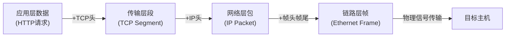
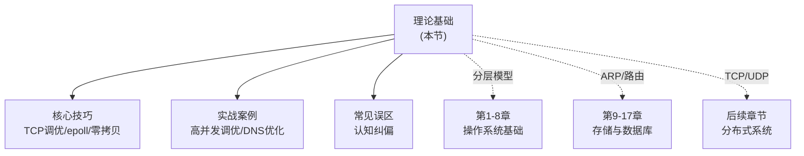

# 理论基础：TCP/IP协议栈的分层解剖

本节是第18章"TCP/IP协议栈"的理论根基，共五篇，按照**从底层到上层、从宏观到微观**的顺序，系统性地拆解TCP/IP协议栈的每一个核心层次。

> 互联网不是一个单一的网络，而是成千上万个网络的互联。理解TCP/IP的关键不在于记住每个字段的含义，而在于把握每一层"解决了什么问题、为什么这样设计、留下了什么妥协"。

---

## 知识架构总览

TCP/IP协议栈的核心思想是**分层封装**：每一层只关心自己的职责，通过标准接口与相邻层协作。一次完整的网络通信，数据会经历如下封装过程：

本节的五篇内容严格对应这个封装层次，形成递进式的知识链条：

| 顺序 | 主题 | 核心问题 | 对应层级 |
|:---:|------|----------|----------|
| 第1篇 | 网络分层模型 | 为什么需要分层？OSI与TCP/IP模型有何异同？ | 全局视角 |
| 第2篇 | 以太网与ARP | 局域网内数据帧如何传输？IP地址如何映射为MAC地址？ | 数据链路层 |
| 第3篇 | IP路由 | 数据包如何跨越不同网络到达目标？路由表如何决策？ | 网络层 |
| 第4篇 | TCP协议详解 | 如何在不可靠的IP网络上提供可靠传输？ | 传输层（可靠） |
| 第5篇 | UDP与QUIC | 何时选择"不保证可靠"反而更优？QUIC如何重塑传输层？ | 传输层（快速）+ 应用层 |

---

## 五篇内容详解

### 第1篇：网络分层模型——理解分层的哲学

**核心内容**：从网络通信的本质复杂性出发，解释为什么分层是唯一可行的工程方案。深入对比OSI七层模型、TCP/IP四层模型和五层教学模型的差异，分析每层的核心职责。

**为什么先读这篇**：分层模型是整个协议栈的"地图"。后续四篇分别深入某一层的细节，如果你不先建立全局视角，就容易迷失在比特和字段的海洋中。

**关键知识点**：
- 关注点分离（Separation of Concerns）在网络设计中的体现
- 封装与解封装的完整过程
- 各层的PDU（协议数据单元）命名约定
- 软件工程师为什么必须理解分层——故障定位、性能调优、架构设计的基础

### 第2篇：以太网与ARP——局域网的底层机制

**核心内容**：以太网帧的结构与传输规则，CSMA/CD的历史与全双工演进，ARP协议的工作原理、缓存机制与安全威胁（ARP欺骗）。

**为什么重要**：以太网是几乎所有有线网络的物理基础，ARP则是连接网络层（IP）与链路层（MAC）的桥梁。不理解这两个协议，就无法真正理解"数据包离开本机后发生了什么"。

**关键知识点**：
- 以太网帧格式：前导码、目的/源MAC、类型、数据、FCS
- ARP请求-响应的四步流程与免费ARP
- VLAN的工作原理与802.1Q标签
- ARP欺骗攻击与防御手段

### 第3篇：IP路由——数据包的全球旅行

**核心内容**：IPv4包头结构、分片与重组机制、路由表的构建与查找算法、静态路由与动态路由协议（RIP、OSPF、BGP）、NAT的工作原理与局限、IPv6的设计改进。

**为什么重要**：IP路由是互联网能够全球化扩展的基石。逐跳决策（hop-by-hop forwarding）的设计使得任何两个网络之间都能找到路径，无需中央控制。理解路由机制是排查"网络不通"类问题的核心能力。

**关键知识点**：
- IPv4包头每个字段的含义与作用
- CIDR与子网划分的计算方法
- OSPF的SPF算法与区域设计
- BGP的路径属性与路由策略
- NAT穿透问题与解决方案（STUN/TURN/ICE）
- IPv6相对IPv4的关键改进

### 第4篇：TCP协议详解——可靠传输的基石

**核心内容**：TCP段结构、三次握手与四次挥手的完整流程、可靠传输机制（序号/确认/重传）、滑动窗口与流量控制、拥塞控制算法（Slow Start、Congestion Avoidance、Fast Retransmit、Fast Recovery）、CUBIC与BBR的对比。

**为什么重要**：TCP是整个互联网可靠通信的基石。HTTP、SSH、SMTP、FTP——几乎所有应用层协议都运行在TCP之上。理解TCP的拥塞控制机制，是优化高并发服务性能的前提。为什么你的服务在高并发下响应变慢？为什么跨机房传输大文件速度上不去？答案往往指向TCP层的某个参数或行为。

**关键知识点**：
- TCP状态机的11个状态与状态转换条件
- 三次握手为何不是两次？四次挥手为何需要TIME_WAIT？
- Nagle算法与延迟ACK的交互问题
- 拥塞窗口（cwnd）与慢启动阈值（ssthresh）的动态调整
- SACK（选择性确认）的工作原理
- TCP Keepalive与应用层心跳的区别

### 第5篇：UDP与QUIC——速度与革新的前沿

**核心内容**：UDP的极简设计哲学、适用场景分析、UDP在应用层实现可靠性的常见模式（RUDP、KCP）、QUIC协议的设计动机与核心特性（0-RTT建连、多路复用、连接迁移）、HTTP/3如何基于QUIC重塑Web通信。

**为什么重要**：UDP代表了传输层设计的另一条路线——"发送即忘"。在实时音视频、在线游戏、DNS等场景中，UDP的低延迟特性是TCP无法替代的。而QUIC作为"运行在UDP上的TCP"，正在从根本上改变互联网传输层的格局。理解UDP与QUIC，是把握网络技术未来趋势的关键。

**关键知识点**：
- UDP报文结构与校验和计算
- 应用层可靠传输的实现模式：ACK+重传、前向纠错（FEC）
- KCP协议的快速重传与非退让流控
- QUIC的连接ID设计与网络切换迁移
- QUIC的加密握手与0-RTT的隐私权衡
- HTTP/3的多路复用如何解决队头阻塞

---

## 阅读建议

**首次阅读**：建议按顺序从第1篇读到第5篇。前两篇建立底层认知，第3篇打通网络层思维，第4篇是全节的核心（篇幅最长、机制最复杂），第5篇则是面向未来的拓展。

**快速查阅**：如果你已经具备扎实的网络基础，可以直接跳转到需要深入的主题。每篇独立成文，不强制依赖前序内容。

**结合实践**：理论学习的同时，建议配合第18章的"核心技巧"和"实战案例"部分，用`tcpdump`、`Wireshark`、`ss`、`netstat`等工具验证你对协议行为的理解。纸上得来终觉浅，抓包分析才是检验理解的终极手段。

**推荐阅读**：
- W. Richard Stevens《TCP/IP Illustrated, Volume 1》—— 本节的主要参考来源
- Van Jacobson《Congestion Avoidance and Control》—— 拥塞控制的奠基论文
- J. Iyengar等《QUIC: A UDP-Based Secure and Reliable Transport》—— QUIC协议规范
- 部署实践：在Linux上搭建nginx+curl环境，用Wireshark抓取完整的TCP握手和数据传输过程

---

## 本节与其他章节的关联

理论基础中关于TCP拥塞控制的内容，直接服务于"核心技巧"中的TCP调优参数选择；IP路由的知识是"实战案例"中网络延迟排查的前置条件；UDP与QUIC的内容则为理解现代微服务通信框架（gRPC基于HTTP/2/TCP、部分场景转向QUIC/UDP）奠定基础。

---

> **一句话总结**：理论基础的五篇内容，本质上是在回答一个问题——"数据从应用进程A到应用进程B，中间到底经历了什么？"从分层模型的宏观视角，到以太网帧的比特级细节，到IP路由的全球寻址，到TCP的可靠传输机制，再到UDP/QUIC的速度革新，每一层都是对前一层遗留问题的回答，也是对下一层新挑战的铺垫。
