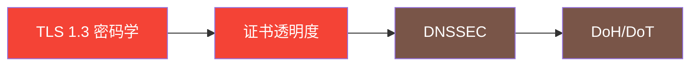
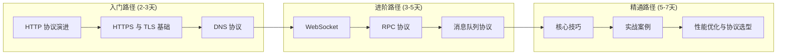
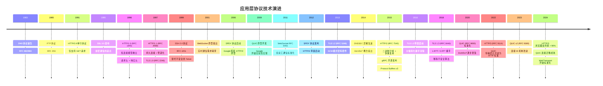

# 第19章 应用层协议 · 章节概览

## 本章定位

应用层协议是计算机网络体系结构中最贴近业务逻辑的一层，直接决定了应用程序之间如何交换数据、建立连接和保障安全。从浏览器加载网页到微服务之间的远程调用，从消息队列的生产消费到安全 Shell 的远程管理，应用层协议无处不在，是现代软件系统的**基础通信骨架**。

对于后端开发者和系统架构师而言，理解应用层协议不是"了解即可"的理论知识——它直接影响系统的性能上限、安全底线和运维成本：

- **HTTP/2 的多路复用**可以将页面加载时间缩短 30%-50%
- **TLS 1.3 的 1-RTT 握手**比 TLS 1.2 少一次往返，对高延迟网络意味着首屏加载快数百毫秒
- **DNS 的 TTL 策略**配置不当可能导致服务切换时长达数分钟的不可用
- **gRPC 的 Protocol Buffers** 序列化比 JSON 小 3-10 倍、解析快 5-100 倍

本章从最基础的 HTTP 协议入手，深入分析从 HTTP/1.0 到 HTTP/3 的完整演进历程，揭示每次版本升级背后的核心驱动力——连接效率、头部开销、队头阻塞和传输可靠性。在此基础上，系统覆盖 HTTPS/TLS、DNS、WebSocket、RPC、消息队列协议以及 SSH/FTP 等经典协议，帮助读者建立完整的应用层协议知识体系。

## 本章学习目标

完成本章学习后，读者应具备以下能力：

| 层级 | 目标 | 验证标准 |
|------|------|----------|
| **理解** | 能解释 HTTP/1.0→1.1→2→3 各版本的核心设计动机和改进点 | 能画出版本演进对比表并说明每项改进的动机 |
| **掌握** | 能完整描述 TLS 1.3 握手过程，理解前向保密的原理 | 能用 `openssl s_client` 分析任意站点的 TLS 配置 |
| **运用** | 能正确配置 DNS TTL、选择序列化格式、设计 RPC 接口 | 能在实际项目中做出合理的协议选型决策 |
| **分析** | 能诊断协议层性能瓶颈，定位连接池/超时/重试问题 | 能用 Wireshark/tshark 抓包分析并优化协议行为 |
| **设计** | 能为分布式系统选择并组合合适的应用层协议栈 | 能输出一份协议选型方案，包含性能预估和风险评估 |

## 为什么应用层协议如此重要

每一个网络应用的运行都依赖应用层协议。选择合适的协议、正确配置协议参数、理解协议的性能特征，是构建高质量分布式系统的基本功。以下是一些直观的对比数据：

| 场景 | 协议选择/配置 | 性能差异 |
|------|-------------|---------|
| Web 页面加载 | HTTP/1.1 多连接 vs HTTP/2 多路复用 | 首屏加载时间差 30%-50% |
| TLS 握手延迟 | TLS 1.2 (2-RTT) vs TLS 1.3 (1-RTT) | 握手延迟降低 50%，高延迟网络差 200-400ms |
| 微服务通信 | REST/JSON vs gRPC/Protobuf | 序列化大小差 3-10 倍，解析速度差 5-100 倍 |
| 实时通信 | HTTP 长轮询 vs WebSocket | 服务端推送延迟从秒级降到毫秒级，带宽消耗降低 60%+ |
| DNS 解析 | 默认 TTL vs 优化 TTL | 服务切换生效时间从分钟级降到秒级 |
| 消息队列 | AMQP (RabbitMQ) vs Kafka 协议 | 吞吐量差 10-100 倍，延迟特征完全不同 |
| 移动网络 | HTTP/2 over TCP vs HTTP/3 over QUIC | 高丢包环境下性能差 2-3 倍 |

理解应用层协议，是成为合格后端开发者和系统架构师的关键一步。

## 协议设计的核心原则

在深入具体协议之前，理解优秀应用层协议的设计原则，能帮助读者在学习和选型时抓住本质。这些原则贯穿本章所有协议：

**1. 端到端原则（End-to-End Principle）**

Saltzer、Reed 和 Clark 在 1984 年提出的经典原则：智能和状态应放在网络边缘，而非核心网络中。应用层协议正是这一原则的体现——TCP 只负责可靠传输，而连接语义、认证、加密等业务逻辑由应用层自行处理。HTTP 的无状态设计、WebSocket 的全双工升级、TLS 的加密协商，都是端到端原则的实践。

**2. 向后兼容与优雅降级**

HTTP/1.1 必须兼容 HTTP/1.0 客户端，HTTP/2 通过 ALPN 协商保持与 HTTP/1.1 的共存，QUIC 基于 UDP 而非重新定义传输层。每次协议演进都在性能提升和兼容性之间寻求平衡——这是协议设计中最难的部分。

**3. 分层解耦**

应用层协议与传输层解耦：HTTP 可运行在 TCP（HTTP/1.1、HTTP/2）或 QUIC（HTTP/3）之上；TLS 作为独立的安全层插入应用层和传输层之间；WebSocket 复用 HTTP 的 80/443 端口但拥有独立的帧协议。分层使得每一层可以独立演进。

**4. 渐进增强（Progressive Enhancement）**

优秀的协议允许在基础功能之上叠加高级特性。HTTP/1.1 的基础请求-响应模型之上，可以叠加 Keep-Alive、Chunked Transfer、管道化；HTTP/2 在此基础上叠加多路复用和头部压缩；TLS 在明文通信基础上叠加加密、认证和完整性保护。

**5. 可观测性**

现代协议越来越重视可观测性：HTTP/2 的 `-RST_STREAM` 和 `GOAWAY` 帧提供了连接级诊断信息；QUIC 内置了连接迁移和错误码机制；gRPC 的 status code 提供了语义化的错误分类。协议层面的可观测性是生产环境运维的基础。

## 本章知识图谱

```mermaid
graph TD
    A["应用层协议"] --> B["HTTP 协议演进"]
    A --> C["HTTPS 与 TLS"]
    A --> D["DNS 协议"]
    A --> E["WebSocket"]
    A --> F["RPC 协议"]
    A --> G["消息队列协议"]
    A --> H["经典协议"]

    B --> B1["HTTP/1.0 短连接"]
    B --> B2["HTTP/1.1 持久连接 + 管道化"]
    B --> B3["HTTP/2 二进制分帧 + 多路复用"]
    B --> B4["HTTP/3 QUIC + 0-RTT"]

    C --> C1["TLS 1.2 握手过程"]
    C --> C2["TLS 1.3 1-RTT / 0-RTT"]
    C --> C3["X.509 证书体系 + CA 信任链"]
    C --> C4["密钥交换 (RSA / ECDHE / PSK)"]
    C --> C5["证书透明度 (CT)"]

    D --> D1["DNS 报文格式"]
    D --> D2["递归查询 vs 迭代查询"]
    D --> D3["DNS 缓存与 TTL"]
    D --> D4["DNSSEC 安全扩展"]
    D --> D5["DoH / DoT 加密 DNS"]

    E --> E1["WebSocket 握手过程"]
    E --> E2["帧格式与控制帧"]
    E --> E3["心跳机制 (Ping/Pong)"]
    E --> E4["与长轮询/SSE 对比"]

    F --> F1["gRPC (Protobuf + HTTP/2)"]
    F --> F2["Apache Thrift (IDL 驱动)"]
    F --> F3["序列化格式对比 (Protobuf/JSON/MessagePack/Avro)"]
    F --> F4["四种通信模式"]

    G --> G1["AMQP 0-9-1 (RabbitMQ)"]
    G --> G2["Kafka 协议"]

    H --> H1["SSH 协议"]
    H --> H2["FTP / SFTP"]
```

## 本章内容结构

本章按照"协议演进 → 安全通信 → 基础服务 → 实时通信 → 远程调用 → 消息传输 → 经典协议"的逻辑层层递进，从最常用的 HTTP 到专用场景协议，构建完整的应用层协议知识体系。

### 第一部分：HTTP 协议演进（理论基础）

HTTP 是互联网使用最广泛的应用层协议，其演进历程反映了 Web 对性能、安全和可扩展性的持续追求。阅读本节时，重点关注每个版本解决的核心痛点——它们构成了理解后续所有协议改进的思维框架。

- **HTTP/1.0**：奠定请求-响应模型的基础，短连接模型的性能瓶颈分析，Host 头引入解决虚拟主机问题
- **HTTP/1.1**：持久连接（Keep-Alive）大幅减少 TCP 握手开销，管道化（Pipelining）的理论优势与队头阻塞的实践困境，分块传输编码（Chunked Transfer Encoding）的实现机制，缓存机制的完善（强缓存 Cache-Control/Expires、协商缓存 ETag/Last-Modified 的完整决策流程）
- **HTTP/2**：基于 SPDY 协议演化，二进制分帧层的 9 字节帧头格式（Length/Type/Flags/Stream ID），多路复用（Multiplexing）如何从根本上解决应用层队头阻塞，HPACK 头部压缩（静态表 + 动态表 + 霍夫曼编码），服务器推送（Server Push）的实践困境与 Chrome 废弃原因，流优先级的实际效果
- **HTTP/3**：QUIC 协议如何将传输层从 TCP 改为基于 UDP 的 QUIC，彻底解决 TCP 层队头阻塞。1-RTT 首次建连、0-RTT 恢复连接的机制，连接迁移（Connection ID 替代 IP+端口），流级别独立可靠传输的原理对比

**阅读提示**：HTTP 的演进本质上是三大问题的持续优化——**连接效率**（短连接→持久连接→多路复用）、**头部开销**（文本→HPACK 压缩）、**队头阻塞**（应用层→TCP 层→完全消除）。把握这条主线，就能理解每个版本的设计取舍。

### 第二部分：HTTPS 与 TLS（理论基础）

安全通信是现代 Web 的基石，TLS 协议保护着全球 95%+ 的 Web 流量。理解 TLS 不仅是为了"配置 HTTPS"，更是为了理解现代安全协议的设计哲学——如何在性能和安全之间取得平衡。

- **TLS 1.2 握手**：完整的 ClientHello → ServerHello → Certificate → ServerKeyExchange → ClientKeyExchange → ChangeCipherSpec → Finished 握手流程，每个消息的字段含义
- **TLS 1.3 改进**：1-RTT 握手如何将密钥交换移到第一阶段，0-RTT 恢复的 PSK 机制与重放攻击风险，移除的不安全算法（RSA 密钥交换、CBC 模式、RC4、3DES），仅保留的现代算法（ECDHE、AES-GCM、ChaCha20-Poly1305）
- **证书体系**：X.509 证书格式的完整字段解析，CA 信任链的构建与验证过程（根 CA → 中间 CA → 终端实体），证书透明度（CT）机制如何通过 Merkle Tree 防止恶意证书签发
- **密钥交换**：RSA 密钥交换的前向保密缺陷，(EC)DHE 的临时密钥机制如何实现前向保密，PSK 用于会话恢复

**阅读提示**：TLS 1.3 是现代安全通信的分水岭——它不仅减少了握手延迟，更重要的是通过移除不安全算法，从根本上消除了配置错误的风险。学习时重点理解"为什么移除比添加更难"。

### 第三部分：DNS 协议（理论基础）

DNS 是互联网的"电话簿"，其重要性往往被开发者低估。事实上，DNS 是互联网中最古老的协议之一（1983 年），也是最容易被忽视的性能和安全瓶颈。

- **DNS 报文格式**：12 字节固定头部（ID、QR、Opcode、AA、TC、RD、RA、RCODE 等标志位）与四个可变区域（Question、Answer、Authority、Additional）
- **查询模式**：递归查询与迭代查询的区别，实际网络中客户端到本地 DNS 解析器的递归行为
- **缓存与 TTL**：TTL 策略设计（A/AAAA 记录 300-3600s、NS 记录 86400s、MX 记录 3600s），多级缓存的层次（浏览器 → OS → 路由器 → ISP → 权威）
- **DNSSEC**：通过数字签名防止 DNS 欺骗，DNSKEY、RRSIG、DS 记录的验证链
- **DoH/DoT**：DNS over HTTPS（RFC 8484）和 DNS over TLS（RFC 7858）的加密方案对比

**阅读提示**：DNS 的核心挑战是在**无连接的 UDP 协议**上构建**可靠的分布式数据库**。理解这一点，就能理解 DNS 缓存、TTL、DNSSEC 等设计的必然性。

### 第四部分：WebSocket 协议（理论基础）

WebSocket 为 Web 应用提供了全双工通信能力，是实时应用的基石。它解决了 HTTP 协议"请求-响应"模型的根本限制——服务端无法主动向客户端推送数据。

- **握手过程**：HTTP Upgrade 请求的完整流程，Sec-WebSocket-Key 的 Base64 编码与 Sec-WebSocket-Accept 的 SHA-1 验证
- **帧格式**：操作码（文本/二进制/关闭/Ping/Pong）、掩码机制、分片传输
- **心跳机制**：Ping/Pong 帧的保活原理，超时检测与连接恢复策略
- **方案对比**：WebSocket vs HTTP 长轮询 vs Server-Sent Events（SSE）的性能、兼容性和适用场景对比

**阅读提示**：WebSocket 的设计哲学是"复用 HTTP 建立连接，然后切换到独立协议"。理解这个两阶段设计，就能理解为什么 WebSocket 能穿越大多数防火墙和代理服务器。

### 第五部分：RPC 协议（理论基础）

RPC 协议是微服务架构的核心通信方式。从 1984 年 Andrew Birrell 和 Bruce Nelson 提出 RPC 概念至今，RPC 框架经历了从 CORBA、DCOM 到 gRPC 的演进，每次演进都在解决跨语言互操作性和性能之间的矛盾。

- **gRPC**：Protocol Buffers 序列化机制、HTTP/2 传输层、四种通信模式（Unary / Server Stream / Client Stream / Bidirectional Stream）
- **Apache Thrift**：IDL（Interface Definition Language）驱动架构、TProtocol/TTransport 抽象层
- **序列化格式对比**：Protobuf、JSON、MessagePack、Avro 在编码大小、解析速度、跨语言支持、Schema 演进等维度的系统对比
- **RPC 框架选型**：gRPC vs Thrift vs Dubbo vs REST 的适用场景分析

**阅读提示**：RPC 选型的核心不是"哪个更快"，而是"哪个更适合你的团队和场景"。gRPC 适合强类型、高性能的微服务通信；REST 适合开放 API 和简单的 CRUD；Dubbo 适合 Java 生态的内部服务治理。

### 第六部分：消息队列协议（理论基础）

消息队列是异步通信和解耦的核心基础设施。AMQP 和 Kafka 代表了两种截然不同的设计哲学：AMQP 追求灵活的路由和可靠的消息投递，Kafka 追求极致的吞吐量和持久化。

- **AMQP 0-9-1**（RabbitMQ）：Exchange/Queue/Binding 的模型、四种 Exchange 类型（Direct/Fanout/Topic/Headers）、消息确认与持久化
- **Kafka 协议**：Producer/Consumer/Broker 的分区模型、Offset 管理、消费者组机制

**阅读提示**：AMQP 和 Kafka 的本质区别在于**消费模型**——AMQP 是"取走并删除"（竞争消费），Kafka 是"读取并保留"（日志回放）。理解这个区别，就能明白为什么 Kafka 适合事件溯源和流处理。

### 第七部分：经典协议（理论基础）

SSH 和 FTP 是互联网最早的应用层协议之一，虽然"经典"但至今仍广泛使用。理解它们的设计，有助于理解应用层协议的演进脉络。

- **SSH 协议**：密钥交换、用户认证、通道复用的三层架构
- **FTP/SFTP**：主动模式 vs 被动模式的数据连接、FTP over TLS 的安全增强

### 第八部分：核心技巧

从理论到实践的桥梁，提供可直接应用的工程方法。本节是"知道"和"做到"之间的关键连接——每个技巧都来自生产环境的真实经验。

- **HTTP/2 帧解析**：帧状态机的实现、HPACK 解码的工程要点
- **TLS 证书验证**：完整的验证流程实现、OCSP Stapling 的工程实践
- **gRPC 拦截器与负载均衡**：拦截器链的设计、客户端负载均衡的配置
- **连接池管理**：HTTP 连接池的参数调优、gRPC 连接池的设计
- **超时与重试策略**：分层超时设计（连接超时 → 读写超时 → 总超时）、指数退避重试
- **协议版本协商**：ALPN（Application-Layer Protocol Negotiation）的实现

### 第九部分：实战案例

通过真实场景展示应用层协议技术的应用。每个案例都包含问题背景、解决方案、实施步骤和效果数据，读者可以直接参考或移植到自己的项目中。

- **HTTP/2 多路复用在微服务中的效果**：从 HTTP/1.1 升级到 HTTP/2 后的性能对比数据
- **TLS 性能优化**：会话恢复、OCSP Stapling、双证书（ECDSA + RSA）的优化效果
- **gRPC 在跨语言服务中的应用**：Protobuf IDL 定义、Python 服务端 + Go 客户端的完整实现
- **Kafka 消息队列的生产部署**：副本配置、日志配置、网络配置的最佳实践

### 第十部分：常见误区

揭示应用层协议使用中最容易犯的十大错误，每一条都包含错误思维、真实影响和正确做法：

1. **默认使用 HTTP/1.1 而不升级 HTTP/2/3** — 误以为"够用就行"，实际上多路复用的性能提升几乎是免费的，只需确保中间件支持即可
2. **TLS 配置使用默认密码套件，忽略安全审计** — 默认配置往往包含弱算法（如 RC4、3DES），安全扫描工具如 SSL Labs 可以快速检测
3. **DNS TTL 设置不当导致服务切换故障** — TTL 过长导致切换生效慢，过短导致 DNS 服务器压力大，需要根据业务变更频率动态调整
4. **WebSocket 不做心跳检测导致僵尸连接** — 负载均衡器和防火墙通常会在空闲 60-300 秒后断开连接，必须实现 Ping/Pong 心跳
5. **gRPC 不设置超时导致请求无限挂起** — 一个慢查询可能耗尽整个连接池，必须设置分层超时（连接级 + 请求级 + 总超时）
6. **连接池大小配置不合理** — 过小导致请求排队等待连接，过大导致服务器资源耗尽；最佳大小取决于后端处理能力和并发量
7. **忽视 HTTP/2 的服务器推送导致缓存污染** — Server Push 会绕过浏览器缓存，推送不需要的资源；Chrome 已废弃此特性，优先使用 103 Early Hints
8. **消息队列不配置消息确认导致消息丢失** — 未配置 `acknowledge-mode` 的消息在消费者崩溃时会丢失，必须根据业务可靠性需求选择确认策略
9. **重试策略没有指数退避导致雪崩效应** — 固定间隔重试在故障时会放大请求量，指数退避 + 抖动（jitter）是标准做法
10. **混淆 HTTPS 和数据安全** — HTTPS 只保护传输层，应用层的敏感数据仍需额外加密（如 JWT 过期时间、数据库字段加密）

### 第十一部分：练习方法与本章小结

- 十套递进式练习：基础概念理解 → HTTP 抓包分析 → TLS 证书配置 → DNS 诊断 → WebSocket 实战 → gRPC 开发 → Kafka 部署 → 协议性能对比 → 微服务通信架构 → 综合项目
- 核心知识点回顾、关键协议对比表、最佳实践清单

## 不同角色的学习路径

不同技术角色对应用层协议的需求侧重点不同。以下推荐针对四种常见角色的阅读路径：

### 后端开发者（重点：HTTP + gRPC + 消息队列）

**优先级**：第一部分（HTTP 演进）→ 第五部分（RPC）→ 第六部分（消息队列）→ 第八部分（核心技巧中的连接池和超时策略）

### DevOps / SRE（重点：DNS + TLS + 协议诊断）

**优先级**：第二部分（TLS）→ 第三部分（DNS）→ 第八部分（核心技巧）→ 第十部分（常见误区）

### 安全工程师（重点：TLS + DNSSEC + SSH）

**优先级**：第二部分（TLS 深入）→ 第三部分（DNSSEC）→ 第七部分（SSH）→ 第八部分（TLS 证书验证技巧）

### 前端开发者（重点：HTTP + WebSocket + SSE）

**优先级**：第一部分（HTTP 缓存和 HTTP/2）→ 第四部分（WebSocket）→ 第八部分（协议版本协商）

## 本章学习路线（通用路径）

根据读者的背景和目标，推荐以下学习路径：

- **入门路径**：掌握 HTTP 协议各版本的设计权衡，理解 TLS 握手和证书验证的完整流程，了解 DNS 的工作原理——这是每个后端开发者的必备知识
- **进阶路径**：熟悉 WebSocket 全双工通信的实现细节，掌握 gRPC/Thrift 等 RPC 框架的使用和选型，理解消息队列协议的设计哲学——这是构建分布式系统的核心技能
- **精通路径**：能够进行 HTTP/2 帧解析、TLS 性能调优、连接池参数优化，具备在实际项目中选择和优化应用层协议的能力——这是系统架构师的必备能力

## 前置知识

学习本章前，建议具备以下基础知识：

- **网络基础**：TCP/IP 四层模型、三次握手/四次挥手、Socket 编程的基本概念
- **第18章 TCP/IP 协议栈**：TCP 可靠传输机制、UDP 的特点、端口号与多路复用
- **加密基础**：对称加密 vs 非对称加密、哈希函数、数字签名的基本概念
- **编程基础**：至少熟悉一种编程语言（Python/Go/Java/C），能够阅读网络编程示例代码
- **Linux 基础**：基本的命令行操作、`curl`/`wget`/`openssl` 等工具的使用

## 关键度量指标

应用层协议的性能评估需要关注以下核心指标：

| 指标 | 含义 | 典型值 | 优化方向 |
|------|------|--------|----------|
| 握手延迟 | 建立连接的 RTT 数 | HTTP/1.1: 1 RTT; TLS 1.2: 2 RTT; TLS 1.3: 1 RTT; QUIC: 0-1 RTT | 升级协议版本、会话恢复、0-RTT |
| 首字节时间 (TTFB) | 从请求到收到第一个字节 | < 100ms（优秀），100-500ms（一般），> 500ms（需优化） | 减少 RTT、CDN 加速、服务端缓存 |
| 吞吐量 | 单位时间处理的请求数 | HTTP/1.1: 5K-50K RPS; HTTP/2: 10K-100K RPS | 多路复用、连接池、负载均衡 |
| 头部开销 | 协议头部占总传输的比例 | HTTP/1.x: 200-800 字节/请求; HTTP/2 HPACK: 20-100 字节/请求 | HPACK 压缩、减少自定义头部 |
| 序列化大小 | 数据编码后的字节量 | JSON: 基准; Protobuf: 1/3-1/10; MessagePack: 1/2-1/3 | 选择高效序列化格式 |
| 安全性 | 协议支持的最低 TLS 版本和密码套件 | TLS 1.3 + AES-256-GCM（优秀） | 禁用旧版本、更新密码套件 |
| 连接复用率 | 一个 TCP 连接上处理的请求数 | HTTP/1.1: 100-1000; HTTP/2: 1000-10000 | Keep-Alive、多路复用 |

## 技术演进

## 关键协议对比速查表

| 协议 | 传输层 | 连接模型 | 通信方式 | 主要场景 | 性能特征 | 典型端口 |
|------|--------|---------|---------|---------|---------|---------|
| HTTP/1.1 | TCP | 一请求一响应 | 半双工 | Web 浏览、REST API | 简单可靠，队头阻塞 | 80/443 |
| HTTP/2 | TCP | 多路复用 | 半双工（流级别） | Web 浏览、gRPC | 高并发，TCP 层仍有队头阻塞 | 80/443 |
| HTTP/3 | QUIC/UDP | 多路复用 | 全双工（流级别） | Web 浏览、实时通信 | 无队头阻塞，连接迁移 | 443 (UDP) |
| WebSocket | TCP | 全双工持久连接 | 全双工 | 聊天、游戏、实时推送 | 低延迟，适合频繁双向通信 | 80/443 (升级) |
| gRPC | TCP (HTTP/2) | 多路复用 | 四种模式 | 微服务间通信 | 高性能，强类型 | 自定义 |
| AMQP | TCP | 信道复用 | 异步消息 | 企业消息中间件 | 可靠投递，灵活路由 | 5672 |
| Kafka 协议 | TCP | 长连接 | 异步消息 | 日志收集、事件流 | 超高吞吐，持久化 | 9092 |
| SSH | TCP | 会话复用 | 交互式 | 远程管理、隧道 | 安全，支持端口转发 | 22 |
| FTP | TCP | 控制+数据双连接 | 交互式 | 文件传输 | 简单，但安全性差 | 21 (控制) / 20 (数据) |

## 参考文献

**核心 RFC 文档**：

- R. Fielding et al. *Hypertext Transfer Protocol -- HTTP/1.1* (RFC 7230-7235, 2014)
- M. Belshe, R. Peon, M. Thomson. *Hypertext Transfer Protocol Version 2 (HTTP/2)* (RFC 7540, 2015)
- A. Bishop et al. *The Hypertext Transfer Protocol Version 3 (HTTP/3)* (RFC 9114, 2022)
- T. Dierks, E. Rescorla. *The Transport Layer Security (TLS) Protocol Version 1.2* (RFC 5246, 2008)
- E. Rescorla. *The Transport Layer Security (TLS) Protocol Version 1.3* (RFC 8446, 2018)
- P. Mockapetris. *Domain Names -- Concepts and Facilities* (RFC 1034, 1987)
- P. Mockapetris. *Domain Names -- Implementation and Specification* (RFC 1035, 1987)
- S. Farrell, H. Tschofenig. *DNS over HTTPS (DoH)* (RFC 8484, 2018)
- E. Rescorla. *DNS over Transport Layer Security (DoT)* (RFC 7858, 2016)
- I. Fette, A. Melnikov. *The WebSocket Protocol* (RFC 6455, 2011)
- C. Paquin. *Google Application Layer Protocol Negotiation (ALPN)* (RFC 7301, 2014)
- J. Postel, J. Reynolds. *File Transfer Protocol* (RFC 959, 1985)
- T. Ylonen, C. Lonvick. *The Secure Shell (SSH) Protocol Architecture* (RFC 4251, 2006)
- A. Langley et al. *The QUIC Transport Protocol* (RFC 9000, 2021)

**安全与证书**：

- S. Blake-Wilson et al. *HTTP Over TLS* (RFC 2818, 2000)
- D. Eastlake 3rd. *Transport Layer Security (TLS) Extensions* (RFC 6066, 2011)
- Y. Sheffer, A. Langley. *TLS 1.3 Authentication and Hash-based Key Exchange* (RFC 8447, 2018)

**经典著作**：

- I. Grigorik. *High Performance Browser Networking*. O'Reilly, 2013.
- E. Rescorla. *An Introduction to the TLS 1.3 Protocol*. (Internet-Draft / IETF Draft)
- D. Moschett, L. Basso. *HTTP/2 in Action*. Manning, 2019.
- A. Banks, R. Briggs, K. Mahent, et al. *AMQP: Advanced Message Queuing Protocol*. OASIS Standard, 2014.
- J. Kreps, N. Narkhede, J. Rao. *Kafka: a Distributed Messaging System for Log Processing*. 2011.
