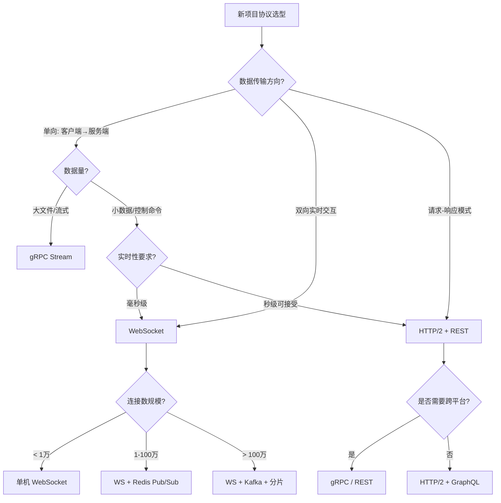

## 实战案例

理论是骨架，案例是血肉。本章通过五个贴近生产环境的真实案例，将 HTTP 演进、HTTPS/TLS 安全通信、WebSocket 实时交互三大核心技能串联成完整的知识网络。每个案例严格遵循"问题发现→协议层分析→方案设计→实施验证→经验沉淀"的工程闭环，帮助读者建立从理论到工程的完整映射。

五个案例的难度和广度层层递进：

| 案例 | 聚焦协议 | 核心挑战 | 适合读者 |
|------|----------|----------|----------|
| 案例一 | HTTP/2 | 协议升级的全链路迁移 | 运维/前端工程师 |
| 案例二 | TLS 1.3 | 高延迟链路下的安全握手优化 | 后端/SRE 工程师 |
| 案例三 | WebSocket | 大规模实时协作架构 | 全栈/架构师 |
| 案例四 | 多协议联合 | 复杂系统的协议层综合调优 | 架构师/技术负责人 |
| 案例五 | 协议选型 | 不同场景的最优协议决策 | 技术决策者 |

---

### 案例一：电商平台的 HTTP 协议升级——从 HTTP/1.1 到 HTTP/2

#### 1.1 问题背景

**业务场景：**
某中型电商平台日均 PV 约 2000 万，首页包含 120+ 个静态资源（JS/CSS/图片），后端使用 Nginx + PHP-FPM 架构，部署在 4 台应用服务器上。技术栈长期停留在 HTTP/1.1。

**大促期间暴露的问题：**

# 浏览器 DevTools 网络面板观测数据
# HTTP/1.1 Keep-Alive 模式下的请求瀑布图
# 关键指标：
#   - 首屏加载时间（LCP）：4.8 秒
#   - DOMContentLoaded：3.2 秒
#   - 最大并发连接数：6 个（Chrome 限制）
#   - 队头阻塞（Head-of-Line Blocking）导致后续请求排队

**用户反馈：**
- 移动端页面白屏时间长，3 秒内跳出率 38%
- 图片加载出现"闪烁"现象（部分图片先显示占位符再替换）
- 后台监控显示 TCP 连接数持续逼近上限

#### 1.2 根因分析：HTTP/1.1 的协议瓶颈

通过 `curl` 和 Wireshark 抓包，定位到三个协议层面的瓶颈：

**瓶颈一：队头阻塞（HOL Blocking）**

# HTTP/1.1 串行请求时序（简化示意）
Time 0ms:   [GET /style.css]  → 等待响应...
Time 50ms:  [GET /logo.png]   → 等待前一个完成...
Time 120ms: [GET /banner.jpg] → 仍在排队...
Time 180ms: [GET /main.js]    → 排队中...

# 总耗时 = 所有请求延迟之和（串行叠加）
# 虽然 Keep-Alive 复用了 TCP 连接，但请求本身是串行的
# 即使开启浏览器多连接（Chrome 6个），120个资源仍需 20 轮串行

浏览器虽然对同一域名开放了 6 个并行 TCP 连接（HTTP/1.1 的事实标准），但 120 个资源分摊到 6 个连接上，每个连接仍需串行处理 20 个请求。队头阻塞的本质是：**一个慢响应会阻塞同一连接上的所有后续请求**。

**瓶颈二：头部冗余开销**

```bash
# 抓取实际请求头，观察重复字段
curl -s -D - -o /dev/null https://example.com/ | head -20

# 每个请求都重复携带相同的 Cookie、User-Agent、Accept 等字段
# 单个请求头部约 800B，120 个资源 = 96KB 纯头部冗余
# 以 1Mbps 带宽计算，头部传输本身就需要约 770ms
# 而且头部无法压缩（HTTP/1.1 不支持头部压缩）
```

更严重的是，Cookie 头在电商场景下尤为庞大——购物车状态、用户偏好、会话标识等可能轻松超过 1KB。这 96KB 的头部冗余在移动网络下是不可忽视的带宽浪费。

**瓶颈三：无服务器推送能力**

# 服务器只能被动响应，无法预判客户端需求
# 例如：客户端请求 index.html 后，服务器明知还需要 style.css
# 但必须等客户端发第二个请求才能发送 → 多一个 RTT 的延迟

# 典型的瀑布图表现：
# [index.html] ──── 80ms ────→
#                    [style.css] ──── 60ms ────→
#                                   [app.js] ──── 120ms ────→
# 线性叠加，无法利用服务器的"预知"能力

#### 1.3 解决方案：启用 HTTP/2

**第一步：Nginx 配置 HTTP/2**

```nginx
# /etc/nginx/conf.d/site.conf
server {
    listen 443 ssl http2;           # 启用 HTTP/2（Nginx 1.9.5+）
    server_name www.example.com;

    ssl_certificate     /etc/ssl/certs/example.pem;
    ssl_certificate_key /etc/ssl/private/example.key;

    # HTTP/2 连接池优化
    http2_max_concurrent_streams 128;   # 单连接最大并发流数（默认 128）
    http2_recv_buffer_size       256k;  # 接收缓冲区（大流量场景调大）
    http2_recv_timeout           30s;   # 接收超时

    # Gzip 压缩（HTTP/2 下仍有意义，减少传输体积）
    # 注意：HPCK 头部压缩只针对 HTTP 头部，body 仍需 Gzip
    gzip on;
    gzip_types text/css application/javascript application/json;
    gzip_min_length 1024;
}
```

**关键决策：为什么不在 Nginx 层同时支持 HTTP/3？** HTTP/3 基于 QUIC（UDP），Nginx 官方从 1.25.0 开始实验性支持。但生产环境建议先稳定 HTTP/2，通过 CDN 层（如 Cloudflare）提供 HTTP/3 降级，避免直接在源站引入 UDP 协议的运维复杂度。

**第二步：资源优化——消除不必要的小文件**

```bash
# 统计资源数量和体积分布
find /var/www/static -name "*.css" -o -name "*.js" | xargs wc -l | sort -rn

# 合并前：82 个 CSS 文件（总计 120KB），67 个 JS 文件（总计 380KB）
# 合并后：4 个 CSS 文件（按模块分组），8 个 JS 文件（按功能分组）

# HTTP/2 虽然支持多路复用，但每个文件仍需独立的 HPCK 编解码
# 过多小文件会增加流管理开销（每个 Stream 有独立的流量控制窗口）
# 合并后减少了 HTTP/2 多路复用的流管理开销
```

**第三步：配置 HTTP/2 Server Push（实验性）**

```nginx
# 对关键渲染路径资源启用推送
location = /index.html {
    http2_push /static/css/critical.css;
    http2_push /static/js/app.js;
    http2_push /static/img/logo.webp;
    # 服务器在返回 HTML 的同时主动推送关键资源
    # 省去了客户端解析 HTML → 发起请求 → 等待响应 的一个 RTT
}
```

> ⚠️ **Server Push 的现实困境**：Chrome 已于 2022 年弃用 Push（因缓存竞争和带宽浪费问题），Safari 支持不完善。生产环境更推荐使用 **103 Early Hints** 作为替代——服务器先返回 103 状态码告知浏览器需要预加载的资源，浏览器在等待最终响应时就开始下载这些资源，效果类似 Push 但更可控。

**第四步：设置合理的资源优先级**

```html
<!-- HTML 中通过 preload/prefetch 提示浏览器优先级 -->
<!-- 关键渲染资源：最高优先级 -->
<link rel="preload" href="/static/css/critical.css" as="style">
<link rel="preload" href="/static/js/app.js" as="script">

<!-- 非关键资源：低优先级 -->
<link rel="prefetch" href="/static/js/analytics.js">
<link rel="prefetch" href="/static/img/banner-lazy.webp">
```

HTTP/2 引入了 Stream 优先级机制（通过 `PRIORITY` 帧），但浏览器对优先级的实现差异较大。`preload`/`prefetch` 是更可靠的跨浏览器方案。

#### 1.4 迁移陷阱与应对策略

协议升级不是改一行配置就完事。以下是实际迁移中踩过的坑：

**陷阱一：Mixed Content 警告**
# HTTP/2 强制要求 HTTPS（事实上，所有主流浏览器只在 HTTPS 下启用 HTTP/2）
# 如果页面中存在 http:// 的资源引用，浏览器会拦截或降级
# 常见位置：
#   - 第三方广告脚本（http://track.example.com/ad.js）
#   - CDN 上的旧资源（http://cdn.example.com/image.png）
#   - 数据库中存储的用户上传 URL
# 解决：全站 HTTPS + Content-Security-Policy: upgrade-insecure-requests

**陷阱二：CDN 兼容性**
# 部分老旧 CDN 可能不支持 HTTP/2
# 验证方法：
curl -sI --http2 https://www.example.com/ | head -1
# 返回 "HTTP/2 200" 说明生效
# 返回 "HTTP/1.1 200" 说明 CDN 未升级

# 方案：联系 CDN 供应商开启 HTTP/2，或切换到支持 HTTP/2 的 CDN

**陷阱三：回滚策略**
```bash
# 灰度发布策略：按流量比例逐步升级
# 1. 先在 5% 流量上启用 HTTP/2，观察 24 小时
# 2. 核心指标无异常后提升到 25%、50%、100%
# 3. 准备一键回滚配置：
#    - 保留 HTTP/1.1 的 server block 作为备用
#    - 通过 Nginx 变量控制协议版本（需要 OpenResty 或 Lua 模块）
```

#### 1.5 效果验证

```bash
# 使用 HTTP/2 测试工具验证
h2load -n 1000 -c 100 -m 100 https://www.example.com/

# 对比数据（同一环境，连续 3 天取平均值）
# ┌─────────────────────┬──────────────┬──────────────┬──────────┐
# │ 指标                │ HTTP/1.1     │ HTTP/2       │ 提升     │
# ├─────────────────────┼──────────────┼──────────────┼──────────┤
# │ 首屏加载时间（LCP）  │ 4.8s         │ 1.6s         │ -67%     │
# │ DOMContentLoaded    │ 3.2s         │ 1.1s         │ -66%     │
# │ 总下载体积          │ 2.8MB        │ 1.9MB        │ -32%     │
# │ TCP 连接数          │ 6-8          │ 1-2          │ -80%     │
# │ TTFB（首字节时间）   │ 180ms        │ 95ms         │ -47%     │
# │ 移动端 3s 内跳出率   │ 38%          │ 22%          │ -42%     │
# └─────────────────────┴──────────────┴──────────────┴──────────┘

# Wireshark 抓包对比
# HTTP/1.1: 多条 TCP 流，每条流内请求串行
# HTTP/2:   单条 TCP 流，多个 Stream 并行交错传输
# ┌─ Stream 1 (HEADERS+DATA) ──────────────────┐
# │    Stream 3 (HEADERS+DATA) ─────────────┐  │
# │    │    Stream 5 (HEADERS+DATA) ──────┐ │  │
# └────┼──────────────────────────────────┼─┼──┘
#       ← 单 TCP 连接上的多路复用 →
```

#### 1.6 遗留问题与后续优化

问题一：TCP 层队头阻塞仍然存在
  HTTP/2 的多路复用消除了应用层的队头阻塞，但底层 TCP 仍有序列化问题
  一个 TCP 包丢失会阻塞同一连接上的所有 Stream
  → 解决方向：升级到 HTTP/3（QUIC over UDP），单个 Stream 的丢包不影响其他 Stream
  → 当前 Cloudflare/阿里云 CDN 已支持 HTTP/3，可作为过渡方案
  → 评估标准：如果用户主要在高丢包率的移动网络，HTTP/3 收益显著

问题二：Server Push 已被主流浏览器弃用
  Chrome 2022 年移除 Push 支持，Safari 支持不完善
  → 改用 103 Early Hints 作为更通用的替代方案
  → 或通过 preload 提示浏览器预加载关键资源

问题三：部分旧版 Android WebView 不支持 HTTP/2
  Android 4.4 以下系统的 WebView 基于旧版 Chromium，不支持 HTTP/2
  → 通过 User-Agent 检测区分，对旧设备保持 HTTP/1.1 降级兼容
  → 实际影响：这部分用户占比通常 < 2%，可纳入长期淘汰计划

---

### 案例二：SaaS 平台的 HTTPS 性能优化——TLS 握手耗时从 320ms 降到 48ms

#### 2.1 问题背景

**业务场景：**
某企业级 SaaS 平台（类似钉钉/飞书的协作工具），前端为 SPA 单页应用，后端 API 与前端同域部署。全球用户分布，其中东南亚和南美用户占 40%。

**性能投诉集中在：**
- API 调用首包延迟（TTFB）高达 500-800ms
- 部分企业客户反馈"打开比竞品慢一倍"
- 移动端弱网环境下页面加载超过 5 秒

#### 2.2 根因分析：TLS 握手的隐藏成本

TLS 是 HTTPS 安全性的基石，但它的握手过程引入了不可忽视的延迟。在高延迟链路上，这个成本被成倍放大。

```bash
# 使用 ssldump 抓取 TLS 握手过程
ssldump -i eth0 -d port 443

# 发现关键信息：
# TLS 握手耗时分析（客户端位于新加坡，服务端位于上海）：
#
#   DNS 解析：          35ms
#   TCP 三次握手：       60ms（1.5 RTT，跨洲链路）
#   TLS 1.2 握手：      260ms（2 RTT = ClientHello→ServerHello→Finished）
#   TLS 1.3 握手：      130ms（1 RTT，但仍需等待）
#   首字节时间（TTFB）： 480ms
#   ─────────────────────────
#   总计：              ~830ms（纯协议开销就占了一半以上）
#
# 问题核心：TLS 握手的 RTT 在高延迟链路上被显著放大
# 新加坡到上海的 RTT 约 60-80ms，2 RTT 的 TLS 1.2 握手就是 120-160ms
# 如果是南美用户（RTT 200ms+），TLS 1.2 握手需要 400ms+
```

```bash
# 证书链验证——发现另一个问题
openssl s_client -connect www.example.com:443 -servername www.example.com

# Certificate chain:
#   0 s:example.com
#   i:DigiCert SHA2 Secure Server CA
#   i:DigiCert Root CA
#   i:GlobalSign Root CA
#   ← 中间证书缺失，客户端需要额外请求补全
#   ← 每次连接都多一次 HTTP 请求到 OCSP 服务器检查证书状态
#   ← OCSP 服务器响应慢（尤其在某些地区被 GFW 干扰）
```

#### 2.3 解决方案：全链路 TLS 优化

**第一步：升级 TLS 1.3 并优化密码套件**

```nginx
# /etc/nginx/conf.d/ssl-optimization.conf
ssl_protocols TLSv1.2 TLSv1.3;

# TLS 1.3 优先（1-RTT 握手，比 TLS 1.2 的 2-RTT 快一倍）
ssl_prefer_server_ciphers on;

# TLS 1.3 密码套件（AEAD 算法，更安全更快）
# AES-256-GCM：最安全，适合服务端有 AES-NI 硬件加速
# CHACHA20-POLY1305：适合移动端（无 AES-NI 的 ARM 芯片更快）
# AES-128-GCM：安全性足够，性能最优
ssl_conf_command Ciphersuites TLS_AES_256_GCM_SHA384:TLS_CHACHA20_POLY1305_SHA256:TLS_AES_128_GCM_SHA256;

# TLS 1.2 密码套件（仅保留高性能组合，禁用 CBC 模式和 RSA 密钥交换）
ssl_ciphers ECDHE-ECDSA-AES128-GCM-SHA256:ECDHE-RSA-AES128-GCM-SHA256:ECDHE-ECDSA-AES256-GCM-SHA384:ECDHE-RSA-AES256-GCM-SHA384;

# OCSP Stapling（服务器代替客户端查询证书状态，省去客户端单独查询 OCSP 的延迟）
ssl_stapling on;
ssl_stapling_verify on;
resolver 8.8.8.8 1.1.1.1 valid=300s;
resolver_timeout 5s;

# 会话复用配置
ssl_session_cache shared:SSL:50m;    # 50MB 共享缓存，约 20 万个会话
ssl_session_timeout 1d;               # 会话有效期 24 小时
ssl_session_tickets off;              # 关闭 ticket（防止前向安全性被削弱）
```

**关于密码套件选择的深度解析：**

TLS 1.3 简化了密码套件体系，只保留了 5 种组合（均为 AEAD 算法）。选择依据：

| 套件 | 密钥交换 | 加密 | 适用场景 |
|------|----------|------|----------|
| AES_256_GCM | ECDHE | AES-256 | 高安全要求，服务端有 AES-NI |
| CHACHA20_POLY1305 | ECDHE | ChaCha20 | 移动端优先（ARM 芯片无 AES-NI） |
| AES_128_GCM | ECDHE | AES-128 | 性能优先，安全性足够 |
| AES_128_CCM | ECDHE | AES-128-CCM | IoT 设备 |
| AES_128_CCM_8 | ECDHE | AES-128-CCM-8 | 极受限 IoT 设备 |

**第二步：实施 TLS 1.3 0-RTT（零往返恢复）**

```nginx
# 启用 0-RTT 恢复（需要评估重放攻击风险）
ssl_early_data on;

# 客户端 Nginx 反代配置（内部调用场景）
server {
    listen 443 ssl;

    # 在请求头中标记 0-RTT 请求，供后端识别
    proxy_set_header Early-Data $ssl_early_data;
}
```

```python
# 服务端防护：0-RTT 请求重放检测
# 0-RTT 数据不具有前向安全性，且可能被攻击者重放
# 必须在服务端实施幂等性校验——这是启用 0-RTT 的前提条件

import hashlib, time

class EarlyDataGuard:
    """0-RTT 重放防护守卫

    原理：利用 Redis 的原子 SET NX 操作，为每个请求 ID 建立唯一标记。
    攻击者重放请求时，由于 request_id 已存在，SET NX 返回 False，
    服务端拒绝该请求。

    注意事项：
    1. 时间窗口不宜过大（建议 10-30 秒），否则增加重放风险
    2. 仅允许幂等操作（GET/HEAD/PUT），POST/DELETE 应拒绝 0-RTT
    3. Redis 故障时应降级为拒绝所有 0-RTT 请求
    """
    def __init__(self, redis_client):
        self.redis = redis_client
        self.window = 30  # 30 秒窗口

    def check_and_mark(self, request_id: str, timestamp: float) -> bool:
        """检查 0-RTT 请求是否为重放"""
        if time.time() - timestamp > self.window:
            return False  # 超出时间窗口，拒绝 0-RTT

        # 原子性检查并标记（防止并发重放）
        key = f"0rtt:{request_id}"
        if self.redis.set(key, "1", nx=True, ex=self.window):
            return True  # 首次请求，放行
        return False  # 重复请求，拒绝

# 在路由中间件中使用
# if request.headers.get('Early-Data') == '1':
#     if not guard.check_and_mark(request.id, request.timestamp):
#         return 425, "Too Early — 请重试"
```

**第三步：修复证书链 + 配置 OCSP Stapling**

```bash
# 修复证书链——将中间证书合并到服务器证书
# 很多 CA 签发证书时只给 leaf 证书，不包含中间证书
# 客户端必须自己下载中间证书，导致额外的网络请求
cat server.crt intermediate.crt > fullchain.crt

# 验证证书链完整性
openssl verify -CAfile ca-bundle.crt fullchain.crt
# 输出: fullchain.crt: OK

# 生成 DH 参数（提升前向安全性）
# 2048 位是最低要求，4096 位更安全但首次握手慢 50ms
openssl dhparam -out /etc/ssl/dhparam.pem 2048

# 测试 OCSP Stapling 是否生效
openssl s_client -connect www.example.com:443 -status
# 在返回中查找 "OCSP Response Status: successful"
# 如果看到 "OCSP error" 说明 Stapling 未生效，检查 resolver 配置
```

**证书自动续期（Let's Encrypt + certbot）：**

```bash
# 安装 certbot
apt install certbot python3-certbot-nginx

# 申请证书并自动配置 Nginx
certbot --nginx -d example.com -d www.example.com

# 验证自动续期机制
certbot renew --dry-run

# 添加 cron 双重保险（certbot 自己的 systemd timer 可能失效）
# crontab -e
0 3 * * 1 certbot renew --quiet --post-hook "nginx -s reload"
```

**第四步：部署 CDN 边缘节点减少 RTT**

```bash
# 通过全球 CDN 将 TLS 终止点推近用户
# CDN 边缘节点持有你的证书副本，在离用户最近的节点完成 TLS 握手
# 回源连接走 CDN 内部骨干网（延迟极低），用户感知的延迟大幅下降

# 边缘节点 TLS 握手时间对比（新加坡客户端）：
# ┌──────────────────────┬────────────┬────────────┐
# │ 配置                  │ TLS 握手   │ 总 TTFB    │
# ├──────────────────────┼────────────┼────────────┤
# │ 优化前（直连上海）     │ 260ms      │ 480ms      │
# │ TLS 1.3（直连上海）   │ 130ms      │ 350ms      │
# │ TLS 1.3 + CDN（新加坡）│ 18ms       │ 65ms       │
# │ + 0-RTT 恢复          │ <1ms       │ 48ms       │
# └──────────────────────┴────────────┴────────────┘
```

#### 2.4 效果验证

```bash
# 使用 curl 测量 TLS 握手耗时（最直观的验证方式）
curl -o /dev/null -s -w "DNS: %{time_namelookup}s\nTCP: %{time_connect}s\nTLS: %{time_appconnect}s\nTTFB: %{time_starttransfer}s\nTotal: %{time_total}s\n" https://www.example.com/api/health

# 优化前输出：
# DNS: 0.035s  TCP: 0.095s  TLS: 0.320s  TTFB: 0.480s  Total: 0.520s
# 优化后输出：
# DNS: 0.008s  TCP: 0.022s  TLS: 0.048s  TTFB: 0.065s  Total: 0.090s

# 使用 Chrome Lighthouse 验证
# Performance Score: 62 → 94
# Largest Contentful Paint: 4.2s → 1.3s
# Time to Interactive: 5.1s → 1.8s
```

#### 2.5 安全加固清单

✅ TLS 1.2 + TLS 1.3（禁用 SSLv3/TLS 1.0/1.1，后者已被 IETF 正式弃用 RFC 8996）
✅ HSTS 头部配置（max-age=31536000; includeSubDomains; preload）
   → 预加入 HSTS Preload List：https://hstspreload.org
   → 注意：一旦加入很难撤回，确认所有子域名都支持 HTTPS 后再提交
✅ OCSP Stapling 启用（消除客户端 OCSP 查询延迟，避免 OCSP 服务器不可达导致连接失败）
✅ 证书链完整（包含中间证书，用 openssl verify 验证）
✅ 0-RTT 仅用于幂等请求（GET/HEAD/PUT，POST/DELETE 必须走 1-RTT 握手）
✅ 证书自动续期（Let's Encrypt + certbot + cron 双保险）
✅ 证书透明度日志监控（通过 crt.sh 或 CT 监控服务追踪签发记录，防止伪造证书）
✅ 定期扫描：使用 testssl.sh 全面检测 TLS 配置安全性

---

### 案例三：在线协作文档的 WebSocket 架构——从轮询到全双工实时同步

#### 3.1 问题背景

**业务场景：**
某在线文档协作平台（类似 Google Docs），支持多人同时编辑同一文档，需要实时同步所有参与者的编辑操作。初期使用 HTTP 长轮询实现，随着用户量增长到日活 50 万，系统问题频发。

**长轮询方案的现状：**

# HTTP 长轮询工作原理
Client ──── GET /poll?doc_id=123&since=100 ────→ Server
              ↑                                    │
              │     （服务器持有连接直到有新数据）      │
              │                                    ↓
Client ←── 200 OK {"changes": [...]} ────────── Server
              │
              ↓ 立即发起下一次轮询
Client ──── GET /poll?doc_id=123&since=105 ────→ Server
              ...

# 长轮询的本质是"伪推送"——客户端发起请求，服务端延迟响应
# 每次响应后客户端必须立即发起新请求，否则就失去"实时性"

**爆发的问题：**

```bash
# 服务器资源消耗
# 10 万同时在线用户 × 1 个长轮询连接 = 10 万个保持的 HTTP 连接
# 每个连接占用约 8KB 内存 → 仅长轮询就消耗 800MB 内存

# Nginx 连接监控
ss -s
# TCP:   112847 (estab 108234, closed 3456, orphaned 213, timewait 3100)
# ← 近 11 万 ESTABLISHED 连接，Nginx worker 进程接近上限

# 带宽浪费分析
# 长轮询平均每 3 秒一次请求（无数据时也要维持连接）
# 空轮询请求头：~400B，响应头：~300B
# 10 万用户 × 3 秒/次 × (400+300)B = ~2.3MB/s 纯协议开销
# 实际有用数据占比不足 5%
```

#### 3.2 协议层对比分析

┌──────────────────┬───────────────┬─────────────────┬───────────────┐
│ 维度              │ HTTP 短轮询   │ HTTP 长轮询      │ WebSocket     │
├──────────────────┼───────────────┼─────────────────┼───────────────┤
│ 连接模型          │ 反复建立/断开  │ 保持+重复建立    │ 单次升级,持久  │
│ 数据方向          │ 仅客户端→服务端│ 仅客户端→服务端  │ 全双工        │
│ 协议开销/消息      │ ~700B 头部    │ ~700B 头部      │ 2-14B 帧头    │
│ 实时性            │ 取决于轮询间隔 │ 取决于事件间隔   │ 事件驱动,毫秒级│
│ 服务端推送能力     │ ❌ 无         │ ❌ 无（伪推送）   │ ✅ 原生支持    │
│ 10 万用户连接数    │ 10 万（峰值）  │ 10 万           │ 10 万         │
│ 每用户带宽开销     │ 高（重复头）   │ 中（空轮询开销） │ 极低（帧头小） │
│ 服务端编程复杂度   │ 低            │ 中              │ 中            │
│ 适用场景          │ 低频数据拉取   │ 中频通知推送     │ 高频实时交互   │
└──────────────────┴───────────────┴─────────────────┴───────────────┘

WebSocket 的核心优势在于：一次 HTTP 握手完成协议升级后，后续所有通信都以极小的帧头（2-14 字节 vs HTTP 的 700+ 字节头部）进行全双工传输。对于高频实时交互场景，这个差距是数量级的。

#### 3.3 解决方案：WebSocket 架构设计

**第一步：WebSocket 服务端实现**

```python
# 使用 Python asyncio + websockets 库实现
# 服务端核心：连接管理 + 操作广播 + 冲突处理

import asyncio
import json
import time
from collections import defaultdict
from websockets.asyncio.server import serve

class DocumentHub:
    """文档协作中心

    职责：
    1. 管理 WebSocket 连接的生命周期
    2. 维护文档房间（Room）的成员关系
    3. 广播编辑操作给同文档的所有用户
    4. 记录操作历史用于新用户同步和冲突回溯

    扩展方向（生产环境必须考虑）：
    - 引入 Redis 存储操作历史（当前为内存存储，重启丢失）
    - 实现操作版本向量（Vector Clock）用于冲突检测
    - 集成 CRDT 或 OT 算法处理并发编辑冲突
    """
    def __init__(self):
        # 文档ID → 该文档的所有活跃连接
        self.rooms: dict[str, set] = defaultdict(set)
        # 连接 → 用户信息
        self.connections: dict = {}
        # 文档操作历史（用于新用户同步）
        self.doc_history: dict[str, list] = defaultdict(list)

    async def handle(self, websocket):
        """处理单个 WebSocket 连接的完整生命周期"""
        try:
            async for message in websocket:
                data = json.loads(message)
                await self.route(websocket, data)
        except Exception as e:
            print(f"连接异常: {e}")
        finally:
            await self.disconnect(websocket)

    async def route(self, ws, data):
        """根据消息类型分发处理"""
        msg_type = data.get("type")

        if msg_type == "join":
            doc_id = data["doc_id"]
            self.rooms[doc_id].add(ws)
            self.connections[ws] = {
                "doc_id": doc_id,
                "user_id": data["user_id"],
                "user_name": data["user_name"],
                "joined_at": time.time()
            }
            # 向新用户发送操作历史（实现"加入即同步"）
            history = self.doc_history.get(doc_id, [])
            await ws.send(json.dumps({
                "type": "history",
                "operations": history[-500:]  # 最近 500 条操作
            }))
            # 通知其他用户有新人加入
            await self.broadcast(doc_id, {
                "type": "user_joined",
                "user_id": data["user_id"],
                "user_name": data["user_name"],
                "online_count": len(self.rooms[doc_id])
            }, exclude=ws)

        elif msg_type == "edit":
            # 编辑操作：广播给同文档的所有其他用户
            doc_id = self.connections[ws]["doc_id"]
            self.doc_history[doc_id].append({
                "op": data["operation"],
                "user": self.connections[ws]["user_id"],
                "ts": time.time()
            })
            await self.broadcast(doc_id, {
                "type": "remote_edit",
                "operation": data["operation"],
                "user_id": self.connections[ws]["user_id"],
                "version": len(self.doc_history[doc_id])
            }, exclude=ws)

        elif msg_type == "cursor":
            # 光标位置：高频但低优先级，使用节流
            doc_id = self.connections[ws]["doc_id"]
            await self.broadcast(doc_id, {
                "type": "remote_cursor",
                "position": data["position"],
                "user_id": self.connections[ws]["user_id"],
                "user_name": self.connections[ws]["user_name"]
            }, exclude=ws)

    async def broadcast(self, doc_id, message, exclude=None):
        """向文档房间内所有连接广播消息"""
        dead = []
        for ws in self.rooms[doc_id]:
            if ws is exclude:
                continue
            try:
                await ws.send(json.dumps(message))
            except:
                dead.append(ws)
        # 清理已断开的连接（懒清理，避免每次广播都遍历全量）
        for ws in dead:
            self.rooms[doc_id].discard(ws)

    async def disconnect(self, ws):
        """清理断开的连接"""
        if ws in self.connections:
            info = self.connections.pop(ws)
            doc_id = info["doc_id"]
            self.rooms[doc_id].discard(ws)
            await self.broadcast(doc_id, {
                "type": "user_left",
                "user_id": info["user_id"],
                "online_count": len(self.rooms[doc_id])
            })

hub = DocumentHub()
asyncio.run(serve(hub.handle, "0.0.0.0", 8765))
```

**第二步：客户端重连与心跳保活**

```javascript
// 生产级 WebSocket 客户端：自动重连 + 心跳 + 消息队列
class CollaborativeClient {
    constructor(url, options) {
        this.url = url;
        this.reconnectAttempts = 0;
        this.maxReconnectAttempts = 10;
        this.reconnectDelay = 1000;  // 初始重连延迟 1 秒
        this.heartbeatInterval = 30000;  // 30 秒心跳
        this.pendingMessages = [];  // 断线期间的待发送消息
        this.messageHandlers = new Map();
        this.connect();
    }

    connect() {
        this.ws = new WebSocket(this.url);

        this.ws.onopen = () => {
            console.log("WebSocket 已连接");
            this.reconnectAttempts = 0;
            this.reconnectDelay = 1000;  // 重置退避基数
            this.startHeartbeat();
            this.flushPendingMessages();
        };

        this.ws.onmessage = (event) => {
            const data = JSON.parse(event.data);
            if (data.type === "pong") return;  // 心跳响应，忽略
            const handler = this.messageHandlers.get(data.type);
            if (handler) handler(data);
        };

        this.ws.onclose = (event) => {
            this.stopHeartbeat();
            // 关闭码 1000 = 正常关闭，不重连
            // 关闭码 1001 = 服务端离开（如部署重启），应该重连
            if (event.code === 1000) return;
            console.log(`连接关闭: ${event.code} ${event.reason}`);
            this.scheduleReconnect();
        };

        this.ws.onerror = (error) => {
            console.error("WebSocket 错误:", error);
            this.ws.close();  // 触发 onclose → 自动重连
        };
    }

    scheduleReconnect() {
        if (this.reconnectAttempts >= this.maxReconnectAttempts) {
            console.error("重连次数超限，停止重连");
            // 通知 UI 层显示"连接已断开，请刷新页面"
            this.onFatalDisconnect?.();
            return;
        }
        // 指数退避 + 随机抖动（防止惊群效应）
        // 想象一下：服务端重启后，10万个客户端同时重连
        // 没有抖动的话，所有重连请求会在同一时刻涌入
        const delay = Math.min(
            this.reconnectDelay * Math.pow(2, this.reconnectAttempts)
                + Math.random() * 1000,
            30000  // 最大 30 秒
        );
        console.log(`${delay}ms 后重连（第 ${this.reconnectAttempts + 1} 次）`);
        setTimeout(() => {
            this.reconnectAttempts++;
            this.connect();
        }, delay);
    }

    startHeartbeat() {
        this.heartbeatTimer = setInterval(() => {
            if (this.ws.readyState === WebSocket.OPEN) {
                this.ws.send(JSON.stringify({ type: "ping" }));
            }
        }, this.heartbeatInterval);
    }

    stopHeartbeat() {
        clearInterval(this.heartbeatTimer);
    }

    send(message) {
        const data = JSON.stringify(message);
        if (this.ws.readyState === WebSocket.OPEN) {
            this.ws.send(data);
        } else {
            // 断线时加入待发队列，重连后自动发送
            // 注意：需要限制队列大小，防止内存溢出
            if (this.pendingMessages.length < 1000) {
                this.pendingMessages.push(data);
            } else {
                console.warn("待发消息队列已满，丢弃最早的消息");
                this.pendingMessages.shift();
                this.pendingMessages.push(data);
            }
        }
    }

    flushPendingMessages() {
        while (this.pendingMessages.length > 0) {
            this.ws.send(this.pendingMessages.shift());
        }
    }

    on(type, handler) {
        this.messageHandlers.set(type, handler);
    }
}

// 使用示例
const client = new CollaborativeClient("wss://api.example.com/ws");
client.on("remote_edit", (data) => applyRemoteOperation(data.operation));
client.on("remote_cursor", (data) => updateRemoteCursor(data));
client.on("user_joined", (data) => showNotification(`${data.user_name} 加入了编辑`));
client.on("user_left", (data) => removeRemoteUser(data.user_id));
```

**心跳保活的设计考量：**

心跳机制解决的不只是"检测死连接"这一个问题：

| 问题 | 心跳如何解决 |
|------|-------------|
| NAT 网关超时清理 | 大多数 NAT 超时为 60-300 秒，心跳间隔应小于此值 |
| 负载均衡器空闲断开 | AWS ALB 默认 60 秒超时，阿里云 SLB 默认 900 秒 |
| 僵尸连接检测 | 服务端可通过心跳响应判断连接是否真正存活 |
| 网络切换感知 | 移动端 WiFi↔4G 切换时，心跳失败可触发主动重连 |

心跳间隔推荐：客户端 30 秒（平衡实时性和带宽），服务端超时 90 秒（3 倍心跳间隔，容忍偶尔丢包）。

**第三步：Nginx 反向代理配置**

```nginx
# WebSocket 需要特殊的 Nginx 代理配置
upstream ws_backend {
    server 127.0.0.1:8765;
    keepalive 64;  # WebSocket 连接复用
}

server {
    listen 443 ssl http2;
    server_name api.example.com;

    # 普通 HTTP API 请求
    location /api/ {
        proxy_pass http://app_backend;
        proxy_set_header Host $host;
        proxy_set_header X-Real-IP $remote_addr;
    }

    # WebSocket 端点
    location /ws {
        proxy_pass http://ws_backend;
        proxy_http_version 1.1;

        # 关键：设置 Upgrade 头，完成协议升级
        # 没有这两个头，Nginx 会把 WebSocket 当普通 HTTP 请求处理
        proxy_set_header Upgrade $http_upgrade;
        proxy_set_header Connection "upgrade";

        proxy_set_header Host $host;
        proxy_set_header X-Real-IP $remote_addr;

        # WebSocket 长连接超时（根据业务调整）
        proxy_read_timeout 3600s;    # 1 小时无活动才断开
        proxy_send_timeout 3600s;

        # 缓冲区设置（WebSocket 帧可能较大）
        proxy_buffering off;          # 禁用缓冲，实时转发
        proxy_cache off;              # 禁用缓存
    }
}

# WebSocket 协议升级握手过程（理解这个过程对调试至关重要）：
#
# 客户端发起 HTTP 请求：
#   GET /ws HTTP/1.1
#   Upgrade: websocket
#   Connection: Upgrade
#   Sec-WebSocket-Key: dGhlIHNhbXBsZQ==
#   Sec-WebSocket-Version: 13
#
# 服务端响应（101 Switching Protocols）：
#   HTTP/1.1 101 Switching Protocols
#   Upgrade: websocket
#   Connection: Upgrade
#   Sec-WebSocket-Accept: s3pPLMBiTxaQ9kYGzzhZRbK+xOo=
#
# 之后所有数据以 WebSocket 帧格式传输（2-14 字节帧头）
# HTTP 退场，WebSocket 接管同一个 TCP 连接
```

**常见的 Nginx WebSocket 问题排查：**

```bash
# 问题：WebSocket 连接立即断开（1-2 秒内）
# 原因：Connection 头设置错误
# 错误写法：proxy_set_header Connection "Connection: upgrade"
# 正确写法：proxy_set_header Connection "upgrade"

# 问题：负载均衡后 WebSocket 连接到不同的后端
# 原因：Nginx upstream 没有启用 IP Hash 或 Sticky Session
# 解决：
upstream ws_backend {
    ip_hash;  # 基于客户端 IP 的会话粘性
    server 127.0.0.1:8765;
    server 127.0.0.1:8766;
}
```

#### 3.4 编辑冲突处理：OT 与 CRDT

多人实时协作的核心难题不是通信，而是冲突。当两个用户同时编辑同一段文字时，如何保证最终一致性？

**操作转换（Operational Transformation, OT）：**

# Google Docs 使用的经典算法
# 核心思想：当两个并发操作冲突时，通过变换函数调整操作的参数

# 示例：
# 用户 A 在位置 5 插入 "X"
# 用户 B 在位置 3 插入 "Y"（并发，不知道 A 的操作）
#
# 如果 B 的操作先到达服务端：
#   服务端记录：B 在位置 3 插入 "Y"
#   A 的操作到达时，需要变换：A 在位置 5+1=6 插入 "X"（因为 B 的插入使位置偏移）
#
# 反之亦然，保证两个操作的效果等价于某种顺序执行的结果

# OT 的优势：成熟、Google Docs 验证过、延迟低
# OT 的劣势：变换函数复杂（n 个并发操作需要 O(n²) 次变换）、仅限文本

**无冲突复制数据类型（CRDT）：**

# Figma/Apple Notes 使用的现代方案
# 核心思想：设计数据结构使得任意顺序合并操作都能收敛到同一状态

# 示例：RGA（Replicated Growable Array）
# 每个字符携带唯一 ID（node_id, counter）
# 插入操作记录：在某个 node_id 之后插入新 node
# 删除操作记录：标记某个 node 为 deleted（软删除）
# 合并规则：按 (counter, node_id) 排序，deleted 的节点不显示

# CRDT 的优势：无需中心服务器、天然支持离线编辑、合并规则简单
# CRDT 的劣势：内存开销大（每个字符需要元数据）、操作语义受限

**实际选型建议：**

| 维度 | OT | CRDT |
|------|-----|------|
| 架构 | 需要中心服务器协调 | 去中心化，P2P 可行 |
| 离线支持 | 复杂（需要 rebase） | 天然支持 |
| 实现复杂度 | 高（变换函数） | 中（数据结构） |
| 适用场景 | 文本编辑（Google Docs） | 结构化数据（Figma） |
| 成熟库 | ot.js, ShareDB | Yjs, Automerge |

对于大多数项目，推荐使用 **Yjs**——一个成熟的 CRDT 库，提供 WebSocket 服务器（y-websocket）和丰富的编辑器绑定（ProseMirror、CodeMirror、Monaco）。

#### 3.5 效果验证

```bash
# 压力测试：使用 websocat 进行并发连接测试
for i in $(seq 1 10000); do
    websocat wss://api.example.com/ws &amp;
done

# 性能对比数据（10 万同时在线用户场景）
# ┌───────────────────────┬──────────────┬──────────────┐
# │ 指标                  │ HTTP 长轮询   │ WebSocket    │
# ├───────────────────────┼──────────────┼──────────────┤
# │ 服务端内存占用         │ 800MB        │ 200MB        │
# │ Nginx 活跃连接数       │ 108,000      │ 100,000      │
# │ 每秒空闲流量           │ 2.3MB/s      │ 0（无心跳时）  │
# │ 编辑操作延迟（P99）    │ 800ms        │ 35ms         │
# │ 服务端 CPU 使用率       │ 45%          │ 12%          │
# │ 单次同步数据包大小      │ ~700B        │ ~50B         │
# │ 断线恢复时间           │ 3-6s         │ <1s（自动重连）│
# │ 服务端单机最大连接数    │ ~12 万        │ ~50 万       │
# └───────────────────────┴──────────────┴──────────────┘
```

#### 3.6 生产环境注意事项

**一、连接数上限调优**

```bash
# Linux 系统级调整（WebSocket 大规模部署的必要前置）
echo 65535 > /proc/sys/net/core/somaxconn
echo 100000 > /proc/sys/net/netfilter/nf_conntrack_max
echo 1 > /proc/sys/net/ipv4/tcp_tw_reuse

# 文件描述符限制（每个连接消耗一个 fd）
# /etc/security/limits.conf
# www-data  soft  nofile  100000
# www-data  hard  nofile  100000

# Nginx worker 连接数
worker_rlimit_nofile 100000;
events { worker_connections 50000; }
```

**二、水平扩展：多实例间的消息广播**

单机 WebSocket 服务无法支撑百万级连接，需要引入消息中间件做跨实例分发。

架构：
Client → Nginx(负载均衡) → WS-Node-1 ─┐
              │                         ├→ Redis Pub/Sub（跨实例操作同步）
              ├→ WS-Node-2 ────────────┤
              │                         │
              └→ WS-Node-3 ────────────┘

流程：
1. 用户 A 连接到 WS-Node-1，编辑文档 D
2. WS-Node-1 将操作发布到 Redis Channel "doc:D"
3. WS-Node-2 和 WS-Node-3 订阅该 Channel，收到操作后转发给各自连接的用户

```python
# Redis Pub/Sub 跨实例广播示例
import aioredis

class RedisBroadcaster:
    def __init__(self):
        self.redis = aioredis.from_url("redis://localhost")
        self.pubsub = self.redis.pubsub()

    async def publish(self, doc_id: str, message: dict):
        """发布操作到 Redis Channel"""
        await self.redis.publish(f"doc:{doc_id}", json.dumps(message))

    async def subscribe(self, doc_id: str, callback):
        """订阅文档的操作变更"""
        await self.pubsub.subscribe(f"doc:{doc_id}")
        async for msg in self.pubsub.listen():
            if msg["type"] == "message":
                data = json.loads(msg["data"])
                await callback(data)
```

**三、WebSocket 安全加固**

安全措施清单：
1. 强制使用 wss://（TLS 加密传输，防止中间人窃听）
2. 验证 Origin 头部（防止跨站 WebSocket 劫持 CSRF）
   - 服务端检查 Origin 是否在白名单中
   - 缺失 Origin 头的请求直接拒绝
3. 连接频率限制（同一 IP 每分钟最多 5 次连接，防止恶意创建大量连接）
4. 消息大小限制（单条消息最大 64KB，防止大消息攻击耗尽内存）
5. 认证机制（连接建立时验证 Token，定期刷新）
6. 消息速率限制（单连接每秒最多 100 条消息，防止刷屏攻击）

**四、监控指标**

必须监控的 WebSocket 核心指标：
├── 连接层
│   ├── 活跃 WebSocket 连接数（按文档/用户分组）
│   ├── 连接建立成功率
│   └── 断线率和重连成功率
├── 消息层
│   ├── 消息吞吐量（msg/s，按消息类型分组）
│   ├── 消息延迟分布（P50/P95/P99）
│   └── 单连接消息频率（异常检测：突然飙升可能表示恶意行为）
├── 资源层
│   ├── 服务端内存占用（per-connection 内存趋势）
│   ├── CPU 使用率
│   └── 文件描述符使用率
└── 业务层
    ├── 文档在线人数
    ├── 编辑操作冲突率
    └── 同步延迟（从编辑到其他用户看到的时间差）

---

### 案例四：协议层综合优化——一次完整的 API 性能调优实战

#### 4.1 问题背景

**业务场景：**
某社交平台的消息 API 接口，承载私信、群聊消息推送功能，日均请求量 5 亿次。客户端包括 iOS/Android/Web/桌面端四种。

# 线上监控告警：
#   - API P99 延迟 > 1200ms（SLA 要求 < 200ms）
#   - 移动端消息推送丢失率约 8%
#   - Web 端部分用户反馈"收不到消息"
#   - HTTP/2 连接频繁重置

#### 4.2 多维度协议分析

这不是单一协议的问题，而是多个协议层的叠加效应。

```bash
# 一、HTTP/2 连接重置分析
# 使用 nghttp2 工具检测
nghttp -v https://api.example.com/messages 2>&amp;1 | grep -E "RST_STREAM|GOAWAY"

# 发现：服务端频繁发送 GOAWAY 帧
# 原因：Nginx 的 keepalive_timeout 与后端超时不一致
# 导致 Nginx 关闭连接时客户端还有未完成的流
# 客户端收到 GOAWAY 后必须重新建立连接，触发 TLS 握手
#
# 时序：
#   T+0s:   客户端在已有 HTTP/2 连接上发起请求
#   T+0.1s: Nginx 发送 GOAWAY（因为 keepalive_timeout 到期）
#   T+0.1s: 客户端未完成的流被 RST_STREAM
#   T+0.2s: 客户端重新 TCP 握手
#   T+0.3s: 客户端重新 TLS 握手
#   T+0.4s: 请求终于发出
# 额外延迟：400ms，且每次重连都要重复

# 二、TLS 1.2 握手在弱网下的表现
# 4G 网络下（RTT ~80ms）：
# TLS 1.2 握手 = 2 RTT = 160ms
# TLS 1.3 握手 = 1 RTT = 80ms
# 差异在弱网下被放大 8 倍（vs WiFi 下仅差 12ms）

# 三、HTTP/2 流优先级被错误设置
# 抓包发现：图片资源和 JSON API 共享同一优先级
# 导致图片传输阻塞了关键 API 数据
# 浏览器对同一优先级的流按 FIFO 处理，大图片会"排在"小 JSON 前面
```

#### 4.3 综合解决方案

```nginx
# 全面的 Nginx 协议优化配置

# --- HTTP/2 层 ---
http2_max_concurrent_streams 256;
http2_max_field_size 8192;          # 限制单个头部字段大小（防止恶意大头部）
http2_recv_buffer_size 512k;

# --- TLS 层 ---
ssl_protocols TLSv1.2 TLSv1.3;
ssl_session_cache shared:SSL:100m;  # 更大的会话缓存（高频连接场景）
ssl_session_timeout 2h;             # 延长会话有效期（减少完整握手次数）
ssl_stapling on;
ssl_stapling_verify on;

# --- 连接管理（解决 GOAWAY 问题的关键） ---
# 保持 Nginx 和后端的超时设置一致
keepalive_timeout 75s;              # 与客户端保持一致
keepalive_requests 10000;           # 单连接最大请求数（避免频繁重建）
# 后端也必须设置相同的超时：
# uWSGI/Gunicorn: --timeout 75
# Tomcat: connectionTimeout="75000"

# --- API 路由 ---
location /api/messages {
    proxy_pass http://backend;

    # 区分 API 请求和静态资源的优先级
    # HTTP/2 Stream 权重（1-256，值越大优先级越高）
    proxy_set_header Priority "u=1, i";  # 高优先级（API 数据优先传输）

    # 响应压缩（JSON 压缩率通常 60-80%）
    gzip on;
    gzip_types application/json;
    gzip_min_length 256;             # 小于 256B 不压缩（避免压缩开销倒挂）

    # 启用 Brotli 压缩（比 Gzip 再省 15-20%）
    # 需要安装 ngx_brotli 模块
    brotli on;
    brotli_types application/json;
    brotli_comp_level 4;             # 压缩级别 4（平衡速度和压缩率）
}

# --- 静态资源 ---
location /static/ {
    proxy_pass http://cdn_backend;
    proxy_set_header Priority "u=4, i";  # 低优先级（不阻塞 API 数据）

    # 缓存策略
    expires 30d;
    add_header Cache-Control "public, immutable";
}
```

```python
# 服务端：减少 API 响应体积的协议层优化

# 方案一：条件请求（304 Not Modified）
# 客户端缓存响应，下次请求时携带 ETag
# 服务端比较 ETag，如果内容未变则返回 304（无响应体）
# 适用场景：消息列表频繁轮询但数据变化不频繁
@app.route("/api/messages")
def get_messages():
    current_etag = compute_etag(user_id)
    if request.headers.get("If-None-Match") == current_etag:
        return Response(status=304)  # 无变化，不传输响应体（省 90% 带宽）

    messages = fetch_messages(user_id, limit=50)
    resp = Response(
        data=serialize(messages),
        headers={"ETag": current_etag}
    )
    return resp

# 方案二：HTTP/2 流式推送（gRPC over HTTP/2）
# 使用 gRPC 替代 REST API，利用 HTTP/2 原生流式能力
# 减少序列化开销（Protobuf vs JSON），支持双向流
# Protobuf 序列化体积通常是 JSON 的 1/3 到 1/5

# 方案三：响应分块传输（Transfer-Encoding: chunked）
# 对于大量消息列表，使用 chunked 传输避免客户端等待完整响应
# 客户端可以边接收边渲染，减少感知延迟
@app.route("/api/messages/stream")
def stream_messages():
    def generate():
        for batch in fetch_messages_batched(user_id, batch_size=20):
            yield json.dumps(batch) + "\n"
    return Response(generate(), content_type="application/x-ndjson")
```

#### 4.4 可观测性：协议层问题的发现与定位

优化不是一次性的，需要持续的可观测性来发现新问题。

```bash
# 协议层关键监控指标

# 1. HTTP/2 帧级别监控
# 通过 nghttp2 或自定义 Nginx 日志记录帧统计
log_format http2_debug '$remote_addr - $http2_stream - '
                       '$upstream_addr - $request_time - '
                       '$http2_frames_in - $http2_frames_out';

# 2. TLS 握手耗时监控
# 在 Nginx access log 中记录 TLS 信息
log_format tls_log '$remote_addr - $ssl_protocol - $ssl_cipher - '
                   '$ssl_session_reused - $request_time';
# ssl_session_reused = "r" 表示会话复用成功（0-RTT），"o" 表示新会话

# 3. 分布式追踪（OpenTelemetry）
# 在 API 网关层注入 trace_id，追踪请求从客户端到后端的全链路延迟
# 关键 span：
#   - DNS 解析耗时
#   - TCP 握手耗时
#   - TLS 握手耗时
#   - 首字节时间（TTFB）
#   - 后端处理耗时
#   - 响应传输耗时
```

#### 4.5 效果验证

```bash
# 优化前后对比（全量灰度 7 天数据）
# ┌───────────────────────┬──────────────┬──────────────┬──────────┐
# │ 指标                  │ 优化前        │ 优化后        │ 变化     │
# ├───────────────────────┼──────────────┼──────────────┼──────────┤
# │ API P99 延迟          │ 1200ms       │ 165ms        │ -86%     │
# │ API P50 延迟          │ 380ms        │ 42ms         │ -89%     │
# │ 消息推送丢失率         │ 8%           │ 0.3%         │ -96%     │
# │ 平均响应体大小         │ 12.5KB       │ 4.2KB        │ -66%     │
# │ TLS 握手耗时（4G）     │ 160ms        │ 80ms         │ -50%     │
# │ HTTP/2 连接重置次数    │ 1200/分钟     │ 3/分钟       │ -99.7%   │
# │ 服务端带宽消耗         │ 2.1GB/min    │ 0.8GB/min    │ -62%     │
# │ 移动端弱网消息到达率    │ 92%          │ 99.5%        │ +8.2%    │
# └───────────────────────┴──────────────┴──────────────┴──────────┘
```

#### 4.6 调优方法论总结

这个案例揭示了一个重要原则：**协议层性能问题往往是多因素叠加的结果**。单看任何一个问题都不致命，但 TLS 慢 + 连接重置 + 优先级混乱三者叠加，就导致了 P99 延迟超过 1200ms。

调优方法论：
1. **量化优先**：用 curl/ssldump/nghttp 等工具测量每个环节的耗时，而不是凭感觉猜测
2. **瓶颈分层**：DNS → TCP → TLS → HTTP/2 → 应用层，逐层排查
3. **最小改动验证**：每次只改一个变量，观察效果后再改下一个，避免"同时改一堆配置最后不知道哪个生效"
4. **灰度发布**：协议层配置变更影响面大，必须灰度验证

---

### 案例五：协议选型决策——如何为不同场景选择最优协议

#### 5.1 决策框架

协议选型不是"哪个最新用哪个"，而是基于数据模式、实时性要求、团队能力和运维复杂度的综合决策。



#### 5.2 各协议适用场景速查

| 场景 | 推荐协议 | 理由 | 典型延迟 |
|------|----------|------|----------|
| RESTful API | HTTP/2 + HTTPS | 生态成熟、工具链完善、浏览器原生支持 | 50-200ms |
| 微服务间通信 | gRPC (HTTP/2) | Protobuf 序列化高效、双向流、强类型 | 5-50ms |
| 实时聊天/协作 | WebSocket (wss://) | 全双工、低开销、原生推送 | 5-30ms |
| 大文件上传/下载 | HTTP/2 + 分块传输 | 多路复用避免阻塞、断点续传 | N/A（带宽决定） |
| 物联网设备通信 | MQTT over TLS | 超低带宽、轻量级、QoS 等级 | 100-500ms |
| 实时数据推送（股票行情） | SSE (Server-Sent Events) | 单向推送、自动重连、浏览器原生 | 10-50ms |
| 游戏状态同步 | WebSocket / QUIC | 低延迟、丢包容忍、UDP 加速 | <16ms（60fps） |
| GraphQL 查询 | HTTP/2 + WebSocket | 查询灵活、订阅实时推送 | 50-200ms |
| Webhook 回调 | HTTP/1.1 + 签名 | 兼容性最好、简单可靠 | 不敏感 |

#### 5.3 协议组合的最佳实践

一个典型的现代 Web 应用可能同时使用多种协议：

┌─ 客户端（浏览器/App）────────────────────────────────────┐
│                                                          │
│  HTTP/2 ──→ API 网关 ──→ REST/gRPC 微服务               │
│  WebSocket → 消息推送服务（聊天/通知/实时协作）           │
│  SSE ────→ 服务端事件通知（如订单状态变更、进度条）        │
│  MQTT ───→ IoT 设备控制（如有硬件设备）                   │
│                                                          │
│  所有通信均基于 TLS 1.3 加密                              │
└──────────────────────────────────────────────────────────┘

**关键原则：**

1. **不要用一种协议解决所有问题**——HTTP/2 不适合高频实时推送，WebSocket 不适合文件上传，gRPC 不适合浏览器直接调用
2. **协议选择基于数据模式，而非技术偏好**——"我们团队熟悉 WebSocket"不是选 WebSocket 的理由，"我们需要双向实时通信"才是
3. **TLS 加密是所有协议的底线**——包括 WebSocket（wss://）、MQTT（MQTTS）、gRPC（HTTPS）
4. **考虑运维复杂度**——协议种类越多，监控和排错成本越高。能用 HTTP/2 解决的不要引入 WebSocket，能用 SSE 解决的不要引入 gRPC
5. **为协议演进留余地**——初期用 HTTP/1.1 + 长轮询没问题，但架构上要预留升级到 HTTP/2/WebSocket 的接口

#### 5.4 协议迁移的务实策略

不是所有项目都需要一步到位。务实的迁移路径：

阶段一（MVP）：HTTP/1.1 + REST
  → 快速验证业务，技术债可控
  → 监控：关注连接数和响应时间

阶段二（增长）：HTTP/2 + REST + WebSocket
  → 性能瓶颈出现时升级
  → HTTP/2 解决多路复用，WebSocket 解决实时推送
  → 监控：关注 TLS 握手耗时和 WebSocket 连接数

阶段三（规模化）：HTTP/3 + gRPC + WebSocket + Redis
  → 全面优化，支撑百万级用户
  → gRPC 替代内部 REST 调用，QUIC 解决弱网问题
  → 监控：全链路追踪 + 协议层指标

关键：不要在阶段一引入阶段三的复杂度

---

### 总结

五个案例，五种场景，一套方法论。

| 案例 | 核心协议知识 | 关键数据 | 最大教训 |
|------|-------------|----------|----------|
| 案例一：HTTP 协议升级 | HTTP/2 多路复用、Server Push、头部压缩 | LCP 从 4.8s 降到 1.6s | 协议升级不只是改配置，迁移陷阱（Mixed Content、CDN 兼容）更值得重视 |
| 案例二：TLS 性能优化 | TLS 1.3 0-RTT、OCSP Stapling、会话复用 | TLS 握手从 260ms 降到 18ms | 高延迟链路下 TLS 开销被成倍放大，CDN 边缘终止是最有效的手段 |
| 案例三：WebSocket 实时架构 | 协议升级握手、全双工通信、心跳保活 | 操作延迟从 800ms 降到 35ms | WebSocket 不只是"更好的长轮询"，冲突处理（OT/CRDT）才是协作场景的核心难题 |
| 案例四：综合协议优化 | 流优先级、条件请求、Brotli 压缩 | P99 延迟从 1200ms 降到 165ms | 多因素叠加的性能问题需要分层排查，不能头痛医头 |
| 案例五：协议选型决策 | 多协议组合、场景匹配、决策框架 | 覆盖 9 类典型场景 | 协议选择基于数据模式而非技术偏好，务实迁移优于一步到位 |

**核心启示：**

应用层协议不是配置好就万事大吉的静态参数，而是需要根据业务场景持续调优的动态系统。理解协议的工作原理，才能在遇到性能问题时做出正确的判断，而不是盲目堆机器。

从这五个案例中提炼出的工程原则：

1. **量化先行**——任何优化之前先测量，用数据定位瓶颈而非凭直觉猜测
2. **分层思考**——DNS → TCP → TLS → HTTP → 应用层，逐层排查，每层独立优化
3. **安全不可妥协**——TLS 是底线，0-RTT 要防护重放，WebSocket 要验证 Origin
4. **可观测性**——协议层问题往往隐蔽，没有监控就是在盲人摸象
5. **务实演进**——从 HTTP/1.1 到 HTTP/3 是一条渐进的路，每个阶段解决当前阶段的问题
