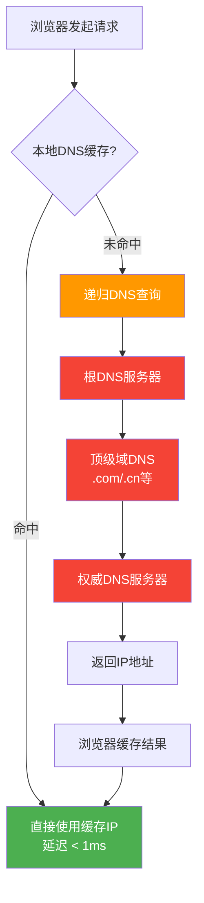
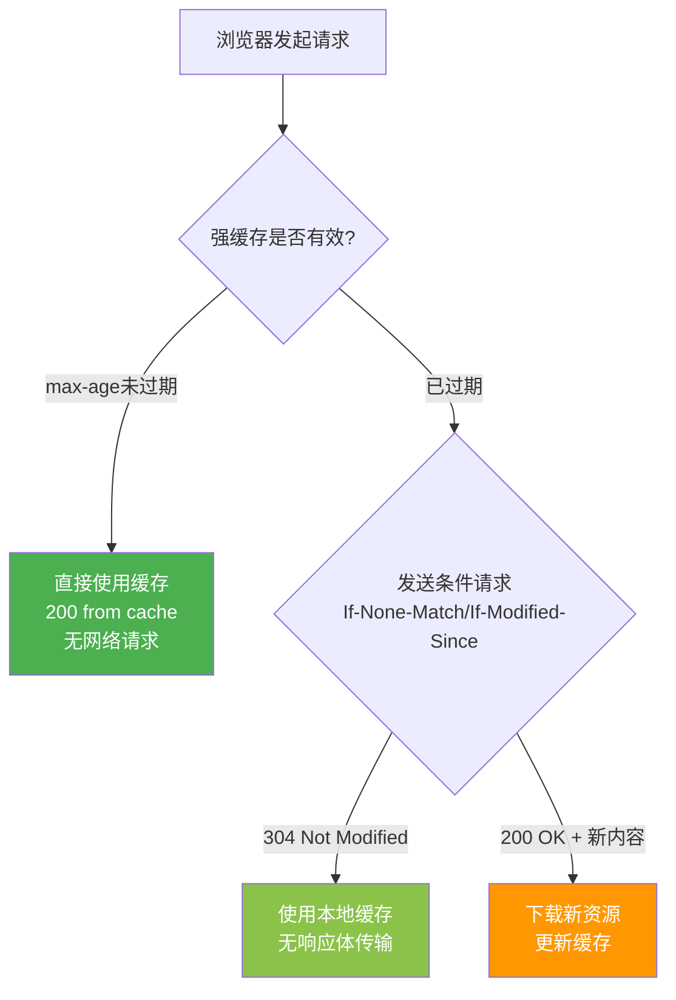
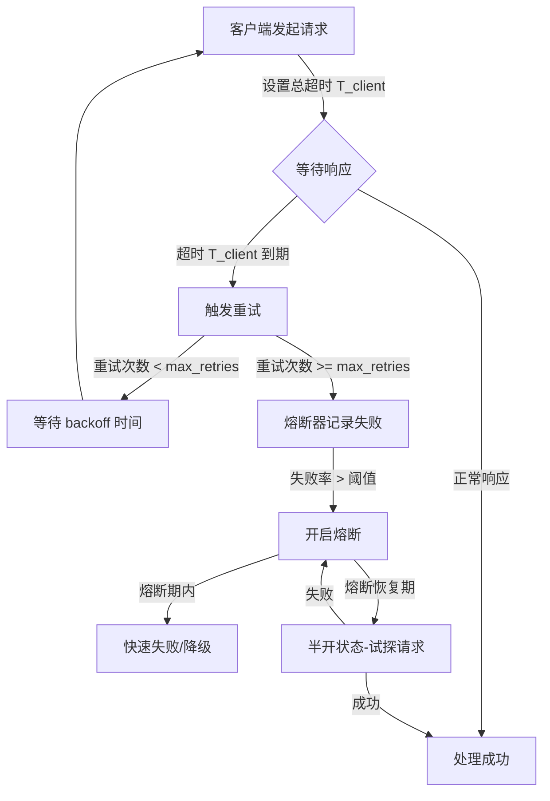
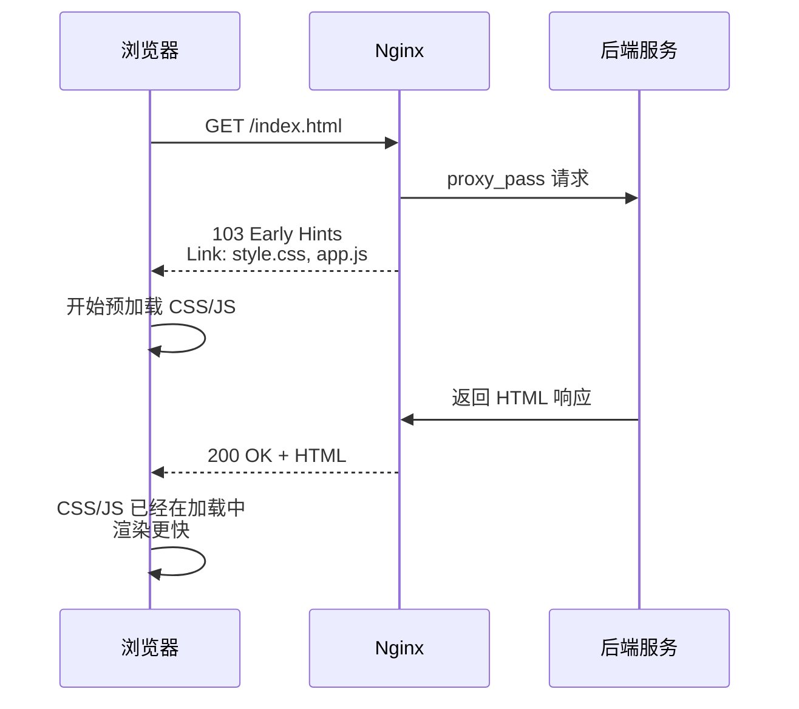
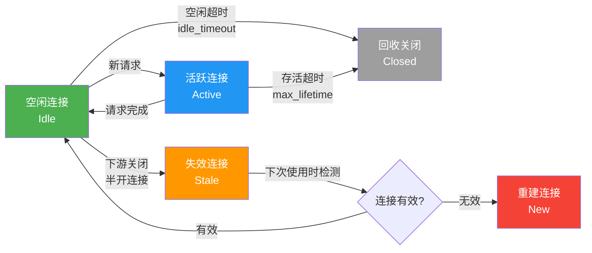

# 第19章 应用层协议——常见误区

在应用层协议的实际使用中，开发者往往凭借直觉或过时经验做决策，导致性能下降、安全漏洞甚至系统故障。本章系统梳理在 HTTP、HTTPS/TLS、DNS、WebSocket、RPC/gRPC、消息队列协议等场景中最常犯的错误，逐一剖析根因并给出纠正方案。每个误区都附带真实的诊断方法和修正代码，帮助读者在自己的项目中快速识别并避免这些问题。

---

## 误区一：盲目升级 HTTP 版本，忽视基础设施兼容性

### 错误表现

团队听说 HTTP/2 或 HTTP/3 性能更好，便直接在生产环境启用，没有检查中间链路的兼容性。结果出现：

- Nginx 开启 HTTP/2 后，后端负载均衡器不支持，导致连接重置
- 启用 HTTP/3 后，企业防火墙将 QUIC（基于 UDP）流量直接丢弃，移动端用户大面积超时
- CDN 配置了 HTTP/2 但源站仍是 HTTP/1.0，回源链路成为瓶颈

### 根因分析

HTTP 版本升级不是单纯的"客户端和服务端达成一致"那么简单。整个请求链路——包括 CDN、反向代理、负载均衡器、WAF、API 网关——都必须支持新协议。任何一个环节的不兼容都会导致降级或失败。


> **关键认知**：图中每个橙色节点都是潜在的协议不兼容风险点。HTTP/2 需要 TLS + ALPN 协商，HTTP/3 需要 UDP 支持。任何一个节点不支持新协议，都会导致连接降级或直接失败。

### 诊断方法

```bash
# 检查 Nginx 是否真正启用了 HTTP/2
curl -I --http2 https://your-domain.com 2>&amp;1 | head -5
# 如果显示 "HTTP/1.1" 说明 HTTP/2 未生效

# 检查 TLS 握手中的 ALPN 协商结果
openssl s_client -connect your-domain.com:443 -alpn h2,http/1.1 2>/dev/null | grep "ALPN"
# 应输出: ALPN protocol: h2

# 检查 QUIC/HTTP3 支持
curl -I --http3 https://your-domain.com 2>&amp;1 | head -5
# 或使用专门工具
quiche_client https://your-domain.com
```

### 正确做法

采用分阶段升级策略：

```bash
# 第一步：盘点链路组件版本
echo "=== Nginx版本 ==="
nginx -v 2>&amp;1
echo "=== OpenSSL版本 ==="
openssl version
echo "=== 操作系统内核 ==="
uname -r  # QUIC需要较新内核或用户态实现

# 第二步：灰度验证
# 先在测试环境模拟完整链路，用 curl --http2 逐段验证
# Nginx配置中增加日志标记协议版本
log_format protocol '$remote_addr - $request - $server_protocol - $upstream_protocol';
# 对比 $server_protocol（客户端到Nginx）和 $upstream_protocol（Nginx到后端）

# 第三步：监控降级比例
# 在接入层记录实际使用的协议版本
# HTTP/2 降级到 HTTP/1.1 的比例超过 5% 时触发告警
```

### 进阶：HTTP/2 与 HTTP/3 的真实性能差异

很多人以为升级到 HTTP/2 就能"自动变快"，实际上 HTTP/2 的优势集中在**多路复用**和**头部压缩**上，而不是降低延迟。在以下场景中，HTTP/2 可能反而不如 HTTP/1.1：

| 场景 | HTTP/1.1（多连接） | HTTP/2（单连接） | 原因 |
|------|---------------------|-------------------|------|
| 低延迟局域网 | 6 并发连接足够 | 单连接多流 | HTTP/2 帧处理开销 |
| 高丢包率移动网络 | 多连接独立重传 | 单连接队头阻塞（TCP层） | TCP 层队头阻塞 |
| 大量小请求 | 连接建立开销大 | 头部压缩+多路复用 | HTTP/2 胜出 |
| 大文件下载 | 多连接并行 | 流优先级可能被抢占 | 取决于优先级策略 |

> **决策建议**：在局域网或低丢包环境下，HTTP/2 的收益有限。真正的性能飞跃来自 HTTP/3（QUIC 解决了 TCP 层队头阻塞），但需要评估防火墙和中间设备的 UDP 支持情况。

---

## 误区二：HTTPS/TLS 配置不当导致安全漏洞或性能损失

### 错误表现

- 服务器仍支持 TLS 1.0/1.1，被 PCI DSS 扫描标记为不合规
- 密码套件列表中包含 RC4、3DES、CBC 模式的弱算法
- 证书链不完整，只部署了服务器证书而遗漏中间证书，导致部分客户端验证失败
- 未启用 HSTS，用户被中间人攻击劫持到 HTTP 明文连接
- 自签名证书用于生产环境，浏览器报错后被运维人员"解决"为关闭验证

### 根因分析

TLS 配置涉及密码学、证书体系、浏览器行为等多个交叉领域，开发者容易在"能跑通"和"安全正确"之间选择前者。特别是在内网环境和开发测试阶段，安全配置往往被跳过，之后又被带到生产环境。

### 诊断方法

```bash
# 使用 OpenSSL 检查服务器支持的协议和密码套件
openssl s_client -connect your-domain.com:443 -tls1   # 测试 TLS 1.0
openssl s_client -connect your-domain.com:443 -tls1_1 # 测试 TLS 1.1
openssl s_client -connect your-domain.com:443 -tls1_2 # 测试 TLS 1.2
openssl s_client -connect your-domain.com:443 -tls1_3 # 测试 TLS 1.3

# 列出服务器接受的所有密码套件
nmap --script ssl-enum-ciphers -p 443 your-domain.com

# 检查证书链完整性
openssl s_client -connect your-domain.com:443 -showcerts 2>/dev/null | \
  grep -E "(subject|issuer|Verify return)"

# 在线检测（推荐生产环境使用）
# https://www.ssllabs.com/ssltest/  — 综合评级 A+ 才算合格
# https://observatory.mozilla.org/   — Mozilla 安全评估
```

### 正确做法

Nginx TLS 最佳配置模板：

```nginx
server {
    listen 443 ssl http2;
    server_name your-domain.com;

    # 仅允许 TLS 1.2 和 1.3
    ssl_protocols TLSv1.2 TLSv1.3;

    # 密码套件：仅保留 AEAD 算法
    ssl_ciphers ECDHE-ECDSA-AES128-GCM-SHA256:ECDHE-RSA-AES128-GCM-SHA256:ECDHE-ECDSA-AES256-GCM-SHA384:ECDHE-RSA-AES256-GCM-SHA384:ECDHE-ECDSA-CHACHA20-POLY1305:ECDHE-RSA-CHACHA20-POLY1305;

    # 优先使用服务器密码套件顺序
    ssl_prefer_server_ciphers on;

    # 会话复用（减少握手开销）
    ssl_session_cache shared:SSL:10m;
    ssl_session_timeout 1d;
    ssl_session_tickets off;  # 安全考虑建议关闭

    # OCSP Stapling（加速证书验证）
    ssl_stapling on;
    ssl_stapling_verify on;
    ssl_trusted_certificate /etc/ssl/certs/chain.pem;
    resolver 8.8.8.8 8.8.4.4 valid=300s;

    # 安全头
    add_header Strict-Transport-Security "max-age=63072000; includeSubDomains; preload" always;
    add_header X-Content-Type-Options nosniff;
    add_header X-Frame-Options DENY;
}

# HTTP 自动跳转 HTTPS
server {
    listen 80;
    server_name your-domain.com;
    return 301 https://$server_name$request_uri;
}
```

证书链完整性的正确部署方式：

```bash
# 合并证书链（中间证书 + 根证书 不能遗漏）
cat server.crt intermediate.crt root.crt > fullchain.crt

# 验证证书链是否完整
openssl verify -CAfile /etc/ssl/certs/ca-certificates.crt fullchain.crt
# 应输出: fullchain.crt: OK
```

### 进阶：证书自动化管理

手动管理证书过期是运维事故的高发场景。推荐使用 ACME 协议自动化：

```bash
# Certbot 自动续期（Let's Encrypt）
# 安装后配置自动续期定时任务
certbot certonly --nginx -d your-domain.com --agree-tos -m admin@example.com

# 验证自动续期配置
certbot renew --dry-run

# 检查证书到期时间
echo | openssl s_client -connect your-domain.com:443 2>/dev/null | \
  openssl x509 -noout -dates
# notBefore=Jun 26 00:00:00 2026 GMT
# notAfter=Sep 24 00:00:00 2026 GMT
```

> **生产建议**：设置证书到期前 30 天的告警。Let's Encrypt 证书有效期 90 天，建议每天运行两次 `certbot renew`（系统安装后自动配置）。

---

## 误区三：DNS 配置草率导致延迟和可用性问题

### 错误表现

- TTL 设置过长（如 86400 秒），故障切换时 DNS 缓存导致流量无法快速切换
- TTL 设置过短（如 60 秒），导致 DNS 查询频率过高，增加延迟
- 只部署单个 DNS 供应商，无容灾能力
- 未配置 DNS 健康检查，故障节点仍然返回解析记录
- 内部服务大量使用硬编码 IP 地址，丧失了 DNS 带来的灵活性

### 根因分析

DNS 是应用层协议中被严重低估的一环。开发者往往认为"DNS 只是把域名变成 IP"，忽略了 DNS 解析本身可能带来 50-200ms 的延迟，以及 DNS 故障导致的全局不可用。一个典型的 Web 页面加载需要解析 10-30 个域名，DNS 延迟会直接叠加。



> **关键数据**：首次 DNS 查询（无缓存）平均耗时 50-200ms，极端情况下可达 500ms+。对于移动端用户，DNS 是页面加载的第一道瓶颈。

### 诊断方法

```bash
# 测量 DNS 解析时间
dig your-domain.com | grep "Query time"
# 正常值: < 50ms（本地缓存命中 < 1ms）

# 追踪完整 DNS 解析路径
dig +trace your-domain.com
# 查看经过哪些权威 DNS 服务器

# 检查 DNS 缓存 TTL
dig your-domain.com | grep -A1 "ANSWER SECTION"
# 注意 TTL 值（秒）

# 测试多个 DNS 服务器的一致性
dig @8.8.8.8 your-domain.com +short
dig @1.1.1.1 your-domain.com +short
dig @your-local-dns your-domain.com +short
# 应返回相同结果，差异说明 DNS 同步问题

# 检查是否存在 DNS 泄露（DoH/DoT 场景）
# 使用 https://dnsleaktest.com/ 测试
```

### 正确做法

```bash
# 分场景设置 TTL
# - 正常运行期：300-600 秒（5-10分钟）
# - 计划维护/故障切换前：提前降低到 60 秒
# - 维护完成后：恢复到 300 秒

# 多供应商 DNS 架构
# 主: Cloudflare (1.1.1.1)
# 备: AWS Route53
# 灾备: 本地自建 DNS (PowerDNS/BIND)

# DNS 即代码：用 Terraform 管理 DNS 记录
resource "cloudflare_record" "api" {
  zone_id = var.cloudflare_zone_id
  name    = "api"
  value   = "10.0.1.100"
  type    = "A"
  ttl     = 300  # 维护期间动态调整为 60
}

# 启用 DNSSEC 防止 DNS 欺骗
# 在域名注册商处开启 DNSSEC
# 验证: dig +dnssec your-domain.com
```

### 进阶：DNS 预解析与预连接

在 HTML 中提前声明需要解析的域名，可以将 DNS 查询与页面渲染并行：

```html
<!-- DNS 预解析：提前解析第三方域名 -->
<link rel="dns-prefetch" href="//api.example.com">
<link rel="dns-prefetch" href="//cdn.example.com">

<!-- 预连接：提前完成 DNS + TCP + TLS 握手 -->
<link rel="preconnect" href="https://api.example.com">

<!-- 预加载：提前下载关键资源 -->
<link rel="preload" href="/fonts/main.woff2" as="font" type="font/woff2" crossorigin>
```

> **实践建议**：对首屏加载涉及的所有第三方域名（API、CDN、统计、广告）都添加 `dns-prefetch`，可减少 100-300ms 的首次请求延迟。

---

## 误区四：HTTP 缓存策略要么不用，要么用错

### 错误表现

- 所有接口都设置 `Cache-Control: no-cache`，完全放弃浏览器缓存能力
- 静态资源不加版本号，更新后用户仍看到旧版本（`app.js` 被强缓存 1 年）
- API 响应设置了过长的 `max-age`，导致用户数据更新延迟
- `ETag` 和 `Last-Modified` 同时使用但优先级混乱，产生不必要的带宽消耗
- CDN 缓存规则和应用缓存头冲突，某些请求被意外缓存

### 根因分析

HTTP 缓存涉及浏览器缓存、CDN 缓存、代理缓存、应用缓存多层，每层的缓存策略相互独立又相互影响。开发者往往只关注其中一层，忽略了缓存层之间的交互效应。

### 缓存策略决策框架

| 资源类型 | 推荐策略 | Cache-Control 示例 | 说明 |
|----------|----------|---------------------|------|
| HTML 页面 | 协商缓存 | `no-cache` | 每次验证，确保获取最新内容 |
| JS/CSS（带哈希） | 强缓存 | `max-age=31536000, immutable` | 文件名含哈希，内容变了URL就变 |
| API 响应 | 短时强缓存或不缓存 | `max-age=0, must-revalidate` | 用户敏感数据不应被中间缓存 |
| 图片（静态） | 长时强缓存 | `max-age=2592000` | 30天缓存，配合版本化文件名 |
| 字体文件 | 强缓存 | `max-age=31536000, immutable` | 几乎不会变化 |
| API 列表（分页） | 短时缓存 | `public, max-age=30` | 减少重复请求，但保持数据新鲜 |

### 正确做法

```bash
# 静态资源：文件名带内容哈希
# 构建产物: app.a1b2c3d4.js → 可以设 max-age=1年
# 因为内容变化 → 文件名变化 → 新URL → 缓存自动失效

# Webpack/Vite 配置示例
# vite.config.js
export default {
  build: {
    rollupOptions: {
      output: {
        entryFileNames: 'assets/[name].[hash].js',
        chunkFileNames: 'assets/[name].[hash].js',
        assetFileNames: 'assets/[name].[hash].[ext]'
      }
    }
  }
}

# HTML 中引用缓存策略
# <script src="/assets/app.a1b2c3d4.js"></script>
# 浏览器看到新URL就会重新请求，旧URL的缓存自然过期

# Nginx 层面的缓存控制
location ~* \.(js|css|png|jpg|jpeg|gif|ico|svg|woff2)$ {
    expires 30d;
    add_header Cache-Control "public, immutable";
    # 对于带哈希的文件，可以设更长
}

# API 缓存：根据数据特性差异化处理
location /api/ {
    # 实时数据：不缓存
    add_header Cache-Control "no-store";
}

location /api/config/ {
    # 配置数据：短时缓存
    add_header Cache-Control "public, max-age=60, must-revalidate";
}
```

### 进阶：缓存失效的完整流程

理解浏览器缓存的决策流程是正确配置的前提：



> **常见陷阱**：`no-cache` 并不是"不缓存"，而是"每次都要向服务器验证"（协商缓存）。真正不缓存的是 `no-store`。很多开发者混淆这两个指令，导致不必要的网络请求。

---

## 误区五：WebSocket 连接管理粗放，缺乏生命周期管控

### 错误表现

- WebSocket 连接建立后没有心跳检测，网络断开后客户端和服务端都不知道
- 服务端不设置最大连接数限制，一个恶意客户端可以消耗所有连接资源
- 断线后没有自动重连机制，或重连策略是立即无限重试，导致服务端被重连风暴击垮
- WebSocket 消息没有大小限制，一条巨型消息耗尽内存
- 未做消息幂等处理，网络抖动导致重复消息被业务重复处理

### 根因分析

WebSocket 是长连接，生命周期远比 HTTP 请求复杂。HTTP 请求是"请求-响应-结束"的短生命周期模型，而 WebSocket 需要管理连接的建立、保活、断线重连、资源回收等完整生命周期。很多开发者用 HTTP 的思维来管理 WebSocket，导致各种问题。

### 诊断方法

```bash
# 检查 WebSocket 连接数
ss -s | grep estab
# 或更精确
ss -tnp | grep -c "ESTAB.*:443"

# 监控 WebSocket 连接内存占用
# 每个 WebSocket 连接约占 2-10KB 内存（不含消息缓冲区）
# 10万连接 ≈ 200MB-1GB

# 抓包分析 WebSocket 帧
tcpdump -i eth0 -w ws.pcap port 443
# 用 Wireshark 打开，过滤: websocket
```

### 正确做法

```javascript
// 服务端：完整的 WebSocket 生命周期管理
const WebSocket = require('ws');

const wss = new WebSocket.Server({
  port: 8080,
  maxPayload: 1024 * 64,  // 限制单条消息最大 64KB
  perMessageDeflate: false,  // 生产环境关闭压缩以减少 CPU 开销
});

// 连接数限制
const MAX_CONNECTIONS = 10000;
let connectionCount = 0;

wss.on('connection', (ws, req) => {
  if (connectionCount >= MAX_CONNECTIONS) {
    ws.close(1013, 'Server is overloaded');
    return;
  }
  connectionCount++;

  // 心跳检测：30秒 ping，10秒无 pong 则断开
  ws.isAlive = true;
  ws.on('pong', () => { ws.isAlive = true; });

  ws.on('message', (data) => {
    // 消息大小检查
    if (data.length > 65536) {
      ws.close(1009, 'Message too large');
      return;
    }

    // 业务处理 + 幂等性保证
    const msg = JSON.parse(data);
    if (processedIds.has(msg.id)) {
      ws.send(JSON.stringify({ type: 'ack', id: msg.id, status: 'duplicate' }));
      return;
    }
    processedIds.add(msg.id);
    processMessage(ws, msg);
  });

  ws.on('close', () => { connectionCount--; });
  ws.on('error', (err) => {
    console.error('WebSocket error:', err.message);
    connectionCount--;
  });
});

// 定期心跳检查
const heartbeatInterval = setInterval(() => {
  wss.clients.forEach((ws) => {
    if (!ws.isAlive) {
      ws.terminate();  // 未响应 pong 的连接直接终止
      return;
    }
    ws.isAlive = false;
    ws.ping();
  });
}, 30000);

wss.on('close', () => clearInterval(heartbeatInterval));

// 客户端：指数退避重连
class ReconnectingWebSocket {
  constructor(url, options = {}) {
    this.url = url;
    this.reconnectDelay = options.initialDelay || 1000;
    this.maxDelay = options.maxDelay || 30000;
    this.maxRetries = options.maxRetries || 10;
    this.retryCount = 0;
    this.connect();
  }

  connect() {
    this.ws = new WebSocket(this.url);

    this.ws.onopen = () => {
      this.retryCount = 0;           // 连接成功，重置计数
      this.reconnectDelay = 1000;    // 重置延迟
    };

    this.ws.onclose = (event) => {
      if (event.code === 1000) return;  // 正常关闭，不重连

      if (this.retryCount < this.maxRetries) {
        // 指数退避 + 随机抖动，防止重连风暴
        const delay = Math.min(
          this.reconnectDelay * Math.pow(2, this.retryCount) + Math.random() * 1000,
          this.maxDelay
        );
        this.retryCount++;
        console.log(`Reconnecting in ${delay}ms (attempt ${this.retryCount})`);
        setTimeout(() => this.connect(), delay);
      }
    };
  }
}
```

### 进阶：WebSocket 与 HTTP 的混合架构

在实际项目中，WebSocket 不应孤立使用，而应与 HTTP API 形成互补架构：

| 通信模式 | 使用场景 | 示例 |
|----------|----------|------|
| HTTP REST | CRUD 操作、文件上传、认证鉴权 | 用户注册、订单查询 |
| WebSocket | 实时推送、双向同步、低延迟通知 | 聊天消息、股票行情、协同编辑 |
| SSE（Server-Sent Events） | 单向实时推送、简单的事件流 | 通知推送、日志流、进度更新 |
| WebSocket + HTTP 混合 | 先 HTTP 认证，再 WebSocket 保持连接 | 在线游戏、实时协作 |

> **选型建议**：如果只需要服务端到客户端的单向推送，SSE 比 WebSocket 更简单（自动重连、HTTP/2 多路复用、无需自定义协议）。只有真正需要双向通信时才使用 WebSocket。

---

## 误区六：gRPC 使用不当，性能反而不如 REST

### 错误表现

- 所有接口都用 Unary RPC，未利用 gRPC 的流式传输优势
- Protobuf 消息设计过于扁平，没有利用嵌套和 oneof，导致序列化后体积膨胀
- 未设置 `maxReceiveMessageSize` 和 `maxSendMessageSize`，大消息导致 OOM
- 服务端没有实现优雅关闭，滚动重启时正在处理的请求被强制中断
- 跨语言调用时，IDL（接口定义文件）版本不一致，导致序列化/反序列化失败

### 根因分析

gRPC 的性能优势建立在正确使用的前提下：HTTP/2 多路复用、Protobuf 二进制序列化、流式传输。但如果使用方式不当——比如把 gRPC 当 REST 用（只用 Unary RPC）、消息设计不合理、缺少生产级的连接和生命周期管理——性能优势无法体现，反而增加了 Protobuf 编解码和 HTTP/2 帧处理的开销。

### 正确做法

```protobuf
// message 设计原则：合理嵌套，善用 oneof 和 map
message UserRequest {
  string user_id = 1;
  oneof query {
    string email = 2;           // 按邮箱查
    string phone = 3;           // 按手机查
    int64 internal_id = 4;      // 按内部ID查
  }
  FieldMask field_mask = 5;     // 只返回需要的字段，减少传输量
}

message UserResponse {
  string user_id = 1;
  string name = 2;
  string email = 3;
  string phone = 4;
  map<string, string> metadata = 5;  // 扩展字段，不破坏前向兼容
}
```

```go
// 服务端优雅关闭
func main() {
    lis, _ := net.Listen("tcp", ":50051")
    srv := grpc.NewServer(
        grpc.MaxConcurrentStreams(1000),           // 限制并发流
        grpc.KeepaliveParams(keepalive.ServerParameters{
            MaxConnectionAge:      30 * time.Minute, // 定期关闭长连接，促进负载均衡
            MaxConnectionAgeGrace: 10 * time.Minute,  // 优雅关闭宽限期
            Time:                  10 * time.Second,  // Ping 间隔
            Timeout:               3 * time.Second,   // Ping 超时
        }),
    )
    pb.RegisterMyServiceServer(srv, &amp;myService{})

    // 优雅关闭：收到 SIGTERM 后先停止接受新请求，等待处理中的请求完成
    go func() {
        sigCh := make(chan os.Signal, 1)
        signal.Notify(sigCh, syscall.SIGTERM, syscall.SIGINT)
        <-sigCh
        fmt.Println("Shutting down gracefully...")
        srv.GracefulStop()
    }()

    if err := srv.Serve(lis); err != nil {
        log.Fatalf("failed to serve: %v", err)
    }
}
```

### 进阶：gRPC 四种通信模式的选择

| 模式 | Proto 定义 | 适用场景 | 延迟特征 |
|------|-----------|----------|----------|
| Unary RPC | `rpc Method(Req) returns (Res)` | 普通请求-响应 | 一次往返 |
| Server Streaming | `rpc Method(Req) returns (stream Res)` | 大数据下载、事件流 | 一次请求，多次推送 |
| Client Streaming | `rpc Method(stream Req) returns (Res)` | 文件上传、日志批量上报 | 多次推送，一次响应 |
| Bidirectional Streaming | `rpc Method(stream Req) returns (stream Res)` | 聊天、实时数据同步 | 全双工，持续通信 |

> **常见错误**：用 Unary RPC 传输超过 1MB 的数据。应改用 Server Streaming 分块传输，或 Client Streaming 分块上传，避免单条消息过大导致 `RESOURCE_EXHAUSTED` 错误。

---

## 误区七：超时、重试、熔断配置缺失或不合理

### 错误表现

- 所有 HTTP 调用都没有设置超时，一个慢接口可以拖垮整个线程池
- 重试策略是"立即重试 N 次"，没有退避间隔，在下游服务故障时产生重试风暴
- 熔断器的阈值设置不合理——失败 1 次就熔断（过于敏感），或失败 100 次才熔断（形同虚设）
- 超时时间设得比重试总时间还长，导致超时配置失去意义
- 客户端和服务端的超时不匹配——客户端等 5 秒，服务端处理 10 秒，客户端超时后服务端还在处理

### 根因分析

超时、重试、熔断是分布式系统的三道防线，三者之间有严格的时序和数值约束关系。很多团队独立配置这三个参数，没有考虑它们的交互效应。核心原则是：`客户端超时 > 服务端超时 + 网络延迟`，`重试间隔 > 下游服务的恢复时间`。

### 超时/重试/熔断的正确关系



### 正确做法

```python
import time
import random
from functools import wraps

# 超时配置原则
# - 服务端处理时间上限: T_server = 3s
# - 网络传输延迟（P99）: T_network = 500ms
# - 客户端超时: T_client = T_server + T_network = 3.5s（留余量可设4s）
# - 连接超时（独立设置）: T_connect = 1s

# 带指数退避的重试装饰器
def retry_with_backoff(max_retries=3, base_delay=1.0, max_delay=10.0):
    def decorator(func):
        @wraps(func)
        def wrapper(*args, **kwargs):
            for attempt in range(max_retries + 1):
                try:
                    return func(*args, **kwargs)
                except Exception as e:
                    if attempt == max_retries:
                        raise  # 最后一次重试仍然失败，抛出异常

                    # 指数退避 + 随机抖动（防止多个客户端同时重试）
                    delay = min(base_delay * (2 ** attempt), max_delay)
                    jitter = random.uniform(0, delay * 0.3)
                    time.sleep(delay + jitter)
                    print(f"Retry {attempt + 1}/{max_retries} after {delay + jitter:.1f}s: {e}")
            return None
        return wrapper
    return decorator

# 简易熔断器
class CircuitBreaker:
    def __init__(self, failure_threshold=5, recovery_timeout=30):
        self.failure_threshold = failure_threshold
        self.recovery_timeout = recovery_timeout
        self.failure_count = 0
        self.last_failure_time = 0
        self.state = "closed"  # closed / open / half_open

    def call(self, func, *args, **kwargs):
        if self.state == "open":
            if time.time() - self.last_failure_time > self.recovery_timeout:
                self.state = "half_open"
            else:
                raise Exception("Circuit is OPEN, request rejected")

        try:
            result = func(*args, **kwargs)
            if self.state == "half_open":
                self.state = "closed"       # 试探成功，恢复
                self.failure_count = 0
            return result
        except Exception as e:
            self.failure_count += 1
            self.last_failure_time = time.time()
            if self.failure_count >= self.failure_threshold:
                self.state = "open"          # 触发熔断
            raise
```

```bash
# Nginx 层面的超时配置（常被遗漏的关键参数）
proxy_connect_timeout  5s;    # 与后端建立连接的超时
proxy_send_timeout     30s;   # 向后端发送请求的超时
proxy_read_timeout     30s;   # 等待后端响应的超时

# 注意：proxy_read_timeout 是从最后一次读取到数据开始计时的
# 如果后端每 10 秒输出一次心跳但总处理需要 60 秒，这个设置不会超时
# 要精确控制总时间，需要在应用层实现

# 关闭 proxy_buffering 时要特别注意
# proxy_buffering off; 会让 Nginx 逐字节转发，长时间的流式响应不会触发超时
```

### 进阶：超时/重试配置的数值约束

错误的参数组合会带来灾难性后果。以下是经过验证的配置原则：

```text
# 数值约束关系（必须满足）
T_connect < T_server          # 连接超时必须小于服务端处理超时
T_client > T_server + T_network  # 客户端超时必须大于服务端超时+网络延迟
T_retry_total < T_client      # 重试总时间不能超过客户端超时
backoff_min > T_network       # 重试间隔的最小值要大于网络延迟

# 典型配置示例
T_connect     = 1s     # 连接超时
T_server      = 3s     # 服务端处理上限
T_network     = 500ms  # 网络延迟 P99
T_client      = 4s     # 客户端超时（3s + 500ms + 500ms 余量）
max_retries   = 3      # 最大重试次数
backoff_base  = 1s     # 重试基础间隔
backoff_total = 1s + 2s + 4s = 7s  # 重试总时间（但受 T_client 约束）
```

> **关键提醒**：如果 `T_retry_total > T_client`，重试永远不会完成——客户端已经超时断开了，重试还在继续。务必验证数值关系。

---

## 误区八：HTTP/2 的服务端推送滥用

### 错误表现

- 对所有客户端请求都推送 CSS/JS/图片，不管客户端是否已经缓存
- 推送大量资源导致服务器带宽耗尽，正常请求反而变慢
- 推送的资源优先级设置不当，关键资源（HTML）被非关键资源（图片）抢占带宽

### 根因分析

HTTP/2 的服务端推送（Server Push）设计初衷是减少往返次数，但它的生效条件是客户端没有缓存对应资源。如果客户端已经缓存了推送的资源，不仅浪费带宽，还会占用连接的流控窗口，影响其他正常请求。

更关键的是，Chrome 106+ 已经默认禁用了 Server Push，转而推荐 103 Early Hints。继续使用 Server Push 不仅无法受益，还可能因为发送不被处理的 PUSH_PROMISE 帧而浪费服务器资源。

### Server Push 的衰落时间线

| 时间 | 事件 | 影响 |
|------|------|------|
| 2015 | HTTP/2 标准发布，Server Push 作为核心特性 | 所有浏览器支持 |
| 2020 | Chrome 开始实验性禁用 Push | Push 缓存命中率极低 |
| 2022 | Chrome 106 默认禁用 Server Push | Push 在主流浏览器失效 |
| 2023 | 103 Early Hints 被主流浏览器广泛支持 | 替代方案成熟 |
| 2024+ | Push 仅在 HTTP/3 的少数实现中保留 | 不推荐使用 |

### 正确做法

```nginx
# 替代方案：103 Early Hints（已被主流浏览器支持）
# 在服务器发送最终响应之前，先发送 103 状态码告诉浏览器预加载资源

# Nginx 配置（需要 Nginx 1.13.9+）
location = /index.html {
    # Nginx 会自动发送 103 Early Hints（如果配置了 add_header）
    add_header Link "</style.css>; rel=preload; as=style";
    add_header Link "</app.js>; rel=preload; as=script";

    proxy_pass http://backend;
}

# 如果确实需要使用 Server Push（仅限客户端确定无缓存的场景）
location = /index.html {
    http2_push /style.css;
    http2_push /app.js;
    http2_push /critical-font.woff2;

    # 仅推送关键渲染路径资源，不要推送图片等非关键资源
    proxy_pass http://backend;
}
```

### 进阶：103 Early Hints 的完整工作流



> **核心优势**：103 Early Hints 在后端响应生成期间（可能需要几百毫秒到几秒）就告诉浏览器预加载资源，而 Server Push 需要在最终响应发出后才能推送。Early Hints 的时序优势明显。

---

## 误区九：忽视连接池管理，导致资源泄漏和性能抖动

### 错误表现

- HTTP 客户端每次请求都创建新的 TCP 连接，未复用连接池
- 连接池大小未根据下游服务的实际承载能力调整，默认值过小导致排队，过大导致下游服务被压垮
- 连接池中的连接长时间不回收，被下游服务端关闭后变成半开连接，后续请求失败
- 未设置连接的空闲超时和最大存活时间，生产环境运行数天后出现大量 TIME_WAIT

### 根因分析

连接池是 HTTP/1.1 和 HTTP/2 性能的基础。HTTP/1.1 的 Keep-Alive 是连接级别的复用，而 HTTP/2 的多路复用进一步提升了单连接的利用效率。但连接池配置不当会引入两个方向的问题：太小导致请求排队（延迟增加），太大导致资源竞争（CPU/内存/带宽过载）。

### 连接池生命周期



### 正确做法

```python
import requests
from requests.adapters import HTTPAdapter
from urllib3.util.retry import Retry

# Python requests 连接池最佳实践
session = requests.Session()

adapter = HTTPAdapter(
    pool_connections=10,       # 连接池中保存的连接数（按 host 分组）
    pool_maxsize=20,           # 每个 host 的最大连接数
    max_retries=Retry(
        total=3,
        backoff_factor=1,      # 退避: 1s, 2s, 4s
        status_forcelist=[502, 503, 504],  # 仅对 5xx 重试
    ),
)
session.mount('https://api.example.com', adapter)

# 关键参数调优原则
# - pool_maxsize 应与下游服务的 max_connections 匹配
# - 如果下游是 Nginx，默认 worker_connections=768，不要超过这个值
# - 如果下游有多个实例，pool_maxsize × 实例数 = 下游总承受能力
```

```java
// Java HttpClient 连接池（JDK 11+）
HttpClient client = HttpClient.newBuilder()
    .connectTimeout(Duration.ofSeconds(5))
    .executor(Executors.newFixedThreadPool(20))
    .build();

// 使用 Apache HttpClient 的高级连接池配置
PoolingHttpClientConnectionManager cm =
    new PoolingHttpClientConnectionManager();
cm.setMaxTotal(200);                    // 总连接数上限
cm.setDefaultMaxPerRoute(20);           // 每个 host 的连接数上限
cm.setValidateAfterInactivity(5000);    // 空闲 5 秒后验证连接有效性
cm.closeIdleConnections(60, TimeUnit.SECONDS);  // 回收空闲 60 秒的连接
```

### 进阶：连接池监控指标

连接池必须有可观测性，否则问题无法定位：

```text
# 关键监控指标
pool.active_connections    = 当前活跃连接数
pool.idle_connections      = 当前空闲连接数
pool.pending_requests      = 等待可用连接的请求数（> 0 说明池太小）
pool.connection_timeout    = 连接获取超时次数（频繁说明池太小）
pool.stale_connection      = 检测到失效连接的次数（频繁说明 idle_timeout 太长）

# 告警阈值建议
pool.pending_requests > 10   → 告警：连接池可能不足
pool.active_connections > pool_maxsize × 0.8  → 提示：接近上限
pool.stale_connection > pool.active × 0.1     → 告警：idle_timeout 需要调整
```

> **常见错误**：`pool_maxsize` 设得很大但下游服务只能承受很少的连接。结果是连接池满了但下游拒绝连接，反而比不用连接池更慢。连接池大小应该由下游服务的承载能力决定，而不是客户端的并发需求。

---

## 误区十：协议选型拍脑袋，缺乏量化评估

### 错误表现

- 所有内部服务通信都用 REST/JSON，gRPC 只在"听说过"的团队中被推荐
- 为每个服务间的 RPC 调用都用 WebSocket，实际上只需要请求-响应模式
- 消息队列选型只看"哪个火"，不评估消息可靠性、延迟、吞吐量的实际需求
- 在高频小数据场景用 HTTP/1.1，忽略了 HTTP/2 多路复用带来的延迟优势

### 协议选型决策矩阵

| 场景 | 推荐协议 | 关键考量 | 不推荐 |
|------|----------|----------|--------|
| 浏览器 ↔ 服务器 | HTTP/2 或 HTTP/3 | 兼容性、CDN 支持、浏览器支持 | WebSocket（除非需要全双工） |
| 内部微服务 RPC | gRPC（Protobuf） | 低延迟、强类型、多语言支持 | REST/JSON（高频调用场景） |
| 实时推送/协作 | WebSocket | 全双工、低延迟、服务端推送 | HTTP 长轮询（资源浪费） |
| 异步任务解耦 | 消息队列（Kafka/RabbitMQ） | 可靠投递、削峰填谷 | 直接 HTTP 调用（耦合强） |
| 文件/流式传输 | gRPC Server Streaming | 大数据量流式传输、背压控制 | REST（不支持流式） |
| 跨语言/跨组织 | REST + OpenAPI | 标准化、文档化、工具链成熟 | gRPC（学习成本高） |

### 正确做法

协议选型前应进行量化评估：

```bash
# 基准测试工具
# 1. HTTP 性能对比 (wrk)
wrk -t12 -c400 -d30s --latency http://api-server/endpoint
# 对比 HTTP/1.1 vs HTTP/2: wrk 不直接支持 h2，用 hey 或 autocannon
hey -n 10000 -c 200 -h2 http://api-server/endpoint

# 2. gRPC vs REST 对比 (ghz)
ghz --insecure --proto service.proto \
    --call mypackage.MyService.Method \
    -d '{"user_id": "123"}' \
    -n 10000 -c 100 \
    api-server:50051

# 3. 序列化格式对比
# 编写简单的序列化/反序列化基准测试
# 比较 Protobuf vs JSON vs MessagePack vs Avro
# 关注: 编码大小、编码速度、解码速度、CPU 占用

# 决策时必须考虑的因素:
# 1. 团队熟悉度（学习曲线 = 开发时间 = 成本）
# 2. 工具链成熟度（调试工具、监控工具、文档质量）
# 3. 运维复杂度（部署、监控、故障排查）
# 4. 向后兼容性（Protocol Buffers 天然优于 JSON Schema）
# 5. 性能天花板（是否满足未来 2-3 年的业务增长）
```

---

## 误区十一：CORS 配置不当引发安全漏洞或调试噩梦

### 错误表现

- 为了"快速解决跨域问题"直接设置 `Access-Control-Allow-Origin: *`，引入安全风险
- 预检请求（OPTIONS）未正确处理，导致复杂请求失败
- 没有设置 `Access-Control-Max-Age`，每次复杂请求都触发预检，增加延迟
- 开发环境和生产环境使用不同的 CORS 策略，导致上线后跨域问题频发

### 根因分析

CORS（跨源资源共享）是浏览器的同源策略机制，不是服务器错误。开发者往往把 CORS 问题当作"后端配置问题"快速解决，而不是从安全角度设计跨域策略。`Access-Control-Allow-Origin: *` 配合 `Access-Control-Allow-Credentials: true` 会直接被浏览器拒绝，因为它违反了安全规范。

### 正确做法

```nginx
# Nginx CORS 安全配置模板
# 只允许指定域名，不要用 *

# 生产环境：精确匹配允许的源
set $cors_origin "";
if ($http_origin ~* "^https://(app|admin)\.example\.com$") {
    set $cors_origin $http_origin;
}

# 允许多个源的写法（Nginx 不支持 Origin 正则直接用于 add_header）
# 推荐使用 Lua 脚本或应用层处理
add_header Access-Control-Allow-Origin $cors_origin always;
add_header Access-Control-Allow-Methods "GET, POST, PUT, DELETE, OPTIONS" always;
add_header Access-Control-Allow-Headers "Authorization, Content-Type, X-Request-ID" always;
add_header Access-Control-Allow-Credentials "true" always;
add_header Access-Control-Max-Age 86400 always;  # 预检结果缓存24小时

# 预检请求处理
if ($request_method = OPTIONS) {
    return 204;
}
```

> **安全红线**：永远不要在生产环境使用 `Access-Control-Allow-Origin: *`。如果需要支持多个源，使用应用层代码动态匹配 `Origin` 头部，而不是通配符。

---

## 误区十二：API 版本管理混乱，升级即破坏

### 错误表现

- 所有客户端共享同一个版本，任何接口变更都可能影响所有消费者
- 使用 URL 路径版本（`/v1/`、`/v2/`）但没有废弃策略，旧版本永远保留
- 使用 Header 版本但文档不清晰，客户端不知道该传什么版本号
- 修改响应字段的语义（如字段类型从 string 变为 array），导致旧客户端解析失败

### 根因分析

API 版本管理是契约管理问题。缺乏版本策略会导致两种极端：要么"从不破坏任何东西"导致 API 臃肿不堪，要么"频繁破坏"导致客户端不断适配。关键是在"稳定性"和"演进性"之间找到平衡。

### 版本策略对比

| 策略 | 示例 | 优点 | 缺点 |
|------|------|------|------|
| URL 路径版本 | `/v1/users` | 直观、易于路由、CDN 友好 | URL 膨胀、版本多时维护困难 |
| Header 版本 | `Accept: application/vnd.api.v1+json` | URL 干净、符合 REST 理念 | 调试困难、工具支持差 |
| 查询参数版本 | `/users?version=1` | 简单、易于测试 | 不够规范、容易遗漏 |
| 语义化版本 | URL 路径 + Header 双重支持 | 兼顾直观和规范 | 实现复杂 |

### 正确做法

```yaml
# API 版本管理策略（推荐）
# 1. 使用 URL 路径版本（直观、易调试）
# 2. 旧版本保持至少 12 个月
# 3. 废弃版本时返回 Deprecation 头部
# 4. 定期监控各版本的流量占比

# HTTP 头部版本声明示例
# 服务端响应：
# Deprecation: true
# Sunset: Sat, 01 Jan 2027 00:00:00 GMT
# Link: <https://api.example.com/v2/users>; rel="successor-version"
```

```bash
# 监控各版本 API 流量
# Nginx 日志格式中包含版本信息
log_format api_version '$remote_addr - $request - $upstream_status - $request_uri';

# 查询各版本的调用量
grep '/v1/' /var/log/nginx/access.log | wc -l  # v1 调用量
grep '/v2/' /var/log/nginx/access.log | wc -l  # v2 调用量
# 如果 v1 流量 < 5%，可以考虑废弃
```

---

## 误区排查速查表

在实际项目中，可以通过以下速查表快速定位协议相关问题：

| 症状 | 可能的误区 | 排查命令/工具 | 优先检查 |
|------|-----------|---------------|----------|
| 页面加载慢 | 缓存策略不当 / DNS 慢 / 未用 HTTP/2 | `dig` / Chrome DevTools Network / `curl -I --http2` | 首字节时间、DNS 解析时间 |
| 接口偶尔超时 | 缺少超时配置 / 连接池耗尽 | `ss -s` / 连接池监控指标 | 活跃连接数、排队等待数 |
| 大促期间雪崩 | 缺少熔断 / 重试风暴 | 重试率监控、熔断器状态 | 重试比例、下游错误率 |
| 证书告警不断 | 证书链不完整 / 证书过期 | `openssl s_client` / `certbot certificates` | 证书过期时间、链完整性 |
| WebSocket 频繁断连 | 缺少心跳 / 缓冲区满 | `ss -tnp` / 应用日志 | 连接数变化趋势、消息积压 |
| gRPC 错误率高 | 消息过大 / 优雅关闭缺失 | gRPC 日志 / `grpcurl` | 错误码、关闭帧类型 |
| 移动端用户投诉慢 | HTTP/2 TCP 层队头阻塞 | 在弱网环境测试 HTTP/2 vs HTTP/3 | 丢包率、重传率 |
| 跨域请求失败 | CORS 配置缺失 / 预检未处理 | 浏览器 Network 面板 OPTIONS 请求 | 预检响应状态码 |
| API 升级后客户端崩溃 | 版本管理缺失 / 字段语义变更 | 客户端错误日志 / API 网关日志 | 响应结构变化、废弃端点 |

---

## 总结

应用层协议的使用误区可以归结为三类：

1. **配置类误区**（误区一、二、三、六）：TLS 版本、DNS TTL、HTTP 版本兼容性、gRPC 参数等配置项需要根据实际环境精心调优，而非使用默认值或"能跑通就行"。

2. **架构类误区**（误区四、五、七、八）：缓存策略、WebSocket 生命周期、超时重试熔断、Server Push 等涉及系统架构层面的设计决策，需要从整体链路的角度思考，而非孤立地优化单个环节。

3. **决策类误区**（误区九、十）：连接池管理、协议选型等决策需要基于数据和量化评估，而非经验直觉或技术潮流。

避免这些误区的核心原则是：

- **可观测性先行**——先有监控数据，再做优化决策。没有 metrics 的优化是盲人摸象。
- **渐进式升级**——灰度验证后再全量推广。任何协议层面的变更都应该有回滚方案。
- **全链路思维**——任何协议层面的变更都要考虑整条请求链路的影响，包括 CDN、代理、网关等中间组件。
- **安全优先**——TLS 配置、CORS 策略、证书管理等安全相关配置不能因为"能跑通"就跳过。
- **量化驱动**——协议选型和参数调优应该基于基准测试数据，而不是"听说 X 比 Y 快"。
