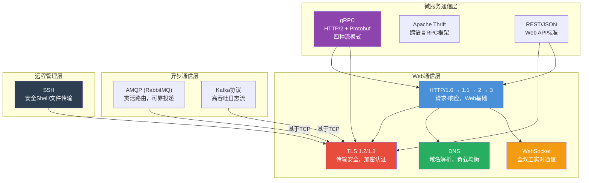
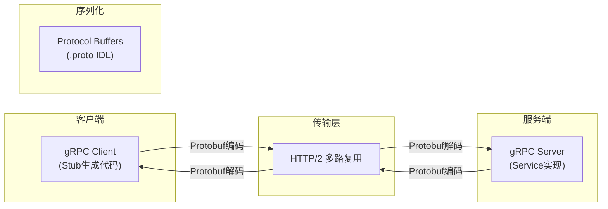
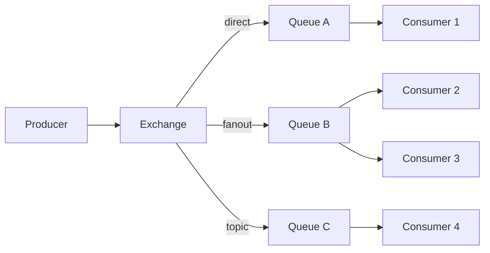
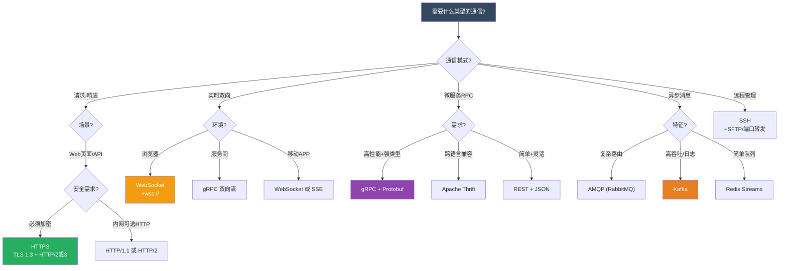
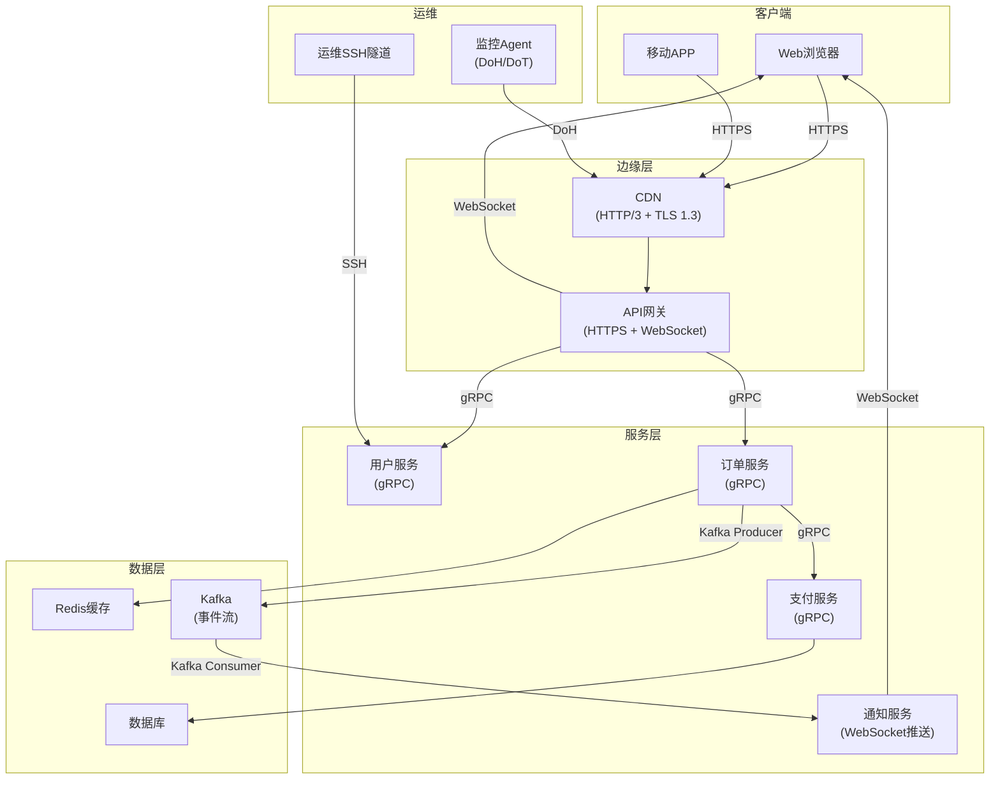

## 本章小结

### 核心要旨：三大结论

本章系统性地覆盖了应用层协议的完整知识体系。在结束本章之前，牢记以下三条核心结论：

> **结论一：协议演进的本质是解决阻塞。** HTTP 从 1.0 到 3.0 的每一次大版本升级，本质上都在解决上一层遗留的队头阻塞问题——TCP 握手阻塞、应用层队头阻塞、TCP 丢包导致的全连接阻塞。理解这条主线，就能串联起所有 HTTP 相关知识。

> **结论二：安全性不是附加选项，而是设计约束。** TLS 1.3 的设计哲学是"默认安全"——移除所有不安全的算法，强制前向保密。DNS 的安全增强（DNSSEC/DoH/DoT）同样体现了这一趋势。任何现代协议设计，安全都是内置的而非可选的。

> **结论三：协议选择没有银弹，只有 trade-off。** WebSocket 的全双工带来低延迟但增加了服务器复杂度；gRPC 的高性能依赖 Protobuf 的强类型约束；Kafka 的高吞吐以顺序写和追加日志为代价。理解每个协议的设计取舍，才能做出正确的技术选型。

---

### 1. 知识体系全景图

本章涵盖七大核心协议族，它们构成了现代互联网和分布式系统的完整通信骨架：



---

### 2. 核心知识点深度回顾

#### 2.1 HTTP协议演进：连接效率的四次革命

HTTP 协议的四次版本迭代，核心驱动力是解决三个递进的问题：**连接效率** → **头部开销** → **队头阻塞**。

| 版本 | 年份 | 核心改进 | 解决的问题 | RFC | 典型延迟改善 |
|------|------|----------|-----------|-----|-------------|
| HTTP/1.0 | 1996 | 奠定请求-响应模型 | 基础 Web 通信 | 1945 | — (基线) |
| HTTP/1.1 | 1997 | 持久连接、分块传输、管道化 | TCP 握手开销 | 2068/7230 | 首屏减少 N-1 次握手 |
| HTTP/2 | 2015 | 二进制分帧、多路复用、HPACK | 应用层队头阻塞 | 7540 | 页面加载快 30%-50% |
| HTTP/3 | 2022 | 基于 QUIC、流级别独立可靠传输 | TCP 层队头阻塞 | 9114 | 高丢包场景快 2-3 倍 |

**演进逻辑详解：**

- **HTTP/1.0 → 1.1**：从短连接到持久连接（`Connection: keep-alive`）。每个页面从 N 次 TCP 握手降为 1 次。引入分块传输编码（Chunked Transfer Encoding），允许服务端边生成边发送，无需预先知道响应长度。管道化（Pipelining）理论上允许连续发送多个请求，但实际中因队头阻塞和实现复杂性很少启用。

- **HTTP/1.1 → 2**：从文本协议到二进制分帧层。一个 TCP 连接上可以并行承载多个"流"（Stream），每个流上有独立的请求-响应对。HPACK 头部压缩通过静态表 + 动态表 + 霍夫曼编码，将典型头部从 ~800 字节压缩到 ~100 字节（压缩率约 85%）。服务器推送（Server Push）允许服务端主动推送客户端可能需要的资源，但实践中因缓存配合复杂，Chrome 已弃用。

- **HTTP/2 → 3**：从 TCP 到 QUIC（基于 UDP）。QUIC 在用户态实现了可靠传输、拥塞控制和流量控制，每个流独立可靠传输——丢包只影响单个流而非整个连接。0-RTT 建连让恢复连接时首包即可携带应用数据。连接迁移通过 Connection ID 实现，Wi-Fi ↔ 蜂窝切换时连接不中断。

**性能实测对比：**

场景: 移动网络 (3G, 丢包率 2%, RTT 200ms)
┌─────────────────────────┬────────────┬──────────┐
│ 协议配置                │ 页面加载   │ 首字节   │
├─────────────────────────┼────────────┼──────────┤
│ HTTP/1.1 (6条连接)      │ ~3.2s      │ ~800ms   │
│ HTTP/2 (1条连接)        │ ~2.8s      │ ~600ms   │
│ HTTP/3 over QUIC        │ ~1.9s      │ ~400ms   │
├─────────────────────────┼────────────┼──────────┤
│ 场景: 宽带网络 (丢包率0.1%, RTT 30ms)          │
│ HTTP/1.1 (6条连接)      │ ~0.9s      │ ~180ms   │
│ HTTP/2 (1条连接)        │ ~0.6s      │ ~120ms   │
│ HTTP/3 over QUIC        │ ~0.55s     │ ~110ms   │
└─────────────────────────┴────────────┴──────────┘

> **关键洞察**：在低丢包的宽带环境中，HTTP/2 和 HTTP/3 差距不大；在高丢包的移动网络中，HTTP/3 的优势才真正体现。这就是为什么 HTTP/3 不是简单的"全面替代"。

#### 2.2 HTTPS与TLS：安全通信的基石

TLS 协议经历了从 1.2 到 1.3 的重大简化，核心理念从"支持尽可能多的算法"转向"默认安全"。

**握手延迟对比：**

TCP + TLS 1.2:  3-RTT
  客户端 → 服务端: ClientHello (支持的密码套件列表)
  服务端 → 客户端: ServerHello + Certificate + ServerKeyExchange + Finished
  客户端 → 服务端: ClientKeyExchange + ChangeCipherSpec + Finished

TCP + TLS 1.3:  2-RTT (首次连接)
  客户端 → 服务端: ClientHello + key_share (预判密钥交换参数)
  服务端 → 客户端: ServerHello + EncryptedExtensions + Certificate + Finished
  客户端 → 服务端: Finished (1-RTT 完成)

QUIC + TLS 1.3: 1-RTT (首次) / 0-RTT (恢复)
  首次: ClientHello+key_share → ServerHello+Finished (1-RTT，首包可带数据)
  恢复: ClientHello+PSK → 数据 (0-RTT，使用上次协商的密钥)

**TLS 1.3 的安全清洗——移除的算法及原因：**

| 移除的算法 | 攻击方式 | 为什么必须移除 |
|-----------|---------|--------------|
| RSA 密钥交换 | 无前向保密，私钥泄露则所有历史流量可解密 | 2013 年斯诺登事件暴露了大规模记录加密流量的风险 |
| CBC 模式 (3DES-CBC, AES-CBC) | Padding Oracle 攻击 (BEAST, Lucky13) | 填充验证过程泄露信息，可逐字节解密 |
| RC4 | 统计偏差攻击，实际安全性远低于理论值 | 多篇论文证明可在短时间内破解 |
| SHA-1 (用于签名) | 碰撞攻击已实际可行 (SHAttered) | Google 2017 年演示了 SHA-1 碰撞 |
| 压缩 (TLS 压缩) | CRIME 攻击，通过压缩比推断敏感信息 | 压缩后的密文会泄露明文的重复模式 |

**保留的算法（TLS 1.3 唯一允许的套件）：**

密钥交换: ECDHE, DHE (强制前向保密)
签名:     RSA-PSS, ECDSA, EdDSA
加密:     AES-128-GCM, AES-256-GCM, ChaCha20-Poly1305
哈希:     SHA-256, SHA-384

**证书信任体系详解：**

                    根 CA (预装在 OS/浏览器)
                    │
            ┌───────┴───────┐
            │               │
        中间 CA 1        中间 CA 2
            │               │
      ┌─────┴─────┐        │
      │           │        │
  服务器证书A  服务器证书B  服务器证书C
      │           │        │
   域名验证    组织验证   扩展验证
   (DV)        (OV)      (EV)

- **DV (Domain Validation)**：仅验证域名所有权，自动签发，免费（Let's Encrypt）
- **OV (Organization Validation)**：验证组织身份，需要人工审核，年费 $50-200
- **EV (Extended Validation)**：严格验证，浏览器曾显示绿色地址栏（现已被 Chrome 弃用）

**证书透明度（Certificate Transparency, CT）**：所有公开信任的 CA 签发的证书必须提交到 CT 日志服务器，任何人都可以监控是否有为自己的域名签发的异常证书。Chrome 自 2018 年起强制要求 CT 日志。

#### 2.3 DNS协议：互联网的电话簿

DNS 不仅是一个名称解析协议，它是一个分布式的、层次化的数据库系统，承载着互联网的寻址基础设施。

**DNS 查询模型对比：**

| 特性 | 递归查询 | 迭代查询 |
|------|---------|---------|
| 发起方 | 客户端 → 本地 DNS 解析器 | 本地 DNS 解析器 → 各级权威服务器 |
| 解析器角色 | 承担全部解析工作 | 仅转发查询 |
| 响应时机 | 直接返回最终 IP | 逐级返回"去问下一级" |
| 实际使用 | 客户端到解析器之间 | 解析器到权威服务器之间 |
| 资源消耗 | 解析器需要维护缓存和并发连接 | 权威服务器只回答自己负责的域 |

**DNS 缓存策略设计：**

┌──────────────────────────────────────────────────────┐
│              DNS TTL 策略矩阵                         │
├──────────────┬──────────┬────────────────────────────┤
│ 记录类型      │ 推荐TTL  │ 原因                       │
├──────────────┼──────────┼────────────────────────────┤
│ A/AAAA (稳态)│ 3600s    │ IP 不常变，减少查询负载      │
│ MX (邮件)    │ 3600s    │ 邮件服务器变更频率低         │
│ CNAME (CDN)  │ 60-300s  │ CDN 节点可能频繁调整         │
│ 健康检查记录  │ 60-120s  │ 故障切换需要快速生效         │
│ 策略切换前    │ 60s      │ 切换前 24-48 小时临时降低    │
│ 策略切换后    │ 恢复3600s│ 切换完成后再调高             │
└──────────────┴──────────┴────────────────────────────┘

**DNS 安全增强三件套：**

| 机制 | RFC | 传输方式 | 端口 | 核心价值 |
|------|-----|---------|------|---------|
| DNSSEC | 4033-4035 | 标准 UDP/TCP 53 | 53 | 防篡改：验证响应的完整性和真实性 |
| DoH | 8484 | HTTPS (HTTP/2) | 443 | 防审查：与 HTTPS 流量混合，难以区分和拦截 |
| DoT | 7858 | TLS | 853 | 防窃听：加密查询内容，专用端口便于管理 |

> **实践建议**：个人用户优先启用 DoH（Cloudflare: `https://1.1.1.1/dns-query`，Google: `https://dns.google/dns-query`）；企业内网优先部署 DoT + DNSSEC，兼顾安全性和可管理性。

#### 2.4 WebSocket：全双工实时通信

WebSocket 通过 HTTP Upgrade 机制建立连接后，切换到全双工通信模式，彻底解决了 HTTP 轮询的延迟和资源浪费问题。

**连接建立流程：**

客户端                                    服务端
  │                                        │
  │──── HTTP GET /chat ──────────────────→│  (Upgrade: websocket)
  │     Sec-WebSocket-Key: dGhl...         │  (Sec-WebSocket-Version: 13)
  │                                        │
  │←── 101 Switching Protocols ───────────│  (Upgrade: websocket)
  │     Sec-WebSocket-Accept: s3pPL...     │  (SHA-1(key + magic))
  │                                        │
  │════ 双向数据帧传输 ═══════════════════│
  │←─────────────────────────────────────→│

**帧格式结构（最小开销仅 2 字节）：**

 0                   1                   2                   3
 0 1 2 3 4 5 6 7 8 9 0 1 2 3 4 5 6 7 8 9 0 1 2 3 4 5 6 7 8 9 0 1
+-+-+-+-+-------+-+-------------+-------------------------------+
|F|R|R|R| opcode|M| Payload len |    Extended payload length    |
|I|S|S|S|  (4)  |A|     (7)     |           (16/64)             |
|N|V|V|V|       |S|             |   (if payload len==126/127)   |
| |1|2|3|       |K|             |                               |
+-+-+-+-+-------+-+-------------+ - - - - - - - - - - - - - - - +
|     Extended payload length continued, if payload len == 127  |
+ - - - - - - - - - - - - - - - - +-------------------------------+
|                               |Masking-key, if MASK set to 1  |
+-------------------------------+-------------------------------+
| Masking-key (continued)       |          Payload Data         |
+-------------------------------- - - - - - - - - - - - - - - - +
:                     Payload Data continued ...                :
+ - - - - - - - - - - - - - - - - - - - - - - - - - - - - - - - +
|                     Payload Data (continued)                  |
+---------------------------------------------------------------+

**实时通信方案对比：**

| 方案 | 延迟 | 方向 | 协议开销 | 实现复杂度 | 断线重连 | 浏览器支持 |
|------|------|------|---------|-----------|---------|-----------|
| HTTP 短轮询 | 高 (秒级) | 单向 | 高 (每次完整HTTP头) | 低 | 自动 | 广泛 |
| HTTP 长轮询 | 中 (百毫秒级) | 单向 | 中 | 中 | 自动 | 广泛 |
| SSE | 低 (毫秒级) | 服务端→客户端 | 低 | 中 | 内置重连 | 广泛 |
| WebSocket | 最低 (毫秒级) | 双向 | 最低 (2-14字节帧头) | 中高 | 需实现 | 广泛 |
| WebTransport | 最低 | 双向+多播 | 最低 | 高 | 需实现 | Chrome 97+ |

**选型建议**：
- 单向推送（股票行情、日志流、通知）→ SSE
- 双向交互（聊天、游戏、协作编辑）→ WebSocket
- 需要不可靠传输（视频流、实时游戏）→ WebTransport
- 仅需简单更新 → HTTP/2 Server Push（但已弃用）

#### 2.5 RPC协议：微服务通信引擎

**gRPC 核心架构：**



**四种通信模式对比：**

| 模式 | 客户端 | 服务端 | 典型场景 |
|------|--------|--------|---------|
| 一元 RPC | 发送 1 个请求 | 返回 1 个响应 | 普通 CRUD 查询 |
| 服务端流式 | 发送 1 个请求 | 返回 N 个响应 | 数据导出、实时日志流 |
| 客户端流式 | 发送 N 个请求 | 返回 1 个响应 | 文件上传、批量数据提交 |
| 双向流式 | 发送 N 个请求 | 返回 N 个响应 | 聊天、实时协作、交易撮合 |

**序列化格式选型矩阵：**

| 维度 | Protobuf | JSON | Avro | MsgPack | Thrift Binary |
|------|----------|------|------|---------|---------------|
| 编码大小 | ★★★★★ | ★★ | ★★★★★ | ★★★★ | ★★★★ |
| 解码速度 | ★★★★★ | ★★★ | ★★★★ | ★★★★ | ★★★★ |
| 人类可读 | ✗ | ✓ | ✗ | ✗ | ✗ |
| Schema 演进 | 好 (字段号) | 灵活 (无Schema) | 优秀 (Schema注册) | 无 (无Schema) | 好 (字段号) |
| 跨语言 | 优秀 | 优秀 | 良好 | 良好 | 优秀 |
| 浏览器原生 | ✗ | ✓ | ✗ | ✗ | ✗ |
| 适用场景 | 微服务内部 | Web API | 大数据管道 | 缓存/嵌入式 | 跨语言RPC |

#### 2.6 消息队列协议：异步通信的两条路线

**AMQP（RabbitMQ）——灵活路由模型：**



四种 Exchange 路由模式：
- **direct**：精确匹配 routing key，适用于点对点任务分发
- **fanout**：广播到所有绑定队列，适用于事件通知
- **topic**：通配符匹配（`*` 匹配一个词，`#` 匹配多个词），适用于分级日志/事件
- **headers**：基于消息头属性匹配，适用于复杂路由规则

**Kafka 协议——高吞吐日志流模型：**

Producer ──→ Topic ──→ Partition 0 ──→ Consumer Group (Consumer A)
                     ──→ Partition 1 ──→ Consumer Group (Consumer B)
                     ──→ Partition 2 ──→ Consumer Group (Consumer C)

消息存储: 追加写入 commit log，通过 offset 管理消费进度
顺序读写: 磁盘吞吐可达 600MB/s (顺序写) vs 100KB/s (随机写)

**AMQP vs Kafka 选型决策：**

| 维度 | AMQP (RabbitMQ) | Kafka |
|------|-----------------|-------|
| 核心模型 | 消息队列 (推模式) | 分布式日志 (拉模式) |
| 消息可靠性 | ACK 确认 + 持久化 | ISR 副本 + acks=all |
| 吞吐量 | 万级/秒 | 百万级/秒 |
| 延迟 | 微秒级 (内存队列) | 毫秒级 (磁盘写入) |
| 消息回放 | 不支持 (消费即删除) | 支持 (通过 offset 回放) |
| 路由能力 | 强 (Exchange + Binding) | 弱 (Topic + Partition) |
| 适用场景 | 任务分发、RPC、延迟队列 | 日志聚合、事件溯源、流处理 |

#### 2.7 SSH协议：安全远程管理的分层典范

SSH 协议是分层架构的教科书式实现，每一层职责清晰、可独立替换：

┌──────────────────────────────────────────────────────┐
│                  应用层协议                            │
│   SSH-UserAuth    SSH-Connection    直接子系统          │
│   (认证请求)      (信道复用)         (SFTP/SCP/Shell)  │
├──────────────────────────────────────────────────────┤
│                  连接层协议                            │
│   信道复用 (Channel)  │  端口转发 (Forwarding)          │
│   全局请求             │  Keepalive                    │
├──────────────────────────────────────────────────────┤
│                  认证层协议                            │
│   密码认证  │  公钥认证  │  证书认证  │  Hostbased      │
├──────────────────────────────────────────────────────┤
│                  传输层协议                            │
│   密钥交换 (ECDH/DH)  │  服务器主机认证                │
│   会话加密 (AES-GCM)   │  MAC 完整性校验               │
└──────────────────────────────────────────────────────┘

**SSH 认证方式安全等级：**

| 认证方式 | 安全等级 | 机制 | 适用场景 |
|---------|---------|------|---------|
| 密码认证 | 低 | 传输加密的密码 | 临时访问、个人设备 |
| 公钥认证 | 高 | 私钥签名挑战响应 | 生产环境、自动化 |
| 证书认证 | 最高 | CA 签发的短期证书 | 大规模集群、零信任架构 |
| Hostbased | 中 | 客户端主机密钥认证 | 受信任的内部网络 |

---

### 3. 关键公式与模型速查

| 概念 | 公式/模型 | 工程含义 |
|------|-----------|---------|
| TCP 吞吐量 | `吞吐量 = MSS / RTT × 1/√(丢包率)` | 拥塞控制的基础公式，丢包率从 0.1% 升到 1% 时吞吐量下降约 3 倍 |
| TLS 握手延迟 | TLS 1.2: 2-RTT, TLS 1.3: 1-RTT, QUIC: 0-RTT | 每多一个 RTT，高延迟网络(200ms)首屏多 200ms |
| HTTP/2 多路复用 | `并发数 = cwnd / avg_frame_size` | TCP 拥塞窗口越大，多路复用优势越明显 |
| QUIC 流隔离 | 丢包仅影响单个流 | HTTP/2 在丢包 2% 时可能比 HTTP/1.1 更慢 |
| DNS 查询延迟 | 递归 = 本地缓存命中; 迭代 = 3-4 个 RTT | 缓存命中率每提升 10%，平均延迟降低约 15ms |
| WebSocket 帧开销 | 最小 2 字节，典型 4-6 字节 | HTTP 头部通常 800+ 字节，WebSocket 效率高 100 倍+ |
| Kafka 吞吐量 | 顺序写 600MB/s vs 随机写 100KB/s | 追加写日志是 Kafka 高性能的核心 |

---

### 4. 协议选择决策树

面对实际项目，按以下路径选择最合适的协议：



---

### 5. 最佳实践清单

**设计阶段：**

- [ ] 根据业务场景选择合适的协议（参考上述决策树）
- [ ] 明确性能指标要求：延迟 P99 < Xms，吞吐量 > Y QPS
- [ ] 设计 TLS 配置策略：禁用不安全算法，启用前向保密
- [ ] 规划 DNS 缓存策略：TTL 值与切换需求的平衡
- [ ] 设计协议降级方案：HTTP/3 → HTTP/2 → HTTP/1.1 逐级降级
- [ ] 评估协议的运维复杂度：监控、告警、调试工具链是否成熟

**实现阶段：**

- [ ] HTTP/2 启用多路复用，避免为每个请求创建新连接
- [ ] TLS 配置使用 TLS 1.3，禁用 RSA 密钥交换和 CBC 模式
- [ ] WebSocket 实现心跳机制：Ping/Pong 间隔 30 秒，超时 10 秒断开
- [ ] gRPC 配置 deadline（超时）和重试策略（指数退避 + 抖动）
- [ ] 消息队列根据可靠性需求选择 ACK 模式：auto-ACK vs manual-ACK
- [ ] SSH 禁用密码认证，使用公钥或证书认证
- [ ] DNS 预解析：`<link rel="dns-prefetch" href="//api.example.com">`

**运维阶段：**

- [ ] 监控 TLS 握手成功率和握手延迟（P50/P99）
- [ ] 监控 DNS 解析延迟和缓存命中率
- [ ] 监控 WebSocket 连接存活率和重连频率
- [ ] 定期审计 TLS 证书有效期（提前 30 天续期，推荐 certbot 自动化）
- [ ] 分析 HTTP/2 流优先级效果和服务器推送命中率
- [ ] 监控 Kafka 消费延迟（Consumer Lag）和分区分布均衡度
- [ ] 定期轮换 SSH 主机密钥和用户密钥

---

### 6. 常见误区与纠正

| 误区 | 正确做法 | 深层原因 |
|------|---------|---------|
| 所有场景都用 HTTP/2 | 高丢包网络中 HTTP/1.1 多连接可能更优 | HTTP/2 单连接上一个包丢失会阻塞所有流 |
| TLS 配置随意，能跑就行 | 禁用不安全算法，启用前向保密 | 斯诺登事件证明国家级攻击者会大规模记录加密流量 |
| DNS TTL 设很短（如 60s） | 平衡查询负载与切换速度，常规记录 3600s | TTL 60s 会增加数倍 DNS 查询量，增加权威服务器压力 |
| WebSocket 不用心跳 | 实现 Ping/Pong 心跳，30s 间隔 | NAT/防火墙可能静默丢弃空闲连接，客户端无感知 |
| gRPC 不设超时 | 必须配置 deadline，推荐 5-30 秒 | 无超时的 RPC 可能导致连接池耗尽、级联故障 |
| 忽略证书透明度 | 监控 CT 日志，订阅域名告警 | 任何人都可以为你的域名签发 DV 证书 |
| 消息队列 ACK 随意配置 | 根据可靠性需求选择 ACK 模式 | auto-ACK 在消费者崩溃时会丢失消息 |
| REST API 不考虑版本控制 | 从第一天就设计版本策略（URL路径或Header） | 接口变更不可避免，没有版本策略会导致客户端大面积故障 |
| SSH 使用默认端口 22 | 修改为非标准端口 + Fail2Ban | 标准端口是暴力破解的首要目标，每天有数百万次扫描 |

---

### 7. 性能优化要点

**HTTP 层优化：**

优先级排序:
1. 启用 HTTP/2 多路复用 (收益最大，延迟降低 30-50%)
2. 配置 HPACK 压缩 (减少 ~85% 头部开销)
3. 配置合理的 Connection: keep-alive 超时 (默认 75s，按业务调整)
4. 静态资源使用 CDN + HTTP/3 (边缘节点就近服务)
5. 启用 Brotli 压缩 (比 gzip 再压缩 15-25%)

**TLS 层优化：**

优先级排序:
1. 升级到 TLS 1.3 (握手减少 1 个 RTT)
2. 启用 TLS Session Resumption (避免完整握手)
3. 启用 0-RTT (QUIC 环境下首包即带数据，注意防重放)
4. 配置 OCSP Stapling (服务端预取证书状态，减少客户端验证延迟)
5. 使用 X25519 曲线 (比 P-256 快约 40%，安全性相当)

**DNS 层优化：**

1. 合理设置 TTL: 常规记录 3600s，健康检查 60-120s
2. 使用 DNS 预解析: <link rel="dns-prefetch" href="//api.example.com">
3. 使用 DNS 预连接: <link rel="preconnect" href="https://api.example.com">
4. 考虑 GeoDNS / Anycast 实现就近解析
5. 评估 DoH/DoT 的安全性 vs 延迟开销 (额外 1-2 个 RTT)

**WebSocket 优化：**

1. 必须实现心跳: Ping/Pong 间隔 30s，超时 10s 断开
2. 使用二进制帧传输非文本数据 (避免 UTF-8 编码开销)
3. 配置合理的缓冲区大小 (默认 4KB，高吞吐场景调大)
4. 实现断线重连 + 消息重放 (基于服务端分配的消息 ID)
5. 考虑连接数限制: 单浏览器域最大 6 条 WebSocket 连接

---

### 8. 安全最佳实践

**TLS 安全配置（Nginx 推荐）：**

```nginx
# 仅允许 TLS 1.2 和 1.3
ssl_protocols TLSv1.2 TLSv1.3;

# 服务端优先选择密码套件
ssl_prefer_server_ciphers on;

# 仅保留 AEAD 加密套件 (GCM + ChaCha20)
ssl_ciphers ECDHE-ECDSA-AES128-GCM-SHA256:ECDHE-RSA-AES128-GCM-SHA256:ECDHE-ECDSA-AES256-GCM-SHA384:ECDHE-RSA-AES256-GCM-SHA384:ECDHE-ECDSA-CHACHA20-POLY1305:ECDHE-RSA-CHACHA20-POLY1305;

# 使用高性能曲线
ssl_ecdh_curve X25519:P-256:P-384;

# 会话缓存 (减少完整握手)
ssl_session_timeout 1d;
ssl_session_cache shared:SSL:10m;
ssl_session_tickets off;  # 0-RTT 场景建议关闭防重放

# OCSP Stapling (服务端预取证书状态)
ssl_stapling on;
ssl_stapling_verify on;
resolver 1.1.1.1 8.8.8.8 valid=300s;
resolver_timeout 5s;
```

**DNS 安全清单：**

- 启用 DNSSEC 防止 DNS 欺骗（需要域名注册商支持）
- 个人用户启用 DoH（Cloudflare: `https://1.1.1.1/dns-query`）
- 企业部署 DoT（端口 853）+ 内部 DNSSEC 验证
- 订阅 CT 日志监控（Google CRT.sh、Cloudflare CT Monitor）

**WebSocket 安全清单：**

1. 验证 Origin 头 — 防止跨站 WebSocket 劫持 (CSWSH)
2. 客户端帧必须掩码 — 防止缓存投毒攻击 (RFC 6455 强制要求)
3. 限制消息大小 — 防止 DoS 攻击 (建议上限 1MB)
4. 使用 wss:// — WebSocket over TLS，防止中间人攻击
5. 实现速率限制 — 防止连接洪泛和消息洪泛
6. 服务端不执行客户端消息中的代码 — 防止 XSS

**SSH 安全加固：**

# /etc/ssh/sshd_config 推荐配置
PermitRootLogin no                    # 禁止 root 直接登录
PasswordAuthentication no             # 禁用密码认证
PubkeyAuthentication yes              # 启用公钥认证
MaxAuthTries 3                        # 最大尝试次数
LoginGraceTime 60                     # 登录超时
AllowUsers deploy admin               # 限制可登录用户
Protocol 2                            # 仅使用 SSH-2
ClientAliveInterval 300               # 空闲超时
ClientAliveCountMax 2                 # 超时次数

---

### 9. 跨协议协作：真实架构示例

在现代分布式系统中，应用层协议很少单独使用。以下是一个典型的电商平台架构，展示多种协议如何协同工作：



在这个架构中：
- **HTTP/3 + TLS 1.3**：客户端到 CDN 的传输，利用 QUIC 的 0-RTT 和连接迁移
- **HTTPS (HTTP/2 + TLS 1.3)**：CDN 到 API 网关的内部通信
- **WebSocket**：API 网关到浏览器的实时推送（订单状态、库存变化）
- **gRPC (Protobuf)**：服务间高性能通信，强类型约束
- **Kafka**：异步事件流，解耦订单和通知服务
- **SSH**：安全远程运维通道
- **DoH/DoT**：监控系统的 DNS 查询加密

---

### 10. 易混淆概念辨析

| 易混淆概念 | 区别 | 记忆要点 |
|-----------|------|---------|
| HTTP/2 多路复用 vs HTTP/1.1 管道化 | 多路复用在二进制分帧层实现，响应可以乱序返回；管道化要求按序返回 | HTTP/2 的流有独立 ID，可以交错；HTTP/1.1 管道化是"排队发、排队收" |
| TLS 1.3 1-RTT vs QUIC 1-RTT | TLS 1.3 的 1-RTT 仍需 TCP 握手（共 2-RTT）；QUIC 的 1-RTT 是真正的 1-RTT | QUIC 将传输层握手和 TLS 握手合并了 |
| DNS 递归 vs 迭代 | 递归：客户端委托解析器完成全部工作；迭代：解析器逐级查询 | 你问同学题 = 递归；你自己查字典 = 迭代 |
| WebSocket 掩码 vs 加密 | 掩码是随机异或（防缓存投毒），不提供保密性；wss:// 才是加密 | 掩码 = 防中间设备误缓存；TLS = 防窃听 |
| gRPC deadline vs timeout | deadline 是绝对时间点（服务端+客户端共同遵守）；timeout 是相对时长 | deadline = "这个操作必须在 3:00 前完成"；timeout = "最多等 5 秒" |
| Kafka Consumer Group vs 普通 Consumer | Group 内每个 Partition 只有一个消费者；普通 Consumer 独立消费全量 | Group = 分工；独立 = 每个人都看全量 |
| AMQP Exchange vs Kafka Topic | Exchange 根据路由规则分发到多个 Queue；Topic 是一个逻辑通道 | Exchange = 邮局分拣；Topic = 电视频道 |
| DNSSEC vs DoH/DoT | DNSSEC 保证响应内容不被篡改；DoH/DoT 保证查询过程不被窃听/审查 | DNSSEC = 防伪；DoH/DoT = 加密 |

---

### 11. 下一步学习建议

**深入方向：**

1. **协议实现**：阅读 nginx（HTTP/TLS）、curl（HTTP 客户端）、nghttp2（HTTP/2）、CoreDNS（DNS）的源码，理解协议的实际实现细节和边界处理
2. **性能调优**：使用 Wireshark 抓包分析 TLS 握手过程；使用 `h2load`/`wrk` 进行 HTTP/2 性能基准测试；使用 `iperf3` 测试 QUIC 性能
3. **安全研究**：深入学习密码学基础（对称/非对称加密、数字签名、密钥交换）；理解 TLS 1.3 的安全设计和形式化验证（如 TLS 1.3 的 ProVerif 模型）
4. **分布式系统**：结合 RPC 和消息队列，学习微服务架构的通信模式：同步 vs 异步、推 vs 拉、单播 vs 广播

**推荐资源：**

| 类别 | 资源 | 说明 |
|------|------|------|
| 书籍 | 《HTTP/2 in Action》 | HTTP/2 协议全面解析 |
| 书籍 | 《Bulletproof TLS and PKI》 | TLS 和 PKI 实践指南 |
| 书籍 | 《TCP/IP Illustrated, Vol. 1》 | TCP/IP 协议栈经典 |
| 书籍 | 《Designing Data-Intensive Applications》 | 分布式系统通信模式 |
| RFC | RFC 9114 (HTTP/3) | QUIC 上的 HTTP |
| RFC | RFC 8446 (TLS 1.3) | TLS 1.3 完整规范 |
| RFC | RFC 1035 (DNS) | DNS 基础规范 |
| RFC | RFC 6455 (WebSocket) | WebSocket 协议规范 |
| 工具 | Wireshark | 协议分析（可视化 TLS 握手） |
| 工具 | curl --http2 --tlsv1.3 | HTTP/TLS 调试 |
| 工具 | openssl s_client -connect host:443 | TLS 连接测试 |
| 工具 | nghttp2 (h2load) | HTTP/2 性能测试 |
| 开源参考 | Go net/http, Rust hyper, Python aiohttp | 优秀 HTTP 实现参考 |

---

### 12. 章节核心公式速查

HTTP/2 多路复用效率:
  并发请求数 = TCP 拥塞窗口大小 / 平均帧大小
  理论加速比 = min(并发数, 服务端并行处理能力)

TLS 握手延迟:
  TLS 1.2:  2-RTT (ClientHello → ServerHello → Finished)
  TLS 1.3:  1-RTT (ClientHello+key_share → ServerHello+Finished)
  QUIC 0-RTT: 0-RTT (PSK 恢复，首包即带数据)

QUIC 连接迁移:
  旧连接: (Client_IP:Port, Server_IP:Port) + Connection_ID
  新连接: (New_IP:Port, Server_IP:Port) + 同一 Connection_ID
  → 无需重新握手，应用层无感知

WebSocket 帧开销:
  最小帧: 2 字节 (FIN+opcode+mask+0长度)
  典型帧: 4-6 字节 (带短 payload 长度)
  大帧:   10-14 字节 (带 64 位 payload 长度)

DNS 查询延迟分解:
  递归查询 = 本地缓存 TTL 命中 (0 RTT) 或 递归服务器查询 (1 RTT)
  迭代查询 = 根服务器 RTT + TLD 服务器 RTT + 权威服务器 RTT
  DoH 额外开销 = HTTPS 握手 (1-RTT) + HTTP 请求 (1-RTT)

Kafka 吞吐量模型:
  顺序写入: ~600 MB/s (SSD)
  随机写入: ~100 KB/s (HDD)
  → Kafka 的追加写日志设计是其高性能的根基

---

### 13. 思考题

**1. 协议演进**
为什么 HTTP/3 选择基于 UDP 的 QUIC 而非改进 TCP？QUIC 的连接迁移机制在移动场景中有什么实际价值？
> **提示**：从 TCP 的历史包袱（内核态实现、中间设备 ossification）和 QUIC 的用户态优势（快速迭代、连接迁移、0-RTT）两个角度思考。考虑 Wi-Fi ↔ 蜂窝切换的真实场景。

**2. 安全设计**
TLS 1.3 移除了 RSA 密钥交换，强制使用前向保密。这个设计决策背后的威胁模型是什么？如果服务器私钥泄露，TLS 1.2 和 TLS 1.3 的后果有何不同？
> **提示**：前向保密（Forward Secrecy）的核心价值在于：即使私钥泄露，过去的通信仍然安全。RSA 密钥交换不提供前向保密，因为私钥可以解密所有历史会话的预主密钥。

**3. 性能权衡**
在高丢包率的移动网络中，HTTP/2 的单连接多路复用可能反而不如 HTTP/1.1 的多连接策略。请分析原因并讨论 HTTP/3 如何解决这个问题。
> **提示**：HTTP/2 在单 TCP 连接上多路复用，一个丢包会阻塞整个连接上的所有流（TCP 层队头阻塞）。HTTP/1.1 的多连接策略虽然增加了握手开销，但各连接独立，丢包只影响单个连接。

**4. DNS 架构**
在设计一个全球分布的 Web 服务时，如何设计 DNS 策略来平衡访问延迟、故障切换速度和 DNS 查询负载？请给出具体的 TTL 配置建议。
> **提示**：考虑 GeoDNS 就近解析、分层 TTL（正常运行时高 TTL，故障切换前临时降低）、DNS 缓存层次（浏览器→OS→递归解析器→权威）等维度。

**5. RPC 选型**
在一个同时包含 Java、Go、Python 服务的微服务架构中，如何选择 RPC 框架和序列化格式？gRPC 和 Thrift 各有什么优势和劣势？
> **提示**：gRPC 的优势在于 HTTP/2 传输层成熟、生态丰富（拦截器、负载均衡）；Thrift 的优势在于传输层可替换（TCP/HTTP/自定义）、更轻量。考虑团队技术栈和长期维护成本。

**6. 实时通信**
WebSocket 和 Server-Sent Events（SSE）在实时应用场景中如何选择？如果需要实现一个支持 10 万并发用户的实时聊天系统，你会如何设计通信架构？
> **提示**：聊天是双向交互 → WebSocket。10 万并发的架构要考虑：水平扩展（无状态网关层）、消息广播（Pub/Sub 中间件）、消息持久化（Kafka/数据库）、连接管理（心跳 + 断线重连）。考虑分房间/频道减少广播范围。

---

通过本章的学习，读者应当建立起完整的应用层协议知识体系，能够在实际项目中根据业务需求、性能要求和安全约束，做出合理的协议选择和配置决策。应用层协议是连接上层应用与底层网络的桥梁——理解其设计原理和工程实践，不仅是后端工程师和系统架构师的必备能力，更是构建高质量分布式系统的基础。
