# 第19章 应用层协议

## 章节概览

应用层协议是计算机网络体系结构中最贴近业务逻辑的一层，直接决定了应用程序之间如何交换数据、建立连接和保障安全。从浏览器加载网页到微服务之间的远程调用，从消息队列的生产消费到安全Shell的远程管理，应用层协议无处不在，是现代软件系统的基础通信骨架。

本章将系统性地梳理主流应用层协议的设计原理、演进路径和工程实践。我们从最基础的HTTP协议入手，深入分析从HTTP/1.0到HTTP/3的完整演进历程，揭示每次版本升级背后的核心驱动力——连接效率、头部开销、队头阻塞和传输可靠性。HTTP/2的二进制分帧与多路复用解决了应用层的队头阻塞，HTTP/3基于QUIC协议进一步解决了传输层的队头阻塞，这条技术演进线索贯穿了整个Web基础设施的发展。

在安全通信方面，本章详细剖析HTTPS与TLS协议的握手过程、密钥交换机制和证书信任体系。TLS 1.3通过简化握手流程将延迟从2-RTT降低到1-RTT甚至0-RTT，同时移除了大量已知不安全的密码算法，是协议安全设计的典范。我们将深入讲解X.509证书格式、CA信任链的构建过程以及证书透明度（CT）机制如何防止恶意证书签发。

DNS协议作为互联网的"电话簿"，其重要性往往被开发者低估。本章将从DNS报文格式出发，讲解递归查询与迭代查询的区别、DNS缓存与TTL的工程意义、DNSSEC如何防止DNS欺骗，以及DoH/DoT等新兴加密DNS方案的优劣。

WebSocket为Web应用提供了全双工通信能力，是实时应用（聊天、游戏、协作编辑）的基石。我们将分析其握手过程、帧格式和心跳机制，并与HTTP长轮询等方案进行对比。

RPC协议是微服务架构的核心通信方式。本章将深入讲解gRPC的Protocol Buffers序列化、HTTP/2传输和四种通信模式，Thrift的IDL驱动架构，以及主流序列化格式（Protobuf、JSON、MessagePack、Avro）在性能和适用场景上的差异。

最后，我们将覆盖消息队列协议（AMQP和Kafka协议）以及SSH、FTP等经典协议，帮助读者建立完整的应用层协议知识体系。

本章知识体系总览：

```mermaid
graph TD
    A[应用层协议] --> B[Web通信]
    A --> C[安全通信]
    A --> D[名称解析]
    A --> E[实时通信]
    A --> F[远程调用]
    A --> G[消息传递]
    A --> H[文件与管理]
    
    B --> B1[HTTP/1.0 短连接]
    B --> B2[HTTP/1.1 持久连接]
    B --> B3[HTTP/2 多路复用]
    B --> B4[HTTP/3 QUIC]
    
    C --> C1[TLS 1.2 握手]
    C --> C2[TLS 1.3 1-RTT]
    C --> C3[X.509证书体系]
    C --> C4[证书透明度CT]
    
    D --> D1[DNS报文格式]
    D --> D2[DNSSEC安全扩展]
    D --> D3[DoH DoT加密]
    D --> D4[DoQ新一代方案]
    
    E --> E1[WebSocket全双工]
    E --> E2[SSE服务端推送]
    
    F --> F1[gRPC Protobuf]
    F --> F2[gRPC-Web浏览器]
    F --> F3[Thrift IDL]
    
    G --> G1[AMQP RabbitMQ]
    G --> G2[Kafka协议]
    G --> G3[MQTT IoT]
    
    H --> H1[SSH远程管理]
    H --> H2[FTP SFTP传输]
    
    style A fill:#f9f,stroke:#333,stroke-width:3px
    style B fill:#bbdefb,stroke:#1565c0
    style C fill:#c8e6c9,stroke:#2e7d32
    style D fill:#fff9c4,stroke:#f9a825
    style E fill:#ffcdd2,stroke:#c62828
    style F fill:#e1bee7,stroke:#7b1fa2
    style G fill:#ffccbc,stroke:#d84315
    style H fill:#b2dfdb,stroke:#00695c
```



通过本章的学习，读者将能够：
- 理解HTTP协议各版本的设计权衡与性能特征
- 掌握TLS握手过程和证书验证的完整流程
- 了解DNS协议的工作原理和安全增强方案
- 熟悉WebSocket、gRPC等现代通信协议的实现细节
- 具备在实际项目中选择和优化应用层协议的能力

***

**本章结构**

| 序号 | 文件 | 内容 | 预计字数 |
|------|------|------|----------|
| 01 | 理论基础 | HTTP演进、TLS、DNS、WebSocket、SSE、RPC、消息队列、MQTT、SSH/FTP | 14000-17000字 |
| 02 | 核心技巧 | HTTP/2帧解析、TLS验证流程、gRPC拦截器、gRPC-Web、连接池、超时重试 | 7000-9000字 |
| 03 | 实战案例 | HTTP/2多路复用、TLS性能优化、gRPC跨语言服务、Kafka部署 | 4000-6000字 |
| 04 | 常见误区 | 协议选择与使用中的典型错误 | 2500-3500字 |
| 05 | 练习方法 | 动手实验与深入学习路径 | 2000-3000字 |
| 06 | 本章小结 | 核心要点回顾 | 800-1000字 |


***

# 19.1 理论基础

## 19.1.1 HTTP协议演进

### 1. HTTP/1.0：奠定基础

HTTP/1.0（RFC 1945，1996年）是第一个被广泛部署的HTTP版本，确立了请求-响应模型的基本框架。其核心特征包括：

**短连接模型**：每个HTTP请求都需要建立独立的TCP连接，请求完成后立即关闭。这意味着加载一个包含10个资源的页面需要建立10次TCP三次握手，每次握手至少消耗1个RTT（Round-Trip Time）。

客户端                        服务器
  |--- TCP SYN ------------->|  [第1次RTT]
  |<-- TCP SYN/ACK ----------|
  |--- TCP ACK ------------->|
  |--- HTTP GET /index.html->|  [第2次RTT]
  |<-- HTTP 200 + HTML ------|
  |--- TCP FIN ------------->|  连接关闭
  
  |--- TCP SYN ------------->|  [再次握手]
  |<-- TCP SYN/ACK ----------|
  |--- TCP ACK ------------->|
  |--- HTTP GET /style.css ->|  [再次请求]
  |<-- HTTP 200 + CSS -------|
  |--- TCP FIN ------------->|  连接关闭

**Host头的引入**：HTTP/1.0在实践中引入了Host请求头，使得单个IP地址可以托管多个虚拟主机。虽然Host头在HTTP/1.0中并非强制要求，但HTTP/1.1（RFC 2068/RFC 7230）将其列为必选头，彻底解决了虚拟主机的问题。

**基本缓存支持**：HTTP/1.0引入了`Expires`头和`If-Modified-Since`条件请求，支持"新鲜度过期+条件验证"的简单缓存模型。

### 2. HTTP/1.1：持久连接与性能优化

HTTP/1.1（RFC 2068，1997年；后更新为RFC 7230-7235，2014年）是部署时间最长、影响最深远的HTTP版本，引入了大量工程优化。

**持久连接（Keep-Alive）**：默认启用`Connection: keep-alive`，允许在同一TCP连接上发送多个请求/响应，大幅减少了TCP握手开销。

客户端                        服务器
  |--- TCP SYN ------------->|
  |<-- TCP SYN/ACK ----------|
  |--- TCP ACK ------------->|
  |--- GET /index.html ----->|
  |<-- 200 HTML -------------|
  |--- GET /style.css ------>|  复用连接
  |<-- 200 CSS --------------|
  |--- GET /app.js --------->|  复用连接
  |<-- 200 JS ---------------|
  |--- Connection: close --->|  显式关闭

**管道化（Pipelining）**：允许客户端在收到前一个响应之前发送后续请求，理论上可以减少等待时间。但由于队头阻塞（Head-of-Line Blocking）问题——如果第一个响应延迟，后续所有响应都被阻塞——加上中间代理的兼容性问题，管道化在实际中很少被启用。

**分块传输编码（Chunked Transfer Encoding）**：通过`Transfer-Encoding: chunked`，服务器可以在不知道内容总长度的情况下逐步发送数据，每个分块以长度前缀标识。

HTTP/1.1 200 OK
Transfer-Encoding: chunked

4\r\n
Wiki\r\n
6\r\n
pedia \r\n
E\r\n
in \r\n\r\nchunks.\r\n
0\r\n
\r\n

**缓存机制的完善**：

| 机制 | 头部字段 | 工作方式 |
|------|----------|----------|
| 强缓存 | `Cache-Control: max-age=3600` | 在有效期内直接使用本地缓存，不发请求 |
| 强缓存 | `Expires: Thu, 01 Dec 2025 16:00:00 GMT` | 绝对过期时间（已被Cache-Control取代） |
| 协商缓存 | `ETag` / `If-None-Match` | 基于内容哈希的条件验证 |
| 协商缓存 | `Last-Modified` / `If-Modified-Since` | 基于时间戳的条件验证 |

缓存决策流程：

收到请求
  |
  v
检查Cache-Control/no-cache?
  |no                        |yes
  v                          v
检查max-age/Expires过期?    直接向服务器验证
  |no        |yes            (If-None-Match / If-Modified-Since)
  v           v
使用缓存    向服务器验证
  |           |
  v           v
返回200    304 Not Modified -> 使用缓存
           200 OK -> 使用新资源

**其他重要特性**：
- `PUT`、`DELETE`、`OPTIONS`、`TRACE`等新方法
- 状态码100 Continue支持（Expect: 100-continue）
- Content Negotiation（内容协商）
- `Range`请求支持断点续传

### 3. HTTP/2：二进制分帧与多路复用

HTTP/2（RFC 7540，2015年）基于Google的SPDY协议演化而来，是一次根本性的传输层重构。

**连接前言与SETTINGS帧**：HTTP/2连接建立后，客户端必须先发送一个24字节的连接前言（Connection Preface），紧接着发送SETTINGS帧，用于协商连接参数：

HTTP/2 连接建立流程:

1. TLS握手完成后（通过ALPN协商确定h2协议）

2. 客户端发送24字节连接前言:
   "PRI * HTTP/2.0\r\n\r\nSM\r\n\r\n"
   (这是一个固定的魔数，用于区分HTTP/1.1和HTTP/2)

3. 客户端立即发送SETTINGS帧:
   ┌──────────────────────────────────────┐
   │ Length: 18    Type: 0x4 (SETTINGS)   │
   │ Flags: 0x0   Stream ID: 0            │
   │                                       │
   │ SETTINGS_HEADER_TABLE_SIZE: 4096      │
   │ SETTINGS_ENABLE_PUSH: 0               │  ← 禁用服务器推送
   │ SETTINGS_MAX_CONCURRENT_STREAMS: 100  │
   │ SETTINGS_INITIAL_WINDOW_SIZE: 6291456 │
   │ SETTINGS_MAX_FRAME_SIZE: 16384        │
   └──────────────────────────────────────┘

4. 服务器回复自己的SETTINGS帧
5. 双方确认SETTINGS (SETTINGS_ACK)
6. 此后可以开始发送请求/响应帧

连接前言的作用:
  - 防止HTTP/1.1服务器误解析（魔数不是合法的HTTP/1.1请求）
  - 标志HTTP/2连接的正式开始
  - SETTINGS帧协商双方的连接能力

**二进制分帧层**：HTTP/2将通信分解为更小的帧（Frame），每个帧都有固定的9字节头部：

+-----------------------------------------------+
|                 Length (24)                    |
+---------------+---------------+---------------+
|   Type (8)    |   Flags (8)   |
+-+-------------+---------------+---+-----------+
|R|                 Stream Identifier (31)       |
+=+=============================================+
|                   Frame Payload ...           |
+-----------------------------------------------+

Frame Type:
  0x0 - DATA       (传输数据)
  0x1 - HEADERS    (传输头部)
  0x2 - PRIORITY   (流优先级)
  0x3 - RST_STREAM (终止流)
  0x4 - SETTINGS   (连接设置)
  0x5 - PUSH_PROMISE (服务器推送)
  0x6 - PING       (心跳检测)
  0x7 - GOAWAY     (优雅关闭)
  0x8 - WINDOW_UPDATE (流控)
  0x9 - CONTINUATION (头部延续)

**多路复用（Multiplexing）**：在单个TCP连接上，多个请求/响应可以交错发送，每个请求对应一个流（Stream），流之间互不干扰。这从根本上解决了HTTP/1.1的队头阻塞问题。

HTTP/2 连接
├── Stream 1: GET /index.html  (优先级: 高)
│   ├── HEADERS帧 (stream_id=1)
│   └── DATA帧 (stream_id=1)
├── Stream 3: GET /style.css   (优先级: 中)
│   ├── HEADERS帧 (stream_id=3)
│   └── DATA帧 (stream_id=3)
├── Stream 5: GET /app.js      (优先级: 中)
│   ├── HEADERS帧 (stream_id=5)
│   └── DATA帧 (stream_id=5)
└── Stream 7: GET /image.png   (优先级: 低)
    ├── HEADERS帧 (stream_id=7)
    └── DATA帧 (stream_id=7)

在TCP层，帧可以交错传输:
[TCP段: H1, D3, H5, D1, H7, D5, D7, ...]

**HPACK头部压缩**：HTTP/1.x的头部以纯文本传输，重复的头部（如Cookie、User-Agent）在每个请求中都重复发送，造成巨大开销。HPACK使用两种机制压缩头部：

- **静态表**：预定义61个常用头部键值对，用索引号引用
- **动态表**：连接期间动态建立的头部映射表
- **霍夫曼编码**：对头部值进行霍夫曼编码压缩

静态表示例（部分）:
索引 | 头部名称              | 头部值
1    | :authority            | (无)
2    | :method               | GET
3    | :method               | POST
4    | :path                 | /
8    | :status               | 200
...
61   | www-authenticate      | (无)

压缩效果:
原始头部 (~200字节):
  :authority: www.example.com
  :method: GET
  :path: /api/data
  cookie: session=abc123; theme=dark

HPACK编码后 (~30字节):
  索引1 -> "www.example.com"  (1字节索引 + 霍夫曼编码)
  索引2 (1字节)
  字面量+霍夫曼编码 "/api/data"
  索引... cookie + 霍夫曼编码值

**服务器推送（Server Push）**：服务器可以在客户端请求HTML后，主动推送CSS、JS等关联资源，减少往返次数。但实践中由于缓存污染、推送资源可能已在客户端缓存中等问题，主流浏览器已逐步废弃此特性（Chrome 106+默认禁用）。

**103 Early Hints（RFC 8297）——Server Push的替代方案**：现代Web开发更推荐使用103 Early Hints。服务器在最终响应之前先发送103状态码和Link头，告知浏览器预加载关键资源：

103 Early Hints 工作流程:

1. 客户端发送请求
2. 服务器先返回103状态码（不包含响应体）:
   HTTP/1.1 103 Early Hints
   Link: </style.css>; rel=preload; as=style
   Link: </app.js>; rel=preload; as=script

3. 浏览器收到103后开始预加载资源

4. 服务器继续处理请求，最终返回:
   HTTP/1.1 200 OK
   Content-Type: text/html
   Link: </style.css>; rel=preload; as=style

   <!DOCTYPE html>...

优势 vs Server Push:
┌─────────────────┬──────────────────┬──────────────────┐
│ 特性             │ Server Push      │ 103 Early Hints  │
├─────────────────┼──────────────────┼──────────────────┤
│ 缓存感知         │ 否(盲目推送)      │ 是(浏览器判断)    │
│ 带宽浪费         │ 可能(已缓存仍推)  │ 极少(按需加载)    │
│ 实现复杂度       │ 高               │ 低               │
│ 浏览器支持       │ 已废弃           │ 广泛支持         │
│ 控制粒度         │ 服务器决定       │ 浏览器决定       │
└─────────────────┴──────────────────┴──────────────────┘

**流优先级**：客户端可以为每个流指定优先级和依赖关系，引导服务器按重要性顺序分配带宽。但优先级实现的一致性较差，RFC 9113（HTTP/2修订版）已将优先级系统改为建议性。RFC 9218（Extensible Priorities）引入了更灵活的优先级机制，通过`Priority`头字段在请求中显式声明优先级。

**HTTP/2的局限——TCP层队头阻塞**：虽然HTTP/2解决了应用层的队头阻塞，但所有流共享同一个TCP连接。当TCP丢包时，整个连接的所有流都被阻塞，等待重传完成。在高丢包率网络（如移动网络）中，HTTP/2的性能可能反而不如HTTP/1.1的多连接策略。

### 4. HTTP/3：基于QUIC的下一代协议

HTTP/3（RFC 9114，2022年）基于QUIC协议（RFC 9000），将传输层从TCP改为基于UDP的QUIC，彻底解决了TCP层队头阻塞。

**QUIC协议核心特征**：

┌─────────────────────────────────┐
│         HTTP/3 层               │
├─────────────────────────────────┤
│         QUIC 传输层              │
│  ┌────────────────────────────┐ │
│  │  Stream 1 (请求/响应)      │ │
│  │  Stream 3 (请求/响应)      │ │
│  │  Stream 5 (请求/响应)      │ │
│  └────────────────────────────┘ │
│  ┌────────────────────────────┐ │
│  │  可靠传输（流级别）         │ │
│  │  流量控制（连接级+流级）    │ │
│  │  拥塞控制                   │ │
│  └────────────────────────────┘ │
│  ┌────────────────────────────┐ │
│  │  TLS 1.3 内置加密          │ │
│  └────────────────────────────┘ │
├─────────────────────────────────┤
│           UDP                   │
├─────────────────────────────────┤
│           IP                    │
└─────────────────────────────────┘

**0-RTT建连**：QUIC将传输握手和TLS握手合并。首次连接时1-RTT即可完成（TCP+TLS 1.2需要3-RTT，TCP+TLS 1.3需要2-RTT）。对于已知服务器，支持0-RTT恢复——客户端可以在握手第一个数据包中就发送应用数据。

首次连接 (1-RTT):
客户端                              服务器
  |--- Initial (ClientHello) ------>|
  |<-- Initial (ServerHello) +      |
  |    Handshake (证书等) ----------|
  |--- Handshake (Finished) +      |
  |    0-RTT数据 (可选) ----------->|  可以立即发送请求
  |<-- 应用数据 (响应) -------------|

恢复连接 (0-RTT):
客户端                              服务器
  |--- Initial + 0-RTT数据 -------->|  第一个包就带请求
  |<-- 应用数据 (响应) -------------|  服务器立即响应

**连接迁移**：QUIC使用Connection ID而非IP+端口标识连接。当客户端从Wi-Fi切换到4G时（IP地址变化），连接可以无缝迁移，无需重新握手。

**流级别独立的可靠传输**：每个QUIC流都是独立的可靠字节流。一个流的丢包只影响该流，其他流不受影响。这是HTTP/3相比HTTP/2最根本的改进。

对比：丢包影响
HTTP/2 over TCP:
  Stream 1 ─┐
  Stream 3 ─┼── TCP连接 ── 丢包 ── 所有流阻塞
  Stream 5 ─┘

HTTP/3 over QUIC:
  Stream 1 ─── 独立可靠传输 ── 丢包 ── 仅Stream 1阻塞
  Stream 3 ─── 独立可靠传输 ── 继续正常传输
  Stream 5 ─── 独立可靠传输 ── 继续正常传输

**QPACK头部压缩**：HTTP/3使用QPACK（RFC 9204）替代HTTP/2的HPACK。HPACK依赖于TCP的有序传输来保证解码一致性，而QUIC流之间可以乱序到达，因此QPACK引入了两个独立的表：

QPACK编码器表 (Encoder Table):
  - 由编码器维护，通过Encoder指令更新
  - 解码器必须按照编码器的顺序应用更新
  - 支持动态表大小协商

QPACK解码器表 (Decoder Table):
  - 由解码器维护，通过Decoder指令（Insert Count）通知编码器
  - 编码器根据解码器的确认来安全使用动态表条目

两种编码方式:
  1. 静态引用: 使用预定义的静态表索引（类似HPACK）
  2. 动态引用: 引用编码器/解码器动态表中的条目

HPACK vs QPACK:
┌─────────────┬──────────────┬──────────────┐
│ 特性         │ HPACK        │ QPACK        │
├─────────────┼──────────────┼──────────────┤
│ 适用协议     │ HTTP/2       │ HTTP/3       │
│ 依赖有序传输 │ 是           │ 否           │
│ 压缩效率     │ 高           │ 略低(额外开销)│
│ 实现复杂度   │ 中等         │ 较高         │
│ 原因         │ TCP保序       │ QUIC流可乱序 │
└─────────────┴──────────────┴──────────────┘

QPACK略低于HPACK的压缩效率是为了解耦流之间的依赖——这是QUIC多路复用的必要代价。

***

## 19.1.2 HTTPS与TLS

### 1. TLS 1.2握手过程详解

TLS 1.2（RFC 5246）是目前仍广泛部署的版本。其完整握手过程如下：

客户端                                      服务器
  |                                          |
  |--- ClientHello ----------------------->|
  |    - 支持的TLS版本: 1.2                 |
  |    - 客户端随机数 (32字节)               |
  |    - 密码套件列表                        |
  |    - 压缩方法列表                        |
  |    - 扩展: SNI, ALPN, ...               |
  |                                          |
  |<-- ServerHello -------------------------|
  |    - 选定TLS版本: 1.2                    |
  |    - 服务器随机数 (32字节)               |
  |    - 选定密码套件                        |
  |    - 选定压缩方法                        |
  |    - 扩展: ALPN, ...                    |
  |                                          |
  |<-- Certificate --------------------------|
  |    - 服务器证书链 (X.509)                |
  |                                          |
  |<-- ServerKeyExchange --------------------| (视套件而定)
  |    - DH参数或ECDH参数                   |
  |    - 服务器签名                          |
  |                                          |
  |<-- CertificateRequest -------------------| (可选, 双向认证)
  |                                          |
  |<-- ServerHelloDone ----------------------|
  |                                          |
  |--- Certificate ------------------------->| (如果被请求)
  |--- ClientKeyExchange ------------------->|
  |    - 预主密钥 (Pre-Master Secret)        |
  |    - 用服务器公钥加密                    |
  |                                          |
  |--- ChangeCipherSpec -------------------->|
  |    - 切换到加密通信                      |
  |                                          |
  |--- Finished ---------------------------->|
  |    - 握手消息的验证哈希                  |
  |                                          |
  |<-- ChangeCipherSpec ---------------------|
  |<-- Finished -----------------------------|
  |    - 握手消息的验证哈希                  |
  |                                          |
  |<========= 加密的应用数据 ==========>|

**密钥推导过程**：

1. 客户端生成48字节 Pre-Master Secret (PMS)
2. 用服务器公钥加密PMS发送给服务器
3. 双方用以下材料生成48字节 Master Secret (MS):
   master_secret = PRF(pre_master_secret, 
                       "master secret",
                       ClientHello.random + ServerHello.random)
4. 从MS派生6个密钥:
   - client_write_MAC_key
   - server_write_MAC_key  
   - client_write_key
   - server_write_key
   - client_write_IV
   - server_write_IV

### 2. TLS 1.3的改进

TLS 1.3（RFC 8446，2018年）是一次重大升级：

**1-RTT握手**：将密钥交换移到握手第一阶段，减少了一次往返。

客户端                                      服务器
  |                                          |
  |--- ClientHello ----------------------->|
  |    - 支持的密钥共享 (key_share)          |
  |    - 支持的密码套件                      |
  |                                          |
  |<-- ServerHello -------------------------|
  |    - 选定密钥共享                        |
  |<-- {EncryptedExtensions} ---------------|
  |<-- {Certificate} -----------------------|
  |<-- {CertificateVerify} -----------------|
  |<-- {Finished} --------------------------|
  |                                          |
  |--- {Finished} ------------------------->|
  |                                          |
  |<========= 加密的应用数据 ==========>|

注: {} 表示用握手密钥加密

**0-RTT恢复**：使用预共享密钥（PSK）时，客户端可以在第一个消息中就发送加密的应用数据。但0-RTT数据存在重放攻击风险，服务器必须实现幂等性保护。

**移除的不安全算法**：
- RSA密钥交换（无前向保密）
- CBC模式密码套件（易受Padding Oracle攻击）
- RC4、3DES、SHA-1签名
- 静态DH密钥交换
- 压缩和重新协商

**仅保留的算法**：
- 密钥交换：ECDHE、DHE
- 签名：ECDSA、EdDSA、RSA-PSS
- AEAD加密：AES-128-GCM、AES-256-GCM、ChaCha20-Poly1305
- 哈希：SHA-256、SHA-384

### 3. 证书体系

**X.509证书格式**：

Certificate:
    Data:
        Version: 3 (0x2)
        Serial Number: 04:e5:... (唯一序列号)
    Signature Algorithm: sha256WithRSAEncryption
    Issuer: CN=DigiCert SHA2 Extended Validation Server CA
    Validity:
        Not Before: Jan  1 00:00:00 2025 GMT
        Not After:  Jan 31 23:59:59 2026 GMT
    Subject: CN=www.example.com, O=Example Inc, ...
    Subject Public Key Info:
        Public Key Algorithm: rsaEncryption
        RSA Public-Key: (2048 bit)
    X509v3 extensions:
        X509v3 Subject Alternative Name:
            DNS:www.example.com, DNS:example.com
        X509v3 Key Usage: Digital Signature, Key Encipherment
        X509v3 Extended Key Usage: TLS Web Server Authentication
        X509v3 Basic Constraints: CA:FALSE
    Signature Algorithm: sha256WithRSAEncryption

**CA信任链**：

根CA (Root CA)
  │ 自签名证书，预装在操作系统/浏览器中
  │
  ├── 中间CA (Intermediate CA) 
  │     │ 由根CA签发，可以有多个层级
  │     │
  │     ├── 服务器证书 (End-entity)
  │     │     www.example.com
  │     │
  │     └── 服务器证书 (End-entity)
  │           api.example.com
  │
  └── 中间CA (Intermediate CA)
        │
        └── 服务器证书
              other-domain.com

验证过程：客户端从服务器证书开始，逐级向上验证签名，直到找到受信任的根CA。

**证书透明度（Certificate Transparency, CT）**：

CT是一个开放的审计框架，要求所有公开信任的证书都必须提交到公开的CT日志服务器。

证书签发流程 (with CT):
1. 网站管理员向CA申请证书
2. CA验证域名控制权和组织信息
3. CA签发预证书 (Precertificate)
4. CA将预证书提交到多个CT日志服务器
5. CT日志返回SCT (Signed Certificate Timestamp)
6. CA将SCT嵌入最终证书
7. 客户端验证时检查SCT的有效性

优势:
- 域名所有者可以监控是否有人为其域名申请了证书
- 安全研究人员可以发现异常的证书签发行为
- 历史记录不可篡改（Merkle Tree结构）

### 5. HSTS（HTTP Strict Transport Security）

HSTS（RFC 6797）是保护HTTPS连接不被降级攻击的关键机制。即使用户手动输入`http://`或点击HTTP链接，HSTS也会强制浏览器使用HTTPS连接：

HSTS工作原理:
1. 服务器首次响应中包含:
   Strict-Transport-Security: max-age=31536000; includeSubDomains; preload

2. 浏览器记录该域名的HSTS策略
3. 后续访问时，浏览器自动将http://升级为https://
4. 即使收到SSL证书错误，也阻止用户绕过警告

关键参数:
  max-age: HSTS策略有效期（秒），推荐至少1年
  includeSubDomains: 策略应用于所有子域名
  preload: 提交到浏览器HSTS预加载列表（根域名必须）

HSTS预加载列表:
  Chrome/Firefox/Safari等维护一个硬编码的HSTS预加载列表
  首次访问就使用HTTPS（无需等待首次响应）
  提交地址: https://hstspreload.org

HSTS的局限:
  - 首次访问仍可能被中间人攻击（preload可解决）
  - 无法用于非HTTPS站点
  - 一旦设置，无法在策略过期前撤销（用户侧）
  - 子域名需要单独配置或使用includeSubDomains

### 6. 密钥交换

**RSA密钥交换**（已被TLS 1.3移除）：
- 客户端生成Pre-Master Secret
- 用服务器的RSA公钥加密后发送
- 缺点：无前向保密（Forward Secrecy），如果服务器私钥泄露，所有历史通信都可被解密

**(EC)DHE密钥交换**：
- 双方各自生成临时DH/ECDH密钥对
- 交换公钥部分，各自计算共享密钥
- 临时密钥用后即弃，实现前向保密

ECDHE密钥交换 (简化):
客户端:
  生成临时ECDH密钥对 (client_priv, client_pub)
  发送 client_pub 给服务器

服务器:
  生成临时ECDH密钥对 (server_priv, server_pub)
  发送 server_pub 给客户端
  用 server_priv + client_pub 计算共享密钥

客户端:
  用 client_priv + server_pub 计算共享密钥

双方获得相同的共享密钥，用于派生会话密钥。
即使服务器长期私钥泄露，临时密钥已丢弃，无法恢复会话密钥。

**PSK（Pre-Shared Key）**：TLS 1.3引入，用于会话恢复。在首次连接结束时，服务器可以发送NewSessionTicket，客户端在后续连接中使用PSK进行0-RTT恢复。

***

## 19.1.3 DNS协议

### 1. DNS报文格式

DNS报文（RFC 1035）由固定的12字节头部和可变长度的四个区域组成：

DNS报文格式:
+--+--+--+--+--+--+--+--+--+--+--+--+--+--+--+--+
|                      ID                          |
+--+--+--+--+--+--+--+--+--+--+--+--+--+--+--+--+
|QR|   Opcode  |AA|TC|RD|RA|   Z    |   RCODE     |
+--+--+--+--+--+--+--+--+--+--+--+--+--+--+--+--+
|                    QDCOUNT                       |
+--+--+--+--+--+--+--+--+--+--+--+--+--+--+--+--+
|                    ANCOUNT                       |
+--+--+--+--+--+--+--+--+--+--+--+--+--+--+--+--+
|                    NSCOUNT                       |
+--+--+--+--+--+--+--+--+--+--+--+--+--+--+--+--+
|                    ARCOUNT                       |
+--+--+--+--+--+--+--+--+--+--+--+--+--+--+--+--+

字段说明:
- ID: 16位查询标识
- QR: 0=查询, 1=响应
- Opcode: 0=标准查询, 1=反向查询, 2=服务器状态
- AA: 权威回答标志
- TC: 截断标志（报文超过512字节）
- RD: 期望递归查询
- RA: 支持递归查询
- RCODE: 响应码（0=无错误, 3=NXDOMAIN域名不存在）

四个区域:
- Question: 查询的问题（域名、类型、类）
- Answer: 回答记录（RR）
- Authority: 权威名称服务器记录
- Additional: 附加信息（如A记录的AAAA附加）

### 2. 递归查询与迭代查询

递归查询 (Recursive):
客户端 ──递归查询──> 本地DNS解析器
                        │
                        ├──查询──> 根DNS服务器
                        │<──指引──  (.com的NS记录)
                        │
                        ├──查询──> .com TLD服务器
                        │<──指引──  (example.com的NS记录)
                        │
                        ├──查询──> example.com权威服务器
                        │<──结果──  (www.example.com A记录)
                        │
客户端 <──最终结果──  本地DNS解析器


迭代查询 (Iterative):
客户端 ──查询──> 本地DNS解析器
                 ──查询──> 根DNS服务器
                 <──指引── "问.com TLD"
                 ──查询──> .com TLD服务器
                 <──指引── "问example.com权威"
                 ──查询──> example.com权威服务器
                 <──结果── "93.184.216.34"

在实际网络中，客户端到本地DNS解析器通常是递归查询，而DNS解析器到各级DNS服务器之间通常也是递归查询（现代实现），理论上应为迭代查询。

### 3. DNS缓存与TTL

DNS记录的TTL（Time To Live）决定了缓存的有效时间：

TTL策略设计:
┌─────────────┬──────────┬────────────────────────┐
│ 记录类型     │ 建议TTL  │ 说明                    │
├─────────────┼──────────┼────────────────────────┤
│ A/AAAA      │ 300-3600 │ 常规网站                │
│ CNAME       │ 3600     │ 别名记录                │
│ MX          │ 3600     │ 邮件服务器              │
│ NS          │ 86400    │ 名称服务器              │
│ TXT         │ 3600     │ SPF/DKIM等              │
│ 健康检查相关 │ 60-120   │ 需要快速切换            │
└─────────────┴──────────┴────────────────────────┘

短TTL vs 长TTL:
- 短TTL: 切换快，但增加DNS查询负载
- 长TTL: 减少DNS查询，但切换慢
- 建议: 正常运行时使用长TTL，预期切换前临时降低TTL

### 4. DNSSEC原理

DNSSEC（DNS Security Extensions）通过数字签名保护DNS查询结果的完整性和真实性。

DNSSEC信任链:
根区 (.)
  │ RRSIG: 用根KSK签名根ZSK
  │ DS: .com的DNSKEY的摘要
  │
  ├── .com (TLD)
  │     │ RRSIG: 用.com的KSK签名.com的ZSK
  │     │ DS: example.com的DNSKEY的摘要
  │     │
  │     ├── example.com
  │           │ DNSKEY: ZSK和KSK公钥
  │           │ RRSIG: 用ZSK签名A/AAAA等记录
  │           │ A: 93.184.216.34

验证过程:
1. 获取根区的DNSKEY（信任锚，预装在解析器中）
2. 验证.com的DS记录和DNSKEY签名
3. 验证example.com的DS记录和DNSKEY签名
4. 验证www.example.com的A记录签名
5. 任何一步失败 -> SERVFAIL

### 5. DNS over HTTPS (DoH) / DNS over TLS (DoT)

传统DNS使用明文UDP/TCP（端口53），容易被窃听和篡改。

DoH (RFC 8484):
- 使用HTTPS (443端口) 传输DNS查询
- 请求: GET /dns-query?dns=<base64编码的DNS报文>
  或: POST /dns-query (Content-Type: application/dns-message)
- 与普通HTTPS流量混合，难以被审查和过滤
- 浏览器原生支持 (Firefox, Chrome)

DoT (RFC 7858):
- 使用TLS (853端口) 传输DNS查询
- 专用端口，容易被识别和封锁
- 实现更简单，性能略优

对比:
┌──────────┬──────────┬──────────┬──────────┐
│ 特性      │ 传统DNS  │ DoT      │ DoH      │
├──────────┼──────────┼──────────┼──────────┤
│ 端口      │ 53       │ 853      │ 443      │
│ 加密      │ 无       │ TLS      │ HTTPS    │
│ 抗审查    │ 无       │ 弱(专用端口)│ 强(混流) │
│ 性能      │ 最佳     │ 良好     │ 良好     │
│ 生态支持  │ 广泛     │ 操作系统级│ 浏览器级 │
└──────────┴──────────┴──────────┴──────────┘

### 6. DNS over QUIC (DoQ)

DoQ（RFC 9250，2022年）是最新一代加密DNS方案，基于QUIC协议，结合了DoH的抗审查能力和DoT的简洁性：

DoQ核心优势:
1. 0-RTT建连: 复用QUIC连接时无需握手延迟
2. 抗队头阻塞: QUIC流独立传输，DNS查询互不阻塞
3. 连接迁移: 网络切换时连接不中断（移动设备友好）
4. 端口统一: 使用853端口（与DoT相同），但协议层更先进

DoQ vs DoH vs DoT:
┌──────────────┬──────────┬──────────┬──────────┐
│ 特性          │ DoT      │ DoH      │ DoQ      │
├──────────────┼──────────┼──────────┼──────────┤
│ 传输层       │ TLS+TCP  │ TLS+TCP  │ QUIC+UDP │
│ 首次建连     │ 2-RTT    │ 3-RTT    │ 1-RTT    │
│ 恢复连接     │ 1-RTT    │ 1-RTT    │ 0-RTT    │
│ 队头阻塞     │ 有       │ 有       │ 无       │
│ 连接迁移     │ 不支持   │ 不支持   │ 支持     │
│ 部署成熟度   │ 成熟     │ 成熟     │ 发展中   │
│ 浏览器支持   │ 有限     │ 原生     │ 有限     │
└──────────────┴──────────┴──────────┴──────────┘

DoQ仍在快速演进中，目前主要在操作系统和网络设备层面部署，
浏览器层面的原生支持尚在推进中。

***

## 19.1.4 WebSocket协议

### 1. 握手过程

WebSocket（RFC 6455）通过HTTP Upgrade机制建立连接：

客户端请求:
GET /chat HTTP/1.1
Host: server.example.com
Upgrade: websocket
Connection: Upgrade
Sec-WebSocket-Key: dGhlIHNhbXBsZSBub25jZQ==
Sec-WebSocket-Version: 13
Origin: http://example.com

服务器响应:
HTTP/1.1 101 Switching Protocols
Upgrade: websocket
Connection: Upgrade
Sec-WebSocket-Accept: s3pPLMBiTxaQ9kYGzzhZRbK+xOo=

Sec-WebSocket-Accept 计算:
  key = "dGhlIHNhbXBsZSBub25jZQ=="
  magic = "258EAFA5-E914-47DA-A5CB-86B5CF49AA65"  (固定值)
  accept = Base64(SHA1(key + magic))
         = Base64(SHA1("dGhlIHNhbXBsZSBub25jZQ==258EAFA5-E914-47DA-A5CB-86B5CF49AA65"))
         = "s3pPLMBiTxaQ9kYGzzhZRbK+xOo="

### 2. 帧格式

WebSocket帧格式:
 0                   1                   2                   3
 0 1 2 3 4 5 6 7 8 9 0 1 2 3 4 5 6 7 8 9 0 1 2 3 4 5 6 7 8 9 0 1
+-+-+-+-+-------+-+-------------+-------------------------------+
|F|R|R|R| opcode|M| Payload len |    Extended payload length    |
|I|S|S|S|  (4)  |A|    (7)      |             (16/64)           |
|N|V|V|V|       |S|             |   (if payload len==126/127)   |
| |1|2|3|       |K|             |                               |
+-+-+-+-+-------+-+-------------+-------------------------------+
|     Extended payload length continued, if payload len == 127  |
+-------------------------------+-------------------------------+
|                               |Masking-key, if MASK set to 1  |
+-------------------------------+-------------------------------+
| Masking-key (continued)       |          Payload Data         |
+-------------------------------+-------------------------------+

Opcode:
  0x0 - 继续帧 (Continuation)
  0x1 - 文本帧 (Text)
  0x2 - 二进制帧 (Binary)
  0x8 - 关闭帧 (Close)
  0x9 - Ping帧
  0xA - Pong帧

Payload长度编码:
  0-125:     直接使用7位
  126:       后续2字节为实际长度 (最大65535)
  127:       后续8字节为实际长度

MASK位: 客户端发给服务器的帧必须掩码 (防止缓存投毒攻击)

### 3. 心跳机制

WebSocket使用Ping/Pong帧维持连接活性：

心跳机制:
  客户端 ──Ping(frame)──> 服务器
  客户端 <──Pong(frame)── 服务器

  服务器 ──Ping(frame)──> 客户端
  服务器 <──Pong(frame)── 客户端

典型实现:
  - 每30秒发送一次Ping
  - 超时10秒未收到Pong则关闭连接
  - Pong必须在收到Ping后尽快回复
  - Pong可以主动发送（主动Pong用于单向心跳检测）

注意: 浏览器WebSocket API不暴露Ping/Pong帧
  - 服务端需要主动发送Ping
  - 客户端会自动回复Pong
  - 应用层心跳可用文本消息实现

***

***

## 19.1.5 Server-Sent Events (SSE)

### 1. SSE协议规范

SSE（Server-Sent Events，RFC 6202 / HTML5标准）是一种基于HTTP的服务器单向推送技术。与WebSocket的全双工不同，SSE专注于服务器到客户端的单向数据流，架构更简单、与HTTP生态兼容性更好。

SSE工作原理:
  客户端                    服务器
    |                         |
    |--GET /events HTTP/1.1-->|  建立长连接
    |   Accept: text/event-stream
    |                         |
    |<--HTTP 200--------------|  响应头: Content-Type: text/event-stream
    |   Content-Type:         |           Cache-Control: no-cache
    |   text/event-stream     |           Connection: keep-alive
    |                         |
    |<--data: {"temp":25}-----|  事件1
    |   \n                    |  (空行分隔事件)
    |                         |
    |<--event: alert----------|  命名事件
    |   data: 高温警告         |
    |   id: 1001              |  事件ID (用于断线重连)
    |   retry: 5000           |  客户端重连间隔(ms)
    |   \n                    |
    |                         |
    |<--: heartbeat-----------|  注释行 (心跳保活)
    |   \n                    |

### 2. SSE报文格式

SSE事件格式:
  field:value\n     <- 字段名:字段值
  field:value\n     <- 可以有多个字段
  \n                 <- 空行表示事件结束

支持的字段:
  data    事件数据 (可多行，每行以data:开头)
  event   事件类型 (对应addEventListener的事件名)
  id      事件ID (断线重连时通过Last-Event-ID头发送)
  retry   重连间隔 (毫秒，客户端自动重连)

示例:
  data: 第一行\n
  data: 第二行\n
  \n                  <- 事件结束

多字段事件:
  event: message\n
  data: {"user":"张三","action":"login"}\n
  id: 42\n
  retry: 3000\n
  \n

### 3. SSE与WebSocket的选型对比

| 维度 | SSE | WebSocket |
|------|-----|-----------|
| 通信方向 | 服务器 -> 客户端 | 全双工 |
| 协议 | HTTP/1.1或HTTP/2 | ws:// / wss:// |
| 数据格式 | 纯文本 | 文本 + 二进制 |
| 自动重连 | 浏览器内置支持 | 需手动实现 |
| 事件ID | 内置支持 | 需手动实现 |
| 代理/CDN兼容 | 完美兼容(HTTP) | 需特殊支持 |
| 浏览器支持 | 所有现代浏览器 | 所有现代浏览器 |
| 连接数限制 | HTTP/1.1 6连接, HTTP/2无限制 | 无限制(专用连接) |
| 服务端实现 | 简单(普通HTTP) | 需要专门库 |
| 适用场景 | 通知/日志流/指标 | 聊天/游戏/协作编辑 |

### 4. SSE的工程优势

**浏览器原生支持**：SSE基于标准HTTP，浏览器提供EventSource API，内置自动重连和Last-Event-ID机制，开发者无需手动处理连接管理。

```javascript
// SSE客户端 - 浏览器原生API
const eventSource = new EventSource('/api/events');

// 监听默认事件
eventSource.onmessage = (event) => {
    const data = JSON.parse(event.data);
    console.log('收到消息:', data);
};

// 监听命名事件
eventSource.addEventListener('alert', (event) => {
    const alert = JSON.parse(event.data);
    showAlert(alert.message);
});

// 错误处理 (自动重连)
eventSource.onerror = (event) => {
    if (eventSource.readyState === EventSource.CLOSED) {
        console.log('连接已关闭');
    }
    // readyState: 0=CONNECTING, 1=OPEN, 2=CLOSED
};
```

**HTTP/2多路复用**：在HTTP/2下，SSE可以与其他HTTP请求共享TCP连接，避免了HTTP/1.1下SSE占用连接的问题。现代推荐使用HTTP/2 + SSE。

**CDN友好**：SSE是标准HTTP响应，CDN可以缓存和代理，而WebSocket通常需要绕过CDN直连服务器。

### 5. SSE服务端实现

```python
# Python Flask SSE实现
from flask import Flask, Response, stream_with_context
import json
import time

app = Flask(__name__)

def event_stream():
    """SSE事件流生成器"""
    last_heartbeat = time.time()
    
    while True:
        # 心跳保活 (每15秒)
        if time.time() - last_heartbeat > 15:
            yield ": heartbeat\n\n"
            last_heartbeat = time.time()
        
        # 从消息队列或数据库获取新事件
        events = poll_new_events()
        for event in events:
            yield f"event: {event['type']}\n"
            yield f"data: {json.dumps(event['data'])}\n"
            yield f"id: {event['id']}\n"
            yield "\n"
        
        time.sleep(0.1)

@app.route('/api/events')
def sse_endpoint():
    return Response(
        stream_with_context(event_stream()),
        mimetype='text/event-stream',
        headers={
            'Cache-Control': 'no-cache',
            'Connection': 'keep-alive',
            'X-Accel-Buffering': 'no',
        }
    )
```

```go
// Go SSE实现
func sseHandler(w http.ResponseWriter, r *http.Request) {
    w.Header().Set("Content-Type", "text/event-stream")
    w.Header().Set("Cache-Control", "no-cache")
    w.Header().Set("Connection", "keep-alive")
    
    flusher := w.(http.Flusher)
    
    for {
        select {
        case event := <-eventChan:
            fmt.Fprintf(w, "event: %s\n", event.Type)
            fmt.Fprintf(w, "data: %s\n\n", event.Data)
            flusher.Flush()
        case <-r.Context().Done():
            return
        }
    }
}
```


## 19.1.6 RPC协议

### 1. gRPC

gRPC（Google Remote Procedure Call）是Google开源的高性能RPC框架，基于HTTP/2和Protocol Buffers。

**Protocol Buffers序列化**：

```protobuf
// user.proto
syntax = "proto3";
package user;
option go_package = "example.com/user";

service UserService {
  // 一元RPC
  rpc GetUser (GetUserRequest) returns (User);
  
  // 服务端流式RPC
  rpc ListUsers (ListUsersRequest) returns (stream User);
  
  // 客户端流式RPC
  rpc CreateUsers (stream CreateUserRequest) returns (CreateUsersResponse);
  
  // 双向流式RPC
  rpc Chat (stream ChatMessage) returns (stream ChatMessage);
}

message GetUserRequest {
  int64 id = 1;
}

message User {
  int64 id = 1;
  string name = 2;
  string email = 3;
  int64 created_at = 4;
}
```

**四种通信模式**：

一元RPC (Unary):
  客户端: ───请求───>
  服务器: <──响应───

服务端流式 (Server Streaming):
  客户端: ───请求───>
  服务器: <──数据1──
          <──数据2──
          <──数据3──
          <──完成───

客户端流式 (Client Streaming):
  客户端: ───数据1──>
          ───数据2──>
          ───数据3──>
          ───完成───>
  服务器: <──响应───

双向流式 (Bidirectional Streaming):
  客户端: ───数据1──>
  服务器: <──数据1──
  客户端: ───数据2──>
          ───数据3──>
  服务器: <──数据2──
          <──数据3──
          ───完成───>

**HTTP/2传输**：
- 每个RPC调用映射为一个HTTP/2流
- gRPC帧封装在HTTP/2 DATA帧中（5字节前缀：1字节压缩标志+4字节消息长度）
- 头部使用HPACK压缩
- 支持流控和优先级

### gRPC健康检查协议（Health Check Protocol）

gRPC定义了标准的健康检查协议（grpc.health.v1），用于微服务架构中的服务发现和负载均衡：

健康检查协议原理:

1. 服务实现Health服务接口:
   service Health {
     rpc Check(HealthCheckRequest) returns (HealthCheckResponse);
     rpc Watch(HealthCheckRequest) returns (stream HealthCheckResponse);
   }

2. Check (一元调用): 客户端主动查询服务状态
   - 返回 SERVING: 服务正常
   - 返回 NOT_SERVING: 服务不可用
   - 返回 UNKNOWN: 状态未知

3. Watch (服务端流): 客户端订阅状态变化
   - 状态变化时服务器主动推送
   - 用于实时监控

健康检查的工程价值:
  - Kubernetes: /grpc.health.v1.Health/Check 作为liveness/readiness探针
  - 负载均衡器: 健康检查决定是否将流量路由到该实例
  - 服务网格: Istio/Linkerd依赖健康检查实现流量管理
  - 客户端: 自动跳过不健康的实例，实现优雅降级

配置示例 (Python):
  from grpc_health.v1 import health_pb2_grpc, health_pb2
  
  class HealthServicer(health_pb2_grpc.HealthServicer):
      def Check(self, request, context):
          status = get_service_status(request.service)
          return health_pb2.HealthCheckResponse(
              status=status
          )
  
  # 注册到gRPC服务器
  health_pb2_grpc.add_HealthServicer_to_server(
      HealthServicer(), server
  )

### 2. Apache Thrift

Thrift是Facebook开源的跨语言RPC框架，架构分为四层：

Thrift架构:
┌──────────────────────────────┐
│         服务层 (Service)      │  用户定义的RPC接口
├──────────────────────────────┤
│         协议层 (Protocol)     │  序列化格式
│  TBinaryProtocol | TCompact  │
│  TJSONProtocol   | TTuple    │
├──────────────────────────────┤
│         传输层 (Transport)    │  数据传输方式
│  TSocket | TFramed | THttp   │
│  TBuffered | TZlib           │
├──────────────────────────────┤
│         服务器层 (Server)     │  请求处理模型
│  TSimpleServer               │
│  TThreadPoolServer           │
│  TNonblockingServer          │
│  THsHaServer                 │
└──────────────────────────────┘


### 3. gRPC-Web与gRPC-Gateway

gRPC不仅限于后端服务间通信，通过以下方案可以扩展到浏览器和REST客户端：

gRPC对外通信方案:

方案一: gRPC-Web
  浏览器 --gRPC-Web--> Envoy代理 --gRPC--> 后端服务
  - 仅支持一元RPC和服务端流式RPC
  - 需要代理层做协议转换
  - Envoy原生支持gRPC-Web

方案二: gRPC-Gateway
  REST客户端 --HTTP/JSON--> gRPC-Gateway --gRPC--> 后端服务
  - 自动生成RESTful API
  - 支持Swagger/OpenAPI文档
  - 适合对外公开API

方案三: 直接gRPC (Nginx 1.13.10+)
  gRPC客户端 --gRPC--> Nginx反向代理 --gRPC--> 后端服务
  - Nginx原生gRPC代理
  - 支持负载均衡、限流、日志

```protobuf
// gRPC-Gateway: 在proto文件中定义HTTP映射
import "google/api/annotations.proto";

service UserService {
  rpc GetUser(GetUserRequest) returns (User) {
    option (google.api.http) = {
      get: "/api/v1/users/{id}"
    };
  }
  
  rpc CreateUser(CreateUserRequest) returns (User) {
    option (google.api.http) = {
      post: "/api/v1/users"
      body: "*"
    };
  }
}
```

### 4. 序列化格式对比

┌───────────────┬────────┬────────┬─────────┬────────┐
│ 格式           │ Protobuf│ JSON   │MsgPack  │ Avro   │
├───────────────┼────────┼────────┼─────────┼────────┤
│ 编码方式       │ 二进制  │ 文本   │ 二进制   │ 二进制  │
│ Schema        │ 必须    │ 可选   │ 可选    │ 必须   │
│ 序列化大小     │ 小      │ 大     │ 较小    │ 最小   │
│ 序列化速度     │ 快      │ 慢     │ 快      │ 最快   │
│ 反序列化速度   │ 快      │ 中     │ 快      │ 最快   │
│ 人类可读       │ 否      │ 是     │ 否      │ 否     │
│ Schema演进     │ 良好    │ 天然   │ 天然    │ 优秀   │
│ 动态Schema    │ 弱      │ 天然   │ 天然    │ 优秀   │
│ 典型应用       │ gRPC    │ REST   │ 通用    │ Hadoop │
│               │ 内部通信 │ Web API│ 缓存    │ Kafka  │
└───────────────┴────────┴────────┴─────────┴────────┘

***

## 19.1.7 消息队列协议

### 1. AMQP 0-9-1（RabbitMQ）

AMQP（Advanced Message Queuing Protocol）的Exchange/Queue/Binding模型：

AMQP消息路由模型:

Producer ──消息──> Exchange ──binding──> Queue ──消费──> Consumer
                       │
                       ├──binding──> Queue ──消费──> Consumer
                       │
                       └──binding──> Queue ──消费──> Consumer

Exchange类型:
┌────────────┬────────────────────────────────────┐
│ 类型        │ 路由规则                            │
├────────────┼────────────────────────────────────┤
│ direct     │ 精确匹配routing_key                 │
│ fanout     │ 广播到所有绑定的队列                  │
│ topic      │ 通配符匹配 (*.log, #.error)         │
│ headers    │ 基于消息头匹配                       │
└────────────┴────────────────────────────────────┘

连接与信道:
┌─────────────────────────────────┐
│ Connection (TCP连接)             │
│  ├── Channel 1 (逻辑信道)        │
│  │    ├── declare exchange      │
│  │    ├── declare queue         │
│  │    ├── bind                  │
│  │    └── publish / consume     │
│  ├── Channel 2                  │
│  │    └── ...                   │
│  └── Channel N                  │
└─────────────────────────────────┘

### 2. Kafka协议

Kafka使用自定义的二进制TCP协议：

Kafka架构:
┌─────────────────────────────────────────────┐
│                  Kafka Cluster               │
│  ┌───────────────────────────────────────┐  │
│  │  Broker 1                            │  │
│  │  ├── Topic A: Partition 0 (Leader)   │  │
│  │  ├── Topic A: Partition 1 (Follower) │  │
│  │  └── Topic B: Partition 0 (Follower) │  │
│  ├───────────────────────────────────────┤  │
│  │  Broker 2                            │  │
│  │  ├── Topic A: Partition 1 (Leader)   │  │
│  │  ├── Topic B: Partition 0 (Leader)   │  │
│  │  └── Topic B: Partition 1 (Follower) │  │
│  └───────────────────────────────────────┘  │
└─────────────────────────────────────────────┘

Producer:
  - 按key的hash选择分区
  - 批量发送 (batch.size / linger.ms)
  - ACK机制: 0=不等确认, 1=Leader确认, all=ISR全部确认

Consumer:
  - Consumer Group: 组内每个消费者负责不同分区
  - offset管理: 每个消费者维护消费偏移量
  - Rebalance: 消费者加入/离开时自动重新分配分区

### 3. Kafka精确一次语义（Exactly-Once Semantics）

Kafka 0.11+ 引入了事务性API和幂等生产者，实现了端到端的精确一次语义：

精确一次语义的三个层次:

1. 幂等生产者 (Idempotent Producer)
   配置: enable.idempotence=true
   原理: 每个Producer分配一个ProducerID
         每条消息带一个递增的SequenceNumber
         Broker根据 (ProducerID, Partition, SeqNum) 去重
   效果: 单分区单会话内不重复

2. 事务 (Transactions)
   配置: transactional.id="my-transaction-id"
   原理: Producer在发送消息前调用initTransactions()
         发送消息后调用commitTransaction()
         Broker通过事务协调器管理事务状态
   效果: 跨分区原子写入（要么全部成功，要么全部失败）

3. 消费者事务性读取
   配置: isolation.level=read_committed
   原理: 消费者只读取已提交事务的消息
         在事务进行中的消息对消费者不可见
   效果: 读端看到一致的快照

实际使用示例:
  # 生产者端
  producer.initTransactions()
  producer.beginTransaction()
  try:
      producer.send("topic-a", "msg1")
      producer.send("topic-b", "msg2")
      producer.commitTransaction()
  except:
      producer.abortTransaction()

  # 消费者端
  consumer = KafkaConsumer(
      isolation_level="read_committed"
  )

### 4. AMQP消息确认与死信队列

AMQP 0-9-1的消息确认机制是保证消息可靠投递的关键：

消息确认流程 (Manual ACK):

1. 消费者设置 auto_ack=False
2. Broker投递消息给消费者
3. 消费者处理完成后发送ACK:
   - basic.ack(delivery_tag=N)  → 确认成功，Broker删除消息
   - basic.nack(delivery_tag=N) → 拒绝消息
   - basic.reject(delivery_tag=N) → 拒绝消息

拒绝策略:
  requeue=True:  重新投递到队列（可能被其他消费者消费）
  requeue=False: 丢弃或发送到死信队列

死信队列 (Dead Letter Exchange, DLX):
  当消息被拒绝且requeue=False时:
  1. Broker检查队列的x-dead-letter-exchange属性
  2. 将消息路由到指定的死信交换机
  3. 死信交换机将消息路由到死信队列

配置示例 (RabbitMQ):
  声明主队列:
    arguments={
      "x-dead-letter-exchange": "dlx",
      "x-dead-letter-routing-key": "failed",
      "x-message-ttl": 60000  # 60秒后自动进入死信
    }
  
  声明死信队列:
    queue="failed.messages"
    exchange="dlx"
    routing_key="failed"

消息重试策略:
  消费失败 → reject(requeue=True) → 重试N次
  重试N次仍失败 → reject(requeue=False) → 进入死信队列
  死信队列中的消息可以人工排查或自动告警

***

## 19.1.8 SSH协议

SSH（Secure Shell，RFC 4251-4254）协议用于安全的远程登录和命令执行。它是少数几个真正实现了端到端安全的协议之一。

SSH协议架构:
┌─────────────────────────────────────┐
│  应用层                              │
│  Shell | SFTP | SCP | 端口转发       │
├─────────────────────────────────────┤
│  连接层 (Connection Protocol)        │
│  信道管理、多路复用                    │
├─────────────────────────────────────┤
│  认证层 (Authentication Protocol)    │
│  密码认证 | 公钥认证 | 证书认证       │
├─────────────────────────────────────┤
│  传输层 (Transport Layer Protocol)   │
│  密钥交换 | 服务器认证 | 加密传输     │
└─────────────────────────────────────┘

### 1. SSH连接建立过程

SSH连接建立分为三个阶段，每个阶段有明确的安全目标：

阶段1: 密钥交换（Key Exchange）
  客户端                              服务器
    |--- 基于算法协商的KEXINIT -------->|
    |    (客户端支持的密钥交换算法列表)   |
    |<-- 基于算法协商的KEXINIT ----------|
    |    (服务器支持的密钥交换算法列表)   |
    |                                   |
    |--- ECDH公钥 ------------------>|
    |<-- ECDH公钥 -------------------|
    |<-- 服务器主机密钥签名 -----------|  验证服务器身份
    |                                   |
    双方计算共享密钥 (Secret)            |
    派生出会话密钥 (Session Key)         |
    之后所有通信使用AES-256-CTR加密      |

阶段2: 服务器认证
  服务器发送主机公钥
  客户端检查:
    - 首次连接: 记录到known_hosts
    - 已知服务器: 验证与known_hosts中的指纹是否匹配
    - 不匹配: 警告可能的中间人攻击

阶段3: 用户认证
  支持多种认证方式（可组合使用）:
    - Publickey: 公钥认证（推荐）
    - Password: 密码认证
    - Keyboard-Interactive: 交互式认证（支持MFA）
    - Hostbased: 基于主机的认证

### 2. 公钥认证机制详解

公钥认证是SSH最安全的认证方式，其挑战-响应机制避免了密钥在网络上传输：

公钥认证流程:

1. 客户端发送公钥标识:
   "我是用户bob，我的公钥类型是ssh-ed25519"

2. 服务器检查:
   - 用户bob是否存在
   - bob的authorized_keys中是否包含该公钥

3. 如果匹配，服务器生成随机挑战:
   - 创建一个随机nonce (32字节)
   - 用bob的公钥加密nonce

4. 客户端解密:
   - 用本地私钥解密nonce
   - 对 (session_id + nonce) 进行签名
   - 发送签名给服务器

5. 服务器验证:
   - 用bob的公钥验证签名
   - 验证通过 → 认证成功

安全性:
  - 私钥永远不会离开客户端
  - 每次认证使用不同的挑战
  - 即使挑战被截获，也无法推导出私钥
  - ed25519密钥比RSA更快更安全（256位 vs 2048位）

### 3. 信道复用与多路复用

SSH的连接层支持在单个TCP连接上复用多个逻辑信道，这是SSH区别于简单加密管道的关键特性：

SSH信道复用:
┌─────────────────────────────────────┐
│  TCP连接 (端口22)                    │
│  ├── Channel 0: Shell会话            │
│  │    (交互式命令行)                  │
│  ├── Channel 1: SFTP子系统           │
│  │    (文件传输)                      │
│  ├── Channel 2: 本地端口转发          │
│  │    (8080:internal:80)            │
│  └── Channel 3: 远程端口转发          │
│       (9090:localhost:3000)         │
└─────────────────────────────────────┘

优势:
  - 一次认证，多路复用
  - 减少TCP连接数
  - 所有信道共享加密层
  - 支持动态调整（随时打开/关闭信道）

### 4. 端口转发详解

本地转发 (Local Forwarding):
  ssh -L 8080:internal-server:80 gateway
  客户端:8080 → gateway → internal-server:80

  典型场景:
  - 访问内网Web服务: ssh -L 8080:wiki.internal:80 bastion
  - 数据库隧道: ssh -L 3306:db.internal:3306 bastion

远程转发 (Remote Forwarding):
  ssh -R 9090:localhost:3000 gateway
  gateway:9090 → 客户端:3000

  典型场景:
  - 将本地开发服务暴露给外部
  - 从内网反向访问外部服务
  - 注意: 需要GatewayPorts配置

动态转发 (SOCKS代理):
  ssh -D 1080 gateway
  客户端所有SOCKS流量 → gateway → 目标服务器

  典型场景:
  - 翻墙代理
  - 测试网站在不同地区的访问
  - 浏览器配置SOCKS5代理: 127.0.0.1:1080

安全注意事项:
  - 转发的流量在SSH隧道内加密
  - 但目标服务器到最终目的地可能仍是明文
  - 敏感服务应使用端到端TLS加密
  - 限制GatewayPorts权限（默认仅允许localhost）

***

## 19.1.9 FTP/SFTP协议

**FTP（File Transfer Protocol，RFC 959）**：

FTP工作模式:

主动模式 (Active Mode):
  客户端                    服务器
    │                         │
    │──控制连接(21)──>│     │
    │<──220 Welcome───│     │
    │──PORT 1025──────>│     │  告知服务器客户端数据端口
    │──RETR file.txt──>│     │
    │<──150 Opening───│     │
    │                         │
    │<══数据连接(1025)══════│  服务器主动连接客户端
    │<══文件内容════════════│
    │                         │
    │<──226 Transfer───│     │

问题: 客户端在防火墙/NAT后面时，服务器无法主动连接

被动模式 (Passive Mode):
  客户端                    服务器
    │                         │
    │──控制连接(21)──>│     │
    │──PASV──────────>│     │
    │<──227 (h,h,h,h,p,p)─│  告知客户端服务器数据端口
    │──RETR file.txt──>│     │
    │                         │
    │══数据连接(server:port)══>│  客户端主动连接服务器
    │<══文件内容════════════│

**SFTP（SSH File Transfer Protocol）**：
- 基于SSH协议的文件传输子系统
- 使用单一连接（SSH通道），无需额外数据连接
- 支持断点续传、目录操作、文件属性管理
- 所有数据经过SSH加密传输

***


***

## 19.1.10 MQTT协议（物联网消息传输）

MQTT（Message Queuing Telemetry Transport，OASIS标准）是物联网领域最广泛使用的轻量级消息协议，专为低带宽、高延迟或不可靠的网络环境设计。

### 1. 协议架构

MQTT架构:
┌─────────────────────────────────────────┐
│              MQTT Broker                 │
│  (如 EMQX, Mosquitto, AWS IoT Core)    │
├─────────────────────────────────────────┤
│  Topic路由  │  QoS管理  │  会话持久化    │
│  订阅管理    │  遗嘱消息  │  认证授权      │
└────────┬────────────────────────────────┘
         │
    ┌────┴────┬────────┬────────┐
    │         │        │        │
  传感器    手机App   网关    控制器
  (发布者)  (订阅者)  (桥接)  (发布+订阅)

### 2. Topic模型与QoS

Topic层级 (用/分隔):
  home/living-room/temperature    客厅温度
  home/living-room/light/switch   客厅灯开关
  home/+/temperature              所有房间温度 (+ 单层通配)
  home/#                          home下所有设备 (# 多层通配)
  $SYS/broker/uptime              系统主题 ($开头为系统保留)

QoS等级:
┌──────┬──────────────────────────────────────┬──────────────┐
│ 等级  │ 传输方式                              │ 适用场景      │
├──────┼──────────────────────────────────────┼──────────────┤
│ QoS 0│ 最多一次 (fire-and-forget)            │ 传感器数据    │
│      │ 无确认，可能丢失                       │ 实时指标      │
├──────┼──────────────────────────────────────┼──────────────┤
│ QoS 1│ 至少一次 (acknowledged)               │ 命令下发      │
│      │ 有确认，可能重复                       │ 状态变更      │
├──────┼──────────────────────────────────────┼──────────────┤
│ QoS 2│ 恰好一次 (assured delivery)           │ 计费事件      │
│      │ 四步握手，最可靠但最慢                  │ 关键操作      │
└──────┴──────────────────────────────────────┴──────────────┘

### QoS 2四步握手详解

QoS 2是MQTT中唯一保证恰好一次投递的等级，通过四步握手（PUBLISH → PUBREC → PUBREL → PUBCOMP）确保消息不丢失、不重复：

QoS 2四步握手流程:

发布者                    Broker                    订阅者
  |                         |                         |
  |--- PUBLISH (msg_id=1)-->|                         |
  |    QoS=2, retain=0      |                         |
  |    保存消息到待确认队列   |                         |
  |<-- PUBREC (msg_id=1) ---|                         |
  |    删除待确认消息         |                         |
  |    保存到重发队列         |                         |
  |--- PUBREL (msg_id=1) -->|                         |
  |    标记为"可释放"         |                         |
  |<-- PUBCOMP (msg_id=1) --|                         |
  |    清除所有状态           |                         |
  |                         |--- PUBLISH (msg_id=2)-->|
  |                         |    QoS=2                |

各阶段状态:
  PUBLISH发送后: 发布者等待PUBREC，超时重发PUBLISH
  PUBREC收到后:  发布者删除原始消息，等待PUBREL
  PUBREL发送后:  发布者等待PUBCOMP，超时重发PUBREL
  PUBCOMP收到后: 双方清除该消息的所有状态

性能开销:
  - QoS 0: 1个RTT (PUBLISH)
  - QoS 1: 2个RTT (PUBLISH + PUBACK)
  - QoS 2: 4个RTT (PUBLISH + PUBREC + PUBREL + PUBCOMP)
  - QoS 2的延迟是QoS 0的4倍，仅用于对可靠性要求极高的场景

### 3. MQTT 5.0新增特性

MQTT 5.0（2019年发布）引入了多项重要改进：

- **原因码（Reason Code）**：每个ACK报文包含原因码，便于调试
- **用户属性（User Properties）**：自定义键值对，支持传递业务元数据
- **共享订阅（Shared Subscriptions）**：`$share/group/topic` 多消费者负载均衡
- **消息过期（Message Expiry）**：TTL机制，过期消息自动丢弃
- **请求/响应模式**：Request-Topic + Response-Topic，支持RPC风格调用
- **会话过期（Session Expiry）**：客户端断开后会话保留时长
- **流量控制**：接收最大值（Receive Maximum）防止客户端淹没服务器

### 4. 工程实践要点

```python
# Python paho-mqtt 客户端示例
import paho.mqtt.client as mqtt

def on_connect(client, userdata, flags, rc, properties=None):
    if rc == 0:
        # 订阅主题 (QoS 1)
        client.subscribe("home/+/temperature", qos=1)
        client.subscribe("home/+/light/switch", qos=2)

def on_message(client, userdata, msg):
    topic_parts = msg.topic.split("/")
    room = topic_parts[1]
    sensor = topic_parts[2]
    
    payload = msg.payload.decode()
    print(f"[{room}] {sensor}: {payload}")
    
    # 发布控制命令
    if sensor == "temperature" and float(payload) > 30:
        client.publish(
            f"home/{room}/ac/command",
            payload='{"action":"cool","target":26}',
            qos=1,
            retain=True  # 保留消息，新订阅者立即收到
        )

client = mqtt.Client(
    client_id="smart-home-controller",
    protocol=mqtt.MQTTv5
)

# MQTT 5.0 遗嘱消息
client.will_set(
    topic="home/controller/status",
    payload='{"status":"offline"}',
    qos=1,
    retain=True,
    properties=mqtt.Properties(mqtt.PacketTypes.WILL)
)

client.on_connect = on_connect
client.on_message = on_message

client.username_pw_set("device001", "secure_password")
client.tls_set(ca_certs="/etc/ssl/certs/ca.crt")
client.connect("mqtt.example.com", port=8883, clean_start=True)
client.loop_forever()
```

```yaml
# EMQX Broker 高可用集群配置 (docker-compose)
version: '3'
services:
  emqx1:
    image: emqx/emqx:5.5
    environment:
      EMQX_NAME: emqx1
      EMQX_HOST: emqx1
      EMQX_LISTENERS__SSL__DEFAULT__BIND: "0.0.0.0:8883"
      EMQX_LISTENERS__WS__DEFAULT__BIND: "0.0.0.0:8083"
    ports:
      - "1883:1883"   # MQTT
      - "8883:8883"   # MQTT over TLS
      - "8083:8083"   # MQTT over WebSocket
      - "18083:18083" # Dashboard
    volumes:
      - emqx1_data:/opt/emqx/data
    networks:
      - emqx_net
  
  emqx2:
    image: emqx/emqx:5.5
    environment:
      EMQX_NAME: emqx2
      EMQX_HOST: emqx2
    networks:
      - emqx_net
  
  emqx3:
    image: emqx/emqx:5.5
    environment:
      EMQX_NAME: emqx3
      EMQX_HOST: emqx3
    networks:
      - emqx_net
```

**MQTT vs Kafka选型**：

| 维度 | MQTT | Kafka |
|------|------|-------|
| 定位 | 设备消息传输 | 事件流平台 |
| 消息模型 | Pub/Sub (Topic) | Pub/Sub (Topic+Partition) |
| QoS | 0/1/2 三级 | At-least-once / Exactly-once |
| 消息大小 | 适合小消息 (<256KB) | 适合大消息 (MB级) |
| 持久化 | 可选(会话) | 必须(磁盘) |
| 吞吐量 | 中等 (万级QPS) | 极高 (百万级QPS) |
| 延迟 | 极低 (ms级) | 低 (ms~s级) |
| 适用场景 | IoT设备通信 | 日志/事件/数据管道 |


## 参考资料

1. RFC 1945 - Hypertext Transfer Protocol -- HTTP/1.0
2. RFC 7230-7235 - HTTP/1.1 Message Syntax and Routing
3. RFC 7540 - Hypertext Transfer Protocol Version 2 (HTTP/2)
4. RFC 9114 - HTTP/3
5. RFC 9000 - QUIC: A UDP-Based Multiplexed and Secure Transport
6. RFC 8446 - The Transport Layer Security (TLS) Protocol Version 1.3
7. RFC 5246 - The Transport Layer Security (TLS) Protocol Version 1.2
8. RFC 1035 - Domain Names - Implementation and Specification
9. RFC 8484 - DNS Queries over HTTPS (DoH)
10. RFC 7858 - DNS over Transport Layer Security (DoT)
11. RFC 6455 - The WebSocket Protocol
12. RFC 4251-4254 - The Secure Shell (SSH) Protocol
13. RFC 959 - File Transfer Protocol
14. High Performance Browser Networking - Ilya Grigorik
15. gRPC: Up and Running - Kasun Indrasiri, Danesh Kuruppu


***

# 19.2 核心技巧

## 19.2.1 HTTP/2帧解析的实现

理解HTTP/2帧的解析是调试HTTP/2问题和开发代理服务器的基础技能。

### 帧解析伪代码

```python
# HTTP/2帧解析器
class HTTP2FrameParser:
    FRAME_HEADER_SIZE = 9
    
    def parse_frame_header(self, data: bytes) -> dict:
        """解析9字节帧头"""
        if len(data) < 9:
            raise IncompleteFrameError("需要更多数据")
        
        length = (data[0] << 16) | (data[1] << 8) | data[2]
        frame_type = data[3]
        flags = data[4]
        # 最高位保留，后31位为Stream ID
        stream_id = int.from_bytes(data[5:9], 'big') &amp; 0x7FFFFFFF
        
        return {
            'length': length,
            'type': frame_type,
            'flags': flags,
            'stream_id': stream_id,
        }
    
    def parse_headers_frame(self, payload: bytes, flags: int) -> dict:
        """解析HEADERS帧"""
        offset = 0
        pad_length = 0
        
        # PADDED标志 (0x08)
        if flags &amp; 0x08:
            pad_length = payload[0]
            offset = 1
        
        # PRIORITY标志 (0x20)
        exclusive = False
        stream_dependency = 0
        weight = 16
        if flags &amp; 0x20:
            exclusive = bool(payload[offset] &amp; 0x80)
            stream_dependency = int.from_bytes(
                payload[offset:offset+4], 'big'
            ) &amp; 0x7FFFFFFF
            weight = payload[offset + 4]
            offset += 5
        
        # 头部块片段（不含尾部填充）
        end = len(payload) - pad_length if pad_length else len(payload)
        header_block = payload[offset:end]
        
        # 使用HPACK解码头部
        headers = self.hpack_decoder.decode(header_block)
        
        return {
            'headers': headers,
            'exclusive': exclusive,
            'stream_dependency': stream_dependency,
            'weight': weight,
            'end_stream': bool(flags &amp; 0x01),
            'end_headers': bool(flags &amp; 0x04),
        }
    
    def parse_data_frame(self, payload: bytes, flags: int) -> dict:
        """解析DATA帧"""
        offset = 0
        pad_length = 0
        
        if flags &amp; 0x08:
            pad_length = payload[0]
            offset = 1
        
        end = len(payload) - pad_length if pad_length else len(payload)
        data = payload[offset:end]
        
        return {
            'data': data,
            'end_stream': bool(flags &amp; 0x01),
        }
```

### 帧状态机

```python
class StreamState:
    """
    HTTP/2流状态机 (RFC 7540 Section 5.1)
    
    状态转换图:
                          +--------+
                     send PP |        | recv PP
                    ,--------|  idle  |--------.
                   /         |        |         \
                  v          +--------+          v
           +----------+          |           +----------+
           |          |          | send H /  |          |
     ,-----| reserved |          | recv H    | reserved |-----.
     |     | (local)  |          |           |(remote)  |     |
     |     +----------+          v           +----------+     |
     |          |          +--------+              |          |
     |          |          |        |              |          |
     |          |   recv ES|  open  |send ES       |          |
     |          `--------->|        |<-------------'          |
     |                     +--------+                        |
     |                      /    |    \                       |
     |               send R/     |     \recv R               |
     |              /             |      \                    |
     |             v              v       v                   |
     |       +----------+  +----------+                      |
     |       |  closed  |  | half-    |                      |
     |       | (local)  |  | closed   |                      |
     |       +----------+  | (remote) |                      |
     |              |      +----------+                      |
     |              |           |                            |
     |              +-----------+----------------------------+
     |                       |
     |                       v
     |                  +--------+
     `------------------| closed |
                        +--------+
    
    PP: PUSH_PROMISE, H: HEADERS, ES: END_STREAM, R: RST_STREAM
    """
    
    IDLE = 'idle'
    OPEN = 'open'
    RESERVED_LOCAL = 'reserved_local'
    RESERVED_REMOTE = 'reserved_remote'
    HALF_CLOSED_LOCAL = 'half_closed_local'
    HALF_CLOSED_REMOTE = 'half_closed_remote'
    CLOSED = 'closed'
    
    def __init__(self):
        self.state = self.IDLE
        self.send_window = 65535
        self.recv_window = 65535
    
    def on_send_headers(self, end_stream=False):
        if self.state == self.IDLE:
            self.state = self.HALF_CLOSED_LOCAL if end_stream else self.OPEN
        elif self.state == self.OPEN and end_stream:
            self.state = self.HALF_CLOSED_LOCAL
    
    def on_recv_headers(self, end_stream=False):
        if self.state == self.IDLE:
            self.state = self.HALF_CLOSED_REMOTE if end_stream else self.OPEN
        elif self.state == self.OPEN and end_stream:
            self.state = self.HALF_CLOSED_REMOTE
```

### HPACK解码实现要点

```python
class HPACKDecoder:
    """HPACK头部解码器核心逻辑"""
    
    # 静态表（部分）
    STATIC_TABLE = [
        (':authority', ''),
        (':method', 'GET'),
        (':method', 'POST'),
        (':path', '/'),
        (':path', '/index.html'),
        (':scheme', 'http'),
        (':scheme', 'https'),
        (':status', '200'),
        # ... 共61个条目
    ]
    
    def __init__(self, max_dynamic_table_size=4096):
        self.dynamic_table = []
        self.max_size = max_dynamic_table_size
    
    def decode(self, data: bytes) -> list:
        """解码头部块"""
        headers = []
        offset = 0
        
        while offset < len(data):
            byte = data[offset]
            
            if byte &amp; 0x80:
                # 索引头部表示 (1xxxxxxx)
                index, offset = self._decode_integer(data, offset, 7)
                name, value = self._get_entry(index)
                self._add_to_dynamic_table(name, value)
                headers.append((name, value))
            
            elif byte &amp; 0x40:
                # 带索引的字面量 (01xxxxxx)
                index, offset = self._decode_integer(data, offset, 6)
                if index == 0:
                    name, offset = self._decode_string(data, offset)
                else:
                    name, _ = self._get_entry(index)
                value, offset = self._decode_string(data, offset)
                self._add_to_dynamic_table(name, value)
                headers.append((name, value))
            
            elif byte &amp; 0x20:
                # 动态表大小更新 (001xxxxx)
                new_size, offset = self._decode_integer(data, offset, 5)
                self._resize_dynamic_table(new_size)
            
            else:
                # 不索引的字面量 (0000xxxx) 或从不索引 (0001xxxx)
                index, offset = self._decode_integer(data, offset, 4)
                if index == 0:
                    name, offset = self._decode_string(data, offset)
                else:
                    name, _ = self._get_entry(index)
                value, offset = self._decode_string(data, offset)
                # 不添加到动态表
                headers.append((name, value))
        
        return headers
    
    def _decode_integer(self, data, offset, prefix_bits):
        """整数解码（变长编码）"""
        mask = (1 << prefix_bits) - 1
        value = data[offset] &amp; mask
        offset += 1
        
        if value < mask:
            return value, offset
        
        # 多字节编码
        multiplier = 0
        while True:
            byte = data[offset]
            value += (byte &amp; 0x7F) << multiplier
            offset += 1
            multiplier += 7
            if not (byte &amp; 0x80):
                break
        
        return value, offset
```

***

## 19.2.2 TLS证书验证的完整流程

```python
def verify_certificate_chain(cert_chain: list, trusted_roots: set) -> bool:
    """
    完整的TLS证书验证流程
    
    参数:
        cert_chain: [leaf_cert, intermediate_cert_1, ...]
        trusted_roots: 受信任的根CA证书集合
    """
    
    # 1. 构建证书链
    #    从叶子证书开始，逐级向上查找签发者
    chain = build_certificate_chain(cert_chain)
    
    if not chain:
        return False
    
    # 2. 验证每个证书的签名
    for i in range(len(chain) - 1):
        cert = chain[i]
        issuer = chain[i + 1]
        
        if not verify_signature(cert, issuer.public_key):
            raise CertificateError(f"签名验证失败: {cert.subject}")
    
    # 3. 验证根证书是否受信任
    root = chain[-1]
    if root not in trusted_roots:
        raise CertificateError("根证书不在信任列表中")
    
    # 4. 验证有效期
    now = current_time()
    for cert in chain:
        if now < cert.not_before or now > cert.not_after:
            raise CertificateError(
                f"证书已过期或尚未生效: {cert.subject}"
            )
    
    # 5. 验证域名匹配
    leaf = chain[0]
    if not match_hostname(requested_hostname, leaf):
        raise CertificateError("证书域名不匹配")
    
    # 6. 检查证书吊销状态 (CRL 或 OCSP)
    if is_revoked(leaf):
        raise CertificateError("证书已被吊销")
    
    # 7. 检查证书约束
    for cert in chain:
        # 基本约束（是否为CA）
        if cert.basic_constraints is not None:
            if cert.basic_constraints.path_length is not None:
                # 检查路径长度约束
                path_length = len(chain) - chain.index(cert) - 2
                if path_length > cert.basic_constraints.path_length:
                    raise CertificateError("路径长度超出约束")
        
        # 密钥用途
        if not cert.has_key_usage('digital_signature'):
            raise CertificateError("密钥用途不允许数字签名")
    
    # 8. 检查CT SCT (Certificate Transparency)
    scts = extract_scts(leaf)
    if policy_requires_ct and not verify_scts(scts):
        raise CertificateError("缺少有效的CT SCT")
    
    return True


def match_hostname(hostname: str, cert) -> bool:
    """验证主机名是否匹配证书"""
    # 检查Subject Alternative Name (SAN)
    sans = cert.extensions.get('subject_alt_name', [])
    
    for san_type, san_value in sans:
        if san_type == 'DNS':
            if san_value.startswith('*.'):
                # 通配符匹配
                # *.example.com 匹配 www.example.com
                # 但不匹配 sub.www.example.com
                suffix = san_value[1:]  # .example.com
                parts = hostname.split('.')
                if len(parts) >= 2:
                    wildcard_match = '.'.join(parts[1:]) + '.'
                    if suffix.lower() == wildcard_match.lower():
                        return True
            else:
                if hostname.lower() == san_value.lower():
                    return True
    
    # 回退到Subject CN（不推荐，但某些旧证书仍使用）
    if not sans:
        cn = cert.subject.get('CN')
        if cn and hostname.lower() == cn.lower():
            return True
    
    return False
```

### OCSP Stapling验证

```python
def verify_ocsp_stapling(stapled_response: bytes, cert, issuer) -> bool:
    """
    验证OCSP Stapled响应
    
    OCSP Stapling: 服务器在TLS握手时主动提供证书吊销状态，
    客户端无需单独查询OCSP服务器，减少延迟。
    """
    # 1. 解析OCSP响应
    response = parse_ocsp_response(stapled_response)
    
    # 2. 验证响应状态
    if response.status != 'successful':
        return False
    
    # 3. 验证签名
    # OCSP响应由OCSP响应者签名
    if not verify_ocsp_signature(response, issuer):
        return False
    
    # 4. 验证响应的证书ID匹配
    if response.cert_id.serial_number != cert.serial_number:
        return False
    
    # 5. 检查响应时效性
    now = current_time()
    if now < response.this_update or now > response.next_update:
        return False
    
    # 6. 检查吊销状态
    if response.cert_status == 'revoked':
        return False  # 证书已吊销
    
    return response.cert_status == 'good'
```

***

## 19.2.3 gRPC拦截器与负载均衡

### 拦截器实现

```python
import grpc
import time
import logging

class LoggingInterceptor(grpc.ServerInterceptor):
    """服务端日志拦截器"""
    
    def intercept_service(self, continuation, handler_call_details):
        method = handler_call_details.method
        start_time = time.monotonic()
        
        logging.info(f"gRPC call started: {method}")
        
        # 获取原始处理器
        handler = continuation(handler_call_details)
        
        if handler is None:
            return handler
        
        # 包装为一元处理器
        if isinstance(handler, grpc.UnaryUnaryMultiCallable):
            return grpc.unary_unary_rpc_method_handler(
                self._wrap_unary(handler.unary_unary),
                request_deserializer=handler.request_deserializer,
                response_serializer=handler.response_serializer,
            )
        
        return handler
    
    def _wrap_unary(self, behavior):
        def wrapper(request, context):
            try:
                response = behavior(request, context)
                elapsed = time.monotonic() - self._start_time
                logging.info(f"gRPC call succeeded in {elapsed:.3f}s")
                return response
            except grpc.RpcError as e:
                elapsed = time.monotonic() - self._start_time
                logging.error(
                    f"gRPC call failed: code={e.code()}, "
                    f"elapsed={elapsed:.3f}s"
                )
                raise
        return wrapper


class RetryInterceptor(grpc.UnaryUnaryClientInterceptor):
    """客户端重试拦截器"""
    
    def __init__(self, max_retries=3, retry_codes=None):
        self.max_retries = max_retries
        self.retry_codes = retry_codes or {
            grpc.StatusCode.UNAVAILABLE,
            grpc.StatusCode.DEADLINE_EXCEEDED,
        }
    
    def intercept_unary_unary(self, continuation, client_call_details, request):
        last_exception = None
        
        for attempt in range(self.max_retries + 1):
            try:
                response = continuation(client_call_details, request)
                return response
            except grpc.RpcError as e:
                if e.code() not in self.retry_codes:
                    raise
                last_exception = e
                
                if attempt < self.max_retries:
                    # 指数退避
                    backoff = min(2 ** attempt, 10)
                    time.sleep(backoff)
                    logging.warning(
                        f"Retry {attempt + 1}/{self.max_retries} "
                        f"after {backoff}s"
                    )
        
        raise last_exception


# 使用方式
channel = grpc.insecure_channel('localhost:50051')
channel = grpc.intercept_channel(
    channel,
    RetryInterceptor(max_retries=3)
)
stub = UserServiceStub(channel)
```

### 客户端负载均衡

```python
# gRPC负载均衡配置
import grpc
from grpc import experimental

# 方式1: 使用DNS服务发现 + 内置负载均衡
channel = grpc.insecure_channel(
    'dns:///my-service.default.svc.cluster.local:50051',
    options=[
        ('grpc.lb_policy_name', 'round_robin'),
        ('grpc.enable_retries', 1),
        ('grpc.service_config', json.dumps({
            "loadBalancingConfig": [{"round_robin": {}}],
            "methodConfig": [{
                "name": [{"service": "user.UserService"}],
                "retryPolicy": {
                    "maxAttempts": 3,
                    "initialBackoff": "0.1s",
                    "maxBackoff": "1s",
                    "backoffMultiplier": 2,
                    "retryableStatusCodes": ["UNAVAILABLE"],
                }
            }]
        }))
    ]
)

# 方式2: 自定义NameResolver实现服务发现
class EtcdNameResolver(grpc.experimental.NameResolver):
    def __init__(self, target, etcd_client):
        self.target = target
        self.etcd = etcd_client
        self._watch = None
    
    def start(self, callback):
        # 从etcd获取初始地址列表
        endpoints = self.etcd.get_prefix(f"/services/{self.target}")
        callback(endpoints)
        
        # 监听变化
        self._watch = self.etcd.watch_prefix(
            f"/services/{self.target}",
            callback
        )
    
    def close(self):
        if self._watch:
            self._watch.cancel()
```

***

## 19.2.4 连接池管理

### HTTP连接池设计

```python
import threading
import time
from collections import OrderedDict

class HTTPConnectionPool:
    """
    HTTP连接池
    
    关键设计:
    1. 按目标地址(host:port)分组管理连接
    2. 支持最大连接数限制（防止资源耗尽）
    3. 空闲连接超时回收
    4. 连接健康检查
    """
    
    def __init__(self, max_connections=100, max_idle_time=300):
        self.max_connections = max_connections
        self.max_idle_time = max_idle_time
        self._pools = {}  # {host:port: [connections]}
        self._lock = threading.Lock()
        self._active_count = 0
    
    def get_connection(self, host: str, port: int, timeout: float = 5.0):
        """获取一个连接，支持超时"""
        key = f"{host}:{port}"
        deadline = time.monotonic() + timeout
        
        while True:
            with self._lock:
                # 尝试从池中获取空闲连接
                pool = self._pools.get(key, [])
                while pool:
                    conn = pool.pop()
                    if self._is_alive(conn):
                        return conn
                
                # 没有空闲连接，尝试创建新连接
                if self._active_count < self.max_connections:
                    self._active_count += 1
                    break  # 跳出循环去创建连接
            
            # 已达最大连接数，等待
            remaining = deadline - time.monotonic()
            if remaining <= 0:
                raise TimeoutError("获取连接超时")
            
            # 等待连接归还
            time.sleep(min(0.1, remaining))
        
        # 在锁外创建连接（可能耗时）
        try:
            conn = self._create_connection(host, port, timeout)
            return conn
        except Exception:
            with self._lock:
                self._active_count -= 1
            raise
    
    def return_connection(self, conn, host: str, port: int):
        """归还连接到池"""
        key = f"{host}:{port}"
        
        with self._lock:
            if self._is_alive(conn):
                if key not in self._pools:
                    self._pools[key] = []
                conn.last_used = time.monotonic()
                self._pools[key].append(conn)
            else:
                self._active_count -= 1
    
    def _is_alive(self, conn) -> bool:
        """检查连接是否健康"""
        # 检查空闲超时
        if time.monotonic() - conn.last_used > self.max_idle_time:
            conn.close()
            return False
        
        # 检查连接状态
        try:
            conn.ping()
            return True
        except Exception:
            conn.close()
            return False
    
    def cleanup_idle(self):
        """定期清理空闲连接"""
        with self._lock:
            now = time.monotonic()
            for key, pool in list(self._pools.items()):
                alive = []
                for conn in pool:
                    if now - conn.last_used <= self.max_idle_time:
                        alive.append(conn)
                    else:
                        conn.close()
                        self._active_count -= 1
                self._pools[key] = alive
```

### gRPC连接池

```python
class GRPCChannelPool:
    """
    gRPC通道池
    
    gRPC的channel已经是HTTP/2连接，
    多路复用使得单个channel可以处理大量并发RPC。
    但在高并发场景下，多个channel可以分散负载。
    """
    
    def __init__(self, target: str, pool_size: int = 5):
        self.target = target
        self.channels = []
        self._index = 0
        self._lock = threading.Lock()
        
        for _ in range(pool_size):
            channel = grpc.insecure_channel(
                target,
                options=[
                    ('grpc.keepalive_time_ms', 10000),
                    ('grpc.keepalive_timeout_ms', 5000),
                    ('grpc.max_concurrent_streams', 100),
                    ('grpc.max_connection_idle_ms', 300000),
                ]
            )
            self.channels.append(channel)
    
    def get_channel(self) -> grpc.Channel:
        """轮询获取channel"""
        with self._lock:
            channel = self.channels[self._index % len(self.channels)]
            self._index += 1
            return channel
    
    def close(self):
        for ch in self.channels:
            ch.close()
```

***

## 19.2.5 超时与重试策略

### 分层超时设计

```python
"""
分布式系统中的超时设计

一个请求可能经过多层调用:
  客户端 -> API Gateway -> Service A -> Service B -> 数据库

每层都必须设置超时，且越外层超时应越大。

层次化超时示例:
  客户端:       10s (总超时)
  API Gateway:  8s  (留2s给客户端重试)
  Service A:    5s  (留3s给Gateway处理)
  Service B:    3s  (留2s给A做聚合)
  数据库:       2s  (留1s给B做后处理)
"""

class DeadlinePropagation:
    """截止时间传播"""
    
    @staticmethod
    def calculate_timeout(parent_deadline: float, 
                          overhead: float = 1.0) -> float:
        """
        计算子调用的超时时间
        
        Args:
            parent_deadline: 父级截止时间（绝对时间戳）
            overhead: 本层处理开销（秒）
        
        Returns:
            子调用的超时时间（相对秒数）
        """
        remaining = parent_deadline - time.monotonic()
        child_timeout = remaining - overhead
        
        if child_timeout <= 0:
            raise DeadlineExceededError("已超过截止时间")
        
        return child_timeout


class RetryPolicy:
    """重试策略"""
    
    # 可重试的状态码
    RETRYABLE_CODES = {
        'UNAVAILABLE',
        'DEADLINE_EXCEEDED', 
        'RESOURCE_EXHAUSTED',  # 限流
    }
    
    # 不可重试的状态码（幂等性问题）
    NON_RETRYABLE_CODES = {
        'INVALID_ARGUMENT',
        'NOT_FOUND',
        'ALREADY_EXISTS',
        'PERMISSION_DENIED',
    }
    
    def __init__(self, max_retries=3, base_delay=0.1, 
                 max_delay=5.0, backoff_multiplier=2.0,
                 jitter=True):
        self.max_retries = max_retries
        self.base_delay = base_delay
        self.max_delay = max_delay
        self.backoff_multiplier = backoff_multiplier
        self.jitter = jitter
    
    def execute(self, fn, *args, **kwargs):
        """执行带重试的操作"""
        last_exception = None
        
        for attempt in range(self.max_retries + 1):
            try:
                return fn(*args, **kwargs)
            except Exception as e:
                last_exception = e
                
                if not self._is_retryable(e):
                    raise
                
                if attempt < self.max_retries:
                    delay = self._calculate_delay(attempt)
                    time.sleep(delay)
        
        raise last_exception
    
    def _is_retryable(self, exception) -> bool:
        """判断是否可重试"""
        code = getattr(exception, 'code', lambda: None)()
        if callable(code):
            code = code()
        
        # 网络错误通常可重试
        if isinstance(exception, (ConnectionError, TimeoutError)):
            return True
        
        return str(code) in self.RETRYABLE_CODES
    
    def _calculate_delay(self, attempt: int) -> float:
        """计算退避延迟"""
        delay = self.base_delay * (self.backoff_multiplier ** attempt)
        delay = min(delay, self.max_delay)
        
        if self.jitter:
            # 随机抖动，避免惊群效应
            import random
            delay = delay * (0.5 + random.random() * 0.5)
        
        return delay
```

***

## 19.2.6 协议版本协商

### ALPN协商

```python
"""
ALPN (Application-Layer Protocol Negotiation)

TLS扩展，允许客户端和服务器在TLS握手期间协商应用层协议。
最常见于HTTP/1.1与HTTP/2的协商。

协商过程:
1. ClientHello中包含protocols扩展:
   - protocols: ["h2", "http/1.1"]
2. ServerHello中选择一个协议:
   - selected_protocol: "h2"
3. 双方使用选定的协议进行通信

常见的ALPN标识:
  h2       -> HTTP/2 over TLS
  h2c      -> HTTP/2 over cleartext (非标准ALPN)
  http/1.1 -> HTTP/1.1
  grpc     -> gRPC (实际上是h2)
  doh      -> DNS over HTTPS
"""

def select_protocol(client_protocols: list, 
                     server_protocols: list) -> str:
    """
    模拟ALPN协商
    
    服务器按客户端列表顺序选择第一个自己支持的协议
    """
    for proto in client_protocols:
        if proto in server_protocols:
            return proto
    
    raise ProtocolNegotiationError("没有共同支持的协议")


# HTTP版本协商的实际应用
class HTTPVersionNegotiator:
    """HTTP版本协商器"""
    
    SUPPORTED_VERSIONS = {
        'h2': 'http2',
        'http/1.1': 'http1',
        'http/1.0': 'http1',
    }
    
    def negotiate(self, tls_alpn: str = None, 
                  http2_settings: bytes = None) -> str:
        """
        确定HTTP版本
        
        优先级:
        1. TLS ALPN协商结果（HTTPS）
        2. HTTP/2连接前言（明文HTTP/2，h2c）
        3. 默认HTTP/1.1
        """
        if tls_alpn:
            version = self.SUPPORTED_VERSIONS.get(tls_alpn)
            if version:
                return version
        
        if http2_settings and http2_settings.startswith(b'PRI * HTTP/2.0\r\n'):
            return 'http2'
        
        return 'http1'
```

***

## 参考资料

1. HTTP/2帧格式规范 - RFC 7540 Section 4, 6
2. HPACK头部压缩 - RFC 7541
3. TLS证书验证 - RFC 5280
4. OCSP Stapling - RFC 6066 Section 8
5. gRPC官方文档 - https://grpc.io/docs/
6. gRPC负载均衡 - https://grpc.io/docs/guides/load-balancing/
7. 连接池最佳实践 - requests库文档
8. 重试模式 - Microsoft Cloud Design Patterns


***

# 19.3 实战案例

## 19.3.1 HTTP/2多路复用在微服务中的效果

### 背景

某电商平台的首页聚合服务需要调用8个下游微服务获取数据：用户信息、推荐商品、购物车、订单、优惠券、物流、广告、评价。使用HTTP/1.1时，由于连接数限制和队头阻塞，首页P99延迟达到1.2秒。

### 方案对比

HTTP/1.1方案 (6连接限制):
  时间 ─────────────────────────────────────>
  Conn1: [用户====] [广告====]
  Conn2: [推荐========] [评价====]
  Conn3: [购物车====] [物流========]
  Conn4: [订单====]
  Conn5: [优惠券====]
  Conn6: (空闲)
  
  总延迟 = max(每条连接的延迟之和)
  约 800ms - 1200ms


HTTP/2方案 (单连接多路复用):
  时间 ─────────────────────────────────────>
  单连接:
    Stream 1: [用户=]
    Stream 3: [推荐==]
    Stream 5: [购物车=]
    Stream 7: [订单=]
    Stream 9: [优惠券=]
    Stream 11: [物流==]
    Stream 13: [广告=]
    Stream 15: [评价=]
  
  总延迟 = max(单个请求延迟)
  约 200ms - 400ms

### 实施过程

**第一步：基础设施升级**

```yaml
# Nginx配置升级到HTTP/2
server {
    listen 443 ssl http2;
    server_name api.example.com;
    
    ssl_certificate /etc/ssl/certs/example.com.pem;
    ssl_certificate_key /etc/ssl/private/example.com.key;
    ssl_protocols TLSv1.2 TLSv1.3;
    ssl_ciphers ECDHE-ECDSA-AES128-GCM-SHA256:ECDHE-RSA-AES128-GCM-SHA256;
    
    # HTTP/2特定配置
    http2_max_concurrent_streams 128;
    http2_max_field_size 8k;
    http2_max_header_size 16k;
}
```

**第二步：客户端连接配置**

```python
import httpx
import asyncio

class MicroserviceClient:
    """基于HTTP/2的微服务客户端"""
    
    def __init__(self):
        # httpx支持HTTP/2（需要h2库）
        self.client = httpx.AsyncClient(
            http2=True,
            limits=httpx.Limits(
                max_connections=10,
                max_keepalive_connections=5,
            ),
            timeout=httpx.Timeout(5.0),
        )
    
    async def fetch_homepage_data(self, user_id: str) -> dict:
        """并发调用多个微服务"""
        tasks = [
            self._fetch(f"/api/user/{user_id}"),
            self._fetch(f"/api/recommend/{user_id}"),
            self._fetch(f"/api/cart/{user_id}"),
            self._fetch(f"/api/orders/{user_id}"),
            self._fetch(f"/api/coupons/{user_id}"),
            self._fetch(f"/api/logistics/{user_id}"),
            self._fetch(f"/api/ads/{user_id}"),
            self._fetch(f"/api/reviews/{user_id}"),
        ]
        
        results = await asyncio.gather(*tasks, return_exceptions=True)
        
        return {
            'user': results[0],
            'recommend': results[1],
            'cart': results[2],
            'orders': results[3],
            'coupons': results[4],
            'logistics': results[5],
            'ads': results[6],
            'reviews': results[7],
        }
    
    async def _fetch(self, path: str):
        response = await self.client.get(f"https://api.example.com{path}")
        response.raise_for_status()
        return response.json()
```

**第三步：效果度量**

```python
class HTTP2Metrics:
    """HTTP/2连接度量"""
    
    def __init__(self):
        self.request_count = 0
        self.total_duration = 0
        self.latency_histogram = []
    
    def record_request(self, stream_id: int, duration: float):
        self.request_count += 1
        self.total_duration += duration
        self.latency_histogram.append(duration)
    
    def report(self) -> dict:
        sorted_latency = sorted(self.latency_histogram)
        n = len(sorted_latency)
        
        return {
            'total_requests': self.request_count,
            'avg_latency_ms': (self.total_duration / self.request_count) * 1000,
            'p50_latency_ms': sorted_latency[n // 2] * 1000,
            'p99_latency_ms': sorted_latency[int(n * 0.99)] * 1000,
            'connection_reuse_rate': self._calc_reuse_rate(),
        }
```

### 结果

| 指标 | HTTP/1.1 | HTTP/2 | 改善 |
|------|----------|--------|------|
| 首页P50延迟 | 600ms | 180ms | 70%↓ |
| 首页P99延迟 | 1200ms | 400ms | 67%↓ |
| TCP连接数 | 48 | 6 | 87%↓ |
| 头部传输大小 | 8KB/请求 | 1.2KB/请求 | 85%↓ |
| 服务器CPU使用率 | 45% | 38% | 16%↓ |

***

## 19.3.2 TLS性能优化

### 问题分析

某SaaS平台的API服务在升级到HTTPS后，TLS握手延迟导致P99响应时间增加了约100ms。分析发现主要瓶颈在：
1. 完整TLS握手需要2-RTT（TLS 1.2）
2. OCSP在线查询增加30-50ms
3. 证书链传输增加头部开销

### 优化方案一：TLS会话恢复

```python
"""
TLS会话恢复机制

两种方式:
1. Session ID: 服务器保存会话状态
   - 服务器内存开销大
   - 无法跨服务器共享（除非使用共享存储）
   
2. Session Ticket: 客户端保存加密的会话票据
   - 服务器无状态
   - 需要安全的票据密钥管理
"""

# Nginx TLS会话配置
nginx_config = """
# TLS会话缓存
ssl_session_cache shared:SSL:50m;
ssl_session_timeout 1d;
ssl_session_tickets on;

# Session Ticket密钥轮换（每小时生成新密钥）
ssl_session_ticket_key /etc/ssl/ticket.key.current;
ssl_session_ticket_key /etc/ssl/ticket.key.previous;

# TLS 1.3 early data (0-RTT)
ssl_early_data on;

# 注意: 0-RTT数据有重放攻击风险
# 只对幂等请求启用early_data
"""
```

### 优化方案二：OCSP Stapling

```python
"""
OCSP Stapling原理:
传统OCSP: 客户端收到证书后，自己去查询OCSP服务器 -> 额外延迟
OCSP Stapling: 服务器定期查询OCSP并缓存响应，TLS握手时附带给客户端
"""

# Nginx OCSP Stapling配置
nginx_ocsp_config = """
# 启用OCSP Stapling
ssl_stapling on;
ssl_stapling_verify on;

# 信任的CA证书（用于验证OCSP响应）
ssl_trusted_certificate /etc/ssl/ca-bundle.pem;

# DNS解析器（OCSP服务器域名解析）
resolver 8.8.8.8 8.8.4.4 valid=300s;
resolver_timeout 5s;
"""

# 验证OCSP Stapling是否生效
"""
$ openssl s_client -connect api.example.com:443 -status -servername api.example.com

如果看到:
  OCSP Response Status: successful (0x0)
  Cert Status: good
说明OCSP Stapling正常工作。

延迟对比:
  无OCSP Stapling: TLS握手 + OCSP查询 = ~200ms
  有OCSP Stapling: TLS握手（含OCSP响应）= ~120ms
"""
```

### 优化方案三：证书优化

```python
"""
证书优化策略:
1. 使用ECDSA证书（比RSA证书更小、更快）
2. 精简证书链（去掉不必要的中间证书）
3. 使用更短的密钥（ECDSA P-256 vs RSA-2048）

证书大小对比:
  RSA-2048: 证书约1.5KB，签名验证慢
  ECDSA P-256: 证书约0.5KB，签名验证快5-10倍

建议:
  生产环境使用 ECDSA P-256 + RSA-2048双证书
  现代客户端使用ECDSA，旧客户端回退到RSA
"""

# 双证书Nginx配置
dual_cert_config = """
# ECDSA证书（现代客户端优先使用）
ssl_certificate /etc/ssl/ecdsa.pem;
ssl_certificate_key /etc/ssl/ecdsa.key;

# RSA证书（兼容旧客户端）
ssl_certificate /etc/ssl/rsa.pem;
ssl_certificate_key /etc/ssl/rsa.key;

# TLS 1.3密码套件优先
ssl_conf_command Ciphersuites TLS_AES_128_GCM_SHA256:TLS_AES_256_GCM_SHA384:TLS_CHACHA20_POLY1305_SHA256;
"""
```

### 优化效果

| 优化项 | 优化前 | 优化后 | 改善 |
|--------|--------|--------|------|
| TLS握手延迟 | 100ms | 30ms (会话恢复) | 70%↓ |
| OCSP查询 | 40ms | 0ms (Stapling) | 100%↓ |
| 证书大小 | 4KB (RSA链) | 1.5KB (ECDSA链) | 62%↓ |
| 总TLS开销 | 140ms | 30ms | 79%↓ |

***

## 19.3.3 gRPC在跨语言服务中的应用

### 场景描述

某AI平台需要支持多种语言的服务互相调用：
- Python: 模型训练服务（数据科学家常用）
- Go: API网关和高并发服务
- Java: 企业级业务逻辑
- C++: 推理引擎

### IDL定义

```protobuf
// ai_platform.proto
syntax = "proto3";
package ai_platform;

option java_package = "com.example.ai";
option go_package = "example.com/ai";

// 模型服务
service ModelService {
    // 同步推理
    rpc Predict(PredictRequest) returns (PredictResponse);
    
    // 批量推理（流式返回）
    rpc BatchPredict(BatchPredictRequest) returns (stream PredictResponse);
    
    // 流式输入推理
    rpc StreamingPredict(stream PredictRequest) returns (stream PredictResponse);
    
    // 模型管理
    rpc UploadModel(stream UploadModelRequest) returns (UploadModelResponse);
    rpc ListModels(ListModelsRequest) returns (ListModelsResponse);
}

message TensorProto {
    repeated int64 shape = 1;
    repeated float float_data = 2;
    repeated double double_data = 3;
    repeated int32 int32_data = 4;
    DataType dtype = 5;
}

enum DataType {
    DT_FLOAT = 0;
    DT_DOUBLE = 1;
    DT_INT32 = 2;
    DT_STRING = 3;
}

message PredictRequest {
    string model_name = 1;
    string model_version = 2;
    map<string, TensorProto> inputs = 3;
    map<string, string> parameters = 4;
}

message PredictResponse {
    map<string, TensorProto> outputs = 1;
    int64 latency_ms = 2;
    string model_version_used = 3;
}
```

### Python服务端实现

```python
import grpc
from concurrent import futures
import ai_platform_pb2
import ai_platform_pb2_grpc

class ModelServiceServicer(ai_platform_pb2_grpc.ModelServiceServicer):
    def __init__(self):
        self.models = {}
    
    def Predict(self, request, context):
        """同步推理"""
        model = self._load_model(request.model_name, request.model_version)
        
        # 执行推理
        import time
        start = time.monotonic()
        result = model.predict(request.inputs)
        latency_ms = int((time.monotonic() - start) * 1000)
        
        return ai_platform_pb2.PredictResponse(
            outputs=result,
            latency_ms=latency_ms,
            model_version_used=model.version,
        )
    
    def BatchPredict(self, request, context):
        """批量推理 - 流式返回"""
        model = self._load_model(request.model_name)
        
        for batch in self._split_batches(request.inputs, batch_size=32):
            result = model.predict(batch)
            yield ai_platform_pb2.PredictResponse(
                outputs=result,
                latency_ms=0,
            )
    
    def StreamingPredict(self, request_iterator, context):
        """双向流式推理"""
        model = None
        
        for request in request_iterator:
            if model is None:
                model = self._load_model(request.model_name)
            
            result = model.predict(request.inputs)
            yield ai_platform_pb2.PredictResponse(
                outputs=result,
                latency_ms=0,
            )

def serve():
    server = grpc.server(
        futures.ThreadPoolExecutor(max_workers=10),
        options=[
            ('grpc.max_receive_message_length', 100 * 1024 * 1024),  # 100MB
            ('grpc.max_send_message_length', 100 * 1024 * 1024),
        ]
    )
    ai_platform_pb2_grpc.add_ModelServiceServicer_to_server(
        ModelServiceServicer(), server
    )
    server.add_insecure_port('[::]:50051')
    server.start()
    server.wait_for_termination()

if __name__ == '__main__':
    serve()
```

### Go客户端实现

```go
package main

import (
    "context"
    "io"
    "log"
    "time"

    pb "example.com/ai"
    "google.golang.org/grpc"
    "google.golang.org/grpc/credentials/insecure"
)

func main() {
    conn, err := grpc.Dial("localhost:50051",
        grpc.WithTransportCredentials(insecure.NewCredentials()),
        grpc.WithDefaultCallOptions(
            grpc.MaxCallRecvMsgSize(100*1024*1024),
        ),
    )
    if err != nil {
        log.Fatalf("连接失败: %v", err)
    }
    defer conn.Close()

    client := pb.NewModelServiceClient(conn)
    ctx, cancel := context.WithTimeout(context.Background(), 30*time.Second)
    defer cancel()

    // 同步推理
    resp, err := client.Predict(ctx, &amp;pb.PredictRequest{
        ModelName: "bert-base",
        Inputs: map[string]*pb.TensorProto{
            "input_ids": {
                Shape:    []int64{1, 128},
                FloatData: make([]float32, 128),
                Dtype:    pb.DataType_DT_FLOAT,
            },
        },
    })
    if err != nil {
        log.Fatalf("推理失败: %v", err)
    }
    log.Printf("推理结果: %v, 延迟: %dms", resp.Outputs, resp.LatencyMs)

    // 流式推理
    stream, err := client.BatchPredict(ctx, &amp;pb.BatchPredictRequest{
        ModelName: "resnet50",
    })
    if err != nil {
        log.Fatalf("流式推理失败: %v", err)
    }

    for {
        resp, err := stream.Recv()
        if err == io.EOF {
            break
        }
        if err != nil {
            log.Fatalf("接收失败: %v", err)
        }
        log.Printf("收到结果: %v", resp.Outputs)
    }
}
```

### 跨语言调用的工程要点

代码生成:
  # Go
  protoc --go_out=. --go-grpc_out=. ai_platform.proto
  
  # Python
  python -m grpc_tools.protoc -I. --python_out=. --grpc_python_out=. ai_platform.proto
  
  # Java
  protoc --java_out=. --grpc-java_out=. ai_platform.proto

版本管理:
  - proto文件放在独立仓库，版本化管理
  - 各语言使用git submodule引入proto定义
  - CI自动生成各语言客户端代码

错误处理映射:
  gRPC状态码 -> 各语言异常
  
  Go:       status.Code(err) == codes.NotFound
  Python:   except grpc.RpcError as e: e.code() == grpc.StatusCode.NOT_FOUND
  Java:     catch (StatusRuntimeException e) { e.getStatus().getCode() == Status.Code.NOT_FOUND }

***

## 19.3.4 Kafka消息队列的生产部署

### 部署架构

生产环境Kafka集群架构:

┌─────────────────────────────────────────────────┐
│                  Kafka Cluster                    │
│                                                   │
│  Broker 1 (kafka-1)     Broker 2 (kafka-2)       │
│  ├─ rack-a              ├─ rack-b                 │
│  ├─ Topic A:            ├─ Topic A:               │
│  │  ├─ P0 (Leader)     │  ├─ P0 (Follower)      │
│  │  └─ P1 (Follower)   │  └─ P1 (Leader)        │
│  └─ Topic B:            └─ Topic B:               │
│     ├─ P0 (Leader)        ├─ P0 (Follower)       │
│     └─ P1 (Follower)      └─ P1 (Leader)         │
│                                                   │
│  Broker 3 (kafka-3)     Broker 4 (kafka-4)       │
│  ├─ rack-a              ├─ rack-b                 │
│  ├─ Topic A:            ├─ Topic A:               │
│  │  ├─ P0 (Follower)   │  ├─ P0 (Follower)      │
│  │  └─ P1 (Leader)     │  └─ P1 (Follower)      │
│  └─ Topic B:            └─ Topic B:               │
│     ├─ P0 (Follower)       ├─ P0 (Leader)        │
│     └─ P1 (Follower)       └─ P1 (Follower)      │
│                                                   │
│  ZooKeeper / KRaft Controller                    │
└─────────────────────────────────────────────────┘

### 关键配置

```properties
# server.properties

# 副本配置
default.replication.factor=3
min.insync.replicas=2
unclean.leader.election.enable=false

# 日志配置
log.retention.hours=168
log.retention.bytes=1073741824
log.segment.bytes=1073741824
log.cleanup.policy=delete

# 网络配置
num.network.threads=8
num.io.threads=16
socket.send.buffer.bytes=102400
socket.receive.buffer.bytes=102400
socket.request.max.bytes=104857600

# 副本同步配置
num.replica.fetchers=4
replica.fetch.max.bytes=10485760
replica.fetch.wait.max.ms=500

# 持久化配置
flush.messages=10000
flush.ms=60000
```

### 生产者配置

```python
from kafka import KafkaProducer
import json

class ReliableKafkaProducer:
    """
    可靠的Kafka生产者
    
    关键配置:
    - acks=all: 等待所有ISR副本确认
    - retries: 失败重试次数
    - enable.idempotence: 幂等生产者（防止重复消息）
    """
    
    def __init__(self, bootstrap_servers: list):
        self.producer = KafkaProducer(
            bootstrap_servers=bootstrap_servers,
            
            # 可靠性配置
            acks='all',
            retries=10,
            retry_backoff_ms=100,
            enable_idempotence=True,
            
            # 性能配置
            batch_size=32768,          # 32KB批量大小
            linger_ms=5,               # 等待5ms凑批
            buffer_memory=67108864,    # 64MB缓冲区
            
            # 压缩
            compression_type='lz4',
            
            # 序列化
            value_serializer=lambda v: json.dumps(v).encode('utf-8'),
            key_serializer=lambda k: k.encode('utf-8') if k else None,
        )
    
    def send_event(self, topic: str, key: str, value: dict):
        """发送事件，支持同步等待确认"""
        future = self.producer.send(topic, key=key, value=value)
        
        try:
            record_metadata = future.get(timeout=10)
            return {
                'topic': record_metadata.topic,
                'partition': record_metadata.partition,
                'offset': record_metadata.offset,
            }
        except Exception as e:
            # 记录失败事件，进行补偿处理
            self._handle_failure(topic, key, value, e)
            raise
    
    def send_batch(self, topic: str, messages: list):
        """批量发送消息"""
        futures = []
        for msg in messages:
            future = self.producer.send(
                topic,
                key=msg.get('key'),
                value=msg.get('value'),
            )
            futures.append(future)
        
        # 等待所有消息确认
        results = []
        for future in futures:
            try:
                metadata = future.get(timeout=30)
                results.append({'status': 'ok', 'offset': metadata.offset})
            except Exception as e:
                results.append({'status': 'error', 'error': str(e)})
        
        return results
```

### 消费者配置

```python
from kafka import KafkaConsumer
import json

class ResilientKafkaConsumer:
    """
    健壮的Kafka消费者
    
    关键考虑:
    - 消费者组管理
    - offset提交策略
    - 死信队列处理
    - 消费积压监控
    """
    
    def __init__(self, topics: list, group_id: str, 
                 bootstrap_servers: list):
        self.consumer = KafkaConsumer(
            *topics,
            bootstrap_servers=bootstrap_servers,
            group_id=group_id,
            
            # 自动提交关闭，手动控制
            enable_auto_commit=False,
            
            # 从最新开始消费（首次加入组时）
            auto_offset_reset='latest',
            
            # 反序列化
            value_deserializer=lambda v: json.loads(v.decode('utf-8')),
            key_deserializer=lambda k: k.decode('utf-8') if k else None,
            
            # 性能配置
            max_poll_records=500,
            fetch_min_bytes=1,
            fetch_max_wait_ms=500,
        )
    
    def consume(self, handler, error_handler=None):
        """消费消息，支持手动提交"""
        try:
            while True:
                # 拉取消息
                records = self.consumer.poll(timeout_ms=1000)
                
                if not records:
                    continue
                
                # 按分区处理消息
                for topic_partition, messages in records.items():
                    for message in messages:
                        try:
                            handler(message)
                        except Exception as e:
                            if error_handler:
                                error_handler(message, e)
                            else:
                                # 发送到死信队列
                                self._send_to_dlq(message, e)
                
                # 处理完一批后手动提交offset
                self.consumer.commit()
                
        except KeyboardInterrupt:
            pass
        finally:
            self.consumer.close()
    
    def _send_to_dlq(self, message, error):
        """发送到死信队列"""
        dlq_topic = f"{message.topic}.dlq"
        # 使用独立的producer发送到DLQ
        self.dlq_producer.send(
            dlq_topic,
            value={
                'original_topic': message.topic,
                'original_partition': message.partition,
                'original_offset': message.offset,
                'original_value': message.value,
                'error': str(error),
            }
        )
```

### 监控指标

```python
"""
关键监控指标:

1. Broker级别:
   - UnderReplicatedPartitions: 非正常复制的分区数（应为0）
   - ActiveControllerCount: 活跃控制器数（应为1）
   - ISRShrinkRate: ISR缩减速率
   - RequestHandlerAvgIdlePercent: 请求处理器空闲率

2. Topic级别:
   - BytesInPerSec / BytesOutPerSec: 入出吞吐量
   - MessagesInPerSec: 消息生产速率
   - LogEndOffset - LogStartOffset: 分区大小

3. Consumer级别:
   - Consumer Lag: 消费积压（最新offset - 消费offset）
   - RecordsLagMax: 最大记录积压
   - JoinRate: 消费者组重平衡频率

告警规则:
  - Consumer Lag > 10000 持续5分钟 -> Warning
  - Consumer Lag > 100000 -> Critical
  - UnderReplicatedPartitions > 0 -> Warning
  - UnderReplicatedPartitions > 5 -> Critical
"""
```

***

## 参考资料

1. HTTP/2实际部署经验 - Google、Facebook的技术博客
2. Let's Encrypt - TLS最佳实践
3. gRPC官方示例 - https://github.com/grpc/grpc
4. Apache Kafka官方文档 - https://kafka.apache.org/documentation/


***

# 19.4 常见误区

## 误区一：HTTP/2一定比HTTP/1.1快

**错误认知**：升级到HTTP/2就能提升性能。

**实际情况**：HTTP/2在特定场景下可能反而更慢。

场景分析:

1. 高丢包率网络（移动网络、拥塞网络）
   HTTP/2: 所有流共享TCP连接
           一个丢包 -> 所有流阻塞
           重传延迟影响所有并发请求
   
   HTTP/1.1: 6个独立TCP连接
            一个连接丢包不影响其他连接
            可以通过并行连接弥补延迟
   
   结论: 在丢包率>2%的网络中，HTTP/1.1的多连接策略
        可能优于HTTP/2的单连接多路复用

2. 低并发场景
   只有1-2个请求时，多路复用没有优势
   HTTP/2的头部压缩反而增加了编解码开销

3. 服务器推送的误用
   推送的资源可能已在客户端缓存中
   推送的资源可能不是客户端需要的
   浪费带宽和服务器资源

**正确做法**：
- 在内网微服务通信中，HTTP/2多路复用收益最大
- 对外服务需要支持HTTP/2，但不要假设它一定更快
- 使用性能监控验证实际效果
- 考虑使用HTTP/3（QUIC）解决TCP层队头阻塞

***

## 误区二：TLS很慢，应该尽量避免HTTPS

**错误认知**：TLS握手增加延迟，对性能影响很大。

**实际情况**：现代TLS优化后开销很小。

TLS性能真相:

1. TLS握手延迟
   TLS 1.2完整握手: 2-RTT（约100-200ms）
   TLS 1.2会话恢复: 1-RTT（约50-100ms）
   TLS 1.3完整握手: 1-RTT（约50-100ms）
   TLS 1.3会话恢复: 0-RTT（约0ms）

2. 数据传输加密开销
   现代CPU的AES-NI指令集使AES加密几乎无开销
   ChaCha20-Poly1305在移动端也很高效
   
   实际测试:
   - 加密数据传输吞吐量下降: <5%
   - CPU额外消耗: <3%

3. 省略HTTPS的真实代价
   - 中间人攻击风险
   - HTTP/2要求HTTPS（主流浏览器）
   - 浏览器标记为"不安全"
   - SEO排名下降
   - GDPR等合规要求

**正确做法**：
- 全面启用HTTPS，不存在"太慢不能用HTTPS"的场景
- 启用OCSP Stapling减少证书验证延迟
- 使用TLS 1.3减少握手RTT
- 考虑0-RTT早期数据（注意幂等性）

***

## 误区三：gRPC只能用于内部服务通信

**错误认知**：gRPC不适合对外暴露，只适合内部微服务。

**实际情况**：gRPC-Web和gRPC Gateway使其可以对外服务。

gRPC对外方案:

1. gRPC-Web
   浏览器 -> gRPC-Web代理 -> gRPC服务
   使用Envoy或grpc-web-proxy作为代理
   支持一元RPC和服务端流式RPC

2. gRPC-Gateway
   REST客户端 -> HTTP/JSON -> gRPC-Gateway -> gRPC服务
   自动生成RESTful API
   支持Swagger/OpenAPI文档

3. 反向代理支持
   Envoy原生支持gRPC
   Nginx支持gRPC代理（1.13.10+）

**正确做法**：
- 内部服务使用原生gRPC
- 对外API使用gRPC-Gateway提供REST兼容接口
- 浏览器客户端使用gRPC-Web
- 同时提供gRPC和REST接口，满足不同客户端需求

***

## 误区四：DNS缓存TTL设得很长就好

**错误认知**：TTL设得越长，DNS查询越少，性能越好。

**实际情况**：过长的TTL会带来严重的运维问题。

过长TTL的风险:

场景: TTL设为86400秒（24小时）

1. 服务器IP变更
   DNS记录更新后，24小时内旧IP仍被缓存
   期间用户可能访问到旧服务器
   如果旧服务器已下线 -> 用户看到错误页面

2. 紧急切换
   需要将流量切到备用服务器
   等待TTL过期 = 等待24小时
   在故障期间不可接受

3. 蓝绿部署困难
   无法快速将流量从旧版本切换到新版本

4. 负载均衡不均
   DNS轮询时，长TTL导致用户长期固定访问某台服务器
   无法实现均匀的流量分配

**正确做法**：
推荐TTL策略:
  正常运行: 300-3600秒（5分钟-1小时）
  预期切换: 提前降低TTL到60秒
  切换完成: 逐步恢复长TTL
  
蓝绿部署流程:
  1. 部署前24小时: TTL从3600降到300
  2. 部署前1小时: TTL从300降到60
  3. 执行DNS切换（指向新服务器）
  4. 验证新版本正常
  5. 部署后1小时: TTL从60恢复到300
  6. 部署后24小时: TTL从300恢复到3600

***

## 误区五：WebSocket比HTTP长轮询好

**错误认知**：实时通信就应该用WebSocket，长轮询是过时的技术。

**实际情况**：每种方案都有其适用场景。

方案对比:

┌──────────────┬──────────────┬──────────────┬──────────────┐
│ 特性          │ WebSocket    │ HTTP长轮询    │ SSE          │
├──────────────┼──────────────┼──────────────┼──────────────┤
│ 通信方向      │ 全双工       │ 模拟全双工    │ 服务端到客户端│
│ 连接开销      │ 较高         │ 较低         │ 较低         │
│ 代理/CDN兼容  │ 需要特殊支持  │ 完全兼容     │ 完全兼容     │
│ 断线重连      │ 需要自己实现  │ 自动重试     │ 自动重连     │
│ 负载均衡      │ 困难(有状态)  │ 简单(无状态)  │ 中等         │
│ 消息保序      │ 需要自己实现  │ 天然有序     │ 天然有序     │
│ 移动端支持    │ 可能被杀后台  │ 更稳定       │ 较稳定       │
│ 适用场景      │ 聊天、游戏    │ 通知推送     │ 实时数据流   │
└──────────────┴──────────────┴──────────────┴──────────────┘

选择建议:
- 简单通知推送: SSE
- 双向实时通信（聊天、协作编辑）: WebSocket
- 需要最大兼容性: HTTP长轮询
- 低延迟游戏: WebSocket
- 移动端后台推送: 移动平台原生推送（APNs/FCM）

***

## 误区六：序列化格式选JSON因为通用

**错误认知**：JSON是最通用的序列化格式，应该优先使用。

**实际情况**：JSON在性能敏感场景下不是最佳选择。

JSON的问题:

1. 大小开销
   {"name":"张三","age":30,"email":"zhangsan@example.com"}
   JSON: 56字节
   Protobuf: 约20字节（约65%节省）

2. 解析性能
   JSON解析需要文本处理
   Protobuf直接二进制解码，速度快5-10倍

3. 类型丢失
   JSON只有string, number, boolean, null, array, object
   没有int32/int64/float/double的区别
   没有日期类型（需要字符串表示）
   没有二进制数据（需要Base64编码）

4. Schema演进困难
   JSON没有强制的字段定义
   添加新字段时无法保证向后兼容
   删除字段时无法知道客户端是否依赖

**正确做法**：
选择序列化格式的决策树:

是否需要人类可读？
  ├── 是 -> JSON
  └── 否 -> 是否有严格的Schema需求？
              ├── 是 -> 是否需要跨语言？
              │         ├── 是 -> Protobuf (gRPC生态)
              │         └── 否 -> Avro (大数据生态)
              └── 否 -> 是否追求极致性能？
                        ├── 是 -> MessagePack
                        └── 否 -> JSON (通用性优先)

***

## 误区七：连接池越大越好

**错误认知**：连接池设得越大，并发能力越强。

**实际情况**：过大的连接池会消耗大量资源。

连接池过大的问题:

1. 文件描述符耗尽
   每个TCP连接占用一个文件描述符
   Linux默认限制1024个（可调整，但有上限）
   
2. 内存消耗
   每个连接约消耗10-50KB内存（内核缓冲区）
   1000个连接 = 10-50MB
   10000个连接 = 100-500MB

3. 端口耗尽
   客户端连接受限于本地端口范围（默认32768-60999）
   大量TIME_WAIT状态的连接会占用端口

4. 连接管理开销
   空闲连接检测、健康检查、超时回收
   连接池越大，管理开销越大

5. 服务器压力
   服务器每个连接需要维护状态
   大量连接可能导致服务器资源不足

**正确做法**：
连接池大小的经验公式:

HTTP/1.1连接池:
  目标并发数 / 每连接并发数 = 连接数
  例如: 100并发 / 1请求每连接 = 100连接
  
HTTP/2连接池:
  通常1-5个连接就够
  每个连接支持100-1000个并发流
  
数据库连接池:
  连接数 = CPU核心数 * 2 + 磁盘数
  PostgreSQL官方建议: CPU核心数 * 2 + 磁盘数
  MySQL官方建议: CPU核心数 * 2 + 磁盘数
  
gRPC通道:
  通常1个通道够用
  高并发可使用3-5个通道轮询

***

## 误区八：Kafka的副本因子设为3就万无一失

**错误认知**：`replication.factor=3`加上`min.insync.replicas=2`就能保证数据不丢失。

**实际情况**：还需要配合生产者的acks配置。

数据丢失场景:

配置:
  replication.factor=3
  min.insync.replicas=2
  acks=1  (只等待Leader确认)

时间线:
  1. Producer发送消息到Broker1 (Leader)
  2. Broker1写入成功，返回ACK给Producer
  3. Producer认为发送成功
  4. Broker1在同步到Follower之前崩溃
  5. Broker2被选为新Leader（ISR中只有Broker2和Broker3）
  6. 消息丢失！因为Broker1崩溃前未同步

正确配置:
  acks=all  (等待所有ISR副本确认)
  min.insync.replicas=2
  这样只有在所有ISR副本都确认后才返回成功

其他注意事项:
  - enable.idempotence=true (防止网络重试导致重复)
  - 不要使用acks=0 (除非能接受数据丢失)
  - 监控UnderReplicatedPartitions指标

***

## 误区九：SSH端口改到非标准端口就能防攻击

**错误认知**：把SSH端口从22改成其他端口就能提高安全性。

**实际情况**：这只是"隐蔽性安全"，不是真正的安全。

端口隐藏的局限:

1. 端口扫描
   nmap等工具可以在几分钟内扫描所有65535个端口
   改端口只是增加了扫描时间，不是真正防护

2. 真正的安全措施
   - 密钥认证（禁用密码认证）
   - fail2ban（自动封禁暴力破解IP）
   - IP白名单（只允许可信IP访问）
   - 跳板机（通过堡垒机访问内部服务器）
   - VPN（通过VPN访问）
   - 多因素认证（MFA）

3. 改端口的副作用
   用户需要记住非标准端口
   防火墙规则需要更新
   自动化脚本需要修改
   可能与某些应用端口冲突

**正确做法**：
SSH安全最佳实践:

# /etc/ssh/sshd_config
PermitRootLogin no                    # 禁止root登录
PasswordAuthentication no             # 禁用密码认证
PubkeyAuthentication yes              # 启用公钥认证
MaxAuthTries 3                        # 最大尝试次数
LoginGraceTime 30                     # 登录超时
AllowUsers deploy admin               # 只允许特定用户
ListenAddress 10.0.0.1               # 只监听内网IP

# fail2ban配置
[sshd]
enabled = true
port = ssh
filter = sshd
logpath = /var/log/auth.log
maxretry = 3
bantime = 3600
findtime = 600

***

## 误区十：HTTP Keep-Alive就不用管连接管理了

**错误认知**：开启Keep-Alive后连接会自动管理，不需要额外处理。

**实际情况**：Keep-Alive连接有多种失效场景。

Keep-Alive连接失效场景:

1. 服务端超时关闭
   Nginx默认keepalive_timeout 75s
   Apache默认KeepAliveTimeout 5s
   服务端关闭连接时不会通知客户端
   
2. 负载均衡器超时
   AWS ALB默认空闲超时60s
   负载均衡器静默丢弃连接

3. 网络设备超时
   防火墙、NAT网关有连接超时设置
   通常300秒空闲连接会被清理

4. 连接池中的"死连接"
   客户端不知道连接已被关闭
   发送请求时才发现连接失效
   造成请求失败

**正确做法**：
```python
class ConnectionManager:
    """健壮的连接管理器"""
    
    def __init__(self):
        self.pool = HTTPConnectionPool(
            max_connections=100,
            max_idle_time=60,  # 主动回收空闲连接
        )
    
    def request(self, method, url, **kwargs):
        """带重试的请求"""
        max_retries = 3
        
        for attempt in range(max_retries):
            conn = self.pool.get_connection(url)
            
            try:
                response = conn.request(method, url, **kwargs)
                self.pool.return_connection(conn, url)
                return response
                
            except (ConnectionError, BrokenPipeError):
                # 连接失效，丢弃并重试
                conn.close()
                if attempt == max_retries - 1:
                    raise
                continue
```

***


***

## 误区十一：DNS只用于域名解析，没什么技术含量

**错误认知**：DNS只是把域名翻译成IP，是个简单的查表操作。

**实际情况**：DNS是互联网最关键的基础设施之一，其设计包含了大量工程智慧。

DNS的隐藏复杂性:

1. 全球分布式数据库
   - 13组根服务器（通过任播扩展到数千个实例）
   - 数百个TLD服务器
   - 数百万个权威名称服务器
   - 数十亿个递归解析器缓存

2. 高可用设计
   - 任播(Anycast): 同一IP部署在多个地理位置
   - DNSSEC: 防止缓存投毒和篡改
   - 重试机制: 超时后自动重试
   - 负载均衡: DNS轮询实现简单的流量分配

3. 对业务的直接影响
   - DNS故障 = 整个网站不可访问
   - DNS延迟直接影响首次连接时间
   - DNS缓存策略影响故障切换速度
   - DNS劫持可导致流量被导向恶意服务器

4. 性能优化空间
   - DNS预解析: <link rel="dns-prefetch" href="//api.example.com">
   - 本地DNS缓存: 企业内部DNS服务器
   - HTTP/2连接预热: 提前建立TLS连接
   - DNS-over-HTTPS: 减少中间环节延迟

**正确做法**：
- 将DNS视为关键基础设施，纳入监控和告警
- 使用多个DNS提供商做冗余
- 监控DNS解析延迟和成功率
- 使用DNS预解析优化页面加载性能

***

## 误区十二：HTTP/3已经成熟，应该立即全面迁移

**错误认知**：HTTP/3解决了HTTP/2的所有问题，应该尽快升级。

**实际情况**：HTTP/3虽然技术先进，但迁移需要考虑现实因素。

HTTP/3迁移的现实考量:

1. 部署支持情况 (2025年)
   - 浏览器: Chrome/Firefox/Safari/Edge均支持
   - CDN: Cloudflare/AWS CloudFront/Google Cloud CDN支持
   - 服务器: Nginx(实验性)/Caddy支持, Apache不支持
   - 负载均衡: 需要支持QUIC的LB (如Envoy)
   
2. 迁移挑战
   - 防火墙: 企业防火墙可能阻断UDP流量
   - 中间设备: 某些NAT/防火墙对UDP有限制
   - 调试工具: Wireshark等工具对QUIC支持有限
   - 运维复杂度: QUIC连接需要管理Connection ID
   - 0-RTT重放风险: 需要幂等性保护

3. 何时值得迁移
   - 移动端为主的业务 (连接迁移优势明显)
   - 高丢包率网络环境 (QUIC抗丢包)
   - 全球化服务 (减少握手延迟)
   
4. 何时可以等待
   - 内网微服务 (网络质量好, HTTP/2足够)
   - 企业内部系统 (防火墙限制UDP)
   - 低流量网站 (收益不明显)

**正确做法**：
- 通过CDN渐进式启用HTTP/3 (Cloudflare一键开启)
- 监控HTTP/3的实际效果 vs HTTP/2
- 保持HTTP/2作为回退方案
- 不急于在所有场景迁移，根据业务特点选择


## 参考资料

1. HTTP/2性能分析 - Akamai技术报告
2. TLS性能优化 - Cloudflare工程博客
3. gRPC生产实践 - Google SRE手册
4. Kafka数据可靠性 - Confluent文档
5. 连接池管理 - requests/urllib3文档


***

# 19.5 练习方法

## 19.5.1 HTTP协议深度实践

### 练习1：使用Wireshark分析HTTP/2帧

**目标**：理解HTTP/2的二进制帧结构和多路复用机制。

**步骤**：
1. 启动Wireshark，过滤`tcp.port == 443`
2. 访问一个支持HTTP/2的网站（如https://www.google.com）
3. 捕获TLS握手和HTTP/2流量
4. 分析ALPN协商过程（ClientHello中的protocols扩展）
5. 观察HTTP/2帧的交错发送（多个Stream的HEADERS和DATA帧）

**关键观察点**：
在Wireshark中查找:
1. ClientHello消息 -> 扩展 -> ALPN -> 包含"h2"
2. ServerHello消息 -> 扩展 -> ALPN -> 选定"h2"
3. HTTP/2帧:
   - SETTINGS帧（连接初始化参数）
   - WINDOW_UPDATE帧（流控）
   - HEADERS帧（请求头）
   - DATA帧（响应数据）
   - PING帧（心跳检测）

**进阶练习**：
- 使用`h2spec`工具测试HTTP/2协议合规性
- 对比HTTP/1.1和HTTP/2加载同一页面的请求数和总时间
- 使用Chrome DevTools的Network面板观察HTTP/2的Stream使用情况

***

### 练习2：手动实现HTTP/1.1请求

**目标**：理解HTTP/1.1的文本协议格式。

**步骤**：使用telnet手动发送HTTP请求。

```bash
# 连接到HTTP服务器
telnet www.example.com 80

# 手动输入以下内容:
GET / HTTP/1.1
Host: www.example.com
Connection: close

# 按两次Enter发送请求
```

**观察**：
- 响应的状态行格式
- 响应头部的各个字段
- 空行分隔头部和正文
- 分块传输编码的格式

**进阶练习**：
- 使用`curl -v`观察完整的请求/响应头部
- 测试条件请求（If-None-Match、If-Modified-Since）
- 测试分块传输编码（Transfer-Encoding: chunked）

***

### 练习3：HTTP缓存行为验证

**目标**：理解HTTP缓存机制的实际行为。

**步骤**：搭建一个简单的HTTP服务器，设置不同的缓存头部。

```python
from flask import Flask, make_response
import hashlib
import time

app = Flask(__name__)

# 场景1: 强缓存
@app.route('/cache-first')
def cache_first():
    response = make_response("cached content")
    response.headers['Cache-Control'] = 'max-age=3600'
    response.headers['ETag'] = '"abc123"'
    return response

# 场景2: 协商缓存
@app.route('/validate')
def validate():
    etag = '"abc123"'
    
    # 检查If-None-Match
    if_none_match = request.headers.get('If-None-Match')
    if if_none_match == etag:
        return '', 304
    
    response = make_response("content")
    response.headers['ETag'] = etag
    response.headers['Cache-Control'] = 'no-cache'
    return response

# 场景3: 不缓存
@app.route('/no-cache')
def no_cache():
    response = make_response("fresh content")
    response.headers['Cache-Control'] = 'no-store'
    return response
```

**验证步骤**：
```bash
# 1. 第一次请求（获取资源和ETag）
curl -v http://localhost:5000/cache-first

# 2. 带If-None-Match的请求（验证缓存）
curl -v -H 'If-None-Match: "abc123"' http://localhost:5000/cache-first

# 3. 观察不同Cache-Control头部的行为
curl -v http://localhost:5000/no-cache
```

***

## 19.5.2 TLS证书实践

### 练习4：创建自签名证书链

**目标**：理解X.509证书和CA信任链的工作原理。

**步骤**：

```bash
# 1. 创建根CA
openssl req -x509 -newkey rsa:4096 -keyout root-ca.key -out root-ca.crt \
  -days 3650 -nodes -subj "/CN=My Root CA"

# 2. 创建中间CA
openssl req -newkey rsa:2048 -keyout intermediate-ca.key -out intermediate-ca.csr \
  -nodes -subj "/CN=My Intermediate CA"

# 3. 用根CA签发中间CA证书
openssl x509 -req -in intermediate-ca.csr -CA root-ca.crt -CAkey root-ca.key \
  -CAcreateserial -out intermediate-ca.crt -days 1825 \
  -extfile <(echo "basicConstraints=CA:TRUE")

# 4. 创建服务器证书
openssl req -newkey rsa:2048 -keyout server.key -out server.csr \
  -nodes -subj "/CN=www.example.com"

# 5. 用中间CA签发服务器证书
openssl x509 -req -in server.csr -CA intermediate-ca.crt -CAkey intermediate-ca.key \
  -CAcreateserial -out server.crt -days 365 \
  -extfile <(echo -e "subjectAltName=DNS:www.example.com,DNS:example.com\nbasicConstraints=CA:FALSE")

# 6. 创建证书链文件
cat server.crt intermediate-ca.crt > server-chain.crt

# 7. 验证证书链
openssl verify -CAfile root-ca.crt -untrusted intermediate-ca.crt server.crt

# 8. 查看证书详细信息
openssl x509 -in server.crt -text -noout

# 9. 测试TLS连接
openssl s_client -connect localhost:443 -CAfile root-ca.crt
```

**进阶练习**：
- 使用ACME协议（Let's Encrypt）申请真实证书
- 实现OCSP响应者
- 使用`certbot`自动化证书管理

***

### 练习5：TLS握手分析

**目标**：理解TLS握手过程中交换的信息。

**步骤**：

```bash
# 1. 使用openssl查看完整握手过程
openssl s_client -connect www.google.com:443 -servername www.google.com \
  -msg -debug -state

# 2. 分析TLS版本和密码套件
openssl s_client -connect www.google.com:443 -servername www.google.com \
  2>&amp;1 | grep -E "(Protocol|Cipher|Session-ID)"

# 3. 检查服务器支持的密码套件
nmap --script ssl-enum-ciphers -p 443 www.google.com

# 4. 检查OCSP Stapling
openssl s_client -connect www.google.com:443 -servername www.google.com \
  -status 2>&amp;1 | grep -A 5 "OCSP"

# 5. 测试TLS 1.3
openssl s_client -connect www.google.com:443 -tls1_3

# 6. 测试TLS 1.2
openssl s_client -connect www.google.com:443 -tls1_2
```

***

## 19.5.3 DNS协议实践

### 练习6：DNS查询与调试

**目标**：理解DNS查询过程和各种记录类型。

**步骤**：

```bash
# 1. 基本DNS查询
dig www.example.com A
dig example.com MX
dig example.com NS
dig example.com TXT

# 2. 追踪完整查询路径
dig +trace www.example.com

# 3. 指定DNS服务器查询
dig @8.8.8.8 www.example.com
dig @1.1.1.1 www.example.com

# 4. 查看DNSSEC信息
dig +dnssec www.example.com
dig +dnssec example.com DNSKEY

# 5. 测试DNS over HTTPS
curl -s "https://dns.google/dns-query?dns=$(echo -n 'www.example.com A' | base64)" \
  -H "Accept: application/dns-json"

# 6. Python DNS查询示例
python3 -c "
import dns.resolver
answers = dns.resolver.resolve('www.example.com', 'A')
for rdata in answers:
    print(f'IP: {rdata}')
"
```

***

## 19.5.4 WebSocket实践

### 练习7：实现简单的WebSocket聊天室

**目标**：理解WebSocket的握手、帧格式和心跳机制。

**步骤**：

```python
# server.py - WebSocket服务器
import asyncio
import websockets

connected_clients = set()

async def handler(websocket, path):
    # 新客户端连接
    connected_clients.add(websocket)
    print(f"客户端连接: {websocket.remote_address}")
    
    try:
        async for message in websocket:
            print(f"收到消息: {message}")
            
            # 广播给所有客户端
            for client in connected_clients:
                if client != websocket:
                    await client.send(f"用户说: {message}")
    
    finally:
        connected_clients.remove(websocket)
        print(f"客户端断开: {websocket.remote_address}")

async def main():
    async with websockets.serve(handler, "localhost", 8765):
        await asyncio.Future()  # 永远运行

asyncio.run(main())
```

```html
<!-- client.html - 浏览器客户端 -->
<!DOCTYPE html>
<html>
<body>
    <input type="text" id="message" placeholder="输入消息">
    <button onclick="sendMessage()">发送</button>
    <div id="output"></div>
    
    <script>
        const ws = new WebSocket('ws://localhost:8765');
        
        ws.onopen = () => {
            console.log('已连接');
        };
        
        ws.onmessage = (event) => {
            const output = document.getElementById('output');
            output.innerHTML += `<p>${event.data}</p>`;
        };
        
        ws.onclose = () => {
            console.log('连接关闭');
        };
        
        function sendMessage() {
            const input = document.getElementById('message');
            ws.send(input.value);
            input.value = '';
        }
    </script>
</body>
</html>
```

**进阶练习**：
- 使用Wireshark抓取WebSocket帧，分析opcode和mask
- 实现心跳机制（Ping/Pong）
- 测试大消息的分片传输
- 实现二进制消息传输

***

## 19.5.5 gRPC实践

### 练习8：实现gRPC服务

**目标**：理解gRPC的IDL定义、代码生成和四种通信模式。

**步骤**：

```bash
# 1. 安装工具
pip install grpcio grpcio-tools

# 2. 定义proto文件 (echo.proto)
# syntax = "proto3";
# service EchoService {
#     rpc Echo(EchoRequest) returns (EchoResponse);
#     rpc ServerStream(EchoRequest) returns (stream EchoResponse);
#     rpc ClientStream(stream EchoRequest) returns (EchoResponse);
#     rpc BidiStream(stream EchoRequest) returns (stream EchoResponse);
# }
# message EchoRequest { string message = 1; }
# message EchoResponse { string message = 1; }

# 3. 生成代码
python -m grpc_tools.protoc -I. --python_out=. --grpc_python_out=. echo.proto

# 4. 实现服务器
# 5. 实现客户端
# 6. 测试四种通信模式
```

**进阶练习**：
- 使用gRPC拦截器实现日志记录
- 实现gRPC负载均衡
- 使用gRPC-Gateway暴露REST接口
- 对比gRPC和REST的性能差异

***

## 19.5.6 综合练习

### 练习9：协议性能对比测试

**目标**：量化比较不同协议的性能特征。

```python
"""
性能对比测试框架

测试维度:
1. 延迟 (Latency): 单个请求的响应时间
2. 吞吐量 (Throughput): 每秒处理的请求数
3. 带宽效率 (Bandwidth): 传输的数据量
4. 连接建立时间 (Connection Time): 建立连接的耗时
"""

import time
import statistics

class ProtocolBenchmark:
    def __init__(self):
        self.results = {}
    
    def benchmark(self, name: str, func, iterations: int = 1000):
        """运行性能测试"""
        latencies = []
        
        for _ in range(iterations):
            start = time.monotonic()
            func()
            elapsed = time.monotonic() - start
            latencies.append(elapsed)
        
        self.results[name] = {
            'iterations': iterations,
            'avg_ms': statistics.mean(latencies) * 1000,
            'p50_ms': statistics.median(latencies) * 1000,
            'p99_ms': sorted(latencies)[int(iterations * 0.99)] * 1000,
            'min_ms': min(latencies) * 1000,
            'max_ms': max(latencies) * 1000,
        }
    
    def compare(self):
        """输出对比结果"""
        print(f"{'协议':<20} {'平均(ms)':<12} {'P50(ms)':<12} {'P99(ms)':<12}")
        print("-" * 60)
        for name, stats in self.results.items():
            print(f"{name:<20} {stats['avg_ms']:<12.2f} "
                  f"{stats['p50_ms']:<12.2f} {stats['p99_ms']:<12.2f}")
```

### 练习10：搭建完整的微服务通信架构

**目标**：综合运用本章知识，搭建一个包含多种协议的微服务系统。

架构设计:
┌──────────────┐
│   浏览器      │
│  (HTTP/2)    │
└──────┬───────┘
       │
┌──────┴───────┐
│   API网关     │ ← TLS终止、协议转换
│  (Envoy)     │
└──────┬───────┘
       │
  ┌────┴────┐
  │ gRPC    │
  ├─────────┤
  │ 服务A   │──Kafka──> 服务C
  │ (Go)    │
  ├─────────┤
  │ 服务B   │──gRPC──> 服务D
  │ (Python)│           (Java)
  └─────────┘

**实践要点**：
1. 使用Envoy作为API网关，处理HTTP/2和TLS
2. 内部服务使用gRPC通信
3. 异步事件使用Kafka
4. 实现分布式追踪（Jaeger）
5. 监控各协议的关键指标

***

## 19.5.7 学习路径建议

初级阶段 (1-2周):
  ├── 使用curl/wget理解HTTP请求/响应
  ├── 学习DNS查询和调试
  ├── 理解TLS证书的基本概念
  └── 使用浏览器开发者工具分析网络请求

中级阶段 (2-4周):
  ├── 手动实现HTTP/1.1客户端
  ├── 搭建HTTPS服务并配置证书
  ├── 实现WebSocket聊天室
  ├── 学习gRPC基础并实现简单服务
  └── 使用Wireshark分析协议流量

高级阶段 (4-8周):
  ├── 理解HTTP/2帧格式和HPACK
  ├── 实现连接池和重试机制
  ├── 搭建Kafka消息队列
  ├── 实现gRPC负载均衡和拦截器
  └── 性能测试和优化

专家阶段 (持续学习):
  ├── 参与开源项目（HTTP客户端库、RPC框架）
  ├── 阅读RFC文档和协议实现源码
  ├── 设计和实现自定义协议
  └── 解决生产环境的协议层问题

***

## 参考工具

| 工具 | 用途 | 链接 |
|------|------|------|
| Wireshark | 网络协议分析 | https://www.wireshark.org |
| curl | HTTP客户端 | https://curl.se |
| openssl | TLS/证书工具 | 内置 |
| dig | DNS查询 | 内置 |
| h2spec | HTTP/2合规测试 | https://github.com/summerwind/h2spec |
| grpcurl | gRPC命令行工具 | https://github.com/fullstorydev/grpcurl |
| kcat | Kafka命令行工具 | https://github.com/edenhill/kcat |
| ghz | gRPC性能测试 | https://github.com/bojand/ghz |


***

# 19.6 本章小结

## 核心知识体系

本章系统性地讲解了应用层协议的设计原理、演进路径和工程实践。以下是需要重点掌握的核心要点：

### HTTP协议演进

HTTP协议经历了从HTTP/1.0到HTTP/3的四代演进，每一代都解决了特定的性能瓶颈：

- **HTTP/1.0**：短连接模型，每个请求都需要独立的TCP连接
- **HTTP/1.1**：持久连接、管道化、分块传输，引入了完整的缓存机制（ETag、Cache-Control）
- **HTTP/2**：二进制分帧、多路复用、HPACK头部压缩，解决了应用层的队头阻塞
- **HTTP/3**：基于QUIC协议，流级别的独立可靠传输，彻底解决了TCP层队头阻塞，支持0-RTT建连和连接迁移

关键理解：HTTP/2解决了应用层队头阻塞，HTTP/3解决了传输层队头阻塞。两者解决的是不同层次的问题。

### HTTPS与TLS

TLS是保障网络通信安全的核心协议：

- **TLS 1.2握手**：ClientHello → ServerHello → 证书 → 密钥交换 → Finished，需要2-RTT
- **TLS 1.3改进**：1-RTT握手、0-RTT恢复、移除不安全算法，是当前推荐的版本
- **证书体系**：X.509格式、CA信任链、证书透明度（CT）防恶意签发
- **密钥交换**：RSA（无前向保密，已废弃）→ (EC)DHE（前向保密）→ PSK（会话恢复）

关键理解：前向保密（Forward Secrecy）是现代TLS的基本要求，即使服务器私钥泄露，历史通信也不会被解密。

### DNS协议

DNS是互联网基础设施中最容易被忽视但极其关键的协议：

- **报文格式**：Header/Question/Answer/Authority/Additional五个区域
- **查询方式**：递归查询（客户端到解析器）和迭代查询（解析器到各级DNS）
- **缓存策略**：TTL决定缓存有效期，需要在切换速度和查询负载间权衡
- **安全增强**：DNSSEC防止DNS欺骗，DoH/DoT加密DNS查询
- **DoQ（DNS over QUIC）**：最新一代加密DNS，基于QUIC实现0-RTT建连和多路复用

### 实时通信（WebSocket与SSE）

实时通信有两种主要方案，适用于不同场景：

- **WebSocket**：全双工通信，适用于聊天、游戏、协作编辑等需要双向通信的场景
  - 握手过程：基于HTTP Upgrade机制，使用Sec-WebSocket-Key/Accept验证
  - 帧格式：opcode区分帧类型，mask防止缓存投毒
  - 心跳机制：Ping/Pong维持连接活性
- **SSE（Server-Sent Events）**：服务器单向推送，适用于通知、日志流、实时指标等场景
  - 基于标准HTTP，浏览器原生支持EventSource API
  - 内置自动重连和Last-Event-ID机制
  - CDN友好，与HTTP/2多路复用完美配合

### RPC协议

RPC是微服务架构的核心通信方式：

- **gRPC**：基于HTTP/2和Protobuf，支持四种通信模式（一元、服务端流、客户端流、双向流）
- **gRPC-Web/gRPC-Gateway**：将gRPC扩展到浏览器和REST客户端
- **Thrift**：IDL驱动的跨语言RPC框架
- **序列化选择**：Protobuf（gRPC生态）、JSON（通用性）、MessagePack（性能）、Avro（大数据）

### 消息队列与IoT协议

- **AMQP**：Exchange/Queue/Binding模型，支持direct/fanout/topic等路由方式
- **Kafka协议**：基于Topic/Partition的分布式消息系统，Producer/Broker/Consumer架构
- **MQTT**：物联网轻量级消息协议，Topic层级通配，QoS三级保障（最多一次/至少一次/恰好一次），MQTT 5.0支持共享订阅和请求/响应模式

***

## 工程实践要点

1. **协议选择**：根据场景选择合适的协议，不要盲目追求最新技术
2. **性能优化**：TLS会话恢复、OCSP Stapling、连接池管理等是必要的优化手段
3. **可靠性设计**：超时、重试、幂等性是分布式系统通信的基本要求
4. **安全意识**：HTTPS是标配，SSH密钥认证优于密码认证，避免"隐蔽性安全"
5. **监控度量**：关注连接数、延迟、吞吐量、错误率等关键指标

***

## 从本章到下一章

应用层协议解决了"如何通信"的问题，下一章我们将探讨"如何存储"——数据库系统的设计原理和工程实践，包括关系型数据库的ACID事务、索引优化、查询优化，以及NoSQL数据库的CAP权衡和适用场景。

***

## 推荐阅读

1. **《HTTP权威指南》** - David Gourley, Brian Totty - HTTP协议的权威参考
2. **《High Performance Browser Networking》** - Ilya Grigorik - Web性能优化必读
3. **《gRPC: Up and Running》** - Kasun Indrasiri - gRPC实战指南
4. **《Kafka: The Definitive Guide》** - Neha Narkhede - Kafka权威指南
5. **《MQTT Essentials》** - Gaston C. Hillar - MQTT协议入门与实战
6. **RFC 7540** - HTTP/2协议规范
7. **RFC 8446** - TLS 1.3协议规范
8. **RFC 9114** - HTTP/3协议规范
