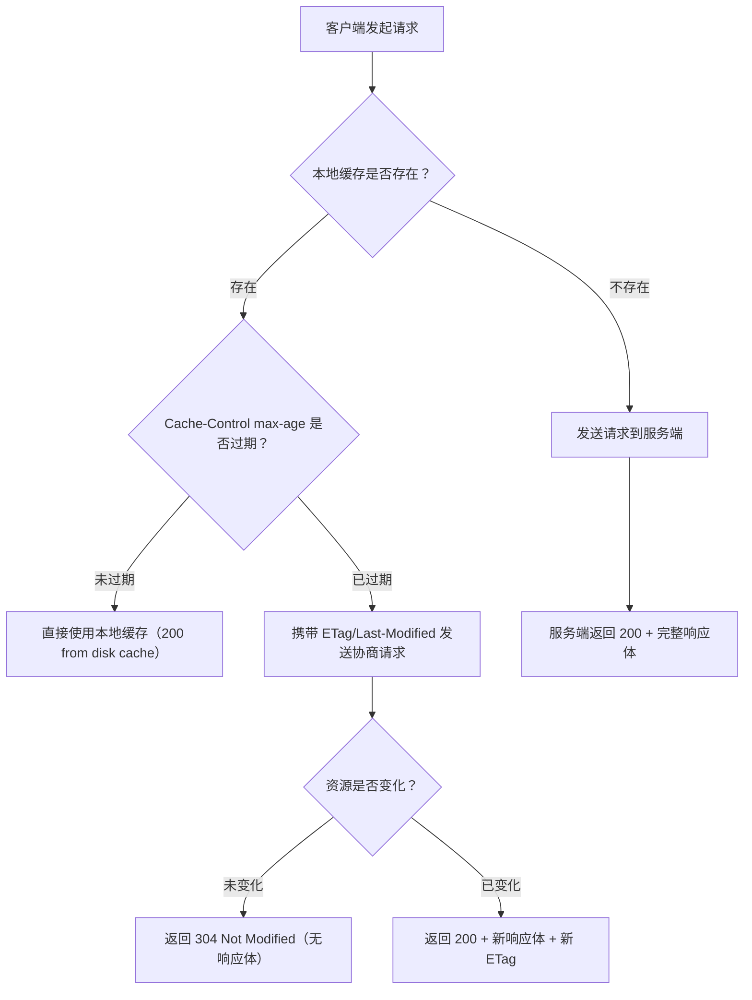
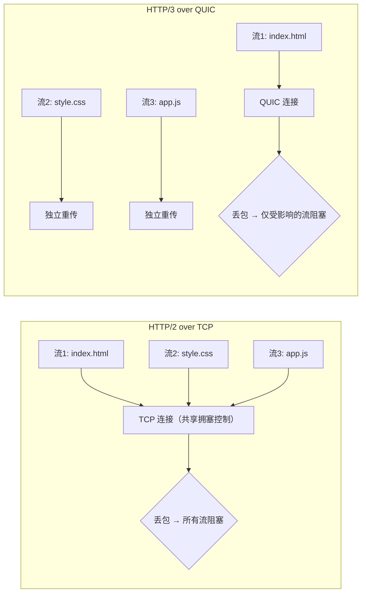

# 技巧1：HTTP协议演进的工程实践

HTTP 协议从 1991 年诞生至今经历了 HTTP/0.9、HTTP/1.0、HTTP/1.1、HTTP/2、HTTP/3 五个主要版本。每一次演进都不是学术性的"版本号升级"，而是工程实践中遇到具体瓶颈后的针对性突破。本技巧从工程视角出发，覆盖版本协商、帧解析、连接管理、安全演进等可直接落地的技术要点。

---

## 1. HTTP 各版本的核心差异与工程影响

在动手写代码之前，必须理解每个版本"解决了什么问题"以及"引入了什么新约束"。

### 1.1 HTTP/0.9 与 HTTP/1.0：短连接时代

HTTP/0.9（1991）极为简单——只有 GET 方法，响应体就是 HTML 本身，没有请求头和响应头。Tim Berners-Lee 设计它的初衷只是在 CERN 内部共享文档，完全没想到它会成为互联网的基石协议。

HTTP/1.0（RFC 1945，1996）在此基础上引入了：

- **请求头/响应头**：支持 `Content-Type`、`Content-Length`、`Accept` 等元数据，使协议具备了表达能力
- **状态码**：引入 200、301、302、404 等标准状态码，让客户端能程序化地处理不同响应
- **短连接模型**：每次请求独立建立 TCP 连接，响应完成后立即关闭

短连接的工程代价极其明显。假设一个网页包含 50 个资源（CSS、JS、图片），浏览器需要发起 50 次 TCP 三次握手 + 50 次四次挥手。在 100ms RTT 的网络下，仅握手就浪费 100 × 50 = 5000ms = 5 秒。

```bash
# 用 curl 观察 HTTP/1.0 的短连接行为
curl -v --http1.0 https://example.com 2>&amp;1 | grep -E "Connected|Connection"
# 每次请求都会看到新的 "Connected to ..." 日志
```

**工程启示**：HTTP/1.0 的设计思路是"一个请求一个连接"，这在文档稀疏的早期互联网尚可接受，但随着网页复杂度爆炸式增长（AJAX、SPA、CDN），短连接成为了性能的致命瓶颈。

### 1.2 HTTP/1.1：持久连接与管道化

HTTP/1.1（RFC 2068，1997；后修订为 RFC 7230-7235）是至今仍广泛使用的版本，引入了四个关键改进：

**（1）持久连接（Keep-Alive）**

默认开启，一个 TCP 连接可以复用多次请求/响应，避免了重复握手的开销。这是 HTTP/1.1 最重要的改进——在实际生产环境中，持久连接将页面加载时间缩短了 30%-50%。

```python
import requests

session = requests.Session()
# 同一个 TCP 连接发送多个请求
for path in ['/index.html', '/style.css', '/app.js']:
    resp = session.get(f'https://example.com{path}')
    print(f'{path}: {resp.status_code}, conn_reused={resp.connection is not None}')
```

**（2）管道化（Pipelining）**

客户端可以在同一连接上连续发送多个请求，不必等待前一个响应返回。但管道化存在严重的**队头阻塞（Head-of-Line Blocking）**问题——如果第一个请求处理缓慢，后续所有请求都会被阻塞。更严重的是，服务端必须按请求顺序返回响应（FIFO），这在实践中经常导致性能反而下降。

工程实践结论：**管道化在现实部署中几乎不可用**。主流浏览器默认禁用，Nginx 默认也不开启。原因包括：

- 代理服务器/CDN 对管道化支持不一致
- 队头阻塞导致延迟不可控
- 错误恢复复杂（一个响应解析失败会影响后续所有响应）

**（3）分块传输编码（Chunked Transfer Encoding）**

当服务端无法预先知道响应体大小时（比如动态生成内容、流式传输），可以使用分块编码逐步发送数据：

HTTP/1.1 200 OK
Content-Type: text/plain
Transfer-Encoding: chunked

25
This is the first chunk of data
1e
And this is the second chunk
0


每个分块由"十六进制长度 + CRLF + 数据 + CRLF"组成，以长度为 0 的分块结束。这在流式 AI 响应（如 ChatGPT 的 SSE 流）、大文件下载等场景中至今仍是核心技术。

**（4）缓存机制的完善**

HTTP/1.1 引入了系统化的缓存控制体系，理解其决策流程对性能优化至关重要：

| 缓存策略 | 头部字段 | 工作机制 | 适用场景 |
|---------|---------|---------|---------|
| 强缓存 | `Cache-Control: max-age=3600` | 在有效期内直接使用本地缓存，不发送请求 | 静态资源（JS/CSS/图片） |
| 强缓存（旧） | `Expires: Thu, 01 Jan 2026 00:00:00 GMT` | 指定绝对过期时间（已被 Cache-Control 取代） | 兼容旧客户端 |
| 协商缓存 | `If-None-Match: "abc123"` + `ETag: "abc123"` | 客户端发送上次的 ETag，服务端比较后决定返回 200 还是 304 | 动态内容、频繁变化的资源 |
| 协商缓存 | `If-Modified-Since: Wed, 01 Jan 2025 00:00:00 GMT` | 基于修改时间比较 | 精度要求不高的场景 |



```bash
# 观察缓存行为
curl -v -H "Cache-Control: max-age=300" https://example.com/api/data
# 第一次：200 OK，返回完整响应体
# 5分钟内再请求：200 OK (from disk cache)，不发网络请求
# 5分钟后：如果 ETag 未变 → 304 Not Modified
```

**（5）Host 头必选**

HTTP/1.0 中 `Host` 头是可选的，HTTP/1.1 将其变为必选。这使得一个 IP 地址可以托管多个虚拟主机——这是现代 CDN 和云服务的基础能力。没有 Host 头，一台服务器无法区分 `www.example.com` 和 `api.example.com` 的请求。

### 1.3 HTTP/1.1 到 HTTP/2 的过渡：Upgrade 机制

在 HTTP/2 普及之前，浏览器和服务端通过 HTTP/1.1 的 `Upgrade` 头协商升级到新协议（如 WebSocket）。虽然 HTTP/2 最终选择了 TLS 层的 ALPN 协商（见第 2 节），但理解 Upgrade 机制对理解协议演进逻辑很重要：

# HTTP/1.1 Upgrade 机制（以 WebSocket 为例）
GET /chat HTTP/1.1
Host: example.com
Upgrade: websocket
Connection: Upgrade
Sec-WebSocket-Key: dGhlIHNhbXBsZSBub25jZQ==
Sec-WebSocket-Version: 13

# 服务端同意升级
HTTP/1.1 101 Switching Protocols
Upgrade: websocket
Connection: Upgrade
Sec-WebSocket-Accept: s3pPLMBiTxaQ9kYGzzhZRbK+xOo=

# 此后双方切换到 WebSocket 协议，不再遵循 HTTP 格式

HTTP/2 最终没有使用 Upgrade 机制的原因：Upgrade 需要先建立 HTTP/1.1 连接再升级，浪费一次往返。ALPN 在 TLS 握手过程中直接协商，零额外开销。

### 1.4 HTTP/2：二进制分帧与多路复用

HTTP/2（RFC 7540，2015）基于 Google 的 SPDY 协议演化而来，是 HTTP 协议的一次根本性重构。核心变化：

**（1）二进制分帧层**

HTTP/1.x 是文本协议，解析依赖格式识别（`\r\n\r\n` 分隔头部）。HTTP/2 改为二进制协议，所有通信被拆分为**帧（Frame）**：

+-----------------------------------------------+
|                 Length (24)                    |
+---------------+---------------+---------------+
|   Type (8)    |   Flags (8)   |
+-+-------------+---------------+------...------+
|R|         Stream Identifier (31)              |
+-+-------------+-------------------------------+
|                 Frame Payload                 |
+-----------------------------------------------+

每个帧的头部固定 9 字节：

| 字段 | 长度 | 含义 |
|------|------|------|
| Length | 24 bit | 帧载荷长度（不含 9 字节头部） |
| Type | 8 bit | 帧类型（DATA=0x0, HEADERS=0x1, SETTINGS=0x4 等） |
| Flags | 8 bit | 帧特定的标志位 |
| R | 1 bit | 保留位，必须为 0 |
| Stream Identifier | 31 bit | 流标识符，用于多路复用 |

**（2）多路复用（Multiplexing）**

多个请求/响应可以在同一个 TCP 连接上并行传输，通过 Stream ID 区分。这是 HTTP/2 最重要的改进——从根本上解决了 HTTP/1.1 的队头阻塞问题（应用层）。

但注意：**TCP 层的队头阻塞依然存在**。如果一个 TCP 包丢失，同一个连接上的所有流都会被阻塞等待重传。这也是 HTTP/3 引入 QUIC 的核心动机。

**（3）HPACK 头部压缩**

HTTP/1.x 的头部以明文传输，每次请求都携带大量重复信息（User-Agent、Cookie、Accept 等）。HPACK 通过三重机制压缩头部：

- **静态表**：预定义 61 个常见头部键值对的索引（如 `:method: GET` 索引为 2）
- **动态表**：连接生命周期内逐步建立的键值对索引，首次出现的头部通过字面量编码并加入动态表
- **霍夫曼编码**：对头部值进行可变长度编码，高频字符用更短的编码

```python
# Python 手动解析 HPACK 静态表示例
# 完整静态表见 RFC 7541 Appendix A
HPACK_STATIC_TABLE = {
    2: (':method', 'GET'),
    3: (':method', 'POST'),
    4: (':path', '/'),
    5: (':path', '/index.html'),
    6: (':scheme', 'http'),
    7: (':scheme', 'https'),
    8: (':status', '200'),
    # ... 共 61 个条目
}

def decode_hpack_index(index):
    """解码 HPACK 索引表示的头部"""
    if index <= 61:
        return HPACK_STATIC_TABLE[index]
    # 动态表索引 = index - 62 + 动态表偏移
    # 需要维护连接级别的动态表状态
    raise NotImplementedError("Dynamic table decoding requires state")
```

HPACK 的实际压缩效果显著：Google 的数据显示，HTTP/2 的头部大小从 HTTP/1.x 的平均 800 字节降至约 50-100 字节，压缩率高达 85%-95%。

**（4）服务器推送（Server Push）**

服务端可以在客户端请求之前主动推送资源。例如，客户端请求 `index.html` 时，服务端同时推送 `style.css` 和 `app.js`。

```nginx
# Nginx HTTP/2 Server Push 配置
location = /index.html {
    http2_push /style.css;
    http2_push /app.js;
}
```

但 Server Push 在实践中问题很多：

- **缓存污染**：客户端可能已经缓存了 `style.css`，推送变成浪费带宽
- **优先级冲突**：推送的资源可能不是客户端当前最需要的
- **Chrome 已于 2022 年移除 Server Push 支持**，转向 103 Early Hints

现代替代方案是 **103 Early Hints**（RFC 8297）：服务端先返回 103 状态码 + `Link` 头，告诉浏览器可以提前加载哪些资源，然后浏览器自行决定是否发起请求（可缓存、可取消）。

```nginx
# Nginx 103 Early Hints 配置（需要 Nginx 1.21.5+）
location = /index.html {
    add_header Link "</style.css>; rel=preload; as=style" always;
    add_header Link "</app.js>; rel=preload; as=script" always;
    # Nginx 会在返回 200 之前先发送 103 Early Hints
}
```

### 1.5 HTTP/3 与 QUIC：彻底告别队头阻塞

HTTP/3（RFC 9114，2022）将传输层从 TCP 改为基于 UDP 的 QUIC（RFC 9000），实现了两个关键突破：

**（1）消除传输层队头阻塞**

QUIC 在用户态实现了可靠传输，每个流（Stream）独立维护重传状态。一个流的丢包不会影响其他流。



**（2）0-RTT 连接建立**

QUIC 将 TLS 握手与传输层握手合并。首次连接只需 1-RTT（比 TLS 1.2 + TCP 的 3-RTT 少 2 次往返），会话恢复时可实现 0-RTT：

首次连接 (1-RTT):
Client → Server: QUIC Initial + TLS ClientHello (合并)
Server → Client: QUIC Handshake + TLS ServerHello + Finished
Client → Server: QUIC Handshake + TLS Finished
→ 此时即可发送应用数据

会话恢复 (0-RTT):
Client → Server: QUIC Initial + 0-RTT 应用数据
→ 第一个包就携带应用数据

0-RTT 的安全性需注意：早期数据（Early Data）不享受前向保密（Forward Secrecy），存在重放攻击风险。因此 0-RTT 只适用于幂等请求（GET、HEAD），不应携带敏感操作（POST、DELETE）。

**（3）连接迁移**

TCP 连接由四元组（源IP、源端口、目的IP、目的端口）标识，Wi-Fi 切换到 4G 时 IP 变化会导致连接断开。QUIC 使用 Connection ID 标识连接，IP 变化时无缝迁移。这对移动应用（外卖、打车、即时通讯）的用户体验提升巨大——用户在地铁里从 Wi-Fi 切到 4G 时不再需要重新建立连接。

### 1.6 HTTP 状态码的演进全景

理解状态码的演进有助于在实际开发中正确使用它们：

| 版本 | 新增状态码 | 工程意义 |
|------|-----------|---------|
| HTTP/1.0 | 200, 301, 302, 404, 500 | 基础语义：成功、重定向、客户端错误、服务端错误 |
| HTTP/1.1 | 100, 101, 206, 303, 304, 307, 401, 403, 407, 408, 409, 410, 429 | 条件请求（304）、部分内容（206）、速率限制（429） |
| HTTP/2 | 无新增（复用 1.1 状态码） | 协议层变化不影响语义层 |
| HTTP/3 | 无新增（复用 1.1 状态码） | 同上 |
| 扩展 | 103 Early Hints, 421 Misdirected Request | 预加载优化、连接复用安全 |

几个特别值得注意的状态码：

- **429 Too Many Requests**：速率限制的标准响应，配合 `Retry-After` 头告诉客户端何时重试
- **206 Partial Content**：支持断点续传和大文件分片下载，配合 `Range` 头使用
- **304 Not Modified**：协商缓存的核心，服务端通过比对 ETag/Last-Modified 决定是否返回 304

---

## 2. ALPN 版本协商的工程实现

**ALPN（Application-Layer Protocol Negotiation，RFC 7301）** 是客户端和服务端协商 HTTP 版本的核心机制，运行在 TLS 握手过程中。

### 2.1 工作原理

ClientHello:
  ALPN protocol_list: ["h3", "h2", "http/1.1"]

ServerHello:
  ALPN protocol: "h2"   ← 服务端选择客户端列表中自己支持的最优协议

如果服务端不支持客户端列表中的任何协议，握手会失败（TLS alert: no_application_protocol）。

### 2.2 用 OpenSSL 检测服务端支持的协议

```bash
# 检测目标服务器支持的 ALPN 协议列表
openssl s_client -connect example.com:443 -alpn h3,h2,http/1.1 2>/dev/null | grep "ALPN"

# 输出示例：
# Negotiated ALPN: h2
# 表示服务端选择了 HTTP/2

# 检测 HTTP/3 (QUIC) 支持
curl --http3 -I https://example.com
# 如果支持 HTTP/3，响应头会包含 alt-svc: h3=":443"; ma=86400
```

### 2.3 服务端 ALPN 配置示例

**Nginx 配置：**

```nginx
server {
    listen 443 ssl http2;

    ssl_certificate /etc/ssl/cert.pem;
    ssl_certificate_key /etc/ssl/key.pem;

    # 仅支持 HTTP/2 和 HTTP/1.1
    ssl_alpn h2, http/1.1;

    # 如果要支持 HTTP/3，还需要额外配置
    # listen 443 quic reuseport;
    # add_header alt-svc 'h3=":443"; ma=86400';
}
```

**Go 服务端示例：**

```go
package main

import (
    "crypto/tls"
    "fmt"
    "net/http"
)

func main() {
    mux := http.NewServeMux()
    mux.HandleFunc("/", func(w http.ResponseWriter, r *http.Request) {
        // 通过 r.Proto 获取实际协商的 HTTP 版本
        fmt.Fprintf(w, "Protocol: %s\n", r.Proto)
        fmt.Fprintf(w, "ALPN: %s\n", r.TLS.NegotiatedProtocol)
    })

    server := &amp;http.Server{
        Addr:    ":443",
        Handler: mux,
        TLSConfig: &amp;tls.Config{
            // 指定支持的 ALPN 协议列表
            NextProtos: []string{"h2", "http/1.1"},
        },
    }

    server.ListenAndServeTLS("cert.pem", "key.pem")
}
```

### 2.4 ALPN 在微服务中的应用

在微服务架构中，ALPN 不仅用于协商 HTTP 版本，还可用于区分不同服务协议。例如 gRPC 服务端在 ALPN 中声明 `grpc-exp`，客户端通过 ALPN 确认目标服务支持 gRPC：

```go
// gRPC 服务端自动配置 ALPN
// google.golang.org/grpc 内部在 TLS 配置中设置 NextProtos: []string{"grpc-exp", "h2"}
```

---

## 3. HTTP/2 帧解析实战

理解帧解析不仅对开发自定义 HTTP/2 工具有价值，更是排查性能问题的基础能力。

### 3.1 帧类型速查

| Type 值 | 帧名称 | 用途 |
|---------|--------|------|
| 0x0 | DATA | 传输请求/响应体 |
| 0x1 | HEADERS | 传输 HTTP 头部、打开/关闭流 |
| 0x2 | PRIORITY | 流优先级（已废弃） |
| 0x3 | RST_STREAM | 终止流 |
| 0x4 | SETTINGS | 连接级配置参数 |
| 0x5 | PUSH_PROMISE | 服务器推送（已废弃） |
| 0x6 | PING | 连接级心跳 |
| 0x7 | GOAWAY | 优雅关闭连接 |
| 0x8 | WINDOW_UPDATE | 流控窗口更新 |
| 0x9 | CONTINUATION | HEADERS 帧的后续片段 |

### 3.2 Python 帧解析器实现

```python
import struct
from enum import IntEnum

class FrameType(IntEnum):
    DATA = 0x0
    HEADERS = 0x1
    PRIORITY = 0x2
    RST_STREAM = 0x3
    SETTINGS = 0x4
    PUSH_PROMISE = 0x5
    PING = 0x6
    GOAWAY = 0x7
    WINDOW_UPDATE = 0x8
    CONTINUATION = 0x9

class FrameFlags:
    END_STREAM = 0x01
    END_HEADERS = 0x04
    PADDED = 0x08
    PRIORITY = 0x20

class H2Frame:
    """HTTP/2 帧的解析与构造"""
    HEADER_SIZE = 9  # 固定头部 9 字节

    def __init__(self):
        self.length = 0
        self.type = 0
        self.flags = 0
        self.stream_id = 0
        self.payload = b''

    @classmethod
    def parse(cls, data: bytes) -> 'H2Frame':
        """从原始字节解析帧"""
        if len(data) < cls.HEADER_SIZE:
            raise ValueError(f"帧数据不足：需要 {cls.HEADER_SIZE} 字节，实际 {len(data)} 字节")

        # 解析 9 字节固定头部
        # struct.unpack('!I', ...) 解析 4 字节大端无符号整数
        # 前 3 字节是 Length（24 bit），接着 1 字节 Type，1 字节 Flags，1 字节 R + 3 字节 Stream ID
        header = struct.unpack('!I', data[:4])[0]
        length = (header >> 8) &amp; 0xFFFFFF  # 高 24 位
        type_byte = data[4]
        flags = data[5]
        # Stream ID 占 4 字节，最高位是保留位 R（必须忽略）
        stream_id = struct.unpack('!I', data[6:10])[0] &amp; 0x7FFFFFFF

        frame = cls()
        frame.length = length
        frame.type = type_byte
        frame.flags = flags
        frame.stream_id = stream_id
        frame.payload = data[cls.HEADER_SIZE:cls.HEADER_SIZE + length]

        if len(frame.payload) < length:
            raise ValueError(f"载荷不足：需要 {length} 字节，实际 {len(frame.payload)} 字节")

        return frame

    def to_bytes(self) -> bytes:
        """将帧序列化为原始字节"""
        # Length (24 bit) + Type (8 bit) + Flags (8 bit) + R (1 bit) + Stream ID (31 bit)
        header = struct.pack('!I',
            (self.length << 8) | (self.type &amp; 0xFF))  # Length + Type
        header += struct.pack('!B', self.flags)         # Flags
        header += struct.pack('!I', self.stream_id)     # Stream ID（R 位自动为 0）
        return header + self.payload

    def __repr__(self):
        type_name = FrameType(self.type).name if self.type in FrameType else f"UNKNOWN(0x{self.type:02x})"
        return (f"H2Frame(type={type_name}, length={self.length}, "
                f"stream_id={self.stream_id}, flags=0x{self.flags:02x})")


class H2ConnectionParser:
    """HTTP/2 连接级帧解析器，处理连接建立和 SETTINGS 交换"""

    def __init__(self):
        self.buffer = b''
        self.frames = []
        self.settings_received = False

    def feed(self, data: bytes) -> list:
        """输入原始数据，输出解析出的帧列表"""
        self.buffer += data
        parsed = []

        while len(self.buffer) >= H2Frame.HEADER_SIZE:
            # 先解析帧头部获取长度
            header = struct.unpack('!I', self.buffer[:4])[0]
            length = (header >> 8) &amp; 0xFFFFFF
            total = H2Frame.HEADER_SIZE + length

            if len(self.buffer) < total:
                break  # 数据不完整，等待更多数据

            frame = H2Frame.parse(self.buffer[:total])
            self.buffer = self.buffer[total:]
            parsed.append(frame)
            self.frames.append(frame)

            # 追踪 SETTINGS 帧
            if frame.type == FrameType.SETTINGS:
                self.settings_received = True

        return parsed


# === 使用示例 ===
if __name__ == '__main__':
    # 构造一个 SETTINGS 帧用于测试
    settings_frame = H2Frame()
    settings_frame.type = FrameType.SETTINGS
    settings_frame.flags = 0x00
    settings_frame.stream_id = 0  # SETTINGS 帧总是属于流 0
    # SETTINGS 载荷：每个设置项 6 字节（2 字节 ID + 4 字节值）
    settings_frame.payload = struct.pack('!HI', 1, 4096)  # HEADER_TABLE_SIZE = 4096
    settings_frame.payload += struct.pack('!HI', 3, 1000)  # MAX_CONCURRENT_STREAMS = 1000
    settings_frame.length = len(settings_frame.payload)

    raw = settings_frame.to_bytes()
    print(f"序列化后: {raw.hex()}")
    print(f"帧长度: {len(raw)} 字节 (9 字节头部 + {settings_frame.length} 字节载荷)")

    # 解析
    parser = H2ConnectionParser()
    parsed = parser.feed(raw)
    for f in parsed:
        print(f"解析结果: {f}")
```

### 3.3 用 Wireshark 抓包分析 HTTP/2 帧

```bash
# 1. 启动 Wireshark 并过滤 HTTP/2 流量
tshark -i eth0 -f "tcp port 443" -Y "http2" -T fields \
  -e frame.number \
  -e http2.header.name \
  -e http2.header.value \
  -e http2.frame.len

# 2. 仅捕获 SETTINGS 帧
tshark -i eth0 -Y "http2.headers.type == 4" -T fields \
  -e http2.setting.id \
  -e http2.setting.value

# 3. 查看流的多路复用情况
tshark -i eth0 -Y "http2" -T fields \
  -e http2.streamid \
  -e http2.headers.type \
  -e http2.frame.len \
  | sort -n -k1
```

---

## 4. 连接管理的工程最佳实践

### 4.1 HTTP/1.1 连接池参数调优

连接池是提升 HTTP 性能的基础设施。配置不当会导致连接耗尽（排队等待）或资源浪费（大量空闲连接）。

| 参数 | 含义 | Nginx 默认值 | 推荐值 | 说明 |
|------|------|-------------|--------|------|
| `keepalive` | 后端最大空闲连接数 | 75 | 64-256 | 过小导致频繁建连，过大浪费连接 |
| `keepalive_requests` | 单连接最大请求数 | 1000 | 1000-10000 | 过小导致连接频繁轮换 |
| `keepalive_timeout` | 空闲连接超时时间 | 75s | 30-120s | 过长占用后端连接，过短增加建连开销 |
| `upstream` 节点数 | 后端实例数量 | - | 与并发量匹配 | 连接池总量 = keepalive × 节点数 |

**Nginx 连接池配置：**

```nginx
upstream backend {
    server 10.0.0.1:8080;
    server 10.0.0.2:8080;
    server 10.0.0.3:8080;

    keepalive 128;              # 每个 worker 进程维护 128 个空闲连接
    keepalive_requests 5000;    # 单连接最大处理 5000 个请求
    keepalive_timeout 60s;      # 空闲 60 秒后关闭
}

server {
    location /api/ {
        proxy_pass http://backend;
        proxy_http_version 1.1;          # 必须使用 1.1 才能复用连接
        proxy_set_header Connection "";   # 清除 Connection: close 头
    }
}
```

### 4.2 HTTP/2 连接管理要点

HTTP/2 的连接管理与 HTTP/1.1 有本质区别：

```python
import httpx
import asyncio

async def h2_connection_demo():
    """HTTP/2 连接管理示例"""
    async with httpx.AsyncClient(http2=True) as client:
        # 单个 TCP 连接，多个并行流
        # httpx 内部维护连接池和流管理
        responses = await asyncio.gather(
            client.get('https://example.com/api/users'),
            client.get('https://example.com/api/orders'),
            client.get('https://example.com/api/products'),
        )
        # 三个请求在同一个 TCP 连接上并行完成
        # 通过不同的 stream_id 区分
        for r in responses:
            print(f'{r.http_version} stream={r.extensions.get("http_version")} '
                  f'status={r.status_code}')

asyncio.run(h2_connection_demo())
```

**HTTP/2 连接池的关键差异：**

- 一个连接可以承载成千上万个并发流（通过 SETTINGS 的 `MAX_CONCURRENT_STREAMS` 控制，通常为 100-256）
- 不再需要像 HTTP/1.1 那样维护大量连接来实现并发
- 但需要关注**流控窗口**：默认窗口大小 65535 字节，大文件传输需要通过 `WINDOW_UPDATE` 帧增大窗口

### 4.3 HTTP/3 连接迁移实战

```python
# QUIC 连接迁移的核心机制
# 1. 连接由 Connection ID 标识（而非四元组）
# 2. IP 变化时，客户端在新路径上发送包含旧 Connection ID 的包
# 3. 服务端通过 Connection ID 找到已有连接，继续通信

# 验证连接迁移（需要支持 HTTP/3 的客户端和网络环境）
# 步骤：
# 1. 在 Wi-Fi 下建立 HTTP/3 连接，记录 Connection ID
# 2. 切换到 4G（IP 变化）
# 3. 发送新请求，观察是否使用相同的 Connection ID
# 4. 用 tshark 抓包验证：
#    tshark -f "udp port 443" -Y "quic.connection.connection_id"
```

---

## 5. HTTP 安全演进：从明文到加密传输

HTTP 的安全演进与协议版本演进并行推进，是理解现代 Web 安全的关键脉络。

### 5.1 HTTPS 的三次迭代

| 版本 | 传输层 | 密码套件 | 握手 RTT | 安全性 |
|------|--------|---------|---------|--------|
| SSL 3.0 (1996) | TCP | RC4, DES | 2-RTT | 已淘汰（POODLE 攻击） |
| TLS 1.0 (1999) | TCP | AES-CBC, 3DES | 2-RTT | 已淘汰（BEAST 攻击） |
| TLS 1.1 (2006) | TCP | AES-CBC | 2-RTT | 已淘汰 |
| TLS 1.2 (2008) | TCP | AES-GCM, ChaCha20 | 2-RTT | 仍广泛使用 |
| TLS 1.3 (2018) | TCP/QUIC | AES-256-GCM, ChaCha20-Poly1305 | 1-RTT | 推荐使用 |

TLS 1.3 是当前最佳实践：
- 移除了不安全的密码套件（RSA 密钥交换、CBC 模式）
- 强制前向保密（ECDHE）
- 握手只需 1-RTT（比 TLS 1.2 少一次往返）
- 与 QUIC 结合实现 0-RTT

### 5.2 HSTS：防止协议降级攻击

**HSTS（HTTP Strict Transport Security，RFC 6797）** 告诉浏览器在一段时间内只通过 HTTPS 访问该域名，防止中间人将 HTTPS 降级为 HTTP：

Strict-Transport-Security: max-age=31536000; includeSubDomains; preload

- `max-age=31536000`：有效期 1 年
- `includeSubDomains`：子域名也强制 HTTPS
- `preload`：申请加入浏览器的 HSTS 预加载列表（首次访问就不走 HTTP）

**工程建议**：所有生产环境都应该配置 HSTS。先用短 `max-age`（如 300 秒）测试，确认无误后再改为长期值。

### 5.3 证书透明度（Certificate Transparency）

从 2018 年起，Chrome 要求所有新颁发的 TLS 证书必须记录到公开的 CT 日志中。这使得任何人都可以监控是否有为自己的域名签发了未授权的证书，是防御 CA 被入侵的重要机制。

```bash
# 检查域名的证书透明度日志
curl -s "https://crt.sh/?q=example.com&amp;output=json" | jq '.[] | {name_value, issuer_name}'
```

---

## 6. 从 HTTP/1.1 迁移到 HTTP/2 的工程检查清单

从 HTTP/1.1 升级到 HTTP/2 不是简单地改个配置。以下检查清单覆盖了迁移中常见的陷阱：

### 6.1 前端资源优化调整

| 检查项 | 说明 | 风险等级 |
|--------|------|---------|
| 域名分片（域名散列） | HTTP/1.1 下用多个域名绕过 6 连接限制，HTTP/2 下反而增加连接开销 | 高 |
| 资源合并（雪碧图/合并JS） | HTTP/2 下多路复用消除了合并的必要性，合并反而破坏缓存粒度 | 中 |
| 内联资源 | HTTP/2 Server Push 取代了内联，但 Push 已被废弃，应改为 103 Early Hints | 低 |
| 域名收敛 | 尽量将资源集中到 1-2 个域名下 | 高 |

### 6.2 后端服务适配

```nginx
# 常见的 HTTP/2 配置错误

# 错误：使用 HTTP/1.1 的 proxy_set_header Connection ""
# HTTP/2 下 Connection 头是非法的
server {
    location /api/ {
        proxy_pass http://backend;
        proxy_http_version 1.1;          # ← 这个只影响与后端的连接
        proxy_set_header Connection "";   # ← 这个仍然需要（与后端通信用 1.1）
        # 客户端 ←→ Nginx: HTTP/2
        # Nginx ←→ 后端: HTTP/1.1
    }
}

# 正确：如果后端也支持 HTTP/2
upstream grpc_backend {
    server 10.0.0.1:50051;
    keepalive 64;
}

server {
    listen 443 ssl http2;
    location /grpc/ {
        grpc_pass grpc://grpc_backend;
        grpc_set_header X-Real-IP $remote_addr;
    }
}
```

### 6.3 性能基准测试

```bash
# 用 h2load 对比 HTTP/1.1 和 HTTP/2 的性能
# HTTP/1.1 基准
h2load -n 10000 -c 100 --h1 https://example.com/

# HTTP/2 基准
h2load -n 10000 -c 100 https://example.com/

# HTTP/3 基准（需要支持 QUIC 的 h2load 版本）
h2load -n 10000 -c 100 --h3 https://example.com/

# 结果对比示例（100 并发，10000 请求）：
# HTTP/1.1:  RPS=1200, 平均延迟=83ms, p99=250ms
# HTTP/2:    RPS=4500, 平均延迟=22ms,  p99=65ms   ← 多路复用效果
# HTTP/3:    RPS=5200, 平均延迟=19ms,  p99=45ms   ← 无队头阻塞效果
```

---

## 7. 实战：用 tshark 分析真实 HTTP 流量

### 7.1 抓取并分析 HTTP/2 握手

```bash
# 1. 捕获 TLS 握手过程（含 ALPN 协商）
tshark -i eth0 -Y "tls.handshake.type == 1 || tls.handshake.type == 2" \
  -T fields \
  -e frame.number \
  -e tls.handshake.type \
  -e tls.handshake.extensions_alpn_list \
  -e tls.handshake.cipher_suites

# 典型输出：
# 42  1  h2,http/1.1  TLS_AES_256_GCM_SHA384,...  ← ClientHello，ALPN 列表
# 45  2  h2             TLS_AES_256_GCM_SHA384      ← ServerHello，选择了 h2
```

### 7.2 分析 HPACK 头部压缩效果

```bash
# 捕获 HTTP/2 HEADERS 帧的头部信息
tshark -i eth0 -Y "http2.headers.type == 1" \
  -T fields \
  -e http2.headers.method \
  -e http2.headers.path \
  -e http2.headers.authority \
  -e frame.len

# 对比同一连接上第二个请求的头部大小：
# 第一个请求: frame.len=287 (完整头部)
# 第二个请求: frame.len=23  (HPACK 索引引用，仅需几个字节)
```

### 7.3 诊断队头阻塞问题

```bash
# 分析 TCP 重传对 HTTP/2 流的影响
tshark -i eth0 -Y "tcp.analysis.retransmission &amp;&amp; http2" \
  -T fields \
  -e frame.number \
  -e tcp.seq \
  -e http2.streamid \
  -e frame.time_relative

# 如果看到所有 http2.streamid 在重传后都出现延迟增加
# → TCP 层队头阻塞的直接证据
# → 考虑升级到 HTTP/3 (QUIC) 以消除此问题
```

---

## 8. 常见误区与纠正

| 误区 | 真实情况 | 正确做法 |
|------|---------|---------|
| "HTTP/2 比 HTTP/1.1 快，升级后一定能提速" | 如果前端仍在用域名分片、资源合并等 HTTP/1.1 时代的优化策略，升级后性能可能反而下降 | 迁移时同步移除过时优化策略 |
| "HTTP/2 可以完全替代连接池" | HTTP/2 的多路复用减少了连接数需求，但服务端仍需要限制并发流数量（MAX_CONCURRENT_STREAMS） | 为每个目标域名配置适当的连接池大小 |
| "开了 Keep-Alive 就能复用连接" | Nginx 必须同时设置 `proxy_http_version 1.1` 和 `proxy_set_header Connection ""` | 三者缺一不可 |
| "HTTP/3 在所有场景都比 HTTP/2 快" | 在低丢包网络中，QUIC 的用户态实现反而比内核 TCP 慢 5%-10%；首次连接也多 1-RTT（相比 TLS 1.3 over TCP 的 2-RTT） | 高丢包移动网络用 HTTP/3，数据中心内网用 HTTP/2 |
| "ALPN 只用于 HTTP 版本协商" | ALPN 是通用机制，gRPC、WebSocket over TLS 等也使用 ALPN | 在设计多协议服务时，利用 ALPN 区分不同服务 |
| "HPACK 静态表覆盖了所有常见头部" | 静态表仅 61 个条目，自定义头部（如 `X-Request-ID`）需要字面量编码，首次请求开销较大 | 尽量使用标准头部名；高频自定义头部可以利用动态表缓存 |
| "HTTPS 一定比 HTTP 慢" | TLS 1.3 的额外延迟仅 1-RTT，而连接复用后几乎为零；HTTPS 还能启用 HSTS、CT 等安全机制 | 所有生产环境必须使用 HTTPS |
| "HTTP/2 多路复用完全消除了队头阻塞" | 仅消除了应用层队头阻塞，TCP 层队头阻塞仍然存在 | 丢包严重的网络应升级到 HTTP/3 |

---

## 9. 进阶：QUIC 协议的内部机制

对于需要深入理解 HTTP/3 底层的工程师，以下是 QUIC 协议的关键设计细节：

### 9.1 QUIC 包格式

QUIC Long Header (首次连接):
+--------+--------+--------+--------+
| 1 (1B) |Version | DCID Len| DCID  |
+--------+--------+--------+--------+
| SCID Len| SCID  | Token Len| Token |
+--------+--------+--------+--------+
| Length  | Payload                      |
+----------------------------------------+

QUIC Short Header (后续包):
+--------+--------+--------+--------+
| 0xC3 (1B) | DCID (固定长度) | PN (1-4B) |
+--------+--------+--------+--------+

### 9.2 QUIC 流控机制

QUIC 的流控分为两级：

- **连接级流控**：所有流共享的总窗口，防止一个连接消耗过多资源
- **流级流控**：单个流的窗口，防止一个慢流阻塞其他流

```python
# QUIC 流控窗口更新的简化逻辑
# 参考 aioquic 库的实现
class StreamFlowControl:
    def __init__(self, initial_window=65535):
        self.recv_window = initial_window
        self.recv_max = initial_window
        self.consumed = 0

    def on_data_received(self, size: int):
        self.consumed += size
        # 当消耗量达到窗口的 50% 时，发送 WINDOW_UPDATE
        if self.consumed >= self.recv_max // 2:
            increment = self.recv_max // 2
            self.recv_max += increment
            self.consumed -= increment
            return increment  # 返回 WINDOW_UPDATE 的增量
        return 0
```

### 9.3 HTTP/3 部署实战（Nginx）

```nginx
# Nginx HTTP/3 部署配置（需要 Nginx 1.25.0+ 编译时启用 --with-http_v3_module）

server {
    # HTTP/2 (TLS over TCP)
    listen 443 ssl http2;

    # HTTP/3 (QUIC over UDP)
    listen 443 quic reuseport;

    ssl_certificate     /etc/ssl/cert.pem;
    ssl_certificate_key /etc/ssl/key.pem;

    # 启用 0-RTT（注意安全风险：仅适用于幂等请求）
    ssl_early_data on;

    # 告诉客户端支持 HTTP/3
    add_header alt-svc 'h3=":443"; ma=86400';

    # QUIC 传输参数
    quic_retry on;              # 启用 Retry 验证客户端地址（防反射攻击）
    quic_idle_timeout 300s;     # 空闲超时

    # HTTP/3 版本检测
    location / {
        if ($http3 = "") {
            # 客户端不支持 HTTP/3，使用 HTTP/2
        }
    }
}

# UDP 端口 443 必须在防火墙中开放
# ufw allow 443/udp
# 或 iptables -A INPUT -p udp --dport 443 -j ACCEPT
```

**部署 HTTP/3 的关键注意事项**：

- **CDN 支持**：Cloudflare、阿里云 CDN 等主流 CDN 已支持 HTTP/3；自建需确保 UDP 443 端口开放
- **负载均衡器**：部分 L4 负载均衡器（如 AWS NLB）支持 UDP 转发，但 L7 负载均衡器可能需要额外配置
- **回退机制**：通过 `alt-svc` 头实现渐进式升级，客户端首次连接用 HTTP/2，后续切换到 HTTP/3
- **监控指标**：关注 QUIC 连接迁移成功率、0-RTT 拒绝率、UDP 包丢失率

---

## 10. 本技巧核心要点回顾

```mermaid
graph TD
    A["HTTP 演进工程实践"] --> B["版本差异理解"]
    A --> C["版本协商 (ALPN)"]
    A --> D["帧解析 (HTTP/2)"]
    A --> E["连接管理"]
    A --> F["迁移检查清单"]
    A --> G["安全演进"]

    B --> B1["1.0: 短连接 → 50×握手浪费"]
    B --> B2["1.1: 持久连接 + 管道化(不可用) + Chunked"]
    B --> B3["2: 二进制分帧 + 多路复用 + HPACK"]
    B --> B4["3: QUIC → 消除TCP队头阻塞 + 0-RTT"]

    C --> C1["TLS ClientHello 中的 ALPN 列表"]
    C --> C2["openssl s_client 检测"]
    C --> C3["Nginx ssl_alpn 配置"]

    D --> D1["9字节帧头部: Length/Type/Flags/StreamID"]
    D --> D2["帧类型: DATA/HEADERS/SETTINGS/..."]
    D --> D3["Wireshark tshark 分析"]

    E --> E1["HTTP/1.1: keepalive + requests + timeout"]
    E --> E2["HTTP/2: MAX_CONCURRENT_STREAMS"]
    E --> E3["HTTP/3: Connection ID 迁移"]

    F --> F1["移除域名分片/资源合并"]
    F --> F2["h2load 基准对比"]
    F --> F3["tshark 抓包验证"]

    G --> G1["TLS 1.3: 1-RTT + 前向保密"]
    G --> G2["HSTS: 防协议降级"]
    G --> G3["CT: 证书透明度"]
```



**核心记忆点：**

1. HTTP/1.1 的管道化在实际部署中不可用，不要依赖它
2. HTTP/2 的多路复用消除了应用层队头阻塞，但 TCP 层队头阻塞仍在
3. HTTP/3 通过 QUIC 彻底解决队头阻塞，代价是用户态实现的额外 CPU 开销
4. ALPN 是版本协商的标准机制，用 `openssl s_client -alpn` 可以检测
5. HPACK 静态表只有 61 个条目，自定义头部首次传输的开销不可忽略
6. 连接池配置是 HTTP 性能优化的基础设施，三要素缺一不可（版本 + keepalive + Connection 头）
7. 从 HTTP/1.1 迁移到 HTTP/2 时，必须同步移除域名分片等过时优化策略
8. 所有生产环境必须使用 HTTPS，TLS 1.3 的性能开销已经可以忽略
9. HSTS + CT 是现代 Web 安全的基础配置，不是可选项
