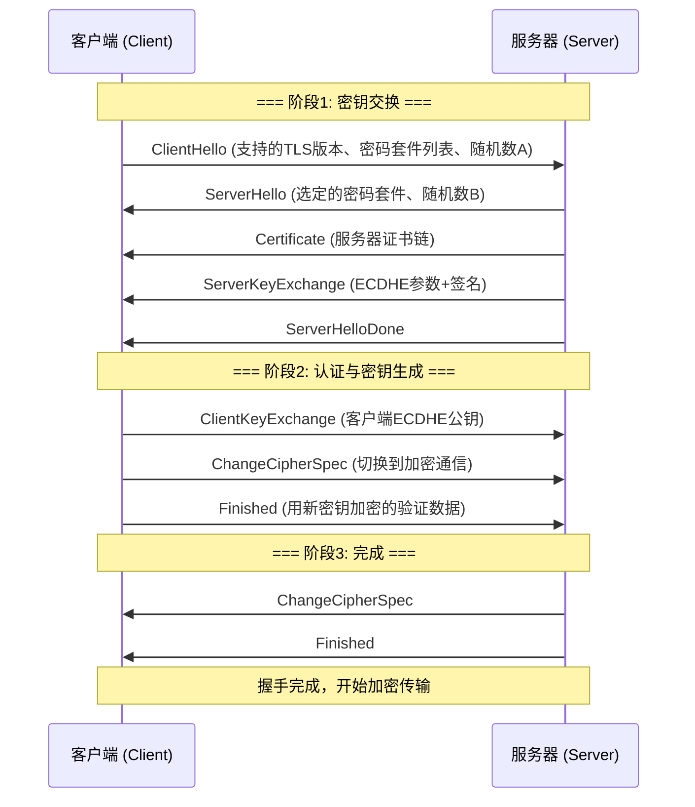
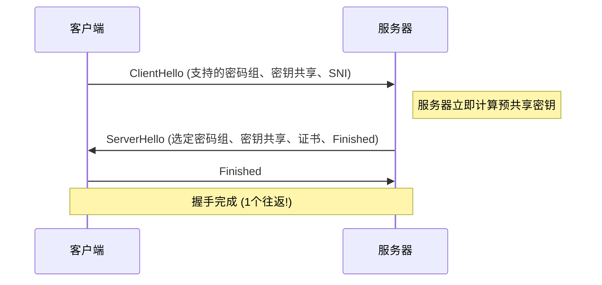
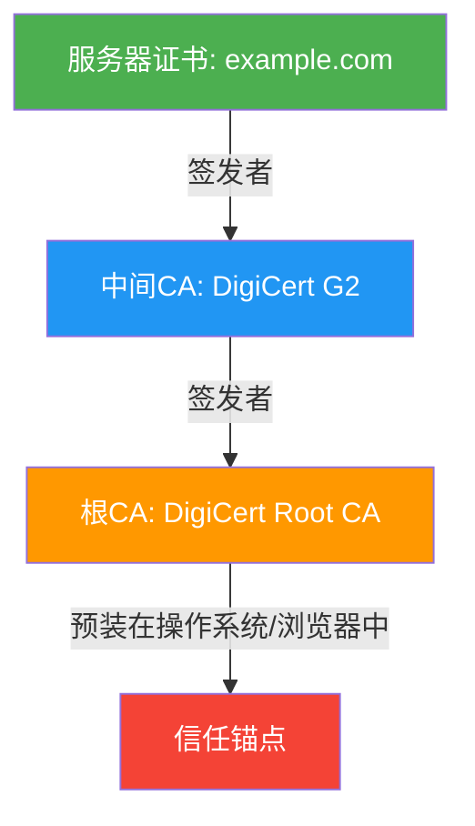
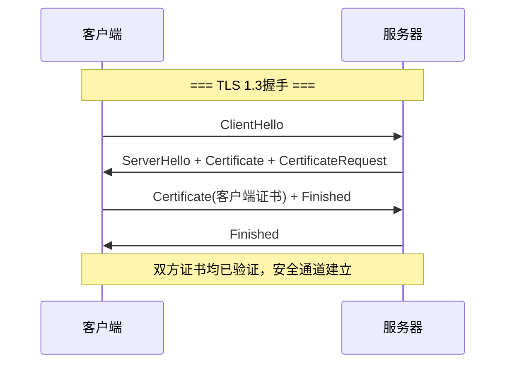
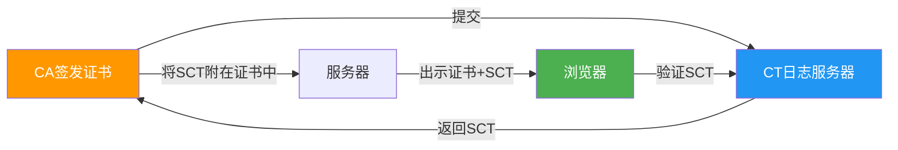

## 技巧2 HTTPS与TLS：从原理到实战的安全通信全解

HTTPS（HTTP Secure）是在HTTP基础上加入TLS/SSL加密层的安全协议。理解TLS的握手流程、证书体系和配置优化，是每一位后端工程师和运维工程师的必备技能。本节从密码学基础出发，层层递进到生产环境的实战配置，涵盖TLS 1.3、QUIC、Certificate Transparency、SNI隐私等前沿话题。

---

### 1. TLS在协议栈中的位置

TLS（Transport Layer Security）工作在传输层（TCP）与应用层（HTTP）之间，为上层协议提供加密、认证和完整性保护：

┌─────────────────────┐
│   HTTP / WebSocket   │   ← 应用层（明文）
├─────────────────────┤
│   TLS / SSL          │   ← 安全层（加密+认证+完整性）
├─────────────────────┤
│   TCP                │   ← 传输层（可靠传输）
├─────────────────────┤
│   IP                 │   ← 网络层（路由寻址）
└─────────────────────┘

TLS不仅保护HTTP，还可以保护SMTP、FTP、IMAP等任意基于TCP的应用协议。这种分层设计使得安全能力可以独立于业务协议进行升级和演进。

#### 1.1 TLS记录层协议

TLS所有数据都封装在"记录（Record）"中传输，理解记录层是理解TLS工作方式的基础：

TLS记录结构:
┌──────────┬──────────┬──────────┬──────────┐
│ Content  │ Protocol │  Length  │   Data   │
│   Type   │  Version │ (2字节)  │ (变长)    │
│ (1字节)  │ (2字节)  │          │          │
└──────────┴──────────┴──────────┴──────────┘

每个记录最大16,384字节（16KB）。Content Type标识记录类型：Handshake（握手）、ChangeCipherSpec（切换加密）、Alert（告警）、ApplicationData（应用数据）。TLS 1.3中，ChangeCipherSpec记录被废弃，所有记录在握手完成后都使用AEAD加密，包括之前的握手消息也会被加密重发（Encrypted Extensions）。

记录层的分片机制对性能有直接影响：HTTP/2的帧可能跨越多个TLS记录边界，而HTTP/3（基于QUIC）则将TLS记录与传输层帧对齐，减少了协议开销。

---

### 2. TLS核心密码学基础

要真正理解TLS的工作原理，必须掌握三个密码学原语。它们不是独立的技术，而是在TLS协议中协同工作的精密齿轮：非对称加密负责安全地交换密钥，对称加密负责高效地传输数据，哈希函数负责确保数据完整性。

#### 2.1 对称加密

双方共享同一把密钥，用它来加密和解密数据。优点是速度快（AES-256-GCM加密1GB数据仅需约1.2秒），缺点是密钥分发困难——两个人如何安全地交换同一把密钥？这正是非对称加密要解决的问题。

常用算法对比：

| 算法 | 密钥长度 | 分组大小 | 安全性 | 性能 | 适用场景 |
|------|----------|----------|--------|------|----------|
| AES-128-GCM | 128位 | 128位 | 高（可抗量子暴力破解至2030年代） | 极快（硬件加速） | 通用场景 |
| AES-256-GCM | 256位 | 128位 | 极高（可抗量子攻击至2050年代） | 快（硬件加速） | 高安全场景 |
| ChaCha20-Poly1305 | 256位 | 流密码 | 极高 | 快（无AES指令的CPU） | 移动设备/嵌入式 |
| 3DES | 168位 | 64位 | **已不安全** | 慢 | ❌ 禁止使用 |

**GCM模式的工作原理：** GCM（Galois/Counter Mode）同时提供加密和认证——一次操作完成加密+完整性校验，这叫AEAD（Authenticated Encryption with Associated Data）。相比旧的CBC+HMAC组合，GCM速度快约30%，且不存在CBC的填充预言攻击风险。

**ChaCha20 vs AES的选择逻辑：** 在有AES-NI硬件指令的CPU上（几乎所有x86和主流ARM），AES-256-GCM是最佳选择。但在没有AES指令的设备上（某些嵌入式ARM、旧手机），ChaCha20-Poly1305的纯软件实现比AES快3-5倍。Google在Android设备上默认使用ChaCha20，在桌面端使用AES，这就是Nginx中配置两组密码套件的原因。

TLS 1.3中只保留了AES-128-GCM、AES-256-GCM和ChaCha20-Poly1305三种对称加密算法，其余全部淘汰。

#### 2.2 非对称加密

使用一对密钥：公钥加密的数据只有私钥能解密，私钥签名的数据任何人都可以用公钥验证。解决了密钥分发问题，但速度比对称加密慢约1000倍（RSA-2048签名约1ms，而AES-GCM处理1KB数据约0.001ms）。

常用算法对比：

| 算法 | 安全性 | 密钥长度 | 速度 | 现状 |
|------|--------|----------|------|------|
| RSA | 高（需2048+位） | 2048-4096位 | 慢 | 仍广泛使用，但趋势是淘汰 |
| ECDSA (P-256) | 高 | 256位 | 快 | 主流选择 |
| Ed25519 | 极高 | 256位 | 极快 | 新一代首选 |
| X25519 | 极高 | 256位 | 极快 | TLS 1.3密钥交换首选 |

**为什么RSA正在被淘汰？** RSA的安全性基于大整数分解的困难性，2048位RSA约等价于112位对称密钥安全强度。而ECDSA P-256和Ed25519以256位密钥提供了128位对称安全强度——更短的密钥、更强的安全性、更快的速度。RSA的主要问题在于密钥交换时不提供前向保密（Forward Secrecy），即使配合ECDHE使用，RSA签名本身的计算开销也显著大于ECDSA/Ed25519。

**椭圆曲线选择指南：** NIST P-256是目前兼容性最广的选择，几乎所有TLS库和硬件安全模块都支持。Ed25519/X25519是性能和安全性的最优解，TLS 1.3默认优先使用，但部分老旧设备和HSM可能不支持。在兼容性和性能之间需要权衡：如果服务对象包含老旧设备（如企业内网），P-256更稳妥；如果面向现代互联网用户，优先X25519。

#### 2.3 哈希函数

将任意长度数据映射为固定长度的"指纹"，用于数据完整性校验。TLS中使用HMAC（Hash-based Message Authentication Code）确保消息未被篡改。哈希函数的核心特性是**单向性**——从输入可以轻松计算出哈希值，但从哈希值反推输入在计算上不可行（暴力破解SHA-256需要约2^128次操作，即使使用全球所有算力也需要数十亿年）。

| 算法 | 输出长度 | 安全性 | TLS中的用途 |
|------|----------|--------|-------------|
| SHA-256 | 256位 | 高 | 证书签名、HMAC、密钥推导 |
| SHA-384 | 384位 | 极高 | 高安全场景HMAC |
| SHA-512 | 512位 | 极高 | 密钥推导（TLS 1.3） |
| BLAKE3 | 256位 | 高 | 部分新兴协议 |
| MD5 | 128位 | **已破解**（碰撞攻击仅需2^18次） | ❌ 禁止使用 |
| SHA-1 | 160位 | **已破解**（SHAttered攻击2017年） | ❌ 禁止使用 |

**HMAC的工作原理：** HMAC不是简单的"密码+哈希"，而是 `H((K ⊕ opad) || H((K ⊕ ipad) || message))`，其中ipad和opad是固定填充模式。这种双重哈希结构防止了长度扩展攻击（Length Extension Attack），这是简单拼接方式无法防御的。

---

### 3. TLS握手流程详解

TLS握手是连接建立过程中最核心也最复杂的部分。以下分别讲解TLS 1.2和TLS 1.3的流程，以及它们在实际网络中的表现差异。

#### 3.1 TLS 1.2握手（2-RTT）



**ClientHello中的关键字段：**

| 字段 | 说明 | 作用 |
|------|------|------|
| TLS Version | 支持的最高TLS版本 | 与服务器协商版本 |
| Cipher Suites | 支持的加密套件列表 | 按优先级排列，服务器从中选择 |
| Random | 32字节随机数A | 参与主密钥计算，防止重放攻击 |
| SNI (Server Name Indication) | 目标域名 | 同一IP多站点时，让服务器返回正确证书 |
| Extensions | 扩展字段 | 支持ALPN、OCSP Stapling等高级特性 |
| ALPN | 应用层协议协商 | 告知服务器支持HTTP/1.1、HTTP/2 |

**主密钥生成过程：** 客户端和服务器各自生成ECDHE密钥对，交换公钥后各自计算出相同的预主密钥（Pre-Master Secret）。然后双方用 `PRF(Pre-Master Secret, "master secret", Client Random + Server Random)` 推导出主密钥（Master Secret），再由主密钥推导出实际的加密密钥、MAC密钥和IV。客户端随机数和服务器随机数都参与密钥推导，确保即使一方的随机数有偏也不影响安全性。

#### 3.2 TLS 1.3握手（1-RTT）

TLS 1.3是一次重大升级，将握手从2-RTT缩短到1-RTT，同时移除了所有不安全的密码学组件。



**TLS 1.3的关键改进：**

| 改进项 | TLS 1.2 | TLS 1.3 | 安全意义 |
|--------|---------|---------|----------|
| 握手往返 | 2-RTT | 1-RTT | 降低延迟50%，减少攻击窗口 |
| 零往返恢复 | 不支持 | 支持(0-RTT) | 回访站点可零延迟恢复 |
| 密钥交换 | RSA/ECDHE可选 | **仅ECDHE** | 前向保密成为强制要求 |
| 密码套件协商 | 客户端+服务器组合 | 仅协商整体套件 | 减少降级攻击面 |
| 移除的算法 | RC4, 3DES, DES, MD5等 | 全部移除 | 杜绝已知弱点 |
| 加密范围 | 握手部分明文 | **握手加密** | 保护证书等敏感握手数据 |
| PSK | 不常用 | 原生支持 | 简化会话恢复 |
| 压缩 | 支持（有CRIME攻击风险） | **完全移除** | 杜绝CRIME攻击 |
| 自定义DHE参数 | 支持（有Logjam攻击风险） | **禁止** | 杜绝弱参数攻击 |

**TLS 1.3为什么更安全的根本原因：** 不是简单地增加加密强度，而是大幅缩减了攻击面。TLS 1.2的密码套件是"组合式"的——密钥交换、认证、加密、MAC四个算法可以任意组合，导致数百万种可能的组合中有大量不安全的选项。TLS 1.3将密码套件简化为"整体式"的，每种组合都是经过严格审查的安全方案，从根本上杜绝了配置错误导致的降级攻击。

#### 3.3 0-RTT恢复（TLS 1.3特有）

当客户端之前连接过同一服务器，可以利用PSK（Pre-Shared Key）在第一个消息中就发送加密数据，实现零往返：

客户端: ClientHello + PSK Identity + 0-RTT数据(用上次的密钥加密)
服务器: ServerHello + 新密钥 + 0-RTT验证 + 正常响应

**0-RTT的陷阱：** 0-RTT数据不具有前向保密性，且可能受到重放攻击。因此0-RTT只能用于幂等请求（如GET），绝不能用于非幂等操作（如POST转账）。更精确地说，0-RTT数据的安全性等价于"在第一次连接时就暴露了这个数据"——如果攻击者记录了你第一次连接时发送的所有数据，那么即使后续会话密钥泄露也不会暴露历史数据（前向保密），但0-RTT数据不在这个保护范围内。

```nginx
# Nginx中限制0-RTT的使用
ssl_early_data on;

# 在应用层检查是否为0-RTT请求并限制操作类型
# HTTP头: Early-Data: 1 表示这是0-RTT请求
if ($http_early_data = "1") {
    # 对非幂等操作返回425 Too Early
    # 让客户端重做正常的1-RTT握手
}
```

**0-RTT的重放防护策略：** 应用层可以通过多种方式检测和防御重放：
1. **时间窗口**：仅接受最近N秒内的0-RTT数据
2. **单次令牌**：服务器下发一次性令牌，客户端在0-RTT中携带
3. **请求指纹**：对请求内容计算哈希并记录，拒绝重复的指纹
4. **幂等性检查**：业务层确保0-RTT请求即使重复执行也不会产生副作用

---

### 4. 数字证书与PKI体系

#### 4.1 证书的本质

数字证书就是一个由权威第三方（CA，Certificate Authority）签名的"数字身份证"，将域名与公钥绑定在一起：

证书内容:
├── 版本: X.509 v3
├── 序列号: 0x1234abcd...
├── 签名算法: SHA256withRSA / ECDSAwithSHA256
├── 颁发者: DigiCert Global G2 / Let's Encrypt R3
├── 有效期: 2025-01-01 至 2026-01-01
├── 持有者: example.com
├── 公钥: ECDSA P-256 公钥
├── 扩展信息:
│   ├── Subject Alternative Names: example.com, *.example.com
│   ├── Key Usage: Digital Signature
│   ├── Extended Key Usage: TLS Web Server Authentication
│   ├── CRL Distribution Points: http://crl.digicert.com/g2.crl
│   ├── Authority Info Access: http://ocsp.digicert.com
│   └── Certificate Transparency: SCT (Signed Certificate Timestamp)
└── CA数字签名: SHA256WithRSAEncryption

#### 4.2 证书链验证

浏览器验证证书时会沿着证书链向上追溯到根证书：



**为什么不直接用根CA签发服务器证书？**

| 原因 | 说明 |
|------|------|
| 安全隔离 | 根CA私钥一旦泄露影响全球，中间CA泄露只影响该中间CA签发的证书 |
| 吊销灵活性 | 可以单独吊销某个中间CA，不影响其他中间CA |
| 操作限制 | 根CA私钥通常离线保存在HSM中，不适合频繁签发 |
| 更新便利 | 中间CA可以定期轮换，无需操作系统更新根证书库 |

**证书验证的完整流程：** 浏览器收到服务器证书后，会执行以下检查：
1. 验证签名：用签发者（中间CA）的公钥验证证书签名是否有效
2. 检查有效期：当前时间是否在 notBefore 和 notAfter 之间
3. 检查吊销状态：通过OCSP或CRL确认证书未被吊销
4. 验证证书链：递归验证中间CA、根CA的签名，直到到达可信锚点
5. 检查域名：证书的SAN字段是否包含请求的域名
6. 检查密钥用途：证书的Key Usage是否包含TLS Server Authentication

#### 4.3 证书类型对比

| 类型 | 验证级别 | 签发时间 | 价格 | 适用场景 |
|------|----------|----------|------|----------|
| DV (Domain Validation) | 仅验证域名所有权 | 几分钟 | 免费 (Let's Encrypt) | 个人博客、API、内部服务 |
| OV (Organization Validation) | 验证组织信息 | 1-3天 | $50-200/年 | 企业官网、SaaS平台 |
| EV (Extended Validation) | 严格企业审核 | 1-2周 | $200-1000+/年 | 金融、电商、支付 |
| 通配符 (Wildcard) | DV级别，覆盖子域名 | 几分钟 | 免费-$300/年 | 多子域名（*.example.com） |
| 多域名 (SAN) | 一个证书多个域名 | 几分钟 | 免费-$300/年 | 多站点统一管理 |

**DV证书的普及：** Let's Encrypt自2015年推出以来，已成为全球最大的证书颁发机构。其ACME协议实现了完全自动化的证书签发和续期，极大降低了HTTPS的部署门槛。目前全球约30%的HTTPS证书由Let's Encrypt签发。Google、Mozilla和苹果等浏览器厂商已推动将DV作为HTTPS的基本要求，OV/EV证书在地址栏中不再有特殊视觉标识。

#### 4.4 DNS CAA记录：控制谁可以为你的域名签发证书

CAA（Certification Authority Authorization）是DNS中的特殊记录，用于声明哪些CA有权为你的域名签发证书：

```dns
; 仅允许Let's Encrypt签发证书
example.com.  IN  CAA  0 issue "letsencrypt.org"

; 仅允许DigiCert签发，且必须通过电子邮件通知
example.com.  IN  CAA  0 issue "digicert.com; accounturi=https://acme.digicert.com/acme/acme/1/account/12345; validation-method=dns-01"

; 禁止所有CA签发通配符证书
example.com.  IN  CAA  0 issuewild ";"

; 证书签发/吊销时发送告警邮箱
example.com.  IN  CAA  0 iodef "mailto:security@example.com"
```

**为什么CAA很重要？** 如果攻击者控制了你的域名DNS（比如通过子域名攻击或DNS劫持），他们可以向任何CA申请证书。CAA记录限制了攻击面——即使攻击者有DNS控制权，也无法让非授权CA签发证书。从2017年9月起，所有CA在签发证书前必须检查CAA记录。

---

### 5. 实战：Nginx配置HTTPS

#### 5.1 使用Let's Encrypt获取证书

```bash
# 安装Certbot（Let's Encrypt官方客户端）
sudo apt-get install -y certbot python3-certbot-nginx

# 自动获取证书并配置Nginx
sudo certbot --nginx -d example.com -d www.example.com

# 手动获取（不修改Nginx配置）
sudo certbot certonly --webroot -w /var/www/html -d example.com

# 使用standalone模式（临时启动HTTP服务器验证域名）
sudo certbot certonly --standalone -d example.com

# 使用DNS验证（适用于无法直接暴露HTTP端口的场景）
sudo certbot certonly --manual --preferred-challenges dns -d example.com
```

证书文件位置：
/etc/letsencrypt/live/example.com/
├── fullchain.pem    # 完整证书链（服务器证书 + 中间CA）
├── privkey.pem      # 私钥
├── cert.pem         # 服务器证书（不含中间CA）
└── chain.pem        # 中间CA证书

#### 5.2 自动续期配置

Let's Encrypt证书有效期90天，必须配置自动续期。推荐使用systemd timer（比cron更可靠，有日志和失败重试）：

```bash
# 检查Certbot的systemd timer是否已启用
systemctl list-timers | grep certbot

# 如果没有，手动启用
sudo systemctl enable --now certbot.timer

# 查看上次续期状态
sudo systemctl status certbot.timer
sudo journalctl -u certbot.service --since "7 days ago"

# 测试续期流程（不实际签发证书）
sudo certbot renew --dry-run

# 配置续期后自动重载Nginx
# /etc/letsencrypt/renewal-hooks/deploy/reload-nginx.sh
#!/bin/bash
systemctl reload nginx
```

**监控证书过期的实用脚本：**
```bash
#!/bin/bash
# check-cert.sh - 检查证书过期时间并告警
DOMAIN="example.com"
DAYS_THRESHOLD=30

EXPIRY=$(echo | openssl s_client -connect $DOMAIN:443 -servername $DOMAIN 2>/dev/null \
    | openssl x509 -noout -enddate | cut -d= -f2)
EXPIRY_EPOCH=$(date -d "$EXPIRY" +%s)
NOW_EPOCH=$(date +%s)
DAYS_LEFT=$(( (EXPIRY_EPOCH - NOW_EPOCH) / 86400 ))

if [ $DAYS_LEFT -lt $DAYS_THRESHOLD ]; then
    echo "WARNING: $DOMAIN certificate expires in $DAYS_LEFT days!"
    # 发送告警（邮件/Slack/钉钉等）
fi
```

#### 5.3 Nginx生产级HTTPS配置

```nginx
# /etc/nginx/conf.d/https.conf

server {
    listen 443 ssl http2;
    listen [::]:443 ssl http2;
    server_name example.com www.example.com;

    # ========== 证书配置 ==========
    ssl_certificate     /etc/letsencrypt/live/example.com/fullchain.pem;
    ssl_certificate_key /etc/letsencrypt/live/example.com/privkey.pem;

    # ========== TLS版本（仅允许TLS 1.2和1.3）==========
    ssl_protocols TLSv1.2 TLSv1.3;

    # ========== 密码套件（优先AEAD算法）==========
    # TLS 1.3密码套件由openssl自动管理，此处配置TLS 1.2的
    ssl_ciphers ECDHE-ECDSA-AES128-GCM-SHA256:ECDHE-RSA-AES128-GCM-SHA256:ECDHE-ECDSA-AES256-GCM-SHA384:ECDHE-RSA-AES256-GCM-SHA384:ECDHE-ECDSA-CHACHA20-POLY1305:ECDHE-RSA-CHACHA20-POLY1305;
    ssl_prefer_server_ciphers on;

    # ========== 会话复用（减少握手开销）==========
    ssl_session_timeout 1d;
    ssl_session_cache shared:SSL:50m;
    ssl_session_tickets off;  # 禁用ticket以保持前向保密

    # ========== OCSP Stapling（加速证书验证）==========
    ssl_stapling on;
    ssl_stapling_verify on;
    ssl_trusted_certificate /etc/letsencrypt/live/example.com/chain.pem;
    resolver 1.1.1.1 8.8.8.8 valid=300s;
    resolver_timeout 5s;

    # ========== 安全响应头 ==========
    add_header Strict-Transport-Security "max-age=63072000; includeSubDomains; preload" always;
    add_header X-Content-Type-Options "nosniff" always;
    add_header X-Frame-Options "DENY" always;
    add_header X-XSS-Protection "1; mode=block" always;
    add_header Referrer-Policy "strict-origin-when-cross-origin" always;

    # ========== HTTP/2优化 ==========
    http2_max_concurrent_streams 128;

    # ========== 业务配置 ==========
    root /var/www/example.com;
    index index.html;

    location / {
        try_files $uri $uri/ =404;
    }
}

# HTTP → HTTPS 重定向
server {
    listen 80;
    listen [::]:80;
    server_name example.com www.example.com;
    return 301 https://$host$request_uri;
}
```

#### 5.4 HSTS Preload机制

`Strict-Transport-Security`（HSTS）告知浏览器：在指定时间内，只通过HTTPS访问该站点，即使用户手动输入`http://`也会自动转为`https://`。

| 参数 | 值 | 说明 |
|------|-----|------|
| max-age | 63072000 | 2年，Google推荐的最小值 |
| includeSubDomains | - | 包含所有子域名 |
| preload | - | 允许提交到浏览器预加载列表 |

**HSTS Preload List：** 提交到 https://hstspreload.org 后，Chrome/Firefox/Safari等浏览器会在代码中硬编码你的域名，首次访问就强制HTTPS（无需等待HSTS响应头）。

**HSTS的危险性提醒：** 一旦启用HSTS且提交了preload，撤销极其困难——浏览器更新周期可能长达数月。在提交preload之前，务必确保：
1. 所有子域名都支持HTTPS
2. 证书续期自动化已验证可靠
3. 你的运维团队理解HSTS的影响

#### 5.5 SNI隐私：ESNI与ECH

传统TLS握手中，ClientHello中的SNI字段以明文传输，这意味着中间人可以看到你访问的是哪个网站（虽然看不到具体内容）。这在隐私敏感场景（如企业内网访问、DNS-over-HTTPS用户）中是一个显著的隐私泄露。

**ESNI（Encrypted Server Name Indication）** 和 **ECH（Encrypted Client Hello）** 是IETF提出的解决方案：

传统SNI（明文）:
ClientHello: {sni: "secret-site.com", cipher_suites: [...]}
→ 中间人可以看到 "secret-site.com"

ECH（加密）:
ClientHello_outer: {sni: "public-CDN.com", cipher_suites: [...]}  ← 公开的SNI
ClientHello_inner: {sni: "secret-site.com", ...}                  ← 加密的SNI
→ 中间人只能看到 "public-CDN.com"

ECH的工作原理：
1. DNS中发布ECHConfig（包含公钥），类似HTTPS记录
2. 客户端用ECHConfig中的公钥加密真实的SNI
3. 服务器用对应的私钥解密，获取真实域名
4. 外层SNI指向CDN或负载均衡器的公共域名

**ECH的现状（2025-2026）：** Cloudflare是ECH的主要推动者，已在生产环境部署。Firefox和Chrome均已支持ECH，但需要DNS中配置HTTPS记录携带ECHConfig。目前ECH仍处于标准制定阶段，尚未成为RFC，但在隐私保护方面已经可以使用。

---

### 6. 性能优化策略

#### 6.1 TLS对性能的影响

TLS引入的额外开销：

| 阶段 | 开销 | 优化手段 |
|------|------|----------|
| 握手 | 1-2个RTT + 加密计算 | TLS 1.3(1-RTT)、会话复用、0-RTT |
| 对称加解密 | 约5-10% CPU开销 | AES-NI硬件加速、ChaCha20 |
| 证书验证 | 首次连接约10-50ms | OCSP Stapling、证书链优化 |
| 密钥交换 | 非对称运算开销 | ECDHE(比RSA快)、X25519 |
| 记录层分片 | 约5-100字节/记录 | 启用HTTP/2减少小记录数量 |

#### 6.2 会话复用技术

**Session Cache（TLS 1.2）：** 服务器维护一个共享的会话缓存，客户端返回Session ID时直接恢复，跳过完整握手。

```nginx
ssl_session_cache shared:SSL:50m;  # 50MB缓存，约可存储20万个会话
ssl_session_timeout 1d;             # 会话有效期1天
```

**Session Tickets（TLS 1.2/1.3）：** 服务器将会话信息加密后发给客户端，下次客户端携带ticket回来即可恢复。无需服务器端存储，但ticket密钥泄露会威胁前向保密性，因此生产环境建议关闭。

```nginx
ssl_session_tickets off;  # 安全优先：关闭以确保前向保密
```

**PSK (Pre-Shared Key, TLS 1.3)：** TLS 1.3的原生会话恢复机制，比session tickets更安全，支持0-RTT恢复。

**会话复用的选择策略：** 在单机部署中，Session Cache足够使用；在多机负载均衡环境中，如果不想共享ticket密钥，可以只依赖PSK恢复（TLS 1.3）。对于需要极致性能的场景（如CDN边缘节点），可以开启session tickets并定期轮换ticket密钥（每隔几小时自动更换），在安全性和性能之间取得平衡。

#### 6.3 硬件加速

```bash
# 检查CPU是否支持AES-NI指令集
grep -o aes /proc/cpuinfo | head -1
# 输出 "aes" 表示支持

# OpenSSL性能测试（对比有无AES-NI）
openssl speed -evp aes-128-gcm
openssl speed -evp chacha20-poly1305
```

AES-NI使AES加密速度提升10-50倍，现代x86和ARM处理器普遍支持。对于不支持AES-NI的设备（如某些嵌入式ARM），ChaCha20-Poly1305是更好的选择——它不依赖专用硬件指令，纯软件实现也很快。

**实测数据参考（Intel Xeon E-2388G）：**

| 算法 | 单核吞吐量 | 延迟（1KB记录） |
|------|-----------|----------------|
| AES-128-GCM (AES-NI) | ~5 GB/s | ~0.2μs |
| AES-256-GCM (AES-NI) | ~4 GB/s | ~0.25μs |
| ChaCha20-Poly1305 | ~1.5 GB/s | ~0.7μs |
| RSA-2048 签名 | ~1500次/秒 | ~0.7ms |
| ECDSA P-256 签名 | ~30000次/秒 | ~0.03ms |
| Ed25519 签名 | ~50000次/秒 | ~0.02ms |

#### 6.4 HTTP/2与TLS的协同

HTTP/2依赖TLS的ALPN扩展协商协议版本，启用HTTP/2几乎等同于启用TLS 1.2+：

```nginx
# HTTP/2需要TLS 1.2+
listen 443 ssl http2;

# HTTP/2的关键优化
http2_max_concurrent_streams 128;  # 最大并发流数
http2_recv_buffer_size 256k;       # 接收缓冲区
http2_max_field_size 16k;          # 头部字段最大值
http2_max_header_size 32k;         # 头部总大小限制
```

HTTP/2的多路复用在TLS层面有一个潜在问题：**TLS记录层的队头阻塞**。HTTP/2在单个TCP连接上复用多个流，但如果一个TCP包丢失，整个TCP连接上的所有流都会被阻塞。这是HTTP/3（基于QUIC）要解决的核心问题之一。

---

### 7. 常见问题排查

#### 7.1 证书链不完整

**症状：** 桌面浏览器正常，但移动端或某些客户端报"证书不可信"。

**原因：** 服务器只发送了叶证书，没有发送中间CA证书。部分客户端会自动补全，但不是所有客户端都支持。

```bash
# 检查证书链是否完整
echo | openssl s_client -connect example.com:443 -servername example.com 2>/dev/null | openssl x509 -noout -issuer -subject
echo | openssl s_client -connect example.com:443 -servername example.com 2>&amp;1 | grep "Verify return code"
# 输出 "Verify return code: 0 (ok)" 表示链完整

# 检查证书链深度
echo | openssl s_client -connect example.com:443 -showcerts 2>/dev/null | grep -c "BEGIN CERTIFICATE"
# 应该返回 >= 2（叶证书 + 中间CA）
```

**修复方法：** Nginx中使用`fullchain.pem`（包含完整链），而非单独的`cert.pem`。

#### 7.2 证书过期

```bash
# 检查证书剩余有效期
echo | openssl s_client -connect example.com:443 -servername example.com 2>/dev/null | openssl x509 -noout -dates
# 输出: notBefore=... notAfter=Jun 26 12:00:00 2026 GMT

# 自动续期检查
sudo certbot renew --dry-run
```

生产环境中应设置证书过期监控，提前30天告警。Let's Encrypt证书有效期90天，Certbot默认每12小时尝试自动续期。

#### 7.3 TLS降级攻击

攻击者通过中间人篡改ClientHello中的TLS版本号，迫使客户端和服务器协商使用不安全的旧版本。

**防护措施：**

| 措施 | 说明 |
|------|------|
| 禁用旧版本 | `ssl_protocols TLSv1.2 TLSv1.3` |
| 禁用弱密码套件 | 不包含RC4、3DES、CBC模式的套件 |
| TLS_FALLBACK_SCSV | OpenSSL自动支持，防止人为降级 |
| Server-side enforcement | 服务器主动拒绝低于TLS 1.2的连接 |

#### 7.4 常见错误码速查

| 错误 | 含义 | 解决方案 |
|------|------|----------|
| `ERR_CERT_DATE_INVALID` | 证书过期 | 续期证书 |
| `ERR_CERT_AUTHORITY_INVALID` | 证书链不完整 | 使用fullchain.pem |
| `ERR_SSL_PROTOCOL_ERROR` | 协议不匹配 | 检查ssl_protocols配置 |
| `ssl_handshake_failure` | 密码套件不匹配 | 检查ssl_ciphers配置 |
| `certificate verify failed` | 证书域名不匹配 | 检查SAN字段包含目标域名 |
| `SSL_ERROR_RX_RECORD_TOO_LONG` | 监听端口未配置SSL | 检查是否在443端口启用了ssl |
| `ERR_SSL_VERSION_OR_CIPHER_MISMATCH` | TLS版本或密码套件不兼容 | 升级客户端或调整服务器配置 |

#### 7.5 实战排查：一个真实的调试案例

**问题场景：** 某电商网站从Nginx 1.18升级到1.24后，部分iOS用户反馈无法访问，报"无法建立安全连接"。

**排查过程：**

```bash
# 1. 用旧版iOS模拟器测试
curl --tlsv1.2 --tls-max 1.2 -v https://shop.example.com 2>&amp;1 | grep -E "SSL|TLS|cipher"
# 发现服务器返回了 TLS 1.3 only 的密码套件

# 2. 检查Nginx密码套件配置
nginx -T | grep ssl_ciphers
# 配置看起来没问题，但openssl版本从1.1.1升级到了3.x

# 3. 检查OpenSSL支持的密码套件
openssl ciphers -v | grep ECDHE
# openssl 3.x默认启用了一些TLS 1.3-only的套件

# 4. 根因：Nginx 1.24 + OpenSSL 3.x 默认启用了TLS 1.3
#    配置了 ssl_protocols TLSv1.2 TLSv1.3 但某些iOS旧版本
#    对TLS 1.3的实现有bug

# 5. 修复：明确指定TLS 1.2的密码套件，不依赖默认值
ssl_ciphers ECDHE-ECDSA-AES128-GCM-SHA256:ECDHE-RSA-AES128-GCM-SHA256:ECDHE-ECDSA-AES256-GCM-SHA384:ECDHE-RSA-AES256-GCM-SHA384;
```

**教训：** 升级TLS相关组件（OpenSSL、Nginx、操作系统）时，即使配置不变，默认行为也可能变化。升级后务必用 `openssl s_client` 和旧客户端进行回归测试。

---

### 8. 进阶：mTLS双向认证

标准HTTPS是单向认证（客户端验证服务器）。mTLS（mutual TLS）要求双方都出示证书，适用于高安全场景。



```nginx
# Nginx mTLS配置
server {
    listen 443 ssl;
    
    # 服务器证书
    ssl_certificate /etc/nginx/ssl/server.crt;
    ssl_certificate_key /etc/nginx/ssl/server.key;
    
    # 要求客户端证书
    ssl_client_certificate /etc/nginx/ssl/ca.crt;  # 签发客户端证书的CA
    ssl_verify_client on;                           # 强制验证
    ssl_verify_depth 2;                             # 证书链深度
    
    # 可选：CRL检查（吊销的证书）
    ssl_crl /etc/nginx/ssl/ca.crl;
    
    # 可选：将客户端证书信息传递给后端应用
    proxy_set_header X-Client-Cert-DN $ssl_client_s_dn;
    proxy_set_header X-Client-Cert-Serial $ssl_client_serial;
}
```

**mTLS典型应用场景：**

| 场景 | 说明 |
|------|------|
| 微服务间通信 | 服务网格(Istio/Linkerd)自动管理mTLS |
| API网关认证 | 替代API Key，安全性更高 |
| 金融机构 | 合规要求双向认证 |
| IoT设备认证 | 设备证书绑定身份，防止仿冒 |
| 零信任架构 | 设备级身份验证，替代传统VPN |

**mTLS的运维挑战：** 客户端证书的生命周期管理比服务器证书复杂得多——需要签发、分发、轮换、吊销，且数量可能成千上万。Istio等服务网格通过Sidecar代理自动处理这些操作，手动管理mTLS只适合小规模场景。

---

### 9. 进阶：Certificate Transparency（证书透明度）

Certificate Transparency（CT）是一套公开的日志系统，所有CA签发的证书都必须记录在公开的CT日志中。这使得域名所有者可以监控是否有未授权的证书被签发。

#### 9.1 CT的工作机制



**SCT（Signed Certificate Timestamp）：** CT日志服务器收到证书后，返回一个签名的时间戳证明"我已记录此证书"。浏览器要求证书至少包含2-3个SCT，才认为CT检查通过。

#### 9.2 利用CT监控未授权签发

```bash
# 使用certspotter监控（免费）
# 访问 https://certspotter.com 注册域名监控

# 使用crt.sh查询证书透明度日志
# 网页: https://crt.sh/?q=example.com
# API: https://crt.sh/?q=example.com&amp;output=json

# 命令行查询
curl -s "https://crt.sh/?q=example.com&amp;output=json" | jq '.[] | {name_value, issuer_name, not_before, not_after}'
```

**CT日志发现可疑证书的案例：** 某公司通过CT监控发现了一个由非合作CA签发的证书，追溯后发现是子公司IT部门自行申请的，未遵循统一证书管理策略。及时发现避免了潜在的安全合规风险。

---

### 10. 最佳实践清单

| 类别 | 最佳实践 | 优先级 |
|------|----------|--------|
| 协议版本 | 仅启用TLS 1.2和TLS 1.3，禁用SSL 2.0/3.0/TLS 1.0/1.1 | P0 |
| 密码套件 | 仅使用AEAD算法（GCM、ChaCha20），禁用CBC和RC4 | P0 |
| 证书 | 使用fullchain.pem，确保证书链完整 | P0 |
| 自动续期 | 配置Certbot自动续期 + systemd timer + 监控告警 | P0 |
| 前向保密 | 使用ECDHE/X25519，确保密钥泄露不影响历史通信 | P0 |
| HSTS | 启用HSTS，max-age >= 2年，谨慎提交preload | P1 |
| 会话复用 | 启用ssl_session_cache，禁用ssl_session_tickets | P1 |
| OCSP Stapling | 启用以加速客户端证书验证 | P1 |
| HTTP/2 | 启用HTTP/2提升性能 | P1 |
| 安全头 | 添加X-Content-Type-Options等安全响应头 | P2 |
| 0-RTT | 如启用，限制仅用于幂等请求 | P2 |
| CT监控 | 启用CT日志监控，及时发现未授权签发 | P2 |
| DNS CAA | 配置CAA记录限制证书签发CA | P2 |
| ECH | 关注ECH标准进展，在CDN支持后考虑启用 | P3 |

---

### 11. 实用工具

```bash
# 测试HTTPS配置安全性
# 在线工具: https://www.ssllabs.com/ssltest/
# 命令行工具:
sudo apt-get install -y testssl
testssl --full example.com

# 查看服务器支持的TLS版本和密码套件
nmap --script ssl-enum-ciphers -p 443 example.com

# 检查证书详细信息
openssl x509 -in certificate.pem -text -noout

# 测试TLS握手
openssl s_client -connect example.com:443 -tls1_3
openssl s_client -connect example.com:443 -tls1_2

# Wireshark抓包分析TLS流量
# 过滤器: tls.handshake.type == 1 (ClientHello)
# 设置SSLKEYLOGFILE环境变量导出密钥供Wireshark解密
export SSLKEYLOGFILE=~/sslkey.log
# 浏览器重启后，Wireshark导入该密钥即可解密TLS流量

# 查看当前连接的TLS信息
curl -vI https://example.com 2>&amp;1 | grep -E "SSL|TLS|subject|issuer"

# 批量检查多个域名的证书状态
for domain in example.com api.example.com; do
    expiry=$(echo | openssl s_client -connect $domain:443 -servername $domain 2>/dev/null \
        | openssl x509 -noout -enddate | cut -d= -f2)
    echo "$domain: expires $expiry"
done

# 解读密码套件名称（以ECDHE-RSA-AES256-GCM-SHA384为例）
# ECDHE  = 密钥交换算法（Ephemeral Elliptic Curve Diffie-Hellman）
# RSA    = 认证算法（RSA签名）
# AES256 = 对称加密算法（AES 256位）
# GCM    = 操作模式（Galois/Counter Mode，AEAD）
# SHA384 = HMAC使用的哈希函数
```

---

### 12. 总结

| 要点 | 核心内容 |
|------|----------|
| TLS的本质 | 在TCP之上为应用数据提供加密、认证和完整性保护 |
| 密码学三要素 | 对称加密(数据传输)、非对称加密(密钥交换)、哈希(完整性校验) |
| TLS 1.3优势 | 1-RTT握手、强制前向保密、移除所有已知弱算法 |
| 证书信任链 | 叶证书 → 中间CA → 根CA(预装在操作系统中) |
| 生产配置要点 | 仅TLS 1.2+1.3、AEAD密码套件、完整证书链、HSTS、OCSP Stapling |
| 性能优化 | 会话复用、AES-NI硬件加速、HTTP/2 |
| 安全监控 | 证书过期监控、SSL Labs评级、CT日志监控、DNS CAA |
| 前沿方向 | ECH(SNI隐私)、QUIC(HTTP/3)、零信任架构中的mTLS |

掌握HTTPS/TLS不仅是为了通过安全审查，更是构建用户信任的基础设施。一个配置良好的TLS栈，是应用安全的第一道防线。在当前的互联网环境中，HTTPS已经不是"可选项"而是"必选项"——Google搜索排名会惩罚未启用HTTPS的网站，浏览器会标记HTTP页面为"不安全"，行业合规（PCI DSS、等保2.0）要求加密传输。理解TLS的原理和最佳实践，是每位后端工程师的基本功。
