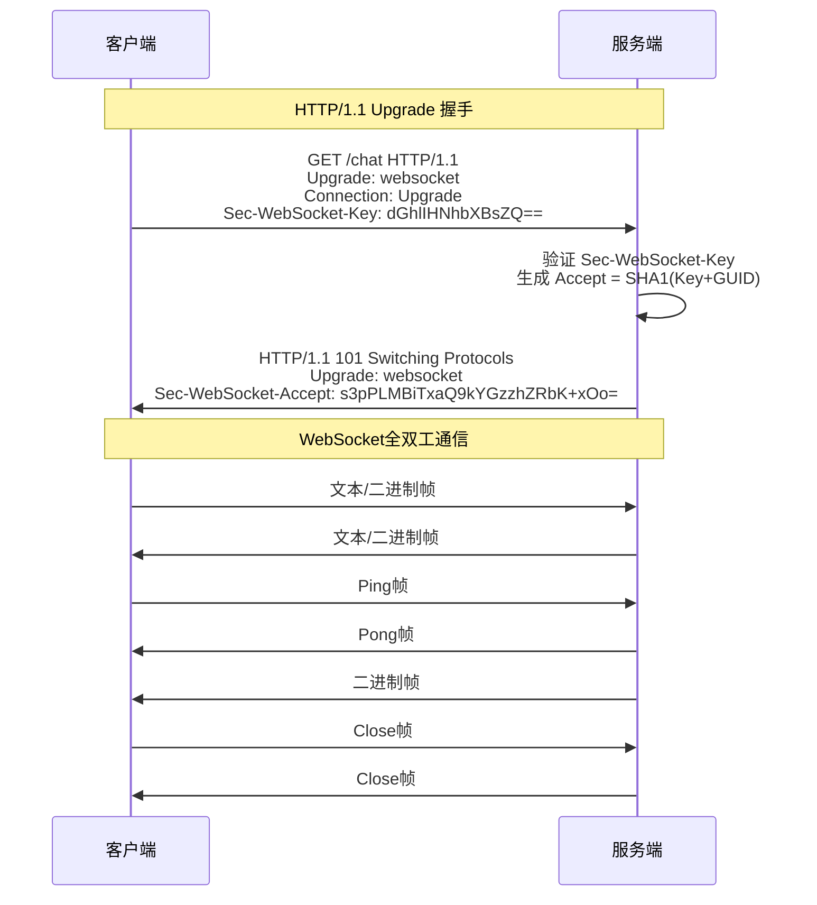
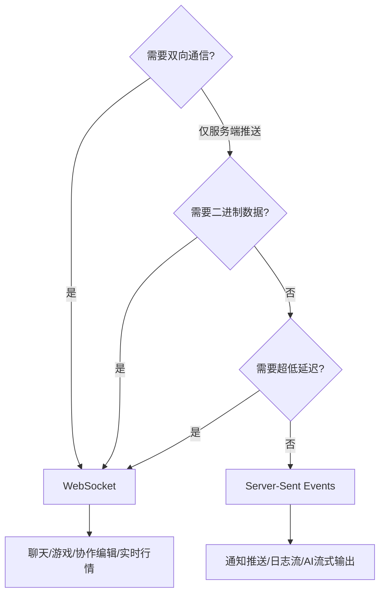

# 技巧3：WebSocket全双工通信的工程实践

HTTP 协议的请求-响应模型天然适合"客户端主动拉取"场景，但在实时聊天、在线游戏、协同编辑、股票行情推送等场景下，客户端需要持续接收服务端数据，HTTP的单向通信模式就显得力不从心。WebSocket（RFC 6455，2011年）为Web应用提供了真正的全双工通信能力——在单条TCP连接上实现客户端与服务端的双向、实时数据传输。本技巧从协议原理出发，覆盖握手过程、帧格式解析、心跳机制、认证鉴权、性能优化和大规模部署等可直接落地的工程要点。

---

## 1. WebSocket协议原理与握手过程

### 1.1 为什么需要WebSocket

在WebSocket出现之前，Web实时通信依赖以下三种方案，每种都有明显缺陷：

| 方案 | 机制 | 缺陷 |
|------|------|------|
| **短轮询** | 客户端定时发送HTTP请求 | 延迟高（轮询间隔的一半）、带宽浪费严重（大量空响应）、服务端压力大 |
| **长轮询** | 服务端hold住请求直到有数据才返回 | 连接占用时间长、服务端资源消耗大、不支持真正的双向通信 |
| **Server-Sent Events** | 服务端单向推送（text/event-stream） | 仅支持服务端到客户端的单向通信、基于HTTP文本协议效率较低 |

WebSocket的核心优势：

- **真正双向通信**：客户端和服务端都可以随时主动发送数据，无需轮询
- **低延迟**：建立连接后，数据帧头部仅2-14字节（对比HTTP动辄几百字节的头部）
- **低开销**：没有重复的HTTP头部传输，协议开销极小
- **协议层支持**：原生支持文本和二进制数据帧，适合各类数据格式



### 1.2 握手过程详解

WebSocket连接建立基于HTTP/1.1的Upgrade机制。客户端先发送一个普通的HTTP请求，请求将协议从HTTP升级为WebSocket：

**客户端请求（关键头部）：**

```http
GET /chat HTTP/1.1
Host: example.com
Upgrade: websocket
Connection: Upgrade
Sec-WebSocket-Key: dGhlIHNhbXBsZQ==
Sec-WebSocket-Version: 13
Origin: http://example.com
Cookie: session=abc123
```

关键头部字段说明：

- `Upgrade: websocket` — 请求协议升级
- `Connection: Upgrade` — 表示这是升级请求
- `Sec-WebSocket-Key` — Base64编码的16字节随机数，用于验证服务端确实是WebSocket服务器（防止普通HTTP服务器误响应）
- `Sec-WebSocket-Version: 13` — WebSocket协议版本号（13是RFC 6455定义的标准版本）
- `Origin` — 用于CORS验证，防止跨站WebSocket劫持

**服务端响应：**

```http
HTTP/1.1 101 Switching Protocols
Upgrade: websocket
Connection: Upgrade
Sec-WebSocket-Accept: s3pPLMBiTxaQ9kYGzzhZRbK+xOo=
Set-Cookie: ws_token=xyz789; Path=/; HttpOnly; Secure
```

服务端需要验证 `Sec-WebSocket-Key`，计算方式如下：

Sec-WebSocket-Accept = Base64(
    SHA1(
        Sec-WebSocket-Key + "258EAFA5-E914-47DA-95CA-C5AB0DC85B11"
    )
)

其中 `258EAFA5-E914-47DA-95CA-C5AB0DC85B11` 是固定的GUID，定义在RFC 6455中，用于防止非WebSocket服务器意外响应101状态码。

```python
# 手动验证 WebSocket Accept 值
import hashlib
import base64

def compute_accept(key: str) -> str:
    """计算 Sec-WebSocket-Accept 值"""
    GUID = "258EAFA5-E914-47DA-95CA-C5AB0DC85B11"
    combined = key + GUID
    sha1 = hashlib.sha1(combined.encode("utf-8")).digest()
    return base64.b64encode(sha1).decode("utf-8")

# 验证
key = "dGhlIHNhbXBsZQ=="
accept = compute_accept(key)
print(f"Accept: {accept}")
# 输出: s3pPLMBiTxaQ9kYGzzhZRbK+xOo=
assert accept == "s3pPLMBiTxaQ9kYGzzhZRbK+xOo="
```

### 1.3 握手过程的安全考量

握手阶段需要注意以下安全问题：

**（1）跨站WebSocket劫持（CSWSH）**

攻击者在自己的网页中建立到目标服务器的WebSocket连接，如果服务端仅依赖Cookie进行身份验证，就会建立一个已认证的WebSocket会话。防御措施：

- 验证 `Origin` 头部，拒绝来自非受信域名的握手请求
- 在握手完成后立即验证会话状态，不信任Cookie alone
- 使用CSRF Token机制：握手时携带额外的自定义头部或查询参数

**（2）WSS加密传输**

生产环境必须使用 `wss://`（WebSocket over TLS），避免数据在传输中被窃听或篡改：

```nginx
# Nginx WSS 反向代理配置
server {
    listen 443 ssl;
    server_name ws.example.com;

    ssl_certificate     /etc/ssl/certs/ws.example.com.pem;
    ssl_certificate_key /etc/ssl/private/ws.example.com.key;
    ssl_protocols       TLSv1.2 TLSv1.3;

    location /ws {
        proxy_pass http://127.0.0.1:8765;
        proxy_http_version 1.1;
        proxy_set_header Upgrade $http_upgrade;
        proxy_set_header Connection "upgrade";
        proxy_set_header Host $host;
        proxy_set_header X-Real-IP $remote_addr;
        proxy_set_header X-Forwarded-For $proxy_add_x_forwarded_for;
        proxy_set_header X-Forwarded-Proto $scheme;
        
        # 关键：关闭代理缓冲，实现实时转发
        proxy_buffering off;
        proxy_read_timeout 3600s;
        proxy_send_timeout 3600s;
    }
}
```

**（3）限制握手来源**

```python
# 握手验证逻辑
ALLOWED_ORIGINS = {"https://example.com", "https://app.example.com"}

async def verify_handshake(path, headers):
    """自定义握手验证"""
    origin = headers.get("Origin", "")
    if origin not in ALLOWED_ORIGINS:
        raise ConnectionRefusedError(f"拒绝来自 {origin} 的连接")
    
    # 额外的认证Token验证
    token = headers.get("Authorization", "")
    if not await verify_ws_token(token):
        raise ConnectionRefusedError("认证失败")
```

---

## 2. WebSocket帧格式深入解析

理解帧格式是处理WebSocket通信的基础。每条WebSocket消息都由一个或多个帧组成。

### 2.1 帧结构

 0                   1                   2                   3
 0 1 2 3 4 5 6 7 8 9 0 1 2 3 4 5 6 7 8 9 0 1 2 3 4 5 6 7 8 9 0 1
+-+-+-+-+-------+-+-------------+-------------------------------+
|F|R|R|R| opcode|M| Payload len |    Extended payload length    |
|I|S|S|S|  (4)  |A|     (7)     |             (16/64)           |
|N|V|V|V|       |S|             |   (if payload len==126/127)   |
| |1|2|3|       |K|             |                               |
+-+-+-+-+-------+-+-------------+ - - - - - - - - - - - - - - - +
|     Extended payload length continued, if payload len == 127  |
+ - - - - - - - - - - - - - - - +-------------------------------+
|                               |Masking-key, if MASK set to 1  |
+-------------------------------+-------------------------------+
| Masking-key (continued)       |          Payload Data         |
+-------------------------------- - - - - - - - - - - - - - - - +
:                     Payload Data continued ...                :
+ - - - - - - - - - - - - - - - - - - - - - - - - - - - - - - - +
|                     Payload Data (continued)                  |
+---------------------------------------------------------------+

### 2.2 各字段详解

**FIN位（1bit）**：标记当前帧是否为消息的最后一帧。WebSocket支持将一条消息拆分为多个帧传输（分片），FIN=0表示还有后续帧，FIN=1表示这是最后一帧。

**RSV1/RSV2/RSV3（各1bit）**：保留位。除非使用了扩展协议（如permessage-deflate压缩），否则必须为0。

**opcode（4bit）**：帧类型标识：

| opcode值 | 含义 | 说明 |
|----------|------|------|
| 0x0 | 续帧（Continuation） | 分片消息的后续帧 |
| 0x1 | 文本帧（Text） | UTF-8编码的文本数据 |
| 0x2 | 二进制帧（Binary） | 二进制数据 |
| 0x8 | 关闭帧（Close） | 关闭连接，可携带状态码和原因 |
| 0x9 | Ping帧 | 心跳探测 |
| 0xA | Pong帧 | 心跳响应 |

**MASK位（1bit）**：客户端发送的帧必须设为1（掩码），服务端发送的帧必须设为0。这是为了防止缓存投毒攻击——某些中间代理可能缓存WebSocket数据，如果数据不掩码，攻击者可以构造特定数据污染缓存。

**Payload Length（7bit + 扩展）**：实际数据长度的编码方式：

- 0-125：直接表示长度
- 126：后续2字节（16位）表示实际长度，最大65535字节
- 127：后续8字节（64位）表示实际长度，最大约1.8 EB

**Masking Key（4字节，仅客户端发送时存在）**：用于对payload进行异或掩码处理，防止缓存投毒。

### 2.3 帧解析代码

```python
import struct
import asyncio
from enum import IntEnum

class Opcode(IntEnum):
    CONTINUATION = 0x0
    TEXT = 0x1
    BINARY = 0x2
    CLOSE = 0x8
    PING = 0x9
    PONG = 0xA

class WebSocketFrame:
    """WebSocket帧解析与构建"""
    
    def __init__(self):
        self.fin = True
        self.opcode = Opcode.TEXT
        self.mask = False
        self.payload = b""
    
    @classmethod
    def parse(cls, data: bytes) -> tuple:
        """从字节流解析一个完整的帧
        
        返回: (frame, consumed_bytes)
        """
        if len(data) < 2:
            raise ValueError("数据不足以解析帧头")
        
        frame = cls()
        byte1 = data[0]
        byte2 = data[1]
        
        # 解析第一个字节
        frame.fin = bool(byte1 &amp; 0x80)
        rsv = byte1 &amp; 0x70
        if rsv != 0:
            raise ValueError(f"RSV位必须为0，收到: {rsv}")
        frame.opcode = byte1 &amp; 0x0F
        
        # 解析第二个字节
        frame.mask = bool(byte2 &amp; 0x80)
        payload_len = byte2 &amp; 0x7F
        
        offset = 2
        
        # 扩展长度
        if payload_len == 126:
            if len(data) < 4:
                raise ValueError("数据不足以解析扩展长度")
            payload_len = struct.unpack("!H", data[2:4])[0]
            offset = 4
        elif payload_len == 127:
            if len(data) < 10:
                raise ValueError("数据不足以解析64位扩展长度")
            payload_len = struct.unpack("!Q", data[2:10])[0]
            offset = 10
        
        # 掩码处理
        mask_key = None
        if frame.mask:
            if len(data) < offset + 4:
                raise ValueError("数据不足以解析掩码")
            mask_key = data[offset:offset + 4]
            offset += 4
        
        # 提取payload
        total_len = offset + payload_len
        if len(data) < total_len:
            raise ValueError(f"数据不完整: 需要{total_len}字节，仅有{len(data)}字节")
        
        payload = bytearray(data[offset:total_len])
        if mask_key:
            for i in range(len(payload)):
                payload[i] ^= mask_key[i % 4]
        
        frame.payload = bytes(payload)
        return frame, total_len
    
    def serialize(self) -> bytes:
        """将帧序列化为字节流"""
        header = bytearray()
        
        # 第一字节: FIN + opcode
        byte1 = (0x80 if self.fin else 0x00) | (self.opcode &amp; 0x0F)
        header.append(byte1)
        
        # 第二字节: MASK + payload length
        length = len(self.payload)
        mask_bit = 0x80 if self.mask else 0x00
        
        if length < 126:
            header.append(mask_bit | length)
        elif length < 65536:
            header.append(mask_bit | 126)
            header.extend(struct.pack("!H", length))
        else:
            header.append(mask_bit | 127)
            header.extend(struct.pack("!Q", length))
        
        payload = self.payload
        if self.mask:
            import os
            mask_key = os.urandom(4)
            header.extend(mask_key)
            payload = bytearray(payload)
            for i in range(len(payload)):
                payload[i] ^= mask_key[i % 4]
            payload = bytes(payload)
        
        return bytes(header) + payload
    
    def __repr__(self):
        preview = self.payload[:50]
        return (f"WebSocketFrame(fin={self.fin}, opcode={self.opcode.name}, "
                f"mask={self.mask}, len={len(self.payload)}, "
                f"payload={preview}{'...' if len(self.payload) > 50 else ''})")
```

### 2.4 分片机制

当消息过大时（例如传输一个100MB的文件），WebSocket支持将消息拆分为多个帧。第一帧的opcode指定消息类型，后续帧opcode为0x0（Continuation），最后一帧的FIN位设为1。

分片的工程价值：
- **避免内存溢出**：无需将整个消息加载到内存
- **支持流式传输**：边生成边发送，适合大文件和流式AI输出
- **中间帧可插入控制帧**：Ping/Pong/Close帧可以穿插在数据帧之间

---

## 3. 服务端实现：从原生Socket到生产框架

### 3.1 基于asyncio的原生WebSocket服务端

理解底层实现有助于排查生产问题：

```python
import asyncio
import hashlib
import base64
import struct

WEBSOCKET_GUID = "258EAFA5-E914-47DA-95CA-C5AB0DC85B11"

async def handle_ws_client(reader: asyncio.StreamReader,
                           writer: asyncio.StreamWriter):
    """处理WebSocket客户端连接"""
    # 1. 读取HTTP Upgrade请求
    request = b""
    while b"\r\n\r\n" not in request:
        chunk = await reader.read(4096)
        if not chunk:
            writer.close()
            return
        request += chunk
    
    headers = parse_http_headers(request)
    
    # 2. 验证WebSocket握手
    ws_key = headers.get("Sec-WebSocket-Key", "")
    if not ws_key:
        writer.close()
        return
    
    accept = base64.b64encode(
        hashlib.sha1((ws_key + WEBSOCKET_GUID).encode()).digest()
    ).decode()
    
    # 3. 发送101响应
    response = (
        "HTTP/1.1 101 Switching Protocols\r\n"
        "Upgrade: websocket\r\n"
        "Connection: Upgrade\r\n"
        f"Sec-WebSocket-Accept: {accept}\r\n"
        "\r\n"
    )
    writer.write(response.encode())
    await writer.drain()
    
    print(f"WebSocket连接已建立: {writer.get_extra_info('peername')}")
    
    # 4. 进入WebSocket消息循环
    try:
        while True:
            # 读取并解析帧
            data = await reader.read(65536)
            if not data:
                break
            
            frame, consumed = WebSocketFrame.parse(data)
            
            if frame.opcode == Opcode.TEXT:
                message = frame.payload.decode("utf-8")
                print(f"收到: {message}")
                # 回声：原样返回
                await send_ws_message(writer, f"Echo: {message}")
            
            elif frame.opcode == Opcode.BINARY:
                print(f"收到二进制数据: {len(frame.payload)} 字节")
                await send_ws_binary(writer, frame.payload)
            
            elif frame.opcode == Opcode.PING:
                await send_ws_control(writer, Opcode.PONG, frame.payload)
            
            elif frame.opcode == Opcode.CLOSE:
                await send_ws_control(writer, Opcode.CLOSE, b"")
                break
    except Exception as e:
        print(f"连接异常: {e}")
    finally:
        writer.close()
        await writer.wait_closed()
        print("连接已关闭")

async def send_ws_message(writer, message: str):
    """发送文本帧"""
    frame = WebSocketFrame()
    frame.fin = True
    frame.opcode = Opcode.TEXT
    frame.mask = False  # 服务端不掩码
    frame.payload = message.encode("utf-8")
    writer.write(frame.serialize())
    await writer.drain()

def parse_http_headers(raw: bytes) -> dict:
    """解析HTTP请求头部"""
    text = raw.decode("utf-8", errors="replace")
    lines = text.split("\r\n")
    headers = {}
    for line in lines[1:]:  # 跳过请求行
        if ":" in line:
            key, value = line.split(":", 1)
            headers[key.strip()] = value.strip()
    return headers

# 启动服务
async def main():
    server = await asyncio.start_server(
        handle_ws_client, "127.0.0.1", 8765
    )
    print("WebSocket服务已启动: ws://127.0.0.1:8765")
    async with server:
        await server.serve_forever()

asyncio.run(main())
```

### 3.2 使用WebSocket库（生产推荐）

原生实现适合学习和调试，生产环境推荐使用成熟的WebSocket库：

**Python（websockets库）：**

```python
import asyncio
import websockets
import json
from datetime import datetime

class ChatServer:
    """WebSocket聊天室服务端"""
    
    def __init__(self):
        self.clients: dict[str, websockets.WebSocketServerProtocol] = {}
        self.message_history: list[dict] = []
    
    async def register(self, ws, username: str):
        """注册新客户端"""
        self.clients[username] = ws
        await self.broadcast({
            "type": "system",
            "content": f"{username} 加入了聊天室",
            "online_count": len(self.clients),
            "timestamp": datetime.now().isoformat()
        })
    
    async def unregister(self, username: str):
        """注销客户端"""
        self.clients.pop(username, None)
        await self.broadcast({
            "type": "system",
            "content": f"{username} 离开了聊天室",
            "online_count": len(self.clients),
            "timestamp": datetime.now().isoformat()
        })
    
    async def broadcast(self, message: dict):
        """广播消息给所有客户端"""
        payload = json.dumps(message, ensure_ascii=False)
        disconnected = []
        for username, ws in self.clients.items():
            try:
                await ws.send(payload)
            except websockets.ConnectionClosed:
                disconnected.append(username)
        for username in disconnected:
            await self.unregister(username)
    
    async def handler(self, ws):
        """处理单个WebSocket连接"""
        username = None
        try:
            # 第一条消息为注册
            raw = await ws.recv()
            data = json.loads(raw)
            username = data.get("username", "anonymous")
            
            await self.register(ws, username)
            
            # 发送历史消息
            for msg in self.message_history[-50:]:
                await ws.send(json.dumps(msg, ensure_ascii=False))
            
            # 消息循环
            async for raw in ws:
                data = json.loads(raw)
                data["username"] = username
                data["timestamp"] = datetime.now().isoformat()
                data["type"] = "message"
                
                self.message_history.append(data)
                # 保留最近100条
                if len(self.message_history) > 100:
                    self.message_history = self.message_history[-100:]
                
                await self.broadcast(data)
        except websockets.ConnectionClosed:
            pass
        finally:
            if username:
                await self.unregister(username)
    
    async def start(self, host="0.0.0.0", port=8765):
        async with websockets.serve(
            self.handler, host, port,
            ping_interval=20,      # 每20秒发送Ping
            ping_timeout=10,       # 10秒内未收到Pong则断开
            max_size=10 * 1024 * 1024,  # 最大消息10MB
            compression=None,      # 按需开启deflate
        ) as server:
            print(f"聊天室已启动: ws://{host}:{port}")
            await asyncio.Future()  # 永远运行

if __name__ == "__main__":
    server = ChatServer()
    asyncio.run(server.start())
```

**Node.js（ws库）：**

```javascript
const WebSocket = require('ws');
const http = require('http');

const server = http.createServer();
const wss = new WebSocket.Server({ 
    server,
    path: '/ws',
    maxPayload: 10 * 1024 * 1024,  // 10MB
    perMessageDeflate: false,
});

// 连接管理
const clients = new Map();

wss.on('connection', (ws, req) => {
    const ip = req.headers['x-forwarded-for'] || req.socket.remoteAddress;
    console.log(`新连接: ${ip}`);
    
    ws.isAlive = true;
    ws.on('pong', () => { ws.isAlive = true; });
    
    ws.on('message', (data) => {
        try {
            const msg = JSON.parse(data.toString());
            // 广播给所有客户端
            wss.clients.forEach((client) => {
                if (client.readyState === WebSocket.OPEN) {
                    client.send(JSON.stringify(msg));
                }
            });
        } catch (e) {
            ws.send(JSON.stringify({ error: '消息格式错误' }));
        }
    });
    
    ws.on('close', () => {
        console.log(`连接关闭: ${ip}`);
    });
    
    ws.on('error', (err) => {
        console.error(`连接错误: ${err.message}`);
    });
});

// 心跳检测：每30秒清理死连接
const heartbeat = setInterval(() => {
    wss.clients.forEach((ws) => {
        if (!ws.isAlive) {
            console.log('清理无响应连接');
            return ws.terminate();
        }
        ws.isAlive = false;
        ws.ping();
    });
}, 30000);

wss.on('close', () => clearInterval(heartbeat));

server.listen(8765, () => {
    console.log('WebSocket服务运行在 ws://localhost:8765');
});
```

---

## 4. 客户端实现与连接管理

### 4.1 浏览器端JavaScript客户端

```javascript
class ReconnectingWebSocket {
    /**
     * 自动重连的WebSocket客户端
     */
    constructor(url, options = {}) {
        this.url = url;
        this.options = {
            reconnectInterval: 3000,   // 重连间隔(ms)
            maxReconnectAttempts: 10,  // 最大重连次数
            reconnectDecay: 1.5,       // 指数退避因子
            ...options
        };
        
        this.reconnectAttempts = 0;
        this.messageQueue = [];       // 断线期间的消息队列
        this.isManualClose = false;
        this.handlers = {
            open: [], message: [], close: [], error: [], reconnect: []
        };
        
        this.connect();
    }
    
    connect() {
        this.ws = new WebSocket(this.url);
        
        this.ws.onopen = (event) => {
            console.log(`WebSocket连接成功 (尝试${this.reconnectAttempts + 1}次)`);
            this.reconnectAttempts = 0;
            
            // 发送队列中的消息
            while (this.messageQueue.length > 0) {
                const msg = this.messageQueue.shift();
                this.ws.send(JSON.stringify(msg));
            }
            
            this._trigger('open', event);
        };
        
        this.ws.onmessage = (event) => {
            this._trigger('message', event);
        };
        
        this.ws.onclose = (event) => {
            this._trigger('close', event);
            
            if (!this.isManualClose &amp;&amp; this.reconnectAttempts < this.options.maxReconnectAttempts) {
                this._reconnect();
            }
        };
        
        this.ws.onerror = (event) => {
            this._trigger('error', event);
        };
    }
    
    _reconnect() {
        this.reconnectAttempts++;
        const delay = Math.min(
            this.options.reconnectInterval * Math.pow(this.options.reconnectDecay, this.reconnectAttempts - 1),
            30000  // 最大30秒
        );
        console.log(`将在 ${delay}ms 后重连 (第${this.reconnectAttempts}次)`);
        
        setTimeout(() => this.connect(), delay);
        this._trigger('reconnect', { attempt: this.reconnectAttempts, delay });
    }
    
    send(data) {
        if (this.ws.readyState === WebSocket.OPEN) {
            this.ws.send(typeof data === 'string' ? data : JSON.stringify(data));
        } else {
            // 连接未就绪，加入队列
            this.messageQueue.push(data);
        }
    }
    
    close() {
        this.isManualClose = true;
        this.ws.close();
    }
    
    on(event, handler) {
        if (this.handlers[event]) {
            this.handlers[event].push(handler);
        }
    }
    
    _trigger(event, data) {
        (this.handlers[event] || []).forEach(fn => fn(data));
    }
}

// 使用示例
const ws = new ReconnectingWebSocket('wss://example.com/ws');

ws.on('open', () => {
    console.log('已连接');
    ws.send({ type: 'subscribe', channel: 'price_updates' });
});

ws.on('message', (event) => {
    const data = JSON.parse(event.data);
    console.log('收到:', data);
});

ws.on('reconnect', ({ attempt, delay }) => {
    showReconnectStatus(`第${attempt}次重连，${delay}ms后...`);
});

ws.on('error', (event) => {
    console.error('连接错误');
});
```

### 4.2 Python客户端

```python
import asyncio
import websockets
import json

async def subscribe_price():
    """订阅实时价格推送"""
    uri = "wss://api.exchange.example.com/ws"
    
    async with websockets.connect(
        uri,
        ping_interval=30,
        ping_timeout=10,
        extra_headers={"Authorization": "Bearer <token>"},
    ) as ws:
        # 订阅
        await ws.send(json.dumps({
            "op": "subscribe",
            "channels": ["ticker:XBTUSD", "trade:XBTUSD"]
        }))
        
        # 持续接收
        async for message in ws:
            data = json.loads(message)
            if data.get("type") == "ticker":
                print(f"BTC价格: ${data['last']:,.2f}")
            elif data.get("type") == "trade":
                print(f"成交: {data['qty']} @ ${data['price']:,.2f}")

asyncio.run(subscribe_price())
```

---

## 5. 心跳机制与连接保活

### 5.1 为什么需要心跳

WebSocket连接建立后，TCP保活机制（Keep-Alive）默认间隔通常为2小时，远远不够。以下场景需要更积极的心跳检测：

- **NAT网关/防火墙超时**：很多NAT设备在空闲60-300秒后会清理UDP/TCP映射表
- **反向代理超时**：Nginx的 `proxy_read_timeout` 默认60秒
- **死连接检测**：客户端断网但未触发TCP FIN/RST（如移动网络切换）
- **负载均衡器健康检查**：LB需要知道后端连接是否存活

### 5.2 Ping/Pong机制

WebSocket协议内置了Ping/Pong控制帧：

```python
# 服务端心跳实现（以websockets库为例）
import asyncio
import websockets
from collections import defaultdict
from time import time

class HeartbeatManager:
    """WebSocket心跳管理器"""
    
    def __init__(self, ping_interval=20, ping_timeout=10):
        self.ping_interval = ping_interval  # Ping发送间隔(秒)
        self.ping_timeout = ping_timeout    # Pong超时(秒)
        self.last_pong: dict = {}           # 最后Pong时间
    
    async def start_heartbeat(self, ws):
        """启动心跳检测协程"""
        try:
            while True:
                await asyncio.sleep(self.ping_interval)
                if ws.closed:
                    break
                
                ping_time = time()
                try:
                    pong = await ws.ping()
                    await asyncio.wait_for(pong, timeout=self.ping_timeout)
                    self.last_pong[id(ws)] = time()
                    latency = time() - ping_time
                    print(f"延迟: {latency*1000:.1f}ms")
                except asyncio.TimeoutError:
                    print("心跳超时，关闭连接")
                    await ws.close(1001, "心跳超时")
                    break
        except websockets.ConnectionClosed:
            pass

# 使用
async def handler(ws):
    hb = HeartbeatManager()
    heartbeat_task = asyncio.create_task(hb.start_heartbeat(ws))
    
    try:
        async for message in ws:
            # 处理业务消息...
            pass
    finally:
        heartbeat_task.cancel()
```

### 5.3 心跳策略选择

| 策略 | 间隔建议 | 适用场景 | 优劣 |
|------|----------|----------|------|
| **协议Ping/Pong** | 20-30秒 | 大多数Web应用 | 原生支持、浏览器自动处理、无需业务层代码 |
| **应用层心跳** | 15-60秒 | 需要精确延迟测量、移动端 | 可携带业务数据、可统计延迟 |
| **自适应心跳** | 动态调整 | 移动网络、弱网环境 | 流量友好、但实现复杂 |

应用层心跳实现：

```python
# 应用层心跳消息格式
HEARTBEAT_MSG = {"type": "ping", "ts": 1687564800000}

# 客户端收到后回复
HEARTBEAT_REPLY = {"type": "pong", "ts": 1687564800000}

# 服务端可计算延迟
# latency = time.time() * 1000 - received_msg["ts"]
```

---

## 6. 认证与鉴权

### 6.1 握手阶段认证（推荐）

WebSocket连接建立前通过HTTP头部进行认证，安全性最高——未认证的请求根本不会建立WebSocket连接：

```python
# 服务端：验证Token
import jwt

async def authenticated_handler(ws, path):
    # 从握手请求中提取Token
    token = ws.request.headers.get("Authorization", "")
    if not token.startswith("Bearer "):
        await ws.close(4001, "缺少认证Token")
        return
    
    try:
        payload = jwt.decode(token[7:], "secret-key", algorithms=["HS256"])
        user_id = payload["user_id"]
    except jwt.InvalidTokenError:
        await ws.close(4003, "Token无效或已过期")
        return
    
    # 认证通过，开始处理业务
    async for message in ws:
        await process_message(user_id, message)
```

```javascript
// 客户端：携带Token
const token = localStorage.getItem('auth_token');
const ws = new WebSocket(`wss://example.com/ws?token=${token}`);

// 或者通过子协议传递
const ws = new WebSocket('wss://example.com/ws', ['auth-token-xxx']);
```

### 6.2 连接后认证

对于不支持自定义头部的客户端（某些浏览器环境），可以在建立连接后立即发送认证消息：

```javascript
// 客户端
ws.onopen = () => {
    ws.send(JSON.stringify({
        type: 'auth',
        token: getToken(),
        timestamp: Date.now()
    }));
};

ws.onmessage = (event) => {
    const msg = JSON.parse(event.data);
    
    if (msg.type === 'auth_ok') {
        console.log('认证成功');
        ws.authenticated = true;
    } else if (msg.type === 'auth_failed') {
        ws.close();
    }
    
    // 只处理认证后的消息
    if (!ws.authenticated) return;
    handleBusinessMessage(msg);
};
```

### 6.3 Token刷新机制

WebSocket连接可能持续数小时，而JWT Token通常有效期较短。需要设计Token刷新机制：

```python
# 服务端：Token过期前主动通知客户端刷新
import jwt
import asyncio
from datetime import datetime, timedelta

async def monitor_token_expiry(ws, user_id):
    """监控Token过期并通知客户端"""
    while True:
        token_data = get_current_token(user_id)
        if not token_data:
            break
        
        # 计算剩余有效期
        expiry = datetime.fromtimestamp(token_data["exp"])
        remaining = (expiry - datetime.now()).total_seconds()
        
        if remaining < 300:  # 剩余5分钟时提醒
            new_token = generate_token(user_id)
            await ws.send(json.dumps({
                "type": "token_refresh",
                "token": new_token,
                "expires_in": 3600
            }))
        
        await asyncio.sleep(min(remaining - 300, 300))

# 客户端接收刷新后的Token
ws.onmessage = (event) => {
    const msg = JSON.parse(event.data);
    if (msg.type === 'token_refresh') {
        localStorage.setItem('auth_token', msg.token);
        console.log('Token已刷新');
    }
};
```

---

## 7. 二进制数据与协议设计

### 7.1 消息协议设计原则

生产级WebSocket应用需要定义清晰的消息协议。以下是两种主流方案：

**方案一：JSON消息协议（简单场景）**

```json
{
    "id": "msg_20240626_001",
    "type": "trade",
    "payload": {
        "symbol": "BTC/USDT",
        "side": "buy",
        "price": 65000.50,
        "qty": 0.1
    },
    "ts": 1687564800000
}
```

优点：可读性强、调试方便、前后端易协作。缺点：体积大、解析慢、不支持嵌套二进制。

**方案二：Protobuf/二进制协议（高性能场景）**

```protobuf
// trade.proto
syntax = "proto3";
package trading;

message TradeMessage {
    string id = 1;
    string symbol = 2;
    Side side = 3;
    int64 price = 4;    // 价格 × 10^8，避免浮点
    int64 quantity = 5;
    int64 timestamp = 6;
}

enum Side {
    BUY = 0;
    SELL = 1;
}
```

优点：体积小（通常为JSON的1/3-1/10）、解析快、类型安全。缺点：不可读、需要schema定义。

**方案三：混合方案（推荐）**

控制消息用JSON（便于调试），数据密集消息用二进制：

```python
import json
import struct

def encode_message(msg_type: str, payload: bytes) -> bytes:
    """编码消息：4字节类型 + payload"""
    type_bytes = msg_type.encode("utf-8").ljust(16, b"\x00")
    length = struct.pack("!I", len(payload))
    return type_bytes + length + payload

def decode_message(data: bytes) -> tuple:
    """解码消息"""
    msg_type = data[:16].rstrip(b"\x00").decode("utf-8")
    length = struct.unpack("!I", data[16:20])[0]
    payload = data[20:20 + length]
    return msg_type, payload
```

### 7.2 二进制数据传输

```python
# 服务端发送二进制数据
async def send_binary_frame(ws, data: bytes):
    """发送二进制帧"""
    await ws.send(data)  # websockets库自动识别bytes类型，发送binary帧

# 发送自定义二进制协议
import struct

async def send_price_update(ws, symbol: str, price: float, volume: float):
    """发送紧凑的行情数据（24字节）"""
    buf = struct.pack("!8sdd", 
        symbol.encode("utf-8")[:8].ljust(8, b"\x00"),
        price,
        volume
    )
    await ws.send(buf)

# 客户端接收并解析
ws.binaryType = 'arraybuffer';  // 设置为ArrayBuffer
ws.onmessage = (event) => {
    if (event.data instanceof ArrayBuffer) {
        const view = new DataView(event.data);
        const symbol = new TextDecoder().decode(
            new Uint8Array(event.data, 0, 8)
        ).trim();
        const price = view.getFloat64(8);
        const volume = view.getFloat64(16);
        console.log(`${symbol}: $${price} (vol: ${volume})`);
    }
};
```

---

## 8. 性能优化

### 8.1 连接复用与连接池

避免为每个页面或功能创建独立WebSocket连接。一条连接应承载多种业务：

```python
# 消息路由设计
class MessageRouter:
    """基于type字段的消息路由器"""
    
    def __init__(self):
        self.handlers: dict[str, callable] = {}
    
    def register(self, msg_type: str, handler: callable):
        self.handlers[msg_type] = handler
    
    async def route(self, ws, raw_message: str):
        msg = json.loads(raw_message)
        msg_type = msg.get("type", "")
        
        handler = self.handlers.get(msg_type)
        if handler:
            await handler(ws, msg)
        else:
            await ws.send(json.dumps({
                "type": "error",
                "message": f"未知消息类型: {msg_type}"
            }))

router = MessageRouter()
router.register("subscribe", handle_subscribe)
router.register("trade", handle_trade)
router.register("chat", handle_chat)
```

### 8.2 消息压缩

WebSocket支持permessage-deflate压缩扩展，可将文本消息压缩50-80%：

```python
# websockets库开启压缩
async with websockets.serve(
    handler, "0.0.0.0", 8765,
    compression="deflate",  # 或 {"data": 10, "mem": 5} 自定义级别
) as server:
    await asyncio.Future()

# 按需压缩（对特定消息）
import zlib
import json

async def send_compressed(ws, data: dict):
    """仅对大消息启用压缩"""
    raw = json.dumps(data, ensure_ascii=False).encode("utf-8")
    if len(raw) > 1024:  # 超过1KB才压缩
        compressed = zlib.compress(raw, level=6)
        if len(compressed) < len(raw):  # 压缩有效才用
            await ws.send(compressed)
            return
    await ws.send(raw)
```

### 8.3 批量消息合并

高频场景下，将多条消息合并发送减少帧开销：

```python
import asyncio
from collections import deque

class MessageBatcher:
    """消息批量合并器"""
    
    def __init__(self, ws, batch_interval=0.05, max_batch_size=50):
        self.ws = ws
        self.batch_interval = batch_interval  # 50ms
        self.max_batch_size = max_batch_size
        self.queue: deque = deque()
        self._task = None
    
    async def send(self, message: dict):
        """将消息加入批量队列"""
        self.queue.append(message)
        if len(self.queue) >= self.max_batch_size:
            await self._flush()
        elif self._task is None or self._task.done():
            self._task = asyncio.create_task(self._delayed_flush())
    
    async def _delayed_flush(self):
        """延迟flush：等待一批消息"""
        await asyncio.sleep(self.batch_interval)
        await self._flush()
    
    async def _flush(self):
        """发送所有排队的消息"""
        if not self.queue:
            return
        batch = []
        while self.queue and len(batch) < self.max_batch_size:
            batch.append(self.queue.popleft())
        
        try:
            await self.ws.send(json.dumps({
                "type": "batch",
                "messages": batch
            }, ensure_ascii=False))
        except Exception as e:
            print(f"批量发送失败: {e}")
            # 重新入队
            for msg in reversed(batch):
                self.queue.appendleft(msg)
```

### 8.4 内存与资源管理

```python
# 连接资源限制
MAX_CONNECTIONS = 10000
MAX_MESSAGE_SIZE = 4 * 1024 * 1024  # 4MB
CONNECTION_TIMEOUT = 60  # 握手超时60秒

# 连接池管理
class ConnectionPool:
    def __init__(self, max_size=MAX_CONNECTIONS):
        self.connections: dict[str, set] = {}  # room -> set of ws
        self.count = 0
    
    def add(self, ws, room="default") -> bool:
        if self.count >= MAX_CONNECTIONS:
            return False
        if room not in self.connections:
            self.connections[room] = set()
        self.connections[room].add(ws)
        self.count += 1
        return True
    
    def remove(self, ws, room="default"):
        if room in self.connections:
            self.connections[room].discard(ws)
            if not self.connections[room]:
                del self.connections[room]
        self.count -= 1
    
    def broadcast(self, room: str, message: str, exclude=None):
        if room not in self.connections:
            return
        dead = []
        for ws in self.connections[room]:
            if ws == exclude:
                continue
            try:
                # 非阻塞发送
                asyncio.ensure_future(ws.send(message))
            except Exception:
                dead.append(ws)
        for ws in dead:
            self.remove(ws, room)
```

---

## 9. 大规模部署架构

### 9.1 单机瓶颈

单台WebSocket服务器在默认配置下通常能维持5000-20000个并发连接。瓶颈主要在：

- **文件描述符限制**：每个连接占用1个fd，Linux默认限制1024
- **内存消耗**：每个连接约20-100KB（取决于库和缓冲区配置）
- **CPU消耗**：心跳检测、消息广播、JSON序列化

```bash
# 调整系统限制
# /etc/security/limits.conf
* soft nofile 1000000
* hard nofile 1000000

# /etc/sysctl.conf
net.core.somaxconn = 65535
net.ipv4.tcp_max_syn_backlog = 65535
net.ipv4.ip_local_port_range = 1024 65535
net.core.netdev_max_backlog = 65535

# Python进程限制
import resource
resource.setrlimit(resource.RLIMIT_NOFILE, (1000000, 1000000))
```

### 9.2 多实例 + Redis Pub/Sub

当单机无法承载所有连接时，需要多实例部署并通过消息中间件同步消息：

```python
import asyncio
import redis.asyncio as aioredis
import websockets
import json

class DistributedWebSocketServer:
    """分布式WebSocket服务器"""
    
    def __init__(self, node_id: str, redis_url: str = "redis://localhost:6379"):
        self.node_id = node_id
        self.local_clients: dict[str, websockets.WebSocketServerProtocol] = {}
        self.redis = aioredis.from_url(redis_url)
        self.pubsub = self.redis.pubsub()
    
    async def start(self):
        """启动服务器"""
        # 订阅全局消息频道
        await self.pubsub.subscribe("ws:broadcast")
        asyncio.create_task(self._listen_redis())
        
        # 启动WebSocket服务
        async with websockets.serve(self.handler, "0.0.0.0", 8765) as server:
            await asyncio.Future()
    
    async def _listen_redis(self):
        """监听Redis消息并转发给本地连接的客户端"""
        async for message in self.pubsub.listen():
            if message["type"] != "message":
                continue
            
            data = json.loads(message["data"])
            target_users = data.get("targets", [])
            
            for user_id in target_users:
                if user_id in self.local_clients:
                    try:
                        await self.local_clients[user_id].send(
                            json.dumps(data["payload"])
                        )
                    except Exception:
                        self.local_clients.pop(user_id, None)
    
    async def broadcast(self, message: dict, room: str = "global"):
        """通过Redis广播消息到所有节点"""
        await self.redis.publish(f"ws:broadcast", json.dumps({
            "room": room,
            "targets": list(self.local_clients.keys()),
            "payload": message,
            "source_node": self.node_id
        }))
    
    async def handler(self, ws, path):
        user_id = None
        try:
            # 认证
            auth_msg = await asyncio.wait_for(ws.recv(), timeout=30)
            auth = json.loads(auth_msg)
            user_id = auth["user_id"]
            self.local_clients[user_id] = ws
            
            async for raw in ws:
                msg = json.loads(raw)
                await self.handle_message(user_id, msg)
        except Exception as e:
            print(f"错误: {e}")
        finally:
            if user_id:
                self.local_clients.pop(user_id, None)
```

### 9.3 负载均衡策略

WebSocket负载均衡与HTTP有本质区别：一旦连接建立，后续所有帧都必须路由到同一台后端服务器（会话亲和性/Session Affinity）。

```nginx
# Nginx负载均衡 + 会话亲和
upstream ws_backend {
    # ip_hash确保同一客户端连接到同一后端
    ip_hash;
    server 10.0.0.1:8765;
    server 10.0.0.2:8765;
    server 10.0.0.3:8765;
}

# 或使用一致性哈希（需要第三方模块或商业版Nginx）
# hash $arg_user_id consistent;
```

```python
# 应用层路由（更灵活）
# 使用Cookie或查询参数中的userId做一致性哈希
import hashlib

def select_backend(user_id: str, backends: list[str]) -> str:
    """一致性哈希选择后端"""
    hash_val = int(hashlib.md5(user_id.encode()).hexdigest(), 16)
    return backends[hash_val % len(backends)]

# 客户端重定向
async def redirect_client(ws, user_id: str):
    backend = select_backend(user_id, ["10.0.0.1:8765", "10.0.0.2:8765"])
    await ws.close(4000, f"请连接: wss://example.com/ws?backend={backend}")
```

### 9.4 架构方案对比

| 方案 | 适用规模 | 复杂度 | 优势 | 劣势 |
|------|----------|--------|------|------|
| **单机直连** | <5000连接 | 低 | 简单、延迟最低 | 无法水平扩展 |
| **Redis Pub/Sub** | 5K-50K | 中 | 实现简单、延迟低 | Redis成为单点、消息不持久化 |
| **Kafka/RabbitMQ** | 50K-500K | 高 | 高吞吐、消息持久化 | 延迟增加、运维复杂 |
| **NATS/Redis Streams** | 50K-200K | 中高 | 轻量、高性能 | 生态不如Kafka |
| **Socket.IO Cluster** | 10K-100K | 中 | 内置房间/广播、自动重连 | 性能上限相对较低 |

---

## 10. 与Server-Sent Events的对比与选型

在实际项目中，WebSocket和SSE经常被拿来比较。选型的核心标准是通信方向：



| 对比维度 | WebSocket | Server-Sent Events |
|----------|-----------|---------------------|
| 通信方向 | 全双工 | 服务端→客户端（单向） |
| 协议 | ws:// / wss://（独立协议） | http:// / https://（标准HTTP） |
| 重连 | 需客户端手动实现 | 浏览器自动重连（eventsource原生） |
| 事件ID | 需自定义实现 | 原生支持Last-Event-ID |
| 代理兼容性 | 需特殊配置 | 完全兼容HTTP代理 |
| 连接数限制 | 同域名6-8个（浏览器） | 同域名6-8个（同WebSocket） |
| 数据格式 | 文本或二进制 | 仅文本 |
| 浏览器支持 | 全部浏览器 | 除IE外全部浏览器 |
| 复杂度 | 中-高 | 低 |

---

## 11. 常见误区与排查

### 误区1：在WebSocket中传输敏感数据时未加密

```bash
# 错误：使用 ws:// 明文传输
ws://api.example.com/ws

# 正确：使用 wss:// 加密传输
wss://api.example.com/ws
```

生产环境必须使用WSS。检查方式：

```bash
# 验证WebSocket连接是否加密
curl -v --include \
  --no-buffer \
  --header "Connection: Upgrade" \
  --header "Upgrade: websocket" \
  --header "Sec-WebSocket-Key: dGhlIHNhbXBsZQ==" \
  --header "Sec-WebSocket-Version: 13" \
  https://example.com/ws 2>&amp;1 | grep -E "SSL|TLS|Connected"
```

### 误区2：未设置消息大小限制导致内存爆炸

```python
# 错误：不限制消息大小
async with websockets.serve(handler, "0.0.0.0", 8765):
    await asyncio.Future()

# 正确：设置合理的限制
async with websockets.serve(
    handler, "0.0.0.0", 8765,
    max_size=2**20,  # 1MB
    read_limit=2**18,  # 256KB
) as server:
    await asyncio.Future()
```

### 误区3：心跳间隔不合理

心跳间隔太短浪费带宽，太长无法及时发现断连：

推荐配置：
- 内网/稳定网络：ping_interval=30, ping_timeout=10
- 移动网络：ping_interval=60, ping_timeout=30
- 弱网环境：ping_interval=45, ping_timeout=20

### 误区4：未处理WebSocket关闭帧的状态码

关闭帧携带的状态码蕴含重要的诊断信息：

| 状态码 | 含义 | 说明 |
|--------|------|------|
| 1000 | 正常关闭 | 连接正常结束 |
| 1001 | 服务端关闭 | 服务端正在关闭或页面跳转 |
| 1002 | 协议错误 | 收到非法帧 |
| 1003 | 不支持的数据类型 | 收到无法处理的数据类型 |
| 1006 | 异常断开 | 连接异常断开（无Close帧） |
| 1008 | 策略违规 | 消息违反策略 |
| 1009 | 消息过大 | 消息超过处理能力 |
| 1011 | 服务端错误 | 服务端遇到意外错误 |
| 4001-4999 | 自定义 | 应用层自定义关闭码 |

```python
# 正确处理关闭码
async def handler(ws):
    try:
        async for message in ws:
            process(message)
    except websockets.ConnectionClosedError as e:
        if e.code == 1006:
            print("异常断开，需重连")
        elif e.code == 1009:
            print("消息过大，应减小消息体积")
        elif e.code >= 4000:
            print(f"应用层关闭: {e.reason}")
    except websockets.ConnectionClosedOK:
        print("正常关闭")
```

### 误区5：连接建立后未及时发送认证

未认证的WebSocket连接是安全隐患。应在连接建立后立即完成认证，设置合理的认证超时：

```python
async def handler(ws):
    # 设置30秒认证超时
    try:
        auth_msg = await asyncio.wait_for(ws.recv(), timeout=30)
        auth = json.loads(auth_msg)
        if not verify_token(auth["token"]):
            await ws.close(4003, "认证失败")
            return
    except asyncio.TimeoutError:
        await ws.close(4002, "认证超时")
        return
    
    # 认证通过，开始业务处理
    async for message in ws:
        ...
```

---

## 12. 安全加固清单

```bash
# 1. WSS加密传输
# Nginx配置中确保使用ssl

# 2. 限制连接来源
# 验证 Origin 头部

# 3. 限制消息大小
max_size=1048576  # 1MB

# 4. 设置连接超时
ping_interval=20, ping_timeout=10

# 5. 防止DDoS
# 使用连接频率限制
# Nginx: limit_conn_zone $binary_remote_addr zone=ws:10m;
#         limit_conn ws 10;

# 6. 日志记录
# 记录所有连接建立/关闭事件

# 7. 输入验证
# 严格验证所有收到的消息格式

# 8. CORS检查
# 验证 Origin 头部

# 9. 速率限制
# 对每用户限制消息发送频率

# 10. 监控告警
# 连接数异常、消息量异常、错误率异常
```

---

## 13. 监控与运维

### 13.1 关键监控指标

| 指标 | 采集方式 | 告警阈值 |
|------|----------|----------|
| **活跃连接数** | 应用层计数器 | >80%容量 |
| **消息吞吐量** | 每秒消息数 | 偏离基线>200% |
| **消息延迟** | 应用层Ping-Pong差值 | >500ms |
| **连接建立速率** | 每秒新连接数 | 突增>10倍 |
| **错误连接数** | 关闭码统计（非1000/1001） | >5%/分钟 |
| **内存使用** | RSS监控 | >80%系统内存 |
| **文件描述符** | /proc/PID/fd 计数 | >80%限制值 |

### 13.2 Prometheus监控集成

```python
from prometheus_client import Counter, Gauge, Histogram, start_http_server

# 定义指标
WS_CONNECTIONS = Gauge('ws_active_connections', '当前活跃WebSocket连接数')
WS_MESSAGES_SENT = Counter('ws_messages_sent_total', '发送消息总数', ['type'])
WS_MESSAGES_RECEIVED = Counter('ws_messages_received_total', '接收消息总数', ['type'])
WS_ERRORS = Counter('ws_errors_total', '错误总数', ['error_type'])
WS_LATENCY = Histogram('ws_latency_seconds', '消息延迟', buckets=[.01, .05, .1, .5, 1, 5])

# 在handler中使用
async def monitored_handler(ws):
    WS_CONNECTIONS.inc()
    try:
        async for raw in ws:
            WS_MESSAGES_RECEIVED.labels(type="text").inc()
            # 处理消息...
            WS_LATENCY.observe(latency_seconds)
    except Exception as e:
        WS_ERRORS.labels(error_type=type(e).__name__).inc()
    finally:
        WS_CONNECTIONS.dec()

# 启动Prometheus端口
start_http_server(9090)
```

### 13.3 常用排查命令

```bash
# 查看WebSocket端口连接数
ss -s | grep -i tcp
ss -tnp | grep :8765 | wc -l

# 查看单个进程的连接状态分布
ss -tnp | grep $(pgrep -f "websocket_server") | awk '{print $1}' | sort | uniq -c | sort -rn

# 实时监控连接变化
watch -n 1 "ss -tnp | grep :8765 | wc -l"

# 查看进程资源消耗
top -p $(pgrep -f "websocket_server")
cat /proc/$(pgrep -f "websocket_server")/fd | wc -l

# 查看WebSocket流量
iftop -f "port 8765"

# Nginx WebSocket连接日志
tail -f /var/log/nginx/access.log | grep -i upgrade
```

---

## 14. 最佳实践总结

1. **握手阶段认证**：在HTTP Upgrade阶段验证身份，未认证的请求不建立WebSocket连接
2. **使用wss://加密传输**：生产环境绝不使用明文ws://
3. **设置消息大小限制**：防止单条消息导致内存溢出
4. **实现自动重连**：客户端使用指数退避策略自动重连
5. **心跳保活**：Ping间隔20-30秒，及时发现死连接
6. **关闭码规范**：使用合适的关闭码，携带有意义的关闭原因
7. **连接数监控**：实时监控连接数、消息量、错误率
8. **消息协议设计**：控制消息用JSON，数据密集消息考虑二进制
9. **水平扩展**：使用Redis Pub/Sub或消息队列实现多实例消息同步
10. **资源清理**：连接断开时及时清理所有关联资源（房间、订阅、缓存）
