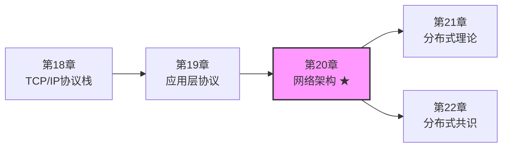
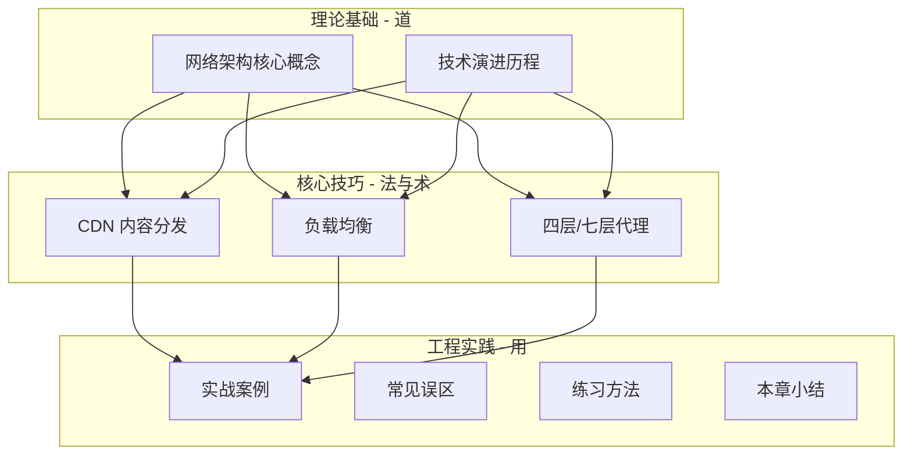
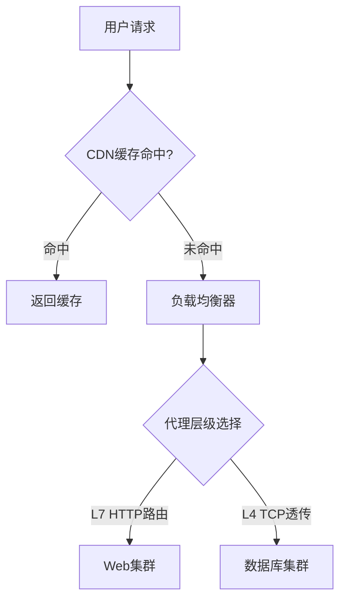
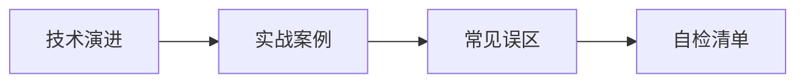
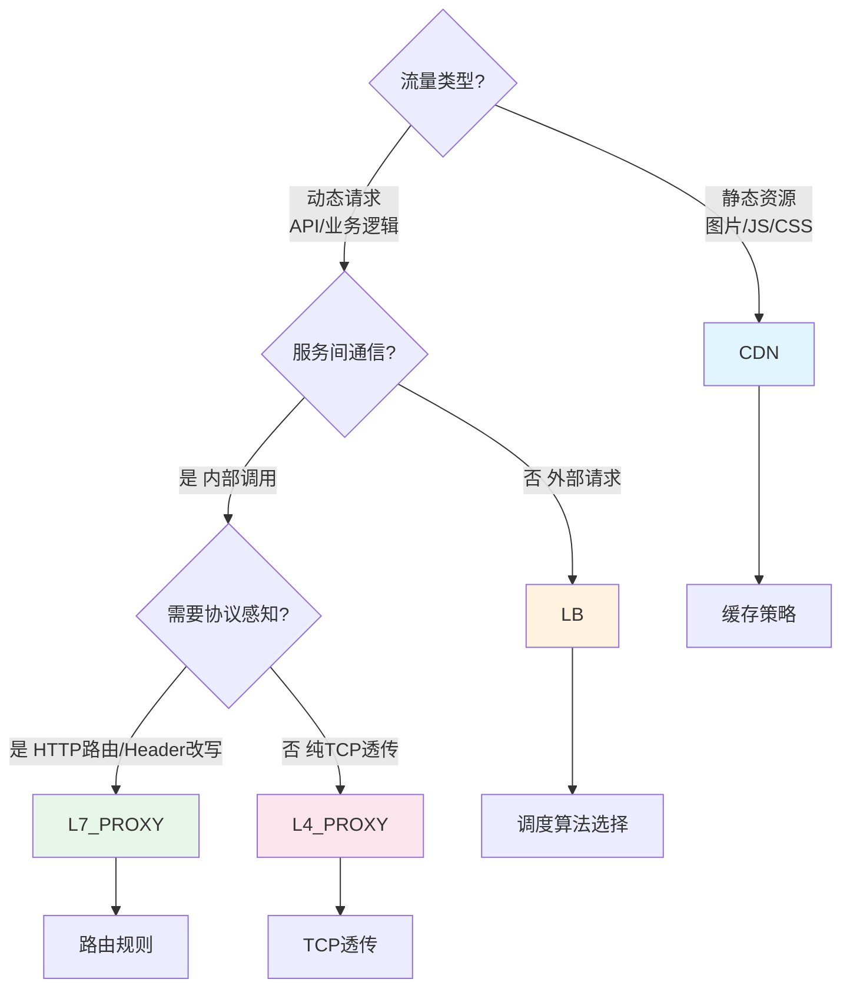

## 第20章 网络架构

### 1. 为什么网络架构是分布式系统的骨架

一个现代互联网系统，用户看到的是一个网页或一个 App，但背后可能涉及数十台、数百台甚至数千台服务器的协同工作。这些服务器之间如何通信、流量如何分发、故障如何隔离——所有这些系统级问题，都归结为一个核心命题：**网络架构设计**。

网络架构（Network Architecture）不仅仅是"拉几根网线、配几个 IP"这么简单。它是计算机网络中硬件、软件、协议和拓扑结构的整体组织方式，定义了：

- **数据如何流动**：请求从客户端到达后端服务的完整路径
- **服务如何暴露**：哪些端口对外开放、哪些仅限内网访问
- **流量如何分发**：单台服务器扛不住时，如何将请求均匀散开
- **故障如何隔离**：一台机器挂了，用户的请求是否还能正常响应
- **安全如何保障**：如何在开放的网络环境中防止攻击和数据泄露

在软件工程的视角下，网络架构关注的不仅是物理连接，更重要的是**应用层的通信模式**——微服务之间如何调用（gRPC、REST、消息队列）、客户端如何穿越多层代理到达后端（CDN → LB → API Gateway → Service）、数据如何跨可用区同步。

> **一句话总结**：网络架构是分布式系统的"交通系统"。设计得好，流量畅通无阻；设计得差，堵车、事故、瘫痪接踵而至。

### 2. 本章在全书中的位置

本章处于一个承上启下的关键位置：

- **前置依赖**：第18章的 TCP/IP 协议栈（TCP 三次握手、拥塞控制、NAT 穿透）和第19章的应用层协议（HTTP/2、WebSocket、gRPC）提供了网络通信的底层基础。没有这些知识，网络架构的设计就是空中楼阁。
- **后续延伸**：第21章的分布式理论（CAP 定理、一致性模型）和第22章的分布式共识（Raft、Paxos）则依赖本章的网络基础设施来进行分布式系统设计。负载均衡、代理、服务发现等概念贯穿后续章节。

本章的核心目标：**在掌握了"数据包怎么走"的基础上，学习"系统怎么设计"**。

### 3. 本章知识体系全景

网络架构的知识体系可以分为三个层次：理论基础、核心技巧、工程实践。本章的组织结构遵循"道→法→术"的递进逻辑：

#### 3.1 理论基础（道）

| 文件 | 核心内容 | 目标读者 |
|------|----------|----------|
| 核心概念 | 网络架构的定义、分类、关键指标（延迟/吞吐/可用性/一致性）、OSI 七层与 TCP/IP 四层模型在架构设计中的映射 | 所有读者 |
| 技术演进 | 从单机→主从→分布式→云原生的演进脉络，每个阶段的架构特点和解决的核心问题 | 所有读者 |

**为什么先学理论？** 因为网络架构的每一个技术选择背后都有权衡（trade-off）。不理解"为什么"，就无法在面对新场景时做出正确判断。比如：为什么选择了最终一致性就一定能获得更高的可用性？为什么 CDN 缓存会引入数据不一致？这些都源于理论基础。

#### 3.2 核心技巧（法与术）

| 文件 | 核心内容 | 实战价值 |
|------|----------|----------|
| CDN 内容分发 | CDN 的工作原理、边缘节点缓存策略、回源机制、缓存失效、HTTPS 加速、视频流分发 | 静态资源加速，降低源站压力 |
| 负载均衡 | 负载均衡器分类（硬件/软件/云）、调度算法（轮询/加权/最小连接/一致性哈希）、Nginx 完整配置、健康检查、高可用架构 | 流量分发的核心基础设施 |
| 四层/七层代理 | L4 与 L7 的本质区别、各自适用场景、性能对比、Nginx L7 代理与 HAProxy L4 代理配置、协议感知路由 | 根据业务特征选择正确的代理层级 |

**这三个技巧的逻辑关系：**

CDN 处理最外层的流量（静态资源），负载均衡处理中间层的流量分发，四层/七层代理决定了流量在网络栈的哪一层被处理和路由。三者层层递进，构成完整的流量治理链路。

#### 3.3 工程实践（用）

| 文件 | 核心内容 |
|------|----------|
| 实战案例 | 三个真实场景的完整复盘：电商大促全链路优化、跨机房容灾、微服务网格迁移 |
| 常见误区 | 五个高频踩坑点及纠正方法 |
| 练习方法 | 三组分级练习，从概念理解到动手实操 |
| 本章小结 | 知识点回顾与核心决策框架 |

### 4. 本章核心问题

在深入各节内容之前，先带着以下问题阅读，它们是网络架构设计中最常见的决策场景：

**Q1：流量来了，怎么分？**
当单台服务器的 QPS 达到上限（通常 1K-10K，取决于业务复杂度），就需要负载均衡器将流量散到多台后端。但怎么散？平均分？按权重分？按会话粘连分？不同策略适用于不同场景——无状态 API 适合轮询，有状态服务适合一致性哈希，权重分发适合新旧版本灰度。

**Q2：用户离得远，怎么快？**
北京用户访问部署在上海的服务器，单程网络延迟约 30ms，一个页面加载需要 50 次 HTTP 请求，累计延迟 1500ms——这还没算服务器处理时间。CDN 通过在全国/全球部署边缘节点，让用户就近获取内容，将静态资源延迟降到 5ms 以内。

**Q3：请求该在哪一层被拦截？**
四层代理（L4）只看 IP 和端口，转发速度极快（百万级 CPS），但无法理解 HTTP 语义。七层代理（L7）能解析 URL、Header、Cookie，可以做精细的路由和鉴权，但每个连接都需要完整的 HTTP 解析，性能开销更大。选错了层级，要么浪费资源，要么丧失灵活性。

**Q4：一台机器挂了，怎么办？**
高可用设计是网络架构的永恒主题。从负载均衡器的主备切换、后端服务的健康检查、到多机房的异地容灾，每一层都需要有故障自愈的能力。核心指标是 SLA：99.9%（一年宕机 8.76 小时）到 99.999%（一年宕机 5.26 分钟），每一级 9 的增加都意味着架构复杂度的指数级提升。

**Q5：安全和性能如何兼得？**
HTTPS 加密保障了传输安全，但 TLS 握手会增加 1-2 个 RTT 的延迟。HTTP/2 的多路复用提升了性能，但需要 TLS 前置。WAF 防护了攻击，但也可能误杀正常请求。网络架构设计需要在安全与性能之间找到平衡点。

### 5. 学习路径建议

根据读者的基础不同，推荐以下学习路径：

#### 路径一：入门读者（有网络基础，无架构经验）

预计耗时：8-12 小时。重点掌握核心概念和负载均衡，这是网络架构最基础的两个支柱。

#### 路径二：中级读者（有运维/开发经验，想系统化）

预计耗时：5-8 小时。可以跳过基础概念的详细阅读，重点在核心技巧和实战案例。特别关注 Nginx 配置和故障排查。

#### 路径三：高级读者（架构师/技术负责人）

预计耗时：3-5 小时。快速回顾演进脉络，重点复盘实战案例中的决策过程和权衡分析。关注架构设计方法论而非具体配置。

### 6. 关键指标速查

网络架构设计中需要持续关注的核心指标：

| 指标 | 含义 | 典型目标值 | 测量方式 | 优化方向 |
|------|------|-----------|----------|----------|
| 延迟 (Latency) | 请求从客户端发出到收到完整响应的时间 | P99 < 200ms（API）、P95 < 500ms（页面） | APM 工具、Prometheus Histogram | 减少网络跳数、CDN 加速、连接复用 |
| 吞吐量 (Throughput) | 单位时间内系统能处理的请求数 | 单机 1K-10K QPS（动态）、CDN 边缘节点 100K+ QPS（静态） | 压测工具（wrk/ab/k6）、监控面板 | 水平扩展、缓存命中率提升、协议优化 |
| 可用性 (Availability) | 系统正常运行时间占总时间的比例 | 99.9%（月宕机 43 分钟）→ 99.999%（月宕机 26 秒） | 健康检查探针、Uptime 监控 | 多副本、多可用区、自动故障转移 |
| 错误率 (Error Rate) | 失败请求占总请求的比例 | < 0.1%（5xx 错误）| 日志聚合、监控告警 | 重试策略、熔断降级、限流 |
| 带宽利用率 | 实际使用带宽占总带宽的比例 | < 70%（预留突发余量） | SNMP 监控、云平台监控 | CDN 分流、压缩、协议升级 |

### 7. 与其他章节的关联

网络架构不是孤立的知识点，它与全书其他章节有密切的交叉关系：

| 关联章节 | 关联内容 | 本章如何承接 |
|----------|----------|-------------|
| 第18章 TCP/IP协议栈 | TCP 三次握手、拥塞控制、NAT | 负载均衡器的连接管理、四层代理的 TCP 透传依赖 TCP 协议理解 |
| 第19章 应用层协议 | HTTP/2、WebSocket、gRPC | 七层代理的协议解析、CDN 的缓存策略依赖 HTTP 语义 |
| 第21章 分布式理论 | CAP 定理、一致性模型 | 网络分区是分布式系统的第一类故障，架构设计必须考虑分区容忍 |
| 第22章 分布式共识 | Raft、Paxos | 共识协议的网络延迟直接影响选举超时和日志复制效率 |
| 第15章 容器与编排 | Docker 网络、Kubernetes Service | 服务网格（Istio/Linkerd）是网络架构在容器化环境中的延伸 |
| 第16章 微服务架构 | 服务拆分、API Gateway | 网络架构为微服务提供通信基础设施，API Gateway 是七层代理的特化形态 |

### 8. 本章核心决策框架

在实际的网络架构设计中，你经常会面临以下决策。这里给出一个简明的决策树，帮助你快速定位：

**决策要点：**

1. **静态资源走 CDN**：如果内容可以缓存（图片、视频、JS/CSS/字体），优先用 CDN。CDN 的边缘节点能将延迟降低一个数量级。
2. **动态请求走负载均衡**：API 请求、实时数据无法缓存，需要负载均衡器分发到后端实例。
3. **四层代理用于高性能透传**：数据库连接、Redis 集群通信等需要极致性能、不需要 HTTP 解析的场景。
4. **七层代理用于精细路由**：需要按 URL/Header/Cookie 做路由决策、灰度发布、A/B 测试的场景。

### 9. 推荐阅读与深入学习

本章内容聚焦于工程实践，以下方向可以进一步深入：

- **深入 TCP 调优**：《TCP/IP Illustrated, Volume 1》— 理解网络架构的协议基石
- **大规模系统设计**：《System Design Interview (Volume 2)》— 从面试题角度理解网络架构决策
- **云原生网络**：《Kubernetes in Action (2nd Edition)》— 容器网络和服务网格的完整实践
- **性能工程**：《Systems Performance (2nd Edition)》— Brendan Gregg 的性能分析方法论

---

> **下一节预告**：我们将进入【核心概念】，系统梳理网络架构的定义、分类体系和关键性能指标，为后续所有技巧和实践打下理论基础。
