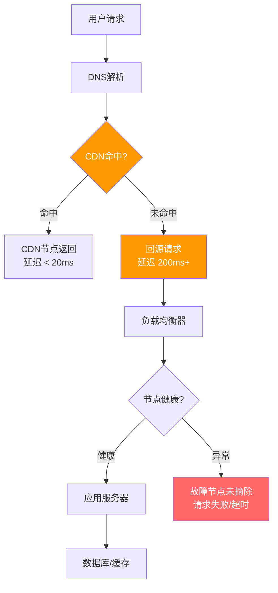
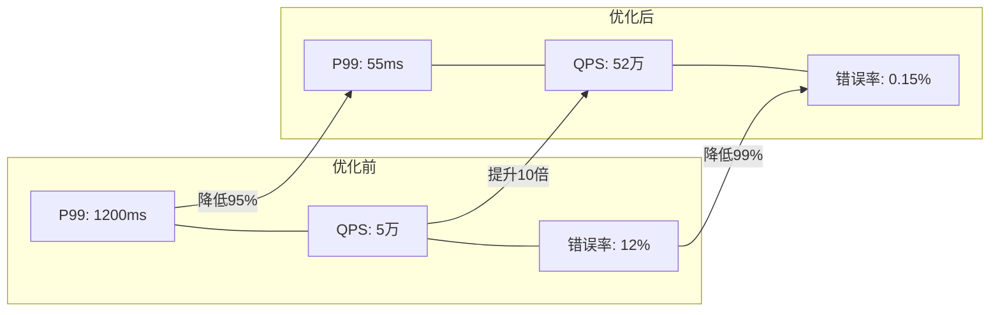
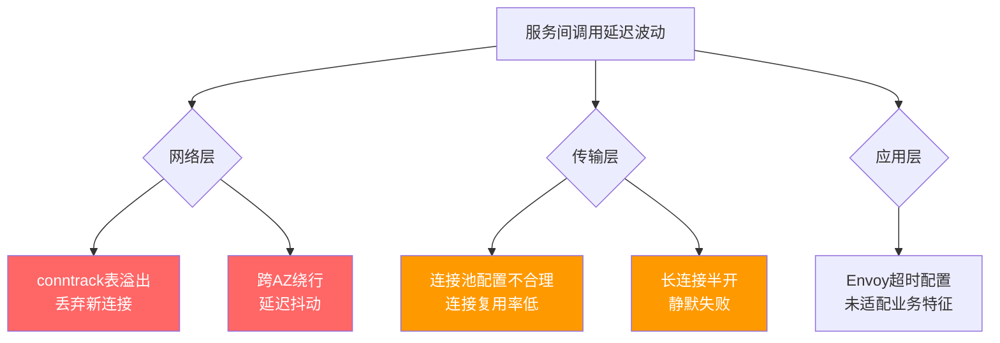
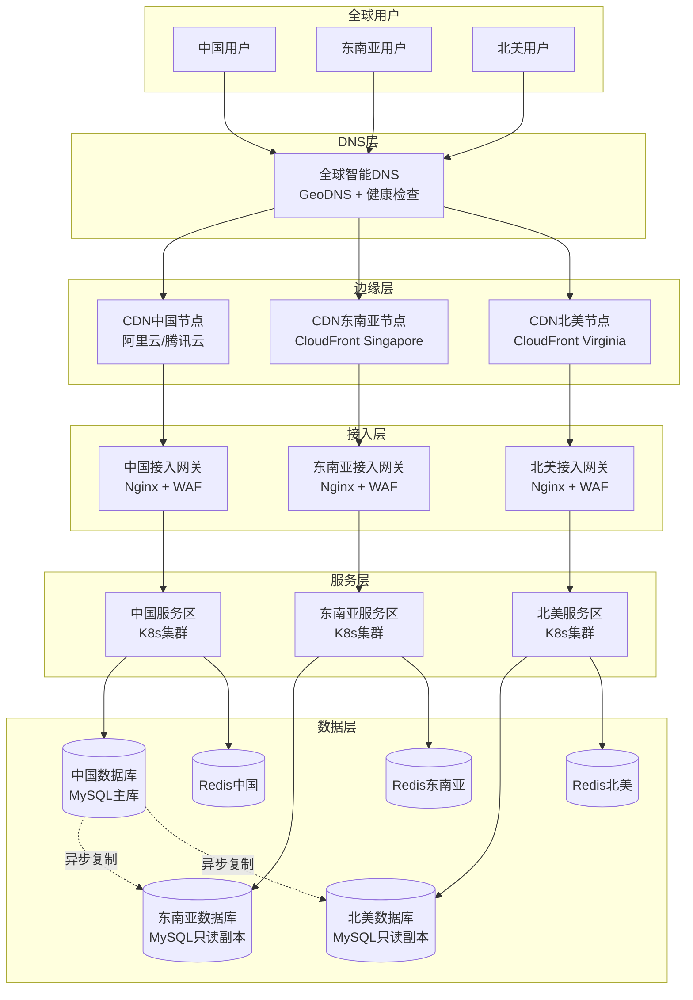
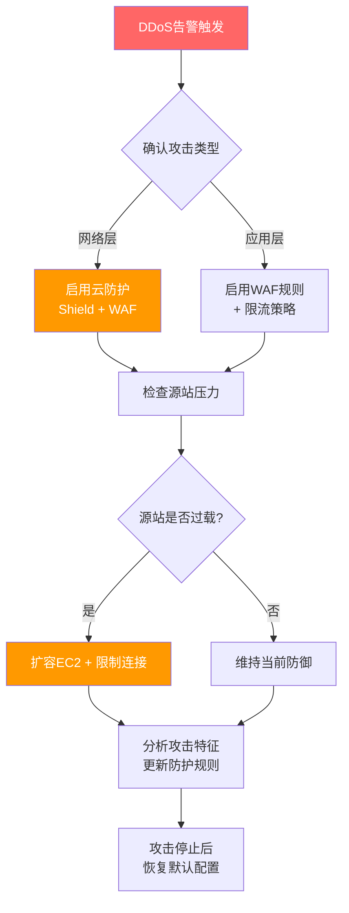
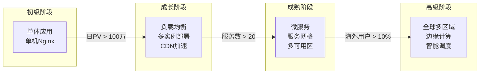

## 实战案例

本节通过四个真实场景的完整复盘，展示网络架构设计中的典型问题、排查思路和解决方案。每个案例都遵循"问题发现→根因分析→方案设计→实施验证→经验沉淀"的完整闭环，帮助读者建立系统化的网络架构实战能力。

四个案例的难度逐步递进：从单体应用的性能优化，到微服务网格的网络治理，再到全球多区域架构设计，最后以一个安全视角下的DDoS防御收尾。无论你是运维工程师、后端开发者还是架构师，都能从中找到可直接复用的排查思路和配置模板。

---

### 案例一：电商平台大促期间的全链路网络优化

#### 1.1 问题背景

**业务场景**：某头部电商平台在双11大促预热阶段，系统面临日常10倍以上的流量洪峰。平台日活用户约2000万，大促期间峰值QPS预计达到50万。技术栈为 Nginx + Java Spring Boot + MySQL + Redis，部署在阿里云ECS上。

**问题现象**：
- 用户反馈页面加载缓慢，首屏时间从1.2s劣化到4.5s
- 下单接口P99延迟从80ms飙升至1200ms，超时率高达12%
- 部分地区用户完全无法访问，表现为DNS解析失败或连接超时
- 移动端用户掉线率从0.3%上升到8%

**影响范围**：
- 受影响用户：约300万（大促期间累计）
- 持续时间：高峰时段约2小时
- 直接经济损失：预估数百万元
- 品牌影响：社交媒体出现大量负面反馈

#### 1.2 排查过程

**第一步：网络层基础诊断**

首先确认是网络层问题还是应用层问题，从最底层的网络指标开始排查。这是网络问题排查的黄金法则——自底向上（Bottom-Up Approach），避免在应用层纠结而忽略底层瓶颈。

```bash
# 检查服务器网络基础指标
# 1. 网络接口流量（判断是否接近网卡带宽上限）
sar -n DEV 1 10
# 关注 rxKB/s 和 txKB/s 是否接近网卡上限
# 万兆网卡理论上限 1250MB/s，实际有效吞吐约 900-1000MB/s

# 2. TCP连接状态统计（快速总览）
ss -s
# 输出示例：
# Total: 185632
# TCP:   180245 (estab 156789, closed 12340, orphaned 5678, timewait 8901)

# 3. 各状态TCP连接数分布（定位具体问题状态）
ss -ant | awk '{print $1}' | sort | uniq -c | sort -rn
# 正常情况下 ESTABLISHED 占绝大多数
# TIME_WAIT > 5000 说明短连接过多
# CLOSE_WAIT > 0 说明应用没有正确关闭连接

# 4. 网络丢包和错误（判断是否存在链路问题）
netstat -s | grep -i "retransmit\|timeout\|drop\|reset"
cat /proc/net/snmp | grep Tcp
# 关注 RetransSegs 与 OutSegs 的比值，正常应 < 0.1%

# 5. 网卡中断和软中断是否均衡（NUMA架构下常见瓶颈）
cat /proc/interrupts | grep eth0
# 如果某一个 CPU 核心的中断数远高于其他核心，说明中断未均衡绑定
# 可通过 irqbalance 服务或手动设置亲和性来优化
```

排查发现：
- TIME_WAIT连接数高达35000，远超正常水平（建议不超过5000）
- TCP重传率达到2.3%（正常应低于0.1%）
- 网卡带宽利用率达到85%，接近瓶颈
- 软中断集中在CPU0，其他核心未参与网络处理

**第二步：DNS与CDN层排查**

DNS是用户访问的第一道关卡，解析慢或解析到错误节点会导致用户被路由到远端服务器，产生不必要的网络延迟。

```bash
# 1. DNS解析耗时测试
dig www.example.com +stats
# 关注 Query time 是否异常（正常应 < 20ms）
# 如果 > 100ms，需要排查DNS服务器性能或配置

# 2. 多地域DNS解析对比（模拟不同地区用户）
# 使用不同DNS服务器测试，验证调度策略是否正确
dig @8.8.8.8 www.example.com +stats        # Google DNS
dig @114.114.114.114 www.example.com +stats # 国内DNS
dig @223.5.5.5 www.example.com +stats       # 阿里DNS
# 对比不同DNS返回的IP，确认是否调度到了正确的地域节点

# 3. CDN节点命中率检查
curl -I https://cdn.example.com/static/app.js 2>/dev/null | grep -i "x-cache\|x-cdn\|age"
# X-Cache: HIT 表示命中CDN缓存（正常应 > 95%）
# X-Cache: MISS 表示未命中，请求回源（需要排查原因）

# 4. 检查CDN回源带宽与源站压力
# 通过CDN控制台查看回源带宽趋势
# 回源带宽 / 总带宽 = 回源率，正常应 < 5%

# 5. 检查TLS握手开销（HTTPS场景下的隐藏成本）
curl -w "dns: %{time_namelookup}s\ntcp: %{time_connect}s\ntls: %{time_appconnect}s\nttfb: %{time_starttransfer}s\n" \
    -o /dev/null -s https://cdn.example.com/
# 如果 tls 时间 > 100ms，考虑启用 TLS 1.3 和会话恢复
```

排查发现：
- CDN静态资源缓存命中率仅62%（目标应 > 95%）
- 大量动态请求未走CDN加速，直接打到源站
- 部分运营商DNS解析异常，导致用户被调度到远端节点
- TLS握手平均耗时120ms，占总延迟比例偏高

**第三步：负载均衡层排查**

负载均衡是流量的调度中枢，配置不当会导致部分节点过载而其他节点空闲。

```bash
# 1. Nginx upstream连接状态
# 在Nginx配置中开启status页面
# location /nginx_status { stub_status on; allow 10.0.0.0/8; }
curl http://localhost/nginx_status
# Active connections: 12456          # 当前活跃连接
# server accepts handled requests
#  1234567 1234567 9876543           # accept数=handled数表示无丢弃
# Reading: 128 Writing: 5678 Waiting: 6650
# Waiting 过大说明后端响应慢，请求堆积

# 2. 后端节点健康检查（模拟负载均衡器视角）
for backend in 10.0.1.1 10.0.1.2 10.0.1.3 10.0.1.4; do
    echo -n "$backend: "
    curl -o /dev/null -s -w "status=%{http_code} time=%{time_total}s\n" \
        http://$backend/health
done
# 如果某个节点响应时间明显高于其他节点，说明该节点存在问题

# 3. 查看Nginx错误日志中的upstream相关错误
tail -1000 /var/log/nginx/error.log | grep "upstream" | \
    awk '{print $NF}' | sort | uniq -c | sort -rn | head -10
# 常见错误：upstream timed out, no live upstreams, upstream prematurely closed

# 4. 检查Nginx worker连接数是否耗尽
# 在nginx.conf中查看 worker_connections
# 当前连接数 = Active connections，如果接近 worker_connections * worker_processes，需要扩容
```

排查发现：
- 负载均衡算法使用默认的round-robin，未考虑后端节点实际负载差异
- 健康检查间隔30秒过长，故障节点未能及时摘除
- 后端连接超时设置为60s，导致大量慢请求堆积占用连接池
- Waiting连接数过高，说明后端处理能力不足

**第四步：应用层网络问题定位**

```bash
# 1. 查看Java应用的网络线程状态
jstack <pid> | grep -A 5 "nio-" | head -50
# 关注NIO selector线程是否阻塞
# 如果出现 BLOCKED 或 WAITING，说明线程模型存在问题

# 2. 应用层连接池监控
# HikariCP连接池统计（通过JMX或Micrometer）
jcmd <pid> VM.system_properties | grep hikari
# 关注 activeConnections / totalConnections / pendingThreads
# pendingThreads > 0 说明连接池已满，请求在排队

# 3. 检查应用层HTTP客户端配置
grep -r "connectTimeout\|socketTimeout\|maxConnections" /app/config/
# 过长的超时会占用连接资源，过短会导致正常请求失败

# 4. 检查是否存在连接泄漏（CLOSE_WAIT是典型症状）
ss -ant | grep CLOSE_WAIT | wc -l
# 如果 CLOSE_WAIT 持续增长，说明应用没有正确关闭连接
```

#### 1.3 根因分析

经过全链路排查，定位到以下核心问题：

| 问题层级 | 具体问题 | 影响程度 | 修复难度 | 优先级 |
|----------|----------|----------|----------|--------|
| DNS/CDN层 | CDN缓存命中率低，动态请求未加速 | ★★★★★ | 中 | P0 |
| 负载均衡层 | 轮询算法导致热点节点，故障摘除延迟 | ★★★★☆ | 低 | P0 |
| 传输层 | TIME_WAIT堆积，TCP重传率高 | ★★★★☆ | 中 | P1 |
| 应用层 | 连接池配置不合理，线程模型有缺陷 | ★★★☆☆ | 高 | P2 |



#### 1.4 解决方案

**方案一：CDN与DNS优化**

```nginx
# Nginx CDN回源策略优化
# 静态资源长缓存 + 版本化文件名（构建时自动生成哈希文件名）
location ~* \.(js|css|png|jpg|jpeg|gif|ico|svg|woff2)$ {
    expires 30d;
    add_header Cache-Control "public, immutable";
    add_header Vary "Accept-Encoding";
    
    # 开启gzip压缩减少传输体积
    gzip on;
    gzip_types text/css application/javascript image/svg+xml;
    gzip_min_length 1024;
    
    # 关闭不必要的日志减少IO
    access_log off;
}

# API响应的缓存控制（分级缓存策略）
location /api/ {
    # 短期缓存：允许CDN边缘节点缓存5秒，同时在过期后30秒内返回旧数据
    # 这样源站有30秒的窗口来更新缓存，避免缓存雪崩
    add_header Cache-Control "public, max-age=5, stale-while-revalidate=30";
    proxy_pass http://backend;
}

# 实时性要求高的接口（如库存查询）不走CDN
location /api/inventory/ {
    add_header Cache-Control "no-store, no-cache";
    proxy_pass http://backend;
}
```

```bash
# DNS优化：使用智能DNS调度
# 配置GeoDNS，将用户调度到最近的边缘节点
# 按运营商+地域细分调度策略
# 电信用户 → 电信机房CDN节点
# 联通用户 → 联通机房CDN节点
# 移动用户 → 移动机房CDN节点

# 启用DNS预解析（减少页面内DNS查询次数）
# 在HTML头部添加：
# <link rel="dns-prefetch" href="//cdn.example.com">
# <link rel="dns-prefetch" href="//api.example.com">

# 验证DNS调度效果
# 从不同运营商网络测试解析结果
for dns in 114.114.114.114 223.5.5.5 180.76.76.76; do
    echo -n "DNS $dns: "
    dig @$dns api.example.com +short | head -1
done
```

**方案二：负载均衡策略升级**

```nginx
# Nginx负载均衡配置优化
upstream backend {
    # 使用加权最小连接数算法
    # 相比round-robin，least_conn会将请求发送到当前连接数最少的节点
    # 避免某个慢节点堆积过多请求
    least_conn;
    
    # max_fails: 在fail_timeout周期内允许的最大失败次数
    # fail_timeout: 既是检测周期，也是节点被摘除后的恢复等待时间
    server 10.0.1.1:8080 weight=5 max_fails=3 fail_timeout=10s;
    server 10.0.1.2:8080 weight=3 max_fails=3 fail_timeout=10s;
    server 10.0.1.3:8080 weight=5 max_fails=3 fail_timeout=10s;
    server 10.0.1.4:8080 weight=2 max_fails=3 fail_timeout=10s backup;
    
    # 连接复用：减少TCP三次握手和TLS握手的开销
    # keepalive: 保持的空闲连接数，供后续请求复用
    keepalive 32;
    keepalive_timeout 60s;
    keepalive_requests 1000;  # 单个连接最大请求数
}

server {
    location /api/ {
        proxy_pass http://backend;
        # 必须设置 HTTP/1.1 才能使用 keepalive
        proxy_http_version 1.1;
        proxy_set_header Connection "";
        
        # 超时精细化控制（总原则：失败要快，成功要稳）
        proxy_connect_timeout 5s;    # 连接后端超时（快速失败）
        proxy_send_timeout 30s;      # 发送请求超时
        proxy_read_timeout 30s;      # 等待响应超时
        
        # 缓冲区优化（减少磁盘IO，提升吞吐）
        proxy_buffering on;
        proxy_buffer_size 16k;       # 响应头缓冲区
        proxy_buffers 8 32k;         # 响应体缓冲区
        proxy_busy_buffers_size 64k; # 在缓冲未满时也可以发送数据
    }
}
```

**方案三：操作系统TCP参数调优**

```bash
# /etc/sysctl.conf 网络参数优化
# 以下是高并发场景的推荐配置，每项参数都附带调优理由

# --- 连接数相关 ---
net.core.somaxconn = 65535           # 监听队列最大长度（默认128）
                                      # 影响：accept队列满时新连接被拒绝
net.ipv4.tcp_max_syn_backlog = 65535 # SYN队列长度（默认1024）
                                      # 影响：SYN flood攻击防护 + 高并发建连
net.core.netdev_max_backlog = 65535  # 网卡接收队列长度（默认1000）
                                      # 影响：网卡处理速度 < 内核处理速度时堆积

# --- TIME_WAIT优化 ---
net.ipv4.tcp_tw_reuse = 1            # 允许复用TIME_WAIT连接（安全选项）
                                      # 原理：基于时间戳选择可复用的连接
                                      # 注意：需要同时开启tcp_timestamps
net.ipv4.tcp_fin_timeout = 15        # FIN-WAIT-2超时时间（默认60秒）
                                      # 缩短后更快释放半关闭连接
net.ipv4.tcp_max_tw_buckets = 20000  # TIME_WAIT最大数量（默认系统自动计算）
                                      # 超出后直接销毁，可能触发SYN cookie

# --- 缓冲区优化 ---
net.core.rmem_max = 16777216         # 接收缓冲区最大值（默认212992）
net.core.wmem_max = 16777216         # 发送缓冲区最大值（默认212992）
net.ipv4.tcp_rmem = 4096 87380 16777216  # TCP接收缓冲区（最小/默认/最大）
net.ipv4.tcp_wmem = 4096 65536 16777216  # TCP发送缓冲区
# 说明：增大缓冲区可以提升高带宽长延迟链路（如跨AZ通信）的吞吐量
# 代价：每个连接占用更多内存，需要平衡连接数和缓冲区大小

# --- Keepalive优化 ---
net.ipv4.tcp_keepalive_time = 600    # 空闲多久开始探测（默认7200秒）
net.ipv4.tcp_keepalive_intvl = 30    # 探测间隔（默认75秒）
net.ipv4.tcp_keepalive_probes = 3    # 探测次数（默认9次）
# 调优后：600 + 30×3 = 630秒发现死连接（默认7200+75×9=7875秒）

# --- 拥塞控制 ---
# BBR是Google开发的拥塞控制算法，相比CUBIC在高延迟高带宽场景下表现更优
# BBR通过估算最大带宽和最小RTT来控制发送速率，不依赖丢包信号
net.ipv4.tcp_congestion_control = bbr  # 使用BBR拥塞控制算法
net.core.default_qdisc = fq           # BBR配套队列调度算法（公平队列）
# 验证：sysctl net.ipv4.tcp_congestion_control 应返回 bbr

# --- 连接跟踪（conntrack）---
# conntrack是iptables/netfilter的连接跟踪模块，记录每个连接的状态
# 高并发场景下容易成为瓶颈
net.netfilter.nf_conntrack_max = 262144        # 最大跟踪连接数（默认65536）
net.netfilter.nf_conntrack_buckets = 65536     # 哈希表大小（连接数/4）
net.netfilter.nf_conntrack_tcp_timeout_established = 600  # 已建立连接超时

# 应用配置
sysctl -p
```

**方案四：应用层网络优化**

```java
// HikariCP连接池优化配置
HikariConfig config = new HikariConfig();
config.setJdbcUrl("jdbc:mysql://db.example.com:3306/orders");
config.setUsername("app_user");
config.setPassword("****");

// 核心连接数：保持一定数量的热连接，避免冷启动延迟
config.setMinimumIdle(10);
// 最大连接数：根据 (CPU核心数 * 2 + 磁盘数) 公式估算
// 例：8核2盘 → 8*2+2 = 18，但考虑并发需求可适当放大
config.setMaximumPoolSize(50);
// 连接超时：快速失败，避免请求堆积（< 3秒为佳）
config.setConnectionTimeout(3000);
// 空闲超时：及时释放不使用的连接，留给其他线程
config.setIdleTimeout(600000);    // 10分钟
// 连接最大生命周期：防止长连接被中间件（LB、防火墙）静默断开
config.setMaxLifetime(1800000);   // 30分钟
// 连接测试查询：验证连接是否可用（替代validationTimeout）
config.setConnectionTestQuery("SELECT 1");
// 连接泄漏检测：超过leakDetectionThreshold未归还连接则打印警告
config.setLeakDetectionThreshold(60000); // 60秒

// 启用JMX/Micrometer监控
config.setMetricRegistry(metricRegistry);
```

```python
# Python异步HTTP客户端优化（aiohttp）
import aiohttp
import asyncio

# 连接器配置：控制并发连接数和连接池大小
connector = aiohttp.TCPConnector(
    limit=100,                  # 总连接数上限（全局池）
    limit_per_host=30,          # 单目标连接数上限（防止单个服务被打满）
    ttl_dns_cache=300,          # DNS缓存时间（秒，减少DNS查询开销）
    enable_cleanup_closed=True, # 后台清理已关闭但未回收的连接
    keepalive_timeout=30,       # 空闲连接超时（过长会被中间件断开）
    force_close=False,          # 复用连接而非每次关闭
)

timeout = aiohttp.ClientTimeout(
    total=30,         # 总超时（包含连接+读+写）
    connect=5,        # 连接超时（快速失败）
    sock_read=10,     # 读超时（等待服务端响应）
    sock_connect=5,   # Socket连接超时
)

# 带重试的请求模式
async def resilient_request(session, url, max_retries=3):
    for attempt in range(max_retries):
        try:
            async with session.get(url) as response:
                if response.status < 500:
                    return await response.json()
                # 5xx错误指数退避重试
                await asyncio.sleep(2 ** attempt)
        except aiohttp.ClientError as e:
            if attempt == max_retries - 1:
                raise
            await asyncio.sleep(2 ** attempt)
```

#### 1.5 实施效果

优化分三个阶段实施，每阶段都有明确的验证指标。注意：每个阶段都应进行压测验证后再进入下一阶段，避免多变量干扰定位。

| 阶段 | 优化内容 | P99延迟 | QPS | 错误率 | CDN命中率 |
|------|----------|---------|-----|--------|-----------|
| 优化前 | 基线状态 | 1200ms | 5万 | 12% | 62% |
| 第一阶段 | CDN+DNS优化 | 400ms | 12万 | 3% | 93% |
| 第二阶段 | +负载均衡+TCP调优 | 120ms | 35万 | 0.8% | 95% |
| 第三阶段 | +应用层优化 | 55ms | 52万 | 0.15% | 97% |



#### 1.6 经验沉淀

1. **分层排查是关键**：从网络层→传输层→应用层逐层排查，避免在应用层纠结而忽略底层问题。实践表明，约60%的"应用层慢"问题根因在底层网络。
2. **CDN不是万能药**：需要合理划分静态/动态内容，配置正确的缓存策略才能发挥CDN价值。静态资源用immutable长缓存，API用短期缓存+stale-while-revalidate。
3. **TCP参数有最佳实践**：Linux默认网络参数是为通用场景设计的，高并发场景必须针对性调优。重点关注somaxconn、tcp_tw_reuse和BBR。
4. **监控先行**：在优化前必须建立完善的监控基线（延迟分布、吞吐量、错误率、连接状态），否则无法量化优化效果。没有数据支撑的优化就是盲人摸象。
5. **软中断均衡常被忽略**：在多核服务器上，如果网络中断全部集中在单个CPU核心，即使CPU总利用率不高也会成为瓶颈。irqbalance或手动绑定中断亲和性是必要的。

---

### 案例二：微服务架构下的服务网格网络问题

#### 2.1 问题背景

**业务场景**：某金融科技公司从单体架构迁移至微服务架构，引入Kubernetes + Istio服务网格。系统包含200+微服务实例，日均处理交易请求约5000万笔。Istio版本1.18，Kubernetes版本1.28，部署在3个可用区（AZ-a、AZ-b、AZ-c）。

**问题现象**：
- 服务间调用延迟呈随机性波动，P99从正常的5ms上升到200ms
- 偶发性出现"connection refused"错误，影响约0.5%的请求
- 跨可用区（AZ）的服务调用延迟不稳定，抖动明显
- 部分长连接出现半开（half-open）状态，导致请求静默失败

**影响范围**：
- 影响交易成功率从99.99%下降到99.85%
- 客户投诉量增加3倍
- 核心交易链路SLA不达标

#### 2.2 排查过程

**第一步：服务网格数据面排查**

Istio的Envoy sidecar是所有流量的必经之路，排查应从数据面开始。

```bash
# 1. 检查Envoy sidecar代理是否就绪
kubectl get pods -n production -o json | \
    jq '.items[] | select(.status.phase=="Running") | 
    .metadata.name + " " + (.status.containerStatuses[]? | 
    select(.name=="istio-proxy") | .ready | tostring)'
# 所有Pod的istio-proxy都应为true，否则sidecar未就绪

# 2. 查看Envoy的连接统计（核心诊断数据）
kubectl exec -it <pod-name> -c istio-proxy -- \
    curl -s localhost:15000/stats | grep -E "upstream_cx_|downstream_cx_"
# 关键指标：
# upstream_cx_total: 上游连接创建总数
# upstream_cx_connect_fail: 连接建立失败数（增长说明目标不可达）
# upstream_cx_active: 当前活跃连接数
# upstream_rq_pending_overflow: 因连接池满被拒绝的请求数（=0为正常）

# 3. 查看Envoy的集群健康状态
kubectl exec -it <pod-name> -c istio-proxy -- \
    curl -s localhost:15000/clusters | grep -A 20 "service-b.production"
# 关注 health_flags: /healthy/ 表示健康
# 关注 outlier_detection 相关指标（ejected hosts数）

# 4. 查看Envoy访问日志（定位具体异常请求）
kubectl logs <pod-name> -c istio-proxy --tail=100 | \
    grep -E "503|504|UF|URX|UC"
# UF: upstream connection failure
# URX: upstream request timeout  
# UC: upstream connection close
```

**第二步：网络策略与iptables排查**

Istio通过iptables规则劫持所有入站/出站流量到Envoy sidecar，这个环节容易出问题。

```bash
# 1. 检查Kubernetes NetworkPolicy是否过于严格
kubectl get networkpolicy -n production -o wide
kubectl describe networkpolicy -n production
# 常见问题：NetworkPolicy拒绝了Envoy sidecar之间的通信

# 2. 检查iptables规则（Istio通过iptables劫持流量）
kubectl exec -it <pod-name> -- iptables -t nat -L -n -v | head -30
# 关注 OUTPUT 和 PREROUTING 链中的ISTIO规则
# 如果规则缺失，说明istio-init容器初始化失败

# 3. 检查CONNECTIONTRACK表是否溢出（这是高并发下的常见杀手）
kubectl exec -it <pod-name> -- sysctl net.netfilter.nf_conntrack_count
kubectl exec -it <pod-name> -- sysctl net.netfilter.nf_conntrack_max
# 如果 count/max > 0.8（使用率 > 80%），新连接会被丢弃
# 表现为随机的 connection refused

# 4. 查看conntrack丢包计数
cat /proc/net/stat/nf_conntrack | head -2
# 第二列是drop计数，如果 > 0 说明有连接因conntrack满被丢弃

# 5. 检查iptables规则数量是否接近上限（默认65535）
iptables -L -n | wc -l
# Istio会为每个服务生成大量规则，服务数量多时容易超限
```

**第三步：跨AZ网络延迟排查**

```bash
# 1. 跨AZ网络延迟测试（从AZ-a的pod测试到AZ-b的服务）
kubectl run test-pod --image=nicolaka/netshoot -n production --rm -it -- \
    ping -c 100 service-b.production.svc.cluster.local
# 正常情况同集群内延迟 < 1ms，跨AZ延迟 0.5-2ms

# 2. MTR追踪网络路径（比ping更详细，能看到每一跳的延迟和丢包）
kubectl exec -it <test-pod> -c netshoot -- \
    mtr --report --report-cycles 100 service-b.production.svc.cluster.local
# 关注路径中哪一跳引入了额外延迟

# 3. 检查Service的Endpoints分布是否均匀
kubectl get endpoints service-b -n production -o yaml
# 确认Endpoints是否均匀分布在各AZ
# 如果某个AZ的Endpoints全部不可用，流量会被调度到远端AZ

# 4. 使用iperf3测试实际带宽（排除网络策略限流因素）
kubectl run iperf-server --image=networkstatic/iperf3 -n production
kubectl exec -it <test-pod> -c netshoot -- iperf3 -c <server-ip> -t 30
```

排查发现：
- conntrack表容量为65536，高峰期使用率达到92%，导致新连接被丢弃
- 跨AZ流量未做拓扑感知路由，大量请求绕远路
- Istio的连接池配置不合理，导致连接复用率低

#### 2.3 根因分析



| 问题 | 根因 | 影响机制 | 诊断方法 |
|------|------|----------|----------|
| conntrack表溢出 | 内核默认65536，Istio的iptables劫持导致连接数翻倍 | 新TCP连接被丢弃，表现为connection refused | sysctl检查conntrack_count/max |
| 跨AZ绕行 | Service未配置拓扑感知路由 | 同AZ请求被调度到跨AZ节点，增加0.5-2ms RTT | endpoints分布检查+MTR路径追踪 |
| 连接复用率低 | Envoy默认连接池大小偏保守（http2MaxRequests=1024） | 频繁创建/销毁连接，增加握手开销 | Envoy stats中upstream_cx_active/upstream_cx_total比值 |
| 长连接半开 | 中间设备（LB/FW）静默丢弃空闲连接 | 客户端认为连接存活，实际已失效 | 连接测试+抓包分析 |

#### 2.4 解决方案

**方案一：conntrack容量优化**

```bash
# 方法1：增大conntrack表容量（治标，立即生效）
sysctl -w net.netfilter.nf_conntrack_max=262144
sysctl -w net.netfilter.nf_conntrack_buckets=65536
# 持久化到 /etc/sysctl.conf

# 方法2：使用eBPF替代conntrack（治本，推荐生产环境）
# Cilium使用eBPF直接在网络栈中处理数据包，
# 绕过了iptables和conntrack，性能提升显著
# 
# eBPF vs iptables 性能对比：
# - iptables: 每个数据包需要遍历规则链，O(n)复杂度
# - eBPF: 哈希表直接查找，O(1)复杂度
# - 在10万+规则场景下，eBPF性能提升5-10倍
helm install cilium cilium/cilium --namespace kube-system \
    --set kubeProxyReplacement=true \
    --set bpf.masquerade=false \
    --set sessionAffinity=true

# 方法3：减少不必要的conntrack（减少需要跟踪的连接数）
# 如果某些Pod之间的通信是内部的且安全的，可以将其加入不跟踪列表
# 在iptables中添加：-j NOTRACK
```

**方案二：拓扑感知路由**

```yaml
# Kubernetes Service配置拓扑感知路由（K8s 1.21+ GA）
apiVersion: v1
kind: Service
metadata:
  name: service-b
  namespace: production
spec:
  type: ClusterIP
  topologyKeys:
    - topology.kubernetes.io/zone    # 优先同可用区
    - topology.kubernetes.io/region  # 其次同地域
    - "*"                            # 最后任意节点
  selector:
    app: service-b
  ports:
    - port: 8080
      targetPort: 8080
---
# Istio DestinationRule配置（更精细的流量控制）
apiVersion: networking.istio.io/v1beta1
kind: DestinationRule
metadata:
  name: service-b-dr
  namespace: production
spec:
  host: service-b.production.svc.cluster.local
  trafficPolicy:
    # 连接池优化（关键参数需根据业务QPS和延迟调整）
    connectionPool:
      tcp:
        maxConnections: 100       # 单目标最大连接数
        connectTimeout: 3s        # 连接超时
        tcpKeepalive:
          time: 7200s             # TCP Keepalive探测时间
          interval: 75s
      http:
        h2UpgradePolicy: DEFAULT  # 默认升级到HTTP/2多路复用
        http1MaxPendingRequests: 128  # HTTP/1.1排队上限
        http2MaxRequests: 1000        # HTTP/2并发请求上限
        maxRequestsPerConnection: 100 # 单连接最大请求数
        maxRetries: 3
    # 异常检测与熔断（自动摘除故障节点）
    outlierDetection:
      consecutive5xxErrors: 3     # 连续3次5xx触发熔断
      interval: 10s               # 每10秒检测一次
      baseEjectionTime: 30s       # 最短驱逐30秒
      maxEjectionPercent: 50      # 最多驱逐50%的节点（防止雪崩）
      minHealthPercent: 30        # 至少保留30%健康节点
    loadBalancer:
      simple: LEAST_REQUEST       # 最少请求负载均衡（比ROUND_ROBIN更智能）
    # 跨AZ负载均衡偏好
    localityLbSetting:
      enabled: true
      failover:
        - from: cn-east-1a
          to: cn-east-1b
```

**方案三：长连接保活与探测**

```yaml
# 在应用层面配置TCP Keepalive
apiVersion: apps/v1
kind: Deployment
metadata:
  name: service-a
  namespace: production
spec:
  template:
    spec:
      containers:
        - name: app
          image: service-a:v2.1.0
          env:
            # HTTP客户端Keepalive配置
            - name: HTTP_KEEPALIVE_TIMEOUT
              value: "60"        # 应用层Keepalive间隔
            - name: HTTP_IDLE_CONNECTION_TIMEOUT
              value: "90"        # 空闲连接超时（应 < 中间设备超时）
            # 连接池健康检查间隔
            - name: HEALTH_CHECK_INTERVAL
              value: "30"
          # 容器级TCP参数覆盖（Pod级别sysctl需要安全策略允许）
          securityContext:
            sysctls:
              - name: net.ipv4.tcp_keepalive_time
                value: "60"      # 60秒开始探测（比默认7200秒快很多）
              - name: net.ipv4.tcp_keepalive_intvl
                value: "15"      # 每15秒探测一次
              - name: net.ipv4.tcp_keepalive_probes
                value: "5"       # 5次无响应判定死亡
              # 总计 60 + 15×5 = 135秒 发现死连接
```

#### 2.5 实施效果

| 指标 | 优化前 | 优化后 | 改善幅度 |
|------|--------|--------|----------|
| 服务间P99延迟 | 200ms | 8ms | 降低96% |
| connection refused错误率 | 0.5% | 0.01% | 降低98% |
| 跨AZ延迟抖动 | ±50ms | ±5ms | 降低90% |
| 连接复用率 | 35% | 85% | 提升143% |
| conntrack使用率 | 92% | 25% | 降低73% |

#### 2.6 经验沉淀

1. **conntrack是容器化环境的隐形杀手**：Istio的iptables劫持会使连接数翻倍（每个连接在INPUT和OUTPUT链各记录一次），默认65536的conntrack表远远不够。eBPF方案是根本解法。
2. **拓扑感知路由是多AZ部署的必备能力**：避免跨AZ绕行能显著降低延迟和抖动，同时降低跨AZ带宽成本。
3. **服务网格不是银弹**：sidecar代理引入的额外跳数（每请求4次代理：入→出→入→出）、连接池管理都需要精细调优。在延迟敏感的场景下，需要评估sidecar的开销是否可接受。
4. **长连接需要主动保活**：在复杂网络环境中，TCP Keepalive是发现死连接的唯一可靠手段。配置要快于中间设备的超时（LB通常60秒，Keepalive设45-55秒）。

---

### 案例三：全球多区域部署的网络架构设计

#### 3.1 问题背景

**业务场景**：某SaaS企业需要将服务从中国区扩展到东南亚和北美市场，要求全球用户获得一致的低延迟体验。用户分布：中国区60%、东南亚25%、北美15%。

**核心挑战**：
- 跨国网络链路质量不稳定，中美之间RTT约150-200ms
- 各区域数据合规要求不同（中国数据出境受限，GDPR要求欧盟数据不出境）
- 需要在保证数据一致性的同时降低延迟
- 全球统一的域名解析和流量调度

**技术选型考量**：
- 不同云厂商在不同区域的优势不同（阿里云在中国强，AWS在全球强）
- 全球专线互联成本高，需要在专线质量和公网+VPN方案间权衡
- 数据同步方案的选择直接影响架构复杂度和一致性保证

#### 3.2 架构设计方案

**整体网络拓扑**



**方案一：全球智能DNS调度**

```bash
# CloudFlare / 阿里云 DNS 智能解析配置
# 按地域+运营商+健康检查三维度调度

# DNS解析策略伪代码
def resolve_dns(user_ip, domain):
    region = geoip_lookup(user_ip)  # IP地理定位
    isp = isp_lookup(user_ip)       # 运营商识别
    
    # 优先选择同区域同运营商的节点
    candidates = get_healthy_endpoints(region, isp)
    if not candidates:
        # 回退到同区域其他运营商
        candidates = get_healthy_endpoints(region, "all")
    if not candidates:
        # 最后回退到全球任意健康节点
        candidates = get_healthy_endpoints("global", "all")
    
    # 使用加权轮询分配到各候选节点
    return weighted_select(candidates)

# DNS健康检查配置
# - 探测频率：每30秒
# - 探测方式：HTTP(S) GET /health
# - 健康判定：HTTP 200 + 响应时间 < 500ms
# - 不健康阈值：连续3次失败
# - 故障转移时间：30秒 × 3 = 90秒内完成
```

**方案二：跨区域数据同步与一致性**

```yaml
# MySQL异步复制 + 半同步复制混合架构
# 中国区主库配置（my.cnf）
[mysqld]
server-id = 1
log-bin = mysql-bin
binlog-format = ROW          # ROW格式复制最安全
gtid-mode = ON               # GTID简化复制管理和故障切换
enforce-gtid-consistency = ON

# 半同步复制（用于关键业务数据：订单、支付等）
rpl_semi_sync_master_enabled = 1
rpl_semi_sync_master_timeout = 3000  # 3秒超时后降级为异步（防止阻塞主库）
rpl_semi_sync_master_wait_for_slave_count = 1  # 至少1个从库确认

# 东南亚/北美从库配置
[mysqld]
server-id = 2
relay-log = relay-bin
read-only = ON           # 防止误写从库
super_read_only = ON     # 连SUPER用户也不能写
```

```python
# 应用层跨区域数据访问策略
class MultiRegionDataAccess:
    """跨区域数据访问控制器
    
    核心设计原则：
    - 读操作优先读本地副本（低延迟，最终一致性）
    - 写操作统一写主库（保证数据一致性）
    - 关键数据写操作通过半同步复制确认（RPO=0）
    - 非关键数据允许异步复制（RPO≈秒级，换取低延迟）
    """
    
    def __init__(self):
        self.local_db = get_local_database()    # 本区域数据库
        self.remote_db = get_remote_database()  # 主区域数据库
        self.local_cache = get_local_cache()    # 本区域缓存
    
    def read(self, key, consistency="eventual"):
        """
        读取策略：
        - eventual: 优先读本地副本（延迟 < 5ms），允许短暂不一致
        - strong: 读主库（延迟 150-200ms），保证强一致
        
        选择建议：
        - 用户资料、商品列表 → eventual（允许几秒延迟）
        - 账户余额、库存数量 → strong（不能显示错误数据）
        """
        if consistency == "eventual":
            # L1: 先查本地缓存
            result = self.local_cache.get(key)
            if result:
                return result
            # L2: 查本地副本数据库
            result = self.local_db.query(key)
            if result:
                self.local_cache.set(key, result, ttl=30)
            return result
        else:
            # 强一致：直接读主库（付出跨洋延迟的代价）
            return self.remote_db.query(key)
    
    def write(self, key, value, critical=False):
        """
        写入策略：
        - critical=True: 写主库 + 半同步等待从库确认（RPO=0，延迟 +3s）
        - critical=False: 写主库 + 异步复制（RPO≈秒级，延迟不变）
        
        选择建议：
        - 订单创建、支付确认 → critical=True
        - 用户偏好设置、日志记录 → critical=False
        """
        if critical:
            self.remote_db.write(key, value, sync=True)
        else:
            self.remote_db.write(key, value, sync=False)
        # 本地缓存立即失效（避免读到旧数据）
        self.local_cache.delete(key)
```

**方案三：全球流量调度与容灾**

```yaml
# Istio Multi-Cluster 配置
# 主集群（中国）配置
apiVersion: install.istio.io/v1alpha1
kind: IstioOperator
metadata:
  name: primary-cluster
spec:
  profile: default
  values:
    global:
      meshID: global-mesh
      cluster: cluster-cn
      multiCluster:
        enabled: true
    meshConfig:
      defaultConfig:
        proxyMetadata:
          ISTIO_META_DNS_CAPTURE: "true"
          ISTIO_META_DNS_AUTO_ALLOCATE: "true"
---
# 全局负载均衡器配置
apiVersion: networking.istio.io/v1beta1
kind: ServiceEntry
metadata:
  name: global-endpoint
spec:
  hosts:
    - api.global.example.com
  location: MESH_INTERNAL
  ports:
    - number: 443
      name: https
      protocol: TLS
  resolution: DNS
  addresses:
    - 10.0.0.100  # 全局虚拟IP
  endpoints:
    # 中国区（权重60%对应60%的用户比例）
    - address: svc-cn.example.com
      ports:
        https: 443
      weight: 60
      locality: cn-east-1
    # 东南亚区
    - address: svc-sea.example.com
      ports:
        https: 443
      weight: 25
      locality: ap-southeast-1
    # 北美区
    - address: svc-us.example.com
      ports:
        https: 443
      weight: 15
      locality: us-east-1
```

**方案四：全球监控与可观测性**

```bash
# 1. 各区域网络延迟监控
# 使用Prometheus + Blackbox Exporter探测各区域网络质量
# blackbox-exporter配置要点：
# - 每30秒探测各区域入口的HTTP延迟
# - 告警规则：延迟 > 500ms 持续5分钟触发P2告警
# - 告警规则：错误率 > 1% 持续3分钟触发P1告警

# 2. 全球DNS解析监控
# 使用多地域DNS探测验证解析正确性
for region in cn sea us; do
    echo "--- $region ---"
    dig @dns-server-$region api.example.com +stats | grep "Query time"
done

# 3. 跨区域数据同步延迟监控
# MySQL主从复制延迟监控
mysql -e "SHOW SLAVE STATUS\G" | grep "Seconds_Behind_Master"
# 告警阈值：
# - P2: 延迟 > 10秒
# - P1: 延迟 > 60秒
# - P0: 延迟 > 300秒（复制可能断裂）

# 4. 全局SLO仪表盘
# Grafana仪表盘展示各区域：
# - 请求成功率（SLO: 99.9%）
# - P50/P95/P99延迟分布
# - 跨区域调用占比
# - 数据复制延迟
# - CDN命中率
# - DNS解析成功率
```

#### 3.3 实施效果

| 指标 | 单区域部署 | 多区域部署 | 改善幅度 |
|------|-----------|-----------|----------|
| 中国区P99延迟 | 45ms | 42ms | 基本持平 |
| 东南亚P99延迟 | 350ms | 65ms | 降低81% |
| 北美P99延迟 | 400ms | 55ms | 降低86% |
| 全球可用性 | 99.9% | 99.99% | 提升10倍 |
| 故障恢复时间 | 30分钟 | 2分钟 | 降低93% |
| 数据同步延迟 | N/A | < 3秒 | 新增能力 |

**成本分析（月度估算）**：

| 资源 | 中国区 | 东南亚 | 北美 | 合计 |
|------|--------|--------|------|------|
| K8s集群 | ¥15,000 | $2,000 | $2,500 | ~¥50,000 |
| 数据库 | ¥8,000 | $1,500 | $1,500 | ~¥35,000 |
| CDN流量 | ¥5,000 | $1,000 | $1,500 | ~¥30,000 |
| 跨区域专线 | - | $3,000 | $3,000 | ~¥42,000 |
| 月度总计 | | | | ~¥157,000 |

#### 3.4 经验沉淀

1. **DNS是全球调度的基石**：智能DNS能根据用户位置、运营商质量、节点健康状态做出最优调度决策。DNS层面的90秒故障转移比应用层面的30秒自动扩容更能影响用户体验。
2. **数据一致性 vs 延迟是永恒的权衡**：强一致需要付出跨洋延迟的代价（150-200ms），大部分业务场景用最终一致性即可。关键是识别哪些数据需要强一致（钱相关的），哪些可以接受最终一致（展示类的）。
3. **多活不等于多写**：大部分场景下"一主多从"比"多主多写"更可靠。多主写入需要解决冲突合并、数据版本、脑裂等问题，复杂度呈指数增长。
4. **监控覆盖必须全球化**：从用户视角的端到端监控比服务端监控更有价值。部署在每个区域的拨测节点，才能发现真实用户的体验问题。
5. **跨区域专线值得投入**：公网VPN的抖动和丢包是数据同步延迟不稳定的主因，云厂商的全球专线服务（如AWS Global Accelerator、阿里云CEN）虽然成本高但体验稳定。

---

### 案例四：DDoS攻击下的网络防御与应急响应

#### 4.1 问题背景

**业务场景**：某在线教育平台在新学期开学季遭受大规模DDoS攻击。平台使用AWS部署，前端为CloudFront + ALB + EC2，后端为RDS + ElastiCache。

**攻击特征**：
- 攻击流量峰值达到 35Gbps
- 主要攻击类型：SYN Flood（占60%）+ HTTP Flood（占30%）+ DNS放大攻击（占10%）
- 攻击持续时间：间歇性，每次持续15-30分钟，一天内攻击超过10次
- 攻击源分布：全球多个僵尸网络节点

**影响范围**：
- 部分时间段平台完全不可用
- ALB（Application Load Balancer）连接数耗尽
- EC2实例CPU飙升至100%（处理无效请求）
- 正常用户无法访问课程内容

#### 4.2 攻击分析与分类

在应对DDoS攻击前，首先要识别攻击类型，不同类型的防御策略差异很大。

```bash
# 1. 流量分析（识别攻击特征）
# 使用tcpdump抓取攻击流量样本
tcpdump -i eth0 -c 10000 -w attack_sample.pcap
# 分析TCP标志位分布（SYN Flood会大量出现SYN标志）
tcpdump -r attack_sample.pcap | awk '{print $NF}' | sort | uniq -c | sort -rn

# 2. 连接状态分析
ss -ant | awk '{print $1}' | sort | uniq -c | sort -rn
# SYN_RECV 数量异常增长 → SYN Flood攻击
# ESTABLISHED 远小于 SYN_RECV → 大量半连接堆积

# 3. HTTP请求特征分析
# 如果是HTTP Flood，分析请求特征
awk '{print $1}' /var/log/nginx/access.log | sort | uniq -c | sort -rn | head -20
# 单IP大量请求 → CC攻击
# 多IP均匀请求 → 分布式HTTP Flood

# 4. 检查带宽是否异常
iftop -i eth0 -f "dst port 443" -n -P
# 或使用 nload eth0 实时查看带宽
```

**攻击类型对比**：

| 攻击类型 | 原理 | 特征 | 防御重点 |
|----------|------|------|----------|
| SYN Flood | 发送大量SYN包但不完成三次握手 | SYN_RECV连接暴涨 | SYN Cookie + 连接限制 |
| HTTP Flood | 发送大量看似合法的HTTP请求 | HTTP QPS异常高 | 应用层限流 + 行为识别 |
| DNS放大攻击 | 利用开放DNS服务器放大流量 | 小查询大响应，流量放大50倍 | 出站过滤 + 云防护 |
| UDP反射放大 | 利用NTP/memcached等协议反射放大 | UDP流量突增，源端口固定 | UDP限速 + 云防护 |

#### 4.3 多层防御方案

**第一层：云服务层DDoS防护（最外层，吸收大规模流量）**

```bash
# AWS Shield Standard（免费，自动启用）
# 提供基础DDoS防护，应对常见的网络层和传输层攻击

# AWS Shield Advanced（付费，$3000/月）
# - 24/7 DDoS响应团队
# - 实时攻击诊断
# - 最高$100M的DDoS成本保护
# - 与CloudFront/ALB/Route53集成

# 配置AWS WAF（Web应用防火墙，应对应用层攻击）
aws wafv2 create-web-acl \
    --name ddos-protection-acl \
    --scope REGIONAL \
    --default-action Allow={} \
    --rules '[
        {
            "Name": "RateLimitRule",
            "Priority": 1,
            "Statement": {
                "RateBasedStatement": {
                    "Limit": 2000,
                    "AggregateKeyType": "IP"
                }
            },
            "Action": {"Block": {}},
            "VisibilityConfig": {
                "SampledRequestsEnabled": true,
                "CloudWatchMetricsEnabled": true,
                "MetricName": "RateLimitRule"
            }
        },
        {
            "Name": "GeoBlockRule",
            "Priority": 2,
            "Statement": {
                "NotStatement": {
                    "Statement": {
                        "GeoMatchStatement": {
                            "CountryCodes": ["CN", "HK", "TW", "SG", "JP", "KR"]
                        }
                    }
                }
            },
            "Action": {"Block": {}},
            "VisibilityConfig": {
                "SampledRequestsEnabled": true,
                "CloudWatchMetricsEnabled": true,
                "MetricName": "GeoBlockRule"
            }
        }
    ]'
```

**第二层：网络层防护（OS级别）**

```bash
# /etc/sysctl.conf 防SYN Flood配置
# SYN Cookie机制：不为SYN请求分配资源，通过编码方式验证合法性
net.ipv4.tcp_syncookies = 1          # 启用SYN Cookie（必须开启）

# SYN队列优化
net.ipv4.tcp_max_syn_backlog = 65535  # SYN队列长度
net.core.somaxconn = 65535            # Accept队列长度

# 缩短SYN_RECV超时（减少半连接占用资源的时间）
net.ipv4.tcp_synack_retries = 2       # SYN+ACK重试次数（默认5）
net.ipv4.tcp_syn_retries = 2          # SYN重试次数（默认5）

# 连接限制（防止单IP占用过多连接）
# 使用iptables限制单IP并发连接数
iptables -A INPUT -p tcp --dport 443 -m connlimit \
    --connlimit-above 50 -j DROP

# 限制SYN_RECV状态连接数
iptables -A INPUT -p tcp --syn -m limit \
    --limit 100/s --limit-burst 200 -j ACCEPT
iptables -A INPUT -p tcp --syn -j DROP

# 防ICMP flood
iptables -A INPUT -p icmp --icmp-type echo-request -m limit \
    --limit 10/s --limit-burst 20 -j ACCEPT
iptables -A INPUT -p icmp --icmp-type echo-request -j DROP

# 保存规则
iptables-save > /etc/iptables.rules
```

**第三层：应用层防护（Nginx级别）**

```nginx
# Nginx DDoS防护配置
http {
    # 限制每秒请求数（每IP）
    limit_req_zone $binary_remote_addr zone=perip:10m rate=20r/s;
    # 限制并发连接数（每IP）
    limit_conn_zone $binary_remote_addr zone=connperip:10m;
    # 限制请求体大小
    client_max_body_size 10m;
    # 连接超时（快速释放资源）
    client_body_timeout 10s;
    client_header_timeout 10s;
    # 限制单个IP的最大连接数
    limit_conn connperip 30;
    # 超出限速的请求排队处理，超过缓冲区直接拒绝
    limit_req zone=perip burst=50 nodelay;
    # 返回429状态码
    limit_req_status 429;

    server {
        listen 443 ssl http2;
        
        # TLS指纹识别（识别非浏览器客户端）
        # 使用js5或JA3指纹判断是否为真实浏览器
        location /api/ {
            # 要求必须携带特定Header（真实浏览器会发送）
            if ($http_accept_language = "") {
                return 403;
            }
            # 要求必须携带Cookie（机器人通常不携带）
            if ($http_cookie = "") {
                return 403;
            }
            proxy_pass http://backend;
        }
        
        # 静态资源单独限流（CDN处理大部分，直连的请求放宽限制）
        location ~* \.(js|css|png|jpg|gif|ico)$ {
            limit_req zone=perip burst=100 nodelay;
            root /var/www/static;
        }
        
        # 健康检查接口不限流（供监控使用）
        location /health {
            access_log off;
            return 200 "OK";
        }
    }
}
```

**第四层：监控与自动响应**

```bash
# 实时DDoS检测脚本
#!/bin/bash
# ddos-monitor.sh - 检测可疑流量并自动响应

THRESHOLD_SYN_RECV=1000    # SYN_RECV连接数阈值
THRESHOLD_REQ_PER_SEC=5000 # 每秒请求数阈值
LOG_FILE="/var/log/ddos-response.log"

while true; do
    # 检查SYN_RECV连接数
    SYN_RECV=$(ss -ant | grep SYN-RECV | wc -l)
    
    # 检查每秒请求数
    RPS=$(tail -1000 /var/log/nginx/access.log | \
        awk -v d="$(date -d '1 second ago' '+%d/%b/%Y:%H:%M')" \
        '$4 ~ d' | wc -l)
    
    if [ "$SYN_RECV" -gt "$THRESHOLD_SYN_RECV" ] || \
       [ "$RPS" -gt "$THRESHOLD_REQ_PER_SEC" ]; then
        echo "$(date) DDoS detected: SYN_RECV=$SYN_RECV, RPS=$RPS" >> $LOG_FILE
        
        # 启用更激进的限流
        iptables -I INPUT -p tcp --dport 80 -m connlimit \
            --connlimit-above 20 -j DROP
        iptables -I INPUT -p tcp --dport 443 -m connlimit \
            --connlimit-above 20 -j DROP
        
        # 通知运维团队
        curl -X POST https://hooks.slack.com/services/xxx \
            -d "{\"text\":\"⚠️ DDoS attack detected! SYN_RECV=$SYN_RECV, RPS=$RPS\"}"
    fi
    
    sleep 5
done
```

#### 4.4 应急响应流程



**应急响应时间表**：

| 时间 | 动作 | 负责人 |
|------|------|--------|
| T+0min | 收到告警，确认DDoS攻击 | 监控系统自动 |
| T+2min | 启用CloudFlare/AWS Shield防护模式 | 运维工程师 |
| T+5min | 检查源站压力，必要时扩容 | 运维工程师 |
| T+10min | 分析攻击特征，更新WAF规则 | 安全工程师 |
| T+30min | 评估攻击趋势，决定是否升级防御 | 架构师 |
| 攻击结束 | 恢复正常配置，进行复盘 | 全员 |

#### 4.5 实施效果

| 指标 | 优化前 | 优化后 |
|------|--------|--------|
| 攻击期间可用性 | 85% | 99.5% |
| 攻击响应时间 | 30分钟（人工） | 2分钟（自动+人工） |
| 误杀率（正常用户被拦截） | N/A | < 0.1% |
| 月度DDoS防御成本 | $0（无防护） | $3,500（Shield Advanced） |

#### 4.6 经验沉淀

1. **DDoS防御必须分层部署**：云服务层吸收大规模流量（Tbps级别），网络层防护SYN/UDP Flood，应用层防护HTTP Flood。单一层级无法应对所有攻击类型。
2. **SYN Cookie是最后防线**：当SYN队列被填满时，SYN Cookie通过在SYN+ACK中编码连接信息，避免为每个半连接分配内存。这是Linux内核提供的终极SYN Flood防护。
3. **自动化响应是关键**：DDoS攻击往往在几分钟内达到峰值，人工响应来不及。预设的自动响应规则（限流、封锁、扩容）能争取宝贵的响应时间。
4. **误杀比攻击更可怕**：过于激进的防护策略会误杀正常用户。WAF规则需要持续调优，在防护效果和用户体验间取得平衡。建议先在监控模式运行，观察误杀率后再启用阻断模式。
5. **保存攻击样本**：攻击期间抓取的流量样本是后续分析和法律追诉的重要证据，务必保存至少90天。

---

### 综合经验与最佳实践

#### 网络架构设计的核心原则

| 原则 | 含义 | 实践要点 |
|------|------|----------|
| 就近接入 | 用户请求在离自己最近的节点接入 | DNS调度 + CDN + 多区域部署 |
| 分层防御 | 每一层都有独立的容错和降级能力 | CDN→LB→Service Mesh→应用，任一层故障不影响全局 |
| 弹性伸缩 | 网络组件能随流量自动扩缩 | 云原生LB + K8s HPA + CDN自动扩容 |
| 可观测性 | 网络状态透明可观测 | 链路追踪 + 流量指标 + 日志关联 |
| 安全纵深 | 从边缘到核心的多层安全防护 | WAF→DDoS防护→mTLS→网络策略→应用鉴权 |

#### 网络架构决策框架

在设计网络架构时，使用以下决策矩阵选择合适的方案：

| 场景 | 推荐方案 | 次选方案 | 不推荐 |
|------|----------|----------|--------|
| 单区域高并发 | CDN + 负载均衡 + TCP调优 | 服务网格 | 全球多区域 |
| 多服务协同 | 服务网格（Istio/Cilium） | gRPC + 服务发现 | 单体架构 |
| 全球化部署 | GeoDNS + 多区域部署 | 全球专线 + 单中心 | 纯公网部署 |
| 安全敏感型 | 分层防御 + WAF + DDoS防护 | 零信任架构 | 无防护裸奔 |
| 低延迟实时 | QUIC/HTTP3 + 边缘计算 | HTTP/2 + CDN | HTTP/1.1 |

#### 常见网络架构反模式

1. **过度依赖单一供应商**：所有网络组件绑定同一家云厂商，厂商故障时无法切换。建议：至少在两个可用区部署，核心服务跨云厂商备份。

2. **忽视TCP层优化**：应用层做了大量优化，但TCP参数仍是Linux默认值。默认值为通用场景设计，高并发/高延迟场景必须针对性调优。

3. **CDN配置一刀切**：所有资源使用相同的缓存策略，动态内容被错误缓存导致数据不一致。建议：静态资源immutable长缓存，API分级缓存，实时数据no-store。

4. **缺乏网络混沌工程**：未定期模拟网络故障（丢包、延迟、分区），上线后才暴露问题。建议：每月使用Chaos Mesh或tc注入网络故障，验证系统的容错能力。

5. **监控盲区**：只关注应用层指标，忽略网络层（conntrack、TCP重传、DNS解析）的监控。网络层异常往往是应用层问题的根因。

6. **Keepalive配置不当**：要么不配置（默认7200秒太长），要么配置了但与中间设备的超时不匹配。建议：应用层Keepalive < LB超时 < 防火墙超时。

7. **连接池大小拍脑袋**：连接池大小凭经验设置，未经过压测验证。建议：通过压测找到最优值，公式参考：maxPoolSize = (CPU核心数 × 2) + 磁盘数。

#### 网络架构演进路线图



#### 推荐工具清单

| 工具类别 | 推荐工具 | 适用场景 | 学习成本 |
|----------|----------|----------|----------|
| 网络诊断 | mtr, iperf3, netperf | 网络延迟、带宽、路径分析 | 低 |
| 抓包分析 | tcpdump, Wireshark, tshark | 深入分析TCP/HTTP交互细节 | 中 |
| 负载测试 | wrk, k6, locust | 模拟高并发场景验证网络承载力 | 中 |
| DNS工具 | dig, nslookup, dnstracer | DNS解析问题排查 | 低 |
| 可观测性 | Prometheus + Grafana, Jaeger | 网络指标监控与链路追踪 | 高 |
| 混沌工程 | Chaos Mesh, tc, iptables | 模拟网络故障验证容错能力 | 中 |
| 服务网格 | Istio, Cilium, Linkerd | 微服务网络治理 | 高 |
| DDoS防护 | AWS Shield, CloudFlare, 阿里云DDoS高防 | 网络层DDoS攻击防护 | 中 |

#### 关键指标速查表

| 指标 | 正常范围 | 告警阈值 | 说明 |
|------|----------|----------|------|
| TCP重传率 | < 0.1% | > 1% | 反映网络链路质量 |
| TIME_WAIT连接数 | < 5000 | > 20000 | 短连接过多 |
| DNS解析时间 | < 20ms | > 100ms | DNS服务器性能 |
| CDN缓存命中率 | > 95% | < 80% | CDN配置是否合理 |
| conntrack使用率 | < 50% | > 80% | 连接跟踪表是否充足 |
| 负载均衡后端延迟差 | < 20% | > 50% | 节点负载是否均衡 |
| SSL/TLS握手时间 | < 50ms | > 200ms | 需要优化TLS配置 |
| 跨AZ延迟 | < 2ms | > 5ms | 多AZ部署是否合理 |
