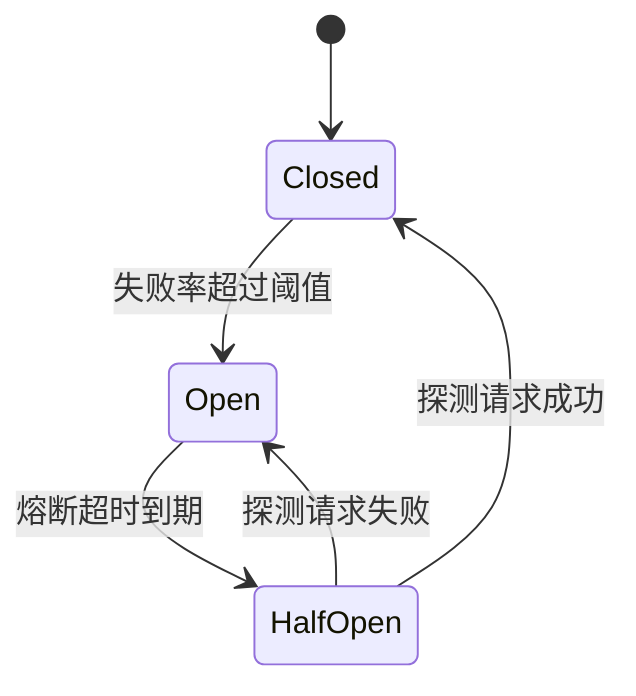
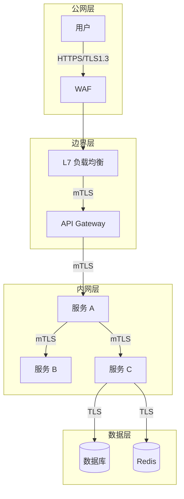

## 常见误区

网络架构设计中，工程师往往在项目初期埋下隐患，直到系统规模扩大或流量高峰到来时才暴露问题。本节系统梳理八大高频误区，每个误区均按照"错误现象→根因分析→正确做法→实战案例"的结构展开，帮助读者建立防御性设计思维，避免在生产环境中重蹈覆辙。

---

### 误区一：缺乏系统性监控，故障发现全靠用户投诉

#### 错误现象

很多团队在架构设计阶段把大量精力放在功能实现上，对监控体系的建设严重滞后。典型表现包括：

- **无链路追踪**：微服务之间的调用关系不明，当请求出现延迟时，无法快速定位是哪个服务、哪个接口出了问题
- **缺少关键指标**：没有监控QPS、延迟分布、错误率、饱和度（USE方法论四大支柱），对系统健康状态缺乏量化认知
- **告警形同虚设**：要么告警阈值设置不合理导致大量噪音（每天几百条告警无人理会），要么关键路径没有告警（真正出事时无人知晓）
- **日志无集中管理**：应用日志分散在各台服务器上，出问题时需要逐台登录排查，效率极低

#### 根因分析

监控缺失的根源往往不是技术能力不足，而是对监控价值的认知不够。开发团队倾向于认为"监控是运维的事"，导致在架构设计阶段完全没有考虑可观测性（Observability）的三大支柱：**指标（Metrics）、日志（Logs）、追踪（Traces）**。当系统出现故障时，缺乏这三者的联动，排查效率极低，平均故障恢复时间（MTTR）可能从分钟级劣化到小时级。

#### 正确做法

**第一层：基础监控（Metric）**

部署 Prometheus + Grafana 作为监控基座，覆盖四大核心指标：

| 指标类别 | 关键指标 | 采集方式 | 告警阈值参考 |
|---------|---------|---------|------------|
| 流量（Traffic） | QPS/TPS、并发连接数 | Prometheus Exporter | 超出日常峰值 200% |
| 延迟（Latency） | P50/P90/P99 响应时间 | 应用埋点 + Histogram | P99 > SLA 目标 2 倍 |
| 错误率（Errors） | HTTP 5xx 比率、超时率 | Nginx/Envoy Access Log | > 0.1% 持续 5 分钟 |
| 饱和度（Saturation） | CPU/内存/磁盘/网络利用率 | node_exporter | CPU > 80% 持续 10 分钟 |

**第二层：分布式追踪（Tracing）**

在微服务架构中部署 OpenTelemetry SDK，实现全链路追踪。每个请求自动生成唯一 TraceID，贯穿所有服务调用，当延迟异常时可以直接定位到具体的服务和 SQL 语句。

# OpenTelemetry Collector 配置示例
receivers:
  otlp:
    protocols:
      grpc:
        endpoint: 0.0.0.0:4317

processors:
  batch:
    timeout: 5s
    send_batch_size: 1000

exporters:
  jaeger:
    endpoint: jaeger-collector:14250

**第三层：日志集中管理（Logging）**

使用 ELK（Elasticsearch + Logstash + Kibana）或 Loki + Grafana 构建集中日志平台。所有应用通过 structured logging 输出 JSON 格式日志，包含 trace_id、span_id、user_id 等关键字段，实现日志与链路追踪的关联。

**告警设计原则：**

- **分级告警**：P0（核心链路不可用 → 电话告警，5分钟内响应）、P1（部分功能降级 → 即时通讯，15分钟响应）、P2（性能劣化 → 邮件，1小时响应）
- **消除噪音**：使用告警聚合（同类告警合并）、静默规则（维护窗口自动静默）、抑制规则（P0 触发时自动抑制同源 P1）
- **定期回顾**：每月Review告警数据，调整阈值，消除"狼来了"效应

---

### 误区二：过早优化，没有数据支撑就盲目调参

#### 错误现象

团队在还没有出现性能问题时，就投入大量时间"预防性优化"：

- 在没有负载测试数据的情况下，把 Nginx 的 `worker_connections` 从默认的 512 万改到 65535，把 `keepalive_timeout` 从 75s 改到 300s
- 在数据库连接池配置中，凭经验把 `max_connections` 设成 500，结果在低流量时浪费资源，在高流量时反而因为锁竞争导致性能下降
- 在服务间通信中盲目启用连接复用和长连接，忽略了某些服务调用频率极低（每天只调用几次），长连接反而增加了维护开销和内存占用
- 对整个应用做全面的"性能优化"，花了几周时间，实际只提升了 2-3% 的吞吐量

#### 根因分析

这是违反"度量先行"原则的典型表现。没有 profiling 数据指导的优化是盲目的——你不知道瓶颈在哪里，就无法有针对性地投入精力。Amdahl 定律告诉我们：系统的整体性能受限于最慢的那个环节，如果你优化的不是瓶颈点，收益微乎其微。

更危险的是，某些"优化"在低流量时看起来有效，在高流量时反而成为瓶颈。例如无限增大连接池会消耗大量内存和文件描述符，在高并发时导致系统资源耗尽。

#### 正确做法

**遵循性能优化四步法：**

1. **建立基线（Baseline）**：用基准测试工具（wrk、k6、JMeter）记录当前系统的 QPS、延迟分布、资源消耗。例如：

```bash
# 用 wrk 建立 HTTP 服务性能基线
wrk -t12 -c400 -d30s --latency http://localhost:8080/api/products

# 输出关注这三行：
# Latency Distribution（延迟分布）
# Requests/sec（吞吐量）
# Transfer/sec（带宽消耗）
```

2. **Profiling 定位瓶颈**：使用专用工具找到真正的性能瓶颈，而不是凭猜测优化。

| 工具 | 适用场景 | 关键输出 |
|-----|---------|---------|
| `perf` (Linux) | CPU 热点函数 | 火焰图，定位 CPU 消耗最高的函数 |
| `pprof` (Go) | Go 应用性能分析 | CPU/内存/阻塞分布 |
| `async-profiler` (Java) | JVM 应用 | CPU/锁/内存分配火焰图 |
| `pgBadger` | PostgreSQL 慢查询 | 慢查询排行、索引使用率 |
| `flamegraph.pl` | 可视化 perf 数据 | 火焰图（纵向=调用栈，横向=采样占比） |

3. **有针对性地优化瓶颈**：只优化 profiling 指出的瓶颈点。经典的"二八定律"——80% 的性能问题集中在 20% 的代码路径上。

4. **验证效果**：优化后重新跑基准测试，确认改善幅度。如果提升不明显，果断回退——保持代码简洁比无谓的优化更重要。

**关键原则：** Don't guess, measure. 没有 profiling 数据支撑的优化，不做。

---

### 误区三：负载均衡策略选择不当

#### 错误现象

负载均衡是网络架构中最核心的组件之一，但策略选择不当会导致严重的资源浪费或流量不均：

- **简单轮询用于异构服务器**：10 台服务器配置不同（4台 16核64G，6台 8核32G），用默认的 round-robin 策略，高配服务器的负载率只有低配的 50%，整体资源利用率不到 60%
- **过度依赖单一负载均衡**：所有流量经过同一个 Nginx 实例，没有冗余。一旦这个 Nginx 挂掉，全站不可用
- **健康检查缺失或配置不合理**：负载均衡器还在往已经宕机的后端转发请求，导致用户请求 50% 失败
- **会话保持策略不一致**：有的服务用 IP Hash，有的用 Cookie，有的用 Token，导致在扩容缩容时出现会话丢失

#### 根因分析

负载均衡策略的选择需要综合考虑后端服务器的异构性、业务的会话需求、故障转移的自动化程度。很多团队在早期使用简单的 round-robin 就能满足需求，随着系统规模扩大和服务器配置多样化，原有的策略不再适用，但没有人及时调整。此外，对负载均衡器本身的高可用设计（主备、多活）也经常被忽视。

#### 正确做法

**根据业务特征选择合适的策略：**

| 策略 | 原理 | 适用场景 | 注意事项 |
|-----|------|---------|---------|
| 轮询（Round Robin） | 按顺序依次分配 | 后端服务器配置一致、无状态服务 | 最简单，但忽略服务器差异 |
| 加权轮询（Weighted RR） | 按权重比例分配 | 后端服务器配置不同 | 权重需根据 CPU/内存/磁盘比例设置 |
| 最少连接（Least Conn） | 分配给当前连接数最少的节点 | 长连接场景（WebSocket、gRPC） | 需要实时感知后端连接数 |
| IP Hash | 同一 IP 固定路由到同一节点 | 需要会话保持的有状态服务 | CDN/NAT 环境下可能不均 |
| 一致性哈希 | 基于请求特征哈希到虚拟节点 | 分布式缓存、数据分片 | 虚拟节点数建议 100-200 个/物理节点 |
| 最短响应时间 | 分配给响应最快的节点 | 对延迟敏感的场景 | 需要持续采样后端响应时间 |

**Nginx 健康检查配置示例：**

```nginx
upstream backend {
    server 10.0.0.1:8080 weight=3 max_fails=3 fail_timeout=30s;
    server 10.0.0.2:8080 weight=2 max_fails=3 fail_timeout=30s;
    server 10.0.0.3:8080 weight=1 backup;  # 备用节点

    # 被动健康检查：连续 3 次失败后暂停转发 30 秒
    # max_fails=3  fail_timeout=30s
}

server {
    location / {
        proxy_pass http://backend;

        # 主动健康检查（Nginx Plus / OpenResty）
        health_check interval=10 passes=2 fails=3;

        # 超时设置（防止慢后端拖垮整个集群）
        proxy_connect_timeout 5s;
        proxy_read_timeout 60s;
        proxy_send_timeout 30s;
    }
}
```

**负载均衡器自身高可用设计：**

- **双活部署**：两个负载均衡器同时运行，通过 VRRP/Keepalived 实现虚拟 IP 漂移
- **DNS 多解析**：同一域名配置多个 A 记录，指向不同的负载均衡器集群
- **分层设计**：DNS → 四层负载均衡（LVS/F5）→ 七层负载均衡（Nginx/Envoy）→ 后端服务，每层都有冗余

---

### 误区四：TCP 参数配置不当导致性能瓶颈

#### 错误现象

TCP 是网络通信的基石，但很多工程师对 TCP 参数的理解停留在"用默认值就好"的阶段：

- **`backlog` 队列太小**：高并发场景下 SYN 队列溢出，新连接直接被丢弃，表现为客户端连接超时。典型症状：`netstat -s | grep -i "listen"` 输出的 `times the listen queue of a socket overflowed` 计数持续增长
- **`tcp_tw_reuse` 未开启**：大量短连接场景下，TIME_WAIT 状态的 socket 占满了可用端口范围（默认 28232 个），导致无法建立新连接。报错信息：`Cannot assign requested address`
- **`tcp_keepalive_time` 设置过长**：默认 7200 秒（2 小时），导致已断开的连接长期占用内存和文件描述符，在使用连接池的场景中，实际可用连接远少于配置的连接池大小
- **`SO_RCVBUF` / `SO_SNDBUF` 未调整**：高吞吐场景下，缓冲区太小导致 TCP 窗口无法充分打开，吞吐量远低于带宽上限。验证方法：`sar -n DEV 1` 观察网卡流量远低于网卡标称速率，但 CPU 已经打满（处理频繁的中断和小包）

#### 根因分析

Linux 内核的 TCP 参数默认值是为通用场景设计的，在高并发、低延迟、长连接等特定场景下往往不是最优解。很多团队在单机开发和测试阶段不会遇到问题，但上生产后流量上来才发现性能瓶颈，此时排查到 TCP 层才发现参数配置不合理，但已经过了最佳的调优窗口。

#### 正确做法

**高并发服务器必调 TCP 参数清单：**

```bash
# /etc/sysctl.conf 或 sysctl -w 动态生效

# 1. 文件描述符相关
net.core.somaxconn = 65535          # listen() backlog 最大值
net.ipv4.tcp_max_syn_backlog = 65535  # SYN 队列最大长度
fs.file-max = 1000000               # 系统级最大文件描述符数

# 2. 端口复用
net.ipv4.tcp_tw_reuse = 1           # 允许复用 TIME_WAIT 端口
net.ipv4.tcp_fin_timeout = 15       # FIN_WAIT_2 超时时间（秒）

# 3. 连接回收
net.ipv4.tcp_keepalive_time = 600   # Keepalive 探测间隔（秒）
net.ipv4.tcp_keepalive_intvl = 15   # 探测失败后的重试间隔
net.ipv4.tcp_keepalive_probes = 5   # 最大探测次数

# 4. 缓冲区优化
net.core.rmem_max = 16777216        # 接收缓冲区最大值（16MB）
net.core.wmem_max = 16777216        # 发送缓冲区最大值（16MB）
net.ipv4.tcp_rmem = 4096 87380 16777216  # TCP 接收缓冲区（最小/默认/最大）
net.ipv4.tcp_wmem = 4096 65536 16777216  # TCP 发送缓冲区（最小/默认/最大）

# 5. 拥塞控制
net.ipv4.tcp_congestion_control = bbr  # 使用 BBR 拥塞控制算法
net.core.default_qdisc = fq           # BBR 推荐的队列调度算法
```

**验证方法：**

```bash
# 查看当前 TIME_WAIT 连接数
ss -s | grep -i "timewait"

# 查看 listen 队列溢出
netstat -s | grep -i "listen"

# 查看 TCP 连接状态分布
ss -ant | awk '{print $1}' | sort | uniq -c | sort -rn

# 验证 BBR 是否生效
sysctl net.ipv4.tcp_congestion_control
# 输出应为：net.ipv4.tcp_congestion_control = bbr
```

**注意：** 参数调优必须配合负载测试验证。不要盲目照搬"最佳实践"参数，因为每台服务器的硬件配置、网络环境、业务特征都不同。调优后要用 wrk/k6 做压测，观察 QPS、延迟、错误率是否真正改善。

---

### 误区五：超时、重试、熔断机制缺失或配置不当

#### 错误现象

在微服务架构中，一个请求可能经过多个下游服务。当下游服务出现故障或响应变慢时，如果没有合理的保护机制，问题会像多米诺骨牌一样向上蔓延：

- **无超时设置**：上游服务调用下游时没有设置超时，当下游响应变慢（比如从 50ms 劣化到 30s），上游线程被长时间阻塞，最终耗尽线程池，导致整个服务不可用。这种现象称为**线程池污染（Thread Pool Pollution）**
- **盲目重试**：下游已经过载，上游还在疯狂重试，导致流量被放大数倍（1次原始请求 + N次重试 = (N+1)倍流量），进一步加剧下游的故障，形成**重试风暴**
- **无熔断机制**：当下游持续失败时，上游继续不断发送请求，这些请求全部失败，白白消耗上游的计算资源（线程、连接、CPU），而无法为正常用户提供服务
- **超时值不合理**：超时时间设得太短（如 100ms），在网络抖动时正常请求也超时；设得太长（如 60s），在下游故障时响应太慢，影响用户体验

#### 根因分析

超时、重试、熔断是分布式系统容错的三道防线。很多团队在系统正常运行时不会想到这些机制，直到出现级联故障才意识到它们的重要性。这三者之间存在紧密的协作关系：超时是第一道防线（快速失败），重试是第二道防线（应对偶发故障），熔断是第三道防线（应对持续故障）。任何一道防线缺失，都可能在故障时引发雪崩效应（Cascading Failure）。

#### 正确做法

**构建完整的容错链路：超时 → 重试 → 熔断 → 降级**

```yaml
# Envoy Proxy 容错配置示例
static_resources:
  clusters:
  - name: payment-service
    connect_timeout: 3s          # 连接超时
    type: STRICT_DNS
    lb_policy: ROUND_ROBIN
    upstream_connection_options:
      tcp_keepalive:
        keepalive_time: 300
    circuit_breakers:
      thresholds:
      - priority: DEFAULT
        max_connections: 1000     # 最大连接数
        max_pending_requests: 500 # 最大等待请求数
        max_requests: 1000       # 最大并发请求数
        max_retries: 3           # 最大重试次数
    outlier_detection:
      consecutive_5xx: 5         # 连续 5 次 5xx 触发熔断
      interval: 10s              # 检测间隔
      base_ejection_time: 30s    # 基础熔断时长
      max_ejection_percent: 50   # 最多熔断 50% 的后端节点

  # 重试策略
  retry_policy:
    retry_on: "5xx,reset,connect-failure"
    num_retries: 2               # 最多重试 2 次（含首次共 3 次）
    per_try_timeout: 2s          # 每次尝试的超时时间
```

**超时设置经验值：**

| 场景 | 建议超时值 | 说明 |
|-----|-----------|------|
| 内部服务调用（同机房） | 3-5s | 正常响应应在 500ms 内，超时应远大于正常响应 |
| 跨机房调用 | 5-10s | 考虑网络延迟波动 |
| 数据库查询 | 3-5s | 超过此值应优化查询而非增加超时 |
| 外部 API 调用 | 10-30s | 外部服务不可控，需设置合理上限 |
| 文件上传/下载 | 30-120s | 根据文件大小动态调整 |

**重试设计原则：**

- **指数退避（Exponential Backoff）**：重试间隔指数增长（1s → 2s → 4s），避免短时间内大量重试冲击下游
- **加随机抖动（Jitter）**：在退避基础上增加随机偏移，避免多个客户端在同一时刻重试（惊群效应）
- **只重试可重试的错误**：连接超时、502/503/504 可以重试，400/401/403/404 不应重试，超时后的重试要特别谨慎（可能导致重复操作）
- **限制总重试预算**：设置重试预算（Retry Budget），例如重试请求不超过总请求的 10%

```python
# Python 示例：带指数退避和抖动的重试
import random
import time

def retry_with_backoff(func, max_retries=3, base_delay=1.0, max_delay=30.0):
    for attempt in range(max_retries + 1):
        try:
            return func()
        except Exception as e:
            if attempt == max_retries:
                raise
            # 指数退避 + 随机抖动
            delay = min(base_delay * (2 ** attempt), max_delay)
            jitter = random.uniform(0, delay * 0.5)
            time.sleep(delay + jitter)
```

**熔断器三态模型：**



- **Closed（正常）**：请求正常转发，同时统计失败率
- **Open（熔断）**：所有请求直接失败（快速失败），不再调用下游
- **HalfOpen（探测）**：放行少量请求探测下游是否恢复

---

### 误区六：DNS 配置和管理被忽视

#### 错误现象

DNS 是互联网最基础的服务，但在网络架构设计中经常被忽视：

- **DNS TTL 设置过高**：配置了 24 小时的 TTL，当需要切换服务器时，全球 DNS 缓存需要 24 小时才能全部更新，期间部分用户访问到旧 IP
- **无 DNS 故障转移**：只配置了单个 DNS 服务器，一旦该 DNS 出故障，所有依赖域名解析的服务全部不可用
- **DNS 解析延迟未监控**：没有监控 DNS 解析耗时，当 DNS 服务变慢时（比如上游 DNS 被污染或 DDoS），表现为所有 HTTP 请求都变慢，但服务端没有任何异常
- **内部服务硬编码 IP**：服务间调用直接使用 IP 地址，当服务器迁移或扩缩容时，需要修改所有调用方的配置

#### 根因分析

DNS 有"全局单点"的特性——任何一个环节出问题（DNS 服务器故障、DNS 缓存污染、ISP DNS 劫持），影响范围都是全局的。更隐蔽的是，DNS 的问题往往不会直接报错，而是表现为各种"莫名其妙"的症状：间歇性超时、部分地区无法访问、SSL 证书校验失败（域名解析到了错误的 IP）等。

#### 正确做法

**DNS 高可用设计：**

- **多 DNS 提供商**：主用 Cloudflare DNS，备用 AWS Route53 或阿里云 DNS，实现 DNS 层面的冗余
- **低 TTL 策略**：常规 TTL 设为 300-600 秒（5-10 分钟），故障切换时临时降至 60 秒
- **DNS 监控**：定期探测 DNS 解析时间和成功率，使用 `dig` 或专用监控工具

```bash
# 监控 DNS 解析耗时
dig @8.8.8.8 example.com +stats | grep "Query time"

# 监控多个 DNS 服务器的一致性
for dns in 8.8.8.8 1.1.1.1 223.5.5.5; do
    echo -n "DNS $dns: "
    dig @$dns example.com +short
done
```

**内部服务发现替代硬编码 IP：**

| 方案 | 适用场景 | 优势 | 劣势 |
|-----|---------|------|------|
| Consul | 中大规模微服务 | 健康检查 + KV 存储 + DNS | 运维复杂度较高 |
| etcd | Kubernetes 环境 | 与 K8s 深度集成 | 不适合非 K8s 环境 |
| CoreDNS | Kubernetes 集群内 | K8s 默认 DNS，轻量 | 仅适合集群内服务发现 |
| Nginx upstream | 小规模部署 | 简单直接，无额外依赖 | 扩缩容需手动更新配置 |

---

### 误区七：网络安全配置缺失或过度

#### 错误现象

网络安全配置呈现两个极端：

**极端一：安全配置缺失**

- 内部服务间通信未加密（明文 HTTP），一旦内网被攻破，所有通信内容暴露
- 未实施最小权限原则：所有服务都能访问所有数据库，被入侵时横向移动无阻碍
- 缺少 WAF（Web 应用防火墙），SQL 注入、XSS 等攻击直接到达后端服务
- API 未做限流，恶意用户可以无限次调用，消耗大量计算资源

**极端二：安全配置过度**

- 所有通信强制 mTLS（双向 TLS），在内网环境中增加了大量不必要的证书管理开销和延迟（TLS 握手需要 1-2 个 RTT）
- WAF 规则过于严格，大量正常请求被误拦截，运维团队频繁手动放行
- 过度的 IP 白名单策略，每次新增服务都需要申请放行，严重拖慢交付速度
- 在已经隔离的内网环境中仍然部署多层安全代理，增加了 3-5ms 的额外延迟

#### 根因分析

安全和性能之间需要找到平衡点。过度忽视安全会导致数据泄露和服务被攻击，过度强调安全会严重影响系统性能和运维效率。正确的做法是根据数据敏感度和网络环境分级实施安全策略——公网入口严格防护，内网通信适度加密，可信环境减少冗余安全层。

#### 正确做法

**分层安全架构：**



**安全策略分级：**

| 网络区域 | 认证方式 | 加密方式 | 限流策略 | 审计日志 |
|---------|---------|---------|---------|---------|
| 公网入口 | OAuth2/JWT | TLS 1.3 | 严格限流（100 QPS/用户） | 全量记录 |
| 边界层（DMZ） | mTLS | TLS 1.2+ | 中等限流 | 关键操作记录 |
| 内网服务间 | mTLS 或 Token | 内网 TLS | 宽松限流 | 错误和慢查询记录 |
| 数据库访问 | 数据库账号 + IP 白名单 | TLS | 不限流（内部） | SQL 审计 |

**实用安全加固清单：**

1. **公网入口**：WAF + Rate Limiting + DDoS 防护（Cloudflare/AWS Shield）+ GeoIP 过滤
2. **API Gateway**：认证鉴权 + 请求校验 + API 版本管理 + 全局限流
3. **服务间通信**：mTLS（或 Service Mesh 统一管理）+ 服务身份认证
4. **数据库访问**：最小权限 + 连接加密 + SQL 审计日志

---

### 误区八：忽略网络架构的可观测性和混沌工程

#### 错误现象

很多团队在部署了完善的监控之后就认为"万事大吉"，但缺乏主动验证系统容错能力的机制：

- **从未做过故障注入**：不清楚系统在某个节点宕机、网络延迟增加、磁盘满等场景下的真实表现。所有关于"系统能承受故障"的结论都是推测，而非实测
- **没有网络拓扑可视化**：随着服务数量增加，调用关系变得复杂，没有人能完整说出"服务 A 调用了哪些下游"、"服务 B 挂了会影响哪些上游"
- **缺乏容量规划**：没有定期评估系统在峰值流量下的承载能力，扩容决策依赖经验和猜测
- **灾备从未验证**：部署了主备架构，但从未做过主备切换演练。真出故障时才发现备库数据不一致、VIP 漂移失败等问题

#### 根因分析

"经得起故障考验"和"理论上能容错"是两回事。很多系统在正常运行时表现完美，但在故障场景下暴露大量问题。Netflix 的 Chaos Monkey 和国内各大厂的混沌工程实践证明：只有通过持续的故障注入演练，才能真正发现和修复系统的薄弱环节。"你无法修复你不知道存在的问题。"

#### 正确做法

**混沌工程四步法：**

1. **定义稳态（Steady State）**：明确系统正常运行时的关键指标（如 QPS > 10000，P99 < 200ms，错误率 < 0.1%）
2. **假设（Hypothesis）**：提出假设，例如"当某个数据库从库宕机时，读请求会被路由到主库，系统整体 QPS 不会下降超过 10%"
3. **注入故障（Experiment）**：使用工具（Chaos Mesh、Litmus Chaos、AWS Fault Injection Simulator）模拟故障场景
4. **观察并修复（Observe & Fix）**：观察系统是否符合预期，发现偏差后修复问题，直到系统真正达到容错目标

**推荐混沌实验场景（网络架构相关）：**

| 实验场景 | 模拟方法 | 验证目标 |
|---------|---------|---------|
| 网络延迟注入 | tc netem delay 200ms | 超时重试机制是否生效 |
| 网络分区 | iptables DROP 规则 | 服务降级是否正常 |
| DNS 故障 | 修改 /etc/resolv.conf | DNS 缓存和故障转移是否生效 |
| 负载均衡节点宕机 | 直接 kill 负载均衡进程 | 自动故障转移是否正常 |
| 后端服务全部不可用 | 批量停止后端 Pod | 熔断和降级兜底是否正常 |
| 带宽受限 | tc netem rate 100kbit | 慢网络下的用户体验和超时处理 |

**容量规划实践：**

- **定期压测**：每季度进行一次全链路压测，找到系统的容量天花板
- **容量水位线**：日常流量不超过容量的 60%，为突发流量留出 40% 的缓冲空间
- **自动扩缩容**：基于 CPU/内存/QPS 等指标设置自动扩缩容策略，确保在流量波动时系统能自动调整

---

### 误区总结

| 误区 | 核心问题 | 正确做法 | 优先级 |
|-----|---------|---------|-------|
| 缺乏监控 | 故障发现靠用户投诉 | Metrics + Tracing + Logging 三支柱 | ★★★★★ |
| 过早优化 | 没有数据就盲目调参 | 先 profiling，再针对性优化 | ★★★★☆ |
| 负载均衡不当 | 策略选择与业务不匹配 | 根据场景选择策略 + 健康检查 | ★★★★★ |
| TCP 参数问题 | 用默认值应对高并发 | 根据场景调优 + 负载测试验证 | ★★★★☆ |
| 容错机制缺失 | 级联故障导致雪崩 | 超时 + 重试 + 熔断三道防线 | ★★★★★ |
| DNS 管理忽视 | DNS 故障导致全局不可用 | 多 DNS + 低 TTL + 服务发现 | ★★★☆☆ |
| 安全配置失衡 | 要么裸奔要么过度防护 | 分层安全 + 按数据敏感度分级 | ★★★★☆ |
| 缺乏验证 | 容错只是理论而非实测 | 混沌工程 + 容量规划 | ★★★☆☆ |

**最后的忠告：** 网络架构的误区往往不是"做错了什么"，而是"漏做了什么"。在架构设计阶段，把上述八个方面逐一审视，建立 Checklist，在每次架构评审时逐项确认。网络架构的质量不是一次设计出来的，而是在持续的监控、测试、优化中逐步提升的。
