## 本章小结

网络架构是现代分布式系统的骨架。从单体应用到微服务，从本地部署到全球分发，网络架构的设计直接决定了系统的可用性、扩展性和安全性。本章从理论基础出发，系统覆盖了负载均衡、反向代理、CDN、服务网格、API Gateway、网络安全、服务发现、熔断限流、网络拓扑等核心主题，帮助读者建立起从单机到全球分布的完整网络架构知识体系。

---

### 一、核心知识体系回顾

#### 1. 负载均衡——流量分发的基石

负载均衡是网络架构最核心的基础设施。其本质是将请求合理分配到多台后端服务器，突破单机性能天花板，实现水平扩展、高可用和资源优化。

**七种负载均衡算法**，各有适用边界：

| 算法 | 核心思想 | 时间复杂度 | 需要状态 | 最佳场景 |
|------|---------|-----------|---------|---------|
| 轮询（Round Robin） | 按顺序循环分配 | O(1) | 否 | 服务器同构、请求均匀 |
| 加权轮询（Weighted RR） | 按权重比例分配，Nginx平滑实现避免突刺 | O(n) | 否 | 服务器性能差异大 |
| 最少连接（Least Connections） | 分配给当前活跃连接最少的节点 | O(n) | 是 | 请求处理时间差异大 |
| 加权最少连接 | score = active_conns / weight，选最小值 | O(n) | 是 | 通用场景的最安全默认选择 |
| 一致性哈希（Consistent Hashing） | 哈希环+虚拟节点，节点增减只影响相邻区间 | O(log n) | 否 | 分布式缓存、有状态服务 |
| IP Hash | 客户端IP哈希→固定服务器 | O(1) | 否 | 需要会话保持（已被Cookie方案替代） |
| 最短响应时间 | 分配给平均响应时间最短的节点 | O(n) | 是 | 后端性能动态变化 |

**算法选型决策**：大多数场景下，加权最少连接是最安全的默认选择。它同时考虑了服务器权重和当前负载，适应性最强。只有在明确需要会话亲和性或缓存命中率优化时，才选择一致性哈希。

**负载均衡层级**：

| 维度 | L4（传输层） | L7（应用层） |
|------|-------------|-------------|
| 信息粒度 | IP + 端口 | URL/Header/Cookie/Method |
| 性能 | 极高（内核态，百万级PPS） | 较高（用户态，十万级QPS） |
| 灵活性 | 低 | 高（内容路由、SSL终结、协议改写） |
| 典型方案 | LVS、AWS NLB | Nginx、HAProxy、Envoy、AWS ALB |
| 延迟 | < 0.1ms | 0.5 - 2ms |

实际部署中常采用 **L4 + L7 分层架构**：LVS/云LB做L4入口高性能转发，Nginx/Envoy做L7精细路由，各司其职。

**主流负载均衡方案对比**：

| 方案 | 类型 | 性能 | 核心优势 | 适用场景 |
|------|------|------|---------|---------|
| Nginx | L7软件 | 数十万QPS | 生态成熟、功能全面 | 通用Web服务 |
| HAProxy | L4+L7软件 | 更优纯LB性能 | 健康检查精细、ACL灵活 | 数据库代理、SMTP |
| LVS | L4内核 | 百万级PPS | 内核态转发，性能天花板 | 大规模入口 |
| Envoy | L7代理 | 十万级QPS | 动态配置、Service Mesh原生 | Kubernetes微服务 |
| Traefik | L4+L7 | 高 | 自动发现、零配置 | 容器化快速部署 |
| Cilium | L3-L7 | 极高 | eBPF内核态，延迟低50-70% | 大规模K8s集群 |

---

#### 2. 反向代理——流量入口的关键组件

反向代理位于用户和后端服务之间，承担流量转发、安全隔离、性能优化等职责。

**Nginx**：事件驱动异步架构，单进程处理数万并发连接。核心能力包括HTTP/HTTPS反向代理、L7负载均衡（7种算法）、SSL终结（TLS 1.3）、限流（limit_req/limit_conn）、多级缓存。Master-Worker进程模型，内存占用约2.5MB/万连接。

**HAProxy**：专注于高性能负载均衡的单进程事件驱动代理。零拷贝转发（sendfile），支持TCP和HTTP两种模式，内置连接排队机制和丰富的统计页面。在纯负载均衡场景下性能通常优于Nginx。

**Envoy**：Lyft开源的云原生L7代理，Service Mesh数据面事实标准。原生支持HTTP/2和gRPC，Filter链式处理架构可扩展性强，xDS API实现动态配置无需重启。核心概念包括Listener（监听器）、Cluster（集群）、Route（路由）、Filter（处理链）。

**Cilium（eBPF方案）**：传统代理工作在用户态，每次请求需内核态→用户态→内核态的上下文切换。Cilium利用eBPF在内核态直接执行网络逻辑，绕过用户态代理，延迟降低50-70%，无需Sidecar，资源开销极低。适合大规模Kubernetes集群（>500节点）和延迟敏感场景。

---

#### 3. CDN——内容分发的加速器

CDN通过全球部署的边缘节点将内容推送到离用户最近的位置，是提升用户体验和降低源站压力的关键基础设施。

**节点层级**：边缘节点（直接服务用户，缓存命中率通常>80%）→ 区域节点（汇聚多个边缘节点的请求）→ 源站（内容原始来源）。

**回源机制与防护**：
- **合并回源（Request Coalescing）**：同一内容的多个并发请求合并为一次回源，防止缓存击穿
- **Stale-while-revalidate**：返回过期缓存同时异步刷新，兼顾体验和数据新鲜度
- **缓存预热**：大促前将热门内容提前推送到边缘节点

**缓存键设计原则**：静态资源忽略query params（`style.css?v=123`和`style.css`应命中同一缓存）；API响应保留关键query params；避免包含session_id、时间戳等高变异字段。

**动态加速技术**：路由优化（Cloudflare Argo Smart Routing）、TCP优化（BBR拥塞控制替代Cubic）、协议优化（HTTP/2多路复用、QUIC/HTTP/3、TLS 1.3 0-RTT）、边缘计算（Cloudflare Workers、Lambda@Edge）。

**HTTP/3与QUIC**：QUIC基于UDP，解决了HTTP/2的TCP层队头阻塞问题。核心优势包括0-RTT连接建立（TCP+TLS 1.3至少2-RTT）、无队头阻塞（单流丢包不影响其他流）、连接迁移（基于Connection ID，WiFi切4G不中断）、内置TLS 1.3加密。

---

#### 4. 微服务网络架构

微服务架构将单体应用拆分为多个独立服务，带来了新的网络挑战：服务发现、负载均衡、熔断降级、链路追踪、API版本管理。

**服务网格（Service Mesh）**：将网络通信逻辑（负载均衡、熔断、安全、可观测性）从应用代码解耦到基础设施层。通过Sidecar代理拦截所有进出流量，业务代码无需感知网络层。

**核心组件对比**：

| 特性 | Istio | Linkerd | Cilium |
|------|-------|---------|--------|
| 数据面 | Envoy（C++） | linkerd2-proxy（Rust） | eBPF内核态 |
| 控制面 | istiod | linkerd-destination | Cilium Agent |
| 资源占用 | 较高 | 低 | 极低 |
| 功能丰富度 | 最全 | 够用 | L3-L7策略 |
| 适用规模 | 大集群（>100节点） | 中小集群 | 大规模集群 |

**Sidecar模式的代价与演进**：每个Sidecar带来1-3ms额外延迟和50-100MB内存开销。演进方向包括Ambient Mesh（节点级代理替代Per-pod Sidecar）、eBPF代理（完全消除Sidecar）、Proxyless gRPC（gRPC原生集成xDS）。

**xDS协议族**：LDS（监听器）、RDS（路由）、CDS（集群）、EDS（端点发现，秒级更新）、SDS（证书分发）、ADS（聚合推送保证原子性）。

**API Gateway**：微服务架构的统一入口，承担路由、限流、熔断、认证鉴权（API Key/JWT/OAuth 2.0/mTLS）、请求转换（协议转换、响应聚合）等职责。Kong、APISIX、Envoy Gateway是主流选择，APISIX在性能和动态配置方面表现突出。

---

#### 5. 服务发现与容错

**两种发现模式**：
- **客户端发现**：客户端直接查询注册表获取实例列表（如Netflix Eureka + Ribbon），少一跳延迟低但客户端逻辑复杂
- **服务端发现**：通过负载均衡器/路由器代理查询（如AWS ALB + ECS、K8s Service），客户端简单但多一跳

**注册中心对比**：

| 特性 | Consul | etcd | ZooKeeper | Nacos |
|------|--------|------|-----------|-------|
| 一致性协议 | Raft | Raft | ZAB | Raft |
| 健康检查 | 内置多种 | 需自行实现 | Session心跳 | 内置多种 |
| 多数据中心 | 原生支持 | 不支持 | 不支持 | 支持 |
| 语言 | Go | Go | Java | Java |

**选择建议**：已有K8s优先用K8s Service + CoreDNS；需要多数据中心选Consul；Java生态选Nacos或ZooKeeper；追求轻量选etcd。

**限流算法**：

| 算法 | 平滑性 | 突发处理 | 内存开销 | 核心特点 |
|------|--------|---------|---------|---------|
| 令牌桶 | 好 | 允许突发 | 低 | 以固定速率填充令牌，请求消耗令牌 |
| 漏桶 | 极好 | 不允许 | 低 | 以固定速率流出，强制流量整形 |
| 滑动窗口 | 好 | 可控 | 中 | 加权计算前一窗口剩余比例+当前窗口 |
| 固定窗口 | 差 | 边界突发 | 最低 | 简单计数，窗口边界有突发问题 |

**熔断器三状态机**：CLOSED（正常通过，统计失败）→ OPEN（达到阈值，快速失败）→ HALF_OPEN（超时后放行探测，成功则恢复CLOSED，失败则重新OPEN）。关键参数：失败率阈值（建议50%）、滑动窗口大小（建议≥100）、半开状态允许调用数（建议5）。

**降级策略**：返回缓存数据（读多写少）、返回默认值（有合理默认值）、排队提示（写操作）、部分功能降级（关闭非核心保核心）。

---

#### 6. 网络安全架构

**纵深防御体系**：

| 层级 | 防护机制 | 核心职责 |
|------|---------|---------|
| L7 | WAF（Web应用防火墙） | 检测SQL注入、XSS、CSRF、命令注入等 |
| L4-L7 | DDoS防护 | 流量清洗、Anycast分散、SYN Cookie |
| 传输层 | TLS 1.3 / mTLS | 加密传输、双向身份验证 |
| 网络层 | 防火墙与网络隔离 | DMZ分区、微隔离、最小权限 |
| 架构层 | 零信任网络（Zero Trust） | 永不信任始终验证、最小权限、持续监控 |

**零信任核心原则**（NIST SP 800-207）：永不信任始终验证——无论请求来自内网还是外网；最小权限——每个身份只授予完成工作所需的最小权限；假设已被入侵——通过微分段限制攻击横向移动。

**mTLS在服务网格中的应用**：Sidecar代理自动处理证书协商和mTLS加密，业务代码无需感知。Istio Citadel自动管理证书签发和轮换，但证书吊销在大规模系统中仍是挑战。

---

#### 7. 网络拓扑设计

**从传统三层到Spine-Leaf**：

| 架构 | 跳数 | 带宽利用 | 扩展性 | 适用规模 |
|------|------|---------|--------|---------|
| 传统三层 | 可变（2-6跳） | 低（STP阻塞冗余链路） | 差 | 中小型 |
| Spine-Leaf | 固定两跳 | 高（ECMP充分利用所有链路） | 好 | 大型数据中心 |
| Clos/胖树 | 可扩展 | 极高（无阻塞） | 极好 | 超大规模 |

**关键数据**：Spine-Leaf架构中，任意两台服务器间最多经过两跳（Leaf→Spine→Leaf），延迟可预测。增加Spine提高带宽，增加Leaf扩大规模，两者解耦。Fat-Tree（k=4）用20台交换机连接16台服务器，实现无阻塞通信。

---

### 二、关键公式与性能模型

本章涉及的核心数学模型和经验公式：

| 概念 | 公式/模型 | 说明 |
|------|-----------|------|
| Little定律 | QPS = 并发数 / 平均延迟 | 负载均衡容量规划基础 |
| TCP最大吞吐 | 最大吞吐量 ≈ 窗口大小 / RTT | 解释高带宽长距离链路需要窗口缩放 |
| 一致性哈希均匀性 | 虚拟节点≥100时，标准差≤5% | 虚拟节点数量的工程经验值 |
| SLA可用性 | SLA = 正常时间 / 总时间 | 99.9% = 8.76小时/年，99.99% = 52.6分钟/年 |
| 尾延迟 | P99 = 排序后第99百分位值 | 1%用户的最差体验，比平均值更有意义 |
| 容量规划 | 总资源需求 = QPS × 单次请求资源 | 确保集群资源满足峰值需求 |
| 加权最少连接评分 | score = active_connections / weight | 选择score最小的节点，权重为3的6连接与权重1的2连接等价 |
| 平滑加权轮询 | 当前权重+=权重，选最大，减去总权重 | Nginx实现，序列`A,B,A,C,A,B`比`A,A,A,A,A,B,B,B,C,C`更平滑 |

---

### 三、关键设计原则

1. **分层设计，各司其职**：L4+L7分层，DNS+GSLB+本地LB分层，边缘→区域→源站缓存分层。每层只做自己最擅长的事，避免单一组件承担过多职责。

2. **冗余消除单点故障**：每个关键组件都要考虑高可用——负载均衡器双活（Keepalived/VRRP）、注册中心集群（Raft/ZAB）、Redis哨兵/集群、数据库主从。单一故障不应导致服务不可用。

3. **渐进式架构演进**：从简单方案开始（Nginx单机），按需引入复杂方案（LVS+Keepalived→Service Mesh），避免过度设计。架构应该随业务规模演进而演进。

4. **可观测性优先**：监控（Prometheus+Grafana）、追踪（Jaeger/Zipkin）、日志（ELK/Loki）缺一不可。无法观测就无法运维，无法度量就无法优化。Golden Metrics：请求速率、错误率、延迟分布（P50/P95/P99）、流量。

5. **安全纵深防御**：多层防护（WAF+TLS+网络隔离+微隔离），不依赖单一机制。零信任是终极目标——假设内网不可信，每次访问都验证。

6. **没有银弹，每个决策都是权衡（Trade-off）**：
   - 性能 vs 灵活性（L4 vs L7）
   - 一致性 vs 可用性（CAP定理）
   - 安全 vs 便利性（mTLS增加1-2ms延迟但保障通信安全）
   - 简单 vs 功能（Nginx简单稳定 vs Envoy功能丰富但复杂）

---

### 四、术法道贯通

**术——具体技术操作**：
- Nginx upstream配置：算法选择、权重设置、keepalive连接池、proxy_next_upstream故障转移
- Envoy Filter链设计：Network Filter → HTTP Connection Manager → HTTP Filter 的请求处理顺序
- Istio流量管理：VirtualService金丝雀发布、超时重试配置、故障注入测试
- 限流熔断参数：令牌桶Lua脚本、Resilience4j/Sentinel配置、Redis分布式限流
- CDN缓存策略：Cache-Control头部设计、缓存键优化、Stale-while-revalidate
- 网络安全规则：WAF三层规则设计、Kubernetes NetworkPolicy、mTLS证书管理

**法——方法论与决策框架**：
- 负载均衡算法选择原则：根据服务器同构性、请求处理时间差异、会话需求三维决策
- 服务网格引入决策：规模>100节点+多语言+需要统一治理→Istio；中小规模+追求简单→Linkerd；仅需网络策略→Cilium
- 限流熔断组合策略：先熔断检查→再限流检查→调用下游→更新状态
- 健康检查层次设计：L4（端口可达，5-10s间隔）+ L7（HTTP 200，10-30s间隔）+ 深度检查（业务链路，30-60s间隔）
- 网络拓扑规模计算：Spine-Leaf容量 = Spine数 × 每Leaf上行链路带宽

**道——本质认知**：
- 网络架构的本质是在**可靠性、性能和复杂度**之间寻找最优平衡
- 分布式系统中网络是不可靠的（Leslie Lamport），所有设计都必须考虑网络故障
- 架构应该随业务演进而演进，简单优于复杂（KISS原则），但不能以牺牲必要功能为代价
- 监控先行——没有度量基线的优化是盲目的，无法量化效果的优化是无意义的

---

### 五、最佳实践清单

**设计阶段**：
- [ ] 明确性能指标要求（QPS、P99延迟、可用性SLA）
- [ ] 根据业务特征选择负载均衡算法（加权最少连接是安全默认值）
- [ ] 设计分层架构（L4入口 + L7路由 + 应用层处理）
- [ ] 规划服务发现和注册中心方案
- [ ] 设计容错和降级方案（熔断器参数、降级响应模板）
- [ ] 制定安全策略（TLS/mTLS、WAF规则、网络隔离）
- [ ] 评估服务网格引入的必要性和时机

**实现阶段**：
- [ ] Nginx配置keepalive连接池和proxy_next_upstream故障转移
- [ ] 配置多层健康检查（L4 + L7 + 深度）
- [ ] 实现分布式限流（Redis+Lua令牌桶）和降级策略
- [ ] CDN缓存键设计：静态资源忽略query params，API保留关键参数
- [ ] 配置WAF三层规则：基础防护→增强防护→自定义规则
- [ ] 编写单元测试覆盖限流熔断逻辑

**部署阶段**：
- [ ] Linux内核网络参数调优（somaxconn、tcp_tw_reuse、BBR拥塞控制）
- [ ] 负载均衡器高可用部署（Keepalived双活）
- [ ] 配置完善的监控（Prometheus + Grafana Golden Metrics）
- [ ] 制定回滚方案（灰度发布、一键回滚）
- [ ] 进行压力测试（wrk/k6/Locust）建立性能基线

**运维阶段**：
- [ ] 定期检查监控告警，分析性能趋势
- [ ] CDN命中率监控（目标>95%），低于阈值排查原因
- [ ] 熔断器参数根据实际流量调优（阈值设为正常失败率的2-3倍）
- [ ] 证书轮换自动化（Istio Citadel / Let's Encrypt）
- [ ] 定期进行故障演练（Istio故障注入、Chaos Engineering）
- [ ] 更新架构文档，记录变更原因和效果

---

### 六、常见误区与纠正

| 误区 | 正确认知 | 正确做法 |
|------|---------|---------|
| "带宽越大越好" | 实际吞吐量受延迟、丢包、TCP窗口等多因素约束。1Gbps带宽跨洲传输实际吞吐可能只有几Mbps | 用Little定律计算实际容量，启用BBR和窗口缩放 |
| "HTTP/2解决一切性能问题" | HTTP/2解决了应用层队头阻塞，但TCP层队头阻塞仍在 | 高丢包环境升级到HTTP/3+QUIC |
| "内网通信不需要加密" | 零信任模型下内网同样需要加密，攻击者突破边界后内网明文通信是透明的 | 实施mTLS，至少对敏感服务强制加密 |
| "负载均衡越靠近用户越好" | 需根据场景选择——全局负载（DNS/Anycast）适合跨地域调度，本地负载（Nginx/LVS）适合同机房分流 | 设计分层负载：DNS GSLB → 机房入口LB → 服务间LB |
| "熔断阈值设得越低越好" | 阈值过低会导致正常波动触发误熔断，反而降低可用性 | 阈值设为正常失败率的2-3倍，窗口≥100 |
| "Service Mesh能解决所有微服务问题" | Sidecar带来1-3ms延迟和50-100MB内存开销，复杂度显著增加 | 评估实际需求，中小规模可能不需要Service Mesh |
| "CDN配置好就不用管" | CDN配置需要持续优化，缓存策略、缓存键、回源策略都需要根据业务变化调整 | 监控命中率和回源带宽，定期审计缓存策略 |
| "限流只需要一个全局阈值" | 不同API、不同用户的限流需求不同，单一阈值会导致误杀或漏杀 | 多维度限流：按API、按用户、按IP分别设置 |

---

### 七、知识图谱与学习路径

```mermaid
graph TD
    A[第20章 网络架构] --> B[理论基础]
    A --> C[核心技巧]
    A --> D[实战案例]
    A --> E[常见误区]
    
    B --> B1[负载均衡算法<br/>轮询/加权/最少连接/一致性哈希]
    B --> B2[负载均衡层级<br/>L4 vs L7 vs DNS]
    B --> B3[反向代理<br/>Nginx/HAProxy/Envoy/Cilium]
    B --> B4[CDN架构<br/>边缘/回源/缓存/HTTP3]
    B --> B5[微服务网络<br/>Service Mesh/xDS/API Gateway]
    B --> B6[网络安全<br/>WAF/DDoS/零信任/mTLS]
    B --> B7[服务发现<br/>客户端/服务端/DNS/注册中心]
    B --> B8[熔断限流<br/>令牌桶/漏桶/滑动窗口/状态机]
    B --> B9[网络拓扑<br/>Spine-Leaf/Clos/胖树]
    
    C --> C1[算法选型决策]
    C --> C2[Nginx最佳配置]
    C --> C3[Envoy Filter链]
    C --> C4[Istio流量管理]
    C --> C5[分布式限流实现]
    C --> C6[WAF规则设计]
    
    D --> D1[案例一：电商大促全链路优化<br/>P99从1200ms→55ms]
    D --> D2[案例二：微服务Service Mesh问题<br/>conntrack/跨AZ/连接池]
    D --> D3[案例三：全球分发网络设计<br/>多地域容灾]
```

**与前后章节的关系**：
- **前置知识**：第18章（TCP/IP协议栈）提供传输层基础，第19章（应用层协议）提供HTTP/gRPC协议基础
- **后续延伸**：第21章（分布式理论）和第22章（分布式共识）依赖本章的网络基础设施进行分布式系统设计；第36章（高并发技术）中的限流、熔断等模式是本章的直接应用
- **横向关联**：第15章（容器化技术）中的Kubernetes网络模型与本章的Service Mesh、NetworkPolicy紧密相关

---

### 八、下一步学习建议

**深入方向**：

1. **源码阅读**：阅读Nginx源码的`ngx_http_upstream_get_peer`理解平滑加权轮询实现；阅读Envoy源码理解xDS协议和Filter链处理；阅读Cilium源码理解eBPF网络转发

2. **论文研究**：Karger et al. "Consistent Hashing"（STOC 1997）——一致性哈希的数学基础；NIST SP 800-207 "Zero Trust Architecture"——零信任的权威定义；Leiserson "Fat-Trees"（IEEE TC 1985）——数据中心网络拓扑

3. **实践项目**：用Nginx搭建完整的L4+L7负载均衡架构；用Docker Compose模拟Service Mesh（Istio/Linkerd）；用Redis+Lua实现分布式限流；用k6/Locust进行压力测试并优化

4. **社区参与**：CNCF（Cloud Native Computing Foundation）关注Service Mesh和eBPF生态；Nginx社区和Envoy社区的邮件列表和GitHub讨论

**推荐资源**：

| 类别 | 资源 | 说明 |
|------|------|------|
| 经典书籍 | 《Designing Data-Intensive Applications》Kleppmann | 分布式系统设计的圣经，网络章节深入 |
| 经典书籍 | 《Release It!》Nygard | 熔断、限流、舱壁隔离等稳定性模式的权威来源 |
| 经典书籍 | 《Computer Networks》Tanenbaum | 网络协议和架构的教科书级参考 |
| 中文著作 | 《大型网站技术架构》李智慧 | 国内互联网架构实践的系统总结 |
| 中文著作 | 《凤凰架构》周志明 | 云原生架构演进的全面梳理 |
| 官方文档 | Nginx Documentation | 反向代理和负载均衡配置的权威参考 |
| 官方文档 | Istio Documentation | Service Mesh流量管理和安全配置 |
| 官方文档 | Envoy Proxy | xDS协议和Filter链开发 |
| 开源项目 | Cilium | eBPF网络和安全方案 |
| 监控工具 | Prometheus + Grafana | 网络架构可观测性的标准方案 |

---

### 九、思考题

1. **基础理解**：负载均衡的L4和L7层各有什么优缺点？在什么场景下应该选择L4，在什么场景下应该选择L7？能否给出一个同时需要两层的实际架构设计？

2. **算法选型**：一个电商平台的商品详情页服务有10台服务器，配置为3台高配（16核/64GB）+ 4台中配（8核/32GB）+ 3台低配（4核/16GB）。请求处理时间从5ms到500ms不等（图片处理请求较慢）。应该选择什么负载均衡算法？为什么？

3. **架构设计**：设计一个支持百万级QPS的电商秒杀系统的网络架构。需要考虑：DNS调度、CDN缓存、负载均衡分层、服务网格、限流熔断、安全防护。画出完整的架构图并说明每个组件的选型理由。

4. **问题排查**：某微服务系统的P99延迟从5ms突然飙升到200ms，但平均延迟正常。可能的原因有哪些？请按照"网络层→传输层→应用层"的顺序给出排查步骤和对应的诊断命令。

5. **权衡分析**：Istio Service Mesh提供了强大的流量管理和安全能力，但引入Sidecar会增加1-3ms延迟和50-100MB内存开销。对于一个200个微服务、日均5000万请求的系统，你会如何评估是否引入Service Mesh？需要考虑哪些因素？

6. **安全设计**：零信任网络架构要求"永不信任，始终验证"。在一个已有大量微服务的传统企业网络中，如何分阶段实施零信任改造？从哪里开始？如何处理与现有系统的兼容性？

7. **演进思考**：eBPF技术（Cilium）正在改变网络代理的实现方式，从用户态代理演进到内核态转发。这对现有的Service Mesh架构（Istio/Envoy）会产生什么影响？未来3-5年网络架构可能如何演进？

---

### 十、延伸阅读

1. Tanenbaum, A.S. & Wetherall, D.J. "Computer Networks." 5th Edition, Pearson, 2010.
2. Karger, D. et al. "Consistent Hashing and Random Trees: Distributed Caching Protocols for Relieving Hot Spots on the World Wide Web." STOC 1997.
3. Nygard, M. "Release It! Design and Deploy Production-Ready Software." 2nd Edition, Pragmatic Bookshelf, 2018.
4. Rose, S. et al. "Zero Trust Architecture." NIST SP 800-207, 2020.
5. Burns, B. & Beda, J. "Kubernetes: Up and Running." 3rd Edition, O'Reilly, 2022.
6. Kleppmann, M. "Designing Data-Intensive Applications." O'Reilly, 2017.
7. Leiserson, C.E. "Fat-Trees: Universal Networks for Hardware-Efficient Supercomputing." IEEE TC, 1985.
8. 《大型网站技术架构》李智慧著，电子工业出版社，2013年。
9. 《凤凰架构》周志明著，机械工业出版社，2021年。
