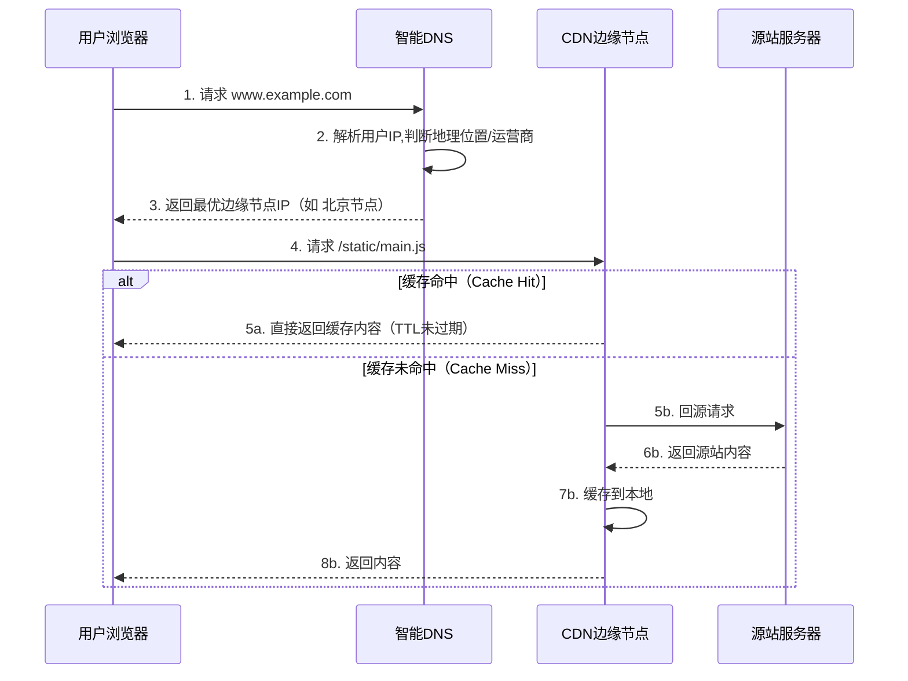
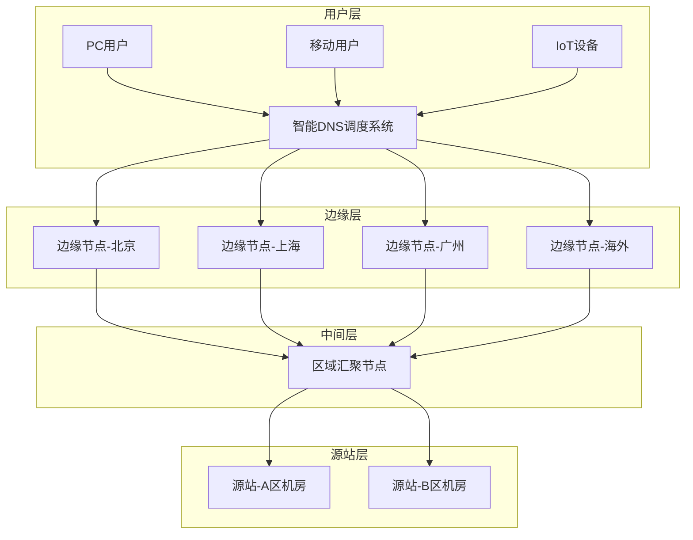
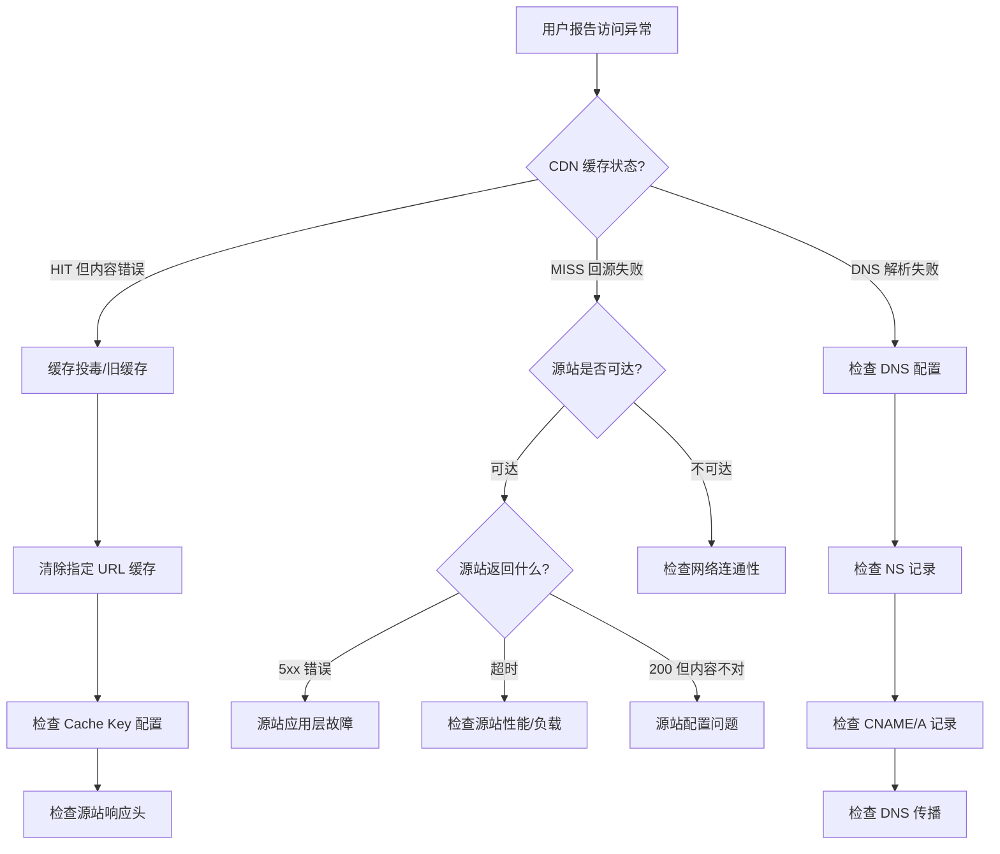
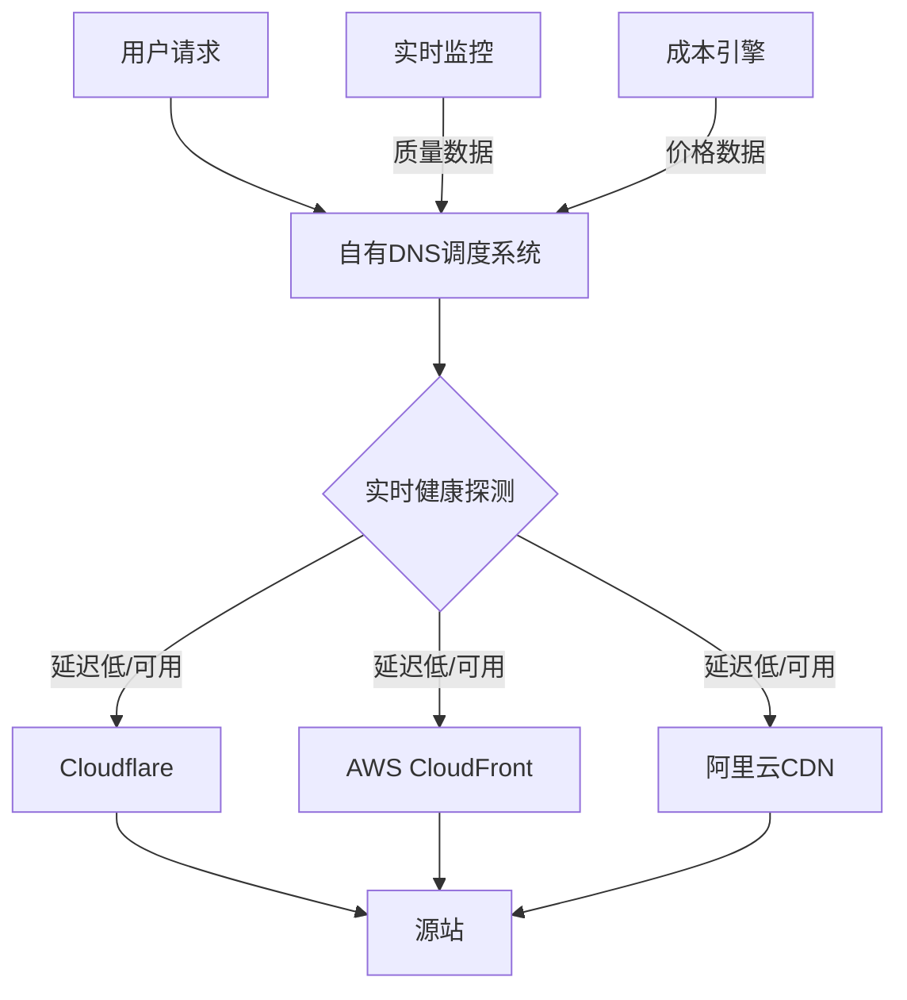

# 技巧1：CDN（内容分发网络）

CDN（Content Delivery Network，内容分发网络）是现代互联网基础设施的基石。据统计，全球超过 50% 的互联网流量通过 CDN 交付，顶级 CDN 服务商（如 Cloudflare、Akamai）每天处理数万亿次请求。掌握 CDN 不仅是网络架构师的必备技能，也是后端工程师优化系统性能最直接、最有效的手段之一。

---

## 一、CDN 核心概念与原理

### 1.1 什么是 CDN

CDN 本质是一层**分布式代理缓存网络**。它通过在全球部署大量边缘节点（Edge Node），将内容缓存到离用户最近的地理位置，从而实现：

- **降低延迟**：用户就近获取数据，避免跨地域的长距离传输
- **减轻源站压力**：大部分请求由边缘节点响应，源站只需处理回源请求
- **提高可用性**：多节点冗余，单点故障不影响全局服务
- **抵御流量冲击**：分散请求到多个节点，天然具备 DDoS 缓解能力

### 1.2 CDN 工作原理

CDN 的核心流程可以用一句话概括：**DNS 智能解析 → 就近调度 → 缓存命中/回源 → 内容交付**。



### 1.3 CDN 加速的核心指标

| 指标 | 无 CDN | 有 CDN | 优化幅度 |
|------|--------|--------|----------|
| 首字节时间 (TTFB) | 200-800ms | 20-80ms | 60-90% |
| 页面加载时间 | 3-8s | 1-3s | 50-70% |
| 源站带宽 | 100% | 5-20% | 80-95% |
| 并发处理能力 | 受限于源站 | 横向扩展至数千节点 | 数量级提升 |

> **关键认知**：CDN 不是万能的。它主要加速**静态内容**的分发。动态内容（如 API 响应、数据库查询结果）CDN 无法缓存，但可以通过"动态加速"（优化回源链路）来降低延迟。

---

## 二、CDN 架构深度解析

### 2.1 CDN 网络层次架构



CDN 网络通常分为三层：

| 层级 | 功能 | 节点数量 | 特点 |
|------|------|----------|------|
| 边缘层 | 直接服务用户，缓存热点内容 | 数百到数千 | 部署在运营商机房或城市IDC |
| 中间层 (Mid-Tier) | 缓存回源热点，减少源站压力 | 数十到数百 | 当边缘节点未命中时先查中间层 |
| 源站层 | 存储原始内容 | 1-2 个 | 最终数据来源，需高可用部署 |

### 2.2 DNS 智能调度原理

CDN 的智能调度基于**地理位置感知 DNS（GeoDNS）**，核心逻辑如下：

```python
# CDN DNS 调度伪代码
def resolve(user_ip, domain):
    # 1. 获取用户 IP 的地理位置信息
    geo = geoip_lookup(user_ip)  # 返回：{country, province, city, isp}

    # 2. 查询候选边缘节点列表
    candidates = dns_records[domain]  # 所有边缘节点 IP 列表

    # 3. 多维度评分选择最优节点
    scored_nodes = []
    for node in candidates:
        score = 0
        # 地理距离权重（越近越好，权重40%）
        distance = haversine(geo.location, node.location)
        score += (1 / (1 + distance)) * 0.4

        # 网络质量权重（延迟越低越好，权重35%）
        latency = get_latency(user_ip, node.ip)
        score += (1 / (1 + latency)) * 0.35

        # 节点负载权重（越空闲越好，权重15%）
        load = node.current_load / node.capacity
        score += (1 - load) * 0.15

        # 健康状态（权重10%）
        score += node.health_score * 0.1

        scored_nodes.append((node, score))

    # 4. 选出最优节点（也可随机分配以实现负载均衡）
    best = max(scored_nodes, key=lambda x: x[1])
    return best[0].ip
```

**调度策略的关键影响因素**：

- **地理距离**：物理距离直接决定网络延迟（光纤传播速度约 200km/ms）
- **网络拓扑**：同运营商访问延迟最低（电信用户访问电信节点）
- **节点负载**：避免将流量打到已过载的节点
- **健康检查**：实时探测节点可用性，自动剔除故障节点
- **链路质量**：不同运营商之间的互联互通质量差异巨大

### 2.3 回源机制

回源（Origin Pull）是 CDN 的核心机制之一，分为两种模式：

| 模式 | 工作方式 | 适用场景 | 优缺点 |
|------|----------|----------|--------|
| **Pull（被动回源）** | 用户请求到达边缘节点，缓存未命中时自动向源站拉取 | 通用场景，内容不确定性强 | 优点：实现简单，内容自动同步；缺点：首次请求有回源延迟 |
| **Push（主动推送）** | 内容更新后主动推送到边缘节点 | 内容可预测、更新频率低的场景 | 优点：无首次请求延迟；缺点：需要内容管理系统配合 |

**回源链路优化**：

优化前：用户 → 北京边缘 → 广州源站（延迟 80ms+）
优化后：用户 → 北京边缘 → 北京中间层 → 广州源站（中间层命中时延迟 30ms）

---

## 三、CDN 缓存策略详解

缓存策略是 CDN 性能的关键。错误的缓存配置会导致内容不及时更新（缓存过旧）或频繁回源（缓存未命中率高）。

### 3.1 缓存过期策略

| 策略 | 配置方式 | 适用场景 | 风险 |
|------|----------|----------|------|
| **TTL 过期** | `Cache-Control: max-age=3600` | 静态资源（JS/CSS/图片） | TTL 过长导致内容不更新 |
| **条件请求** | `Last-Modified` / `ETag` | 需要精确验证的文件 | 每次请求需回源验证 |
| **主动失效** | 调用 API 清除指定 URL 缓存 | 内容更新时及时生效 | 管理复杂度高 |
| **版本化 URL** | `/static/app.v2.1.0.js` | 前端构建产物 | 需要构建流程配合 |

### 3.2 不同内容类型的缓存策略

```nginx
# Nginx CDN 边缘节点配置示例

# 图片资源 - 长时间缓存（版本由 URL 或文件名控制）
location ~* \.(jpg|jpeg|png|gif|webp|svg|ico)$ {
    proxy_cache_valid 200 30d;
    proxy_cache_valid 404 1m;
    add_header Cache-Control "public, max-age=2592000, immutable";
    add_header X-Cache-Status $upstream_cache_status;
    proxy_pass http://origin_backend;
}

# JS/CSS 文件 - 中等缓存时间
location ~* \.(js|css)$ {
    proxy_cache_valid 200 7d;
    add_header Cache-Control "public, max-age=604800";
    add_header X-Cache-Status $upstream_cache_status;
    proxy_pass http://origin_backend;
}

# HTML 文件 - 短缓存或不缓存（确保内容实时性）
location ~* \.html$ {
    proxy_cache_valid 200 5m;
    add_header Cache-Control "public, max-age=300, must-revalidate";
    add_header X-Cache-Status $upstream_cache_status;
    proxy_pass http://origin_backend;
}

# API 动态内容 - 不缓存
location /api/ {
    proxy_cache off;
    add_header Cache-Control "no-store, no-cache";
    proxy_pass http://origin_backend;
}
```

### 3.3 缓存命中率优化

缓存命中率是衡量 CDN 效果的核心指标，业界优秀水平为 **90-98%**。

**提升命中率的关键手段**：

1. **URL 规范化**：统一 URL 格式，避免同一内容被多次缓存
   不好：/image.jpg?timestamp=1719388800（每次不同，永远不命中）
   好：/image.jpg?v=2.0（版本变化时才更新）

2. **预热（Cache Warming）**：在流量高峰前主动将内容推送到边缘节点
   ```bash
   # Cloudflare 预热示例（使用 API）
   curl -X POST "https://api.cloudflare.com/client/v4/zones/{zone_id}/purge_cache" \
     -H "Authorization: Bearer {api_token}" \
     -H "Content-Type: application/json" \
     --data '{"files":["https://example.com/heavy-page.html"]}'
   ```

3. **合理设置缓存键（Cache Key）**：避免查询参数干扰缓存
   # 不好：包含随机参数
   Cache-Key: /image.jpg?session=abc123&_=1719388800
   
   # 好：只包含内容标识
   Cache-Key: /image.jpg

---

## 四、CDN 实战配置

### 4.1 Nginx 搭建简易 CDN 边缘节点

以下是一个完整的 Nginx CDN 边缘节点配置：

```nginx
# /etc/nginx/nginx.conf - CDN 边缘节点完整配置

# 缓存区域定义
proxy_cache_path /var/cache/nginx/cdn
    levels=1:2
    keys_zone=cdn_cache:100m     # 100MB 索引空间，约可存储 80 万个 key
    max_size=10g                  # 缓存最大 10GB
    inactive=60m                  # 60 分钟无访问自动清除
    use_temp_path=off;            # 避免跨分区拷贝，提升性能

upstream origin_server {
    least_conn;  # 最少连接调度
    server 10.0.0.1:8080 weight=5;
    server 10.0.0.2:8080 weight=3;
    server 10.0.0.3:8080 backup;  # 备用节点

    keepalive 64;  # 保持与源站的长连接
}

server {
    listen 80;
    server_name cdn.example.com;

    # ---- 通用优化 ----
    sendfile on;
    tcp_nopush on;
    tcp_nodelay on;
    keepalive_timeout 65;

    # ---- 限流保护 ----
    limit_req_zone $binary_remote_addr zone=cdn_ratelimit:10m rate=100r/s;
    limit_req zone=cdn_ratelimit burst=200 nodelay;

    # ---- 安全头 ----
    add_header X-Content-Type-Options "nosniff" always;
    add_header X-Frame-Options "SAMEORIGIN" always;

    # ---- 静态资源缓存 ----
    location ~* \.(jpg|jpeg|png|gif|webp|avif|svg|ico|bmp)$ {
        proxy_cache cdn_cache;
        proxy_cache_valid 200 30d;
        proxy_cache_valid 301 302 1h;
        proxy_cache_valid 404 1m;
        proxy_cache_use_stale error timeout updating http_500 http_502 http_503 http_504;
        proxy_cache_lock on;         # 防止缓存击穿（同一时刻只放一个回源请求）
        proxy_cache_lock_timeout 5s;

        # 缓存状态头（调试用）
        add_header X-Cache-Status $upstream_cache_status always;
        add_header X-Cache-Key $scheme$proxy_host$request_uri always;

        # 图片自动格式转换
        proxy_set_header Accept-Encoding "";

        proxy_pass http://origin_server;
        proxy_set_header Host $host;
        proxy_set_header X-Real-IP $remote_addr;
        proxy_set_header X-Forwarded-For $proxy_add_x_forwarded_for;
    }

    # ---- 静态文件（JS/CSS/字体）----
    location ~* \.(js|css|woff2?|ttf|eot)$ {
        proxy_cache cdn_cache;
        proxy_cache_valid 200 7d;
        proxy_cache_valid 404 1m;
        proxy_cache_use_stale error timeout updating http_502 http_503 http_504;
        proxy_cache_lock on;

        add_header X-Cache-Status $upstream_cache_status always;

        proxy_pass http://origin_server;
        proxy_set_header Host $host;
        proxy_set_header X-Real-IP $remote_addr;
    }

    # ---- 视频/大文件 ----
    location ~* \.(mp4|webm|ogg|mp3|wav|pdf|zip|tar\.gz)$ {
        proxy_cache cdn_cache;
        proxy_cache_valid 200 7d;
        proxy_buffering on;
        proxy_buffer_size 16k;
        proxy_buffers 8 256k;

        add_header X-Cache-Status $upstream_cache_status always;
        add_header Accept-Ranges bytes;

        proxy_pass http://origin_server;
        proxy_set_header Host $host;
    }

    # ---- 默认回退 ----
    location / {
        proxy_pass http://origin_server;
        proxy_set_header Host $host;
        proxy_set_header X-Real-IP $remote_addr;
    }
}
```

### 4.2 缓存状态码速查

| 状态码 | 含义 | 常见原因 |
|--------|------|----------|
| `HIT` | 缓存命中 | 理想状态，内容从边缘节点直接返回 |
| `MISS` | 缓存未命中 | 首次请求或缓存已过期 |
| `EXPIRED` | 缓存已过期 | TTL 到期，触发回源验证 |
| `STALE` | 使用过期缓存 | 源站不可达时的降级策略 |
| `UPDATING` | 缓存正在更新 | 后台回源中，当前返回旧缓存 |
| `BYPASS` | 跳过缓存 | 源站返回 `Cache-Control: no-cache` 等 |

---

## 五、CDN 性能优化进阶

### 5.1 协议层优化

| 优化技术 | 原理 | 效果 |
|----------|------|------|
| **HTTP/2 多路复用** | 单连接并行传输多个请求 | 减少 TCP 连接建立开销，提升并发 |
| **HTTP/3 (QUIC)** | 基于 UDP 的传输协议 | 0-RTT 连接建立，抗丢包 |
| **TLS 1.3** | 减少 TLS 握手往返次数 | 握手从 2-RTT 降至 1-RTT |
| **OCSP Stapling** | CDN 代替用户验证证书 | 省去用户单独查询证书状态的延迟 |
| **Brotli 压缩** | 比 gzip 高 15-25% 压缩率 | 减少传输数据量 |

```nginx
# 启用 Brotli 压缩（需安装 ngx_brotli 模块）
brotli on;
brotli_comp_level 6;        # 压缩级别 1-11，6 是性价比最优
brotli_types text/plain text/css application/json
             application/javascript text/xml application/xml
             image/svg+xml image/webp;
```

### 5.2 连接优化

优化前：用户 → TCP握手(1RTT) → TLS握手(2RTT) → 请求(1RTT) = 4RTT + 传输时间
优化后(HTTP/3 + 0-RTT)：用户 → 请求+数据(0RTT) = 传输时间

**Keep-Alive 长连接池配置**：

```nginx
# 与源站保持长连接
upstream origin_server {
    server 10.0.0.1:8080;
    keepalive 128;          # 保持 128 个空闲长连接
    keepalive_requests 1000; # 每个连接最多处理 1000 个请求
    keepalive_timeout 60s;   # 空闲 60s 后关闭
}

location / {
    proxy_http_version 1.1;           # 必须指定 HTTP/1.1 才能用 keepalive
    proxy_set_header Connection "";   # 清除 Connection: close 头
    proxy_pass http://origin_server;
}
```

### 5.3 异步与批量处理

```python
import asyncio
import aiohttp
import time

class CDNCacheWarmer:
    """CDN 缓存预热工具 - 异步批量推送"""
    
    def __init__(self, cdn_base_url, concurrency=50):
        self.cdn_base = cdn_base_url
        self.semaphore = asyncio.Semaphore(concurrency)
        self.results = {"hit": 0, "miss": 0, "error": 0}
    
    async def warm_url(self, session, url):
        """预热单个 URL"""
        async with self.semaphore:
            try:
                async with session.get(url, timeout=aiohttp.ClientTimeout(total=30)) as resp:
                    cache_status = resp.headers.get("X-Cache-Status", "UNKNOWN")
                    if cache_status == "HIT":
                        self.results["hit"] += 1
                    else:
                        self.results["miss"] += 1
                    return url, cache_status
            except Exception as e:
                self.results["error"] += 1
                return url, f"ERROR: {e}"
    
    async def warm_batch(self, urls):
        """批量预热"""
        connector = aiohttp.TCPConnector(limit=100, limit_per_host=50)
        async with aiohttp.ClientSession(connector=connector) as session:
            tasks = [self.warm_url(session, url) for url in urls]
            results = await asyncio.gather(*tasks)
        return results
    
    def report(self):
        """输出预热报告"""
        total = sum(self.results.values())
        print(f"\n{'='*50}")
        print(f"  CDN 预热报告")
        print(f"{'='*50}")
        print(f"  总计: {total} URLs")
        print(f"  缓存命中: {self.results['hit']} ({self.results['hit']*100/max(total,1):.1f}%)")
        print(f"  首次缓存: {self.results['miss']} ({self.results['miss']*100/max(total,1):.1f}%)")
        print(f"  错误: {self.results['error']}")
        print(f"{'='*50}\n")


# 使用示例
async def main():
    warmer = CDNCacheWarmer("https://cdn.example.com")
    
    urls = [
        "https://cdn.example.com/static/app.js",
        "https://cdn.example.com/static/style.css",
        "https://cdn.example.com/images/hero.jpg",
        # ... 批量 URL 列表
    ]
    
    start = time.time()
    await warmer.warm_batch(urls)
    elapsed = time.time() - start
    
    warmer.report()
    print(f"预热耗时: {elapsed:.2f}s")

# asyncio.run(main())
```

---

## 六、CDN 安全防护

### 6.1 安全威胁与防御

| 威胁类型 | 描述 | CDN 防御手段 |
|----------|------|-------------|
| DDoS 攻击 | 大流量/连接耗尽型攻击 | 流量清洗、Anycast 分散、限速 |
| CC 攻击 | 针对动态接口的高频请求 | WAF 规则、频率限制、人机验证 |
| 缓存投毒 | 注入恶意内容到缓存 | 严格过滤缓存键、校验源站响应 |
| 源站 IP 泄露 | 攻击者绕过 CDN 直接攻击源站 | 隐藏源站 IP、IP 白名单 |
| HTTPS 降级 | 中间人攻击 | HSTS、TLS 1.3、证书固定 |

### 6.2 安全配置实践

```nginx
# CDN 边缘节点安全加固

server {
    listen 443 ssl http2;
    server_name cdn.example.com;

    # TLS 配置
    ssl_protocols TLSv1.2 TLSv1.3;
    ssl_ciphers ECDHE-ECDSA-AES128-GCM-SHA256:ECDHE-RSA-AES128-GCM-SHA256;
    ssl_prefer_server_ciphers on;
    ssl_session_cache shared:SSL:10m;
    ssl_session_timeout 10m;

    # HSTS（启用前确保所有子域名也支持 HTTPS）
    add_header Strict-Transport-Security "max-age=31536000; includeSubDomains" always;

    # 防止源站 IP 泄露：只允许通过 CDN 回源
    # 源站防火墙只信任 CDN 节点 IP 段
    location / {
        # 基于 Origin 头的防盗链
        valid_referers none blocked *.example.com;
        if ($invalid_referer) {
            return 403;
        }

        proxy_pass http://origin_server;
    }

    # 签名 URL 防盗链（适用于付费内容）
    location /premium/ {
        # 验证签名: ?expires=xxx&amp;signature=xxx
        if ($arg_expires < $unix_timestamp) {
            return 410;  # 链接过期
        }
        # ... 验证逻辑

        proxy_pass http://origin_server;
    }
}
```

### 6.3 源站 IP 保护策略

风险场景：
攻击者通过以下方式获取源站 IP：
  1. 历史 DNS 记录查询（如 securitytrails.com）
  2. 子域名解析（mail.example.com → 源站IP）
  3. SSL 证书查询（crt.sh）
  4. 邮件头信息（MX 记录可能指向源站）

防护措施：
  1. 所有域名统一接入 CDN，不留"裸奔"子域名
  2. 源站只接受 CDN 节点 IP 段的连接
  3. 定期检查子域名解析记录
  4. 邮件服务器使用独立 IP，不与源站共用

---

## 七、CDN 监控与故障排查

### 7.1 关键监控指标

```bash
#!/bin/bash
# CDN 边缘节点监控脚本

echo "========== CDN 节点健康检查 =========="
echo "时间: $(date '+%Y-%m-%d %H:%M:%S')"
echo ""

# 1. 缓存命中率（从 Nginx 日志分析）
echo "--- 缓存命中率 (最近1小时) ---"
if [ -f /var/log/nginx/access.log ]; then
    total=$(grep "$(date -d '1 hour ago' '+%d/%b/%Y:%H')" /var/log/nginx/access.log | wc -l)
    hit=$(grep "$(date -d '1 hour ago' '+%d/%b/%Y:%H')" /var/log/nginx/access.log | grep -c '"HIT"')
    miss=$(grep "$(date -d '1 hour ago' '+%d/%b/%Y:%H')" /var/log/nginx/access.log | grep -c '"MISS"')
    if [ "$total" -gt 0 ]; then
        rate=$(echo "scale=2; $hit * 100 / $total" | bc)
        echo "  命中: $hit | 未命中: $miss | 命中率: ${rate}%"
    else
        echo "  暂无数据"
    fi
else
    echo "  日志文件不存在"
fi

echo ""

# 2. 系统资源
echo "--- 系统资源 ---"
echo "  CPU: $(top -bn1 | grep 'Cpu(s)' | awk '{print $2}')% 使用"
echo "  内存: $(free -h | awk '/Mem/{print $3"/"$2}') 使用"
echo "  磁盘: $(df -h /var/cache/nginx | awk 'NR==2{print $3"/"$2" ("$5" 使用)"}')"
echo "  连接数: $(ss -s | grep 'estab' | awk '{print $4}')"
echo "  文件描述符: $(cat /proc/$(pgrep -f 'nginx: worker')/limits 2>/dev/null | grep 'Max open files' | awk '{print $4}')"

echo ""

# 3. 回源延迟
echo "--- 回源延迟测试 ---"
for origin in 10.0.0.1 10.0.0.2; do
    latency=$(curl -o /dev/null -s -w "%{time_total}" -H "Host: origin.example.com" http://$origin:8080/health 2>/dev/null)
    if [ -n "$latency" ]; then
        ms=$(echo "$latency * 1000" | bc | cut -d. -f1)
        echo "  源站 $origin: ${ms}ms"
    else
        echo "  源站 $origin: 不可达"
    fi
done

echo ""
echo "========== 检查完成 =========="
```

### 7.2 常见故障排查流程



### 7.3 快速排查命令集

```bash
# 1. DNS 解析检查
dig cdn.example.com +short                    # 查看 CDN 域名解析
dig cdn.example.com @8.8.8.8 +trace          # 完整 DNS 解析链路
nslookup cdn.example.com 114.114.114.114      # 指定 DNS 服务器查询

# 2. 缓存验证
curl -I https://cdn.example.com/static/app.js  # 查看响应头
# 关注: X-Cache-Status, X-Cache, Cache-Control, X-Edge-IP

# 3. 回源链路测试
curl -I -H "Host: cdn.example.com" http://10.0.0.1:8080/static/app.js  # 直接回源

# 4. TLS 证书检查
echo | openssl s_client -connect cdn.example.com:443 -servername cdn.example.com 2>/dev/null | \
    openssl x509 -noout -dates -subject

# 5. 实时流量监控
iftop -i eth0 -P -N  # 实时带宽监控
nload eth0           # 带宽图形化监控
```

---

## 八、主流 CDN 服务商对比

| 维度 | Cloudflare | AWS CloudFront | 阿里云CDN | 腾讯云CDN |
|------|-----------|----------------|-----------|-----------|
| 全球节点数 | 300+ | 600+ | 2800+ | 2800+ |
| 免费额度 | 无限（Free 计划） | 1TB/月（12个月） | 10GB/月 | 10GB/月 |
| DDoS 防护 | 内置（最高 Tbps 级） | 需额外购买 Shield | 需购买 DDoS 防护包 | 需购买大禹防护 |
| WAF | 内置基础规则 | 需额外购买 | 需单独开通 | 需单独开通 |
| 边缘计算 | Workers（V8 Isolates） | Lambda@Edge | EdgeRoutine | 边缘函数 |
| HTTP/3 | ✅ 已支持 | ✅ 已支持 | ✅ 已支持 | ✅ 已支持 |
| 适合场景 | 个人/中小企业优先 | AWS 生态深度用户 | 国内为主业务 | 国内为主业务 |
| 价格（1TB/月） | $0（Free）~ $200 | ~$85 | ~¥300 | ~¥300 |

**选型建议**：

- **预算有限 + 全球加速**：Cloudflare Free 计划（无流量限制，功能已足够）
- **AWS 技术栈**：CloudFront（与 S3/EC2/ELB 深度集成）
- **国内业务为主**：阿里云/腾讯云 CDN（国内节点密集，备案支持好）
- **安全要求高**：Cloudflare Pro 以上（内置 WAF + DDoS 防护）

---

## 九、实战案例

### 案例1：电商平台大促前 CDN 优化

**背景**：某电商平台日均 PV 5000 万，大促期间预计流量 10 倍增长。

**优化方案**：

| 阶段 | 措施 | 预期效果 |
|------|------|----------|
| 大促前 7 天 | 热门商品图片预热到 CDN | 首次请求零回源 |
| 大促前 3 天 | CDN 缓存 TTL 从 24h 调整为 72h | 减少回源频率 |
| 大促前 1 天 | 开启全站 HTTPS + HTTP/2 | 连接性能提升 30% |
| 大促当天 | 动态内容走独立 API 网关，不经过 CDN | 避免缓存穿透 |
| 大促期间 | 实时监控缓存命中率，阈值 <85% 自动告警 | 快速发现异常 |

**结果**：
- 缓存命中率从 87% 提升到 96%
- 源站带宽降低 92%
- 页面加载时间从 2.8s 降至 1.2s
- 源站 CPU 使用率从大促前的 65% 峰值降至 23%

### 案例2：视频网站防盗链配置

**场景**：视频内容被大量站外盗链，消耗带宽成本。

**解决方案**：

```nginx
# 基于 Referer + 签名的双重防盗链
location ~* \.(mp4|m3u8|ts)$ {
    # 1. Referer 白名单
    valid_referers none blocked *.myvideo.com *.myvideo.cn;
    if ($invalid_referer) {
        return 403 "Forbidden";
    }

    # 2. Token 签名验证
    set $token_valid 0;
    if ($arg_token ~* "^([a-f0-9]{32})_([0-9]{10})$") {
        set $token_secret $1;
        set $token_expire $2;
    }

    # 验证 token 过期时间和签名
    # （实际实现需用 Lua 或 proxy_pass 到验证服务）

    proxy_pass http://video_backend;
    proxy_cache cdn_cache;
    proxy_cache_valid 200 24h;
}
```

---

## 十、常见误区与纠正

| 误区 | 真相 | 正确做法 |
|------|------|----------|
| CDN 可以加速所有内容 | CDN 只能加速静态内容分发，API 等动态请求需走动态加速 | 动态与静态内容分开处理 |
| CDN 部署后不需要维护 | 缓存策略、安全规则、监控告警都需要持续优化 | 定期审计 CDN 配置和命中率 |
| 节点越多越好 | 节点过多可能增加调度复杂度，不一定降低延迟 | 根据用户分布合理选点 |
| 缓存时间越长越好 | 过长的 TTL 导致内容更新延迟，用户看到旧内容 | 按内容类型设置差异化 TTL |
| CDN 不需要考虑安全 | CDN 是互联网暴露面，配置不当反而成为攻击入口 | 配置 WAF、限制源站访问、监控异常流量 |
| 价格贵的 CDN 一定好 | 适合自己的才是最好的，免费方案可能完全够用 | 先评估实际需求再选型 |

---

## 十一、最佳实践清单

**架构设计**：

1. 静态资源必须接入 CDN，动态 API 按需接入
2. 源站 IP 严格隐藏，仅允许 CDN 节点 IP 回源
3. 使用版本化 URL 或内容哈希（`app.abc123.js`）管理静态资源版本
4. 缓存策略按内容类型分级配置（图片30天、JS/CSS 7天、HTML 5分钟）

**性能优化**：

5. 启用 HTTP/2 或 HTTP/3 提升传输效率
6. 配置 Brotli 压缩（压缩率优于 gzip 15-25%）
7. 与源站保持 keepalive 长连接，减少 TCP 握手开销
8. 图片启用 WebP/AVIF 格式 + CDN 自动格式协商

**监控运维**：

9. 监控缓存命中率，低于 85% 需要排查原因
10. 大促/直播等场景提前预热缓存
11. 配置回源失败自动告警和降级策略
12. 定期检查证书过期时间，提前续期

**安全防护**：

13. 开启 HTTPS + HSTS，杜绝中间人攻击
14. 配置 WAF 规则防 CC 攻击
15. 限制单 IP 请求频率，防止恶意爬虫
16. 定期扫描子域名，避免源站 IP 泄露

---

## 十二、进阶思考

### 12.1 CDN 与边缘计算的融合

现代 CDN 正在从"内容分发网络"进化为"边缘计算网络"。以 Cloudflare Workers 为例：

```javascript
// Cloudflare Worker - 边缘计算示例：A/B 测试
addEventListener('fetch', event => {
  event.respondWith(handleRequest(event.request))
})

async function handleRequest(request) {
  // 在边缘节点执行逻辑，无需回源
  const country = request.cf.country
  const cookie = request.headers.get('Cookie') || ''

  if (!cookie.includes('ab_group')) {
    // 随机分配 A/B 组
    const group = Math.random() > 0.5 ? 'A' : 'B'
    const response = await fetch(request)
    const newResponse = new Response(response.body, response)
    newResponse.headers.append('Set-Cookie', `ab_group=${group}; Path=/`)
    return newResponse
  }
  return fetch(request)
}
```

### 12.2 多 CDN 策略（Multi-CDN）

大型平台通常采用多 CDN 策略，通过智能调度在多个 CDN 服务商之间动态切换：



**Multi-CDN 的核心价值**：

- **冗余容灾**：单个 CDN 故障时自动切换到备用节点
- **性能最优**：实时选择质量最好的 CDN 链路
- **成本优化**：在不同 CDN 之间根据流量价格动态分配
- **避免锁定**：不依赖单一供应商，议价能力更强

### 12.3 CDN 对 SEO 的影响

Google 已将页面加载速度作为排名因素。CDN 通过以下方式影响 SEO：

- **Core Web Vitals 优化**：LCP（最大内容绘制）和 FID（首次输入延迟）指标直接受 CDN 加速影响
- **爬虫效率提升**：百度/Google 爬虫可以更快地抓取页面
- **可用性保证**：CDN 的高可用性确保搜索引擎爬虫不会遇到 5xx 错误

> **总结**：CDN 是网络架构中最成熟、最立竿见影的优化手段。从简单的静态资源加速到复杂的边缘计算和安全防护，CDN 已经成为互联网基础设施不可或缺的一部分。掌握 CDN 的原理、配置、优化和安全，是每一位后端工程师和架构师的必备能力。
