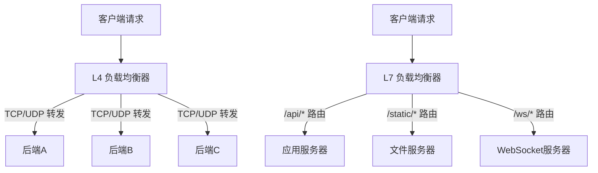
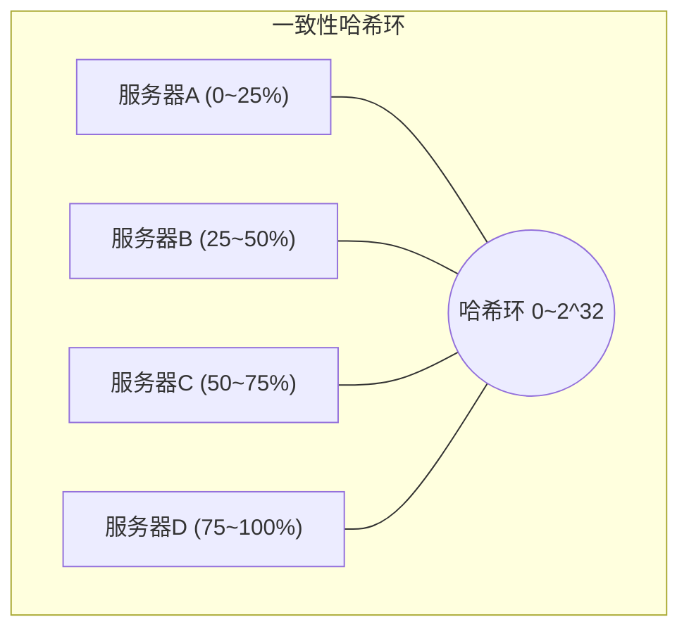
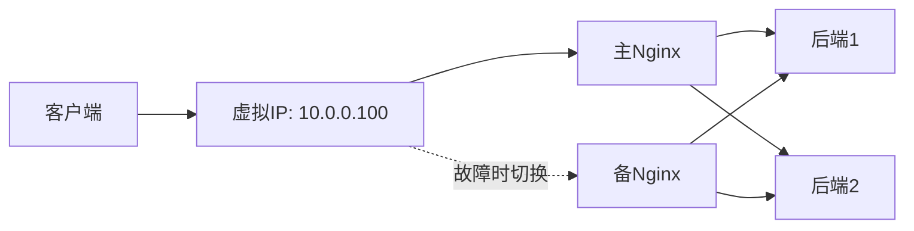

## 技巧2 负载均衡

负载均衡是网络架构中最核心的基础设施之一。当单台服务器无法承载日益增长的流量时，负载均衡器（Load Balancer）将请求分发到多台后端服务器，实现水平扩展、高可用和资源优化。无论是电商大促、直播推流还是微服务间的内部通信，负载均衡无处不在——它是现代分布式系统的"交通指挥官"。

本节将从底层原理出发，覆盖负载均衡的分类体系、核心调度算法、主流方案对比、Nginx 完整实战配置、健康检查、高可用架构设计、性能调优与监控，直至真实生产案例，为读者建立完整的负载均衡知识体系。

---

### 1. 负载均衡的本质与价值

#### 1.1 核心问题：单机天花板

任何单台服务器都有物理极限：

| 瓶颈维度 | 典型上限 | 突破方式 |
|----------|---------|---------|
| CPU | 64核/128线程 | 垂直扩展有上限 |
| 内存 | 数TB（单机） | 受主板槽位限制 |
| 网络带宽 | 10-100 Gbps | 受网卡和交换机限制 |
| 文件描述符 | 默认1024 | 可调但有内核上限 |
| 应用逻辑 | 无法并行化 | 必须水平拆分 |

当单机无法继续扩展时，必须引入多台服务器协同工作——而"谁来决定每个请求交给哪台服务器"这个问题，就是负载均衡要解决的核心命题。

**一个形象的类比**：想象一家火爆的餐厅只有 1 个服务员，客人越来越多，点单、上菜、结账全挤在一个人身上。负载均衡就是门口的迎宾台——决定每位客人去哪张桌子，确保所有服务员都忙而不乱。

#### 1.2 负载均衡解决的三大问题

**（1）水平扩展（Scalability）**

将流量分发到 N 台服务器，理论上吞吐量提升 N 倍。加机器就能扛更多流量，无需修改应用代码。这是负载均衡最直接的价值：把"一台牛马拉不动"的问题变成"多头牛马一起拉"的问题。

**（2）高可用（High Availability）**

当某台后端服务器宕机时，负载均衡器自动将其从可用池中剔除，将流量路由到健康节点。配合冗余的负载均衡器本身，可以实现 99.99%（年停机 < 52 分钟）甚至更高的可用性。可用性与负载均衡的关系：

| 可用性目标 | 年停机时间 | 是否需要负载均衡 |
|-----------|-----------|----------------|
| 99% | 3.65 天 | 非必须 |
| 99.9% | 8.76 小时 | 建议使用 |
| 99.99% | 52.6 分钟 | 必须使用 |
| 99.999% | 5.26 分钟 | 多层负载均衡 + 全局冗余 |

**（3）资源优化（Efficiency）**

根据各服务器的实时负载状况动态调整分发权重，避免某些节点过载而其他节点空闲，最大化利用集群整体资源。例如，一台 16 核机器和一台 4 核机器组成集群，通过加权分配让它们各自承担与能力匹配的流量比例，避免"大马拉小车"或"小马拉大车"。

#### 1.3 负载均衡在请求链路中的位置

一个典型的 Web 请求从用户到服务器，可能经过多层负载均衡：

用户浏览器
    ↓ DNS 解析（DNS 负载均衡：返回最近的 CDN/LB IP）
CDN 边缘节点（缓存命中则直接返回）
    ↓ 回源请求
入口负载均衡器（L4/L7：分发到后端集群）
    ↓
应用服务器集群（可能内部还有服务间负载均衡）
    ↓
数据库读写分离负载均衡（HAProxy 分发读请求到多个从库）

理解负载均衡在这个链路中的位置，有助于我们在正确的层级选择正确的方案。

---

### 2. 负载均衡的分类体系

#### 2.1 按 OSI 层级分类

这是最基本也是最重要的分类方式，决定了负载均衡器能看到和操作的信息层级。

**四层负载均衡（L4，传输层）**

工作在 TCP/UDP 层，只根据 IP 地址和端口号进行转发，不解析应用层协议内容。

- 优点：性能极高（只做包转发，不拆包），延迟极低（微秒级），支持任意 TCP/UDP 协议
- 缺点：无法基于 URL、Header、Cookie 等应用层信息做精细化路由
- 典型方案：LVS（Linux Virtual Server）、F5 BIG-IP 的 L4 模式、HAProxy（TCP 模式）

**七层负载均衡（L7，应用层）**

工作在 HTTP/HTTPS 层，可以解析完整的请求内容，基于 URL、Host、Cookie、Header 等信息做精细化分发。

- 优点：路由策略灵活（按 URL 分发、按 Header 分发、按用户地理位置分发），可以做内容缓存、SSL 终结、请求改写
- 缺点：需要解析应用层协议，性能比 L4 低（但现代硬件已大幅缩小差距），延迟稍高
- 典型方案：Nginx、Envoy、HAProxy（HTTP 模式）、Traefik

**L4 与 L7 的性能对比**：

| 对比维度 | L4 负载均衡 | L7 负载均衡 |
|---------|------------|------------|
| 处理层级 | TCP/UDP 包头 | HTTP 请求内容 |
| 转发方式 | 修改 MAC/IP 后直接转发 | 拆包解析 → 重新封装 |
| 典型延迟 | 微秒级（< 1ms） | 毫秒级（1-5ms） |
| QPS 上限 | 百万级 | 十万级 |
| 路由依据 | IP + 端口 | URL / Header / Cookie 等 |
| 附加能力 | 无 | 缓存、SSL终结、压缩、改写 |
| 典型用途 | 大规模入口分发 | 精细化应用路由 |



#### 2.2 按实现方式分类

| 类型 | 代表产品 | 部署形态 | 性能 | 成本 | 适用场景 |
|------|---------|---------|------|------|---------|
| 硬件负载均衡 | F5 BIG-IP、A10 Networks | 专用硬件设备 | 极高（百万级QPS） | 极高（数十万起） | 金融、运营商等大型企业 |
| 软件负载均衡 | Nginx、HAProxy、LVS | 部署在通用服务器上 | 高（十万级QPS） | 低（开源免费） | 中小企业、互联网公司主流选择 |
| 云负载均衡 | AWS ALB/NLB、阿里云SLB、GCP LB | 云厂商托管服务 | 高（弹性扩展） | 按量付费 | 全面上云的业务 |
| DNS 负载均衡 | 本地DNS、Route53 | DNS解析层面 | 取决于TTL | 低 | 全局流量调度、多地域容灾 |

#### 2.3 按部署位置分类

- **入口负载均衡**：位于集群入口，接收外部用户流量（如 Nginx 反向代理），这是最常见的负载均衡部署位置
- **服务间负载均衡**：微服务架构中，服务之间调用的负载均衡（如 gRPC 内置 LB、Envoy sidecar），通常由服务网格框架自动管理
- **全局负载均衡（GSLB）**：跨地域、跨机房的全局流量调度（如 DNS + Anycast），解决"就近接入"和"异地容灾"问题

---

### 3. 核心调度算法详解

负载均衡算法决定了"每个请求分配给哪台服务器"，是负载均衡器的灵魂。不同算法适用于不同场景，选错算法可能比不用负载均衡更糟糕。

#### 3.1 轮询（Round Robin）

最简单也最常用的算法。按顺序依次将请求分配给每台服务器，循环往复。

请求序列: R1 → A, R2 → B, R3 → C, R4 → A, R5 → B, R6 → C ...

**适用场景**：后端服务器配置相同、处理能力均等的通用场景。

**局限**：不考虑服务器的实际负载。如果某些请求处理时间特别长，可能导致某些服务器堆积大量慢请求。好比餐厅迎宾台机械地"1号桌、2号桌、3号桌"轮流安排，不管哪个桌子的客人正在等很久的菜。

#### 3.2 加权轮询（Weighted Round Robin）

为每台服务器分配权重，权重越高，被分配到的请求越多。解决了服务器性能不一致的问题。

服务器配置:
  A: 权重 5 (16核/32GB)
  B: 权重 3 (8核/16GB)
  C: 权重 2 (4核/8GB)

简单加权轮询: A,A,A,A,A,B,B,B,C,C,A,A,A,A,A,B,B,B,C,C...

**关键细节**：Nginx 默认使用的是**平滑加权轮询（Smooth Weighted Round Robin）**，它会均匀分散权重为 5 的服务器的请求，而不是连续发出 5 个再切到下一个：

平滑加权轮询的实际序列: A,B,A,C,A,B,A,C,A,B...
（每个时间片只给一台服务器分配请求，避免"毛刺"现象）

平滑加权轮询的算法伪代码：

```python
# Nginx 平滑加权轮询算法
def smooth_weighted_rr(servers):
    """
    每轮选择前，每个节点的 current_weight += weight
    选择 current_weight 最大的节点
    被选中后 current_weight -= total_weight
    """
    total = sum(s['weight'] for s in servers)
    for s in servers:
        s['current'] = 0

    for _ in range(total):
        for s in servers:
            s['current'] += s['weight']
        winner = max(servers, key=lambda s: s['current'])
        winner['current'] -= total
        yield winner['name']
```

#### 3.3 最少连接数（Least Connections）

将新请求分配给当前活跃连接数最少的服务器。这是一种动态算法，能自适应后端负载。

当前状态:
  A: 活跃连接 120, 最大连接 500
  B: 活跃连接 80,  最大连接 500
  C: 活跃连接 200, 最大连接 500

新请求 → B (连接数最少)

**适用场景**：后端处理时间差异大的场景（如不同请求的计算复杂度不同）。长连接（WebSocket、数据库连接）场景尤其适合。

**进阶变体——加权最少连接（Weighted Least Connections）**：综合考虑权重和当前连接数，公式为 `score = active_connections / weight`，选择得分最低的节点。这让高性能服务器即使连接数稍多也会被优先选择。

加权最少连接计算:
  A: 120 / 5 = 24.0
  B: 80 / 3  = 26.7
  C: 200 / 2 = 100.0

新请求 → A (得分最低，综合考虑了权重)

#### 3.4 IP 哈希（IP Hash）

根据客户端 IP 地址计算哈希值，将同一 IP 的请求始终路由到同一台服务器。这是实现"会话保持"的最简单方式。

```python
def ip_hash(client_ip, server_count):
    return hash(client_ip) % server_count

# 192.168.1.100 → hash → 2 → 分配给服务器C
# 同一 IP 的后续请求始终命中服务器C
```

**优点**：无需额外存储会话状态，实现简单。

**缺点**：
- 如果某台服务器宕机，该 IP 的所有会话全部丢失
- 某些客户端（如 NAT 后的大量用户）可能映射到同一 IP，导致负载不均
- CDN 或代理场景下，客户端 IP 可能频繁变化

#### 3.5 一致性哈希（Consistent Hashing）

一致性哈希是 IP Hash 的进化版，解决了"增减节点导致大量会话重新映射"的问题。



**核心原理**：将服务器和请求都映射到一个哈希环（0~2^32）上，请求沿顺时针方向找到最近的服务器。增减节点时，只影响相邻区间的请求，不会导致全局重映射。

**虚拟节点**：为避免哈希环上的数据倾斜（某些区间过大），引入虚拟节点——每台物理服务器映射 100~200 个虚拟节点到环上，使分布更加均匀。没有虚拟节点时，3 台服务器可能因为哈希分布不均导致某台承担 60% 的流量；引入 150 个虚拟节点后，各服务器的流量偏差可以控制在 5% 以内。

**适用场景**：分布式缓存（Memcached 集群）、有状态服务、CDN 节点选择。

#### 3.6 最短响应时间（Least Response Time）

将新请求分配给响应时间最短的服务器。这是最"智能"的算法之一，因为它直接反映了服务器的实际性能表现。

最近5秒的平均响应时间:
  A: 15ms
  B: 8ms  ← 最短
  C: 23ms

新请求 → B

**实现要点**：需要持续监测各服务器的响应时间，通常取滑动窗口的平均值来平滑波动。Nginx 开源版不直接支持此算法，但可通过 `least_conn` 配合权重间接模拟；HAProxy 和 Envoy 原生支持。

#### 3.7 随机（Random）

随机选择一台服务器。看起来不靠谱，但在大量请求下，统计上接近均匀分布。在后端完全同构且流量足够大时，随机算法的负载分布与轮询几乎无差异，而实现更简单。

#### 3.8 算法选型决策表

| 场景 | 推荐算法 | 原因 |
|------|---------|------|
| 后端服务器同构，请求处理时间均匀 | 轮询（Round Robin） | 简单高效，天然均匀 |
| 后端服务器配置不一致 | 加权轮询（Weighted RR） | 按能力分配流量 |
| 请求处理时间差异大 | 最少连接数（Least Connections） | 自适应负载，避免慢请求堆积 |
| 需要会话保持 | 一致性哈希（Consistent Hash） | 同 IP 固定路由，节点变动影响小 |
| 后端性能差异动态变化 | 最短响应时间（Least Response Time） | 实时反映服务器状态 |
| 全局多地域调度 | DNS + 地理位置哈希 | 就近接入，降低延迟 |

**选型核心原则**：没有万能算法，只有最适合场景的算法。选择时考虑三个维度——后端是否同构、请求处理时间是否均匀、是否需要会话保持。

---

### 4. 主流负载均衡方案对比

#### 4.1 Nginx

Nginx 是全球使用最广泛的反向代理和负载均衡器，以高性能和低内存占用著称。

**架构特点**：基于事件驱动的异步非阻塞模型（epoll/kqueue），每个 worker 进程可处理数万并发连接，内存占用通常在 2-5MB。

**核心能力**：
- 七层 HTTP/HTTPS 负载均衡，支持全部主流调度算法
- TCP/UDP 四层负载均衡（stream 模块）
- SSL/TLS 终结与 SNI 路由
- 基于请求内容的路由（URL、Header、Cookie、参数）
- 健康检查、限流、熔断、灰度发布
- 丰富的第三方模块生态

**典型性能**：单核处理 2-5 万 QPS（HTTP），多核线性扩展。实测 4 核机器配置 Nginx 做纯代理，轻松达到 10 万+ QPS。

#### 4.2 HAProxy

HAProxy 是专注于负载均衡的高性能代理，以稳定性著称，广泛应用于需要高可靠性的场景。

**与 Nginx 的关键差异**：
- 原生支持 TCP（L4）和 HTTP（L7）负载均衡
- 内置更丰富的健康检查机制（支持主动检查 + 被动检查 + 组合检查）
- 内置连接排队机制（当后端满载时，请求在队列中等待而非直接拒绝）
- 支持 ACL（访问控制列表）实现复杂路由逻辑
- 内置 Stats 页面，实时监控各后端状态
- 支持 Server-Sent Events 和 WebSocket

**适用场景**：数据库读写分离、SMTP 代理、需要细粒度健康检查的场景。HAProxy 在数据库代理领域几乎是行业标准——MySQL、PostgreSQL 的读写分离方案大多基于 HAProxy。

#### 4.3 LVS（Linux Virtual Server）

LVS 是工作在 Linux 内核层的四层负载均衡，性能极高，是大型互联网公司入口负载均衡的首选。

**三种工作模式**：

| 模式 | 全称 | 原理 | 优点 | 缺点 |
|------|------|------|------|------|
| NAT | Network Address Translation | 负载均衡器作为网关，修改目标IP | 配置简单，后端无需特殊设置 | 瓶颈在负载均衡器的网络带宽 |
| DR | Direct Routing | 修改数据帧的目标MAC地址，响应绕过LB | 响应不经过LB，性能极高 | LB和后端必须在同一二层网络 |
| TUN | IP Tunneling | 通过IP隧道封装请求 | 支持跨网段部署 | 配置复杂，需要支持IP隧道 |

**DR 模式数据流**（性能最优，应用最广）：

Client → LB(修改目标MAC) → Server → Client
        请求经过LB            响应直接回客户端，不经过LB

**典型架构**：LVS (DR模式) + Keepalived → Nginx (L7) → 后端应用服务器。LVS 做 L4 入口分流（百万级 QPS），Nginx 做 L7 路由（精细化分发），这是阿里、腾讯等大厂的经典方案。

#### 4.4 Envoy

Envoy 是 CNCF 毕业项目，专为云原生微服务架构设计的现代代理。

**独特优势**：
- 原生支持服务网格（Service Mesh），与 Istio 深度集成
- 内置丰富的可观测性（分布式追踪、指标、访问日志）
- 支持 gRPC 负载均衡（HTTP/2 多路复用）
- 动态配置，无需重启即可更新路由规则（xDS API）
- 高级负载均衡策略：区域感知路由（Zone-aware）、熔断、异常检测

**适用场景**：Kubernetes 微服务架构、Service Mesh、需要精细化流量管理的场景。Envoy 正在快速取代 Nginx 成为云原生环境的默认代理选择。

#### 4.5 Traefik

Traefik 是为容器化和云原生环境设计的自动发现负载均衡器。

**核心特点**：
- 自动发现：集成 Docker、Kubernetes、Consul 等，容器启停自动更新路由
- 内置 Let's Encrypt 自动 HTTPS
- 简洁的配置方式（标签驱动）
- 内置 Dashboard，可视化路由规则

**适用场景**：Docker / Docker Compose 环境、小型 Kubernetes 集群、快速原型开发。

#### 4.6 方案选型决策

| 需求 | 推荐方案 | 理由 |
|------|---------|------|
| 通用 Web 服务负载均衡 | Nginx | 生态最成熟，文档最丰富 |
| 需要精细健康检查和 TCP 代理 | HAProxy | 健康检查机制最完善 |
| 超高性能入口（百万级QPS） | LVS + Keepalived | 内核态转发，性能天花板 |
| 微服务 / Service Mesh | Envoy | 云原生原生，动态配置 |
| 容器化快速部署 | Traefik | 自动发现，零配置 |
| 全面上云 | 云厂商 ALB/NLB | 免运维，弹性扩展 |
| 预算充足的企业级 | F5 BIG-IP | 功能全面，技术支持完善 |

---

### 5. Nginx 负载均衡实战配置

以下是一个生产级别的 Nginx 负载均衡配置，覆盖了核心技巧的实际应用。

#### 5.1 基础配置

```nginx
# /etc/nginx/nginx.conf

worker_processes auto;          # 自动匹配 CPU 核心数
worker_rlimit_nofile 65535;     # 每个 worker 最大文件描述符

events {
    worker_connections 65535;   # 每个 worker 最大连接数
    use epoll;                  # Linux 下使用 epoll
    multi_accept on;            # 一次接受多个连接
}

http {
    # --- 基础优化 ---
    sendfile on;                # 零拷贝文件传输
    tcp_nopush on;              # 优化 TCP 发送
    tcp_nodelay on;             # 减少延迟
    keepalive_timeout 65;       # 长连接超时
    keepalive_requests 1000;    # 单连接最大请求数

    # --- 连接缓冲区 ---
    proxy_buffer_size 16k;
    proxy_buffers 4 32k;
    proxy_busy_buffers_size 64k;

    # --- 上游服务器组 ---
    upstream backend_cluster {
        # 负载均衡算法（选其一）
        # least_conn;            # 最少连接数
        # ip_hash;               # IP哈希
        # hash $request_uri consistent;  # 一致性哈希

        # 默认：加权轮询（平滑）

        server 10.0.0.1:8080 weight=5 max_fails=3 fail_timeout=30s;
        server 10.0.0.2:8080 weight=3 max_fails=3 fail_timeout=30s;
        server 10.0.0.3:8080 weight=2 max_fails=3 fail_timeout=30s;

        # 备用服务器（仅在所有主服务器不可用时启用）
        server 10.0.0.4:8080 backup;

        # 长连接池：与后端保持连接，避免反复建立TCP连接
        keepalive 32;
    }

    # --- 反向代理配置 ---
    server {
        listen 80;
        server_name api.example.com;

        location / {
            proxy_pass http://backend_cluster;

            # 传递客户端真实信息
            proxy_set_header Host $host;
            proxy_set_header X-Real-IP $remote_addr;
            proxy_set_header X-Forwarded-For $proxy_add_x_forwarded_for;
            proxy_set_header X-Forwarded-Proto $scheme;

            # 代理超时设置
            proxy_connect_timeout 5s;    # 连接后端超时
            proxy_send_timeout 60s;      # 发送请求超时
            proxy_read_timeout 60s;      # 读取响应超时

            # 长连接：复用与后端的连接
            proxy_http_version 1.1;
            proxy_set_header Connection "";
        }
    }
}
```

#### 5.2 高级路由配置

```nginx
# 基于 URL 路径的分流（七层负载均衡的典型用法）
upstream api_servers {
    server 10.0.1.1:8080;
    server 10.0.1.2:8080;
}

upstream static_servers {
    server 10.0.2.1:80;
    server 10.0.2.2:80;
}

upstream websocket_servers {
    server 10.0.3.1:8080;
    server 10.0.3.2:8080;
}

server {
    listen 443 ssl http2;
    server_name www.example.com;

    # API 请求 → 应用服务器
    location /api/ {
        proxy_pass http://api_servers;
        proxy_http_version 1.1;
        proxy_set_header Connection "";
    }

    # 静态资源 → CDN/文件服务器
    location ~* \.(jpg|png|css|js|woff2)$ {
        proxy_pass http://static_servers;
        proxy_cache_valid 200 1d;    # 缓存1天
        expires 7d;
    }

    # WebSocket 长连接
    location /ws/ {
        proxy_pass http://websocket_servers;
        proxy_http_version 1.1;
        proxy_set_header Upgrade $http_upgrade;
        proxy_set_header Connection "upgrade";
        proxy_read_timeout 3600s;     # WS 长连接超时设长
    }
}
```

#### 5.3 会话保持配置

```nginx
# 方式一：基于 IP 哈希
upstream backend {
    ip_hash;
    server 10.0.0.1:8080;
    server 10.0.0.2:8080;
}

# 方式二：基于 Cookie（推荐，更精确）
upstream backend {
    # Nginx Plus 商业版支持 sticky cookie
    # 开源版可通过 hash $cookie_sessionid 实现类似效果
    hash $cookie_sessionid consistent;
    server 10.0.0.1:8080;
    server 10.0.0.2:8080;
}
```

> **最佳实践**：会话保持（Sticky Session）会破坏负载均衡的均匀性，且服务器宕机时会话丢失。现代架构更推荐将会话存储在外部（Redis / Memcached），实现无状态应用。只有在遗留系统改造等无法避免的场景下，才考虑使用会话保持。

---

### 6. 健康检查机制

健康检查是负载均衡的"安全网"——确保流量不会被路由到已经故障的服务器。

#### 6.1 被动健康检查（Passive Health Check）

负载均衡器在转发请求时检测后端响应，如果发现错误则标记服务器为不可用。

```nginx
# Nginx 被动健康检查
upstream backend {
    server 10.0.0.1:8080 max_fails=3 fail_timeout=30s;
    server 10.0.0.2:8080 max_fails=3 fail_timeout=30s;
}
```

**参数含义**：
- `max_fails=3`：连续失败 3 次后标记为不可用
- `fail_timeout=30s`：标记不可用持续 30 秒后重新尝试；同时也是统计失败次数的时间窗口

**优点**：零额外开销，不需要主动发送探测请求。
**缺点**：至少需要真实请求失败才能发现问题，存在"第一波受害者"——在后端首次宕机时，恰好路由到它的那些请求会直接失败。

#### 6.2 主动健康检查（Active Health Check）

负载均衡器定期主动向后端发送探测请求，根据响应判断健康状态。

**Nginx Plus（商业版）支持主动健康检查**：

```nginx
upstream backend {
    zone backend 64k;
    server 10.0.0.1:8080;
    server 10.0.0.2:8080;
}

# 主动健康检查
health_check interval=5s fails=3 passes=2 uri=/healthz;
```

**开源 Nginx 替代方案**：使用外部脚本 + `upstream` 模块的 `check` 指令（如 nginx_upstream_check_module），或使用 HAProxy 替代。

**HAProxy 主动健康检查（更强大）**：

```haproxy
backend web_servers
    option httpchk GET /healthz HTTP/1.1\r\nHost:\ localhost
    default-server inter 3s fall 3 rise 2

    server web1 10.0.0.1:8080 check
    server web2 10.0.0.2:8080 check
```

#### 6.3 健康检查最佳实践

| 维度 | 建议 | 原因 |
|------|------|------|
| 探测间隔 | 3-10秒 | 太频繁增加负载，太慢发现延迟高 |
| 失败阈值 | 连续3次失败标记不可用 | 避免单次网络抖动误判 |
| 恢复阈值 | 连续2次成功标记恢复 | 避免故障服务器恢复时瞬间涌入大量请求 |
| 探测端点 | 返回 200 + 简单 JSON | 响应快，不会给服务器增加负担 |
| 超时时间 | 1-3秒 | 探测请求不应长时间阻塞 |

**探测端点设计要点**：健康检查的 `/healthz` 端点应该轻量——只验证关键依赖（如数据库连接是否存活），不要执行耗时操作。推荐返回格式：

```json
{
  "status": "ok",
  "version": "2.1.0",
  "uptime": "72h",
  "db": "connected"
}
```

---

### 7. 高可用负载均衡架构

负载均衡器本身是单点故障——如果它挂了，所有后端服务器都变得不可用。因此负载均衡器本身也需要冗余。

#### 7.1 Keepalived + VIP 方案

Keepalived 通过 VRRP（Virtual Router Redundancy Protocol）协议实现负载均衡器的主备切换。



**Keepalived 核心配置**：

```conf
# /etc/keepalived/keepalived.conf (主节点)
vrrp_script check_nginx {
    script "/usr/bin/killall -0 nginx"   # 检查 nginx 进程是否存活
    interval 2                            # 每2秒检查一次
    weight -20                            # 检查失败时降低优先级
    fall 3                                # 连续3次失败
    rise 2                                # 连续2次成功
}

vrrp_instance VI_1 {
    state MASTER
    interface eth0
    virtual_router_id 51
    priority 100                          # 主节点优先级高
    advert_int 1                          # VRRP 通告间隔

    authentication {
        auth_type PASS
        auth_pass mypassword
    }

    virtual_ipaddress {
        10.0.0.100/24                     # 虚拟IP
    }

    track_script {
        check_nginx
    }
}
```

#### 7.2 多层负载均衡架构

大规模系统通常采用多层负载均衡，每层各司其职：

用户请求
    ↓
[L1] DNS 负载均衡（全局调度：就近接入、多地域容灾）
    ↓
[L2] LVS + Keepalived（L4 入口：百万级QPS转发）
    ↓
[L3] Nginx 集群（L7 路由：URL分流、SSL终结、缓存）
    ↓
[L4] 服务间负载均衡（Envoy/gRPC 内置：微服务调用）
    ↓
后端应用服务器

这种分层架构的优势：
- 每层专注一个职责，职责清晰
- L2 层处理高并发低延迟的包转发，L3 层处理精细化的应用层路由
- 任一层出现故障都有冗余保障
- 不同层次可以独立扩展

#### 7.3 连接排空（Connection Draining）

在滚动更新或服务器下线时，不能直接将服务器从负载均衡池中移除——这会导致正在进行的请求被中断。连接排空确保已建立的连接处理完毕后再摘除节点。

**Nginx 连接排空配置**：

```nginx
upstream backend {
    server 10.0.0.1:8080;
    server 10.0.0.2:8080;
    server 10.0.0.3:8080 backup;  # backup 节点作为排空目标
}
```

**更推荐的排空流程**：

```bash
#!/bin/bash
# 滚动更新脚本：先排空再摘除

TARGET_SERVER="10.0.0.2"

# 第1步：从负载均衡池中移除（Nginx 支持热加载）
# 使用 API 或直接改配置 + reload
sed -i "s|server $TARGET_SERVER:8080|server $TARGET_SERVER:8080 down|" \
    /etc/nginx/conf.d/upstream.conf
nginx -s reload

# 第2步：等待已有连接处理完毕（根据业务最大请求耗时）
echo "等待连接排空..."
sleep 30

# 第3步：执行更新/重启
systemctl restart my-app

# 第4步：健康检查通过后重新加入池
sed -i "s|server $TARGET_SERVER:8080 down|server $TARGET_SERVER:8080|" \
    /etc/nginx/conf.d/upstream.conf
nginx -s reload
```

---

### 8. SSL/TLS 终结最佳实践

在负载均衡器上做 SSL 终结（SSL Termination）是生产环境的标准做法——将 HTTPS 解密集中到负载均衡器，后端服务器只需处理明文 HTTP，降低后端 CPU 开销。

#### 8.1 SSL 终结配置

```nginx
server {
    listen 443 ssl http2;
    server_name api.example.com;

    # SSL 证书
    ssl_certificate     /etc/nginx/ssl/api.example.com.crt;
    ssl_certificate_key /etc/nginx/ssl/api.example.com.key;

    # SSL 优化（性能 + 安全）
    ssl_protocols TLSv1.2 TLSv1.3;
    ssl_ciphers ECDHE-ECDSA-AES128-GCM-SHA256:ECDHE-RSA-AES128-GCM-SHA256:ECDHE-ECDSA-AES256-GCM-SHA384:ECDHE-RSA-AES256-GCM-SHA384;
    ssl_prefer_server_ciphers on;

    # Session 缓存：避免每次握手都重新协商
    ssl_session_cache shared:SSL:10m;
    ssl_session_timeout 10m;
    ssl_session_tickets on;

    # OCSP Stapling：加速证书验证
    ssl_stapling on;
    ssl_stapling_verify on;

    # 后端转发（已解密的 HTTP 流量）
    location / {
        proxy_pass http://backend_cluster;
        proxy_set_header X-Forwarded-Proto https;  # 告诉后端原始请求是 HTTPS
        proxy_set_header X-Real-IP $remote_addr;
    }
}

# HTTP → HTTPS 跳转
server {
    listen 80;
    server_name api.example.com;
    return 301 https://$host$request_uri;
}
```

#### 8.2 SSL 终结 vs 透传（SSL Pass-through）

| 模式 | 原理 | 优点 | 缺点 |
|------|------|------|------|
| SSL 终结 | LB 解密后转发明文 HTTP | LB 可做 L7 路由，后端无需证书管理 | 后端到 LB 之间是明文（内网可接受） |
| SSL 透传 | LB 不解密，直接转发密文 | 全链路加密，安全性最高 | LB 无法做 L7 路由，后端需各自管理证书 |

**选择建议**：大多数场景使用 SSL 终结即可——负载均衡器到后端服务器之间通常在可信内网，全链路加密的需求主要来自合规要求（如 PCI DSS）。

---

### 9. 性能调优

#### 9.1 系统级调优

```bash
# 增大系统最大文件描述符
echo "fs.file-max = 2097152" >> /etc/sysctl.conf

# 增大 TCP 连接队列（高并发场景的关键参数）
echo "net.core.somaxconn = 65535" >> /etc/sysctl.conf
echo "net.ipv4.tcp_max_syn_backlog = 65535" >> /etc/sysctl.conf

# 启用 TCP 复用（允许复用 TIME_WAIT 状态的连接）
echo "net.ipv4.tcp_tw_reuse = 1" >> /etc/sysctl.conf

# 优化连接回收（缩短 FIN_WAIT2 超时）
echo "net.ipv4.tcp_fin_timeout = 15" >> /etc/sysctl.conf

# 增大端口范围（代理服务器作为客户端连接后端时需要大量临时端口）
echo "net.ipv4.ip_local_port_range = 1024 65535" >> /etc/sysctl.conf

sysctl -p
```

#### 9.2 Nginx 性能调优要点

| 调优项 | 配置 | 说明 |
|--------|------|------|
| Worker 进程数 | `worker_processes auto` | 匹配 CPU 核心数 |
| 每进程最大连接 | `worker_connections 65535` | 单进程可处理 6.5 万连接 |
| 开启 epoll | `use epoll` | Linux 下最高效的事件模型 |
| 启用 sendfile | `sendfile on` | 零拷贝，减少内存复制 |
| 长连接复用 | `keepalive 32`（upstream） | 减少 TCP 握手开销 |
| 缓冲区大小 | `proxy_buffer_size` | 避免大响应导致缓冲区溢出 |
| Gzip 压缩 | `gzip on` | 减少传输数据量（CPU 换带宽） |
| 连接超时 | 合理设置 proxy_*_timeout | 避免连接长时间占用 |

#### 9.3 防御慢速攻击（Slowloris）

慢速攻击通过建立大量连接但极慢地发送数据，耗尽负载均衡器的连接资源。Nginx 可以通过以下配置防御：

```nginx
# 限制客户端发送请求头的速率
client_header_timeout 10s;   # 10秒内没发完header则断开
client_body_timeout 10s;     # 10秒内没发完body则断开
send_timeout 10s;            # 响应发送超时

# 限制单IP并发连接数
limit_conn_zone $binary_remote_addr zone=addr:10m;
server {
    limit_conn addr 50;      # 单IP最多50个并发连接
    limit_req zone=req zone=burst=20 nodelay;  # 限制请求速率
}
```

#### 9.4 性能基准测试

使用 wrk 或 hey 进行压测：

```bash
# 基准测试：100并发，持续30秒
wrk -t4 -c100 -d30s http://10.0.0.100/api/health

# 高并发压测：1000并发，关注P99延迟
wrk -t8 -c1000 -d60s --latency http://10.0.0.100/api/health

# 对比不同算法的性能差异
# 1. 先配置 least_conn，压测记录 QPS 和 P99
# 2. 再配置 ip_hash，压测记录 QPS 和 P99
# 3. 对比结果选择最优方案
```

**压测注意事项**：
- 压测机本身可能成为瓶颈，必要时使用多台压测机
- 预热阶段（前30秒）的数据要排除——连接池还没建立的数据没有参考价值
- 关注 P99 延迟而非平均延迟——P99 才是用户体验的真实反映
- 同时监控后端服务器的 CPU、内存、网络、磁盘 IO

---

### 10. 监控与可观测性

没有监控的负载均衡就是在盲人骑马。以下是必须关注的核心指标：

#### 10.1 关键监控指标

| 指标 | 含义 | 告警阈值参考 | 工具 |
|------|------|-------------|------|
| 活跃连接数 | 当前后端活跃连接 | > 80% 最大连接数 | Nginx stub_status / Prometheus |
| 请求速率 (QPS) | 每秒请求数 | 突增/突降 50% | Grafana |
| 5xx 错误率 | 后端返回的服务器错误比例 | > 1% | Nginx access log |
| 响应时间 P50/P99 | 请求处理时间分布 | P99 > 500ms | Prometheus + Grafana |
| 上游健康状态 | 后端服务器健康检查结果 | 任一节点 DOWN | Keepalived 日志 |
| 带宽利用率 | 入站/出站流量 | > 70% 网卡带宽 | iftop / vnStat |

#### 10.2 Nginx 监控配置

```nginx
# 启用 Nginx 状态页（供 Prometheus 等工具抓取）
server {
    listen 8080;
    server_name localhost;

    location /nginx_status {
        stub_status on;
        allow 127.0.0.1;       # 仅允许本机访问
        allow 10.0.0.0/8;      # 允许内网监控服务器
        deny all;
    }
}
```

输出示例：

Active connections: 256
server accepts handled requests
 123456 123456 890123
Reading: 5 Writing: 128 Waiting: 123

**指标解读**：
- `accepts` 和 `handled` 相等说明没有连接被丢弃
- `requests / handled` 比值反映每个连接处理的平均请求数
- `Reading: 5` 表示正在读取请求头的连接数
- `Writing: 128` 表示正在响应的连接数
- `Waiting: 123` 表示 keepalive 等待中的空闲连接

#### 10.3 日志分析实战

```bash
# 实时统计各后端的请求分布（验证负载均衡是否均匀）
awk '{print $1}' /var/log/nginx/access.log | sort | uniq -c | sort -rn

# 统计 5xx 错误的 URL 分布（定位问题接口）
awk '$9 >= 500 {print $7}' /var/log/nginx/access.log | sort | uniq -c | sort -rn

# 统计平均响应时间（需要自定义 log_format 包含 $upstream_response_time）
awk '{sum += $NF; count++} END {print "Avg:", sum/count, "ms"}' \
    /var/log/nginx/access.log

# 统计 P99 延迟（更实用）
awk '{print $NF}' /var/log/nginx/access.log | sort -n | \
    awk '{a[NR]=$1} END {print "P99:", a[int(NR*0.99)], "ms"}'

# 找出响应最慢的后端
awk '{print $(NF-1), $NF}' /var/log/nginx/access.log | \
    awk '{sum[$1]+=$2; count[$1]++} END {for(k in sum) print sum[k]/count[k], k}' | \
    sort -rn | head -5
```

推荐的 Nginx 日志格式（用于详细分析）：

```nginx
log_format detailed '$remote_addr - $remote_user [$time_local] '
                    '"$request" $status $body_bytes_sent '
                    '"$http_referer" "$http_user_agent" '
                    'rt=$request_time uct=$upstream_connect_time '
                    'uht=$upstream_header_time urt=$upstream_response_time '
                    'upstream=$upstream_addr';

access_log /var/log/nginx/access.log detailed;
```

---

### 11. 常见误区与反模式

#### 误区一：只配轮询，不做健康检查

**问题**：某台后端已经宕机，但没有健康检查配置，负载均衡器仍然往它转发流量，导致部分请求直接失败。

**纠正**：必须配置健康检查。即使是最简单的被动检查（`max_fails` + `fail_timeout`），也比没有强百倍。理想方案是被动 + 主动健康检查结合使用。

#### 误区二：会话保持当万能药

**问题**：为了"方便"给所有服务都开启了 IP Hash 会话保持，导致：
- 负载严重不均（某些 IP 背后是大型 NAT，数十用户映射到同一 IP）
- 服务器故障时大量用户同时掉线
- 无法水平扩展（加机器对已有会话无效）

**纠正**：将会话状态外部化到 Redis / 数据库，实现应用无状态化。只在确实无法避免时使用会话保持。

#### 误区三：忽视长连接复用

**问题**：每次代理请求都新建 TCP 连接到后端，导致：
- 后端出现大量 TIME_WAIT 连接
- TCP 三次握手增加延迟
- 系统端口资源耗尽

**纠正**：在 `upstream` 中配置 `keepalive` 指令，并在 `location` 中设置 `proxy_http_version 1.1` 和 `proxy_set_header Connection ""`。这一条配置就能显著降低后端的连接压力。

#### 误区四：负载均衡器本身不冗余

**问题**：精心设计了后端高可用架构，但负载均衡器只部署了一台——它成了最大的单点故障。

**纠正**：至少使用 Keepalived + VIP 方案实现负载均衡器的主备切换。对可用性要求极高的场景，考虑部署 3 节点以上的集群或使用云厂商的多可用区 LB。

#### 误区五：压测环境与生产环境差异大

**问题**：在 2 核 4GB 的测试机上测出"每秒10万QPS"，部署到生产环境后发现只有 1 万 QPS——因为测试环境没有真实的网络延迟、磁盘 IO 和后端处理时间。

**纠正**：使用流量回放（如 GoReplay）在生产环境做影子测试，或者在压测中模拟真实的网络延迟和后端响应时间。同时确保压测机器的网络带宽和 CPU 不低于生产环境的负载均衡器。

#### 误区六：不配置 upstream keepalive 导致连接风暴

**问题**：upstream 块没有配置 `keepalive`，Nginx 每个请求都向后端发起新的 TCP 连接。在高并发场景下，后端服务器出现数万个 TIME_WAIT 连接，端口耗尽。

**纠正**：在 `upstream` 块中添加 `keepalive <N>`（通常设置为后端 CPU 核心数的 2-4 倍），并在 location 中确保使用 HTTP/1.1。这一条缺失的配置是 Nginx 负载均衡最常见的性能陷阱。

---

### 12. 进阶话题

#### 12.1 全局服务器负载均衡（GSLB）

当业务覆盖多个地域时，需要在全局层面做流量调度：

北京用户 → DNS解析 → 北京机房 LB → 北京后端
上海用户 → DNS解析 → 上海机房 LB → 上海后端
海外用户 → DNS解析 → 新加坡机房 LB → 新加坡后端

**三种实现方式对比**：

| 方式 | 原理 | 优点 | 缺点 |
|------|------|------|------|
| 基于 DNS | 云厂商DNS根据IP返回最近机房IP | 配置简单，覆盖广 | TTL导致切换慢，无法精确调度 |
| 基于 Anycast | 多机房广播同一IP，BGP自动选最近路径 | 切换快，自动就近接入 | 需要AS号和BGP配置，成本高 |
| 基于应用层 | 入口Nginx根据X-Forwarded-For判断地域 | 最灵活，可做复杂路由 | 增加一次跳转延迟 |

**GSLB 关键考量**：
- DNS 方案的 TTL 设置是关键——太长（如 1 小时）切换慢，太短（如 60 秒）增加 DNS 查询压力
- Anycast 方案在网络层面实现了自动就近接入，但需要与网络运营商协调 BGP 路由
- 跨地域数据同步是 GSLB 的隐藏难题——如果后端有数据库，需要考虑数据一致性

#### 12.2 云原生环境中的负载均衡

在 Kubernetes 中，负载均衡的形态发生了变化：

| 层级 | K8s 资源 | 对应传统方案 |
|------|---------|-------------|
| 入口 | Ingress Controller (Nginx/Traefik) | Nginx 反向代理 |
| 服务间 | Service (ClusterIP) + kube-proxy | 内部负载均衡器 |
| 服务网格 | Istio + Envoy sidecar | 精细化流量管理 |
| 外部 | LoadBalancer / NodePort | 云厂商 SLB |

```yaml
# K8s Service 示例：自动负载均衡
apiVersion: v1
kind: Service
metadata:
  name: my-app
spec:
  type: ClusterIP
  selector:
    app: my-app
  ports:
    - port: 80
      targetPort: 8080
  # kube-proxy 自动将流量分发到所有匹配的 Pod
```

**K8s 中的负载均衡流量路径**：

外部流量 → 云厂商 LoadBalancer → NodePort → Ingress Controller (Pod)
                                              ↓
内部流量 → Service ClusterIP → kube-proxy (iptables/IPVS) → 后端 Pod

#### 12.3 灰度发布与流量镜像

负载均衡器是实现灰度发布的核心工具：

**Nginx 灰度发布配置示例**：

```nginx
# 基于 Header 的灰度路由
# curl -H "X-Gray: true" https://api.example.com/ → 灰度版本
# 普通请求 → 正式版本

upstream stable {
    server 10.0.0.1:8080;
    server 10.0.0.2:8080;
}

upstream canary {
    server 10.0.0.3:8080;
}

map $http_x_gray $upstream_backend {
    "true"  canary;
    default stable;
}

server {
    location / {
        proxy_pass http://$upstream_backend;
    }
}
```

**基于权重的灰度发布**（逐步放量）：

```nginx
# 90%流量 → 正式版本，10%流量 → 灰度版本
upstream production {
    server 10.0.0.1:8080 weight=9;
    server 10.0.0.3:8080 weight=1;  # 灰度节点
}
```

**流量镜像（Traffic Mirroring）**：将生产流量复制一份到测试环境，用于验证新版本的兼容性，但不影响生产用户。镜像流量的响应会被丢弃，不会影响生产流量的响应。

```nginx
# Nginx 流量镜像（需要 mirror 模块）
location / {
    mirror /mirror;
    mirror_request_body on;
    proxy_pass http://production;
}

location = /mirror {
    internal;
    proxy_pass http://canary$request_uri;
    proxy_pass_request_body off;
    proxy_set_header Content-Length "";
    proxy_set_header X-Original-URI $request_uri;
}
```

#### 12.4 限流与熔断集成

负载均衡器通常承担着流量治理的第一道防线：

```nginx
# Nginx 限流配置
http {
    # 定义限流区域：按客户端IP，每秒10个请求
    limit_req_zone $binary_remote_addr zone=api_limit:10m rate=10r/s;

    # 连接数限制
    limit_conn_zone $binary_remote_addr zone=conn_limit:10m;
}

server {
    location /api/ {
        # 请求速率限制：burst=20 允许突发20个请求排队
        limit_req zone=api_limit burst=20 nodelay;

        # 连接数限制：单IP最多50个并发连接
        limit_conn conn_limit 50;

        # 自定义限流返回码
        limit_req_status 429;
        limit_conn_status 429;

        proxy_pass http://backend_cluster;
    }
}
```

---

### 13. 真实生产案例

#### 案例一：电商大促的负载均衡架构

**场景**：某电商平台双11期间，日常 QPS 为 5000，峰值预估达到 50000。

**架构方案**：

用户 → CDN (静态资源) → DNS (按地域分流)
  → LVS-DR + Keepalived (L4入口，百万级QPS)
    → Nginx集群 x 4 (L7路由 + SSL终结)
      → 应用服务器集群 x 20 (分组: 普通/秒杀/会员)

**关键配置决策**：
- LVS 选择 DR 模式：响应不经过负载均衡器，避免入口成为带宽瓶颈
- Nginx 按业务分组：秒杀流量单独路由到专用集群，防止秒杀请求冲击普通业务
- 所有后端开启长连接复用：减少 TCP 握手开销
- 提前 2 小时进行连接排空预热，确保连接池就绪

**实际效果**：峰值 QPS 达到 48000，P99 延迟控制在 200ms 以内，零宕机。

#### 案例二：微服务架构的服务间负载均衡

**场景**：某 SaaS 平台从单体架构迁移到微服务（50+ 服务），服务间调用链路复杂。

**演进过程**：

| 阶段 | 方案 | 问题 |
|------|------|------|
| 初期 | 客户端负载均衡（各服务自己做轮询） | 负载不均，无统一管理 |
| 中期 | Nginx 反向代理做服务间路由 | 配置爆炸，每次发布要reload |
| 成熟 | K8s Service + Istio/Envoy | 动态配置，自动发现，可观测性 |

**最终方案的核心能力**：
- 服务自动发现：新 Pod 启动自动加入负载均衡池，下线自动摘除
- 流量管理：金丝雀发布（5% → 20% → 100%）、故障注入测试
- 可观测性：每个服务的 QPS、延迟、错误率全链路可视

#### 案例三：全球化 SaaS 的 GSLB 实践

**场景**：某 SaaS 产品用户分布在中国、东南亚、北美三个区域。

**负载均衡架构**：

全球DNS (基于Anycast)
  ├── 中国区域 → 阿里云 SLB → 北京/上海 双机房
  ├── 东南亚区域 → AWS NLB → 新加坡 双可用区
  └── 北美区域 → AWS ALB → 弗吉尼亚 双可用区

**关键决策**：
- DNS TTL 设置为 60 秒：在切换速度和 DNS 查询压力之间取平衡
- 各区域独立部署，数据异步同步：避免跨地域延迟影响用户体验
- 健康检查失败时 DNS 自动切换到最近的健康区域：实现异地容灾

---

### 14. 本节总结

负载均衡绝不仅仅是"把请求分发到多台服务器"这么简单。它是一套涵盖调度算法、健康检查、会话管理、高可用架构、性能调优和可观测性的完整技术体系。

**核心要点回顾**：

1. **理解层级差异**：L4 做包转发（快但粗糙），L7 做内容路由（慢但灵活），根据需求选择合适的层级
2. **算法匹配场景**：没有万能算法，轮询适合同构集群，最少连接适合长耗时请求，一致性哈希适合有状态服务
3. **健康检查是底线**：无论用什么方案，都必须配置健康检查，这是保障可用性的最低要求
4. **负载均衡器本身要高可用**：Keepalived + VIP 是最基础的冗余方案，多层架构是大规模系统的标配
5. **SSL 终结集中化**：在负载均衡器上做 SSL 解密，降低后端 CPU 开销
6. **监控不可缺位**：QPS、延迟分布（P50/P99）、错误率、后端健康状态，缺一不可
7. **连接排空不可忘**：滚动更新时必须先排空连接再摘除节点，否则正在处理的请求会被中断
8. **由简入繁**：先用好 Nginx 加权轮询 + 健康检查，再逐步引入高级特性（灰度发布、流量镜像、Service Mesh）

掌握负载均衡技术，就掌握了让系统从"单机"迈向"分布式"的关键桥梁。下一节将讲解四层与七层代理的深层差异，进一步深化网络架构的核心能力。
