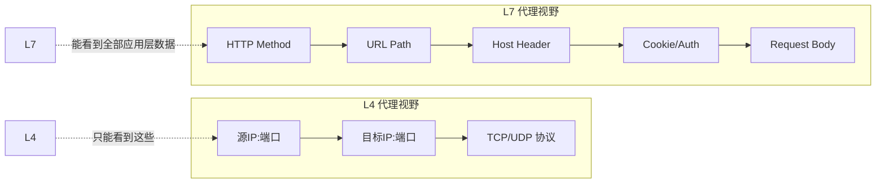
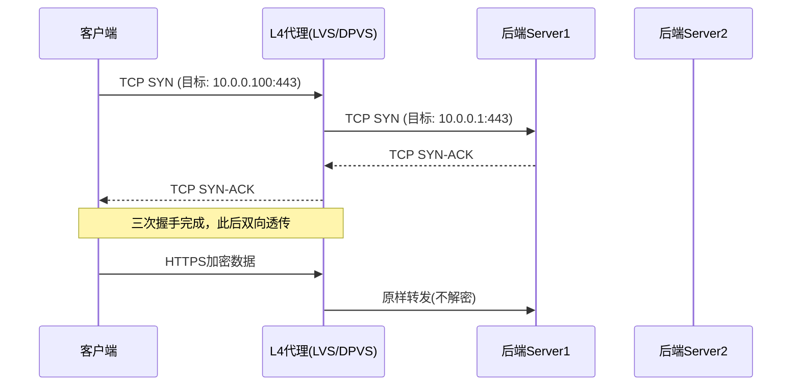
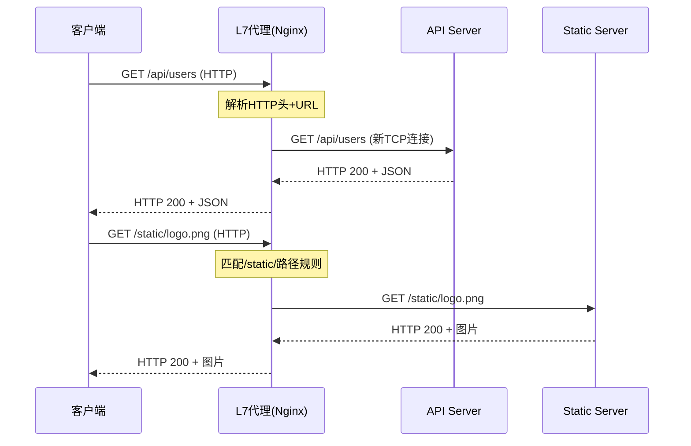
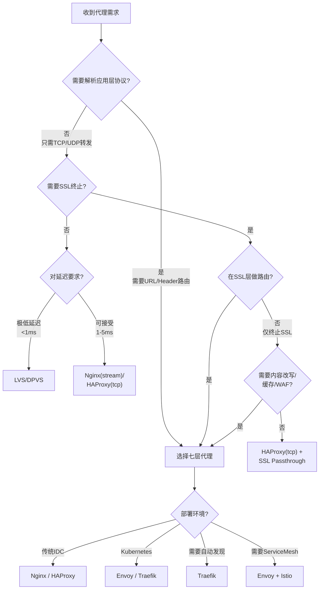
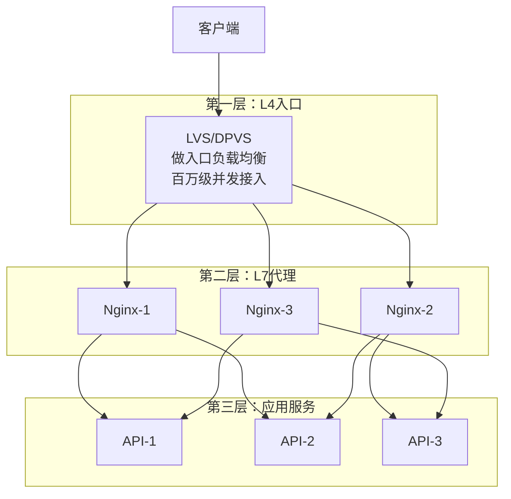
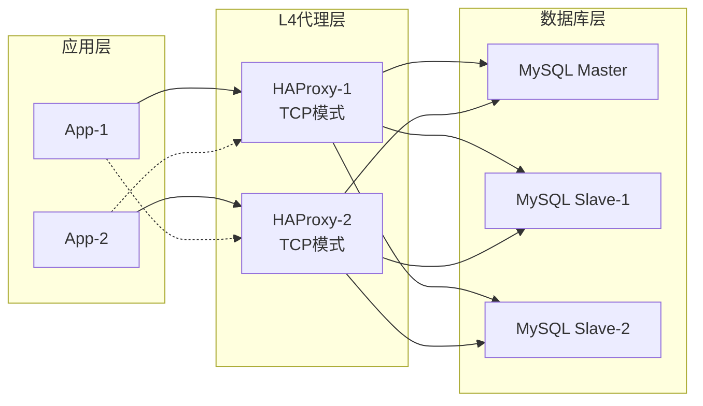
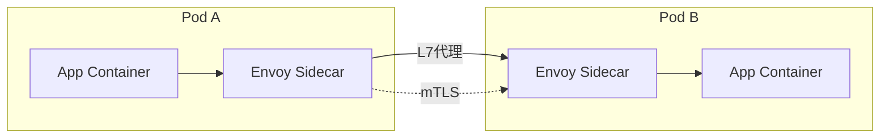

## 技巧3：四层代理与七层代理

在现代网络架构中，代理（Proxy）是流量调度、安全防护和服务治理的核心基础设施。理解四层（L4）代理与七层（L7）代理的区别、原理和适用场景，是架构师和运维工程师的必备技能。选错代理层会导致性能瓶颈、功能缺失甚至安全隐患——本节将从 OSI 模型出发，系统讲解两种代理的技术原理、主流工具、配置方法和实战选型策略。

---

### 一、OSI 模型与代理层级的关系

#### 1.1 OSI 七层模型速览

代理工作在哪一层，决定了它能"看到"什么信息、能做什么操作：

| 层级 | 名称 | 数据单元 | 代理可见信息 |
|------|------|----------|-------------|
| L2 | 数据链路层 | 帧（Frame） | MAC 地址 |
| L3 | 网络层 | 包（Packet） | IP 地址 |
| L4 | 传输层 | 段（Segment） | IP + 端口号 + TCP/UDP 协议 |
| L5-L6 | 会话/表示层 | — | 会话管理、加密解密 |
| L7 | 应用层 | 消息（Message） | HTTP 头、URL、Cookie、gRPC 方法名等 |



**核心区别一句话**：四层代理基于 IP+端口做转发决策，不解析应用层协议；七层代理解析完整的应用层协议内容（如 HTTP 头部、URL、gRPC 方法名），能做更精细的路由和治理。

#### 1.2 代理的本质

无论四层还是七层，代理的本质都是**中间人**：客户端与代理建立连接，代理再与后端服务器建立连接，将数据在两端之间转发。区别在于：

- **四层代理**：透传 TCP/UDP 流量，不做协议解析，效率高但功能少
- **七层代理**：终止客户端连接，解析应用层协议后重新发起新连接，功能丰富但开销大

---

### 二、四层代理（L4 Proxy）

#### 2.1 工作原理

四层代理工作在传输层，核心决策依据是**五元组**：

五元组 = {源IP, 源端口, 目标IP, 目标端口, 协议类型(TCP/UDP)}

收到一个 TCP 连接请求后，四层代理根据预设规则（轮询、加权、IP Hash 等）选择一个后端服务器，然后建立 TCP 连接并双向透传数据。代理**不解包、不修改**应用层内容，数据在代理层只是"搬运"。



#### 2.2 四层代理的优势

| 优势 | 说明 |
|------|------|
| **极高性能** | 不解析应用层协议，仅做包转发，单机百万级并发连接 |
| **低延迟** | 数据透传不拆包，额外延迟通常 < 1ms |
| **协议无关** | TCP/UDP 流量均可代理，不限于 HTTP，适用于数据库、Redis、游戏协议等 |
| **连接复用效率高** | 长连接场景下几乎零开销 |
| **内存占用低** | 不需要维护应用层状态，每连接内存开销极小 |

#### 2.3 四层代理的局限

| 局限 | 说明 |
|------|------|
| **无内容感知** | 无法根据 URL、Header 做路由决策 |
| **无法负载均衡 HTTP 语义** | 不能按请求路径分流、不能做灰度发布 |
| **缺乏安全检测** | 无法识别和拦截 SQL 注入、XSS 等应用层攻击 |
| **会话保持受限** | 只能基于 IP/端口做会话粘滞，无法基于 Cookie 或 Header |

#### 2.4 主流四层代理工具

**（1）LVS（Linux Virtual Server）**

LVS 是 Linux 内核级的四层负载均衡器，工作在 Netfilter 框架之上，性能极高：

```bash
# LVS-DR（Direct Routing）模式配置
# 调度器上执行
sudo ipvsadm -A -t 10.0.0.100:80 -s rr
sudo ipvsadm -a -t 10.0.0.100:80 -r 10.0.0.1:80 -g
sudo ipvsadm -a -t 10.0.0.100:80 -r 10.0.0.2:80 -g

# 查看状态
sudo ipvsadm -Ln --stats
```

LVS 三种工作模式对比：

| 模式 | 全称 | 原理 | 优点 | 缺点 |
|------|------|------|------|------|
| NAT | Network Address Translation | 响应流量也经过调度器 | 简单，后端无需特殊配置 | 调度器是瓶颈 |
| DR | Direct Routing | 响应流量直接返回客户端 | 性能最优 | 调度器与后端需在同一子网 |
| TUN | IP Tunneling | 通过 IP 隧道封装 | 可跨网段 | 配置复杂，MTU 问题 |

**（2）DPVS（DPDK-based LVS）**

基于 DPDK 的高性能 L4 负载均衡器，由爱奇艺开源，绕过内核协议栈：

```bash
# DPVS 配置示例（dpvs.conf）
vip="10.0.0.100/24"
mode="dr"
default-scheduler="wrr"

service "tcp/80" {
    scheduler "wrr"
    proto "tcp"
    host "10.0.0.1" {
        weight 10
       健康检查间隔 3000ms
    }
    host "10.0.0.2" {
        weight 5
    }
}
```

**（3）HAProxy（TCP 模式）**

HAProxy 同时支持 L4 和 L7，当设置 `mode tcp` 时即为四层代理：

```bash
# /etc/haproxy/haproxy.cfg - L4 模式
frontend mysql_front
    bind *:3306
    mode tcp
    default_backend mysql_back

backend mysql_back
    mode tcp
    balance roundrobin
    option mysql-check user haproxy
    server db1 10.0.0.1:3306 check inter 3s fall 3 rise 2
    server db2 10.0.0.2:3306 check inter 3s fall 3 rise 2
    server db3 10.0.0.3:3306 check inter 3s fall 3 rise 2 backup
```

**（4）Stream 模块（Nginx 1.9+）**

Nginx 的 stream 模块提供四层代理能力：

```nginx
# /etc/nginx/nginx.conf
stream {
    upstream ssh_backend {
        least_conn;
        server 10.0.0.1:22 weight=5;
        server 10.0.0.2:22 weight=3;
    }

    upstream redis_backend {
        hash $remote_addr consistent;
        server 10.0.0.3:6379;
        server 10.0.0.4:6379;
    }

    server {
        listen 2222;
        proxy_pass ssh_backend;
        proxy_connect_timeout 5s;
        proxy_timeout 300s;
    }

    server {
        listen 6379;
        proxy_pass redis_backend;
        proxy_connect_timeout 3s;
    }
}
```

#### 2.5 四层代理调用算法

| 算法 | 原理 | 适用场景 | 注意事项 |
|------|------|----------|----------|
| 轮询（Round Robin） | 依次分配到每个后端 | 后端服务器性能相近 | 最简单的策略 |
| 加权轮询（Weighted RR） | 按权重比例分配 | 后端配置不一致 | 需合理设置权重 |
| 最少连接（Least Conn） | 分配到当前连接数最少的后端 | 长连接场景（DB/Redis） | 需实时统计连接数 |
| 源地址哈希（Source Hash） | 同一源 IP 始终路由到同一后端 | 需要会话保持 | 后端扩容时会重新分布 |
| 一致性哈希（Consistent Hash） | 基于哈希环分配 | 缓存层（Redis/Memcached） | 扩容时仅迁移少量数据 |
| 随机（Random） | 随机选择 | 后端数量多时趋近均匀 | 不适合少量后端 |

---

### 三、七层代理（L7 Proxy）

#### 3.1 工作原理

七层代理工作在应用层，**终止客户端 TCP 连接**，完整解析 HTTP/gRPC 等协议后，根据应用层信息做路由决策，再与后端服务器建立新的连接。



#### 3.2 七层代理的独特能力

七层代理因为能"看懂"应用协议，具备四层代理无法实现的功能：

| 能力 | 说明 | 示例 |
|------|------|------|
| **基于内容的路由** | 按 URL/域名/Header 分流 | `/api/*` 转发到后端 A，`/static/*` 转发到后端 B |
| **HTTP 头部改写** | 添加/修改/删除请求和响应头 | 注入 `X-Forwarded-For`、移除 `Server` 头 |
| **SSL/TLS 终止** | 在代理层完成 HTTPS 解密，后端只需 HTTP | 减轻后端 TLS 计算开销 |
| **内容压缩** | gzip/Brotli 压缩响应体 | 减少传输带宽 |
| **请求/响应缓存** | 缓存静态资源或 API 响应 | CDN 回源、API 响应缓存 |
| **限流与熔断** | 基于 URL/Header/客户端 IP 限流 | 保护后端不被打垮 |
| **WAF 安全检测** | 检测 SQL 注入、XSS 等攻击 | 应用层防火墙 |
| **灰度发布** | 按 Header/Cookie/比例分流 | 新版本先给 5% 用户 |
| **WebSocket 代理** | 识别并代理 WebSocket 升级请求 | 实时聊天、推送服务 |
| **HTTP/2 与 gRPC** | 解析多路复用流和 RPC 调用 | 微服务间通信 |
| **请求重试与超时** | 应用层感知错误码，智能重试 | 502/503 自动重试其他后端 |

#### 3.3 七层代理的开销

更强的能力意味着更大的代价：

| 开销类型 | 量化对比 | 说明 |
|----------|----------|------|
| CPU 占用 | 比 L4 高 3-10 倍 | 需解析 HTTP 协议、改写头部 |
| 内存占用 | 每连接 10-50KB（L4 仅 1-2KB） | 需维护应用层状态缓冲 |
| 延迟增加 | 1-5ms 额外延迟 | 解析+改写+重建连接 |
| 吞吐量 | 通常为 L4 的 1/3 ~ 1/5 | 受限于协议解析和内存分配 |

> **经验数据**：同一台 16 核服务器上，LVS-DR 模式可达百万级 QPS，Nginx 七层代理约 10-50 万 QPS（取决于请求大小和规则复杂度）。

#### 3.4 主流七层代理工具

**（1）Nginx（七层代理之王）**

```nginx
# 完整的七层反向代理配置
upstream api_servers {
    least_conn;
    server 10.0.0.1:8080 weight=5 max_fails=3 fail_timeout=30s;
    server 10.0.0.2:8080 weight=3 max_fails=3 fail_timeout=30s;
    server 10.0.0.3:8080 weight=2 backup;

    keepalive 32;  # 保持到后端的长连接池
}

upstream static_servers {
    server 10.0.0.10:80;
    server 10.0.0.11:80;
}

# 限流配置
limit_req_zone $binary_remote_addr zone=api_limit:10m rate=100r/s;

server {
    listen 443 ssl http2;
    server_name api.example.com;

    # SSL 配置
    ssl_certificate     /etc/ssl/certs/example.com.pem;
    ssl_certificate_key /etc/ssl/private/example.com.key;
    ssl_protocols       TLSv1.2 TLSv1.3;
    ssl_ciphers         HIGH:!aNULL:!MD5;

    # API 代理
    location /api/ {
        limit_req zone=api_limit burst=50 nodelay;

        proxy_pass http://api_servers;
        proxy_set_header Host $host;
        proxy_set_header X-Real-IP $remote_addr;
        proxy_set_header X-Forwarded-For $proxy_add_x_forwarded_for;
        proxy_set_header X-Forwarded-Proto $scheme;

        # 超时设置
        proxy_connect_timeout 5s;
        proxy_send_timeout 30s;
        proxy_read_timeout 60s;

        # 缓冲设置
        proxy_buffering on;
        proxy_buffer_size 4k;
        proxy_buffers 8 16k;

        # 失败时尝试下一个后端
        proxy_next_upstream error timeout http_502 http_503;
        proxy_next_upstream_tries 3;
    }

    # WebSocket 代理
    location /ws/ {
        proxy_pass http://api_servers;
        proxy_http_version 1.1;
        proxy_set_header Upgrade $http_upgrade;
        proxy_set_header Connection "upgrade";
        proxy_read_timeout 3600s;
    }

    # 静态资源
    location /static/ {
        proxy_pass http://static_servers;
        expires 30d;
        add_header Cache-Control "public, immutable";
    }

    # gRPC 代理
    location /grpc.MyService/ {
        grpc_pass grpc://api_servers;
        grpc_read_timeout 300s;
        grpc_send_timeout 300s;
    }
}
```

**（2）HAProxy（HTTP 模式）**

```bash
# /etc/haproxy/haproxy.cfg - L7 模式
global
    maxconn 100000
    ssl-default-bind-options ssl-min-ver TLSv1.2
    tune.ssl.default-dh-param 2048

defaults
    mode http
    timeout connect 5s
    timeout client 30s
    timeout server 30s
    option httplog
    option dontlognull
    option http-server-close
    option forwardfor except 127.0.0.0/8

# ACL 路由规则
frontend web_front
    bind *:443 ssl crt /etc/haproxy/certs/
    bind *:80
    redirect scheme https code 301 if !{ ssl_fc }

    # 基于路径的 ACL
    acl is_api path_beg /api/
    acl is_static path_beg /static/
    acl is_websocket hdr(Upgrade) -i websocket

    # 基于域名的 ACL
    acl is_admin hdr(host) -i admin.example.com

    use_backend api_servers if is_api
    use_backend static_servers if is_static
    use_backend ws_servers if is_websocket
    use_backend admin_servers if is_admin
    default_backend web_servers

backend api_servers
    balance roundrobin
    option httpchk GET /health
    http-check expect status 200
    server api1 10.0.0.1:8080 check inter 5s fall 3 rise 2
    server api2 10.0.0.2:8080 check inter 5s fall 3 rise 2

backend static_servers
    balance uri  # URI 哈希，提升缓存命中率
    server static1 10.0.0.10:80 check
    server static2 10.0.0.11:80 check

backend ws_servers
    balance source
    timeout tunnel 3600s
    server ws1 10.0.0.20:8080 check
```

**（3）Envoy（云原生 L7 代理）**

Envoy 是 Istio 的数据面，原生支持 L7 流量管理：

```yaml
# envoy.yaml - Envoy L7 代理配置
static_resources:
  listeners:
  - name: listener_0
    address:
      socket_address:
        address: 0.0.0.0
        port_value: 8080
    filter_chains:
    - filters:
      - name: envoy.filters.network.http_connection_manager
        typed_config:
          "@type": type.googleapis.com/envoy.extensions.filters.network.http_connection_manager.v3.HttpConnectionManager
          stat_prefix: ingress_http
          route_config:
            name: local_route
            virtual_hosts:
            - name: backend
              domains: ["*"]
              routes:
              - match: { prefix: "/api/v2" }
                route:
                  cluster: api_v2_cluster
                  timeout: 30s
                  retry_policy:
                    num_retries: 3
                    retry_on: "5xx,reset,connect-failure"
              - match: { prefix: "/api/v1" }
                route: { cluster: api_v1_cluster }
              - match: { prefix: "/websocket" }
                route:
                  cluster: ws_cluster
                  timeout: 0s  # WebSocket 不设超时
                request_headers_to_add:
                - header:
                    key: "x-upgrade-protocol"
                    value: "websocket"
          http_filters:
          - name: envoy.filters.http.router
            typed_config:
              "@type": type.googleapis.com/envoy.extensions.filters.http.router.v3.Router
  clusters:
  - name: api_v2_cluster
    type: STRICT_DNS
    lb_policy: ROUND_ROBIN
    load_assignment:
      cluster_name: api_v2_cluster
      endpoints:
      - lb_endpoints:
        - endpoint:
            address:
              socket_address:
                address: 10.0.0.1
                port_value: 8080
```

**（4）Traefik（自动发现型 L7 代理）**

Traefik 天然适配 Docker/Kubernetes，自动发现服务并生成路由规则：

```yaml
# docker-compose.yml + Traefik 标签
services:
  traefik:
    image: traefik:v3.0
    command:
      - "--api.insecure=true"
      - "--providers.docker=true"
    ports:
      - "80:80"
      - "443:443"
    volumes:
      - /var/run/docker.sock:/var/run/docker.sock

  webapp:
    image: myapp:latest
    labels:
      - "traefik.enable=true"
      - "traefik.http.routers.webapp.rule=Host(`app.example.com`) &amp;&amp; PathPrefix(`/api`)"
      - "traefik.http.routers.webapp.tls=true"
      - "traefik.http.routers.webapp.tls.certresolver=letsencrypt"
      - "traefik.http.services.webapp.loadbalancer.server.port=8080"
      - "traefik.http.services.webapp.loadbalancer.healthcheck.path=/health"
      - "traefik.http.services.webapp.loadbalancer.healthcheck.interval=10s"
      - "traefik.http.middlewares.rate-limit.ratelimit.average=100"
      - "traefik.http.middlewares.rate-limit.ratelimit.burst=50"
      - "traefik.http.routers.webapp.middlewares=rate-limit"
```

#### 3.5 七层负载均衡算法

| 算法 | 原理 | 适用场景 |
|------|------|----------|
| 轮询（Round Robin） | 依次分配 | 后端性能一致 |
| 加权轮询（Weighted RR） | 按权重分配 | 后端配置不一 |
| 最少连接（Least Conn） | 连接数最少的后端 | 后端处理时间差异大 |
| IP Hash | 客户端 IP 哈希 | 需要会话保持 |
| URI Hash | 请求 URI 哈希 | 缓存层（提升命中率） |
| Header Hash | 指定 Header 哈希 | 多租户按租户 ID 分流 |
| 一致性哈希 | 基于哈希环 | 缓存集群，节点增减平滑 |
| 最短响应时间 | 综合连接数和响应时间 | 对延迟敏感的场景 |

---

### 四、四层 vs 七层代理：选型决策

#### 4.1 对比总览

| 维度 | 四层代理 | 七层代理 |
|------|---------|---------|
| 工作层级 | 传输层（TCP/UDP） | 应用层（HTTP/gRPC） |
| 决策依据 | IP + 端口 | URL/Header/Cookie/域名 |
| 协议解析 | 不解析应用层 | 完整解析应用层协议 |
| 性能（QPS） | 百万级 | 10-50 万级 |
| 延迟开销 | < 1ms | 1-5ms |
| 内存/连接 | 1-2 KB | 10-50 KB |
| 会话保持 | 基于 IP/端口 | 基于 Cookie/Header/任意字段 |
| 路由能力 | 仅 IP 级 | URL/Header/域名级别 |
| 安全能力 | 无（仅 ACL） | WAF、注入检测、限流 |
| SSL 终止 | 不支持（透传） | 原生支持 |
| 内容改写 | 不支持 | 支持 |
| 协议支持 | TCP/UDP 任意协议 | HTTP/gRPC/WebSocket |
| 适用层 | 数据库/Redis/游戏 | Web/API/微服务 |
| 代表工具 | LVS、DPVS、HAProxy(tcp)、Nginx(stream) | Nginx(http)、HAProxy(http)、Envoy、Traefik |

#### 4.2 决策流程图



#### 4.3 典型场景选型

| 场景 | 推荐方案 | 理由 |
|------|---------|------|
| Web 网站反向代理 | L7: Nginx | 需要 URL 路由、静态缓存、SSL 终止 |
| MySQL 读写分离 | L4: HAProxy TCP | 协议层无需解析，保持 MySQL 连接 |
| Redis 集群代理 | L4: LVS/DPVS | TCP 级转发，极低延迟 |
| 微服务 API 网关 | L7: Envoy | 需要路由、限流、熔断、可观测性 |
| 游戏服务器代理 | L4: 自定义/DPVS | 自定义 TCP 协议，L7 无法解析 |
| CDN 回源 | L4: LVS + L7: Nginx | L4 做入口分流，L7 做内容路由 |
| SSL 全站加速 | L7: Nginx | 需要 SSL 终止 + 缓存 |
| 数据库连接池 | L4: ProxySQL/HAProxy | MySQL/PG 协议级别代理 |

---

### 五、四层与七层混合架构

实际生产中，往往不是二选一，而是**L4 + L7 分层部署**，各取所长：

#### 5.1 经典三层架构



请求流向：
客户端 → LVS(L4, 极高并发接入) → Nginx(L7, 路由/SSL/限流) → 应用服务器

**为什么分层？**
- LVS 承担海量连接的接入压力（百万级 TCP 连接）
- Nginx 负责应用层路由、SSL 终止、安全防护
- 应用服务器只处理业务逻辑
- 每层专注一个职责，扩展和故障隔离都更容易

#### 5.2 数据库代理架构



关键配置（HAProxy MySQL 健康检查）：

```bash
backend mysql_write
    mode tcp
    balance roundrobin
    option mysql-check user haproxy check_db
    server master 10.0.0.10:3306 check inter 2s fall 3 rise 2

backend mysql_read
    mode tcp
    balance leastconn
    option mysql-check user haproxy
    server slave1 10.0.0.21:3306 check inter 2s weight 10
    server slave2 10.0.0.22:3306 check inter 2s weight 8
```

---

### 六、生产环境调优要点

#### 6.1 系统内核参数

```bash
# /etc/sysctl.conf - 代理服务器内核优化

# 连接队列长度（高并发必备）
net.core.somaxconn = 65535
net.ipv4.tcp_max_syn_backlog = 65535

# 文件描述符限制
fs.file-max = 1000000

# TCP 连接复用
net.ipv4.tcp_tw_reuse = 1
net.ipv4.tcp_fin_timeout = 15
net.ipv4.tcp_keepalive_time = 600
net.ipv4.tcp_keepalive_intvl = 30
net.ipv4.tcp_keepalive_probes = 3

# 端口范围
net.ipv4.ip_local_port_range = 1024 65535

# 内存调优
net.ipv4.tcp_mem = 786432 1048576 26777216
net.ipv4.tcp_rmem = 4096 87380 16777216
net.ipv4.tcp_wmem = 4096 65536 16777216

# 连接跟踪（仅需 conntrack 的场景）
net.netfilter.nf_conntrack_max = 1000000
net.netfilter.nf_conntrack_tcp_timeout_established = 3600

# 应用生效
# sysctl -p
```

#### 6.2 文件描述符与进程限制

```bash
# /etc/security/limits.conf
* soft nofile 1000000
* hard nofile 1000000
* soft nproc 65535
* hard nproc 65535

# Nginx worker_connections 设置
# 在 nginx.conf 的 events 块中：
events {
    worker_connections 65535;
    multi_accept on;
    use epoll;
}
```

#### 6.3 健康检查策略

| 检查方式 | 适用层级 | 实现方式 | 优缺点 |
|----------|---------|---------|--------|
| TCP 检查 | L4/L7 | 连接目标端口看是否能建立 | 简单快速，但不检测应用状态 |
| HTTP 检查 | L7 | 请求 `/health` 端点 | 能验证应用是否正常响应 |
| 自定义检查 | L7 | HTTP 200 + 响应体包含预期值 | 最精准，但需开发配合 |
| 双重检查 | L4+L7 | TCP 连通性 + HTTP 健康端点 | 最可靠 |

```bash
# HAProxy HTTP 健康检查（精确检查）
backend app_servers
    option httpchk GET /health
    http-check expect status 200
    http-check send hdr Content-Type value "application/json"
    server app1 10.0.0.1:8080 check inter 3s fall 3 rise 2
```

```nginx
# Nginx 被动健康检查（开源版）
upstream backend {
    server 10.0.0.1:8080 max_fails=3 fail_timeout=30s;
    server 10.0.0.2:8080 max_fails=3 fail_timeout=30s;
}
```

#### 6.4 性能监控指标

| 指标 | 含义 | 告警阈值建议 |
|------|------|-------------|
| Active Connections | 当前活跃连接数 | > 80% maxconn |
| Connection Rate | 每秒新建连接数 | 观察趋势 |
| Response Time | 后端平均响应时间 | > 500ms |
| 5xx Error Rate | 5xx 错误率 | > 1% |
| Backend Unavailable | 后端不可用次数 | > 0 持续告警 |
| Queue Depth | 等待队列长度 | > 0 持续 |
| Bandwidth | 网络带宽使用率 | > 70% |
| CPU Utilization | CPU 使用率 | > 80% |

```bash
# 实时监控命令
# 连接状态统计
ss -s

# 各状态连接数
ss -ant | awk '{print $1}' | sort | uniq -c | sort -rn

# 当前并发连接数（对比 ulimit）
cat /proc/sys/net/core/somaxconn
ulimit -n

# Nginx 活跃连接
curl -s http://127.0.0.1/nginx_status

# HAProxy 统计页面
echo "show stat" | socat unix-connect:/var/run/haproxy.sock stdio | \
    awk -F',' '{print $1, $2, $18, $19, $33, $34}'
```

---

### 七、常见误区与避坑

#### 误区 1：七层代理一定比四层慢

**实际情况**：在简单代理场景（纯转发、不改写头部、不缓存），Nginx 七层代理的额外延迟仅 0.5-1ms，对大多数 Web 应用影响可忽略。但在百万级并发或极低延迟要求（如交易系统 < 100μs）的场景，L4 的优势才真正体现。

#### 误区 2：LVS 万能，什么都能代理

**实际情况**：LVS 只做四层转发。如果需要基于 URL 路由、SSL 终止、内容缓存，必须配合七层代理使用。直接用 LVS 代理 HTTP 服务而不加 Nginx，会失去所有七层能力。

#### 误区 3：HAProxy 只能做负载均衡

**实际情况**：HAProxy 的七层能力非常强大——ACL 规则引擎、Lua 脚本扩展、SSL 终止、内容交换（Content Switching）、请求改写，功能不亚于 Nginx。其统计页面和运维工具链（Runtime API）在生产环境中尤为出色。

#### 误区 4：会话保持只需 IP Hash 就够了

**实际情况**：IP Hash 在以下场景会失效：
- 客户端通过 NAT 出口，多用户共享同一 IP
- 移动客户端频繁切换网络（WiFi ↔ 4G）
- 企业代理出口 IP

更好的方案是基于 Cookie 或自定义 Header 做会话粘滞。

#### 误区 5：代理层越多越好

**实际情况**：每一层代理都会增加延迟、故障点和运维复杂度。遵循原则：
- 如果 L4 能满足需求，不要上 L7
- 如果单层 L7 能满足需求，不要做 L4+L7 两层
- 只在真正需要（如百万并发接入 + 应用层路由）时才分层部署

---

### 八、实战案例：从零搭建 Web 代理架构

#### 8.1 需求场景

一个日均 PV 500 万的电商网站，需要：
- HTTPS 终止
- API 和静态资源分流
- 限流防护
- 后端故障自动切换

#### 8.2 方案选型

不需要 L4 入口（500 万 PV 不到百万级并发），单层 Nginx 七层代理即可满足：

```nginx
# /etc/nginx/nginx.conf
user www-data;
worker_processes auto;
worker_rlimit_nofile 200000;

events {
    worker_connections 10000;
    multi_accept on;
    use epoll;
}

http {
    # 连接优化
    sendfile on;
    tcp_nopush on;
    tcp_nodelay on;
    keepalive_timeout 65;
    keepalive_requests 1000;

    # 限流
    limit_req_zone $binary_remote_addr zone=api:10m rate=50r/s;
    limit_req_zone $binary_remote_addr zone=login:10m rate=5r/m;

    # 日志格式（含上游信息）
    log_format main '$remote_addr - $remote_user [$time_local] '
                    '"$request" $status $body_bytes_sent '
                    '"$http_referer" "$http_user_agent" '
                    'upstream=$upstream_addr '
                    'response_time=$upstream_response_time';

    access_log /var/log/nginx/access.log main;

    # 上游定义
    upstream api_backend {
        least_conn;
        server 10.0.0.1:8080 max_fails=3 fail_timeout=30s;
        server 10.0.0.2:8080 max_fails=3 fail_timeout=30s;
        server 10.0.0.3:8080 max_fails=3 fail_timeout=30s backup;
        keepalive 64;
    }

    upstream static_backend {
        server 10.0.0.10:80;
        server 10.0.0.11:80;
    }

    server {
        listen 443 ssl http2;
        server_name shop.example.com;

        ssl_certificate     /etc/ssl/certs/shop.pem;
        ssl_certificate_key /etc/ssl/private/shop.key;
        ssl_protocols TLSv1.2 TLSv1.3;
        ssl_prefer_server_ciphers on;
        ssl_session_cache shared:SSL:10m;
        ssl_session_timeout 1d;
        ssl_session_tickets off;

        # HSTS 安全头
        add_header Strict-Transport-Security "max-age=31536000" always;

        # API 接口
        location /api/ {
            limit_req zone=api burst=100 nodelay;

            proxy_pass http://api_backend;
            proxy_set_header Host $host;
            proxy_set_header X-Real-IP $remote_addr;
            proxy_set_header X-Forwarded-For $proxy_add_x_forwarded_for;
            proxy_set_header X-Forwarded-Proto $scheme;
            proxy_http_version 1.1;
            proxy_set_header Connection "";

            proxy_connect_timeout 5s;
            proxy_read_timeout 60s;
            proxy_send_timeout 30s;

            proxy_next_upstream error timeout http_502 http_503 http_504;
            proxy_next_upstream_tries 3;
            proxy_next_upstream_timeout 10s;
        }

        # 登录接口（更严格的限流）
        location /api/user/login {
            limit_req zone=login burst=3 nodelay;
            proxy_pass http://api_backend;
            proxy_set_header Host $host;
            proxy_set_header X-Real-IP $remote_addr;
        }

        # 静态资源
        location /static/ {
            proxy_pass http://static_backend;
            proxy_cache_valid 200 1d;
            expires 30d;
            add_header Cache-Control "public, immutable";
        }

        # 前端页面
        location / {
            proxy_pass http://static_backend;
            proxy_set_header Host $host;
            try_files $uri $uri/ /index.html;
        }
    }

    # HTTP -> HTTPS 重定向
    server {
        listen 80;
        server_name shop.example.com;
        return 301 https://$host$request_uri;
    }
}
```

#### 8.3 性能验证

```bash
# 使用 wrk 进行压测
wrk -t4 -c500 -d30s --latency http://shop.example.com/api/products

# 使用 ab 进行压测
ab -n 100000 -c 200 -H "Authorization: Bearer xxx" \
    http://shop.example.com/api/products

# 观察 Nginx 状态
watch -n1 "ss -s"
watch -n1 "curl -s http://127.0.0.1/nginx_status"
```

---

### 九、进阶话题

#### 9.1 Service Mesh 中的代理

在 Kubernetes Service Mesh（如 Istio）中，每个 Pod 旁边会注入一个 **Envoy sidecar** 代理：



此时 Envoy 承担了所有 L7 能力：流量路由、负载均衡、熔断、重试、可观测性、安全（mTLS），应用代码完全无感知。这是七层代理的终极形态——基础设施级别的 L7 治理。

#### 9.2 eBPF 与新一代四层代理

传统四层代理（如 LVS）依赖 Netfilter/IPVS，eBPF 提供了更高效的替代方案：

| 技术 | 路径 | 性能 | 灵活性 |
|------|------|------|--------|
| LVS/IPVS | 内核 Netfilter | 极高 | 低 |
| DPVS | 用户态 DPDK | 最高 | 中 |
| Cilium eBPF | 内核 eBPF | 极高 | 高 |
| Calico eBPF | 内核 eBPF | 高 | 中 |

Cilium 利用 eBPF 在内核网络栈中直接做四层负载均衡，绕过了 iptables/IPVS 的 O(n) 规则匹配，实现 O(1) 的查找复杂度，在大规模 Kubernetes 集群中性能优势显著。

#### 9.3 QUIC/HTTP3 时代的代理

HTTP/3 基于 QUIC（UDP），传统七层代理无法直接处理（因为 L4 负载均衡器看到的是 UDP 流量）。解决方案：

- **L4 代理**：可直接代理 QUIC/UDP 流量，但只能做连接级别的分流
- **L7 代理**：Nginx 1.25.0+、Envoy 已支持 QUIC，可解析 HTTP/3 请求做 L7 路由
- **混合方案**：L4 做 UDP 流量初步分流，L7 代理终止 QUIC 连接

---

### 十、总结

| 选择维度 | 选四层 | 选七层 | 四层+七层混合 |
|----------|--------|--------|--------------|
| 性能优先 | ✓ | | |
| 功能优先 | | ✓ | |
| 超高并发入口 | ✓ | | ✓ |
| 应用层路由 | | ✓ | ✓ |
| 数据库/中间件代理 | ✓ | | |
| Web/API 代理 | | ✓ | |
| 安全防护（WAF） | | ✓ | ✓ |
| 成本敏感 | ✓ | | |

**核心原则**：
1. **按需选择**——不要过度设计，能用单层解决就不用两层
2. **职责分离**——L4 负责高并发接入，L7 负责智能路由和治理
3. **监控先行**——部署代理后，第一件事是配置监控和告警
4. **渐进演进**——从单层开始，遇到瓶颈再分层
5. **压测验证**——任何架构变更都要通过压测确认性能达标
