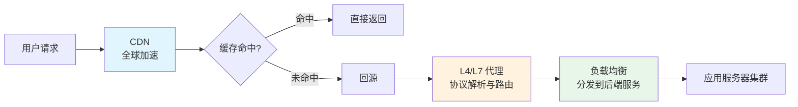
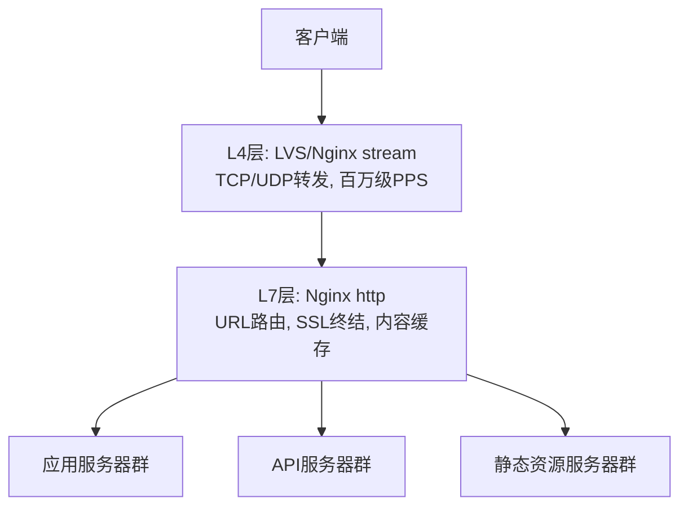
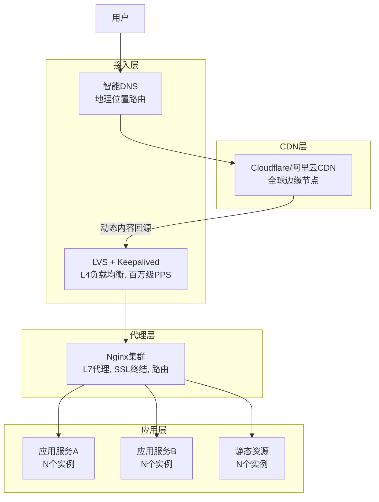

# 第20章 网络架构 — 核心技巧

理论基础建立了概念框架，但知道"是什么"不等于知道"怎么做"。核心技巧这一节的目标，是将负载均衡、CDN、四层/七层代理三大主题从教科书式的原理讲解，转化为工程师可以立刻落地的工程实践。

## 本节定位：从理论到落地的桥梁

在实际生产环境中，网络架构的决策往往不是"选不选负载均衡"，而是"在Nginx和HAProxy之间怎么选""CDN回源策略怎么配""L4和L7代理怎么组合使用"。这些决策需要的不是抽象概念，而是可执行的配置、可验证的调优方法、可复用的最佳实践。

本节三个技巧按照流量从外到内的路径组织：



用户请求首先经过CDN层——静态内容直接在边缘节点返回，动态内容经过加速链路回源。到达源站后，由四层/七层代理进行协议解析和路由决策。最后，负载均衡器将请求分发到合适的后端实例。三层协同工作，构成了现代互联网服务的流量处理管线。

## 知识体系总览

### 三大技巧的关联关系

| 技巧 | 核心问题 | 技术层级 | 典型工具 |
|------|---------|---------|---------|
| CDN | 如何让全球用户以最低延迟获取内容？ | L7 + 边缘计算 | Cloudflare、阿里云CDN、Nginx缓存 |
| 负载均衡 | 如何将流量公平、高效地分配到多台后端？ | L4/L7 | Nginx、HAProxy、LVS、Envoy |
| 四层/七层代理 | 如何根据协议层级选择合适的代理方案？ | L4(传输层) / L7(应用层) | LVS、Nginx stream、Nginx http |

三者不是独立的技术孤岛，而是层层嵌套的协作关系：

- **CDN依赖负载均衡**：CDN的边缘节点内部就是一个复杂的负载均衡系统，需要将用户请求分配到最合适的缓存服务器
- **负载均衡依赖代理能力**：Nginx之所以能做负载均衡，根本原因在于它是一个功能完备的七层代理
- **代理层级决定路由精度**：四层代理只看IP和端口（快但粗糙），七层代理能解析URL和Header（慢但精确），选择哪一层直接影响架构设计

### 与理论基础的对应关系

理论基础一节覆盖了负载均衡算法的数学原理（轮询、一致性哈希、令牌桶等）、反向代理架构（Nginx/HAProxy/Envoy/Cilium的设计哲学）、CDN的分层缓存模型、服务网格的Sidecar模式等。核心技巧不重复这些原理，而是在原理之上回答三个实际问题：

1. **CDN**：理论告诉我们要做缓存分层，技巧告诉你Nginx的`proxy_cache`怎么配、缓存键怎么设计、回源风暴怎么防
2. **负载均衡**：理论告诉你各种算法的优劣，技巧告诉你Nginx生产级配置的每一行参数怎么写、健康检查怎么配、高可用怎么做
3. **四层/七层代理**：理论告诉L4和L7的区别，技巧告诉你什么时候该用stream模块、什么时候该用http模块、怎么组合使用

---

## 技巧一：CDN — 全球内容加速

### 核心问题

当你的用户分布在全国甚至全球时，一个北京用户访问部署在上海的服务器，网络延迟可能达到30-50ms。如果服务器还需要处理数据库查询，整体响应可能轻松突破200ms。CDN通过将内容缓存到离用户最近的边缘节点，将这个延迟压缩到5-10ms。

### 覆盖内容

本技巧从三个层面展开CDN实践：

**配置层面**：Nginx作为自建CDN的边缘节点，完整的`proxy_cache`配置方案。包括缓存路径规划、缓存键设计（哪些query params该保留、哪些该忽略）、缓存有效期策略（`proxy_cache_valid`的分级设置）、缓存穿透/击穿/雪崩的防护配置。

**策略层面**：回源策略的选择——Pass-through（直接回源）、Pre-fetch（主动预取）、Stale-while-revalidate（过期后异步刷新）各自的适用场景和配置方法。合并回源（Request Coalescing）的实现原理和启用方式。

**架构层面**：边缘节点→区域节点→源站的三级缓存架构设计，缓存预热的操作流程，以及动态内容加速（Argo Smart Routing、BBR拥塞控制、QUIC/HTTP3）的工程实践。

```nginx
# CDN边缘节点核心配置示例
proxy_cache_path /var/cache/nginx levels=1:2
    keys_zone=cdn_zone:100m
    max_size=10g
    inactive=7d
    use_temp_path=off;

server {
    listen 80;
    
    # 静态资源CDN加速
    location ~* \.(jpg|png|css|js|woff2|mp4)$ {
        proxy_cache cdn_zone;
        proxy_cache_valid 200 30d;        # 200响应缓存30天
        proxy_cache_valid 404 1m;         # 404缓存1分钟（防止穿透）
        proxy_cache_use_stale error timeout updating;
        
        # 缓存键设计：忽略版本号参数
        proxy_cache_key $scheme$host$uri$is_args$args;
        
        add_header X-Cache-Status $upstream_cache_status;
        expires 30d;
    }
}
```

### 关键要点

| 维度 | 要点 |
|------|------|
| 缓存命中率 | 目标>90%，通过`X-Cache-Status`头监控（HIT/MISS/EXPIRED/UPDATING） |
| 缓存穿透防护 | 对404结果短时间缓存，布隆过滤器拦截不存在的key |
| 缓存击穿防护 | `proxy_cache_lock`确保同一key只有一个请求回源，其余等待 |
| 回源风暴防护 | 合并回源 + 分级缓存 + 大促前缓存预热 |
| 动态加速 | BBR拥塞控制 + QUIC协议 + 智能路由 |

---

## 技巧二：负载均衡 — 流量分发的艺术

### 核心问题

单台服务器有物理上限——CPU、内存、网络带宽、文件描述符都有天花板。当单机无法继续扩展时，负载均衡器成为"交通指挥官"，决定每个请求交给哪台服务器。

### 覆盖内容

本技巧是三者中内容最丰富的（32KB+），完整覆盖负载均衡的工程实践：

**算法选型**：从轮询到一致性哈希，7种主流算法的适用场景和选型决策表。核心结论——大多数场景下，加权最少连接（Weighted Least Connections）是最安全的默认选择。

**方案对比**：Nginx、HAProxy、LVS、Envoy、Traefik五大方案的架构特点、性能数据、适用场景。选型决策树：

通用Web服务 → Nginx
精细健康检查 + TCP代理 → HAProxy
超高性能入口（百万级QPS）→ LVS + Keepalived
微服务/Service Mesh → Envoy
容器化快速部署 → Traefik
全面上云 → 云厂商 ALB/NLB

**Nginx生产级配置**：从`nginx.conf`全局优化（worker进程数、epoll、零拷贝）到upstream配置（权重、健康检查、长连接池、备用服务器），到反向代理配置（超时、重试、Header传递），再到高级路由（URL分流、WebSocket代理、会话保持），每一行配置都有注释说明。

**健康检查**：被动检查（`max_fails`/`fail_timeout`）和主动检查（Nginx Plus的`health_check`指令）的区别和组合使用。开源Nginx通过`nginx_upstream_check_module`（淘宝开源）实现主动检查。

**高可用架构**：LVS+Keepalived双机热备作为L4入口，Nginx集群作为L7代理的典型架构。Keepalived的VRRP协议原理、VIP漂移机制、故障切换流程。

### 关键配置模板

```nginx
# 生产级负载均衡配置
upstream backend {
    # 算法选择
    least_conn;
    
    # 后端服务器
    server 10.0.0.1:8080 weight=5 max_fails=3 fail_timeout=30s;
    server 10.0.0.2:8080 weight=3 max_fails=3 fail_timeout=30s;
    server 10.0.0.3:8080 weight=2 max_fails=3 fail_timeout=30s;
    
    # 备用服务器
    server 10.0.0.4:8080 backup;
    
    # 长连接池
    keepalive 32;
    
    # 连接复用
    keepalive_timeout 60s;
}

server {
    listen 443 ssl http2;
    
    location /api/ {
        proxy_pass http://backend;
        
        # 客户端信息传递
        proxy_set_header Host $host;
        proxy_set_header X-Real-IP $remote_addr;
        proxy_set_header X-Forwarded-For $proxy_add_x_forwarded_for;
        proxy_set_header X-Forwarded-Proto $scheme;
        
        # 超时配置
        proxy_connect_timeout 5s;
        proxy_send_timeout 60s;
        proxy_read_timeout 60s;
        
        # 故障重试
        proxy_next_upstream error timeout http_502 http_503;
        proxy_next_upstream_tries 2;
        
        # 长连接
        proxy_http_version 1.1;
        proxy_set_header Connection "";
    }
}
```

### 性能调优要点

| 调优维度 | 配置项 | 效果 |
|----------|--------|------|
| 连接处理 | `worker_connections 65535` + `use epoll` | 支撑高并发连接 |
| 文件传输 | `sendfile on` + `tcp_nopush on` | 零拷贝，减少CPU开销 |
| 长连接 | `keepalive 32` + `proxy_http_version 1.1` | 避免反复TCP握手 |
| 缓冲区 | `proxy_buffer_size 16k` + `proxy_buffers 4 32k` | 减少磁盘IO |
| 超时控制 | 分层设置connect/send/read超时 | 避免慢请求占用连接 |

---

## 技巧三：四层/七层代理 — 协议层级的选择

### 核心问题

同一个负载均衡需求，用四层代理还是七层代理？这个问题没有标准答案，但有清晰的决策框架。四层代理像"只看门牌号的邮递员"——快但不智能；七层代理像"读信内容的秘书"——慢但精准。

### 覆盖内容

**四层代理（L4）实战**：

Nginx的`stream`模块提供四层代理能力。与`http`模块不同，`stream`工作在传输层，直接转发TCP/UDP流量，不解析HTTP协议。

```nginx
# Nginx四层代理（stream模块）
stream {
    upstream mysql_backend {
        least_conn;
        server 10.0.1.1:3306;
        server 10.0.1.2:3306;
        server 10.0.1.3:3306 backup;
    }
    
    server {
        listen 3306;
        proxy_pass mysql_backend;
        proxy_connect_timeout 5s;
        proxy_timeout 300s;
    }
}
```

适用场景：数据库读写分离（MySQL/PostgreSQL）、Redis集群代理、gRPC TCP代理、任意TCP/UDP协议的四层负载。

**七层代理（L7）实战**：

Nginx的`http`模块是经典的七层代理。它解析完整的HTTP请求，支持基于URL、Header、Cookie、Method的精细化路由。

```nginx
# Nginx七层代理 — 基于URL的路由分流
upstream api_v1 { server 10.0.1.1:8080; }
upstream api_v2 { server 10.0.2.1:8080; }
upstream static { server 10.0.3.1:80; }

server {
    listen 443 ssl;
    
    location /api/v1/ { proxy_pass http://api_v1; }
    location /api/v2/ { proxy_pass http://api_v2; }
    location ~* \.(jpg|css|js)$ { proxy_pass http://static; }
}
```

**四层+七层组合架构**：

在大规模系统中，通常采用L4+L7的组合模式：



L4层处理海量连接的快速转发，L7层处理精细化的路由决策。两层各司其职，既保证性能又保证灵活性。

### L4 vs L7 选型决策

| 场景 | 推荐 | 原因 |
|------|------|------|
| 数据库代理 | L4 | 只需要TCP转发，不解析SQL |
| HTTP服务 | L7 | 需要URL路由、Header改写 |
| gRPC服务 | L7 | 需要解析HTTP/2帧 |
| 视频流/游戏 | L4 | UDP转发，不能有额外延迟 |
| 混合协议 | L4入口 + L7分流 | L4做粗分，L7做精分 |
| SSL终结 | L7 | L4不处理TLS |

### Nginx stream模块配置详解

```nginx
stream {
    # === TCP代理：MySQL读写分离 ===
    upstream mysql_read {
        least_conn;
        server 10.0.1.1:3306 weight=5;
        server 10.0.1.2:3306 weight=3;
    }
    
    upstream mysql_write {
        server 10.0.2.1:3306;
    }
    
    # 读写分离：通过端口区分
    server {
        listen 3306;     # 读请求
        proxy_pass mysql_read;
        proxy_connect_timeout 3s;
        proxy_timeout 300s;
    }
    
    server {
        listen 3307;     # 写请求
        proxy_pass mysql_write;
        proxy_connect_timeout 3s;
        proxy_timeout 300s;
    }
    
    # === UDP代理：DNS加速 ===
    upstream dns_servers {
        server 8.8.8.8:53;
        server 8.8.4.4:53;
    }
    
    server {
        listen 53 udp;
        proxy_pass dns_servers;
        proxy_timeout 5s;
    }
}
```

### SSL终结的层级选择

SSL终结是四层/七层代理最常见的分工场景：

- **L4层不做SSL终结**：四层代理只转发加密的TCP流，不解密
- **L7层做SSL终结**：七层代理终止TLS连接，将明文请求转发给后端

```nginx
# SSL终结配置
server {
    listen 443 ssl http2;
    server_name api.example.com;
    
    ssl_certificate     /etc/nginx/ssl/fullchain.pem;
    ssl_certificate_key /etc/nginx/ssl/privkey.pem;
    ssl_protocols       TLSv1.2 TLSv1.3;
    ssl_ciphers         ECDHE-ECDSA-AES128-GCM-SHA256:ECDHE-RSA-AES128-GCM-SHA256;
    ssl_prefer_server_ciphers on;
    
    # HSTS：强制浏览器使用HTTPS
    add_header Strict-Transport-Security "max-age=31536000; includeSubDomains" always;
    
    location / {
        proxy_pass http://backend;
        # 后端收到的是明文HTTP
    }
}
```

**为什么在L7层做SSL终结？** 因为L7代理需要解析HTTP内容来做路由决策，必须先解密。而L4代理不需要看内容，所以可以让加密流量直接穿透，减少解密开销。

---

## 三层协作的完整架构

将三个技巧组合起来，一个典型的互联网服务架构如下：



每一层解决不同的问题：

| 层级 | 技术 | 解决的问题 | 性能特征 |
|------|------|-----------|---------|
| CDN层 | CDN边缘节点 | 全球就近访问、静态缓存 | 命中率>90%，延迟<10ms |
| 接入层 | LVS (L4) | 海量连接快速转发 | 百万级PPS，延迟<0.1ms |
| 代理层 | Nginx (L7) | SSL终结、URL路由、限流 | 十万级QPS，延迟0.5-2ms |
| 应用层 | 业务服务器 | 业务逻辑处理 | 取决于业务复杂度 |

## 工程实践的通用原则

不管具体使用哪种技术，以下原则贯穿所有网络架构实践：

**1. 先监控后优化**

没有数据支撑的优化是盲人摸象。在调整任何配置之前，先建立监控体系：

```bash
# Nginx关键监控指标
# 连接状态
curl http://localhost/nginx_status

# 系统资源
vmstat 1          # 内存、CPU、IO
iostat -x 1       # 磁盘IO详情
ss -s             # TCP连接统计
ss -tnp           # 当前连接列表
```

**2. 基准测试先行**

修改配置前先做基准测试（wrk/ab/hey），量化当前性能基线。修改后再测一次，用数据验证效果。没有基准测试的调优都是"感觉变好了"。

**3. 渐进式变更**

生产环境的任何变更都应该遵循：灰度发布→监控指标→全量推送。一次改一个参数，观察效果后再改下一个。同时修改5个参数，出了问题你不知道是哪个导致的。

**4. 故障容错设计**

- 每个后端配置`max_fails`和`fail_timeout`
- 关键路径配置`proxy_next_upstream`自动重试
- 设置合理的超时时间，避免慢请求拖垮连接池
- 配置备用服务器（`backup`），所有主服务器故障时自动切换

**5. 性能基线参考**

| 指标 | 健康范围 | 需要关注 | 需要告警 |
|------|---------|---------|---------|
| CPU使用率 | <60% | 60-80% | >80% |
| 内存使用率 | <70% | 70-85% | >85% |
| 网络延迟(p99) | <100ms | 100-500ms | >500ms |
| 错误率 | <0.1% | 0.1-1% | >1% |
| 连接数 | <80%上限 | 80-90% | >90% |
| 缓存命中率 | >90% | 80-90% | <80% |

## 学习路径建议

根据你的角色和需求，推荐不同的学习顺序：

**运维工程师**：技巧二（负载均衡）→ 技巧三（四层/七层代理）→ 技巧一（CDN）。负载均衡是日常运维的核心，CDN更偏向架构设计。

**后端开发**：技巧三（四层/七层代理）→ 技巧二（负载均衡）→ 技巧一（CDN）。理解代理层级有助于设计API和调试网络问题。

**架构师**：三个技巧按顺序学习，重点关注技巧之间的协作关系和架构设计决策。最终目标是能设计出适合业务场景的完整网络架构。

**面试准备**：重点掌握技巧二中的算法选型决策表、技巧三中的L4/L7对比、以及三层协作的完整架构图。这些都是高频面试考点。

---

> **下一步**：选择你最感兴趣或最急需的技巧深入学习。每个技巧都包含完整的配置示例、性能调优方法和生产环境的最佳实践。
