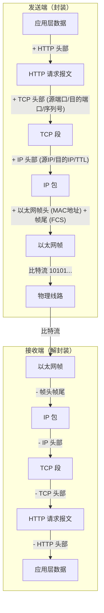
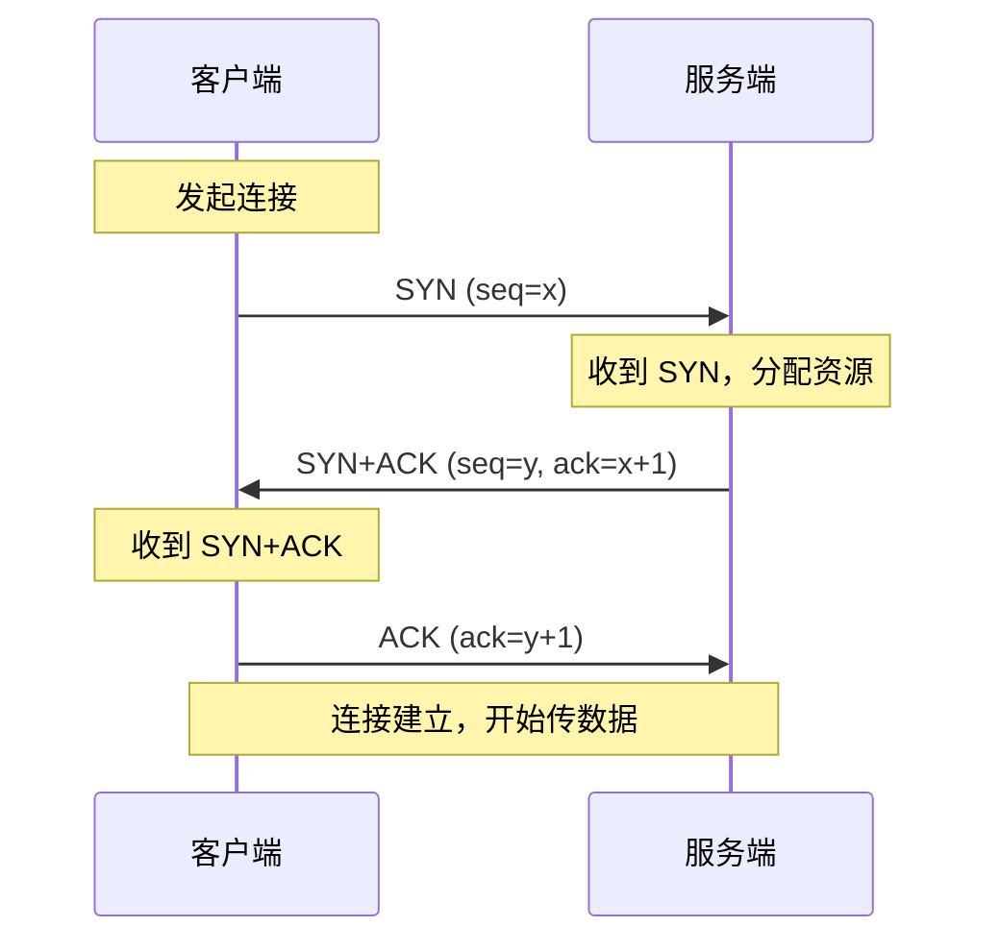
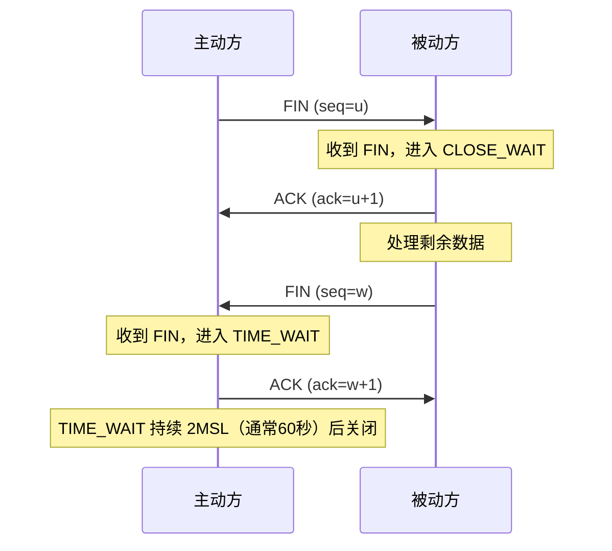
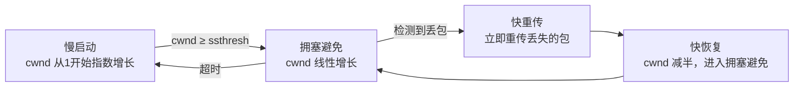
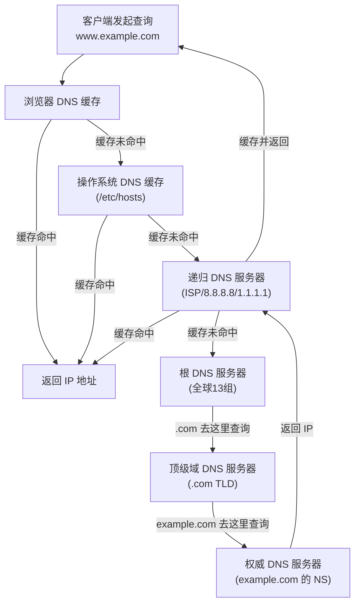
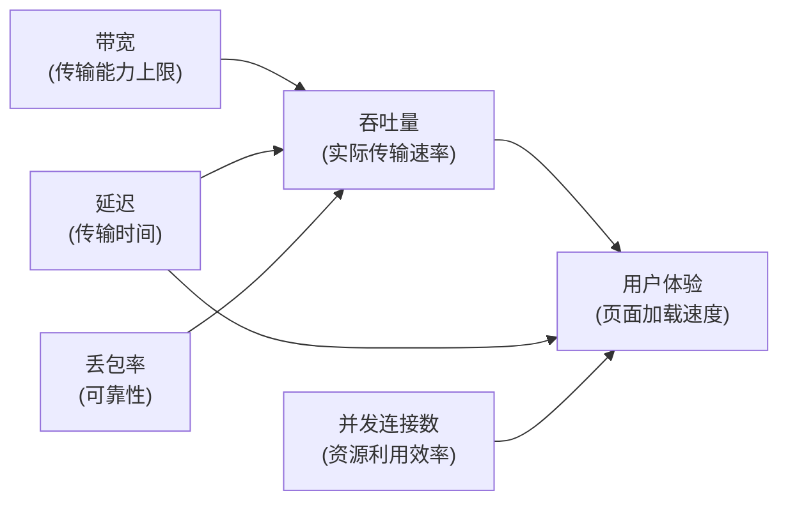
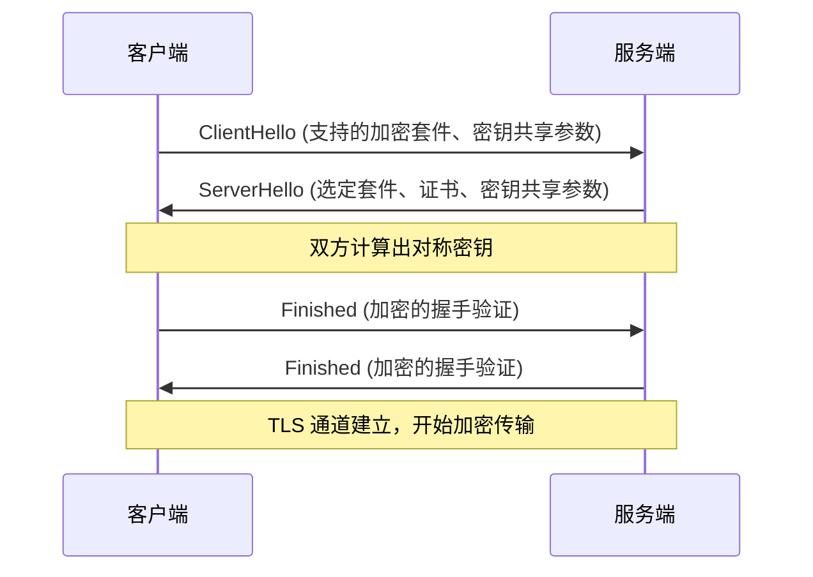
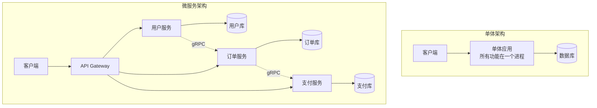
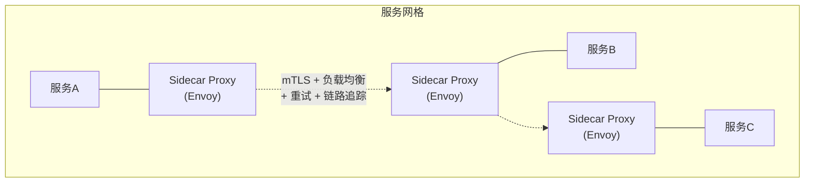
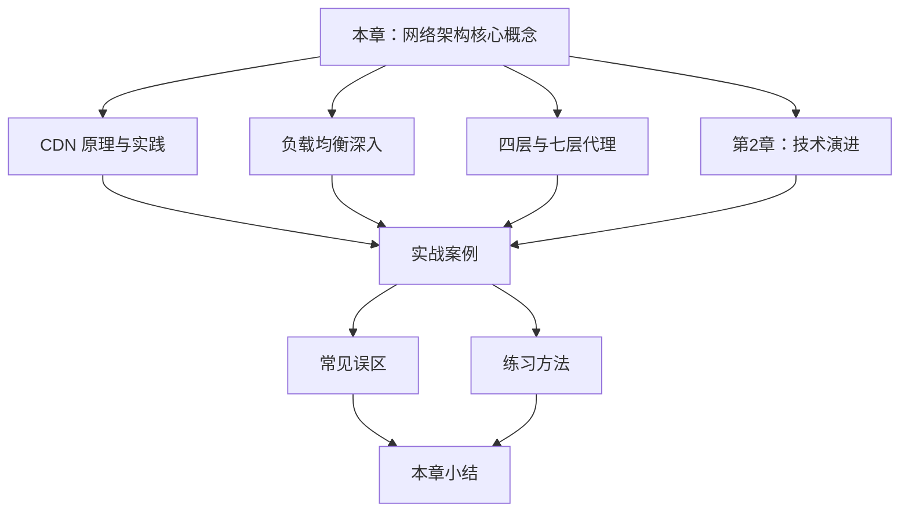

## 网络架构核心概念

### 1. 什么是网络架构

#### 1.1 定义与内涵

网络架构（Network Architecture）是指计算机网络中硬件、软件、协议和拓扑结构的整体组织方式。它定义了设备如何互联、数据如何流动、服务如何暴露与发现，以及系统如何在规模增长时保持性能和可靠性。

在软件工程语境下，网络架构关注的不仅是物理线路的连接，更重要的是**应用层的通信模式**——微服务之间如何调用（gRPC、REST、消息队列）、客户端如何穿越多层代理到达后端（CDN → LB → API Gateway → Service）、数据如何跨可用区同步。

网络架构的五大核心要素：

| 要素 | 核心问题 | 关键技术 |
|------|----------|----------|
| 互联 | 设备之间如何物理和逻辑连接 | 交换机、路由器、VLAN、VPC |
| 通信 | 数据以什么协议和格式传输 | TCP/UDP、HTTP/gRPC、WebSocket |
| 发现 | 客户端如何找到服务 | DNS、服务注册中心、Anycast |
| 治理 | 流量如何分配和调度 | 负载均衡、CDN、限流、熔断 |
| 安全 | 如何保护通信不被窃听和篡改 | TLS/mTLS、防火墙、零信任 |

> **经验法则**：在分布式系统中，网络不是可靠的。Werner Vogels（AWS CTO）的经典表述"一切都会失败，而且总是同时失败"正是网络架构设计的核心挑战。网络故障是分布式系统中最高频的故障源——断链、丢包、DNS 解析失败、TCP 连接超时，任何一个都可能导致服务不可用。

#### 1.2 为什么网络架构至关重要

| 影响维度 | 说明 | 量化影响 |
|----------|------|----------|
| 性能 | 网络延迟直接决定用户感知响应时间 | 200ms 网络往返 + 服务端处理，很容易突破 500ms 的用户容忍阈值 |
| 可靠性 | 网络故障是分布式系统中最常见的故障源 | 一次网络分区可能导致整个区域服务不可用 |
| 可扩展性 | 水平扩展的前提是无状态设计和合理的负载分配 | 10 台服务器的扩展效率完全取决于网络架构 |
| 安全性 | 未加密的通信、暴露的服务端口都是攻击入口 | 一次 SQL 注入就可能导致全库数据泄露 |
| 成本 | 云环境下的带宽计费、跨区域流量费用直接影响运营成本 | AWS 跨区域数据传输 $0.02/GB，年传输 10TB 就是 $200 |

---

### 2. IP 地址与子网划分

IP 地址是网络层的核心标识，理解 IP 地址体系是掌握网络架构的第一步。

#### 2.1 IPv4 地址基础

IPv4 地址是一个 32 位二进制数，通常以点分十进制表示（如 `192.168.1.1`），总共可提供约 43 亿个地址。

IPv4 地址结构：
  11000000.10101000.00000001.00000001
  = 192.168.1.1

  网络部分（标识网络）      主机部分（标识主机）
  ├─────────────────────┤ ├──────────────────┤

**IP 地址分类**：

| 类别 | 首位模式 | 地址范围 | 默认子网掩码 | 用途 |
|------|----------|----------|-------------|------|
| A 类 | 0xxxxxxx | 1.0.0.0 - 126.255.255.255 | /8 (255.0.0.0) | 大型组织 |
| B 类 | 10xxxxxx | 128.0.0.0 - 191.255.255.255 | /16 (255.255.0.0) | 中型组织 |
| C 类 | 110xxxxx | 192.0.0.0 - 223.255.255.255 | /24 (255.255.255.0) | 小型网络 |
| D 类 | 1110xxxx | 224.0.0.0 - 239.255.255.255 | — | 组播 |
| E 类 | 1111xxxx | 240.0.0.0 - 255.255.255.255 | — | 保留 |

#### 2.2 CIDR 与子网划分

CIDR（Classless Inter-Domain Routing，无类别域间路由）取代了传统的分类编址，用 `/前缀长度` 表示网络位数，实现更灵活的地址分配。

CIDR 表示法：
  10.0.0.0/8     → 网络位 8 位，主机位 24 位，可用地址 2^24 - 2 = 16,777,214
  10.0.0.0/16    → 网络位 16 位，可用地址 2^16 - 2 = 65,534
  10.0.0.0/24    → 网络位 24 位，可用地址 2^8 - 2 = 254
  10.0.0.0/32    → 单个主机地址
  0.0.0.0/0      → 所有地址（默认路由）

**常用子网掩码速查**：

| CIDR | 子网掩码 | 可用主机数 | 适用场景 |
|------|----------|-----------|----------|
| /8 | 255.0.0.0 | 16,777,214 | 大型企业内网 |
| /16 | 255.255.0.0 | 65,534 | 中型企业内网 |
| /20 | 255.255.240.0 | 4,094 | 云平台 VPC 子网 |
| /24 | 255.255.255.0 | 254 | 标准局域网 |
| /28 | 255.255.255.240 | 14 | 小型子网（安全组） |
| /32 | 255.255.255.255 | 1 | 单主机（负载均衡 VIP） |

#### 2.3 私有地址与公网地址

RFC 1918 定义了三段私有 IP 地址范围，这些地址只能在内网使用，不能直接路由到互联网：

| 私有地址范围 | CIDR | 可用地址数 | 典型用途 |
|-------------|------|-----------|----------|
| 10.0.0.0 - 10.255.255.255 | 10.0.0.0/8 | 16,777,214 | 大型企业内网、容器网络 |
| 172.16.0.0 - 172.31.255.255 | 172.16.0.0/12 | 1,048,574 | Docker 默认网络、中型内网 |
| 192.168.0.0 - 192.168.255.255 | 192.168.0.0/16 | 65,534 | 家庭网络、小型办公网络 |

> **工程实践**：在设计云上 VPC 时，CIDR 段的选择必须预留未来扩展空间。推荐使用 `10.0.0.0/16` 作为 VPC 主网段，划分为多个 `/24` 子网。避免使用 `172.17.0.0/16`（Docker 默认网段）以防止与容器网络冲突。

#### 2.4 IPv6 简介

IPv6 采用 128 位地址（约 3.4×10³⁸ 个地址），彻底解决地址耗尽问题。IPv6 地址以冒号十六进制表示：

完整形式：  2001:0db8:85a3:0000:0000:8a2e:0370:7334
压缩形式：  2001:db8:85a3::8a2e:370:7334（省略前导零，连续全零用 :: 替代）

IPv4 映射：  ::ffff:192.168.1.1

**IPv6 vs IPv4 关键差异**：

| 特性 | IPv4 | IPv6 |
|------|------|------|
| 地址长度 | 32 位（~43 亿） | 128 位（~3.4×10³⁸） |
| 地址表示 | 点分十进制 | 冒号十六进制 |
| NAT | 必须（地址不够） | 不需要（地址充裕） |
| 配置方式 | 手动/DHCP | SLAAC（无状态自动配置）/DHCPv6 |
| 头部 | 可变长（20-60 字节） | 固定 40 字节，路由器处理更快 |
| 分片 | 路由器和发送端均可 | 仅发送端分片 |
| 校验和 | 有（每跳计算） | 无（交由上层协议处理） |

---

### 3. 网络分层模型

网络分层是理解一切网络技术的基础。通过将通信过程拆分为多个层次，每层只关注自己的职责，实现了关注点分离和标准化互操作。

#### 3.1 OSI 七层模型

OSI（Open Systems Interconnection）模型由 ISO 于 1984 年提出，将网络通信分为七层：

| 层级 | 名称 | 功能 | 典型协议/技术 | PDU（协议数据单元） |
|------|------|------|---------------|---------------------|
| 7 | 应用层 (Application) | 为应用程序提供网络服务接口 | HTTP, HTTPS, FTP, SMTP, DNS, SSH, gRPC | 数据 |
| 6 | 表示层 (Presentation) | 数据格式转换、加密解密、压缩 | SSL/TLS, JPEG, ASCII, GZIP | 数据 |
| 5 | 会话层 (Session) | 管理会话建立、维持和终止 | NetBIOS, RPC, SOCKS | 数据 |
| 4 | 传输层 (Transport) | 端到端可靠传输、流量控制、差错校验 | TCP, UDP, SCTP | 段/报文 |
| 3 | 网络层 (Network) | 逻辑寻址和路由选择 | IP (IPv4/IPv6), ICMP, OSPF, BGP | 包 |
| 2 | 数据链路层 (Data Link) | 帧封装、MAC 寻址、差错检测 | Ethernet, Wi-Fi (802.11), PPP | 帧 |
| 1 | 物理层 (Physical) | 比特流传输、电气/光学信号 | 双绞线、光纤、无线电波 | 比特 |

#### 3.2 TCP/IP 四层模型

实际工程中更常用的是 TCP/IP 四层模型，它是互联网的实际基础：

| TCP/IP 层 | 对应 OSI 层 | 核心职责 | 关键协议 |
|-----------|-------------|----------|----------|
| 应用层 | 应用层 + 表示层 + 会话层 | 应用逻辑通信 | HTTP, DNS, SMTP, SSH, gRPC |
| 传输层 | 传输层 | 进程间通信、可靠传输 | TCP, UDP |
| 网络层 | 网络层 | 主机间寻址与路由 | IP, ICMP, ARP |
| 网络接口层 | 数据链路层 + 物理层 | 物理网络接入 | Ethernet, Wi-Fi |

> **为什么 OSI 七层模型没有成为实际标准？** TCP/IP 在 ARPANET 上经过了 10 年的实际检验后才被标准化，而 OSI 模型在尚未充分验证时就试图一步到位。此外，OSI 的 7 层划分过于精细（表示层和会话层在实际实现中很少独立存在），导致协议实现复杂度高。工程界的铁律：**能跑的代码比完美的规范更有说服力**。

#### 3.3 数据封装与解封装

当数据从应用层发出到物理线路传输，每一层都会添加自己的头部（甚至尾部），这个过程称为**封装**；接收端则反向执行**解封装**。



每一层的头部都包含该层的关键控制信息：

- **TCP 头部**（20 字节起）：源端口（16位）、目的端口（16位）、序列号（32位）、确认号（32位）、标志位（SYN/ACK/FIN/RST/PSH）、窗口大小（16位）
- **IP 头部**（20 字节起）：版本、头部长度、服务类型、总长度、标识、标志、片偏移、TTL（生存时间）、协议类型、头部校验和、源 IP、目的 IP
- **以太网帧头**（14 字节）：目的 MAC 地址（6字节）、源 MAC 地址（6字节）、类型字段（2字节）

> **面试要点**：一个完整的 HTTP 请求经过的封装过程，以及每层头部包含的关键字段，是后端工程师面试的高频考点。

#### 3.4 NAT——地址转换的桥梁

NAT（Network Address Translation，网络地址转换）是解决 IPv4 地址短缺的关键技术，几乎所有内网设备都依赖 NAT 接入互联网。

**NAT 工作原理**：

内网设备 (192.168.1.100:5000) 
    → NAT 路由器替换为公网 IP (203.0.113.5:40001)
    → 互联网
    → 响应返回 NAT 路由器 (203.0.113.5:40001)
    → NAT 查表转发给 (192.168.1.100:5000)

**NAT 类型对比**：

| 类型 | 工作层次 | 映射方式 | 特点 | 适用场景 |
|------|---------|----------|------|----------|
| 静态 NAT | L3 | 一对一固定映射 | 公网 IP 与内网 IP 一对一绑定 | 服务器对外暴露 |
| 动态 NAT | L3 | 临时映射，用完回收 | 多个内网 IP 共享一组公网 IP | 中等规模上网 |
| PAT（NAPT） | L3-L4 | 用端口号区分连接 | 一个公网 IP 支持数千并发连接 | 家庭/企业上网 |

**NAT 对网络架构的影响**：

- **正面**：节省公网 IP、隐藏内网拓扑（天然防火墙效果）
- **负面**：破坏端到端连接性，增加延迟（需要维护映射表），对 P2P/实时通信（WebRTC、VoIP）带来穿透难题
- **穿透方案**：STUN（发现公网映射地址）、TURN（中继服务器转发）、ICE（自动选择最优路径）

---

### 4. 核心网络协议详解

#### 4.1 TCP 协议——可靠传输的基石

TCP（Transmission Control Protocol）是面向连接的可靠传输协议。它通过一系列机制保证数据完整、有序、不重复地到达对端。

**三次握手（Three-Way Handshake）**



为什么是三次而不是两次？

- 如果只有两次，服务端无法确认客户端收到了自己的 SYN+ACK
- 在网络延迟或丢包场景下，可能建立无效连接消耗服务端资源
- 三次握手确保双方的发送和接收能力都正常
- 三次握手同时协商初始序列号（ISN），为后续的可靠传输奠定基础

**四次挥手（Four-Way Teardown）**



> **为什么是四次挥手而非三次？** TCP 是全双工的，关闭连接时每个方向需要独立关闭。被动方收到 FIN 后可能还有数据未发送完毕，所以先 ACK 确认，发完剩余数据后再发送自己的 FIN。

**TIME_WAIT 状态的意义**：

- 确保最后一个 ACK 能到达对端（如果丢失，对端会重发 FIN）
- 让网络中残余的数据包自然消亡，防止影响新连接
- 2MSL（Maximum Segment Lifetime）通常为 60 秒，这是 TCP 连接关闭的固有延迟

**TCP 核心机制**

| 机制 | 作用 | 说明 |
|------|------|------|
| 序列号/确认号 | 保证有序、去重 | 每个字节都有序列号，接收方通过 ACK 告知已收到的最大连续序列号 |
| 滑动窗口 | 流量控制 | 接收方通告窗口大小，发送方据此控制发送速率，避免淹没接收方 |
| 超时重传 | 可靠性保障 | 发送后启动计时器，超时未收到 ACK 则重传 |
| 校验和 | 差错检测 | 对头部和数据计算校验和，发现比特错误则丢弃 |
| 紧急指针 | 优先传输 | 标记紧急数据，接收方优先处理（实际使用较少） |

**TCP 拥塞控制——四阶段演进**

拥塞控制是 TCP 最核心也最复杂的机制，它的目标是：在不造成网络过载的前提下，最大化利用可用带宽。



| 阶段 | 算法 | cwnd 变化 | 触发条件 |
|------|------|----------|----------|
| 慢启动 | AIMD（增大） | 每个 RTT 翻倍（指数增长） | 连接刚建立或超时后恢复 |
| 拥塞避免 | AIMD（增大） | 每个 RTT +1（线性增长） | cwnd 达到 ssthresh |
| 快重传 | 立即重传 | 不变 | 收到 3 个重复 ACK |
| 快恢复 | AIMD（减小） | cwnd 减半 | 快重传之后 |

**BBR——Google 的拥塞控制革命**

传统的 TCP 拥塞控制（如 CUBIC）基于丢包来判断网络拥塞，但丢包是网络问题的**结果**而非**原因**。BBR（Bottleneck Bandwidth and Round-trip propagation time）由 Google 于 2016 年提出，通过测量两个关键指标来决策：

| 指标 | 含义 | 测量方式 |
|------|------|----------|
| BtlBw (Bottleneck Bandwidth) | 瓶颈链路的最大带宽 | 测量最近一段窗口内最大交付速率 |
| RTprop (Round-trip propagation time) | 最小往返延迟 | 测量最近一段窗口内最小 RTT |

BBR 的核心思想：**将发送速率设置为 BtlBw，将排队延迟控制在 RTprop 附近**。这意味着 BBR 不再依赖丢包来检测拥塞，而是在丢包发生之前就主动控制发送速率。

传统算法（CUBIC）：网络拥塞 → 丢包 → 降低发送速率（被动响应）
BBR：测量链路带宽和延迟 → 主动匹配最优发送速率（主动控制）

> **工程实践**：在高带宽长距离链路上（如跨洋传输），BBR 相比 CUBIC 可提升 2-10 倍吞吐量。Google 的 YouTube 全面部署 BBR 后，全球平均视频加载速度提升了 4%。Linux 4.9+ 内核已内置 BBR 支持。

#### 4.2 UDP 协议——轻量高效的选择

UDP（User Datagram Protocol）是无连接的传输协议，不保证可靠性，但代价是极低的延迟和极简的头部。

**TCP vs UDP 对比**

| 特性 | TCP | UDP |
|------|-----|-----|
| 连接方式 | 面向连接（三次握手） | 无连接 |
| 可靠性 | 保证数据完整有序 | 不保证，可能丢包、乱序 |
| 头部开销 | 20 字节 | 8 字节 |
| 传输方式 | 字节流（无边界） | 数据报（有边界） |
| 流量控制 | 有（滑动窗口） | 无 |
| 拥塞控制 | 有 | 无 |
| 适用场景 | Web、文件传输、邮件 | 视频流、游戏、DNS 查询、VoIP |

**何时选择 UDP？**

- **实时性要求高于可靠性**：视频会议丢几帧画面可以接受，但延迟不可接受
- **应用层自行实现可靠性**：如 QUIC 协议在 UDP 上实现了类似 TCP 的可靠传输，但避免了 TCP 的队头阻塞问题
- **查询类短交互**：DNS 查询就是一个 UDP 请求一个 UDP 响应，建立 TCP 连接开销过大
- **广播/组播场景**：TCP 是一对一的，UDP 天然支持一对多通信

#### 4.3 DNS——互联网的电话簿

DNS（Domain Name System）将人类可读的域名（如 `api.example.com`）解析为机器可识别的 IP 地址（如 `93.184.216.34`）。它本质上是一个**全球分布式数据库**，由数以万计的 DNS 服务器协同工作。

**DNS 解析流程**



**DNS 记录类型**

| 记录类型 | 用途 | TTL 建议 | 示例 |
|----------|------|----------|------|
| A | 域名 → IPv4 地址 | 300-3600s | `example.com → 93.184.216.34` |
| AAAA | 域名 → IPv6 地址 | 300-3600s | `example.com → 2606:2800:220:1::248` |
| CNAME | 域名别名指向另一域名 | 300-3600s | `www.example.com → example.com` |
| MX | 邮件交换服务器 | 3600s | 优先级 10: `mail.example.com` |
| TXT | 文本记录（SPF/DKIM/验证） | 300-3600s | `"v=spf1 include:..."` |
| SRV | 服务发现（协议/端口/主机） | 3600s | `_sip._tcp.example.com → sip.example.com:5060` |
| NS | 域名服务器 | 86400s | `example.com → ns1.exampledns.com` |
| SOA | 起始授权机构（域的元数据） | 86400s | 序列号、刷新间隔、过期时间 |

**DNS 在架构中的关键角色**

- **服务发现**：微服务架构中，服务名通过 DNS 解析到实例 IP（如 Kubernetes 的 Headless Service）
- **健康检查与故障转移**：DNS 配合健康检查，将流量从故障节点摘除（如 AWS Route 53 的健康检查）
- **地理位置路由（GeoDNS）**：将用户请求解析到最近的数据中心，降低延迟
- **CDN 调度**：CDN 通过 DNS 就近分配边缘节点 IP
- **负载均衡**：DNS 轮询（Round Robin）是最简单的负载均衡方式（但缺乏健康检查）

**Anycast——DNS 的全球负载均衡**

Anycast 是一种网络寻址方式：多个地理位置不同的服务器共享同一个 IP 地址，BGP 路由协议自动将用户请求路由到**距离最近**的服务器。

传统 Unicast：  一个 IP 对应一台服务器
Anycast：       一个 IP 对应全球多台服务器（最近的优先）

Anycast 的典型应用：DNS 根服务器（全球 13 组根服务器中，多组使用 Anycast）、Cloudflare（每个 PoP 节点使用相同的 Anycast IP）、大型 CDN 服务。

#### 4.4 HTTP/HTTPS 协议

HTTP（HyperText Transfer Protocol）是 Web 的基础协议，采用请求-响应模型。HTTPS = HTTP + TLS，在传输层之上增加了加密保护。

**HTTP 请求方法语义**

| 方法 | 语义 | 幂等 | 安全 | 典型用途 |
|------|------|------|------|----------|
| GET | 获取资源 | 是 | 是 | 读取页面、查询数据 |
| POST | 创建资源 | 否 | 否 | 提交表单、创建订单 |
| PUT | 替换整个资源 | 是 | 否 | 更新用户全部信息 |
| PATCH | 部分更新 | 否 | 否 | 修改订单状态、修改用户昵称 |
| DELETE | 删除资源 | 是 | 否 | 删除文章、注销账号 |
| HEAD | 获取响应头（无 body） | 是 | 是 | 检查资源是否存在、获取 Content-Length |
| OPTIONS | 获取支持的方法 | 是 | 是 | CORS 预检请求 |
| TRACE | 回显请求路径 | 是 | 是 | 调试（生产环境应禁用） |

> **幂等性**（Idempotent）：同一请求执行多次与执行一次效果相同。GET、PUT、DELETE 是幂等的，POST 不是。这在设计重试策略时至关重要——网络超时后，GET/PUT/DELETE 可以安全重试，POST 需要幂等键（Idempotency Key）保护。

**HTTP/1.1 vs HTTP/2 vs HTTP/3 对比**

| 特性 | HTTP/1.1 | HTTP/2 | HTTP/3 |
|------|----------|--------|--------|
| 传输层 | TCP | TCP | QUIC (基于 UDP) |
| 头部压缩 | 无 | HPACK | QPACK |
| 多路复用 | 串行（管道化有限） | 一个 TCP 连接并行多流 | 一个 QUIC 连接并行多流，无队头阻塞 |
| 服务器推送 | 无 | 支持（但实际使用少） | 支持 |
| 连接建立 | TCP 三次握手 + TLS 握手（2-3 RTT） | TCP + TLS（2 RTT） | 0-RTT / 1-RTT（合并握手） |
| 丢包恢复 | 整个 TCP 连接受影响 | 同左 | 单个流独立恢复 |
| 连接迁移 | 不支持（依赖 IP:Port） | 不支持 | 支持（基于 Connection ID） |

> **工程建议**：新项目应优先考虑 HTTP/2 + TLS 1.3。若客户端支持（Chrome/Firefox/Safari 均已支持 HTTP/3），可在 CDN 层（Cloudflare、CloudFront）默认启用 HTTP/3 以获得更好的弱网表现和连接迁移能力。

#### 4.5 WebSocket——全双工实时通信

WebSocket（RFC 6455）是基于 TCP 的全双工通信协议，解决了 HTTP 长轮询的低效问题，是实时应用的标准选择。

**WebSocket vs HTTP 长轮询**

| 特性 | HTTP 长轮询 | WebSocket |
|------|------------|-----------|
| 连接模型 | 客户端发起，服务器被动响应 | 建立后双向持久连接 |
| 数据格式 | 每次请求都携带完整 HTTP 头部（~800字节） | 仅帧头（2-14字节），极低开销 |
| 延迟 | 取决于轮询间隔（通常 100-300ms） | 服务器可即时推送（<1ms） |
| 服务端推送 | 不支持（必须客户端先请求） | 原生支持 |
| 协议升级 | 无 | HTTP Upgrade → ws:// 或 wss:// |

**WebSocket 握手过程**

客户端                          服务端
  |  HTTP GET /chat              |
  |  Upgrade: websocket          |
  |  Connection: Upgrade         |
  |  Sec-WebSocket-Key: x3...    |
  |  ---->                       |
  |  HTTP/1.1 101 Switching      |
  |  Upgrade: websocket          |
  |  Sec-WebSocket-Accept: HSm...|
  |  <----                       |
  |     双向 WebSocket 连接建立   |
  |  <---- [数据帧] ---->        |

**WebSocket 典型应用场景**：

- 实时聊天（微信、钉钉 Web 版）
- 协同编辑（Google Docs、飞书文档）
- 实时数据推送（股票行情、体育赛事）
- 在线游戏（玩家位置同步、操作指令）
- IoT 设备通信（双向控制和状态上报）

> **工程注意**：WebSocket 连接是长连接，必须设计心跳机制（通常 30-60 秒一次 ping/pong）来检测断连。在生产环境中，需要在负载均衡器层配置连接超时和会话粘连（Sticky Session），否则用户的 WebSocket 连接会在 LB 重定向时中断。

#### 4.6 QUIC 协议——下一代传输基础

QUIC（RFC 9000）是 Google 主导开发的基于 UDP 的传输协议，HTTP/3 的底层基础。它解决了一系列 TCP 的历史遗留问题。

传统 TCP + TLS 1.3 连接建立：
  客户端 ---SYN---> 服务端          (1 RTT)
  客户端 <--SYN+ACK--- 服务端       (1 RTT)
  客户端 ---ClientHello---> 服务端   (TLS 握手, 1 RTT)
  客户端 <--ServerHello--- 服务端    (TLS 握手, 1 RTT)
  总计：2 RTT（TCP） + 1-2 RTT（TLS） = 3-4 RTT

QUIC 连接建立：
  客户端 ---Initial (含 ClientHello + 加密参数)---> 服务端  (1 RTT)
  客户端 <--ServerHello + Finished--- 服务端               (1 RTT)
  总计：1 RTT

QUIC 恢复连接（已有缓存的密钥）：
  总计：0 RTT（可立即发送应用数据）

**QUIC 的核心创新**：

| 创新 | 说明 | 收益 |
|------|------|------|
| 0-RTT 连接建立 | 首次连接 1-RTT，恢复连接 0-RTT | 连接建立延迟降低 75% |
| 无队头阻塞 | 每个流独立的可靠传输，丢包仅影响该流 | 页面加载在高丢包网络下提速 30%+ |
| 连接迁移 | 连接标识基于 Connection ID 而非 IP:Port | Wi-Fi→4G 切换不断连 |
| 内置加密 | TLS 1.3 集成在 QUIC 中，无法降级 | 强制加密，消除降级攻击风险 |
| UDP 基础 | 基于 UDP 实现，无需修改内核 | 部署灵活，可在用户态演进 |

---

### 5. 网络拓扑结构

网络拓扑描述了设备之间的物理或逻辑连接方式。不同的拓扑结构在性能、可靠性和扩展性上有显著差异。

#### 5.1 常见拓扑类型

| 拓扑 | 结构 | 优点 | 缺点 | 适用场景 |
|------|------|------|------|----------|
| 星型 (Star) | 所有节点连接到中心节点 | 易管理、故障隔离好 | 中心节点是单点故障 | 企业局域网、家庭网络 |
| 总线型 (Bus) | 所有节点共享一条总线 | 布线简单、成本低 | 总线故障全网瘫痪，冲突多 | 已基本淘汰 |
| 环型 (Ring) | 节点首尾相连形成环 | 公平访问、无冲突 | 单点断链影响全网 | 令牌环网（已少见） |
| 网状 (Mesh) | 节点间多路径互联 | 高冗余、负载均衡 | 布线复杂、成本高 | 数据中心骨干网、WAN |
| 树型 (Tree) | 分层星型结构 | 可扩展、层次清晰 | 上层故障影响大 | 大型企业网络、互联网骨干 |

#### 5.2 数据中心网络拓扑

现代数据中心通常采用 **脊叶架构（Spine-Leaf）** 替代传统的三层架构：

传统三层架构：                    脊叶架构（Spine-Leaf）：
                                    
      [核心层 Core]               Spine1    Spine2    Spine3
      /    |    \                  |  |  |    |  |  |    |  |  |
   [汇聚层]  [汇聚层]            Leaf1  Leaf2  Leaf3  Leaf4
   / | \    / | \                |  |    |  |    |  |    |  |
 [接入层]  [接入层]             服务器  服务器  服务器  服务器
  | | |     | | |
  终端     终端

**Spine-Leaf 优势**：

- **低延迟**：任意两台服务器间最多经过两跳（Leaf → Spine → Leaf），延迟可预测
- **无阻塞**：每个 Leaf 与所有 Spine 都有连接，带宽可线性扩展
- **故障域小**：单个 Spine 故障只影响其直连的 Leaf，不影响其他 Leaf 间通信
- **可预测**：延迟和带宽可精确计算，便于容量规划
- **East-West 友好**：服务器间通信不需要绕行上层，解决三层架构的 East-West 流量瓶颈

---

### 6. 网络性能指标体系

#### 6.1 核心指标详解

**带宽（Bandwidth）**

带宽是网络链路的最大数据传输速率，单位通常为 bps（bits per second）。需要注意：

- 物理带宽 ≠ 实际可用带宽（协议开销、拥塞、重传都会占用有效带宽）
- 云服务商的带宽限制通常是**出站方向**，入站一般不限
- 实际传输速率还受 TCP 窗口大小、RTT、丢包率影响
- 1 Gbps 带宽的理论最大下载速度约为 125 MB/s（÷8 换算字节）

**延迟（Latency）**

延迟是数据从发送端到接收端的时间。完整链路延迟由以下部分组成：

总延迟 = 发送延迟 + 传播延迟 + 处理延迟 + 排队延迟

发送延迟 = 数据量 / 带宽        （将数据推送到链路上的时间）
传播延迟 = 距离 / 光速          （信号在介质中传播的时间）
处理延迟 = 路由器处理开销        （查表、校验等）
排队延迟 = 在缓冲区等待的时间    （拥塞时显著增加）

**典型延迟参考值**

| 场景 | 延迟范围 | 说明 |
|------|----------|------|
| 同机房通信 | < 1ms | 通常 0.1-0.5ms，同一交换机下 |
| 同城跨区 | 1-5ms | 同一城市的两个数据中心 |
| 跨省通信 | 10-30ms | 中国南北之间 |
| 跨国通信 | 50-200ms | 中国到美国东海岸约 150ms |
| 跨洲通信 | 100-300ms | 中国到欧洲约 200ms |

**吞吐量（Throughput）**

吞吐量是单位时间内成功传输的数据量。它受带宽、延迟、丢包率共同约束：

最大吞吐量 ≈ 窗口大小 / RTT

示例 1（小窗口）：TCP 窗口 64KB，RTT = 100ms
最大吞吐量 = 64KB / 100ms = 640KB/s ≈ 5.12Mbps
→ 即使有 1Gbps 带宽，吞吐量也只有 5.12Mbps

示例 2（大窗口 + 窗口缩放）：TCP 窗口 16MB，RTT = 100ms
最大吞吐量 = 16MB / 100ms = 160MB/s ≈ 1.28Gbps
→ 充分利用高带宽长距离链路

这就是为什么高带宽长距离链路需要启用 **TCP 窗口缩放（Window Scaling, RFC 7323）** 和 **BBR 拥塞控制算法**。

**丢包率（Packet Loss Rate）**

丢包率是传输中丢失数据包占总发送包的比例：

| 丢包率 | 影响 | 典型原因 |
|--------|------|----------|
| < 0.1% | 几乎无感知 | 正常网络波动 |
| 0.1% - 1% | TCP 吞吐量开始下降 | 网络轻微拥塞 |
| 1% - 5% | 显著性能退化，需要优化 | 链路质量差、缓冲区溢出 |
| > 5% | 严重问题，需排查链路质量 | 物理线路故障、严重拥塞 |

#### 6.2 性能指标之间的关系



关键洞察：

- **高带宽不等于高吞吐量**：延迟和丢包会成为瓶颈。100Mbps 跨洲链路的实际吞吐可能只有几 Mbps
- **低延迟不等于高吞吐量**：带宽不足时，即使延迟很低，吞吐量也受限
- **低丢包率是高吞吐的前提**：1% 的丢包就可能让 TCP 吞吐下降到带宽的 1/3
- **最终用户体验取决于吞吐量和延迟的综合表现**：页面加载 = 下载数据量 / 吞吐量 + 延迟 × 往返次数

#### 6.3 连接池与连接复用

在高并发场景下，频繁建立和关闭 TCP 连接会产生大量开销（三次握手 + TLS 握手）。**连接池（Connection Pooling）** 通过复用已建立的连接来解决这个问题。

| 连接策略 | 说明 | 适用场景 |
|----------|------|----------|
| 无复用 | 每次请求新建连接 | 低频请求、简单脚本 |
| Keep-Alive | TCP 连接保持，HTTP 请求复用 | HTTP/1.1 默认行为 |
| 连接池 | 预建一批连接，请求时从池中取用，用完归还 | 数据库、Redis、HTTP 客户端 |
| HTTP/2 多路复用 | 一个 TCP 连接上并行多个流 | 现代 Web 应用 |

**连接池配置要点**：

连接池核心参数：
├── 最大连接数 (max_connections)    → 控制资源上限
├── 最小空闲数 (min_idle)          → 保持热连接，避免冷启动延迟
├── 连接超时 (connect_timeout)      → 新建连接的超时时间（通常 3-5s）
├── 空闲超时 (idle_timeout)         → 空闲连接的回收时间（通常 300-600s）
├── 获取超时 (acquisition_timeout)  → 从池中获取连接的等待时间（通常 5-10s）
└── 最大生命周期 (max_lifetime)     → 连接的最大存活时间（避免长时间使用导致的问题）

> **常见坑**：数据库连接池设置过大反而会降低性能。MySQL 的 `max_connections` 默认 151，每个连接占用约 10MB 内存。1000 个连接 = 10GB 内存。实际生产中，连接池大小建议为 CPU 核数 × 2 + 磁盘数（参考 PostgreSQL 调优经验）。

---

### 7. 网络安全基础

#### 7.1 TLS/SSL 加密

TLS（Transport Layer Security）是保障网络通信安全的核心协议，用于对传输数据进行加密、身份验证和完整性保护。

**TLS 握手流程（TLS 1.3）**



**TLS 1.2 vs TLS 1.3**

| 特性 | TLS 1.2 | TLS 1.3 |
|------|---------|---------|
| 握手轮次 | 2-RTT | 1-RTT（支持 0-RTT 恢复） |
| 支持的加密套件 | 多种（含弱算法） | 仅保留 5 种强加密套件 |
| 前向保密 | 可选 | 强制 |
| 密钥交换 | RSA/DHE/ECDHE | 仅支持 ECDHE/DHE |
| 加密算法 | AES-CBC、RC4 等 | 仅 AES-GCM、ChaCha20 |
| 0-RTT | 不支持 | 支持（但有重放攻击风险） |

**mTLS（双向 TLS）**

普通 TLS 只验证服务端身份（客户端验证服务器证书）。mTLS（mutual TLS）要求**双方都出示证书**，用于服务间通信的安全认证——这是零信任网络的基础。

普通 TLS：  客户端验证服务端证书 → 单向认证
mTLS：     客户端验证服务端证书 + 服务端验证客户端证书 → 双向认证

#### 7.2 防火墙与网络隔离

| 层级 | 防火墙类型 | 检查内容 | 典型产品 |
|------|-----------|----------|----------|
| L3/L4 | 包过滤防火墙 | 源/目的 IP、端口、协议 | iptables, nftables |
| L4-L7 | 状态检测防火墙 | 连接状态、数据包内容 | pfSense, FortiGate |
| L7 | 应用层防火墙 (WAF) | HTTP 请求内容、SQL 注入、XSS | ModSecurity, AWS WAF |
| 容器级 | 网络策略 | Pod 间通信规则 | Kubernetes NetworkPolicy |

**网络分段最佳实践（纵深防御）**：

                  互联网
                    ↓
              [WAF + DDoS 防护]
                    ↓
              [DMZ 区: Web 服务器]
                    ↓ (仅允许 8080/8443)
              [应用层: 业务服务]
                    ↓ (仅允许特定端口)
              [数据层: 数据库]
                    ↑
         [管理平面网络 - 物理隔离]

- DMZ 区放置对外服务（Web 服务器），接受公网流量
- 应用层放在内网，仅允许 DMZ 到内网的特定端口
- 数据库放在最内层，禁止直接对外暴露
- 管理平面网络与数据平面网络物理隔离（运维跳板机 + VPN）
- 每层之间部署防火墙规则，遵循最小权限原则

#### 7.3 VPN 与 IPsec

VPN（Virtual Private Network）通过加密隧道在公共网络上建立安全的私有通信通道。

| VPN 类型 | 工作层次 | 协议 | 特点 | 适用场景 |
|----------|---------|------|------|----------|
| IPsec VPN | L3 | ESP/AH + IKE | 内核态处理，性能高 | 站点到站点（Site-to-Site） |
| SSL VPN | L4-L7 | TLS + 自定义协议 | 客户端仅需浏览器 | 远程办公、移动办公 |
| WireGuard | L3 | 自定义协议 | 代码精简（~4000行），性能极高 | 现代 VPN 首选 |
| OpenVPN | L4-L7 | TLS | 灵活、成熟、跨平台 | 通用 VPN 方案 |

**WireGuard vs OpenVPN 性能对比**：

| 指标 | WireGuard | OpenVPN |
|------|-----------|---------|
| 代码量 | ~4000 行 | ~100,000+ 行 |
| 握手延迟 | < 1ms | 数百毫秒 |
| 吞吐量 | 接近原生 | 约为原生的 50-70% |
| CPU 占用 | 极低 | 较高 |
| 移动切换 | 自动重连 | 需要手动重连 |

---

### 8. 现代网络架构模式

#### 8.1 传统单体 vs 微服务网络



**微服务网络挑战**

| 挑战 | 说明 | 解决方案 |
|------|------|----------|
| 服务发现 | 服务实例动态变化，如何找到目标？ | DNS、Consul、etcd、Nacos |
| 负载均衡 | 如何将请求均匀分发到多个实例？ | 服务端 LB（Nginx）/ 客户端 LB（Ribbon） |
| 熔断降级 | 下游服务故障如何避免级联？ | Hystrix、Sentinel、Resilience4j |
| 链路追踪 | 跨服务调用如何追踪全链路？ | Jaeger、Zipkin、OpenTelemetry |
| API 版本 | 服务接口如何兼容演进？ | URL 版本（/v1/）、Header 版本、向后兼容 |
| 重试策略 | 超时后如何安全重试？ | 指数退避 + 幂等键 + 重试预算 |

#### 8.2 服务网格（Service Mesh）

服务网格通过 Sidecar 代理将网络通信逻辑从应用代码中剥离，让业务代码专注于业务逻辑。



**Sidecar 代理处理的网络职责**：

- 服务间通信的负载均衡
- 自动重试和超时控制
- mTLS 双向加密（零信任网络）
- 流量管理和灰度发布（金丝雀发布、A/B 测试、故障注入）
- 可观测性数据采集（指标、日志、追踪）

**主流服务网格方案对比**

| 特性 | Istio | Linkerd | Consul Connect |
|------|-------|---------|----------------|
| 数据面 | Envoy | linkerd2-proxy (Rust) | Envoy |
| 控制面 | istiod | linkerd-destination | Consul Server |
| 资源占用 | 较高（Envoy 较重） | 低（Rust 实现轻量） | 中等 |
| 复杂度 | 高 | 中 | 低（与 Consul 服务发现集成） |
| 功能丰富度 | 最全 | 够用 | 够用 |
| 学习曲线 | 陡峭 | 平缓 | 中等 |

#### 8.3 零信任网络（Zero Trust）

传统网络架构默认内网可信，但零信任模型假设**任何网络位置都不可信**，每次访问都必须经过认证和授权。

**零信任核心原则**：

1. **永不信任，始终验证**——无论请求来自内网还是外网，每次访问都必须验证身份
2. **最小权限**——每个身份只授予完成工作所需的最小权限，且权限有有效期
3. **假设已被入侵**——通过微分段（Micro-segmentation）限制攻击横向移动
4. **持续监控**——实时评估信任等级，动态调整访问权限（设备状态、地理位置、行为异常都会影响信任分）

传统模型：                    零信任模型：
  [外网] → 防火墙 → [内网]     [请求] → 身份验证 → 设备检查
  外网不可信，内网可信              → 行为分析 → 策略评估 → [资源]
  一旦突破防火墙，内网畅通无阻      每次访问都经过完整验证链

**零信任技术栈**：

| 技术 | 作用 | 代表产品 |
|------|------|----------|
| 身份认证 (IAM) | 验证用户和服务身份 | Okta, Azure AD, Keycloak |
| 设备信任 | 检查设备安全状态 | CrowdStrike, Jamf |
| 微分段 | 限制网络横向移动 | Illumio, VMware NSX |
| 持续评估 | 动态调整访问策略 | Zscaler, Cloudflare Access |
| mTLS | 服务间双向认证 | Istio, Linkerd |

---

### 9. 常见误区与纠正

| 误区 | 正确认知 |
|------|----------|
| "带宽越大越好" | 带宽只是上限，实际吞吐量受延迟、丢包、TCP 窗口等多因素约束。1Gbps 带宽下跨洲传输的实际吞吐可能只有几 Mbps。正确的优化方向是同时关注带宽、延迟和丢包率 |
| "HTTP/2 解决一切性能问题" | HTTP/2 解决了应用层队头阻塞，但 TCP 层的队头阻塞仍在。高丢包环境下 HTTP/3 的 QUIC 才是更优解 |
| "TCP 三次握手是浪费" | 三次握手确保双方通信能力正常，同时携带初始序列号用于后续数据排序。省去的代价是可靠性，而可靠性在网络不可靠的环境中至关重要 |
| "内网通信不需要加密" | 零信任模型下，内网同样需要加密。攻击者一旦突破边界，内网明文通信就是透明的。Google 从 2014 年开始全内网部署 mTLS |
| "DNS 只是翻译域名" | DNS 是全球最大的分布式数据库，承担服务发现、负载均衡、故障转移、地理位置调度等关键职责。DNS 的可用性直接决定整个互联网的可用性 |
| "负载均衡越靠近用户越好" | 需要根据场景选择——全局负载（DNS/Anycast）适合跨地域调度，本地负载（Nginx/LVS）适合同机房分流。层级选错要么浪费资源要么丧失灵活性 |
| "TCP 连接越多越好" | TCP 连接数受文件描述符限制，且每个连接占用内核内存（~3-10KB）。HTTP/2 的多路复用和连接池技术可以用更少的连接处理更多并发 |
| "UDP 比 TCP 快所以都用 UDP" | UDP 省去的是可靠传输的开销，但也失去了可靠性保证。如果应用层需要自己实现可靠传输（如 QUIC），总开销不一定比 TCP 低 |

---

### 10. 网络诊断工具箱

掌握网络诊断工具是架构师的必备技能。以下是按使用频率排序的核心工具：

#### 10.1 连通性诊断

**ping —— 基础连通性测试**

```bash
# 基本连通性测试（ICMP echo）
ping -c 4 api.example.com

# 指定数据包大小（测试 MTU）
ping -s 1472 -M do api.example.com

# 追踪路径中的每一跳延迟
ping -c 10 -i 0.2 api.example.com  # 每 0.2 秒发一次，观察延迟抖动
```

**traceroute —— 路由路径分析**

```bash
# 追踪到目标主机的完整路由路径
traceroute -n api.example.com

# 使用 TCP 方式探测（绕过 ICMP 封锁，适用于 HTTPS 服务）
tcptraceroute api.example.com 443

# 使用 UDP 模式，指定起始端口
traceroute -p 53 -U api.example.com 8.8.8.8
```

#### 10.2 DNS 诊断

```bash
# 查询完整的 DNS 解析过程（从根服务器开始追踪）
dig +trace example.com

# 查询特定记录类型
dig example.com MX          # 邮件服务器
dig example.com TXT         # 文本记录（SPF/DKIM）
dig example.com AAAA        # IPv6 地址
dig example.com SRV         # 服务发现

# 使用公共 DNS 服务器对比
dig @8.8.8.8 example.com     # Google DNS
dig @1.1.1.1 example.com     # Cloudflare DNS
dig @223.5.5.5 example.com   # 阿里 DNS

# 反向 DNS 查询（IP → 域名）
dig -x 93.184.216.34

# 测量 DNS 解析耗时
dig example.com | grep "Query time"
```

#### 10.3 HTTP 与 TLS 诊断

```bash
# 查看完整的请求/响应头
curl -v https://api.example.com

# 查看 TLS 握手信息
curl -v --tlsv1.3 https://api.example.com 2>&amp;1 | grep -E "SSL|TLS|subject|issuer"

# 测量各阶段耗时（DNS → TCP → TLS → TTFB → Total）
curl -o /dev/null -s -w \
  "DNS: %{time_namelookup}s\nTCP: %{time_connect}s\nTLS: %{time_appconnect}s\nTTFB: %{time_starttransfer}s\nTotal: %{time_total}s\n" \
  https://api.example.com

# 模拟不同条件
curl -w "Total: %{time_total}s\n" -o /dev/null -s \
  --connect-timeout 5 \
  --max-time 10 \
  -H "Accept-Encoding: gzip" \
  https://api.example.com
```

#### 10.4 TCP 连接状态分析

```bash
# 查看当前所有 TCP 连接状态统计
ss -s

# 查看特定端口的连接
ss -tnp | grep :443

# 查看 TIME_WAIT 连接数
ss -tn state time-wait | wc -l

# 查看连接详细信息（包含缓冲区、拥塞窗口等）
ss -ti dst 10.0.0.1:8080

# 统计各状态的连接数
ss -tan | awk '{print $1}' | sort | uniq -c | sort -rn

# 查看文件描述符使用情况（TCP 连接受此限制）
cat /proc/sys/fs/file-nr    # 已分配 / 未使用 / 最大值
ulimit -n                    # 当前进程的文件描述符限制
```

#### 10.5 抓包分析

```bash
# 捕获指定端口的流量（最常用的抓包命令）
tcpdump -i eth0 port 443 -nn -c 100

# 捕获完整的 HTTP 流量并以 ASCII 显示
tcpdump -i eth0 port 80 -A -s 0 | grep -E "^(GET|POST|HTTP)"

# 捕获并保存到文件（用 Wireshark 分析）
tcpdump -i eth0 port 443 -w /tmp/capture.pcap -c 1000

# 捕获 TCP 三次握手
tcpdump -i eth0 'tcp[tcpflags] &amp; (tcp-syn|tcp-ack) != 0' -nn

# 过滤特定主机的流量
tcpdump -i eth0 host 10.0.0.1 and port 8080
```

#### 10.6 网络性能压测

```bash
# HTTP 压测（快速评估 QPS 和延迟）
ab -n 10000 -c 100 https://api.example.com/

# 网络带宽测试（iperf3 服务端）
iperf3 -s                    # 启动服务端
iperf3 -c server_ip -t 30    # 客户端测试 30 秒

# 端口扫描（排查服务是否正常监听）
nc -zv api.example.com 443   # 测试端口连通性
nmap -sT -p 80,443,8080 api.example.com  # 扫描多端口
```

---

### 11. 知识体系与学习路径

本节内容是整个第 20 章的基础。后续章节将在此基础上深入：



**核心概念的关联关系**：

- 理解 **TCP/UDP** 是理解负载均衡四层/七层的基础
- 理解 **DNS** 是理解 CDN 工作原理的前提
- 理解 **IP 寻址和 NAT** 是理解 VPC、容器网络的基础
- 理解 **网络延迟和吞吐量** 是评估 CDN 效果和负载均衡策略的依据
- 理解 **TLS** 是理解 HTTPS 加速、SSL 卸载、mTLS 的关键
- 理解 **WebSocket/QUIC** 是理解现代实时应用和弱网优化的出发点
- 理解 **微服务网络挑战** 是理解服务网格和 API 网关的前提

---

### 12. 实操练习

**练习 1：使用 `traceroute` 分析网络路径**

```bash
# 追踪到目标主机的完整路由路径
traceroute -n api.example.com

# 使用 TCP 方式探测（绕过 ICMP 封锁，更适合生产环境）
tcptraceroute api.example.com 443
```

观察输出中的每一跳，理解：
- 每一跳的延迟如何累积
- 哪一跳延迟突增（可能是拥塞点或跨运营商跳转）
- TTL 递减的过程

**练习 2：使用 `dig` 深入了解 DNS**

```bash
# 查询完整的 DNS 解析过程
dig +trace api.example.com

# 查询特定记录类型
dig api.example.com MX
dig api.example.com TXT
dig api.example.com AAAA

# 使用不同 DNS 服务器对比解析速度和结果
dig @8.8.8.8 api.example.com
dig @1.1.1.1 api.example.com
dig @223.5.5.5 api.example.com

# 观察 DNS 缓存效果：第一次查询（可能较慢），第二次（应该很快）
time dig api.example.com
time dig api.example.com
```

**练习 3：使用 `curl` 分析 HTTP 连接细节**

```bash
# 查看完整的请求/响应头
curl -v https://api.example.com

# 查看 TLS 握手信息
curl -v --tlsv1.3 https://api.example.com 2>&amp;1 | grep -E "SSL|TLS|subject|issuer"

# 测量 DNS 解析、连接建立、TLS 握手、首字节各阶段耗时
curl -o /dev/null -s -w \
  "DNS: %{time_namelookup}s\nTCP: %{time_connect}s\nTLS: %{time_appconnect}s\nTTFB: %{time_starttransfer}s\nTotal: %{time_total}s\n" \
  https://api.example.com

# 对比不同协议的性能
curl -o /dev/null -s -w "HTTP/2: %{time_total}s\n" --http2 https://api.example.com
curl -o /dev/null -s -w "HTTP/1.1: %{time_total}s\n" --http1.1 https://api.example.com
```

**练习 4：使用 `ss` 和 `tcpdump` 分析 TCP 连接**

```bash
# 查看当前 TCP 连接状态
ss -s

# 查看 TIME_WAIT 连接数（高并发下常见的问题）
ss -tan state time-wait | wc -l

# 捕获 TCP 三次握手过程
tcpdump -i lo 'tcp[tcpflags] &amp; (tcp-syn|tcp-ack) != 0' -nn -c 10

# 观察 HTTP 请求的完整网络交互
curl -v http://localhost:8080/ &amp;
tcpdump -i lo port 8080 -nn -A -c 50
```

---

### 13. 本节小结

本节建立了网络架构的知识框架，核心要点：

1. **IP 寻址和子网划分是网络的基石**——CIDR、私有地址范围（RFC 1918）、VPC 子网设计，是所有网络架构决策的起点
2. **分层是理解网络的关键**——OSI 七层和 TCP/IP 四层提供了分析任何网络问题的思维框架，封装与解封装是数据流动的基本机制
3. **TCP 和 UDP 是传输层的两大范式**——可靠性和性能的权衡贯穿所有网络设计决策。BBR 拥塞控制正在改变"丢包=拥塞"的传统假设
4. **DNS 不只是域名解析**——它是分布式系统中最古老也最可靠的服务发现机制，Anycast 让 DNS 成为全球负载均衡的基础设施
5. **WebSocket 和 QUIC 代表了实时通信的未来**——从请求-响应到全双工，从 TCP 队头阻塞到 QUIC 的流级独立恢复
6. **延迟和吞吐量是评估网络架构的核心指标**——带宽只是上限，实际表现取决于完整的链路条件。连接池和连接复用是高并发场景的关键技术
7. **安全是架构设计的一部分，不是事后补充**——TLS/mTLS、网络分段、零信任都应在架构阶段考虑
8. **现代架构模式（微服务、服务网格、零信任）建立在网络基础之上**——没有扎实的基础，上层架构就是空中楼阁

掌握这些核心概念后，后续章节的 CDN、负载均衡、四层七层代理等内容将会变得水到渠成。
