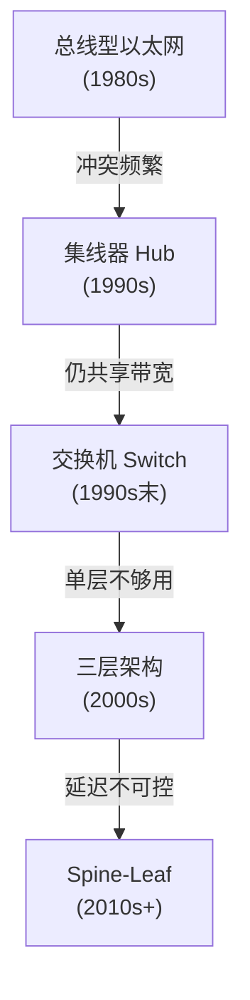
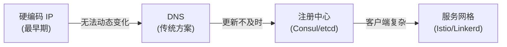
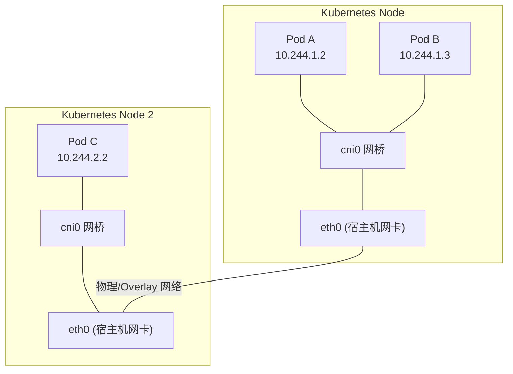
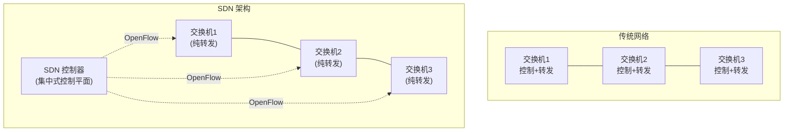
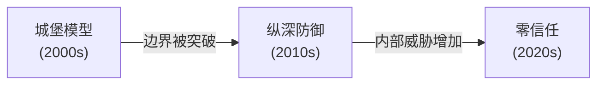
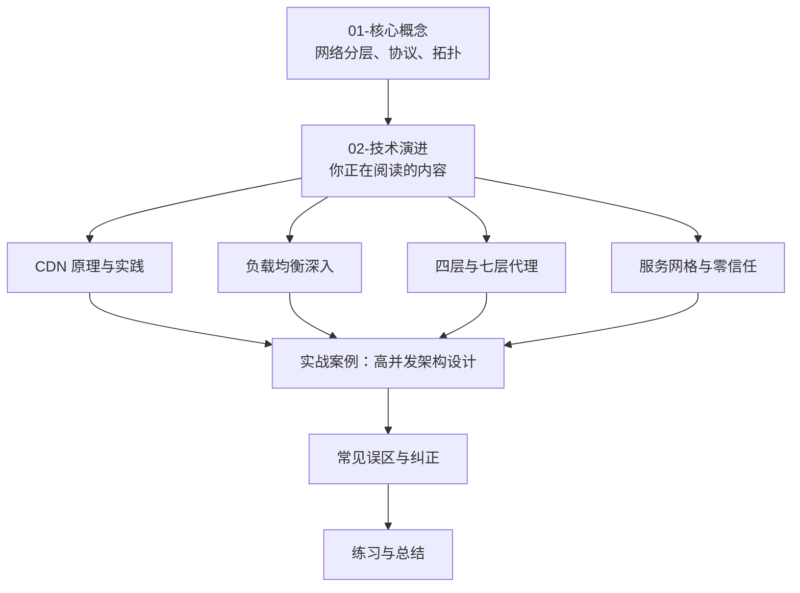

## 网络架构技术演进

网络架构的演进史，本质上是一部**人类对"连接"的效率、规模和安全性不断突破极限的历史**。从 1969 年 ARPANET 的 4 个节点到今天覆盖全球的数十亿设备，从单机应用到云原生微服务，每一次架构跃迁都由业务需求驱动、硬件能力支撑、协议标准引领。

理解这段演进脉络，不仅能帮助你回答"为什么现在的架构是这样设计的"，更能让你在面对新技术时具备**判断力**——知道它解决了什么历史问题，又可能引入什么新挑战。

---

### 1. 奠基时代：从单机到互联（1960s-1980s）

#### 1.1 单机计算的局限

早期计算机以**批处理**模式运行，程序和数据都在同一台机器上。程序通过磁带、穿孔卡片输入，结果通过行式打印机输出。这个时代的"网络"概念尚未诞生。

单机模式的核心问题：

| 问题 | 表现 | 商业影响 |
|------|------|----------|
| 资源孤岛 | 每台计算机独立运行，无法共享算力和数据 | 重复投资、协作困难 |
| 规模瓶颈 | 单台机器的计算能力受限于硬件工艺 | 大规模计算任务无法完成 |
| 容灾能力为零 | 机器故障意味着服务完全中断 | 业务连续性无保障 |

#### 1.2 ARPANET：分组交换的诞生

1969 年，美国国防部高级研究计划局（DARPA）建立了 ARPANET，连接了 UCLA、SRI、UCSB 和犹他大学 4 个节点。ARPANET 引入了两个革命性概念：

**分组交换（Packet Switching）**

与传统电路交换（如电话网络）不同，分组交换将数据拆分为小的数据包（packet），每个包独立路由、独立传输，在目的地重新组装。

电路交换：  [发送方] =====独占链路===== [接收方]
             全程占用一条物理通路

分组交换：  [发送方] -pkt1-> [路由A] -pkt1-> [接收方]
                      -pkt2-> [路由B] -pkt2-> [接收方]
                      -pkt3-> [路由A] -pkt3-> [接收方]
             多条路径、动态路由、链路共享

分组交换的优势：
- **鲁棒性**：单个节点或链路故障不影响整体通信，数据包可以绕行
- **效率**：多路通信共享链路，避免电路独占导致的资源浪费
- **弹性**：按需分配带宽，突发流量可以利用空闲链路

**存储转发（Store and Forward）**

路由器接收完整数据包后先存储，再根据路由表转发。这个机制至今仍是互联网路由的核心工作方式。

#### 1.3 TCP/IP 协议的标准化

ARPANET 最初使用 NCP（Network Control Protocol），但它缺乏端到端的可靠传输机制。1983 年 1 月 1 日，ARPANET 正式切换到 TCP/IP 协议栈——这一天被称为 **"互联网的生日"**。

TCP/IP 的设计哲学对后世影响深远：

| 设计原则 | 含义 | 体现 |
|----------|------|------|
| 端到端原则 | 复杂功能放在端系统，网络核心保持简单 | IP 层只负责尽力而为的包投递 |
| 分层解耦 | 各层独立演进，互不影响 | 可以在 IP 层之上运行任何传输协议 |
| 互操作性 | 不同厂商、不同网络可以互联 | 统一的 IP 地址和包格式 |
| 开放标准 | 协议规范公开，任何人都可以实现 | 促进了全球互联网的爆发式增长 |

> **历史启示**：TCP/IP 能战胜 OSI 七层模型（见上一节），不仅因为技术优势，更因为它的开放性和实践验证节奏。TCP/IP 在 ARPANET 上经过了 10 年的实际检验后才被标准化，而 OSI 模型在尚未充分验证时就试图一步到位。这告诉我们：**能跑的代码比完美的规范更有说服力**。

---

### 2. 企业网络时代：局域网与以太网（1980s-1990s）

#### 2.1 以太网的崛起

1973 年，Robert Metcalfe 在施乐 PARC 发明了以太网（Ethernet）。1983 年 IEEE 802.3 标准发布后，以太网迅速成为局域网的主导技术。

以太网技术的速率演进：

| 标准 | 年份 | 速率 | 物理介质 | 关键技术特征 |
|------|------|------|----------|-------------|
| 10BASE-T | 1990 | 10 Mbps | 双绞线 | CSMA/CD 冲突检测 |
| 100BASE-TX | 1995 | 100 Mbps | Cat5 双绞线 | 全双工开始普及 |
| 1000BASE-T | 1999 | 1 Gbps | Cat5e/Cat6 | 自动协商 |
| 10GBASE-T | 2006 | 10 Gbps | Cat6a/Cat7 | 数据中心主流 |
| 25/40/100GbE | 2016+ | 25-100 Gbps | 光纤 | Spine-Leaf 架构标配 |
| 400GbE | 2020+ | 400 Gbps | 光纤 | 超大规模数据中心 |

**CSMA/CD 的退场**：早期以太网使用 CSMA/CD（载波侦听多路访问/冲突检测）来处理共享介质上的碰撞。随着交换机（Switch）的普及和全双工模式成为标准，CSMA/CD 在现代以太网中已经不再需要——每个端口独享带宽，不再有冲突域。

#### 2.2 局域网架构的演进



**三层架构（Core-Distribution-Access）** 统治企业网络超过 20 年：

              [核心层 Core]     ← 高速转发，不做过滤
             /       |       \
        [汇聚层 Distribution]  ← 策略控制、VLAN 路由、ACL
       /    |         |    \
  [接入层 Access]              ← 连接终端设备、PoE 供电
   |   |   |   |   |   |
  PC  PC  PC  PC  PC  PC

三层架构在万兆以太网时代暴露了两个关键问题：
1. **收敛比过高**：接入层到汇聚层的带宽收敛比通常为 20:1 或更高，East-West 流量（服务器间通信）需要绕行上层，延迟不可控
2. **单点故障**：核心层和汇聚层是潜在的单点故障，冗余设计增加了复杂度和成本

这直接催生了数据中心 Spine-Leaf 架构（详见上一节的拓扑结构），将三层扁平化为两层，实现了**任意两台服务器间固定两跳**的低延迟互联。

#### 2.3 VLAN 与网络分段

虚拟局域网（VLAN, IEEE 802.1Q）通过在以太网帧中插入 4 字节的 VLAN 标签，将物理网络逻辑分割为多个独立的广播域。

VLAN 解决了两个核心问题：
- **广播风暴抑制**：每个 VLAN 是独立的广播域，广播帧不会跨越 VLAN 边界
- **安全隔离**：不同 VLAN 间默认不能直接通信，必须通过三层路由，便于部署访问控制

交换机端口分配示例：
端口 1-8:  VLAN 10 (研发部)    → 10.0.10.0/24
端口 9-16: VLAN 20 (市场部)    → 10.0.20.0/24
端口 17-24: VLAN 30 (DMZ 区)   → 10.0.30.0/24
Trunk 端口: 携带所有 VLAN 标签，连接上层交换机

---

### 3. 互联网爆发期：Web 架构演进（1990s-2010s）

#### 3.1 Web 1.0——静态内容分发（1991-2003）

最早的 Web 是一个简单的请求-响应模型：客户端请求 HTML 文件，服务器返回静态内容。

客户端 ---HTTP GET---> 服务器 (Apache)
客户端 <---HTML------- 服务器

这个时代的网络架构特征：
- **单体服务器**：一台物理服务器运行 Web 服务器软件（Apache、IIS），存储 HTML/CSS/JS 文件和图片
- **CGI 动态内容**：通过 CGI（Common Gateway Interface）调用后端脚本（Perl、PHP），每个请求 fork 一个进程
- **NFS/本地存储**：文件直接存储在 Web 服务器本地磁盘
- **单一协议**：HTTP/1.0，每次请求新建 TCP 连接

**瓶颈与突破**：随着网站访问量增长，单台服务器无法承受。最早的解决方案是**DNS 轮询**——将同一个域名解析到多个 IP 地址，实现简单的负载分发。但这种方式缺乏健康检查和会话保持能力，可靠性极低。

#### 3.2 Web 2.0——动态交互与分层架构（2003-2012）

Web 2.0 带来了用户生成内容（UGC）和富交互体验，催生了**应用服务器 + 数据库**的分层架构。

**LAMP 技术栈的统治**：

Linux + Apache + MySQL + PHP/Python/Perl
         ↓
  一个完整 Web 应用所需的一切

这个时期的关键架构演进：

| 技术变革 | 动机 | 方案 |
|----------|------|------|
| 负载均衡器 | 单服务器无法承受流量 | 硬件 LB（F5 BIG-IP）/ 软件 LB（LVS、HAProxy） |
| 读写分离 | 读远多于写，数据库成为瓶颈 | MySQL 主从复制，读请求路由到从库 |
| 缓存层 | 反复查询相同数据浪费资源 | Memcached（2003）、Redis（2009） |
| CDN | 静态资源分发到边缘节点 | Akamai（1998）、CloudFront（2008） |
| 反向代理 | SSL 卸载、请求过滤、静态缓存 | Nginx（2004）替代 Apache 成为主流 |

**经典三层架构**：

[CDN] → [反向代理/Nginx] → [应用服务器集群] → [主数据库]
                                     ↓
                              [缓存层 Redis/Memcached]
                                     ↓
                              [从数据库集群]

这个架构奠定了现代 Web 服务的基础，至今许多中小规模系统仍在使用。

#### 3.3 移动互联网与 API 化（2010-2015）

智能手机的普及带来了全新的网络需求：**同一后端需要同时服务 Web 浏览器、iOS 客户端和 Android 客户端**。传统的页面渲染模式不再适用，前后端分离成为必然。

**RESTful API 的兴起**：

传统模式：
  浏览器 ←→ 服务器（混合渲染 HTML/CSS/JS）

API 化模式：
  浏览器 ←→ [Web API Gateway] ←→ [后端服务]
  iOS    ←→                    ←→
  Android←→                    ←→

这个时期引入的关键网络技术：
- **WebSocket**（RFC 6455, 2011）：全双工通信，替代轮询，适用于实时聊天、推送通知
- **HTTP 长连接**：HTTP/1.1 引入的 Keep-Alive，减少 TCP 握手开销
- **SSL/TLS 终止**：在负载均衡层统一处理加密，减轻应用服务器负担
- **API Gateway**：统一的请求入口，负责认证、限流、路由、协议转换

---

### 4. 分布式时代：微服务与云原生（2012-至今）

#### 4.1 微服务拆分的网络影响

单体应用拆分为微服务后，**网络调用取代了进程内函数调用**，网络成为架构的核心要素而非附属设施。

Martin Fowler 的经典论断："几乎所有的微服务架构都会包含分布式系统的全部复杂性。"

微服务引入的网络新问题：

| 问题 | 单体时代 | 微服务时代 |
|------|----------|------------|
| 服务调用 | 函数调用（μs 级） | 网络调用（ms 级），延迟增加 1000 倍 |
| 故障模式 | 进程崩溃 | 网络分区、超时、丢包、DNS 解析失败 |
| 数据一致性 | 数据库事务（ACID） | 跨服务数据一致性（Saga、事件驱动） |
| 可观测性 | 调用栈追踪 | 分布式链路追踪（OpenTelemetry） |
| 安全模型 | 进程内信任 | 服务间认证（mTLS、JWT） |

#### 4.2 服务发现的演进

当服务实例动态扩缩容时，如何找到目标服务实例？



| 方案 | 机制 | 优点 | 缺点 |
|------|------|------|------|
| 硬编码 | 配置文件写死 IP:Port | 简单直观 | 不支持动态变更，扩缩容需要重启 |
| DNS | 服务名→IP 映射 | 标准化，客户端无侵入 | TTL 缓存导致更新延迟，不适合高频变化 |
| 客户端注册中心 | 服务实例向 Consul/etcd 注册，客户端拉取列表 | 实时感知变化，支持健康检查 | 客户端需要集成 SDK，多语言维护成本高 |
| 服务网格 | Sidecar 代理自动处理发现和负载均衡 | 对应用完全透明，多语言统一 | 架构复杂度增加，资源开销 |

#### 4.3 负载均衡的三代演进

**第一代：硬件负载均衡（2000s）**

以 F5 BIG-IP、Citrix NetScaler 为代表：
- 专用 ASIC 芯片，吞吐量高
- 价格昂贵（数十万到数百万人民币）
- 扩展困难，供应商锁定
- 适合南北向流量（客户端→服务器）

**第二代：软件负载均衡（2010s）**

以 LVS、HAProxy、Nginx 为代表：
- 运行在通用服务器上，成本大幅降低
- 配置灵活，支持脚本化管理
- 社区活跃，迭代快速
- LVS 工作在四层（内核态），性能接近硬件 LB

Nginx 七层负载均衡配置示例：
upstream backend {
    server 10.0.0.1:8080 weight=3;   # 权重 3
    server 10.0.0.2:8080 weight=1;   # 权重 1
    server 10.0.0.3:8080 backup;     # 备用节点
}

server {
    listen 80;
    location /api/ {
        proxy_pass http://backend;
        proxy_set_header Host $host;
        proxy_set_header X-Real-IP $remote_addr;
    }
}

**第三代：云原生负载均衡（2020s）**

以 AWS ALB/NLB、Envoy 为代表：
- 跟随容器编排平台（Kubernetes）自动扩缩
- 内置服务发现集成
- 支持高级流量管理（金丝雀发布、A/B 测试、故障注入）
- Envoy 作为服务网格的数据面成为事实标准

#### 4.4 容器网络的革命

Docker（2013）和 Kubernetes（2014）的崛起催生了全新的网络模型：**每个容器拥有独立的网络命名空间，通过虚拟网络互联**。

**容器网络模型（CNI）**：



**主流容器网络方案对比**：

| 方案 | 类型 | 原理 | 性能 | 复杂度 |
|------|------|------|------|--------|
| Flannel | Overlay | VXLAN 封装，三层隧道 | 中等（封装开销） | 低 |
| Calico | BGP 路由 | 直接路由，不封装 | 高（无封装） | 中等 |
| Cilium | eBPF | 内核态数据面，绕过 iptables | 极高 | 高 |
| Weave | Overlay | 加密隧道 | 中等 | 低 |

**Cilium 与 eBPF 的革命性意义**：

传统容器网络依赖 iptables 做流量过滤和负载均衡，当规则数达到数万条时，iptables 的线性匹配导致性能急剧下降。Cilium 利用 eBPF（extended Berkeley Packet Filter）在 Linux 内核中直接挂载自定义程序，绕过了内核的网络协议栈中不必要的环节：

传统路径：  数据包 → iptables 链 → NAT → 转发 → iptables 链 → 应用
eBPF 路径：  数据包 → eBPF 程序（直接匹配+转发）→ 应用

eBPF 带来的不仅是性能提升，更是**可观测性和安全策略的内核级集成**——网络策略、访问控制、流量监控都可以在内核态完成，无需额外的用户态组件。

#### 4.5 HTTP 协议的三代飞跃

HTTP 协议的演进是网络架构技术演进中最典型的缩影：

**HTTP/1.0（1996, RFC 1945）——每个请求一个连接**

客户端                     服务器
  |-- TCP 三次握手 -------->|
  |-- GET /page.html ------>|
  |<-- HTML 内容 -----------|
  |-- TCP 四次挥手 -------->|
  |-- TCP 三次握手 -------->|
  |-- GET /style.css ------>|
  |<-- CSS 内容 ------------|
  |-- TCP 四次挥手 -------->|

问题：每个资源都需要独立的 TCP 连接，浏览器同时打开 6-8 个连接（浏览器限制），页面加载延迟极高。

**HTTP/1.1（1997, RFC 2068 → 2014 RFC 7230）——持久连接与管道化**

引入 Keep-Alive 持久连接，一个 TCP 连接上可以串行发送多个请求：

客户端                     服务器
  |-- TCP 三次握手 -------->|
  |-- GET /page.html ------>|
  |<-- HTML 内容 -----------|
  |-- GET /style.css ------>|   (不用重新建立连接)
  |<-- CSS 内容 ------------|
  |-- GET /script.js ------>|
  |<-- JS 内容 -------------|
  |-- TCP 四次挥手 -------->|

管道化（Pipelining）允许客户端不等待响应就发送下一个请求，但服务器仍需按序响应——**队头阻塞**问题依然存在。

**HTTP/2（2015, RFC 7540）——二进制分帧与多路复用**

HTTP/2 引入了根本性的传输层改进：

HTTP/1.1（串行）：          HTTP/2（并行）：
  [请求1][响应1]              [请求1][请求2][请求3]  ← 多个请求交织
  [请求2][响应2]              [响应3][响应1][响应2]  ← 响应按需返回
  [请求3][响应3]
  全在一个 TCP 连接上          全在一个 TCP 连接上

关键特性：

| 特性 | 实现方式 | 效果 |
|------|----------|------|
| 二进制分帧 | 将请求/响应拆分为二进制帧（Frame） | 解析效率更高，协议扩展性更强 |
| 多路复用 | 同一连接上并行传输多个流（Stream） | 消除应用层队头阻塞，页面加载提速 30-50% |
| 头部压缩（HPACK） | 静态表 + 动态表 + 霍夫曼编码 | HTTP 头部通常压缩 85-95% |
| 服务器推送 | 服务器主动推送关联资源 | 减少客户端请求往返 |

但 HTTP/2 有一个致命遗留问题：**TCP 层的队头阻塞**。同一个 TCP 连接上的所有流共享同一个丢包恢复机制——一个包丢失会导致该连接上所有流都被阻塞等待重传。

**HTTP/3（2022, RFC 9114）——基于 QUIC 彻底告别队头阻塞**

HTTP/3 将传输层从 TCP 替换为 QUIC（RFC 9000），从根本上解决了 TCP 的队头阻塞问题：

HTTP/2 over TCP：               HTTP/3 over QUIC：
TCP 连接                       QUIC 连接
  ├── Stream 1                    ├── Stream 1（独立丢包恢复）
  ├── Stream 2                    ├── Stream 2（独立丢包恢复）
  └── Stream 3                    └── Stream 3（独立丢包恢复）
  丢包 → 所有 Stream 阻塞         丢包 → 仅受影响的 Stream 重传

QUIC 的核心创新：

| 创新 | 说明 | 收益 |
|------|------|------|
| 0-RTT 连接建立 | 首次连接 1-RTT，恢复连接 0-RTT | 连接建立延迟减半 |
| 无队头阻塞 | 每个流独立的可靠传输 | 丢包不再影响其他流 |
| 连接迁移 | 连接标识基于 Connection ID 而非 IP:Port | Wi-Fi→4G 切换不断连 |
| 内置加密 | TLS 1.3 集成在 QUIC 中，无法降级 | 强制加密，更安全 |
| UDP 基础 | 基于 UDP 实现，无需修改内核 | 部署灵活，用户态可演进 |

> **工程实践**：截至 2025 年，全球约 30% 的网页流量已通过 HTTP/3 传输。Google、Cloudflare、Meta 等公司是主要推动者。对于新项目，建议在 CDN 层（Cloudflare、CloudFront）默认启用 HTTP/3，客户端无需修改即可获得弱网环境下的性能提升。

---

### 5. 云网络时代：虚拟化与软件定义（2010s-至今）

#### 5.1 软件定义网络（SDN）

传统网络中，控制平面（决定数据包怎么走）和数据平面（实际转发数据包）耦合在每个网络设备中。SDN 将控制平面集中到一个中央控制器，数据平面设备（交换机）只负责转发。



SDN 的核心价值：
- **全局视角**：控制器掌握整个网络拓扑，可以做全局最优的路径规划
- **编程化管理**：通过 API 动态调整网络策略，而非手动配置每台设备
- **快速迭代**：新策略从控制器下发到全网只需秒级

#### 5.2 VPC 与云网络模型

云服务商（AWS、Azure、GCP）通过 VPC（Virtual Private Cloud）为每个租户提供逻辑隔离的虚拟网络：

VPC 示例（AWS）：
VPC: 10.0.0.0/16
├── 公有子网 AZ-a: 10.0.1.0/24  ← NAT 网关、负载均衡器
│   └── EC2 实例（Web 服务器）
├── 私有子网 AZ-a: 10.0.2.0/24  ← 应用服务器
│   └── EC2 实例（API 服务）
├── 私有子网 AZ-b: 10.0.3.0/24  ← 跨可用区冗余
│   └── EC2 实例（API 服务）
└── 数据库子网: 10.0.4.0/24      ← 最内层，禁止公网访问
    └── RDS 实例

云网络的核心组件：

| 组件 | 功能 | 类比传统网络 |
|------|------|-------------|
| VPC | 逻辑隔离的虚拟网络 | 企业数据中心 |
| 子网（Subnet） | 网络分段 | VLAN |
| 安全组（Security Group） | 实例级防火墙 | 主机防火墙 |
| 网络 ACL | 子网级访问控制 | 硬件防火墙规则 |
| NAT 网关 | 私有子网访问互联网 | NAT 路由器 |
| VPC 对等连接 | 跨 VPC 通信 | 专线连接 |
| Transit Gateway | 多 VPC 中心化互联 | 核心路由器 |

#### 5.3 边缘计算与 CDN 的融合

内容分发网络（CDN）已经从单纯的静态资源缓存演进为**边缘计算平台**：

| 阶段 | 时间 | 能力 | 代表产品 |
|------|------|------|----------|
| 静态缓存 | 2000s | HTML/CSS/JS/图片缓存 | Akamai, CloudFront |
| 动态加速 | 2010s | TCP 优化、路由优化、动态内容回源加速 | CloudFlare Argo, AWS Global Accelerator |
| 边缘计算 | 2019+ | 在边缘节点运行自定义代码 | Cloudflare Workers, Lambda@Edge |
| 边缘 AI | 2023+ | 在边缘节点运行推理模型 | Cloudflare Workers AI, Vercel AI Edge |

**Cloudflare Workers 的执行模型**：

```javascript
// 在全球 300+ 边缘节点运行的代码
addEventListener('fetch', event => {
  event.respondWith(handleRequest(event.request))
})

async function handleRequest(request) {
  // 请求在哪里发起，就在最近的边缘节点执行
  const url = new URL(request.url)
  
  if (url.pathname === '/api/hello') {
    return new Response(JSON.stringify({ 
      edge: true, 
      location: request.cf.city  // 识别用户地理位置
    }), {
      headers: { 'Content-Type': 'application/json' }
    })
  }
  
  return fetch(request)  // 静态资源直接从边缘返回
}
```

边缘计算的意义：将计算推向用户侧，将端到端延迟从"客户端→源站"缩短到"客户端→边缘节点"。对于全球用户而言，这意味着无论身在何处，延迟都可以控制在 50ms 以内。

---

### 6. 安全架构的演进：从边界防御到零信任

#### 6.1 安全模型的范式迁移



| 阶段 | 模型 | 核心假设 | 安全措施 |
|------|------|----------|----------|
| 城堡模型 | 高墙深壕 | 内网可信，外网危险 | 防火墙、VPN、网络边界 |
| 纵深防御 | 多层防护 | 边界不可靠，需要多层 | IDS/IPS、WAF、SIEM、终端安全 |
| 零信任 | 永不信任 | 任何位置、任何人都不可信 | 身份认证、mTLS、微分段、持续验证 |

#### 6.2 mTLS：服务间零信任的基石

在零信任架构中，服务间的每一次调用都需要双向身份验证。mTLS（mutual TLS）要求客户端和服务端都出示证书并互相验证：

传统 TLS（单向）：           mTLS（双向）：
客户端验证服务端证书         客户端和服务端互相验证证书
  ↓                           ↓
确保用户连的是正版网站       确保服务 A 调用的是真正的服务 B

在 Kubernetes 中，Istio 和 Linkerd 自动为所有 Pod 注入 Sidecar 代理，自动处理 mTLS 证书的签发、轮换和验证——应用代码无需任何改动即可实现服务间零信任通信。

---

### 7. 未来趋势与前沿方向

#### 7.1 QUIC 与 HTTP/3 的全面普及

QUIC 不仅是 HTTP/3 的传输层，它正在成为一个通用的传输层框架：

- **QUIC for DNS（DoQ）**：DNS over QUIC，加密且快速
- **QUIC for WebRTC**：替代 SCTP，提供可靠/不可靠的流传输
- **QUIC 隧道**：替代传统 VPN 隧道，解决漫游和 NAT 穿透问题

#### 7.2 可编程网络：eBPF 与 P4

eBPF 让网络处理逻辑可以在不修改内核代码的前提下动态加载到内核中运行。未来网络设备的"可编程性"将从控制平面延伸到数据平面：

| 技术 | 层级 | 能力 |
|------|------|------|
| eBPF | Linux 内核 | 网络过滤、可观测性、安全策略 |
| P4 | 交换芯片 | 自定义数据包处理逻辑 |
| XDP (eXpress Data Path) | 网卡驱动层 | 在网卡驱动层直接处理数据包，绕过内核协议栈 |

XDP 的处理位置甚至早于 iptables：

传统路径：  网卡 → 内核协议栈 → iptables → 应用
XDP 路径：  网卡 → eBPF/XDP（网卡驱动层）→ 应用或丢弃

#### 7.3 WebTransport 与下一代浏览器通信

WebTransport（基于 HTTP/3 和 QUIC）提供了比 WebSocket 更灵活的浏览器通信能力：

| 特性 | WebSocket | WebTransport |
|------|-----------|-------------|
| 连接层 | TCP | QUIC |
| 流模型 | 单一有序流 | 多个独立流 + 数据报 |
| 可靠性 | 全部可靠 | 可靠/不可靠可选 |
| 多路复用 | 不支持 | 支持（无队头阻塞） |
| 适用场景 | 聊天、通知 | 游戏、视频、实时协作 |

#### 7.4 卫星互联网与全球覆盖

Starlink（SpaceX）、OneWeb 等低轨道卫星星座正在改变网络的"最后一公里"：

- **延迟**：LEO 卫星轨道高度约 550km，理论延迟约 20ms（远低于 GEO 卫星的 600ms）
- **覆盖**：可覆盖传统光纤无法到达的偏远地区、海洋和空中
- **挑战**：卫星间切换导致的短暂中断、带宽共享、成本

#### 7.5 量子网络的远景

量子密钥分发（QKD）和量子纠缠网络是更远期的方向：

- **量子密钥分发**：利用量子力学原理实现理论上不可破解的密钥交换，中国"墨子号"卫星已实现千公里级 QKD
- **量子互联网**：分布式量子计算、量子传感器网络、绝对安全的通信
- **挑战**：量子态极其脆弱，光纤传输中的量子比特损耗限制了实际距离，需要量子中继器

---

### 8. 技术演进的核心规律

回顾网络架构 60 年的演进，可以总结出以下规律：

| 规律 | 具体表现 |
|------|----------|
| **需求驱动** | 每次架构变革都源于业务需求的倒逼：流量增长催生 CDN，微服务催生服务网格 |
| **硬件突破释放软件潜力** | 万兆以太网催生 Spine-Leaf，SSD 普及加速网络存储，eBPF 依赖内核新特性 |
| **复杂性不会消失，只会转移** | 从应用层转移到基础设施层：手动运维→自动化→AIOps |
| **标准竞争决定生态** | TCP/IP 战胜 OSI、QUIC 战胜 TCP 候选方案，标准之争的结果影响整个行业数十年 |
| **安全永远是后补的** | HTTP→HTTPS、明文→加密、边界→零信任，几乎每次安全升级都是被攻击事件推动 |
| **分层解耦是演进的前提** | 每一层的独立演进都依赖清晰的接口定义：物理层换光纤不影响 IP 层，IP 层换 IPv6 不影响 HTTP |

> **对工程师的启示**：理解技术演进脉络，不是为了怀旧，而是为了建立**技术判断力**。当你面对一个新框架、新协议、新架构时，能够快速判断：它解决了什么历史问题？它的设计权衡在哪里？它适合什么场景、不适合什么场景？这种判断力来自对"为什么"的深入理解，而非对"是什么"的表面记忆。

---

### 9. 章节关联与学习路径

本节的技术演进脉络贯穿整个第 20 章的内容：



**知识依赖关系**：
- 理解 **TCP/IP 演进**（第 1-2 节）是理解 QUIC 和 HTTP/3 的前提
- 理解 **Web 架构演进**（第 3 节）是理解微服务网络复杂性的基础
- 理解 **SDN 和 VPC**（第 5 节）是理解云原生网络架构的关键
- 理解 **安全演进**（第 6 节）是理解零信任和服务网格 mTLS 的背景
