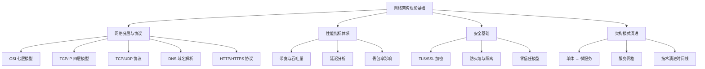
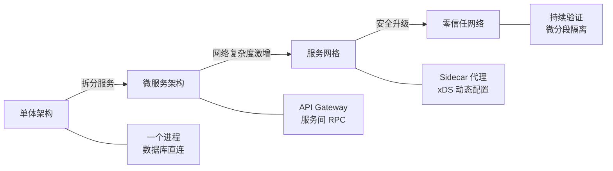
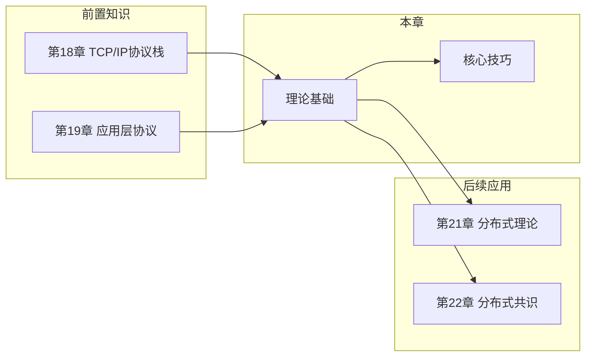

# 网络架构理论基础

## 本节定位

理论基础是整个网络架构章节的根基。在动手配置 Nginx、部署 Istio 之前，必须先建立扎实的概念框架——理解网络通信的本质规律，才能在面对具体场景时做出正确的架构决策。

本节从三个维度构建理论体系：

| 维度 | 内容 | 核心问题 |
|------|------|----------|
| **网络基础** | 分层模型、核心协议、性能指标 | 网络"是什么"和"怎么工作" |
| **架构模式** | 单体→微服务→服务网格→零信任 | 架构"为什么这样演进" |
| **技术演进** | 从硬件到软件、从集中到分布 | 技术"走向何方" |

## 知识体系总览

## 核心概念速查

### 网络分层：理解通信的钥匙

网络分层是理解一切网络技术的元知识。每一层只关注自己的职责，层与层之间通过标准接口交互。掌握分层模型后，遇到任何网络问题都能快速定位到"是哪一层出了毛病"。

**OSI 七层 vs TCP/IP 四层**：

OSI 七层模型               TCP/IP 四层模型
┌─────────────┐           ┌─────────────┐
│  7. 应用层   │           │             │
│  6. 表示层   │  ──────>  │  应用层      │  HTTP, DNS, gRPC, SSH
│  5. 会话层   │           │             │
├─────────────┤           ├─────────────┤
│  4. 传输层   │  ──────>  │  传输层      │  TCP, UDP
├─────────────┤           ├─────────────┤
│  3. 网络层   │  ──────>  │  网络层      │  IP, ICMP, ARP
├─────────────┤           ├─────────────┤
│  2. 数据链路层│           │  网络接口层   │  Ethernet, Wi-Fi
│  1. 物理层   │  ──────>  │             │
└─────────────┘           └─────────────┘

实际工程中使用 TCP/IP 四层模型。记住一个关键原则：**每一层都为上层提供服务，同时对上层屏蔽本层的实现细节**。这个原则在后续理解负载均衡（L4/L7）、代理架构时反复出现。

### 三大核心协议

| 协议 | 层级 | 核心特征 | 典型场景 |
|------|------|----------|----------|
| **TCP** | 传输层 | 面向连接、可靠传输、拥塞控制 | Web、文件传输、数据库连接 |
| **UDP** | 传输层 | 无连接、低延迟、无保证 | 视频流、游戏、DNS 查询 |
| **DNS** | 应用层 | 域名→IP 映射、分布式数据库 | 服务发现、负载均衡、故障转移 |

**TCP 三次握手**的本质是确认双方的收发能力：

客户端                          服务端
  │  ──── SYN (seq=x) ────>     │   "我要连接"
  │  <── SYN+ACK (seq=y,ack=x+1) │   "收到，我也准备好"
  │  ──── ACK (ack=y+1) ────>   │   "确认，开始传输"

为什么不是两次？因为两次握手无法确认客户端收到了服务端的 SYN+ACK——在网络丢包场景下，服务端可能对着空气建立连接、分配资源。

### 性能指标之间的关系

网络性能不是单一指标决定的，而是多个因素的耦合：

最大吞吐量 ≈ TCP 窗口大小 / RTT

示例：窗口 64KB，RTT = 100ms → 吞吐量 = 5.12Mbps
      即使物理带宽是 1Gbps，实际也只能用到 0.5%

**关键认知**：高带宽 ≠ 高吞吐量。跨洲链路带宽可能是 10Gbps，但由于 200ms 的 RTT，TCP 窗口不扩大的话吞吐量低得可怜。这就是为什么需要 **TCP 窗口缩放** 和 **BBR 拥塞控制算法**。

**延迟的四个组成部分**：

| 组成 | 含义 | 可优化手段 |
|------|------|------------|
| 发送延迟 | 数据推送到链路上的时间 | 增大带宽、减小数据包大小 |
| 传播延迟 | 信号在介质中传播的时间 | 物理距离决定，只能通过 CDN 缓存减少 |
| 处理延迟 | 路由器查表、校验等开销 | 硬件加速（FPGA/ASIC）、eBPF 内核态处理 |
| 排队延迟 | 在缓冲区等待的时间 | QoS 流量控制、减少拥塞 |

## 架构模式演进

网络架构的设计模式随着业务规模和技术发展不断演进。理解这条演进路径，才能明白为什么现代系统需要服务网格、零信任这样的"重型"方案。

### 从单体到微服务

| 阶段 | 网络特点 | 核心挑战 | 解决方案 |
|------|----------|----------|----------|
| 单体 | 进程内调用为主 | 简单，偶尔考虑静态资源分发 | Nginx 反向代理 |
| 微服务 | 服务间网络调用 | 服务发现、负载均衡、熔断 | Consul + Nginx + Hystrix |
| 服务网格 | Sidecar 代理接管网络 | 配置爆炸、延迟开销 | Istio/Linkerd |
| 零信任 | 每次访问都验证 | 性能与安全的平衡 | mTLS + 微分段 |

### 技术演进的核心驱动力

每一次架构演进都不是为了"用新技术"，而是为了解决上一阶段无法应对的现实问题：

1. **规模驱动**：单机扛不住 → 分布式 → 服务拆分 → 需要服务发现
2. **复杂度驱动**：手动配置跟不上 → 自动化 → 动态配置（xDS）
3. **安全驱动**：边界防御不够 → 内网也需加密 → 零信任
4. **可观测性驱动**：出问题不知道哪坏了 → 链路追踪 → 分布式追踪系统

## 学习路径指引

本节内容按以下顺序展开，建议依次学习：

1. **[核心概念](01-核心概念.md)**：网络分层模型、TCP/UDP 协议、DNS 解析、HTTP 演进、网络拓扑结构、性能指标体系、安全基础。这是所有后续内容的前置知识。

2. **[技术演进](02-技术演进.md)**：网络架构从传统到现代的演进历程，包括硬件负载均衡到软件负载均衡的转变、代理技术的发展、服务网格的兴起。

**学习建议**：

- 如果你已有 TCP/IP 基础，可以快速浏览核心概念中的分层模型和 DNS 部分，重点放在性能指标体系和架构模式演进
- 如果你是网络新手，建议完整阅读核心概念，特别关注 TCP 三次握手/四次挥手、滑动窗口、拥塞控制等机制
- 读完理论基础后，进入核心技巧章节进行实操——理论需要通过实践来巩固

## 与其他章节的关系

本章是承上启下的关键节点：

- **向上承接**：第18章（TCP/IP 协议栈）提供了传输层的基础知识，第19章（应用层协议）覆盖了 HTTP/gRPC 等应用层协议。理论基础在此基础上将视角从"单条链路"提升到"系统架构"。
- **向下启航**：核心技巧章节将理论转化为实操能力（CDN 配置、负载均衡策略、四层/七层代理部署）。第21章（分布式理论）和第22章（分布式共识）则依赖本章建立的网络基础设施认知。

## 常见误区预警

在进入深入学习之前，先纠正几个根深蒂固的错误认知：

| 误区 | 正确认知 |
|------|----------|
| "带宽越大越好" | 带宽只是上限。跨洲 1Gbps 链路的实际吞吐可能只有几 Mbps，因为 RTT 和丢包是瓶颈 |
| "内网通信不需要加密" | 零信任模型下，攻击者突破边界后内网明文通信就是透明的。mTLS 是标配 |
| "TCP 三次握手浪费" | 三次握手确认双方收发能力、协商初始序列号，省掉的代价是可靠性 |
| "HTTP/2 解决一切" | HTTP/2 解决了应用层队头阻塞，但 TCP 层的队头阻塞仍在。高丢包环境需要 HTTP/3 |
| "DNS 只是翻译域名" | DNS 是分布式数据库，承担服务发现、负载均衡、故障转移、GeoDNS 调度等关键职责 |

> **一句话总结**：网络架构的理论基础，归根结底是在理解"网络不可靠"这个事实的基础上，设计出可靠、高效、安全的通信方案。所有技术选型都是在可靠性、性能和复杂度之间寻找最优平衡。
