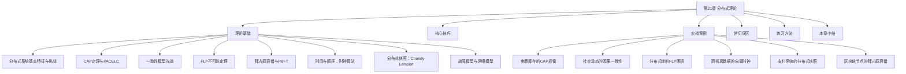
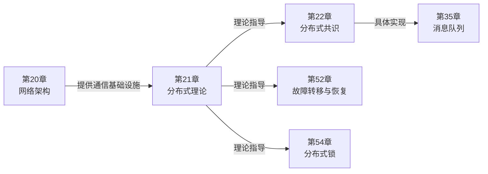

# 第21章 分布式理论

## 章节概览

分布式理论是构建可靠分布式系统的理论基石。当系统从单机走向多机、从本地走向跨地域，一系列在单机环境下不存在的问题会突然涌现——网络分区怎么办？时钟不一致怎么定序？节点故障了数据还可靠吗？这些问题的底层逻辑，就是分布式理论要回答的核心命题。

本章系统性地覆盖分布式系统的理论框架：从 CAP 定理揭示的根本权衡，到 FLP 不可能定理划定的理论边界；从一致性模型的完整光谱，到拜占庭容错的工程实现；从 Lamport 时钟和向量时钟建立的逻辑时间体系，到 Chandy-Lamport 算法实现的全局状态捕获。每一节理论都配有工程视角的解读，帮助读者不仅"知道"，更能"用对"。

## 为什么要学分布式理论

很多工程师的第一反应是："我直接用 Redis、Kafka、etcd 就行了，为什么要学理论？"

答案很简单：**不学理论，你不知道工具的边界在哪里。**

| 症状 | 根因 | 需要的理论知识 |
|------|------|---------------|
| Redis 集群脑裂导致数据不一致 | 不理解 CAP 权衡 | CAP 定理、多数派写入 |
| Kafka 消费者组 rebalance 后丢消息 | 不理解偏移量的一致性保证 | 最终一致性、Read-Your-Writes |
| 微服务间偶发的"幽灵数据" | 时钟不同步导致事件乱序 | Lamport 时钟、因果一致性 |
| 分布式事务回滚不彻底 | 不理解两阶段提交的阻塞问题 | 共识理论、FLP 定理 |
| 区块链双花攻击 | 不理解拜占庭容错的阈值 | BFT 定理、PBFT 算法 |

分布式理论不是学术点缀，而是你在系统设计、故障排查、技术选型时的底层操作系统。

## 本章知识体系全景

### 理论基础（8 个核心模块）

**模块一：分布式系统基本特征与挑战**

从 Leslie Lamport 和 Andrew Tanenbaum 的经典定义出发，理解分布式系统的四个本质特征——多节点、消息传递、协调机制、透明性。重点剖析 Peter Deutsch 的"分布式计算八大谬误"，每一条谬误都对应一类真实的系统故障。最后深入分析分布式系统的三大核心挑战：部分失败（Partial Failure）、时钟不同步、网络不可靠。

> **关键认知**：单机系统要么正常、要么崩溃——状态是确定的。分布式系统中，部分节点可能正常、部分可能失败，状态是非确定的。这种"不确定性"是所有分布式问题的根源。

**模块二：CAP 定理与 PACELC**

Eric Brewer 在 2000 年提出的 CAP 猜想，2002 年由 Gilbert 和 Lynch 证明。定理指出：在网络分区发生时，系统只能在一致性（Consistency）和可用性（Availability）之间选择其一。但 CAP 只描述了网络分区时的权衡，Daniel Abadi 在 2012 年提出的 PACELC 定理进一步扩展：在没有分区时，系统仍然面临延迟（Latency）和一致性（Consistency）的权衡。

本节会：
- 给出 CAP 定理的严格证明概要（反证法）
- 分类主流系统在 CAP/PACELC 光谱上的位置（DynamoDB、Cassandra、Spanner、etcd 等）
- 澄清常见误解：CAP 中的 C 是线性一致性而非 ACID 中的 C，A 是系统级而非节点级

**模块三：一致性模型光谱**

一致性模型是分布式系统设计中最核心的决策维度。从最强到最弱：

线性一致性 > 顺序一致性 > 因果一致性 > 最终一致性
(Linearizability)  (Sequential)  (Causal)    (Eventual)

- **线性一致性**：所有操作看起来在某个全局时间点原子执行，读操作返回最近一次写入的值。实现代价最高（需要共识协议），但语义最强。
- **顺序一致性**：存在某个全局操作顺序与所有进程的程序顺序一致，但不要求与实时顺序一致。
- **因果一致性**：有因果关系的操作必须全局有序，无因果关系的操作可任意排列。社交网络的典型选择。
- **最终一致性**：只要停止写入，所有副本最终会收敛。DNS、CDN 的典型选择。

每种模型都配有形式化定义、执行示例、实现方案和适用场景对比。

**模块四：FLP 不可能定理**

Fischer、Lynch 和 Paterson 在 1985 年证明了分布式理论中最深刻的结论：在异步系统中，即使只有一个进程可能崩溃，也不存在确定性算法能解决共识问题。

这个定理并不意味着共识"做不到"，而是告诉我们：
- 纯异步系统无法同时满足终止性、一致性和有效性
- 实际系统需要"部分同步"假设（超时机制）或随机化来绕过 FLP
- Raft/Paxos 的超时机制、PBFT 的视图切换、区块链的工作量证明，都是对 FLP 的工程回应

**模块五：拜占庭容错**

当节点可能发送任意消息（包括恶意消息）时，系统需要拜占庭容错。核心结论：要容忍 f 个拜占庭故障节点，需要至少 3f+1 个节点。

本节详细解析 PBFT（Practical Byzantine Fault Tolerance）的三阶段协议——Pre-prepare、Prepare、Commit——以及视图切换机制。同时分析 PBFT 的 O(n²) 消息复杂度如何限制其扩展性，以及现代区块链系统（Tendermint、HotStuff）如何优化拜占庭容错协议。

**模块六：时间与顺序**

分布式系统中没有全局时钟，如何确定事件的先后顺序？Lamport 在 1978 年提出了逻辑时钟（Lamport Clock），后来扩展为向量时钟（Vector Clock），再到物理时间与逻辑时间结合的混合逻辑时钟（HLC）。

| 时钟类型 | 原理 | 能判断的顺序关系 | 实现代价 |
|---------|------|-----------------|---------|
| Lamport 时钟 | 递增计数器 + 消息传递同步 | 因果序（但不完全） | 极低（整数+1） |
| 向量时钟 | 每个节点维护一个向量 | 完整的因果序 | 中等（向量大小=节点数） |
| HLC | 物理时钟 + 逻辑时钟混合 | 因果序 + 物理时间参考 | 低 |

**模块七：分布式快照**

如何在不中断系统运行的情况下，捕获分布式系统的全局一致状态？Chandy 和 Lamport 在 1985 年提出了分布式快照算法。核心思想：通过标记消息（Marker）确定每个通道上的状态边界，所有本地状态和标记消息之间的通道状态组合构成全局快照。

这个算法是检查点（Checkpoint）和恢复（Recovery）的基础，也是分布式调试和对账的关键工具。

**模块八：故障模型与网络模型**

所有分布式算法都建立在特定的故障模型和网络模型之上：

- **崩溃故障**：进程停止工作，不再发送消息（最常见）
- **遗漏故障**：进程发送的消息可能丢失
- **拜占庭故障**：进程可能发送任意消息（最复杂）
- **网络模型**：同步（有确定延迟上界）、异步（无延迟上界）、部分同步（最终同步）

理解故障模型是选择正确算法的前提——用处理崩溃故障的 Raft 去应对拜占庭故障，后果是灾难性的。

### 核心技巧

本节将理论转化为可操作的工程实践：
- 如何根据业务场景选择一致性模型
- 如何设计容错和降级策略
- 如何在不违反理论约束的前提下优化性能
- 故障检测器的设计模式

### 实战案例（6 个深度案例）

每个案例都遵循"场景→故障→根因→理论映射→方案→效果→经验"的完整链路：

| 案例 | 核心理论 | 场景 |
|------|---------|------|
| 电商库存的 CAP 权衡 | CAP 定理、PACELC | 网络分区下的库存超卖问题 |
| 社交动态的因果一致性 | 因果一致性、向量时钟 | 动态流乱序显示问题 |
| 分布式锁的 FLP 困境 | FLP 不可能定理 | 异步系统的共识困境 |
| 跨机房数据的向量时钟 | 向量时钟、冲突检测 | 多活数据中心的数据冲突 |
| 支付系统的分布式快照 | Chandy-Lamport 算法 | 支付对账不平问题 |
| 区块链节点的拜占庭容错 | PBFT、BFT | 双花攻击防御 |

### 常见误区

从工程师最容易犯的错误中提炼教训：
- 误以为"最终一致性"等于"数据不一致"
- 混淆 CAP 中的 C（线性一致性）与 ACID 中的 C（约束一致性）
- 用强一致性方案解决所有问题（性能代价被忽视）
- 忽视时钟漂移对系统正确性的影响
- 将分布式锁当作"万能钥匙"而忽略其理论限制

### 练习方法

分层递进的练习设计：
1. **基础理解**：用自己的话解释 CAP 定理，画出一致性模型的光谱图
2. **动手实验**：用代码实现 Lamport 时钟和向量时钟，观察它们的差异
3. **场景分析**：给定一个业务场景，分析应选择哪种一致性模型，说明理由
4. **论文精读**：阅读 CAP 定理原始论文（Gilbert & Lynch, 2002）或 FLP 定理论文（Fischer et al., 1985）

### 本章小结

回顾核心知识点，梳理关键公式与模型（Little 定律、SLA 计算、尾延迟指标），提供最佳实践清单和下一步学习建议。

## 学习路径

入门路径（建议 2-3 天）：
  理论基础（1.1-1.3） → 核心技巧 → 本章小结

进阶路径（建议 1-2 周）：
  完整理论基础 → 实战案例 → 常见误区 → 练习方法

精通路径（建议 1 个月+）：
  完整理论基础 → 实战案例 → 常见误区 → 练习方法
  → 原始论文精读 → 开源项目源码阅读

**建议**：分布式理论的抽象度很高，第一次阅读可能会感到"似懂非懂"。这是正常的。建议先通读理论基础建立全局认知，然后通过实战案例感受理论在工程中的威力，再回头精读理论部分——此时很多概念会"豁然开朗"。

## 前置知识

学习本章之前，建议具备以下基础：

| 知识领域 | 具体要求 | 对应章节 |
|---------|---------|---------|
| 网络基础 | TCP/IP 通信模型、HTTP 协议、Socket 编程 | 第20章 网络架构 |
| 操作系统 | 进程/线程、锁与同步、I/O 模型 | 第2章 操作系统 |
| 数据结构 | 队列、哈希表、树 | 第3章 数据结构 |
| 算法基础 | 时间复杂度、图算法 | 第4章 算法 |
| 数据库 | 事务 ACID、索引、锁 | 第13章 关系型数据库架构 |

## 在本书中的位置

本章是第20章（网络架构）和第22章（分布式共识）之间的理论桥梁。网络架构提供通信基础设施——消息如何在网络中传输；分布式理论提供设计指导——在这些通信约束下，系统能做到什么、不能做什么；分布式共识是理论的具体实现——Raft、Paxos 等算法如何在实践中解决一致性问题。

## 术法道贯通

- **术（What）**：向量时钟的实现代码、分布式快照的执行步骤、PBFT 的消息格式、一致性级别的配置参数
- **法（How）**：CAP 权衡的决策框架、一致性模型的选择原则、故障模型的分析方法、系统设计的权衡清单
- **道（Why）**：分布式系统的本质命题——在不完美的网络和不可靠的节点之间，如何建立可靠的协作？理论给出的是边界，工程给出的是在边界内最优的路径

## 关键参考文献

| 文献 | 作者 | 年份 | 核心贡献 |
|------|------|------|---------|
| Time, Clocks, and the Ordering of Events | Lamport | 1978 | 逻辑时钟、事件排序 |
| Impossibility of Distributed Consensus with One Faulty Process | Fischer, Lynch, Paterson | 1985 | FLP 不可能定理 |
| Virtual Time and Global States | Fidge, Mattern | 1988 | 向量时钟 |
| Practical Byzantine Fault Tolerance | Castro, Liskov | 1999 | PBFT 算法 |
| Brewer's Conjecture | Gilbert, Lynch | 2002 | CAP 定理证明 |
| Dapper, a Large-Scope Distributed Tracing Infrastructure | Google | 2010 | 混合逻辑时钟 HLC |
| PACELC | Abadi | 2012 | CAP 的扩展框架 |
| In Search of an Understandable Consensus Algorithm | Ongaro, Ousterhout | 2014 | Raft 算法 |
| Designing Data-Intensive Applications | Kleppmann | 2017 | 分布式系统工程综述 |
