# 分布式理论核心技巧：从理论到工程的桥梁

理论告诉我们"为什么"，技巧告诉我们"怎么做"。本节将CAP定理、一致性模型、FLP不可能定理、拜占庭容错、向量时钟、分布式快照等理论转化为可落地的工程技巧。每个技巧都包含：**适用场景**、**具体做法**、**代码实现**、**常见陷阱**。

```mermaid
graph TD
    A["分布式理论核心技巧全景"] --> B["CAP权衡决策"]
    A --> C["一致性模型工程化"]
    A --> D["逻辑时钟实战"]
    A --> E["分布式快照执行"]
    A --> F["故障检测与恢复"]
    A --> G["数据分片与路由"]
    A --> H["冲突检测与解决"]
    A --> I["Quorum配置与调优"]

    B --> B1["业务分级策略"]
    B --> B2["分区期间的优雅降级"]
    C --> C1["一致性级别的运行时切换"]
    C --> C2["会话一致性实现"]
    D --> D1["Lamport时钟实现"]
    D --> D2["向量时钟工程化"]
    D --> D3["混合逻辑时钟HLC"]
    E --> E1["Chandy-Lamport算法"]
    E --> E2["增量快照"]
    F --> F1["故障检测器设计"]
    F --> F2["脑裂预防"]
    G --> G1["一致性哈希"]
    G --> G2["范围分片"]
    H --> H1["CRDT数据结构"]
    H --> H2["LWW与合并策略"]
    I --> I1["N/R/W参数调优"]
    I --> I2["延迟读写优化"]

    style A fill:#e74c3c,color:#fff
    style B fill:#3498db,color:#fff
    style C fill:#2ecc71,color:#fff
    style D fill:#f39c12,color:#fff
    style E fill:#9b59b6,color:#fff
    style F fill:#1abc9c,color:#fff
    style G fill:#e67e22,color:#fff
    style H fill:#34495e,color:#fff
    style I fill:#16a085,color:#fff
```



---

## 技巧一：CAP权衡决策——为每类数据选择正确的策略

### 1.1 核心原则：按业务语义分级

CAP权衡不是"全选A"或"全选C"，而是**按数据类型分级处理**。同一个系统中，不同数据的CAP策略可以不同。

数据分级框架：

┌──────────────────────────────────────────────────────────┐
│ 级别一：金融级数据（余额、库存、订单）                       │
│ → CP策略：强一致性优先，分区时拒绝服务                       │
│ → 宁可不可用，不可不一致                                    │
│ → 典型实现：MySQL主从+Raft共识                              │
├──────────────────────────────────────────────────────────┤
│ 级别二：业务级数据（用户资料、商品信息、配置）                 │
│ → PC/EC或PA/EC：根据业务容忍度选择                          │
│ → 短暂不一致可接受，但需最终收敛                             │
│ → 典型实现：MySQL主从+读写分离                              │
├──────────────────────────────────────────────────────────┤
│ 级别三：体验级数据（动态流、消息历史、浏览记录）               │
│ → AP策略：可用性优先，允许最终一致                           │
│ → 乱序或延迟可接受                                         │
│ → 典型实现：Cassandra/DynamoDB                             │
├──────────────────────────────────────────────────────────┤
│ 级别四：分析级数据（日志、埋点、统计）                       │
│ → 最终一致性即可，少量丢失可接受                             │
│ → 典型实现：Kafka→ClickHouse                               │
└──────────────────────────────────────────────────────────┘

### 1.2 分区期间的优雅降级

当网络分区发生时，CP系统不应该直接返回错误，而应该提供"降级但正确"的服务：

```python
class GracefulDegradation:
    """
    CP系统的优雅降级策略
    核心思想：分区期间降级服务，但保证数据正确性
    """

    def __init__(self, primary_client, replica_clients):
        self.primary = primary_client
        self.replicas = replica_clients
        self.partition_detector = PartitionDetector()

    def read(self, key, consistency="strong"):
        """
        读取策略：
        - 强一致：只从主节点读（保证最新数据）
        - 最终一致：从任意副本读（低延迟）
        """
        if consistency == "strong":
            # CP模式：必须从主节点读
            if self.partition_detector.is_partitioned():
                # 分区期间：拒绝强一致读，降级为只读本地缓存
                cached = self.get_local_cache(key)
                if cached:
                    return ReadResult(
                        value=cached.value,
                        consistency="degraded",
                        warning="数据可能不是最新版本，来自本地缓存"
                    )
                raise ServiceDegradedError(
                    "网络分区期间无法保证强一致性，建议稍后重试"
                )
            return self.primary.read(key)

        # 最终一致模式：从最近的副本读
        return self.replicas.get_nearest().read(key)

    def write(self, key, value, criticality="high"):
        """
        写入策略：
        - 高关键数据：必须写主节点成功才算成功
        - 低关键数据：写入本地即可，异步同步
        """
        if criticality == "high":
            if self.partition_detector.is_partitioned():
                # 分区期间：高关键数据拒绝写入（CP保证）
                raise WriteRejectedError(
                    f"数据 {key} 为高关键数据，"
                    f"网络分区期间拒绝写入以保证一致性"
                )
            return self.primary.write(key, value)
        else:
            # 低关键数据：写本地副本，异步同步
            local_replica = self.replicas.get_local()
            local_replica.write_local(key, value)
            self.async_replicate(key, value)
            return WriteResult(status="accepted", consistency="eventual")
```

### 1.3 PACELC决策矩阵的工程化

在工程实践中，使用PACELC框架做选型决策：

| 决策维度 | 选PA（可用性优先） | 选PC（一致性优先） |
|---------|-------------------|-------------------|
| 数据丢失影响 | 可接受少量丢失 | 任何丢失都不可接受 |
| 延迟要求 | < 10ms（用户交互） | 可容忍 > 50ms |
| 并发写入场景 | 多地同时写入常见 | 写入集中在少数区域 |
| 决策维度 | 选EL（低延迟优先） | 选EC（强一致优先） |
| 读操作对新鲜度的要求 | 秒级延迟可接受 | 必须读到最新值 |
| 系统负载模式 | 读多写少，读延迟敏感 | 写多读少，数据正确性优先 |

**实际系统的PACELC选型参考**：

| 系统类型       | 推荐PACELC | 理由                              |
|---------------|-----------|----------------------------------|
| 电商库存       | PC/EC     | 不能超卖，数据必须一致              |
| 社交动态       | PA/EL     | 用户体验优先，短暂乱序可接受         |
| 支付系统       | PC/EC     | 金融级数据，零容忍不一致            |
| 用户资料       | PC/EC     | 昵称/头像变更需即时生效             |
| 搜索索引       | PA/EL     | 索引延迟几秒可接受                 |
| 物联网采集     | PA/EL     | 高吞吐写入优先，数据最终一致即可     |
| 配置中心       | PC/EC     | 配置变更需即时生效                  |
| CDN缓存        | PA/EL     | 缓存命中率优先                     |

---

## 技巧二：一致性模型的工程化——从理论定义到运行时配置

### 2.1 一致性级别的运行时切换

成熟的分布式数据库支持在运行时调整一致性级别。以Cassandra为例：

```python
from cassandra.cluster import Cluster
from cassandra import ConsistencyLevel

class ConsistencyManager:
    """
    Cassandra一致性级别动态管理器
    根据业务场景和系统状态自动调整一致性级别
    """

    # 一致性级别从低到高
    LEVELS = {
        'ONE': ConsistencyLevel.ONE,
        'QUORUM': ConsistencyLevel.QUORUM,
        'LOCAL_QUORUM': ConsistencyLevel.LOCAL_QUORUM,
        'EACH_QUORUM': ConsistencyLevel.EACH_QUORUM,
        'ALL': ConsistencyLevel.ALL,
    }

    def __init__(self, session, rf=3):
        """
        session: Cassandra会话
        rf: 副本因子（Replication Factor）
        """
        self.session = session
        self.rf = rf
        # Quorum = rf/2 + 1
        self.quorum = rf // 2 + 1

    def write_with_adaptive_consistency(self, table, data, urgency="normal"):
        """
        自适应一致性写入：
        - 正常模式：LOCAL_QUORUM（数据中心内Quorum，平衡一致性和延迟）
        - 高优模式：ALL（全副本写入，最强一致）
        - 低优模式：ONE（单副本写入，最低延迟）
        """
        consistency_map = {
            'critical': 'ALL',      # 关键操作：全部副本
            'normal': 'LOCAL_QUORUM',  # 正常操作：本地Quorum
            'bulk': 'ONE',          # 批量操作：单副本
        }

        level_name = consistency_map.get(urgency, 'LOCAL_QUORUM')
        self.session.default_consistency self.LEVELS[level_name]

        query = self._build_insert(table, data)
        self.session.execute(query)

        return {
            'consistency': level_name,
            'replicas_required': self._replicas_for_level(level_name),
            'durability': self._durability_guarantee(level_name)
        }

    def read_with_stale_tolerance(self, table, key, max_staleness_ms=1000):
        """
        带过期容忍的读取：
        - 先尝试从副本读（低延迟）
        - 如果数据过期，回退到主节点
        """
        # 1. 从最近副本读
        result = self.session.execute(
            f"SELECT * FROM {table} WHERE key = %s",
            [key],
            consistency_level=self.LEVELS['ONE']
        )

        if result:
            row = result.one()
            staleness = self._calculate_staleness(row)
            if staleness <= max_staleness_ms:
                return {'value': row, 'source': 'replica', 'staleness': staleness}

        # 2. 数据过期或不存在，从Quorum读
        result = self.session.execute(
            f"SELECT * FROM {table} WHERE key = %s",
            [key],
            consistency_level=self.LEVELS['LOCAL_QUORUM']
        )
        row = result.one()
        return {'value': row, 'source': 'quorum', 'staleness': 0}

    def _replicas_for_level(self, level_name):
        """计算指定一致性级别需要的副本数"""
        requirements = {
            'ONE': 1,
            'QUORUM': self.quorum,
            'LOCAL_QUORUM': self.quorum,
            'ALL': self.rf,
        }
        return requirements.get(level_name, 1)

    def _durability_guarantee(self, level_name):
        """返回一致性级别的持久性保证描述"""
        guarantees = {
            'ONE': '写入单个节点即返回，可能丢失（节点故障时）',
            'QUORUM': '写入多数节点，保证多数副本持久化',
            'LOCAL_QUORUM': '写入本地数据中心多数节点，跨数据中心可能丢失',
            'ALL': '写入所有节点，最强持久性保证',
        }
        return guarantees.get(level_name, '未知')
```

### 2.2 会话一致性的实现

会话一致性（Session Consistency）保证单个客户端会话内的操作具有因果一致性。这在大多数Web应用中是最实用的一致性级别：

```python
class SessionConsistencyManager:
    """
    会话一致性管理器
    保证：
    1. Read-Your-Writes：用户总能看到自己写入的数据
    2. Monotonic Reads：用户不会看到数据"回退"
    3. Writes-Follow-Reads：写入建立在之前读取的数据之上
    """

    def __init__(self, session_id, backend):
        self.session_id = session_id
        self.backend = backend
        # 每个会话维护自己的"已知世界"时钟
        self.session_clock = {}  # {key: version}

    def write(self, key, value):
        """
        写入操作：
        1. 获取当前版本号
        2. 写入新值（版本号+1）
        3. 更新会话时钟
        """
        current_version = self.session_clock.get(key, 0)
        new_version = current_version + 1

        # 写入时携带版本号，后端保证版本递增
        self.backend.write(
            key=key,
            value=value,
            version=new_version,
            session_id=self.session_id
        )

        # 更新本地会话时钟
        self.session_clock[key] = new_version

        return {
            'key': key,
            'version': new_version,
            'session_clock': dict(self.session_clock)
        }

    def read(self, key):
        """
        读取操作：
        1. 检查会话时钟，确保不读到比已知版本更旧的数据
        2. 如果后端返回的数据版本 < 会话时钟版本，等待同步
        """
        known_version = self.session_clock.get(key, 0)

        max_wait_ms = 5000  # 最多等待5秒
        waited_ms = 0

        while waited_ms < max_wait_ms:
            result = self.backend.read(key)

            if result is None:
                # 数据不存在
                return None

            if result['version'] >= known_version:
                # 版本满足要求，更新会话时钟
                self.session_clock[key] = result['version']
                return result

            # 版本不满足，短暂等待后重试
            time.sleep(0.01)  # 10ms
            waited_ms += 10

        # 超时：返回当前可用数据，标记为降级
        result = self.backend.read(key)
        return {
            **result,
            'consistency_degraded': True,
            'warning': f'期望版本>={known_version}，实际版本={result["version"]}'
        }

    def repair_session_clock(self):
        """
        会话时钟修复：
        当检测到后端数据版本落后于会话时钟时，
        可能是后端发生了数据回滚，需要触发修复。
        """
        for key, expected_version in self.session_clock.items():
            backend_version = self.backend.get_version(key)
            if backend_version < expected_version:
                # 后端版本落后于会话时钟——数据可能丢失
                # 触发报警并尝试恢复
                self._trigger_repair(key, expected_version, backend_version)
```

### 2.3 线性一致性的读写实现

线性一致性是最强的一致性模型，工程实现需要特殊技巧：

```python
class LinearizableStore:
    """
    线性一致性存储
    核心要求：所有操作看起来像是在某个单一的全局时间点原子执行的

    实现策略：所有读写操作都通过Leader节点，
    Leader通过Raft/Paxos保证操作的全局顺序。
    """

    def __init__(self, raft_group):
        self.raft = raft_group  # Raft组（Leader + Followers）

    def write(self, key, value):
        """
        线性一致写入：
        1. 请求必须发送到Leader
        2. Leader将写操作作为Raft日志条目复制到多数派
        3. 多数派确认后提交
        4. 返回客户端

        延迟 = 1 RTT（Leader→多数派→Leader）+ 本地处理
        """
        leader = self.raft.get_leader()
        if leader is None:
            raise LeaderUnavailableError("无可用Leader，无法保证线性一致性")

        # 通过Raft复制写操作
        result = leader.replicate_log({
            'type': 'write',
            'key': key,
            'value': value,
            'timestamp': time.time_ns()  # 纳秒级时间戳
        })

        if result.committed:
            return WriteResult(
                key=key,
                value=value,
                term=result.term,
                index=result.index,
                latency_ms=result.latency_ms
            )
        else:
            raise WriteFailedError(f"Raft复制失败: {result.error}")

    def read(self, key, read_strategy="leader"):
        """
        线性一致读取——三种策略：

        策略一：Leader Read（推荐，延迟最低）
        - 直接从Leader读
        - Leader保证读到的是最新已提交的数据
        - 延迟 = 0 RTT（本地读）

        策略二：Read Index（中等延迟）
        - 从任意节点读，但先从Leader获取commit index
        - 等待本地日志追上commit index后读取
        - 延迟 = 1 RTT（获取commit index）

        策略三：Lease Read（最严格）
        - Leader持有租约（Lease），租约期内保证是Leader
        - 读取时检查租约有效性
        - 延迟 = 0 RTT，但租约有时间开销
        """
        if read_strategy == "leader":
            return self._leader_read(key)
        elif read_strategy == "read_index":
            return self._read_index(key)
        elif read_strategy == "lease":
            return self._lease_read(key)
        else:
            raise ValueError(f"未知读取策略: {read_strategy}")

    def _leader_read(self, key):
        """
        Leader Read：
        最简单高效的线性一致读
        前提：Leader必须确认自己仍然是Leader（检查term）
        """
        leader = self.raft.get_leader()
        # 1. 检查当前term，确认自己是Leader
        current_term = leader.get_current_term()
        # 2. 执行读操作（本地状态机读取）
        value = leader.state_machine.read(key)
        return {'value': value, 'term': current_term, 'strategy': 'leader_read'}

    def _read_index(self, key):
        """
        Read Index：
        任何节点都可以执行线性一致读
        但需要从Leader获取commit index（1 RTT）
        """
        leader = self.raft.get_leader()
        # 1. 从Leader获取当前commit index
        commit_index = leader.get_commit_index()

        # 2. 等待本地日志追上commit index
        follower = self.raft.get_local_node()
        while follower.get_applied_index() < commit_index:
            time.sleep(0.001)  # 1ms

        # 3. 本地读取
        value = follower.state_machine.read(key)
        return {'value': value, 'commit_index': commit_index, 'strategy': 'read_index'}
```

---

## 技巧三：逻辑时钟的工程实现

### 3.1 Lamport时钟实现

Lamport时钟是最基础的逻辑时钟，用于确定事件的因果顺序：

```python
import threading
import time
from dataclasses import dataclass, field
from typing import Dict, Optional

@dataclass
class LamportClock:
    """
    Lamport时钟
    规则：
    1. 每个进程本地时间戳递增
    2. 发送消息时，将当前时间戳附加到消息中
    3. 接收消息时，取 max(本地时间戳, 消息时间戳) + 1

    特点：
    - 单调递增
    - 捕获因果关系（happened-before）
    - 不捕获并发关系（A∥B时，时钟可能相同）
    """
    counter: int = 0
    node_id: str = ""
    _lock: threading.Lock = field(default_factory=threading.Lock)

    def tick(self) -> int:
        """本地事件：时间戳+1"""
        with self._lock:
            self.counter += 1
            return self.counter

    def send_message(self, message: dict) -> dict:
        """
        发送消息：
        1. 本地tick
        2. 将时间戳附加到消息
        """
        timestamp = self.tick()
        message['lamport_timestamp'] = timestamp
        message['sender'] = self.node_id
        return message

    def receive_message(self, message: dict) -> tuple:
        """
        接收消息：
        1. 取 max(本地, 消息) + 1
        2. 返回更新后的时间戳和消息
        """
        msg_ts = message.get('lamport_timestamp', 0)
        with self._lock:
            self.counter = max(self.counter, msg_ts) + 1
            return self.counter, message

    def get_timestamp(self) -> int:
        """获取当前时间戳（不递增）"""
        return self.counter


# === 使用示例 ===

# 场景：两个节点协作处理订单
node_a = LamportClock(node_id="node-a")
node_b = LamportClock(node_id="node-b")

# 节点A：接收订单
event_a1 = node_a.tick()  # counter=1
print(f"节点A: 接收订单, 时钟={event_a1}")

# 节点A：发送消息给节点B
msg = node_a.send_message({"type": "process_payment", "order_id": "ORD-001"})
print(f"节点A→B: 消息={msg}")

# 节点B：接收消息
ts_b, msg_b = node_b.receive_message(msg)
print(f"节点B: 收到消息, 时钟={ts_b}, 消息={msg_b}")

# 节点B：处理完成
event_b1 = node_b.tick()  # counter=3 (max(0,1)+1=2, 再+1=3)
print(f"节点B: 处理完成, 时钟={event_b1}")
```

**Lamport时钟的局限**：时间戳相同不代表事件并发。例如：

节点A: send(m1) → 时钟=1，发送m1
节点B: send(m2) → 时钟=1，发送m2

两个消息的时钟都是1，但它们实际上是并发的
Lamport时钟无法区分"并发"和"因果"

### 3.2 向量时钟实现

向量时钟解决了Lamport时钟无法检测并发的问题：

```python
from typing import Dict, List, Optional
from dataclasses import dataclass, field
import threading
import copy

@dataclass
class VectorClock:
    """
    向量时钟（Vector Clock）
    每个节点维护一个向量，记录所有节点的逻辑时间。

    规则：
    1. 本地事件：自己的分量+1
    2. 发送消息：发送前将自己的分量+1，附带整个向量
    3. 接收消息：每个分量取 max(本地, 消息)，然后自己的分量+1

    比较规则：
    - A < B：A的所有分量 <= B的对应分量，且至少一个 < B
    - A = B：所有分量相等
    - A ∥ B（并发）：既不是 A <= B 也不是 B <= A
    """
    clocks: Dict[str, int] = field(default_factory=dict)
    node_id: str = ""
    _lock: threading.Lock = field(default_factory=threading.Lock)

    def tick(self) -> Dict[str, int]:
        """本地事件：自己的分量+1"""
        with self._lock:
            self.clocks[self.node_id] = self.clocks.get(self.node_id, 0) + 1
            return copy.deepcopy(self.clocks)

    def send_message(self, message: dict) -> dict:
        """发送消息：递增自己分量，附带向量"""
        with self._lock:
            self.clocks[self.node_id] = self.clocks.get(self.node_id, 0) + 1
            message['vector_clock'] = copy.deepcopy(self.clocks)
            message['sender'] = self.node_id
        return message

    def receive_message(self, message: dict) -> dict:
        """
        接收消息：
        1. 向量每个分量取 max(本地, 消息)
        2. 自己的分量+1
        """
        msg_clock = message.get('vector_clock', {})
        with self._lock:
            # 合并：每个分量取max
            all_keys = set(list(self.clocks.keys()) + list(msg_clock.keys()))
            for key in all_keys:
                local_val = self.clocks.get(key, 0)
                msg_val = msg_clock.get(key, 0)
                self.clocks[key] = max(local_val, msg_val)
            # 自己的分量+1
            self.clocks[self.node_id] = self.clocks.get(self.node_id, 0) + 1
            return copy.deepcopy(self.clocks)

    @staticmethod
    def compare(clock_a: Dict[str, int], clock_b: Dict[str, int]) -> str:
        """
        比较两个向量时钟：
        返回: 'before', 'after', 'concurrent', 'equal'
        """
        a_leq_b = True
        b_leq_a = True
        all_keys = set(list(clock_a.keys()) + list(clock_b.keys()))

        for key in all_keys:
            a_val = clock_a.get(key, 0)
            b_val = clock_b.get(key, 0)
            if a_val > b_val:
                a_leq_b = False
            if b_val > a_val:
                b_leq_a = False

        if a_leq_b and b_leq_a:
            return 'equal'
        elif a_leq_b:
            return 'before'  # A happens-before B
        elif b_leq_a:
            return 'after'   # B happens-before A
        else:
            return 'concurrent'  # A和B并发

    @staticmethod
    def merge(*clocks: Dict[str, int]) -> Dict[str, int]:
        """合并多个向量时钟：每个分量取max"""
        result = {}
        for clock in clocks:
            for key, value in clock.items():
                result[key] = max(result.get(key, 0), value)
        return result


# === 冲突检测示例 ===

# 模拟两个数据中心独立写入同一数据
dc_beijing = VectorClock(node_id="beijing")
dc_shanghai = VectorClock(node_id="shanghai")

# 北京写入 v1
clock_v1 = dc_beijing.tick()
print(f"北京写入v1: 向量时钟={clock_v1}")

# 上海写入 v2（并发，没有收到北京的消息）
clock_v2 = dc_shanghai.tick()
print(f"上海写入v2: 向量时钟={clock_v2}")

# 检测冲突
relation = VectorClock.compare(clock_v1, clock_v2)
print(f"比较结果: {relation}")  # → 'concurrent'（并发冲突！）

# 合并两个时钟（解决冲突后的时钟）
merged = VectorClock.merge(clock_v1, clock_v2)
print(f"合并后时钟: {merged}")
```

### 3.3 混合逻辑时钟（HLC）

HLC结合物理时钟和逻辑时钟的优点，是Spanner等系统的核心组件：

```python
import time
import threading
from dataclasses import dataclass

@dataclass
class HybridLogicalClock:
    """
    混合逻辑时钟（Hybrid Logical Clock, HLC）
    Kulkarni et al., 2014

    结构：(physical_time, logical_counter)
    规则：
    1. 本地事件：如果物理时钟 > lts，重置逻辑计数器；否则逻辑计数器+1
    2. 发送消息：本地tick，附带HLC
    3. 接收消息：取 max(物理时钟, 本地lts, 消息lts)，可能重置逻辑计数器

    优点：
    - 物理时间上界：HLC的时间戳接近物理时间，便于调试和排序
    - 逻辑时间保证：即使物理时钟回退，逻辑时间也单调递增
    - 因果一致性：捕获了happened-before关系
    """
    pt: int = 0      # 物理时间部分（毫秒）
    lc: int = 0      # 逻辑计数器部分
    node_id: str = ""
    _lock: threading.Lock = threading.Lock()

    def now(self) -> int:
        """获取当前物理时间（毫秒）"""
        return int(time.time() * 1000)

    def tick(self) -> tuple:
        """
        本地事件：
        1. pt = max(物理时钟, 本地pt)
        2. 如果 pt == 本地pt，lc += 1；否则 lc = 0
        """
        with self._lock:
            pt = self.now()
            if pt > self.pt:
                self.pt = pt
                self.lc = 0
            else:
                self.lc += 1
            return (self.pt, self.lc)

    def send_message(self, message: dict) -> dict:
        """发送消息：附带当前HLC"""
        pt, lc = self.tick()
        message['hlc'] = (pt, lc)
        message['sender'] = self.node_id
        return message

    def receive_message(self, message: dict) -> tuple:
        """
        接收消息：
        1. pt = max(物理时钟, 本地pt, 消息pt)
        2. 如果 pt == 本地pt == 消息pt，lc = max(本地lc, 消息lc) + 1
        3. 如果 pt == 本地pt > 消息pt，lc = 本地lc + 1
        4. 如果 pt == 消息pt > 本地pt，lc = 消息lc
        5. 如果 pt > max(本地pt, 消息pt)，lc = 0
        """
        msg_pt, msg_lc = message.get('hlc', (0, 0))
        with self._lock:
            pt = max(self.now(), self.pt, msg_pt)

            if pt == self.pt and pt == msg_pt:
                self.lc = max(self.lc, msg_lc) + 1
            elif pt == self.pt:
                self.lc += 1
            elif pt == msg_pt:
                self.lc = msg_lc
            else:
                self.lc = 0

            self.pt = pt
            return (self.pt, self.lc)

    def to_string(self) -> str:
        """格式化输出，方便调试"""
        pt_sec = self.pt / 1000.0
        return f"{pt_sec:.3f}:{self.lc}"

    def to_int64(self) -> int:
        """转为64位整数（用于数据库存储）"""
        return (self.pt << 16) | (self.lc &amp; 0xFFFF)


# === 使用示例 ===
hlc = HybridLogicalClock(node_id="server-1")

# 本地事件
ts1 = hlc.tick()
print(f"本地事件1: HLC={hlc.to_string()}, int64={hlc.to_int64()}")

ts2 = hlc.tick()
print(f"本地事件2: HLC={hlc.to_string()}, int64={hlc.to_int64()}")

# 模拟网络消息
msg = hlc.send_message({"type": "update", "key": "x"})
print(f"发送消息: HLC={msg['hlc']}")

# 另一个节点接收
hlc2 = HybridLogicalClock(node_id="server-2")
ts_received = hlc2.receive_message(msg)
print(f"接收后HLC: {hlc2.to_string()}")
```

**HLC的实际应用**：
- **Spanner**：使用TrueTime（GPS+原子钟）提供物理时间上界，HLC提供逻辑时间保证
- **CockroachDB**：使用HLC作为事务时间戳
- **Cassandra**：HLC用于检测写冲突和确定数据版本

---

## 技巧四：分布式快照的执行

### 4.1 Chandy-Lamport算法实现

分布式快照用于捕获全局一致的状态，是实现检查点（Checkpoint）和恢复的基础：

```python
from enum import Enum
from dataclasses import dataclass, field
from typing import Dict, List, Optional, Any
import threading
import queue

class ChannelState(Enum):
    OPEN = "open"
    MARKER_RECEIVED = "marker_received"
    CLOSED = "closed"

@dataclass
class SnapshotRecord:
    """快照记录：包含节点状态和所有入通道的消息"""
    node_id: str
    state: Any  # 节点状态
    channel_messages: Dict[str, List]  # {channel: [messages]}
    is_complete: bool = False

class DistributedNode:
    """
    Chandy-Lamport分布式快照算法

    算法步骤：
    1. 发起者记录自己的状态
    2. 发起者向所有出通道发送Marker
    3. 收到Marker的节点：
       a. 第一次收到Marker：记录状态，开始记录该通道的消息
       b. 已在快照中：停止记录该通道的消息
    4. 所有节点的状态+所有通道中Marker之间的消息 = 全局快照
    """

    def __init__(self, node_id: str, neighbors: List[str]):
        self.node_id = node_id
        self.neighbors = neighbors
        self.state = {}  # 节点本地状态

        # 快照相关
        self.channels: Dict[str, ChannelState] = {
            n: ChannelState.OPEN for n in neighbors
        }
        self.channel_buffers: Dict[str, List] = {
            n: [] for n in neighbors
        }
        self.snapshot_record: Optional[SnapshotRecord] = None
        self.is_recording = False

        # 消息队列（模拟网络）
        self.inbox: queue.Queue = queue.Queue()
        self._lock = threading.Lock()

    def init_snapshot(self):
        """
        步骤1：发起者启动快照
        1. 记录本地状态
        2. 向所有出通道发送Marker
        3. 开始记录入通道消息
        """
        with self._lock:
            # 记录本地状态
            self.snapshot_record = SnapshotRecord(
                node_id=self.node_id,
                state=copy.deepcopy(self.state),
                channel_messages={n: [] for n in self.neighbors}
            )
            self.is_recording = True

        # 向所有邻居发送Marker
        for neighbor in self.neighbors:
            self.send_marker(neighbor)

        print(f"[{self.node_id}] 快照发起，已向 {self.neighbors} 发送Marker")

    def send_marker(self, to_node: str):
        """发送Marker消息"""
        marker = {
            'type': 'MARKER',
            'from': self.node_id,
            'to': to_node,
            'snapshot_id': id(self.snapshot_record)
        }
        self.inbox.put(marker)

    def send_message(self, to_node: str, content: Any):
        """发送普通消息"""
        msg = {
            'type': 'DATA',
            'from': self.node_id,
            'to': to_node,
            'content': content
        }
        # 模拟网络传输
        self.inbox.put(msg)

    def process_messages(self):
        """
        处理所有待处理消息
        核心逻辑：Marker的接收触发快照状态转换
        """
        while not self.inbox.empty():
            msg = self.inbox.get_nowait()
            sender = msg['from']

            if msg['type'] == 'MARKER':
                self._handle_marker(sender, msg)
            elif msg['type'] == 'DATA':
                self._handle_data(sender, msg)

    def _handle_marker(self, sender: str, msg: dict):
        """
        处理Marker消息——Chandy-Lamport的核心逻辑

        情况1：第一次收到该通道的Marker
          → 记录当前状态（如果是第一次，记录节点状态）
          → 停止记录该通道消息
          → 向其他出通道发送Marker

        情况2：已经收到过该通道的Marker
          → 停止记录该通道消息
          → 已记录的消息成为快照的一部分
        """
        with self._lock:
            if self.channels[sender] == ChannelState.OPEN:
                # 情况1：第一次收到Marker

                # 记录节点状态（如果还没有记录）
                if self.snapshot_record is None:
                    self.snapshot_record = SnapshotRecord(
                        node_id=self.node_id,
                        state=copy.deepcopy(self.state),
                        channel_messages={n: [] for n in self.neighbors}
                    )

                # 停止记录该通道消息
                self.channels[sender] = ChannelState.MARKER_RECEIVED

                # 向其他出通道发送Marker
                for neighbor in self.neighbors:
                    if neighbor != sender:
                        self.send_marker(neighbor)

                print(f"[{self.node_id}] 收到来自 {sender} 的Marker，记录状态")
            else:
                # 情况2：已经收到过，停止记录
                self.channels[sender] = ChannelState.CLOSED
                print(f"[{self.node_id}] 收到 {sender} 的Marker（第二次），通道关闭")

    def _handle_data(self, sender: str, msg: dict):
        """
        处理数据消息：
        - 如果该通道正在记录：消息加入快照缓冲区
        - 否则：消息正常处理
        """
        with self._lock:
            if self.channels[sender] == ChannelState.MARKER_RECEIVED:
                # 通道正在记录，消息属于快照
                if self.snapshot_record:
                    self.snapshot_record.channel_messages[sender].append(msg)
            else:
                # 正常处理
                self._process_data(msg)

    def _process_data(self, msg: dict):
        """处理数据消息（业务逻辑）"""
        # 更新节点状态
        content = msg['content']
        if isinstance(content, dict):
            self.state.update(content)


# === 使用示例 ===

# 创建3个节点
node_a = DistributedNode("A", ["B", "C"])
node_b = DistributedNode("B", ["A", "C"])
node_c = DistributedNode("C", ["A", "B"])

# 初始化状态
node_a.state = {"counter": 10, "name": "node-a"}
node_b.state = {"counter": 20, "name": "node-b"}
node_c.state = {"counter": 30, "name": "node-c"}

# 模拟一些消息在传输中
node_a.send_message("B", {"counter": 15})  # A→B 的消息
node_b.send_message("C", {"counter": 25})  # B→C 的消息

# A发起快照
node_a.init_snapshot()

# 处理所有节点的消息
node_a.process_messages()
node_b.process_messages()
node_c.process_messages()

# 查看快照结果
for node in [node_a, node_b, node_c]:
    if node.snapshot_record:
        sr = node.snapshot_record
        print(f"\n节点 {sr.node_id} 的快照:")
        print(f"  状态: {sr.state}")
        print(f"  通道消息: {sr.channel_messages}")
```

### 4.2 增量快照与全量快照的选择

```python
class SnapshotStrategy:
    """
    快照策略选择器
    根据系统特性选择合适的快照方式
    """

    @staticmethod
    def should_use_incremental(
        state_size_mb: float,
        change_rate: float,
        snapshot_interval_sec: int,
        network_bandwidth_mbps: float
    ) -> dict:
        """
        判断是否使用增量快照

        参数：
        - state_size_mb: 状态大小（MB）
        - change_rate: 每秒变化比例（0-1）
        - snapshot_interval_sec: 快照间隔（秒）
        - network_bandwidth_mbps: 网络带宽（Mbps）

        返回：推荐策略及理由
        """
        # 计算全量快照的数据量
        full_snapshot_mb = state_size_mb
        full_snapshot_time_sec = full_snapshot_mb * 8 / network_bandwidth_mbps

        # 计算增量快照的数据量
        changes_per_interval = state_size_mb * change_rate * snapshot_interval_sec
        incremental_time_sec = changes_per_interval * 8 / network_bandwidth_mbps

        # 决策
        if changes_per_interval < state_size_mb * 0.1:
            # 变化量 < 10%：用增量快照
            return {
                'strategy': 'incremental',
                'reason': f'变化量({changes_per_interval:.1f}MB) < 10%状态大小',
                'expected_time_sec': incremental_time_sec,
                'space_overhead': f'{changes_per_interval:.1f}MB/interval'
            }
        elif full_snapshot_time_sec < 5:
            # 全量快照时间 < 5秒：直接全量
            return {
                'strategy': 'full',
                'reason': f'全量快照仅需{full_snapshot_time_sec:.1f}秒',
                'expected_time_sec': full_snapshot_time_sec,
                'space_overhead': f'{full_snapshot_mb}MB/interval'
            }
        else:
            # 混合策略：定期全量 + 间隔增量
            return {
                'strategy': 'hybrid',
                'reason': f'全量{full_snapshot_time_sec:.1f}秒太慢，但增量也需{incremental_time_sec:.1f}秒',
                'expected_time_sec': incremental_time_sec,
                'full_interval': '每10次快照做一次全量',
                'space_overhead': f'增量{changes_per_interval:.1f}MB + 全量{full_snapshot_mb}MB(每10次)'
            }
```

---

## 技巧五：故障检测与恢复

### 5.1 故障检测器设计

FLP定理告诉我们纯异步系统无法区分"慢"和"崩溃"。工程上使用**故障检测器**来近似解决：

```python
import time
import threading
from enum import Enum
from dataclasses import dataclass, field
from typing import Callable, Dict, Optional

class NodeStatus(Enum):
    ALIVE = "alive"
    SUSPECTED = "suspected"
    DEAD = "dead"

@dataclass
class FailureDetector:
    """
    故障检测器（基于Phi Accrual算法）

    Phi Accrual故障检测器（Hayashibara et al., 2004）：
    - 不是简单的"超时→判定故障"
    - 而是计算一个"可疑度"（phi值）
    - phi值越高，节点越可能故障
    - 阈值可动态调整

    phi值的含义：
    - phi=1: 80%概率节点已故障
    - phi=2: 99%概率节点已故障
    - phi=3: 99.9%概率节点已故障
    - phi=4: 99.99%概率节点已故障
    """
    node_id: str
    phi_threshold: float = 8.0  # 可疑度阈值
    window_size: int = 100  # 心跳间隔样本数

    # 内部状态
    _heartbeats: list = field(default_factory=list)
    _last_heartbeat: float = 0
    _status: NodeStatus = NodeStatus.ALIVE
    _lock: threading.Lock = field(default_factory=threading.Lock)

    def __post_init__(self):
        self._last_heartbeat = time.time()

    def heartbeat_received(self):
        """收到心跳时调用"""
        with self._lock:
            now = time.time()
            if self._last_heartbeat > 0:
                interval = now - self._last_heartbeat
                self._heartbeats.append(interval)
                # 保持窗口大小
                if len(self._heartbeats) > self.window_size:
                    self._heartbeats = self._heartbeats[-self.window_size:]
            self._last_heartbeat = now
            self._status = NodeStatus.ALIVE

    def get_phi(self) -> float:
        """
        计算当前的phi值（可疑度）

        基于历史心跳间隔的正态分布假设：
        - 计算平均间隔和标准差
        - 计算当前距离上次心跳的时间
        - 转换为phi值
        """
        with self._lock:
            if len(self._heartbeats) < 3:
                return 0.0  # 样本不足，不判断

            # 计算平均间隔和标准差
            avg = sum(self._heartbeats) / len(self._heartbeats)
            variance = sum((x - avg) ** 2 for x in self._heartbeats) / len(self._heartbeats)
            std = variance ** 0.5 if variance > 0 else 0.001

            # 当前距离上次心跳的时间
            elapsed = time.time() - self._last_heartbeat

            # 使用正态分布CDF计算phi
            # phi = -log10(1 - CDF(elapsed))
            import math
            z = (elapsed - avg) / std
            # 近似正态分布CDF
            cdf = 0.5 * (1 + math.erf(z / math.sqrt(2)))
            phi = -math.log10(1 - cdf) if cdf < 1 else 10.0

            return phi

    def is_alive(self) -> bool:
        """判断节点是否存活"""
        phi = self.get_phi()
        return phi < self.phi_threshold

    def get_status(self) -> dict:
        """获取检测器状态"""
        phi = self.get_phi()
        with self._lock:
            return {
                'node_id': self.node_id,
                'status': self._status.value,
                'phi': round(phi, 4),
                'threshold': self.phi_threshold,
                'heartbeats_count': len(self._heartbeats),
                'avg_interval_ms': round(
                    sum(self._heartbeats) / len(self._heartbeats) * 1000
                    if self._heartbeats else 0, 2
                ),
                'last_heartbeat_age_ms': round(
                    (time.time() - self._last_heartbeat) * 1000, 2
                )
            }
```

### 5.2 脑裂预防

脑裂（Split-Brain）是分布式系统中最危险的故障之一——两个节点都认为自己是Leader，同时接受写入：

```python
class SplitBrainPrevention:
    """
    脑裂预防策略

    核心原则：在任何时刻，最多只有一个Leader
    策略层次：
    1. 多数派投票（Quorum）
    2. Fencing Token（栅栏令牌）
    3. 外部协调器（ZooKeeper/etcd）
    """

    def __init__(self, total_nodes: int, node_id: str):
        self.total_nodes = total_nodes
        self.node_id = node_id
        self.quorum = total_nodes // 2 + 1
        self.leadership_token = 0  # Fencing Token
        self.is_leader = False

    def attempt_leadership(self, peer_votes: Dict[str, bool]) -> bool:
        """
        尝试获取Leader身份
        必须获得多数派投票才能成为Leader
        """
        votes_received = sum(1 for v in peer_votes.values() if v)
        # 包括自己的投票
        total_votes = votes_received + 1

        if total_votes >= self.quorum:
            self.leadership_token += 1
            self.is_leader = True
            return True
        else:
            self.is_leader = False
            return False

    def validate_write(self, write_token: int) -> bool:
        """
        写入前验证Fencing Token

        场景：
        1. 节点A获得token=5，成为Leader
        2. 网络分区，A被隔离
        3. 节点B获得token=6，成为新Leader
        4. A试图用旧token=5写入
        5. 存储层拒绝token=5的写入（因为已有token=6）
        """
        if write_token < self.leadership_token:
            raise FencingTokenRejectedError(
                f"写入被拒绝：token={write_token} < 当前token={self.leadership_token}。"
                f"该节点可能已经不是Leader。"
            )
        return True

    def handle_partition_recovery(self, peer_states: Dict[str, dict]) -> dict:
        """
        网络分区恢复后的处理流程

        步骤：
        1. 收集所有节点的最后已知状态
        2. 找到最高token的Leader
        3. 其他前Leader降级为Follower
        4. 同步分区期间的日志差异
        """
        # 找到最高token
        max_token = 0
        valid_leader = None
        for node_id, state in peer_states.items():
            if state.get('token', 0) > max_token:
                max_token = state['token']
                valid_leader = node_id

        # 判断自己是否需要降级
        if self.node_id != valid_leader and self.is_leader:
            self.is_leader = False
            return {
                'action': 'demote',
                'reason': f'分区恢复：token={self.leadership_token} < 新Leader token={max_token}',
                'new_leader': valid_leader
            }
        elif self.node_id == valid_leader:
            return {
                'action': 'stay_leader',
                'token': max_token,
                'peers_to_sync': [n for n in peer_states if n != self.node_id]
            }
        else:
            return {
                'action': 'follower',
                'leader': valid_leader
            }
```

---

## 技巧六：数据分片与一致性哈希

### 6.1 一致性哈希实现

一致性哈希是分布式存储系统的基础技术，节点增减时只迁移少量数据：

```python
import hashlib
import bisect
from typing import Any, List, Optional, Tuple

class ConsistentHashRing:
    """
    一致性哈希环

    核心思想：
    - 将哈希空间组织成一个环（0 ~ 2^32-1）
    - 节点映射到环上的位置
    - 数据根据哈希值顺时针找到最近的节点

    虚拟节点：
    - 每个物理节点映射多个虚拟节点
    - 解决节点少时数据分布不均匀的问题
    - 虚拟节点数通常为100~200个/物理节点
    """

    def __init__(self, virtual_nodes: int = 150):
        self.virtual_nodes = virtual_nodes
        self.ring = {}  # {hash_value: node_id}
        self.nodes = set()
        self.sorted_keys = []  # 排序的哈希值列表

    def _hash(self, key: str) -> int:
        """将key映射到0~2^32-1的整数"""
        return int(hashlib.md5(key.encode()).hexdigest(), 16) % (2**32)

    def add_node(self, node_id: str):
        """添加节点及其虚拟节点"""
        if node_id in self.nodes:
            return

        self.nodes.add(node_id)
        for i in range(self.virtual_nodes):
            virtual_key = f"{node_id}:vn{i}"
            hash_val = self._hash(virtual_key)
            self.ring[hash_val] = node_id
            bisect.insort(self.sorted_keys, hash_val)

    def remove_node(self, node_id: str):
        """移除节点及其虚拟节点"""
        if node_id not in self.nodes:
            return

        self.nodes.discard(node_id)
        keys_to_remove = []
        for i in range(self.virtual_nodes):
            virtual_key = f"{node_id}:vn{i}"
            hash_val = self._hash(virtual_key)
            if hash_val in self.ring:
                del self.ring[hash_val]
                keys_to_remove.append(hash_val)

        self.sorted_keys = [k for k in self.sorted_keys if k not in keys_to_remove]

    def get_node(self, key: str) -> str:
        """根据key找到负责的节点"""
        if not self.sorted_keys:
            raise ValueError("哈希环为空，没有可用节点")

        hash_val = self._hash(key)
        # 二分查找第一个 >= hash_val 的位置
        idx = bisect.bisect_left(self.sorted_keys, hash_val)
        # 如果超出环尾，回到环首（顺时针）
        if idx >= len(self.sorted_keys):
            idx = 0
        return self.ring[self.sorted_keys[idx]]

    def get_distribution(self, sample_size: int = 10000) -> dict:
        """测试数据分布均匀性"""
        distribution = {node: 0 for node in self.nodes}
        for i in range(sample_size):
            key = f"test-key-{i}"
            node = self.get_node(key)
            distribution[node] += 1

        # 计算标准差
        values = list(distribution.values())
        mean = sum(values) / len(values)
        variance = sum((v - mean) ** 2 for v in values) / len(values)
        std = variance ** 0.5
        cv = (std / mean) * 100  # 变异系数

        return {
            'distribution': distribution,
            'mean': mean,
            'std': round(std, 2),
            'cv_percent': round(cv, 2),
            'assessment': '均匀' if cv < 5 else ('一般' if cv < 10 else '不均匀')
        }


# === 使用示例 ===
ring = ConsistentHashRing(virtual_nodes=150)

# 添加节点
ring.add_node("node-beijing")
ring.add_node("node-shanghai")
ring.add_node("node-guangzhou")

# 测试分布
dist = ring.get_distribution(sample_size=10000)
print("数据分布:", dist['distribution'])
print(f"变异系数: {dist['cv_percent']}% ({dist['assessment']})")

# 移除一个节点，观察数据迁移
ring.remove_node("node-shanghai")
dist_after = ring.get_distribution(sample_size=10000)
print("\n移除shanghai后分布:", dist_after['distribution'])
```

### 6.2 一致性哈希 vs 范围分片

| 特性           | 一致性哈希              | 范围分片               |
|---------------|------------------------|----------------------|
| 数据分布       | 均匀（依赖虚拟节点）      | 可能热点（某些范围热）  |
| 范围查询       | 困难（数据散落在多节点）  | 高效（同一范围在同一节点）|
| 负载均衡       | 自动均衡                | 需要手动分裂/合并       |
| 扩缩容影响     | 少量数据迁移            | 可能大量数据迁移        |
| 典型系统       | DynamoDB, Cassandra     | HBase, TiKV           |
| 适用场景       | KV存储、缓存            | 时序数据、有序查询       |

---

## 技巧七：冲突检测与解决

### 7.1 CRDT数据结构

CRDT（Conflict-free Replicated Data Types）是最终一致性系统的基石。通过数学保证，所有副本可以独立更新，最终自动收敛到一致状态：

```python
from typing import Dict, Set
from dataclasses import dataclass, field
import copy

@dataclass
class GCounter:
    """
    Grow-only Counter（只增计数器）
    最简单的CRDT

    规则：
    - Increment：只能增加自己分量的值
    - Query：返回所有分量之和
    - Merge：每个分量取max

    数学性质：
    - 交换律：merge(A, B) = merge(B, A)
    - 结合律：merge(merge(A, B), C) = merge(A, merge(B, C))
    - 幂等性：merge(A, A) = A
    """
    node_id: str
    counters: Dict[str, int] = field(default_factory=dict)

    def increment(self, amount: int = 1):
        """递增当前节点的计数"""
        current = self.counters.get(self.node_id, 0)
        self.counters[self.node_id] = current + amount

    def value(self) -> int:
        """查询总数"""
        return sum(self.counters.values())

    def merge(self, other: 'GCounter'):
        """合并另一个GCounter"""
        all_nodes = set(list(self.counters.keys()) + list(other.counters.keys()))
        for node in all_nodes:
            self_count = self.counters.get(node, 0)
            other_count = other.counters.get(node, 0)
            self.counters[node] = max(self_count, other_count)


@dataclass
class PNCounter:
    """
    Positive-Negative Counter（正负计数器）
    支持递增和递减

    原理：维护两个GCounter
    - P counter：记录递增
    - N counter：记录递减
    - value = P.value() - N.value()
    """
    node_id: str
    p_counter: GCounter = None
    n_counter: GCounter = None

    def __post_init__(self):
        if self.p_counter is None:
            self.p_counter = GCounter(node_id=self.node_id)
        if self.n_counter is None:
            self.n_counter = GCounter(node_id=self.node_id)

    def increment(self, amount: int = 1):
        """递增"""
        self.p_counter.increment(amount)

    def decrement(self, amount: int = 1):
        """递减"""
        self.n_counter.increment(amount)

    def value(self) -> int:
        """查询当前值"""
        return self.p_counter.value() - self.n_counter.value()

    def merge(self, other: 'PNCounter'):
        """合并"""
        self.p_counter.merge(other.p_counter)
        self.n_counter.merge(other.n_counter)


@dataclass
class LWWRegister:
    """
    Last-Write-Wins Register（最后写入胜出寄存器）
    适用于"最后一次更新生效"的场景

    警告：LWW有数据丢失风险！
    两个并发写入时，只有一个会生效，另一个会被静默丢弃。
    仅适用于可接受丢失的场景（如用户最后修改的昵称）。
    """
    value: str = ""
    timestamp: float = 0
    node_id: str = ""

    def write(self, new_value: str, new_timestamp: float):
        """写入：只有时间戳更大时才更新"""
        if new_timestamp > self.timestamp:
            self.value = new_value
            self.timestamp = new_timestamp
        elif new_timestamp == self.timestamp:
            # 时间戳相同时，按node_id字典序决定
            if new_value > self.value:  # 简化的tie-breaking
                self.value = new_value

    def merge(self, other: 'LWWRegister'):
        """合并：取时间戳更大的值"""
        if other.timestamp > self.timestamp:
            self.value = other.value
            self.timestamp = other.timestamp
        elif other.timestamp == self.timestamp:
            # Tie-breaking: 按node_id确定性选择
            if other.node_id > self.node_id:
                self.value = other.value


@dataclass
class ORSet:
    """
    Observed-Remove Set（观察移除集合）
    支持并发添加和删除

    原理：
    - 每次Add操作生成唯一tag（如UUID）
    - Remove操作只移除"已观察到"的tag
    - 两个副本并发：一个Add，一个Remove
      → Add的tag保留（因为Remove时没看到它）
      → 结果：元素存在
    """
    elements: Dict[str, Set[str]] = field(default_factory=dict)
    # {element: {tag1, tag2, ...}}

    def add(self, element: str) -> str:
        """添加元素，返回生成的tag"""
        import uuid
        tag = str(uuid.uuid4())
        if element not in self.elements:
            self.elements[element] = set()
        self.elements[element].add(tag)
        return tag

    def remove(self, element: str):
        """移除元素（只移除当前已观察到的tag）"""
        if element in self.elements:
            del self.elements[element]

    def contains(self, element: str) -> bool:
        """检查元素是否存在"""
        return element in self.elements and len(self.elements[element]) > 0

    def to_set(self) -> Set[str]:
        """返回当前集合"""
        return set(self.elements.keys())

    def merge(self, other: 'ORSet'):
        """
        合并两个ORSet
        规则：每个元素的tag集合取并集
        """
        all_elements = set(list(self.elements.keys()) + list(other.elements.keys()))
        for element in all_elements:
            tags_a = self.elements.get(element, set())
            tags_b = other.elements.get(element, set())
            merged = tags_a | tags_b  # 并集
            if merged:
                self.elements[element] = merged


# === 使用示例 ===

# G-Counter示例
counter_a = GCounter(node_id="node-a")
counter_b = GCounter(node_id="node-b")

counter_a.increment(5)
counter_b.increment(3)
print(f"A的计数: {counter_a.value()}")  # 5
print(f"B的计数: {counter_b.value()}")  # 3

# 合并后
counter_a.merge(counter_b)
print(f"合并后A: {counter_a.value()}")  # 8
print(f"合并后B: {counter_b.value()}")  # 3

# PN-Counter示例（支持递减）
pn = PNCounter(node_id="user-1")
pn.increment(10)
pn.decrement(3)
print(f"PN-Counter值: {pn.value()}")  # 7

# OR-Set示例（支持并发添加和删除）
set_a = ORSet()
set_b = ORSet()

set_a.add("apple")
set_a.add("banana")
set_b.add("banana")
set_b.add("cherry")

# B删除banana（但没看到A的banana tag）
set_b.remove("banana")

# 合并：A的banana tag保留（因为B移除时没看到它）
set_a.merge(set_b)
print(f"合并后集合: {set_a.to_set()}")  # {'apple', 'banana', 'cherry'}
```

### 7.2 冲突解决策略选择

| 冲突类型       | 推荐策略                | 适用场景                | 风险                     |
|---------------|------------------------|------------------------|--------------------------|
| 数值冲突       | CRDT（G-Counter等）     | 计数器、库存、评分        | 只能增不能减（G-Counter） |
| 写入冲突       | LWW-Register           | 配置、昵称、设置          | 并发写入会丢失            |
| 集合冲突       | OR-Set                 | 标签、关注列表、权限       | 内存开销随tag增长         |
| 复杂对象冲突    | 业务层合并函数          | 订单状态、审批流程         | 需要自定义合并逻辑        |
| 文本冲突       | OT/CRDT文本            | 协作文档、代码编辑        | 实现复杂度高              |

---

## 技巧八：Quorum配置与调优

### 8.1 Quorum参数计算

Quorum机制是分布式存储系统中平衡一致性和性能的关键：

```python
class QuorumCalculator:
    """
    Quorum参数计算器

    核心公式：
    - 写Quorum（W）：写入成功的最小副本数
    - 读Quorum（R）：读取成功的最小副本数
    - 副本因子（N）：数据总副本数

    一致性保证：
    - W + R > N → 强一致性（读写Quorum有交集，必有一个最新版本）
    - W = N → 写入所有副本，读任意一个即可（写优化）
    - R = N → 读所有副本，写任意一个即可（读优化）
    - W = 1, R = 1 → 最终一致性（可能读到旧数据）
    """

    def __init__(self, n: int):
        """
        n: 副本因子（Replication Factor）
        """
        self.n = n
        self.quorum = n // 2 + 1  # 多数派

    def calculate_strong_consistency(self) -> dict:
        """计算保证强一致性的最小W和R"""
        # W + R > N 的最小整数解
        min_w = 1
        min_r = self.n - min_w + 1
        return {
            'W': min_w,
            'R': min_r,
            'N': self.n,
            'formula': f'{min_w} + {min_r} = {min_w + min_r} > {self.n}',
            'guarantee': '强一致性',
            'write_latency': f'{min_w}个节点确认',
            'read_latency': f'{min_r}个节点响应',
        }

    def calculate_read_optimized(self) -> dict:
        """读优化配置：读取延迟最低"""
        w = self.n  # 写所有副本
        r = 1      # 读一个即可
        return {
            'W': w,
            'R': r,
            'N': self.n,
            'formula': f'{w} + {r} = {w + r} > {self.n}',
            'guarantee': '强一致性',
            'tradeoff': '写延迟高，读延迟最低',
            'write_latency': f'等待{w}个节点',
            'read_latency': f'读1个节点',
        }

    def calculate_write_optimized(self) -> dict:
        """写优化配置：写入延迟最低"""
        w = 1      # 写一个即可
        r = self.n  # 读所有副本
        return {
            'W': w,
            'R': r,
            'N': self.n,
            'formula': f'{w} + {r} = {w + r} > {self.n}',
            'guarantee': '强一致性',
            'tradeoff': '写延迟最低，读延迟高',
            'write_latency': f'写1个节点',
            'read_latency': f'等待{r}个节点',
        }

    def calculate_balanced(self) -> dict:
        """平衡配置：读写延迟均衡"""
        w = self.quorum
        r = self.quorum
        return {
            'W': w,
            'R': r,
            'N': self.n,
            'formula': f'{w} + {r} = {w + r} > {self.n}',
            'guarantee': '强一致性',
            'tradeoff': '读写延迟均衡',
            'write_latency': f'等待{w}个节点',
            'read_latency': f'等待{r}个节点',
        }

    def calculate_eventual(self) -> dict:
        """最终一致性配置：最高可用性"""
        w = 1
        r = 1
        return {
            'W': w,
            'R': r,
            'N': self.n,
            'formula': f'{w} + {r} = {w + r} <= {self.n}',
            'guarantee': '最终一致性',
            'tradeoff': '可用性最高，可能读到旧数据',
            'write_latency': f'写1个节点',
            'read_latency': f'读1个节点',
        }

    def availability_analysis(self, w: int, r: int, node_failure_prob: float) -> dict:
        """
        可用性分析：给定节点故障概率，计算读写操作的成功概率

        参数：
        - node_failure_prob: 单个节点故障概率
        - w: 写Quorum
        - r: 读Quorum

        假设节点故障是独立事件
        """
        from math import comb

        def prob_at_least_k_alive(k: int) -> float:
            """至少k个节点存活的概率"""
            total = 0
            for alive in range(k, self.n + 1):
                dead = self.n - alive
                total += comb(self.n, dead) * (node_failure_prob ** dead) * ((1 - node_failure_prob) ** alive)
            return total

        write_availability = prob_at_least_k_alive(w)
        read_availability = prob_at_least_k_alive(r)
        overall = write_availability * read_availability

        return {
            'W': w, 'R': r, 'N': self.n,
            'node_failure_prob': f'{node_failure_prob*100:.1f}%',
            'write_availability': f'{write_availability*100:.2f}%',
            'read_availability': f'{read_availability*100:.2f}%',
            'overall_availability': f'{overall*100:.2f}%',
        }


# === 使用示例 ===
calc = QuorumCalculator(n=3)

print("=== N=3 副本因子 ===")
print(f"\n强一致性: {calc.calculate_strong_consistency()}")
print(f"\n读优化: {calc.calculate_read_optimized()}")
print(f"\n写优化: {calc.calculate_write_optimized()}")
print(f"\n平衡配置: {calc.calculate_balanced()}")
print(f"\n最终一致性: {calc.calculate_eventual()}")

print("\n=== 可用性分析（5%节点故障率）===")
for w in [1, 2, 3]:
    for r in [1, 2, 3]:
        result = calc.availability_analysis(w, r, 0.05)
        print(f"W={w},R={r}: 写={result['write_availability']}, "
              f"读={result['read_availability']}, "
              f"整体={result['overall_availability']}")
```

### 8.2 Quorum配置的工程决策

| 业务场景 | 推荐配置 | 理由 |
|---------|---------|------|
| 金融交易 | W=ALL, R=ALL | 最强一致性，任何节点故障都不影响正确性 |
| 库存扣减 | W=QUORUM, R=QUORUM | 平衡一致性和性能，多数派保证 |
| 用户登录 | W=QUORUM, R=ONE | 写入需一致，读取可容忍短暂延迟 |
| 社交动态 | W=ONE, R=ONE | 可用性优先，最终一致即可 |
| 日志采集 | W=ONE, R=ONE | 高吞吐优先，丢失少量可接受 |
| 配置中心 | W=ALL, R=ONE | 配置变更需全局生效，读取需快速 |

---

## 本节核心要点速查

┌─────────────────────────────────────────────────────────────────────┐
│                    分布式理论核心技巧速查表                            │
├─────────────────────────────────────────────────────────────────────┤
│                                                                     │
│  技巧一：CAP权衡 → 按数据类型分级，金融级走CP，体验级走AP              │
│                                                                     │
│  技巧二：一致性工程化 → 会话一致性是大多数Web应用的最佳选择             │
│                       → 线性一致性读取有三种策略：Leader/ReadIndex/Lease│
│                                                                     │
│  技巧三：逻辑时钟 → Lamport时钟（因果顺序）                           │
│                   → 向量时钟（因果+并发检测）                          │
│                   → HLC（物理时间+逻辑时间）                           │
│                                                                     │
│  技巧四：分布式快照 → Chandy-Lamport是标准算法                        │
│                     → 增量vs全量根据变化率选择                         │
│                                                                     │
│  技巧五：故障检测 → Phi Accrual动态调整阈值                           │
│                   → Fencing Token防脑裂                               │
│                                                                     │
│  技巧六：数据分片 → 一致性哈希适合KV，范围分片适合有序查询              │
│                   → 虚拟节点数150~200保证均匀分布                      │
│                                                                     │
│  技巧七：冲突解决 → CRDT是最终一致性的数学基础                         │
│                   → LWW仅适用于可接受丢失的场景                       │
│                                                                     │
│  技巧八：Quorum配置 → W+R>N保证强一致                                │
│                     → 读写Quorum根据业务场景调整                      │
│                                                                     │
│  核心原则：                                                          │
│  1. 没有银弹——每个场景需要不同的权衡                                   │
│  2. 从业务语义出发做技术选型，而非反过来                                │
│  3. 理论约束不可违反，但可以通过假设打破（如部分同步模型绕过FLP）        │
│  4. 监控和可观测性是分布式系统可靠运行的基础                           │
└─────────────────────────────────────────────────────────────────────┘
