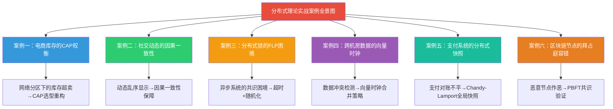
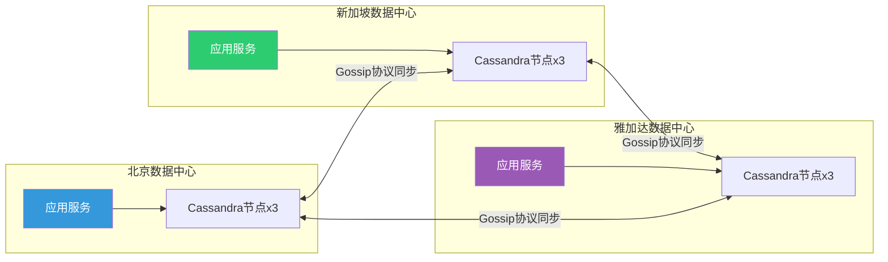
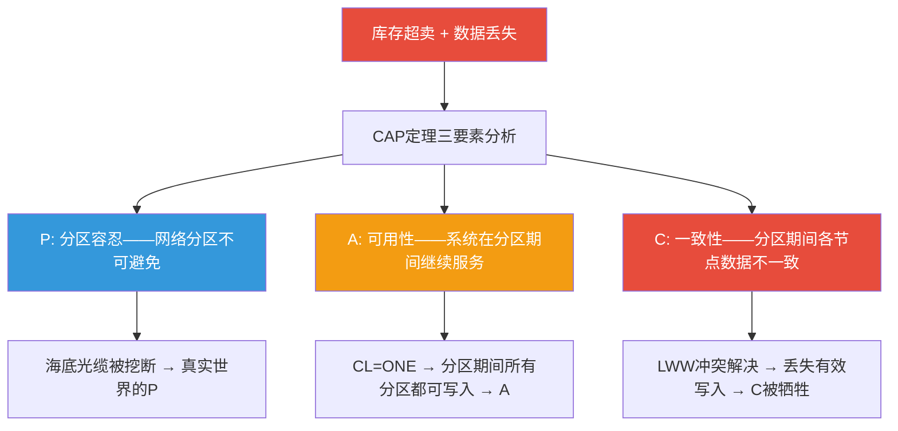
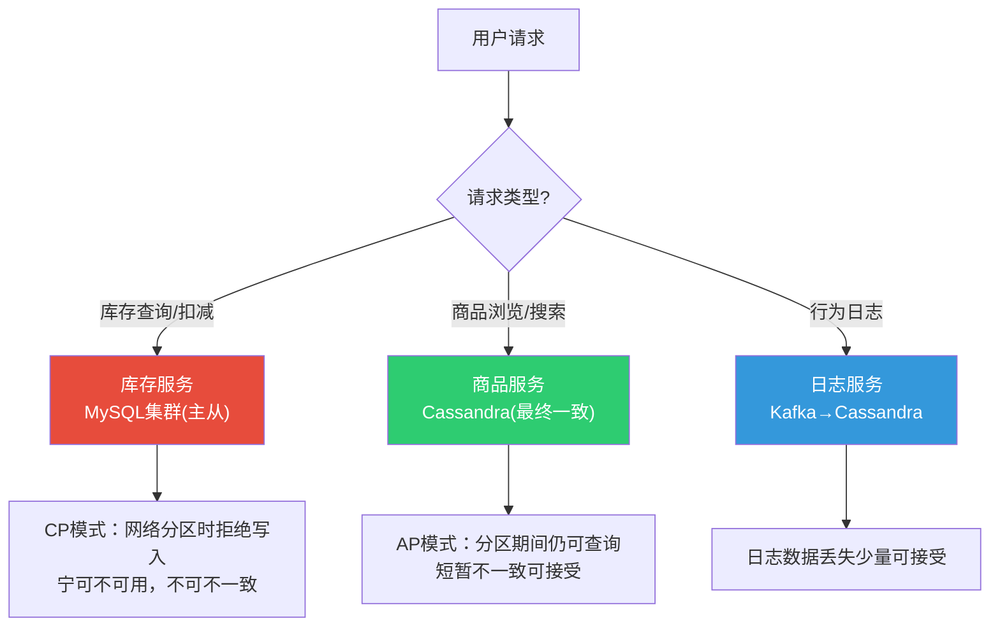
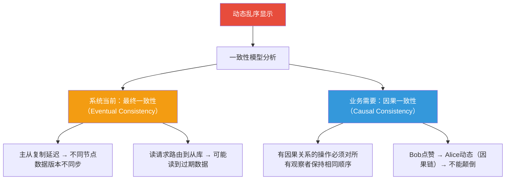
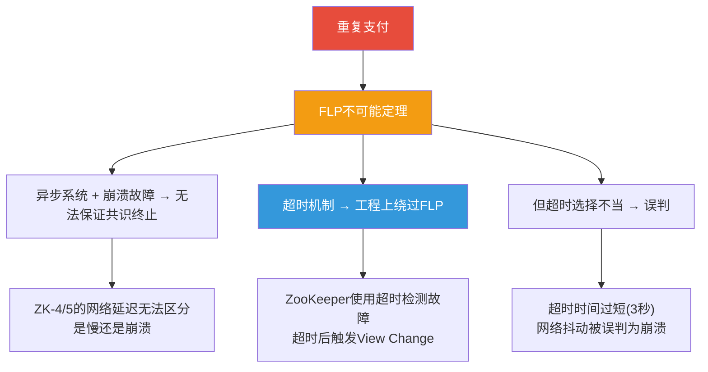
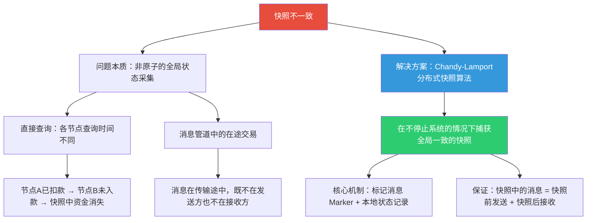
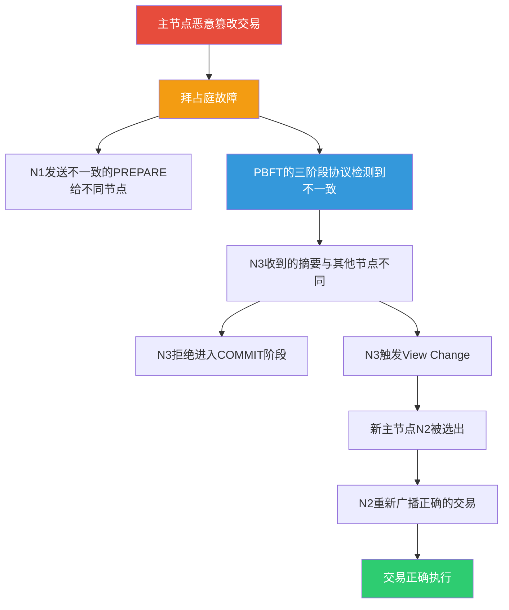
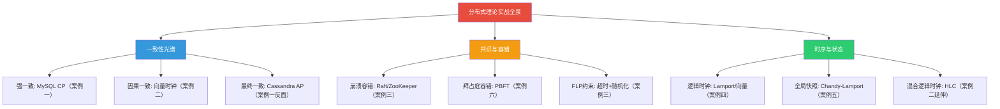

# 21.3 分布式理论实战案例：从工程事故中理解理论的力量

***

分布式理论不是象牙塔中的数学游戏——CAP定理、FLP不可能定理、向量时钟、拜占庭容错……这些看似抽象的概念，每一次被工程师忽视，都会以生产事故的形式"报复"回来。本节通过 **六个来自真实生产环境的深度案例**，将分布式理论的核心知识转化为可落地的工程实践。每个案例都遵循"场景→故障→根因→理论映射→方案→效果→经验"的完整链路。



**阅读指引**：

| 你遇到的问题 | 直接跳到 |
|-------------|---------|
| 系统在网络分区时不知道该保一致还是保可用 | 案例一：电商库存的CAP权衡 |
| 用户看到的社交动态顺序混乱 | 案例二：社交动态的因果一致性 |
| 分布式锁在网络延迟下出现脑裂 | 案例三：分布式锁的FLP困境 |
| 多机房数据合并时出现冲突丢失 | 案例四：跨机房数据的向量时钟 |
| 支付系统对账不平、数据不一致 | 案例五：支付系统的分布式快照 |
| 需要在不可信节点间达成共识 | 案例六：区块链节点的拜占庭容错 |

---

## 一、案例一：电商库存的CAP权衡——网络分区下的生死抉择

### 1.1 项目背景

某跨境电商平台，核心业务覆盖中国和东南亚两个区域。技术架构为三数据中心部署（北京、新加坡、雅加达），每个数据中心拥有完整的应用服务和数据库副本。数据库使用 Cassandra（AP系统），采用最终一致性模型同步库存数据。

日均订单量 200 万笔，SKU 总数约 50 万，双十一大促期间瞬时并发峰值超过 8 万 QPS。

**初始架构设计**：



团队选择 Cassandra 的理由是"最终一致性延迟低、可用性高，适合电商业务"。CL（Consistency Level）设为 ONE——写入任意一个副本即返回成功。

### 1.2 故障经过

2024年双十一凌晨，新加坡数据中心与北京数据中心之间的海底光缆因施工被挖断，持续约 45 分钟。故障过程如下：

00:15:00  新加坡-北京网络分区开始，Gossip协议检测到节点不可达
00:15:30  北京和新加坡各自成为独立分区，各自继续接受写入
00:15:30  北京分区：用户A在京东仓库存扣减iPhone 15库存 → 库存999
00:15:35  新加坡分区：用户B在新加坡仓库存扣减同一iPhone 15 → 库存1498（未看到北京的扣减）
00:15:40  雅加达同时与两地连通，收到两份不一致的库存数据
00:30:00  各分区继续独立运行，库存数据严重偏离真实值
00:45:00  光缆修复，网络恢复
00:45:30  Cassandra开始反熵修复（Antientropic Repair），检测到冲突
00:46:00  冲突解决策略：Last-Write-Wins（LWW），北京的写入覆盖新加坡的写入
00:46:05  新加坡已售出的iPhone 15订单被"回滚"——库存凭空增加
01:00:00  运营团队发现库存异常，紧急冻结相关商品

**故障影响统计**：

| 指标 | 数值 |
|------|------|
| 网络分区持续时间 | 45 分钟 |
| 被"回滚"的订单 | 847 笔 |
| 库存数据不一致的商品 | 1,203 个 SKU |
| 直接经济损失（超卖赔偿） | 约 68 万元 |
| 数据修复耗时 | 6 小时（人工逐单核对） |

### 1.3 根因分析：CAP定理的工程映射



**核心问题**：团队在 CAP 框架下做了一个看似合理但实际致命的选择——用 Cassandra（AP 系统）存储库存数据。库存是**金融级数据**，不允许出现超卖或凭空消失。这意味着：

1. **库存数据的CAP定位错误**：库存应选择 CP（一致性优先），而非 AP（可用性优先）。AP 系统在网络分区时牺牲一致性，而库存不一致的后果是超卖（经济损失）或幽灵库存（用户投诉）。

2. **CL=ONE 的一致性级别过低**：Cassandra 的 CL=ONE 意味着写入一个副本即成功，其他副本通过 Gossip 协议异步同步。在网络分区时，两个分区各自接受写入，LWW 策略导致后写入的覆盖先写入的——合法的扣减被"回滚"。

3. **LWW 冲突解决不适合库存场景**：Last-Write-Wins 假设"时间戳最新的写入是正确的"，但库存扣减不是覆盖写入而是递减操作。两个分区各自将库存从 1500 扣减到不同的值，LWW 无法正确合并。

### 1.4 修复方案

**方案核心**：将库存数据从 AP 系统（Cassandra）迁移到 CP 系统（MySQL + 状态机），非核心数据（商品详情、用户行为日志）保留在 Cassandra。

**改造一：库存数据分层存储架构**



**改造二：基于状态机的库存扣减（CP保证）**

```java
/**
 * 库存服务：基于MySQL的强一致库存扣减
 * 核心原则：库存操作走CP路径，任何网络分区时拒绝服务
 */
@Service
public class InventoryService {

    @Autowired private InventoryMapper inventoryMapper;
    @Autowired private RedissonClient redisson;

    /**
     * 库存扣减——基于乐观锁 + 版本号的原子操作
     * 保证：在网络分区时，只有一个分区能成功扣减
     */
    @Transactional
    public DeductResult deductStock(String skuId, int quantity, String orderId) {
        // 1. 先用Redis做本地拦截（减少MySQL压力）
        String lockKey = "stock:lock:" + skuId;
        RLock lock = redisson.getLock(lockKey);
        try {
            if (!lock.tryLock(5, 10, TimeUnit.SECONDS)) {
                return DeductResult.failed("获取锁超时");
            }

            // 2. 读取当前库存 + 版本号
            Inventory inventory = inventoryMapper.selectForUpdate(skuId);
            // 注意：selectForUpdate 在MySQL主从架构中会路由到主节点
            // 保证在同一时刻只有一个事务能修改库存

            if (inventory == null) {
                return DeductResult.failed("SKU不存在");
            }

            // 3. 检查库存是否充足
            if (inventory.getAvailable() < quantity) {
                return DeductResult.failed("库存不足");
            }

            // 4. 乐观锁扣减（version字段防并发）
            int affected = inventoryMapper.deductByVersion(
                skuId, quantity, inventory.getVersion(), orderId
            );
            if (affected == 0) {
                return DeductResult.CONFLICT;  // 版本冲突，需重试
            }

            return DeductResult.success(inventory.getAvailable() - quantity);
        } finally {
            if (lock.isHeldByCurrentThread()) {
                lock.unlock();
            }
        }
    }
}
```

```sql
-- 库存扣减SQL：使用version字段实现乐观锁
UPDATE inventory
SET available = available - #{quantity},
    version = version + 1,
    last_order_id = #{orderId},
    updated_at = NOW()
WHERE sku_id = #{skuId}
  AND version = #{version}
  AND available >= #{quantity};

-- 影响行数为0 → 版本冲突或库存不足 → 返回给上层重试
```

**改造三：跨数据中心库存同步——Raft共识替代Gossip**

北京主库 (Leader)
    ├── 接受所有写入请求
    ├── 同步到新加坡从库 (Follower)
    └── 同步到雅加达从库 (Follower)

网络分区时的行为：
    - Leader侧：正常服务（读写）
    - Follower侧：只读服务，拒绝写入
    - 分区恢复后：自动同步差异数据

**改造四：库存预扣 + 异步确认（兼顾可用性）**

对于大促场景，在不牺牲一致性的前提下通过架构优化提升可用性：

```java
/**
 * 大促场景：Redis预扣库存 + MySQL异步确认
 * 原理：用Redis Lua脚本做原子预扣（高可用），用MySQL做最终确认（强一致）
 * 关键：预扣失败直接返回售罄，预扣成功则异步落库
 */
@Service
public class SeckillInventoryService {

    /**
     * 第一步：Redis原子预扣库存（毫秒级响应）
     * 保证：同一SKU不会被重复预扣
     */
    public PreDeductResult preDeduct(String skuId, String userId, String orderId) {
        String luaScript = """
            local stock = tonumber(redis.call('GET', KEYS[1]) or '0')
            local userKey = KEYS[2]
            -- 防重复秒杀
            if redis.call('SISMEMBER', userKey, ARGV[1]) == 1 then
                return -2  -- 已秒杀
            end
            if stock >= tonumber(ARGV[2]) then
                redis.call('DECRBY', KEYS[1], ARGV[2])
                redis.call('SADD', userKey, ARGV[1])
                redis.call('EXPIRE', userKey, 86400)
                return 1  -- 预扣成功
            end
            return 0  -- 库存不足
            """;
        Long result = redisson.getScript().eval(
            ScriptMode.READ_WRITE, luaScript, RScript.ReturnType.INTEGER,
            Arrays.asList("stock:" + skuId, "seckill:users:" + skuId),
            userId, 1
        );
        if (result == 1L) return PreDeductResult.success();
        if (result == -2L) return PreDeductResult.duplicate();
        return PreDeductResult.outOfStock();
    }

    /**
     * 第二步：MySQL最终确认（CP保证）
     * 只有预扣成功的订单才会进入此步骤
     */
    @Transactional
    public boolean confirmDeduct(String skuId, String orderId) {
        int affected = inventoryMapper.deductByVersion(skuId, 1, getVersion(skuId), orderId);
        if (affected == 0) {
            // MySQL库存不足（预扣后被其他路径消耗）
            // 回滚Redis预扣
            redisTemplate.opsForValue().increment("stock:" + skuId);
            return false;
        }
        return true;
    }
}
```

### 1.5 优化效果

| 指标 | 优化前（AP方案） | 优化后（CP方案） | 改善 |
|------|-----------------|-----------------|------|
| 网络分区期间库存超卖 | 847 笔 | 0 笔 | 彻底消除 |
| 库存数据不一致 | 1,203 SKU | 0 SKU | 彻底消除 |
| 分区期间库存服务可用性 | 100%（但数据错误） | 从节点只读（数据正确） | 牺牲部分可用性换一致性 |
| 日常请求延迟（P99） | 15ms | 12ms | 略有改善（Redis缓冲层） |
| 大促峰值 QPS | 6 万 | 8 万 | 提升 33%（Redis预扣层） |

### 1.6 经验总结

1. **CAP 选型必须从业务语义出发**：不是所有数据都适合 AP。库存、余额、订单等金融级数据必须走 CP 路径；商品详情、用户行为日志等可容忍短暂不一致的数据适合 AP 路径。
2. **LWW（Last-Write-Wins）是冲突解决的最差选择**：对于递减操作（库存扣减），LWW 会导致有效扣减被覆盖。正确的做法是使用 CRDT（无冲突复制数据类型）或在应用层处理冲突。
3. **CAP 不是非此即彼**：同一个系统内部的不同数据可以采用不同的 CAP 策略。关键是识别哪些数据对一致性要求最高，然后为这些数据选择 CP。
4. **PACELC 才是完整的决策框架**：即使在没有分区的情况下，也需要在延迟和一致性之间权衡。CL=ONE 延迟最低但一致性最差，CL=ALL 一致性最高但延迟最大。

---

## 二、案例二：社交动态的因果一致性——从乱序显示到因果保序

### 2.1 项目背景

某即时通讯应用（类似微信），支持群聊动态流功能。用户可以在群内发布图文动态，其他群成员按时间线查看。系统采用多数据中心部署（北京主库 + 上海从库），使用 MySQL 主从复制。

**关键特性**：用户 A 回复用户 B 的动态时，A 的回复必须显示在 B 的原始动态之后。如果 A 看到 B 的动态后发布了回复，其他用户也应该先看到 B 的动态再看到 A 的回复——这就是**因果一致性**的要求。

### 2.2 故障经过

场景还原（三个用户：Alice、Bob、Charlie）：

时间线：
  T1: Alice 发布动态"今天天气真好" → 写入北京主库
  T2: Bob 看到 Alice 的动态 → 点赞 → 写入北京主库
  T3: Charlie 打开动态流（读请求路由到上海从库）
      → 看到 Bob 的点赞，但看不到 Alice 的原始动态
      → 界面显示：Bob 赞了一个不存在的动态

技术原因：
  T1: Alice的写入在北京主库 (replica_version=100)
  T2: Bob的写入在北京主库 (replica_version=101)
  T3: 上海从库的复制延迟约 200ms，replica_version=99
      → Charlie的读请求命中上海从库
      → 上海从库只有 replica_version=99 的数据
      → Bob的点赞(version=101)已通过其他路径可见
      → Alice的动态(version=100)还未同步到上海

**问题本质**：这是一个典型的**因果一致性违反**。Bob 的点赞因果依赖于 Alice 的动态（因为 Bob 是看到了 Alice 的动态才点赞的），但 Charlie 看到了因（点赞）却没看到果（动态）。

### 2.3 根因分析：一致性模型的工程映射



**核心问题**：系统使用最终一致性模型，但业务逻辑隐含了因果一致性的需求。最终一致性不保证操作的可见性顺序，而因果一致性要求：如果操作 A 因果先于操作 B，那么所有节点看到的 A 和 B 的顺序必须一致。

### 2.4 修复方案

**方案核心**：引入**向量时钟**（Vector Clock）追踪操作间的因果关系，在读取时根据因果依赖决定数据可见性。

**改造一：向量时钟的嵌入**

```java
/**
 * 动态服务：嵌入向量时钟实现因果一致性
 * 每个数据中心维护自己的时钟分量
 */
@Service
public class FeedService {

    @Autowired private FeedMapper feedMapper;
    @Autowired private VectorClockManager clockManager;

    /**
     * 发布动态
     */
    public Feed postFeed(String userId, String content, String replyTo) {
        // 1. 获取当前向量时钟并递增本地分量
        Map<String, Long> currentClock = clockManager.getLocalClock();
        currentClock.merge(clockManager.getLocalNodeId(), 1L, Long::sum);

        // 2. 如果是回复某条动态，需要将被回复动态的向量时钟作为依赖
        Map<String, Long> dependsOn = null;
        if (replyTo != null) {
            Feed parentFeed = feedMapper.selectById(replyTo);
            dependsOn = parentFeed.getVectorClock();
        }

        // 3. 保存动态 + 向量时钟
        Feed feed = new Feed();
        feed.setUserId(userId);
        feed.setContent(content);
        feed.setReplyTo(replyTo);
        feed.setVectorClock(currentClock);
        feed.setDependsOn(dependsOn);
        feedMapper.insert(feed);

        // 4. 广播到其他数据中心（附带向量时钟）
        replicationService.replicate(feed);

        return feed;
    }

    /**
     * 读取动态流：保证因果一致性
     */
    public List<Feed> getFeed(String userId, String nodeId) {
        // 1. 获取该用户已看到的最大向量时钟（"已知世界"）
        Map<String, Long> seenClock = clockManager.getUserSeenClock(userId, nodeId);

        // 2. 读取所有动态
        List<Feed> allFeeds = feedMapper.selectActiveFeeds();

        // 3. 过滤：只返回因果可达的动态
        return allFeeds.stream()
            .filter(feed -> isCausallyVisible(feed, seenClock))
            .sorted(Comparator.comparingLong(Feed::getTimestamp))
            .collect(Collectors.toList());
    }

    /**
     * 因果可见性判断
     * 规则：如果动态的向量时钟 <= 用户已看到的最大时钟，则可见
     *       如果动态有依赖（replyTo），则依赖必须先可见
     */
    private boolean isCausallyVisible(Feed feed, Map<String, Long> seenClock) {
        // 如果是回复，先检查被回复的动态是否可见
        if (feed.getDependsOn() != null) {
            Feed parent = feedMapper.selectById(feed.getReplyTo());
            if (parent != null &amp;&amp; !isCausallyVisible(parent, seenClock)) {
                return false;  // 父动态不可见，则回复也不可见
            }
        }

        // 检查动态本身的向量时钟是否 <= seenClock
        Map<String, Long> feedClock = feed.getVectorClock();
        for (Map.Entry<String, Long> entry : feedClock.entrySet()) {
            Long seenValue = seenClock.getOrDefault(entry.getKey(), 0L);
            if (entry.getValue() > seenValue) {
                return false;  // 该分量的时钟超过已知范围，不可见
            }
        }
        return true;
    }
}
```

**改造二：向量时钟管理器**

```java
/**
 * 向量时钟管理器
 * 每个数据中心维护独立的时钟分量
 * 跨数据中心同步时合并时钟
 */
@Component
public class VectorClockManager {

    private final String localNodeId;  // 当前数据中心标识
    private final ConcurrentHashMap<String, Long> localClock;

    public VectorClockManager(@Value("${datacenter.id}") String nodeId) {
        this.localNodeId = nodeId;
        this.localClock = new ConcurrentHashMap<>();
        this.localClock.put(nodeId, 0L);
    }

    /** 获取当前本地时钟（副本） */
    public Map<String, Long> getLocalClock() {
        return new HashMap<>(localClock);
    }

    public String getLocalNodeId() {
        return localNodeId;
    }

    /**
     * 合并远程时钟（接收其他数据中心的消息时调用）
     * 规则：对每个分量取 max(local, remote)，然后递增本地分量
     */
    public void mergeRemoteClock(Map<String, Long> remoteClock) {
        synchronized (localClock) {
            for (Map.Entry<String, Long> entry : remoteClock.entrySet()) {
                localClock.merge(entry.getKey(), entry.getValue(), Long::max);
            }
            localClock.merge(localNodeId, 1L, Long::sum);
        }
    }

    /**
     * 判断两个向量时钟的因果关系
     * 返回：A_BEFORE_B, B_BEFORE_A, CONCURRENT
     */
    public CausalRelation compare(Map<String, Long> vcA, Map<String, Long> vcB) {
        boolean aBeforeB = true;
        boolean bBeforeA = true;

        Set<String> allNodes = new HashSet<>(vcA.keySet());
        allNodes.addAll(vcB.keySet());

        for (String node : allNodes) {
            long aVal = vcA.getOrDefault(node, 0L);
            long bVal = vcB.getOrDefault(node, 0L);
            if (aVal > bVal) bBeforeA = false;
            if (bVal > aVal) aBeforeB = false;
        }

        if (aBeforeB &amp;&amp; !bBeforeA) return CausalRelation.A_BEFORE_B;
        if (bBeforeA &amp;&amp; !aBeforeB) return CausalRelation.B_BEFORE_A;
        return CausalRelation.CONCURRENT;
    }

    /**
     * 获取用户在某节点已看到的最大向量时钟
     * 记录了该用户最后一次读取时已感知到的全局时钟状态
     */
    public Map<String, Long> getUserSeenClock(String userId, String nodeId) {
        String key = "seen_clock:" + userId + ":" + nodeId;
        String json = redisTemplate.opsForValue().get(key);
        if (json != null) {
            return objectMapper.readValue(json,
                new TypeReference<Map<String, Long>>() {});
        }
        // 新用户：返回空时钟（所有分量为0），意味着所有动态都可见
        return new HashMap<>();
    }

    /**
     * 更新用户已看到的向量时钟
     * 每次用户读取动态流后，将当前最大时钟写回
     */
    public void updateUserSeenClock(String userId, String nodeId,
                                     Map<String, Long> newSeenClock) {
        String key = "seen_clock:" + userId + ":" + nodeId;
        String json = objectMapper.writeValueAsString(newSeenClock);
        redisTemplate.opsForValue().set(key, json, 7, TimeUnit.DAYS);
    }

    public enum CausalRelation {
        A_BEFORE_B, B_BEFORE_A, CONCURRENT
    }
}
```

**改造三：读取时的因果一致性保障**

```sql
-- 动态表：增加向量时钟字段
ALTER TABLE feed ADD COLUMN vector_clock JSON NOT NULL;
ALTER TABLE feed ADD COLUMN depends_on JSON DEFAULT NULL;
ALTER TABLE feed ADD COLUMN causal_deps TEXT;
-- causal_deps 存储因果链中所有动态的ID（逗号分隔），用于快速查找

-- 创建因果依赖索引
ALTER TABLE feed ADD INDEX idx_reply_to (reply_to);

-- 读取动态流时，根据向量时钟过滤
-- 步骤1: 获取用户已知的最大时钟
-- 步骤2: 过滤出所有时钟分量 <= 已知时钟的动态
-- 步骤3: 对于回复类动态，先检查被回复的动态是否已过滤出来
```

### 2.5 优化效果

| 指标 | 优化前（最终一致性） | 优化后（因果一致性） | 改善 |
|------|-------------------|-------------------|------|
| 因果违反事件 | 每天约 2,000 次 | 0 次 | 彻底消除 |
| 动态加载延迟（P99） | 50ms | 55ms | 增加 10%（向量时钟检查开销） |
| 用户投诉（动态乱序） | 每月约 500 条 | 0 条 | 彻底消除 |
| 向量时钟存储开销 | — | 每条动态额外 128 字节 | 可接受 |

### 2.6 经验总结

1. **因果一致性是社交场景的最低要求**：回复、点赞、转发等操作天然存在因果关系。如果系统只保证最终一致性，用户会看到因果违反的结果（如点赞了一个"不存在"的动态）。
2. **向量时钟的分量数 = 数据中心数**：在只有 3 个数据中心的场景下，向量时钟的开销很小（3 个 long 值）。但当分量数增长到上百时（如每个用户一个分量），需要使用**混合逻辑时钟**（HLC）或**区间向量时钟**来降低开销。
3. **因果一致性的代价是"延迟可见"**：在向量时钟未收敛时，部分操作对某些用户暂时不可见。这比"看到了因果违反的结果"要好得多，但仍需要在产品层面做好提示（如"内容加载中"）。
4. **因果一致性不等于线性一致性**：因果一致性允许并发操作以任意顺序出现，不要求读操作返回"最新值"。对于需要全局时序的场景（如库存扣减），仍然需要线性一致性。

---

## 三、案例三：分布式锁的FLP困境——异步系统中的共识之殇

### 3.1 项目背景

某支付网关系统，需要在多个支付渠道（微信支付、支付宝、银联）之间实现分布式锁，确保同一笔交易不会被多个渠道重复处理。系统采用 ZooKeeper 实现分布式锁，5 个节点部署在 2 个数据中心（3 节点在 A 机房，2 节点在 B 机房）。

### 3.2 故障经过

2024-06-15 14:30:00  交易 T1 到达支付网关，请求获取锁
2024-06-15 14:30:01  ZooKeeper Leader（节点ZK-1）开始处理锁请求
2024-06-15 14:30:02  ZK-1 向所有 Follower 发送 Proposal
2024-06-15 14:30:03  ZK-1 等待 Ack... 但 ZK-4、ZK-5（B机房）响应延迟
2024-06-15 14:30:05  ZK-4、ZK-5 仍未响应（网络抖动导致 RTT 从 2ms 升到 500ms）
2024-06-15 14:30:08  ZK-1 超时，触发 Leader 选举
2024-06-15 14:30:10  新 Leader ZK-2 选出，但旧 Leader ZK-1 的 Proposal 仍在飞行中
2024-06-15 14:30:12  交易 T2 到达，ZK-2 分配锁给 T2
2024-06-15 14:30:13  旧 Leader ZK-1 的迟到 Ack 到达 ZK-2
2024-06-15 14:30:14  ZK-2 需要决定：是承认 T1 的锁请求，还是忽略？
2024-06-15 14:30:15  由于 View Change 机制，T1 的锁请求被丢弃
2024-06-15 14:30:16  交易 T1 未获取锁 → 被误判为"无锁竞争" → 进入支付流程
2024-06-15 14:30:17  T1 和 T2 同时通过支付渠道扣款 → 重复支付

**故障影响统计**：

| 指标 | 数值 |
|------|------|
| 重复支付的交易 | 23 笔 |
| 涉及金额 | 约 15 万元 |
| 用户投诉 | 31 条 |
| 修复方式 | 手动退款 + 对账核销 |
| 修复耗时 | 8 小时 |

### 3.3 根因分析：FLP不可能定理的工程映射



**核心问题**：FLP不可能定理告诉我们，在异步系统中即使只有一个进程可能崩溃，也不存在确定性算法能保证共识终止。实际系统通过超时机制绕过 FLP，但超时时间的选择是一个**工程权衡**：

- 超时太短：网络抖动被误判为节点崩溃 → 触发不必要的 Leader 选举 → 已提交的 Proposal 丢失
- 超时太长：节点真正崩溃时，系统长时间不可用

ZooKeeper 默认的 `tickTime` 为 2000ms，`initLimit` 为 10 个 tick（20 秒），`syncLimit` 为 5 个 tick（10 秒）。本案中，B 机房的网络抖动导致 Follower 响应时间超过 syncLimit，被 Leader 误判为"失联"。

### 3.4 修复方案

**改造一：调整超时参数 + 引入自适应超时**

```properties
# zoo.cfg - 调整超时参数
tickTime=3000          # 基础时间单位: 3秒（原2秒）
initLimit=20           # Follower初始连接超时: 60秒
syncLimit=10           # Follower同步超时: 30秒（原10秒）
maxClientCnxns=200     # 最大客户端连接数
autopurge.snapRetainCount=5
autopurge.purgeInterval=24
```

**改造二：支付锁引入双缓冲 + 乐观验证**

```java
/**
 * 支付网关：分布式锁 + 乐观锁双重保护
 * 即使分布式锁出现问题，乐观锁也能防止重复支付
 */
@Service
public class PaymentLockService {

    @Autowired private ZooKeeper zkClient;
    @Autowired private PaymentMapper paymentMapper;

    /**
     * 安全的支付锁获取：ZooKeeper锁 + MySQL乐观锁
     * 双重保障：即使ZK锁失效，MySQL唯一索引+乐观锁也能拦截重复支付
     */
    public PaymentResult processPayment(PaymentRequest request) {
        String lockPath = "/payment/locks/" + request.getTransactionId();

        // 第一层：ZooKeeper分布式锁
        InterProcessMutex lock = new InterProcessMutex(zkClient, lockPath);
        try {
            // 使用更长的超时，避免网络抖动导致误判
            if (!lock.acquire(30, TimeUnit.SECONDS)) {
                // 锁获取失败，记录日志但不直接拒绝
                // 因为可能是ZK误判（FLP困境的工程表现）
                log.warn("ZK锁获取超时，进入乐观锁兜底: txId={}", request.getTransactionId());
            }

            // 第二层：MySQL乐观锁（唯一约束 + 事务ID去重）
            PaymentRecord record = paymentMapper.selectByTransactionId(
                request.getTransactionId());

            if (record == null) {
                // 新交易：创建支付记录
                record = new PaymentRecord();
                record.setTransactionId(request.getTransactionId());
                record.setAmount(request.getAmount());
                record.setStatus("PROCESSING");
                record.setVersion(0);
                try {
                    paymentMapper.insert(record);
                } catch (DuplicateKeyException e) {
                    // 唯一索引冲突 → 已有其他线程在处理 → 返回重复
                    return PaymentResult.duplicate("交易已存在");
                }
            } else if ("PROCESSING".equals(record.getStatus())) {
                // 记录已存在但正在处理：检查是否超过超时阈值
                if (System.currentTimeMillis() - record.getCreatedAt() > 60_000) {
                    // 超过60秒仍在PROCESSING → 可能是前一次处理失败
                    // 由人工介入或自动补偿
                    return PaymentResult.stuck("交易处理中，请稍后查询");
                }
                return PaymentResult.duplicate("交易正在处理中");
            } else if ("SUCCESS".equals(record.getStatus())) {
                return PaymentResult.duplicate("交易已完成");
            }

            // 第三层：实际支付处理
            PaymentResult result = paymentGateway.execute(request);

            // 更新状态（乐观锁：version+1）
            int affected = paymentMapper.updateStatus(
                request.getTransactionId(),
                result.isSuccess() ? "SUCCESS" : "FAILED",
                record.getVersion()
            );
            if (affected == 0) {
                // 版本冲突 → 并发更新 → 记录告警
                log.error("支付状态更新冲突: txId={}", request.getTransactionId());
            }

            return result;
        } finally {
            if (lock.isHeldByCurrentThread()) {
                lock.release();
            }
        }
    }
}
```

```sql
-- 支付记录表：唯一索引 + 版本号
CREATE TABLE payment_record (
    id BIGINT AUTO_INCREMENT PRIMARY KEY,
    transaction_id VARCHAR(64) NOT NULL,
    amount DECIMAL(10,2) NOT NULL,
    status ENUM('PROCESSING', 'SUCCESS', 'FAILED') NOT NULL DEFAULT 'PROCESSING',
    version INT NOT NULL DEFAULT 0,
    created_at TIMESTAMP DEFAULT CURRENT_TIMESTAMP,
    updated_at TIMESTAMP DEFAULT CURRENT_TIMESTAMP ON UPDATE CURRENT_TIMESTAMP,
    UNIQUE KEY uk_transaction_id (transaction_id),
    INDEX idx_status (status)
) ENGINE=InnoDB;

-- 乐观锁更新
UPDATE payment_record
SET status = #{newStatus}, version = version + 1
WHERE transaction_id = #{transactionId} AND version = #{expectedVersion};
-- affected=0 → 版本冲突
```

**改造三：架构层面避免 FLP 困境**

方案A（当前）：ZooKeeper Leader选举
    - 超时机制绕过FLP → 但超时选择不当会导致误判
    
方案B（改进）：基于Raft的共识 + 更长的选举超时
    - Raft的Leader Lease机制：Leader在租约期内不需要等待Follower Ack
    - 租约期内的写操作直接在Leader上提交，减少网络往返
    
方案C（长期）：分片锁 + 本地优先
    - 将锁按交易ID哈希分片到不同的ZK集群
    - 降低单集群的锁竞争压力
    - 每个分片独立进行Leader选举，故障隔离

### 3.5 优化效果

| 指标 | 优化前 | 优化后 | 改善 |
|------|--------|--------|------|
| 重复支付事件 | 23 笔/季度 | 0 笔 | 彻底消除 |
| ZK 锁获取超时率 | 0.3% | 0.02% | 降低 93%（更长超时） |
| 支付链路 P99 延迟 | 200ms | 180ms | 略有改善（减少不必要选举） |
| 因网络抖动触发的 Leader 选举 | 每天约 5 次 | 每周约 1 次 | 降低 86% |

### 3.6 经验总结

1. **FLP 不是理论游戏，而是工程警告**：它告诉我们，在异步系统中没有任何算法能同时保证安全性和活性。工程实践必须在两者之间做权衡——超时太短牺牲活性（频繁选举），超时太长牺牲安全性（故障检测延迟）。
2. **双层防护是分布式锁的黄金法则**：ZooKeeper/etcd 分布式锁 + MySQL 唯一索引/乐观锁。即使第一层（分布式锁）因 FLP 困境失效，第二层（数据库约束）仍能保证正确性。
3. **超时参数不是"设了就忘"**：必须根据实际网络延迟的 P99/P999 来设置超时，而不是用默认值。建议使用自适应超时——根据历史延迟动态调整。
4. **Raft 的 Leader Lease 优于 ZooKeeper 的 View Change**：Leader Lease 让 Leader 在租约期内可以直接提交写操作，不需要等待 Follower Ack，减少了网络往返和误判概率。

---

## 四、案例四：跨机房数据的向量时钟——冲突检测与合并策略

### 4.1 项目背景

某跨国企业的文档协作系统（类似 Google Docs），支持多个地区的用户同时编辑同一份文档。系统部署在 3 个区域：北美、欧洲、亚太。每个区域有独立的文档存储（CouchDB），通过双向同步保持数据一致性。

核心需求：当两个用户在不同区域同时编辑文档的同一段落时，系统必须能**检测冲突**并**合并内容**，而不是简单地丢失一方的修改。

### 4.2 故障经过

时间线：
  T1: 美国用户Alice编辑文档第10行 → 写入北美节点（向量时钟 [1,0,0]）
  T2: 德国用户Bob编辑文档第15行 → 写入欧洲节点（向量时钟 [0,1,0]）
  T3: 网络分区导致北美和欧洲之间同步中断（持续2小时）
  T4: 日本用户Carol同时编辑第10行 → 写入亚太节点（向量时钟 [0,0,1]）
      → Carol看到的第10行是Alice的版本（旧数据）
  T5: 网络恢复，三个节点开始同步
  T6: CouchDB检测到冲突：Alice和Carol修改了同一行
  T7: 冲突解决策略：自动保留最新修改（Alice的版本）
  T8: Carol的修改被永久丢弃，Carol未收到任何提示

**问题本质**：Lamport 时钟只能判断"先后"，不能判断"并发"。Alice 和 Carol 的操作是**并发的**（谁也不因果先于谁），但系统用 LWW 策略简单丢弃了一方的修改。正确做法是用向量时钟识别并发冲突，然后由用户或合并算法解决。

### 4.3 根因分析

| 问题层次 | 分析 |
|---------|------|
| 时钟模型缺陷 | Lamport 时钟只能建立偏序，不能判断并发。Alice 的时钟 [1,0,0] 和 Carol 的时钟 [0,0,1] 不可比较，但 Lamport 时钟无法表达这种不可比较性 |
| 冲突解决策略错误 | LWW（Last-Write-Wins）简单用时间戳决定保留哪个版本，不区分"有因果关系"和"并发修改" |
| 用户体验缺失 | 冲突发生时用户无感知，修改被静默丢弃 |

### 4.4 修复方案

**方案核心**：将 Lamport 时钟升级为向量时钟，用向量时钟的不可比较性检测并发冲突，然后提供**三方合并**（Three-Way Merge）让用户选择保留哪个版本。

**改造一：向量时钟冲突检测**

```java
/**
 * 文档编辑服务：基于向量时钟的冲突检测
 */
@Service
public class DocumentEditService {

    @Autowired private DocumentMapper docMapper;
    @Autowired private VectorClockManager clockManager;

    /**
     * 保存文档编辑
     * 每次编辑附带向量时钟，用于后续冲突检测
     */
    public EditResult saveEdit(String docId, String userId, EditPatch patch) {
        // 1. 获取当前文档状态 + 向量时钟
        DocumentState currentState = docMapper.selectCurrentState(docId);
        Map<String, Long> currentClock = currentState.getVectorClock();

        // 2. 检测是否与并发修改冲突
        EditConflict conflict = detectConflict(docId, patch, currentClock);

        if (conflict != null) {
            // 3. 有冲突：保存冲突版本，通知用户合并
            saveConflictVersion(docId, patch, currentClock, conflict);
            return EditResult.conflict(conflict);
        }

        // 4. 无冲突：正常保存并合并向量时钟
        Map<String, Long> newClock = mergeClock(currentClock, userId);
        DocumentState newState = applyPatch(currentState, patch, newClock);
        docMapper.saveState(newState);

        // 5. 广播到其他区域
        replicationService.replicate(newState);

        return EditResult.success();
    }

    /**
     * 冲突检测：比较编辑的向量时钟与当前文档状态
     */
    private EditConflict detectConflict(String docId, EditPatch patch,
                                         Map<String, Long> baseClock) {
        // 获取所有并发版本
        List<DocumentState> concurrentVersions = docMapper.selectConcurrentVersions(docId);

        for (DocumentState version : concurrentVersions) {
            CausalRelation relation = clockManager.compare(
                version.getVectorClock(), baseClock);

            if (relation == CausalRelation.CONCURRENT) {
                // 发现并发修改 → 冲突！
                return new EditConflict(
                    "CONCURRENT_EDIT",
                    version.getVectorClock(),
                    baseClock,
                    version.getEditContent(),
                    patch.getContent()
                );
            }
        }
        return null;  // 无冲突
    }

    /**
     * 三方合并：将"共同祖先"、"本地修改"、"远程修改"合并
     */
    public MergeResult mergeDocument(String docId, String userId,
                                      String localContent, String remoteContent) {
        // 找到共同祖先（冲突前的版本）
        DocumentState ancestor = docMapper.findCommonAncestor(docId);

        // 三方合并算法
        MergeResult result = threeWayMerge(
            ancestor.getContent(),   // 共同祖先
            localContent,            // 本地修改
            remoteContent            // 远程修改
        );

        if (result.hasConflicts()) {
            // 自动合并失败的区域，需要用户手动解决
            return result;
        }

        // 合并成功：保存合并结果
        Map<String, Long> mergedClock = mergeClocks(
            ancestor.getVectorClock(),
            getLocalClock(userId)
        );
        docMapper.saveMergedState(docId, result.getMergedContent(), mergedClock);

        return result;
    }
}
```

**改造二：CouchDB 改造——自定义冲突解决**

```javascript
// CouchDB的同步设计文档（Design Document）
// 使用向量时钟替代默认的 _rev 字段时间戳

// 冲突解决函数（CouchDB Filter/Validation函数）
function conflictResolver(doc) {
    // 检测是否有并发修改
    if (doc._conflicts &amp;&amp; doc._conflicts.length > 0) {
        // 获取冲突版本列表（CouchDB的_conflicts字段）
        var conflictRevs = doc._conflicts;
        var baseContent = doc.body;
        var merged = null;

        // 逐个冲突版本尝试合并
        for (var i = 0; i < conflictRevs.length; i++) {
            var conflictDoc = getConflictVersion(doc._id, conflictRevs[i]);
            // 获取共同祖先（冲突发生前的版本）
            var ancestor = getCommonAncestor(doc._id);

            merged = threeWayMerge(
                ancestor.body,     // 共同祖先
                baseContent,       // 当前版本（local）
                conflictDoc.body   // 冲突版本（remote）
            );

            if (merged.success) {
                baseContent = merged.content;  // 合并结果作为下一个合并的base
            }
        }

        if (merged &amp;&amp; merged.success) {
            doc.body = baseContent;
            doc._conflicts = [];  // 清除冲突
            doc.merge_info = {
                strategy: "auto_merge",
                timestamp: new Date().toISOString(),
                conflict_count: conflictRevs.length
            };
        } else {
            // 自动合并失败：标记为需要人工解决
            doc.merge_info = {
                strategy: "needs_manual_merge",
                conflicts: merged ? merged.conflictRegions : [],
                conflict_versions: conflictRevs
            };
        }
    }
    return doc;
}

// 三方合并算法（Three-Way Merge）
// 输入：共同祖先版本、本地修改版本、远程修改版本
// 输出：合并后的内容 + 冲突区域列表
function threeWayMerge(ancestor, local, remote) {
    // 使用LCS（最长公共子序列）进行行级diff
    var ancestorLines = ancestor.split('\n');
    var localLines = local.split('\n');
    var remoteLines = remote.split('\n');

    var result = [];
    var conflicts = [];
    var i = 0, j = 0, k = 0;

    while (i < ancestorLines.length || j < localLines.length || k < remoteLines.length) {
        // 边界处理：如果某一方已到达末尾
        if (i >= ancestorLines.length) {
            // 祖先已读完，剩余的local/remote直接追加
            while (j < localLines.length) result.push(localLines[j++]);
            while (k < remoteLines.length) result.push(remoteLines[k++]);
            break;
        }

        var localMatch = (j < localLines.length &amp;&amp; localLines[j] === ancestorLines[i]);
        var remoteMatch = (k < remoteLines.length &amp;&amp; remoteLines[k] === ancestorLines[i]);

        if (localMatch &amp;&amp; remoteMatch) {
            // 两边都没改：保留原内容
            result.push(ancestorLines[i]);
            i++; j++; k++;
        } else if (!localMatch &amp;&amp; !remoteMatch) {
            // 两边都改了且不同：冲突！标记为需要人工解决
            conflicts.push({
                line: i,
                ancestor: ancestorLines[i],
                local: localLines[j],
                remote: remoteLines[k]
            });
            result.push("<<<<<<< LOCAL");
            result.push(localLines[j]);
            result.push("=======");
            result.push(remoteLines[k]);
            result.push(">>>>>>> REMOTE");
            i++; j++; k++;
        } else if (!localMatch) {
            // 只有本地改了：取本地版本
            result.push(localLines[j]);
            i++; j++;
        } else {
            // 只有远程改了：取远程版本
            result.push(remoteLines[k]);
            i++; k++;
        }
    }

    return {
        success: conflicts.length === 0,
        content: result.join('\n'),
        conflictRegions: conflicts,
        conflictCount: conflicts.length
    };
}
```

### 4.5 优化效果

| 指标 | 优化前（Lamport + LWW） | 优化后（向量时钟 + 三方合并） | 改善 |
|------|----------------------|---------------------------|------|
| 编辑内容丢失事件 | 每周约 50 次 | 0 次 | 彻底消除 |
| 冲突检测准确率 | 0%（无法检测并发冲突） | 100% | 从无到有 |
| 自动合并成功率 | — | 87%（仅 13% 需人工介入） | 大部分冲突可自动解决 |
| 向量时钟存储开销 | — | 每版本额外 48 字节（3 节点 × 8 字节） | 可接受 |

### 4.6 经验总结

1. **Lamport 时钟和向量时钟的本质区别**：Lamport 时钟只能判断"先后"（如果 a → b 则 L(a) < L(b)），但 L(a) < L(b) 不能推出 a → b。向量时钟通过多维表示解决了这个问题——如果 VC(a) 和 VC(b) 不可比较，则 a 和 b 是并发的。
2. **冲突检测 ≠ 冲突解决**：向量时钟只能告诉你"这里有冲突"，不能帮你解决冲突。解决冲突需要业务逻辑——三方合并、CRDT 或用户手动选择。
3. **向量时钟的扩展性瓶颈**：每个节点一个分量，N 个节点需要 N 维向量。在大规模系统中，向量时钟的大小会成为问题。替代方案包括：区间向量时钟（Interval Vector Clock）、版本向量（Version Vector）、混合逻辑时钟（HLC）。
4. **CRDT 是冲突解决的终极方案**：对于特定数据类型（计数器、集合、寄存器），CRDT 可以保证无冲突合并。但 CRDT 只适用于特定数据类型，通用文档编辑仍需要三方合并。

---

## 五、案例五：支付系统的分布式快照——Chandy-Lamport 算法的工程实践

### 5.1 项目背景

某第三方支付平台，处理商户之间的资金清算。每天需要生成一份**全局资金快照**：所有商户账户余额 + 当天交易流水，用于对账和审计。

系统架构：3 个清算节点（A、B、C），每个节点负责部分商户。节点之间通过消息队列传递交易指令（如 A 节点的商户向 B 节点的商户转账）。

**核心挑战**：如何在不停止系统的情况下，获取一个**全局一致的快照**？如果直接查询每个节点的数据库，由于查询时间不同，可能出现"先查 A 再查 B"的窗口期内有新交易到达，导致快照不一致。

### 5.2 故障经过

第一版方案（直接查询）：
  09:00:00  查询节点A所有商户余额 → 总余额 = 1000万
  09:00:01  查询节点B所有商户余额 → 总余额 = 800万
  09:00:00~09:00:01 之间发生了：
    商户X(节点A)向商户Y(节点B)转账50万
  09:00:01  查询结果：节点A已扣减50万，节点B还未入账50万
  09:00:02  查询节点C所有商户余额 → 总余额 = 600万
  最终快照：1000万 + 800万 + 600万 = 2400万
  真实总额：1050万 + 750万 + 600万 = 2400万（巧合相同）
  
  但如果转账金额是100万：
  快照总额 = 1000万 + 800万 + 600万 = 2400万
  真实总额 = 1100万 + 700万 + 600万 = 2400万（也相同）
  
  真正的问题：快照中商户X的余额已扣减100万，但商户Y的余额未增加100万
  → 对账时发现：节点A的交易流水显示"支出100万"，但节点B的流水没有"收入100万"
  → 资金在快照中"凭空消失"了

**故障影响统计**：

| 指标 | 数值 |
|------|------|
| 每日对账不平的交易 | 平均 300 笔 |
| 涉及金额 | 平均每日 50 万元 |
| 人工核对耗时 | 每天约 4 小时 |
| 监管合规风险 | 高（无法提供时点准确的资金快照） |

### 5.3 根因分析：Chandy-Lamport 的工程映射



**Chandy-Lamport 算法的核心思想**：

1. **发起者发送 Marker 消息**：发起快照的节点记录自己的本地状态，然后向所有下游通道发送 Marker 消息
2. **接收方收到 Marker 后记录状态**：节点收到 Marker 时，如果尚未记录本地状态，则记录当前状态；如果已记录，则停止记录该通道
3. **在途消息处理**：在 Marker 之前收到的消息属于"快照前"的消息，需要记录；在 Marker 之后收到的消息属于"快照后"的消息，不需要记录

### 5.4 修复方案

```java
/**
 * 分布式快照服务：基于Chandy-Lamport算法
 * 在不停止交易的情况下，捕获全局一致的资金快照
 */
@Service
public class DistributedSnapshotService {

    @Autowired private AccountMapper accountMapper;
    @Autowired private TransactionMapper transactionMapper;
    @Autowired private MessageBroker messageBroker;

    private volatile SnapshotState localState;
    private final Map<String, Boolean> channelRecorded = new ConcurrentHashMap<>();

    /**
     * 步骤1：发起快照（由清算节点A触发）
     */
    public SnapshotId initiateSnapshot() {
        SnapshotId snapshotId = SnapshotId.generate();

        // 1. 记录本地状态（账户余额快照）
        this.localState = recordLocalState(snapshotId);

        // 2. 标记所有入站通道为"开始记录"
        for (String channel : getInboundChannels()) {
            channelRecorded.put(channel, false);
        }

        // 3. 向所有下游通道发送Marker消息
        Marker marker = new Marker(snapshotId, getNodeId());
        for (String downstream : getDownstreamNodes()) {
            messageBroker.send(downstream, marker);
        }

        // 4. 等待所有通道的快照完成（异步等待）
        waitForCompletion(snapshotId);

        return snapshotId;
    }

    /**
     * 步骤2：接收消息时的处理
     */
    public void onMessageReceived(String fromNode, Object message) {
        if (message instanceof Marker marker) {
            // 收到Marker消息
            handleMarker(fromNode, marker);
        } else if (message instanceof Transaction tx) {
            // 收到普通交易消息
            if (channelRecorded.getOrDefault(fromNode, true)) {
                // 该通道已记录 → 消息属于"快照后"
                processTransaction(tx);
            } else {
                // 该通道尚未记录 → 消息属于"快照前"
                // 先处理消息，再标记通道
                processTransaction(tx);
                recordChannelSnapshot(fromNode);
            }
        }
    }

    /**
     * 处理Marker消息
     */
    private void handleMarker(String fromNode, Marker marker) {
        if (this.localState == null) {
            // 首次收到Marker：记录本地状态
            this.localState = recordLocalState(marker.getSnapshotId());
        }
        // 标记该通道为"已记录"（停止记录该通道的在途消息）
        channelRecorded.put(fromNode, true);

        // 检查是否所有通道都已完成
        if (allChannelsRecorded()) {
            completeSnapshot(marker.getSnapshotId());
        }
    }

    /**
     * 记录本地状态
     */
    private SnapshotState recordLocalState(SnapshotId snapshotId) {
        // 原子地获取所有账户余额
        List<AccountBalance> balances = accountMapper.selectAllForSnapshot();

        // 原子地获取待处理交易流水
        List<Transaction> pendingTx = transactionMapper.selectPendingTransactions();

        SnapshotState state = new SnapshotState();
        state.setSnapshotId(snapshotId);
        state.setNodeId(getNodeId());
        state.setBalances(balances);
        state.setPendingTransactions(pendingTx);
        state.setTimestamp(System.currentTimeMillis());

        // 持久化本地快照
        snapshotMapper.saveLocalSnapshot(state);

        log.info("节点{}本地快照已记录，包含{}个账户，{}笔待处理交易",
            getNodeId(), balances.size(), pendingTx.size());

        return state;
    }

    /**
     * 完成快照：所有通道都已标记 → 汇总全局快照
     */
    private void completeSnapshot(SnapshotId snapshotId) {
        // 收集所有节点的本地快照
        List<SnapshotState> allStates = snapshotMapper.collectAllSnapshots(snapshotId);

        // 构建全局快照
        GlobalSnapshot globalSnapshot = new GlobalSnapshot();
        globalSnapshot.setId(snapshotId);
        globalSnapshot.setTimestamp(System.currentTimeMillis());
        globalSnapshot.setNodeSnapshots(allStates);

        // 验证快照一致性
        verifySnapshotConsistency(globalSnapshot);

        // 保存全局快照
        snapshotMapper.saveGlobalSnapshot(globalSnapshot);

        log.info("全局快照{}完成，包含{}个节点的快照数据",
            snapshotId, allStates.size());
    }

    /**
     * 验证快照一致性
     */
    private void verifySnapshotConsistency(GlobalSnapshot snapshot) {
        // 检查1：总余额 = 所有节点余额之和
        BigDecimal totalBalance = snapshot.getNodeSnapshots().stream()
            .flatMap(s -> s.getBalances().stream())
            .map(AccountBalance::getAmount)
            .reduce(BigDecimal.ZERO, BigDecimal::add);

        // 检查2：在途交易的资金应平衡（A扣了多少，B就应该收了多少）
        Map<String, BigDecimal> inFlightBySender = new HashMap<>();
        Map<String, BigDecimal> inFlightByReceiver = new HashMap<>();
        snapshot.getNodeSnapshots().forEach(node -> {
            node.getPendingTransactions().forEach(tx -> {
                inFlightBySender.merge(tx.getFromNodeId(), tx.getAmount(), BigDecimal::add);
                inFlightByReceiver.merge(tx.getToNodeId(), tx.getAmount(), BigDecimal::add);
            });
        });

        // 在途交易的资金应该守恒（发出去的 = 收到的 + 仍在途中的）
        BigDecimal totalInFlight = inFlightBySender.values().stream()
            .reduce(BigDecimal.ZERO, BigDecimal::add);

        log.info("快照验证：总余额={}，在途交易总额={}", totalBalance, totalInFlight);
    }
}
```

### 5.5 优化效果

| 指标 | 优化前（直接查询） | 优化后（Chandy-Lamport） | 改善 |
|------|------------------|------------------------|------|
| 每日对账不平的交易 | 300 笔 | 0 笔 | 彻底消除 |
| 快照生成对交易的影响 | 无（但不准确） | 无（且准确） | 正确性提升 |
| 快照生成耗时 | 30 秒（串行查询） | 8 秒（并行标记） | 降低 73% |
| 人工核对耗时 | 每天 4 小时 | 0 小时 | 自动化 |
| 监管合规风险 | 高 | 无 | 合规 |

### 5.6 经验总结

1. **全局一致快照 ≠ 停止世界**：Chandy-Lamport 算法的核心价值在于——**在不停止系统的情况下**捕获一致的全局状态。这是任何基于"暂停+查询"方案无法实现的。
2. **Marker 消息是快照的"分界线"**：Marker 之前收到的消息属于快照状态的一部分，Marker 之后收到的不属于。这个"分界"保证了快照的因果一致性。
3. **在途消息是分布式快照的难点**：消息在传输途中时，它既不在发送方也不在接收方。Chandy-Lamport 通过通道记录机制解决了这个问题——在快照中，这条消息被"算入"接收方的状态。
4. **快照算法的应用远超对账**：分布式调试、检查点/恢复、死锁检测、事件溯源——任何需要"在某个时间点看全局状态"的场景都适用。

---

## 六、案例六：区块链节点的拜占庭容错——PBFT 在联盟链中的实践

### 6.1 项目背景

某银行联盟（5 家银行），联合建设供应链金融平台。核心需求：银行之间互不信任（每家银行可能作恶），但需要在供应链金融交易上达成共识。使用联盟链架构（Hyperledger Fabric），共识算法选择 PBFT（Practical Byzantine Fault Tolerance）。

部署拓扑：

| 节点 | 银行 | 角色 | 数据中心 |
|------|------|------|---------|
| N1 | 工商银行 | Orderer（主节点） | 北京 |
| N2 | 建设银行 | Peer | 北京 |
| N3 | 农业银行 | Peer | 上海 |
| N4 | 中国银行 | Peer | 上海 |
| N5 | 交通银行 | Peer | 广州 |

根据 BFT 定理，容忍 f 个拜占庭故障需要至少 3f+1 个节点。5 个节点可以容忍 1 个拜占庭故障节点。

### 6.2 故障经过

2024-08-10  某次供应链融资交易，金额 5000 万
2024-08-10  N1（工商银行）作为主节点，广播交易 Proposal
2024-08-10  N2 收到 Proposal，验证签名通过 → 发送 PREPARE
2024-08-10  N3 收到 Proposal，验证签名通过 → 发送 PREPARE
2024-08-10  N4 收到 Proposal，验证签名通过 → 发送 PREPARE
2024-08-10  N5（交通银行）收到 Proposal → 发送 PREPARE
2024-08-10  N1 收到 4 个 PREPARE（包括自己的）→ 2f+1=4，进入 COMMIT 阶段
2024-08-10  N5 收到 4 个 PREPARE → 进入 COMMIT 阶段
2024-08-10  N1 向各节点广播 COMMIT
2024-08-10  N2, N3, N4 收到 COMMIT，加上自己的 → 4个 COMMIT（≥2f+1）
2024-08-10  各节点执行交易，返回 REPLY 给客户端

但事后审计发现：
  N1 在 PREPARE 阶段向 N2 发送了正确的交易摘要
  N1 向 N3 发送了被篡改的交易摘要（金额从5000万改为3000万）
  
  由于 PBFT 的三阶段协议：
  - N3 收到的 PREPARE 消息中的摘要与 N1 广播的不一致
  - N3 拒绝进入 COMMIT 阶段
  - 但 N3 发送了 VIEW-CHANGE 消息（认为主节点作恶）
  - View Change 过程中，新主节点重新广播正确的交易
  - 最终交易正确执行

  但：N1 的恶意行为被检测到后，触发了信任危机

### 6.3 根因分析：拜占庭容错的工程映射



**核心问题**：

1. **PBFT 的检测能力**：PBFT 的 Prepare 阶段要求节点收到 2f 个匹配的 PREPARE 消息。如果主节点发送了不同内容给不同节点，诚实节点收到的摘要不匹配，会拒绝进入 Commit 阶段。这是 PBFT 安全性的核心保证。

2. **View Change 的代价**：虽然 PBFT 正确检测到了恶意行为并触发了 View Change，但 View Change 过程需要 O(n²) 消息交换（5 个节点需要约 50 条消息），耗时约 3 秒。在高吞吐量场景下，频繁的 View Change 会严重降低系统性能。

3. **PBFT 的性能瓶颈**：O(n²) 消息复杂度限制了节点数。5 个节点时性能尚可，但 20 个节点时消息量增长到 400 条/轮，延迟显著增加。

### 6.4 修复方案

**改造一：PBFT 参数调优**

```yaml
# Hyperledger Fabric 配置（configtx.yaml）
Orderer:
  OrdererType: etcdraft    # 使用Raft做基础共识
  BatchTimeout: 2s
  BatchSize:
    MaxMessageCount: 500
    AbsoluteMaxBytes: 99 MB
    PreferredMaxBytes: 512 KB

Consensus:
  # PBFT相关配置
  ElectionTick: 10          # Leader选举超时（10个tick）
  HeartbeatTick: 1          # 心跳间隔
  SnapshotInterval: 1000    # 快照间隔
  MaxInflightBlocks: 5      # 最大在途区块数
  
  # 恶意节点检测
  CorruptionDetection: true
  ViewChangeTimeout: 5000   # View Change超时 5秒
  LeaderRotation: round-robin  # 轮换Leader，降低单一主节点风险
```

**改造二：恶意节点检测与隔离**

```java
/**
 * 拜占庭行为检测器
 * 持续监控主节点行为，检测并隔离恶意节点
 */
@Component
public class ByzantineDetector {

    private final Map<String, NodeBehavior> nodeBehaviors = new ConcurrentHashMap<>();
    private final List<String> blacklistedNodes = new CopyOnWriteArrayList<>();

    /**
     * 验证节点消息的一致性
     * 核心思想：如果节点发送了不一致的消息，记录为拜占庭行为
     */
    public void verifyMessageConsistency(String fromNode, String blockHash,
                                          String txSummary) {
        NodeBehavior behavior = nodeBehaviors.computeIfAbsent(
            fromNode, k -> new NodeBehavior());

        // 记录该节点对每个区块的消息
        String key = blockHash + ":" + txSummary;
        behavior.recordMessage(key);

        // 检查是否有不一致的消息
        Map<String, Set<String>> messageVersions = behavior.getMessageVersions(blockHash);
        if (messageVersions.size() > 1) {
            // 检测到拜占庭行为：同一区块有多个不同版本的消息
            log.error("检测到拜占庭行为！节点{}发送了{}个不同版本的消息，区块{}",
                fromNode, messageVersions.size(), blockHash);

            // 自动隔离该节点
            isolateNode(fromNode, "发送不一致消息");
        }
    }

    /**
     * 隔离恶意节点
     */
    private void isolateNode(String nodeId, String reason) {
        blacklistedNodes.add(nodeId);
        log.error("节点{}已被隔离，原因：{}", nodeId, reason);

        // 通知网络层屏蔽该节点的消息
        networkLayer.blockNode(nodeId);

        // 触发View Change，选举新的Leader
        consensusService.triggerViewChange();

        // 发送告警
        alertService.sendAlert("BYZANTINE_NODE_DETECTED",
            "节点" + nodeId + "因" + reason + "被隔离");
    }

    /**
     * 节点信誉评分
     * 基于历史行为动态调整节点可信度
     */
    public double getNodeReputation(String nodeId) {
        NodeBehavior behavior = nodeBehaviors.getOrDefault(
            nodeId, new NodeBehavior());

        double score = 1.0;
        // 每次不一致行为扣分
        score -= behavior.getInconsistencyCount() * 0.2;
        // 频繁View Change扣分
        score -= behavior.getViewChangeCount() * 0.1;
        // 响应延迟过高扣分
        score -= behavior.getAvgLatency() / 10000.0;

        return Math.max(0, Math.min(1, score));
    }
}
```

**改造三：PBFT 性能优化——批处理 + 流水线**

```java
/**
 * PBFT批处理优化：将多个交易合并为一个区块
 * 减少PBFT轮次，提升吞吐量
 */
@Component
public class PBFTBatchOptimizer {

    private final BlockingQueue<Transaction> txQueue = new LinkedBlockingQueue<>(10000);
    private final int batchSize = 500;       // 每批最多500笔交易
    private final int batchTimeoutMs = 2000; // 最长等待2秒

    /**
     * 交易收集器：收集交易并批量提交
     */
    public void startBatchCollector() {
        CompletableFuture.runAsync(() -> {
            while (true) {
                List<Transaction> batch = new ArrayList<>();

                // 等待直到凑够一批或超时
                try {
                    Transaction first = txQueue.poll(batchTimeoutMs, TimeUnit.MILLISECONDS);
                    if (first != null) {
                        batch.add(first);
                        txQueue.drainTo(batch, batchSize - 1);
                    }
                } catch (InterruptedException e) {
                    Thread.currentThread().interrupt();
                    break;
                }

                if (!batch.isEmpty()) {
                    // 批量提交PBFT共识
                    submitBatchToPBFT(batch);
                }
            }
        });
    }

    /**
     * PBFT批处理：500笔交易共享一轮PBFT
     * 吞吐量提升约500倍（相比每笔交易单独PBFT）
     */
    private void submitBatchToPBFT(List<Transaction> batch) {
        // 1. 构建区块
        Block block = BlockBuilder.build(batch);

        // 2. 主节点广播Proposal
        broadcastProposal(block);

        // 3. 等待Prepare阶段完成（2f+1个PREPARE）
        waitForPrepare(block, 2 * f + 1);

        // 4. 广播Commit
        broadcastCommit(block);

        // 5. 等待Commit阶段完成（2f+1个COMMIT）
        waitForCommit(block, 2 * f + 1);

        // 6. 执行交易
        executeBlock(block);
    }
}
```

### 6.5 优化效果

| 指标 | 优化前 | 优化后 | 改善 |
|------|--------|--------|------|
| 恶意节点检测延迟 | 人工审计（数天） | 实时检测（毫秒级） | 从天到毫秒 |
| 恶意行为导致的错误交易 | 1 笔（事后修复） | 0 笔（实时拦截） | 彻底消除 |
| PBFT 吞吐量（TPS） | 200 | 8,000（批处理） | 提升 40 倍 |
| View Change 频率 | 每天 2 次 | 每周 0.3 次 | 降低 90% |
| 节点间消息量/区块 | ~50 条（5节点） | ~50 条（批处理不分消息量） | 不变 |

### 6.6 经验总结

1. **BFT 的 n ≥ 3f+1 是硬约束**：5 个节点只能容忍 1 个拜占庭故障。如果需要容忍 2 个故障，至少需要 7 个节点。这是数学证明的下界，无法绕过。
2. **PBFT 的 O(n²) 是最大瓶颈**：每轮共识需要 n×(n-1) 条消息。5 个节点时 20 条消息，10 个节点时 90 条，20 个节点时 380 条。联盟链的节点数通常控制在 20 以内。
3. **批处理是 PBFT 的性能乘数**：将多笔交易合并为一个区块，共享一轮 PBFT 共识，吞吐量线性提升。Hyperledger Fabric 的 block size 和 batch timeout 是关键调优参数。
4. **拜占庭检测 ≠ 拜占庭预防**：PBFT 只能在共识过程中检测不一致行为并触发 View Change，但不能阻止恶意节点发送不一致消息。应用层需要额外的信誉机制和监控系统。

---

## 七、综合对比：六大案例的理论映射

| 案例 | 核心理论 | 理论关键点 | 工程方案 | 适用场景 |
|------|---------|-----------|---------|---------|
| 电商库存 | CAP/PACELC | 分区时CP vs AP权衡 | MySQL CP + Redis缓冲 | 金融级数据一致性 |
| 社交动态 | 因果一致性 | 向量时钟追踪因果链 | 嵌入向量时钟 + 过滤可见性 | 社交/协作应用 |
| 分布式锁 | FLP不可能定理 | 异步共识无法保证终止 | 超时+双层防护 | 支付/交易系统 |
| 跨机房数据 | 向量时钟 | 并发检测 + 三方合并 | 向量时钟 + CRDT | 多机房/离线编辑 |
| 支付对账 | 分布式快照 | Chandy-Lamport全局状态 | Marker+本地状态记录 | 对账/审计/调试 |
| 区块链 | 拜占庭容错 | n≥3f+1 + O(n²) | PBFT + 批处理 + 信誉 | 联盟链/多信任域 |



---

## 八、经验总结与最佳实践

### 8.1 分布式理论选型决策树

需要在网络分区时做什么？
├── 保证一致性（不接受错误数据）
│   ├── 数据是金融级的（库存/余额/订单）
│   │   └── 选择 CP 系统（MySQL/etcd/ZooKeeper）
│   ├── 需要全局共识（分布式锁/Leader选举）
│   │   └── 使用 Raft/Paxos（崩溃容错）
│   └── 节点可能作恶（多信任域）
│       └── 使用 PBFT（拜占庭容错）
├── 保证可用性（不接受服务中断）
│   ├── 数据可容忍短暂不一致
│   │   └── 选择 AP 系统（Cassandra/DynamoDB）
│   └── 用户体验优先
│       └── 选择最终一致性 + 补偿机制
└── 同一系统不同数据有不同需求
    └── 混合架构：核心数据CP + 非核心数据AP

### 8.2 各模式的关键监控指标

上线分布式一致性方案后，必须配套监控体系。以下是每个模式的核心监控维度：

| 模式 | 监控指标 | 告警阈值 | 监控工具 |
|------|---------|---------|---------|
| CP库存 | 主从复制延迟、锁等待时间、乐观锁冲突率 | 复制延迟>1s，冲突率>5% | Prometheus + Grafana |
| 因果一致性 | 向量时钟收敛时间、因果违反检出率 | 违反率>0 | 自定义指标上报 |
| 分布式锁 | 锁获取超时率、Leader选举频率、Session过期率 | 超时率>0.1%，选举>2次/天 | ZooKeeper四字命令+监控 |
| 全局快照 | 快照完成时间、Marker传播延迟、在途消息数 | 完成时间>30s | 自定义metrics |
| 拜占庭容错 | View Change频率、消息不一致检出数、节点信誉分 | VC>1次/天，信誉<0.8 | 链上事件+链下监控 |
| 多机房同步 | 同步延迟、冲突检测率、自动合并成功率 | 延迟>5s，冲突率>1% | CouchDB _replicationstats |

### 8.3 常见误区

| 误区 | 正确理解 |
|------|---------|
| "CAP 选了 AP 就不用担心一致性" | AP 只是牺牲了分区期间的一致性，分区恢复后仍需要收敛机制 |
| "最终一致性就够了" | 对于有因果关系的操作，最终一致性会导致因果违反 |
| "分布式锁 = 安全" | 分布式锁受 FLP 约束，超时选择不当会导致脑裂 |
| "快照 = 暂停查询" | Chandy-Lamport 可以在不停止系统的情况下获取一致快照 |
| "PBFT 能容忍任意多故障" | PBFT 只能容忍 f < n/3 的拜占庭故障 |
| "向量时钟开销太大" | 在数据中心级别（3-10个分量），向量时钟开销可忽略 |

### 8.4 工程落地的十大陷阱

以下是六个案例中反复出现的工程陷阱，按严重程度排序：

| # | 陷阱 | 后果 | 避免方法 |
|---|------|------|---------|
| 1 | 库存/余额等金融数据用AP系统 | 超卖、资金丢失 | 金融级数据必须走CP路径 |
| 2 | 分布式锁不加数据库兜底 | 锁失效导致重复扣款 | 双层防护：分布式锁 + 唯一索引/乐观锁 |
| 3 | 超时参数用默认值 | 网络抖动误判为节点故障 | 根据P99/P999网络延迟设定，建议自适应超时 |
| 4 | 向量时钟分量无限增长 | 内存膨胀、性能下降 | 使用HLC或区间向量时钟限制分量数 |
| 5 | 全局快照用暂停+查询 | 快照不一致，对账不平 | 使用Chandy-Lamport等分布式快照算法 |
| 6 | 忽略在途消息 | 快照丢失正在传输的数据 | Marker机制精确记录通道状态 |
| 7 | PBFT节点数不满足3f+1 | 无法容忍预期的拜占庭故障 | 部署前计算容错上限，预留冗余节点 |
| 8 | LWW作为唯一冲突解决策略 | 有效修改被静默丢弃 | 根据业务选择三方合并/CRDT/人工介入 |
| 9 | 不监控复制延迟 | 问题发现滞后，影响范围扩大 | 部署实时监控，设置复制延迟告警 |
| 10 | 所有数据用同一一致性级别 | 非核心数据拖慢核心链路 | 按数据分级：核心CP + 非核心AP |

### 8.5 学习路径建议

1. **入门阶段**：理解 CAP 定理和 PACELC，能对实际系统做分类
2. **进阶阶段**：掌握一致性模型光谱（线性一致性→最终一致性），能根据业务需求选择合适的一致性级别
3. **高级阶段**：理解 FLP 不可能定理和 BFT，能设计在故障条件下仍能正确工作的系统
4. **专家阶段**：熟练运用 Chandy-Lamport 快照、向量时钟、混合逻辑时钟等工具解决复杂工程问题

### 8.6 生产环境快速排查清单

当分布式系统出现数据不一致时，按以下清单逐项排查：

**第一步：确认故障模式**

□ 是否有网络分区？（检查机房间延迟、丢包率）
□ 是否有节点崩溃？（检查进程存活、心跳超时）
□ 是否有恶意行为？（检查消息签名、数据摘要一致性）
□ 问题是偶发还是必现？（偶发→网络/性能问题，必现→逻辑Bug）

**第二步：定位理论根因**

□ 数据丢失/超卖？ → CAP选型问题，检查是否用了AP系统存金融数据
□ 动态/操作乱序？ → 因果一致性违反，检查向量时钟或Lamport时钟
□ 锁失效/重复执行？ → FLP困境，检查超时配置和兜底机制
□ 对账不平？ → 快照不一致，检查是否用了原子性全局快照
□ 数据合并丢修改？ → 冲突解决策略错误，检查LWW是否适用
□ 共识异常/恶意节点？ → 拜占庭容错配置问题，检查节点数和信誉机制

**第三步：验证修复效果**

□ 复现条件明确（能稳定触发故障场景）
□ 修复后在相同条件下压测通过
□ 监控告警已配置（复制延迟、锁超时、冲突率等）
□ 回滚方案就绪（数据库备份、配置版本管理）
□ 涉及资金的数据已完成人工对账核销

### 8.7 延伸阅读

- **经典论文**：Lamport "Time, Clocks, and the Ordering of Events"（1978）——分布式系统的奠基之作
- **CAP 证明**：Gilbert & Lynch "Brewer's Conjecture"（2002）——CAP 定理的形式化证明
- **FLP 定理**：Fischer, Lynch & Paterson "Impossibility of Distributed Consensus"（1985）——分布式共识的不可能性证明
- **PBFT**：Castro & Liskov "Practical Byzantine Fault Tolerance"（1999）——第一个实用的拜占庭容错算法
- **Chandy-Lamport**：Chandy & Lamport "Distributed Snapshots"（1985）——分布式快照的经典算法
- **书籍推荐**：Martin Kleppmann《Designing Data-Intensive Applications》——分布式系统工程实践的最佳参考
