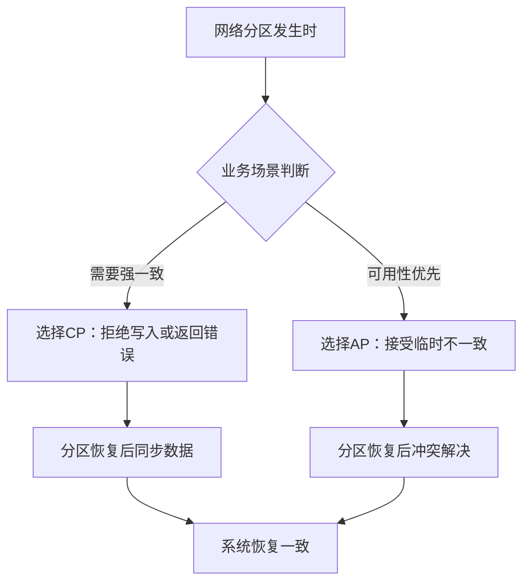
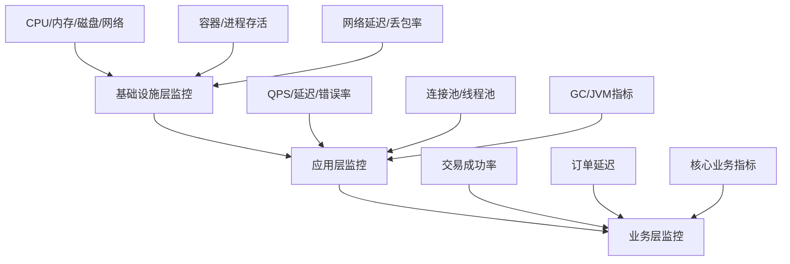

# 分布式理论常见误区

分布式系统是计算机科学中最容易踩坑的领域之一。许多工程师在学习理论时觉得概念清晰，但一到实际设计和运维中就频繁犯错。本节系统梳理分布式理论中最具代表性的认知误区，每个误区都结合真实案例、错误示范和正确做法展开分析，帮助读者建立正确的分布式系统心智模型。

---

## 误区一：把CAP定理当成"三选二"的静态公式

### 错误认知

很多人把CAP定理理解为：一致性（C）、可用性（A）、分区容忍（P）三者中只能选两个。这种简化理解导致两种典型错误：

**错误一：认为CAP是静态选择**——"我们的系统是CP系统，永远不能追求可用性。"

**错误二：认为可以放弃P**——"我们保证网络不出问题，所以可以同时获得C和A。"

### 为什么这是错的

CAP定理描述的是**网络分区发生时**的权衡，不是系统设计时的静态属性。

**关键事实**：

1. 网络分区在分布式系统中**不可避免**。无论网络基础设施多好，硬件故障、机房断电、光纤被挖断等情况随时可能发生。Google的工程实践表明，即使在同一个数据中心内，网络分区也每年都会发生。

2. CAP定理说的是**分区期间**的行为。在网络正常时（没有分区时），系统可以同时提供一致性和可用性。大部分时间系统处于正常状态，CAP约束并不生效。

3. "选P"不是一种选择——在网络分区发生时，你的系统**已经**处于P状态，这时候你才需要在C和A之间做权衡。

### 真实案例

2012年，某银行的核心交易系统采用"CA架构"（单机数据库+定时同步到备份机房）。在一次跨机房网络抖动期间（持续约47秒），主备切换逻辑失败，导致核心交易系统宕机2小时13分钟。

**根因分析**：该银行假设"网络是可靠的"（Peter Deutsch八大谬误的第一条），实际上在CAP框架下，网络分区发生时系统陷入了既不一致又不可用的最坏状态。

### 正确做法



**正确的心智模型**：

1. 不要在设计时给自己贴"CP"或"AP"的标签
2. 而是在**每个业务操作**的粒度上，明确它在分区时需要什么行为
3. 同一个系统中，不同操作可以有不同的CAP选择
4. 监控网络分区的发生频率和持续时间，用数据驱动决策

**实操要点**：
- 对于扣款操作：CP模式，分区时拒绝交易（宁可不赚也不能多扣）
- 对于商品浏览：AP模式，分区时返回缓存数据（短暂不一致可接受）
- 对于库存扣减：CP模式，分区时冻结操作（避免超卖）

---

## 误区二：认为FLP定理意味着"共识不可能"

### 错误认知

FLP不可能定理说"在异步系统中，即使只有一个进程可能崩溃，也不存在确定性算法能解决共识问题"。很多工程师读完这个结论后得出错误推论：

- "既然共识不可能，那Raft/Paxos怎么实现的？"
- "FLP告诉我们分布式系统做不了任何可靠的事"
- "所以我们不需要追求强一致性"

### 为什么这是错的

FLP定理有几个**极其重要的前提条件**，忽略它们会导致完全错误的推论：

1. **纯异步模型**：FLP假设消息传递延迟无上限，且无法区分"慢节点"和"崩溃节点"。但实际系统是**部分同步**的——消息最终会被送达，超时机制可以检测故障。

2. **确定性算法**：FLP只排除了确定性算法。随机化算法（如Ben-Or算法）可以绕过FLP，在概率意义上解决共识问题。

3. **单故障**：FLP只需要一个可能崩溃的进程。这意味着即使是极低概率的故障也足以让纯异步确定性算法失效。

### 真实案例

某团队在设计分布式锁服务时，因为"听说FLP定理说共识不可能"，选择了基于最终一致性的方案（类似DNS缓存机制）。结果在两次连续故障切换后，出现了两个客户端同时认为自己持有锁的情况，导致数据库写入冲突。

### 正确做法

**FLP的工程意义**——它告诉我们要做什么，而不是不能做什么：

| FLP的理论限制 | 工程解决方案 | 典型实现 |
|--------------|------------|---------|
| 纯异步无法终止 | 引入超时机制 | Raft的election timeout |
| 无法区分慢和崩溃 | 故障检测器 | Phi Accrual Failure Detector |
| 确定性算法受限 | 随机化算法 | 区块链的PoW/PoS |
| 单故障不可容忍 | 冗余副本 | 3副本、5副本 |

**关键认知**：FLP定理不是"悲观结论"，而是"设计指导"。它精确地告诉你：要解决共识问题，**必须**引入FLP所排除的机制之一——要么超时（部分同步假设），要么随机化，要么增加节点冗余。

---

## 误区三：把"最终一致性"当成"不需要一致性"

### 错误认知

"我们的系统用最终一致性就够了"——这句话背后的潜台词常常是："一致性不重要，数据迟早会同步的，先不管它。"

常见错误表现：
- 完全不做一致性保障，写入后直接返回
- 不考虑冲突解决策略
- 忽略收敛时间（可能数小时甚至数天不一致）
- 不提供读己之写（Read-Your-Writes）保证

### 为什么这是错的

最终一致性是**一致性光谱上最弱的一端**，但它仍然是一个**有保证**的模型，不是"放任不管"。最终一致性的正式定义是：如果没有新的写入，最终所有副本都会收敛到相同的值。

**关键约束**：

1. **"最终"不等于"很快"**。在某些极端情况下（如网络持续不稳定、节点反复崩溃），收敛时间可能非常长。Facebook的TAO系统中，最终一致性的延迟通常在几秒到几十秒之间，但在故障恢复期间可能达到分钟级别。

2. **"收敛"不等于"正确"**。如果冲突解决策略不当，系统可能收敛到一个语义上不正确的值。例如，两个用户同时修改同一个字段，LWW（Last Write Wins）策略下后写入的覆盖先写入的，可能丢失重要更新。

3. **"最终一致性"不等于"任何读取都可能返回旧数据"**。不同的最终一致性变体提供不同级别的保证：
   - 读己之写（Read-Your-Writes）：用户总能看到自己写入的数据
   - 单调读（Monotonic Reads）：用户不会看到数据"回退"
   - 写后读（Writes-Follow-Reads）：写入基于最新读取结果
   - 前缀一致性（Prefix Consistency）：所有节点看到操作前缀相同

### 真实案例

某社交平台使用最终一致性存储用户动态。一个用户发布了一条动态后立即刷新页面，发现动态没有出现（读取到了旧的列表）。该用户误以为发布失败，又发了一条相同内容的动态。最终系统收敛后，两条相同动态同时展示，用户体验极差。

**根因**：系统没有实现"读己之写"一致性保证。写入和读取可能路由到不同的副本，而副本间同步存在延迟。

### 正确做法

**根据业务场景选择合适的最终一致性变体**：

| 业务场景 | 推荐的一致性级别 | 原因 |
|---------|----------------|------|
| 用户注册/登录 | 读己之写 | 用户注册后必须能立即登录 |
| 电商订单 | 线性一致性 | 不能出现金额不一致 |
| 社交动态 | 因果一致性 | 保持对话顺序 |
| 用户评论 | 读己之写 + 单调读 | 评论发布后必须可见，不能消失 |
| CDN缓存 | 最终一致性 | 高性能优先，短暂不一致可接受 |
| DNS解析 | 最终一致性 | 域名变更不需要立即生效 |

**冲突解决策略**（必须提前设计）：

策略一：Last Write Wins (LWW)
  - 简单但粗暴，可能丢失更新
  - 适用：时间戳精确且更新不冲突的场景

策略二：Vector Clock / Version Vector
  - 精确追踪因果关系，检测冲突
  - 适用：需要人工介入解决冲突的场景（如协作编辑）

策略三：CRDT (Conflict-free Replicated Data Types)
  - 通过数学结构保证无冲突收敛
  - 适用：计数器、集合、有序列表等可交换的数据类型

策略四：应用层合并
  - 根据业务逻辑自定义合并规则
  - 适用：业务逻辑复杂的场景

---

## 误区四：用本地事务的思维设计分布式事务

### 错误认知

"分布式事务不就是把本地事务扩展到多台机器嘛？加个锁、加个日志就行了。"

常见错误表现：
- 在微服务间直接使用两阶段提交（2PC），不考虑性能影响
- 不处理协调者单点故障
- 假设参与者故障后能自动恢复
- 忽略分布式事务的超时问题

### 为什么这是错的

分布式事务和本地事务有**本质区别**。本地事务依赖数据库的ACID保证，而分布式事务需要在网络不可靠的条件下协调多个独立节点。

**关键差异**：

1. **锁的范围不同**。本地事务的锁只在一个数据库实例内，锁持有时间短（毫秒级）。分布式事务的锁需要跨越多个服务，锁持有时间可能达到秒级甚至更长，严重影响并发性能。

2. **故障模型不同**。本地事务中，数据库要么正常要么崩溃，恢复后根据WAL回滚或提交。分布式事务中，参与者可能部分失败——有些节点提交了，有些没有，协调者也可能崩溃。

3. **性能代价完全不同**。一次本地事务的延迟通常在1-10ms，而一次跨3个服务的分布式事务，即使采用2PC，延迟也可能达到100-500ms（取决于网络RTT和参与者数量）。

### 真实案例

某电商系统在下单流程中使用2PC协调库存服务、支付服务和订单服务。在双十一大促期间：

- 正常情况下，一个订单需要约200ms完成三阶段提交
- 在高并发下，参与者锁持有时间延长，死锁检测频繁触发
- 协调者宕机后，参与者处于"不确定"状态，部分订单扣了库存但没创建订单
- 最终被迫回滚所有未完成的事务，导致约15分钟内数千笔订单异常

### 正确做法

**根据场景选择分布式事务方案**：

| 方案 | 延迟 | 一致性 | 适用场景 |
|-----|------|-------|---------|
| 2PC（两阶段提交） | 高 | 强一致 | 内部系统，参与者少，事务时间短 |
| 3PC（三阶段提交） | 更高 | 强一致 | 实际中很少使用（性能代价太高） |
| TCC（Try-Confirm-Cancel） | 中 | 最终一致 | 业务层可拆分的场景 |
| Saga模式 | 低 | 最终一致 | 长事务，跨多个微服务 |
| 本地消息表 | 低 | 最终一致 | 可靠消息传递场景 |
| 事务消息（RocketMQ） | 低 | 最终一致 | 异步消息驱动场景 |

**Saga模式核心思想**（推荐方案）：

```python
# Saga模式：每个服务提供正向操作和补偿操作
class OrderSaga:
    steps = [
        {"try": reserve_inventory, "compensate": release_inventory},
        {"try": create_payment, "compensate": cancel_payment},
        {"try": create_order, "compensate": cancel_order},
    ]

    def execute(self, order):
        completed = []
        for step in self.steps:
            try:
                step["try"](order)
                completed.append(step)
            except Exception:
                # 失败时反向补偿已完成的步骤
                for s in reversed(completed):
                    s["compensate"](order)
                raise SagaAbortException()
```

**关键设计原则**：

1. **优先使用Saga而非2PC**——除非你需要严格的强一致性
2. **每个操作必须可补偿**——补偿操作必须是幂等的
3. **记录事务日志**——用于故障恢复和审计
4. **设置合理的超时**——避免长时间锁持有
5. **处理补偿失败**——设计兜底策略（人工介入或重试队列）

---

## 误区五：把"网络延迟"当成"小问题"

### 错误认知

"我们的内网延迟只有1ms，网络延迟不是问题。"

常见错误表现：
- 假设RPC调用和本地调用一样快
- 不考虑网络延迟的长尾效应
- 设计串行调用链时忽略累积延迟
- 不区分同机房、跨机房、跨地域的延迟差异

### 为什么这是错的

1ms的平均延迟具有**极大的欺骗性**。实际网络延迟呈现高度的**长尾分布**：

| 延迟指标 | 典型值 | 说明 |
|---------|-------|------|
| P50（中位数） | 0.5ms | 一半请求快于此值 |
| P99 | 5-20ms | 1%的请求慢于此值 |
| P99.9 | 50-100ms | 千分之一的请求慢于此值 |
| P99.99 | 200ms-2s | 万分之一的请求慢于此值 |

**真实世界的网络延迟来源**：

1. **物理传播延迟**：光在光纤中的传播速度约为200,000km/s，即每公里0.5μs。北京到上海约1,200km，单程至少0.6ms（不考虑路由跳数）。

2. **排队延迟**：网络设备（交换机、路由器）的缓冲区在高负载下会排队，排队延迟可达数十毫秒。

3. **GC暂停**：Java应用的垃圾回收可能导致应用暂停数百毫秒到数秒，在此期间网络响应延迟急剧增加。

4. **TCP重传**：丢包后TCP重传超时默认从200ms起，指数退避。

### 真实案例

某互联网公司的推荐系统设计为：用户请求 → 推荐服务（查特征）→ 模型服务（计算排序）→ 库存服务（过滤下架商品）→ 返回结果。

三个服务串行调用，平均延迟分别为：2ms + 5ms + 3ms = 10ms，看起来很快。但在P99下：20ms + 50ms + 30ms = 100ms。在P99.9下：200ms + 500ms + 300ms = 1s。高峰期大量请求超过500ms，用户投诉"页面加载慢"。

### 正确做法

**降低延迟影响的核心策略**：

1. **并行调用**：将无依赖的服务调用并行化
2. **超时控制**：每个RPC设置合理的超时时间
3. **重试策略**：使用指数退避+抖动（Jitter），避免重试风暴
4. **本地缓存**：热点数据在客户端本地缓存，减少RPC调用
5. **服务就近部署**：将相互频繁调用的服务部署在同一机房/可用区

**重试策略的正确实现**：

```python
import random
import time

def retry_with_jitter(func, max_retries=3, base_delay=0.1):
    for attempt in range(max_retries):
        try:
            return func()
        except TransientError:
            if attempt == max_retries - 1:
                raise
            # 指数退避 + 随机抖动
            delay = base_delay * (2 ** attempt) + random.uniform(0, 0.1)
            time.sleep(delay)
```

---

## 误区六：在分布式系统中使用全局唯一递增ID

### 错误认知

"数据库有自增ID，分布式系统也用自增ID不是很好吗？简单可靠。"

常见错误表现：
- 在多节点数据库中使用自增ID作为主键
- 依赖全局有序的ID来实现业务逻辑（如"最新订单"）
- 不考虑ID生成服务的单点瓶颈

### 为什么这是错的

全局唯一递增ID在分布式系统中面临三大问题：

1. **单点瓶颈**：所有节点都需要向ID生成器请求ID，生成器成为单点瓶颈。当并发量达到数十万QPS时，单个ID生成器很难承受。

2. **时钟依赖**：基于时间戳的ID方案（如Twitter的Snowflake）依赖时钟同步。时钟回拨可能导致ID重复。在虚拟机环境中，时钟回拨比物理机更常见（VM迁移、NTP调整等）。

3. **有序性是双刃剑**：ID的有序性意味着所有ID生成操作必须串行或部分串行，这限制了系统的吞吐量。在高并发写入场景下，有序ID的生成速度是系统的瓶颈。

### 真实案例

某金融系统使用Snowflake算法生成交易ID。在一次NTP时钟同步操作中，服务器时钟回拨了2秒，导致生成了与之前重复的ID。约300笔交易的ID发生冲突，引发了严重的数据一致性问题，最终需要人工核对和修复。

### 正确做法

**根据需求选择ID方案**：

| ID方案 | 唯一性 | 有序性 | 性能 | 适用场景 |
|-------|--------|-------|------|---------|
| UUID v4 | 全局唯一 | 无序 | 高 | 日志ID、非关键标识 |
| Snowflake | 全局唯一 | 趋势递增 | 高 | 通用场景（需防时钟回拨） |
| 数据库号段 | 全局唯一 | 递增 | 中 | 需要严格递增的场景 |
| Leaf-Segment | 全局唯一 | 递增 | 高 | 美团的高性能方案 |
| Leaf-Snowflake | 全局唯一 | 趋势递增 | 高 | 美团的时钟回拨修复方案 |

**Snowflake的改进——防时钟回拨**：

Snowflake ID结构（64位）：
 1位符号位 | 41位时间戳 | 10位机器ID | 12位序列号

防时钟回拨策略：
1. 检测到时钟回拨时，拒绝生成ID并报警
2. 使用"扩展位"方案：将41位时间戳拆分为
   39位秒级时间戳 + 2位扩展位，可容忍最多3次回拨
3. 使用百度UidGenerator的WorkerID分配方案，
   在重启时从ZooKeeper获取唯一的WorkerID

**实际建议**：
- 如果业务不需要严格递增，优先使用UUID v4
- 如果需要趋势递增，使用Snowflake并配置时钟回拨保护
- 如果需要严格递增，使用号段模式（如美团Leaf-Segment）

---

## 误区七：认为分布式锁=本地锁+网络调用

### 错误认知

"分布式锁不就是把synchronized/ReentrantLock换成Redis的SETNX吗？"

常见错误表现：
- 使用SETNX实现分布式锁，不处理锁过期和业务执行超时
- 不设置锁的自动释放机制
- 不处理锁的续租（Lease Renewal）
- 在Redis主从切换时丢失锁

### 为什么这是错的

分布式锁面临本地锁**完全不存在**的问题：

1. **锁持有者崩溃**：本地锁在持有者崩溃时，JVM回收后锁自动释放。但分布式锁的持有者崩溃后，锁可能一直被持有，导致死锁。

2. **时钟不一致**：基于过期时间的锁（如Redis SETNX + EXPIRE），依赖所有节点的时钟大致同步。如果持有锁的节点时钟比其他节点慢，锁可能在业务未完成前就过期了。

3. **Redis主从切换**：Redis的主从复制是异步的。如果主节点在写入锁之后、同步到从节点之前崩溃，从节点提升为主节点后，这个锁就丢失了。此时另一个客户端可以获取同一个锁，两个客户端同时持有锁。

### 真实案例

2019年，某电商平台使用Redis SETNX实现秒杀商品的库存扣减锁。在一次Redis主从切换中，锁丢失导致两个请求同时扣减了同一库存，最终出现了超卖。约50个用户在库存为0的情况下成功下单，后续不得不手动取消订单并赔偿。

### 正确做法

**分布式锁的核心要素**：

分布式锁的四个必要条件：
1. 互斥性：任意时刻只有一个客户端持有锁
2. 无死锁：即使持有锁的客户端崩溃，锁也能被释放
3. 容错性：锁的获取和释放不依赖单个节点
4. 加锁解锁一致：只有加锁的客户端才能解锁

**Redis分布式锁的安全实现**（Redlock的简化版）：

```python
import redis
import uuid
import time

class RedisDistributedLock:
    def __init__(self, client, lock_key, ttl=10):
        self.client = client
        self.lock_key = lock_key
        self.ttl = ttl
        self.lock_value = str(uuid.uuid4())  # 唯一标识

    def acquire(self, timeout=10):
        """获取锁，带超时等待"""
        end = time.time() + timeout
        while time.time() < end:
            if self.client.set(self.lock_key, self.lock_value,
                             nx=True, ex=self.ttl):
                return True
            time.sleep(0.01)
        return False

    def release(self):
        """Lua脚本保证原子性释放"""
        script = """
        if redis.call("get", KEYS[1]) == ARGV[1] then
            return redis.call("del", KEYS[1])
        else
            return 0
        end
        """
        return self.client.eval(script, 1,
                               self.lock_key, self.lock_value)
```

**锁续租机制**（解决业务执行超时）：

```python
import threading

class LockWithRenewal:
    def __init__(self, lock, renewal_interval=3):
        self.lock = lock
        self.renewal_interval = renewal_interval
        self.renewal_thread = None
        self.stop_event = threading.Event()

    def start_renewal(self):
        def renewal():
            while not self.stop_event.wait(self.renewal_interval):
                self.lock.extend(self.lock.ttl)
        self.renewal_thread = threading.Thread(target=renewal)
        self.renewal_thread.daemon = True
        self.renewal_thread.start()

    def stop_renewal(self):
        self.stop_event.set()
```

**Redlock算法**（解决Redis主从切换问题）：

Redlock算法（简化版）：
1. 获取当前时间T1
2. 依次向N个Redis节点请求锁（使用相同的key和随机value）
   - 每个请求设置较短的超时时间（如50ms）
   - 请求之间没有关联（非串行）
3. 获取当前时间T2，计算获取锁耗时 = T2 - T1
4. 如果满足以下条件，则获取锁成功：
   a. 大多数节点（N/2+1）都获取了锁
   b. 总耗时小于锁的TTL
5. 如果获取锁失败，向所有节点发送释放锁请求

注意：Redlock也不是完美的。Martin Kleppmann在2016年发表了
对Redlock的批评，指出其在GC暂停、网络分区等场景下仍有安全隐患。
在对一致性要求极高的场景下，建议使用基于共识协议的方案（如etcd/ZooKeeper）。

---

## 误区八：忽视时钟同步的重要性

### 错误认知

"系统时钟是准确的，不需要特别处理。"

常见错误表现：
- 在分布式事务中使用系统时间戳做先后判断
- 不同步各节点的时钟
- 在NTP同步期间不处理时间跳变
- 假设所有节点的时间偏差在毫秒级以内

### 为什么这是错的

分布式系统中的时钟问题是**最容易被忽视、最难以调试**的问题之一。

**现实中的时钟偏差**：

| 场景 | 典型时钟偏差 | 影响 |
|-----|------------|------|
| 同机房NTP同步 | 1-10ms | 大多数应用可接受 |
| 跨机房NTP同步 | 10-100ms | 对时间敏感的操作有影响 |
| 虚拟机环境 | 100ms-数秒 | VM迁移时可能更大 |
| 未同步的节点 | 分钟到小时级别 | 严重影响分布式协调 |

**时钟偏差导致的三类问题**：

1. **顺序判断错误**：基于物理时钟判断事件先后，可能得到错误的顺序
2. **超时误判**：节点A认为超时了（本地时钟快），但实际请求还在途中
3. **ID冲突**：基于时间戳生成的ID可能重复

### 真实案例

某支付系统使用时间戳作为幂等键：客户端发送请求时附带本地时间戳，服务端根据时间戳判断是否重复请求。由于客户端时钟比服务端快了约2秒，导致一些合法的新请求被误判为重复请求而被拒绝。

另一个案例：某日志收集系统使用本地时间戳记录日志，但由于各服务器时钟不同步，日志时间戳顺序混乱，给故障排查带来了极大困难。

### 正确做法

**时钟管理的三个层次**：

**第一层：基础设施保障**
- 所有节点配置NTP同步，使用统一的时间源
- NTP同步间隔建议16-64秒（避免频繁同步导致时间跳变）
- 配置`ntpdate`或`chrony`作为时间同步工具
- 监控各节点的时钟偏差，设置告警阈值（如>50ms）

**第二层：应用层时钟抽象**

三种逻辑时钟的适用场景：

1. Lamport时钟
   - 只能判断因果关系，不能判断并发关系
   - 适用：简单的事件排序
   - 局限：无法区分并发事件

2. 向量时钟
   - 能精确判断因果关系和并发关系
   - 适用：需要精确因果推理的场景
   - 局限：向量长度随节点数增长，开销大

3. 混合逻辑时钟(HLC)
   - 兼顾物理时间和逻辑时间
   - 适用：需要时间语义的分布式系统
   - 优势：单个时间戳，开销小

**第三层：设计原则**
- 不要用物理时钟作为**关键业务逻辑**的唯一依据
- 如果必须使用时间戳，配合逻辑时钟使用
- 关键操作使用服务器端时间而非客户端时间
- 时钟跳变时暂停服务或拒绝操作，而非使用不准确的时间

---

## 误区九：把监控当成"可选项"

### 错误认知

"分布式系统先把功能做好，监控以后再说。"

常见错误表现：
- 系统上线后不部署监控
- 没有链路追踪，出了问题靠猜
- 不监控网络延迟、消息队列积压等关键指标
- 告警配置不合理，要么太多（狼来了）要么太少（发现不了问题）

### 为什么这是错的

分布式系统的复杂性使得**没有监控就像盲人开车**。单机系统出了问题，你至少可以`top`、`dvmstat`、`strace`看看。分布式系统出了问题，你面对的是几十甚至上百个节点，没有监控根本无从下手。

**分布式系统的可观测性三支柱**：

1. **指标（Metrics）**：系统运行的量化数据（延迟、吞吐量、错误率、资源利用率）
2. **日志（Logs）**：事件的详细记录，用于事后分析
3. **追踪（Traces）**：请求在分布式系统中的完整路径，用于定位瓶颈

**没有监控的真实后果**：

- 某公司分布式缓存出现缓存击穿，由于没有监控缓存命中率，直到数据库CPU飙升到100%才被发现
- 某公司的消息队列积压了200万条消息，由于没有监控消费者延迟，导致业务数据延迟数小时
- 某公司的服务在凌晨3点发生故障，由于没有告警，直到早上9点才被发现

### 正确做法

**监控体系的分层设计**：



**核心监控指标（RED方法）**：

| 指标 | 含义 | 告警阈值（示例） |
|-----|------|----------------|
| Rate（请求速率） | 每秒请求数 | 突增/突降50% |
| Errors（错误率） | 失败请求比例 | >1% |
| Duration（延迟） | 请求处理时间 | P99 >500ms |

**链路追踪的必要性**：

一个用户请求经过5个微服务，在第4个服务报错。没有链路追踪时，你需要：
1. 查看每个服务的日志（5个服务 × 各自的日志系统）
2. 手动对齐时间戳（时钟偏差可能导致找不到对应日志）
3. 分析请求在每个服务的耗时（需要在每个服务中加埋点）

有了链路追踪（如Jaeger、Zipkin），你只需要：
1. 在追踪系统中搜索请求ID
2. 一键查看完整调用链和每段耗时
3. 精确定位故障服务和慢查询

---

## 误区十：过度设计——在不需要的地方引入分布式

### 错误认知

"为了未来扩展性，我们现在就用微服务+分布式数据库+消息队列。"

常见错误表现：
- 初创项目就拆分成几十个微服务
- 日访问量不到1万的系统使用Cassandra
- 读写比9:1的系统使用Kafka做日志收集
- 简单的CRUD系统引入DDD+六边形架构

### 为什么这是错的

**分布式系统的成本是指数级增长的**：

| 系统规模 | 节点数 | 运维复杂度 | 故障概率 | 一致性挑战 |
|---------|-------|-----------|---------|-----------|
| 单机 | 1 | 低 | 低 | 无 |
| 主从 | 2-3 | 中 | 中 | 低 |
| 分布式集群 | 5-20 | 高 | 高 | 中 |
| 大规模分布式 | 100+ | 极高 | 极高 | 极高 |

**真实案例**：

某创业团队在产品只有5000日活时，就选择了微服务架构（15个服务）+ Kubernetes + Kafka + Elasticsearch + Redis Cluster。结果：
- 3名后端工程师中，1人专职维护基础设施
- 部署一次需要更新5-8个服务
- 联调时间占开发时间的40%
- 生产环境每周至少1次因基础设施故障导致的非计划停机

最终该团队回退到单体架构 + MySQL + Redis，开发效率提升了3倍。

### 正确做法

**架构演进原则——按需扩展**：

阶段一：单机（0-1万DAU）
  - 单体应用 + MySQL + Redis
  - 目标：快速验证产品，快速迭代

阶段二：读写分离（1万-10万DAU）
  - MySQL主从读写分离 + Redis集群
  - 目标：解决读性能瓶颈

阶段三：服务拆分（10万-100万DAU）
  - 核心服务拆分（2-5个服务）
  - 引入消息队列解耦
  - 目标：解决写性能和团队协作瓶颈

阶段四：分布式（100万+DAU）
  - 完整的微服务架构
  - 分布式事务解决方案
  - 完善的监控和运维体系
  - 目标：支持高并发和高可用

**关键决策原则**：

1. **先优化再拆分**——在拆分之前，先尝试优化单机性能（索引优化、缓存、连接池调优）
2. **业务驱动而非技术驱动**——架构拆分应该是业务复杂度驱动的，不是技术炫技
3. **2 Pizza原则**——一个服务应该由一个小团队（2个披萨能喂饱的人数）维护
4. **数据一致性成本**——每增加一个数据存储，一致性保障的复杂度就增加一个数量级

---

## 总结：分布式理论的"知行合一"

分布式系统的核心矛盾在于：**理论告诉我们什么是不可能的，工程要求我们必须交付可靠的系统**。

| 误区 | 理论真相 | 工程实践 |
|-----|---------|---------|
| CAP是三选二 | CAP描述的是分区期间的权衡 | 在操作粒度上做CAP选择 |
| 共识不可能 | FLP只排除了纯异步确定性算法 | 使用超时/随机化/冗余绕过FLP |
| 最终一致=不需要一致 | 最终一致是有保证的模型 | 根据场景选择一致性变体 |
| 分布式事务≈本地事务 | 分布式事务面临网络不可靠和协调开销 | 优先Saga，避免不必要的2PC |
| 网络延迟不重要 | 延迟呈现长尾分布，P99.9可达秒级 | 并行调用、超时控制、本地缓存 |
| 自增ID万能 | 全局递增ID在分布式中是单点瓶颈 | UUID/Snowflake/号段模式 |
| 分布式锁=SETNX | 分布式锁需要处理崩溃、时钟、一致性 | 完整实现+锁续租+Redlock |
| 时钟是准确的 | 物理时钟存在漂移和跳变 | NTP同步+逻辑时钟 |
| 监控可以以后再做 | 没有监控=盲人开车 | 三支柱可观测性体系 |
| 越分布式越好 | 分布式系统成本指数增长 | 按需演进，避免过度设计 |

理解这些误区不是为了"避免犯错"，而是为了**在犯错之前就知道为什么这是错的**。分布式系统的复杂性不是靠经验积累就能完全规避的，需要理论指导实践、实践验证理论的循环往复。
