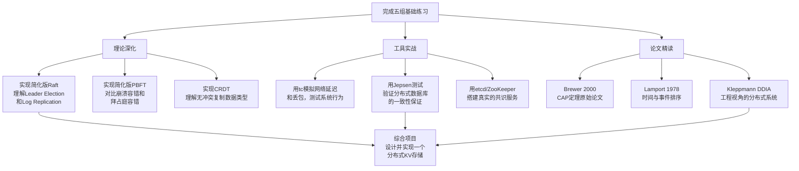

# 分布式理论练习方法

分布式理论的抽象程度远高于大多数软件工程主题。CAP定理、FLP不可能定理、向量时钟、Chandy-Lamport算法——这些概念在阅读时似乎"懂了"，但一到设计和排障时就暴露出理解的浅薄。**练习是弥合"知道"和"会用"之间鸿沟的唯一途径。**

本节提供五组递进式练习，从基础概念理解到架构设计实战，每组练习都紧扣本章的理论内容，附带可运行的代码、具体的检查标准和预估时间。


---

## 练习一：基础概念理解与手算验证（预计45分钟）

**目标**：通过手算和推理，深度理解CAP定理的证明逻辑、一致性模型的判定、向量时钟的三态比较、以及FLP定理的直觉含义。能脱离书本独立推导核心结论。

### 1.1 CAP定理证明复现（15分钟）

**题目**：证明CAP定理的核心推导。

假设系统有两个节点N1和N2，通过网络通信。初始状态为 `x = 0`。

1. 客户端C1向N1发送 `write(x, 1)`，N1接受了写入并返回成功。
2. 在N1将更新同步到N2之前，N1和N2之间发生网络分区。
3. 客户端C2从N2读取x。

请回答以下问题：

问题1：如果系统选择"一致性"（C），N2应该返回什么？这违反了哪个属性？

问题2：如果系统选择"可用性"（A），N2应该返回什么？这违反了哪个属性？

问题3：N2能不能同时返回1且不违反C或A？为什么？

问题4：如果系统不保证分区容忍（P），即分区时直接停机，那C和A能同时满足吗？
       这种系统在实际中有什么问题？

**自检答案**（做完再看）：

| 问题 | 答案 | 关键点 |
|------|------|--------|
| 问题1 | N2必须返回1（或者拒绝服务）。如果返回0，违反C | 强一致性要求所有节点看到相同值 |
| 问题2 | N2必须返回x的某个值（不能拒绝或超时）。如果拒绝，违反A | 可用性要求每个请求都有响应 |
| 问题3 | 不能。N2不知道N1写了什么，返回0则C不成立，返回1则A要求它在不知道的情况下"猜对" | 分区切断了信息流 |
| 问题4 | 能。但分区时停机意味着服务不可用——本质上退化为单机系统 | 真正的分布式系统必须容忍分区 |

### 1.2 向量时钟手动推演（15分钟）

**题目**：三个进程P1、P2、P3各自有一个向量时钟，初始状态为 `VC1=[0,0,0]`，`VC2=[0,0,0]`，`VC3=[0,0,0]`。

按以下事件序列执行，写出每一步后三个进程的向量时钟状态：

事件序列：
1. P1执行本地事件a
2. P1发送消息m1给P2（消息携带发送时的VC1）
3. P2接收消息m1（更新VC2）
4. P2执行本地事件b
5. P2发送消息m2给P3（消息携带当前VC2）
6. P3接收消息m2（更新VC3）
7. P3执行本地事件c
8. P1执行本地事件d

**关键规则**：
- 执行本地事件：当前进程的VC中，自己的分量+1
- 发送消息：消息携带发送时刻的完整VC
- 接收消息：取 `VC_local` 和 `VC_message` 各分量的最大值，然后自己的分量+1

**完成后的关键判断**：
- 事件a和事件c的VC能否比较大小？（因果关系判定）
- 事件b和事件d呢？
- 如何用一句话解释"因果一致"和"并发"的区别？

### 1.3 一致性模型辨析（15分钟）

**题目**：对以下每个场景，判断它满足哪种最强的一致性模型（线性一致性 / 顺序一致性 / 因果一致性 / 最终一致性 / 读己之写），并解释原因。

场景A：
  时间t1: 客户端X写入 x=1
  时间t2: 客户端Y读取 x，返回1
  时间t3: 客户端Z读取 x，返回1
  （X、Y、Z操作都经过主节点，全局有序）

场景B：
  时间t1: 客户端X写入 x=1
  时间t2: 客户端Y读取 x，返回0（读到了旧值）
  时间t3: 客户端Z读取 x，返回1
  说明：X写入后，Y的读请求被路由到副本1（未同步），Z的被路由到主节点

场景C：
  客户端X写入 x=1 后，刷新页面看到 x=0（自己的写入不可见）

场景D：
  P1写入 x=1 → P2读取 x=1 → P2写入 y=2 → P3读取 y=2 但读取 x=0

场景E：
  P1写入 x=1，P2写入 x=2（并发写入，无因果关系）
  P3先看到 x=2 再看到 x=1（顺序与实时不同，但两个操作可任意排序）

**参考判断**：

| 场景 | 最强一致性 | 判断依据 |
|------|-----------|---------|
| A | 线性一致性 | 所有操作全局有序，且与实时顺序一致 |
| B | 最终一致性 | Y读到旧值，不满足线性/顺序一致性，但最终会收敛 |
| C | 不满足读己之写 | 最基本的一致性保障缺失 |
| D | 不满足因果一致性 | P2看到了x=1并据此写y=2，但P3看到y=2却没看到x=1，因果链断裂 |
| E | 顺序一致性 | 存在全局顺序 [x=2, x=1] 使所有进程内的顺序一致，但不要求与实时一致 |

---

## 练习二：逻辑时钟编程实现（预计60分钟）

**目标**：用代码实现Lamport时钟和向量时钟，理解分布式系统中事件排序的工程机制。通过编程实践，深刻理解逻辑时钟的单调递增规则、因果序判定、以及并发检测。

### 2.1 Lamport时钟实现（20分钟）

用Python实现一个简化的Lamport时钟，支持本地事件、发送消息和接收消息三种操作。

```python
"""
Lamport时钟实现
规则：
1. 每次本地事件：clock += 1
2. 发送消息：先 clock += 1，消息携带当前clock值
3. 接收消息：clock = max(clock, msg_clock) + 1
"""
import time
import threading
from dataclasses import dataclass, field
from typing import List, Optional


@dataclass
class Message:
    sender: str
    clock: int
    content: str


class LamportClock:
    def __init__(self, process_id: str):
        self.process_id = process_id
        self.clock = 0
        self.log: List[tuple] = []  # (timestamp, event_type, detail)
        self._lock = threading.Lock()

    def local_event(self, event_name: str):
        """执行本地事件，时钟+1"""
        with self._lock:
            self.clock += 1
            self.log.append((self.clock, "LOCAL", event_name))
            return self.clock

    def send_message(self, content: str) -> Message:
        """发送消息，时钟+1，消息携带当前时钟"""
        with self._lock:
            self.clock += 1
            msg = Message(sender=self.process_id, clock=self.clock, content=content)
            self.log.append((self.clock, "SEND", f"→ {content}"))
            return msg

    def receive_message(self, msg: Message):
        """接收消息，取最大值+1"""
        with self._lock:
            self.clock = max(self.clock, msg.clock) + 1
            self.log.append((self.clock, "RECV", f"← {msg.content} from {msg.sender}"))
            return self.clock

    def print_log(self):
        print(f"\n=== Process {self.process_id} Log ===")
        for ts, etype, detail in self.log:
            print(f"  [{ts:3d}] {etype:4s} | {detail}")


# 模拟三个进程的交互
def simulate_lamport():
    p1 = LamportClock("P1")
    p2 = LamportClock("P2")
    p3 = LamportClock("P3")

    # P1的事件序列
    p1.local_event("a")           # a: [1,0,0]
    p1.local_event("b")           # b: [2,0,0]
    m1 = p1.send_message("task1") # 发送: [3,0,0]

    # P2的事件序列
    p2.local_event("c")           # c: [0,1,0]
    p2.receive_message(m1)         # 接收: max([0,1,0],[3,0,0])+1 = [4,2,0]
    m2 = p2.send_message("task2")

    # P3的事件序列
    p3.receive_message(m2)
    p3.local_event("d")

    # 各进程打印日志
    p1.print_log()
    p2.print_log()
    p3.print_log()

    # 验证因果关系
    print("\n=== Causality Check ===")
    print("a -> b (same process): always true")
    print("a -> m1 send -> m1 receive: causal")
    print("If P3 event d happens after receiving m2,")
    print("then d is causally after a and b (transitivity).")

simulate_lamport()
```

**验证要点**：
- 运行代码，检查每个进程的时钟是否单调递增
- 检查P2收到m1后时钟是否跳到了 `max(0,3)+1=4`
- 思考：Lamport时钟能否检测"并发"？（不能——`LC(a) < LC(b)` 不能推出a因果先于b）

### 2.2 向量时钟实现（25分钟）

```python
"""
向量时钟实现
规则：
1. 每次本地事件：VC[self] += 1
2. 发送消息：VC[self] += 1，消息携带完整VC
3. 接收消息：VC = componentwise_max(VC, msg.VC); VC[self] += 1
4. 判定：
   - VC(a) < VC(b)  ⟺  a因果先于b（充分必要条件）
   - VC(a) || VC(b)  ⟺  a和b并发
"""
from dataclasses import dataclass, field
from typing import Dict, List, Optional


@dataclass
class VMessage:
    sender: str
    vector_clock: Dict[str, int]
    content: str


class VectorClock:
    def __init__(self, process_id: str, all_processes: List[str]):
        self.process_id = process_id
        self.all_processes = all_processes
        self.vc = {p: 0 for p in all_processes}
        self.log: List[Dict] = []

    def local_event(self, event_name: str):
        self.vc[self.process_id] += 1
        entry = {"ts": dict(self.vc), "type": "LOCAL", "detail": event_name}
        self.log.append(entry)
        return dict(self.vc)

    def send_message(self, content: str) -> VMessage:
        self.vc[self.process_id] += 1
        msg = VMessage(sender=self.process_id, vector_clock=dict(self.vc), content=content)
        self.log.append({"ts": dict(self.vc), "type": "SEND", "detail": f"→ {content}"})
        return msg

    def receive_message(self, msg: VMessage):
        # 取各分量的最大值
        for p in self.all_processes:
            self.vc[p] = max(self.vc[p], msg.vector_clock[p])
        # 自己的分量+1
        self.vc[self.process_id] += 1
        self.log.append({
            "ts": dict(self.vc), "type": "RECV",
            "detail": f"← {msg.content} from {msg.sender}"
        })
        return dict(self.vc)

    def print_log(self):
        print(f"\n=== {self.process_id} Log ===")
        for entry in self.log:
            vc_str = str(entry['ts'])
            print(f"  {vc_str:>30s} | {entry['type']:4s} | {entry['detail']}")


def compare_vc(vc_a: Dict[str, int], vc_b: Dict[str, int]):
    """
    比较两个向量时钟：
    - vc_a < vc_b : a 因果先于 b
    - vc_a > vc_b : b 因果先于 a
    - vc_a == vc_b: 完全相同
    - vc_a || vc_b : 并发（不可比较）
    """
    a_leq_b = all(vc_a[p] <= vc_b[p] for p in vc_a)
    b_leq_a = all(vc_b[p] <= vc_a[p] for p in vc_a)

    if a_leq_b and not b_leq_a:
        return "A因果先于B (A → B)"
    elif b_leq_a and not a_leq_b:
        return "B因果先于A (B → A)"
    elif a_leq_b and b_leq_a:
        return "完全相同"
    else:
        return "并发 (A ∥ B)"


# 模拟场景
def simulate_vector_clock():
    procs = ["P1", "P2", "P3"]
    p1 = VectorClock("P1", procs)
    p2 = VectorClock("P2", procs)
    p3 = VectorClock("P3", procs)

    # 场景模拟
    vc_a = p1.local_event("a")       # P1: [1,0,0]
    p1.local_event("b")              # P1: [2,0,0]
    m1 = p1.send_message("m1")       # P1: [3,0,0]

    p2.local_event("c")              # P2: [0,1,0]
    p2.receive_message(m1)           # P2: max([0,1,0],[3,0,0])+1 = [4,2,0]
    m2 = p2.send_message("m2")

    vc_d = p3.receive_message(m2)    # P3: max([0,0,0],[4,2,0])+1 = [5,3,1]
    p3.local_event("d")

    p1.print_log()
    p2.print_log()
    p3.print_log()

    # 因果关系判定
    print("\n=== Causality Analysis ===")
    print(f"a vs d: {compare_vc(vc_a, vc_d)}")
    # a=[1,0,0], d=[5,3,1] → a因果先于d（通过消息链传递）

    # 构造并发场景
    p4 = VectorClock("P4", procs)
    p5 = VectorClock("P5", procs)
    vc_x = p4.local_event("x")
    vc_y = p5.local_event("y")
    print(f"x vs y: {compare_vc(vc_x, vc_y)}")  # 并发

simulate_vector_clock()
```

**验证要点**：
- 运行代码，确认a因果先于d（通过m1→m2的消息传递链）
- 手动构造一个并发场景（两个进程各自独立操作），验证并发判定
- 思考：向量时钟的O(n)空间开销在大规模系统中有什么问题？（引出HLC的设计动机）

### 2.3 思考题（15分钟）

完成编码后，回答以下问题：

1. Lamport时钟的局限性：
   - 假设P1执行事件a，P2执行事件b，LC(a)=5, LC(b)=5。
     a和b之间是什么关系？能不能判断？为什么？

2. 向量时钟的扩展性问题：
   - 在100个节点的集群中，每个消息需要携带多大的向量时钟？
     在1000个节点呢？如果节点数动态变化怎么办？

3. HLC的设计动机：
   - 混合逻辑时钟（HLC）结合了物理时钟和逻辑时钟。
     它解决了向量时钟的什么问题？代价是什么？
     （提示：HLC放弃检测并发的能力，换取O(1)的空间开销）

4. 工程应用：
   - Google Spanner使用TrueTime（原子钟+GPS）实现外部一致性。
     与HLC相比，TrueTime的优势和限制分别是什么？

---

## 练习三：CAP权衡模拟实验（预计90分钟）

**目标**：通过Docker模拟网络分区，观察CP系统和AP系统在分区期间的不同行为。亲身感受CAP定理的工程含义，建立"CAP不是静态标签，而是运行时行为"的正确心智模型。

### 3.1 实验环境搭建（20分钟）

```bash
# 创建实验目录
mkdir -p ~/cap-lab &amp;&amp; cd ~/cap-lab

# 创建docker-compose.yml：两个Redis实例模拟CP系统
cat > docker-compose.yml << 'EOF'
version: '3.8'
services:
  redis-primary:
    image: redis:7-alpine
    container_name: redis-primary
    networks:
      cap-net:
        ipv4_address: 172.20.0.10
    command: redis-server --appendonly yes

  redis-replica:
    image: redis:7-alpine
    container_name: redis-replica
    networks:
      cap-net:
        ipv4_address: 172.20.0.11
    command: redis-server --replicaof redis-primary 6379 --appendonly yes
    depends_on:
      - redis-primary

  client:
    image: python:3.12-alpine
    container_name: cap-client
    networks:
      cap-net:
        ipv4_address: 172.20.0.20
    volumes:
      - ./scripts:/scripts
    working_dir: /scripts
    command: pip install redis &amp;&amp; sleep infinity

networks:
  cap-net:
    driver: bridge
    ipam:
      config:
        - subnet: 172.20.0.0/24
EOF

# 启动环境
docker compose up -d
```

### 3.2 CP系统行为观察（35分钟）

```python
# scripts/cp_experiment.py
"""
实验：模拟网络分区，观察CP系统的行为
"""
import redis
import time
import subprocess
import sys


def get_client(host, port=6379):
    return redis.Redis(host=host, port=port, decode_responses=True,
                       socket_timeout=5, socket_connect_timeout=5)


def test_replication_sync():
    """测试1：验证主从复制正常工作"""
    primary = get_client("redis-primary")
    replica = get_client("redis-replica")

    # 写入主节点
    primary.set("stock:iphone", 100)
    time.sleep(1)  # 等待复制

    # 从从节点读取
    val = replica.get("stock:iphone")
    print(f"[正常状态] 主节点写入 stock:iphone=100")
    print(f"[正常状态] 从节点读取 stock:iphone={val}")
    assert val == "100", "复制应同步"
    print("✓ 主从复制正常\n")


def simulate_network_partition():
    """测试2：模拟网络分区，观察CP行为"""
    primary = get_client("redis-primary")
    replica = get_client("redis-replica")

    # 记录分区前状态
    print("[分区前] 主从一致，stock:iphone=100")

    # 模拟网络分区：用iptables阻断主从通信
    print("\n--- 模拟网络分区（断开主从通信）---")
    subprocess.run(
        ["docker", "exec", "redis-replica",
         "iptables", "-A", "INPUT", "-s", "172.20.0.10", "-j", "DROP"],
        capture_output=True
    )
    subprocess.run(
        ["docker", "exec", "redis-replica",
         "iptables", "-A", "OUTPUT", "-d", "172.20.0.10", "-j", "DROP"],
        capture_output=True
    )

    # 主节点继续接受写入
    primary.set("stock:iphone", 95)
    print(f"[分区期间] 主节点写入 stock:iphone=95")

    # 从节点读取旧值（分区导致无法同步）
    try:
        val = replica.get("stock:iphone")
        print(f"[分区期间] 从节点读取 stock:iphone={val}")
        if val == "100":
            print("  → 从节点看到旧值（分区导致不一致）")
            print("  → 这就是CP系统的权衡：从节点拒绝新数据 vs 返回旧数据")
    except redis.TimeoutError:
        print(f"[分区期间] 从节点超时（可能配置了WAIT）")
        print("  → 这是CP行为：分区时拒绝不可靠的读取")

    # 恢复网络
    print("\n--- 恢复网络 ---")
    subprocess.run(
        ["docker", "exec", "redis-replica",
         "iptables", "-D", "INPUT", "-s", "172.20.0.10", "-j", "DROP"],
        capture_output=True
    )
    subprocess.run(
        ["docker", "exec", "redis-replica",
         "iptables", "-D", "OUTPUT", "-d", "172.20.0.10", "-j", "DROP"],
        capture_output=True
    )
    time.sleep(2)

    # 验证恢复后一致性
    val = replica.get("stock:iphone")
    print(f"[恢复后] 从节点读取 stock:iphone={val}")
    if val == "95":
        print("✓ 网络恢复后数据最终一致\n")
    else:
        print(f"⚠ 仍在同步中，当前值={val}\n")


def test_split_brain_scenario():
    """测试3：脑裂场景——两个客户端同时操作不同分区"""
    primary = get_client("redis-primary")
    replica = get_client("redis-replica")

    primary.set("stock:iphone", 100)
    time.sleep(1)

    # 制造分区
    subprocess.run(
        ["docker", "exec", "redis-replica",
         "iptables", "-A", "INPUT", "-s", "172.20.0.10", "-j", "DROP"],
        capture_output=True
    )
    subprocess.run(
        ["docker", "exec", "redis-replica",
         "iptables", "-A", "OUTPUT", "-d", "172.20.0.10", "-j", "DROP"],
        capture_output=True
    )

    print("--- 脑裂场景：北京用户和新加坡用户同时扣库存 ---")
    print("北京用户（连主节点）：扣减5台 → stock=95")
    print("新加坡用户（连从节点）：扣减3台 → 从节点无法写入（只读）")
    print("如果从节点也被提升为主（sentinel自动切换），则：")
    print("  北京侧: stock=95（扣了5）")
    print("  新加坡侧: stock=97（扣了3）")
    print("  网络恢复后: 数据冲突，需要冲突解决策略")
    print("  → 这就是CAP中P发生时C和A的冲突\n")

    # 恢复
    subprocess.run(
        ["docker", "exec", "redis-replica",
         "iptables", "-D", "INPUT", "-s", "172.20.0.10", "-j", "DROP"],
        capture_output=True
    )
    subprocess.run(
        ["docker", "exec", "redis-replica",
         "iptables", "-D", "OUTPUT", "-d", "172.20.0.10", "-j", "DROP"],
        capture_output=True
    )


if __name__ == "__main__":
    test_replication_sync()
    simulate_network_partition()
    test_split_brain_scenario()

    print("=" * 60)
    print("实验总结：")
    print("1. 正常状态下，CP和AP系统的行为没有区别")
    print("2. CAP权衡只在网络分区时才体现")
    print("3. 同一个系统中，不同操作可以有不同的CAP策略")
    print("4. 关键是理解分区期间的行为，而不是贴'CP/AP'标签")
```

### 3.3 Pacemaker/quorum配置实验（20分钟）

```python
# scripts/quorum_experiment.py
"""
实验：Quorum读写配置对一致性的影响
用Redis模拟 N/R/W 参数，观察不同配置下的一致性行为
"""
import redis
import time
import threading


class QuorumKV:
    """
    模拟 Quorum 读写机制
    N = 总副本数
    W = 写入需要确认的副本数
    R = 读取需要查询的副本数

    如果 W + R > N，则读写集合必然有交集 → 保证强一致性
    如果 W + R <= N，则读写集合可能无交集 → 最终一致性
    """
    def __init__(self, n=3, w=2, r=2):
        self.n = n
        self.w = w
        self.r = r
        self.nodes = [redis.Redis(host="localhost", port=6379+i, decode_responses=True)
                      for i in range(n)]
        print(f"Quorum配置: N={n}, W={w}, R={r}")
        print(f"W+R={w+r} {'>' if w+r > n else '<='} N={n}")
        if w + r > n:
            print("→ 保证强一致性（线性一致性）")
        else:
            print("→ 仅保证最终一致性")

    def quorum_write(self, key, value):
        """写入：需要W个节点确认"""
        success = 0
        for i, node in enumerate(self.nodes[:self.w]):
            try:
                node.set(key, value)
                success += 1
            except Exception as e:
                print(f"  写入节点{i}失败: {e}")
        return success >= self.w

    def quorum_read(self, key):
        """读取：从R个节点读取，返回最新值"""
        results = []
        for i, node in enumerate(self.nodes[:self.r]):
            try:
                val = node.get(key)
                results.append(val)
            except Exception:
                pass

        # 简化的"最新值"判定：取非None值中最大的（模拟时间戳比较）
        valid = [v for v in results if v is not None]
        if not valid:
            return None
        # 实际系统中应该比较版本号/时间戳
        return max(valid, key=lambda x: int(x) if x.isdigit() else 0)


def run_quorum_experiment():
    print("=" * 50)
    print("Quorum一致性实验")
    print("=" * 50)

    # 实验1：W+R > N（强一致）
    print("\n--- 实验1：W+R > N（3副本，W=2, R=2）---")
    kv = QuorumKV(n=3, w=2, r=2)
    kv.quorum_write("price", "100")
    time.sleep(0.5)
    val = kv.quorum_read("price")
    print(f"读取结果: price={val}")
    print("W+R=4 > 3=N，读写必然重叠 → 保证看到最新值")

    # 实验2：W+R <= N（最终一致）
    print("\n--- 实验2：W+R <= N（3副本，W=1, R=1）---")
    kv2 = QuorumKV(n=3, w=1, r=1)
    kv2.quorum_write("price", "200")
    val = kv2.quorum_read("price")
    print(f"读取结果: price={val}")
    print("W+R=2 <= 3=N，读写可能不重叠 → 可能读到旧值")


if __name__ == "__main__":
    run_quorum_experiment()
```

### 3.4 实验总结与思考（15分钟）

完成实验后，回答以下问题：

1. 实验中观察到的CP/AP行为差异，与你在"常见误区"一节中读到的
   "CAP三选二"的错误理解有何不同？

2. 在实验中，Redis默认配置是CP还是AP？为什么？
   提示：考虑Redis的主从复制是同步还是异步的。

3. 如果你在一个电商系统中，库存扣减应该用什么CAP策略？
   商品浏览页面呢？购物车同步呢？请分别分析。

4. Quorum实验中，如果你只有3个副本，但需要N=5才够用，
   你会怎么解决？（提示：考虑虚拟节点、Raft协议）

5. 拓展思考：Cassandra的Consistency Level有哪些？
   LOCAL_QUORUM和QUORUM的区别是什么？在跨机房场景下
   选哪个？

---

## 练习四：分布式快照算法实现（预计75分钟）

**目标**：实现Chandy-Lamport分布式快照算法的简化版本，理解在不暂停系统的情况下捕获全局一致状态的机制。掌握Marker消息的核心思想——用Marker划分通道上的消息边界。

### 4.1 Chandy-Lamport算法核心原理（15分钟）

在编码前，先梳理算法的关键机制：

```mermaid
sequenceDiagram
    participant A as 进程A（快照发起者）
    participant B as 进程B
    participant C as 进程C

    Note over A: 1. 记录本地状态 state_A
    Note over A: 2. 向B和C发送Marker
    A->>B: Marker
    A->>C: Marker

    Note over B: 3. 收到Marker前，正常处理消息
    Note over B: 4. 收到Marker时：<br/>a. 记录本地状态 state_B<br/>b. 在该通道上标记边界<br/>c. 转发Marker给其他邻居

    B->>C: Marker

    Note over C: 5. 收到第一个Marker时：<br/>a. 记录本地状态 state_C<br/>b. 记录A→C通道上Marker前的消息

    Note over A,B,C: 当所有通道都标记了边界 → 快照完成
    Note over A,B,C: 全局快照 = state_A + state_B + state_C + 通道消息
```

**算法的正确性保证**：
- Marker消息在通道上的顺序等价于"在Marker之前"和"在Marker之后"的分界线
- 每个进程记录的是收到第一个Marker时的本地状态
- 通道上Marker之前的消息属于快照的一部分，之后的不属于
- 由于Marker在通道上有因果关系（进程先记录状态再发Marker），全局快照是一致的

### 4.2 简化版Chandy-Lamport实现（45分钟）

```python
"""
Chandy-Lamport 分布式快照算法（简化模拟版）

模拟多个进程通过有向通道通信，在不暂停系统的情况下
捕获全局一致状态。

核心机制：
1. 发起者记录本地状态，向所有出站通道发送Marker
2. 收到Marker的进程：
   - 如果尚未记录本地状态：记录状态，标记该通道边界
   - 如果已记录：仅标记该通道边界
3. 当所有通道都标记了边界 → 快照完成
"""
import threading
import time
from dataclasses import dataclass, field
from typing import Dict, List, Set, Callable, Optional
from collections import defaultdict
from enum import Enum


class Marker:
    """Marker消息——用于标记通道上的快照边界"""
    pass


@dataclass
class Channel:
    """进程间的有向通道"""
    source: str
    target: str
    marker_received: bool = False   # 是否已收到Marker
    messages_before: list = field(default_factory=list)  # Marker之前的消息
    messages_after: list = field(default_factory=list)   # Marker之后的消息
    recording: bool = False         # 是否处于录制状态（收到Marker后开始录制）


class SnapshotProcess:
    def __init__(self, process_id: str, state: int):
        self.process_id = process_id
        self.state = state
        self.state_recorded = False     # 是否已记录快照状态
        self.recorded_state: Optional[int] = None
        self.outgoing_channels: List[str] = []  # 出站通道的目标进程ID
        self.incoming_channels: Dict[str, Channel] = {}  # 入站通道
        self.message_queue = []  # 模拟消息队列
        self._lock = threading.Lock()
        self.running = True
        self.log: List[str] = []

    def setup_channels(self, neighbors: List[str]):
        """设置出站和入站通道"""
        self.outgoing_channels = neighbors
        for n in neighbors:
            self.incoming_channels[n] = Channel(source=n, target=self.process_id)

    def record_local_state(self):
        """记录本地状态"""
        with self._lock:
            if not self.state_recorded:
                self.state_recorded = True
                self.recorded_state = self.state
                self.log.append(
                    f"SNAPSHOT: Recorded local state = {self.state}"
                )
                return True
            return False

    def send_marker(self):
        """向所有出站通道发送Marker"""
        with self._lock:
            self.log.append(
                f"MARKER: Sending Marker to {self.outgoing_channels}"
            )
        return self.outgoing_channels

    def receive_marker(self, from_process: str):
        """接收Marker"""
        with self._lock:
            ch = self.incoming_channels[from_process]
            if not ch.marker_received:
                ch.marker_received = True
                ch.recording = False  # 不再录制该通道
                self.log.append(
                    f"MARKER: Received from {from_process} "
                    f"(first marker → record state)"
                )
                # 如果还没记录状态，现在记录
                recorded = self.state_recorded
                if not recorded:
                    self.record_local_state()
                return True  # 返回True表示是第一个Marker
            else:
                self.log.append(
                    f"MARKER: Received from {from_process} (duplicate)"
                )
                return False

    def receive_data_message(self, from_process: str, data: str):
        """接收数据消息"""
        with self._lock:
            ch = self.incoming_channels[from_process]
            if ch.recording:
                ch.messages_before.append(data)
                self.log.append(
                    f"DATA: Received '{from_process}→{self.process_id}' "
                    f"BEFORE marker: {data}"
                )
            else:
                ch.messages_after.append(data)
                self.log.append(
                    f"DATA: Received '{from_process}→{self.process_id}' "
                    f"AFTER marker: {data}"
                )

    def receive_message(self, msg):
        """统一消息接收入口"""
        if isinstance(msg, Marker):
            return self.receive_marker(msg.source) if hasattr(msg, 'source') else self.receive_marker("unknown")
        else:
            self.receive_data_message(msg['from'], msg['data'])

    def update_state(self, delta: int):
        """模拟业务操作导致状态变化"""
        with self._lock:
            self.state += delta
            self.log.append(f"STATE: {self.state - delta} → {self.state}")


class DistributedSnapshotSystem:
    """分布式快照模拟系统"""

    def __init__(self):
        self.processes: Dict[str, SnapshotProcess] = {}
        self.channels: Dict[tuple, List] = defaultdict(list)

    def add_process(self, pid: str, initial_state: int):
        self.processes[pid] = SnapshotProcess(pid, initial_state)

    def connect(self, from_id: str, to_id: str):
        """建立有向通道"""
        self.processes[from_id].outgoing_channels.append(to_id)
        self.processes[to_id].incoming_channels[from_id] = Channel(from_id, to_id)

    def send_data(self, from_id: str, to_id: str, data: str):
        """发送数据消息"""
        self.channels[(from_id, to_id)].append(data)
        self.processes[to_id].receive_data_message(from_id, data)

    def initiate_snapshot(self, initiator_id: str):
        """发起全局快照"""
        print(f"\n{'='*60}")
        print(f"  快照发起者: {initiator_id}")
        print(f"{'='*60}\n")

        # 第一步：发起者记录本地状态
        proc = self.processes[initiator_id]
        proc.record_local_state()

        # 第二步：发起者向所有出站通道发送Marker
        targets = proc.send_marker()

        # 第三步：向每个目标发送Marker
        for target_id in targets:
            ch = self.processes[target_id].incoming_channels[initiator_id]
            ch.recording = True  # 目标通道开始录制Marker之前的消息
            self.processes[target_id].receive_marker(initiator_id)
            print(f"  {initiator_id} → {target_id}: [Marker]")

    def collect_snapshot(self):
        """收集快照结果"""
        print(f"\n{'='*60}")
        print(f"  快照结果")
        print(f"{'='*60}")

        total_state = 0
        for pid, proc in self.processes.items():
            state = proc.recorded_state if proc.state_recorded else proc.state
            print(f"  进程 {pid}: 快照状态 = {state}")
            total_state += state

        print(f"\n  全局状态总和: {total_state}")
        print(f"  所有通道状态:")
        for (src, dst), msgs in self.channels.items():
            print(f"    {src} → {dst}: {len(msgs)} 条消息 {msgs}")

        print(f"\n  进程日志:")
        for pid, proc in self.processes.items():
            for log in proc.log:
                print(f"    [{pid}] {log}")

        return total_state


def run_snapshot_experiment():
    """运行Chandy-Lamport实验"""
    system = DistributedSnapshotSystem()

    # 创建三个进程
    system.add_process("A", 10)
    system.add_process("B", 20)
    system.add_process("C", 30)

    # 建立通道: A→B, B→C, A→C
    system.connect("A", "B")
    system.connect("B", "C")
    system.connect("A", "C")

    print("=== 初始状态 ===")
    print(f"  A: state=10, B: state=20, C: state=30")

    # 模拟一些数据消息
    print("\n=== 模拟数据消息 ===")
    system.send_data("A", "B", "msg1")
    system.send_data("B", "C", "msg2")
    system.send_data("A", "C", "msg3")

    # 模拟状态变化
    print("\n=== 模拟状态变化 ===")
    system.processes["A"].update_state(5)   # A: 10→15
    system.processes["B"].update_state(-3)  # B: 20→17

    # 发起快照（A是发起者）
    system.initiate_snapshot("A")

    # 快照后继续发送消息
    print("\n=== 快照后继续发送消息 ===")
    system.send_data("B", "C", "msg4")
    system.send_data("A", "C", "msg5")
    system.processes["C"].update_state(8)   # C: 30→38

    # 收集快照结果
    result = system.collect_snapshot()

    print(f"\n{'='*60}")
    print(f"  验证：快照应该捕获到状态变化前的一致性全局状态")
    print(f"  快照捕获的总状态: {result}")
    print(f"  这是A发起快照时的全局一致状态快照")
    print(f"{'='*60}")


if __name__ == "__main__":
    run_snapshot_experiment()
```

### 4.3 思考与拓展（15分钟）

1. 在实现中，Marker消息本身算不算"快照的一部分"？
   Marker是数据消息还是控制消息？它的作用是什么？

2. 如果在快照过程中，某个进程崩溃了，快照还能保证一致性吗？
   （提示：Chandy-Lamport算法的活性依赖什么？）

3. Flink的Checkpoint机制与Chandy-Lamport有什么关系？
   Flink的Checkpoint Barrier相当于什么？

4. 如果系统中有环形通道（A→B→C→A），快照算法还能正常工作吗？
   画出此时的Marker传递过程，验证正确性。

5. 为什么快照发起者需要在发送Marker之前先记录自己的状态？
   如果先发Marker再记录状态，会出什么问题？

---

## 练习五：分布式系统架构设计实战（预计90分钟）

**目标**：将本章学习的理论知识综合运用到架构设计中。针对一个真实的业务场景，综合运用CAP权衡、一致性模型选择、故障模型分析、逻辑时钟、分布式快照等知识，设计一个完整的分布式系统方案。

### 5.1 题目：设计跨地域电商库存系统（30分钟分析 + 30分钟设计 + 30分钟评审）

**业务背景**：

某电商平台需要设计一个跨三个地域（北京、上海、广州）的库存管理系统。要求：

| 需求 | 约束 |
|------|------|
| 日均订单量 | 500万笔 |
| SKU总数 | 200万 |
| 同城用户访问延迟 | < 50ms |
| 跨地域同步延迟 | < 2秒（最终一致），强一致场景 < 200ms |
| 可用性要求 | 99.99%（年停机 < 53分钟） |
| 数据安全 | 不允许超卖，不允许丢单 |
| 故障场景 | 任一数据中心完全宕机，业务不停 |

**你需要设计的内容**：

#### 第一部分：CAP权衡分析（10分钟）

回答以下问题：

1. 库存扣减操作应该选择CP还是AP？为什么？
   - 如果选择CP：分区时怎么处理？降级策略是什么？
   - 如果选择AP：如何防止超卖？

2. 商品浏览（查询库存）应该选择什么策略？
   与库存扣减的策略有什么不同？

3. 订单创建应该选择什么策略？
   考虑：用户下单时库存是否必须实时准确？

4. 画出你的CAP策略矩阵（操作类型 × CAP选择 × 降级方案）。

#### 第二部分：一致性模型选择（10分钟）

为以下场景选择合适的一致性级别，并说明理由：

1. 扣减库存后，用户查看订单详情时看到的库存变化
   → 选择哪种一致性？

2. 不同地域的运营人员查看销售数据看板
   → 选择哪种一致性？

3. 系统自动触发的库存预警通知
   → 选择哪种一致性？

4. 画出一致性选择的决策流程图。

#### 第三部分：故障处理与恢复（10分钟）

设计故障处理方案：

1. 上海数据中心完全断网（与北京、广州都断开）
   - 上海的用户怎么办？
   - 上海的库存数据怎么处理？
   - 网络恢复后如何合并数据？

2. 北京和广州之间正常，但上海隔离
   - 如果上海和北京同时有人扣减同一SKU的库存，
     如何防止超卖？
   - 用向量时钟的三态判定来分析冲突

3. 画出故障场景的处理流程图。

#### 第四部分：综合架构设计（30分钟）

设计完整的系统架构，包括：

1. 用Mermaid画出系统架构图（标注数据流向、一致性级别）
2. 选择技术栈（数据库、消息队列、缓存、一致性协议）
3. 设计库存数据的分区策略（按什么维度分片？）
4. 设计跨地域数据同步方案（同步/异步、冲突解决策略）
5. 设计监控指标（一致性延迟、分区检测、故障转移时间）

#### 设计参考框架

┌─────────────────────────────────────────────────────────────┐
│                    跨地域库存系统架构                          │
├─────────────────────────────────────────────────────────────┤
│                                                             │
│  ┌─────────┐    ┌─────────┐    ┌─────────┐                 │
│  │ 北京DC  │    │ 上海DC  │    │ 广州DC  │                  │
│  │         │    │         │    │         │                  │
│  │ 应用层  │    │ 应用层  │    │ 应用层  │                  │
│  │   ↓     │    │   ↓     │    │   ↓     │                  │
│  │ 本地DB  │←──→│ 本地DB  │←──→│ 本地DB  │                  │
│  │(CP主库) │    │(CP主库) │    │(CP主库) │                  │
│  │   ↓     │    │   ↓     │    │   ↓     │                  │
│  │ 本地Redis│   │ 本地Redis│   │ 本地Redis│                 │
│  └─────────┘    └─────────┘    └─────────┘                 │
│       ↕              ↕              ↕                       │
│  ══════════════ 跨地域同步层 ═══════════════                │
│  │  异步复制 + 冲突检测 + 补偿机制  │                        │
│  ══════════════════════════════════════                     │
│                                                             │
│  ┌─────────────────────────────────────────┐               │
│  │         全局协调层                        │               │
│  │  - 分布式锁（库存锁定）                    │               │
│  │  - 事务消息（订单创建）                    │               │
│  │  - 监控告警（一致性指标）                  │               │
│  └─────────────────────────────────────────┘               │
│                                                             │
└─────────────────────────────────────────────────────────────┘

### 5.2 自评标准

完成架构设计后，用以下清单自评：

| 评估维度 | 检查项 | 通过标准 |
|---------|--------|---------|
| CAP权衡 | 是否按操作粒度选择了正确的CAP策略 | 每个操作都有明确的CP/AP选择和理由 |
| 一致性模型 | 是否为每个数据类型选择了合适的一致性级别 | 一致性选择与业务容忍度匹配 |
| 故障处理 | 是否覆盖了网络分区、节点宕机、数据冲突场景 | 每种故障都有明确的处理方案 |
| 理论应用 | 是否使用了向量时钟、Quorum、快照等理论工具 | 至少使用3种理论工具 |
| 可落地性 | 架构是否可实际实施 | 有具体技术选型和部署方案 |
| 权衡分析 | 是否说明了方案的trade-off | 每个决策都有"为什么这样选" |

### 5.3 拓展思考

1. 如果业务扩展到海外（新加坡、美国），架构需要做什么调整？
   - 延迟从2ms增加到100-300ms，会对一致性选择产生什么影响？
   - 跨国数据合规（GDPR）会对架构产生什么约束？

2. 如何验证你的架构设计是否正确？
   - 需要什么样的测试（单元测试、集成测试、混沌测试）？
   - 如何用Jepsen测试验证一致性保证？

3. 如果让你从零设计，你会选择什么技术栈？
   - 数据库：TiDB / CockroachDB / Cassandra / MySQL + 自研？
   - 一致性协议：Raft / Paxos / 自研？
   - 同步方案：CDC / 双写 / 事件溯源？

4. 如何用混沌工程（Chaos Engineering）验证系统在故障场景下的行为？
   - Chaos Monkey / Litmus / Chaos Mesh 怎么用？
   - 设计哪些混沌实验？

---

## 练习进阶路径

完成以上五组练习后，建议按以下路径继续深入：



### 推荐练习资源

| 资源 | 类型 | 适合阶段 | 说明 |
|------|------|---------|------|
| [The Raft Paper](https://raft.github.io/raft.pdf) | 论文 | 进阶 | 理解共识算法的最佳入口 |
| [Jepsen](https://jepsen.io/) | 工具 | 进阶 | 分布式系统一致性验证框架 |
| [Raft Visualizer](http://thesecretlivesofdata.com/raft/) | 可视化 | 入门 | 交互式Raft协议演示 |
| [Paper: Dapper](https://research.google/pubs/pub36356/) | 论文 | 进阶 | Google大规模分布式追踪系统 |
| [etcd](https://etcd.io/) | 工具 | 实战 | 实际的分布式KV存储，内嵌Raft |
| [Martin Kleppmann's talks](https://martin.kleppmann.com/) | 视频 | 全阶段 | 分布式系统领域的权威演讲 |

---

**本节核心要点**：

1. **基础概念必须手算验证**——CAP证明、向量时钟比较、一致性判定，光看不练等于没学
2. **逻辑时钟必须编程实现**——Lamport时钟和向量时钟的实现，是理解因果序的基础
3. **CAP权衡必须实验验证**——通过网络分区模拟，亲眼看到CP/AP系统的不同行为
4. **分布式快照是理论到工程的桥梁**——Chandy-Lamport算法的Marker机制，是Flink Checkpoint的基础
5. **架构设计是综合运用**——将所有理论知识整合到一个真实场景中，形成完整的分析能力
