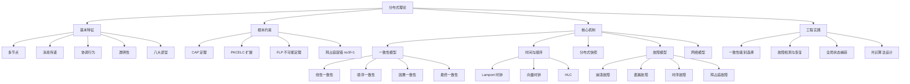

## 本章小结

分布式理论是构建可靠分布式系统的理论基石。本章从分布式系统的基本特征出发，系统性地覆盖了 CAP 定理、一致性模型、FLP 不可能定理、拜占庭容错、时间与顺序、分布式快照、故障模型与网络模型七大核心主题。以下是全章知识体系的系统回顾与总结。

---

### 一、核心知识点回顾

#### 1. 分布式系统的基本特征与挑战

分布式系统的本质是**通过网络通信、协调行为的计算机集合**。Leslie Lamport 和 Andrew Tanenbaum 的经典定义揭示了其核心特征：多节点、消息传递通信、行为协调、对用户透明。

分布式计算的八大谬误（Peter Deutsch, 1994）是理解系统故障的起点：

| 谬误 | 工程后果 | 应对策略 |
|------|----------|----------|
| 网络是可靠的 | 消息丢失导致数据不一致 | 超时重试、ACK 确认、持久化队列 |
| 延迟为零 | 超时设置不当引发雪崩 | 设置合理超时、监控尾延迟 |
| 带宽是无限的 | 大消息阻塞通信 | 压缩、分片、限流 |
| 网络是安全的 | 中间人攻击、数据泄露 | TLS 加密、身份认证 |
| 拓扑不会变化 | 节点动态加入/退出导致路由失败 | 服务发现、动态路由 |
| 只有一个管理员 | 跨组织协调困难 | 明确接口契约、异步通信 |
| 传输成本为零 | 序列化/反序列化成为瓶颈 | 选择高效序列化协议 |
| 网络是同构的 | 异构环境兼容性问题 | 抽象通信层、协议适配 |

**三大核心挑战**：
- **部分失败**（Partial Failure）：节点可能部分正常、部分失败，且无法预测
- **时钟不同步**：物理时钟漂移（±10-100ppm），无法依赖物理时间确定事件顺序
- **网络不可靠**：消息丢失、延迟无上限、乱序到达、网络分区

#### 2. CAP 定理及其扩展

CAP 定理（Eric Brewer, 2000；Gilbert & Lynch, 2002 证明）是分布式系统设计的第一个基本约束：

> 在网络分区发生时，系统只能在一致性（Consistency）和可用性（Availability）之间选择其一，同时必须保证分区容忍（Partition Tolerance）。

**PACELC 扩展**（Daniel Abadi, 2012）进一步完善了权衡框架：

PACELC：
If Partition (P) occurs:
  Choose between Availability (A) and Consistency (C)
Else (E):
  Choose between Latency (L) and Consistency (C)

| 系统 | P:A/C | E:L/C | 适用场景 |
|------|-------|-------|----------|
| DynamoDB | PA | EL | 高可用、低延迟的 Web 应用 |
| Cassandra | PA | EL | 大规模日志、IoT 数据 |
| HBase | PC | EC | 强一致的 OLAP 查询 |
| Spanner | PC | EC | 全球分布式金融系统 |
| CockroachDB | PC | EC | 强一致的 SQL 分布式数据库 |
| MongoDB | PC | EC/EL | 可配置一致性的文档数据库 |

**工程启示**：不存在真正的 CA 分布式系统。"CA"意味着在网络分区时停止服务，本质上是退化为单机系统。

#### 3. 一致性模型的完整光谱

一致性模型从强到弱形成一个完整的光谱：

| 一致性级别 | 定义 | 实现复杂度 | 性能影响 | 典型系统 |
|------------|------|------------|----------|----------|
| 线性一致性（Linearizability） | 所有操作表现得像单机顺序执行 | 极高 | 高延迟 | Spanner、etcd |
| 顺序一致性（Sequential Consistency） | 所有进程看到相同的操作顺序 | 高 | 中等延迟 | ZooKeeper |
| 因果一致性（Causal Consistency） | 因果相关的操作保序，无因果关系的操作可乱序 | 中等 | 较低延迟 | MongoDB（默认） |
| 会话一致性（Session Consistency） | 单个会话内保证读己之写 | 低 | 低延迟 | Cassandra |
| 最终一致性（Eventual Consistency） | 停止写入后，所有副本最终收敛到相同值 | 最低 | 最低延迟 | DynamoDB、CouchDB |

**选择原则**：
- 金融交易、库存扣减 → 线性一致性
- 社交 Feed、评论系统 → 因果一致性
- 用户配置、内容分发 → 最终一致性

#### 4. FLP 不不可能定理

FLP 定理（Fischer, Lynch, Paterson, 1985）是分布式计算的另一个基本约束：

> 在异步系统中，只要有一个进程可能崩溃，就不存在一个确定性算法能保证终止（Termination）。

**工程意义**：
- 不是说共识"不可能"，而是说确定性算法在异步系统中无法同时保证安全性和终止性
- 实际工程通过**随机化**（如 Ben-Or 算法）或**部分同步假设**（如 Raft）绕过限制
- 超时机制本质上是引入同步假设来保证终止性

#### 5. 拜占庭容错

拜占庭将军问题（Lamport, Shostak, Pease, 1982）描述了最严格的故障模型：节点可以任意行为，包括发送矛盾信息。

**关键结论**：
- 系统中最多有 `f` 个拜占庭节点时，至少需要 `n ≥ 3f + 1` 个节点才能达成共识
- PBFT（Practical Byzantine Fault Tolerance, Castro & Liskov, 1999）将通信复杂度从 O(n⁴) 优化到 O(n²)

**适用场景**：
- 区块链与加密货币（比特币、以太坊）
- 航空航天控制系统
- 核电站监控系统
- 任何节点可信度存疑的场景

#### 6. 时间与顺序

在分布式系统中建立全局时间顺序是核心挑战之一：

| 时钟类型 | 核心思想 | 复杂度 | 精度 | 适用场景 |
|----------|----------|--------|------|----------|
| Lamport 时钟 | 逻辑时间戳，单调递增 | O(1) | 仅因果序 | 基础事件排序 |
| 向量时钟 | 每个进程维护完整向量 | O(n) | 完整因果关系 | 检测并发事件 |
| 混合逻辑时钟（HLC） | 结合物理时钟和逻辑时钟 | O(1) | 近似物理时间 | 跨数据中心协调 |

**向量时钟的三态判定**：
- `VC(a) < VC(b)`：a 因果发生在 b 之前
- `VC(a) > VC(b)`：b 因果发生在 a 之前
- `VC(a) ∥ VC(b)`：a 和 b 是并发事件（无法比较）

#### 7. 分布式快照

Chandy-Lamport 算法（1985）解决了在不暂停系统的情况下捕获全局一致状态的问题。

**算法核心步骤**：
1. **快照发起者**记录自己的本地状态，向所有出站通道发送 **Marker** 消息
2. 收到 Marker 的节点：如果尚未记录本地状态，则记录并开始在该通道上转发后续消息；如果已记录，则标记该通道上的消息边界
3. 当所有通道都收到 Marker 后，快照完成

**应用价值**：
- 检查点（Checkpointing）与恢复
- 死锁检测
- 系统调试与审计

#### 8. 故障模型与网络模型

**故障模型分类**：

| 故障类型 | 表现 | 检测难度 | 应对策略 |
|----------|------|----------|----------|
| 崩溃故障（Crash） | 节点突然停止响应 | 容易（心跳超时） | 副本冗余、自动故障转移 |
| 遗漏故障（Omission） | 消息丢失或未接收 | 中等 | 超时重试、ACK 确认 |
| 时序故障（Timing） | 响应超时或过早 | 较难 | 逻辑时钟、超时阈值自适应 |
| 拜占庭故障（Byzantine） | 节点任意行为 | 极难 | BFT 共识、数字签名验证 |

**网络模型**：

| 模型 | 特征 | 适用场景 |
|------|------|----------|
| 同步模型 | 消息延迟有上界 | 理论分析 |
| 异步模型 | 消息延迟无上界 | 最坏情况分析 |
| 部分同步模型 | 延迟在大部分时间有界 | 工程实践（Raft、Paxos） |

---

### 二、关键公式与模型速查

| 概念 | 公式/模型 | 说明 |
|------|-----------|------|
| 吞吐量（Little 定律） | L = λW（请求数 = 到达率 × 响应时间） | 容量规划基础公式 |
| 可用性 | A = MTBF / (MTBF + MTTR) | 99.9% = 8.76 小时/年停机 |
| 尾延迟 | P99 = 排序后第 99 百分位值 | 衡量长尾效应的关键指标 |
| 容量规划 | QPS × 单次请求资源 = 总资源需求 | 扩容决策依据 |
| BFT 容错 | n ≥ 3f + 1（n 为总节点数，f 为拜占庭节点数） | 拜占庭容错的最低节点要求 |
| CAP 权衡 | 网络分区时 C 和 A 不可兼得 | 系统设计的根本约束 |
| FLP | 异步系统 + 1 个可能崩溃的进程 → 无法确定性终止 | 共识算法设计的理论边界 |
| Lamport 时钟 | `a → b ⟹ LC(a) < LC(b)` | 因果序的充分不必要条件 |
| 向量时钟 | `VC(a) < VC(b) ⟺ a → b`（因果序的充要条件） | 完整因果关系判定 |

---

### 三、知识体系全景图

---

### 四、理论到工程的映射

理解分布式理论的最终目的是指导工程决策。以下是核心理论到工程实践的映射关系：

| 理论概念 | 工程决策 | 典型实现 |
|----------|----------|----------|
| CAP 定理 | 系统架构选择：CP 还是 AP | ZooKeeper(CP) vs Cassandra(AP) |
| 一致性模型 | 读写策略与副本同步方式 | quorum 读写、read-your-writes |
| FLP 定理 | 共识算法设计：引入超时/随机化 | Raft 的选举超时、PBFT 的随机化 |
| 拜占庭容错 | 节点数量规划与信任模型 | 区块链的 n≥3f+1 验证节点 |
| Lamport 时钟 | 事件排序与因果追踪 | 分布式日志、事件溯源 |
| 向量时钟 | 并发检测与冲突解决 | Dynamo 的冲突向量、CRDT |
| HLC | 跨数据中心时间协调 | CockroachDB 的 HLC 实现 |
| Chandy-Lamport | 检查点与故障恢复 | Flink 的分布式快照 |
| 故障模型 | 容错策略设计 | 心跳检测 + 自动故障转移 |
| 网络模型 | 超时与重试策略 | 异步模型下的超时阈值调优 |

---

### 五、最佳实践清单

**系统设计阶段**：

- [ ] 根据业务需求确定 CAP 权衡方向（CP vs AP）
- [ ] 选择合适的一致性级别（线性一致 vs 因果一致 vs 最终一致）
- [ ] 评估拜占庭故障风险，决定是否需要 BFT
- [ ] 设计故障检测机制（心跳间隔、超时阈值、误判处理）
- [ ] 规划节点数量：BFT 场景至少 3f+1 个节点

**实现阶段**：

- [ ] 实现合理的超时机制（避免级联故障）
- [ ] 设计幂等操作（应对消息重试）
- [ ] 使用逻辑时钟追踪事件因果关系
- [ ] 实现消息的顺序保证（如需要）
- [ ] 编写分布式系统的单元测试和集成测试

**运维阶段**：

- [ ] 监控节点健康状态（心跳、延迟、错误率）
- [ ] 监控一致性指标（副本延迟、数据偏差）
- [ ] 定期验证故障转移机制的有效性
- [ ] 记录和分析网络分区事件
- [ ] 建立混沌工程实践（Chaos Monkey）

---

### 六、常见误区与纠正

| 误区 | 正确认知 | 纠正方法 |
|------|----------|----------|
| "CAP 三选二" | CAP 定理是网络分区发生时的 C 和 A 权衡，不是任意选择 | 理解 CAP 的严格定义：分区发生时 C 和 A 不可兼得 |
| "分布式系统一定比单机快" | 分布式引入了网络通信开销，简单查询可能更慢 | 只有在单机无法承载时才考虑分布式 |
| "最终一致性不可靠" | 最终一致性在特定场景下是最佳选择 | 根据业务容忍度选择一致性级别 |
| "FLP 定理意味着共识不可能" | FLP 说的是确定性算法在异步系统中无法终止 | 工程通过超时、随机化等手段绕过限制 |
| "拜占庭容错只用于区块链" | 任何节点可信度存疑的场景都需要考虑 BFT | 评估系统对恶意行为的容忍度 |
| "物理时钟足够用" | 物理时钟漂移可达 100ppm，无法用于精确排序 | 使用逻辑时钟或 HLC 建立因果序 |

---

### 七、下一步学习建议

**理论深化**：

1. **分布式共识算法**：在理解本章理论的基础上，深入学习 Raft、Paxos、ZAB 等共识算法的具体实现（第 22 章）
2. **分布式事务**：学习 2PC、3PC、Saga、TCC 等分布式事务协议，理解它们与一致性模型的关系
3. **CRDT**：Conflict-free Replicated Data Types，无冲突复制数据类型，是最终一致性场景下的优雅解决方案

**经典论文精读**：

1. **Brewer, E.** "Towards robust distributed systems." PODC, 2000.（CAP 定理原始论文）
2. **Gilbert, S. & Lynch, N.** "Brewer's conjecture and the feasibility of consistent, available, partition-tolerant web services." ACM SIGACT News, 2002.（CAP 定理证明）
3. **Fischer, M., Lynch, N. & Paterson, M.** "Impossibility of distributed consensus with one faulty process." JACM, 1985.（FLP 定理）
4. **Lamport, L.** "Time, clocks, and the ordering of events in a distributed system." CACM, 1978.（Lamport 时钟）
5. **Chandy, K. & Lamport, L.** "Distributed snapshots: determining global states of distributed systems." TOCS, 1985.（分布式快照）
6. **Castro, M. & Liskov, B.** "Practical Byzantine Fault Tolerance." OSDI, 1999.（PBFT 算法）

**实践项目**：

1. **实现 Lamport 时钟**：在多进程环境下实现并验证因果序
2. **模拟网络分区**：使用 tc（traffic control）模拟网络分区，观察 CP/AP 系统的不同行为
3. **实现 Chandy-Lamport**：在简化场景下实现分布式快照算法

**推荐阅读**：

- 《Distributed Systems》（Maarten van Steen & Andrew Tanenbaum）—— 分布式系统教材
- 《Designing Data-Intensive Applications》（Martin Kleppmann）—— 工程视角的分布式系统
- 《Introduction to Reliable and Secure Distributed Programming》（Christian Cachin 等）—— 分布式算法形式化
- Jepsen 测试系列博客（Kyle Kingsbury）—— 分布式系统一致性验证实践

---

### 八、思考题

1. **CAP 权衡**：在一个电商系统中，库存扣减应该选择 CP 还是 AP？购物车同步呢？请分别分析原因。

2. **一致性选择**：假设你正在设计一个社交平台的 Feed 系统，用户发布内容后，好友需要多久看到？应该选择哪种一致性级别？为什么？

3. **FLP 的工程绕过**：Raft 算法通过什么机制绕过 FLP 不可能定理的限制？如果网络完全异步，Raft 会怎样？

4. **向量时钟应用**：在多副本数据库中，如何使用向量时钟检测两个写操作是否冲突？请描述具体流程。

5. **故障模型分析**：在你的生产系统中，最常见的故障类型是什么？当前的容错机制是否充分？有哪些改进空间？

6. **分布式快照**：如果在执行 Chandy-Lamport 快照时，某个节点崩溃了，快照还能保证一致性吗？如何处理这种情况？

7. **理论到实践**：回顾你参与过的一个分布式系统，它在 CAP 光谱上的位置是什么？当时的权衡决策是否合理？如果重新设计，你会做出什么不同的选择？
