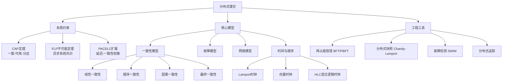
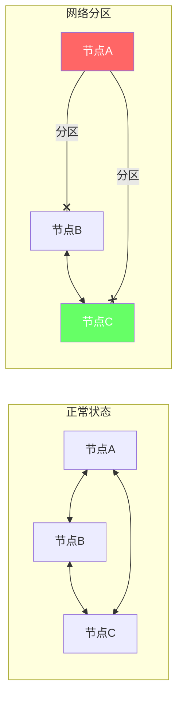
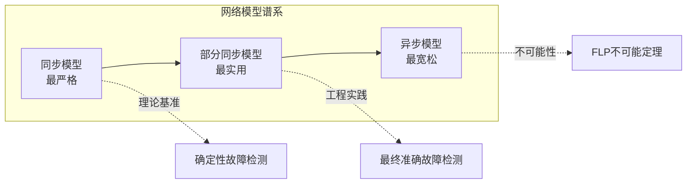
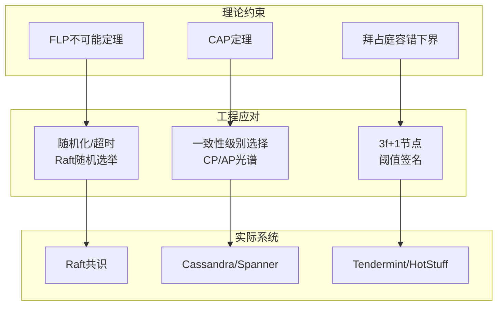

# 第21章 分布式理论

## 章节定位
分布式理论是构建可靠分布式系统的理论基石。当你面对"用MySQL还是Cassandra""要不要上Raft""一致性配到什么级别"这些决策时，背后都指向同一组理论根基。从CAP定理到FLP不可能定理，从一致性模型到时间顺序，这些理论帮助我们理解分布式系统的本质约束——**在不完美的网络和不可靠的节点之间建立可靠的协作**——并指导我们在工程实践中做出正确的设计决策。

本章不是学术论文的搬运，而是一份面向工程师的理论地图。每个定理都回答一个具体问题，每个模型都指向一类工程决策。学完本章，你应该能做到：看到任何分布式系统的设计文档时，能准确识别它在CAP光谱上的位置，能判断它的一致性级别是否匹配业务需求，能在"正确性"和"性能"之间做出有据可依的权衡。

## 核心问题
- 分布式系统有哪些根本性的限制？（FLP不可能定理、CAP定理）
- 如何在一致性、可用性和分区容忍之间权衡？（CAP/PACELC决策框架）
- 如何定义和实现不同级别的一致性？（一致性模型光谱及其实现）
- 如何在分布式系统中建立全局时间顺序？（Lamport时钟→向量时钟→HLC）
- 分布式系统中的故障和网络如何分类？（故障模型与网络模型）
- 如何在不停机的情况下捕获系统全局状态？（Chandy-Lamport分布式快照）

## 知识体系全景



## 内容结构
本章分为六个部分，由理论到实践层层递进：

**第一部分：理论基础** — 从分布式系统的基本特征出发，依次覆盖CAP定理、一致性模型光谱、FLP不可能定理、拜占庭容错、时间与顺序、分布式快照、故障模型与网络模型。每个主题都包含：权威定义、形式化描述、直观理解、工程意义。

**第二部分：核心技巧** — 将理论转化为可操作的工程方法：CAP决策框架、混合一致性架构、一致性级别配置、向量时钟压缩、HLC实现、Snowflake ID、故障检测器设计、SWIM协议、轻量级检查点、分布式追踪、BFT优化、一致性验证等17个实用技巧。

**第三部分：实战案例** — 五个来自真实系统的一致性设计案例：Spanner的TrueTime与外部一致性、Cassandra的可配置一致性、Riak的向量时钟与冲突解决、Flink的Chandy-Lamport变体checkpoint、微服务分布式追踪。每个案例都包含架构、代码配置和性能数据。

**第四部分：常见误区** — 五个最常犯的认知错误及其纠正：CAP三选二误解、最终一致性的过度乐观、线性一致性的性能陷阱、向量时钟的增长问题、拜占庭故障的工程意义。

**第五部分：练习与项目** — 从概念辨析到动手实现的递进练习：思考题、Raft实现、分布式KV存储、2PC/3PC/Saga、分布式追踪系统。

## 学习路径
理论→技巧→实战→误区→练习的顺序，但分布式理论需要反复阅读和思考。

**推荐学习节奏：**
- **第1遍**：快速通读理论基础，建立整体框架感。不要纠结细节，先知道"有什么"。
- **第2遍**：精读核心技巧，边读边思考"这个技巧解决了什么问题"。
- **第3遍**：结合实战案例，理解理论如何落地。对照自己的项目，思考"我们的系统在CAP光谱的什么位置"。
- **第4遍**：做练习题和实践项目，在动手实现中加深理解。

分布式理论的独特之处在于：很多概念看似简单，但只有在你亲手实现或在生产环境中踩过坑之后，才能真正理解其深刻含义。**不要怕反复回来重读——每一次重读都会发现新的理解层次。**

## 与其他章节的关系
本章是第20章（网络架构）和第22章（分布式共识）的理论桥梁。网络架构提供通信基础设施（TCP/UDP、负载均衡、DNS），分布式理论提供理论指导（CAP、一致性、不可能性定理），分布式共识是理论的具体实现（Raft、Paxos、PBFT）。三者构成"基础设施→理论指导→协议实现"的递进关系。

## 术法道贯通
- **术**：向量时钟的实现代码、分布式快照的执行流程、一致性级别的配置命令、Jepsen测试框架的使用
- **法**：CAP权衡的决策框架、一致性模型的选择原则、故障模型的分析方法、混合一致性架构的设计思路
- **道**：分布式系统的本质——在不完美的网络和不可靠的节点之间建立可靠的协作。所有的定理、模型和算法，最终都指向一个问题：**如何在约束条件下做出最优权衡。** 没有万能方案，只有针对具体场景的最优解。
***

# 第21章 分布式理论 - 理论基础

## 21.1 分布式系统的基本特征与挑战

### 21.1.1 什么是分布式系统

Leslie Lamport的经典定义："分布式系统是一组通过网络通信、协调行为的计算机集合。用户感知如同一台计算机。"

Andrew Tanenbaum的定义："分布式系统是一组独立的计算机，它们对用户呈现为一个单一的连贯系统。"

**核心特征**：
- **多节点**：系统由多个独立的计算节点组成
- **通信**：节点通过消息传递进行通信
- **协调**：节点需要协调行为以完成共同目标
- **透明性**：对用户隐藏分布式的复杂性

### 21.1.2 分布式系统的八大谬误

Peter Deutsch在1994年提出的"分布式计算的八大谬误"：

1. **网络是可靠的**（The network is reliable）
2. **延迟为零**（Latency is zero）
3. **带宽是无限的**（Bandwidth is infinite）
4. **网络是安全的**（The network is secure）
5. **拓扑不会变化**（Topology doesn't change）
6. **只有一个管理员**（There is one administrator）
7. **传输成本为零**（Transport cost is zero）
8. **网络是同构的**（The network is homogeneous）

**工程意义**：每一条谬误都对应着一类系统故障。理解这些谬误是设计健壮分布式系统的第一步。

### 21.1.3 分布式系统的挑战

**部分失败**（Partial Failure）：
- 单机系统要么正常工作，要么完全失败（fail-stop模型）
- 分布式系统中部分节点可能正常，部分节点可能失败
- 部分失败是非确定性的，无法预测哪个节点会在何时以何种方式失败
- 更糟糕的是：你甚至不知道一个节点是"真的失败了"还是"只是很慢"

**部分失败的真实案例：**
场景：电商订单服务
- 订单服务（3节点）：节点A正常，节点B内存溢出停止响应，节点C正常
- 支付服务（3节点）：全部正常
- 库存服务（3节点）：节点X正常，节点Y磁盘满无法写入，节点Z正常

问题：
1. 订单服务的负载均衡器不知道节点B已经"半死不活"
2. 库存服务的部分写入失败，导致库存数据不一致
3. 用户看到了"下单成功"但库存没有扣减
4. 运维人员需要在不停机的情况下定位哪个节点有问题

**时钟不同步**：
- 物理时钟存在漂移（通常±10-100ppm，即每天偏差约1-10秒）
- NTP同步精度通常在1-10ms级别，跨数据中心可能达到数十毫秒
- 不同节点的时间无法精确对齐
- 无法依赖物理时间确定事件顺序——这就是为什么需要逻辑时钟

**时钟漂移的实际影响：**
场景：两个节点同时写入同一key
节点A时钟：2024-01-01 10:00:00.000（实际偏快100ms）
节点B时钟：2024-01-01 10:00:00.000（实际偏慢100ms）

实际发生顺序：A先写入，B后写入（相差200ms）
但根据时间戳：B先写入，A后写入（时间戳相同或B更早）
结果：如果使用LWW（Last Write Wins），B的写入会覆盖A的写入
      而实际上A才是"最新的"写入

**网络不可靠**：
- 消息可能丢失（TCP也做不到100%可靠，连接可能断开）
- 消息可能延迟（延迟无上限，可能几毫秒，也可能几分钟）
- 消息可能乱序到达（TCP保证单连接内有序，但多连接不保证）
- 网络分区（Network Partition）：节点之间完全无法通信



**网络分区的现实案例：**
2012年Amazon EC2网络事件导致大面积服务不可用。根本原因是网络设备配置错误引发了广播风暴，导致VPC内部网络分区。Netflix、Instagram、Reddit等知名服务都受到了影响。这个事件提醒我们：网络分区不是理论假设，而是会在生产环境中真实发生的事件。

***

## 21.2 CAP定理

### 21.2.1 CAP定理的定义

Eric Brewer在2000年提出的CAP猜想，由Seth Gilbert和Nancy Lynch在2002年证明。

**三个属性**：
- **一致性（Consistency）**：所有节点在同一时刻看到相同的数据
- **可用性（Availability）**：每个请求都能收到响应（不保证是最新数据）
- **分区容忍（Partition Tolerance）**：系统在网络分区时仍能继续工作

**CAP定理**：在网络分区发生时，系统只能在一致性和可用性之间选择其一。

### 21.2.2 CAP定理的证明概要

证明思路（反证法）：

假设存在一个系统同时满足C、A、P。

考虑两个节点N1和N2，它们之间发生网络分区。
- 客户端W向N1写入数据v1
- 客户端R从N2读取数据

由于网络分区，N2无法收到N1的写入。

情况1：N2返回旧数据v0
- 违反一致性（C）

情况2：N2返回错误或超时
- 违反可用性（A）

因此，C、A、P不能同时满足。 ∎

**参考**：Gilbert, S. & Lynch, N. "Brewer's conjecture and the feasibility of consistent, available, partition-tolerant web services." ACM SIGACT News, 2002.

### 21.2.3 PACELC扩展

Daniel Abadi在2012年提出的PACELC定理，扩展了CAP的框架：

PACELC：
If Partition (P) occurs:
  Choose between Availability (A) and Consistency (C)
Else (E):
  Choose between Latency (L) and Consistency (C)

**实际系统的分类**：
| 系统 | P:A/C | E:L/C | 说明 |
|------|-------|-------|------|
| DynamoDB | PA | EL | 高可用、低延迟 |
| Cassandra | PA | EL | 高可用、低延迟 |
| HBase | PC | EC | 强一致、高延迟 |
| MongoDB | PC | EC/EL | 可配置一致性 |
| Spanner | PC | EC | 强一致、高延迟 |
| CockroachDB | PC | EC | 强一致、高延迟 |

### 21.2.4 CAP的实际权衡

**CA系统**（不存在真正的CA系统）：
- 单机数据库可以视为CA
- 分布式系统中网络分区不可避免
- "CA"通常意味着在网络分区时停止服务

**CP系统**：
- 网络分区时牺牲可用性，保证一致性
- 适用场景：银行、金融、库存管理
- 典型系统：ZooKeeper、etcd、HBase

**AP系统**：
- 网络分区时牺牲一致性，保证可用性
- 适用场景：社交网络、内容分发、缓存
- 典型系统：Cassandra、DynamoDB、CouchDB

**重要澄清**：
- CAP中的C是线性一致性（Linearizability），不是ACID中的C
- CAP中的A是整个系统的可用性，不是单个节点
- 大多数实际系统在CAP光谱上的某个位置，不是非此即彼

***

## 21.3 一致性模型

一致性模型定义了分布式系统中数据可见性的保证。

### 21.3.1 线性一致性（Linearizability）

最强的一致性模型，也称为原子一致性（Atomic Consistency）或外部一致性（External Consistency）。

**定义**：所有操作看起来像是在某个单一的全局时间点上原子执行的，并且这个时间点在操作的实际执行时间范围内。

**形式化定义**：
线性一致性要求：
1. 操作的调用和完成之间存在一个线性化点
2. 所有操作的线性化点构成一个全序
3. 线性化点的顺序与操作的实时顺序一致
4. 每个读操作返回最近一次写操作的值

更形式化地：
对于任意操作o1和o2：
- 如果o1在o2开始之前完成，则o1的线性化点在o2之前
- 线性化点的顺序决定了操作的结果

**示例**：
时间线：
客户端A: |---write(x,1)---|
客户端B:        |---read(x)---|
客户端C:              |---read(x)---|

线性一致的执行：
write(x,1)的线性化点在t1
B的read(x)线性化点在t2 > t1，返回1
C的read(x)线性化点在t3 > t1，返回1

非线性一致的执行：
B的read(x)返回0（在write之前），但C的read(x)返回1
这违反了线性一致性，因为B和C的读取应该看到相同的"最新"值

**实现代价**：
- 需要全局协调（共识协议）
- 延迟高（至少一个RTT）
- 吞吐量受限于最慢的节点

**典型实现**：
- 单主复制（所有写入通过主节点）
- 共识协议（Raft、Paxos）
- 分布式锁（ZooKeeper、etcd）

### 21.3.2 顺序一致性（Sequential Consistency）

**定义**（Lamport, 1979）：所有进程的操作看起来像是按照某个全局顺序执行的，并且每个进程内的操作顺序与程序顺序一致。

顺序一致性的要求：
1. 存在一个全局的操作顺序
2. 每个进程内的操作保持程序顺序
3. 不要求与实时顺序一致

与线性一致性的区别：
- 线性一致性要求操作的顺序与实时顺序一致
- 顺序一致性只要求存在某个合法的全局顺序
- 顺序一致性不要求读操作返回"最新"的值

**示例**：
时间线：
客户端A: write(x,1), write(x,2)
客户端B: read(x), read(x)

线性一致：B必须先看到1，再看到2（因为write(x,1)先发生）
顺序一致：B可以返回[2,1]（只要存在某个全局顺序能解释这个结果）
  例如：write(x,2), read(x)->2, write(x,1), read(x)->1
  这个顺序是合法的（虽然与实时顺序不同）

**典型实现**：
- 多数数据库的主从复制
- 某些内存模型（如x86 TSO）

### 21.3.3 因果一致性（Causal Consistency）

**定义**：如果操作之间存在因果关系，那么所有节点看到的这些操作的顺序是一致的。没有因果关系的操作可以以任意顺序出现。

因果关系的定义：
1. 如果操作A在操作B之前发生（同一个进程内），则A因果先于B
2. 如果A是写操作，B是读操作且读取了A写入的值，则A因果先于B
3. 因果关系具有传递性

**示例**：
因果一致的执行：
客户端A: write(x,1)
客户端B: read(x)->1, write(y,2)  （因为读到了x=1，所以write(y,2)因果依赖于write(x,1)）
客户端C: read(y)->2, read(x)->1  （必须先看到y=2再看到x=1，否则违反因果）

违反因果一致的执行：
客户端C: read(y)->2, read(x)->0  （看到了y=2但没看到x=1，违反因果）

**典型实现**：
- COPS（Cluster of Order-Preserving Servers）
- Eiger
- 一些分布式数据库的"会话一致性"

### 21.3.4 最终一致性（Eventual Consistency）

**定义**：如果没有新的写入，最终所有副本都会收敛到相同的值。

最终一致性的形式化定义：
∀ replica r, ∃ time t: ∀ t' > t, read(r, t') = latest_value

注意：
- 不保证收敛时间
- 不保证读取的是最新值
- 不保证所有节点同时看到相同的值

**最终一致性的变体**：
- **读己之写（Read-Your-Writes）**：用户总能看到自己写入的数据
- **单调读（Monotonic Reads）**：用户不会看到数据"回退"
- **写后读（Writes-Follow-Reads）**：写入操作建立在之前读取的数据之上
- **前缀一致（Prefix Consistency）**：所有节点看到的操作前缀相同

**典型实现**：
- DNS
- 最终一致的数据库（Cassandra、DynamoDB）
- CDN缓存

### 21.3.5 一致性模型的光谱

强 ←──────────────────────────────────────────────────→ 弱

线性一致性 > 顺序一致性 > 因果一致性 > 最终一致性
  (Linearizability)  (Sequential)  (Causal)    (Eventual)

性能/可用性：低 ─────────────────────────────────────→ 高
实现复杂度：高 ─────────────────────────────────────→ 低

**选择指南**：
| 应用场景 | 推荐一致性 | 原因 |
|---------|-----------|------|
| 金融交易 | 线性一致性 | 不能出错 |
| 库存管理 | 线性一致性 | 避免超卖 |
| 社交动态 | 因果一致性 | 保持对话顺序 |
| 用户资料 | 最终一致性 | 可容忍短暂不一致 |
| 缓存 | 最终一致性 | 高性能优先 |

***

## 21.4 FLP不可能定理

### 21.4.1 定理陈述

Fischer、Lynch和Paterson在1985年证明的FLP不可能定理是分布式系统理论中最重要的结果之一。

**定理**：在一个异步系统中，即使只有一个进程可能发生崩溃故障，也不存在一个确定性算法能解决共识问题。

**形式化陈述**：
在异步系统中，如果至少有一个进程可能崩溃，
则不存在一个确定性的共识算法同时满足以下三个条件：
1. 终止性（Termination）：所有正确的进程最终决定一个值
2. 一致性（Agreement）：所有正确的进程决定相同的值
3. 有效性（Validity）：决定的值是某个进程的输入值

### 21.4.2 证明概要

证明思路：

1. 定义共识算法的执行状态
   - 配置（Configuration）：所有进程状态的集合
   - 决定性（Decisive）：从该配置出发，存在一个决定性执行

2. 证明关键引理
   - 存在一个"双价"（bivalent）的初始配置
   - 从任何双价配置出发，都可以到达另一个双价配置

3. 构造矛盾
   - 对于任何算法A，都可以构造一个执行使得A无法终止
   - 通过延迟消息传递，使系统无法区分进程是慢还是崩溃

**直觉理解**：
- 异步系统无法区分"进程很慢"和"进程崩溃"
- 如果进程P崩溃了，其他进程不确定P是慢还是真的崩溃
- 如果等待P，可能永远等不到（活性问题）
- 如果不等待P，可能错过P的输入（安全性问题）

### 21.4.3 工程意义

FLP定理并不意味着共识问题无法解决。它告诉我们：

1. **纯异步系统无法保证终止**：实际系统需要某种"故障检测器"
2. **随机化可以绕过FLP**：通过随机选择打破对称性
3. **部分同步模型更实际**：假设消息最终会被送达
4. **超时机制是必要的**：实际系统使用超时来检测故障

**实际系统的应对**：
- Raft/Paxos：使用超时和领导者机制
- PBFT：使用视图切换
- 区块链：使用工作量证明（概率性共识）

**参考**：
- Fischer, M.J., Lynch, N.A., & Paterson, M.S. "Impossibility of Distributed Consensus with One Faulty Process." JACM, 1985.
- Chandra, T.D. & Toueg, S. "Unreliable Failure Detectors for Reliable Distributed Systems." JACM, 1996.

***

## 21.5 拜占庭容错

### 21.5.1 故障模型

**崩溃故障（Crash Fault）**：
- 进程停止工作，不再发送消息
- 是最简单的故障模型
- Raft、Paxos处理这种故障

**拜占庭故障（Byzantine Fault）**：
- 进程可能发送任意消息
- 可能发送矛盾的信息给不同节点
- 可能与恶意节点合谋
- 是最复杂的故障模型

### 21.5.2 BFT的基本结论

**定理**：在异步系统中，要容忍f个拜占庭故障节点，需要至少3f+1个节点。

**证明概要**：
假设有n个节点，其中f个可能拜占庭故障。

考虑3个节点集合A、B、C（每个f+1个节点）。
A和B有交集，B和C有交集，但A和C可能没有交集。

如果f个节点是拜占庭的：
- A中至少有一个诚实节点
- B中至少有一个诚实节点
- C中至少有一个诚实节点

但A和C的诚实节点可能不同，导致不一致。

因此需要n >= 3f+1。

### 21.5.3 PBFT算法

PBFT（Practical Byzantine Fault Tolerance）由Miguel Castro和Barbara Liskov在1999年提出，是第一个实用的拜占庭容错算法。

**算法流程**：
PBFT的三阶段协议：

1. Pre-prepare阶段
   - 主节点（Leader）分配序号，广播PRE-PREPARE消息
   - PRE-PREPARE: <PRE-PREPARE, v, n, d, m>
     v: 视图号
     n: 序号
     d: 消息摘要
     m: 客户端请求

2. Prepare阶段
   - 备份节点收到PRE-PREPARE后，广播PREPARE消息
   - PREPARE: <PREPARE, v, n, d, i>
     i: 节点ID
   - 当节点收到2f个匹配的PREPARE消息（包括自己的），
     进入prepared状态

3. Commit阶段
   - 进入prepared状态的节点广播COMMIT消息
   - COMMIT: <COMMIT, v, n, d, i>
   - 当节点收到2f+1个匹配的COMMIT消息（包括自己的），
     进入committed状态，执行请求

4. Reply阶段
   - 节点执行请求，向客户端回复
   - 客户端等待f+1个匹配的回复

**视图切换**（View Change）：
当主节点疑似故障时：
1. 备份节点广播VIEW-CHANGE消息
2. 新主节点收到2f个VIEW-CHANGE消息后
3. 广播NEW-VIEW消息
4. 进入新视图

视图切换保证：
- 不会丢失已提交的请求
- 新视图中的请求顺序与旧视图一致

**复杂度**：O(n²)消息复杂度，限制了PBFT的扩展性。

**参考**：
- Castro, M. & Liskov, B. "Practical Byzantine Fault Tolerance." OSDI 1999.
- Castro, M. & Liskov, B. "Practical Byzantine Fault Tolerance and Proactive Recovery." ACM TOCS, 2002.

***

## 21.6 时间与顺序

### 21.6.1 Lamport时钟

Lamport时钟是最简单的逻辑时钟，用于建立事件的偏序关系。

**定义**：
每个进程维护一个计数器C。

规则：
1. 进程在每次本地事件前，C = C + 1
2. 进程发送消息时，将C附加到消息中
3. 进程接收消息时，C = max(C, 消息中的C) + 1

**伪代码**：
算法：Lamport Clock

每个进程P维护：
    C = 0  // 逻辑时钟

function local_event():
    C = C + 1
    执行本地操作

function send_message(receiver, data):
    C = C + 1
    msg = {data: data, timestamp: C}
    send(receiver, msg)

function receive_message(msg):
    C = max(C, msg.timestamp) + 1
    处理消息

// 比较规则：
// 如果事件a因果先于事件b，则 L(a) < L(b)
// 注意：L(a) < L(b) 不能推出 a因果先于b

**性质**：
- 如果事件a因果先于事件b，则L(a) < L(b)
- L(a) < L(b)不能推出因果关系（存在假阳性）
- Lamport时钟只能建立偏序，不能建立全序

**参考**：Lamport, L. "Time, Clocks, and the Ordering of Events in a Distributed System." CACM, 1978.

**Python实现：**
```python
class LamportClock:
    """Lamport逻辑时钟的Python实现"""
    
    def __init__(self):
        self.time = 0
    
    def tick(self) -> int:
        """本地事件，时钟递增"""
        self.time += 1
        return self.time
    
    def send(self) -> int:
        """发送消息前，时钟递增并返回时间戳"""
        self.time += 1
        return self.time
    
    def receive(self, msg_timestamp: int) -> int:
        """接收消息时，取max(本地, 消息) + 1"""
        self.time = max(self.time, msg_timestamp) + 1
        return self.time
    
    def get_time(self) -> int:
        return self.time


# 使用示例
import threading

class Node:
    def __init__(self, name: str):
        self.name = name
        self.clock = LamportClock()
        self.received_messages = []
    
    def send_message(self, data: str) -> dict:
        ts = self.clock.send()
        return {"sender": self.name, "data": data, "timestamp": ts}
    
    def receive_message(self, msg: dict):
        new_ts = self.clock.receive(msg["timestamp"])
        self.received_messages.append({
            "data": msg["data"],
            "receive_time": new_ts,
            "send_time": msg["timestamp"]
        })
        print(f"[{self.name}] 收到消息: {msg['data']}, "
              f"发送时间={msg['timestamp']}, 接收时间={new_ts}")


# 模拟三个节点通信
node_a = Node("A")
node_b = Node("B")
node_c = Node("C")

# A发送消息给B
msg1 = node_a.send_message("Hello from A")
node_b.receive_message(msg1)
# 输出: [B] 收到消息: Hello from A, 发送时间=1, 接收时间=2

# B发送消息给C
msg2 = node_b.send_message("Hello from B")
node_c.receive_message(msg2)
# 输出: [C] 收到消息: Hello from B, 发送时间=3, 接收时间=4

# A发送消息给C
msg3 = node_a.send_message("Hello from A again")
node_c.receive_message(msg3)
# 输出: [C] 收到消息: Hello from A again, 发送时间=2, 接收时间=5

# 验证因果关系
print(f"A时钟: {node_a.clock.get_time()}")  # 2
print(f"B时钟: {node_b.clock.get_time()}")  # 3
print(f"C时钟: {node_c.clock.get_time()}")  # 5
# C的时钟大于A和B，符合因果关系
```

### 21.6.2 向量时钟

向量时钟解决了Lamport时钟无法判断因果关系的问题。

**定义**：
每个进程维护一个向量VC[1..N]，N为进程数。

规则：
1. 进程i在每次本地事件前，VC[i] = VC[i] + 1
2. 进程i发送消息时，将VC附加到消息中
3. 进程j接收消息时，对每个k：VC[j][k] = max(VC[j][k], msg.VC[k])
   然后 VC[j][j] = VC[j][j] + 1

**伪代码**：
算法：Vector Clock

每个进程Pi维护：
    VC[1..N] = [0, 0, ..., 0]  // 向量时钟，N为进程数

function local_event():
    VC[i] = VC[i] + 1
    执行本地操作

function send_message(receiver, data):
    VC[i] = VC[i] + 1
    msg = {data: data, vector_clock: VC.copy()}
    send(receiver, msg)

function receive_message(msg):
    for k = 1 to N:
        VC[k] = max(VC[k], msg.vector_clock[k])
    VC[i] = VC[i] + 1
    处理消息

// 比较规则：
// VC1 < VC2 当且仅当：
//   ∀k: VC1[k] <= VC2[k] 且 ∃k: VC1[k] < VC2[k]

// 因果关系判断：
// 事件a因果先于事件b  ⟺  VC(a) < VC(b)
// VC(a)和VC(b)不可比较  ⟺  a和b是并发的

**示例**：
三个进程P1, P2, P3：

P1:  write(x)    send→P2         receive←P3
     [1,0,0]     [2,0,0]         [5,2,1]

P2:              receive←P1      send→P3
                  [2,1,0]         [2,2,0]

P3:                              receive←P2      send→P1
                                  [2,2,1]         [2,2,1]

分析：
- write(x)的VC = [1,0,0]
- P2 receive的VC = [2,1,0]
- [1,0,0] < [2,1,0]，所以write(x)因果先于P2的receive
- P3 send的VC = [2,2,1]，P2 receive的VC = [2,1,0]
- [2,2,1]和[2,1,0]不可比较，所以这两个事件是并发的

**空间开销**：向量时钟需要O(N)的空间，N为进程数。在大规模系统中，需要使用压缩技术（如Dotted Version Vectors）。

**Python实现：**
```python
from typing import Dict, List, Tuple
from copy import deepcopy

class VectorClock:
    """向量时钟的Python实现"""
    
    def __init__(self, node_id: str, all_nodes: List[str]):
        self.node_id = node_id
        self.all_nodes = all_nodes
        self.clock: Dict[str, int] = {node: 0 for node in all_nodes}
    
    def tick(self) -> Dict[str, int]:
        """本地事件，当前节点的计数器+1"""
        self.clock[self.node_id] += 1
        return deepcopy(self.clock)
    
    def send(self) -> Dict[str, int]:
        """发送消息前，时钟递增"""
        self.clock[self.node_id] += 1
        return deepcopy(self.clock)
    
    def receive(self, msg_clock: Dict[str, int]) -> Dict[str, int]:
        """接收消息时，逐分量取max"""
        for node in self.all_nodes:
            self.clock[node] = max(self.clock[node], msg_clock[node])
        self.clock[self.node_id] += 1
        return deepcopy(self.clock)
    
    def get_time(self) -> Dict[str, int]:
        return deepcopy(self.clock)
    
    @staticmethod
    def happens_before(vc1: Dict[str, int], vc2: Dict[str, int]) -> bool:
        """判断vc1是否因果先于vc2"""
        at_least_one_less = False
        for node in vc1:
            if vc1[node] > vc2[node]:
                return False
            if vc1[node] < vc2[node]:
                at_least_one_less = True
        return at_least_one_less
    
    @staticmethod
    def concurrent(vc1: Dict[str, int], vc2: Dict[str, int]) -> bool:
        """判断两个向量时钟是否不可比较（并发）"""
        return not VectorClock.happens_before(vc1, vc2) and \
               not VectorClock.happens_before(vc2, vc1)


# 使用示例：模拟三个节点的通信
nodes = ["A", "B", "C"]
node_a = VectorClock("A", nodes)
node_b = VectorClock("B", nodes)
node_c = VectorClock("C", nodes)

# A本地事件
vc1 = node_a.tick()
print(f"A本地事件: {vc1}")  # {'A': 1, 'B': 0, 'C': 0}

# A发送消息给B
vc2 = node_a.send()
node_b.receive(vc2)
print(f"B收到A的消息: {node_b.get_time()}")  # {'A': 1, 'B': 1, 'C': 0}

# B发送消息给C
vc3 = node_b.send()
node_c.receive(vc3)
print(f"C收到B的消息: {node_c.get_time()}")  # {'A': 1, 'B': 2, 'C': 1}

# 判断因果关系
vc_a = node_a.get_time()   # {'A': 2, 'B': 0, 'C': 0}
vc_c = node_c.get_time()   # {'A': 1, 'B': 2, 'C': 1}
print(f"A和C是否并发: {VectorClock.concurrent(vc_a, vc_c)}")  # True
# A的向量{2,0,0}和C的{1,2,1}不可比较，说明它们是并发的
```

### 21.6.3 混合逻辑时钟（HLC）

混合逻辑时钟（Hybrid Logical Clock）结合了物理时钟和逻辑时钟的优点。

**设计目标**：
- 接近物理时间（方便调试和日志排序）
- 保持因果一致性
- 有界漂移（与物理时钟的差距有限）

**定义**：
HLC由两部分组成：(l, c)
l: 物理时间部分
c: 逻辑计数器部分

规则：
1. 本地事件：
   l' = max(l, pt)  // pt为物理时钟
   if l' == l: c = c + 1
   else: c = 0
   l = l'

2. 发送消息：
   l' = max(l, pt)
   if l' == l: c = c + 1
   else: c = 0
   l = l'
   发送(l, c)

3. 接收消息(l', c'):
   if l > max(l', pt): c = c + 1
   elif l' > max(l, pt): l = l'; c = c' + 1
   elif pt > max(l, l'): l = pt; c = 0
   else: l = l; c = max(c, c') + 1

**性质**：
- 保持因果一致性
- 与物理时钟的差距有界
- 可以比较不同节点的时间戳
- 空间开销O(1)

**参考**：Kulkarni, A. et al. "Logical Physical Clocks." OPODIS 2014.

***

## 21.7 分布式快照

### 21.7.1 Chandy-Lamport算法

Chandy-Lamport算法用于捕获分布式系统的全局一致状态。

**问题定义**：
在分布式系统中，没有全局时钟。
如何在不停止系统的情况下，捕获一个"一致"的全局状态？

一致的全局状态：存在某个时间点，所有节点的状态组合在一起，
构成了系统在某个"切面"上的状态。

**算法流程**：
算法：Chandy-Lamport Distributed Snapshot

参与者：N个进程，通过消息通道连接

初始化：
    每个进程的状态为local_state
    每个进程记录来自每个通道的消息

启动（由进程initiator发起）：
1. initator记录自己的local_state
2. initator发送marker消息到所有出通道
3. initator开始记录所有入通道的消息

接收marker（由进程P接收，来自通道C）：
if P是第一次收到marker:
    P记录自己的local_state
    P标记通道C为"空"
    P发送marker到所有出通道（除了C）
    P开始记录所有其他入通道的消息
else:
    P停止记录通道C的消息
    P将记录的消息作为通道C的状态

终止：
当所有进程都收到marker后，算法终止
全局快照 = 所有进程的local_state + 所有通道的记录消息

**伪代码**：
算法：Chandy-Lamport Snapshot

每个进程P维护：
    snapshot_taken = false
    local_state = null
    channel_state = {}  // channel_id -> list of messages
    recording_channels = set()

function initiate_snapshot():
    snapshot_taken = true
    local_state = capture_current_state()
    for each out_channel:
        send_marker(out_channel)
    for each in_channel:
        recording_channels.add(in_channel)

function receive_marker(in_channel):
    if not snapshot_taken:
        snapshot_taken = true
        local_state = capture_current_state()
        for each out_channel != in_channel:
            send_marker(out_channel)
        for each ch != in_channel:
            recording_channels.add(ch)
        recording_channels.remove(in_channel)
        channel_state[in_channel] = []  // 空通道
    else:
        recording_channels.remove(in_channel)
        // channel_state[in_channel] 已经包含了记录的消息

function receive_message(msg, in_channel):
    if in_channel in recording_channels:
        channel_state[in_channel].append(msg)
    处理消息

**性质**：
- 算法在有限时间内终止
- 生成的快照是一致的（consistent cut）
- 不需要停止系统
- 消息复杂度O(N²)

**参考**：Chandy, K.M. & Lamport, L. "Distributed Snapshots: Determining Global States of Distributed Systems." ACM TOCS, 1985.

### 21.7.2 应用场景

**分布式垃圾回收**：
- 使用快照检测不可达的对象
- 每个进程记录本地引用关系
- 快照后分析全局引用图

**分布式调试**：
- 捕获系统状态用于故障分析
- 检测全局谓词（Global Predicate）

**分布式事务**：
- 事务的全局一致性状态
- 故障恢复的检查点

***

## 21.8 故障模型

### 21.8.1 故障类型分类

理解故障模型是设计容错系统的第一步。不同的故障类型决定了需要什么样的容错机制。

故障类型（从简单到复杂，容错成本递增）：

1. 崩溃故障（Crash Fault）
   - 进程停止工作，不再发送消息
   - 最简单的故障模型
   - Raft、Paxos处理这种故障
   - 容错要求：N >= 2f+1（多数派）

2. 遗漏故障（Omission Fault）
   - 进程可能丢失部分消息
   - 发送遗漏：进程A发送消息给B，但B从未收到
   - 接收遗漏：进程A收到消息但未处理
   - 比崩溃故障更难检测

3. 时序故障（Timing Fault）
   - 进程响应过慢，超出时间界限
   - 也称为"性能故障"
   - 难以区分"慢"和"崩溃"（FLP定理的核心）
   - 实际系统通过超时阈值来处理

4. 拜占庭故障（Byzantine Fault）
   - 进程可能发送任意消息
   - 可能发送矛盾信息给不同节点
   - 可能与恶意节点合谋
   - 最难处理
   - 容错要求：N >= 3f+1

**故障类型的对比与选择指南：**

| 故障类型 | 容错机制 | 节点要求 | 消息复杂度 | 适用场景 |
|---------|---------|---------|-----------|---------|
| 崩溃故障 | Raft/Paxos | 2f+1 | O(n) | 内部可信集群 |
| 遗漏故障 | 重传+确认 | 2f+1 | O(n) | 不可靠网络 |
| 时序故障 | 超时+故障检测器 | 2f+1 | O(n) | 实际生产系统 |
| 拜占庭故障 | PBFT/Tendermint | 3f+1 | O(n²) | 不可信环境/区块链 |

**实际系统中的故障叠加：**
真实世界的故障往往不是单一类型，而是多种故障叠加：

场景：跨机房部署的数据库集群
- 正常情况：崩溃容错（Raft）足够
- 但是：
  1. 机房间网络延迟波动 → 时序故障
  2. 磁盘I/O瓶颈 → 部分请求超时 → 遗漏故障
  3. SSD固件bug → 返回错误数据 → 拜占庭类故障
  4. 极端情况下，三者同时发生

工程应对：
- 崩溃容错作为基线（Raft/Paxos）
- 应用层数据校验（CRC、校验和）防御数据损坏
- 电路熔断器（Circuit Breaker）处理时序故障
- 多副本对比检测异常输出

### 21.8.2 网络分区

**定义**：网络分区是指网络被分割成多个互不相通的子网。分区期间，不同子网中的节点无法通信。

**分区模式：**
1. 完全分区：两个子网完全断开
   A-B-C  →  A   B-C
   A无法与B、C通信

2. 部分分区：部分节点之间断开
   A-B-C  →  A-B  A-C  B✗C
   B和C之间断开，但都能与A通信

3. 非对称分区：A能发消息给B，但B不能发给A
   A → B  ✓
   A ← B  ✗
   这种分区特别危险，因为A以为B收到了消息

**分区的现实成因：**
1. 硬件故障：交换机宕机、光纤被挖断、网卡故障
2. 配置错误：防火墙规则、VLAN配置、路由表错误
3. 资源耗尽：带宽打满、连接数耗尽、缓冲区溢出
4. 软件bug：内核网络栈bug、hypervisor网络虚拟化问题
5. 人为操作：误拔网线、错误的运维操作

**分区检测：**
- 心跳超时：最常用，但无法区分"网络分区"和"节点慢"
- 三角测量（Triangular Probing）：通过第三方节点间接检测
- 矩阵探测（Matrix Probe）：多节点互相探测，构建连通性矩阵
- 但本质上，分区检测等价于故障检测——这就是FLP不可能定理的核心

### 21.8.3 消息丢失

**原因**：
- 网络拥塞导致缓冲区溢出
- 路由器丢包（TCP重传最终会解决，但UDP不会）
- 物理链路故障
- 进程崩溃时未发送的消息丢失

**处理策略：**
1. 消息重传（最基础）
   - 发送方维护未确认消息列表
   - 超时后重传
   - 问题：需要处理幂等性（重传可能导致重复处理）

2. 序列号检测丢失
   - 每条消息带递增序列号
   - 接收方检测序列号间隙
   - 用于TCP、Raft日志复制等

3. 确认机制（ACK/NACK）
   - 显式确认：接收方发送ACK
   - 否定确认：接收方发送NACK（如序列号不连续）
   - 超时未确认则重传

4. 冗余编码（前向纠错）
   - 发送冗余数据，即使部分丢失也能恢复
   - 适用于实时音视频等不能重传的场景

### 21.8.4 故障恢复模型

分布式系统中的故障恢复也分为不同的模型：

1. 安全性优先（Safety-first）
   - 宁可拒绝服务，也不能返回错误数据
   - 例：银行系统宁可暂停也不能算错账
   - 实现：多数派确认、共识协议

2. 活性优先（Liveness-first）
   - 宁可返回旧数据，也不能停止服务
   - 例：社交网络宁可显示旧动态也不能无法访问
   - 实现：最终一致性、异步复制

3. 折中方案
   - 大多数系统在安全性和活性之间寻找平衡
   - 例：Cassandra允许在同一操作中选择不同的一致性级别
   - 例：Spanner通过TrueTime在延迟和一致性之间权衡

***

## 21.9 网络模型

网络模型定义了分布式系统中通信的假设条件。不同的网络模型决定了哪些算法是可行的，哪些是不可能的。

### 21.9.1 同步模型

**定义**：
- 消息延迟有上限Δ（消息最多Δ时间到达）
- 进程执行速度有下限（每步最多φ时间）
- 时钟漂移有上限（时钟与真实时间的偏差有界）

**特点**：
- 可以使用超时检测故障（超时=2Δ即可判断）
- 共识问题可以解决（最多Δ时间就能完成一轮通信）
- 但实际网络不是同步的——网络延迟波动可能很大

**同步模型的适用场景：**
1. 单个数据中心内部（网络延迟可控）
2. 实时控制系统（有硬实时要求）
3. 理论分析的基准模型

### 21.9.2 异步模型

**定义**：
- 消息延迟无上限（消息可能永远不到达）
- 进程执行速度无保证（进程可能永远不完成一步）
- 时钟可能任意漂移（物理时钟不可信）

**特点**：
- 无法使用超时检测故障（无法区分"慢"和"崩溃"）
- FLP不可能定理适用于异步模型
- 共识问题在纯异步模型中不可能解决

**异步模型的直觉理解：**
想象你在和一个朋友通电话：
- 同步模型：你知道电话最多延迟3秒
- 异步模型：你不知道对方是挂了电话、信号不好、还是只是在思考

在异步模型中，你永远无法确定对方的状态——
这就是FLP定理的本质：异步系统无法区分"慢"和"崩溃"。

### 21.9.3 部分同步模型

**定义**：
- 系统大部分时间是同步的（消息延迟有上界）
- 但存在任意长的异步期（消息延迟可能突然增大）
- GST（Global Stabilization Time）之后系统变为同步

**特点**：
- 最接近实际网络的模型
- 大多数共识算法假设部分同步模型
- 可以使用"故障检测器"（最终准确的故障检测器）

**部分同步模型与实际系统：**
实际网络行为（以跨机房为例）：
- 正常情况：延迟1-5ms，同步模型成立
- 偶发抖动：延迟突增到50-100ms，接近异步
- 极端情况：网络分区，完全异步

GST的直觉：在某个时间点之后，系统恢复同步。
实际工程中，我们通过以下方式利用这个模型：
1. 超时机制：超时时间设为正常延迟的数倍
2. 故障检测器：最终会收敛到正确的判断
3. 重试机制：异步期结束后自动恢复

**参考**：Dwork, C., Lynch, N., & Stockmeyer, L. "Consensus in the Presence of Partial Synchrony." JACM, 1988.

### 21.9.4 网络模型对比总结

| 特性 | 同步模型 | 部分同步模型 | 异步模型 |
|------|---------|------------|---------|
| 消息延迟 | 有上界Δ | 大部分时间有上界 | 无上界 |
| 进程速度 | 有下界 | 大部分时间有下界 | 无保证 |
| 时钟漂移 | 有上界 | 大部分时间有上界 | 无限制 |
| 故障检测 | 精确 | 最终准确（◇P） | 不可能 |
| 共识可行性 | 可解决 | 可解决（需故障检测器） | FLP不可能 |
| 实际对应 | 单DC内部 | 跨DC部署 | 极端网络故障 |



### 21.9.5 故障检测器的形式化

在部分同步模型中，故障检测器是解决共识问题的关键工具。

故障检测器的分类（按性质）：

完美故障检测器（P）：
- 完整性：最终每个故障进程都被怀疑
- 准确性：从不怀疑正确的进程
- 说明：同步模型中可以实现

最终完美故障检测器（◇P）：
- 完整性：最终每个故障进程都被怀疑
- 最终准确性：最终正确的进程不再被怀疑
- 说明：部分同步模型中可以实现，这是实际系统使用的

最终友好故障检测器（◇W）：
- 完整性：最终每个故障进程都被怀疑
- 最终弱准确性：存在某个正确进程从不被怀疑
- 说明：异步模型中可以实现（但只能保证一个正确进程不被怀疑）

不可靠故障检测器（U）：
- 没有任何保证
- 说明：纯异步模型中的最弱形式

**工程意义：**
- 完美故障检测器（P）在异步系统中不可能实现（FLP的推论）
- 实际系统使用◇P，即"最终准确"的故障检测器
- Raft的随机选举超时、SWIM的间接ping都是◇P的具体实现
- 关键洞察：不需要实时准确，只需要最终准确

***

## 21.10 不可能性结果与工程实践

### 21.10.1 理论与实践的鸿沟

理论告诉我们什么是不可能的，工程实践告诉我们如何在约束下工作。这种"鸿沟"不是缺陷，而是工程的核心挑战：**在理论约束的边界内找到最优解。**

**FLP的工程启示：**
- 使用随机化（如Raft的随机选举超时，打破对称性）
- 使用故障检测器（最终准确性，不需要实时准确）
- 接受概率性保证（以概率1终止，而非确定性终止）
- 使用超时机制（虽然异步模型中不可靠，但实际网络大部分时间是同步的）

**CAP的工程启示：**
- 不是二选一，而是一个光谱——大多数系统在CAP光谱的某个中间位置
- 根据业务需求选择合适的一致性级别，不同数据可以不同
- 使用混合模型（如Spanner的"外部一致性"，通过TrueTime实现跨数据中心的线性一致性）
- 在非分区期间同时满足C和A，只在分区时做权衡

**PACELC的工程启示：**
- 即使没有分区，也需要在延迟和一致性之间权衡
- 低延迟（EL）适合读多写少的场景
- 强一致性（EC）适合写多读少或对一致性要求高的场景
- 实际系统可以在不同操作上选择不同的EL/EC策略

### 21.10.2 工程师应该知道的理论

1. **不可能性结果是上界**：它们告诉你什么是不可能的，但不告诉你什么是可能的。FLP说异步系统中确定性共识不可能，但没说概率性共识不可能，也没说部分同步系统中不可能。

2. **理论模型是简化**：实际系统比理论模型复杂。理论假设网络是独立的、故障是随机的，但实际系统中故障往往是相关的（如同一机架的服务器同时宕机）。

3. **概率性保证足够好**：大多数应用不需要100%的保证。Raft以概率1终止，但实际中几乎总能在毫秒级完成。Google的Spanner使用TrueTime，其不确定性区间通常只有1-7ms。

4. **性能和正确性是权衡**：更强的保证通常意味着更高的延迟。线性一致性需要多数派确认，而最终一致性只需要写一个副本。选择时需要考虑业务对延迟和一致性的容忍度。

5. **监控比理论更重要**：理论分析告诉你系统"应该"怎样，但监控告诉你系统"实际"怎样。不一致窗口的P99值、故障恢复时间、分区频率——这些实际数据比任何理论模型都更有价值。

### 21.10.3 理论驱动的设计决策清单

在设计分布式系统时，可以用以下清单确保每个决策都有理论依据：

1. 一致性决策
   □ 每个数据项的一致性级别是否明确？
   □ 强一致性的数据：是否使用了共识协议？
   □ 最终一致性的数据：是否有收敛机制（反熵、读修复）？
   □ 不同数据是否使用了不同的一致性级别？

2. 故障容错决策
   □ 目标容错的故障类型是什么？（崩溃/拜占庭）
   □ 节点数量是否满足容错要求？（2f+1 或 3f+1）
   □ 故障检测器的设计是否合理？（超时参数、误报率）
   □ 故障恢复流程是否经过测试？

3. 网络假设决策
   □ 系统运行在什么网络模型下？（同步/部分同步/异步）
   □ 跨数据中心部署时，延迟预算是多少？
   □ 网络分区时的降级策略是什么？
   □ 是否需要处理非对称分区？

4. 时间与顺序决策
   □ 是否需要全局时间顺序？
   □ 使用什么时钟机制？（物理时钟/Lamport/向量/HLC）
   □ 事件顺序的正确性是否经过验证？
   □ 是否有时间戳冲突的处理机制？

5. 测试与验证决策
   □ 是否使用了Jepsen或其他一致性测试工具？
   □ 是否进行了混沌工程实验？
   □ 是否有监控不一致窗口的指标？
   □ 故障恢复流程是否自动化？

### 21.10.4 从理论到实践的映射



***

## 参考文献

1. Lamport, L. "Time, Clocks, and the Ordering of Events in a Distributed Systems." CACM, 1978.
2. Fischer, M.J., Lynch, N.A., & Paterson, M.S. "Impossibility of Distributed Consensus with One Faulty Process." JACM, 1985.
3. Gilbert, S. & Lynch, N. "Brewer's Conjecture and the Feasibility of Consistent, Available, Partition-Tolerant Web Services." ACM SIGACT News, 2002.
4. Chandy, K.M. & Lamport, L. "Distributed Snapshots: Determining Global States of Distributed Systems." ACM TOCS, 1985.
5. Castro, M. & Liskov, B. "Practical Byzantine Fault Tolerance." OSDI 1999.
6. Kulkarni, A. et al. "Logical Physical Clocks and Consistent Snapshots in Globally Distributed Databases." OPODIS 2014.
7. Dwork, C., Lynch, N., & Stockmeyer, L. "Consensus in the Presence of Partial Synchrony." JACM, 1988.
8. Chandra, T.D. & Toueg, S. "Unreliable Failure Detectors for Reliable Distributed Systems." JACM, 1996.
9. Kleppmann, M. "Designing Data-Intensive Applications." O'Reilly, 2017.
10. Cachin, C., Guerraoui, R., & Rodrigues, L. "Introduction to Reliable and Secure Distributed Programming." 2nd Edition, Springer, 2011.


***

# 第21章 分布式理论 - 核心技巧

## 21.1 CAP权衡的决策框架

### 技巧1：系统化CAP决策

CAP决策不是"选两个"，而是根据业务需求做出有意识的权衡。

决策流程：

1. 识别核心数据
   - 哪些数据需要强一致性？
   - 哪些数据可以容忍短暂不一致？
   - 哪些数据是只读的？

2. 评估网络分区的影响
   - 分区发生的频率？
   - 分区持续的时间？
   - 分区对业务的影响？

3. 选择一致性级别
   - 线性一致性：金融交易、库存管理
   - 顺序一致性：大多数业务数据
   - 因果一致性：社交、协作
   - 最终一致性：缓存、日志

4. 设计降级策略
   - 分区时如何降级？
   - 如何检测和恢复？
   - 如何通知用户？

### 技巧2：混合一致性架构

不同数据使用不同的一致性级别：

数据分类与一致性映射：

强一致性（CP）：
- 账户余额
- 库存数量
- 订单状态
- 支付记录

因果一致性：
- 社交动态
- 评论回复
- 协作文档

最终一致性（AP）：
- 用户资料
- 商品详情
- 推荐列表
- 搜索索引

实现方式：
- 使用不同的存储系统
- 使用不同的复制策略
- 使用不同的客户端库

***

## 21.2 一致性模型的选择

### 技巧3：一致性级别的配置

大多数分布式数据库允许配置一致性级别：

Cassandra一致性级别：
- ONE：一个副本确认（最弱，最快）
- QUORUM：多数副本确认（平衡）
- ALL：所有副本确认（最强，最慢）
- LOCAL_QUORUM：本地数据中心多数副本确认

选择公式：
R + W > N（保证强一致性）
R：读副本数
W：写副本数
N：副本总数

示例（N=3）：
- W=1, R=3：写快读慢
- W=3, R=1：写慢读快
- W=2, R=2：平衡
- W=2, R=3：强一致但慢

### 技巧4：读写一致性配置

DynamoDB一致性选项：
- 强一致性读（Consistent Read）：返回最新数据
- 最终一致性读（Eventual Read）：可能返回旧数据，但吞吐量更高

使用建议：
- 金融查询：强一致性
- 商品浏览：最终一致性
- 搜索结果：最终一致性
- 用户余额：强一致性

***

## 21.3 时间与顺序的工程实践

### 技巧5：向量时钟的压缩

向量时钟的空间复杂度是O(N)，在大规模系统中需要压缩。

**Dotted Version Vectors**：
压缩策略：
1. 只跟踪活跃的节点
2. 合并不活跃节点的时间戳
3. 使用"点"（dot）标记因果关系

示例：
原始向量时钟：{A:5, B:3, C:7, D:2, E:1}
压缩后：{A:5, B:3, C:7, others:2}

适用场景：
- Riak使用Dotted Version Vectors
- 处理并发写入的冲突检测

### 技巧6：HLC的实现

```python
# 混合逻辑时钟的Python实现
class HybridLogicalClock:
    def __init__(self):
        self.l = 0  # 物理时间部分
        self.c = 0  # 逻辑计数器
    
    def local_event(self, physical_time):
        if physical_time > self.l:
            self.l = physical_time
            self.c = 0
        else:
            self.c += 1
        return (self.l, self.c)
    
    def send_event(self, physical_time):
        return self.local_event(physical_time)
    
    def receive_event(self, physical_time, msg_l, msg_c):
        if self.l > max(msg_l, physical_time):
            self.c += 1
        elif msg_l > max(self.l, physical_time):
            self.l = msg_l
            self.c = msg_c + 1
        elif physical_time > max(self.l, msg_l):
            self.l = physical_time
            self.c = 0
        else:
            self.c = max(self.c, msg_c) + 1
        return (self.l, self.c)
    
    def compare(self, other):
        if self.l < other.l:
            return -1
        elif self.l > other.l:
            return 1
        else:
            return self.c - other.c
```

### 技巧7：全局ID生成

在分布式系统中生成全局唯一的有序ID：

Snowflake ID结构（64位）：
| 1位符号 | 41位时间戳 | 10位机器ID | 12位序列号 |

时间戳：毫秒级，相对于某个起始时间（Twitter用2010-11-04 01:42:54 UTC）
机器ID：最多1024个节点
序列号：每毫秒最多4096个ID

优点：
- 全局唯一
- 时间有序
- 高性能（每节点每毫秒4096个ID）
- 无需协调（纯本地生成）

缺点：
- 依赖时钟同步
- 机器ID需要手动分配
- 时钟回拨会导致问题

**Python实现：**
```python
import time
import threading

class SnowflakeIDGenerator:
    """
    Snowflake ID生成器
    结构: 1位符号 + 41位时间戳 + 10位机器ID + 12位序列号
    """
    
    # Twitter起始时间戳 (2010-11-04 01:42:54 UTC)
    EPOCH = 1288834974657
    
    # 位数分配
    MACHINE_ID_BITS = 10
    SEQUENCE_BITS = 12
    
    # 最大值
    MAX_MACHINE_ID = (1 << MACHINE_ID_BITS) - 1  # 1023
    MAX_SEQUENCE = (1 << SEQUENCE_BITS) - 1        # 4095
    
    # 位移
    MACHINE_ID_SHIFT = SEQUENCE_BITS
    TIMESTAMP_SHIFT = SEQUENCE_BITS + MACHINE_ID_BITS
    
    def __init__(self, machine_id: int):
        if machine_id > self.MAX_MACHINE_ID or machine_id < 0:
            raise ValueError(f"machine_id必须在0-{self.MAX_MACHINE_ID}之间")
        self.machine_id = machine_id
        self.sequence = 0
        self.last_timestamp = -1
        self.lock = threading.Lock()
    
    def _current_millis(self) -> int:
        return int(time.time() * 1000)
    
    def _wait_next_millis(self, last_ts: int) -> int:
        ts = self._current_millis()
        while ts <= last_ts:
            ts = self._current_millis()
        return ts
    
    def generate(self) -> int:
        with self.lock:
            ts = self._current_millis()
            
            if ts < self.last_timestamp:
                # 时钟回拨！
                raise RuntimeError(
                    f"时钟回拨{self.last_timestamp - ts}ms，拒绝生成ID"
                )
            
            if ts == self.last_timestamp:
                # 同一毫秒内，序列号递增
                self.sequence = (self.sequence + 1) &amp; self.MAX_SEQUENCE
                if self.sequence == 0:
                    # 序列号用尽，等待下一毫秒
                    ts = self._wait_next_millis(self.last_timestamp)
            else:
                # 新的毫秒，序列号重置为0
                self.sequence = 0
            
            self.last_timestamp = ts
            
            # 组装ID
            id_value = (
                ((ts - self.EPOCH) << self.TIMESTAMP_SHIFT) |
                (self.machine_id << self.MACHINE_ID_SHIFT) |
                self.sequence
            )
            return id_value
    
    @staticmethod
    def parse(id_value: int) -> dict:
        """解析Snowflake ID"""
        sequence = id_value &amp; 0xFFF           # 低12位
        machine_id = (id_value >> 12) &amp; 0x3FF  # 中间10位
        timestamp = (id_value >> 22) + SnowflakeIDGenerator.EPOCH
        
        return {
            "id": id_value,
            "timestamp": timestamp,
            "datetime": time.strftime(
                "%Y-%m-%d %H:%M:%S", time.localtime(timestamp / 1000)
            ),
            "machine_id": machine_id,
            "sequence": sequence
        }


# 使用示例
generator = SnowflakeIDGenerator(machine_id=1)

# 生成10个ID
ids = [generator.generate() for _ in range(10)]
for id_val in ids:
    parsed = SnowflakeIDGenerator.parse(id_val)
    print(f"ID: {id_val}, 时间: {parsed['datetime']}, "
          f"机器: {parsed['machine_id']}, 序列: {parsed['sequence']}")

# 验证有序性
print(f"ID有序: {ids == sorted(ids)}")  # True
```

**时钟回拨的处理策略：**
1. 拒绝生成（最安全）
   - 检测到回拨直接报错
   - 适用于对ID严格有序有要求的场景

2. 等待追上（最简单）
   - 等到时钟追上上次的时间戳
   - 缺点：如果回拨量大，可能等待很久

3. 使用扩展位（最灵活）
   - 预留几位作为时钟序列号
   - 每次回拨时序列号+1
   - 可以容忍最多N次回拨

4. 使用NTP容错
   - 配置NTP的slew模式（渐进调整而非跳变）
   - 减少时钟回拨的概率

***

## 21.4 故障检测技巧

### 技巧8：故障检测器设计

故障检测器是分布式系统的"眼睛"，但设计正确的故障检测器很困难。

**最终准确性故障检测器（◇P）**：
性质：
1. 最终完整性：最终每个故障进程都被怀疑
2. 最终准确性：最终正确的进程不再被怀疑

实现方式：
心跳机制：
- 每T秒发送心跳
- 如果在α*T秒内没有收到心跳，怀疑进程故障
- α > 1，容忍网络延迟

参数调优：
- T：心跳间隔（1-10秒）
- α：超时倍数（2-5倍）
- 太小：误报（网络抖动导致）
- 太大：故障检测延迟

### 技巧9：SWIM协议

SWIM（Scalable Weakly-consistent Infection-style Process Group Membership）是可扩展的成员协议。

SWIM的核心思想：
1. 不直接心跳，而是"ping"
2. 随机选择节点ping
3. 如果ping失败，让其他节点帮忙ping（indirect ping）
4. 周期性随机选择新节点ping

协议流程：
每T秒：
1. 随机选择一个成员m
2. 向m发送ping
3. 如果在超时内收到ack：
   - m存活
4. 如果超时：
   - 向k个随机成员发送ping-req(m)
   - 如果收到m的ack：m存活
   - 否则：m疑似故障

故障传播：
- 使用感染式传播（gossip）
- 每次ping携带成员状态变更
- 状态变更在O(log N)时间内传播

**参考**：Das, A. et al. "SWIM: Scalable Weakly-consistent Infection-style Process Group Membership Protocol." DSN 2002.

***

## 21.5 分布式快照技巧

### 技巧10：轻量级检查点

Chandy-Lamport算法的完整快照开销较大。实际系统通常使用轻量级检查点。

异步检查点（Asynchronous Checkpointing）：
1. 每个进程独立决定何时保存检查点
2. 不需要协调
3. 使用消息日志恢复因果关系

消息日志策略：
- 悲观日志：在发送消息前记录（最安全，最慢）
- 乐观日志：在发送消息后记录（可能丢失消息）
- 因果日志：只记录因果相关的消息（平衡）

恢复过程：
1. 找到最近的一致全局检查点
2. 重放消息日志
3. 恢复到一致状态

### 技巧11：分布式追踪

分布式追踪是现代的"分布式快照"，用于跟踪请求在微服务间的传播。

追踪模型：
Trace：一个请求的完整调用链
Span：Trace中的一个操作单元

Span结构：
- trace_id：全局唯一的追踪ID
- span_id：当前span的ID
- parent_span_id：父span的ID
- start_time：开始时间
- end_time：结束时间
- tags：标签
- logs：日志

传播方式：
- B3 Propagation（Zipkin）
- W3C Trace Context
- Jaeger Propagation

采样策略：
- 固定比例采样（1-10%）
- 动态采样（根据流量调整）
- 尾部采样（根据结果决定）

***

## 21.6 拜占庭容错的工程实践

### 技巧12：实用BFT优化

PBFT的O(n²)消息复杂度限制了扩展性。实际系统使用各种优化。

优化策略：

1. 减少消息数量
   - 使用gossip传播代替广播
   - 使用聚合签名减少消息大小

2. 使用可信执行环境（TEE）
   - Intel SGX提供可信执行环境
   - 减少需要的节点数量

3. 使用阈值签名
   - 将多个签名聚合为一个
   - 减少验证开销

4. 分层共识
   - 将节点分为多个组
   - 组内使用BFT，组间使用共识

### 技巧13：区块链中的共识

区块链是拜占庭容错的典型应用。

工作量证明（PoW）：
- 矿工解决计算难题
- 最长链规则
- 概率性最终一致性
- 安全性依赖于算力

权益证明（PoS）：
- 验证者质押代币
- 随机选择出块者
- 罚没恶意行为
- 能源效率高

实用BFT（PBFT变种）：
- Tendermint（Cosmos）
- HotStuff（Libra/Diem）
- 消息复杂度优化

***

## 21.7 分布式调试技巧

### 技巧14：全局谓词检测

检测分布式系统中的全局条件（如死锁检测、终止检测）。

全局谓词分类：
1. 稳定谓词（Stable Predicate）：一旦为真，永远为真
   - 例如：死锁（一旦发生就不会自动解除）、终止（进程退出后不会重启）
   - 检测方法：使用Chandy-Lamport快照，检查快照状态是否满足谓词
   - 复杂度：O(N²)消息复杂度

2. 不稳定谓词（Unstable Predicate）：可能瞬间变化
   - 例如：两个变量相等、系统处于某个特定状态
   - 检测方法：需要多次快照或特殊算法
   - 挑战：可能永远捕获不到谓词为真的时刻

检测算法：
- 先锋算法（Marzal算法）：用于检测不稳定谓词
- 基于向量时钟的检测：利用因果关系缩小搜索空间
- 滑动窗口检测：持续监控谓词的变化

**死锁检测的实用方法：**
```python
# 资源分配图（Resource Allocation Graph）检测死锁
# 使用DFS检测有向图中的环

from typing import Dict, List, Set

class DeadlockDetector:
    """基于资源分配图的死锁检测器"""
    
    def __init__(self):
        # 等待图：process -> set of processes it waits for
        self.wait_for: Dict[str, Set[str]] = {}
    
    def add_wait(self, waiter: str, waitee: str):
        """添加等待关系：waiter等待waitee释放资源"""
        if waiter not in self.wait_for:
            self.wait_for[waiter] = set()
        self.wait_for[waiter].add(waitee)
    
    def remove_wait(self, waiter: str, waitee: str):
        """移除等待关系"""
        if waiter in self.wait_for:
            self.wait_for[waiter].discard(waitee)
    
    def detect_cycle(self) -> List[str]:
        """检测等待图中的环（死锁）"""
        WHITE, GRAY, BLACK = 0, 1, 2
        color = {node: WHITE for node in self.wait_for}
        parent = {}
        
        def dfs(node: str) -> List[str]:
            color[node] = GRAY
            for neighbor in self.wait_for.get(node, set()):
                if neighbor not in color:
                    color[neighbor] = WHITE
                if color[neighbor] == GRAY:
                    # 找到环，回溯构建环路径
                    cycle = [neighbor, node]
                    current = node
                    while parent.get(current) != neighbor:
                        current = parent[current]
                        cycle.append(current)
                    cycle.reverse()
                    return cycle
                if color[neighbor] == WHITE:
                    parent[neighbor] = node
                    result = dfs(neighbor)
                    if result:
                        return result
            color[node] = BLACK
            return []
        
        for node in self.wait_for:
            if color.get(node, WHITE) == WHITE:
                result = dfs(node)
                if result:
                    return result
        return []
    
    def get_deadlocked_processes(self) -> List[str]:
        """获取所有参与死锁的进程"""
        cycle = self.detect_cycle()
        return cycle if cycle else []


# 使用示例
detector = DeadlockDetector()

# 模拟死锁场景
# P1持有R1，等待R2
# P2持有R2，等待R3
# P3持有R3，等待R1
detector.add_wait("P1", "P2")
detector.add_wait("P2", "P3")
detector.add_wait("P3", "P1")

deadlock = detector.get_deadlocked_processes()
if deadlock:
    print(f"检测到死锁! 参与进程: {deadlock}")
    # 输出: 检测到死锁! 参与进程: ['P1', 'P2', 'P3']
```

### 技巧15：分布式日志分析

分布式日志的关键字段：
- timestamp：本地时间戳
- logical_time：逻辑时钟（Lamport或HLC）
- trace_id：追踪ID（全局唯一，标识一个请求的完整链路）
- span_id：当前span的ID
- parent_span_id：父span的ID
- node_id：节点标识
- event_type：事件类型

日志分析的层次：
1. 单节点分析：日志聚合、错误统计、性能指标
2. 请求链路分析：按trace_id聚合，还原完整调用链
3. 全局分析：跨节点的因果关系分析、异常模式检测

分析方法：
1. 按trace_id聚合请求链路
2. 按logical_time排序事件（注意：不同节点的物理时间不可比较）
3. 检测因果违规（如：响应先于请求）
4. 识别性能瓶颈（如：某个span耗时异常长）

**分布式日志分析的Python示例：**
```python
from dataclasses import dataclass, field
from typing import List, Dict
import json

@dataclass
class LogEntry:
    timestamp: int
    logical_time: int
    trace_id: str
    span_id: str
    parent_span_id: str
    node_id: str
    event_type: str
    message: str = ""
    duration_ms: float = 0

class DistributedLogAnalyzer:
    """分布式日志分析器"""
    
    def __init__(self):
        self.logs: List[LogEntry] = []
    
    def add_log(self, entry: LogEntry):
        self.logs.append(entry)
    
    def get_trace(self, trace_id: str) -> List[LogEntry]:
        """获取指定trace的所有日志"""
        return sorted(
            [log for log in self.logs if log.trace_id == trace_id],
            key=lambda x: x.logical_time
        )
    
    def find_slow_spans(self, threshold_ms: float) -> List[LogEntry]:
        """找出耗时超过阈值的span"""
        return [log for log in self.logs if log.duration_ms > threshold_ms]
    
    def detect_causal_violations(self) -> List[Dict]:
        """检测因果违规：子span的开始时间早于父span"""
        violations = []
        span_map = {log.span_id: log for log in self.logs}
        
        for log in self.logs:
            if log.parent_span_id and log.parent_span_id in span_map:
                parent = span_map[log.parent_span_id]
                if log.logical_time < parent.logical_time:
                    violations.append({
                        "child_span": log.span_id,
                        "parent_span": parent.span_id,
                        "child_time": log.logical_time,
                        "parent_time": parent.logical_time
                    })
        return violations
    
    def build_trace_tree(self, trace_id: str) -> str:
        """构建调用链树形结构"""
        trace_logs = self.get_trace(trace_id)
        span_map = {log.span_id: log for log in trace_logs}
        
        # 找到根span（没有parent的）
        root_spans = [log for log in trace_logs if not log.parent_span_id]
        
        def build_tree(span_id: str, indent: int = 0) -> str:
            log = span_map.get(span_id)
            if not log:
                return ""
            prefix = "  " * indent + "├─ " if indent > 0 else ""
            result = f"{prefix}[{log.node_id}] {log.event_type}: {log.message} ({log.duration_ms}ms)\n"
            children = [l for l in trace_logs if l.parent_span_id == span_id]
            for child in sorted(children, key=lambda x: x.logical_time):
                result += build_tree(child.span_id, indent + 1)
            return result
        
        tree = ""
        for root in root_spans:
            tree += build_tree(root.span_id)
        return tree


# 使用示例
analyzer = DistributedLogAnalyzer()

# 模拟一个请求链路
analyzer.add_log(LogEntry(
    timestamp=1000, logical_time=1, trace_id="t1",
    span_id="s1", parent_span_id="", node_id="gateway",
    event_type="request", message="收到用户请求", duration_ms=150
))
analyzer.add_log(LogEntry(
    timestamp=1010, logical_time=2, trace_id="t1",
    span_id="s2", parent_span_id="s1", node_id="order-service",
    event_type="call", message="处理订单", duration_ms=80
))
analyzer.add_log(LogEntry(
    timestamp=1020, logical_time=3, trace_id="t1",
    span_id="s3", parent_span_id="s2", node_id="db",
    event_type="query", message="查询库存", duration_ms=50
))

# 分析
print(analyzer.build_trace_tree("t1"))
slow = analyzer.find_slow_spans(100)
print(f"慢span数量: {len(slow)}")
violations = analyzer.detect_causal_violations()
print(f"因果违规: {len(violations)}")
```

***

## 21.8 一致性测试技巧

### 技巧16：线性一致性验证

验证系统是否满足线性一致性是NP完全问题，但可以使用启发式方法。

工具：
- Knossos（Jepsen的一部分）
- Porcupine（Go实现）
- Elle（事务一致性验证）

测试方法：
1. 生成随机操作序列
2. 记录操作的调用和响应时间
3. 尝试找到合法的线性化顺序
4. 如果找不到，报告不一致性

Jepsen测试框架：
- 生成随机操作
- 注入故障（网络分区、节点崩溃）
- 验证一致性
- 生成详细的报告

### 技巧17：最终一致性验证

最终一致性的验证：
1. 写入一组数据
2. 停止写入
3. 等待收敛时间
4. 从所有节点读取
5. 验证所有节点返回相同的数据

收敛时间测量：
- 记录写入时间
- 记录每个节点看到新值的时间
- 计算最大收敛时间
- 监控P50/P99/P999收敛时间

***

## 参考文献

1. Kleppmann, M. "Designing Data-Intensive Applications." O'Reilly, 2017.
2. Lynch, N.A. "Distributed Algorithms." Morgan Kaufmann, 1996.
3. Cachin, C., Guerraoui, R., & Rodrigues, L. "Introduction to Reliable and Secure Distributed Programming." 2nd Edition, Springer, 2011.
4. Kingsbury, K. "Jepsen: Testing the Claims of Distributed Databases." https://jepsen.io/
5. Roohitavaf, M. "Demystifying the Black Art of Distributed Systems Testing." 2018.


***

# 第21章 分布式理论 - 实战案例

## 案例1：Spanner的外部一致性

### 背景

Google Spanner是第一个提供外部一致性（External Consistency）的全球分布式数据库。外部一致性比线性一致性更强，要求事务的顺序与实际时间顺序一致。

### 核心技术：TrueTime

TrueTime是Google的全球时钟同步系统，提供时间的不确定性区间。

TrueTime API：
TT.now() → [earliest, latest]
- 返回一个时间区间，保证真实时间在这个区间内
- 不确定性通常在1-7ms

TrueTime的实现：
- GPS接收器
- 原子钟
- 时钟漂移补偿
- 多层校时

### 事务处理

Spanner的事务协议：

1. 获取时间戳
   - 事务开始时，获取TrueTime的当前区间
   - 事务提交时间戳s必须满足：
     s > 所有已提交事务的时间戳
     s < TT.now().earliest（在提交时）

2. 两阶段提交
   - Prepare阶段：锁定数据，记录时间戳
   - Commit阶段：等待TrueTime的安全时间
     commit-wait：等待直到 TT.now().earliest > s
     这保证了任何后续事务看到的时间戳都大于s

3. 读取
   - 快照读：使用事务时间戳读取一致的快照
   - 强制读：读取最新数据

### 效果

| 指标 | Spanner | 传统分布式数据库 |
|------|---------|----------------|
| 一致性级别 | 外部一致性 | 最终一致性或顺序一致性 |
| 全球写延迟 | 约100ms | 约10ms（弱一致性） |
| 可用性 | 99.999% | 99.99% |
| 扩展性 | PB级 | TB级 |

**参考**：Corbett, J.C. et al. "Spanner: Google's Globally Distributed Database." ACM TODS, 2013.

***

## 案例2：Cassandra的一致性配置

### 背景

Apache Cassandra是一个AP系统，通过可配置的一致性级别让开发者根据业务需求选择一致性。

### 一致性级别配置

生产环境配置示例：

# 用户余额查询（强一致性）
SELECT balance FROM accounts WHERE user_id = ?
CONSISTENCY QUORUM

# 商品详情查询（最终一致性）
SELECT * FROM products WHERE product_id = ?
CONSISTENCY ONE

# 订单写入（强一致性）
INSERT INTO orders (...) VALUES (...)
CONSISTENCY LOCAL_QUORUM

# 日志写入（最弱一致性）
INSERT INTO logs (...) VALUES (...)
CONSISTENCY ANY

### 冲突解决

Cassandra使用LWW（Last Write Wins）策略：

写入时携带时间戳
- 同一key的多个写入，时间戳最大的胜出
- 时间戳相同时，字典序最大的值胜出

问题：
- LWW可能丢失并发写入
- 时钟不同步可能导致数据丢失

解决方案：
- 使用客户端时间戳（应用层排序）
- 使用LWT（Lightweight Transactions）实现CAS
- 使用CRDT数据类型（如Counter、Set）

### 效果

某电商的Cassandra集群配置：
- 数据中心：3个（US、EU、AP）
- 副本因子：3（每个数据中心）
- 写一致性：LOCAL_QUORUM（2/3确认）
- 读一致性：LOCAL_QUORUM（2/3确认）
- 混合一致性：热点数据QUORUM，历史数据ONE

性能：
- 写延迟：P50 5ms, P99 20ms
- 读延迟：P50 3ms, P99 15ms
- 可用性：99.99%

***

## 案例3：向量时钟在Riak中的应用

### 背景

Riak是一个AP系统，使用向量时钟检测并发写入和冲突。

### 向量时钟的实现

Riak的向量时钟（简化版）：

写入过程：
1. 客户端请求写入key K，值 V
2. 协调节点获取K的当前向量时钟 VC
3. 协调节点更新自己的时钟：VC[coordinator] += 1
4. 协调节点将(V, VC)写入N个副本
5. 返回给客户端

读取过程：
1. 客户端请求读取key K
2. 协调节点从N个副本读取所有版本
3. 协调节点使用向量时钟判断因果关系
4. 如果所有版本都可比较，返回最新版本
5. 如果存在并发版本，返回所有版本（冲突）

### 冲突解决

冲突解决策略：

1. 应用层解决
   - 返回所有冲突版本给应用
   - 应用决定如何合并
   - 适用于：购物车、文档编辑

2. 自动合并（CRDT）
   - 使用无冲突数据类型
   - 自动合并并发更新
   - 适用于：计数器、集合、寄存器

3. Last Write Wins
   - 使用时间戳选择最新的版本
   - 简单但可能丢失数据
   - 适用于：日志、非关键数据

示例：购物车冲突
版本1：{苹果, 香蕉}    VC: {A:2, B:1}
版本2：{苹果, 橙子}    VC: {A:1, B:2}
两个版本不可比较（并发）

合并结果：{苹果, 香蕉, 橙子}

### 效果

Riak集群配置：
- 副本数：3（N=3）
- 读取副本数：2（R=2）
- 写入副本数：2（W=2）
- 冲突解决：应用层合并

优势：
- 高可用性（AP系统）
- 可调一致性
- 冲突检测准确

挑战：
- 向量时钟空间增长
- 冲突解决的复杂性
- 删除操作的处理（墓碑）

***

## 案例4：分布式快照在Flink中的应用

### 背景

Apache Flink是一个流处理框架，使用分布式快照实现精确一次（Exactly-Once）语义。

### Chandy-Lamport的变体：Barrier机制

Flink的Checkpoint机制：

1. JobManager定期触发checkpoint
2. 向所有Source节点插入Barrier
3. Barrier随数据流向下游传播
4. 当Operator收到所有输入的Barrier时：
   - 保存本地状态到持久化存储
   - 向下游转发Barrier
5. 当所有Sink节点完成checkpoint时：
   - checkpoint完成
   - 向Source发送确认

异步快照：
- Operator在收到Barrier后异步保存状态
- 不阻塞数据处理
- 使用RocksDB等状态后端

### 实现细节

Barrier对齐（Exactly-Once）：
- Operator等待所有输入的Barrier
- 缓存先到达Barrier的输入数据
- 所有Barrier到达后，保存状态，处理缓存数据

Barrier不对齐（At-Least-Once）：
- Operator不等待所有Barrier
- 可能导致状态包含部分数据
- 性能更好，但可能重复处理

状态存储：
- MemoryStateBackend：内存（开发用）
- FsStateBackend：文件系统（生产用）
- RocksDBStateBackend：RocksDB（大状态）

### 效果

Flink checkpoint配置示例：
- checkpoint间隔：60秒
- checkpoint超时：10分钟
- 最小间隔：30秒
- 最大并发checkpoint：1
- 容忍失败次数：3

性能影响：
- checkpoint期间延迟增加约5-10%
- 状态大小影响checkpoint时间
- 使用增量checkpoint减少开销

***

## 案例5：分布式追踪在微服务中的应用

### 背景

某互联网公司有200+微服务，需要追踪请求链路，定位性能瓶颈。

### 追踪架构

架构：
服务 → Sidecar（Envoy） → 追踪收集器（Jaeger） → 存储（Elasticsearch）

追踪传播：
- 使用W3C Trace Context标准
- Header：traceparent, tracestate
- Envoy自动注入追踪上下文

采样策略：
- 生产环境：1%固定采样
- 错误请求：100%采样
- 慢请求（>1s）：100%采样
- 特定接口：100%采样

### 追踪分析

典型的追踪分析流程：

1. 发现问题
   - 监控告警：P99延迟突增
   - 用户投诉：页面加载慢

2. 定位Trace
   - 在Jaeger中搜索慢请求
   - 查看完整的调用链路

3. 分析Span
   - 识别耗时最长的Span
   - 分析每个Span的详情
   - 检查是否有异常

4. 根因分析
   - 数据库慢查询
   - 外部服务超时
   - 资源竞争

5. 优化
   - 优化慢查询
   - 增加缓存
   - 调整超时配置

### 效果

某公司的分布式追踪效果：
- 问题定位时间：从小时级降到分钟级
- 性能优化：P99延迟降低40%
- 故障发现：平均提前5分钟发现异常
- 资源优化：识别并移除不必要的调用

存储成本：
- 每天约10亿条span
- 存储约100GB/天
- 保留时间：7天
- 压缩后：约30GB/天

***

## 参考文献

1. Corbett, J.C. et al. "Spanner: Google's Globally Distributed Database." ACM TODS, 2013.
2. Lakshman, A. & Malik, P. "Cassandra: A Decentralized Structured Storage System." ACM SIGOPS OSR, 2010.
3. Basho Technologies. "Riak Documentation: Vector Clocks." http://docs.basho.com/
4. Carbone, P. et al. "Apache Flink: Stream and Batch Processing in a Single Engine." IEEE Data Eng. Bull., 2015.
5. Sigelman, B.H. et al. "Dapper, a Large-Scale Distributed Tracing Infrastructure." Google Technical Report, 2010.


***

# 分布式理论：常见误区

在学习和应用分布式系统理论的过程中，许多工程师会因为对定理的简化理解和直觉判断而走入误区。本节梳理五个最常见的误解，帮助读者建立正确的认知框架。

***

## 误区一：CAP定理意味着只能选CP或AP

### 误解描述

很多工程师认为CAP定理是一个"三选二"的硬性约束：一个分布式系统要么选择一致性（C）和分区容错性（P），放弃可用性（A）；要么选择可用性（A）和分区容错性（P），放弃一致性（C）。由此衍生出"CP系统"和"AP系统"的简单二分法。

### 正确理解

CAP定理的实际含义远比"三选二"复杂：

**第一，分区容错性（P）不是可选项。** 在真实的分布式环境中，网络分区是不可避免的物理现实，而非设计选择。任何实际运行的分布式系统都必须处理分区情况，因此P是必须满足的前提条件。真正的选择发生在网络分区发生时：是保持一致性而拒绝部分请求（CP），还是保持可用性而返回可能过期的数据（AP）。

**第二，CAP是一个spectrum而非二元选择。** 以Apache Cassandra为例，它通常被归类为AP系统，但通过可调节的一致性级别（Consistency Level），写入时可以指定ONE、QUORUM、ALL等不同级别。在QUORUM级别下，它其实提供了相当强的一致性保证。同一个系统可以在不同操作上选择不同的CAP权衡。

**第三，CAP关注的是网络分区时的行为。** 在网络正常运行时，系统可以同时满足C和A。CAP定理并不意味着在正常运行期间必须牺牲其中之一。许多系统只在网络分区这种极端情况下才表现出CP或AP的特征。

**第四，Eric Brewer本人后来也修正了CAP的表述。** 他在2012年的文章中明确指出，CAP定理的"二选一"观点过于简化，实际工程中应该在一致性和延迟之间做更细致的权衡。

### 实践建议

不要用CP/AP标签来选择数据库。正确的做法是：分析你的业务场景中，哪些操作在分区发生时可以容忍过期数据（选择AP），哪些操作必须保证强一致性（选择CP），然后针对不同操作配置不同的一致性级别。

***

## 误区二：最终一致性就够了

### 误解描述

"最终一致性（Eventual Consistency）已经足够好了，绝大多数场景不需要强一致性。"这种观点在微服务架构流行的今天非常普遍，尤其是在采用CQRS和Event Sourcing模式的系统中。

### 正确理解

最终一致性的问题在于**stale read的业务影响被严重低估**：

**场景一：扣减库存。** 用户A和用户B几乎同时查看某个商品，库存显示为1件。两人都点击购买，由于最终一致性，两个请求都读到了库存为1的数据，都执行了扣减。结果超卖发生，而系统直到很晚才检测到冲突。这种场景需要的不是最终一致性，而是线性一致性或者至少是读己之写（Read-Your-Writes）保证。

**场景二：密码修改。** 用户修改密码后立即尝试登录，如果系统使用最终一致性，密码修改可能还没有传播到用户当前连接的节点，导致旧密码仍然有效。从安全角度看，这是一个严重的问题。

**场景三：分布式锁。** 如果用最终一致性的存储来实现分布式锁，可能出现两个客户端同时认为自己持有锁的情况，导致数据损坏。

**最终一致性的核心问题是"不一致窗口"的不可预测性。** 在正常情况下，不一致窗口可能只有几毫秒。但在网络抖动、节点故障恢复、跨机房同步等场景下，不一致窗口可能扩大到秒级甚至分钟级。而业务系统很难定义"可以接受多长时间的不一致"。

### 实践建议

选择一致性模型时，应该从业务语义出发：对读写顺序敏感的操作（如账户余额、库存扣减）需要强一致性；对实时性要求不高的操作（如社交动态、推荐内容）可以使用最终一致性。更重要的是，要明确告知用户数据的时效性，而不是隐藏不一致的存在。

***

## 误区三：线性一致性一定最好

### 误解描述

既然最终一致性有stale read的问题，那直接使用线性一致性（Linearizability）不就好了？线性一致性提供了最强的一致性保证，应该是最好的选择。

### 正确理解

线性一致性的**性能代价极其巨大**，在很多场景下是不可接受的：

**延迟代价。** 实现线性一致性通常需要多数派写入（Majority Quorum），这意味着每次写操作都需要等待至少(N/2+1)个节点确认。在跨数据中心部署中，这可能意味着每次写入的延迟等于最慢的那个数据中心的响应时间。以Google Spanner为例，它使用TrueTime和Paxos实现全球线性一致性，单次写入延迟通常在10-100毫秒级别。

**吞吐量代价。** 线性一致性要求所有操作有全局唯一的顺序，这意味着系统中必须存在某种全局协调点或共识协议。共识协议的吞吐量受限于领导者节点的处理能力，难以通过简单的水平扩展来提升。

**可用性代价。** 根据CAP定理，网络分区时强一致性意味着必须拒绝部分请求。在高可用性要求的场景下（如社交网络、内容分发），这种不可用是不可接受的。

**实际系统中真正需要线性一致性的场景其实有限：** 分布式锁服务（如ZooKeeper）、领导者选举、全局唯一ID生成、金融核心账务等。大多数业务场景只需要session consistency或causal consistency就能满足需求。

### 实践建议

不要盲目追求线性一致性。正确的方法是：识别出系统中真正需要强一致性的关键路径（通常是涉及资金和核心状态变更的操作），仅在这些路径上使用强一致性保证；对于其他操作，使用一致性要求更低但性能更好的模型。

***

## 误区四：向量时钟能解决所有因果问题

### 误解描述

向量时钟（Vector Clock）是追踪分布式系统中事件因果关系的经典工具。许多工程师认为，只要使用向量时钟，就能完美解决所有因果一致性问题。

### 正确理解

向量时钟确实能够精确捕捉因果关系（happens-before），但它有一个著名的**grow-up problem**（增长问题）：

**向量时钟的大小随参与者线性增长。** 如果系统中有N个节点，每个向量时钟需要维护N个整数。在大规模系统中，N可能达到数千甚至数万个节点，导致向量时钟变得非常庞大。

**Amazon Dynamo论文揭示了这个实际问题。** Dynamo使用向量时钟来检测数据冲突，但在实际运行中发现：(1) 随着不同客户端和服务器的参与，向量时钟条目不断增加；(2) 需要定期修剪（pruning）向量时钟来控制大小；(3) 修剪可能导致因果信息丢失，从而无法准确检测冲突。

**向量时钟不能解决冲突，只能检测冲突。** 即使向量时钟告诉你两个更新存在冲突，它本身不提供任何自动解决冲突的机制。冲突解决仍然需要应用层逻辑，如last-write-wins、向量合并或用户手动选择。

**其他局限性：**
- 向量时钟假设参与者的集合是已知的，动态增减节点需要额外处理
- 在点对点通信中，向量时钟传递增加了消息大小
- 向量时钟的比较操作时间复杂度为O(N)，在高并发场景下可能成为瓶颈

### 替代方案

实际工程中常用的替代方案包括：
- **版本向量（Version Vector）**：向量时钟的变体，仅在每个数据项级别维护，而非全系统级别
- **混合逻辑时钟（HLC）**：结合物理时钟和逻辑时钟，既保留物理时间的直觉性，又捕捉因果关系
- **Dotted Version Vectors**：解决了经典版本向量中的一些精确性问题

***

## 误区五：拜占庭故障在工程中不重要

### 误解描述

"拜占庭故障（Byzantine Failure）是理论概念，在实际工程中几乎不会遇到。我们只需要处理崩溃故障（Crash Failure）就够了。"

### 正确理解

这种观点在传统的受控数据中心环境中基本正确，但在现代云环境中**需要重新审视**：

**第一，拜占庭故障的范围比想象的广。** 传统理解中，拜占庭故障特指节点"恶意"地发送矛盾信息。但在实际系统中，以下情况都属于拜占庭故障的范畴：
- 内存位翻转（bit flip）导致节点发送损坏的数据
- 软件bug导致节点返回语义上错误的结果
- 网络设备故障导致消息被篡改或重复
- 时钟跳变导致节点的行为与协议预期不符

**第二，共享云环境增加了拜占庭风险。** 在公有云中，多租户共享物理硬件。虽然云厂商提供了隔离保证，但历史上确实出现过因硬件故障或hypervisor bug导致的数据损坏案例。对于金融、医疗等关键应用，不能完全忽略这种风险。

**第三，Bitcoin和区块链证明了实用拜占庭容错（PBFT）的可行性。** 虽然PBFT的性能开销很大（通常需要3f+1个节点来容忍f个拜占庭节点），但随着算法优化（如HotStuff被用于Facebook的Libra项目），拜占庭容错的实用性正在提高。

**第四，非拜占庭机制也能应对部分拜占庭场景。** 例如，使用校验和（checksum）检测数据损坏、使用多副本对比检测异常输出、使用可重现构建（Reproducible Build）验证软件正确性。这些机制虽然不是完整的拜占庭容错，但能有效防御常见的拜占庭类故障。

### 实践建议

对于大多数业务系统，崩溃容错（Crash Fault Tolerance）加上应用层的数据完整性校验（如CRC、数字签名、多副本对比）已经足够。但对于涉及大量资金、生命安全或国家安全的系统，应该评估是否需要引入拜占庭容错机制。

***

## 总结

分布式系统理论中的每一个定理和概念都有其适用条件和局限性。正确理解这些理论，需要我们超越简化的标签，深入分析具体场景的需求和约束。避免上述误区的关键是：**从问题出发选择工具，而不是从工具出发寻找问题。**


***

# 分布式理论：练习方法

本章提供一系列思考题和实践项目，帮助读者将分布式理论知识转化为工程能力。练习按难度递进，从概念理解到动手实现，覆盖分布式理论的核心主题。

***

## 一、思考题

### 基础概念题

**1. CAP定理辨析**

以下关于CAP定理的描述，哪些是正确的？说明理由。

- (a) MongoDB是一个CP系统，因为它的默认写入需要majority确认。
- (b) 在网络正常时，一个系统可以同时满足CAP三个属性。
- (c) 分区容错性是设计选择，可以在某些场景下放弃。
- (d) CAP定理只关注数据存储系统，不适用于微服务架构。
- (e) 一个系统在不同的一致性级别下可以表现出CP或AP两种特征。

**2. 一致性模型排序**

将以下一致性模型从强到弱排序，并说明每种模型的典型应用场景：

- 线性一致性（Linearizability）
- 顺序一致性（Sequential Consistency）
- 因果一致性（Causal Consistency）
- 会话一致性（Session Consistency）
- 最终一致性（Eventual Consistency）

**3. 共识算法对比**

比较Paxos、Raft和PBFT三种共识算法，填写下表：

| 特性 | Paxos | Raft | PBFT |
|------|-------|------|------|
| 容错类型 | ? | ? | ? |
| 节点数量要求 | ? | ? | ? |
| 是否需要领导者 | ? | ? | ? |
| 通信复杂度 | ? | ? | ? |
| 典型应用 | ? | ? | ? |

### 进阶分析题

**4. 时序分析**

在一个3节点的分布式系统中，考虑以下事件序列：

节点A: 写入x=1 → 发送消息给B → 收到B的确认
节点B: 收到A的消息 → 写入x=1 → 发送消息给C
节点C: 收到B的消息 → 写入x=1 → 读取x得到1
节点A: 读取x得到1 → 本地写入y=x+1 → 写入y=2

请使用Lamport时钟和向量时钟分别标注每个事件的时间戳，并判断哪些事件对存在因果关系。

**5. FLP不可能定理应用**

FLP不可能定理表明，在异步系统中即使只有一个进程可能崩溃，也不存在确定性的共识算法能够保证终止。那么实际系统（如Raft）是如何"绕过"这个限制的？请从以下角度分析：
- Raft的Leader Election中使用的随机化超时机制
- "保证终止"和"以概率1终止"的区别
- 实际工程中为什么可以接受概率性终止

**6. 一致性与延迟的权衡**

假设你正在设计一个全球部署的社交网络系统，用户可以发布动态和浏览好友的动态。该系统有三个数据中心：北美、欧洲和亚太。

分析以下场景应该使用什么一致性模型：
- (a) 用户发布一条新动态
- (b) 用户修改个人资料
- (c) 用户查看好友动态列表
- (d) 用户删除自己的账户
- (e) 广告系统对用户的个性化推荐

***

## 二、实践项目

### 项目1：实现Raft共识算法（入门级）

**目标：** 使用Go或Rust实现一个简化版的Raft共识算法，加深对共识协议的理解。

**步骤：**

1. **实现Leader Election**
   - 创建3-5个节点的集群
   - 实现超时驱动的选举机制
   - 实现RequestVote RPC
   - 处理网络分区导致的选举失败

2. **实现Log Replication**
   - 实现AppendEntries RPC
   - 实现日志匹配检查（Log Matching Property）
   - 处理日志冲突（Log Conflict）

3. **实现Safety保证**
   - 实现Election Restriction（只有包含最新日志的节点才能当选）
   - 实现Commit Index推进规则
   - 处理之前任期的日志提交问题（Figure 8问题）

4. **测试**
   - 验证正常情况下的日志复制
   - 模拟领导者故障，验证自动选举新领导者
   - 模拟网络分区，验证分区恢复后的日志一致性
   - 使用Jepsen-style测试验证线性一致性

**参考资源：** MIT 6.824课程Lab 2，The Secret Lives of Data可视化工具

### 项目2：构建最终一致的分布式KV存储（中级）

**目标：** 实现一个类似Amazon Dynamo的分布式KV存储，理解最终一致性的实际权衡。

**步骤：**

1. **一致性哈希**
   - 实现带虚拟节点的一致性哈希环
   - 支持节点动态加入和退出
   - 验证数据分布的均匀性

2. **向量时钟与冲突检测**
   - 为每个数据项维护向量时钟
   - 实现get操作返回所有冲突版本
   - 实现基于上下文的put操作（context-based put）

3. **读写Quorum**
   - 实现可配置的(N, R, W)参数
   - 实现sloppy quorum和hinted handoff
   - 验证R+W>N时的一致性保证

4. **反熵机制**
   - 实现Merkle Tree用于检测副本间的数据差异
   - 实现读修复（Read Repair）
   - 实现后台反熵（Anti-Entropy）同步

5. **实验**
   - 对比不同(N, R, W)配置下的延迟和一致性
   - 模拟节点故障，观察数据恢复过程
   - 测量不一致窗口的大小

### 项目3：分布式事务实现（高级）

**目标：** 实现两阶段提交（2PC）和三阶段提交（3PC），对比它们的性能和故障处理能力。

**步骤：**

1. **实现2PC**
   - 实现协调者和参与者角色
   - 实现Prepare和Commit/Rollback阶段
   - 处理协调者故障（阻塞问题）
   - 实现事务日志以支持崩溃恢复

2. **实现3PC**
   - 在Prepare和Commit之间加入Pre-Commit阶段
   - 分析3PC如何减少阻塞
   - 分析3PC在网络分区时的一致性问题

3. **实现Saga模式**
   - 设计一个包含多个微服务的业务场景（如电商下单）
   - 实现编排式（Orchestration）Saga
   - 实现协同式（Choreography）Saga
   - 实现补偿事务（Compensating Transaction）

4. **性能对比**
   - 对比2PC、3PC和Saga的吞吐量和延迟
   - 分析不同故障场景下的行为差异
   - 绘制性能-一致性权衡曲线

### 项目4：分布式追踪系统（中级）

**目标：** 构建一个简化的分布式追踪系统，理解因果关系追踪在实际系统中的应用。

**步骤：**

1. 实现基于Span的追踪模型（类似OpenTracing）
2. 实现因果关系的自动推断（使用context propagation）
3. 实现Trace的存储和查询
4. 实现异常检测（如延迟突增、错误率上升）

***

## 三、阅读材料

### 必读论文

1. **Dynamo: Amazon's Highly Available Key-value Store** (SOSP 2007)
   - 重点：最终一致性、向量时钟、NWR模型的工程实践

2. **In Search of an Understandable Consensus Algorithm (Raft)** (USENIX ATC 2014)
   - 重点：共识算法的可理解性设计

3. **Time, Clocks, and the Ordering of Events in a Distributed System** (Lamport, 1978)
   - 重点：逻辑时钟和因果关系的形式化定义

4. **Spanner: Google's Globally-Distributed Database** (OSDI 2012)
   - 重点：TrueTime和全球一致性

### 推荐书籍

1. 《Designing Data-Intensive Applications》Martin Kleppmann - 第5-9章
2. 《Distributed Systems》Maarten van Steen, Andrew Tanenbaum
3. 《Understanding Distributed Systems》Roberto Vitillo

### 在线资源

1. MIT 6.824: Distributed Systems（课程网站和Lab）
2. The Secret Lives of Data: Raft可视化
3. Jepsen: 分布式数据库一致性测试
4. distributed.systems.csail.mit.edu

***

## 四、学习路径建议

**第1周：** 阅读理论基础，完成思考题1-3。使用Raft可视化工具理解共识过程。

**第2周：** 完成思考题4-6。开始项目1（Raft实现），先完成Leader Election。

**第3周：** 完成项目1的Log Replication和Safety保证。阅读Dynamo论文。

**第4周：** 开始项目2（分布式KV存储），实现一致性哈希和向量时钟。

**第5周：** 完成项目2的反熵机制和实验。阅读Spanner论文。

**第6周：** 选择项目3或项目4进行深入实践。整理学习笔记和心得。


***

# 本章小结

本章系统梳理了分布式系统理论的核心知识体系，从基础概念到实际应用，涵盖了理解分布式系统所需的关键理论工具。

***

## 核心概念回顾

**分布式系统的基本挑战**源于两个根本性的物理约束：网络不可靠和时钟不同步。Peter Deutsch的分布式计算八大谬误提醒我们，不能用单机系统的思维去设计分布式系统。部分失败（Partial Failure）是分布式系统与单机系统的本质区别，也是所有分布式理论问题的根源。

**一致性模型**构成了分布式理论的核心光谱。从最强的线性一致性到最弱的最终一致性，每种模型在一致性保证和系统性能之间做出了不同的权衡。理解这些模型的关键不是记忆定义，而是弄清楚每种模型能满足哪些业务需求、不能满足哪些业务需求。

**CAP定理**揭示了分布式系统在网络分区时的根本权衡：一致性与可用性不可兼得。但CAP不是简单的"三选二"，而是一个需要在具体场景中仔细分析的连续谱系。实际工程中的正确做法是针对不同操作选择不同的一致性级别。

**共识算法**是实现强一致性的技术基础。Paxos、Raft和PBFT分别解决了崩溃容错场景下的共识问题和拜占庭容错场景下的共识问题。Raft以其可理解性设计成为工程实践中的主流选择。

**分布式事务**是将理论应用于实际业务的重要桥梁。2PC、3PC和Saga模式各有优劣，需要根据业务对一致性、可用性和性能的综合要求来选择。

***

## 关键定理与不可能性结果

- **CAP定理**：网络分区时，一致性和可用性不可兼得
- **FLP不可能定理**：异步系统中，一个崩溃节点就足以阻止确定性共识
- **PACELC定理**：扩展了CAP，在无分区时还需在延迟和一致性之间权衡

这些不可能性结果不是实践中的障碍，而是设计指导。它们告诉我们不存在"万能"的分布式系统设计方案，每一个系统设计都是在多个目标之间做权衡。

***

## 工程启示

1. **从问题出发选择一致性模型**，而非从理论出发追求最强一致性
2. **理解每个定理的适用条件和局限性**，避免过度简化
3. **监控和度量**比理论分析更重要——在真实系统中测量不一致窗口和故障恢复时间
4. **混沌工程**是验证分布式系统健壮性的有效手段
5. **分布式系统的复杂性不可避免**，但可以通过正确的抽象和分层来管理

分布式理论不是象牙塔中的学术游戏，而是指导工程师在复杂约束中做出正确权衡的实用工具。掌握这些理论，能够帮助我们设计出在故障面前依然可靠的系统。
