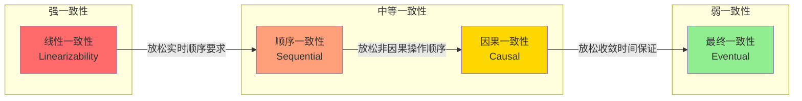
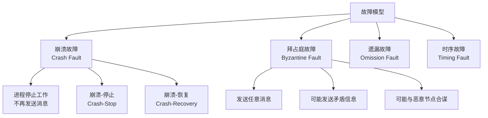
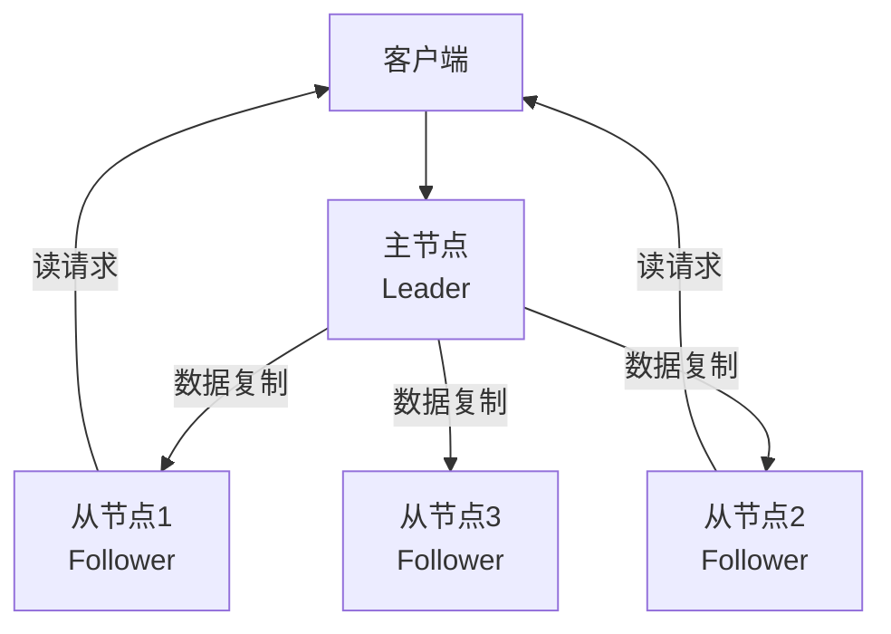
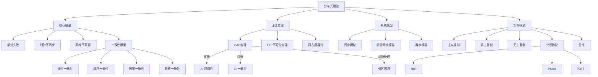

# 分布式系统核心概念

分布式理论是构建可靠、高性能分布式系统的理论基石。从CAP定理到FLP不可能定理，从一致性模型到时钟同步，这些理论揭示了分布式系统的本质约束，指导我们在工程实践中做出正确的设计决策。本节将系统性地梳理分布式系统的核心概念，为后续深入学习奠定基础。

## 1. 什么是分布式系统

### 1.1 经典定义

**Leslie Lamport** 的定义（1978）：

> "分布式系统是一组通过网络通信、协调行为的计算机集合。最令人头疼的特性是：系统中任何你不知道的组件，都可能以你无法想象的方式让你失望。"

**Andrew Tanenbaum** 的定义：

> "分布式系统是一组独立的计算机，它们对用户呈现为一个单一的连贯系统。"

这两个定义从不同角度揭示了分布式系统的本质：

| 维度 | Lamport定义 | Tanenbaum定义 |
|------|-------------|---------------|
| 侧重点 | 系统的脆弱性 | 系统的透明性 |
| 关注对象 | 开发者/运维视角 | 用户视角 |
| 核心警示 | 组件故障不可预测 | 分布细节应被隐藏 |
| 指导方向 | 防御性设计 | 接口抽象设计 |

两者并不矛盾，而是互补的：好的分布式系统既要对用户呈现透明的单一视图，又要对开发者暴露真实的故障可能。正如Martin Kleppmann所言："分布式系统中的错误不是异常，而是常态。"

### 1.2 核心特征

分布式系统具有四个不可分割的本质特征：

**多节点（Multi-node）**：系统由多个独立的计算节点组成，每个节点拥有自己的CPU、内存和本地状态。节点之间通过网络连接，但各自独立运行。这意味着没有任何全局共享内存——每个节点只能看到自己的本地状态，其他节点的状态只能通过通信间接获取。

**消息传递通信（Message Passing）**：节点之间不能直接访问彼此的内存，只能通过发送和接收消息进行通信。这与单机系统中通过共享内存通信有本质区别。消息传递引入了三个根本性的不确定性：消息可能丢失、可能延迟、可能乱序。这三个不确定性是几乎所有分布式系统问题的根源。

**协调机制（Coordination）**：多个节点需要协调行为以完成共同目标。协调的方式多种多样——从简单的主从复制到复杂的共识协议。协调的开销是分布式系统性能的主要瓶颈之一。以Raft协议为例，每次写入至少需要一次网络往返（leader → follower → leader），这意味着写延迟至少是单次网络延迟的两倍。

**透明性（Transparency）**：系统对用户隐藏分布式的复杂性。理想的分布式系统让用户感觉不到数据分布在多台机器上。ACM定义了八种透明性类型：

| 透明性类型 | 含义 | 实现难度 | 典型技术 |
|-----------|------|---------|---------|
| 访问透明性 | 本地/远程访问方式相同 | 中 | RPC、gRPC、REST |
| 位置透明性 | 资源位置对用户不可见 | 中 | 服务发现、DNS |
| 并发透明性 | 多用户并发访问不冲突 | 高 | 事务、锁、MVCC |
| 复制透明性 | 多副本对用户不可见 | 高 | 数据复制协议 |
| 故障透明性 | 系统自动处理故障 | 极高 | 故障检测、自动恢复 |
| 迁移透明性 | 资源可透明迁移 | 高 | 虚拟化、容器编排 |
| 扩展透明性 | 系统可透明扩展 | 高 | 分片、负载均衡 |
| 性能透明性 | 负载变化不影响性能 | 极高 | 弹性伸缩、缓存 |

实际系统很少能同时实现所有透明性。例如，Spanner提供了位置透明性（客户端不需要知道数据在哪台机器上），但在性能透明性上做了妥协——跨地域写入的延迟明显高于同地域写入。

### 1.3 为什么需要分布式系统

分布式系统的出现并非技术炫耀，而是被实际需求驱动的：

**扩展性需求**：单台机器的计算能力、存储容量、网络带宽都有物理上限。以CPU为例，单台服务器通常有几十到上百个核心，而Google的BigQuery每天需要处理的数据量达到PB级别，需要数千台机器协同工作。当数据量超过单机磁盘容量（通常几TB到几十TB），或请求量超过单机网络带宽（通常10-25Gbps）时，单机方案不再可行。

**可用性需求**：单机系统存在单点故障（Single Point of Failure）。即使是最可靠的硬件，MTBF（平均无故障时间）也在几万到几十万小时之间。以硬盘为例，Backblaze的年度故障率约为1-5%。通过多副本和故障转移，分布式系统可以实现"永不宕机"的目标。例如，Amazon DynamoDB通过跨三个可用区的六副本设计，实现了99.999%的可用性。

**地理分布需求**：全球化业务需要在多个地理位置部署服务，降低用户访问延迟。CDN（Content Delivery Network）就是典型的地理分布式系统。Cloudflare在全球300+城市部署节点，将静态内容缓存在离用户最近的位置，将首字节时间（TTFB）从数百毫秒降低到几十毫秒。

**成本效益**：大量廉价的商用机器组合使用，在性价比上往往优于少量昂贵的大型机。Google的GFS和MapReduce正是基于这一理念设计的。一台配置了NVMe SSD的商用服务器成本约为几千美元，而一台大型机的成本可能是其数十倍。通过软件层面的冗余和故障恢复，商用机器集群可以达到甚至超过大型机的可靠性。

**组织效率**：大型软件系统的代码量可能达到数千万行（如Google的代码库超过20亿行），需要数千名工程师协作开发。微服务架构将系统拆分为独立的服务，允许不同团队独立开发、部署和扩展，与分布式系统的多节点特征天然契合。

### 1.4 分布式系统的分类

根据不同的维度，分布式系统可以分为以下几类：

| 分类维度 | 类型 | 说明 | 典型代表 |
|---------|------|------|---------|
| 数据存储 | 分布式数据库 | 数据分散存储在多节点 | TiDB, CockroachDB |
| 数据存储 | 分布式文件系统 | 文件数据分散存储 | HDFS, Ceph |
| 数据存储 | 分布式缓存 | 内存中的数据分片 | Redis Cluster |
| 计算框架 | 批处理 | 大规模数据离线处理 | Hadoop MapReduce, Spark |
| 计算框架 | 流处理 | 实时数据流处理 | Flink, Kafka Streams |
| 服务架构 | 微服务 | 服务拆分独立部署 | Spring Cloud, Istio |
| 服务架构 | Serverless | 无服务器计算 | AWS Lambda, Cloudflare Workers |
| 共识系统 | 分布式协调 | 服务发现、配置管理 | ZooKeeper, etcd |

## 2. 分布式计算的八大谬误

Peter Deutsch在1974年提出了"分布式计算的七大谬误"（The Seven Fallacies of Distributed Computing），James Gosling后来补充了第八条。这八条谬误是设计分布式系统时最常见的思维陷阱。即使在今天，它们依然是导致分布式系统故障的主要原因。

### 2.1 谬误一：网络是可靠的（The Network is Reliable）

**现实**：网络是不可靠的。TCP连接会断开，交换机会故障，光纤会被挖断。Amazon的S3在2017年经历了长达4小时的宕机，影响了大量依赖S3的互联网服务。Cloudflare在2019年的全球性故障中，由于一个正则表达式导致的CPU耗尽，造成了大规模服务中断。

**工程教训**：

- 所有网络调用都必须考虑超时、重试和降级策略
- 关键数据传输需要确认机制（ACK）和消息持久化
- 设计断路器（Circuit Breaker）模式防止级联故障
- 实现优雅降级：当核心服务不可用时，提供降级后的功能（如缓存数据、默认值）

```go
// 断路器模式示例（伪代码）
type CircuitBreaker struct {
    failureCount  int
    threshold     int           // 失败阈值
    resetTimeout  time.Duration // 重置超时
    state         State         // CLOSED / OPEN / HALF_OPEN
}

func (cb *CircuitBreaker) Call(fn func() error) error {
    if cb.state == OPEN {
        // 快速失败，不执行实际调用
        return ErrCircuitOpen
    }

    err := fn()
    if err != nil {
        cb.failureCount++
        if cb.failureCount >= cb.threshold {
            cb.state = OPEN
            go cb.scheduleReset() // 延迟后尝试恢复
        }
        return err
    }

    cb.failureCount = 0
    cb.state = CLOSED
    return nil
}
```

### 2.2 谬误二：延迟为零（Latency is Zero）

**现实**：网络延迟无处不在，且不可忽略。光在真空中的传播速度约为30万公里/秒，在光纤中约为20万公里/秒。从北京到纽约的光缆延迟约为70ms往返，这还不包括路由转发和协议处理的时间。

**延迟的真实来源**：

| 延迟来源 | 典型值 | 说明 |
|---------|--------|------|
| 光传播延迟 | 0.5-70ms | 取决于物理距离，北京到上海约15ms |
| 路由转发延迟 | 0.1-5ms | 每个路由器约0.1ms |
| 协议栈处理 | 0.01-0.1ms | TCP/IP协议栈开销 |
| 操作系统调度 | 0.01-1ms | 内核态/用户态切换 |
| 应用处理 | 1-100ms | 取决于业务逻辑复杂度 |
| 序列化/反序列化 | 0.01-5ms | 取决于数据大小和格式 |

**工程教训**：

- 批量操作减少网络往返次数（如Redis的pipeline、数据库的batch insert）
- 尽量在数据所在位置计算（移动计算而非移动数据），Hadoop的MapReduce正是这一思想的体现
- 使用异步通信减少延迟对吞吐量的影响
- 预取（Prefetch）和缓存（Cache）减少重复的网络调用

### 2.3 谬误三：带宽是无限的（Bandwidth is Infinite）

**现实**：带宽是有限的，且在多租户环境中存在竞争。网络拥塞会导致丢包、重传和延迟增加。即使在数据中心内部，当多台机器同时发送大文件时，带宽竞争也会显著影响性能。

**工程教训**：

- 压缩数据减少传输量（如gzip、zstd）
- 设计合理的序列化格式：Protocol Buffers的体积通常是JSON的1/3到1/10，序列化/反序列化速度快5-10倍
- 使用流式传输处理大数据集，避免一次性加载（如Kafka的消费模式、HTTP/2的流式响应）
- 考虑数据局部性：将经常一起访问的数据放在一起

### 2.4 谬误四：网络是安全的（The Network is Secure）

**现实**：网络充满安全威胁——中间人攻击、DNS劫持、DDoS攻击、数据窃听。即使是内网环境也并非绝对安全。2020年的SolarWinds供应链攻击证明，即使是高度受控的网络环境也可能被渗透。

**工程教训**：

- 所有通信使用TLS加密（包括内部服务之间的通信）
- 实施身份认证和授权机制（mTLS、JWT、OAuth2）
- 零信任架构：不假设任何网络边界是安全的，每次请求都需验证
- 敏感数据加密存储，密钥通过KMS管理

### 2.5 谬误五：拓扑不会变化（Topology Doesn't Change）

**现实**：网络拓扑在不断变化。服务器可能被迁移，IP地址可能变化，负载均衡器可能切换后端，容器可能漂移到不同节点。在Kubernetes集群中，Pod的IP地址在每次重启后都会变化。

**工程教训**：

- 使用服务发现机制（Consul、etcd、Kubernetes Service）而非硬编码地址
- 设计对拓扑变化不敏感的应用（无状态设计）
- DNS轮询和健康检查配合使用
- 客户端负载均衡器（如gRPC的负载均衡）比集中式负载均衡器更适应拓扑变化

### 2.6 谬误六：只有一个管理员（There is One Administrator）

**现实**：大型系统往往涉及多个团队、多个组织、多个云服务商。不同团队的运维策略、监控标准、故障处理流程可能完全不同。微服务架构中，每个服务可能由不同的团队负责，拥有独立的部署流程和SLA。

**工程教训**：

- 设计明确的服务边界和责任矩阵（RACI矩阵）
- 使用标准化的监控和告警体系（Prometheus + Grafana统一监控）
- 建立跨团队的故障响应流程（On-call轮值、升级机制）
- API契约明确化（OpenAPI规范、Proto文件）

### 2.7 谬误七：传输成本为零（Transport Cost is Zero）

**现实**：数据传输有成本——网络带宽计费（云服务商按出站流量收费）、序列化/反序列化的CPU开销、内存中数据复制的成本。AWS的数据传出费用为$0.09/GB，大规模数据传输的费用可能相当可观。

**工程教训**：

- 优化数据传输格式，减少冗余字段
- 考虑数据的序列化效率（Protobuf > Thrift > JSON）
- 在数据源附近进行聚合和过滤，减少传输量
- 使用压缩算法平衡CPU开销和带宽节省

### 2.8 谬误八：网络是同构的（The Network is Homogeneous）

**现实**：生产环境中的网络设备来自不同厂商，运行不同版本的协议栈。IPv4和IPv6共存，不同OS的TCP实现有细微差异。容器网络（overlay network）和物理网络的性能特征也不同。

**工程教训**：

- 在多种网络环境下进行充分测试
- 避免依赖特定平台的网络行为
- 使用成熟的、经过验证的网络库
- 实施网络监控，及时发现异常

## 3. 分布式系统的三大核心挑战

### 3.1 部分失败（Partial Failure）

这是分布式系统最根本的挑战。在单机系统中，程序要么正常工作，要么完全失败——行为是确定性的。但在分布式系统中，系统的整体状态是由多个独立组件的状态组合而成，而这些组件可能处于不同的健康状态。

**部分失败的特征**：

- 系统中部分节点正常工作，部分节点可能已经失败
- 无法区分"节点故障"和"节点响应慢"——这是FLP不可能定理的现实基础
- 失败是非确定性的，无法预测哪个节点会在何时出错
- 故障可能仅在特定条件下触发（如高负载、网络拥塞、特定时间点）
- 部分失败可能持续很长时间，直到运维人员发现并介入

**部分失败的后果**：

- 数据不一致：部分副本更新成功，部分失败，导致数据分裂
- 状态不确定：系统不知道某个操作是否成功（如：扣款是否到账？）
- 级联故障（Cascading Failure）：一个节点的故障可能导致依赖它的其他节点连锁失败，形成雪崩效应

**应对策略**：

- **超时机制**：为所有远程调用设置合理的超时时间。超时时间的设定需要权衡：太短会导致正常请求被误判为失败，太长会导致故障检测延迟。通常建议设置为P99延迟的2-3倍。
- **重试策略**：指数退避+抖动（Exponential Backoff + Jitter）。指数退避避免重试风暴，抖动避免多个客户端同时重试导致的"惊群效应"。
- **幂等设计**：确保重复执行不会产生副作用。关键操作需要生成唯一的请求ID，服务端根据ID去重。例如，支付系统通常使用幂等键（idempotency key）防止重复扣款。
- **熔断器模式**：快速失败，防止级联故障。当失败率超过阈值时，熔断器打开，后续请求直接返回错误，不实际调用远端服务。一段时间后进入半开状态，尝试少量请求探测服务恢复情况。

### 3.2 时钟不同步（Clock Skew）

物理时钟是分布式系统中另一个核心挑战。即使使用NTP同步，不同机器之间的时钟仍然存在毫秒级甚至秒级的偏差。

**时钟漂移的根源**：

- 石英晶体振荡器的频率误差（通常±10-100ppm），即每秒偏差10-100微秒
- 温度变化影响振荡频率：温度每变化1°C，频率可能变化约0.035ppm
- 电压波动导致时钟不稳定
- 操作系统调度延迟：NTP同步需要进程调度来更新时钟，调度延迟会引入额外误差

**时钟漂移的量级**：

- 普通服务器：每秒漂移约0.1-1毫秒
- 一天累积漂移：约8.6-86秒（不进行NTP同步的情况下）
- NTP同步后残余误差：通常<1毫秒（局域网）、1-50毫秒（广域网）
- GPS时钟精度：约10-100纳秒

**时钟不同步导致的问题**：

- 无法可靠地通过物理时间戳判断事件顺序：如果A的时钟比B快100ms，A在t=100记录的事件实际上可能发生在B记录的t=99之前
- 基于超时的故障检测可能误判：如果检测者时钟快，被检测者时钟慢，可能导致误判为故障
- 分布式锁的续约时间可能出现问题：锁的过期时间基于本地时钟计算，但锁的实际持有者可能使用不同的时钟
- 日志分析时事件排序混乱：来自不同机器的日志无法直接按时间戳排序
- 分布式事务的时间戳排序错误

**应对方案**：

| 方案 | 精度 | 适用场景 | 代表实现 | 复杂度 |
|------|------|---------|---------|-------|
| NTP同步 | 1-50ms | 一般业务 | chrony, ntpd | 低 |
| PTP（IEEE 1588） | <1μs | 金融交易 | LinuxPTP | 中 |
| 逻辑时钟 | 无漂移 | 事件排序 | Lamport时钟 | 低 |
| 向量时钟 | 无漂移 | 因果关系追踪 | Dynamo | 中 |
| 混合逻辑时钟 | <1ms误差 | 兼顾物理时间 | CockroachDB HLC | 中 |
| TrueTime | <7ms误差 | 强一致系统 | Google Spanner | 高 |

**Lamport时钟的工作原理**：

Lamport时钟是一种逻辑时钟，不依赖物理时钟，仅通过消息传递维护事件的偏序关系。规则如下：
1. 每个进程维护一个本地计数器，初始值为0
2. 每次本地事件发生时，计数器加1
3. 发送消息时，将当前计数器值附带在消息中
4. 接收消息时，将本地计数器更新为max(本地计数器, 消息计数器) + 1

```python
class LamportClock:
    def __init__(self):
        self.time = 0

    def local_event(self):
        self.time += 1
        return self.time

    def send_time(self):
        return self.time

    def receive_time(self, msg_time):
        self.time = max(self.time, msg_time) + 1
        return self.time
```

Lamport时钟的局限：它只能保证如果A因果先于B，则L(A) < L(B)，但反过来不成立——L(A) < L(B)不代表A因果先于B。向量时钟解决了这个限制，但代价是每个节点需要维护一个与节点数量等长的向量。

### 3.3 网络不可靠（Network Unreliability）

网络是分布式系统中最不可靠的组件。网络不可靠不仅仅是"偶尔丢包"这么简单，它有多种表现形式：

**消息丢失**：即使使用TCP，连接断开时未发送的数据也会丢失。UDP场景下丢包更常见。网络设备的缓冲区溢出也会导致丢包。在极端情况下，TCP的重传机制可能导致消息延迟送达，看起来像是"延迟"而非"丢失"。

**消息延迟**：延迟没有上限（在异步系统模型中）。一条消息可能在毫秒级送达，也可能在秒级甚至分钟级送达。网络拥塞、路由重收敛、TCP重传都会导致延迟增加。在云环境中，虚拟化层的调度也可能引入额外的延迟抖动。

**消息乱序**：多路径路由可能导致消息以非发送顺序到达。即使使用TCP保证单连接内的有序性，跨连接的消息仍然可能乱序。在使用连接池的场景中，同一个客户端的两个请求可能被路由到不同的连接，从而以乱序到达服务端。

**网络分区（Network Partition）**：网络被分割成多个互不连通的子集。分区期间，不同子集中的节点无法通信，但各自可能仍在接受外部请求。这是CAP定理中P（Partition Tolerance）的现实基础。网络分区的原因可能包括：交换机故障、光纤被挖断、防火墙规则变更、路由器配置错误。

**脑裂（Split Brain）**：网络分区恢复后，可能出现多个"主节点"同时运行的情况，导致数据不一致。脑裂是分布式系统中最危险的故障之一，可能导致数据覆盖和丢失。常见的防脑裂机制包括：Fencing Token（隔离令牌）、Quorum机制、Watchdog Timer。

**幽灵消息（Gray Failures）**：网络可能出现部分故障——某些节点之间的通信正常，某些节点之间的通信异常，但不满足严格的分区定义。这种灰度故障比完全分区更难检测和处理。

## 4. CAP定理：分布式系统的基本权衡

### 4.1 定义与证明

Eric Brewer在2000年提出CAP猜想，Seth Gilbert和Nancy Lynch在2002年给出形式化证明。

**三个属性**：

- **一致性（Consistency）**：所有节点在同一时刻看到相同的数据（线性一致性）
- **可用性（Availability）**：每个请求都能收到非错误的响应（不保证是最新数据）
- **分区容忍性（Partition Tolerance）**：系统在网络分区时仍能继续工作

**CAP定理的核心结论**：在网络分区发生时，系统只能在一致性和可用性之间选择其一。

证明思路（反证法）：

假设存在一个系统同时满足C、A、P。
考虑两个节点N1和N2，它们之间发生网络分区。
  - 客户端W向N1写入数据v1
  - 客户端R从N2读取数据

由于网络分区，N2无法收到N1的写入。
情况1：N2返回旧数据v0 → 违反一致性（C）
情况2：N2返回错误或超时 → 违反可用性（A）

因此，C、A、P不能同时满足。 ∎

### 4.2 PACELC扩展

Daniel Abadi在2012年提出PACELC定理，扩展了CAP框架：

PACELC：
If Partition (P) occurs:
  Choose between Availability (A) and Consistency (C)
Else (E):
  Choose between Latency (L) and Consistency (C)

PACELC告诉我们：即使在没有分区的正常运行时，系统也面临延迟和一致性的权衡。这比CAP更全面——CAP只讨论了分区场景，而PACELC还考虑了正常运行时的设计选择。

**实际系统的PACELC分类**：

| 系统 | P→A/C | E→L/C | 设计理念 | 具体实现方式 |
|------|-------|-------|---------|-------------|
| DynamoDB | PA | EL | 高可用+低延迟优先 | 最终一致性+quorum读写 |
| Cassandra | PA | EL | 高可用+低延迟优先 | 可调一致性级别（ONE/QUORUM/ALL） |
| MongoDB | PC | EC | 强一致优先 | WiredTiger + 副本集 |
| HBase | PC | EC | 强一致优先 | 基于ZooKeeper的强一致 |
| Spanner | PC | EC | 强一致优先 | TrueTime + Paxos |
| CockroachDB | PC | EC | 强一致优先 | Raft + HLC |
| etcd | PC | EC | 强一致优先 | Raft共识协议 |
| Redis Cluster | PA | EL | 高可用+低延迟优先 | 异步复制 + 最终一致 |

### 4.3 CAP的实际影响

**CA系统（理论上的CA）**：

- 单机数据库可以视为CA（无分区，满足C和A）
- 分布式系统中网络分区不可避免，不存在真正的CA系统
- "CA"通常意味着：网络分区时停止服务，以此保证一致性
- 实际中，CA系统可以理解为"在网络不可用时宁可不可用也要保持一致"

**CP系统**：

- 网络分区时牺牲可用性，保证一致性
- 适用场景：银行转账、库存扣减、分布式锁、配置管理
- 典型系统：ZooKeeper、etcd、HBase、Spanner、etcd
- CP系统在网络分区时，少数派分区中的节点无法提供服务

**AP系统**：

- 网络分区时牺牲一致性，保证可用性
- 适用场景：社交动态、DNS解析、CDN缓存、用户行为日志
- 典型系统：Cassandra、DynamoDB、CouchDB、Couchbase
- AP系统在网络分区时，所有分区中的节点都可以提供服务，但可能返回旧数据

**重要澄清**：

- CAP中的C是线性一致性（Linearizability），不是ACID中的C——这个区别极其重要
- CAP中的A是整个系统的可用性，不是单个节点的可用性——系统整体可用即可
- 大多数实际系统在CAP光谱上的某个位置，不是简单的非此即彼——可以通过配置调整
- 网络分区是短暂事件，系统在分区恢复后可以进行数据修复——分区不是永久的
- CAP定理是分布式系统的理论约束，但实际设计时还需要考虑延迟、吞吐量、持久性等更多因素

### 4.4 为什么CAP不够用：BASE理论

由于CAP定理过于简化（只关注分区场景），实际系统设计中更多采用BASE理论作为指导：

- **Basically Available（基本可用）**：系统在出现故障时，允许损失部分可用性（如响应时间变长、部分功能不可用），但核心功能仍可使用
- **Soft State（软状态）**：允许系统存在中间状态，且中间状态不影响系统整体可用性
- **Eventually Consistent（最终一致）**：系统保证在没有新写入的情况下，所有副本最终会收敛到相同值

BASE理论的核心思想是：与其追求强一致性带来的高延迟和低可用性，不如接受短暂的不一致，换取更好的用户体验和系统性能。

## 5. 一致性模型光谱

一致性模型定义了分布式系统中数据可见性的保证级别。从强到弱，形成一个完整的光谱。选择合适的一致性模型是分布式系统设计中最关键的决策之一。

### 5.1 一致性模型总览



### 5.2 线性一致性（Linearizability）

**最强的一致性模型**，也称为原子一致性（Atomic Consistency）或外部一致性（External Consistency）。

**定义**：所有操作看起来像是在某个单一的全局时间点上原子执行的，且这个时间点在操作的实际执行时间范围内。

**核心要求**：

- 存在操作的线性化点（Linearization Point）——每个操作都有一个精确的时刻，从这一刻起操作的效果可见
- 所有操作的线性化点构成全序——任意两个操作都能确定先后顺序
- 线性化点的顺序与操作的实时顺序一致——如果操作A完成时操作B才开始，那么A的线性化点一定在B之前
- 每个读操作返回最近一次写操作的值

**示例**：

时间线：
客户端A: |---write(x,1)---|
客户端B:        |---read(x)---|
客户端C:              |---read(x)---|

线性一致的执行：
  write(x,1) 的线性化点在 t1
  B的read(x)线性化点在 t2 > t1，返回 1
  C的read(x)线性化点在 t3 > t1，返回 1

非线性一致的执行（违反）：
  B的read(x)返回0（在write之前）
  C的read(x)返回1
  → B和C看到的不是同一个"最新"值

**实现代价**：需要全局协调（共识协议），延迟高（至少一个RTT），吞吐量受限于最慢的节点。在Raft协议中，每次写入需要leader将日志复制到多数节点后才返回成功，这意味着写延迟至少是到最远多数节点的网络延迟。

**典型实现**：Raft、Paxos、Spanner、etcd、ZooKeeper（zab）。

**何时选择线性一致性**：涉及资金操作（转账、支付）、库存管理（防止超卖）、分布式锁（确保互斥）等场景。在这些场景中，任何不一致都可能导致严重的业务损失。

### 5.3 顺序一致性（Sequential Consistency）

**定义**（Lamport, 1979）：所有进程的操作看起来像是按照某个全局顺序执行的，且每个进程内的操作顺序与程序顺序一致。

**与线性一致性的区别**：顺序一致性不要求操作顺序与实时顺序一致。只要存在某个合法的全局顺序能解释所有操作的结果即可。例如，如果进程P1执行了A然后B，进程P2执行了C然后D，那么只要全局顺序中A在B之前、C在D之前，就是顺序一致的——即使A和C的实时顺序与全局顺序不一致。

**典型实现**：多数数据库的主从复制、Zab协议（ZooKeeper）。ZooKeeper保证顺序一致性，但不保证线性一致性——在leader切换后，旧leader可能提交的未复制操作会被丢弃。

**实际应用**：MySQL的异步复制提供顺序一致性保证——slave按照relay log中的顺序执行操作，保证了操作的相对顺序。

### 5.4 因果一致性（Causal Consistency）

**定义**：如果操作之间存在因果关系，所有节点看到的这些操作的顺序是一致的。没有因果关系的操作可以以任意顺序出现。

**因果关系的定义**：

- 程序顺序：同一进程内，操作A在操作B之前执行，则A因果先于B
- 读写依赖：操作A写入值v，操作B读取了v，则A因果先于B
- 传递性：如果A因果先于B，B因果先于C，则A因果先于C

**实现机制——向量时钟**：向量时钟是实现因果一致性的关键技术。每个节点维护一个向量（数组），长度等于节点数量。每个节点在自己的维度上递增计数器，通过消息传递同步向量时钟，从而追踪因果关系。

向量时钟示例（3个节点A/B/C）：
初始状态：  A:[0,0,0]  B:[0,0,0]  C:[0,0,0]

A写入数据：  A:[1,0,0]
A发送消息给B（附带向量时钟[1,0,0]）：
B收到后更新：B:[1,1,0]
B发送消息给C（附带向量时钟[1,1,0]）：
C收到后更新：C:[1,1,1]

判断因果关系：
  事件X的向量时钟为[1,0,0]，事件Y的向量时钟为[1,1,0]
  因为X在所有维度上 ≤ Y，且至少一个维度严格小于Y
  所以X因果先于Y

**典型实现**：COPS、Eiger、会话一致性。Facebook的TAO系统使用因果一致性来保证社交图谱的一致性视图。

### 5.5 最终一致性（Eventual Consistency）

**定义**：如果没有新的写入，最终所有副本都会收敛到相同的值。

**核心特点**：

- 不保证收敛时间——可能是毫秒，也可能是分钟甚至更长
- 不保证读取的是最新值——可能读到旧数据
- 不保证所有节点同时看到相同的值——不同节点可能在同一时刻看到不同的值
- 不保证收敛的方向——如果两个副本同时被写入不同值，需要冲突解决机制

**最终一致性的变体**：

| 变体 | 保证 | 典型应用 | 实现难度 |
|------|------|---------|---------|
| 读己之写（Read-Your-Writes） | 用户总能看到自己写入的数据 | 用户编辑个人资料 | 中 |
| 单调读（Monotonic Reads） | 用户不会看到数据"回退" | 新闻Feed流 | 中 |
| 写后读（Writes-Follow-Reads） | 写入基于之前读取的数据 | 评论系统 | 中 |
| 前缀一致（Prefix Consistency） | 所有节点看到操作前缀相同 | 日志分析 | 低 |
| 有界陈旧（Bounded Staleness） | 读取的数据最多陈旧K次写或T秒 | 排行榜、统计 | 中 |

**典型实现**：DNS、Cassandra、DynamoDB、CDN缓存、Redis（异步复制模式）。

### 5.6 一致性模型选择指南

| 应用场景 | 推荐一致性 | 原因 | 可接受的妥协 |
|---------|-----------|------|-------------|
| 金融交易 | 线性一致性 | 资金操作不能出错 | 高延迟、低吞吐 |
| 库存管理 | 线性一致性 | 避免超卖 | 高延迟 |
| 分布式锁 | 线性一致性 | 锁的正确性至关重要 | 高延迟 |
| 社交动态 | 因果一致性 | 保持对话的因果顺序 | 非因果操作可能乱序 |
| 用户资料编辑 | 读己之写一致性 | 用户能看到自己的修改 | 其他用户可能短暂看到旧数据 |
| 新闻Feed | 单调读一致性 | 不应看到"旧"的已读内容 | 可能短暂显示旧数据 |
| DNS解析 | 最终一致性 | 短暂不一致可接受 | TTL内可能返回旧IP |
| 缓存 | 最终一致性 | 高性能优先 | 缓存可能与源数据不一致 |
| 排行榜 | 有界陈旧 | 排名不需要实时精确 | 最多陈旧几秒 |
| 日志收集 | 前缀一致 | 日志顺序正确即可 | 非前缀操作可能乱序 |

## 6. FLP不可能定理：共识的根本限制

### 6.1 定理陈述

Fischer、Lynch和Paterson在1985年证明的FLP不可能定理是分布式系统理论中最重要的结果之一，也是图灵奖级别的贡献。

**定理**：在一个异步系统中，即使只有一个进程可能发生崩溃故障，也不存在一个确定性算法能同时满足以下三个条件：

在异步系统中，如果至少有一个进程可能崩溃，
则不存在一个确定性的共识算法同时满足：
1. 终止性（Termination）：所有正确的进程最终决定一个值
2. 一致性（Agreement）：所有正确的进程决定相同的值
3. 有效性（Validity）：决定的值是某个进程的输入值

### 6.2 直觉理解

FLP定理的核心洞察非常简洁但深刻：

- 异步系统无法区分"进程很慢"和"进程崩溃"——这是关键的不可区分性
- 如果进程P崩溃了，其他进程不确定P是慢还是真的崩溃
- 如果等待P，可能永远等不到（活性问题）
- 如果不等待P，可能错过P的输入（安全性问题）

用一个类比来理解：想象一群人通过书信讨论投票结果，但邮递员可能把信件延迟很久甚至丢失。如果你在某个时刻宣布结果，你无法确定还没回复的人是投了反对票、还是信还在路上、还是根本没寄出。

这意味着在纯粹的异步模型中，任何共识算法都可能被"恰好合适"的故障和延迟模式阻止终止。这里的"恰好合适"不是说这种情况一定会发生，而是说算法无法排除这种可能性。

### 6.3 工程意义

FLP定理并不意味着共识问题无法解决。它告诉我们如何绕过限制：

**方式一：部分同步模型**。假设消息最终会被送达（GST——Global Stabilization Time假设）。Raft和Paxos都基于此假设，使用超时机制检测故障。在部分同步模型中，系统最终会进入同步阶段，共识算法可以在这一阶段完成决策。

**方式二：随机化算法**。通过随机选择打破对称性。Ben-Or算法（1983）使用随机数实现了概率性终止。Avalanche共识协议也采用了类似的随机抽样机制。随机化算法在每次运行中有正概率失败，但重复运行后失败概率指数级下降。

**方式三：故障检测器**。引入故障检测器（Failure Detector），将部分同步假设具体化。可靠的故障检测器可以满足FLP限制外的额外条件。Chandra和Toueg（1996）证明了不可靠的故障检测器也能用于构建共识算法。

**方式四：实用妥协**。大多数实际系统使用超时+重试的方式，在实践中足够可靠，虽然理论上不能保证终止。如果超时时间设置合理（远大于正常网络延迟），算法几乎总能终止。

### 6.4 实际系统的应对

| 系统 | 应对策略 | 停机时间目标 | 理论保证 |
|------|---------|-------------|---------|
| Raft（etcd） | 超时+领导者选举 | <1秒 | 部分同步下保证终止 |
| Paxos（Spanner） | 部分同步+GPS时钟 | <10秒 | 部分同步下保证终止 |
| PBFT | 视图切换 | <10秒 | f<n/3时保证安全和活性 |
| Bitcoin PoW | 概率性最终确认 | ~60分钟 | 概率性安全（不保证终止） |
| Avalanche | 随机抽样+亚稳态 | <2秒 | 概率性终止 |
| HotStuff | 线性通信复杂度 | <1秒 | 部分同步下保证终止 |

## 7. 故障模型：理解系统的失败方式

### 7.1 故障分类



**崩溃故障（Crash Fault）**：进程停止工作，不再发送消息。这是最简单的故障模型。崩溃-停止（Crash-Stop）假设故障后不再恢复；崩溃-恢复（Crash-Recovery）假设进程可能在崩溃后带着持久化状态恢复。Raft、Paxos等共识协议专门处理这种故障。崩溃-恢复模型需要考虑持久化存储的可靠性——如果磁盘损坏，恢复后的状态可能不完整。

**拜占庭故障（Byzantine Fault）**：进程可能发送任意消息，包括矛盾信息、错误数据，甚至可能与其他恶意节点合谋。这是最复杂的故障模型，常见于区块链和安全关键系统。拜占庭故障的名字来源于"拜占庭将军问题"（Byzantine Generals Problem），由Lamport、Shostak和Pease在1982年提出。

**遗漏故障（Omission Fault）**：进程可能遗漏发送或接收某些消息，但执行的计算是正确的。比崩溃故障稍宽松，比拜占庭故障简单。在实际系统中，网络丢包就是一种典型的遗漏故障。

**时序故障（Timing Fault）**：进程可能以非预期的速率执行——过快或过慢。在同步系统模型中，时序故障可以通过时间边界检测；在异步模型中，时序故障无法与崩溃故障区分。在实际系统中，GC暂停（Stop-the-World GC）就是一种典型的时序故障——JVM在GC期间会暂停所有应用线程，持续时间可能从几毫秒到几秒。

### 7.2 网络模型

| 网络模型 | 消息传递假设 | 适用场景 | 典型系统 |
|---------|-------------|---------|---------|
| 同步模型 | 消息在已知时间内送达 | 实时系统、硬实时约束 | 航空电子系统 |
| 部分同步模型 | 消息最终送达（GST之后） | 大多数实际系统 | etcd, Spanner |
| 异步模型 | 消息延迟无上限 | 理论分析、FLP定理 | 纯理论模型 |

**部分同步模型的GST假设**：GST（Global Stabilization Time）是一个未知的时刻，在此之后，所有消息都在已知的有限时间内送达。关键在于：GST的具体值是未知的，算法不能依赖它，但算法可以假设它最终会到来。这正是Raft和Paxos等算法的基础——它们在GST之后可以保证终止。

### 7.3 容错能力

容错能力决定了系统能容忍多少个故障节点而不失去正确性。这是分布式系统设计中最基本的约束条件。

**崩溃故障的容错——多数派机制**：

对于崩溃故障，需要 2f+1 个节点来容忍 f 个故障节点。这个公式的推导基于一个核心原则：任何决策必须由多数派（quorum）做出。

推导过程：
设系统有 N 个节点，需要容忍 f 个崩溃节点。
存活节点数 = N - f
要保证任何两个多数派有交集（quorum intersection）：
  多数派大小 = ⌊N/2⌋ + 1
  存活节点数 ≥ 多数派大小
  N - f ≥ ⌊N/2⌋ + 1

当N = 2f+1时：
  存活节点 = 2f+1 - f = f+1
  多数派大小 = f+1
  存活节点恰好满足多数派要求 ∎

示例：
  3节点系统 → 容忍1个故障（2×1+1=3）
  5节点系统 → 容忍2个故障（2×2+1=5）
  7节点系统 → 容忍3个故障（2×3+1=7）

**拜占庭故障的容错——Byzantine Quorum**：

对于拜占庭故障，需要 3f+1 个节点来容忍 f 个故障节点。这是因为拜占庭节点可能发送矛盾信息——它告诉一部分节点"我同意"，告诉另一部分节点"我反对"。因此需要更大的冗余来保证诚实节点能达成一致。

推导过程：
设系统有 N 个节点，其中 f 个可能是拜占庭节点（恶意的）。
诚实节点数 = N - f

两个不同的诚实节点可能从不同的拜占庭节点收到矛盾信息，
因此需要保证：任意两个诚实节点的"信息源"有足够重叠。

对于诚实节点A和B：
  A的信息源 = N - (A收到消息的拜占庭节点数)
  B的信息源 = N - (B收到消息的拜占庭节点数)

  要保证A和B能达成一致：
  (N - f) + (N - f) > N
  2N - 2f > N
  N > 2f
  即 N ≥ 2f + 1

  但这只是必要条件。充分条件需要考虑拜占庭节点的行为：
  拜占庭节点可能向不同节点发送不同消息
  需要：诚实节点能通过投票识别矛盾信息
  N - f > f（诚实节点多于拜占庭节点）
  N > 2f

  再加上quorum交集的要求：
  N ≥ 3f + 1 ∎

示例：
  4节点系统 → 容忍1个拜占庭节点（3×1+1=4）
  7节点系统 → 容忍2个拜占庭节点（3×2+1=7）
  10节点系统 → 容忍3个拜占庭节点（3×3+1=10）

**同步网络下的拜占庭容错**：

在同步网络模型中（消息在已知时间内送达），容错能力可以提升到 2f+1 个节点容忍 f 个拜占庭节点。这是因为同步模型可以检测时序异常——如果一个节点在规定时间内没有响应，可以判定它为故障。DLS算法（Dwork, Lynch, Stockmeyer, 1988）证明了这一点。

**实际系统中的容错设计**：

| 系统 | 故障模型 | 节点数 | 容错数 | 实际配置 |
|------|---------|-------|-------|---------|
| Raft（etcd） | 崩溃 | 3 | 1 | 3节点最常见 |
| Raft（etcd） | 崩溃 | 5 | 2 | 高可用场景 |
| ZooKeeper | 崩溃 | 3/5/7 | 1/2/3 | 通常3或5节点 |
| PBFT | 拜占庭 | 4 | 1 | 联盟链场景 |
| Tendermint | 拜占庭 | 4/7/10 | 1/2/3 | 公链场景 |
| Bitcoin | 拜占庭 | 不限 | 不限 | 算力多数（PoW） |

## 8. 关键性能指标

评估分布式系统的健康状况需要关注以下核心指标。这些指标不仅是运维监控的依据，也是系统设计时的重要考量。

### 8.1 可用性（Availability）

可用性 = 正常运行时间 / 总时间

| 可用性等级 | 年停机时间 | 月停机时间 | 适用场景 |
|-----------|-----------|-----------|---------|
| 99%（2个9） | 3.65天 | 7.3小时 | 内部工具、开发环境 |
| 99.9%（3个9） | 8.76小时 | 43.8分钟 | 普通Web服务 |
| 99.99%（4个9） | 52.6分钟 | 4.38分钟 | 电商、支付、SaaS |
| 99.999%（5个9） | 5.26分钟 | 26.3秒 | 电信、金融核心、医疗 |
| 99.9999%（6个9） | 31.5秒 | 2.63秒 | 航空管制、核电控制 |

**可用性的计算误区**：

- 串联组件：可用性 = A₁ × A₂ × ... × Aₙ（串联越长，可用性越低）
- 并联冗余：可用性 = 1 - (1-A₁) × (1-A₂) × ... × (1-Aₙ)
- 两个99.9%的组件串联：可用性降至99.8%（0.999 × 0.999 = 0.998001）
- 两个99.9%的组件并联：可用性升至99.9999%（1 - 0.001² = 0.999999）

**提高可用性的常见手段**：

| 手段 | 实现方式 | 可用性提升 | 代价 |
|------|---------|-----------|------|
| 多副本 | 主从复制、多主复制 | 显著 | 数据一致性挑战 |
| 故障转移 | 自动检测+切换 | 显著 | 转移期间可能短暂不可用 |
| 负载均衡 | 分散请求到多个实例 | 中等 | 增加系统复杂度 |
| 优雅降级 | 核心功能优先 | 中等 | 非核心功能受损 |
| 预防性维护 | 滚动更新、蓝绿部署 | 中等 | 需要额外的基础设施 |

### 8.2 延迟（Latency）

延迟是请求从发出到收到响应的时间。需要注意的是，延迟不是一个固定值，而是一个分布。

**延迟的关键分位数**：

- P50（中位数）：一半请求在此时间内完成——代表"典型"用户体验
- P95：95%的请求在此时间内完成——代表"较慢"请求的上限
- P99：99%的请求在此时间内完成——代表"尾部"延迟
- P999：99.9%的请求在此时间内完成——代表"极端"尾部延迟

**为什么关注P99而非平均值**：平均延迟会掩盖尾部延迟问题。在高QPS系统中，即使P99只占1%，绝对数量也可能很大。例如，在100万QPS的系统中，P99延迟意味着有1万个请求的延迟超过了P99值。Google的SRE实践建议关注P99和P999。

**延迟的长尾效应**：分布式系统中的延迟通常呈长尾分布。在并行请求场景中（如Google搜索需要查询多个后端服务），整体延迟取决于最慢的那个服务（Tail at Scale）。Brad Calder的论文"Tail at Scale"详细讨论了这个问题和应对策略。

**延迟优化的常见手段**：

| 手段 | 优化效果 | 实现复杂度 | 适用场景 |
|------|---------|-----------|---------|
| 缓存 | 显著（降低90%+延迟） | 低 | 读多写少场景 |
| 批量操作 | 中等（减少RTT次数） | 低 | 写密集场景 |
| 异步处理 | 中等（解耦耗时操作） | 中 | 非实时场景 |
| 数据本地化 | 显著（避免网络延迟） | 高 | 计算密集场景 |
| 预计算 | 显著（空间换时间） | 中 | 查询模式可预测场景 |

### 8.3 吞吐量（Throughput）

单位时间内系统处理的请求数或数据量。常用指标：

- QPS（Queries Per Second）：每秒查询数——适用于读密集型系统
- TPS（Transactions Per Second）：每秒事务数——适用于需要ACID保证的系统
- MB/s：每秒传输的数据量——适用于数据管道和存储系统
- OPS（Operations Per Second）：每秒操作数——适用于缓存和NoSQL系统

**吞吐量与延迟的关系**：吞吐量和延迟并非独立指标。在低负载时，增加并发可以提高吞吐量而不增加延迟；但当系统接近容量上限时，增加并发会导致排队，延迟急剧上升。这个拐点通常出现在系统利用率达到70-80%时。

### 8.4 一致性（Consistency）

一致性是分布式系统特有的指标，衡量数据在不同副本间的一致程度。具体的度量方式取决于选择的一致性模型：

- 线性一致性：所有读操作返回最新写入的值——可以使用类似Jepsen的工具进行验证
- 最终一致性：可以测量复制延迟（从写入到所有副本同步的时间）
- 因果一致性：可以测量因果违规次数

## 9. 分布式系统架构模式

### 9.1 主从复制（Leader-Follower Replication）



所有写请求路由到主节点，主节点将变更复制到从节点。读请求可以由从节点处理以提高读吞吐量。

**数据复制的三种模式**：

| 模式 | 描述 | 一致性 | 性能 | 典型实现 |
|------|------|-------|------|---------|
| 同步复制 | 等待所有从节点确认 | 强 | 低（延迟=最慢从节点） | PostgreSQL同步模式 |
| 半同步复制 | 等待至少一个从节点确认 | 中 | 中 | MySQL半同步复制 |
| 异步复制 | 主节点写入本地即返回 | 弱 | 高 | MySQL异步复制、Redis |

**优点**：实现简单、写入路径单一、适合读多写少场景。

**缺点**：主节点是单点瓶颈（写入扩展受限）、主节点故障需要选举新主（选举期间可能不可用）、复制延迟导致从节点读到旧数据（读己之写问题）。

**故障转移的关键问题**：

- 数据丢失风险：异步复制的主节点故障时，未复制的数据会丢失
- 脑裂风险：原主节点恢复后可能与新主节点同时接受写入
- 选举延迟：故障检测+选举+切换可能需要数秒到数十秒

### 9.2 多主复制（Multi-Leader Replication）

多个节点都可以接受写入，互为主从。适用于多数据中心、多地域部署。

**应用场景**：

- 多数据中心部署：每个数据中心一个主节点，数据中心之间异步复制
- 离线客户端：移动设备在离线时本地写入，上线后同步
- 协作编辑：多个用户同时编辑同一文档

**核心挑战——写冲突解决**：

当两个主节点同时修改同一数据时，需要冲突解决机制：

| 冲突解决策略 | 原理 | 优点 | 缺点 |
|------------|------|------|------|
| Last-Write-Wins（LWW） | 时间戳最新的写入胜出 | 简单、无冲突 | 可能丢失有效写入 |
| 向量时钟 | 追踪因果关系，检测冲突 | 保留冲突信息 | 实现复杂、存储开销大 |
| CRDT | 数据结构保证无冲突合并 | 自动合并、无需协调 | 只支持特定数据类型 |
| 应用层合并 | 自定义冲突解决逻辑 | 灵活 | 开发成本高、容易出错 |

**CRDT（Conflict-free Replicated Data Type）**：一种特殊的数据结构，保证多个副本可以独立更新，无需协调就能自动合并。常见的CRDT包括：G-Counter（只增计数器）、OR-Set（观察删除集合）、LWW-Register（最后写入获胜寄存器）。Redis的CRDB和Riak都支持CRDT。

### 9.3 无主复制（Leaderless Replication）

没有固定的主节点，任何节点都可以接受读写请求。典型的"quorum"机制：N个副本中，写入成功需要W个确认，读取需要R个确认，W + R > N 保证读到最新数据。

**Quorum机制详解**：

设系统有N=3个副本，W=2，R=2：
  W + R = 4 > N = 3 ✓

写入流程：
  客户端向3个副本发送写请求
  收到2个确认即返回成功
  可能有1个副本尚未更新

读取流程：
  客户端从3个副本读取
  收到2个响应后返回（取版本号最高的）
  由于 W + R > N，读取的2个副本中至少有1个包含最新写入

可调一致性级别：
  N=3, W=3, R=1 → 强写弱读（写延迟高，读延迟低）
  N=3, W=1, R=3 → 弱写强读（写延迟低，读延迟高）
  N=3, W=2, R=2 → 平衡配置
  N=3, W=1, R=1 → 最终一致性（最低延迟，最低一致性）

**典型实现**：Amazon Dynamo、Cassandra（可配置一致性级别）、Riak。

**反熵（Anti-entropy）机制**：无主复制系统需要反熵机制来修复副本之间的不一致。常见方式包括：Merkle Tree比较（快速检测差异的范围）、读修复（Read Repair，读取时发现不一致则修复）、反熵读（Read Repair，后台定期修复）。

### 9.4 共识协议（Consensus Protocol）

分布式共识是分布式系统中最核心的问题之一：如何让多个节点就某个值达成一致？

**共识问题的三个属性**：

- **终止性（Termination）**：所有正确的进程最终做出决定——保证系统不会永远等待
- **一致性（Agreement）**：所有正确的进程决定相同的值——保证没有分裂
- **有效性（Validity）**：决定的值是某个进程提出的值——保证决定不是凭空产生

**主要共识算法**：

| 算法 | 年份 | 特点 | 典型应用 | 通信复杂度 |
|------|------|------|---------|-----------|
| Paxos | 1989 | 理论完备但难以实现 | Google Chubby | O(n²) |
| Multi-Paxos | 1998 | 优化连续写入 | Google Spanner | O(n) per batch |
| Raft | 2014 | 易于理解和实现 | etcd, Consul | O(n) |
| Zab | 2008 | 为ZooKeeper设计 | ZooKeeper | O(n) |
| PBFT | 1999 | 拜占庭容错 | 区块链、Hyperledger | O(n²) |
| HotStuff | 2018 | 线性复杂度的BFT | Libra/Diem | O(n) |
| Raft的变体 | - | 针对WAN优化 | CockroachDB | O(n) |

**Raft协议的核心机制**：Raft通过三个子问题来简化共识实现：

1. **领导者选举**：通过随机超时和term机制选举leader，确保最多只有一个leader
2. **日志复制**：leader接收客户端请求，将操作作为日志条目复制到多数节点后提交
3. **安全性保证**：通过选举限制（candidate的日志必须至少和多数节点一样新）保证已提交的日志不会丢失

### 9.5 分片（Sharding）

分片是将数据水平切分到多个节点上的技术，是解决扩展性问题的核心手段。

**分片策略**：

| 策略 | 原理 | 优点 | 缺点 |
|------|------|------|------|
| 哈希分片 | hash(key) % N | 数据分布均匀 | 范围查询困难、扩缩容需rehash |
| 范围分片 | 按key的范围划分 | 支持范围查询 | 容易产生热点 |
| 一致性哈希 | 哈希环+虚拟节点 | 扩缩容影响小 | 实现复杂 |
| 目录分片 | 中心目录维护映射 | 灵活、支持复杂路由 | 目录是单点 |

**分片的关键挑战**：

- 跨分片事务：需要两阶段提交（2PC）或分布式事务协调器
- 热点问题：某些分片的负载远高于其他分片
- 扩缩容：数据迁移需要在线进行，不能中断服务
- 跨分片查询：需要scatter-gather，聚合多个分片的结果

## 10. 分布式快照与全局状态

### 10.1 Chandy-Lamport算法

分布式快照（Distributed Snapshot）是在分布式系统中捕获全局一致状态的经典算法，由Chandy和Lamport在1985年提出。

**核心思想**：通过在通信通道上传递标记消息（Marker），在不中断系统运行的情况下，协调各个进程记录本地状态和通道状态。

**算法步骤详解**：

初始化：
  1. 一个进程（快照发起者）决定开始快照
  2. 该进程记录自己的本地状态
  3. 该进程向所有出站通道发送标记消息（Marker）
  4. 该进程记录该通道的已收到消息为空

接收标记消息时：
  情况A：该进程尚未开始快照
    1. 记录自己的本地状态
    2. 标记该通道为"已记录"
    3. 对于每个出站通道，发送标记消息
    4. 开始记录其他通道的消息

  情况B：该进程已经开始快照
    1. 标记该通道为"已记录"
    2. 将收到标记之前从该通道收到的消息记录为该通道的状态

终止条件：
  所有进程都记录了本地状态
  所有通道都标记为"已记录"

**算法正确性保证**：

快照结果是系统的一致全局状态。直觉上理解：标记消息在通道上传播，就像一道"分界线"。在分界线之前收到的消息被记录为通道状态，之后的消息属于快照之后的世界。由于标记消息的有序性（每个通道最多一个标记），保证了不会出现"看到了未来的消息"的情况。

**实例演示**：

进程A和进程B通过通道连接。

快照发起者A：
  1. A记录本地状态 SA
  2. A向B发送Marker
  3. A开始记录从B收到的消息

B收到Marker之前，B向A发送了消息M：
  1. A收到M，记录M为通道(A<-B)的状态
  2. A收到Marker，标记通道(A<-B)为已记录

B收到Marker后：
  1. B记录本地状态 SB
  2. B标记通道(B<-A)为已记录（B从A收到的第一条消息就是Marker）
  3. B向所有邻居发送Marker

最终快照：{SA, SB, {M}} — 这是系统的一致全局状态

### 10.2 应用场景

- **故障恢复**：保存检查点，故障后从最近的快照恢复，避免从头重放所有操作日志
- **调试与审计**：捕获系统在某一时刻的完整状态，用于问题诊断和合规审计
- **性能分析**：分析快照时刻的系统状态分布，识别资源瓶颈
- **数据库备份**：一致性备份不中断服务（如MySQL的FLUSH TABLES WITH READ LOCK + 快照）
- **流处理检查点**：Flink、Kafka Streams等流处理框架使用分布式快照实现exactly-once语义

## 11. 核心概念关系图

以下思维导图展示了分布式系统核心概念之间的关系：



## 12. 常见误区与纠正

### 误区一：CAP定理意味着系统只能选C或A

**纠正**：CAP定理讨论的是网络分区发生时的权衡。在正常运行时（无分区），系统可以同时保证一致性和可用性。而且CAP中的C是线性一致性，不是ACID中的原子性。大多数实际系统在正常运行时都能同时提供一致性和可用性，只在分区发生时才面临取舍。

### 误区二：最终一致性意味着数据永远不一致

**纠正**：最终一致性保证在没有新写入的情况下，所有副本最终会收敛到相同值。收敛时间取决于复制延迟和网络条件，通常在毫秒到秒级。在实际系统中，可以通过调优复制机制将收敛时间控制在可接受的范围内。

### 误区三：FLP定理意味着共识不可能实现

**纠正**：FLP定理针对的是纯异步模型+确定性算法。实际系统通过引入超时（部分同步假设）、随机化或故障检测器绕过限制。Raft、Paxos在实践中都能可靠地达成共识。FLP定理的真正意义在于告诉我们：共识算法的正确性需要部分同步假设作为前提。

### 误区四：分布式系统比单机系统更可靠

**纠正**：分布式系统的可靠性来自冗余和故障恢复机制，不是来自组件本身更可靠。实际上，分布式系统引入了网络故障、时钟偏差等新的故障模式。分布式系统的可靠性是设计出来的，不是自然产生的。Martin Kleppmann的"设计数据密集型应用"一书中详细讨论了这一点。

### 误区五：只要多数节点存活，系统就能正常工作

**纠正**：多数派存活是共识协议的前提条件，但不是充分条件。还需要：正确的消息传递、及时的故障检测、合理的超时配置。极端的网络延迟或消息丢失可能导致整个系统不可用。例如，如果网络延迟超过了选举超时时间，Raft可能频繁触发领导者选举，导致系统无法正常处理请求。

### 误区六：使用了分布式系统就一定能处理更大的数据量

**纠正**：分布式系统引入了通信开销、协调开销和一致性开销。对于小数据量（通常在GB以下），单机系统的性能可能优于分布式系统。只有当数据量超过单机处理能力，或者需要跨地域部署时，分布式系统的优势才能体现。过早引入分布式会增加不必要的复杂性。

## 13. 本节小结

分布式系统的核心概念构成了理解整个分布式理论体系的基础。掌握这些概念需要理解以下四个维度：

**本质矛盾**：分布式系统在追求一致性、可用性和性能之间存在根本性的权衡。没有完美的解决方案，只有适合特定场景的最佳选择。理解这些矛盾是做出正确设计决策的前提。

**理论约束**：CAP定理、FLP不可能定理等理论成果告诉我们什么是不可能的。理解这些约束不是为了放弃，而是为了在约束条件下找到最优解。正如Dijkstra所说："测试只能证明bug的存在，不能证明bug的不存在。"同样，CAP告诉我们什么是做不到的，帮助我们避免在不可能的方向上浪费精力。

**工程务实**：理论上的"不可能"在工程实践中可以通过合理假设（部分同步模型）和实用妥协（超时+重试）来绕过。重要的不是追求理论上的完美，而是在理解约束的前提下做出正确的工程决策。选择合适的一致性模型、设计合理的故障处理机制、建立有效的监控体系，这些都是工程务实的体现。

**持续演进**：从单机到分布式，从主从到共识，从强一致到最终一致，分布式理论和实践在不断演进。新的硬件（RDMA、NVM、CXL互联）、新的网络技术（5G、卫星互联网）、新的应用场景（边缘计算、联邦学习、机密计算）都在推动分布式理论的发展。保持对新技术和新理论的关注，是分布式系统工程师的持续要求。

掌握本节内容后，建议继续阅读后续章节，深入了解CAP定理的证明细节、各种一致性模型的形式化定义、FLP定理的严格证明，以及主流共识协议（Raft、Paxos）的工作原理。理论与实践的结合，才是掌握分布式系统的正确路径。
