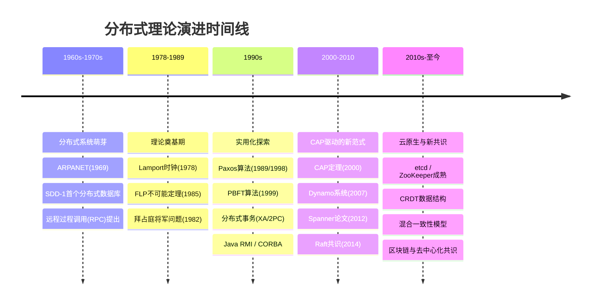
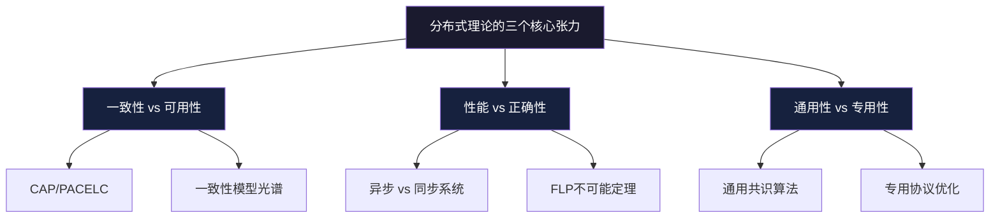

# 分布式理论的技术演进

分布式理论的发展不是一蹴而就的，而是经历了半个多世纪的积累、碰撞和突破。从上世纪60年代ARPANET上最初的实验，到今天支撑全球互联网运转的共识协议和一致性模型，每一次理论突破都深刻改变了工程实践的面貌。理解这条演进脉络，不仅能帮助我们记住关键结论，更能理解这些结论为什么成立、在什么条件下成立、以及它们之间的逻辑关联。

本章不是历史课，而是**工程直觉的来源**。当你理解了每个理论"为什么"被提出、它解决了什么问题、又留下了什么遗憾，你在面对具体的技术选择时就能做出更好的判断。

---

## 一、演进全景：五个时代

这五个时代不是泾渭分明的，而是相互交织的。一个时代的理论突破往往要经过另一个时代的工程实践才能真正落地。下面按时代逐一展开。

---

## 二、萌芽期（1960s-1970s）：分布式系统的诞生

### 2.1 历史背景：冷战催生的网络

1969年，美国国防部高级研究计划局（ARPA）建成了ARPANET——第一个广域分组交换网络。ARPANET最初连接了UCLA、斯坦福研究院、加州大学圣巴巴拉分校和犹他大学四台机器。这个看似简单的网络实验，催生了一个全新的研究领域：分布式计算。

ARPANET的设计初衷是在核打击下保持通信——如果部分节点被摧毁，剩余节点仍能通过其他路径转发数据。这个"生存性"需求，本质上就是分布式系统容错问题的最早工程实践。然而，当时的工程师们很快发现：**建造分布式系统容易，理解分布式系统极难**。

### 2.2 早期探索

**远程过程调用（RPC）的提出**

1971年，Andrew Birrell和Bruce Nelson开始研究远程过程调用的概念，后来在1984年发表经典论文《Implementing Remote Procedure Calls》。RPC的核心思想是让远程调用看起来像本地调用一样自然——调用者不需要知道目标函数是在本地执行还是在远程机器上执行。

这个思想深刻影响了后来的分布式系统设计：

| 时代 | RPC实现 | 特征 |
|------|---------|------|
| 1980s | Sun RPC / ONC RPC | 基于TCP/UDP，IDL（接口定义语言） |
| 1990s | CORBA / Java RMI | 面向对象，类型安全 |
| 2000s | SOAP / WS-* | XML协议，重量级，企业级 |
| 2010s | gRPC / Thrift / Cap'n Proto | Protobuf序列化，HTTP/2，高性能 |

RPC看似简单，却隐藏了一个根本性问题：**网络调用和本地调用的语义根本不同**。本地函数调用要么成功要么失败（确定性的），而远程调用可能因为网络超时而处于"不确定"状态——调用方不知道请求是否到达了服务方、服务方是否执行了、结果是否返回了。这个"三态问题"至今仍是分布式系统设计的核心难题。

**首个分布式数据库：SDD-1**

1976年，Computer Corporation of America开发了SDD-1（System for Distributed Databases），这是世界上第一个分布式关系型数据库。SDD-1已经考虑了数据复制、分布式事务和网络分区等问题，虽然受限于当时的网络条件性能有限，但其设计理念超前。SDD-1采用"数据独立性"原则，将数据的物理分布与逻辑视图分离——这个思想后来成为了所有分布式数据库的基本设计原则。

**远程数据共享的挑战**

这个时期，工程师们面临的实际问题包括：
- 两个节点同时修改同一份数据，谁的结果应该生效？
- 如何判断分布式系统中两个事件的先后顺序？
- 系统的部分组件失败了，其余部分应该如何应对？
- 网络延迟导致的"幽灵更新"——写操作成功了但读操作读不到

这些问题的紧迫性推动了下一个时代的理论突破。

### 2.3 这个时期的关键认知

| 问题 | 萌芽期的认知 | 后来的理解 |
|------|------------|-----------|
| 网络可靠性 | 网络偶尔丢包，重传即可 | 网络可能完全分区，延迟无上限 |
| 时钟同步 | NTP可以保证足够精确 | 物理时钟漂移是根本性限制 |
| 故障处理 | 主备切换即可 | 部分失败是分布式系统的本质特征 |
| 数据一致性 | 用锁来保证 | 强一致性和可用性存在根本性冲突 |
| 通信语义 | 远程调用和本地调用一样 | 网络调用有三态不确定性 |

### 2.4 萌芽期的遗产

萌芽期最大的贡献不是具体的系统，而是**暴露了问题**。工程师们在实践中发现，单机系统的许多假设（可靠通信、全局时钟、原子故障）在分布式环境中全部失效。这些"失效的假设"成为了后续理论研究的出发点。正如Peter Deutsch后来总结的"分布式计算八大谬误"，萌芽期的工程师们已经在无意中验证了其中大部分——只是当时还没有人把它们系统化地写下来。

---

## 三、理论奠基期（1978-1989）：思维范式的革命

这个时期诞生了分布式理论中最深刻的几个思想，至今仍是所有分布式系统设计的理论基石。

### 3.1 Lamport时钟与事件排序（1978）

**为什么重要**：Leslie Lamport在1978年发表的论文《Time, Clocks, and the Ordering of Events in a Distributed System》是分布式理论的开山之作。它解决了分布式系统中最基本的问题：在没有全局时钟的情况下，如何确定事件之间的先后顺序。

**核心洞见**：

Lamport的关键观察是：在分布式系统中，我们不需要精确的物理时间来确定事件顺序，只需要建立"因果顺序"（causal ordering）。他定义了"happened before"关系（记为→）：

- 如果事件A和B发生在同一个进程中，且A在B之前，则 A → B
- 如果事件A是发送消息，事件B是接收同一消息，则 A → B
- 如果 A → B 且 B → C，则 A → C（传递性）

两个事件如果不满足→关系，则它们是"并发的"（concurrent），记为 A ∥ B。

**逻辑时钟的构造**：

每个进程 Pi 维护一个计数器 Ci：
  1. 每次本地事件发生：Ci += 1
  2. 发送消息时：Ci += 1，消息携带 (Pi, Ci)
  3. 收到消息 (Pj, Cj)：Ci = max(Ci, Cj) + 1

时间戳 = 向量 (C1, C2, ..., Cn)

关键性质：
  如果 A → B，则 LC(A) < LC(B)
  但 LC(A) < LC(B) 不一定意味着 A → B
  （因为并发事件的时钟可能恰好递增）

**向量时钟的改进**：

Lamport逻辑时钟有一个缺陷：它只能判断"可能的因果关系"，无法精确区分因果和并发。1988年，Colin Fidge和Friedemann Mattern独立提出了**向量时钟**（Vector Clock），解决了这个问题：

向量时钟：每个进程维护一个向量 VC[1..N]

规则：
  本地事件 i：VC[i] += 1
  发送消息：VC[i] += 1，消息携带完整向量
  接收消息 (Pj, VCj)：
    对所有 k：VC[k] = max(VC[k], VCj[k])
    VC[i] += 1

判定：
  A → B ⟺ VC(A) < VC(B)（所有分量都严格小于）
  A ∥ B ⟺ VC(A) 和 VC(B) 不可比较（各有大小）

**工程影响**：

Lamport时钟和向量时钟的最大贡献在于改变了人们对分布式系统中"时间"的理解。它告诉我们：

1. 物理时间在分布式系统中不是必要的——逻辑时间就够了
2. 因果关系比物理时序更重要
3. 并发事件之间的顺序可以任意指定，不会影响系统正确性

这个思想直接催生了后续的混合逻辑时钟（HLC）、TrueTime，并深刻影响了数据库复制、分布式事务、事件溯源等几乎所有分布式系统的设计。Amazon的DynamoDB使用向量时钟检测写冲突，Google的Spanner使用TrueTime实现外部一致性——它们都是Lamport思想的延伸。

### 3.2 拜占庭将军问题（1982）

**背景**：Leslie Lamport、Robert Shostak和Marshall Pease在1982年提出了拜占庭将军问题。这个思想实验描述了一个场景：多个拜占庭将军需要就进攻或撤退达成一致，但其中可能有叛徒会发送错误信息。

**问题的精确描述**：

场景：
  N 个将军各带领一支军队围城
  将军之间只能通过信使通信
  需要就"进攻"或"撤退"达成一致
  其中 f 个将军可能是叛徒（发送矛盾信息）

约束：
  - 一致性：所有忠诚的将军必须达成相同的决定
  - 有效性：如果所有忠诚的将军有相同的初始值，
    则最终决定必须是那个值
  - 完整性：每个忠诚的将军都必须做出决定

**核心结论**：

| 条件 | 所需节点数 | 说明 |
|------|-----------|------|
| 同步系统，崩溃故障 | 2f+1 | 最简单的容错模型 |
| 同步系统，拜占庭故障 | 3f+1 | 需要更多冗余 |
| 异步系统，拜占庭故障 | 3f+1 | 异步+拜占庭是最严格的场景 |
| 有数字签名 | 2f+1 | 签名可防止消息伪造，降低门槛 |

**为什么重要**：

拜占庭将军问题为分布式系统定义了故障模型的上限。它告诉我们：
- 系统中的"坏人"不只是"不干活"（崩溃故障），还可能"说假话"（拜占庭故障）
- 处理拜占庭故障需要比崩溃故障更多的冗余（3f+1 vs 2f+1）
- 这个理论后来成为区块链共识机制（如PBFT、PoW）的理论基础

**与崩溃故障的关键区别**：崩溃故障中，失败的节点只是"沉默"——不发送任何消息。拜占庭故障中，失败的节点可能发送精心构造的错误消息来破坏系统。例如，在区块链网络中，恶意节点可能向不同节点发送矛盾的交易记录（双花攻击），这就是典型的拜占庭故障。

### 3.3 FLP不可能定理（1985）

**核心内容**：Michael Fischer、Nancy Lynch和Michael Paterson证明了FLP不可能定理：在异步系统中，即使只有一个进程可能崩溃，也不存在一个确定性算法能同时满足终止性、一致性和有效性。

这是分布式理论中最重要的**不可能性结果**——它告诉我们某些目标在理论上就无法达到。

**证明的核心洞见**：

FLP证明的关键在于：在异步系统中，无法区分"进程很慢"和"进程崩溃了"。考虑一个简单的二元共识问题（进程决定0或1）：

证明的三步构造：

Step 1 - 存在双价初始配置：
  定义"双价"（bivalent）配置：从该配置出发，
  存在两种合法执行分别决定 0 和 1
  定义"单价"（univalent）配置：从该配置出发，
  所有合法执行都决定同一个值
  
  关键引理：任何共识算法都存在双价初始配置
  （否则两个进程各自的初始配置都是单价的，
   但从一个切换到另一个时必然经过边界配置，
   边界配置必须是双价的）

Step 2 - 从双价配置可到达另一个双价配置：
  通过延迟消息传递，使系统永远无法从双价配置
  到达单价配置

Step 3 - 构造矛盾：
  对于任何确定性算法 A，构造一个执行使得 A 无法终止
  → 违反终止性

**直觉理解**：

想象三个朋友约好在咖啡馆见面。如果约定"谁先到谁就点单"，但大家都没有手机：
- 如果A到了但B迟迟不来，A无法判断：B是堵车了还是忘了？
- 如果A决定不再等B直接点单，可能B刚好在门口听到A点了自己不喜欢的
- 如果A坚持等B，可能B根本不会来

这就是FLP的直觉：异步系统中的"等待"和"放弃"都可能导致违反共识条件。实际系统通过引入"超时"（部分同步假设）来打破这个僵局。

**工程意义——理论与实践的桥梁**：

FLP定理是一个"不可能性结果"，但它的真正价值在于指导工程实践：

| FLP的限制 | 工程上的应对 | 实际系统示例 |
|-----------|------------|-------------|
| 纯异步系统无法保证终止 | 使用超时机制（部分同步模型） | Raft的选举超时（150-300ms） |
| 确定性算法无法绕过 | 使用随机化算法 | Ben-Or算法、比特币挖矿的随机性 |
| 无法区分慢和崩溃 | 使用故障检测器（Failure Detector） | Chandra-Toueg检测器、Raft心跳 |
| 安全性和活性不可兼得 | 在两者之间做出权衡 | Raft牺牲活性保安全 |
| 一个崩溃进程就够了 | 提高系统可靠性要求 | 多副本、多数派投票 |

### 3.4 其他奠基期重要成果

**异步分布式系统的不可能性（2001）**

Herlihy和Shavit在《On the Nature of Progress》中证明了：在纯异步系统中，**共识问题的数（consensus number）为1的原子对象无法解决2-进程共识**。这意味着：不是所有共享对象都等价于读写寄存器——某些对象（如CAS、LL/SC）比其他对象更强大。这个结果解释了为什么现代CPU提供CAS指令而不是简单的原子读写。

**分布式快照（Chandy-Lamport, 1985）**

K. Mani Chandy和Leslie Lamport提出了分布式快照算法：在不暂停系统的情况下，记录分布式系统的全局一致状态。这是"全局一致性"概念在工程中的第一次具体化——它告诉我们：即使没有全局时钟，也可以通过消息传递建立全局状态视图。分布式快照后来成为了checkpointing、消息队列、事件溯源等技术的理论基础。

**故障检测器理论（Chandra-Toueg, 1996）**

Chandra和Toueg提出用故障检测器来增强异步系统的能力。故障检测器是超时机制的抽象——它不能保证完美（可能误报），但可以提供有用的信息。故障检测器理论证明了：在异步系统中，只要有一个"最终强故障检测器"（eventually perfect failure detector），就可以解决共识问题。这为工程实践中的超时机制提供了理论支撑。

### 3.5 这个时期的深远影响

奠基期最重要的贡献不是具体的算法，而是**思维方式的转变**：

1. **从"时间"到"因果"**：不再依赖物理时钟，而是通过因果关系来推理
2. **从"可能"到"不可能"**：不可能性定理告诉我们某些目标在理论上就无法达到
3. **从"完美"到"权衡"**：分布式系统中没有完美的解决方案，只有在不同约束下的权衡
4. **从"单一故障"到"故障模型"**：建立了崩溃故障、拜占庭故障等分类体系
5. **从"全局状态"到"局部视图"**：每个节点只能看到系统的局部信息，必须通过消息传递推断全局

这些思维方式至今仍是分布式系统设计的基础认知框架。

---

## 四、实用化探索期（1990s）：从理论到工程

奠基期的理论如何变成可用的工程工具？这个十年是关键的转化期。互联网的商业化浪潮（1995年网景上市）催生了大量分布式系统需求，推动理论走向实践。

### 4.1 Paxos算法：共识的实用化

**Leslie Lamport的Paxos算法**

Paxos最初由Lamport在1989年撰写，但因为论文写法过于晦涩（用一个虚构的希腊小岛议会来类比），直到1998年才正式发表。2001年Lamport又发表了简化版《Paxos Made Simple》，开篇第一句就是"The Paxos algorithm, when presented in plain English, is very simple."

Paxos解决了分布式系统中最核心的问题：在多个节点之间就某个值达成一致。

**Paxos的核心思想**：

两阶段共识（简化版）：

Phase 1 - Prepare：
  Proposer选择提案编号n，向多数派发送Prepare(n)
  Acceptor收到后：如果n大于之前回复过的所有编号，
  就回复Promise(n, 之前接受的提案)

Phase 2 - Accept：
  Proposer收到多数派的Promise后，发送Accept(n, v)
  v取编号最大的已接受提案的值（如果有），否则用自己的值
  Acceptor收到后：如果编号≥已Promise的编号，就接受

关键保证：
  一旦某个值被多数派接受，后续提案只能提出同一个值
  因此最终所有Acceptor会达成一致

**Paxos的三个角色**：

| 角色 | 职责 | 数量 |
|------|------|------|
| Proposer | 提出提案，协调共识过程 | 可多个（但实践中通常一个） |
| Acceptor | 投票接受或拒绝提案 | 多数派（n/2+1） |
| Learner | 学习最终决定的值 | 可多个 |

**Paxos的实际落地**：

虽然Paxos理论上优雅，但工程实现极为困难。Google的Chubby（2006年论文）是第一个大规模生产级的Paxos实现，用于协调Google的分布式系统。之后，Apache ZooKeeper（基于ZAB协议，与Paxos等价）和etcd（直接实现Raft，Paxos的简化版）相继出现，使得共识算法真正成为了基础设施级别的组件。

**Multi-Paxos的优化**：

Basic Paxos每个值的共识都需要两个阶段，效率低下。Multi-Paxos通过选出一个稳定的Leader，跳过Prepare阶段，将每次共识的延迟从2个RTT降到1个RTT。Google的Spanner、Chubby都采用Multi-Paxos。Multi-Paxos的核心思想是：如果Leader稳定不变，就不用每次都重新选举——这与Raft的设计思想一脉相承。

### 4.2 PBFT：第一个实用的拜占庭容错算法

1999年，Miguel Castro和Barbara Liskov发表了PBFT（Practical Byzantine Fault Tolerance）算法。在此之前，拜占庭容错算法（如原始的BFT算法）因为复杂度过高而无法实际使用。

**PBFT的核心流程**：

PBFT共识流程（简化版）：

Client → Primary：发送请求

Phase 1 - Pre-prepare：
  Primary为请求分配序列号，广播Pre-prepare消息

Phase 2 - Prepare：
  Backup收到Pre-prepare后，广播Prepare消息
  当收到2f个匹配的Prepare消息后，进入Prepared状态

Phase 3 - Commit：
  进入Prepared状态后，广播Commit消息
  当收到2f+1个Commit消息后，执行请求并回复Client

三阶段的作用：
  Pre-prepare：Primary分配序列号，确定请求顺序
  Prepare：验证Primary分配的序列号没有冲突
  Commit：确认所有节点都已准备好执行

**PBFT的关键贡献**：

- 将拜占庭容错的消息复杂度从指数级降低到O(n²)
- 证明了拜占庭容错可以在实际系统中运行（在100ms级别完成共识）
- 启发了后来的Tendermint、HotStuff等算法

**PBFT的局限性**：

| 局限 | 说明 |
|------|------|
| 消息复杂度O(n²) | 节点数超过100时性能急剧下降 |
| 主节点依赖 | Primary是性能瓶颈和单点故障（view change代价高） |
| 不适合公网 | 要求节点之间延迟低且可控（数据中心内适用） |
| 不支持动态成员 | 节点变更需要重新初始化 |

这些局限性后来被Tendermint（引入管道化）、HotStuff（线性复杂度）等算法逐步解决。

### 4.3 分布式事务：2PC与3PC

**两阶段提交（2PC）** 虽然早在1978年就被提出，但在90年代随着X/Open XA规范的标准化而广泛使用：

2PC流程：

Phase 1 - Prepare：
  协调者：发送prepare消息给所有参与者
  参与者：执行事务但不提交，回复yes/no
  如果参与者回复yes，它必须保证即使崩溃也能提交

Phase 2 - Commit/Abort：
  如果所有参与者回复yes：协调者发送commit
  如果任何参与者回复no：协调者发送abort

致命缺陷：
  - 协调者单点故障：如果协调者在Phase 2之前崩溃，
    参与者会一直持有锁（阻塞问题）
  - 网络分区时可能不一致
  - 性能差（同步等待所有参与者）
  - 资源锁定时间长（整个事务期间锁住资源）

**三阶段提交（3PC）** 尝试解决2PC的阻塞问题，在Prepare和Commit之间增加了一个PreCommit阶段。3PC的核心思想是：如果参与者在PreCommit阶段收到了commit意向，那么即使协调者崩溃，参与者也可以自主决定提交。但3PC在网络分区时仍然可能出现不一致——它假设了"多数派在线"这个条件，在完全异步网络中并不总是成立。

**现代分布式事务的演进**：

| 方案 | 年代 | 特点 | 适用场景 |
|------|------|------|---------|
| 2PC/XA | 1990s | 强一致，阻塞 | 传统数据库，同构环境 |
| 3PC | 1990s | 减少阻塞，仍有不一致风险 | 理论意义大于实践 |
| Saga | 2000s | 最终一致，补偿事务 | 微服务，长事务 |
| TCC（Try-Confirm-Cancel） | 2010s | 灵活，需要业务配合 | 金融，电商 |
| 事务消息 | 2010s | 基于消息队列 | 异步场景 |

### 4.4 分布式数据库的尝试

这个时期的分布式数据库项目包括：
- **Oracle Parallel Server**（1990s）：通过共享磁盘架构实现多节点访问，但扩展性有限
- **Informix Extended Parallel Server**：支持数据分片，但运维复杂
- **Sybase SQL Server**（早期版本）：支持事务复制，但一致性保证弱

这些系统有一个共同特点：**将分布式视为"数据库的扩展功能"而非"核心设计原则"**。它们试图在单机数据库的基础上"加上"分布式能力，而不是从零开始设计分布式系统。这种思路的局限性在互联网规模增长后暴露无遗——当数据量达到PB级、节点数达到数百时，这些系统都无法胜任。

真正的分布式数据库要等到2010年代的Spanner、CockroachDB、TiDB等系统才出现。

### 4.5 这个时期的关键教训

实用化探索期最重要的教训是：**理论到工程的转化远比想象中困难**。Paxos从论文到Google的生产级实现花了17年（1989-2006），PBFT提出后十年才在联盟链中大规模应用。理论告诉我们"什么可能"，工程告诉我们"什么可行"——两者之间有一条巨大的鸿沟。

---

## 五、CAP驱动的新范式（2000-2010）：理论指导工程

### 5.1 CAP定理的提出与影响（2000-2002）

**Eric Brewer的CAP猜想（2000）**

2000年，在ACM PODC会议上，Eric Brewer提出了CAP猜想：在一个分布式系统中，一致性（Consistency）、可用性（Availability）和分区容忍性（Partition Tolerance）三者最多只能同时满足两个。

**三个属性的精确定义**：

C（一致性）= 线性一致性（Linearizability）
  所有节点在同一时刻看到相同的数据
  读操作返回最近一次写操作的值

A（可用性）= 每个请求都能收到响应
  每个非故障节点都必须在有限时间内响应
  不保证返回最新数据

P（分区容忍）= 网络分区时系统仍能运行
  节点之间的网络可能完全断开
  系统必须在这种情况下做出选择

**Gilbert和Lynch的证明（2002）**

Seth Gilbert和Nancy Lynch在2002年给出了CAP定理的严格证明。证明使用了一个简单的反证法：

考虑两个节点N1和N2通过网络通信，以及两个客户端W和R。
当N1和N2之间发生网络分区时：
  W向N1写入数据v1
  R从N2读取数据
  由于分区，N2无法收到N1的写入
  N2必须做出选择：返回旧数据（违反C）或返回错误（违反A）

**CAP的深远影响**：

CAP定理最大的价值不在于其技术细节，而在于它迫使工程师们正视一个现实：**在分布式系统中，不可能拥有一切**。这个认知直接推动了"去中心化"和"最终一致性"的设计理念：

| 时代 | 分布式系统设计哲学 | 代表系统 |
|------|-------------------|---------|
| CAP之前 | 所有系统都追求强一致 | Oracle RAC, IBM DB2 |
| CAP之后 | 根据业务需求选择一致性级别 | Dynamo, Cassandra |
| PACELC之后 | 同时考虑分区时和正常时的权衡 | Spanner, CockroachDB |

**CAP的常见误解**：

| 误解 | 正确理解 |
|------|---------|
| CAP意味着三选二 | CAP只在**网络分区发生时**才需要权衡，正常情况下三者可以同时满足 |
| CA系统不存在 | 单机数据库可以视为CA；分布式系统中确实不存在真正的CA系统 |
| 选了CP就没有可用性 | CP系统在非分区时仍然有可用性 |
| 选了AP就没有一致性 | AP系统仍然有一致性保证，只是不是线性一致性 |

### 5.2 PACELC：超越CAP

Daniel Abadi在2012年提出的PACELC定理进一步扩展了CAP框架。CAP只关注了分区时的权衡，但系统在正常运行时同样面临一致性和延迟之间的取舍：

PACELC模型：
if 分区发生：
  在可用性(A)和一致性(C)之间选择
else（正常运行）：
  在延迟(L)和一致性(C)之间选择

四种组合：
PA/EL：分区时选可用性，正常时选低延迟
  代表：Cassandra、DynamoDB
PA/EC：分区时选可用性，正常时选强一致
  代表：少数系统（如某些多主复制配置）
PC/EL：分区时选一致性，正常时选低延迟
  代表：少数系统（如MongoDB的某些配置）
PC/EC：分区时选一致性，正常时选强一致
  代表：Spanner、CockroachDB

**PACELC的实用价值**：它帮助我们在系统正常运行时也能做出正确的一致性选择，而不仅仅是在故障时。例如，Cassandra在正常运行时也选择低延迟（EL），这意味着即使没有网络分区，读操作也可能读到旧数据——这是CAP定理没有覆盖的场景。

### 5.3 Dynamo系统：可用性优先的范式（2007）

Amazon在2007年发表的Dynamo论文是CAP定理工程化的里程碑。Dynamo的设计哲学是"永远可写"（always writeable），即使在节点故障或网络分区时也保证可用性。

**Dynamo的关键技术**：

1. 一致性哈希（Consistent Hashing）
   将数据分布到环形拓扑中
   节点增减时只需迁移少量数据（1/N）
   引入虚拟节点解决数据倾斜

2. 向量时钟（Vector Clocks）
   使用Lamport时钟的扩展来检测和解决写冲突
   冲突解决策略：last-write-wins 或 应用层合并

3. Quorum机制
   N = 副本总数, R = 读所需副本数, W = 写所需副本数
   当 R+W > N 时保证读到最新数据
   当 R+W ≤ N 时允许读到旧数据（但保证可用性）

4. 反熵（Anti-entropy）
   使用Merkle树进行后台数据同步
   两棵树的差异可以快速定位不一致的数据范围

5. 暗示传递（Hinted Handoff）
   节点临时不可用时，由其他节点代为存储
   原节点恢复后，数据被传回

**Dynamo的影响**：

Dynamo论文催生了一整个"最终一致性"数据库家族：
- Apache Cassandra（Facebook开发，后开源）
- Riak（Basho Technologies）
- Amazon DynamoDB（Dynamo的云服务版本）
- Voldemort（LinkedIn）

**Dynamo的教训**：Dynamo展示了"可用性优先"的威力，但也暴露了最终一致性的代价——Amazon的购物车服务使用Dynamo后，用户偶尔会看到"幽灵商品"（其他用户加入购物车的商品）。这促使Amazon后来在某些场景中回退到更强的一致性保证。

### 5.4 Google Spanner：强一致性的复兴（2012）

与Dynamo的方向相反，Google的Spanner（2012年论文）证明了在全球规模的分布式系统中也可以实现强一致性（外部一致性）。

**Spanner的创新技术**：

1. TrueTime API：基于GPS和原子钟的高精度时间同步
   - TrueTime返回一个时间区间 [earliest, latest]
   - 系统保证真实时间在这个区间内
   - 区间宽度通常在1-7ms之间
   - 每个数据中心部署GPS接收器和原子钟

2. Commit-Wait（等待提交）机制：
   - 在提交事务前等待TrueTime区间收敛
   - 等待时间 = TrueTime区间宽度（~7ms）
   - 这个等待确保了：如果事务T1在T2之前提交，
     则T1的时间戳严格小于T2的时间戳

3. Paxos组：
   - 每个数据分片由一个Paxos组管理
   - 读写操作通过Paxos共识保证一致性
   - 跨分片事务使用2PC + Paxos

4. 外部一致性（External Consistency）：
   - 比线性一致性更强
   - 保证：如果事务T1在T2开始之前提交，
     则T1的时间戳 < T2的时间戳
   - 这使得全球范围内的因果关系得以保持

**Spanner的历史意义**：

Spanner证明了一个重要的理论结论：**只要物理时钟足够精确，全球规模的强一致分布式数据库是可能的**。这打破了"强一致性=性能差"的刻板印象。Spanner的commit-wait代价约7ms，对于大多数应用来说是可接受的。

**Spanner的技术遗产**：

Spanner的思想直接影响了后续的CockroachDB、TiDB、YugabyteDB等开源分布式数据库。虽然这些系统没有GPS/原子钟，但它们使用混合逻辑时钟（HLC）来近似Spanner的TrueTime效果。

---

## 六、Raft时代与工程成熟（2010s）：共识算法的普及

### 6.1 Raft：Paxos的民主化（2014）

Diego Ongaro和John Ousterhout在2014年发表的Raft论文，目标很明确：**设计一个与Paxos等价但更容易理解的共识算法**。

**Raft的核心设计**：

Raft的三个子问题：

1. 领导者选举（Leader Election）
   - 随机超时（150-300ms）打破对称性
   - 超时后候选者发起投票
   - 获得多数票成为领导者
   - 领导者定期发送心跳维持权威
   - 如果心跳超时，触发重新选举

2. 日志复制（Log Replication）
   - 领导者接收客户端请求
   - 将请求作为日志条目复制到多数派
   - 多数派确认后提交
   - 提交后领导者通知所有 follower 提交
   - 客户端从领导者读取最新值

3. 安全性保证（Safety）
   - 选举限制：只有包含所有已提交日志的节点才能当选
   - 日志匹配：如果两个日志在某个索引处条目相同，
     则该索引之前的所有条目也相同
   - 领导者完全性：已提交的日志不会被覆盖
   - 每个任期最多一个领导者

**Raft的可视化理解**：

正常运行：
  Leader:  [日志1] [日志2] [日志3*] [*=已提交]
  Follower:[日志1] [日志2] [日志3 ]
  Follower:[日志1] [日志2]

故障恢复：
  1. Leader崩溃
  2. Follower超时，发起选举
  3. 日志最新的Follower获得多数票，成为新Leader
  4. 新Leader补齐落后的Follower的日志
  5. 系统恢复正常

**Raft的实际影响**：

Raft的出现使得共识算法从"学术界和Google的专利"变成了"每个开发者都能用的工具"：
- **etcd**（2013年）：Kubernetes的元数据存储，直接实现Raft
- **Consul**（2014年）：服务发现和配置管理，使用Raft
- **TiKV**（2016年）：TiDB的存储层，基于Raft
- **CockroachDB**（2017年）：分布式SQL数据库，使用Raft
- **MinIO**（2019年）：对象存储，使用Raft

### 6.2 共识算法的性能演进

从Paxos到现代算法，共识算法在性能上经历了巨大进步：

| 算法 | 年代 | 消息复杂度 | 延迟 | 领导者变更 | 代表系统 |
|------|------|-----------|------|-----------|---------|
| Paxos | 1989 | O(n²) 最坏 | 2-3 RTT | O(n²) | Chubby |
| PBFT | 1999 | O(n²) | 3 RTT | O(n²) | 小规模联盟链 |
| Multi-Paxos | 2006 | O(n) 摊销 | 1-2 RTT | O(n²) | Spanner |
| Raft | 2014 | O(n) | 2 RTT | O(n) | etcd, TiKV |
| HotStuff | 2019 | O(n) | 3 RTT(正常) | O(n) | Diem/Libra |
| EPaxos | 2013 | O(1)-O(n) | 1 RTT(无冲突) | 不适用 | 实验性 |

**HotStuff的突破**（2019，Yin et al.）：

HotStuff是Facebook（现Meta）为Diem（原Libra）区块链设计的共识算法。它的核心创新是将领导者替换（view change）的消息复杂度从O(n²)降低到O(n)，使得共识算法首次在保持线性通信复杂度的同时实现了乐观响应（optimistic responsiveness）——在无故障时只需1个RTT。

HotStuff的三阶段流水线：

正常路径：
  Leader广播 Prepare → 收集2/3投票 →
  Leader广播 Pre-commit → 收集2/3投票 →
  Leader广播 Commit → 收集2/3投票 → 决定

关键创新：
  - 三个阶段可以流水线化（leader可以连续提案）
  - view change消息复杂度 O(n)（每个节点只需发一条消息给新leader）
  - 乐观路径：无故障时只需3个消息轮次
  
代价：
  - 正常路径延迟比Raft多1个RTT（3 vs 2）
  - 通过流水线化弥补延迟增加

### 6.3 ZooKeeper的ZAB协议

虽然ZooKeeper常被与Paxos相提并论，但它实际使用的是ZAB（ZooKeeper Atomic Broadcast）协议。ZAB与Paxos在理论等价性上是等价的，但工程实现有显著差异：

| 特性 | Paxos | ZAB | Raft |
|------|-------|-----|------|
| 日志模型 | 每个值独立提案 | 连续广播流 | 连续日志 |
| 领导者选举 | 可选 | 必须 | 必须 |
| 故障恢复 | 复杂 | 简单（重放日志） | 简单（日志补齐） |
| 主要用途 | 通用共识 | 状态机复制 | 状态机复制 |

---

## 七、新理论范式（2010s-至今）：超越经典框架

### 7.1 CRDT：最终一致性的形式化

无冲突复制数据类型（Conflict-free Replicated Data Types, CRDT）由Marc Shapiro等人在2011年系统化提出，为最终一致性提供了严格的数学基础。

**核心思想**：

CRDT是这样的数据类型：
- 所有副本可以独立更新
- 副本之间的同步操作可以以任意顺序执行（交换律）
- 合并操作是幂等的（重复执行结果相同）
- 满足以上条件的操作称为"可交换、可结合、幂等"

CRDT的数学保证：

交换律：merge(a, b) = merge(b, a)
  → 操作到达顺序不影响最终结果

结合律：merge(merge(a, b), c) = merge(a, merge(b, c))
  → 多次合并可以任意分组

幂等性：merge(a, a) = a
  → 重复同步不会改变结果

这三个性质保证了：无论副本以什么顺序、
重复多少次同步，最终都会收敛到相同的状态

**两类CRDT**：

| 类型 | 原理 | 优点 | 缺点 | 示例 |
|------|------|------|------|------|
| 状态-based (CvRDT) | 将整个状态作为同步单元 | 实现简单 | 网络开销大 | G-Counter, PN-Counter |
| 操作-based (CmRDT) | 将操作作为同步单元 | 网络开销小 | 需要可靠通信 | LWW-Register, OR-Set |

**G-Counter示例**：

每个节点维护一个向量计数器 counter[1..N]
Increment节点i: counter[i] += 1
Query: sum(counter[1..N])
Merge: counter[j] = max(counter[j], remote[j]) for all j

这个设计保证：
- 递增操作不会冲突（每个节点只修改自己的分量）
- 合并操作是交换律和幂等的
- 因此副本最终会收敛到相同的值

**PN-Counter（支持增减）**：

PN-Counter = (P-Counter, N-Counter)
  P-Counter：只增计数器（每个节点一个G-Counter）
  N-Counter：只减计数器（每个节点一个G-Counter）
  
Increment(i): P-Counter[i] += 1
Decrement(i): N-Counter[i] += 1
Value: sum(P) - sum(N)

通过分离正负操作，避免了减法导致的冲突

**OR-Set（Observed-Remove Set，支持增删）**：

OR-Set用于处理更复杂的冲突场景：
  - Add(x)：向集合添加元素x
  - Remove(x)：移除"当前观察到的"x的所有副本
  
关键设计：
  每次Add(x)生成唯一的tag
  Remove(x)移除所有当前已知的tag
  Merge：取union，然后过滤已移除的tag

这避免了经典的"删除-添加"冲突：
  节点A: Add(x) → Remove(x)
  节点B: Add(x)
  如果B的Add先到、A的Remove后到，
  Remove不应该移除B新添加的x

**工程应用**：
- **Redis CRDT**（Redis Enterprise）：用于多主复制，支持JSON、Counters、Sets等CRDT类型
- **Apple Notes**：使用CRDT实现离线编辑和同步
- **Figma**：使用CRDT实现多人实时协作设计
- **Automerge**：开源CRDT库，用于构建协作应用
- **Redisson**：Java Redis客户端，支持CRDT实现跨数据中心复制

### 7.2 因果一致性与COPS

因果一致性被认为是"在不牺牲太多性能的前提下能提供的最强一致性"。2012年，Lloyd等人发表了COPS（Cluster of Order-Preserving Servers）系统，首次证明了因果一致性可以在分布式数据库中高效实现。

**因果一致性的工程价值**：

考虑一个社交网络的场景：
1. 用户A发帖"今天天气真好"
2. 用户B评论"确实！"
3. 如果用户C看到了B的评论但看不到A的帖子，就会感到困惑

因果一致性保证了：如果B的评论因果依赖于A的帖子，那么看到B的评论一定能看到A的帖子。这比最终一致性更强（避免了这种困惑），但比线性一致性更弱（允许并发操作以不同顺序出现）。

**COPS系统的关键技术**：

COPS的因果依赖追踪：

写入时：
  记录因果依赖：(key, version) → (依赖key, 依赖version)
  例如：写入(key=B, value="确实！") 依赖 (key=A, version=3)

读取时：
  检查本地是否有所有依赖的最新版本
  如果没有，向依赖节点拉取
  保证因果链完整性

代价：
  读取延迟可能增加（需要等待依赖数据到达）
  存储因果依赖图需要额外空间

### 7.3 Calvin与确定性数据库

2012年，Kyle Kingsbury和Joe Hellerstein（后来由Alexander Thomson等人在2012年完善）提出了Calvin——一种确定性数据库架构。Calvin的核心思想是：**如果能预先确定事务的执行顺序，就可以避免分布式锁**。

Calvin的两阶段设计：

Phase 1 - 序列化（Sequencing）：
  所有事务先在单个"序列节点"上排序
  序列节点不需要执行事务，只负责分配全局顺序
  这个阶段可以非常快（纯I/O，不涉及计算）

Phase 2 - 执行（Execution）：
  各节点按相同顺序执行事务
  由于顺序确定，不需要锁和2PC
  各节点独立执行，天然并行

优势：
  - 写操作只需1个RTT（无需2PC的两阶段等待）
  - 吞吐量随节点数线性增长
  - 适合高冲突场景（传统2PC的瓶颈）

劣势：
  - 需要预先声明读写集（乐观执行）
  - 对动态schema不友好

Calvin的设计思想后来被FaunaDB（现Fauna）商业化采用，成为少数能在全球范围提供强一致性的数据库之一。

### 7.4 FoundationDB与可验证正确性

Apple的FoundationDB（2012年内部开发，2018年开源）代表了另一个方向：**可验证正确性**。FoundationDB的核心创新是：

FoundationDB的设计哲学：

1. 最小化核心存储引擎
   - 只实现key-value存储 + 事务
   - 所有高层抽象（SQL、文档、图）在应用层实现
   - 核心引擎代码量小，可形式化验证

2. 可测试性
   - 每次代码变更都运行数百万次随机测试
   - 使用确定性模拟测试（Jepsen的先驱）
   - 故障注入测试覆盖所有可能的故障组合

3. 分离关注点
   - 存储层只负责正确性，不管性能
   - 性能优化在应用层完成
   - 这使得存储层可以做到"证明正确"

FoundationDB的思想影响了后来的CockroachDB、TiDB等系统——它们都借鉴了FoundationDB的"正确性优先"设计理念。

### 7.5 线性一致性的性能提升

传统的线性一致性实现（如Raft/Paxos）通常需要2个RTT才能完成一次写操作。近年来的研究致力于降低这个延迟：

| 技术 | 原理 | 延迟 | 代表系统 |
|------|------|------|---------|
| EPaxos | 无冲突时Leader-less | 1 RTT | 实验性 |
| Raft pipeline | 请求不等前一个完成 | ~1 RTT | etcd |
| Multi-Raft | 多组Raft并行 | 每组1-2 RTT | TiKV, CockroachDB |
| Witness节点 | 减少Paxos组大小 | 降低RTT | Spanner |
| Leader-follower读优化 | Follower读 + 版本检查 | <1 RTT | CockroachDB |

---

## 八、分布式理论演进的规律

### 8.1 三个核心张力

纵观半个世纪的演进，分布式理论的发展始终围绕着三个核心张力：

这三个张力的动态平衡决定了每个时代的技术选择：
- **一致性 vs 可用性**：从CAP的"二选一"到PACELC的"多维权衡"，再到CRDT的"数学保证"
- **性能 vs 正确性**：从Spanner的"精确时钟"到Calvin的"确定性执行"，每种方案都在性能和正确性之间寻找最佳点
- **通用性 vs 专用性**：从Paxos的"通用共识"到HotStuff的"区块链优化"，专用协议在特定场景下往往能获得数量级的性能提升

### 8.2 理论与工程的相互推动

| 时期 | 理论突破 | 工程落地 | 反馈回理论 |
|------|---------|---------|-----------|
| 1978 | Lamport时钟 | 分布式数据库排序 | 逻辑时钟的局限性 |
| 1985 | FLP不可能定理 | 引入超时机制 | 部分同步模型的研究 |
| 1985 | Chandy-Lamport快照 | checkpointing | 分布式调试理论 |
| 1989 | Paxos | Chubby（17年后） | Multi-Paxos优化 |
| 1999 | PBFT | 小规模联盟系统 | BFT的扩展性瓶颈 |
| 2000 | CAP定理 | Dynamo/Spanner | PACELC对CAP的扩展 |
| 2007 | Dynamo论文 | Cassandra/DynamoDB | 最终一致性的代价分析 |
| 2012 | Spanner论文 | CockroachDB/TiDB | TrueTime的替代方案 |
| 2014 | Raft | etcd/K8s生态 | 多组Raft的并行化 |
| 2019 | HotStuff | 区块链共识 | 新的BFT性能基准 |

### 8.3 五个演进趋势

**趋势一：从"不可能"到"可能"的条件**

FLP说共识不可能，但通过引入部分同步、超时、随机化，实际系统成功解决了共识问题。理论告诉我们底线在哪里，工程实践告诉我们如何在底线之上构建。这个模式在整个分布式理论中反复出现——不可能性定理不是终点，而是新研究方向的起点。

**趋势二：一致性模型的精细化**

从简单的"强一致/弱一致"二分法，到线性一致性、顺序一致性、因果一致性、最终一致性的完整光谱，再到COPS、Eiger等系统对因果一致性的工程化。选择越来越精细，代价也越来越清晰。未来的趋势是：应用层根据数据的重要性自动选择一致性级别，而不是系统级的统一配置。

**趋势三：共识算法的民主化**

从Paxos（只有Google能实现）到Raft（每个开发者都能理解），共识算法从精英技术变成了基础设施。etcd、ZooKeeper、Consul使得"共识"不再是需要从零实现的能力，而是开箱即用的服务。下一步是共识算法的"零配置化"——如AutoBFT等自适应共识算法。

**趋势四：强一致性的复兴**

Spanner证明了全球强一致性是可能的，CockroachDB、TiDB、YugabyteDB等开源项目正在将这个能力普及。"最终一致性"不再是唯一选择，而是选项之一。随着硬件的进步（NVMe SSD、RDMA网络），强一致性的性能代价越来越小。

**趋势五：从单维权衡到多维优化**

早期的CAP定理提供了简单的二选一框架，而现代的系统设计需要同时考虑一致性、可用性、延迟、吞吐量、分区恢复、数据局部性等多个维度。PACELC、Jepsen测试框架等工具为多维评估提供了方法。未来的趋势是：自适应系统根据实时负载和故障状态动态调整一致性级别。

---

## 九、为后续章节做铺垫

理解了技术演进的脉络，读者就能更好地理解后续章节的逻辑：

- **第22章 分布式共识**：Paxos、Raft、PBFT、HotStuff等共识算法的具体实现，是本章讨论的FLP定理和共识问题的工程化解决方案
- **第23章 分布式存储**：一致性哈希、副本策略、数据分片等技术，是CAP权衡在存储层面的具体实践
- **第24章 分布式计算**：MapReduce、Spark、Flink等系统，建立在分布式快照（Chandy-Lamport）和一致性模型之上
- **第50章 数据一致性**：一致性模型的形式化验证和Jepsen测试方法论
- **第53章 多活架构**：跨地域部署中的一致性选择和CAP权衡的实际应用

---

## 十、延伸阅读

**经典论文（必读）**：

| 论文 | 作者 | 年份 | 核心贡献 |
|------|------|------|---------|
| Time, Clocks, and the Ordering of Events | Lamport | 1978 | 逻辑时钟、因果排序 |
| The Byzantine Generals Problem | Lamport et al. | 1982 | 拜占庭容错模型 |
| Impossibility of Distributed Consensus | Fischer et al. | 1985 | FLP不可能定理 |
| The Part-Time Parliament (Paxos) | Lamport | 1998 | Paxos共识算法 |
| Practical Byzantine Fault Tolerance | Castro & Liskov | 1999 | PBFT算法 |
| Harvest, Yield, and Scalable Tolerating Faults | Fox & Brewer | 2000 | CAP猜想 |
| In Search of an Understandable Consensus Algorithm | Ongaro & Ousterhout | 2014 | Raft算法 |
| Dynamo: Amazon's Highly Available Key-value Store | DeCandia et al. | 2007 | 最终一致性系统 |
| Spanner: Google's Globally-Distributed Database | Corbett et al. | 2012 | TrueTime、全球强一致 |
| Highly Available Transactions: Virtues and Limitations | Bailis et al. | 2014 | 可用性与一致性的精细分析 |

**推荐书籍**：
- 《Designing Data-Intensive Applications》Martin Kleppmann — 分布式系统工程实践的百科全书
- 《Distributed Systems》Maarten van Steen & Andrew Tanenbaum — 系统性教材
- 《Introduction to Reliable and Secure Distributed Systems》Coulouris et al. — 理论与实践结合

---

分布式理论的演进不是历史课，而是工程直觉的来源。当你理解了"为什么"，在面对具体的技术选择时就能做出更好的判断。每一个定理、每一个算法、每一个系统，都是前人在"不可能"和"可能"之间架起的桥梁。理解这些桥梁，你就能在新的约束条件下，建造属于自己的桥梁。
