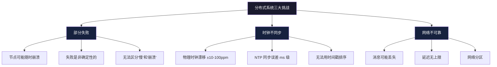

# 分布式理论基础

分布式系统是现代互联网基础设施的基石——从电商秒杀到全球支付网络，从社交动态到云原生微服务，几乎所有的大规模应用都运行在分布式架构之上。然而，分布式系统并非简单的"多台机器一起工作"，它引入了一系列单机系统中根本不存在的理论约束和工程挑战。

本节从分布式系统的基本特征出发，系统性地覆盖分布式理论的核心定理、一致性模型、不可能性结果、容错机制和时间排序理论。这些理论不是象牙塔里的数学游戏，而是每一个分布式系统架构师必须内化的设计约束。理解它们，你才能在 CP/AP 之间做出正确权衡，在强一致和最终一致之间选择最适合业务场景的方案，在共识协议的设计中理解"为什么不能更简单"。

---

## 一、分布式系统的本质特征

### 1.1 经典定义

**Leslie Lamport**（1978）的经典定义：

> "分布式系统是一组通过网络通信、协调行为的计算机集合。最令人头疼的特性是：系统中任何你不知道的组件，都可能以你无法想象的方式让你失望。"

**Andrew Tanenbaum** 的定义：

> "分布式系统是一组独立的计算机，它们对用户呈现为一个单一的连贯系统。"

这两个定义从不同角度揭示了分布式系统的本质：

| 维度 | Lamport 定义 | Tanenbaum 定义 |
|------|-------------|---------------|
| 侧重点 | 系统的脆弱性 | 系统的透明性 |
| 关注对象 | 开发者/运维视角 | 用户视角 |
| 核心警示 | 组件故障不可预测 | 分布细节应被隐藏 |

### 1.2 四个不可分割的本质特征

**多节点（Multi-node）**：系统由多个独立的计算节点组成，每个节点拥有自己的 CPU、内存和本地状态。节点之间通过网络连接，但各自独立运行。这意味着没有任何单一节点拥有系统的全局视图。

**消息传递通信（Message Passing）**：节点之间不能直接访问彼此的内存，只能通过发送和接收消息进行通信。这与单机系统中通过共享内存通信有本质区别——消息传递引入了延迟、丢失、乱序等一系列问题。

**协调机制（Coordination）**：多个节点需要协调行为以完成共同目标。协调的方式多种多样——从简单的主从复制到复杂的共识协议，协调的开销是分布式系统性能的主要瓶颈之一。

**透明性（Transparency）**：系统对用户隐藏分布式的复杂性。ACM 定义了八种透明性类型：

| 透明性类型 | 含义 | 实现难度 | 典型场景 |
|-----------|------|---------|---------|
| 访问透明性 | 本地/远程访问方式相同 | 中 | RPC、gRPC |
| 位置透明性 | 资源位置对用户不可见 | 中 | CDN、负载均衡 |
| 并发透明性 | 多用户并发访问不冲突 | 高 | 数据库事务 |
| 复制透明性 | 多副本对用户不可见 | 高 | 主从复制 |
| 故障透明性 | 系统自动处理故障 | 极高 | 自动故障转移 |
| 迁移透明性 | 资源可透明迁移 | 高 | 容器调度 |
| 扩展透明性 | 系统可透明扩展 | 高 | 分库分表 |
| 性能透明性 | 负载变化不影响性能 | 高 | 弹性伸缩 |

**实践警示**：在实际系统中，同时实现所有八种透明性几乎不可能。架构师必须根据业务需求选择性地实现其中几种，并明确告诉上层应用哪些透明性不被保证。

### 1.3 分布式计算的八大谬误

Peter Deutsch 在 1994 年提出了"分布式计算的八大谬误"（The Fallacies of Distributed Computing），James Gosling 补充了第八条。这些谬误不是"新手才犯的错误"，而是系统设计者在潜意识中经常假设的前提：

| # | 谬误 | 含义 | 违背后果 | 工程应对 |
|---|------|------|---------|---------|
| 1 | 网络是可靠的 | 网络通信不会出错 | 数据丢失、状态不一致 | 重试机制、ACK 确认、持久化 |
| 2 | 延迟为零 | 消息传递没有时间开销 | 性能瓶颈、超时误判 | 异步通信、本地缓存 |
| 3 | 带宽是无限的 | 网络传输没有容量限制 | 拥塞、丢包 | 限流、压缩、批处理 |
| 4 | 网络是安全的 | 网络环境是可信的 | 数据泄露、中间人攻击 | TLS、认证、加密 |
| 5 | 拓扑不会变化 | 网络结构是固定的 | 路由失效、服务发现失败 | 动态路由、服务注册中心 |
| 6 | 只有一个管理员 | 整个网络由一个实体管理 | 策略冲突、权限问题 | 多租户隔离、策略协商 |
| 7 | 传输成本为零 | 网络通信不需要代价 | 资源浪费、成本失控 | 流量计费、QoS |
| 8 | 网络是同构的 | 所有节点使用相同技术 | 协议不兼容、数据格式冲突 | 协议适配层、标准化 |

**核心洞察**：每一条谬误都对应着一类系统故障。分布式系统设计的第一步，就是承认这些谬误都是现实，然后逐一设计应对机制。

### 1.4 分布式系统的三大核心挑战

**部分失败（Partial Failure）**：单机系统要么正常工作，要么完全失败，行为是确定性的。分布式系统中部分节点可能正常，部分节点可能失败，且失败是非确定性的——你无法预测哪个节点会在什么时候以什么方式失败。这是分布式系统最根本的复杂性来源。

**时钟不同步**：物理时钟存在漂移（通常 ±10-100ppm），不同节点的时间无法精确对齐。这意味着你不能依赖物理时间来确定事件的先后顺序。即使是 NTP 同步的时钟，误差也可能达到毫秒级，这在高频交易等场景中是不可接受的。

**网络不可靠**：消息可能丢失、延迟（延迟无上限）、乱序到达，甚至发生网络分区（Network Partition）——两个节点组之间完全无法通信。网络分区是 CAP 定理讨论的核心场景。

---

## 二、CAP 定理

### 2.1 CAP 的定义与证明

CAP 定理由 Eric Brewer 在 2000 年提出猜想，Seth Gilbert 和 Nancy Lynch 在 2002 年给出了形式化证明。它是分布式系统理论中最著名、也最常被误解的定理。

**三个属性**：

- **一致性（Consistency）**：所有节点在同一时刻看到相同的数据。这里的一致性指的是**线性一致性**（Linearizability），不是 ACID 中的 C。
- **可用性（Availability）**：每个请求都能在有限时间内收到响应（不保证是最新数据）。注意是**每个**非故障节点都要响应。
- **分区容忍（Partition Tolerance）**：系统在网络分区发生时仍能继续工作。

**CAP 定理**：在网络分区发生时，系统只能在一致性和可用性之间选择其一。

**证明概要（反证法）**：

假设存在一个系统同时满足 C、A、P。

考虑两个节点 N1 和 N2，它们之间发生网络分区。

步骤1: 客户端 W 向 N1 写入数据 v1
步骤2: 客户端 R 从 N2 读取数据

由于网络分区，N2 无法收到 N1 的写入。

情况1: N2 返回旧数据 v0
  → 违反一致性（C）：R 读到的不是最新值

情况2: N2 返回错误或超时
  → 违反可用性（A）：R 的请求没有得到响应

两种情况都违反了假设，因此 C、A、P 不能同时满足。 ∎

**参考文献**：Gilbert, S. & Lynch, N. "Brewer's conjecture and the feasibility of consistent, available, partition-tolerant web services." ACM SIGACT News, 2002.

### 2.2 CAP 的常见误解

| 误解 | 正确理解 |
|------|---------|
| CAP 意味着三选二 | CAP 只在**网络分区发生时**才需要权衡，正常情况下三者可以同时满足 |
| CA 系统不存在 | 单机数据库可以视为 CA；分布式系统中确实不存在真正的 CA 系统 |
| 选了 CP 就不能有可用性 | CP 系统在**非分区**时仍然有可用性 |
| 选了 AP 就没有一致性 | AP 系统仍然有一致性保证，只是不是线性一致性 |
| CAP 中的 C 是 ACID 的 C | CAP 的 C 是线性一致性，ACID 的 C 是约束满足（如唯一性约束） |
| CAP 是二元选择 | 实际系统在 CP-AP 光谱上的某个位置，不是非此即彼 |

### 2.3 PACELC 扩展

Daniel Abadi 在 2012 年指出 CAP 的局限性：它只讨论了分区发生时的权衡，忽略了正常运行时的延迟-一致性权衡。PACELC 定理扩展了这一框架：

PACELC 框架：
if Partition (P) 发生:
    在 Availability (A) 和 Consistency (C) 之间选择
Else (E) 正常运行时:
    在 Latency (L) 和 Consistency (C) 之间选择

**实际系统的 PACELC 分类**：

| 系统 | P 时选择 | 正常时选择 | 说明 |
|------|---------|-----------|------|
| DynamoDB | PA | EL | 分区时保可用，正常时保低延迟 |
| Cassandra | PA | EL | 同上，可调一致性级别 |
| HBase | PC | EC | 分区时保一致，正常时也保一致 |
| Spanner | PC | EC | TrueTime 保证外部一致性 |
| CockroachDB | PC | EC | 类 Spanner 设计 |
| MongoDB | PC | EC/EL | 可配置 Read Concern 级别 |
| etcd | PC | EC | Raft 共识，强一致 |
| Redis (Sentinel) | PA | EL | 异步复制，最终一致 |

**选型指南**：

- **金融交易、库存扣减、分布式锁**：选 CP/EC 系统（Spanner、etcd、ZooKeeper）
- **社交动态、用户资料、内容分发**：选 PA/EL 系统（Cassandra、DynamoDB）
- **需要灵活调整的场景**：选可配置一致性系统（MongoDB、Cassandra）

### 2.4 实际系统的权衡决策框架

选择一致性级别的决策树：

Q1: 数据错误是否会导致资金损失？
  ├── 是 → 强一致性（线性一致性）
  │        实现：Raft/Paxos 共识（etcd, ZooKeeper）
  │        或 Google Spanner（TrueTime）
  └── 否 → Q2: 用户能否容忍短暂的数据不一致？
            ├── 能容忍秒级 → 最终一致性
            │    实现：Cassandra, DynamoDB
            └── 不能容忍 → 因果一致性或会话一致性
                 实现：向量时钟, CRDT

---

## 三、一致性模型光谱

一致性模型定义了分布式系统中数据可见性的保证级别。从最强到最弱，形成一个完整的光谱。

### 3.1 线性一致性（Linearizability）

最强的一致性模型，也称为原子一致性（Atomic Consistency）或外部一致性（External Consistency）。

**定义**：所有操作看起来像是在某个单一的全局时间点上原子执行的，并且这个时间点在操作的实际执行时间范围内。

线性一致性的形式化要求：
1. 操作的调用和完成之间存在一个线性化点
2. 所有操作的线性化点构成一个全序
3. 线性化点的顺序与操作的实时顺序一致
4. 每个读操作返回最近一次写操作的值

更精确地：对于任意操作 o1 和 o2：
  如果 o1 在 o2 开始之前完成，则 o1 的线性化点在 o2 之前

**示例**：

时间线：
客户端A: |---write(x,1)---|
客户端B:        |---read(x)---|
客户端C:              |---read(x)---|

线性一致的执行：
  write(x,1) 的线性化点在 t1
  B 的 read(x) 线性化点在 t2 > t1，返回 1
  C 的 read(x) 线性化点在 t3 > t1，返回 1

非线性一致的执行：
  B 的 read(x) 返回 0（在 write 之前），但 C 的 read(x) 返回 1
  这违反了线性一致性，因为 B 的读取发生在 write 完成之后

**实现代价**：
- 需要全局协调（共识协议），延迟高（至少一个 RTT）
- 吞吐量受限于最慢的副本节点
- 在广域网部署中代价尤为高昂

**典型实现**：单主复制（所有写入通过主节点）、Raft/Paxos 共识（etcd、ZooKeeper）、Google Spanner（TrueTime + 2PC）

### 3.2 顺序一致性（Sequential Consistency）

**定义**（Lamport, 1979）：所有进程的操作看起来像是按照某个全局顺序执行的，并且每个进程内的操作顺序与程序顺序一致。

与线性一致性的关键区别：
- 线性一致性：要求操作的顺序与实时顺序一致
- 顺序一致性：只要求存在某个合法的全局顺序
- 顺序一致性不要求读操作返回"最新"的值

**示例**：

客户端A: write(x,1), write(x,2)
客户端B: read(x), read(x)

线性一致：B 必须先看到 1，再看到 2（因为 write(x,1) 先发生）
顺序一致：B 可以返回 [2, 1]
  合法的全局顺序：write(x,2), read(x)->2, write(x,1), read(x)->1
  这个顺序虽然与实时不同，但保持了每个进程内的程序顺序

**典型实现**：多数数据库的主从复制（异步）、x86 TSO（Total Store Order）内存模型

### 3.3 因果一致性（Causal Consistency）

**定义**：如果操作之间存在因果关系，那么所有节点看到的这些操作的顺序是一致的。没有因果关系的操作可以以任意顺序出现。

因果关系的三种来源：
1. 程序顺序：如果操作 A 在操作 B 之前执行（同一个进程内），则 A 因果先于 B
2. 读写依赖：如果 A 是写操作，B 是读操作且读取了 A 写入的值，则 A 因果先于 B
3. 传递性：如果 A 因果先于 B，B 因果先于 C，则 A 因果先于 C

**示例**：

因果一致的执行：
  客户端A: write(x,1)
  客户端B: read(x)->1, write(y,2)  ← 因果依赖：B 读到了 x=1 后才写 y=2
  客户端C: read(y)->2, read(x)->1  ← 必须看到 y=2 时 x=1 已经生效

违反因果一致的执行：
  客户端C: read(y)->2, read(x)->0  ← 看到了 y=2 但没看到 x=1，违反因果

**典型实现**：COPS（Cluster of Order-Preserving Servers）、Eiger、LWW-Register（Last-Write-Wins）、一些分布式数据库的会话一致性

### 3.4 最终一致性（Eventual Consistency）

最弱的一致性模型，也是实际系统中最常用的模型。

**定义**：如果没有新的写入，最终所有副本都会收敛到相同的值。

最终一致性的形式化定义：
  ∀ replica r, ∃ time t: ∀ t' > t, read(r, t') = latest_value

关键限制：
- 不保证收敛时间（可能是秒级、分钟级甚至更长）
- 不保证读取的是最新值
- 不保证所有节点同时看到相同的值

**最终一致性的常见变体**：

| 变体 | 保证 | 实现方式 |
|------|------|---------|
| 读己之写（Read-Your-Writes） | 用户总能看到自己写入的数据 | 会话粘滞、写后读一致性 |
| 单调读（Monotonic Reads） | 用户不会看到数据"回退" | 版本向量、时间戳追踪 |
| 写后读（Writes-Follow-Reads） | 写入建立在之前读取的数据之上 | 因果追踪、依赖版本 |
| 前缀一致（Prefix Consistency） | 所有节点看到的操作前缀相同 | 全局序号、Leader 排序 |

### 3.5 一致性光谱全景

一致性强度：线性一致性 > 顺序一致性 > 因果一致性 > 最终一致性
性能/可用性：低 ─────────────────────────────────────→ 高
实现复杂度：高 ─────────────────────────────────────→ 低

**选择指南**：

| 应用场景 | 推荐一致性 | 原因 | 典型系统 |
|---------|-----------|------|---------|
| 金融交易 | 线性一致性 | 不能出错，一分钱都不能差 | Spanner, etcd |
| 库存管理 | 线性一致性 | 避免超卖 | HBase, CockroachDB |
| 分布式锁 | 线性一致性 | 互斥性必须保证 | ZooKeeper, etcd |
| 社交动态 | 因果一致性 | 保持对话顺序即可 | Twitter, 微博 |
| 用户资料 | 最终一致性 | 可容忍短暂不一致 | MySQL 主从 |
| CDN 缓存 | 最终一致性 | 高性能优先 | CloudFront |
| DNS | 最终一致性 | 经典最终一致系统 | BIND, CoreDNS |

---

## 四、FLP 不可能定理

### 4.1 定理陈述

FLP 不可能定理由 Fischer、Lynch 和 Paterson 在 1985 年证明，是分布式系统理论中最重要的不可能性结果。它为共识问题设定了根本性的理论边界。

**定理**：在一个异步系统中，即使只有一个进程可能发生崩溃故障，也不存在一个确定性算法能同时满足以下三个条件：

1. 终止性（Termination）：所有正确的进程最终决定一个值
2. 一致性（Agreement）：所有正确的进程决定相同的值
3. 有效性（Validity）：决定的值是某个进程的输入值

### 4.2 证明的核心思想

证明思路（反证法）：

1. 定义共识算法的执行状态
   - 配置（Configuration）：所有进程状态的集合
   - 决定性（Decisive）：从该配置出发，存在一个决定性执行
   - 非决定性（Indecisive）：从该配置出发，可能决定 0 也可能决定 1

2. 证明关键引理
   - 存在一个"双价"（bivalent）的初始配置
     即：从这个配置出发，存在两种可能的执行分别决定 0 和 1
   - 从任何双价配置出发，都可以到达另一个双价配置
     （通过延迟消息传递，使系统无法确定进程是慢还是崩溃）

3. 构造矛盾
   - 对于任何确定性算法 A，都可以构造一个执行使得 A 无法终止
   - 通过精心安排消息延迟，使系统永远停留在双价状态

**直觉理解**：

异步系统无法区分"进程很慢"和"进程崩溃"。这是 FLP 定理的根本洞察。如果进程 P 崩溃了，其他进程无法确定 P 是慢还是真的崩溃。这种不确定性导致了：
- 如果等待 P：可能永远等不到（活性问题）
- 如果不等待 P：可能错过 P 的输入（安全性问题）

### 4.3 工程意义与绕过策略

FLP 定理并不意味着共识问题无法解决。它告诉我们**纯异步系统无法保证终止**，但实际系统可以通过以下策略绕过这一限制：

**策略一：引入部分同步模型**

假设消息最终会被送达，只是延迟有上界。Raft 和 Paxos 就是基于这一假设——它们使用超时机制来检测故障，在部分同步模型下可以保证共识。

部分同步模型的假设：
- 消息最终会被送达（但延迟有界）
- 进程最终会恢复（但可能暂停）
- 时钟漂移有界（但不精确）

在这些假设下，Raft/Paxos 可以保证：
- 安全性（Safety）：永远保证
- 活性（Liveness）：在部分同步条件下保证

**策略二：随机化算法**

通过引入随机性打破对称性。Ben-Or 算法（1983）是第一个随机化共识算法，它以概率 1 终止，但不保证确定性终止。

随机化共识的直觉：
- 每轮随机选择一个值广播
- 如果冲突，重新随机
- 概率上，冲突会逐渐消除
- 最终以概率 1 达成一致（但可能需要很多轮）

**策略三：故障检测器**

Chandra 和 Toueg（1996）提出用故障检测器来增强异步系统的能力。故障检测器是超时机制的抽象——它不能保证完美（可能误报），但可以提供有用的信息。

故障检测器的分类：
┌──────────────┬──────────┬──────────┬────────────────────┐
│ 类型         │ 完美性   │ 强度     │ 能力               │
├──────────────┼──────────┼──────────┼────────────────────┤
│ 完美检测器   │ 完美     │ 强       │ 不会误报也不会漏报 │
│ 强检测器     │ 不完美   │ 强       │ 可能误报，不会漏报 │
│ 弱检测器     │ 不完美   │ 弱       │ 可能误报，可能漏报 │
└──────────────┴──────────┴──────────┴────────────────────┘
实用系统通常使用强检测器（基于超时），如 Raft 的选举超时。

**策略四：超时与重试**

实际工程中最常用的策略。虽然不能在理论上绕过 FLP，但在实践中极其有效：

- 设置合理的超时阈值（通常基于网络延迟的 P99）
- 超时后触发故障转移（如 Raft 重新选举）
- 重试机制保证最终成功

### 4.4 参考文献

- Fischer, M.J., Lynch, N.A., & Paterson, M.S. "Impossibility of Distributed Consensus with One Faulty Process." JACM, 1985.
- Chandra, T.D. & Toueg, S. "Unreliable Failure Detectors for Reliable Distributed Systems." JACM, 1996.
- Ben-Or, M. "Another Advantage of Free Choice: Completely Asynchronous Agreement Protocols." PODC, 1983.

---

## 五、拜占庭容错

### 5.1 故障模型分类

分布式系统中的故障按照严重程度可以分为多个层级：

故障严重程度（从轻到重）：

崩溃故障（Crash Fault）
  → 进程停止工作，不再发送消息
  → 最简单的故障模型
  → Raft、Paxos 处理这种故障

遗漏故障（Omission Fault）
  → 进程可能丢失发送或接收的消息
  → 比崩溃故障更复杂

认证拜占庭故障（Authenticated Byzantine Fault）
  → 进程可能发送任意消息，但消息不能伪造签名
  → 区块链中常见

拜占庭故障（Byzantine Fault）
  → 进程可能发送任意消息，包括矛盾信息
  → 可能与恶意节点合谋
  → 最复杂、最危险的故障模型

| 故障类型 | 特征 | 容错所需节点数 | 典型场景 |
|---------|------|--------------|---------|
| 崩溃故障 | 停止响应 | 2f+1 | 单机宕机、进程 OOM |
| 遗漏故障 | 丢消息 | 2f+1 + 冗余链路 | 网络拥塞、消息队列积压 |
| 拜占庭故障 | 任意行为 | 3f+1 | 恶意攻击、软件 Bug |

### 5.2 拜占庭将军问题

1982 年，Lamport、Shostak 和 Pease 提出了拜占庭将军问题（Byzantine Generals Problem），用一个生动的比喻描述了拜占庭容错的核心挑战：

问题描述：
- N 个将军围攻一座城市
- 将军之间只能通过信使通信
- 其中一些将军可能是叛徒
- 所有忠诚的将军必须达成一致的行动计划（进攻或撤退）
- 如果忠诚的将军都同意进攻，则进攻成功
- 如果任何忠诚的将军撤退，则所有忠诚的将军必须撤退

关键约束：
- 叛徒可以发送任何消息（包括矛盾信息）
- 叛徒之间可以合谋
- 必须在存在叛徒的情况下达成一致

**核心定理**：在异步系统中，要容忍 f 个拜占庭故障节点，需要至少 3f+1 个节点。

证明直觉：
考虑 3 个节点集合 A、B、C（每个 f+1 个节点）。
A 和 B 有交集，B 和 C 有交集，但 A 和 C 可能没有交集。

如果有 f 个拜占庭节点：
- A 中至少有一个诚实节点
- B 中至少有一个诚实节点
- C 中至少有一个诚实节点

但 A 和 C 的诚实节点可能不同。
如果 A 的诚实节点收到"进攻"，C 的诚实节点收到"撤退"，
它们无法判断谁是叛徒，导致不一致。

因此需要 n >= 3f+1 才能保证一致性。

### 5.3 PBFT 算法

PBFT（Practical Byzantine Fault Tolerance）由 Miguel Castro 和 Barbara Liskov 在 1999 年提出，是第一个实用的拜占庭容错算法，将拜占庭容错的复杂度从指数级降低到多项式级。

**算法流程**：

PBFT 的三阶段协议（正常流程）：

阶段1: Pre-prepare（预准备）
  主节点（Leader）分配序号，广播 PRE-PREPARE 消息
  消息格式: <PRE-PREPARE, view, seq_num, digest, client_msg>
  - view: 视图号（标识当前 Leader）
  - seq_num: 请求序号（全局唯一）
  - digest: 消息摘要（防篡改）
  - client_msg: 客户端请求

阶段2: Prepare（准备）
  备份节点收到 PRE-PREPARE 后，验证并广播 PREPARE 消息
  消息格式: <PREPARE, view, seq_num, digest, node_id>
  进入 prepared 状态的条件: 收到 2f 个匹配的 PREPARE（包括自己的）

阶段3: Commit（提交）
  进入 prepared 状态的节点广播 COMMIT 消息
  消息格式: <COMMIT, view, seq_num, digest, node_id>
  进入 committed 状态的条件: 收到 2f+1 个匹配的 COMMIT（包括自己的）
  进入 committed 后执行请求，向客户端回复

客户端行为:
  等待 f+1 个匹配的回复 → 请求被接受
  等待 2f+1 个不匹配的回复 → 请求被拒绝

**视图切换（View Change）**：当主节点疑似故障时，备份节点触发视图切换：

视图切换流程:
1. 备份节点等待超时，广播 VIEW-CHANGE 消息
2. 新主节点收集 2f 个 VIEW-CHANGE 消息
3. 广播 NEW-VIEW 消息
4. 所有节点进入新视图

视图切换的安全保证:
- 不会丢失已提交的请求
- 新视图中的请求顺序与旧视图一致
- 最多经过 f+1 次视图切换就能找到正确的 Leader

**性能分析**：

| 指标 | PBFT | Raft/Paxos |
|------|------|-----------|
| 容错类型 | 拜占庭故障 | 崩溃故障 |
| 最小节点数 | 3f+1 | 2f+1 |
| 消息复杂度 | O(n²) | O(n) |
| 通信轮数 | 3 轮 | 2 轮（正常流程） |
| 适用规模 | 小规模（<100 节点） | 大规模（>1000 节点） |

**参考文献**：
- Castro, M. & Liskov, B. "Practical Byzantine Fault Tolerance." OSDI 1999.
- Castro, M. & Liskov, B. "Practical Byzantine Fault Tolerance and Proactive Recovery." ACM TOCS, 2002.

---

## 六、时间与顺序

在分布式系统中，确定事件的先后顺序是一个根本性问题。没有全局时钟，我们如何判断"哪个事件先发生"？

### 6.1 逻辑时钟的必要性

物理时钟的问题：
- 时钟漂移（通常 ±10-100ppm）
- NTP 同步误差（通常 1-50ms）
- 无法保证因果关系（时钟快的节点可能"看到未来"）

Lamport 在 1978 年提出：我们不需要精确的物理时间，只需要一个能反映事件**因果关系**的逻辑时间。

### 6.2 Lamport 时钟

Lamport 时钟是最简单的逻辑时钟，为每个事件分配一个整数时间戳。

Lamport 时钟算法:

初始化: 每个进程的计数器 clock = 0

规则1（本地事件）: 进程 Pi 执行本地事件时
  clock := clock + 1
  事件的时间戳 = clock

规则2（发送消息）: 进程 Pi 发送消息 m 时
  clock := clock + 1
  在消息中附带时间戳: m.ts = clock

规则3（接收消息）: 进程 Pj 收到消息 m 时
  clock := max(clock, m.ts) + 1
  事件的时间戳 = clock

**示例**：

进程P1:  a1(1)  ──m1(ts=2)──→  a2(3)
进程P2:          b1(2)         b2(4)
进程P3:                    c1(5)

因果关系追踪:
- a1 因果先于 a2（程序顺序）
- a1 因果先于 b2（通过消息 m1）
- a1 因果先于 c1（通过消息链）

**Lamport 时钟的局限**：Lamport 时钟只能保证：如果 a → b（a 因果先于 b），则 LC(a) < LC(b)。但反过来不成立——LC(a) < LC(b) 不意味着 a → b。也就是说，Lamport 时钟不能判断两个事件是否并发。

### 6.3 向量时钟

向量时钟解决了 Lamport 时钟的局限，能够完整地捕获因果关系。

向量时钟算法:

初始化: 每个进程 Pi 维护一个长度为 N 的向量
  VC[i] = 0 for all i

规则1（本地事件）: 进程 Pi 执行本地事件时
  VC[i] := VC[i] + 1

规则2（发送消息）: 进程 Pi 发送消息 m 时
  VC[i] := VC[i] + 1
  在消息中附带向量时钟: m.vc = VC 的副本

规则3（接收消息）: 进程 Pj 收到消息 m 时
  for k = 1 to N:
    VC[k] := max(VC[k], m.vc[k])
  VC[j] := VC[j] + 1

**向量时钟的比较规则**：

对于两个事件 e1 和 e2，它们的向量时钟分别为 VC1 和 VC2:

VC1 < VC2（e1 因果先于 e2）:
  ∀k: VC1[k] ≤ VC2[k] 且 ∃k: VC1[k] < VC2[k]

VC1 = VC2（e1 和 e2 是同一个事件）:
  ∀k: VC1[k] = VC2[k]

VC1 ∥ VC2（e1 和 e2 并发）:
  ∃i: VC1[i] > VC2[i] 且 ∃j: VC1[j] < VC2[j]

**示例**：

进程P1: VC=[1,0,0] ──→ VC=[2,0,0] ──→ VC=[3,0,0]
进程P2:          VC=[0,1,0] ──→ VC=[0,2,0]
进程P3:                   VC=[0,0,1] ──→ VC=[0,0,2]

比较:
VC(P1-a) = [1,0,0] 与 VC(P2-b) = [0,1,0]
→ 并发关系（√）

VC(P1-a) = [1,0,0] 与 VC(P1-b) = [2,0,0]
→ 因果关系（[1,0,0] < [2,0,0]）

**向量时钟的局限**：每个事件需要携带 O(N) 的向量（N 为进程数），在大规模系统中开销过大。

### 6.4 混合逻辑时钟（HLC）

HLC（Hybrid Logical Clock）由 Kulkarni 等人在 2014 年提出，结合了物理时钟和逻辑时钟的优点。

HLC 的设计目标:
1. 保留物理时钟的直觉（时间戳接近真实时间）
2. 保留逻辑时钟的因果保证（因果有序的事件有递增的时间戳）
3. 单个时间戳（不像向量时钟需要 O(N) 空间）

HLC 的结构:
HLC = (physical_time, logical_counter)

更新规则:
on local event:
  pt := max(physical_clock, pt)
  if pt == pt_prev:
    lc := lc + 1
  else:
    lc := 0
  pt_prev := pt

on receive message with (pt_msg, lc_msg):
  pt := max(physical_clock, pt_prev, pt_msg)
  if pt == pt_prev and pt == pt_msg:
    lc := max(lc_prev, lc_msg) + 1
  elif pt == pt_prev:
    lc := lc_prev + 1
  elif pt == pt_msg:
    lc := lc_msg + 1
  else:
    lc := 0
  pt_prev := pt

**HLC 的优势**：
- 时间戳接近真实物理时间（便于调试和日志分析）
- 保证因果有序（a → b 则 HLC(a) < HLC(b)）
- 空间开销 O(1)（只需一个时间戳）
- 被 CockroachDB、MongoDB 等系统采用

### 6.5 时钟方案对比

| 方案 | 空间开销 | 因果保证 | 物理时间感知 | 实现复杂度 | 适用场景 |
|------|---------|---------|------------|-----------|---------|
| Lamport 时钟 | O(1) | 单向（a→b 则 LC(a)<LC(b)） | 无 | 低 | 事件排序 |
| 向量时钟 | O(N) | 双向（可判断并发） | 无 | 中 | 因果追踪 |
| HLC | O(1) | 单向 | 有 | 中 | 日志分析、CockroachDB |
| 物理时钟 | O(1) | 无 | 精确 | 低 | 非因果场景 |
| TrueTime (Spanner) | O(1) | 精确 | 有（带不确定性区间） | 高 | 外部一致性 |

---

## 七、分布式快照

### 7.1 问题定义

在分布式系统中，如何捕获一个一致的全局状态？这是一个看似简单实则困难的问题。你不能简单地让所有节点同时"拍照"——因为没有"同时"这个概念。

**应用场景**：
- 系统故障后的状态恢复
- 检查点（Checkpointing）机制
- 死锁检测
- 系统调试与审计

### 7.2 Chandy-Lamport 算法

1985 年，Chandy 和 Lamport 提出了分布式快照算法，是捕获全局状态的经典方法。

算法前提:
- 消息是有序的（FIFO 通道）
- 消息传递是可靠的
- 沿着一个切割（Cut）的消息被正确记录

算法流程:

1. 初始化:
   - 任意进程 Pi 可以发起快照
   - Pi 记录自己的本地状态
   - Pi 向所有出通道发送 MARKER 消息
   - Pi 开始记录所有入通道的消息

2. 收到 MARKER 的进程 Pj:
   如果 Pj 还没有记录自己的状态:
     - 记录自己的本地状态
     - 在 MARKER 到达之前收到的消息记录到快照中
     - 向所有出通道发送 MARKER
     - 继续记录入通道的消息
   如果 Pj 已经记录了自己的状态:
     - 停止记录该通道的消息

3. 终止条件:
   所有进程都记录了本地状态
   所有通道都记录了 MARKER 之间的消息

**正确性保证**：Chandy-Lamport 算法保证捕获的是一个**一致的全局状态**——如果快照中包含了通道 C 上的某条消息 m，那么 m 的发送事件也一定包含在快照中。

### 7.3 实际应用

| 应用 | 说明 |
|------|------|
| HDFS 快照 | 对 HDFS 目录树做只读检查点，用于备份和恢复 |
| MySQL 崩溃恢复 | InnoDB 的 checkpoint 机制保证 WAL 的一致性 |
| 分布式事务 | 2PC 的 prepare 阶段本质上是一种分布式快照 |
| 流处理 | Apache Flink 的分布式快照用于 exactly-once 语义 |

---

## 八、故障模型与网络模型

### 8.1 故障模型

分布式系统的正确性依赖于对故障的正确建模。不同的故障模型决定了算法设计的复杂度和保证级别。

| 故障模型 | 特征 | 检测难度 | 容错代价 | 典型场景 |
|---------|------|---------|---------|---------|
| 崩溃-停止 | 进程停止，不再响应 | 中等 | 中等 | OOM、进程被 kill |
| 崩溃-恢复 | 进程崩溃后可能恢复 | 困难 | 高 | 机器重启、容器漂移 |
| 遗漏 | 丢失发送/接收的消息 | 困难 | 中等 | 网络拥塞、消息队列积压 |
| 拜占庭 | 任意行为（包括恶意） | 极难 | 极高 | 攻击、软件 Bug、硬件错误 |

**崩溃-恢复故障的特殊挑战**：

崩溃-恢复故障比崩溃-停止故障更难处理：
- 进程恢复后需要恢复之前的状态
- 如果状态恢复不完整，可能导致不一致
- 需要持久化存储和日志机制
- Raft 的日志机制就是为了解决这个问题

### 8.2 网络模型

| 网络模型 | 假设 | 适用场景 | 代表算法 |
|---------|------|---------|---------|
| 同步网络 | 消息延迟有上界 | 实时系统 | 同步共识 |
| 部分同步网络 | 消息延迟最终有上界 | 大多数实际系统 | Raft、Paxos |
| 异步网络 | 消息延迟无上界 | 理论分析 | FLP 不可能定理 |

**同步 vs 异步的本质区别**：

同步系统:
- 消息延迟有已知上界 δ
- 可以设置超时 = δ 来检测故障
- 超时 = 节点确实故障了

异步系统:
- 消息延迟无上界
- 无法区分"慢"和"崩溃"
- 超时没有理论意义

部分同步（实际系统的选择）:
- 正常情况下延迟有界
- 偶尔出现不可预测的延迟
- 超时是启发式的，不完美但实用

### 8.3 故障检测

在部分同步模型下，故障检测通常基于超时机制：

故障检测器的设计参数:

超时时间 T:
  - 太短: 频繁误报（false positive）
  - 太长: 故障发现延迟
  - 实践: 基于网络延迟的 P99/P999 设置

检测策略:
  1. 心跳检测: 被检测节点定期发送心跳
  2. 主动探测: 检测节点定期向目标发送探测消息
  3. 间接检测: 通过第三方节点的信息推断

误报处理:
  - 允许短暂误报（可用性优先）
  - 通过多数投票确认故障（一致性优先）
  - 采用滑动窗口减少误报率

---

## 九、理论到实践的桥梁

### 9.1 理论约束的工程含义

| 理论结果 | 工程含义 | 实际应对 |
|---------|---------|---------|
| CAP 定理 | 必须在一致性和可用性之间权衡 | 根据业务选择 CP 或 AP 系统 |
| FLP 不可能 | 纯异步系统无法保证共识终止 | 使用超时、随机化、部分同步 |
| 拜占庭容错需要 3f+1 节点 | 节点数越多，容错成本越高 | 小规模用 BFT，大规模用 CFT |
| 向量时钟空间 O(N) | 大规模系统中向量时钟不现实 | 使用 HLC 或版本向量压缩 |
| 时钟不同步 | 不能依赖物理时间排序 | 使用逻辑时钟或混合时钟 |

### 9.2 主流系统的理论选择

| 系统 | 一致性 | 共识算法 | 故障模型 | 理论基础 |
|------|--------|---------|---------|---------|
| etcd | 线性一致性 | Raft | 崩溃故障 | CAP(CP) + FLP 绕过 |
| ZooKeeper | 顺序一致性 | ZAB | 崩溃故障 | CAP(CP) |
| Spanner | 外部一致性 | Paxos + 2PC | 崩溃故障 | CAP(CP) + TrueTime |
| Cassandra | 最终一致性 | 无共识 | 崩溃故障 | CAP(AP) + Tunable |
| DynamoDB | 最终一致性 | Quorum | 崩溃故障 | CAP(AP) |
| HBase | 线性一致性 | 无（单主） | 崩溃故障 | CAP(CP) |
| CockroachDB | 外部一致性 | Raft | 崩溃故障 | CAP(CP) |
| Hyperledger Fabric | 排序一致性 | Kafka/Raft | 部分 BFT | CAP(CP) |

### 9.3 设计分布式系统的检查清单

□ 确定业务的一致性需求
  → 是否需要强一致性？能否容忍最终一致？
  
□ 评估网络模型
  → 是否有网络分区？分区频率和持续时间？

□ 选择故障模型
  → 是否需要拜占庭容错？还是崩溃容错就够了？

□ 设计数据复制策略
  → 主从复制？多主复制？无主复制？
  
□ 选择一致性级别
  → 线性一致性？因果一致性？最终一致性？
  
□ 设计故障检测机制
  → 超时阈值如何设置？误报如何处理？

□ 考虑时钟问题
  → 是否需要逻辑时钟？HLC 是否够用？

□ 规划数据恢复
  → 快照策略？日志保留？恢复时间目标？

---

## 本节总结

分布式理论是构建可靠分布式系统的理论基石。核心要点：

1. **分布式系统的本质**是不确定性和部分失败——消息可能丢失、延迟、乱序，节点可能崩溃
2. **CAP 定理**告诉我们：网络分区不可避免时，必须在一致性和可用性之间做出权衡
3. **一致性模型**形成一个从线性一致性到最终一致性的光谱，选择取决于业务需求
4. **FLP 不可能定理**划定了共识问题的理论边界，但实际系统可以通过部分同步、随机化、超时等策略绕过
5. **拜占庭容错**需要 3f+1 节点，适用于安全关键场景；崩溃容错只需 2f+1 节点，适用于大多数实际系统
6. **逻辑时钟**（Lamport、向量、HLC）解决了分布式系统中的时间排序问题
7. **分布式快照**提供了一致全局状态的捕获方法

这些理论不是抽象的数学结论，而是每一个分布式系统设计者必须内化的设计约束。理解它们，你才能在 CAP 之间做出正确的权衡，在一致性级别之间做出明智的选择，在共识协议的设计中理解"为什么不能更简单"。
