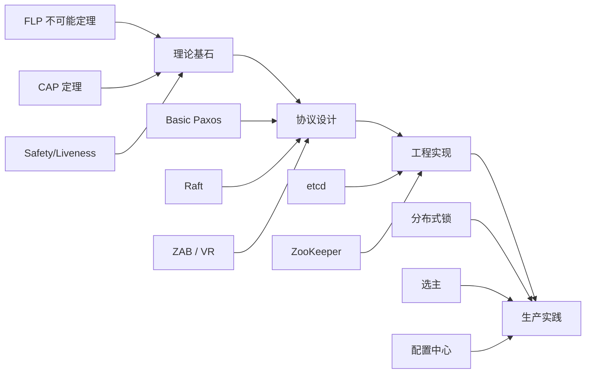
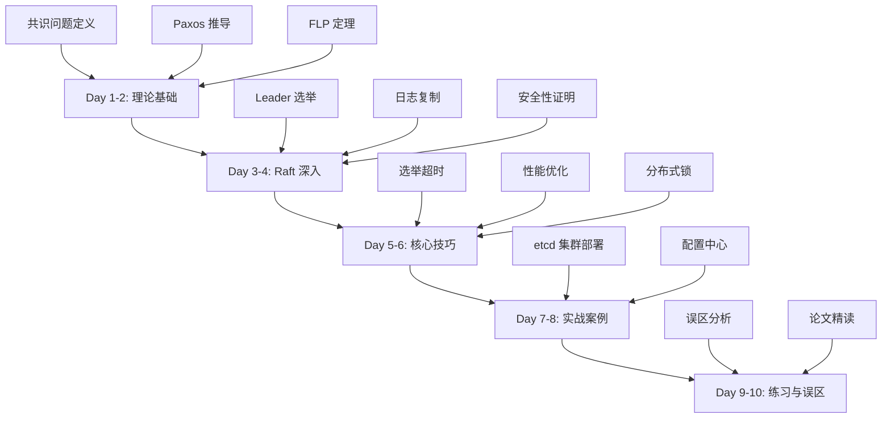
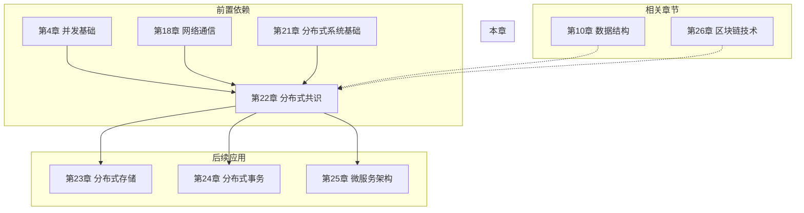

# 第22章 分布式共识 — 章节概览

## 为什么这一章如此重要

分布式共识是分布式系统领域中最核心、最具深度的问题，也是区分"会用分布式系统"和"真正理解分布式系统"的分水岭。在工业界，几乎每一个高可用系统——从 Kubernetes 的大脑 etcd，到大型互联网公司的配置中心、分布式数据库、分布式锁服务——底层都运行着某种共识协议。

如果把分布式系统比作一座大厦，共识协议就是它的地基。没有可靠的共识机制，数据一致性、服务可用性、故障恢复都无从谈起。这一章将带你从理论根基出发，经过协议设计的推演，最终到达生产级系统的工程实践，完成从"知道"到"精通"的跨越。

### 工业界的共识协议全景

以下是共识协议在主流系统中的应用分布，帮助你建立全局视角：

| 系统 | 共识协议 | 使用场景 | 年代 |
|------|---------|---------|------|
| Google Chubby | Paxos | 分布式锁、Leader 选举 | 2006 |
| Apache ZooKeeper | ZAB | 配置管理、命名服务、分布式协调 | 2010 |
| etcd | Raft | Kubernetes 集群状态存储、配置中心 | 2013 |
| TiKV | Multi-Raft | 分布式 KV 存储引擎 | 2016 |
| CockroachDB | Multi-Raft | 分布式 SQL 数据库 | 2017 |
| Consul | Raft | 服务发现、配置管理 | 2014 |
| TiDB | Multi-Raft | 分布式 NewSQL 数据库 | 2016 |
| YugaByteDB | Raft | 分布式数据库 | 2017 |

### 共识协议的演进时间线

理解共识协议的历史脉络，有助于理解每个设计选择背后的动机：

1978 ── Lamport 提出"时间戳"概念（时钟逻辑的起点）
  │
1988 ── Oki & Liskov 提出 Viewstamped Replication（VR）
  │       最早的实用共识协议之一
  │
1989 ── Fischer, Lynch, Paterson 证明 FLP 不可能定理
  │       理论界的重大里程碑——证明了异步共识的理论极限
  │
1990 ── Lamport 提出 Paxos（The Part-Time Parliament）
  │       希腊议会隐喻，晦涩难懂，沉寂近十年
  │
1998 ── Paxos 论文正式发表于 ACM TOCS
  │       引发学术界和工业界的广泛关注
  │
2001 ── Lamport 发表 Paxos Made Simple
  │       去掉希腊隐喻，用直白语言重新阐述
  │
2006 ── Google Chubby 使用 Paxos 实现分布式锁
  │       Paxos 首次大规模工业应用
  │
2010 ── ZooKeeper 发布，基于 ZAB 协议
  │       另一条技术路线的代表
  │
2014 ── Raft 论文发表（USENIX ATC）
  │       以"可理解性"为设计目标，迅速成为主流
  │
2015 ── etcd 采用 Raft，成为 Kubernetes 核心组件
  │       Raft 在工业界的标志性胜利
  │
2016+── TiKV、CockroachDB 等采用 Multi-Raft
          共识协议从单集群走向多分片

## 本章学习目标

完成本章学习后，你将能够：

| 编号 | 目标 | 对应能力 |
|------|------|----------|
| 1 | **理解共识问题的本质** | 掌握一致性、有效性、终止性、完整性四个基本属性，理解 Safety 与 Liveness 的根本性权衡，认识 FLP 不可能定理的深远影响及其在工程中的绕过方式 |
| 2 | **深入掌握 Paxos 协议族** | 能从零推导 Basic Paxos 的两阶段流程，理解 Multi-Paxos 的 Leader 优化机制，把握 Fast Paxos 的快速路径设计思想 |
| 3 | **精通 Raft 协议** | 掌握 Leader 选举、日志复制、安全性保证、成员变更和日志压缩的完整机制，理解 Raft 如何通过"可理解性"设计将共识分解为三个子问题 |
| 4 | **对比主流共识协议** | 理解 ZAB、Viewstamped Replication 与 Raft 的设计差异和适用场景，能够在具体场景中做出合理的技术选型 |
| 5 | **具备工程落地能力** | 能够基于 etcd/raft 库或 ZooKeeper 构建高可用的分布式协调服务，具备性能调优和运维操作能力 |
| 6 | **建立故障诊断能力** | 能够识别和解决共识协议在生产环境中的常见问题，包括脑裂、数据丢失、性能退化等场景 |

### 学完本章你能构建什么

| 构建目标 | 用到的章节 | 实际产出 |
|---------|-----------|---------|
| 高可用 etcd 集群 | 22.3.1 + 22.2.8 | 3-5 节点的生产级集群，含健康检查和证书 |
| 分布式配置中心 | 22.3.2 + 22.2.5 | 支持 Watch 推送、灰度发布、版本回滚的配置服务 |
| 分布式选主服务 | 22.3.3 + 22.2.7 | 基于 etcd 的 Active-Standby 自动切换 |
| 分布式锁服务 | 22.2.6 | 含续期、公平排队、超时释放的生产级锁 |
| 分布式 KV 存储（练习） | 22.5 练习四 | 基于 Raft 的简易 KV 存储，理解日志→状态机的完整流程 |

## 前置知识自测

在开始本章之前，请逐项确认你已掌握以下知识。如果任何一项你无法清晰解释，建议先回顾对应章节：

| 知识领域 | 具体要求 | 参考章节 | 自测标准 |
|---------|---------|---------|---------|
| 分布式系统基础 | 理解 CAP 定理、FLP 不可能定理、网络模型（同步/异步/部分同步） | 第21章 | 能说出 CAP 三选二的含义，能解释为什么异步系统中不可能有确定性共识 |
| 网络通信 | 了解 RPC 机制、超时设计、网络分区的概念 | 第18-20章 | 能描述一次 RPC 调用从发起到超时重试的完整流程 |
| 数据结构 | 理解日志（Log）的追加语义、哈希表、有序集合 | 第10章 | 能解释 WAL（Write-Ahead Log）为什么是持久化的核心机制 |
| 并发基础 | 理解竞态条件、互斥锁、原子操作 | 第4章 | 能说出 CAS 操作的含义，理解为什么 compare-and-swap 是无锁编程的基石 |

> **提示：** 共识协议的核心挑战来自于异步网络 + 节点故障的组合。如果你对"为什么网络延迟和节点崩溃无法区分"这个概念感到陌生，请务必先回顾第 21 章的网络模型部分。

### 快速自测题

花 5 分钟回答以下问题，如果大部分答不上来，建议先补前置知识：

1. 什么是网络分区（Network Partition）？它和节点宕机有什么区别？
2. CAP 定理中的 C（Consistency）和 A（Availability）分别指什么？为什么不能同时满足？
3. WAL 的"预写"是什么意思？为什么不能先写内存再写磁盘？
4. 什么是"多数派"（Quorum）？5 个节点的多数派需要几个节点？
5. 什么是 RPC 超时？超时后应该重试还是放弃？

## 章节结构全景

本章由六个部分组成，遵循"理论→技巧→实战→反思→总结"的认知路径：

22.1 理论基础（7节）── 理解"为什么"
    ↓
22.2 核心技巧（8节）── 掌握"怎么做"
    ↓
22.3 实战案例（4节）── 看到"做出来"
    ↓
22.4 常见误区 ── 避开"掉坑里"
    ↓
22.5 练习方法 ── 确保"学得会"
    ↓
22.6 本章小结 ── 回顾"记住了"

### 22.1 理论基础（7 节）

理论基础是本章的基石，也是篇幅最大、深度最高的部分。它解决的核心问题是：**为什么分布式共识如此困难？人们提出了哪些解决方案？**

| 节号 | 主题 | 核心内容 | 难度 | 预计阅读时间 |
|------|------|---------|------|-------------|
| 22.1.1 | 什么是分布式共识 | 共识问题的正式定义、四类参与者（Proposer/Acceptor/Learner/Client）、提案的生命周期、共识与一致性的区别 | ⭐⭐ | 0.5-1h |
| 22.1.2 | Safety 与 Liveness | Safety/Liveness 的形式化定义、FLP 不可能定理的完整陈述与直觉解释、工程系统如何通过部分同步模型绕过 FLP、故障模型分类（崩溃故障/拜占庭故障/遗漏故障） | ⭐⭐⭐ | 1-1.5h |
| 22.1.3 | Paxos 协议详解 | Basic Paxos 两阶段流程（Prepare/Promise/Accept/Accepted）、伪代码推导、安全性证明（不变量 P2c）、Multi-Paxos 的 Leader 优化、Fast Paxos 的快速路径 | ⭐⭐⭐⭐⭐ | 2-3h |
| 22.1.4 | Raft 协议详解 | 节点状态与任期、Leader 选举伪代码、日志复制机制（AppendEntries）、安全性五条规则、成员变更（联合共识+单步变更）、日志压缩（快照） | ⭐⭐⭐⭐ | 2-3h |
| 22.1.5 | ZAB 与 Viewstamped Replication | ZAB 的三阶段（Discovery→Synchronization→Broadcast）、VR 的设计思想、与 Raft 的异同 | ⭐⭐⭐ | 1-1.5h |
| 22.1.6 | 工程实现对比：etcd vs ZooKeeper | 架构差异、API 设计、数据模型、Watch 机制、适用场景 | ⭐⭐⭐ | 1-1.5h |
| 22.1.7 | 共识协议性能指标 | 延迟（RTT）、吞吐量、可用性、一致性级别的量化分析、不同协议的性能基准对比 | ⭐⭐⭐ | 0.5-1h |

**学习建议：** 理论部分建议先通读 22.1.1-22.1.2（建立共识问题的直觉），然后按 22.1.3（Paxos）→ 22.1.4（Raft）的顺序学习。Paxos 虽然难以理解，但它是理解 Raft 设计动机的关键——Raft 的每一个设计选择都是对 Paxos 某个"痛点"的回应。

### 22.2 核心技巧（8 节）

核心技巧部分将理论转化为可操作的工程实践。每节聚焦一个具体的工程问题，提供可直接使用的代码和配置。

| 节号 | 主题 | 核心内容 | 难度 | 预计阅读时间 |
|------|------|---------|------|-------------|
| 22.2.1 | 选举超时的设计艺术 | 随机化超时原理、Pre-Vote 机制防止不必要的选举、心跳间隔与选举超时的关系 | ⭐⭐⭐ | 0.5-1h |
| 22.2.2 | 日志一致性快速恢复 | 快速回退算法（跳过冲突任期）、日志匹配属性的应用、nextIndex 优化 | ⭐⭐⭐⭐ | 0.5-1h |
| 22.2.3 | 日志压缩与快照 | 全量快照 vs 增量快照、分段压缩策略、etcd 的自动压缩配置 | ⭐⭐⭐ | 0.5-1h |
| 22.2.4 | 性能优化策略 | 批量提交、流水线复制、Leader 读分离、fsync 优化 | ⭐⭐⭐⭐ | 1-1.5h |
| 22.2.5 | 使用 etcd 的 Go 客户端 | 客户端配置、Watch 机制、Lease 事务、错误处理 | ⭐⭐ | 0.5-1h |
| 22.2.6 | 分布式锁实现 | etcd 锁、Redis 锁、Redlock 算法对比、锁续期与过期策略 | ⭐⭐⭐ | 0.5-1h |
| 22.2.7 | 选主（Leader Election） | 基于 etcd 的选主实现、Pre-Vote 机制、优雅 Leader 切换 | ⭐⭐⭐ | 0.5-1h |
| 22.2.8 | 集群运维操作 | 成员动态增删、灾难恢复、数据备份与迁移、监控告警 | ⭐⭐⭐ | 1-1.5h |

**学习建议：** 核心技巧部分可以按需跳跃阅读。如果你正在搭建 etcd 集群，优先阅读 22.2.5（客户端）和 22.2.8（运维）；如果你在设计分布式锁，优先阅读 22.2.6（锁实现）。

### 22.3 实战案例（4 节）

实战案例是本章的"试金石"——你能否将理论和技巧整合为一个完整的、可运行的系统。

| 节号 | 主题 | 核心内容 | 难度 | 预计阅读时间 |
|------|------|---------|------|-------------|
| 22.3.1 | 案例一：部署高可用 etcd 集群 | Docker Compose 三节点部署、健康检查、成员管理、证书配置 | ⭐⭐⭐ | 1-1.5h |
| 22.3.2 | 案例二：基于 etcd 实现分布式配置中心 | 配置版本管理、Watch 变更推送、灰度发布、回滚机制 | ⭐⭐⭐⭐ | 1-2h |
| 22.3.3 | 案例三：实现分布式选主 | 基于 etcd 的选主流程、Pre-Vote 机制、故障自动切换 | ⭐⭐⭐ | 1-1.5h |
| 22.3.4 | 案例四：Raft vs ZAB 在实际系统中的表现 | 两种协议在真实负载下的性能对比、故障恢复行为差异 | ⭐⭐⭐⭐ | 1-1.5h |

### 22.4 常见误区

误区分析是防止"纸上谈兵"的关键环节。本节列举了 10 个在生产环境中反复出现的认知陷阱和操作错误：

1. **"Raft 保证强一致性，所以不会丢数据"** —— Safety 有前提条件，异步复制 + Leader 崩溃仍可丢数据
2. **"共识协议的节点越多越好"** —— 节点数增加提高可用性但降低性能，5 节点只比 3 节点多容忍 1 个故障
3. **"etcd 的 Watch 不会丢失事件"** —— 网络中断、压缩历史版本都可能导致事件丢失
4. **"分布式锁获取成功就可以放心执行"** —— Lease TTL 过期后锁会自动释放，必须做好续期
5. **"Raft 日志压缩可以随意进行"** —— 过早压缩导致新节点必须传输完整快照
6. **"所有读操作都需要走共识"** —— 可根据一致性需求选择 ReadIndex、Lease Read 或串行化读
7. **"网络分区时两边都应该继续服务"** —— 这是脑裂的根源，Raft 通过多数派机制避免
8. **"Raft 选主只看编号大小就够了"** —— 选举安全性还需要比较日志完整性，否则可能选出日志不完整的 Leader
9. **"拜占庭故障和崩溃故障是一回事"** —— 两种故障模型的容错要求完全不同（崩溃容错需 ⌊N/2⌋+1，拜占庭容错需 ⌊N/3⌋+1）
10. **"多数派交集越大越好"** —— 交集大小由多数派公式决定，节点数应基于故障容忍度需求而非盲目增加

### 22.5 练习方法

本节提供了 5 个递进式练习，从入门到高级，覆盖动手实践的完整路径：

| 练习 | 内容 | 难度 | 目标 |
|------|------|------|------|
| 练习一 | 搭建 3 节点 etcd 集群 | 入门 | 理解共识协议在实际系统中的行为 |
| 练习二 | 故障恢复实验 | 入门 | 观察 Leader 故障时的自动切换过程 |
| 练习三 | 实现分布式锁 | 进阶 | 测试锁的互斥性和 Session TTL |
| 练习四 | 基于 Raft 的 KV 存储 | 进阶 | 从底层理解日志复制和状态机应用 |
| 练习五 | Raft 论文阅读与复述 | 高级 | 深入理解论文每个细节并能向他人解释 |

### 22.6 本章小结

小结部分提供关键知识点的浓缩回顾、核心公式速查表、工程最佳实践、选型建议，以及面向面试的常见问题解答。

## 学习路径设计

根据你的背景和目标，我们推荐三条差异化的学习路径：

### 路径 A：系统学习（7-10 天）

适合希望全面掌握分布式共识理论与实践的读者。

| 阶段 | 天数 | 内容 | 产出 |
|------|------|------|------|
| 理论先行 | Day 1-2 | 共识问题定义、Safety/Liveness、FLP、Paxos 两阶段推导 | 能用白板画出 Paxos 流程 |
| Raft 深入 | Day 3-4 | Raft 三个子问题的伪代码走读、与 Paxos 的对比分析 | 能解释 Raft 的每条安全性规则 |
| 核心技巧 | Day 5-6 | 选举超时、日志一致性、性能优化、分布式锁 | 能说出 etcd 的关键配置参数 |
| 实战案例 | Day 7-8 | etcd 集群部署、配置中心、选主实现 | 本地运行 3 节点集群并完成故障恢复实验 |
| 巩固提升 | Day 9-10 | 常见误区分析、练习五（论文精读） | 写出 2000 字的 Raft 总结 |

### 路径 B：快速实践（3-5 天）

适合有分布式系统经验、希望快速上手 etcd 的工程师。

| 阶段 | 天数 | 内容 |
|------|------|------|
| 快速概览 | Day 1 | 阅读 22.1.1（共识定义）+ 22.1.4（Raft 概述）+ 本概览 |
| 动手部署 | Day 2-3 | 练习一（etcd 集群）+ 练习二（故障恢复）+ 22.2.5（客户端） |
| 应用开发 | Day 4-5 | 22.2.6（分布式锁）+ 22.3.2（配置中心）或 22.3.3（选主） |

### 路径 C：理论深究（5-7 天）

适合想深入理解共识理论、为技术面试或论文研读做准备的读者。

| 阶段 | 天数 | 内容 |
|------|------|------|
| Paxos 精读 | Day 1-3 | 22.1.3（Paxos 完整推导）+ 安全性证明 + Multi-Paxos + Fast Paxos |
| Raft 对比 | Day 4-5 | 22.1.4（Raft 完整机制）+ 22.1.5（ZAB/VR）+ 22.1.7（性能对比） |
| 论文研读 | Day 6-7 | 练习五（三遍读书法）+ 22.4（误区分析） |

## 预计学习时间

| 学习阶段 | 内容 | 入门读者 | 进阶读者 | 专家读者 |
|---------|------|---------|---------|---------|
| 理论基础 | 共识问题、Paxos、Raft、ZAB | 10-12h | 6-8h | 3-4h |
| 核心技巧 | 选举、日志复制、性能优化 | 6-8h | 3-4h | 1-2h |
| 实战案例 | etcd 部署、分布式锁、配置中心 | 8-10h | 4-6h | 2-3h |
| 常见误区 | 10 个典型错误分析 | 4-5h | 2-3h | 1-1.5h |
| 练习方法 | 动手实现和测试 | 10-14h | 5-7h | 2-3h |
| **总计** | | **37-48h** | **19-27h** | **8.5-13h** |

> **说明：** "入门读者"指了解分布式系统基础但未接触过共识协议的工程师；"进阶读者"指使用过 etcd/ZooKeeper 但未深入研究过底层协议的工程师；"专家读者"指有共识协议相关开发经验的资深工程师。

## 核心问题清单

本章将逐一回答以下关键问题。建议带着这些问题阅读，读完后尝试不看原文回答：

### 理论层面

1. **共识问题的四个基本属性分别是什么？它们之间有什么关系？**
   一致性保证所有正确节点决定相同的值；有效性保证决定的值来自某个提议；终止性保证系统不会永久阻塞；完整性保证每个节点最多决定一次。其中一致性、有效性、完整性共同构成 Safety，终止性构成 Liveness。

2. **FLP 不可能定理说了什么？实际系统如何绕过它？**
   在纯异步系统中，即使只有一个节点可能崩溃，也不存在确定性算法能同时保证 Safety 和 Liveness。实际系统通过部分同步模型（超时机制）、故障检测器、随机化算法和 Leader 机制绕过这一限制。

3. **Paxos 为什么被认为是最难理解的共识算法？它的核心思想到底是什么？**
   Lamport 的希腊议会表述方式晦涩难懂。核心思想是"两阶段提交 + 多数派交集"：Prepare 阶段让 Proposer 发现之前可能已被接受的值，Accept 阶段通过多数派交集保证值不会丢失。

4. **Raft 如何通过"可理解性"设计将共识分解为三个子问题？**
   Raft 将共识分解为 Leader 选举、日志复制、安全性三个相对独立的子问题。通过引入稳定的 Leader 简化了日志复制，通过随机化选举超时简化了 Leader 选举，通过五条安全性规则保证正确性。

5. **FLP 定理的直觉含义是什么？为什么"不可能"不代表"做不到"？**
   FLP 证明的是：在纯异步模型中，确定性算法无法区分"节点崩溃"和"消息延迟"。但实际系统不是纯异步的——我们可以通过超时机制引入时间假设，将模型从纯异步提升到部分同步，从而绕过 FLP 的限制。

### 工程层面

6. **在生产环境中，共识协议的性能瓶颈在哪里？如何优化？**
   三大瓶颈：网络往返延迟（优化：批量提交、流水线复制）、磁盘 fsync（优化：group commit、WAL 预写）、Leader 处理能力（优化：读写分离、多 Leader 架构）。

7. **etcd 和 ZooKeeper 的设计差异反映了哪些工程权衡？**
   etcd 基于 Raft，提供简洁的 gRPC API 和强类型 KV 存储；ZooKeeper 基于 ZAB，提供层次命名空间和丰富的原语（临时节点、Watcher）。选择 etcd 意味着选择现代 API 和 Kubernetes 生态；选择 ZooKeeper 意味着选择成熟稳定和功能丰富的协调原语。

8. **如何实现分布式锁、选主、配置管理等常见的共识应用场景？**
   分布式锁：基于 etcd Lease + Revision 的互斥机制；选主：基于 etcd campaign 或自定义选举协议；配置管理：基于 etcd Watch 的实时变更推送。

9. **Multi-Raft 和单 Raft 有什么区别？为什么 TiKV 需要 Multi-Raft？**
   单 Raft 管理一个日志序列，所有数据共享同一个 Leader。Multi-Raft 将数据分片（Region），每个分片独立运行一套 Raft，拥有独立的 Leader。这样可以将写入压力分散到多个 Leader，突破单 Leader 的性能上限。

### 选型层面

10. **什么时候该用 etcd？什么时候该用 ZooKeeper？**

| 决策因素 | 选择 etcd | 选择 ZooKeeper |
|---------|----------|---------------|
| 生态系统 | Kubernetes 原生支持 | Hadoop/Kafka/HBase 生态 |
| API 风格 | 现代 gRPC，简洁 KV 接口 | 层次命名空间，丰富原语 |
| 数据模型 | 扁平 KV + 前缀扫描 | 树形 ZNode + Watcher |
| 运维复杂度 | 较低，Go 单二进制 | 较高，JVM 依赖 |
| 社区活跃度 | 活跃（Kubernetes 驱动） | 稳定但增长放缓 |
| 适用场景 | 云原生、配置中心、服务发现 | 大数据生态、分布式协调 |

11. **共识协议和最终一致性有什么区别？什么时候不需要强一致性？**
   共识协议保证强一致性（线性一致性），所有读写都经过 Leader 协调。最终一致性允许短暂的不一致，但保证所有副本最终收敛。不需要强一致性的场景包括：用户画像/推荐系统、日志/指标收集、DNS 解析、CDN 缓存刷新。

## 关键术语速查表

本章会出现大量专业术语，以下是最核心的术语及其定义：

| 术语 | 英文 | 定义 |
|------|------|------|
| 共识 | Consensus | 多个可能故障的节点就某个值达成一致的过程 |
| 安全性 | Safety | "坏事不会发生"——不会出现不一致的决定 |
| 活性 | Liveness | "好事最终会发生"——系统最终一定会做出决定 |
| 多数派 | Quorum | N 个节点中 ⌊N/2⌋+1 个节点的集合，任何两个多数派必有交集 |
| 提案编号 | Proposal Number | Paxos 中用于排序提案的全局唯一递增编号 |
| 任期 | Term | Raft 中的逻辑时钟，每个任期以一次选举开始 |
| 日志匹配 | Log Matching | Raft 中两个日志在某个索引处任期相同，则该索引之前的所有条目也相同 |
| 快照 | Snapshot | 日志压缩的一种方式，将状态机的完整状态保存下来 |
| 脑裂 | Split Brain | 网络分区后多个分区各自选出 Leader，导致数据不一致 |
| 线性一致性 | Linearizability | 最强的一致性模型，所有操作表现得像在某个全局时间点上顺序执行 |
| WAL | Write-Ahead Log | 预写日志，数据写入磁盘前先追加到日志文件，保证崩溃后可恢复 |
| MVCC | Multi-Version Concurrency Control | 多版本并发控制，etcd 通过 revision 实现，支持历史版本查询和 Watch |
| Lease | 租约 | 有 TTL 的临时授权，到期自动释放，用于分布式锁和心跳检测 |
| Fencing Token | 围栏令牌 | 单调递增的令牌，用于防止过期锁持有者执行过时操作 |
| Pre-Vote | 预投票 | Raft 的选举优化机制，先探测能否赢得选举再真正发起选举 |
| ReadIndex | 读索引 | Raft 的线性一致读方案，Leader 确认身份后读取最新提交索引 |
| Lease Read | 租约读 | 基于 Leader 租约的读优化，租约有效期内直接读本地状态机 |

## 与其他章节的关联

- **第 4 章（并发基础）**：提供了竞态条件、互斥、原子操作的概念基础，是理解共识协议中锁和原子操作的前提。
- **第 18-20 章（网络通信）**：RPC、超时、网络分区是共识协议运行的环境基础。
- **第 21 章（分布式系统基础）**：CAP 定理、FLP 不可能定理、网络模型是本章理论的直接前置。
- **第 23-25 章（后续章节）**：分布式存储（如 TiKV、CockroachDB）、分布式事务、微服务架构都依赖共识协议作为底层基础设施。
- **第 26 章（区块链技术）**：区块链本质上是共识协议的一种特殊应用，PBFT、PoS 等区块链共识与本章内容有深层关联。

## 常见难点预警

根据我们对分布式系统教学的观察，以下概念是读者最容易卡住的地方：

| 难点 | 为什么难 | 突破方法 |
|------|---------|---------|
| Paxos 的不变量 P2c | 抽象程度高，需要理解"提案编号排序"和"多数派交集"的组合效果 | 用具体数字推演：假设 5 个 Acceptor，编号 1、2、3 的提案分别被哪些 Acceptor 接受，看交集如何保证值传递 |
| Raft 只提交当前任期的日志 | 反直觉——为什么不能直接提交旧任期的日志？ | 画出论文 Figure 8 的场景：如果直接提交旧任期日志，Leader 切换后可能覆盖已提交的条目 |
| Multi-Paxos 的 Leader 稳定性 | Leader 何时才算"稳定"？切换 Leader 的代价是什么？ | 理解"跳过 Prepare"的条件：只有当所有 Acceptor 都承诺了当前 Leader 的编号，Leader 才算稳定 |
| FLP 定理的实际含义 | "不可能"是否意味着"做不到"？ | 区分理论模型和工程现实：FLP 针对纯异步模型，实际系统通过超时引入了部分同步假设 |
| 日志压缩与成员变更的交互 | 快照期间收到成员变更怎么办？ | 先压缩日志再变更成员，或确保快照操作是原子的 |
| Leader 读的一致性保证 | 为什么 Follower 上的读可能读到旧数据？ | 理解 ReadIndex 的工作原理：Leader 必须确认自己仍是 Leader（一次心跳往返），然后等待状态机应用到最新提交索引 |
| 成员变更的安全窗口 | 为什么不能同时变更多个节点？ | 理解联合共识的两阶段设计：先切到 C_old,new（新旧配置的交集投票），再切到 C_new |

## 技术选型决策树

当你需要在实际项目中选择共识协议或协调服务时，可以按以下决策树快速定位：

你需要共识协议做什么？
│
├─ 服务发现 / 配置管理 / 分布式锁
│   ├─ Kubernetes 生态 → etcd（原生支持）
│   ├─ Hadoop/Kafka 生态 → ZooKeeper（已有基础设施）
│   └─ 新项目，无生态绑定 → etcd（API 更现代）
│
├─ 分布式数据库存储引擎
│   ├─ KV 存储 → TiKV（Multi-Raft）
│   ├─ SQL 存储 → CockroachDB（Multi-Raft）
│   └─ 自研 → 基于 etcd/raft 库或 hashicorp/raft
│
├─ 区块链 / 加密货币
│   ├─ 需要拜占庭容错 → PBFT / Tendermint
│   └─ 公链 → PoS / DPoS
│
└─ 日志复制 / 状态机复制
    ├─ 需要线性一致性 → Raft（首选）
    ├─ 已有 Paxos 基础设施 → Multi-Paxos
    └─ ZooKeeper 已在使用 → ZAB

## 参考文献与推荐资源

### 核心论文（按推荐阅读顺序）

1. **Lamport, L.** "The Part-Time Parliament." *ACM Transactions on Computer Systems*, 1998.
   — Paxos 的原始论文，以虚构的希腊议会故事描述算法。阅读难度高，建议先读第二篇。

2. **Lamport, L.** "Paxos Made Simple." *ACM SIGACT News*, 2001.
   — Paxos 的简化阐述，去掉了希腊议会的隐喻，直接用技术语言描述。**必读。**

3. **Ongaro, D. & Ousterhout, J.** "In Search of an Understandable Consensus Algorithm." *USENIX ATC*, 2014.
   — Raft 的原始论文，以可理解性为设计目标。**必读。** 配合可视化网站 thesecretlivesofdata.com/raft 效果更佳。

4. **Ongaro, D.** "Consensus: Bridging Theory and Practice." PhD Thesis, Stanford, 2014.
   — Ongaro 的博士论文，包含 Raft 的完整形式化证明和工程细节。适合深入研究。

5. **Hunt, P. et al.** "ZooKeeper: Wait-free Coordination for Internet-scale Systems." *USENIX ATC*, 2010.
   — ZooKeeper 的原始论文，描述了 ZAB 协议和层次命名空间设计。

6. **Oki, B. & Liskov, B.** "Viewstamped Replication: A New Primary Copy Method." *ACM PODC*, 1988.
   — VR 是最早的共识协议之一，与 Raft 有本质相似性。了解 VR 有助于理解共识协议的演进脉络。

### 延伸阅读

- **Kleppmann, M.** *Designing Data-Intensive Applications*, Chapter 5-6. — 最好的分布式系统工程实践参考。
- **van Steen, M. & Tanenbaum, A.** *Distributed Systems*. — 免费在线教材，覆盖完整的分布式系统知识体系。
- **Raft 可视化**: http://thesecretlivesofdata.com/raft/ — 最直观的 Raft 学习工具。
- **etcd 文档**: https://etcd.io/docs/ — etcd 的官方文档。
- **ZooKeeper 文档**: https://zookeeper.apache.org/ — ZooKeeper 的官方文档。
- **The Raft Log**: https://raft.github.io/ — Raft 论文的可视化解读和实现清单。

## 章节间的导航建议

- 如果你是**第一次**接触分布式共识，从 22.1.1 开始，按顺序阅读理论基础的全部 7 节，然后进入核心技巧。
- 如果你**已经了解** Raft 的基本概念，可以直接跳到 22.2 核心技巧部分，从你需要的具体技巧开始。
- 如果你**正在做技术选型**，优先阅读 22.1.6（etcd vs ZooKeeper 对比）和 22.4（常见误区），快速获取决策依据。
- 如果你**正在准备面试**，重点阅读 22.1.1（共识定义）+ 22.1.4（Raft）+ 22.6 本章小结中的面试问题部分。
- 如果你**想深入理解 Paxos**，请做好 2-3 小时的专注准备，从 22.1.3 开始，建议配合纸笔推演。
