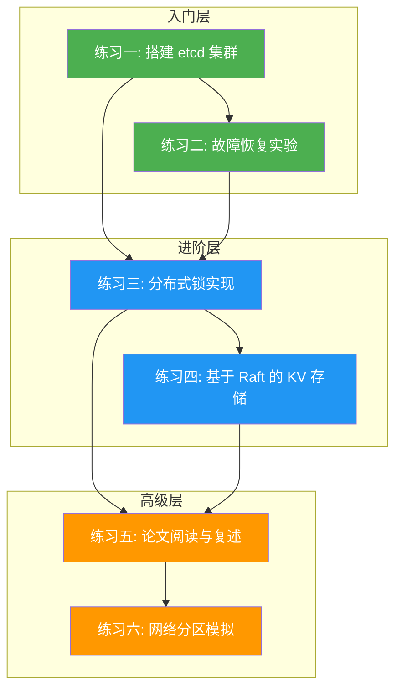
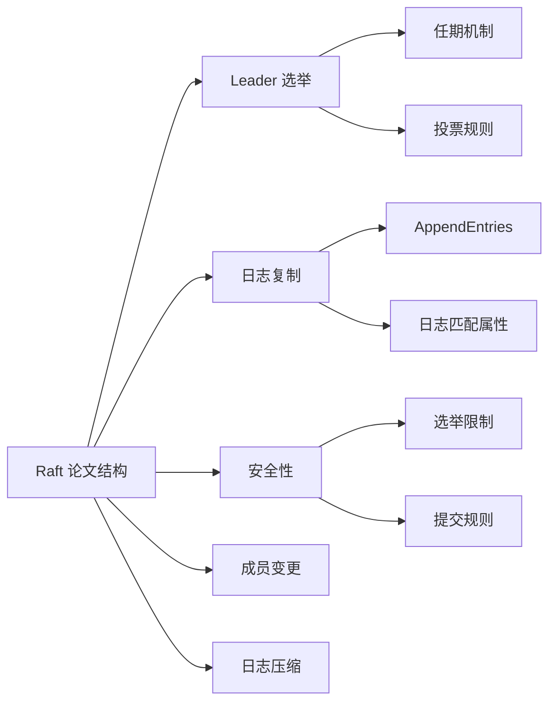

# 22.5 练习方法

> **本节定位：** 理论讲完、误区看完，但"知道"和"会做"之间隔着一道鸿沟。分布式共识的核心难点在于——你很难通过阅读来建立对选举超时、日志追赶、脑裂恢复等行为的**直觉**。这种直觉只能来自亲手操作。本节提供 6 个递进式练习，从部署一个能跑的集群到模拟真实故障场景，覆盖"入门→进阶→高级"三个层次，确保你不仅理解共识协议的理论，更能在生产环境中运用它。

## 为什么练习如此重要

分布式共识的学习有一个显著特点：**理论和实践之间的差距比其他领域更大**。

- 在 Web 开发中，你可以边看书边写 CRUD 接口，立刻看到效果
- 在算法学习中，你可以画图模拟一个排序算法的每一步
- 但在分布式共识中，你需要同时操作多个节点、模拟网络异常、观察异步行为——这些无法通过"在纸上推演"来替代

更关键的是，共识协议的很多行为是**反直觉**的：

| 直觉认知 | 实际行为 | 为什么不同 |
|----------|----------|-----------|
| "节点越多越可靠" | 5 节点写入延迟比 3 节点多 50% | 多数派确认需要更多网络往返 |
| "停掉 Leader 后服务会中断" | 几秒内自动恢复 | Raft 选举机制自动选出新 Leader |
| "写入成功后数据不会丢" | Leader 崩溃 + 异步复制可丢数据 | Safety 有前提条件 |
| "分布式锁获取后就安全了" | TTL 过期后锁自动释放 | Lease 机制有时间限制 |

只有通过动手实验，你才能真正理解这些反直觉的行为，形成可靠的工程直觉。

## 练习体系全景

本节共 6 个练习，按难度递进排列，形成完整的认知路径：



| 练习 | 内容 | 难度 | 预计时间 | 前置依赖 | 核心收获 |
|------|------|------|---------|---------|---------|
| 练习一 | 搭建 3 节点 etcd 集群 | ⭐ | 1-2h | Docker 基础 | 理解集群拓扑与节点角色 |
| 练习二 | 故障恢复实验 | ⭐ | 1-1.5h | 练习一 | 观察 Leader 选举与数据一致性 |
| 练习三 | 分布式锁实现 | ⭐⭐ | 2-3h | 练习一 + Go 基础 | 掌握 Session/TTL/互斥机制 |
| 练习四 | 基于 Raft 的 KV 存储 | ⭐⭐⭐ | 4-6h | 练习三 + Raft 理论 | 理解日志复制与状态机应用 |
| 练习五 | 论文阅读与复述 | ⭐⭐⭐ | 6-8h | Raft/Paxos 理论 | 深入理解协议设计动机 |
| 练习六 | 网络分区模拟 | ⭐⭐⭐⭐ | 3-4h | 练习一 + tc/iptables | 观察脑裂预防与恢复行为 |

---

## 练习一：搭建 3 节点 etcd 集群（入门）

### 目标

亲手部署和运维一个 etcd 集群，理解共识协议在实际系统中的行为。这不是一个"跑通就行"的练习——你需要理解每个配置参数的含义，因为它们直接决定了集群的行为。

### 前置条件

- Docker 和 Docker Compose 已安装（Docker >= 20.10，Compose >= 2.0）
- 至少 2GB 可用内存（3 个 etcd 节点各需约 100MB）
- 熟悉基本的命令行操作

### 步骤详解

**第一步：创建项目目录和配置文件**

```bash
mkdir -p ~/etcd-cluster &amp;&amp; cd ~/etcd-cluster
```

创建 `docker-compose.yml`：

```yaml
version: '3.8'

services:
  etcd1:
    image: quay.io/coreos/etcd:v3.5.17
    container_name: etcd1
    hostname: etcd1
    command:
      - etcd
      - --name=etcd1
      - --listen-client-urls=http://0.0.0.0:2379
      - --advertise-client-urls=http://etcd1:2379
      - --listen-peer-urls=http://0.0.0.0:2380
      - --initial-advertise-peer-urls=http://etcd1:2380
      - --initial-cluster=etcd1=http://etcd1:2380,etcd2=http://etcd2:2380,etcd3=http://etcd3:2380
      - --initial-cluster-state=new
      - --initial-cluster-token=etcd-cluster-01
    ports:
      - "2379:2379"
      - "2380:2380"
    volumes:
      - etcd1-data:/etcd-data
    restart: unless-stopped

  etcd2:
    image: quay.io/coreos/etcd:v3.5.17
    container_name: etcd2
    hostname: etcd2
    command:
      - etcd
      - --name=etcd2
      - --listen-client-urls=http://0.0.0.0:2379
      - --advertise-client-urls=http://etcd2:2379
      - --listen-peer-urls=http://0.0.0.0:2380
      - --initial-advertise-peer-urls=http://etcd2:2380
      - --initial-cluster=etcd1=http://etcd1:2380,etcd2=http://etcd2:2380,etcd3=http://etcd3:2380
      - --initial-cluster-state=new
      - --initial-cluster-token=etcd-cluster-01
    ports:
      - "22379:2379"
      - "22380:2380"
    volumes:
      - etcd2-data:/etcd-data
    restart: unless-stopped

  etcd3:
    image: quay.io/coreos/etcd:v3.5.17
    container_name: etcd3
    hostname: etcd3
    command:
      - etcd
      - --name=etcd3
      - --listen-client-urls=http://0.0.0.0:2379
      - --advertise-client-urls=http://etcd3:2379
      - --listen-peer-urls=http://0.0.0.0:2380
      - --initial-advertise-peer-urls=http://etcd3:2380
      - --initial-cluster=etcd1=http://etcd1:2380,etcd2=http://etcd2:2380,etcd3=http://etcd3:2380
      - --initial-cluster-state=new
      - --initial-cluster-token=etcd-cluster-01
    ports:
      - "32379:2379"
      - "32380:2380"
    volumes:
      - etcd3-data:/etcd-data
    restart: unless-stopped

volumes:
  etcd1-data:
  etcd2-data:
  etcd3-data:
```

**关键参数解释：**

| 参数 | 作用 | 为什么重要 |
|------|------|-----------|
| `--initial-cluster-token` | 集群唯一标识 | 防止不同集群的节点意外加入（安全防护） |
| `--initial-cluster-state=new` | 声明这是新集群 | 如果设置为 `existing`，etcd 会尝试加入已有集群 |
| `--listen-client-urls` | 客户端连接地址 | `0.0.0.0` 表示接受所有网络接口的连接 |
| `--advertise-client-urls` | 广播给客户端的地址 | 客户端通过这个地址找到节点 |
| `--listen-peer-urls` | 节点间通信地址 | Raft 日志复制、选举投票都走这个端口 |

**第二步：启动集群**

```bash
docker-compose up -d

# 查看启动日志，确认没有错误
docker-compose logs -f --tail=50
```

你应当看到类似这样的日志（每个节点）：

etcd1 | {"level":"info","msg":"peer starting","path":"/etcd-data/member/snap/db"}
etcd1 | {"level":"info","msg":"starting etcd"}
etcd1 | {"level":"info","msg":"ready to serve client requests"}

**第三步：验证集群状态**

```bash
# 设置别名简化命令（可选）
export ETCDCTL_API=3
alias etcdctl='docker exec etcd1 etcdctl'
alias EP='--endpoints=http://localhost:2379,http://localhost:22379,http://localhost:32379'

# 查看集群状态
etcdctl endpoint status $EP --write-out=table
```

输出示例：

+---------------------------+------------------+---------+---------+-----------+-----------------------------+----------------------------+
|         ENDPOINT          |        ID        | VERSION | DB SIZE | IS LEADER | IS LEARNER | RAFT TERM | RAFT INDEX |
+---------------------------+------------------+---------+---------+-----------+-----------------------------+----------------------------+
| http://localhost:2379     | 8e9e05c52164694d |  3.5.17 |  20 kB  |   true    |    false  |         2 |          8 |
| http://localhost:22379    | 91bc3c398fb3c146 |  3.5.17 |  20 kB  |   false   |    false  |         2 |          8 |
| http://localhost:32379    | fd422379fda50e48 |  3.5.17 |  20 kB  |   false   |    false  |         2 |          8 |
+---------------------------+------------------+---------+---------+-----------+-----------------------------+----------------------------+

**关键观察点：**

- `IS LEADER` 列显示只有一个 `true`——这就是 Raft 的 Leader 唯一性保证
- `RAFT TERM` 列所有节点相同——表明当前处于同一个任期
- `RAFT INDEX` 列所有节点相同——表明日志已完全同步

**第四步：验证读写功能**

```bash
# 写入数据
etcdctl put /test/key1 "hello-etcd"
# 输出: OK

# 读取数据
etcdctl get /test/key1
# 输出: /test/key1
#        hello-etcd

# 使用前缀查询
etcdctl put /test/key2 "second-value"
etcdctl get /test/ --prefix --keys-only
# 输出: /test/key1
#        /test/key2

# 使用租约（Lease）
etcdctl lease grant 30
# 输出: lease <租约ID> granted with TTL(30s)
etcdctl put /test/temp "expires-in-30s" --lease=<租约ID>
etcdctl get /test/temp
# 30 秒后再查询，数据消失
```

**第五步：安装本地 etcdctl（可选，推荐）**

```bash
ETCD_VER=v3.5.17
DOWNLOAD_URL=https://github.com/etcd-io/etcd/releases/download
curl -L ${DOWNLOAD_URL}/${ETCD_VER}/etcd-${ETCD_VER}-linux-amd64.tar.gz -o /tmp/etcd.tar.gz
sudo tar xzf /tmp/etcd.tar.gz -C /usr/local/bin/ --strip-components=1 etcd-${ETCD_VER}-linux-amd64/etcdctl

# 配置环境变量
export ETCDCTL_ENDPOINTS=http://localhost:2379,http://localhost:22379,http://localhost:32379
```

安装后可以直接用 `etcdctl` 而非 `docker exec`，操作更方便。

### 常见问题

| 问题 | 原因 | 解决方案 |
|------|------|---------|
| 节点启动后立即退出 | `--initial-cluster` 地址不匹配 | 确保三个节点的 `--initial-cluster` 值完全一致 |
| `rafthttp: failed to dial` | 容器网络不通 | 检查 Docker 网络，确保容器间 2380 端口可达 |
| Leader 频繁切换 | 选举超时配置过短 | 检查 `--heartbeat-interval` 和 `--election-timeout` 默认值是否合理 |
| `etcdcluster: 8e9e05c52164694d is not configured in cluster` | 节点 ID 与集群配置不匹配 | 删除数据卷重新启动（`docker-compose down -v`） |

### 检查标准

- [ ] 能成功启动 3 节点集群，所有节点日志无错误
- [ ] 能识别 Leader 节点（`endpoint status` 中 `IS LEADER=true`）
- [ ] 能在集群中读写数据（`put` + `get`）
- [ ] 理解 `endpoint status` 各字段含义（VERSION、DB SIZE、RAFT TERM、RAFT INDEX）
- [ ] 能解释为什么 3 节点集群容忍 1 个故障（多数派 = 2）

---

## 练习二：故障恢复实验（入门）

### 目标

观察 Leader 故障时的自动切换过程，理解 Raft 选举机制在实际系统中的行为。这个练习将建立你对"共识协议如何处理故障"的直觉——这是理解分布式系统高可用性的基础。

### 前置条件

- 已完成练习一，3 节点集群正在运行
- 了解 Raft 选举的基本概念（阅读 22.1.3 或 22.2.1）

### 步骤详解

**实验一：Leader 停止后自动选举**

```bash
# 步骤 1：记录当前 Leader
etcdctl endpoint status $EP --write-out=table
# 假设 etcd1 是 Leader（端口 2379）

# 步骤 2：写入测试数据
etcdctl put /test/leader-check "before-failure"
etcdctl put /test/counter "0"

# 步骤 3：启动一个持续写入的后台进程（模拟业务流量）
# 在另一个终端运行：
while true; do
    etcdctl put /test/heartbeat "$(date +%s)"
    sleep 0.5
done
```

```bash
# 步骤 4：停止 Leader 节点
docker stop etcd1
echo "Leader 已停止，等待选举..."

# 步骤 5：观察写入是否中断（在另一个终端）
# 注意观察：写入是否有短暂中断？中断持续多久？

# 步骤 6：等待 2-3 秒后，检查新 Leader
etcdctl endpoint status --endpoints=http://localhost:22379,http://localhost:32379 --write-out=table
# 观察：哪个节点变成了 Leader？
# 观察：RAFT TERM 是否增加了？（从 2 变成 3 表示发生了一次选举）

# 步骤 7：验证数据仍然可读
etcdctl get /test/leader-check
# 输出: /test/leader-check
#        before-failure
# 数据没有丢失！
```

**实验二：恢复节点后自动加入**

```bash
# 步骤 8：恢复 Leader 节点
docker start etcd1
echo "节点恢复中..."

# 步骤 9：等待节点重新加入集群（约 5-10 秒）
sleep 10
etcdctl endpoint health $EP
# 所有节点应显示 "health: true"

# 步骤 10：检查集群状态
etcdctl endpoint status $EP --write-out=table
# 观察：恢复的节点是否重新变为 Follower？
# 观察：RAFT INDEX 是否追上了其他节点？
```

**实验三：多数派丢失导致集群不可用**

```bash
# 步骤 11：停止两个节点（模拟多数派丢失）
docker stop etcd1 etcd2

# 步骤 12：尝试写入
etcdctl put /test/unavailable "should-fail"
# 输出: Error: context deadline exceeded
# 3 节点集群只能容忍 1 个故障，停 2 个就无法写入

# 步骤 13：恢复一个节点（但仍然不足多数派）
docker start etcd1
sleep 5
etcdctl put /test/unavailable "still-fails"
# 输出: Error: context deadline exceeded（仍然无法写入）

# 步骤 14：恢复第二个节点
docker start etcd2
sleep 5
etcdctl put /test/unavailable "now-works"
# 输出: OK（恢复多数派，集群重新可用）
```

### 关键观察清单

完成实验后，回答以下问题来验证理解：

1. **Leader 切换延迟**：从停止 Leader 到新 Leader 选出，大约花了多少秒？这与选举超时配置有什么关系？
2. **数据一致性**：Leader 切换后，之前写入的数据是否丢失？为什么？
3. **RAFT TERM 变化**：每次选举发生后，RAFT TERM 是否增加？TERM 的含义是什么？
4. **多数派原则**：为什么停 2 个节点后集群无法写入，但停 1 个可以？
5. **日志追赶**：恢复的节点是如何追上其他节点的日志的？（提示：快照 + AppendEntries）

### 常见问题

| 问题 | 原因 | 解决方案 |
|------|------|---------|
| Leader 切换后写入失败 | 客户端缓存了旧 Leader 地址 | 刷新客户端连接，或使用 `etcdctl` 重新指定 endpoints |
| 恢复的节点一直显示 `LEARNER` | 数据不一致触发了保护机制 | 检查节点日志，可能需要 `etcdctl member promote` |
| 选举超过 10 秒 | 网络延迟或时钟不同步 | 在 Docker 中时钟通常同步，检查容器网络延迟 |

### 检查标准

- [ ] 能在 3-5 秒内完成 Leader 切换（取决于选举超时配置）
- [ ] 故障期间数据可读（但可能短暂不可写）
- [ ] 节点恢复后自动加入集群并追赶日志
- [ ] 理解 Raft 选举超时（150-300ms 随机化）的作用
- [ ] 能解释为什么 3 节点集群停 2 个节点后不可用（多数派原则）

---

## 练习三：实现分布式锁（进阶）

### 目标

基于 etcd 实现一个分布式锁，理解 Session、TTL、互斥性保证的完整机制。分布式锁是共识协议最经典的应用场景之一——如果这个练习你做明白了，说明你真正理解了共识协议如何解决实际问题。

### 前置条件

- 已完成练习一（etcd 集群运行中）
- Go 语言基础（能写 main 函数和 goroutine）
- 已阅读 22.2.6（分布式锁实现）

### 实验一：基础分布式锁——互斥性验证

创建 `lock_test.go`：

```go
package main

import (
    "context"
    "fmt"
    "log"
    "sync"
    "time"

    clientv3 "go.etcd.io/etcd/client/v3"
    "go.etcd.io/etcd/client/v3/concurrency"
)

func main() {
    // 连接 etcd
    client, err := clientv3.New(clientv3.Config{
        Endpoints:   []string{"localhost:2379", "localhost:22379", "localhost:32379"},
        DialTimeout: 5 * time.Second,
    })
    if err != nil {
        log.Fatalf("连接 etcd 失败: %v", err)
    }
    defer client.Close()

    fmt.Println("=== 分布式锁互斥性测试 ===")
    fmt.Println("启动 10 个并发 goroutine，每个都尝试获取同一把锁")
    fmt.Println("预期：最终计数器值为 10（无竞态条件）")

    // 重置计数器
    client.Put(context.Background(), "/counter", "0")

    var wg sync.WaitGroup
    var mu sync.Mutex
    results := make([]string, 0)

    // 启动 10 个并发 goroutine
    for i := 0; i < 10; i++ {
        wg.Add(1)
        go func(id int) {
            defer wg.Done()

            // 创建 Session（自动续约）
            session, err := concurrency.NewSession(client, concurrency.WithTTL(10))
            if err != nil {
                log.Printf("[goroutine %d] 创建 session 失败: %v", id, err)
                return
            }
            defer session.Close()

            // 创建锁
            mutex := concurrency.NewMutex(session, "/locks/counter")

            // 获取锁（阻塞直到成功）
            start := time.Now()
            if err := mutex.Lock(context.Background()); err != nil {
                log.Printf("[goroutine %d] 获取锁失败: %v", id, err)
                return
            }
            waitTime := time.Since(start)

            // 临界区：读取-修改-写入
            resp, _ := client.Get(context.Background(), "/counter")
            current := 0
            if len(resp.Kvs) > 0 {
                fmt.Sscanf(string(resp.Kvs[0].Value), "%d", &amp;current)
            }
            current++
            client.Put(context.Background(), "/counter", fmt.Sprintf("%d", current))

            // 记录结果
            mu.Lock()
            results = append(results, fmt.Sprintf("[goroutine %d] 等待 %v, 计数器 -> %d", id, waitTime, current))
            mu.Unlock()

            // 释放锁
            mutex.Unlock(context.Background())
        }(i)
    }

    wg.Wait()

    // 验证结果
    resp, _ := client.Get(context.Background(), "/counter")
    finalValue := string(resp.Kvs[0].Value)
    fmt.Printf("\n最终计数器值: %s（期望值: 10）\n", finalValue)

    if finalValue != "10" {
        fmt.Println("⚠️  警告: 计数器值不正确，可能存在竞态条件！")
    } else {
        fmt.Println("✅ 测试通过: 互斥性验证成功")
    }

    fmt.Println("\n执行顺序:")
    for _, r := range results {
        fmt.Println("  ", r)
    }
}
```

运行测试：

```bash
go mod init lock_test
go mod tidy
go run lock_test.go
```

**预期输出：**

=== 分布式锁互斥性测试 ===
启动 10 个并发 goroutine，每个都尝试获取同一把锁
预期：最终计数器值为 10（无竞态条件）

最终计数器值: 10（期望值: 10）
✅ 测试通过: 互斥性验证成功

执行顺序:
   [goroutine 3] 等待 1.2ms, 计数器 -> 1
   [goroutine 7] 等待 45ms, 计数器 -> 2
   [goroutine 1] 等待 89ms, 计数器 -> 3
   ...

### 实验二：锁过期与续约观察

创建 `lease_test.go`：

```go
package main

import (
    "context"
    "fmt"
    "log"
    "time"

    clientv3 "go.etcd.io/etcd/client/v3"
    "go.etcd.io/etcd/client/v3/concurrency"
)

func main() {
    client, _ := clientv3.New(clientv3.Config{
        Endpoints: []string{"localhost:2379"},
    })
    defer client.Close()

    fmt.Println("=== 锁 TTL 过期实验 ===")

    // 场景 1：正常获取和释放
    fmt.Println("\n--- 场景 1: 正常获取和释放 ---")
    session1, _ := concurrency.NewSession(client, concurrency.WithTTL(5))
    mutex1 := concurrency.NewMutex(session1, "/test/ttl-lock")
    mutex1.Lock(context.Background())
    fmt.Println("锁已获取，5 秒后自动过期")
    time.Sleep(2 * time.Second)
    mutex1.Unlock(context.Background())
    fmt.Println("锁已手动释放")
    session1.Close()

    // 场景 2：获取锁后不释放，等待过期
    fmt.Println("\n--- 场景 2: 获取锁后不释放，等待过期 ---")
    session2, _ := concurrency.NewSession(client, concurrency.WithTTL(3))
    mutex2 := concurrency.NewMutex(session2, "/test/ttl-lock")
    mutex2.Lock(context.Background())
    fmt.Println("锁已获取（TTL=3s），不手动释放...")

    // 等待锁过期
    time.Sleep(4 * time.Second)
    fmt.Println("4 秒已过，锁应该已过期")

    // 尝试再次获取同一把锁
    session3, _ := concurrency.NewSession(client, concurrency.WithTTL(3))
    mutex3 := concurrency.NewMutex(session3, "/test/ttl-lock")
    err := mutex3.Lock(context.Background())
    if err != nil {
        fmt.Printf("获取锁失败: %v\n", err)
    } else {
        fmt.Println("✅ 成功获取锁（证明之前的锁已过期）")
        mutex3.Unlock(context.Background())
    }

    // 场景 3：观察 Session 自动续约
    fmt.Println("\n--- 场景 3: Session 自动续约 ---")
    session4, _ := concurrency.NewSession(client, concurrency.WithTTL(10))
    fmt.Printf("Session ID: %x\n", session4.Lease())
    fmt.Println("Session 将自动续约 30 秒...")
    fmt.Println("（在另一个终端运行: etcdctl lease list | etcdctl lease time-to-live <lease-id>）")
    time.Sleep(30 * time.Second)
    fmt.Println("30 秒后 Session 仍然存活（自动续约成功）")
    session4.Close()
}
```

### 实验三：锁竞争性能测试

创建 `contention_test.go`，观察高并发下的锁竞争行为：

```go
package main

import (
    "context"
    "fmt"
    "log"
    "sync"
    "sync/atomic"
    "time"

    clientv3 "go.etcd.io/etcd/client/v3"
    "go.etcd.io/etcd/client/v3/concurrency"
)

func main() {
    client, _ := clientv3.New(clientv3.Config{
        Endpoints: []string{"localhost:2379"},
    })
    defer client.Close()

    concurrency_level := 50 // 并发 goroutine 数量
    var acquired, failed int64
    var totalWaitTime int64

    fmt.Printf("=== 锁竞争性能测试 (%d 并发) ===\n", concurrency_level)

    client.Put(context.Background(), "/counter", "0")

    var wg sync.WaitGroup
    start := time.Now()

    for i := 0; i < concurrency_level; i++ {
        wg.Add(1)
        go func(id int) {
            defer wg.Done()

            session, err := concurrency.NewSession(client, concurrency.WithTTL(30))
            if err != nil {
                atomic.AddInt64(&amp;failed, 1)
                return
            }
            defer session.Close()

            mutex := concurrency.NewMutex(session, "/locks/perf-test")
            lockStart := time.Now()

            if err := mutex.Lock(context.Background()); err != nil {
                atomic.AddInt64(&amp;failed, 1)
                return
            }

            waitTime := time.Since(lockStart).Milliseconds()
            atomic.AddInt64(&amp;totalWaitTime, waitTime)
            atomic.AddInt64(&amp;acquired, 1)

            // 模拟临界区操作
            resp, _ := client.Get(context.Background(), "/counter")
            current := 0
            if len(resp.Kvs) > 0 {
                fmt.Sscanf(string(resp.Kvs[0].Value), "%d", &amp;current)
            }
            current++
            client.Put(context.Background(), "/counter", fmt.Sprintf("%d", current))

            mutex.Unlock(context.Background())
        }(i)
    }

    wg.Wait()
    elapsed := time.Since(start)

    fmt.Printf("\n结果:\n")
    fmt.Printf("  成功获取锁: %d/%d\n", acquired, concurrency_level)
    fmt.Printf("  获取锁失败: %d\n", failed)
    fmt.Printf("  总耗时: %v\n", elapsed)
    fmt.Printf("  平均等待时间: %vms\n", totalWaitTime/acquired)
    fmt.Printf("  吞吐量: %.1f ops/s\n", float64(acquired)/elapsed.Seconds())

    resp, _ := client.Get(context.Background(), "/counter")
    fmt.Printf("  最终计数器: %s\n", string(resp.Kvs[0].Value))
}
```

### 关键观察清单

1. **互斥性**：实验一中最终计数器值是否为 10？如果不是，说明锁的实现有问题
2. **等待时间分布**：不同 goroutine 的等待时间差异大吗？这说明什么？
3. **锁过期行为**：实验二中，TTL=3 秒的锁是否真的在 3 秒后过期？
4. **Session 续约**：实验二场景 3 中，TTL=10 秒的 Session 能存活 30 秒吗？
5. **高并发性能**：实验三中 50 个并发 goroutine 的吞吐量如何？瓶颈在哪里？

### 检查标准

- [ ] 10 个并发 goroutine 互斥执行，最终计数器值为 10（无竞态条件）
- [ ] 能观察到锁等待现象（不同 goroutine 等待时间不同）
- [ ] 理解 Session TTL 的作用（锁过期自动释放）
- [ ] 能解释为什么 etcd 分布式锁比 Redis 锁更可靠（基于共识协议而非单点）
- [ ] 能说出锁续期的必要性（长时间任务需要定期续约）

---

## 练习四：实现基于 Raft 的 KV 存储（进阶）

### 目标

使用 etcd 的 raft 库实现一个简单的分布式 KV 存储。这个练习将带你从"使用 etcd"深入到"理解 etcd 内部的工作原理"——你将亲手实现日志复制、状态机应用、Leader 选举等核心机制。

### 前置条件

- 已完成练习三（分布式锁）
- 熟悉 Go 语言（goroutine、channel、interface）
- 已阅读 22.1.3（Raft 协议详解）和 22.2.2（日志一致性快速恢复）

### 核心架构

┌─────────────────────────────────────────────────────┐
│                    应用层 (gRPC)                     │
│  Get(key) / Put(key, value) / Delete(key)           │
├─────────────────────────────────────────────────────┤
│                    状态机 (KVStore)                   │
│  map[string]string + sync.RWMutex                   │
├─────────────────────────────────────────────────────┤
│                    Raft 引擎                         │
│  日志复制 | Leader 选举 | 安全性保证                    │
├─────────────────────────────────────────────────────┤
│                    持久化层                           │
│  WAL (Write-Ahead Log) | Snapshot                   │
└─────────────────────────────────────────────────────┘

### 步骤详解

**第一步：项目结构**

```bash
mkdir -p raft-kv &amp;&amp; cd raft-kv
go mod init raft-kv
go get go.etcd.io/raft/v3
go get go.etcd.io/raft/v3/raftpb
go get google.golang.org/protobuf
```

**第二步：定义数据结构和命令**

```go
// types.go
package main

import "errors"

// Command 表示客户端请求的操作
type Command struct {
    Type  string `json:"type"`  // PUT, DELETE, GET
    Key   string `json:"key"`
    Value string `json:"value,omitempty"`
}

// 常见错误
var (
    ErrNotLeader      = errors.New("当前节点不是 Leader")
    ErrKeyNotFound    = errors.New("键不存在")
    ErrKeyEmpty       = errors.New("键不能为空")
    ErrInvalidCommand = errors.New("无效的命令")
)
```

**第三步：实现状态机**

```go
// state_machine.go
package main

import (
    "encoding/json"
    "fmt"
    "log"
    "sync"

    "go.etcd.io/raft/v3"
    "go.etcd.io/raft/v3/raftpb"
)

// KVStore 是基于 Raft 的键值存储状态机
type KVStore struct {
    raftNode raft.Node
    store    map[string]string
    mu       sync.RWMutex

    // 快照相关
    snapshotIndex uint64
    snapshotTerm  uint64
}

// NewKVStore 创建新的 KV 存储实例
func NewKVStore(raftNode raft.Node) *KVStore {
    return &amp;KVStore{
        raftNode: raftNode,
        store:    make(map[string]string),
    }
}

// Apply 将已提交的日志条目应用到状态机
// 这是 Raft 核心循环的关键步骤：日志条目被多数派确认后，才调用此方法
func (kv *KVStore) Apply(entries []raftpb.Entry) {
    for _, entry := range entries {
        if entry.Type != raftpb.EntryNormal {
            // 配置变更等特殊条目，跳过
            continue
        }

        var cmd Command
        if err := json.Unmarshal(entry.Data, &amp;cmd); err != nil {
            log.Printf("解析命令失败: %v", err)
            continue
        }

        kv.mu.Lock()
        switch cmd.Type {
        case "PUT":
            kv.store[cmd.Key] = cmd.Value
            log.Printf("[应用] PUT %s = %s (index=%d)", cmd.Key, cmd.Value, entry.Index)
        case "DELETE":
            delete(kv.store, cmd.Key)
            log.Printf("[应用] DELETE %s (index=%d)", cmd.Key, entry.Index)
        default:
            log.Printf("未知命令类型: %s", cmd.Type)
        }
        kv.mu.Unlock()
    }
}

// Get 从本地状态机读取值
// 注意：这只保证读到 Leader 自己的状态机，不保证线性一致性
func (kv *KVStore) Get(key string) (string, error) {
    kv.mu.RLock()
    defer kv.mu.RUnlock()
    value, ok := kv.store[key]
    if !ok {
        return "", ErrKeyNotFound
    }
    return value, nil
}

// Put 提交写入请求到 Raft 日志
func (kv *KVStore) Put(key, value string) error {
    if key == "" {
        return ErrKeyEmpty
    }

    cmd := Command{Type: "PUT", Key: key, Value: value}
    data, _ := json.Marshal(cmd)

    // 提交到 Raft 日志（只有 Leader 能提交）
    err := kv.raftNode.Propose(data)
    if err != nil {
        return fmt.Errorf("提案失败: %w", err)
    }
    return nil
}

// Delete 提交删除请求到 Raft 日志
func (kv *KVStore) Delete(key string) error {
    if key == "" {
        return ErrKeyEmpty
    }

    cmd := Command{Type: "DELETE", Key: key}
    data, _ := json.Marshal(cmd)

    return kv.raftNode.Propose(data)
}

// Snapshot 返回状态机的快照数据
func (kv *KVStore) Snapshot() ([]byte, error) {
    kv.mu.RLock()
    defer kv.mu.RUnlock()
    return json.Marshal(kv.store)
}

// ApplySnapshot 将快照数据应用到状态机
func (kv *KVStore) ApplySnapshot(data []byte) error {
    kv.mu.Lock()
    defer kv.mu.Unlock()

    var snapshot map[string]string
    if err := json.Unmarshal(data, &amp;snapshot); err != nil {
        return fmt.Errorf("解析快照失败: %w", err)
    }

    kv.store = snapshot
    log.Printf("快照已应用，包含 %d 个键值对", len(snapshot))
    return nil
}
```

**第四步：实现 Raft 节点管理**

```go
// raft_node.go
package main

import (
    "context"
    "encoding/json"
    "log"
    "os"
    "path/filepath"
    "time"

    "go.etcd.io/raft/v3"
    "go.etcd.io/raft/v3/raftpb"
    "google.golang.org/protobuf/proto"
)

// RaftNode 封装了 Raft 节点的完整生命周期
type RaftNode struct {
    id       uint64
    peers    []string
    raftNode raft.Node
    store    *KVStore
    snapshotter *Snapshotter
    wal      *WAL
}

// NewRaftNode 创建并启动一个 Raft 节点
func NewRaftNode(id uint64, peers []string, dataDir string) (*RaftNode, error) {
    node := &amp;RaftNode{
        id:    id,
        peers: peers,
    }

    // 1. 初始化持久化层
    if err := node.initStorage(dataDir); err != nil {
        return nil, err
    }

    // 2. 创建 Raft 节点
    config := &amp;raft.Config{
        ID:              id,
        ElectionTick:    10,  // 选举超时 = 10 * 心跳间隔
        HeartbeatTick:   1,   // 心跳间隔
        Storage:         node.wal,
        MaxSizePerMsg:   1024 * 1024,  // 1MB
        MaxInflightMsgs: 256,
    }

    node.raftNode = raft.StartNode(config, node.getPeers())
    node.store = NewKVStore(node.raftNode)

    return node, nil
}

// Run 启动 Raft 节点的主循环
func (n *RaftNode) Run() {
    ticker := time.NewTicker(100 * time.Millisecond)
    defer ticker.Stop()

    for {
        select {
        case <-ticker.C:
            // 定期处理 Raft 任务
            n.handleRaftTick()

        case <-n.raftNode.Ready():
            // 处理 Ready 通道中的所有待处理事项
            n.handleReady()
        }
    }
}

// handleReady 处理 Raft 引擎产生的 Ready 对象
// 这是 Raft 核心循环：接收 Ready -> 持久化 -> 发送消息 -> 应用状态机
func (n *RaftNode) handleReady() {
    ready := <-n.raftNode.Ready()

    // 1. 持久化 HardState（包含 term、vote、commit）
    if !proto.Equal(&amp;ready.HardState, &amp;raftpb.HardState{}) {
        if err := n.wal.SaveHardState(ready.HardState); err != nil {
            log.Fatalf("保存 HardState 失败: %v", err)
        }
    }

    // 2. 持久化日志条目
    if len(ready.Entries) > 0 {
        if err := n.wal.SaveEntries(ready.Entries); err != nil {
            log.Fatalf("保存日志条目失败: %v", err)
        }
    }

    // 3. 发送网络消息（AppendEntries、RequestVote 等）
    for _, msg := range ready.Messages {
        n.sendMessage(msg)
    }

    // 4. 将已提交的条目应用到状态机
    if len(ready.CommittedEntries) > 0 {
        n.store.Apply(ready.CommittedEntries)
    }

    // 5. 处理快照
    if !proto.Equal(&amp;ready.Snapshot, &amp;raftpb.Snapshot{}) {
        if err := n.applySnapshot(ready.Snapshot); err != nil {
            log.Fatalf("应用快照失败: %v", err)
        }
    }

    // 6. 通知 Raft 引擎 Ready 已处理完毕
    n.raftNode.Advance()
}

// sendMessage 发送 Raft 消息到目标节点
func (n *RaftNode) sendMessage(msg raftpb.Message) {
    // 在实际实现中，这会通过 gRPC 或 TCP 发送到目标节点
    // 这里简化为日志输出
    log.Printf("[发送] %s -> %d (type=%d, term=%d)",
        raftpb.MessageType_name[int32(msg.Type)],
        msg.To, msg.Type, msg.Term)
}
```

**第五步：启动多节点集群（简化版）**

```go
// main.go
package main

import (
    "fmt"
    "log"
    "os"
    "os/signal"
    "strconv"
    "syscall"
)

func main() {
    if len(os.Args) < 3 {
        fmt.Println("用法: go run main.go <节点ID> <数据目录>")
        fmt.Println("示例: go run main.go 1 /tmp/raft-kv-1")
        os.Exit(1)
    }

    id, _ := strconv.ParseUint(os.Args[1], 10, 64)
    dataDir := os.Args[2]

    // 定义集群成员（3 节点）
    peers := []string{
        "http://localhost:10001",
        "http://localhost:10002",
        "http://localhost:10003",
    }

    // 创建数据目录
    os.MkdirAll(dataDir, 0755)

    // 创建 Raft 节点
    node, err := NewRaftNode(id, peers, dataDir)
    if err != nil {
        log.Fatalf("创建节点失败: %v", err)
    }

    log.Printf("节点 %d 启动，数据目录: %s", id, dataDir)

    // 启动节点主循环
    go node.Run()

    // 等待退出信号
    sigCh := make(chan os.Signal, 1)
    signal.Notify(sigCh, syscall.SIGINT, syscall.SIGTERM)
    <-sigCh

    log.Printf("节点 %d 正在关闭...", id)
    node.raftNode.Stop()
    os.Exit(0)
}
```

启动 3 个节点（在不同终端）：

```bash
# 终端 1
go run main.go 1 /tmp/raft-kv-1

# 终端 2
go run main.go 2 /tmp/raft-kv-2

# 终端 3
go run main.go 3 /tmp/raft-kv-3
```

### 关键观察清单

1. **Leader 选举**：启动后，观察哪个节点成为 Leader。停止 Leader 后，新选举花了多长时间？
2. **日志复制**：在 Leader 上执行 PUT 操作，观察 Follower 是否收到并应用了相同的日志条目
3. **状态机应用**：只有 `raftNode.Ready()` 中的 `CommittedEntries` 才会被 Apply——理解为什么不能直接 Apply 所有条目
4. **持久化顺序**：HardState → Entries → Messages → Apply 的顺序为什么不能变？
5. **快照机制**：当日志条目积累到一定数量后，触发快照并截断旧日志

### 检查标准

- [ ] 能成功启动 3 节点 KV 存储
- [ ] 写入操作通过 Raft 复制到所有节点
- [ ] Leader 故障后自动切换
- [ ] 能从新 Leader 读取到之前写入的数据
- [ ] 理解 Ready 循环的完整流程（HardState → Entries → Messages → Apply）
- [ ] 能解释为什么状态机 Apply 必须在持久化之后

---

## 练习五：Raft 论文阅读与复述（高级）

### 目标

深入理解 Raft 论文的每个细节，能够向他人解释清楚。这是"知其然"到"知其所以然"的跨越——不仅能用 Raft，还能解释为什么 Raft 的每个设计选择是合理的。

### 前置条件

- 已完成练习一到练习四（有实践经验）
- 已阅读 22.1.3（Raft 协议详解）和 22.1.2（Paxos 协议详解）
- 准备 6-8 小时的专注时间

### 阅读材料

1. **必读论文**：Ongaro & Ousterhout, "In Search of an Understandable Consensus Algorithm" (USENIX ATC 2014)
   - 获取地址：https://raft.github.io/raft.pdf
2. **辅助可视化**：http://thesecretlivesofdata.com/raft/
3. **博士论文**：Ongaro, "Consensus: Bridging Theory and Practice" (Stanford 2014)

### 三遍读书法

**第一遍（30 分钟）：快速浏览，建立全景**



- 目标：理解论文的整体结构和三个子问题的划分
- 重点：Figure 2（状态转换图）、Figure 1（RPC 消息类型）
- 方法：快速翻阅，标记不理解的地方，但不深究

**第二遍（3 小时）：逐节精读，理解每个细节**

| 章节 | 核心概念 | 必须理解的细节 | 验证方法 |
|------|---------|--------------|---------|
| 5.1 Leader 选举 | 任期、随机超时、投票规则 | 为什么需要随机超时？（避免活锁） | 画出选举流程的时序图 |
| 5.2 日志复制 | AppendEntries、日志匹配属性 | 为什么 nextIndex 回退是安全的？ | 手动模拟 3 个节点的日志追赶过程 |
| 5.3 安全性 | 选举限制、提交规则 | 为什么只能提交当前任期的日志？ | 画出 Figure 8 的反例场景 |
| 5.4 成员变更 | 联合共识、单步变更 | 为什么不能直接从 3 节点变到 5 节点？ | 推演直接变更的安全隐患 |
| 5.5 日志压缩 | 快照、InstallSnapshot RPC | 快照期间收到客户端请求怎么办？ | 模拟快照截断后的日志追赶过程 |

**第三遍（2 小时）：与 Paxos 对比，理解设计动机**

| 对比维度 | Raft | Paxos | 设计动机 |
|----------|------|-------|---------|
| Leader 角色 | 强 Leader，所有写入经过 Leader | 无固定 Leader（Basic Paxos）/ 可选 Leader（Multi-Paxos） | Raft 通过 Leader 简化了日志复制 |
| 日志结构 | 每个日志槽位有任期号 | 每个提案有编号 | Raft 的任期号同时用于选举和日志一致性检查 |
| 成员变更 | 联合共识或单步变更 | 配置变更无标准方案 | Raft 为成员变更提供了安全保证 |
| 可理解性 | 高（三个子问题分解） | 低（抽象程度高） | Raft 的设计目标就是可理解性 |
| 性能 | 中等（Leader 瓶颈） | 较高（无 Leader 可并行提案） | Raft 牺牲部分性能换取简洁性 |

### 输出要求

完成三遍阅读后，写一篇 2000 字的 Raft 总结，包含以下部分：

1. **核心思想**（300 字）：Raft 如何通过 Leader 简化共识问题
2. **三个子问题**（600 字）：选举、复制、安全性的详细解释
3. **安全性保证**（500 字）：五条安全性规则及证明直觉
4. **与 Paxos 的对比**（300 字）：为什么 Raft 选择了这样的设计
5. **个人理解**（300 字）：你认为 Raft 最巧妙的设计是什么？为什么？

### 检查标准

- [ ] 能画出 Raft 的状态转换图（Figure 2），并解释每个转换条件
- [ ] 能解释为什么 Raft 只提交当前任期的日志（Figure 8 的反例）
- [ ] 能解释 Pre-Vote 的作用（防止网络分区恢复后的不必要的选举）
- [ ] 能对比 Raft 和 Paxos 的优劣，并给出自己的判断
- [ ] 能向非专业人士解释 Raft 的核心思想（用类比而非术语）

---

## 练习六：网络分区模拟（高级）

### 目标

使用 Linux 网络工具模拟真实网络分区，观察共识协议如何处理脑裂、恢复、数据一致性等高级场景。这个练习将你在练习二中学到的故障恢复知识推向极致——从"单节点故障"升级到"网络分区"。

### 前置条件

- 已完成练习一（etcd 集群运行中）
- Linux 环境（需要 `tc` 或 `iptables` 工具）
- 已阅读 22.4 常见误区（特别是误区一和误区七）

### 实验一：使用 tc 模拟网络延迟

```bash
# 安装 tc 工具
sudo apt-get install iproute2

# 查看容器的网络接口
docker inspect etcd1 | grep -i "networksettings" -A 5

# 为 etcd1 添加 100ms 延迟（模拟网络变慢）
# 首先找到 etcd1 容器的网络接口
ETCD1_PID=$(docker inspect -f '{{.State.Pid}}' etcd1)
sudo nsenter -t $ETCD1_PID -n tc qdisc add dev eth0 root netem delay 100ms

# 验证延迟生效
docker exec etcd1 etcdctl endpoint status \
  --endpoints=http://localhost:2379 --write-out=table
# 观察：操作延迟是否明显增加？

# 移除延迟
sudo nsenter -t $ETCD1_PID -n tc qdisc del dev eth0 root
```

### 实验二：使用 iptables 模拟网络分区

```bash
# 场景：将 Leader 与一个 Follower 隔离
# 前提：确认当前 Leader（假设是 etcd1）

# 步骤 1：记录当前 Leader
etcdctl endpoint status $EP --write-out=table

# 步骤 2：阻断 etcd1 与 etcd2 之间的通信
ETCD1_PID=$(docker inspect -f '{{.State.Pid}}' etcd1)
ETCD2_PID=$(docker inspect -f '{{.State.Pid}}' etcd2)

# 获取容器 IP
ETCD1_IP=$(docker inspect -f '{{range.NetworkSettings.Networks}}{{.IPAddress}}{{end}}' etcd1)
ETCD2_IP=$(docker inspect -f '{{range.NetworkSettings.Networks}}{{.IPAddress}}{{end}}' etcd2)
ETCD3_IP=$(docker inspect -f '{{range.NetworkSettings.Networks}}{{.IPAddress}}{{end}}' etcd3)

# 在 etcd1 上阻断到 etcd2 的通信
sudo nsenter -t $ETCD1_PID -n iptables -A OUTPUT -d $ETCD2_IP -j DROP
# 在 etcd2 上阻断到 etcd1 的通信（双向阻断）
sudo nsenter -t $ETCD2_PID -n iptables -A OUTPUT -d $ETCD1_IP -j DROP

echo "网络分区已建立: etcd1 | etcd2 (etcd3 可达两者)"

# 步骤 3：观察行为
sleep 5
etcdctl endpoint status \
  --endpoints=http://localhost:2379,http://localhost:22379,http://localhost:32379 \
  --write-out=table
# 观察：是否发生 Leader 选举？哪个节点成为新 Leader？

# 步骤 4：尝试写入
etcdctl put /test/partition "before-recovery"
# 观察：写入是否成功？（取决于你连接的端点）

# 步骤 5：恢复网络
sudo nsenter -t $ETCD1_PID -n iptables -D OUTPUT -d $ETCD2_IP -j DROP
sudo nsenter -t $ETCD2_PID -n iptables -D OUTPUT -d $ETCD1_IP -j DROP

echo "网络已恢复"

# 步骤 6：等待集群恢复
sleep 10
etcdctl endpoint status $EP --write-out=table
# 观察：集群是否恢复到一致状态？
```

### 实验三：脑裂场景观察

```bash
# 场景：将集群分为两组，观察会发生什么
# 前提：5 节点集群（如果只有 3 节点，观察行为会不同）

# 如果是 3 节点集群：
# 隔离 1 个节点 → 剩余 2 个节点可以形成多数派
# 隔离 2 个节点 → 无法形成多数派，集群不可用

# 测试 3 节点集群的分区行为
# 步骤 1：隔离 etcd3
ETCD3_PID=$(docker inspect -f '{{.State.Pid}}' etcd3)
ETCD1_IP=$(docker inspect -f '{{range.NetworkSettings.Networks}}{{.IPAddress}}{{end}}' etcd1)
ETCD2_IP=$(docker inspect -f '{{range.NetworkSettings.Networks}}{{.IPAddress}}{{end}}' etcd2)
ETCD3_IP=$(docker inspect -f '{{range.NetworkSettings.Networks}}{{.IPAddress}}{{end}}' etcd3)

# 阻断 etcd3 与所有其他节点的通信
sudo nsenter -t $ETCD3_PID -n iptables -A OUTPUT -d $ETCD1_IP -j DROP
sudo nsenter -t $ETCD3_PID -n iptables -A OUTPUT -d $ETCD2_IP -j DROP
sudo nsenter -t $ETCD1_PID -n iptables -A OUTPUT -d $ETCD3_IP -j DROP
sudo nsenter -t $ETCD2_PID -n iptables -A OUTPUT -d $ETCD3_IP -j DROP

echo "etcd3 已被隔离"

# 步骤 2：观察
sleep 5
# 可用端点
etcdctl endpoint status \
  --endpoints=http://localhost:2379,http://localhost:22379 \
  --write-out=table
# 观察：etcd1 和 etcd2 是否仍然可以提供服务？

# 不可用端点
etcdctl endpoint status \
  --endpoints=http://localhost:32379 \
  --write-out=table
# 观察：被隔离的 etcd3 会怎样？（可能尝试选举但无法获得多数票）

# 步骤 3：尝试写入（从可用端点）
etcdctl put /test/split-brain "minority-can-write"
# 观察：是否成功？

# 步骤 4：恢复分区
sudo nsenter -t $ETCD3_PID -n iptables -D OUTPUT -d $ETCD1_IP -j DROP
sudo nsenter -t $ETCD3_PID -n iptables -D OUTPUT -d $ETCD2_IP -j DROP
sudo nsenter -t $ETCD1_PID -n iptables -D OUTPUT -d $ETCD3_IP -j DROP
sudo nsenter -t $ETCD2_PID -n iptables -D OUTPUT -d $ETCD3_IP -j DROP

# 步骤 5：验证数据一致性
sleep 10
etcdctl get /test/split-brain
# 观察：被隔离的节点是否丢失了分区期间的写入？
```

### 关键观察清单

1. **选举行为**：网络分区发生后，是否触发了新的 Leader 选举？选举耗时多少？
2. **多数派原则**：被隔离的少数派节点是否还能提供服务？
3. **脑裂预防**：Raft 如何防止两个分区各自选出 Leader？（提示：需要多数派投票）
4. **数据一致性**：分区恢复后，所有节点的数据是否一致？少数派的写入是否被覆盖？
5. **RAFT TERM 变化**：每次分区和恢复后，RAFT TERM 如何变化？

### 常见问题

| 问题 | 原因 | 解决方案 |
|------|------|---------|
| iptables 规则不生效 | 容器网络命名空间不同 | 确保使用 `nsenter` 进入正确的网络命名空间 |
| 恢复后集群仍不同步 | 日志截断或快照丢失 | 检查节点日志，可能需要人工干预 |
| `tc` 延迟影响了所有通信 | `tc` 规则应用于整个容器网络 | 使用更精确的过滤规则（`tc filter`） |

### 检查标准

- [ ] 能使用 `tc` 模拟网络延迟，观察共识协议的行为变化
- [ ] 能使用 `iptables` 模拟网络分区，观察 Leader 选举过程
- [ ] 能解释为什么 Raft 能防止脑裂（多数派投票机制）
- [ ] 能分析分区恢复后的数据一致性状态
- [ ] 理解"少数派不可用"是 Safety 的代价，"多数派可用"是 Liveness 的保证

---

## 学习路径选择

根据你的背景和目标，选择适合的练习路径：

### 路径 A：完整路径（推荐，15-20 小时）

适合第一次接触分布式共识的读者，建议按顺序完成所有 6 个练习：

练习一 → 练习二 → 练习三 → 练习四 → 练习五 → 练习六
   ↓         ↓         ↓         ↓         ↓         ↓
 部署集群  故障恢复  分布式锁  Raft KV   论文精读  网络分区

### 路径 B：快速实践（5-8 小时）

适合已有分布式系统经验、想快速上手 etcd 的工程师：

练习一 → 练习二 → 练习三
   ↓         ↓         ↓
 部署集群  故障恢复  分布式锁

### 路径 C：理论深究（8-10 小时）

适合想深入理解共识理论、为技术面试做准备的读者：

练习五 → 练习四 → 练习六
   ↓         ↓         ↓
 论文精读  Raft KV   网络分区

## 通用排错指南

在所有练习中，以下排错技巧通用：

| 问题类型 | 排查步骤 | 常用命令 |
|----------|---------|---------|
| 集群无法启动 | 检查端口占用、网络连通性、配置文件 | `docker-compose logs`、`netstat -tlnp` |
| Leader 频繁切换 | 检查选举超时配置、网络延迟、磁盘 IO | `iostat -x 1`、`etcdctl endpoint status` |
| 写入超时 | 检查多数派节点是否可用、网络是否正常 | `etcdctl endpoint health`、`ping` |
| 读取数据不一致 | 检查读取是否从 Leader 读取、是否使用了串行化读 | `etcdctl get --consistency=l` |
| 容器网络不通 | 检查 Docker 网络、iptables 规则 | `docker network inspect`、`iptables -L` |

## 总结

这 6 个练习覆盖了分布式共识从"能用"到"理解"再到"精通"的完整路径。核心原则是：**先动手建立直觉，再用理论解释直觉，最后用实验验证理论**。

完成这些练习后，你将具备以下能力：

1. **部署能力**：能独立搭建和运维 etcd 集群
2. **故障处理能力**：能诊断和处理 Leader 选举、网络分区等常见问题
3. **开发能力**：能基于 etcd 实现分布式锁、选主、配置中心等应用
4. **理论深度**：能解释 Raft 每个设计选择的原因，能与 Paxos 进行对比
5. **工程判断力**：能在生产环境中做出合理的技术决策

> **最后的建议：** 分布式共识的学习没有捷径。论文读三遍不如亲手搭一次集群，搭一次集群不如模拟一次故障。动手实践是理解分布式系统最可靠的方式。
