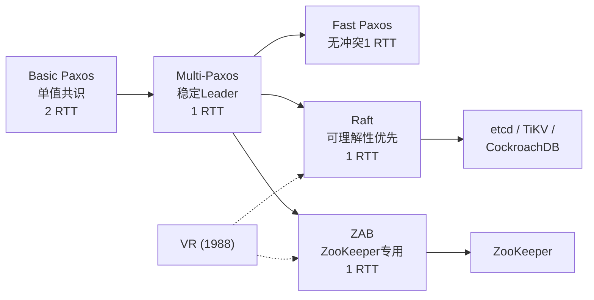
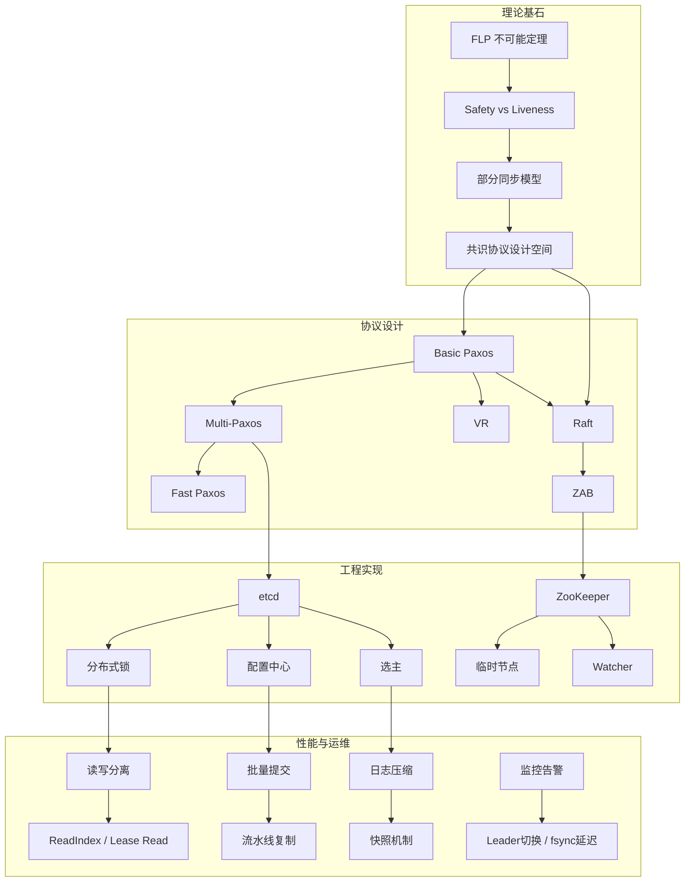
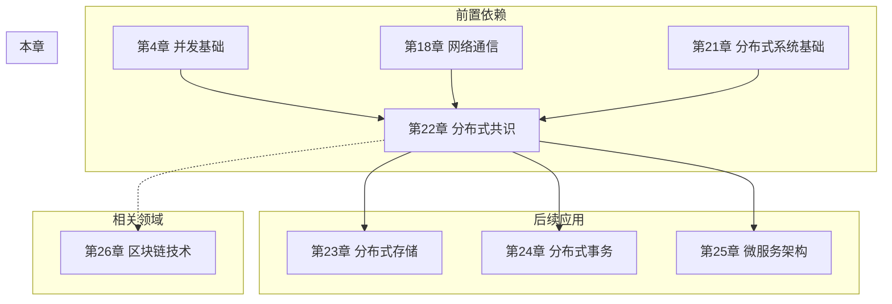

# 22.6 本章小结

> **本节定位：** 作为全章的终章，本节不是简单的知识点罗列，而是一份可以反复查阅的「速查手册」——它将 22.1 至 22.5 共 20 节内容浓缩为关键知识点回顾、核心公式速查、工程实践要点、选型决策框架、学习路线规划和面试高频问题六大模块。建议读者先通读本节建立全局视图，再回头深入感兴趣的章节。

---

## 关键知识点回顾

### 共识问题的本质

分布式共识的核心挑战可以概括为一句话：**在多个可能故障的节点之间，就某个值达成一致意见**。这一定义看似简单，背后却蕴含着分布式系统中最深刻的理论限制。

一个正确的共识协议必须同时满足四个基本属性：

| 属性 | 英文 | 含义 | 形式化表达 |
|------|------|------|-----------|
| 一致性 | Agreement | 所有正确的进程决定相同的值 | ∀ p, q : decided(p) ∧ decided(q) → value(p) = value(q) |
| 有效性 | Validity | 决定的值必须是某个进程提议过的 | decided(p, v) → ∃ q : proposed(q, v) |
| 终止性 | Termination | 所有正确的进程最终做出决定 | ∀ p : correct(p) → ◇ decided(p) |
| 完整性 | Integrity | 每个进程最多决定一次 | ∀ p : decided(p, v) ∧ decided(p, w) → v = w |

其中，**一致性 + 有效性 + 完整性** 构成了 Safety（"坏事不会发生"），**终止性** 构成了 Liveness（"好事最终会发生"）。理解这两大属性的根本性张力，是掌握后续所有共识协议设计的钥匙。

### FLP 不可能定理

1985 年，Fischer、Lynch 和 Paterson 证明了分布式计算领域最著名的不可能性定理：

> 在一个异步系统中，即使只有一个进程可能崩溃，也不存在一个确定性的共识算法能同时保证 Safety 和 Liveness。

FLP 定理并不意味着共识问题在实践中不可解，它划定了理论边界，而工程实践在这条边界之上找到了多种绕过路径：

| 绕过方式 | 核心思想 | 代表协议 |
|---------|---------|---------|
| 部分同步模型 | 假设大部分时间网络是同步的，偶尔允许异步期 | Paxos, Raft |
| 故障检测器 | 使用超时机制"猜测"崩溃节点，允许误判 | etcd 的心跳机制 |
| 随机化算法 | 引入随机性保证终止性，以极小概率违反 Safety | Ben-Or 算法 |
| Leader 机制 | 选举 Leader 协调共识过程，减少冲突 | Multi-Paxos, Raft |

### Paxos 协议族

Paxos 是分布式共识的奠基之作，由 Leslie Lamport 于 1990 年提出。理解 Paxos 的关键是把握两阶段提交与多数派交集的组合效果：

**Basic Paxos** — 每次就一个值达成共识，两阶段协议：
- **Prepare 阶段**：Proposer 发送 Prepare(n) 请求，Acceptor 承诺不再接受编号小于 n 的提案，并返回之前已接受的编号最高的提案值。
- **Accept 阶段**：Proposer 向多数派发送 Accept(n, v)，Acceptor 接受该提案。当多数派接受同一提案时，值被选定。
- **延迟**：2 RTT（Prepare 一轮 + Accept 一轮）。

**Multi-Paxos** — 引入稳定 Leader，优化为日志复制：
- 通过一次 Basic Paxos 选出 Leader，后续日志条目跳过 Prepare 阶段，直接进入 Accept 阶段。
- **延迟**：Leader 稳定时每条日志仅需 1 RTT。
- **核心不变量 P2c**：如果编号为 n 的提案被选定，那么任何编号 m > n 的提案其值必须与编号 n 的提案相同。

**Fast Paxos** — 无冲突时 1 RTT：
- 允许 Proposer 直接向 Acceptor 发送 Accept 请求，跳过 Leader 中转。
- Fast Quorum 大小为 ⌈(3n+1)/4⌉（比 Classic Quorum ⌈(n+1)/2⌉ 大约 50%）。
- 冲突发生时回退到 Classic Paxos 两阶段流程。

### Raft 协议

Raft（2014）以「可理解性」为设计目标，将共识分解为三个相对独立的子问题：

**1. Leader 选举**
- 随机化选举超时（150-300ms）防止多个 Candidate 同时发起选举。
- Candidate 向所有节点发送 RequestVote RPC，获得多数票后晋升为 Leader。
- 每个节点每个任期只投一票，保证每个任期最多一个 Leader。
- Pre-Vote 机制：Candidate 先探测是否能赢得选举，避免不必要的任期递增。

**2. 日志复制**
- Leader 接收客户端请求，将操作作为日志条目追加到本地日志。
- 通过 AppendEntries RPC 将日志复制到所有 Follower。
- **日志匹配属性**：如果两个日志在某个索引处任期相同，则该索引之前的所有条目也相同。
- Leader 累积多数派确认后提交日志，应用到状态机。

**3. 安全性保证**
五条安全性规则构成 Raft 正确性的基石：
- **选举安全**：每个任期最多一个 Leader。
- **Leader 只追加**：Leader 只能追加日志，不能删除或覆盖。
- **日志匹配**：如果两个日志在某索引处任期相同，则之前所有条目相同。
- **Leader 完整性**：如果某日志条目在某任期被提交，则所有更高任期的 Leader 都包含该条目。
- **状态机安全**：如果某索引处的日志条目已提交，则所有更高索引处的日志条目也已提交。

### ZAB 与 VR

**ZAB（ZooKeeper Atomic Broadcast）** — ZooKeeper 的共识基础：
- 三个阶段：Discovery（发现最新 Leader 的事务）→ Synchronization（同步 Leader 状态到所有 Follower）→ Broadcast（广播新事务）。
- 与 Raft 的关键区别：ZAB 在选举阶段会同步所有未提交的日志，Raft 仅保证日志完整性属性。

**Viewstamped Replication（VR）** — 最早的共识协议之一（1988）：
- 与 Raft 有本质相似性：都有 Primary（Leader）角色，都采用日志复制模式。
- 了解 VR 有助于理解共识协议的演进脉络——Raft 并非凭空出现，而是站在 VR 和 Paxos 的肩膀上。

### 协议演进全景



---

## 核心公式与模型速查

### 多数派（Quorum）

多数派是共识协议的数学基石。任何两个多数派的交集非空，这一性质保证了信息不会丢失。

| 集群节点数 N | 需要确认数 ⌊N/2⌋+1 | 可容忍故障数 ⌊(N-1)/2⌋ | 可用性级别 |
|-------------|-------------------|----------------------|-----------|
| 3 | 2 | 1 | 单机房部署首选 |
| 5 | 3 | 2 | 跨机房高可用 |
| 7 | 4 | 3 | 超大规模系统 |
| 9 | 5 | 4 | 极端容错需求 |

**多数派交集定理**：任意两个大小为 ⌊N/2⌋+1 的子集，其交集至少包含 1 个节点。这保证了：
- 被一个多数派接受的值，一定能被下一个多数派"看到"。
- 永远不会出现两个不相交的多数派各自接受不同的值。

### 性能指标对比

共识协议的性能由三大瓶颈决定：网络往返时间、磁盘 fsync 延迟、Leader 处理能力。

| 协议 | 写入延迟 | Leader 稳定时延迟 | 写入吞吐瓶颈 | 读取一致性选项 |
|------|---------|-----------------|-------------|--------------|
| Basic Paxos | 2 RTT | 2 RTT | 网络 RTT × 2 | 串行化读 |
| Multi-Paxos | 2 RTT | 1 RTT | 网络 RTT × 1 + fsync | ReadIndex / Lease Read |
| Fast Paxos | 1 RTT（无冲突） | 1 RTT | 网络 RTT × 1 | 串行化读 |
| Raft | 2 RTT | 1 RTT | 网络 RTT × 1 + fsync | ReadIndex / Lease Read |
| ZAB | 2 RTT | 1 RTT | 网络 RTT × 1 + fsync | Observer 读 |

**性能优化的三个方向：**
1. **批量提交**：将多个写操作合并为一次 AppendEntries，减少网络往返次数。
2. **流水线复制**：Leader 不等待前一批次的确认就发送下一批次，重叠网络延迟。
3. **Leader 读分离**：使用 ReadIndex 或 Lease Read 实现线性一致性读，无需走完整的共识流程。

### Quorum 读写公式

在分布式存储系统中，Quorum 机制保证读写一致性：

N = 总副本数
W = 写入需要的确认数
R = 读取需要的副本数

当 W + R > N 时，读写集合必然有交集，保证一致性

| 配置 | 写确认 | 读副本 | 一致性保证 | 适用场景 |
|------|--------|--------|-----------|---------|
| N=3, W=3, R=1 | 3 | 1 | 强一致，写延迟高 | 读多写少，对读延迟敏感 |
| N=3, W=1, R=3 | 1 | 3 | 强一致，读延迟高 | 写多读少，对写延迟敏感 |
| N=3, W=2, R=2 | 2 | 2 | 平衡配置 | 通用场景 |
| N=3, W=2, R=1 | 2 | 1 | 弱一致，允许脏读 | 高性能场景，可接受短暂不一致 |

---

## 工程实践要点

### etcd 最佳实践

```yaml
# 集群配置
cluster:
  size: 3                        # 中小规模；关键业务用 5
  deployment: "2+1" 或 "2+2+1"  # 跨机房部署时，每个机房放偶数个
  heartbeat-interval: 100        # ms，心跳间隔
  election-timeout: 1000         # ms，选举超时（应为心跳的 5-10 倍）

# 存储配置
storage:
  wal-dir: "/ssd/etcd/wal"       # WAL 必须放在 SSD 上
  snap-dir: "/ssd/etcd/snap"
  quota-backend-bytes: "8GB"     # 后端存储配额

# 压缩与备份
compaction:
  auto-compaction: "periodic"
  auto-compaction-retention: "12h"  # 每 12 小时自动压缩
backup:
  snapshot: "每日一次"              # 定期快照备份
  recovery-test: "每月一次"          # 定期恢复演练

# 监控关键指标
monitoring:
  - etcd_server_leader_changes_seen_total    # Leader 切换次数（异常告警）
  - etcd_server_proposals_failed_total       # 提案失败率（>0 告警）
  - etcd_disk_wal_fsync_duration_seconds     # WAL fsync 延迟（>10ms 告警）
  - etcd_server_rtts_seconds                  # 网络 RTT（跨机房关注）
  - etcd_debugging_mvcc_db_total_size_in_bytes  # 数据库大小
```

### ZooKeeper 最佳实践

```yaml
# 集群配置
cluster:
  size: 3, 5, 或 7               # 奇数节点
  server-ids: "1,2,3"            # 每个节点分配固定 ID

# JVM 配置
jvm:
  heap: "2-4GB"                  # 不超过 4GB，避免长 GC
  gc: "G1GC"                     # 使用 G1 垃圾收集器
  gc-log: "开启 GC 日志分析"

# 数据管理
data:
  tick-time: 2000                 # ms
  init-limit: 10                  # Follower 初始同步超时（10 tick = 20s）
  sync-limit: 5                   # Follower 同步超时（5 tick = 10s）

# 监控关键指标
monitoring:
  - zookeeper_avg_request_latency   # 平均请求延迟
  - zookeeper_outstanding_requests  # 排队请求数
  - zookeeper_num_alive_connections # 活跃连接数
  - zookeeper_followers             # Follower 数量
  - zookeeper_pending_syncs         # 待同步请求数

# 运维要点
operations:
  - "定期清理快照和事务日志（autopurge.snapRetainCount=5）"
  - "监控 Watch 数量，过多 Watch 导致内存压力"
  - "使用四字命令 ruok、stat、mntr 进行健康检查"
```

### 选型决策框架

选择 etcd 还是 ZooKeeper，本质是在**现代 API 与成熟生态**之间做权衡。以下决策树可以帮助你做出选择：

| 决策因素 | 选择 etcd | 选择 ZooKeeper |
|---------|----------|---------------|
| Kubernetes 生态 | ✅ 原生支持，唯一选择 | ❌ 不兼容 |
| 新建项目 | ✅ 更现代的 gRPC API，Go 原生客户端 | ⚠️ 可用但 API 较旧 |
| 临时节点/Watcher 语义 | ⚠️ 需通过 Lease 模拟 | ✅ 原生支持，功能更丰富 |
| 已有 ZooKeeper 集群 | ⚠️ 迁移成本高 | ✅ 继续使用 |
| 大规模协调服务 | ✅ 更轻量，资源消耗低 | ⚠️ JVM 内存管理更复杂 |
| 多语言客户端 | ✅ gRPC 生成多语言绑定 | ✅ C/Java/Python 客户端成熟 |
| 一致性级别可调 | ✅ 支持 Serializable/Linearizable | ⚠️ 固定强一致 |

**进阶方案：Raft of Raft（分层共识）**
对于全球部署的超大规模系统，不要把所有节点放在同一个 Raft 组中。采用分层架构：
- 每个数据中心内部运行独立的 Raft 组（本地共识，低延迟）。
- 数据中心之间通过跨区域 Raft 组同步（全局共识，高延迟但不频繁）。
- 这是 TiKV、CockroachDB 等系统的实际部署方式。

---

## 常见面试问题与深度解析

### Q1：Raft 如何保证每个任期最多一个 Leader？

**答：** 双重机制保证：
1. **每个节点每个任期只投一票**：Follower 收到 RequestVote 时，如果已经投过票则拒绝。
2. **多数派投票**：获得 ⌊N/2⌋+1 票才能当选。

数学证明：假设 5 个节点，每个节点每任期只投 1 票。最多 5 票。要获得 3 票（多数派），不可能有两个 Candidate 同时获得 3 票（因为总共只有 5 票）。因此每个任期最多一个 Leader。

### Q2：为什么 Raft 只提交当前任期的日志？

**答：** 这是 Raft 安全性中最反直觉的设计。考虑以下场景（论文 Figure 8）：

时间线：
S1: [1][1]             ← Term 1，日志索引 1-2
S2: [1][1]             ← Term 1，日志索引 1-2
S3: [1][2]             ← Term 1，索引 1；Term 2，索引 2
S4: [1][2][2]          ← Term 1，索引 1；Term 2，索引 2-3
S5: [1][3][3]          ← Term 1，索引 1；Term 3，索引 2-3

假设 S5 在 Term 3 当选 Leader，复制索引 2-3 给 S1 后崩溃
S1 在索引 2 收到了 Term 3 的日志
如果 S1 在 Term 3 提交了索引 2（旧任期日志）...

然后 S1 在 Term 4 当选 Leader
S1 用 AppendEntries 覆盖索引 2-3 为 Term 4 的日志
→ 已提交的索引 2-3 被覆盖！违反 Safety！

**解决方案**：Leader 只能通过提交**当前任期**的日志来间接提交之前任期的日志。因为当前任期的日志被提交意味着 Leader 至少获得了多数派确认，而根据日志匹配属性，之前任期的日志一定也已经被复制到多数派。

### Q3：Paxos 和 Raft 的本质区别是什么？

**答：**

| 维度 | Paxos | Raft |
|------|-------|------|
| 设计哲学 | 对称设计，每个节点都可提出提案 | Leader 中心化，所有写入经过 Leader |
| 可理解性 | 难以理解，Lamport 自己也承认 | 以可理解性为设计目标 |
| 日志复制 | 需要额外的 Multi-Paxos 协议 | 原生支持日志复制 |
| 成员变更 | 无标准方式（需要两阶段配置变更） | 联合共识 + 单步变更，有标准方案 |
| 实际采用 | Google 内部（Chubby, Spanner） | etcd, TiKV, CockroachDB, Consul |
| 核心不变量 | P2c（提案编号排序 + 多数派交集） | 五条安全性规则 |

本质区别在于 Raft 通过 Leader 机制简化了协议的推理复杂度。Paxos 的对称性使其更灵活但也更难实现，Raft 的 Leader 模型限制了灵活性但大幅降低了工程实现难度。

### Q4：网络分区时 Raft 如何保证一致性？

**答：** Raft 通过多数派机制天然防御脑裂：

网络分区前：[A, B, C, D, E] — A 是 Leader
网络分区后：[A, B] | [C, D, E]

少数派分区 [A, B]：
- 无法获得 3 票（多数派），无法选出新 Leader
- A 仍认为自己是 Leader，但无法将日志复制到多数派
- A 的写入请求会超时（无法确认提交）

多数派分区 [C, D, E]：
- C、D、E 发起选举，C 获得 3 票，当选新 Leader
- C 可以正常处理写入请求
- 分区恢复后，A 发现更高任期，自动降级为 Follower
- A 上未提交的日志被 C 的日志覆盖

**关键点**：少数派分区中的 Leader 虽然"认为"自己还是 Leader，但它无法将任何写入提交（因为需要多数派确认）。客户端会收到超时错误，不会收到虚假的成功响应。

### Q5：如何实现线性一致性读？

**答：** 三种方案，从强到弱：

**方案一：ReadIndex（推荐）**
```go
// Raft 论文方案：Leader 确认自己仍然是 Leader 后读取
func linearizableRead(key string) (string, error) {
    // 1. Leader 记录当前 commit index
    readIndex = raft.getCommitIndex()
    
    // 2. 向所有 Follower 发送心跳，确认自己仍是 Leader
    //    （不需要等待日志复制，只需确认 Leader 身份）
    heartbeatAll()
    
    // 3. 等待状态机应用到 readIndex
    waitUntilApplied(readIndex)
    
    // 4. 从状态机读取（此时保证线性一致性）
    return stateMachine.get(key)
}
```

**方案二：Lease Read**
```go
// 基于时间租约：Leader 在租约有效期内直接读取
func leaseRead(key string) (string, error) {
    // Leader 在租约有效期内无需发送心跳确认
    // 前提：网络时钟偏差在可控范围内
    if time.Now() < leader.leaseExpiry {
        return stateMachine.get(key)  // 直接读
    }
    // 租约过期，走 ReadIndex 流程
    return readIndex(key)
}
```

**方案三：串行化读（最强但最慢）**
```go
// 每次读都走完整的 Raft 共识流程
func serializedRead(key string) (string, error) {
    // 将读请求作为一个日志条目提交
    // 等待 commit 后从状态机读取
    return raft.propose(readOp(key))
}
```

**性能对比**：
- ReadIndex：增加 1 次心跳 RTT，推荐用于大多数场景。
- Lease Read：几乎零额外延迟，但依赖时钟精度，适合单机房部署。
- 串行化读：增加 1 次完整共识延迟，适合对一致性要求极高的场景。

---

## 学习路线与下一步建议

### 短期目标（1-2 周）

| 目标 | 具体行动 | 验证标准 |
|------|---------|---------|
| 理解 Raft 全貌 | 阅读 Ongaro 的 Raft 论文，配合 thesecretlivesofdata.com/raft 可视化 | 能在白板上画出 Leader 选举 + 日志复制的完整流程 |
| 动手部署 etcd | 在本地用 Docker Compose 搭建 3 节点 etcd 集群 | 能执行 etcdctl 操作，能观察 Leader 选举 |
| 完成故障恢复实验 | 故意 kill Leader，观察自动切换过程 | 能描述 Follower → Candidate → Leader 的状态转换 |

### 中期目标（1-2 个月）

| 目标 | 具体行动 | 验证标准 |
|------|---------|---------|
| 深入 Paxos | 阅读 Paxos Made Simple，用纸笔推演 3 节点场景 | 能解释 P2c 不变量的含义 |
| 研究 etcd 源码 | 阅读 etcd 的 raft 库（go.etcd.io/raft/v3），理解 Leader 选举和日志复制的实现 | 能说出关键数据结构和函数 |
| 实现 KV 存储 | 基于 etcd/raft 库实现一个简单的分布式 KV 存储 | 能通过测试用例，能处理 Leader 故障 |

### 长期目标（3-6 个月）

| 目标 | 具体行动 | 验证标准 |
|------|---------|---------|
| 理解全球分布式系统 | 阅读 Spanner 论文，理解 TrueTime 和跨区域共识 | 能解释 Spanner 如何实现外部一致性 |
| 研究高级协议 | 学习 Multi-Paxos、EPaxos、Raft of Raft | 能对比不同协议在跨数据中心场景的性能差异 |
| 参与开源项目 | 向 etcd 或 TiKV 提交 PR（文档修复、测试用例、Bug 修复） | 至少被合并 1 个 PR |

### 推荐阅读清单

**核心论文（按推荐阅读顺序）：**
1. Ongaro & Ousterhout, "In Search of an Understandable Consensus Algorithm" (USENIX ATC, 2014) — **必读**
2. Lamport, "Paxos Made Simple" (ACM SIGACT News, 2001) — **必读**
3. Hunt et al., "ZooKeeper: Wait-free Coordination" (USENIX ATC, 2010)
4. Ongaro, "Consensus: Bridging Theory and Practice" (Stanford PhD Thesis, 2014) — 深入研究
5. Oki & Liskov, "Viewstamped Replication" (ACM PODC, 1988)

**经典书籍：**
- Kleppmann, *Designing Data-Intensive Applications*, 第 5-6 章 — 最好的工程实践参考
- van Steen & Tanenbaum, *Distributed Systems* — 免费在线教材，覆盖完整知识体系

**在线资源：**
- Raft 可视化：http://thesecretlivesofdata.com/raft/
- etcd 文档：https://etcd.io/docs/
- ZooKeeper 文档：https://zookeeper.apache.org/

---

## 本章知识地图



---

## 十大常见误区速查

| 编号 | 误区 | 真相 | 防御措施 |
|------|------|------|---------|
| 1 | "Raft 保证强一致性，所以不会丢数据" | Safety 有前提条件：多数节点存活且持久化正常。异步复制 + Leader 崩溃仍可丢数据 | 使用同步复制（etcd 默认行为），写入后验证 |
| 2 | "共识协议的节点越多越好" | 节点数增加提高可用性但降低性能，5 节点只比 3 节点多容忍 1 个故障 | 用 Learner/Observer 节点扩展读能力 |
| 3 | "etcd 的 Watch 不会丢失事件" | 网络中断、压缩历史版本都可能导致事件丢失 | Watch 前先 Get 获取版本号，处理 CompactRevision |
| 4 | "分布式锁获取成功就可以放心执行" | Lease TTL 过期后锁会自动释放，必须做好续期 | 设置足够长的 TTL，使用条件更新（CAS） |
| 5 | "Raft 日志压缩可以随意进行" | 过早压缩导致新节点必须传输完整快照 | 定期压缩，监控快照大小，新节点先快照再追日志 |
| 6 | "所有读操作都需要走共识" | 可根据一致性需求选择 ReadIndex、Lease Read 或串行化读 | 对延迟敏感场景使用 Lease Read |
| 7 | "网络分区时两边都应该继续服务" | 这是脑裂的根源，Raft 通过多数派机制避免 | 确保少数派分区自动拒绝写入 |
| 8 | "Raft 选主只看编号大小就够了" | 选举安全性还需要比较日志完整性 | 理解 RequestVote 中 lastLogIndex/lastLogTerm 的作用 |
| 9 | "拜占庭故障和崩溃故障是一回事" | 崩溃容错需 ⌊N/2⌋+1，拜占庭容错需 ⌊N/3⌋+1 | 明确故障模型后再选择协议 |
| 10 | "多数派交集越大越好" | 交集大小由公式决定，节点数应基于故障容忍度需求 | 3 节点容忍 1 故障，5 节点容忍 2 故障，按需选择 |

---

## 与其他章节的关联回顾



- **第 4 章（并发基础）**：竞态条件、互斥锁、CAS 原子操作是理解共识协议中锁和原子操作的前提。
- **第 18-20 章（网络通信）**：RPC、超时、网络分区是共识协议运行的环境基础。
- **第 21 章（分布式系统基础）**：CAP 定理、FLP 不可能定理、网络模型是本章理论的直接前置。
- **第 23-25 章**：分布式存储（TiKV、CockroachDB）、分布式事务、微服务架构都依赖共识协议作为底层基础设施。
- **第 26 章（区块链技术）**：区块链本质上是共识协议的一种特殊应用，PBFT、PoS 等与本章内容有深层关联。
