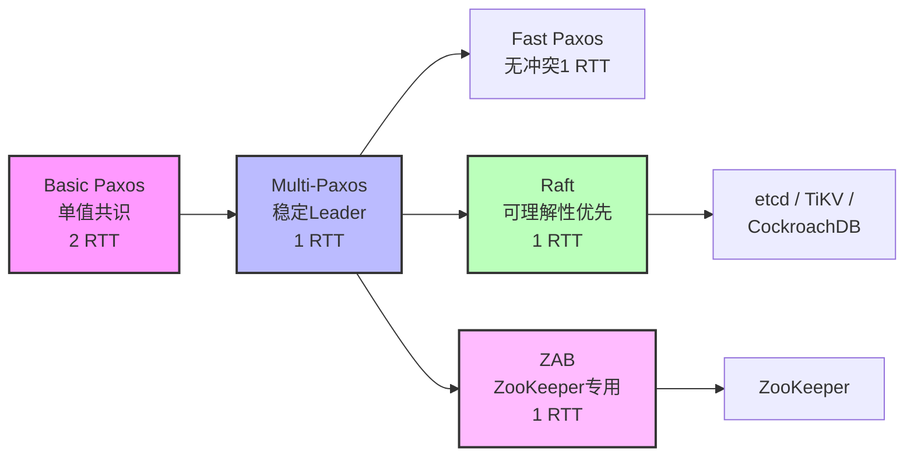
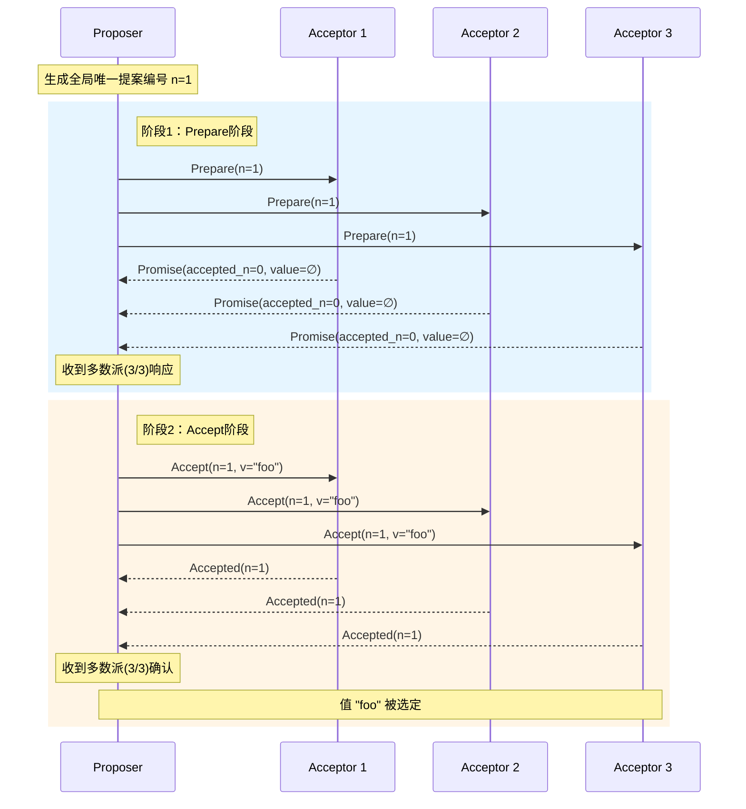
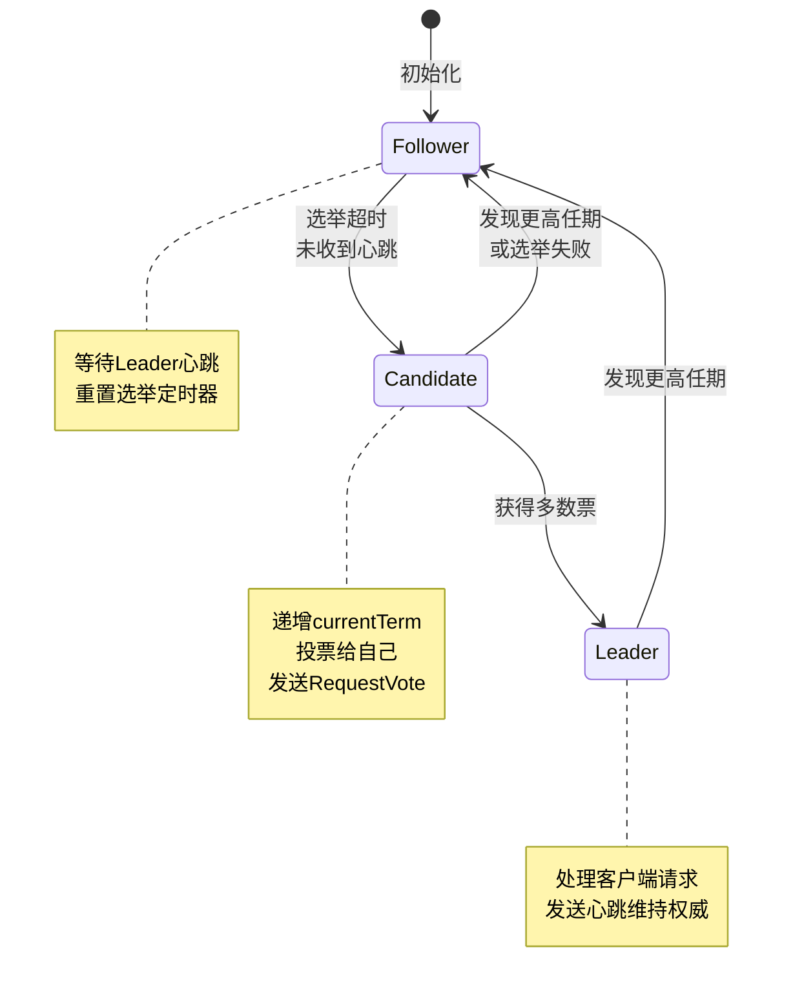
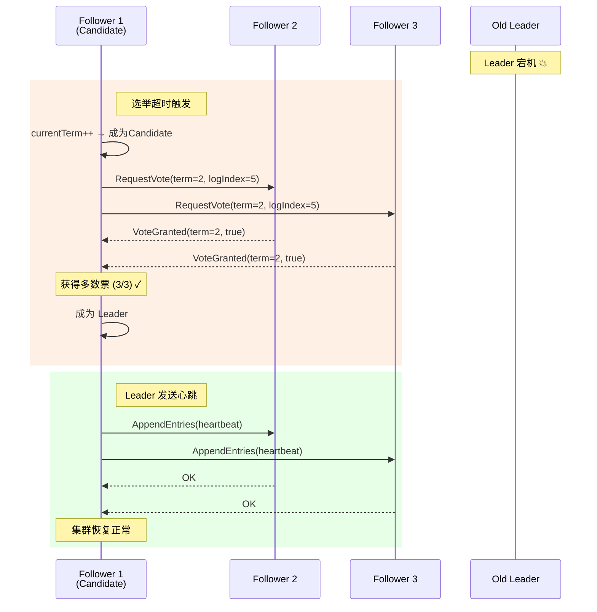
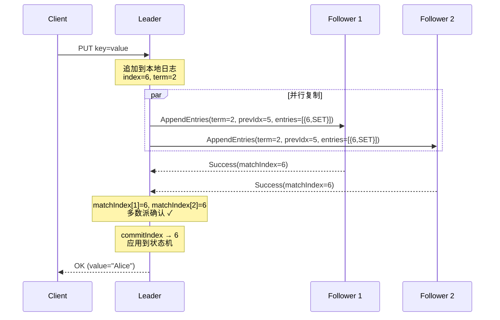
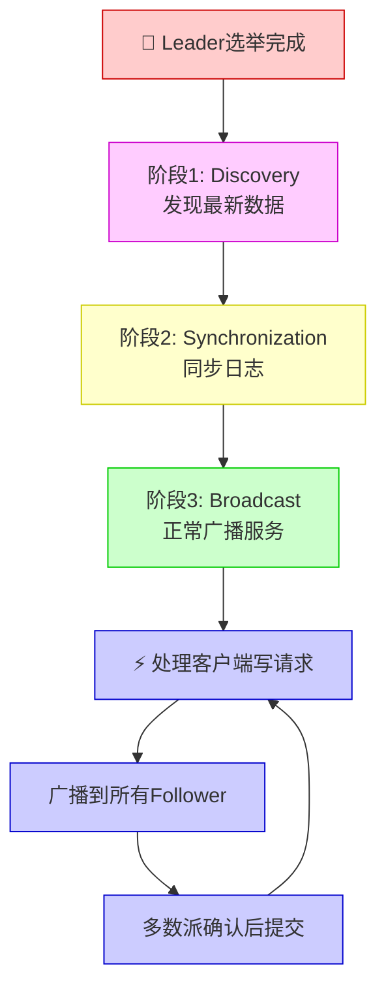
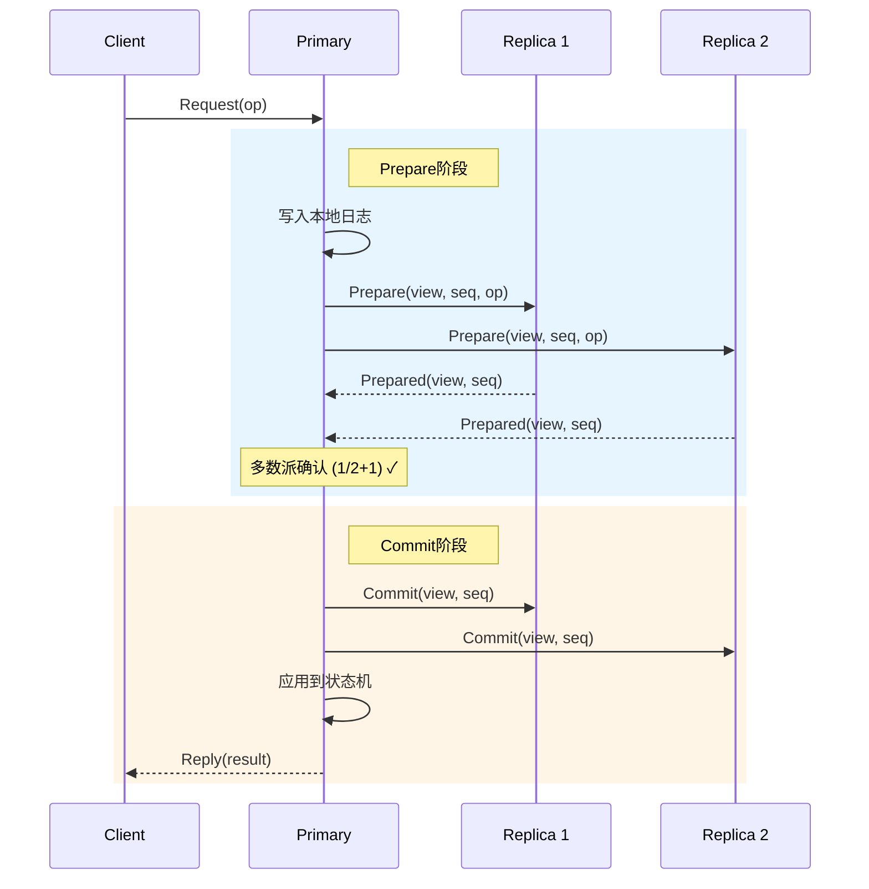
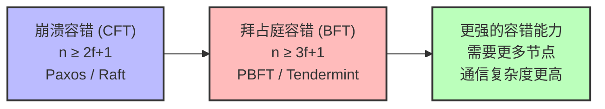
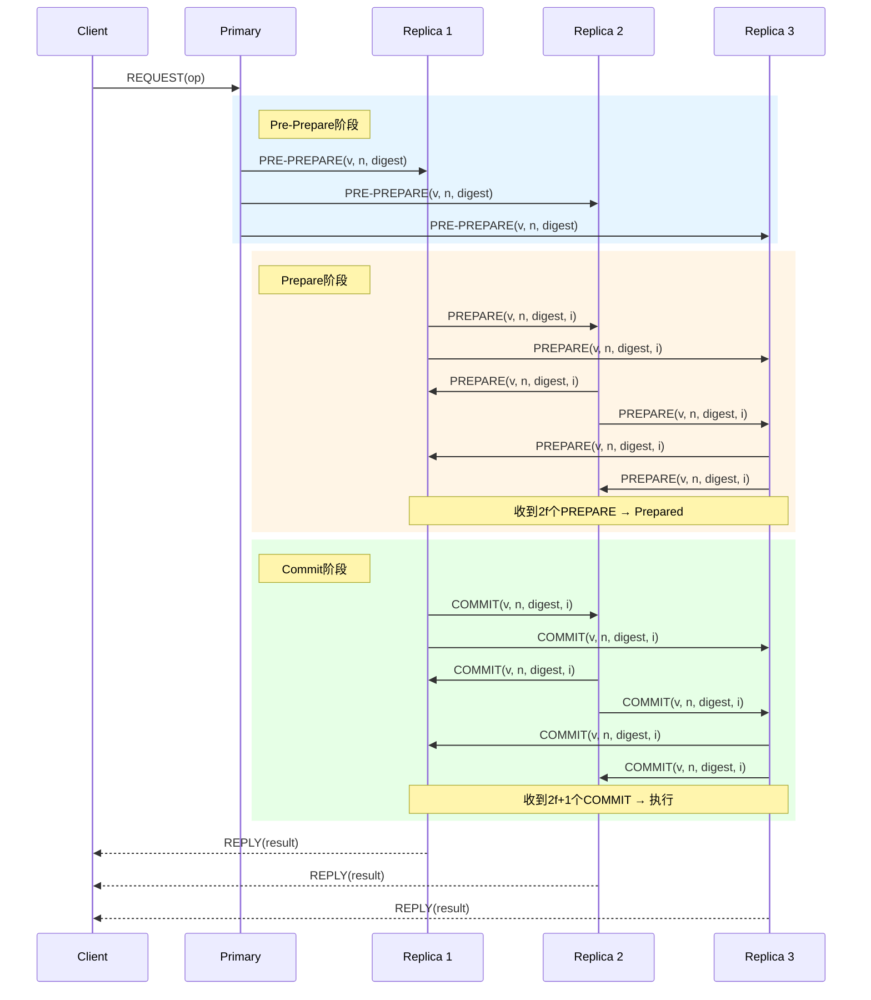
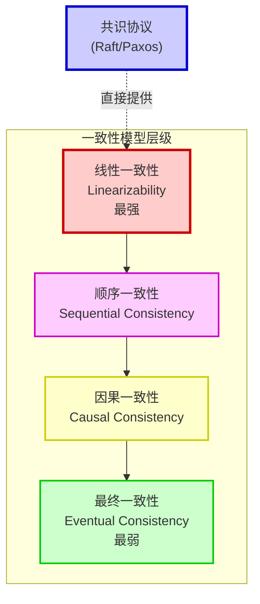

# 第22章 分布式共识

## 章节概览

> 2022年12月，CockroachDB在其v22.2版本中实现了跨三个大洲（北美、欧洲、亚太）的地理分区部署。当用户在北京发起一笔转账请求时，这笔交易需要在纽约、伦敦和上海的数十个副本节点之间达成共识——不仅要在毫秒级完成，还必须保证在任何一个数据中心彻底宕机后数据零丢失。这背后的核心引擎，就是分布式共识协议。

分布式共识是分布式系统理论与实践中最核心、最具挑战性的问题。其本质可以浓缩为一句话：**在多个可能故障的节点之间，就某个值或操作序列达成一致意见**。无论是CockroachDB/TiDB这样的全球分布式数据库、etcd/Kubernetes这样的集群协调系统，还是比特币/以太坊这样的区块链网络，共识问题都是其底层不可替代的基石。

本章将以"道法术器"的结构展开：从共识问题的本质定义（道）出发，深入剖析Paxos和Raft两大里程碑式协议的设计原理（法），通过伪代码和工程优化技巧掌握实现方法（术），最终对比etcd、ZooKeeper等真实系统的架构设计（器）。

**Paxos**由Leslie Lamport于1990年提出，是共识理论的奠基之作，以其简洁的规则和深刻的洞察力影响了整个分布式系统领域。**Raft**由Diego Ongaro和John Ousterhout于2014年提出，以"可理解性"为设计目标，通过Leader选举、日志复制等清晰的机制实现了与Multi-Paxos等价的语义，迅速成为工程实践中的主流选择——etcd、TiKV、CockroachDB等核心基础设施均基于Raft构建。

本章还将涵盖ZAB协议、Viewstamped Replication等重要共识协议的设计思想与差异对比，以及线性一致性的理论深度分析。在拜占庭容错领域，我们将讲解PBFT协议的三阶段流程和HotStuff的现代优化。在工程实践层面，我们将分析etcd和ZooKeeper的架构设计，探讨EPaxos等无Leader共识的前沿进展，以及共识协议在真实系统中的性能瓶颈、优化策略与常见陷阱。本章的目标不仅在于让读者理解"共识是什么"，更在于让读者掌握"如何选择、实现和调优共识协议"。

**参考文献：**
- Lamport, L. "The Part-Time Parliament." ACM Transactions on Computer Systems, 1998.
- Lamport, L. "Paxos Made Simple." ACM SIGACT News, 2001.
- Ongaro, D. & Ousterhout, J. "In Search of an Understandable Consensus Algorithm." USENIX ATC, 2014.
- Hunt, P. et al. "ZooKeeper: Wait-free Coordination for Internet-scale Systems." USENIX ATC, 2010.
- Oki, B. & Liskov, B. "Viewstamped Replication: A New Primary Copy Method." ACM PODC, 1988.
- Castro, M. & Liskov, B. "Practical Byzantine Fault Tolerance." OSDI, 1999.
- Fischer, M., Lynch, N. & Paterson, M. "Impossibility of Distributed Consensus with One Faulty Process." JACM, 1985.
- Lamport, L., Shostak, R. & Pease, M. "The Byzantine Generals Problem." ACM TOPLAS, 1982.
- Moraru, I., Andersen, D. & Kaminsky, M. "There Is More Consensus in Egalitarian Parliaments." SOSP, 2013.
- Yin, M. et al. "HotStuff: BFT Consensus with Linearity and Responsiveness." PODC, 2019.


***


# 22.1 理论基础

## 22.1.1 共识问题的定义与属性

### 22.1.1.1 什么是分布式共识

分布式共识问题的核心可以简洁地描述为：在由多个可能发生故障的进程（节点）组成的系统中，所有正确的进程必须就某个值（或值的序列）达成一致。

更形式化地，假设系统中有 n 个进程 p₁, p₂, ..., pₙ，每个进程可以提议一个值。共识协议的目标是让所有正确的进程最终选定同一个值。

### 22.1.1.2 共识问题的四个基本属性

一个正确的共识协议必须满足以下四个属性：

**1. 一致性（Agreement / Uniform Agreement）**

所有正确的进程必须选定相同的值。即如果进程 p 和 q 都是正确的且都做出了决定，那么它们决定的值必须相同。

```text
∀ p, q : decided(p) ∧ decided(q) → value(p) = value(q)
```

**2. 有效性（Validity / Integrity）**

如果某个进程决定了值 v，那么 v 必须是由某个进程提议过的。共识协议不能"凭空创造"一个值。

```text
decided(p, v) → ∃ q : proposed(q, v)
```

**3. 终止性（Termination / Liveness）**

所有正确的进程最终都必须做出决定。这一属性要求协议不能无限期阻塞——即在足够长的时间后，每个正确的进程都必须输出一个结果。

```text
∀ p : correct(p) → ◇ decided(p)
```

（◇ 表示"最终"，是时序逻辑中的eventually算子）

**4. 完整性（Integrity）**

每个正确的进程最多决定一次。即一旦某个进程做出了决定，它就不会改变这个决定。

```text
∀ p : decided(p, v) ∧ decided(p, w) → v = w
```

> **注：** 不同文献对共识属性的表述可能略有差异。有些文献将"完整性"视为"一致性"的一部分，有些则将"有效性"细分为"非平凡性"（Non-triviality）。在工程实践中，最核心的两个属性是 **Safety**（一致性+有效性+完整性）和 **Liveness**（终止性）。

***

### 22.1.1.3 Safety 与 Liveness 的权衡

在分布式共识中，Safety 和 Liveness 是两个根本性的保障：

- **Safety（安全性）**："坏事不会发生"。在共识中，Safety 意味着不会出现不一致的决定——要么所有正确的进程同意同一个值，要么都没有决定。Safety 是绝对的，不允许任何违反。

- **Liveness（活性）**："好事最终会发生"。在共识中，Liveness 意味着系统最终一定会做出决定，不会永远卡住。

这两者之间存在根本性的张力。在异步网络环境中，由于无法区分"节点故障"和"网络延迟"，我们面临一个深刻的理论限制。

***

### 22.1.1.4 FLP不可能定理

1985年，Fischer、Lynch和Paterson证明了分布式计算领域最著名的不可能性定理：

> **FLP不可能定理：** 在一个异步系统中，即使只有一个进程可能崩溃，也不存在一个确定性的共识算法能同时保证Safety和Liveness。

这个定理的含义是深远的：在纯异步模型中，我们不可能设计出一个既绝对安全又一定能终止的共识算法。

然而，FLP定理并不意味着共识问题在实践中不可解。实际系统通过以下方式绕过这一限制：

1. **部分同步模型（Partial Synchrony）**：假设系统在大部分时间是同步的，但允许偶尔的异步期。Paxos 和 Raft 都基于这种模型。

2. **故障检测器（Failure Detectors）**：使用超时机制来"猜测"哪些节点已经崩溃。虽然可能误判，但在实际系统中效果良好。

3. **随机化算法（Randomized Algorithms）**：引入随机性来保证终止性，以极小的概率违反Safety（如Ben-Or算法）。

4. **Leader机制**：选举一个Leader来协调共识过程，减少冲突，提高效率。这是Paxos和Raft的核心思想。

***

## 22.1.2 Paxos 详解

### 共识协议的演进脉络

在深入Paxos之前，先从全局视角理解共识协议的演进关系。Basic Paxos解决单值共识，Multi-Paxos引入稳定Leader优化为日志复制，Fast Paxos进一步降低延迟。Raft和ZAB则分别以不同的设计哲学重新实现了Multi-Paxos的语义。



### 22.1.2.1 Basic Paxos

Paxos是Leslie Lamport于1990年提出的共识算法（论文于1998年正式发表），是分布式共识领域的里程碑。Lamport用一个虚构的希腊岛屿议会的故事来描述这个算法，但这种表述方式反而让算法变得晦涩难懂。2001年，Lamport发表了"Paxos Made Simple"一文，用更直接的语言重新阐述了Paxos。

#### 角色与术语

在Paxos中，有三种角色：

- **Proposer（提议者）**：发起提案，试图让系统接受某个值。
- **Acceptor（接受者）**：对提案进行投票，决定是否接受。
- **Learner（学习者）**：学习被选定的值。

一个物理节点可以同时担任多个角色。

#### 两个阶段

Basic Paxos的核心是一个两阶段协议：

**阶段1：Prepare（准备）**

Proposer选择一个全局唯一的提案编号 n（通常是递增的整数），向所有Acceptor发送 `Prepare(n)` 请求。

Acceptor收到 `Prepare(n)` 后：
- 如果 n 大于它之前响应过的所有Prepare请求的编号，则承诺不再接受编号小于 n 的提案，并回复它之前已经接受过的编号最大的提案（如果有的话）。
- 否则，忽略该请求。

**阶段2：Accept（接受）**

如果Proposer收到了多数派（majority）Acceptor的响应：
- 如果响应中包含了之前被接受的提案，则Proposer必须使用其中编号最高的提案的值。
- 如果响应中没有包含任何被接受的提案，则Proposer可以自由选择一个值 v。
- 然后Proposer向所有Acceptor发送 `Accept(n, v)` 请求。

Acceptor收到 `Accept(n, v)` 后：
- 如果它没有对编号大于 n 的Prepare请求做出过承诺，则接受该提案。
- 否则，拒绝。

当多数派Acceptor都接受了同一个提案时，该值被"选定"（chosen）。

#### Paxos两阶段流程

下图展示了Basic Paxos中Proposer与Acceptors之间的两阶段消息交互：



#### Paxos伪代码

```pseudo
// ========== Proposer ==========

function run_paxos(value):
    // 阶段1: Prepare
    n = generate_unique_number()  // 全局唯一递增编号
    
    // 向所有Acceptor发送Prepare请求
    responses = []
    for each acceptor in acceptors:
        resp = send_prepare(acceptor, n)
        if resp != TIMEOUT:
            responses.append(resp)
    
    // 检查是否收到多数派响应
    if len(responses) < majority_size:
        return ABORT  // 未能获得多数派，重试
    
    // 找出响应中编号最高的已接受提案
    highest_accepted = null
    for resp in responses:
        if resp.has_accepted_value:
            if highest_accepted == null or resp.accepted_n > highest_accepted.n:
                highest_accepted = resp
    
    // 阶段2: Accept
    if highest_accepted != null:
        proposed_value = highest_accepted.value  // 必须使用之前接受的值
    else:
        proposed_value = value  // 自由选择
    
    accept_responses = []
    for each acceptor in acceptors:
        resp = send_accept(acceptor, n, proposed_value)
        if resp != TIMEOUT:
            accept_responses.append(resp)
    
    if len(accept_responses) >= majority_size:
        return proposed_value  // 值被选定
    else:
        return ABORT  // 重试

// ========== Acceptor ==========

promised_n = 0          // 承诺过的最大Prepare编号
accepted_n = 0          // 接受过的最大提案编号
accepted_value = null   // 接受过的值

function handle_prepare(n):
    if n > promised_n:
        promised_n = n
        return (accepted_n, accepted_value)  // 返回之前接受的提案
    else:
        return REJECT  // 拒绝：已经有更高编号的Prepare

function handle_accept(n, value):
    if n >= promised_n:
        promised_n = n
        accepted_n = n
        accepted_value = value
        return ACCEPT
    else:
        return REJECT
```

#### Paxos的安全性证明

Paxos的安全性基于以下关键不变量：

**不变量P2c**：如果编号为 n 的提案被选定（即被多数派接受），那么对于任何编号 m > n 的提案，如果该提案被提出，其值必须与编号为 n 的提案的值相同。

这个不变量通过以下机制保证：
1. Prepare阶段的承诺机制确保Proposer能"发现"之前可能已被接受的值。
2. 多数派交集特性：任何两个多数派必然有至少一个共同的Acceptor，这个共同的Acceptor确保了值的传递。

***

### 22.1.2.2 Multi-Paxos

Basic Paxos每次只就一个值达成共识。在实际系统中，我们通常需要对一个操作序列（日志）达成共识。如果每条日志都独立运行一次Basic Paxos，效率会非常低——每次都需要两轮通信。

Multi-Paxos通过引入稳定的Leader来优化这个过程：

1. **选举Leader**：通过一次Basic Paxos选出一个Leader。
2. **Leader优化**：一旦Leader稳定，后续的日志条目可以跳过Prepare阶段，直接进入Accept阶段。
3. **日志槽位**：每条日志条目对应一个"槽位"（slot），每个槽位独立运行一个Paxos实例。

```pseudo
// Multi-Paxos 优化流程

// 1. Leader选举: 运行一次完整的Basic Paxos
leader = elect_leader_via_basic_paxos()

// 2. 后续日志复制: 跳过Prepare阶段
function replicate_log_entry(entry):
    // 直接进入Accept阶段 (无需Prepare)
    n = leader.current_proposal_number
    slot = next_available_slot()
    
    for each acceptor in acceptors:
        send_accept(acceptor, slot, n, entry)
    
    // 收集多数派响应
    if received_majority_accepts():
        // 日志条目被选定，通知Learners
        notify_learners(slot, entry)
        return SUCCESS
    else:
        // Leader可能已失效，触发重新选举
        trigger_leader_election()
```

Multi-Paxos的优化效果：在Leader稳定的理想情况下，每条日志条目只需要一轮通信即可被选定，将延迟从2RTT降低到1RTT。

***

### 22.1.2.3 Fast Paxos

Fast Paxos（Lamport, 2006）是对Basic Paxos的进一步优化，目标是在没有冲突的情况下将延迟降低到1RTT（从客户端到选定值只需一轮通信）。

#### 核心思想

经典Paxos中，Proposer必须先通过Leader发送Accept请求（1 RTT）。Fast Paxos允许Proposer直接向Acceptor发送Accept请求，跳过Leader中转。如果没有任何冲突（即只有一个Proposer发送了值），该值可以在一轮通信中被选定。但如果有多个Proposer同时发送不同的值（冲突），则需要进入"冲突恢复"阶段，回退到Classic Paxos的两阶段流程。

#### Fast Quorum 的数学原理

Fast Paxos中，多数派的定义发生了关键变化：

- **Classic Paxos**：需要 ⌈(n+1)/2⌉ 个Acceptor接受。
- **Fast Paxos**：冲突恢复需要 ⌈(3n+1)/4⌉ 个Acceptor接受（称为 **fast quorum**），以确保与任何Classic Paxos的quorum有足够大的交集。

为什么是 ⌈(3n+1)/4⌉？其数学推导如下：

假设有 n 个Acceptor。当冲突发生时，一个Classic Paxos的Prepare阶段的quorum Q₁（大小为 ⌈(n+1)/2⌉）和一个Fast Paxos的Accept阶段的quorum Q₂（大小为 ⌈(3n+1)/4⌉）必须有交集。要保证 |Q₁ ∩ Q₂| ≥ 1，需要：

```text
|Q₁| + |Q₂| > n
⌈(n+1)/2⌉ + ⌈(3n+1)/4⌉ > n

对于 n=5: ⌈6/2⌉ + ⌈16/4⌉ = 3 + 4 = 7 > 5 ✓ (fast quorum = 4)
对于 n=7: ⌈8/2⌉ + ⌈22/4⌉ = 4 + 6 = 10 > 7 ✓ (fast quorum = 6)
对于 n=9: ⌈10/2⌉ + ⌈28/4⌉ = 5 + 7 = 12 > 9 ✓ (fast quorum = 7)
```

**代价**：fast quorum比classic quorum更大，意味着需要更多Acceptor响应才能确认一个值。例如在5节点集群中，classic quorum需要3个响应，fast quorum需要4个响应。

#### Fast Paxos伪代码

```pseudo
// ========== Fast Paxos Proposer ==========

function run_fast_paxos(value):
    // 尝试快速路径：直接发送Accept（跳过Prepare）
    // 需要收集 fast_quorum = ⌈(3n+1)/4⌉ 个响应
    fast_quorum_size = ceil((3 * n + 1) / 4)
    
    accept_responses = []
    for each acceptor in acceptors:
        resp = send_accept(acceptor, ANY, value)  // ANY表示可被覆盖
        if resp != TIMEOUT:
            accept_responses.append(resp)
    
    // 快速路径成功
    if len(accept_responses) >= fast_quorum_size:
        return value  // 值在1 RTT内被选定
        // 前提：没有其他Proposer同时发送了不同的值
    
    // 快速路径失败（发生冲突），回退到经典Paxos
    // Acceptor在响应中会包含冲突的值
    conflicting_value = extract_conflicting_value(accept_responses)
    if conflicting_value != null:
        // 必须使用冲突的值（Paxos安全协议保证）
        return run_classic_paxos(conflicting_value)
    else:
        return run_classic_paxos(value)

// ========== Fast Paxos Acceptor ==========

function handle_fast_accept(n, value):
    // 在快速路径中，Acceptor可以选择任何值接受
    // 但如果已经承诺或接受了其他值，必须回复冲突信息
    if n >= promised_n:
        if accepted_n > 0 and accepted_value != value:
            // 冲突：已经接受了不同的值
            return (CONFLICT, accepted_n, accepted_value)
        promised_n = n
        accepted_n = n
        accepted_value = value
        return ACCEPTED
    else:
        return REJECT
```

#### 何时使用 Fast Paxos vs Classic Paxos

| 场景 | 推荐协议 | 原因 |
|------|---------|------|
| 低冲突、低延迟要求 | Fast Paxos | 无冲突时1 RTT，适合客户端直接提议 |
| 高冲突频率 | Classic Paxos | fast quorum更大，冲突恢复代价更高 |
| 有稳定Leader | Multi-Paxos | Leader已跳过Prepare，Fast Paxos优势不明显 |
| 客户端直连Acceptor | Fast Paxos | 无需Leader中转，降低延迟 |
| 集群规模较小(3-5节点) | Multi-Paxos | fast quorum与classic quorum差距不大 |

#### Trade-off 分析

**优势**：
- 无冲突场景下延迟从2 RTT降至1 RTT（从客户端到值选定）。
- 适合客户端直连Acceptor的架构，减少了Leader瓶颈。

**代价**：
- Fast quorum ⌈(3n+1)/4⌉ 比 Classic quorum ⌈(n+1)/2⌉ 大约50%，需要更多节点响应。
- 冲突恢复需要额外的Classic Paxos流程，增加了最坏情况延迟。
- 实现复杂度更高，需要处理ANY标记和冲突检测。
- 在多Proposer高并发场景下，冲突概率增加，可能频繁回退到Classic路径。

> **工程实践提示：** 现代系统中，Multi-Paxos配合稳定Leader已能将每条日志的延迟降至1 RTT。Fast Paxos的主要价值在于无Leader架构或客户端直连场景。Google的Chubby早期版本曾考虑过Fast Paxos，最终选择了Multi-Paxos路线。

***

## 22.1.3 Raft 详解

Raft由Diego Ongaro和John Ousterhout于2014年在USENIX ATC上发表，其设计目标是"可理解性"（Understandability）。Raft将共识问题分解为三个相对独立的子问题：Leader选举、日志复制和安全性。

### 22.1.3.1 基本概念

**节点状态：** 每个节点处于以下三种状态之一：

- **Leader（领导者）**：处理所有客户端请求，管理日志复制。
- **Follower（追随者）**：被动地接收Leader的心跳和日志条目。
- **Candidate（候选人）**：在选举过程中，Follower转变为Candidate。

**任期（Term）：** Raft将时间划分为一个个任期，每个任期以一次选举开始。如果选举成功，该任期的Leader将负责管理直到下一个任期开始。任期号是逻辑时钟，用于检测过期的信息。

**日志条目（Log Entry）：** 每条日志条目包含：
- 命令（command）：客户端请求的操作
- 任期号（term）：该条目被Leader接收时的任期
- 索引（index）：该条目在日志中的位置

#### Raft状态机转换

下图展示了Raft节点在Follower、Candidate和Leader三种状态之间的转换关系：



### 22.1.3.2 Leader选举

**选举触发：** 当Follower在election timeout（选举超时）内没有收到Leader的心跳时，它会转变为Candidate并发起选举。

**选举过程：**

```pseudo
// ========== Follower → Candidate ==========

function on_election_timeout():
    current_term++
    state = CANDIDATE
    voted_for = self
    votes_received = 1  // 投给自己
    
    // 向所有其他节点发送RequestVote RPC
    for each peer in peers:
        send_request_vote_async(peer, current_term, self.id,
            last_log_index, last_log_term)
    
    // 重置选举定时器
    reset_election_timer()
    // 选举超时 = random(150ms, 300ms)  [典型值]

// ========== 处理RequestVote RPC ==========

function handle_request_vote(candidate_term, candidate_id,
                              candidate_last_log_index,
                              candidate_last_log_term):
    // 如果候选人的任期小于当前任期，拒绝
    if candidate_term < current_term:
        return (current_term, false)
    
    // 如果候选人任期更大，更新自己为Follower
    if candidate_term > current_term:
        step_down(candidate_term)
    
    // 检查是否可以投票
    can_vote = (voted_for == null or voted_for == candidate_id)
    
    // 日志至少要和自己一样新
    log_is_up_to_date = (
        candidate_last_log_term > last_log_term or
        (candidate_last_log_term == last_log_term and
         candidate_last_log_index >= last_log_index)
    )
    
    if can_vote and log_is_up_to_date:
        voted_for = candidate_id
        reset_election_timer()
        return (current_term, true)
    else:
        return (current_term, false)

// ========== Candidate处理投票响应 ==========

function on_vote_response(peer, term, vote_granted):
    if term > current_term:
        step_down(term)
        return
    
    if state != CANDIDATE:
        return  // 已经不再是Candidate
    
    if vote_granted:
        votes_received++
        if votes_received > cluster_size / 2:
            become_leader()

function become_leader():
    state = LEADER
    for each peer in peers:
        next_index[peer] = last_log_index + 1
        match_index[peer] = 0
    // 立即发送心跳
    send_heartbeat_to_all()
```

#### Raft Leader选举流程

下图展示了Raft集群中从Follower选举超时到Candidate发起投票、获得多数票成为Leader的完整流程：



**关键设计：**
- **随机化选举超时**：每个节点的选举超时在 [T, 2T] 范围内随机选择（如150ms~300ms），大大降低了选举冲突的概率。
- **多数派投票**：一个Candidate必须获得多数派的投票才能成为Leader，这确保了每个任期最多只有一个Leader。
- **日志新旧比较**：投票时检查候选人的日志是否至少和自己一样新，确保新Leader拥有所有已提交的日志条目。

### 22.1.3.3 日志复制

Leader选出后，它开始处理客户端请求。每个请求包含一个命令，Leader将命令作为新的日志条目追加到自己的日志中，然后并行地向所有Follower发送 `AppendEntries` RPC来复制该条目。

```pseudo
// ========== Leader处理客户端请求 ==========

function handle_client_request(command):
    if state != LEADER:
        return redirect_to_leader()
    
    // 追加到本地日志
    new_entry = {
        term: current_term,
        index: last_log_index + 1,
        command: command
    }
    log.append(new_entry)
    
    // 立即向所有Follower发送AppendEntries
    replicate_to_followers()

// ========== 发送AppendEntries RPC ==========

function send_append_entries(peer):
    prev_log_index = next_index[peer] - 1
    prev_log_term = log[prev_log_index].term if prev_log_index > 0 else 0
    entries = log[next_index[peer]..]  // 要发送的日志条目
    
    send_append_entries_rpc(peer, 
        current_term,
        self.id,
        prev_log_index,
        prev_log_term,
        entries,
        commit_index)

// ========== Follower处理AppendEntries ==========

function handle_append_entries(leader_term, leader_id,
                                prev_log_index, prev_log_term,
                                entries, leader_commit):
    // 拒绝过期的Leader
    if leader_term < current_term:
        return (current_term, false)
    
    // 收到有效Leader的消息，重置选举定时器
    reset_election_timer()
    
    if leader_term > current_term:
        step_down(leader_term)
    
    // 日志一致性检查
    if prev_log_index > 0:
        if prev_log_index > last_log_index:
            return (current_term, false)  // 日志不匹配
        if log[prev_log_index].term != prev_log_term:
            // 删除冲突的日志条目
            log.truncate(prev_log_index)
            return (current_term, false)
    
    // 追加新条目
    for entry in entries:
        if entry.index <= last_log_index:
            // 检查是否冲突
            if log[entry.index].term != entry.term:
                log.truncate(entry.index)
                log.append(entry)
        else:
            log.append(entry)
    
    // 更新commit_index
    if leader_commit > commit_index:
        commit_index = min(leader_commit, last_log_index)
        apply_committed_entries()
    
    return (current_term, true)

// ========== Leader处理AppendEntries响应 ==========

function on_append_entries_response(peer, success, matchIdx):
    if success:
        next_index[peer] = matchIdx + 1
        match_index[peer] = matchIdx
        
        // 尝试推进commit_index
        update_commit_index()
    else:
        // 日志不匹配，回退next_index
        next_index[peer] = max(1, next_index[peer] - 1)
        // 优化: 可以直接回退到冲突任期的起始位置
        retry_append_entries(peer)

function update_commit_index():
    // 从最新的日志条目开始检查
    for n = last_log_index down to commit_index + 1:
        if log[n].term == current_term:  // 只提交当前任期的条目
            replicated_count = 1  // 自己
            for each peer in peers:
                if match_index[peer] >= n:
                    replicated_count++
            
            if replicated_count > cluster_size / 2:
                commit_index = n
                apply_committed_entries()
                break
```

#### Raft日志复制流程

下图展示了Leader接收客户端请求后，通过AppendEntries RPC将日志复制到多数派Follower，然后提交并应用到状态机的完整流程：



**关键点：**
- Leader只能提交**当前任期**的日志条目（通过计数）。之前任期的日志条目只能被间接提交——当Leader在当前任期提交新条目时，之前的所有条目也被隐式提交。
- 日志匹配（Log Matching Property）：如果两个日志在某个索引处有相同的任期号，那么该索引及之前的所有条目都相同。

### 22.1.3.4 安全性

Raft的安全性由以下五个关键特性保证：

**1. 选举安全（Election Safety）**：每个任期最多选出一个Leader。
- 保证机制：多数派投票，每个节点每个任期只能投一票。

**2. Leader只追加（Leader Append-Only）**：Leader永远不会覆盖或删除自己的日志，只会追加。
- 保证机制：Leader从不修改已有日志条目。

**3. 日志匹配（Log Matching）**：如果两个日志在某个索引处有相同的任期号，则该索引之前的所有条目都相同。
- 保证机制：AppendEntries RPC中的prevLogIndex/prevLogTerm检查。

**4. Leader完整性（Leader Completeness）**：如果一个日志条目在某个任期被提交，则该条目一定存在于所有更高任期的Leader的日志中。
- 保证机制：选举时的日志新旧比较。

**5. 状态机安全（State Machine Safety）**：如果一个节点在某个索引处应用了一个日志条目，其他节点不会在相同索引处应用不同的条目。
- 保证机制：由以上四个特性共同保证。

### 22.1.3.5 成员变更

集群成员的动态变更（添加或移除节点）是共识协议必须支持的功能。Raft提出了两种方案：

**方法1：单节点变更（Joint Consensus的简化版）**

一次只添加或移除一个节点。这种方法的安全性基于：任何两个多数派在成员变更前后必然有交集。

```pseudo
// 单节点添加流程
function add_server(new_server):
    // 1. Leader将新配置作为日志条目复制
    config_entry = {type: CONFIG_CHANGE, new_config: current_config + {new_server}}
    replicate(config_entry)
    
    // 2. 新节点开始接收日志复制
    // 3. 配置变更条目被提交后生效
    // 4. 新节点成为集群的一部分
```

**方法2：联合共识（Joint Consensus）**

用于同时变更多个节点。变更过程分为两个阶段：
1. 过渡阶段：使用新旧配置的联合（joint）配置，日志条目需要同时被新旧两个多数派接受。
2. 最终阶段：切换到新配置。

### 22.1.3.6 Leader Transfer

Leader Transfer是一种强制将Leader角色转移给特定节点的机制。与正常的Leader故障转移不同，Leader Transfer由当前Leader主动发起，用于有计划的运维操作。

#### 使用场景

- **计划性维护**：需要对当前Leader节点进行升级、重启或硬件更换时，先将Leader转移走，避免被动选举导致的短暂不可用。
- **负载再平衡**：当Leader节点负载过高（如CPU或网络带宽瓶颈），将Leader角色转移到负载较低的节点。
- **角色优化**：在地理分区部署中，将Leader转移到离主要客户端更近的节点，降低读写延迟。

#### 实现原理

Leader Transfer的核心思想是：当前Leader将候选人的任期设置为一个极大值（如无穷大），强制所有节点认为当前Leader已过时，从而让目标节点快速赢得选举。

```pseudo
// ========== Leader Transfer ==========

function transfer_leadership(target_peer):
    if state != LEADER:
        return ERROR  // 只有Leader可以发起转移
    
    // 向目标节点发送TimeoutNow RPC
    // 使用极大任期号，确保目标节点立即开始选举
    send_timeout_now(target_peer, current_term)
    
    // Leader自身等待发现更高任期后退位
    // 或者直接设置一个超时，如果转移失败则恢复Leader状态
    wait_for_transfer_or_timeout()

// ========== 目标节点处理TimeoutNow ==========

function handle_timeout_now(received_term):
    // 收到TimeoutNow后，立即发起选举
    // 使用极大任期号，确保其他节点不会在同一任期内竞争
    current_term = MAX_UINT64  // 无穷大任期
    state = CANDIDATE
    voted_for = self
    votes_received = 1
    
    // 发送RequestVote，所有节点看到极高任期后会立即退位
    for each peer in peers:
        send_request_vote(peer, current_term, self.id,
            last_log_index, last_log_term)
```

#### 与正常选举的对比

| 特性 | 正常选举 | Leader Transfer |
|------|---------|----------------|
| 触发方式 | 选举超时（被动） | TimeoutNow RPC（主动） |
| 目标节点 | 随机（由超时决定） | 指定节点 |
| 任期增长 | +1 | 跳到极大值 |
| 选举冲突 | 可能（多节点同时竞选） | 极少（只有目标节点竞选） |
| 数据安全性 | 保证（日志新旧比较） | 保证（同正常选举） |

> **工程实践提示：** etcd的`raft`库内置了Leader Transfer功能，通过`TransferLeadership` API即可调用。TiKV也支持类似功能。在Kubernetes环境中，etcd的Leader Transfer常用于etcd节点的滚动升级。

### 22.1.3.7 日志压缩与快照

随着时间推移，日志会无限增长。日志压缩（Log Compaction）通过创建快照来解决这个问题。

```pseudo
// 快照创建
function create_snapshot():
    // 1. 获取当前状态机的完整状态
    snapshot_state = state_machine.get_state()
    
    // 2. 记录快照对应的最后一个日志索引和任期
    snapshot = {
        last_included_index: last_applied,
        last_included_term: log[last_applied].term,
        state: snapshot_state
    }
    
    // 3. 持久化快照
    persist_snapshot(snapshot)
    
    // 4. 删除已快照的日志条目
    log.remove_up_to(last_applied)

// 处理InstallSnapshot RPC (当Follower的日志太旧时)
function handle_install_snapshot(leader_term, leader_id,
                                  last_included_index,
                                  last_included_term, data):
    if leader_term < current_term:
        return current_term
    
    reset_election_timer()
    
    // 如果快照比本地日志更旧，忽略
    if last_included_index <= commit_index:
        return current_term
    
    // 应用快照到状态机
    state_machine.restore(data)
    
    // 丢弃旧日志
    log.remove_up_to(last_included_index)
    last_log_index = last_included_index
    commit_index = last_included_index
    last_applied = last_included_index
    
    return current_term
```

***

## 22.1.4 ZAB协议

ZAB（ZooKeeper Atomic Broadcast）是Apache ZooKeeper使用的原子广播协议。它与Raft有很多相似之处，但在设计细节上有显著差异。

### 核心概念

- **Leader**：处理所有写请求，并通过ZAB协议将变更广播给Follower。
- **Follower**：接收Leader的日志复制，在选举时参与投票。
- **Observer**：只接收日志复制，不参与投票，用于扩展读能力。
- **Epoch**：类似Raft的Term，每个Epoch以选举开始。

### ZAB的三个阶段

ZAB协议的运行分为三个清晰的阶段，从选举完成到正常服务：



**1. 发现（Discovery）**：选举完成后，新Leader与Follower交换信息，确定最新的已提交数据。新Leader从Follower收集epoch信息，确保自己拥有所有已提交的事务。

**2. 同步（Synchronization）**：Leader确保所有Follower的日志与自己一致，将所有已提交的数据同步给Follower。只有在同步完成后，Leader才开始处理新请求。

**3. 广播（Broadcast）**：正常运行阶段，Leader处理客户端请求并广播给Follower。这一阶段的协议类似于两阶段提交，但简化了——Leader不需要等待Follower的"准备"响应，直接发送"提交"消息。

### ZAB伪代码

```pseudo
// ========== Discovery阶段 ==========

function discovery_phase():
    // 新Leader向所有Follower发送NEWDLeader消息
    epoch = current_epoch + 1
    
    epoch_leaders = []
    for each follower in followers:
        resp = send_new_leader(follower, epoch)
        if resp != TIMEOUT:
            epoch_leaders.append(resp)
    
    // 选择拥有最新epoch事务的Follower数据
    if len(epoch_leaders) >= majority:
        chosen_leader_data = select_latest(epoch_leaders)
        // 更新Leader的日志和epoch
        update_from_peers(chosen_leader_data)
        return SUCCESS

// ========== Synchronization阶段 ==========

function sync_phase():
    // 将所有已提交的事务发送给Follower
    for each follower in followers:
        send_sync(follower, log, committed_transactions)
    
    // 等待所有Follower确认同步完成
    for each follower in followers:
        wait_for_sync_ack(follower)
    
    // 进入Broadcast阶段
    enter_broadcast_phase()
```

### ZAB vs Raft

| 特性 | ZAB | Raft |
|------|-----|------|
| 日志连续性 | 允许日志中有间隙（通过zxid管理） | 日志是连续的 |
| Leader选举 | 优先选择zxid最大的节点 | 优先选择日志最新的节点 |
| 消息顺序 | 通过zxid保证全局顺序 | 通过日志索引和任期保证 |
| Observer | 支持（不参与投票） | 不原生支持 |
| 客户端会话 | 原生支持临时节点和会话 | 需要在上层实现 |
| 三阶段设计 | Discovery → Sync → Broadcast | 选举 → 复制（两阶段） |
| Leader选举方式 | 先epoch再zxid | 基于日志新旧比较 |

***

## 22.1.5 Viewstamped Replication

Viewstamped Replication（VR）由Barbara Liskov和Brian Oki于1988年提出，是最早的复制状态机协议之一。虽然VR最初不被归类为共识协议，但后续研究（特别是Liskov在2006年的修订版论文）揭示了它与Paxos/Raft之间的深刻联系。

### 核心概念

- **View**：类似Raft的Term，每个View有一个编号，View中包含一个Primary（主节点）。每个View号对应一个确定的Primary。
- **Primary**：类似Raft的Leader，负责处理客户端请求并复制日志。
- **View Change**：类似Leader选举，在Primary不可达或故障时切换到新的View。
- **Replica**：每个副本维护状态机的日志和当前View信息。

### VR的三个子协议

1. **正常模式（Normal Operation）**：Primary接收请求，复制到多数派Replica后响应客户端。
2. **View Change**：当Primary不可达时，Replica发起View Change，选举新的Primary。
3. **Recovery**：新加入或恢复的节点通过Recovery协议追赶最新状态。

#### 正常操作流程详解

VR的正常操作与Raft的日志复制本质上相同，但有几点差异：

```pseudo
// ========== VR Primary处理客户端请求 ==========

function primary_handle_request(request):
    // 1. 验证请求来自当前View中的Client
    if not valid_client(request.client_id):
        return ERROR
    
    // 2. 检查是否已有该请求的回复（幂等性）
    if request in completed_requests:
        return cached_response[request]
    
    // 3. 分配序列号
    seq_num = next_seq_number
    next_seq_number++
    
    // 4. 记录到日志
    log_entry = {
        view: current_view,
        seq: seq_num,
        op: request.operation
    }
    log.append(log_entry)
    
    // 5. 发送Prepare消息给所有Replica（包括自己）
    prepare_msg = {
        type: PREPARE,
        view: current_view,
        seq: seq_num,
        op: request.operation,
        log: log  // 从上次checkpoint之后的所有日志
    }
    
    send_to_all_replicas(prepare_msg)

// ========== Replica处理Prepare消息 ==========

function replica_handle_prepare(msg):
    // 验证View和消息有效性
    if msg.view != current_view:
        return STALE_VIEW
    
    // 将操作追加到本地日志
    if msg.seq > last_committed_seq + 1:
        // 日志有间隙，记录但不执行
        pending_log[msg.seq] = msg
    else:
        log.append(msg)
        // 发送Prepared消息
        send_prepared_to_primary(msg)
    
    // 更新oplog状态
    last_prepared = max(last_prepared, msg.seq)

// ========== Primary处理Prepared消息 ==========

function primary_handle_prepared(msg):
    // 收到多数派Replica的Prepared确认
    prepared_count[msg.seq]++
    
    if prepared_count[msg.seq] >= majority:
        // 多数派已准备，发送Commit消息
        commit_msg = {
            type: COMMIT,
            view: current_view,
            seq: msg.seq,
            commit_timestamp: get_timestamp()
        }
        send_to_all_replicas(commit_msg)
        
        // 同时回复客户端
        result = state_machine.apply(msg.op)
        reply_to_client(msg, result)
        
        // 记录到已完成列表
        completed_requests[msg] = result
```

#### VR正常操作消息序列



### VR vs Raft：深度对比

| 方面 | VR | Raft |
|------|----|------|
| **选举机制** | 显式View Change消息，包含最后一个oplog信息 | RequestVote RPC，基于日志新旧比较 |
| **日志结构** | 日志条目带有view号和序列号 | 日志条目带有term号和index |
| **日志间隙** | 允许日志中有未提交的间隙（通过seq管理） | 日志必须连续，不允许间隙 |
| **状态机复制** | 论文完整覆盖状态机复制的端到端流程 | 聚焦共识算法本身，状态机接口留给应用 |
| **Client会话** | 内置客户端会话管理，支持请求去重和缓存 | 需要在上层实现客户端会话 |
| **View Change** | 异步的View Change，不需要同步阶段 | 选举完成后直接进入Leader状态 |
| **Checkpoint** | 论文定义了显式的Checkpoint协议 | 快照机制由应用自行实现 |
| **设计时代** | 1988年，面向异步网络+崩溃故障 | 2014年，强调可理解性和工程实用性 |

> **历史注记：** VR和Raft本质上是同一思想的不同表述——都通过Leader/Primary + 多数派复制来实现状态机复制。Raft的成功很大程度上在于它以更清晰、更系统的方式呈现了这些思想，并提供了完整的工程指南。

***

## 22.1.6 拜占庭容错共识（BFT）

前述所有协议——Paxos、Raft、ZAB、VR——都基于一个关键假设：**节点只会崩溃（Crash Fault），不会恶意行为**。然而在开放网络环境中（如区块链、跨组织联盟链），节点可能由不同实体控制，可能发送矛盾信息、拒绝响应甚至伪造消息。这类故障称为**拜占庭故障（Byzantine Fault）**。

### 拜占庭将军问题

拜占庭将军问题由Lamport、Shostak和Pease于1982年提出：若干拜占庭将军各率一支军队围困敌城，他们必须通过通信达成统一的进攻或撤退策略。问题的难点在于：某些将军可能是叛徒，会发送矛盾的消息。

**形式化定义：** 在一个由 n 个进程组成的系统中，最多有 f 个进程可能表现出任意行为（包括恶意行为）。拜占庭容错协议要求：所有正确的进程必须就同一个值达成一致，即使 f 个进程在恶意行动。

### 容错上限

拜占庭容错的节点数量要求比崩溃容错严格得多：

```text
崩溃容错 (CFT):  n ≥ 2f + 1    (容忍f个崩溃节点)
拜占庭容错 (BFT): n ≥ 3f + 1   (容忍f个拜占庭节点)

为什么BFT需要更多节点？
考虑3个节点中有1个拜占庭节点的场景：
  节点A（正确）→ 发送 "进攻"
  节点B（拜占庭）→ 向A发送 "撤退"，向C发送 "进攻"
  节点C（正确）→ 收到矛盾信息，无法判断谁是叛徒
  → A和C可能做出不同决定，共识失败

4个节点中1个拜占庭节点：
  即使1个节点发送矛盾信息，2个正确节点的多数派仍可达成一致
  → n ≥ 3f + 1 是拜占庭容错的充要条件
```



### PBFT（Practical Byzantine Fault Tolerance）

PBFT由Miguel Castro和Barbara Liskov于1999年提出，是第一个在实际系统中可行的拜占庭容错协议。在此之前，BFT协议的通信复杂度为O(n⁴)甚至更高，完全无法实用。PBFT将其降低到O(n²)。

#### PBFT的三个阶段

PBFT运行在Client-Server模型中，Server节点中有一个Primary（Leader），其余为Replica。协议分为三个阶段：

**1. Pre-Prepare阶段：** Primary为客户端请求分配序列号，并广播给所有Replica。

**2. Prepare阶段：** Replica收到Pre-Prepare后，验证请求的合法性，广播Prepare消息。当一个Replica收到2f个匹配的Prepare消息后，进入Prepared状态。

**3. Commit阶段：** Replica进入Prepared状态后广播Commit消息。当收到2f+1个Commit消息后，执行请求并回复Client。



#### PBFT伪代码

```pseudo
// ========== Primary ==========

function primary_handle_request(request):
    // 1. 验证请求签名
    if not verify_signature(request):
        return REJECT
    
    // 2. 分配序列号
    seq_num = next_seq
    next_seq++
    
    // 3. 计算摘要
    digest = hash(request)
    
    // 4. 广播Pre-Prepare
    pre_prepare = {
        view: current_view,
        seq: seq_num,
        digest: digest,
        request: request
    }
    broadcast_to_replicas(pre_prepare)
    
    // 5. Primary自身进入Prepare阶段
    prepare = {view: current_view, seq: seq_num, digest: digest, id: self.id}
    broadcast_to_replicas(prepare)

// ========== Replica ==========

function replica_handle_pre_prepare(msg):
    // 验证Pre-Prepare的合法性
    if msg.view != current_view:
        return REJECT
    if msg.seq < low_watermark or msg.seq > high_watermark:
        return REJECT
    if hash(msg.request) != msg.digest:
        return REJECT
    
    // 接受Pre-Prepare，广播Prepare
    prepare = {view: current_view, seq: msg.seq, digest: msg.digest, id: self.id}
    broadcast_to_replicas(prepare)
    add_to_prepared_set(msg.seq, msg.digest)

function replica_handle_prepare(msg):
    add_to_prepared_set(msg.seq, msg.digest)
    
    // 检查是否收到2f个匹配的Prepare（包括自己的）
    if count_matching_prepares(msg.seq, msg.digest) >= 2 * f:
        // 进入Prepared状态，广播Commit
        commit = {view: current_view, seq: msg.seq, digest: msg.digest, id: self.id}
        broadcast_to_replicas(commit)

function replica_handle_commit(msg):
    add_to_committed_set(msg.seq, msg.digest)
    
    // 检查是否收到2f+1个匹配的Commit
    if count_matching_commits(msg.seq, msg.digest) >= 2 * f + 1:
        // 执行请求
        execute(msg.request)
        reply_to_client(msg.seq, result)
```

#### PBFT的视图切换（View Change）

当Primary失效时，Replica发起视图切换（类似Raft的Leader选举）：

```pseudo
function start_view_change():
    current_view++
    view_change_msg = {
        new_view: current_view,
        last_committed: last_committed_seq,
        prepared_set: get_prepared_info()  // 已Prepared但未Commit的请求
    }
    broadcast_to_replicas(view_change_msg)

function handle_view_change(msg):
    view_change_votes[msg.new_view].add(msg)
    
    // 收到2f个ViewChange消息，新Primary上任
    if count_view_changes(msg.new_view) >= 2 * f:
        become_new_primary(msg.new_view)
        // 重新广播已Prepared但未Commit的请求
        resend_prepared_requests()
```

### PBFT vs Raft/Paxos 对比

| 方面 | Raft/Paxos (CFT) | PBFT (BFT) |
|------|------------------|------------|
| **容错类型** | 崩溃故障 | 拜占庭故障（任意行为） |
| **容错上限** | f < n/2 | f < n/3 |
| **通信复杂度** | O(n)（Leader广播） | O(n²)（每阶段全网广播） |
| **消息认证** | 不需要（信任节点） | 需要数字签名 |
| **视图切换** | 简单（随机超时选举） | 复杂（需收集已Prepared请求） |
| **性能** | 高（1 RTT） | 低（3阶段，O(n²)消息） |
| **适用场景** | 信任环境（单一组织） | 不信任环境（联盟链/公链） |
| **典型系统** | etcd, TiKV, ZooKeeper | Hyperledger Fabric, Tendermint |

### 现代BFT进展

**HotStuff（2018）**：由VMware Research提出，将PBFT的通信复杂度从O(n²)降低到O(n)，通过引入"门限签名"和"流水线"机制。LibraBFT（现DiemBFT）和Meta的Zirkle均基于HotStuff。

**Tendermint（2014）**：将BFT共识与区块链出块结合，采用"锁定-投票"两阶段协议，是Cosmos生态的底层共识引擎。

**拜占庭容错的工程权衡：** 在实际系统中，BFT协议的性能瓶颈主要在于O(n²)的通信复杂度和数字签名的计算开销。对于节点数量较少（4-20个）的联盟链场景，PBFT/HotStuff是可行的选择；对于大规模公链（数百/数千节点），通常需要结合PoS等机制来降低参与共识的节点数量。

> **工程实践提示：** 如果你的系统运行在信任环境中（如单一组织的数据中心），使用Raft/Paxos即可——它们的性能远优于BFT协议。只有在跨组织、跨信任域的场景下才需要考虑拜占庭容错。Hyperledger Fabric选择PBFT/Raft可切换的架构，允许用户根据信任模型灵活选择。

***

## 22.1.7 工程实现对比

### etcd/Raft

etcd是Kubernetes的核心组件，使用Go语言实现的Raft共识。

**架构设计：**
- **raft库**：纯算法实现，不涉及网络和持久化，由上层应用负责。
- **Storage**：包含raftlog（内存日志）和Snapshotter（快照存储）。
- **Transport**：基于HTTP/gRPC的消息传输层。
- **Ready结构**：etcd-Raft的核心接口，将算法决策（要发送的消息、要持久化的数据、要应用的条目）打包交给上层处理。

**关键优化：**
- **Pre-Vote机制**：在正式选举前先进行"预投票"，避免网络分区恢复后的不必要选举。
- **ReadIndex**：允许Leader在不追加日志的情况下确认自己是否仍然是Leader，优化读操作的延迟。
- **Lease Read**：基于租约的读，进一步减少读操作的延迟。

### ZooKeeper/ZAB

ZooKeeper是Apache基金会的分布式协调服务，使用Java实现的ZAB协议。

**架构设计：**
- **ZKDatabase**：内存中的数据树+事务日志。
- **LearnerHandler**：Leader为每个Follower维护的处理线程。
- **ZKServer**：服务器主类，管理生命周期。

**关键特性：**
- **临时节点（Ephemeral Node）**：客户端会话结束时自动删除。
- **顺序节点（Sequential Node）**：自动追加递增编号。
- **Watch机制**：客户端可以监视节点变更，当节点数据变化时收到通知。
- **Observer**：不参与投票的节点，用于扩展读能力。

***

## 22.1.8 共识协议性能分析

### 性能指标

**1. 延迟（Latency）**：从客户端发起请求到收到响应的时间。
- Basic Paxos: 2 RTT（Prepare + Accept）
- Multi-Paxos（稳定Leader）: 1 RTT
- Raft: 1 RTT（从Leader到多数派确认）

**2. 吞吐量（Throughput）**：单位时间内完成的共识操作数。
- 瓶颈1：网络往返时间
- 瓶颈2：磁盘持久化（每次写操作需要fsync）
- 瓶颈3：Leader的处理能力（所有写操作集中在Leader）

**3. 可用性（Availability）**：系统能正常服务的时间比例。
- N个节点的集群可容忍 ⌊(N-1)/2⌋ 个节点故障。

### 性能优化策略

**1. 批处理（Batching）**：将多个客户端请求打包成一个日志条目或一次网络往返，减少RPC次数和磁盘fsync次数。

**2. 流水线（Pipelining）**：不等待前一个日志条目的确认就开始复制下一个，提高吞吐量。

**3. 并行复制（Parallel Replication）**：同时向多个Follower发送日志，减少整体复制时间。

**4. 快速读（Fast Read）**：
- ReadIndex：Leader确认自己是否仍为Leader（1次心跳往返），然后直接读取。
- Lease Read：基于租约，在租约有效期内直接读取，无需心跳往返。

**5. 日志压缩优化**：
- 增量快照：只发送变化的部分。
- 分段压缩：将日志分段独立压缩。

### 一致性级别与性能的权衡

| 一致性级别 | 描述 | 性能 |
|-----------|------|------|
| Linearizable | 严格线性一致性 | 最低（每次读写都走共识） |
| Sequential | 顺序一致性 | 中等（读可以不走共识） |
| Eventual | 最终一致性 | 最高（可能读到旧数据） |

在实际系统中，需要根据业务需求选择合适的一致性级别。例如：
- 配置管理需要线性一致性。
- 用户资料可以接受最终一致性。
- 分布式锁需要线性一致性。

***

## 22.1.9 线性一致性深度解析

线性一致性（Linearizability）是分布式系统中最强的一致性模型，由Maurice Herlihy和Jeannette Wing于1990年正式定义。理解线性一致性对于正确使用共识协议至关重要。

### 形式化定义

一个分布式系统的执行是线性一致的，当且仅当：

1. **实时性约束**：如果操作 A 在操作 B 开始之前已经完成，那么 A 必须在 B 之前被观察到。
2. **原子性约束**：每个操作看起来在某个时间点原子性地完成（在调用和返回之间的某个瞬间）。

形式化地，对于两个并发操作 op₁ 和 op₂：
- 如果 op₁ 的完成时间早于 op₂ 的开始时间，则 op₁ < op₂（在全局顺序中 op₁ 排在 op₂ 之前）。
- 所有操作的全局顺序与实时顺序一致。

```text
线性一致性的直觉：

Client A:  ──write(x, 1)──done──         ──read(x)──→ 1
Client B:                   ──write(x, 2)──done──
Client C:                                 ──read(x)──→ 2

时间线:    |--------t1--------|--------t2--------|--------t3--------|

合法的线性一致性顺序（满足实时约束）：
  write(x,1) → write(x,2) → read(x)→2 → read(x)→2
  
非法的顺序（违反实时约束）：
  read(x)→1 → write(x,2) → write(x,1)  ← 但这违反了 t1<t2
```

### 共识如何提供线性一致性

共识协议天然提供线性一致性，原因如下：

1. **全序日志**：所有已提交的日志条目在所有节点上以相同顺序应用。这个顺序就是线性一致性的全局顺序。

2. **提交即可见**：当一个日志条目被提交（commit）后，后续的所有操作都保证能看到这个条目。这满足了实时性约束。

3. **Leader序列化**：所有写操作都通过Leader序列化，保证了操作的全序。

```pseudo
// 共识提供线性一致性的关键机制

// 写操作：通过共识保证全序
function linearizable_write(key, value):
    // 1. Leader追加到日志（确定全局顺序）
    entry = propose({op: "WRITE", key: key, value: value})
    // 2. 等待多数派确认（提交）
    wait_until_committed(entry.index)
    // 3. 提交后立即可见
    return OK

// 读操作：通过ReadIndex保证实时性
function linearizable_read(key):
    // 1. 记录当前commit_index
    read_index = commit_index
    // 2. 确认自己仍是Leader（1次心跳）
    confirm_leadership()
    // 3. 等待状态机应用到read_index
    wait_until_applied(read_index)
    // 4. 此时读取保证能看到read_index之前的所有写操作
    return state_machine.get(key)
```

### 共识、线性一致性与顺序一致性的关系

这三种一致性模型的关系可以用以下包含关系表示：



| 一致性模型 | 定义 | 共识协议是否直接提供 | 实时性保证 |
|-----------|------|-------------------|-----------|
| 线性一致性 | 操作看起来原子且实时有序 | 是（通过ReadIndex/日志复制） | ✅ 是 |
| 顺序一致性 | 所有进程看到相同的全局顺序 | 是（但读可能不实时） | ❌ 否 |
| 因果一致性 | 因果相关的操作保序 | 是 | 部分 |
| 最终一致性 | 最终所有副本收敛 | 不需要共识 | ❌ 否 |

**关键洞察：**
- 线性一致性 = 顺序一致性 + 实时性约束。
- 共识协议提供线性一致性的关键在于"提交即可见"——一旦一个操作被提交，后续操作必须能看到它。
- 在Raft中，通过ReadIndex保证读操作的线性一致性：读操作必须等待状态机应用到一个足够新的位置。
- 如果放宽实时性要求（允许读操作读到旧数据），可以获得更好的性能（如Raft的Lease Read牺牲了部分线性一致性来换取更低的读延迟）。

> **工程实践提示：** 在设计系统时，要明确你需要哪种一致性级别。etcd默认提供线性一致性（无论读写）。如果业务可以接受顺序一致性，可以通过允许从Follower读取来降低Leader负载。Kubernetes的etcd客户端默认使用线性一致性读，但在只读场景下可以通过`Serializable`选项切换为顺序一致性。

***

## 22.1.10 现代共识协议发展

### EPaxos：无Leader的高效共识

EPaxos（Egalitarian Paxos）由Ilya Kalnis和Robbert van Renesse于2013年提出，解决了Multi-Paxos和Raft中Leader瓶颈的核心问题。在Leader-based协议中，所有写操作必须经过Leader，这导致两个问题：(1) Leader成为性能瓶颈和单点延迟来源；(2) 跨地域部署时，远离Leader的客户端延迟显著增加。

EPaxos的核心思想是**让任何节点都可以直接提议命令**，无需经过Leader。通过"快速路径"和"慢速路径"的自适应选择：

```text
EPaxos的两阶段通信：

快速路径（无冲突时）：
  Proposer → 所有Replica: PREPARE(命令)
  所有Replica → Proposer: PREPARED
  → 命令在1 RTT内被选定

慢速路径（有冲突时）：
  Proposer → 所有Replica: PREPARE(命令)
  部分Replica拒绝（检测到冲突）
  Proposer → Leader: 请求仲裁
  → 通过Leader协调解决冲突
```

EPaxos的关键优势：
- **无Leader瓶颈**：任何节点都可以直接处理客户端请求
- **跨地域优化**：客户端可以就近连接最近的Replica，减少延迟
- **自适应路径**：无冲突时走快速路径（1 RTT），有冲突时自动回退到慢速路径

**工程实践现状：** EPaxos的理论优势显著，但工程实现复杂度较高。目前仅少数系统（如Anna KV Store、COPS等研究原型）采用了EPaxos的完整方案。大多数生产系统仍选择Multi-Paxos或Raft，因为Leader-based协议的工程实现更简单、更成熟。

### Raft的工程扩展

在Raft论文发布后的十年中，工业界对其进行了大量扩展，形成了丰富的工程实践生态：

| 扩展 | 提出者/系统 | 解决的问题 | 核心思想 |
|------|-----------|-----------|---------|
| **Pre-Vote** | etcd v3.4 | 网络分区恢复后的不必要选举 | 正式选举前先"试探"，避免无谓的任期递增 |
| **Leader Transfer** | etcd, TiKV | 有计划的Leader迁移 | 主动发送TimeoutNow RPC，指定目标节点 |
| **ReadIndex** | etcd, TiKV | 只读操作的线性一致性 | Leader确认身份后直接读，无需写日志 |
| **Lease Read** | etcd, TiKV | 更低延迟的读操作 | 基于时间租约，跳过心跳确认 |
| **Learner节点** | TiKV, CockroachDB | 安全添加新节点 | 先接收日志，追上后再投票 |
| **Pipeline复制** | etcd | 提高日志复制吞吐量 | 不等待前一个条目确认就开始下一个 |
| **批量提交** | TiKV | 减少fsync次数 | 多个条目共享一次磁盘同步 |
| **Flexible Paxos** | 研究 | 非对称quorum配置 | 读写quorum大小可以不同，降低延迟 |

### 分区容错与共识的边界

CAP定理告诉我们：在网络分区发生时，系统必须在一致性（C）和可用性（A）之间做出选择。共识协议（如Raft）选择了CP——在网络分区时牺牲少数派的可用性来保证一致性。但在实际系统中，这个选择并非绝对：

```text
CAP定理与共识协议的实际关系：

网络正常时：
  Raft/Paxos = CA（一致且可用）

网络分区时：
  多数派侧 → CA（一致且可用）
  少数派侧 → AP（可用但可能不一致）或 CP（不可用但一致）
  Raft的选择：少数派侧不可用（CP倾向）

实际影响：
  - 少数派侧的写请求被拒绝
  - 少数派侧的读请求可能返回旧数据（取决于一致性配置）
  - 分区恢复后，少数派追赶多数派的日志
```

> **工程实践提示：** 在跨地域部署中，理解CAP的权衡至关重要。CockroachDB和TiDB都采用了"地域亲和性"策略——将Leader放在离客户端最近的区域，同时保证全球一致性。这种设计在正常情况下提供低延迟，在分区时根据配置决定牺牲哪个维度。

***

## 22.1.11 总结

分布式共识是分布式系统的基石。从Paxos到Raft，从理论到实践，共识协议的设计始终在Safety、Liveness和性能之间寻求平衡。理解这些协议的核心思想和设计权衡，是构建可靠分布式系统的必备基础。

**关键要点：**
1. 共识的核心属性：一致性、有效性、终止性。
2. FLP不可能定理告诉我们，在纯异步系统中完美的共识不可能实现，但实际系统通过部分同步模型绕过了这一限制。
3. Paxos是最经典的共识协议，Multi-Paxos通过Leader机制优化了性能，Fast Paxos在无冲突时可实现1 RTT。
4. Raft以可理解性为目标，将共识分解为Leader选举、日志复制和安全性三个子问题，已成为工程实践的主流选择。
5. ZAB和VR是另外两种重要的共识协议，与Raft在本质上相似但细节有差异。
6. 拜占庭容错（BFT）处理恶意节点，需要n≥3f+1个节点，PBFT是第一个实用的BFT协议，HotStuff将其通信复杂度优化到O(n)。
7. 现代共识发展包括EPaxos（无Leader瓶颈）、Raft的各种工程扩展（Pre-Vote、ReadIndex、Lease Read等）。
8. 工程实践中需要关注批处理、流水线、快速读等优化策略。
9. 线性一致性是共识协议天然提供的最强一致性保证，理解其定义有助于正确设计分布式系统。
10. Leader Transfer是有计划运维操作中的重要机制，避免被动选举带来的不确定性。


***


# 22.2 核心技巧

## 22.2.1 选举超时的设计艺术

### 随机化是关键

Raft的选举超时设计看似简单，实则精妙。如果所有节点使用相同的选举超时，选举冲突的概率会非常高，导致反复选举失败。随机化超时将冲突概率降低到可接受的水平。

```pseudo
// 推荐的超时设置 (以毫秒为单位)
election_timeout = random(150, 300)    // 选举超时
heartbeat_interval = 50                 // 心跳间隔

// 原则：heartbeat_interval << election_timeout
// 经验法则：election_timeout >= 10 * heartbeat_interval
// 同时：election_timeout >> 平均网络RTT
```

### 预投票（Pre-Vote）

在实际部署中，网络分区可能导致一个被隔离的节点不断递增任期号。当分区恢复后，这个高任期号会迫使当前Leader退位，造成不必要的选举。

预投票机制在正式投票前先进行一轮"试探"：

```pseudo
function start_pre_vote():
    // 检查是否真的需要选举
    if recently_received_heartbeat():
        return  // 不需要选举
    
    pre_vote_term = current_term + 1
    votes = 1
    
    for each peer in peers:
        resp = send_pre_vote(peer, pre_vote_term, last_log_index, last_log_term)
        if resp.granted:
            votes++
    
    if votes > cluster_size / 2:
        // 预投票通过，发起正式选举
        start_election()
```

etcd在v3.4中引入了Pre-Vote机制，显著减少了生产环境中的不必要选举。

***

## 22.2.2 日志不匹配的高效处理

### 逐条回退 vs 批量回退

当Follower的日志与Leader不匹配时，最简单的策略是将`nextIndex`减1并重试。但这在日志差距很大时效率极低。

**优化：批量回退到冲突任期的起始位置**

```pseudo
// Follower在拒绝AppendEntries时，附加额外信息
function handle_append_entries_rejected(leader_term, prev_log_index, prev_log_term):
    // 找到冲突位置所在任期的起始索引
    conflict_term = log[prev_log_index].term
    // 在本地日志中找到该任期的第一个条目
    first_index_of_term = find_first_index_of_term(conflict_term)
    
    return (current_term, false, first_index_of_term)

// Leader处理拒绝响应时，直接跳到冲突任期之前
function on_append_entries_rejected(peer, conflicting_index):
    next_index[peer] = conflicting_index
    retry_append_entries(peer)
```

这个优化可以将日志追赶的时间从O(n)降低到O(冲突的任期数)，在实际系统中效果显著。

***

## 22.2.3 只读操作的优化

在标准Raft中，即使是只读操作也需要走一遍日志复制来确认Leader的身份。这会导致不必要的延迟和吞吐量下降。

### ReadIndex

ReadIndex是一种优化只读操作的机制：

```pseudo
// Leader处理只读请求
function handle_read_request(key):
    // 1. 记录当前的commit_index
    read_index = commit_index
    
    // 2. 确认自己仍然是Leader
    //    发送一轮心跳，等待多数派响应
    confirm_leader()
    
    // 3. 等待状态机应用到read_index
    wait_until_applied(read_index)
    
    // 4. 从本地状态机读取
    return state_machine.get(key)
```

ReadIndex只需要一次心跳往返，而不需要写日志。

### Lease Read

更激进的优化是基于租约的读：

```pseudo
// Leader维护一个租约
lease_expiry = last_heartbeat_response_time + lease_duration

function handle_read_request_lease(key):
    if now < lease_expiry:
        // 在租约有效期内，直接读取
        return state_machine.get(key)
    else:
        // 租约过期，回退到ReadIndex
        return handle_read_request(key)
```

Lease Read依赖于时钟的准确性。如果时钟偏差过大，可能导致违反线性一致性。在实际部署中，通常要求时钟偏差在一定范围内（如几十毫秒）。

***

## 22.2.4 快照与日志压缩策略

### 何时触发快照

```pseudo
// 策略1: 基于日志大小
if log.size() > MAX_LOG_SIZE:
    trigger_snapshot()

// 策略2: 基于日志条目数
if log.entry_count() > MAX_LOG_ENTRIES:
    trigger_snapshot()

// 策略3: 基于时间间隔
if now - last_snapshot_time > SNAPSHOT_INTERVAL:
    trigger_snapshot()
```

### 增量快照

当状态机很大时，全量快照可能非常耗时。增量快照通过只记录变化部分来优化：

```pseudo
// 使用Copy-on-Write技术
function create_incremental_snapshot():
    // 1. 创建状态机的快照视图 (COW)
    snapshot_view = state_machine.create_cow_view()
    
    // 2. 异步序列化快照
    async_serialize(snapshot_view)
    
    // 3. 只发送与上次快照的差异
    diff = compute_diff(last_snapshot, snapshot_view)
    persist_snapshot_diff(diff)
```

### 流式快照传输

当快照很大时，应该分块传输而不是一次性发送：

```pseudo
// Leader分块发送快照
function send_snapshot_in_chunks(peer, snapshot):
    chunk_size = 1MB
    offset = 0
    
    while offset < snapshot.size:
        chunk = snapshot.read(offset, chunk_size)
        send_install_snapshot_chunk(peer, offset, chunk, snapshot.size)
        offset += chunk_size
    
    send_install_snapshot_done(peer)
```

***

## 22.2.5 成员变更的最佳实践

### 单节点变更原则

一次只添加或移除一个节点，确保新旧配置的多数派必然有交集。

```pseudo
// 安全的成员变更流程
function safe_membership_change(action, node):
    // 1. 确保当前配置变更已完成
    wait_for_config_change_committed()
    
    // 2. 提交新的配置变更
    if action == ADD:
        new_config = current_config + {node}
    elif action == REMOVE:
        new_config = current_config - {node}
    
    config_entry = {type: CONFIG, config: new_config}
    replicate_and_commit(config_entry)
    
    // 3. 等待新配置生效
    wait_for_config_applied()
```

### Learner阶段

添加新节点时，先让它作为Learner接收日志，等追上进度后再加入投票：

```pseudo
function add_server_with_learner(new_server):
    // 1. 将新节点作为Learner添加
    add_learner(new_server)
    
    // 2. 等待新节点的日志追上
    while new_server.match_index < commit_index:
        sleep(100ms)
    
    // 3. 将Learner提升为Voter
    promote_to_voter(new_server)
```

***

## 22.2.6 持久化的正确姿势

### 必须持久化的数据

在Raft中，以下数据必须在响应RPC之前持久化到磁盘：

1. **currentTerm**：当前任期号
2. **votedFor**：当前任期投票给了谁
3. **log[]**：日志条目

```pseudo
// 持久化必须在响应之前完成
function persist_state():
    // 使用Write-Ahead Log (WAL)
    wal.write({
        current_term: current_term,
        voted_for: voted_for,
        log_entries: new_log_entries
    })
    wal.sync()  // fsync，确保数据写入磁盘
```

### 批量fsync

每次RPC都做一次fsync会严重影响性能。优化方案是将多个操作的持久化批量处理：

```pseudo
// 批量持久化
function batch_persist():
    // 收集需要持久化的数据
    pending_data = collect_pending_persistence()
    
    // 一次性写入并fsync
    wal.write_batch(pending_data)
    wal.sync()
    
    // 通知所有等待持久化的操作
    notify_persisted(pending_data)
```

etcd的`backend`和`wal`模块正是采用了这种批量持久化的策略。

***

## 22.2.7 网络分区处理

### 少数派分区

当少数派节点被分区时：
- Leader仍在多数派中，正常工作。
- 被隔离的少数派无法收到心跳，触发选举但无法获得多数票。
- 分区恢复后，少数派通过AppendEntries追赶日志。

### 多数派分区

当Leader被隔离到少数派时：
- Leader无法将日志复制到多数派，无法提交新条目。
- 多数派中的节点选举出新Leader。
- 旧Leader在分区恢复后发现更高任期，自动退位。

```pseudo
// 处理网络分区恢复
function on_partition_recovery():
    // 收到更高任期的消息
    if received_message.term > current_term:
        step_down(received_message.term)
        
        // 如果有未提交的日志，这些条目可能被覆盖
        // 因为它们没有被多数派接受
        truncate_uncommitted_conflicting_entries()
        
        // 追赶新Leader的日志
        catch_up_from_new_leader()
```

**关键点：** 未提交的日志条目可能在分区恢复后被覆盖。因此，客户端不应该假设未确认的请求一定被执行了。幂等性设计在此场景下尤为重要。

***

## 22.2.8 性能调优清单

```text
✅ 选举超时: election_timeout >> 平均RTT, heartbeat_interval << election_timeout
✅ 批处理: 将多个客户端请求打包到一个日志条目
✅ 流水线: 不等待前一个AppendEntries响应就开始下一个
✅ ReadIndex/Lease Read: 优化只读操作
✅ 并行持久化: 批量fsync
✅ 压缩传输: 对日志条目和快照使用压缩
✅ 连接复用: 使用持久化的gRPC连接
✅ 日志条目压缩: 使用更紧凑的序列化格式
✅ Pre-Vote: 减少不必要的选举
✅ Learner阶段: 新节点先作为Learner追赶日志
```


***


# 22.3 实战案例

## 22.3.1 案例一：基于etcd实现分布式配置中心

### 背景

某微服务架构的电商平台需要一个分布式配置中心，用于管理数百个微服务的配置信息。配置变更需要在秒级内推送到所有服务实例。

### 方案设计

```text
┌─────────────────────────────────────────────────┐
│                   配置管理界面                    │
└─────────────────┬───────────────────────────────┘
                  │
                  ▼
┌─────────────────────────────────────────────────┐
│              配置管理服务 (3节点)                 │
│         ┌───────┼───────┐                        │
│     ┌───┴───┐ ┌─┴───┐ ┌─┴───┐                   │
│     │etcd-1 │ │etcd-2│ │etcd-3│                  │
│     │(Leader)│ │(Foll)│ │(Foll)│                  │
│     └───────┘ └─────┘ └─────┘                    │
└─────────────────────────────────────────────────┘
                  │ Watch
    ┌─────────────┼─────────────┐
    ▼             ▼             ▼
┌────────┐  ┌────────┐   ┌────────┐
│ 服务A  │  │ 服务B  │   │ 服务C  │
│实例1,2 │  │实例1,2 │   │实例1,2 │
└────────┘  └────────┘   └────────┘
```

### 实现代码

```go
// 配置写入
func PutConfig(ctx context.Context, key, value string) error {
    // etcd保证线性一致性写入
    _, err := client.Put(ctx, "/config/"+key, value)
    return err
}

// 配置读取（带Watch）
func WatchConfig(ctx context.Context, prefix string, callback func(string, string)) {
    // 先获取当前值
    resp, _ := client.Get(ctx, prefix, clientv3.WithPrefix())
    for _, kv := range resp.Kvs {
        callback(string(kv.Key), string(kv.Value))
    }
    
    // 然后Watch后续变更
    watchCh := client.Watch(ctx, prefix, clientv3.WithPrefix(),
        clientv3.WithRev(resp.Header.Revision+1))  // 从当前版本开始Watch
    
    for watchResp := range watchCh {
        for _, event := range watchResp.Events {
            callback(string(event.Kv.Key), string(event.Kv.Value))
        }
    }
}
```

### 关键设计决策

1. **一致性级别选择**：配置变更需要线性一致性（使用etcd默认的`Serializable`为false）。
2. **Watch vs 轮询**：使用Watch机制，配置变更在毫秒级推送到客户端。
3. **版本控制**：利用etcd的全局递增revision进行版本管理。
4. **事务性更新**：使用etcd的事务（Transaction）确保多键配置的原子更新。

### 效果

- 配置变更延迟：<100ms（99分位）
- 系统可用性：99.99%（3节点容忍1节点故障）
- 支持数千个客户端同时Watch

***

## 22.3.2 案例二：基于Raft的分布式KV存储

### 背景

构建一个简单的分布式KV存储，用于理解Raft的完整工作流程。

### 整体架构

```text
┌──────────────────────────────────────────────────────┐
│                    KV Store Server                     │
│  ┌──────────────────────────────────────────────┐    │
│  │                 Raft Node                      │    │
│  │  ┌─────────┐ ┌──────────┐ ┌──────────────┐   │    │
│  │  │Election │ │Log       │ │Safety        │   │    │
│  │  │Module   │ │Replication│ │Module        │   │    │
│  │  └─────────┘ └──────────┘ └──────────────┘   │    │
│  │  ┌─────────┐ ┌──────────┐ ┌──────────────┐   │    │
│  │  │State    │ │WAL       │ │Snapshot      │   │    │
│  │  │Machine  │ │(持久化)  │ │Module        │   │    │
│  │  └─────────┘ └──────────┘ └──────────────┘   │    │
│  └──────────────────────────────────────────────┘    │
└──────────────────────────────────────────────────────┘
```

### 状态机实现

```go
type KVStateMachine struct {
    store map[string]string
}

func (kv *KVStateMachine) Apply(command []byte) interface{} {
    var cmd KVCommand
    json.Unmarshal(command, &amp;cmd)
    
    switch cmd.Type {
    case "SET":
        kv.store[cmd.Key] = cmd.Value
        return cmd.Value
    case "GET":
        return kv.store[cmd.Key]
    case "DELETE":
        delete(kv.store, cmd.Key)
        return "OK"
    }
    return nil
}

func (kv *KVStateMachine) Snapshot() []byte {
    data, _ := json.Marshal(kv.store)
    return data
}

func (kv *KVStateMachine) Restore(data []byte) {
    json.Unmarshal(data, &amp;kv.store)
}
```

### 客户端交互流程

```text
Client → Leader: PUT /kv/user:1 {"name": "Alice"}
Leader → Raft: Propose(command)
Raft: 追加到本地日志
Leader → Followers: AppendEntries RPC (并行)
Followers → Leader: AppendEntries OK (多数派确认)
Raft → Leader: Commit通知
Leader → StateMachine: Apply(command)
Leader → Client: 200 OK {"value": "Alice"}
```

### 关键实现细节

**1. 线性一致性读的实现**

```go
func (s *Server) HandleGet(key string) string {
    // 方法1: ReadIndex (推荐)
    readIndex := s.raft.GetReadIndex()
    s.waitApplied(readIndex)  // 等待状态机应用到readIndex
    return s.kv.Get(key)
    
    // 方法2: 通过日志 (更安全但更慢)
    // result := s.raft.Propose(GetCommand(key))
    // return result
}
```

**2. 客户端请求去重**

```go
// 使用ClientId + SequenceNum去重
type ClientState struct {
    LastSequenceNum int64
    LastResponse    interface{}
}

func (s *Server) ProposeWithDedup(clientId int64, seq int64, cmd []byte) interface{} {
    // 检查是否是重复请求
    if state, ok := s.clientStates[clientId]; ok {
        if seq <= state.LastSequenceNum {
            return state.LastResponse  // 返回缓存的响应
        }
    }
    
    // 提交到Raft
    result := s.raft.Propose(cmd)
    
    // 缓存响应
    s.clientStates[clientId] = ClientState{
        LastSequenceNum: seq,
        LastResponse:    result,
    }
    
    return result
}
```

### 测试场景

```go
// 测试1: 基本写入和读取
func TestBasicPutGet(t *testing.T) {
    cluster := NewTestCluster(3)
    cluster.Start()
    defer cluster.Stop()
    
    client := cluster.GetClient()
    client.Put("key1", "value1")
    
    val := client.Get("key1")
    assert.Equal(t, "value1", val)
}

// 测试2: Leader故障转移
func TestLeaderFailover(t *testing.T) {
    cluster := NewTestCluster(5)
    cluster.Start()
    defer cluster.Stop()
    
    leader := cluster.GetLeader()
    client := cluster.GetClient()
    
    // 写入数据
    client.Put("key1", "value1")
    
    // 模拟Leader故障
    leader.Stop()
    
    // 等待新Leader选举
    time.Sleep(1 * time.Second)
    
    // 在新Leader上读取
    val := client.Get("key1")
    assert.Equal(t, "value1", val)  // 数据不丢失
}

// 测试3: 网络分区
func TestNetworkPartition(t *testing.T) {
    cluster := NewTestCluster(5)
    cluster.Start()
    defer cluster.Stop()
    
    // 隔离2个节点
    cluster.Partition(0, 1)  // 将节点0和1隔离
    
    // 多数派(2,3,4)应该能继续工作
    client := cluster.GetMajorityClient()
    client.Put("key1", "value1")
    
    // 恢复分区
    cluster.HealPartition(0, 1)
    time.Sleep(1 * time.Second)
    
    // 所有节点应该达成一致
    for i := 0; i < 5; i++ {
        val := cluster.GetNodeClient(i).Get("key1")
        assert.Equal(t, "value1", val)
    }
}
```

***

## 22.3.3 案例三：ZooKeeper实现分布式锁

### 背景

使用ZooKeeper实现一个公平的分布式可重入锁。

### 实现原理

```text
/locks/resource-1/
    ├── lock-0000000001  (Client A)  ← 最小序号，获得锁
    ├── lock-0000000002  (Client B)  ← 监视 lock-0000000001
    └── lock-0000000003  (Client C)  ← 监视 lock-0000000002
```

### 实现代码

```go
type ZKDistributedLock struct {
    zkConn      *zk.Conn
    lockPath    string
    myNode      string
    lockPrefix  string
}

func (l *ZKDistributedLock) Lock() error {
    // 1. 创建临时顺序节点
    node, err := l.zkConn.CreateProtectedEphemeralSequential(
        l.lockPath+"/lock-", []byte{}, zk.WorldACL(zk.PermAll))
    if err != nil {
        return err
    }
    l.myNode = node
    
    for {
        // 2. 获取所有子节点并排序
        children, _, err := l.zkConn.Children(l.lockPath)
        if err != nil {
            return err
        }
        sort.Strings(children)
        
        // 3. 检查自己是否是最小节点
        myNodeName := filepath.Base(l.myNode)
        if children[0] == myNodeName {
            return nil  // 获得锁
        }
        
        // 4. 找到前一个节点并设置Watch
        myIndex := sort.SearchStrings(children, myNodeName)
        prevNode := children[myIndex-1]
        
        exists, _, watchCh, err := l.zkConn.ExistsW(l.lockPath + "/" + prevNode)
        if err != nil {
            return err
        }
        
        if !exists {
            continue  // 前一个节点已消失，重新检查
        }
        
        // 5. 等待Watch事件
        event := <-watchCh
        if event.Type == zk.EventNodeDeleted {
            continue  // 前一个节点被删除，重新检查
        }
    }
}

func (l *ZKDistributedLock) Unlock() error {
    // 删除临时节点
    return l.zkConn.Delete(l.myNode, -1)
}
```

### 关键设计点

1. **临时节点（Ephemeral Node）**：客户端崩溃时节点自动删除，避免死锁。
2. **顺序节点（Sequential Node）**：保证全局有序，实现公平锁。
3. **Watch机制**：避免"惊群效应"，每个客户端只监视前一个节点。
4. **可重入支持**：在节点数据中记录持有者的Session ID，检查是否是重入。

### 性能对比

| 实现方式 | 获取锁延迟 | 吞吐量 | 容错性 |
|---------|-----------|--------|--------|
| ZooKeeper | ~10ms | ~1000 ops/s | 3节点容忍1故障 |
| etcd | ~5ms | ~5000 ops/s | 3节点容忍1故障 |
| Redis Redlock | ~2ms | ~10000 ops/s | 有争议 |


***


# 22.4 常见误区

## 22.4.1 误区一：共识等于一致性

**错误认知：** "使用了Raft就一定保证数据一致性。"

**真相：** 共识协议保证的是日志复制的一致性，即所有节点以相同的顺序应用相同的操作。但"一致性"在分布式系统中有更广泛的含义（如CAP定理中的一致性、ACID中的一致性）。共识是实现强一致性的工具，但不是唯一工具，也不能自动保证应用层的一致性。

**正确理解：**
- 共识协议保证：所有节点的日志顺序相同。
- 线性一致性保证：操作的全局顺序与实际时间顺序一致。
- 应用一致性：取决于应用逻辑，共识协议无法保证。

```text
// 共识只保证日志一致，不保证业务正确
// 错误示例：即使使用Raft，以下代码仍可能出错
balance = get("account:A")
if balance >= 100:
    put("account:A", balance - 100)  // 竞态条件！
```

***

## 22.4.2 误区二：Raft的Leader不会出错

**错误认知：** "Leader选举完成后，Leader就一定是正确的。"

**真相：** Leader可能在任何时候失效。而且，Raft的安全性保证是在Leader正确的前提下成立的。如果Leader出现以下情况，仍可能引发问题：

1. **脑裂（Split Brain）**：Raft通过多数派机制避免脑裂，但在极端网络条件下，旧Leader可能短暂地认为自己仍然是Leader。
2. **时钟偏差**：Lease Read依赖于时钟准确性，如果时钟偏差过大，旧Leader可能在Lease过期前仍然响应读请求。

**正确做法：**
```pseudo
// 读请求也需要确认Leader身份
function safe_read(key):
    // 不要假设自己一定是Leader
    if !is_leader():
        return redirect_to_leader()
    
    // 使用ReadIndex确认
    read_index = get_read_index()
    wait_applied(read_index)
    return state_machine.get(key)
```

***

## 22.4.3 误区三：3节点集群足够安全

**错误认知：** "3节点Raft集群可以容忍1个节点故障，已经足够了。"

**真相：** 3节点集群只能容忍1个节点故障。在以下场景下，3节点集群可能不够：

1. **滚动升级**：如果需要逐个节点升级，升级过程中如果有另一个节点故障，集群就会不可用。
2. **机房故障**：如果3个节点部署在同一个机房，机房级别的故障会导致整个集群不可用。
3. **网络分区**：如果2个节点被分区到一侧，只有1个节点的那侧无法工作。

**建议：**
- 生产环境推荐5节点集群（容忍2个节点故障）。
- 跨机房部署时，确保多数派节点在主数据中心。
- 考虑使用Learner节点来扩展读能力，不影响写可用性。

***

## 22.4.4 误区四：共识协议能解决所有分布式问题

**错误认知：** "只要用了共识协议，分布式系统的所有问题都能解决。"

**真相：** 共识协议解决的是"多个节点对某个值/操作序列达成一致"的问题。它不能解决：

1. **拜占庭故障**：标准Paxos/Raft只处理崩溃故障（Crash Fault），不处理恶意节点（Byzantine Fault）。拜占庭容错需要PBFT等协议。
2. **网络延迟**：共识协议不能消除网络延迟，只能在延迟存在时保证正确性。
3. **性能问题**：共识协议本身有性能开销（至少一轮网络往返+一次磁盘写入）。
4. **应用层逻辑错误**：共识只保证日志复制，不保证应用逻辑的正确性。

***

## 22.4.5 误区五：日志压缩可以随时进行

**错误认知：** "快照可以随时创建，不会影响正常操作。"

**真相：** 快照创建期间如果处理不当，可能导致问题：

1. **状态不一致**：如果在创建快照时状态机还在处理新的日志条目，快照可能包含不一致的状态。
2. **性能影响**：全量快照可能消耗大量I/O和CPU，影响正常请求的延迟。
3. **Follower日志差距**：如果Leader的日志因为快照被截断，而Follower的日志还在更早的位置，需要通过InstallSnapshot RPC来同步，这比正常的AppendEntries更慢。

**正确做法：**
```pseudo
// 使用Copy-on-Write创建快照
function create_snapshot_cow():
    // 1. 冻结状态机的写操作
    freeze_writes()
    
    // 2. 创建COW视图
    snapshot_view = state_machine.create_cow_view()
    
    // 3. 恢复写操作
    resume_writes()
    
    // 4. 异步序列化快照
    async_serialize(snapshot_view)
```

***

## 22.4.6 误区六：成员变更是简单的配置更新

**错误认知：** "添加或移除节点只需要修改配置文件。"

**真相：** 成员变更必须通过共识协议本身来管理。如果直接修改配置文件而不通过共识，会导致：

1. **脑裂**：不同节点看到不同的集群配置，可能导致多个Leader同时存在。
2. **安全性违反**：新旧配置的多数派可能没有交集，导致同一个日志条目在不同节点上被覆盖。

**正确流程：** 成员变更必须作为日志条目通过共识协议复制到所有节点。

***

## 22.4.7 误区七：Paxos和Raft可以互换使用

**错误认知：** "Paxos和Raft是等价的，选择哪个都一样。"

**真相：** 虽然Paxos和Raft都解决共识问题，但它们的设计哲学和工程实践有显著差异：

| 方面 | Paxos | Raft |
|------|-------|------|
| 可理解性 | 难（Lamport的论文以晦涩著称） | 易（专门为可理解性设计） |
| 工程实现 | 需要大量工程决策（如日志管理、快照等） | 论文中包含了完整的工程细节 |
| Leader角色 | 不是必需的（Basic Paxos） | 核心组件 |
| 日志管理 | 论文中未详细说明 | 论文中有详细的日志压缩方案 |
| 生态系统 | 相对分散 | etcd、TiKV、CockroachDB等成熟实现 |

在工程实践中，Raft因其可理解性和成熟的开源实现，通常是更好的选择。Paxos更适合学术研究和对算法有深入理解的团队。


***


# 22.5 练习方法

## 22.5.1 理论基础练习

### 练习1：理解FLP不可能定理

**目标：** 深入理解FLP不可能定理的含义和实际影响。

**练习内容：**
1. 阅读Fischer, Lynch, Paterson的原始论文"Impossibility of Distributed Consensus with One Faulty Process"。
2. 用自己的话解释为什么在异步系统中，即使只有一个进程崩溃，也无法同时保证Safety和Liveness。
3. 列举3种实际系统绕过FLP限制的方法，并解释每种方法的权衡。

### 练习2：Paxos安全性证明

**目标：** 理解Paxos的安全性为什么成立。

**练习内容：**
1. 手动模拟一个3节点的Basic Paxos执行过程，包括：
   - 正常情况：一个Proposer成功提交
   - 冲突情况：两个Proposer同时竞争
   - 部分失败：一个Acceptor在阶段2崩溃
2. 证明不变量P2c：如果编号为n的提案被选定，那么编号大于n的提案必须使用相同的值。
3. 画出Paxos两个阶段的消息流图。

### 练习3：Raft安全性分析

**目标：** 理解Raft的五个安全性保证。

**练习内容：**
1. 分别用反证法证明Raft的五个安全性特性：
   - 选举安全：假设一个任期有两个Leader，推导出矛盾。
   - Leader完整性：假设已提交的日志条目不在新Leader的日志中，推导出矛盾。
2. 找出一个可能违反安全性的场景，并解释Raft如何防止这种情况。

***

## 22.5.2 编程实践练习

### 练习4：实现Basic Paxos

**目标：** 通过实现加深对Paxos的理解。

**实现要求：**
```pseudo
// 接口定义
interface Proposer:
    propose(value) -> decided_value

interface Acceptor:
    on_prepare(n) -> (accepted_n, accepted_value) | REJECT
    on_accept(n, value) -> ACCEPT | REJECT

interface Learner:
    on_accepted(n, value)  // 学习被选定的值

// 测试场景
1. 单Proposer正常提交
2. 多Proposer竞争（模拟活锁）
3. Acceptor故障（少数派）
4. 网络延迟导致的消息乱序
```

**语言选择：** Go（推荐，etcd的raft库是很好的参考）或Python。

### 练习5：实现简化版Raft

**目标：** 实现Raft的核心功能。

**分阶段实现：**
1. **阶段1：Leader选举**
   - 实现选举超时和随机化
   - 实现RequestVote RPC
   - 验证：杀死Leader，观察新Leader选举

2. **阶段2：日志复制**
   - 实现AppendEntries RPC
   - 实现日志一致性检查
   - 验证：写入数据，在所有节点上读取

3. **阶段3：安全性**
   - 实现选举限制（日志新旧比较）
   - 实现只提交当前任期的日志
   - 验证：网络分区场景下的安全性

4. **阶段4（可选）：日志压缩**
   - 实现快照创建和恢复
   - 实现InstallSnapshot RPC

**测试框架建议：** 使用随机化测试（Jepsen风格）来验证正确性。

### 练习6：分析etcd的Raft实现

**目标：** 通过阅读工业级实现来加深理解。

**练习内容：**
1. 阅读etcd的`raft`包源码，重点关注：
   - `raft.go`：主状态机
   - `log.go`：日志管理
   - `storage.go`：持久化接口
   - `rawnode.go`：与上层的交互接口
2. 理解`Ready`结构的作用，解释为什么etcd-Raft采用"被动"设计。
3. 找出etcd-Raft论文中没有提到的优化（如Pre-Vote、Leader Transfer）。

***

## 22.5.3 系统设计练习

### 练习7：设计分布式ID生成器

**场景：** 设计一个分布式ID生成器，保证全局唯一且大致有序。

**要求：**
1. 使用Raft保证多个节点对ID序列达成一致。
2. 支持批量分配ID以提高性能。
3. 分析在网络分区场景下的行为。

### 练习8：设计分布式任务调度器

**场景：** 设计一个分布式任务调度器，任务需要在多个节点间分配。

**要求：**
1. 使用共识协议保证任务分配的一致性。
2. 处理节点故障时的任务重新分配。
3. 实现任务的幂等执行。

***

## 22.5.4 故障注入练习

### 练习9：使用Jepsen测试共识实现

**目标：** 学习使用Jepsen框架测试分布式系统的正确性。

**练习内容：**
1. 搭建Jepsen测试环境（Docker Compose）。
2. 编写基本的线性一致性测试。
3. 注入以下故障并观察系统行为：
   - 节点崩溃（kill -9）
   - 网络分区（iptables）
   - 网络延迟（tc netem）
   - 时钟偏移

### 练习10：Chaos Engineering

**目标：** 在生产级系统中实践混沌工程。

**练习内容：**
1. 使用Chaos Mesh或Litmus Chaos在Kubernetes集群中注入故障。
2. 观察etcd/ZooKeeper在以下场景下的行为：
   - Leader节点被杀死
   - 网络分区
   - 磁盘I/O延迟增加
   - CPU压力
3. 记录观察结果，总结系统的强项和弱点。

***

## 22.5.5 推荐阅读

1. **必读论文：**
   - Lamport, "Paxos Made Simple" (2001)
   - Ongaro & Ousterhout, "In Search of an Understandable Consensus Algorithm" (2014)
   - Fischer, Lynch & Paterson, "Impossibility of Distributed Consensus with One Faulty Process" (1985)
   - Castro & Liskov, "Practical Byzantine Fault Tolerance" (1999)
   - Moraru, Andersen & Kaminsky, "There Is More Consensus in Egalitarian Parliaments" (EPaxos, 2013)

2. **推荐书籍：**
   - "Designing Data-Intensive Applications" by Martin Kleppmann, Chapter 9
   - "Distributed Systems" by Maarten van Steen & Andrew Tanenbaum

3. **在线资源：**
   - Raft官方可视化：https://raft.github.io/
   - etcd文档：https://etcd.io/docs/
   - ZooKeeper文档：https://zookeeper.apache.org/


***


# 22.6 本章小结

## 核心知识点回顾

分布式共识是分布式系统的核心问题，本章从理论到实践进行了系统性的讲解。

### 理论基础

1. **共识问题的定义**：一致性（所有正确节点决定相同值）、有效性（值由某个节点提议）、终止性（所有正确节点最终决定）。其中Safety（一致性+有效性）是绝对不可违反的，Liveness（终止性）在异步系统中无法绝对保证。

2. **FLP不可能定理**：在异步系统中，即使只有一个进程崩溃，也无法同时保证Safety和Liveness。实际系统通过部分同步模型、故障检测器、随机化或Leader机制绕过这一限制。

3. **Paxos协议族**：
   - Basic Paxos：两阶段（Prepare+Accept）解决单值共识。
   - Multi-Paxos：引入稳定Leader，跳过Prepare阶段，优化为1RTT。
   - Fast Paxos：无冲突时1RTT，冲突时回退到Classic Paxos，fast quorum为 ⌈(3n+1)/4⌉。

4. **Raft协议**：以可理解性为目标，分解为三个子问题——Leader选举（随机化超时+多数派投票）、日志复制（AppendEntries RPC+日志匹配）、安全性（选举安全+Leader完整性+状态机安全）。额外涵盖成员变更（单节点变更/联合共识）、Leader Transfer（主动转移Leader角色）和日志压缩（快照）。

5. **ZAB与VR**：ZAB（ZooKeeper使用）采用三阶段设计（Discovery→Synchronization→Broadcast），支持Observer节点。Viewstamped Replication（VR）是最早的复制状态机协议之一，与Raft在本质上相似但设计细节有差异。

6. **拜占庭容错（BFT）**：PBFT是第一个实用的拜占庭容错协议，将通信复杂度从O(n⁴)降低到O(n²)。拜占庭容错需要n≥3f+1个节点（比崩溃容错的n≥2f+1更严格）。HotStuff进一步优化到O(n)。适用场景为跨组织联盟链等不信任环境。

7. **现代共识发展**：EPaxos通过无Leader设计解决了Leader瓶颈，适合跨地域部署。Raft的工程扩展（Pre-Vote、ReadIndex、Lease Read、Pipeline等）已成为工业标准。CAP定理在共识协议中的实际影响需要根据部署拓扑具体分析。

### 工程实践

8. **etcd/Raft**：采用被动式设计（Ready结构），支持Pre-Vote、ReadIndex、Lease Read等优化。是Kubernetes的核心组件。

9. **ZooKeeper/ZAB**：原生支持临时节点、顺序节点和Watch机制。Observer节点扩展读能力。

10. **性能优化**：批处理、流水线、并行复制、快速读、批量fsync等策略可显著提升共识协议的吞吐量和降低延迟。

### 关键教训

11. **共识≠一致性**：共识协议保证日志复制的一致性，不保证应用层一致性。
12. **成员变更必须通过共识**：直接修改配置会导致脑裂和安全性违反。
13. **3节点不够安全**：生产环境推荐5节点，跨机房部署需特别注意。
14. **未确认的请求不能假设已执行**：客户端需要幂等性设计来处理可能的重试。

## 协议快速参考对照表

| 特性 | Basic Paxos | Multi-Paxos | Fast Paxos | Raft | ZAB | VR | PBFT |
|------|-------------|-------------|------------|------|-----|----|------|
| **延迟（稳定状态）** | 2 RTT | 1 RTT | 1 RTT（无冲突） | 1 RTT | 1 RTT | 1 RTT | 3阶段 |
| **Leader/Primary** | 无需 | 需要 | 无需 | 需要 | 需要 | 需要 | 需要 |
| **容错类型** | 崩溃 | 崩溃 | 崩溃 | 崩溃 | 崩溃 | 崩溃 | 拜占庭 |
| **容错上限** | f<n/2 | f<n/2 | f<n/2 | f<n/2 | f<n/2 | f<n/2 | f<n/3 |
| **日志间隙** | N/A | 不允许 | 不允许 | 不允许 | 允许 | 允许 | N/A |
| **成员变更** | 无标准方案 | 需自行设计 | 需自行设计 | 原生支持 | 原生支持 | 原生支持 | 视图切换 |
| **日志压缩** | 无标准方案 | 无标准方案 | 无标准方案 | 快照 | 快照 | Checkpoint | Checkpoint |
| **通信复杂度** | O(n) | O(n) | O(n) | O(n) | O(n) | O(n) | O(n²) |
| **可理解性** | 难 | 难 | 很难 | 易 | 中等 | 中等 | 中等 |
| **工程实现** | 罕见 | Google Chubby | 罕见 | etcd, TiKV, CockroachDB | ZooKeeper | 少数系统 | Hyperledger Fabric |
| **设计年份** | 1990 | ~1996 | 2006 | 2014 | ~2008 | 1988 | 1999 |

## "何时选择什么"决策指南

```text
你的场景是什么？
│
├─ 需要一个成熟的、可理解的共识框架？
│  └─ → Raft（首选，生态最完善）
│       ├─ 需要Kubernetes生态集成？ → etcd/Raft
│       ├─ 需要KV存储引擎？ → TiKV/Raft
│       └─ 需要全球分布式数据库？ → CockroachDB/Raft
│
├─ 需要分布式协调服务（Watch、临时节点）？
│  └─ → ZooKeeper/ZAB
│
├─ 需要自定义共识引擎（学术研究或极端定制）？
│  └─ → Multi-Paxos
│
├─ 需要最低延迟（客户端直连Acceptor）？
│  └─ → Fast Paxos
│
├─ 需要无Leader瓶颈（跨地域多活）？
│  └─ → EPaxos（研究阶段）/ Multi-Paxos with Flexible Quorum
│
├─ 需要拜占庭容错（跨组织联盟链）？
│  └─ → PBFT（经典）/ HotStuff（现代，O(n)通信）
│
├─ 需要区块链共识？
│  └─ → Tendermint（BFT+出块）/ PoS+HotStuff（以太坊）
│
└─ 不确定？
   └─ → 选Raft。它的生态最成熟，文档最完善，社区最活跃。
```

## 设计原则

- **Safety优先于Liveness**：宁可暂时不可用，也不能出现数据不一致。
- **简单性是美德**：Raft的成功证明了可理解性在工程中的重要性。
- **度量驱动优化**：理解性能瓶颈（网络、磁盘、CPU）后再做优化。
- **故障是常态**：设计系统时假设任何组件都可能故障。
- **信任模型决定协议**：信任环境用Raft/Paxos（CFT），不信任环境用PBFT/HotStuff（BFT），不要过度设计。
- **幂等性是最后一道防线**：未确认的请求可能被重试，操作必须幂等。

## 下一章预告

下一章将探讨**分布式事务**，这是共识问题在更复杂场景下的延伸——如何在多个分布式数据节点上保证事务的ACID属性。具体将涵盖：

- **两阶段提交（2PC）**：经典的阻塞式原子提交协议，以及它与共识协议的异同。
- **三阶段提交（3PC）**：对2PC的改进尝试，引入超时机制解决阻塞问题。
- **Percolator模型**：TiDB使用的基于MVCC的分布式事务协议，如何在TiKV上实现跨行事务。
- **Saga模式**：长事务的补偿方案，适合微服务架构中的跨服务事务。
- **分布式事务与共识的关系**：理解原子提交（Atomic Commit）和共识（Consensus）之间的理论联系——为什么说原子提交可以归约为共识问题。

这些内容将帮助你构建端到端可靠的分布式数据系统。
