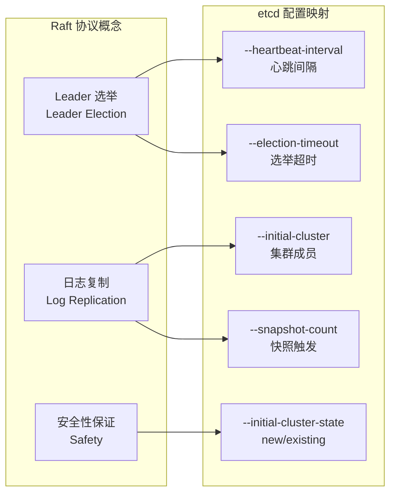
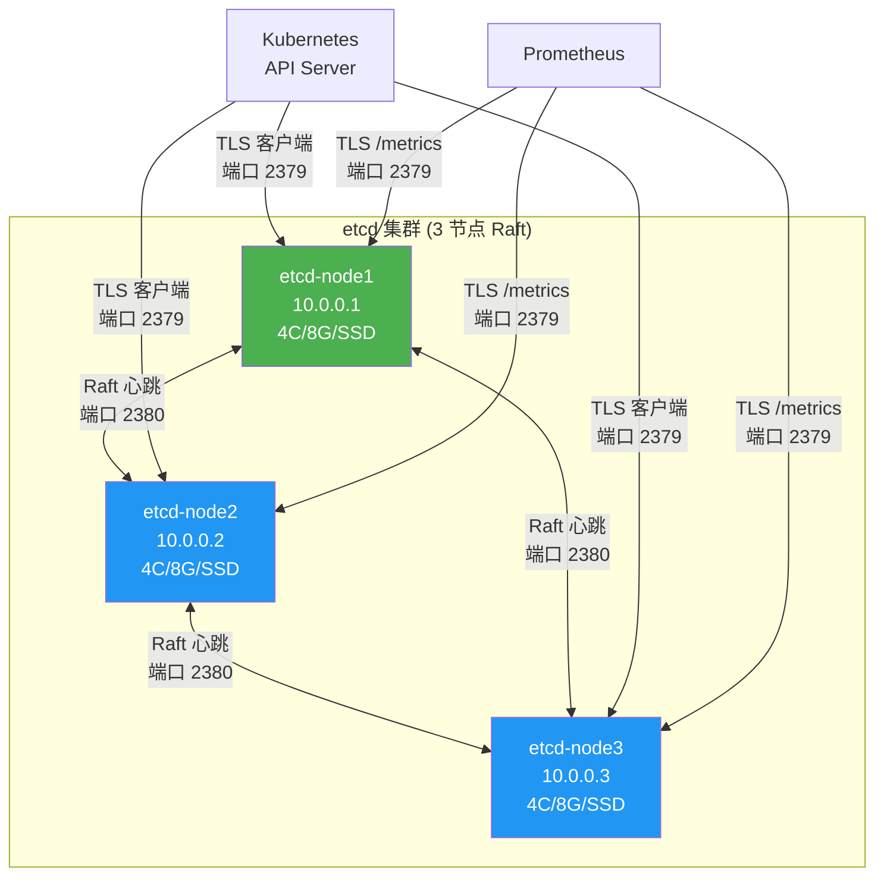
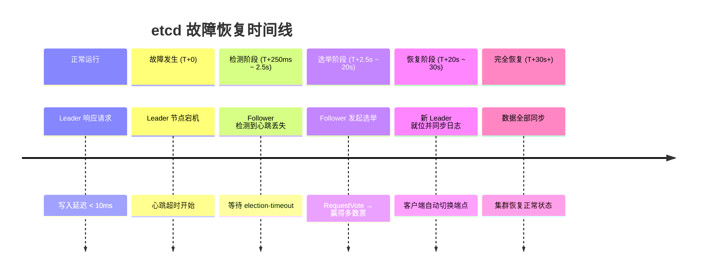

## 案例一：部署高可用 etcd 集群

etcd 是 Kubernetes 的核心数据存储，承担着集群全部配置、服务发现和状态信息的持久化。一旦 etcd 不可用，整个 K8s 集群将失去控制面能力——无法调度新的 Pod、无法更新 Deployment、甚至无法查询集群状态。因此，部署一个高可用的 etcd 集群不是可选项，而是生产环境的硬性要求。

本案例将从零开始，在三台独立服务器上部署一个生产级 etcd 集群，覆盖架构设计、证书配置、集群部署、故障恢复、备份恢复、监控告警、安全加固的完整生命周期。

### 1. 案例目标与指标

| 指标 | 要求 | 说明 |
|------|------|------|
| 可用性 | 单节点故障自动恢复，RTO < 30s | Raft 协议自动选举新 Leader |
| 吞吐量 | ≥ 1000 QPS 读写 | 支撑中等规模 K8s 集群（≤500 节点） |
| 数据持久化 | 快照备份 + WAL 日志 | 支持从备份恢复到任意时间点 |
| 安全性 | TLS 双向认证 + RBAC | 客户端、节点间通信全加密，细粒度权限控制 |
| 一致性 | 线性读（Linearizable Read） | 所有读操作经过 Leader 确认，保证最新数据 |

### 2. 从 Raft 到部署：理论落地

在前面的理论章节中，我们详细学习了 Raft 协议的选举机制、日志复制和安全性保证。本案例将这些概念映射到真实的 etcd 部署参数中，帮助你理解每一个配置项背后的协议原理。

#### 2.1 Raft 选举在 etcd 中的体现



**心跳与选举超时的数学关系：**

Raft 协议要求 `election-timeout > 10 × heartbeat-interval`。这是因为：

- Follower 在收到心跳后重置选举计时器
- 如果心跳间隔为 T，Follower 最多等待 10T 后发起选举
- 这个比例确保了在正常网络条件下，Follower 不会因偶尔的网络抖动而误判 Leader 失联

| 部署场景 | heartbeat-interval | election-timeout | 说明 |
|----------|--------------------|--------------------|------|
| 同机房（延迟 < 1ms） | 100ms | 1000ms | 默认值，适合单可用区 |
| 跨可用区（延迟 1-5ms） | 250ms | 2500ms | 推荐，避免网络延迟引发误选举 |
| 跨地域（延迟 5-50ms） | 500ms | 5000ms | 谨慎使用，写入延迟显著增加 |

#### 2.2 日志复制与快照

etcd 使用 Raft 的日志复制机制来保证多节点数据一致性。每次客户端写入都会经历以下流程：

1. **Leader 接收请求**：客户端连接任意节点，写请求被转发到 Leader
2. **追加到本地 WAL**：Leader 将操作写入本地 Write-Ahead Log
3. **日志复制到多数派**：Leader 将日志条目发送给所有 Follower
4. **等待多数确认**：Leader 等待 ⌈n/2⌉ 个节点（含自身）确认收到
5. **提交并应用**：达到多数派后，Leader 提交该条目并应用到状态机
6. **响应客户端**：通知客户端写入成功

当 WAL 日志累积到 `snapshot-count` 触发的阈值时，etcd 会创建数据库快照，之后截断已提交的日志前缀。这既节省磁盘空间，也加速节点恢复（只需恢复快照 + 少量后续日志）。

### 3. 架构设计

#### 3.1 集群拓扑



**关键设计决策：**

- **3 节点而非 5 节点**：Raft 协议容忍 ⌊(n-1)/2⌋ 个节点故障。3 节点允许 1 节点故障，满足大多数场景；5 节点可容忍 2 节点故障但写入延迟更高（需多数节点确认，即至少 3 个节点写入成功才返回）。选择原则：除非对可用性有极端要求，否则 3 节点是最优的性价比方案
- **独立机器而非容器**：etcd 对磁盘 IO 极度敏感（WAL 同步是写入瓶颈），容器化部署面临存储抽象层的性能损耗。如果必须容器化，使用 hostPath 挂载并保证 SSD 直通
- **跨可用区部署**：生产环境中 3 个节点应分布在不同的物理机架或可用区，避免单点机架故障（断电、交换机故障）导致集群不可用

#### 3.2 端口规划

| 端口 | 协议 | 用途 | 安全要求 |
|------|------|------|----------|
| 2379 | TCP | 客户端通信：K8s API Server、etcdctl、应用读写 | TLS 双向认证，仅允许内网访问 |
| 2380 | TCP | 节点间通信：Raft 心跳、日志复制、选举投票 | TLS 双向认证，仅集群节点间互通 |
| 2381 | TCP | etcd 管理端口（部分版本） | 可选，内网访问 |

#### 3.3 资源规划

etcd 的性能瓶颈主要在磁盘 IO，而非 CPU 或内存。以下是经过生产验证的资源配比建议：

| 集群规模 | 节点数 | CPU | 内存 | 磁盘 | 磁盘 IOPS | 网络带宽 |
|----------|--------|-----|------|------|-----------|----------|
| 小型（≤50 节点） | 3 | 2C | 4GB | 50GB SSD | ≥3000 | ≥1Gbps |
| 中型（50-200 节点） | 3 | 4C | 8GB | 100GB SSD | ≥5000 | ≥1Gbps |
| 大型（200-1000 节点） | 3-5 | 8C | 16GB | 200GB SSD | ≥10000 | ≥10Gbps |
| 超大规模（>1000 节点） | 5-7 | 16C | 32GB | 500GB NVMe | ≥20000 | ≥10Gbps |

**为什么磁盘 IOPS 是关键？** etcd 的每次写入都需要将 WAL 持久化到磁盘（fsync 操作），这个操作的延迟直接决定了写入吞吐。机械硬盘（HDD）的随机写 IOPS 通常在 100-200，而 SSD 可达 5000+，差距约 25-50 倍。

#### 3.4 存储参数

etcd 默认数据库上限为 2GB，生产建议配置为 8GB 并设置自动压缩：

| 参数 | 值 | 说明 |
|------|----|------|
| `quota-backend-bytes` | 8589934592 (8GB) | 数据库存储上限 |
| `auto-compaction-retention` | 1 | 每 1 小时自动压缩历史版本 |
| `snapshot-count` | 10000 | 每 10000 次事务触发一次快照 |
| `max-request-bytes` | 1572864 (1.5MB) | 单个请求最大大小，默认 1.5MB |

### 4. 前置准备

#### 4.1 硬件与系统要求

```bash
# 以下操作在所有 3 个节点上执行

# 1. 检查系统版本（推荐 Ubuntu 20.04+ / CentOS 7+ / RHEL 8+）
cat /etc/os-release

# 2. 确认磁盘类型（必须是 SSD/NVMe）
sudo hdparm -I /dev/sda | grep "Model"
# 或者使用 lsblk 查看磁盘信息
lsblk -d -o NAME,ROTA,SIZE,MODEL
# ROTA=0 表示 SSD，ROTA=1 表示 HDD（不推荐）

# 3. 关闭 swap（Kubernetes + etcd 的硬性要求）
sudo swapoff -a
sudo sed -i '/ swap / s/^/#/' /etc/fstab

# 4. 设置系统时钟同步（Raft 协议依赖精确时钟）
# 时钟偏移 > 选举超时的 1/10 时可能导致异常选举
sudo chronyc makestep
sudo timedatectl set-ntp true

# 5. 验证时钟同步状态
timedatectl status
# 确认 NTP synchronized: yes

# 6. 调整内核参数（优化网络和文件描述符）
cat >> /etc/sysctl.conf << 'EOF'
# etcd 性能优化
net.core.somaxconn = 65535
net.ipv4.tcp_max_syn_backlog = 65535
net.core.netdev_max_backlog = 65535
fs.file-max = 1000000
vm.max_map_count = 262144
# 防止 OOM killer 误杀 etcd
vm.overcommit_memory = 1
EOF
sudo sysctl -p

# 7. 设置文件描述符上限
cat >> /etc/security/limits.conf << 'EOF'
* soft nofile 65536
* hard nofile 65536
root soft nofile 65536
root hard nofile 65536
EOF

# 8. 检查并关闭防火墙（或精确开放端口）
# Ubuntu/Debian：
sudo ufw allow 2379/tcp
sudo ufw allow 2380/tcp

# CentOS/RHEL：
sudo firewall-cmd --permanent --add-port=2379/tcp
sudo firewall-cmd --permanent --add-port=2380/tcp
sudo firewall-cmd --reload
```

#### 4.2 安装 etcd 二进制

```bash
# 下载 etcd（推荐 v3.5.x 稳定版，当前最新为 v3.5.17）
ETCD_VER=v3.5.17
DOWNLOAD_URL=https://github.com/etcd-io/etcd/releases/download

curl -L ${DOWNLOAD_URL}/${ETCD_VER}/etcd-${ETCD_VER}-linux-amd64.tar.gz \
    -o /tmp/etcd.tar.gz

# 解压并安装二进制文件
tar xzf /tmp/etcd.tar.gz -C /usr/local/bin/ --strip-components=1 \
    etcd-${ETCD_VER}-linux-amd64/etcd \
    etcd-${ETCD_VER}-linux-amd64/etcdctl \
    etcd-${ETCD_VER}-linux-amd64/etcdutl

# 验证安装
etcd --version
etcdctl version
etcdutl version
# 三个命令输出的版本号应完全一致

# 安全：移除下载文件
rm -f /tmp/etcd.tar.gz
```

#### 4.3 创建目录与用户

```bash
# 创建 etcd 系统用户（安全加固，避免以 root 运行）
sudo useradd --no-create-home --shell /bin/false etcd

# 数据目录（etcd 持久化存储）
sudo mkdir -p /var/lib/etcd
sudo chmod 700 /var/lib/etcd
sudo chown etcd:etcd /var/lib/etcd

# TLS 证书目录
sudo mkdir -p /etc/etcd/ssl
sudo chown -R etcd:etcd /etc/etcd/ssl

# WAL 独立目录（可选：放在不同磁盘上以减少 IO 竞争）
sudo mkdir -p /var/lib/etcd/wal
sudo chown etcd:etcd /var/lib/etcd/wal

# 备份目录
sudo mkdir -p /backup/etcd

# 日志目录
sudo mkdir -p /var/log/etcd
sudo chown etcd:etcd /var/log/etcd
```

### 5. TLS 证书配置

生产环境中，etcd 必须启用 TLS 加密。未加密的 etcd 等同于把集群的所有秘密数据（包括 K8s Secrets 中的密码和密钥）放在公网上。

#### 5.1 证书体系设计

etcd 需要三套证书：

| 证书类型 | 用途 | 签发对象 |
|----------|------|----------|
| CA 证书 | 根证书，用于签发和验证其他证书 | 自签名根证书 |
| 服务端证书 | 节点间通信 + 客户端连接 | 需包含所有节点 IP 的 SAN |
| 客户端证书 | etcdctl、K8s API Server 等客户端认证 | CN=etcd-client |

#### 5.2 生成证书（在任一节点执行）

```bash
# 在 node1 上生成，然后分发到所有节点
cd /etc/etcd/ssl

# ========== 生成 CA 证书 ==========
openssl genrsa -out ca.key 2048
openssl req -x509 -new -nodes -key ca.key -sha256 -days 3650 \
    -out ca.crt -subj "/CN=etcd-ca"
# 说明：-days 3650 为 10 年有效期。生产环境建议 3-5 年并配合自动化轮转

# ========== 生成服务端证书 ==========
cat > server.cnf << 'EOF'
[req]
req_extensions = v3_req
distinguished_name = req_distinguished_name
[req_distinguished_name]
[v3_req]
basicConstraints = CA:FALSE
keyUsage = digitalSignature, keyEncipherment
extendedKeyUsage = serverAuth
subjectAltName = @alt_names
[alt_names]
IP.1 = 10.0.0.1
IP.2 = 10.0.0.2
IP.3 = 10.0.0.3
IP.4 = 127.0.0.1
DNS.1 = localhost
DNS.2 = etcd-cluster.local
EOF
# 重要：SAN 必须包含所有节点的 IP 地址，否则节点间通信会报证书错误

openssl genrsa -out server.key 2048
openssl req -new -key server.key -out server.csr \
    -subj "/CN=etcd-server" -config server.cnf
openssl x509 -req -in server.csr -CA ca.crt -CAkey ca.key -CAcreateserial \
    -out server.crt -days 3650 -sha256 \
    -extensions v3_req -extfile server.cnf

# ========== 生成客户端证书 ==========
cat > client.cnf << 'EOF'
[req]
req_extensions = v3_req
distinguished_name = req_distinguished_name
[req_distinguished_name]
[v3_req]
basicConstraints = CA:FALSE
keyUsage = digitalSignature, keyEncipherment
extendedKeyUsage = clientAuth
EOF

openssl genrsa -out client.key 2048
openssl req -new -key client.key -out client.csr \
    -subj "/CN=etcd-client" -config client.cnf
openssl x509 -req -in client.csr -CA ca.crt -CAkey ca.key -CAcreateserial \
    -out client.crt -days 3650 -sha256 \
    -extensions v3_req -extfile client.cnf

# ========== 验证证书链 ==========
echo "--- CA 证书信息 ---"
openssl x509 -in ca.crt -text -noout | grep -A2 "Validity"

echo "--- 服务端证书验证 ---"
openssl verify -CAfile ca.crt server.crt
# 预期输出：server.crt: OK

echo "--- 客户端证书验证 ---"
openssl verify -CAfile ca.crt client.crt
# 预期输出：client.crt: OK

echo "--- 服务端证书 SAN ---"
openssl x509 -in server.crt -text -noout | grep -A1 "Subject Alternative Name"
# 应包含所有 3 个节点的 IP 地址
```

#### 5.3 分发证书到所有节点

```bash
# 从 node1 分发到 node2 和 node3
for NODE in 10.0.0.2 10.0.0.3; do
    echo "Distributing certificates to ${NODE}..."
    ssh root@${NODE} "mkdir -p /etc/etcd/ssl &amp;&amp; chown etcd:etcd /etc/etcd/ssl"
    scp ca.crt server.crt server.key client.crt client.key \
        root@${NODE}:/etc/etcd/ssl/
    ssh root@${NODE} "chmod 600 /etc/etcd/ssl/*.key &amp;&amp; chown etcd:etcd /etc/etcd/ssl/*"
    echo "Done: ${NODE}"
done

# 验证所有节点证书一致
for NODE in 10.0.0.1 10.0.0.2 10.0.0.3; do
    echo "=== ${NODE} ==="
    ssh root@${NODE} "openssl x509 -in /etc/etcd/ssl/server.crt -noout -subject -dates"
done
```

### 6. 集群配置与启动

#### 6.1 systemd 服务配置

以下以 node1（10.0.0.1）为例，node2 和 node3 需修改对应的 IP 和 `--name`。

**node1 的 etcd.service：**

```ini
# /etc/systemd/system/etcd.service
[Unit]
Description=etcd - highly-available key-value store
Documentation=https://etcd.org/docs/
After=network-online.target
Wants=network-online.target

[Service]
Type=notify
User=etcd
Group=etcd

ExecStart=/usr/local/bin/etcd \
  --name infra1 \
  --data-dir /var/lib/etcd \
  \
  # --- 客户端通信（TLS） ---
  --listen-client-urls https://10.0.0.1:2379,https://127.0.0.1:2379 \
  --advertise-client-urls https://10.0.0.1:2379 \
  --client-cert-auth \
  --trusted-ca-file /etc/etcd/ssl/ca.crt \
  --cert-file /etc/etcd/ssl/server.crt \
  --key-file /etc/etcd/ssl/server.key \
  \
  # --- 节点间通信（TLS） ---
  --listen-peer-urls https://10.0.0.1:2380 \
  --initial-advertise-peer-urls https://10.0.0.1:2380 \
  --peer-client-cert-auth \
  --peer-trusted-ca-file /etc/etcd/ssl/ca.crt \
  --peer-cert-file /etc/etcd/ssl/server.crt \
  --peer-key-file /etc/etcd/ssl/server.key \
  \
  # --- 集群初始配置 ---
  --initial-cluster infra1=https://10.0.0.1:2380,infra2=https://10.0.0.2:2380,infra3=https://10.0.0.3:2380 \
  --initial-cluster-token etcd-cluster-prod-01 \
  --initial-cluster-state new \
  \
  # --- 性能与存储 ---
  --quota-backend-bytes 8589934592 \
  --auto-compaction-retention 1 \
  --snapshot-count 10000 \
  --max-request-bytes 1572864 \
  \
  # --- Raft 参数（跨可用区优化） ---
  --heartbeat-interval 250 \
  --election-timeout 2500 \
  \
  # --- 日志 ---
  --log-level info \
  --logger zap \
  --log-outputs stderr

Restart=always
RestartSec=5
LimitNOFILE=65536
LimitNPROC=65536

# 安全加固
NoNewPrivileges=true
ProtectSystem=strict
ProtectHome=true
ReadWritePaths=/var/lib/etcd /var/log/etcd /etc/etcd/ssl

[Install]
WantedBy=multi-user.target
```

**node2 和 node3 的差异点：**

```bash
# === node2 的 etcd.service 差异 ===
--name infra2
--listen-client-urls https://10.0.0.2:2379,https://127.0.0.1:2379
--advertise-client-urls https://10.0.0.2:2379
--listen-peer-urls https://10.0.0.2:2380
--initial-advertise-peer-urls https://10.0.0.2:2380
# --initial-cluster 和 --initial-cluster-token 保持完全一致

# === node3 的 etcd.service 差异 ===
--name infra3
--listen-client-urls https://10.0.0.3:2379,https://127.0.0.1:2379
--advertise-client-urls https://10.0.0.3:2379
--listen-peer-urls https://10.0.0.3:2380
--initial-advertise-peer-urls https://10.0.0.3:2380
```

#### 6.2 启动集群

```bash
# 在所有 3 个节点上执行
sudo systemctl daemon-reload
sudo systemctl enable etcd
sudo systemctl start etcd

# 检查启动状态
sudo systemctl status etcd
# 状态应为 active (running)

# 查看日志确认无错误
sudo journalctl -u etcd -f --no-pager | head -50
```

**启动时的正常日志模式：**

# 以下日志表示集群正在正常组建：
# "starting member <ID>" — 节点加入集群
# "established a TCP streaming connection with peer <ID>" — 节点间通信建立
# "raft.node: <ID> elected leader <ID> at term X" — Leader 选举完成
# "ready to serve client requests" — 集群就绪，可以接受读写请求

#### 6.3 设置 etcdctl 环境变量

```bash
# 写入 /etc/profile.d/etcd.sh 使所有 shell 可用
cat > /etc/profile.d/etcd.sh << 'EOF'
export ETCDCTL_API=3
export ETCDCTL_ENDPOINTS=https://127.0.0.1:2379
export ETCDCTL_CACERT=/etc/etcd/ssl/ca.crt
export ETCDCTL_CERT=/etc/etcd/ssl/client.crt
export ETCDCTL_KEY=/etc/etcd/ssl/client.key
EOF
source /etc/profile.d/etcd.sh
```

### 7. 集群验证

#### 7.1 检查集群健康状态

```bash
# 验证所有端点健康状态
etcdctl endpoint health --write-out=table

# 查看集群成员列表
etcdctl member list --write-out=table

# 查看 Leader 信息和每个节点的状态
etcdctl endpoint status --write-out=table
```

**预期输出（endpoint status）：**

+---------------------------+------------------+---------+---------+-----------+------------+------------+
|         ENDPOINT          |        ID        | VERSION | DB SIZE | IS LEADER | IS LEARNER | RAFT TERM  |
+---------------------------+------------------+---------+---------+-----------+------------+------------+
| https://10.0.0.1:2379     | 8211f1d0f64f3269 |  3.5.17 |   25 kB |      true |      false |          2 |
| https://10.0.0.2:2379     | 91bc3c398fb3c146 |  3.5.17 |   25 kB |     false |      false |          2 |
| https://10.0.0.3:2379     | fd422379fda50e48 |  3.5.17 |   25 kB |     false |      false |          2 |
+---------------------------+------------------+---------+---------+-----------+------------+------------+

**状态解读：**

| 字段 | 期望值 | 异常情况 | 处理方式 |
|------|--------|----------|----------|
| VERSION | 所有节点相同 | 版本不一致 | 统一版本后重启 |
| IS LEADER | 只有一个 true | 多个 true = 脑裂 | 检查网络分区，重启少数派 |
| RAFT TERM | 所有节点相同 | 不同说明选举进行中 | 等待 30s 后再次检查 |
| DB SIZE | 各节点接近 | 差距 > 10% | 检查 Follower 是否有复制延迟 |

#### 7.2 一致性模型验证

etcd 支持两种读取模式，理解它们的差异对应用设计至关重要：

```bash
# 方式 1：线性读（Linearizable Read，推荐）
# 读请求经 Leader 确认后返回，保证读到最新数据
etcdctl get /test/key-1 --consistency=l
# 默认行为，适合大多数场景

# 方式 2：串行读（Serializable Read）
# 直接从本地 Follower 读取，可能读到旧数据，但延迟更低
etcdctl get /test/key-1 --consistency=s
# 适合对一致性要求不高但对延迟敏感的场景

# 何时用哪种？
# 线性读：读取 K8s Secrets、配置变更后立即验证、金融交易状态查询
# 串行读：监控指标、服务发现列表（容忍短暂过期）
```

#### 7.3 读写功能验证

```bash
# 写入测试数据（1000 个键值对）
for i in $(seq 1 1000); do
    etcdctl put "/test/key-${i}" "value-${i}"
done

# 从不同端点读取验证数据一致性
ERRORS=0
for i in $(seq 1 1000); do
    # 从 node2 读取（验证 Follower 同步）
    VALUE=$(ETCDCTL_ENDPOINTS=https://10.0.0.2:2379 \
        etcdctl get "/test/key-${i}" --print-value-only)
    if [ "$VALUE" != "value-${i}" ]; then
        echo "ERROR: key-${i} mismatch on node2"
        ERRORS=$((ERRORS + 1))
    fi
done

if [ $ERRORS -eq 0 ]; then
    echo "All 1000 keys verified across all nodes"
else
    echo "FAILED: ${ERRORS} keys mismatch"
    exit 1
fi

# 清理测试数据
etcdctl del --prefix /test/
```

#### 7.4 性能基准测试

```bash
# etcd 自带 benchmark 工具（随 etcdctl 一起安装）

# 写入性能测试
etcdctl benchmark put \
    --endpoints=https://10.0.0.1:2379,https://10.0.0.2:2379,https://10.0.0.3:2379 \
    --conns=50 --clients=50 \
    --total=10000 --key-size=8 --val-size=256

# 读取性能测试（线性读）
etcdctl benchmark range \
    --endpoints=https://10.0.0.1:2379,https://10.0.0.2:2379,https://10.0.0.3:2379 \
    --conns=50 --clients=50 \
    --total=10000 --key-size=8 --val-size=256

# 预期结果（SSD 磁盘、跨可用区部署）：
# 写入：1000-3000 writes/s（单次延迟 P99 < 50ms）
# 读取：5000-15000 reads/s（线性读延迟 P99 < 10ms）
# 注意：实际性能取决于网络延迟、磁盘 IOPS、值大小等因素
```

### 8. etcd RBAC 权限控制

默认情况下，拥有客户端证书的用户可以对 etcd 所有数据进行读写。在生产环境中，应该启用 RBAC 来限制不同客户端的访问权限。

#### 8.1 启用认证

```bash
# 开启认证功能（默认关闭）
etcdctl auth enable

# 验证启用状态
etcdctl auth status
# Authentication: true
# AuthRevision: 1
```

#### 8.2 创建用户和角色

```bash
# 创建 root 用户（超级管理员）
etcdctl user add root --new-user-password=<root密码>

# 创建只读用户（用于监控系统）
etcdctl user add monitor --new-user-password=<monitor密码>

# 创建角色
# 只读角色：只能读取 /registry/ 下的数据
etcdctl role add readonly
etcdctl role grant-permission readonly read /registry/

# 读写角色：可以操作 /config/ 下的配置数据
etcdctl role add config-writer
etcdctl role grant-permission config-writer readwrite /config/
etcdctl role grant-permission config-writer read /registry/

# 将角色绑定到用户
etcdctl user grant-role monitor readonly
etcdctl user grant-role app-user config-writer

# 验证权限
etcdctl user list
etcdctl role list
```

#### 8.3 Kubernetes API Server 的 etcd 证书配置

Kubernetes API Server 需要使用 root 用户或具有足够权限的证书连接 etcd。在 K8s 启动参数中配置：

```yaml
# kube-apiserver 启动参数
--etcd-cafile=/etc/kubernetes/pki/etcd/ca.crt
--etcd-certfile=/etc/kubernetes/pki/apiserver-etcd-client.crt
--etcd-keyfile=/etc/kubernetes/pki/apiserver-etcd-client.key
--etcd-servers=https://10.0.0.1:2379,https://10.0.0.2:2379,https://10.0.0.3:2379
```

### 9. 故障恢复测试

这是验证高可用性的关键步骤。在生产环境中，建议在非高峰期进行此测试。

#### 9.1 模拟 Leader 节点故障

```bash
# 1. 确认当前 Leader
etcdctl endpoint status --write-out=table
# 假设 infra1 是 Leader

# 2. 记录故障前的数据
etcdctl put "/fault-test" "pre-failure-value"

# 3. 停止 Leader 节点（模拟宕机）
ssh root@10.0.0.1 "sudo systemctl stop etcd"

# 4. 等待并观察 Leader 切换（预期 5-15 秒）
echo "等待 Leader 选举..."
for i in $(seq 1 30); do
    sleep 1
    LEADER=$(etcdctl endpoint status --write-out=json 2>/dev/null | \
        jq -r '.[] | select(.Status.leader != 0) | .Endpoint' 2>/dev/null)
    if [ -n "$LEADER" ]; then
        echo "新 Leader 已选举: ${LEADER} (${i}s)"
        break
    fi
    echo "等待中... ${i}s"
done

# 5. 验证新集群仍可读写
etcdctl put "/fault-test" "post-failure-value"
etcdctl get "/fault-test"
# 预期返回 "post-failure-value"

# 6. 恢复故障节点
ssh root@10.0.0.1 "sudo systemctl start etcd"

# 7. 等待节点重新加入集群
sleep 15
etcdctl member list --write-out=table
# 预期：所有 3 个节点都是 "started" 状态

# 8. 验证数据一致性
etcdctl get "/fault-test"
# 预期返回 "post-failure-value"

# 9. 清理测试数据
etcdctl del /fault-test
```

#### 9.2 模拟 Follower 节点故障

```bash
# 停止一个 Follower 节点（infra2）
ssh root@10.0.0.2 "sudo systemctl stop etcd"

# 验证集群仍可正常读写
etcdctl put "/follower-test" "cluster-still-working"
etcdctl get "/follower-test"
# 预期：正常返回，集群不受影响

# 恢复节点
ssh root@10.0.0.2 "sudo systemctl start etcd"
sleep 15
etcdctl del /follower-test
```

#### 9.3 模拟网络分区

网络分区是分布式系统中最棘手的故障场景。在 3 节点集群中，如果 Leader 被隔离到少数派一侧，会发生以下事件序列：

```bash
# 1. 确认当前 Leader
etcdctl endpoint status --write-out=table
# 假设 infra1 (10.0.0.1) 是 Leader

# 2. 在 node1 上模拟网络分区（阻断与其他节点的通信）
# 警告：这会导致 node1 上的 etcd 实例无法被其他节点访问
ssh root@10.0.0.1 "sudo iptables -A INPUT -s 10.0.0.2 -j DROP &amp;&amp; \
                    sudo iptables -A INPUT -s 10.0.0.3 -j DROP &amp;&amp; \
                    sudo iptables -A OUTPUT -d 10.0.0.2 -j DROP &amp;&amp; \
                    sudo iptables -A OUTPUT -d 10.0.0.3 -j DROP"

# 3. 等待选举超时（约 2.5s × 10 = 25s）
# node2 和 node3 会检测到 Leader 失联，发起选举
sleep 30

# 4. 从 node2 验证新 Leader
ssh root@10.0.0.2 "ETCDCTL_API=3 etcdctl endpoint status \
    --endpoints=https://10.0.0.2:2379 \
    --cacert=/etc/etcd/ssl/ca.crt \
    --cert=/etc/etcd/ssl/client.crt \
    --key=/etc/etcd/ssl/client.key \
    --write-out=table"
# node2 或 node3 成为新 Leader

# 5. 在新 Leader 上写入数据
ssh root@10.0.0.2 "ETCDCTL_API=3 etcdctl put /partition-test 'majority-writes' \
    --endpoints=https://10.0.0.2:2379 \
    --cacert=/etc/etcd/ssl/ca.crt \
    --cert=/etc/etcd/ssl/client.crt \
    --key=/etc/etcd/ssl/client.key"

# 6. 恢复网络分区
ssh root@10.0.0.1 "sudo iptables -D INPUT -s 10.0.0.2 -j DROP &amp;&amp; \
                    sudo iptables -D INPUT -s 10.0.0.3 -j DROP &amp;&amp; \
                    sudo iptables -D OUTPUT -d 10.0.0.2 -j DROP &amp;&amp; \
                    sudo iptables -D OUTPUT -d 10.0.0.3 -j DROP"

# 7. 等待 node1 重新同步（通常 10-30 秒）
sleep 30
etcdctl get /partition-test
# 预期：node1 上也能读到 "majority-writes"
etcdctl del /partition-test
```

#### 9.4 故障恢复时间线



### 10. 自动备份与恢复

#### 10.1 备份脚本

```bash
#!/bin/bash
# /usr/local/bin/etcd-backup.sh
# etcd 自动备份脚本，建议每天执行

set -euo pipefail

BACKUP_DIR="/backup/etcd"
TIMESTAMP=$(date +%Y%m%d_%H%M%S)
BACKUP_FILE="${BACKUP_DIR}/etcd_snapshot_${TIMESTAMP}.db"
LOG_FILE="/var/log/etcd-backup.log"
MAX_BACKUP_DAYS=7
MAX_BACKUPS=30  # 本地最多保留 30 个备份

mkdir -p ${BACKUP_DIR}

log() {
    echo "[$(date '+%Y-%m-%d %H:%M:%S')] $1" | tee -a ${LOG_FILE}
}

log "========== Starting etcd backup =========="

# 执行快照备份
ETCDCTL_API=3 etcdctl snapshot save ${BACKUP_FILE} \
  --endpoints=https://127.0.0.1:2379 \
  --cacert=/etc/etcd/ssl/ca.crt \
  --cert=/etc/etcd/ssl/client.crt \
  --key=/etc/etcd/ssl/client.key

# 验证备份完整性（这一步不可省略——损坏的备份毫无价值）
log "Verifying backup integrity..."
STATUS_OUTPUT=$(ETCDCTL_API=3 etcdctl snapshot status ${BACKUP_FILE} --write-out=json 2>&amp;1)
if [ $? -ne 0 ]; then
    log "ERROR: Backup verification failed!"
    log "${STATUS_OUTPUT}"
    # 备份失败应该发送告警
    # curl -X POST https://alertmanager/api/v1/alerts -d '[{"labels":{"alertname":"EtcdBackupFailed","severity":"critical"}}]'
    exit 1
fi

DB_SIZE=$(echo "${STATUS_OUTPUT}" | jq -r '.dbSize')
REVISION=$(echo "${STATUS_OUTPUT}" | jq -r '.revision')
log "Backup verified: size=${DB_SIZE}, revision=${REVISION}"

# 检查备份文件大小是否合理
if [ "${DB_SIZE}" -gt 8589934592 ]; then
    log "WARNING: Backup size (${DB_SIZE}) exceeds expected limit"
fi

# 清理超过 MAX_BACKUP_DAYS 天的旧备份
DELETED=$(find ${BACKUP_DIR} -name "*.db" -mtime +${MAX_BACKUP_DAYS} -delete -print | wc -l)
log "Cleaned up ${DELETED} old backup(s) (>${MAX_BACKUP_DAYS} days)"

# 额外保护：确保至少保留最近 N 个备份
TOTAL=$(find ${BACKUP_DIR} -name "*.db" | wc -l)
if [ "${TOTAL}" -gt "${MAX_BACKUPS}" ]; then
    EXCESS=$((TOTAL - MAX_BACKUPS))
    find ${BACKUP_DIR} -name "*.db" -printf '%T+ %p\n' | sort | head -${EXCESS} | awk '{print $2}' | xargs rm -f
    log "Removed ${EXCESS} oldest backups to stay under ${MAX_BACKUPS} limit"
fi

# 远程备份（可选，强烈推荐在生产环境启用）
# 方案 1：AWS S3
# aws s3 cp ${BACKUP_FILE} s3://your-etcd-backup-bucket/etcd/$(hostname)/
# 方案 2：Azure Blob Storage
# az storage blob upload --container-name etcd-backup --file ${BACKUP_FILE}
# 方案 3：MinIO（私有云）
# mc cp ${BACKUP_FILE} myminio/etcd-backup/$(hostname)/

log "Backup completed: ${BACKUP_FILE}"
log "========== Backup finished =========="
```

#### 10.2 配置定时备份

```bash
# 设置执行权限
chmod +x /usr/local/bin/etcd-backup.sh
chown etcd:etcd /usr/local/bin/etcd-backup.sh

# 配置 crontab：每天凌晨 2 点执行
(crontab -l 2>/dev/null; echo "0 2 * * * /usr/local/bin/etcd-backup.sh >> /var/log/etcd-backup.log 2>&amp;1") | crontab -

# 手动执行一次验证
/usr/local/bin/etcd-backup.sh

# 验证备份文件
ls -lh /backup/etcd/
```

#### 10.3 从备份恢复

当整个集群损坏或需要迁移到新集群时，使用以下流程。注意：恢复操作需要在 etcd 服务停止的状态下执行。

```bash
# ========== 恢复流程 ==========

# 1. 在所有新节点上安装相同版本的 etcd
# 版本必须完全一致，否则可能产生兼容性问题

# 2. 在每个节点上分别恢复数据（以 infra1 为例）
etcdutl snapshot restore /backup/etcd/etcd_snapshot_20240101_020000.db \
  --data-dir /var/lib/etcd-restored \
  --name infra1 \
  --initial-cluster "infra1=https://10.0.0.1:2380,infra2=https://10.0.0.2:2380,infra3=https://10.0.0.3:2380" \
  --initial-cluster-token etcd-cluster-prod-02 \
  --initial-advertise-peer-urls https://10.0.0.1:2380

# 3. node2 上执行（注意 --name 和 --initial-advertise-peer-urls 的差异）
etcdutl snapshot restore /backup/etcd/etcd_snapshot_20240101_020000.db \
  --data-dir /var/lib/etcd-restored \
  --name infra2 \
  --initial-cluster "infra1=https://10.0.0.1:2380,infra2=https://10.0.0.2:2380,infra3=https://10.0.0.3:2380" \
  --initial-cluster-token etcd-cluster-prod-02 \
  --initial-advertise-peer-urls https://10.0.0.2:2380

# 4. node3 上执行
etcdutl snapshot restore /backup/etcd/etcd_snapshot_20240101_020000.db \
  --data-dir /var/lib/etcd-restored \
  --name infra3 \
  --initial-cluster "infra1=https://10.0.0.1:2380,infra2=https://10.0.0.2:2380,infra3=https://10.0.0.3:2380" \
  --initial-cluster-token etcd-cluster-prod-02 \
  --initial-advertise-peer-urls https://10.0.0.3:2380

# 5. 修改 etcd.service 中的 --data-dir 为 /var/lib/etcd-restored
# 然后启动所有节点
# systemctl daemon-reload &amp;&amp; systemctl start etcd

# 6. 验证集群状态
etcdctl member list --write-out=table
etcdctl endpoint status --write-out=table
```

**恢复时的关键注意事项：**

| 注意点 | 说明 |
|--------|------|
| 必须停止 etcd 服务 | `snapshot restore` 只能在 etcd 未运行时执行 |
| 必须在所有节点分别恢复 | 每个节点需要不同的 `--name` 和 `--initial-advertise-peer-urls` |
| 保持版本一致 | 恢复用的 etcd 版本必须与备份时相同 |
| 新的 cluster-token | 如果 IP/节点变化，使用新的 token 避免与旧集群混淆 |
| 恢复后检查数据 | 恢复完成后，务必验证关键数据（如 K8s Secrets）是否完整 |

### 11. 滚动升级

etcd 的升级必须逐节点进行，确保集群在任何时刻都有多数节点可用。

```bash
# ========== 滚动升级流程 ==========

# 目标版本（以 v3.5.17 → v3.5.18 为例）
NEW_VERSION=v3.5.18

# 1. 备份当前集群（升级前必须执行！）
/usr/local/bin/etcd-backup.sh

# 2. 在一个 Follower 节点上升级（先升 Follower，最后升 Leader）
# 假设 infra3 是 Follower

# 2a. 停止该节点
ssh root@10.0.0.3 "sudo systemctl stop etcd"

# 2b. 下载新版本
ssh root@10.0.0.3 "
    curl -L https://github.com/etcd-io/etcd/releases/download/${NEW_VERSION}/etcd-${NEW_VERSION}-linux-amd64.tar.gz -o /tmp/etcd-new.tar.gz &amp;&amp; \
    tar xzf /tmp/etcd-new.tar.gz -C /usr/local/bin/ --strip-components=1 \
        etcd-${NEW_VERSION}-linux-amd64/etcd \
        etcd-${NEW_VERSION}-linux-amd64/etcdctl \
        etcd-${NEW_VERSION}-linux-amd64/etcdutl &amp;&amp; \
    rm /tmp/etcd-new.tar.gz
"

# 2c. 启动新版本
ssh root@10.0.0.3 "sudo systemctl start etcd"

# 2d. 验证版本和健康状态
ssh root@10.0.0.3 "etcd --version"
etcdctl endpoint health --write-out=table

# 3. 对下一个 Follower 重复步骤 2

# 4. 最后升级 Leader 节点
# Leader 升级时会自动触发新的选举，短暂影响写入性能
# 建议在低峰期执行
ssh root@10.0.0.1 "sudo systemctl stop etcd"
# ... 下载新版本 ...
ssh root@10.0.0.1 "sudo systemctl start etcd"

# 5. 验证所有节点版本一致
etcdctl endpoint status --write-out=table
# 所有节点的 VERSION 列应显示新版本号

# 6. 完成后进行功能验证
etcdctl put /upgrade-test "success"
etcdctl get /upgrade-test
etcdctl del /upgrade-test
```

### 12. 监控与告警

#### 12.1 关键监控指标

```bash
# etcd 暴露 Prometheus 格式的指标，端点为 /metrics
curl -s --cacert /etc/etcd/ssl/ca.crt \
    --cert /etc/etcd/ssl/client.crt \
    --key /etc/etcd/ssl/client.key \
    https://10.0.0.1:2379/metrics | head -20
```

**必须监控的核心指标：**

| 指标名 | 含义 | 告警阈值 | 严重程度 | 说明 |
|--------|------|----------|----------|------|
| `etcd_server_has_leader` | 是否有 Leader | 0 持续 > 30s | critical | 无 Leader = 集群完全不可用 |
| `etcd_server_leader_changes_seen_total` | Leader 切换次数 | 1h 内 > 5 次 | warning | 频繁切换说明节点或网络不稳定 |
| `etcd_disk_wal_fsync_duration_seconds` | WAL 同步延迟 | P99 > 100ms | warning | 磁盘性能瓶颈，影响写入吞吐 |
| `etcd_disk_backend_commit_duration_seconds` | 后端提交延迟 | P99 > 50ms | warning | 数据库写入瓶颈 |
| `etcd_debugging_mvcc_db_total_size_in_bytes` | 数据库大小 | > 6GB (75%) | warning | 接近配额上限需告警，超限集群将拒绝写入 |
| `etcd_server_proposals_failed_total` | 提案失败数 | 持续增长 | warning | 共识协议异常，可能有网络分区 |
| `etcd_network_peer_round_trip_time_seconds` | 节点间延迟 | P99 > 500ms | warning | 网络质量下降，可能导致误选举 |
| `etcd_server_proposals_applied_total` | 已应用提案数 | 增长停滞 | warning | Leader 可能已失效 |

#### 12.2 Prometheus 告警规则

```yaml
groups:
  - name: etcd
    rules:
      # 集群无 Leader（最严重）
      - alert: EtcdNoLeader
        expr: etcd_server_has_leader == 0
        for: 30s
        labels:
          severity: critical
        annotations:
          summary: "etcd 集群无 Leader"
          description: "etcd 集群已超过 30 秒没有 Leader，K8s 控制面完全不可用"

      # Leader 频繁切换
      - alert: EtcdHighLeaderChanges
        expr: rate(etcd_server_leader_changes_seen_total[1h]) > 5
        labels:
          severity: warning
        annotations:
          summary: "etcd Leader 频繁切换"
          description: "过去 1 小时 Leader 切换超过 5 次，可能存在网络不稳定"

      # WAL 磁盘延迟
      - alert: EtcdDiskLatencyHigh
        expr: histogram_quantile(0.99, rate(etcd_disk_wal_fsync_duration_seconds_bucket[5m])) > 0.1
        labels:
          severity: warning
        annotations:
          summary: "etcd WAL 磁盘延迟过高"
          description: "P99 WAL 同步延迟超过 100ms，检查磁盘性能"

      # 数据库接近配额上限
      - alert: EtcdDatabaseNearQuota
        expr: etcd_debugging_mvcc_db_total_size_in_bytes / etcd_server_quota_backend_bytes > 0.75
        for: 5m
        labels:
          severity: warning
        annotations:
          summary: "etcd 数据库接近配额上限"
          description: "数据库已使用超过 75% 的配额空间，需立即检查压缩策略"

      # 数据库超配额（集群将拒绝写入）
      - alert: EtcdDatabaseQuotaExceeded
        expr: etcd_debugging_mvcc_db_total_size_in_bytes >= etcd_server_quota_backend_bytes
        labels:
          severity: critical
        annotations:
          summary: "etcd 数据库超配额！集群拒绝写入"
          description: "立即执行 etcdctl compact + defrag，或扩容配额"

      # 提案失败
      - alert: EtcdHighProposalsFailed
        expr: rate(etcd_server_proposals_failed_total[5m]) > 0
        for: 2m
        labels:
          severity: warning
        annotations:
          summary: "etcd 提案持续失败"
          description: "可能存在网络分区或 Leader 频繁切换"
```

#### 12.3 Grafana 仪表盘

推荐使用社区维护的 etcd Grafana 仪表盘（Dashboard ID: 3070），包含以下面板：

- **集群概览**：Leader 状态、成员数量、Raft term
- **请求性能**：QPS、延迟分布（P50/P95/P99）、慢请求
- **磁盘性能** WAL fsync 延迟、backend commit 延迟、磁盘 IO 使用率
- **存储状态**：数据库大小、压缩历史、快照触发次数
- **网络质量**：节点间 RTT、发送/接收字节数、失败消息数

### 13. 客户端连接调优

etcd 客户端的连接配置直接影响应用的稳定性和性能。

#### 13.1 Go 客户端（etcd 官方推荐）

```go
clientv3.Config{
    Endpoints:   []string{"https://10.0.0.1:2379", "https://10.0.0.2:2379", "https://10.0.0.3:2379"},
    DialTimeout: 5 * time.Second,

    // TLS 配置
    TLS: tlsConfig,

    // 自动同步集群成员（节点变化时自动发现新端点）
    AutoSyncInterval: 30 * time.Second,

    // Keepalive 配置（防止连接被中间件关闭）
    DialKeepAliveTime:    10 * time.Second,
    DialKeepAliveTimeout: 3 * time.Second,

    // 重试策略
    MaxCallSendMsgSize: 1.5 * 1024 * 1024, // 1.5MB，与 etcd --max-request-bytes 一致
    MaxCallRecvMsgSize: 1.5 * 1024 * 1024,

    // 请求超时
    Context: ctx,
}
```

#### 13.2 常见客户端错误及处理

| 错误 | 原因 | 处理方式 |
|------|------|----------|
| `context deadline exceeded` | 请求超时 | 增加 DialTimeout，检查网络延迟 |
| `connection refused` | 节点宕机 | 使用多端点列表，客户端自动重试 |
| `etcd cluster ID mismatch` | 连接到错误的集群 | 检查 --endpoints 配置 |
| `key not found` | 键不存在 | 检查前缀匹配或使用 Get 选项 |
| `permission denied` | RBAC 权限不足 | 检查用户角色和权限绑定 |

### 14. 高可用进阶：成员管理

#### 14.1 动态添加节点

当需要扩容时（例如从 3 节点扩展到 5 节点）：

```bash
# 1. 在新节点上安装 etcd 并准备 TLS 证书
# 2. 在任意现有节点上添加新成员
etcdctl member add infra4 \
  --peer-urls=https://10.0.0.4:2380

# 输出会显示新的集群配置，记下 --initial-cluster 的值

# 3. 在新节点上使用 existing 模式启动
# 修改 etcd.service：
# --initial-cluster-state existing
# --initial-cluster infra1=https://10.0.0.1:2380,infra2=https://10.0.0.2:2380,infra3=https://10.0.0.3:2380,infra4=https://10.0.0.4:2380

# 4. 启动新节点
sudo systemctl start etcd

# 5. 验证（新节点会作为 Learner 同步数据，之后自动升级为 Voter）
etcdctl member list --write-out=table
```

#### 14.2 移除故障节点

```bash
# 1. 查看成员 ID
etcdctl member list --write-out=table
# 假设要移除 infra4，ID 为 e40cbab2...

# 2. 移除成员
etcdctl member remove e40cbab2...

# 3. 在被移除的节点上停止 etcd 并清理数据
ssh root@10.0.0.4 "
    sudo systemctl stop etcd
    sudo systemctl disable etcd
    sudo rm -rf /var/lib/etcd/*
    sudo rm -f /etc/systemd/system/etcd.service
"

# 4. 验证集群状态（应恢复为指定节点数）
etcdctl member list --write-out=table
```

### 15. 常见问题与排查

#### 15.1 启动失败

| 现象 | 可能原因 | 排查方法 | 修复方式 |
|------|----------|----------|----------|
| `rafthttp: failed to dial` | 节点间网络不通 | `nc -zv 10.0.0.2 2380` 检查连通性 | 检查防火墙规则和安全组 |
| `etcdcluster: couldn't find cluster` | `--initial-cluster` 配置错误 | 对比所有节点的配置是否一致 | 统一配置后重启 |
| `permission denied` | 文件权限问题 | `ls -la /var/lib/etcd` 检查属主 | `chown -R etcd:etcd /var/lib/etcd` |
| `wal: file locked` | WAL 被其他进程锁定 | `lsof /var/lib/etcd/wal` 检查 | 确认无重复启动的 etcd 进程 |
| `certificate` 相关错误 | TLS 证书过期或不匹配 | `openssl x509 -in server.crt -text -noout` | 重新生成并分发证书 |
| `rafthttp: the number of peers (N) is unequal` | 集群成员配置不一致 | `etcdctl member list` | 统一 --initial-cluster 配置 |

#### 15.2 运行时问题

**问题 1：数据库接近配额上限**

```bash
# 检查当前数据库大小
etcdctl endpoint status --write-out=table

# 如果 DB SIZE 接近 8GB，立即执行压缩和碎片整理
# 1. 获取当前 revision
REVISION=$(etcdctl endpoint status --write-out=json | jq '.[0].Status.header.revision')

# 2. 执行压缩（释放旧版本占用的空间）
etcdctl compact ${REVISION}

# 3. 执行碎片整理（重新组织底层存储）
# 注意：碎片整理期间 etcd 会短暂停顿，建议在低峰期执行
etcdctl defrag --endpoints=https://10.0.0.1:2379
etcdctl defrag --endpoints=https://10.0.0.2:2379
etcdctl defrag --endpoints=https://10.0.0.3:2379

# 4. 重新检查数据库大小
etcdctl endpoint status --write-out=table

# 如果压缩后仍然过大，需要调整配额
# 注意：调大配额后不能调小，可能需要迁移集群
```

**问题 2：集群脑裂（网络分区）**

```bash
# etcd 使用 Raft 多数派投票机制防止脑裂
# 在 3 节点集群中，即使出现网络分区，也只有多数派一侧能选举 Leader

# 确认当前状态
etcdctl endpoint status --write-out=table

# 如果节点被网络隔离：
# 1. 确定哪一组节点是多数派（能形成 quorum 的那组）
# 2. 在少数派节点上停止 etcd，避免干扰
# 3. 修复网络分区
# 4. 恢复少数派节点

# 预防措施：
# - 使用独立的 etcd 网络（与业务网络分离）
# - 部署在不同物理机架/可用区
# - 监控节点间延迟
```

**问题 3：Follower 数据落后**

```bash
# 检查各节点 DB SIZE 和 raft index
etcdctl endpoint status --write-out=table

# 如果某个 Follower 的 DB SIZE 明显小于 Leader，说明数据同步滞后
# 原因可能是：
# 1. 网络延迟高 → 检查节点间 RTT
# 2. Follower 磁盘慢 → 检查 IOPS
# 3. Leader 负载过高 → 检查 QPS

# 修复：如果落后太多（>10000 条日志），考虑从 Leader 做快照再恢复该节点
# 1. 在 Leader 上创建快照
etcdctl snapshot save /tmp/leader-snapshot.db

# 2. 停止落后的 Follower
# 3. 用快照恢复该节点的数据目录
# 4. 重新启动该节点
```

**问题 4：时钟偏移导致异常选举**

```bash
# 检查各节点时间差
for NODE in 10.0.0.1 10.0.0.2 10.0.0.3; do
    echo -n "${NODE}: "
    ssh root@${NODE} "date '+%Y-%m-%d %H:%M:%S.%N'"
done

# 如果时钟偏移 > 100ms，可能导致：
# - 频繁的无谓选举
# - 心跳超时误判
# - Leader 不稳定

# 修复：
# 1. 确保所有节点配置 NTP/Chrony 并同步
sudo chronyc sources -v
# 2. 检查 NTP 服务器是否可达
chronyc tracking
```

### 16. 性能调优速查

| 参数 | 默认值 | 生产建议 | 说明 |
|------|--------|----------|------|
| `--heartbeat-interval` | 100ms | 250ms（跨AZ） | 太小导致网络拥塞，太大延迟故障检测 |
| `--election-timeout` | 1000ms | 2500ms（跨AZ） | 必须 ≥ 10 × heartbeat-interval |
| `--snapshot-count` | 100000 | 10000 | 频繁写入场景下降低快照触发阈值 |
| `--auto-compaction-retention` | 0（禁用） | 1（小时） | 自动压缩防止数据库膨胀 |
| `--quota-backend-bytes` | 2GB | 8GB | 配合压缩使用，超限集群拒绝写入 |
| `--max-request-bytes` | 1.5MB | 1.5MB | 单个请求最大值，K8s Secrets 较大时可能需要调大 |

**调优黄金法则：**

1. **先优化磁盘**：升级到 NVMe SSD 比任何参数调优都有效
2. **heartbeat-interval 10 倍法则**：election-timeout 必须 ≥ 10 × heartbeat-interval
3. **不要在高峰期 defrag**：碎片整理期间 etcd 会短暂停顿
4. **监控磁盘延迟**：WAL fsync P99 > 100ms 时，优先解决磁盘问题而非调整参数

### 17. 安全加固清单

| 检查项 | 命令/方法 | 期望结果 | 说明 |
|--------|-----------|----------|------|
| TLS 已启用 | 检查配置中的 `--client-cert-auth` | 值为 true | 防止未授权访问 |
| 非 root 运行 | `ps aux \| grep etcd` | User 为 etcd | 降低提权攻击面 |
| 端口未暴露公网 | `iptables -L -n` 或云安全组 | 仅内网可访问 | 2379/2380 不暴露公网 |
| 数据目录权限 | `ls -la /var/lib/etcd` | 700, 属主 etcd | 防止未授权读取 |
| 自动备份正常 | `ls -lh /backup/etcd/` | 每天有新快照 | 验证备份时效性和完整性 |
| 监控告警就绪 | Prometheus + Grafana | 关键指标有告警 | 至少覆盖 7 个核心指标 |
| 证书未过期 | `openssl x509 -in server.crt -noout -dates` | 距过期 > 30 天 | 提前轮转证书 |
| RBAC 已启用 | `etcdctl auth status` | Authentication: true | 细粒度权限控制 |
| systemd 安全加固 | 检查 service 文件 | NoNewPrivileges=true 等 | 限制 etcd 进程能力 |
| 审计日志 | Prometheus metrics | 有请求审计指标 | 跟踪异常访问模式 |

### 18. 本节小结

本案例完整演示了生产级 etcd 集群的部署全流程，核心要点：

| 维度 | 关键点 |
|------|--------|
| **架构选型** | 3 节点 Raft 集群，跨可用区部署，独立机器 + SSD |
| **理论落地** | Raft 选举/心跳参数与配置项的对应关系 |
| **安全基线** | TLS 双向认证 + RBAC + 非 root 运行 + 防火墙最小化 |
| **性能调优** | 磁盘 IOPS 是关键瓶颈，heartbeat 10 倍法则 |
| **备份策略** | 每日快照 + 7 天轮转 + 异地备份（可选） |
| **监控告警** | 8 个核心指标 + Prometheus 告警规则 + Grafana 仪表盘 |
| **故障恢复** | Leader 故障 RTO < 30s，支持 Leader/Follower 故障、网络分区、时钟偏移场景 |
| **运维能力** | 滚动升级、动态增删节点、客户端连接调优 |

etcd 是 Kubernetes 的心脏，值得投入足够的工程精力来确保它的高可用和安全。一个配置不当的 etcd 集群，比没有 etcd 集群更危险——因为它给人虚假的安全感。
